# GitHub {#sec-github}


```{r}
#| include: false

source("_common.R")
fontawesome::fa_html_dependency()
```


```{r setup, include=FALSE}
knitr::opts_chunk$set(
  echo = TRUE,
  message = FALSE,
  warning = FALSE,
  cache = TRUE,
  fig.width = 10,
  eval.after = 'fig.cap'
)
library(tidyverse)
library(infer)
library(broom)
library(tidymodels)
library(knitr)
library(viridis)
library(patchwork)

library(praise)
set.seed(4747)
```

## Working on assignments with GitHub and Gradescope

Big thanks to Ben Wiedermann at HMC for inspiring the following instructions.

In DS002R, we will use GitHub + Gradescope to access and submit assignments.  Here is the basic structure of how it will work:


1. Get the assignment materials from GitHub.
2. Clone the repository to any machine you are using (the copy of the repo is called a "fork").
3. Work on the assignment and push back to GitHub.
4. Submit the assignment on Gradescope.

<aside>
```{r echo = FALSE, fig.cap="image credit: https://xkcd.com/1597/,", fig.alt = "xkcd comic detailing that Git can be pretty complicated."}
include_graphics("images/git_2x.png")
```
</aside>

The following diagram lays out the process, and the rest of the document provides a more detailed set of instructions.

```{r echo = FALSE, fig.cap="Flowchart of assignment process.", fig.alt = "Flowchart demonstrating that assignments are recieved from Git, processed on your computer (iteratively with GitHub), and submitted to Gradescope."}
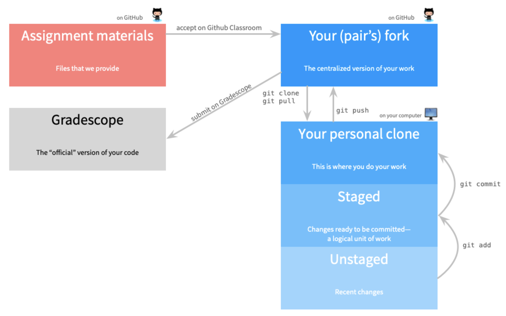
```

# Installing R + Positron + Git {#install}

Most importantly, please become familiar with <a href = "https://happygitwithr.com/" target = "_blank">Happy Git and GitHub with R</a>.  Happy Git with R is an incredibly user friendly resource which includes help for almost every single thing that might happen when getting started.  

<aside>
<a href = "https://happygitwithr.com/" target = "_blank">Happy Git and GitHub with R</a> is your new best friend.
</aside>

1. The first step is to install <a href = "https://r-project.org" target = "_blank">R</a> + <a href = "https://positron.posit.co/download.html" target = "_blank">Positron</a> + <a href = "https://git-scm.com/install/" target = "_blank">Git</a> on your own computer.  (If you are planning to use <a href = "https://rstudio.pomona.edu/" target = "_blank">Pomona's Positron server</a>, then R + Positron + Git are all three already installed for you.)

2. Create an account on GitHub (if you already have one, use it!).

3. Introduce everyone:  R + Positron (should happen automatically); yourself to GitHub (see <a href = "https://happygitwithr.com/" target = "_blank">Happy Git and GitHub with R</a>); Positron + GitHub (see <a href = "https://positron.posit.co/git.html" target = "_blank">Positron Git Version Control</a>).

4. Follow the rest of the steps that Jenny Bryan spells out in <a href = "https://happygitwithr.com/" target = "_blank">Happy Git and GitHub with R</a>.  Most likely, you only need to work through step 12.  Step 15 is detailed below after you have gotten the assignment from GitHub.

```{r echo = FALSE, fig.cap="The more you read Happy Git with R, the better your life will be.", fig.alt = "Screen shot of the Happy Git with R webpage."}
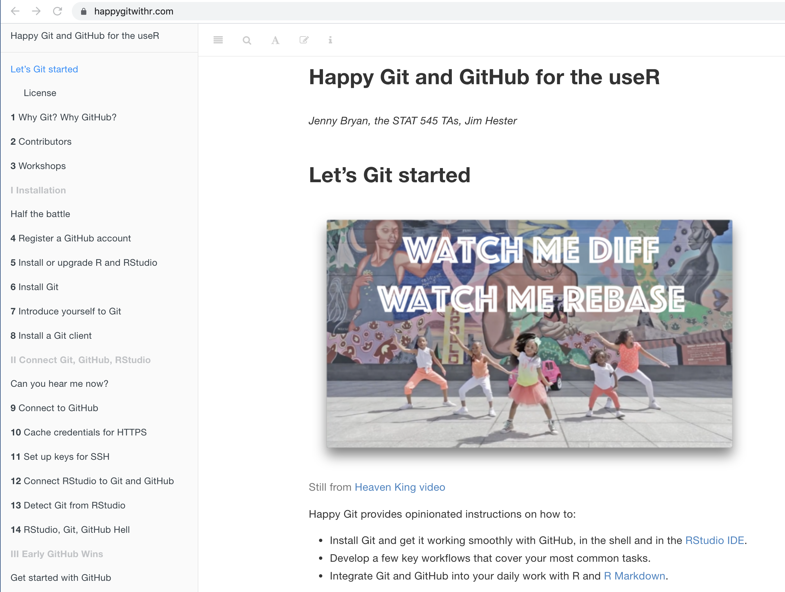
```


<!--See the **fantastic** posit::conf talk by Meghan Harris, <a href = "https://www.youtube.com/watch?v=y2qdvYKKVdc" target = "_blank">"Please Let Me Merge Before I Start Crying": And Other Things I've Said at The Git Terminal</a>.=-->


# Get the assignment materials from GitHub {#getfromgit}


Each assignment will be provided within a separate GitHub repository. You will get to the specific repository via the <a href = "https://github.com/orgs/ST47S-FODS-Fall2026/repositories" target = "_blank">course organization</a>. 


```{r echo = FALSE, fig.cap="The course organization which lists all of the assignment repositories.  Click on the repository associated with the specific week's HW assignment.", fig.alt = "Screen shot of GitHub showing what the course organization will look like for a given student."}
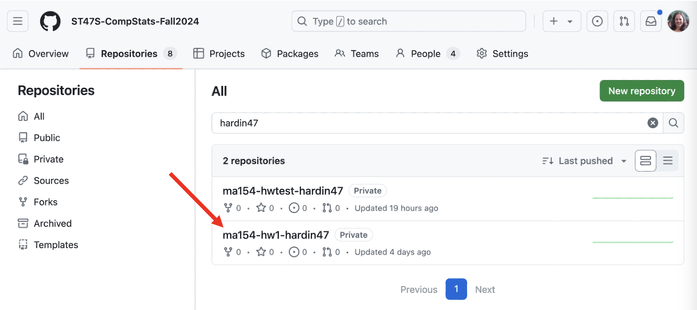
```

The assignment files will be copied as a private repository that you (and your partner(s), if applicable) and the course TAs have access to.  Notice that all of the repos are tagged "private."

We will call this version, that lives on your personal GitHub account, the *GitHub fork*.


# Clone the assignment (or project) repository on to your own computer(s) {#clone}

Once your repository has been created, you should clone the code to whatever computer you are working on.  Just like a Google Doc, you can work on the files from different machines at different times.  Unlike a Google Doc, you'll have to make sure to open the repo (`clone` or `pull` if you've already `clone`d) and save the repo (`commit` + `push`) more deliberately.

<aside>
<a href = "https://happygitwithr.com/" target = "_blank">Happy Git and GitHub with R</a> is your new best friend.
</aside>

1. From the course organization, click on the link for the correct repository.

2. Click the green `Code` button and copy the URL.

```{r echo = FALSE, fig.cap="Copy the HTTPS URL, and use it to create a new project in Positron.", fig.alt = "Screen shot of GitHub showing the location of the repo URL."}
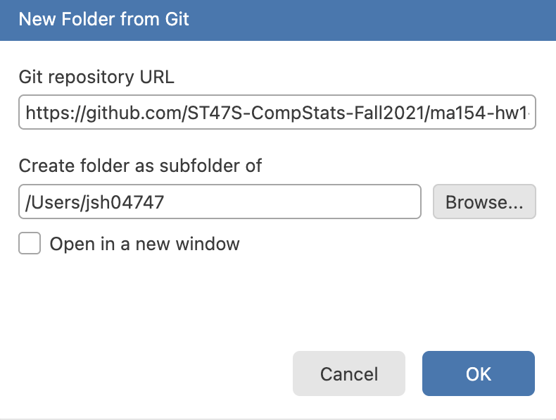
```

3. On the cloning machine (e.g., your own compute or Pomona's Positron server), connect the HW assignment from GitHub to your local workspace.


:::: {.columns} 
::: {.column width="35%"}
```{r, fig.cap = "", fig.alt = "Screen shot of your computer showing how to open a new file from Git.", fig.show='hold', echo=FALSE}
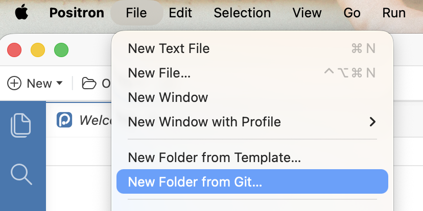
``` 
:::

::: {.column width=65%}
```{r, fig.cap = "",  fig.alt = "Screen shot of your computer showing how to connect Git to Positron.", fig.show='hold', echo=FALSE}
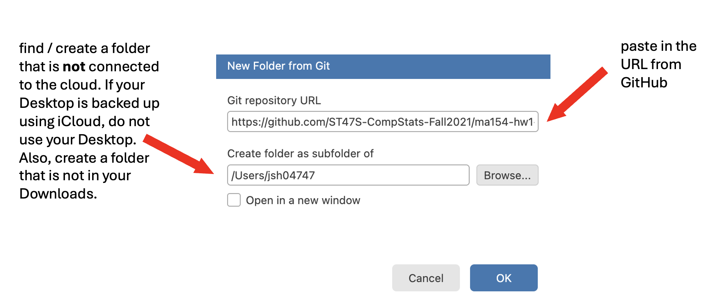
``` 
:::

::::

Using the HTTPS URL, connect the GitHub assignment within Positron.

# Work on the assignment, push back to GitHub {#push}

<aside>
&#9888; Always start your work session with a pull to the computer you are working on, and end your session with a push back to GitHub.
</aside>

All of the GitHub interaction will take place through Positron.  The two important steps for getting the assignment back to GitHub are:

## `pull`

If you are working with a colleague or on different machines it is incredibly important to get in the habit of immediately `pull`ing their work just as you sit down to start your own work.  (If you are working alone on a single machine `pull` won't hurt!  You'll just be told that your files are already up to date.)


```{r echo = FALSE, fig.cap="Always pull before you start. pull-work-save-commit-push", fig.alt = "Screen shot of how to pull using Positron."}
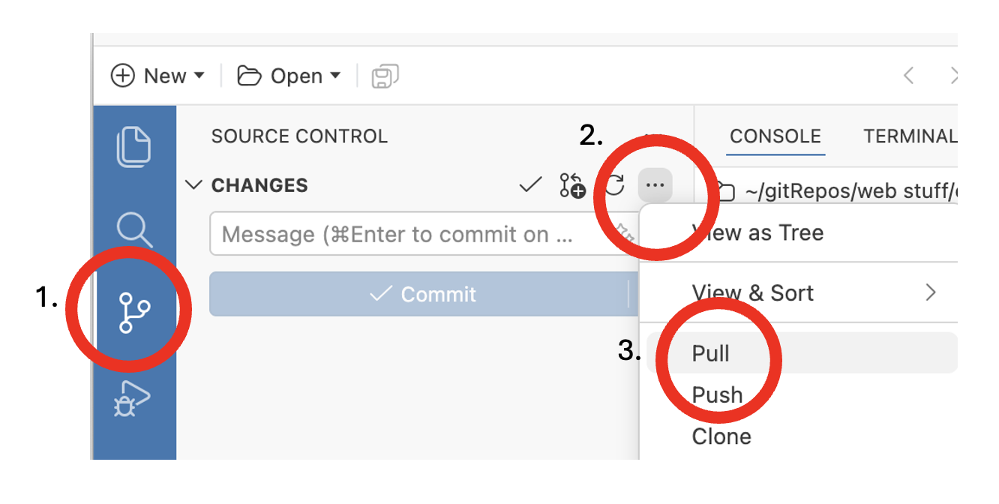
```

## `render` or `preview` your work

Don't forget to put your name on the assignment.  Also, make sure that you create a pdf file by `preview`ing or `render`ing.  Render early and often.  The more often you render, the fewer headaches you will have.

```{r echo = FALSE, fig.cap="workflow: pull-work-render-commit-push", fig.alt = "Screen shot of how to render using Positron."}
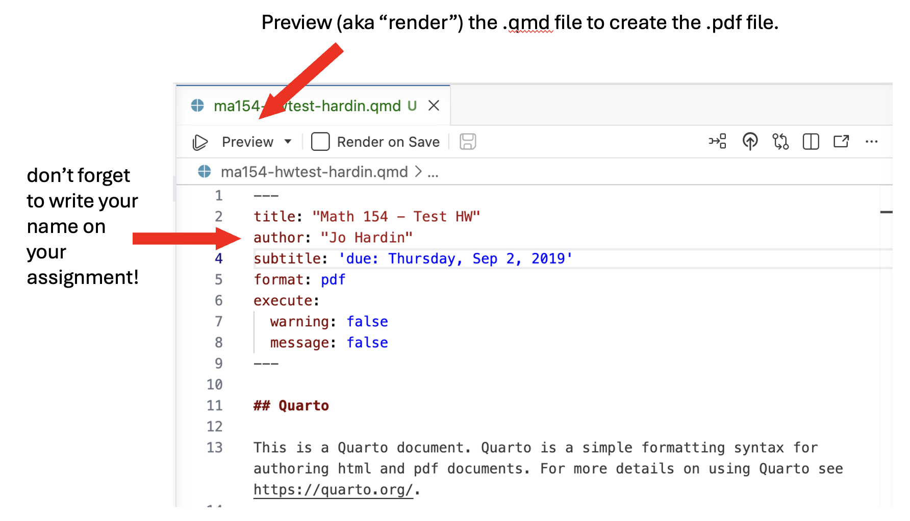
```

## `commit` your work

You don't need to commit every file, but you do need to commit files that are integral to the analysis (always commit the following files: .qmd, .pdf, data files, images that created the pdf, etc.).

:::: {.columns} 

::: {.column width="50%"}
```{r, fig.cap = "", fig.alt = "workflow: pull-work-render-commit-push.", fig.show='hold', echo=FALSE}
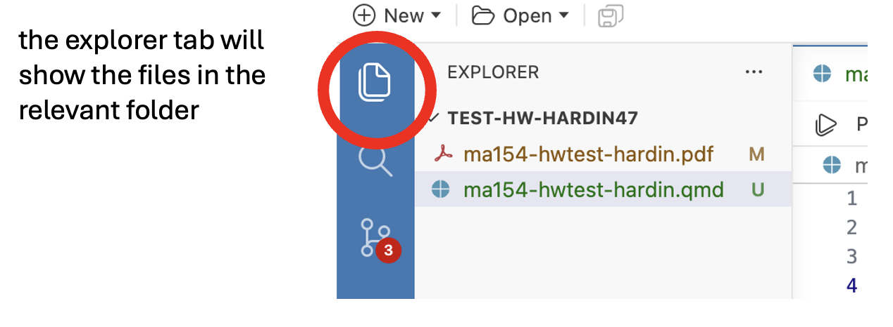
``` 
:::

::: {.column width="50%"}
```{r, fig.cap = "", fig.alt = "workflow: pull-work-render-commit-push.", fig.show='hold', echo=FALSE}
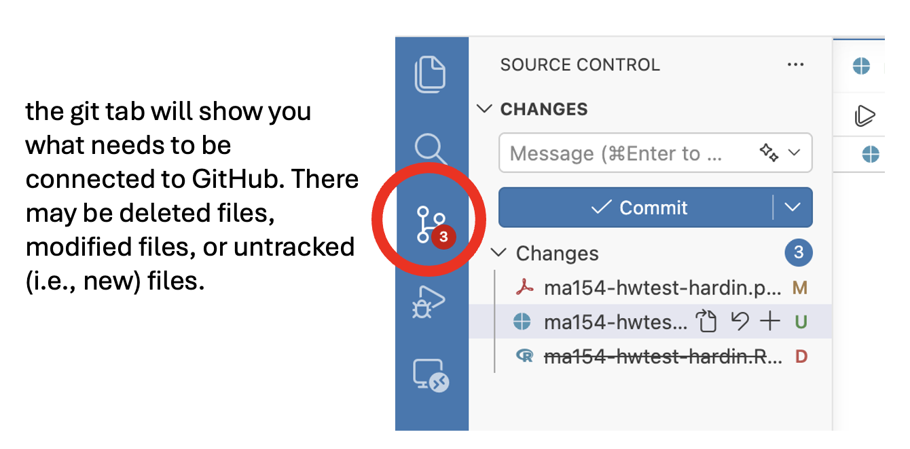
``` 
:::


::::

:::: {.columns}

::: {.column width="40%"}
```{r, fig.cap = "", fig.alt = "workflow: pull-work-render-commit-push.", fig.show='hold', echo=FALSE}
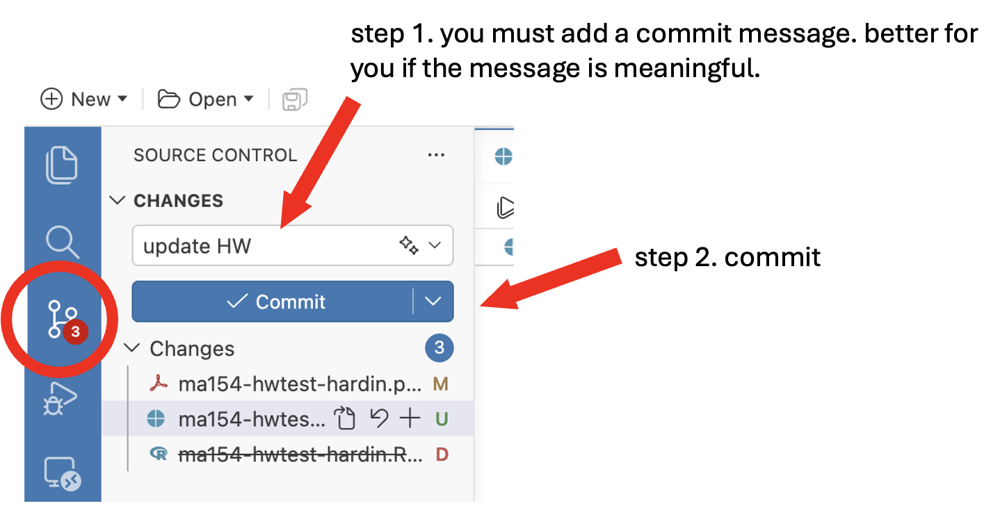
``` 
:::

::: {.column width="40%"}
```{r, fig.cap = "", fig.alt = "workflow: pull-work-render-commit-push.", fig.show='hold', echo=FALSE}
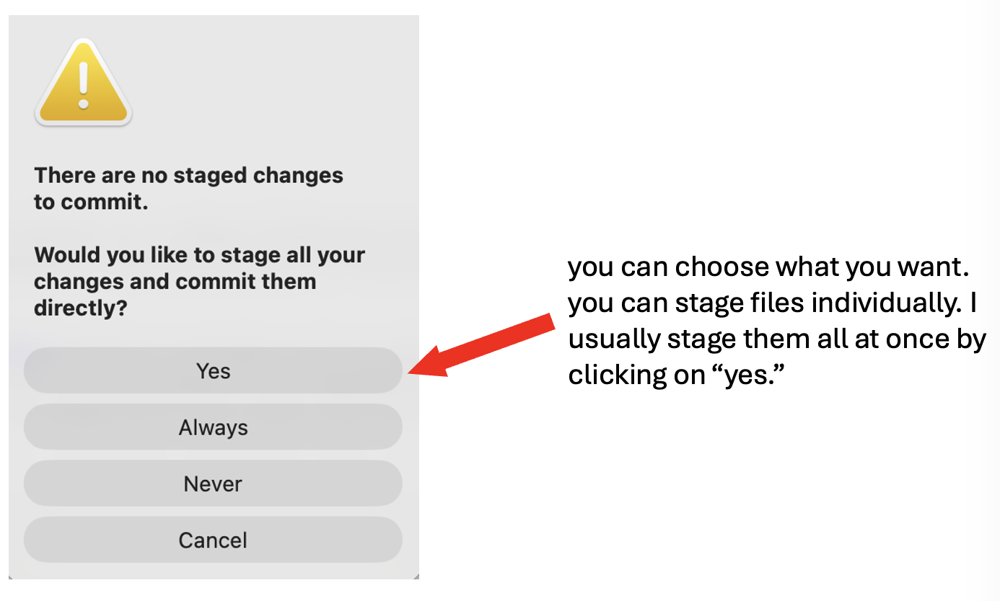
``` 
:::

::::

workflow: pull-work-render-commit-push

## `push` your work to GitHub

It is good practice to use meaningful commit messages to help your future self figure out your past work.

::: {.column width="40%"}
```{r echo = FALSE, fig.cap="workflow: pull-work-render-commit-push", fig.alt = "Screen shot of how to push using Positron."}
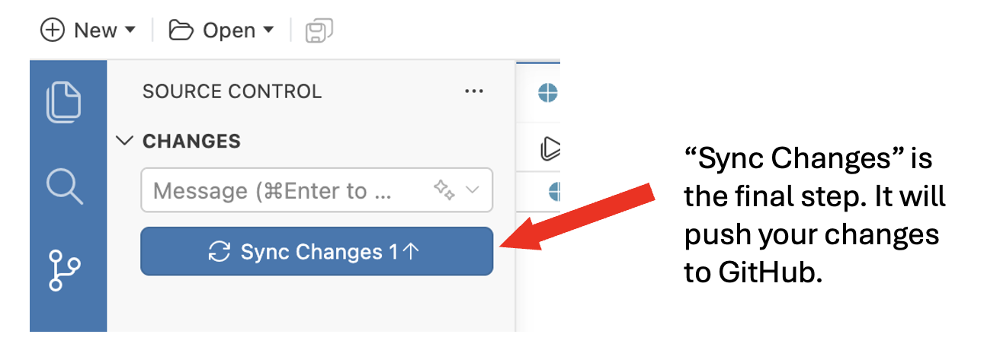
```
:::

::: {.column width="40%"}
```{r, fig.cap = "", fig.alt = "workflow: pull-work-render-commit-push.", fig.show='hold', echo=FALSE}
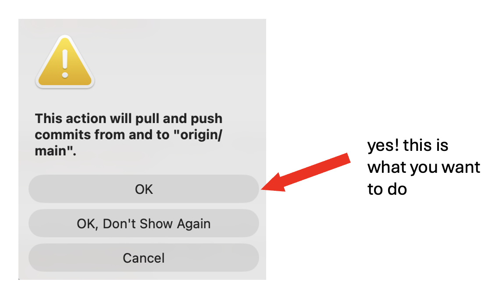
``` 
:::


## check your work on GitHub

To make sure that the work went through, always check your GitHub repo online to confirm any changes you made.

```{r echo = FALSE, fig.cap="Check that your changes are correct.", fig.alt = "Screen shot of checking GitHub changes online."}
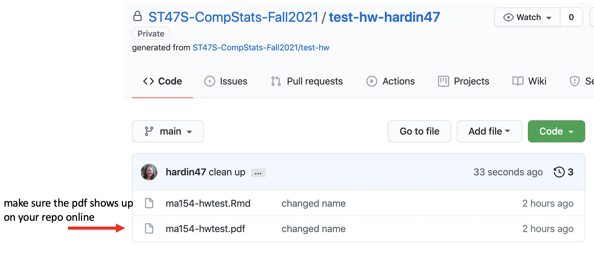
```


# Submit the assignment on Gradescope {#submitgradescope}

You will submit your assignments via Gradescope on Canvas.


## Connecting your GitHub account to Gradescope

The first time you go to submit an assignment on Gradescope, you will be asked to connect to GitHub.  Here are the steps to follow to make that connection:

1. Access Gradescope from Canvas: From Canvas, click on **Gradescope** in the Course Navigation menu.  You will be asked to authorize the Gradescope integration.

2. Navigate to Gradescope.com: In a new tab (same browser), navigate to <a href = https://www.gradescope.com/ target = "_blank">https://www.gradescope.com/</a>.  Gradescope should recognize your student user account from the Canvas integration.

3. Go to Gradescope Account Settings: Click on **Account** (bottom left of the screen) and then **Edit Account**.

```{r echo = FALSE, fig.cap="Change your Gradescope account settings.", fig.alt = "Screen shot of Gradescope account changes."}
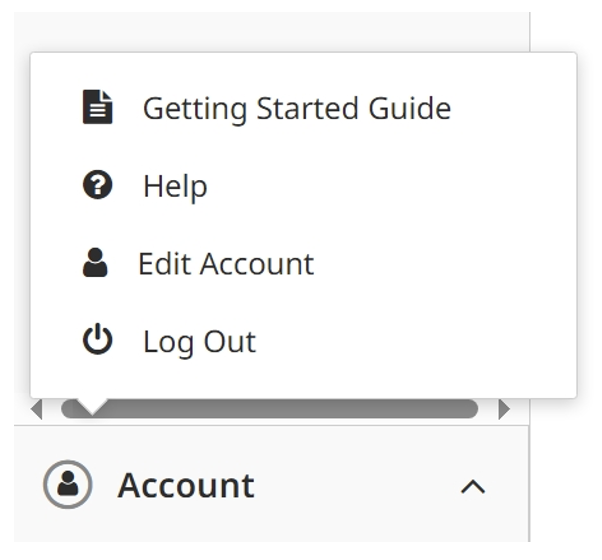
```

This will take you to your **Account Settings** in Gradescope. Here, you’ll have the option to verify your Pomona email address and set up a password.

4. Link Your GitHub Account to Gradescope: Scroll to the bottom of the page to the **Link External Account** menu. Click on **Link a GitHub account**. 


```{r echo = FALSE, fig.cap="Linking GitHub to Gradescope.", fig.alt = "Screen shot of how to link GitHub to Gradescope."}
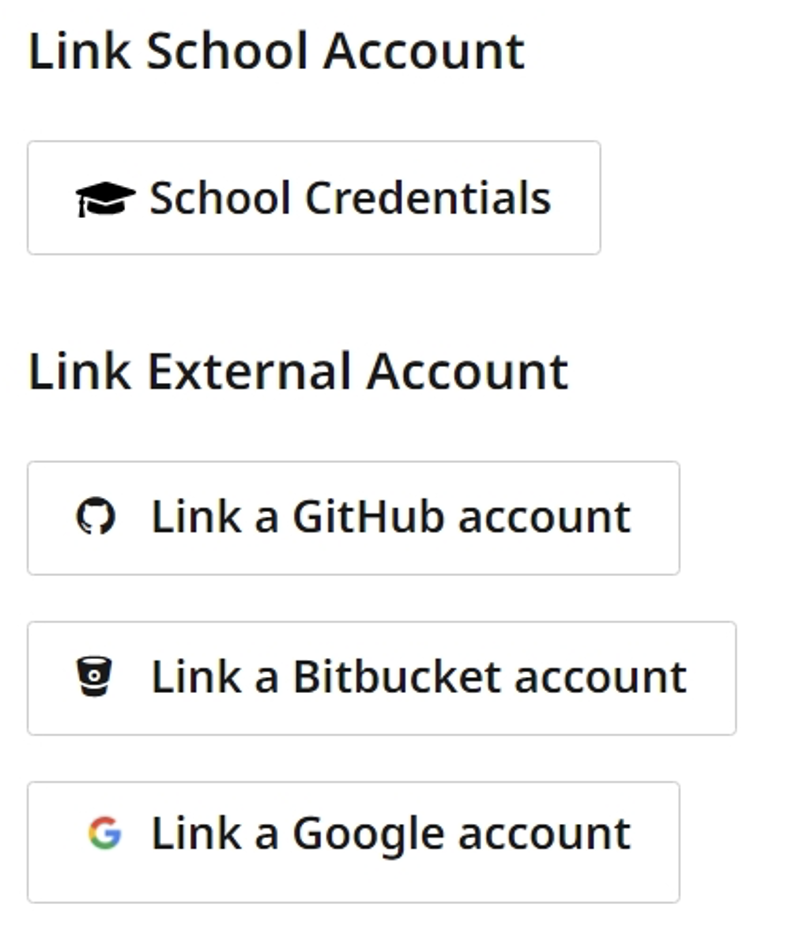
```


You'll be prompted to authorize GitHub and connect it to Gradescope. In the drop-down menu under Repositories, be sure to select "Public and private" to enable full access.

```{r echo = FALSE, fig.cap="Authorizing Gradescope to talk to GitHub.", fig.alt = "Screen shot of authorizing Gradescope to talk to GitHub."}
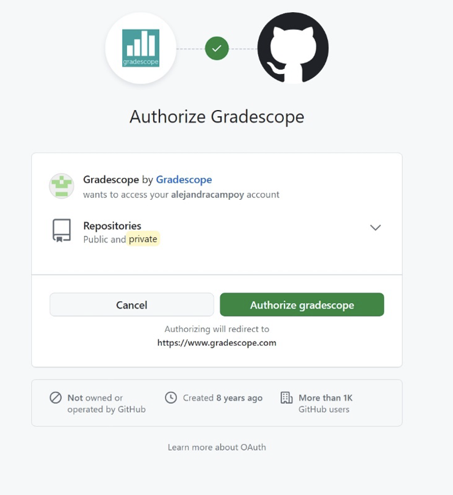
```

When prompted, log in to your GitHub account to complete the process (I don't know if  you need your PAT or your "Go(ubs!" password, try both!).

After your accounts have been linked, you'll see a message that says "Successfully authenticated with GitHub." 


```{r echo = FALSE, fig.cap="Successful integration of GitHub and Gradescope", fig.alt = "Screen shot of successful integration between GitHub and Gradescope."}
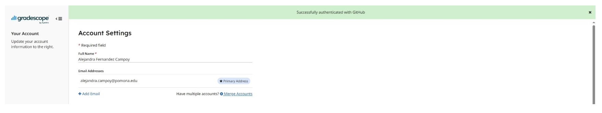
```


5. Return to Canvas & Verify the Connection 

Now, you can return to Canvas and navigate back to Gradescope. If you are returning to your previous tab, you may need to refresh the page to make sure your account settings are updated. 

Click on your programming assignment in Gradescope. Verify that the GitHub connection is working, and that you can see a list of your GitHub files in the drop-down menu when you are submitting an assignment.  

```{r echo = FALSE, fig.cap="Submitting HW from GitHub to Gradescope.", fig.alt = "Screen shot of submitting HW from GitHub to Gradescope."}
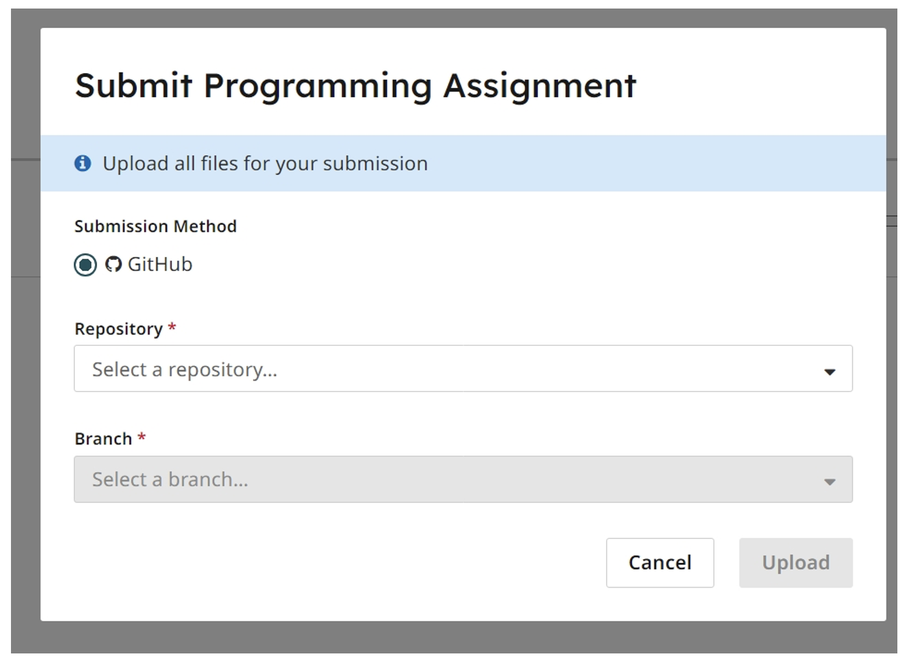
```

::: {.callout-important}
If you see a blank window when you click on Gradescope within Canvas, that means you need to enable third-party cookies in your browser. Since Gradescope is a third party integration in Canvas, cookies need to be enabled for it to work properly.

ITS has instructions for how to enable cookies on a range of different browsers: <a href = "https://community.canvaslms.com/t5/Canvas-Basics-Guide/How-do-I-enable-third-party-cookies-in-my-browser/ta-p/605670" target = "_blank">How do I enable third-party cookies in my browser?</a>
:::


::: {.callout-important}
ITS has also put together a knowledge base article describing <a href = "https://servicedesk.pomona.edu/support/solutions/articles/18000119773-Student-Guide-How-to-submit-GitHub-files-to-a-Gradescope-programming-assignment" target = "_blank">How to submit GitHub files to a Gradescope programming assignment.</a>
:::


## Submitting assignments after having connected to GitHub

To submit your assignment, complete the following steps:

1. Via Canvas, access the course's Gradescope site, select the appropriate assignment, and then choose GitHub as the submission method. 

2. Select the appropriate GitHub repository.  The branch will always be "main".


You can submit multiple times before the deadline. Your last submission will determine your grade.

Once assignments are completely graded, you will be able to see your grade and assignment feedback on Gradescope. Grades will also be synced with Canvas.


## <i class="fas fa-lightbulb"></i> Reflection questions  

* When using GitHub, what is the difference between commit, push, and pull?

* How can you tell whether you've submitted the correct assignment on Canvas?  (LOOK AT THE pdf.)

* What is the difference between the remote GitHub repository and the local R Project copy of a particular file?

* What is **Happy Git with R**?


## <i class="fas fa-balance-scale"></i> Ethics considerations 

* In what ways do each of the following tools help with reproducibility: R, Positron, Quarto, and GitHub?

* When is it appropriate to have a public repository and when is it appropriate to have a private repository? For example, should all data be posted publicly? What about other types of files?

## References
