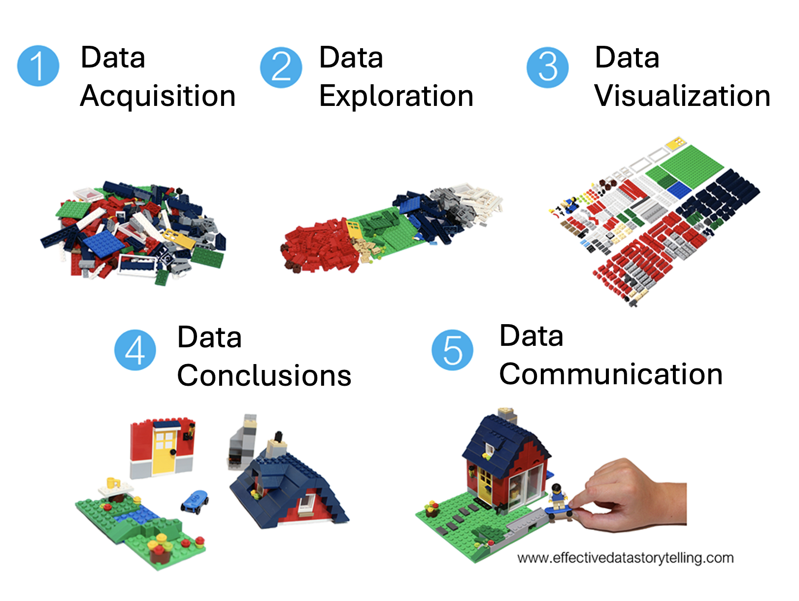
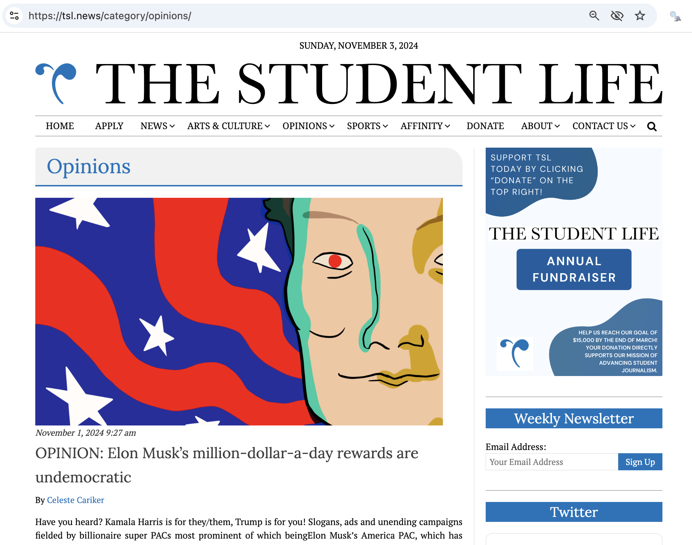
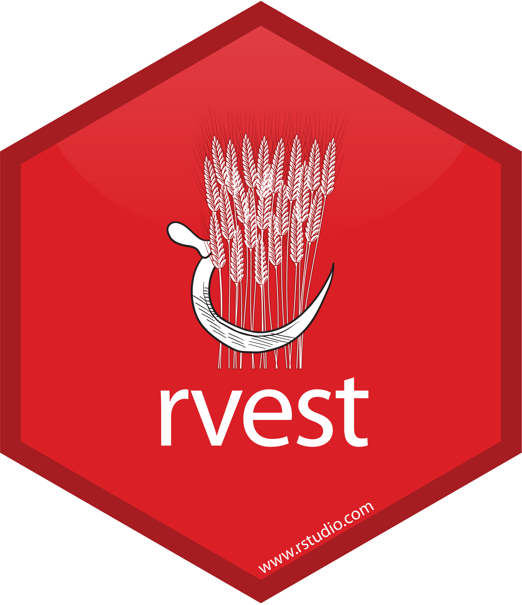
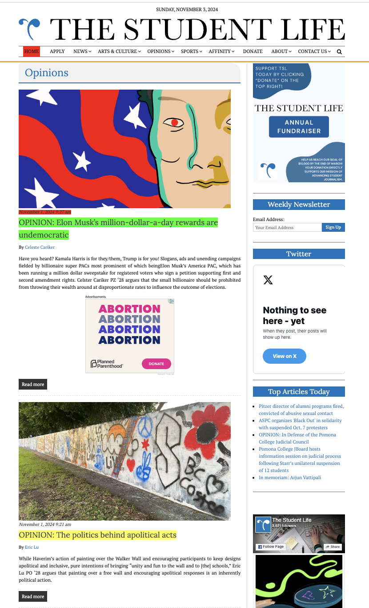
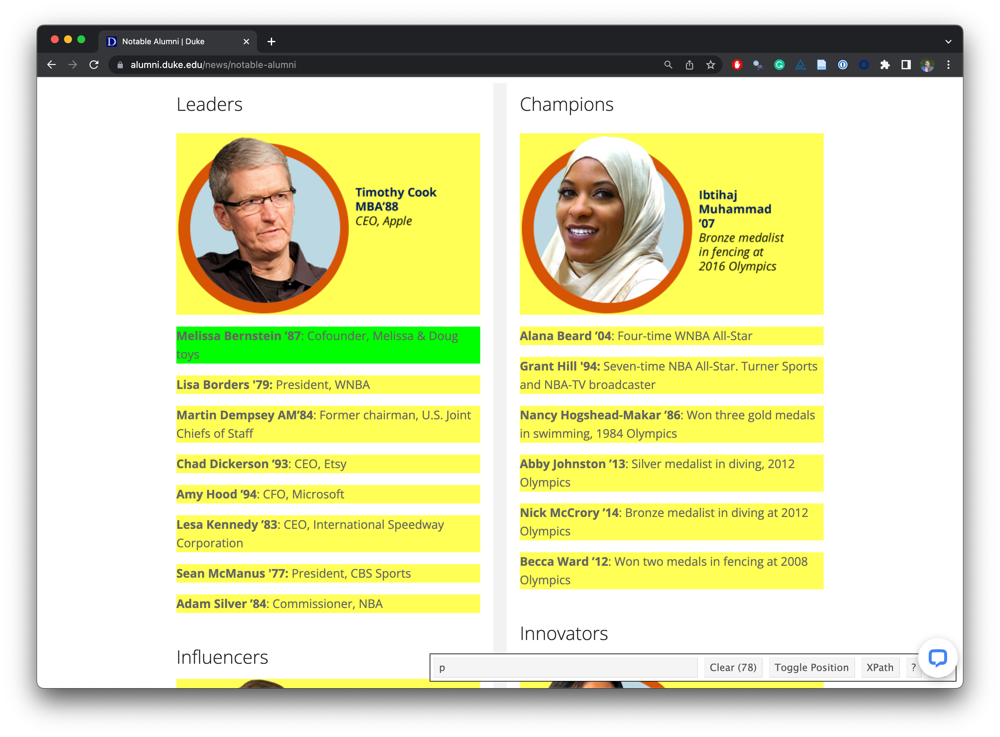
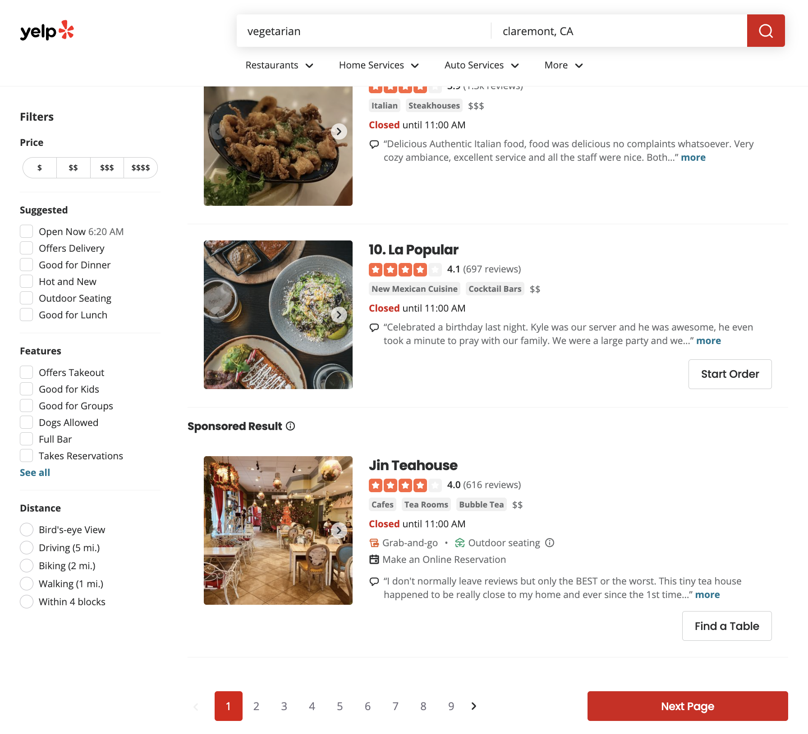

# Web scraping {#sec-web-scraping}


```{r}
#| include: false

source("_common.R")
fontawesome::fa_html_dependency()
```


<!--
## Scraping Data

Need to talk about this!  Scraping from HTML. 

* Example / instructions:  Beginner's Guide on Web Scraping in R (using rvest) with hands-on example
by Saurav Kaushik   https://www.analyticsvidhya.com/blog/2017/03/beginners-guide-on-web-scraping-in-r-using-rvest-with-hands-on-knowledge/
* Mine Dogucu at eCOTS18  https://www.causeweb.org/cause/ecots/ecots18/tech-talk/1
* La Quinta vs. Dennys (Colin Rundel & Mine Çetinkaya-Rundel )  https://github.com/rundel/Dennys_LaQuinta_Chance Webinar about the study:  https://www.rstudio.com/resources/webinars/data-science-case-study/  OR what if you look at Holiday Inn???)
-->

## Getting Started


#### Important tool {-}

Our approach to web scraping relies on the Chrome browser and an extension called a Selector Gadget.  Download them here:

* <a href = "https://www.google.com/chrome/" target = "_blank">Chrome</a>

* <a href = "https://chromewebstore.google.com/detail/selectorgadget/mhjhnkcfbdhnjickkkdbjoemdmbfginb?hl=en&pli=1" target = "_blank">SelectorGadget from Chrome</a>  or <a href = "https://selectorgadget.com/" target = "_blank">SelectorGadget vignette etc.</a>

#### Data Acquisition {-}

```{r, out.width = "800px", echo=FALSE, fig.cap = "Based on [https://www.effectivedatastorytelling.com/post/a-deeper-dive-into-lego-bricks-and-data-stories](https://www.effectivedatastorytelling.com/post/a-deeper-dive-into-lego-bricks-and-data-stories), original source: [https://www.linkedin.com/learning/instructors/bill-shander](https://www.linkedin.com/learning/instructors/bill-shander)"}

```

#### Reading The Student Life {-}

::: question
How often do you read The Student Life?  
   a. Every day  
   b. 3-5 times a week  
   c. Once a week  
   d. Rarely
:::


::: question
What do you think is the most common word in the titles of The Student Life opinion pieces?
:::

#### Analyzing The Student Life {-}

Using the titles of the opinion pieces from The Student Life website, we can figure out the most common words.

```{r}
#| label: load-tsl-data
#| include: false

tsl_opinion_titles <- read_csv("data/tsl.csv")
```

```{r}
#| label: tsl-common-words
#| echo: false
#| message: false
data(stop_words) # from tidytext
tsl_opinion_titles |>
  tidytext::unnest_tokens(word, title) |>
  anti_join(stop_words) |>
  count(word, sort = TRUE) |>
  slice_head(n = 20) |>
  mutate(word = fct_reorder(word, n)) |>
  ggplot(aes(y = word, x = n, fill = log(n))) +
  geom_col(show.legend = FALSE) +
  theme_minimal(base_size = 16) +
  labs(
    x = "Number of mentions",
    y = "Word",
    title = "The Student Life - Opinion pieces",
    subtitle = "Common words in the 500 most recent opinion pieces",
    caption = "Source: Data scraped from The Student Life on Nov 4, 2024"
  ) +
  theme(
    plot.title.position = "plot",
    plot.caption = element_text(color = "gray30")
  )
```


::: question
How do you think the sentiments in opinion pieces in The Student Life compare across authors?  
Roughly the same?  
Wildly different?  
Somewhere in between?  
:::


Using the first paragraph of each opinion article, we can see which others have the most positive and negative sentiment articles.

```{r}
#| label: tsl-sentiments
#| echo: false
#| message: false
#| fig-asp: 0.75
#| fig-width: 7
#| fig-align: center
afinn_sentiments <- get_sentiments("afinn") # need tidytext and textdata
tsl_opinion_titles |>
  tidytext::unnest_tokens(word, first_p) |>
  anti_join(stop_words) |>
  left_join(afinn_sentiments) |>
  group_by(authors, title) |>
  summarize(total_sentiment = sum(value, na.rm = TRUE), .groups = "drop") |>
  group_by(authors) |>
  summarize(
    n_articles = n(),
    avg_sentiment = mean(total_sentiment, na.rm = TRUE),
  ) |>
  filter(n_articles > 1 & !is.na(authors)) |>
  arrange(desc(avg_sentiment)) |>
  slice(c(1:10, 69:78)) |>
  mutate(
    authors = fct_reorder(authors, avg_sentiment),
    neg_pos = if_else(avg_sentiment < 0, "neg", "pos"),
    label_position = if_else(neg_pos == "neg", 0.25, -0.25)
  ) |>
  ggplot(aes(y = authors, x = avg_sentiment)) +
  geom_col(aes(fill = neg_pos), show.legend = FALSE) +
  geom_text(
    aes(x = label_position, label = authors, color = neg_pos),
    hjust = c(rep(1, 10), rep(0, 10)),
    show.legend = FALSE,
    fontface = "bold"
  ) +
  geom_text(
    aes(label = round(avg_sentiment, 1)),
    hjust = c(rep(1.25, 10), rep(-0.25, 10)),
    color = "white",
    fontface = "bold"
  ) +
  scale_fill_manual(values = c("neg" = "#4d4009", "pos" = "#FF4B91")) +
  scale_color_manual(values = c("neg" = "#4d4009", "pos" = "#FF4B91")) +
  scale_x_continuous(breaks = -5:5, minor_breaks = NULL) +
  scale_y_discrete(breaks = NULL) +
  coord_cartesian(xlim = c(-5, 5)) +
  labs(
    x = "negative  ←     Average sentiment score (AFINN)     →  positive",
    y = NULL,
    title = "The Student Life - Opinion pieces\nAverage sentiment scores of first paragraph by author",
    subtitle = "Top 10 average positive and negative scores",
    caption = "Source: Data scraped from The Student Life on Nov 4, 2024"
  ) +
  theme_void(base_size = 16) +
  theme(
    plot.title = element_text(hjust = 0.5),
    plot.subtitle = element_text(
      hjust = 0.5,
      margin = unit(c(0.5, 0, 1, 0), "lines")
    ),
    axis.text.y = element_blank(),
    plot.caption = element_text(color = "gray30")
  )
```

#### All of the analysis is done in R! {.centered}  {-}

::: hand
(mostly) with tools you already know!
:::

#### Common words in The Student Life titles {.smaller} {-}

Code for the earlier plot:

```{r}
#| ref.label: tsl-common-words
#| fig-show: hide
#| message: false
```

#### Avg sentiment scores of first paragraph {.smaller} {-}

Code for the earlier plot:

```{r}
#| ref.label: tsl-sentiments
#| fig-show: hide
#| message: false
```

## Where is the data coming from? {.smaller}

::: center
<https://tsl.news/category/opinions/>
:::

[{fig-align="center" width="800"}](https://tsl.news/category/opinions/?page=1&per_page=500)


```{r}
tsl_opinion_titles
```

## Web scraping

### Scraping the web: what? why? {.smaller}

-   Increasing amount of data is available on the web

-   HTML data are provided in an unstructured format: you can always copy & paste, but it's time-consuming and prone to errors

-   Web scraping is the process of extracting information automatically and transform it into a structured dataset

-   Two different scenarios:

    -   Screen scraping: extract data from source code of website, with html parser (easy) or regular expression matching (less easy).

    -   Web APIs (application programming interface): website offers a set of structured http requests that return JSON or XML files.


### Hypertext Markup Language {.smaller}

Most of the data on the web is largely available as HTML - while it is structured (hierarchical) it often is not available in a form useful for analysis (flat / tidy).

::: small
``` html
<html>
  <head>
    <title>This is a title</title>
  </head>
  <body>
    <p align="center">Hello world!</p>
    <br/>
    <div class="name" id="first">John</div>
    <div class="name" id="last">Doe</div>
    <div class="contact">
      <div class="home">555-555-1234</div>
      <div class="home">555-555-2345</div>
      <div class="work">555-555-9999</div>
      <div class="fax">555-555-8888</div>
    </div>
  </body>
</html>
```
:::

#### Some HTML elements {-}

* `<html>`: start of the HTML page
* `<head>`: header information (metadata about the page)
* `<body>`: everything that is on the page
* `<p>`: paragraphs
* `<b>`: bold
* `<table>`: table
* `<div>`: a container to group content together
* `<a>`: the "anchor" element that creates a hyperlink

### rvest {.smaller}

::: columns
::: {.column width="50%"}
-   The **rvest** package makes basic processing and manipulation of HTML data straight forward
-   It is designed to work with pipelines built with `|>`
-   [rvest.tidyverse.org](https://rvest.tidyverse.org)

```{r}
#| message: false

library(rvest)
```
:::


::: {.column width="50%"}
[{fig-alt="rvest hex logo" fig-align="right" width="400"}](https://rvest.tidyverse.org/)
:::
:::


Core functions:

-   `read_html()` - read HTML data from a url or character string.

-   `html_elements()` - select specified elements/tags from the HTML document using CSS selectors.

-   `html_element()` - select a single element/tag from the HTML document using CSS selectors.

-   `html_table()` - parse an HTML table into a data frame.

-   `html_text()` / `html_text2()` - extract element's/tag's text content.

-   `html_name` - extract an element's/tag's name(s).

-   `html_attrs` - extract all attributes.

-   `html_attr` - extract attribute value(s) by name.

#### html, rvest, & xml2 {.smaller} {-}

```{r}
html <-
  '<html>
  <head>
    <title>This is a title</title>
  </head>
  <body>
    <p align="center">Hello world!</p>
    <br/>
    <div class="name" id="first">John</div>
    <div class="name" id="last">Doe</div>
    <div class="contact">
      <div class="home">555-555-1234</div>
      <div class="home">555-555-2345</div>
      <div class="work">555-555-9999</div>
      <div class="fax">555-555-8888</div>
    </div>
  </body>
</html>'
```


```{r}
read_html(html)
```


### Selecting elements

```{r}
read_html(html) |> html_elements("p")
```


```{r}
read_html(html) |> html_elements("p") |> html_text()
```


```{r}
read_html(html) |> html_elements("p") |> html_name()
```


```{r}
read_html(html) |> html_elements("p") |> html_attrs()
```


```{r}
read_html(html) |> html_elements("p") |> html_attr("align")
```


```{r}
read_html(html) |> html_elements("div")
```


```{r}
read_html(html) |> html_elements("div") |> html_text()
```

### CSS selectors {.smaller}

-   We will use a tool called <a href = "https://selectorgadget.com/" target = "_blank">SelectorGadget</a> to help us identify the HTML elements of interest by constructing a CSS selector which can be used to subset the HTML document.


-   Some examples of basic selector syntax is below,

::: small
| Selector            | Example         | Description                                        |
|:----------------|:----------------|:--------------------------------------|
| .class              | `.title`        | Select all elements with class="title"             |
| #id                 | `#name`         | Select all elements with id="name"                 |
| element             | `p`             | Select all \<p\> elements                          |
| element element     | `div p`         | Select all \<p\> elements inside a \<div\> element |
| element\>element    | `div > p`       | Select all \<p\> elements with \<div\> as a parent |
| \[attribute\]       | `[class]`       | Select all elements with a class attribute         |
| \[attribute=value\] | `[class=title]` | Select all elements with class="title"             |
:::

#### CSS classes and ids {-}

* `class` and `id` are used to style elements (e.g., change their color!)

* `class` can be applied to multiple different elements

* `id` is unique to each element

```{r}
read_html(html) |> html_elements(".name")
```


```{r}
read_html(html) |> html_elements("div.name")
```


```{r}
read_html(html) |> html_elements("#first")
```

### Text with `html_text()` vs. `html_text2()`

```{r}
html <- read_html(
  "<p>  
    First sentence in the paragraph.
    Second sentence that follows a literal line break. <br>Third sentence will start on a new line in the rendered html, but doesn't have a line break as part of the code.
  </p>"
)
```


```{r}
html |> html_text()
html |> html_text2()
```


`html_text2()` collapses any white space (including `\n`) into a single space, and turns `<br>` into `\n`.


### HTML tables with `html_table()` {.smaller}

```{r}
html_table <-
  '<html>
  <head>
    <title>This is a title</title>
  </head>
  <body>
    <table>
      <tr> <th>a</th> <th>b</th> <th>c</th> </tr>
      <tr> <td>1</td> <td>2</td> <td>3</td> </tr>
      <tr> <td>2</td> <td>3</td> <td>4</td> </tr>
      <tr> <td>3</td> <td>4</td> <td>5</td> </tr>
    </table>
  </body>
</html>'
```


```{r}
read_html(html_table) |>
  html_elements("table") |>
  html_table()
```

### SelectorGadget

**SelectorGadget** ([selectorgadget.com](http://selectorgadget.com)) is a javascript based tool that helps you interactively build an appropriate CSS selector for the content you are interested in.

{fig-align="center" width="1000"}


### Recap

-   Use the <a href = "https://selectorgadget.com/" target = "_blank">SelectorGadget</a> identify tags for elements you want to grab
-   Use the **rvest** R package to first read in the entire page (into R) and then parse the object you've read in to the elements you're interested in
-   Put the components together in a data frame (a tibble) and analyze it like you analyze any other data


## Plan for webscraping

1. Read in the entire page
2. Scrape opinion title and save as `title`
3. Scrape author and save as `author`
4. Scrape date and save as `date`
5. Create a new data frame called `tsl_opinion` with variables `title`, `author`, and `date`


### Read in the entire page

```{r}
tsl_page <- read_html("https://tsl.news/category/opinions/")
tsl_page
```
 

```{r}
typeof(tsl_page)
class(tsl_page)
```

* we need to convert into something more familiar, like a data frame

### Scrape title and save as `title`

```{r}
tsl_page |>
  html_elements(".entry-title a")
```


```{r}
title <- tsl_page |>
  html_elements(".entry-title a") |>
  html_text()
title

title <- title |>
  str_remove("OPINION: ")

title
```

### Scrape author and save as `author`

```{r}
author <- tsl_page |>
  html_elements(".author") |>
  html_text()
author
```


```{r}
author <- tsl_page |>
  html_elements(".author") |>
  html_text() |>
  tibble() |>
  set_names(nm = "authors") |>
  filter(str_detect(authors, "By "))
author

author <- author |>
  mutate(authors = str_replace(authors, "By ", ""))

author
```


### Scrape date and save as `date`

```{r}
date <- tsl_page |>
  html_elements(".published") |>
  html_text()
date

date <- date |>
  lubridate::mdy_hm(tz = "America/Los_Angeles")
date
```


### Create a new data frame

```{r}
tsl_opinion <- tibble(
  title,
  author,
  date
)

tsl_opinion
```


### `map()` over multiple pages

```{r}
#| eval: false
tsl_opinions <- function(i) {
  tsl_page <- read_html(paste0("https://tsl.news/category/opinions/page/", i))

  title <- tsl_page |>
    html_elements(".entry-title a") |>
    html_text() |>
    str_remove("OPINION: ")

  author <- tsl_page |>
    html_elements(".author") |>
    html_text() |>
    tibble() |>
    set_names(nm = "authors") |>
    filter(str_detect(authors, "By ")) |>
    mutate(authors = str_replace(authors, "By ", ""))

  date <- tsl_page |>
    html_elements(".published") |>
    html_text() |>
    lubridate::mdy_hm(tz = "America/Los_Angeles")

  first_p <- tsl_page |>
    html_elements(".entry-content p") |>
    html_text() |>
    tolower()

  tibble(
    title,
    author,
    date,
    first_p
  )
}

tsl_opinion_titles <- 1:50 |> purrr::map(tsl_opinions) |> list_rbind()
```

```{r}
#| eval: false
#| echo: false

write_csv(tsl_opinion_titles, file = "data/tsl.csv")
```


## Web scraping considerations

### Check if you are allowed!

```{r}
library(robotstxt)
paths_allowed("https://tsl.news/category/opinions/")
```


```{r}
paths_allowed("http://www.facebook.com")
```


### Ethics: "Can you?" vs "Should you?"

{fig-align="center" width="800"}

::: aside
Source: Brian Resnick, [Researchers just released profile data on 70,000 OkCupid users without permission](https://www.vox.com/2016/5/12/11666116/70000-okcupid-users-data-release), Vox.
:::


{fig-align="center" width="699"}

### Challenges: Unreliable formatting

{fig-align="center" width="699"}

::: aside
[alumni.duke.edu/news/notable-alumni](https://alumni.duke.edu/news/notable-alumni)
:::

### Challenges: Data broken into many pages

{fig-align="center"}


## robots.txt

`robots.txt` is a file that some websites will publish to clarify what can and cannot be scraped and other constraints about scraping. When a website publishes a `robots.txt` file, we need to comply with the information in it for moral and legal reasons.

<a href = "https://www.zenrows.com/blog/robots-txt-web-scraping" target = "_blank">Tutorial about robots.txt</a>.


## <i class="fas fa-lightbulb"></i> Reflection questions  

* What is the difference between an element and an attribute?
* How does the selector gadget help to scrape information off of an html website?
* What are the special attributes?
* How might you pull out an element by indicating the attributes in that element?


## <i class="fas fa-balance-scale"></i> Ethics considerations 

* Why is it that sometimes you can't / shouldn't scrape a particular website?
* Are the functions described above always sure-fire? That is, when can they go wrong? What do you need to be aware of?
* If data are "public" (i.e., possible to be scraped), what harm could be done by doing the scraping, compiling the information into one place, and posting the data frame on a website like kaggle?


## References

