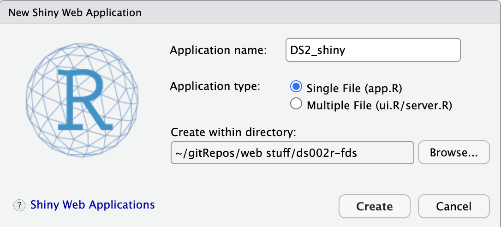
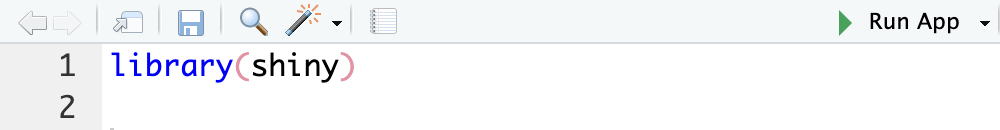
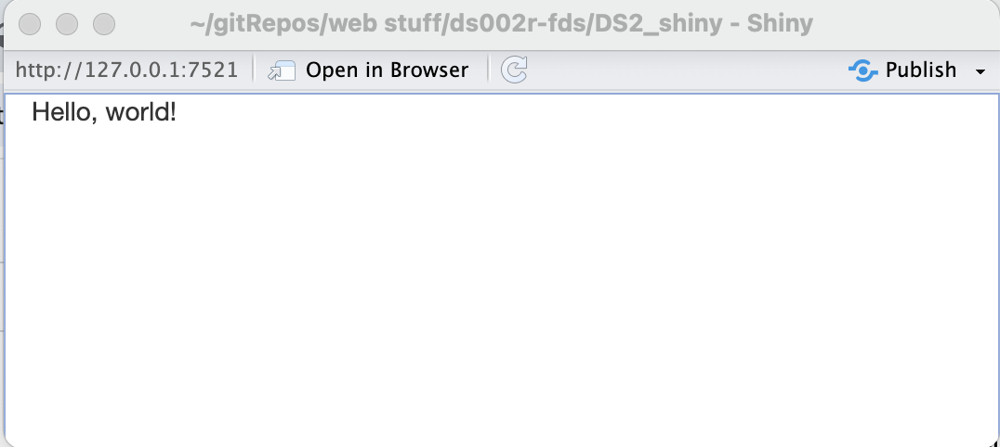

# Shiny {#sec-shiny}

```{r}
#| include: false

source("_common.R")
fontawesome::fa_html_dependency()
```

## What is Shiny?


> Shiny is an R package that allows you to easily create rich, interactive web apps. Shiny allows you to take your work in R or Python and expose it via a web browser so that anyone can use it. 

### Examples

See the following gallery of Shiny example from Posit: <a href = "https://shiny.posit.co/r/gallery/" target = "_blank">https://shiny.posit.co/r/gallery/</a>

```{=html}
<iframe width="780" height="500" src="https://shiny.posit.co/r/gallery/" title="Widgets" data-external="1"></iframe>
```

### A simple Shiny App

Put the following into a Shiny App using `File` $\rightarrow$ `New File` $\rightarrow$ `Shiny Web App ...` as a file called `app.R`.

```{r}
#| eval: false
library(shiny)

ui <- fluidPage(
  "Hello, world!"
)

server <- function(input, output, session) {
}

shinyApp(ui, server)
```


```{r}
#| echo: false
#| fig-align: center

```

### What are the parts of a Shiny App?

Looking closely at the code above, the `app.R` does four things:

1. It calls `library(shiny)` to load the shiny package.

2. It defines the user interface, the HTML webpage that humans interact with. In this case, it's a page containing the words "Hello, world!".

3. It specifies the behaviour of our app by defining a server function. It's currently empty, so our app doesn't do anything, but we'll be back to revisit it shortly.

4. It executes `shinyApp(ui, server)` to construct and start a Shiny application from UI and server.

### How to run a Shiny App?

::: {.callout-tip icon=false}
## To run Shiny

* Click the Run App button in the document toolbar.

```{r}
#| echo: false
#| fig-align: center

```

* Use a keyboard shortcut: Cmd/Ctrl + Shift + Enter.

* If you're not using RStudio, you can (`source()`) the whole document, or call `shiny::runApp()` with the path to the directory containing `app.R`.
:::

### What does it look like?


```{r}
#| echo: false
#| fig-align: center

```

### Back in R...

Go back and look at the console.  You will see something like:

```
Listening on http://127.0.0.1:7521
```

R is busy!  It is running your Shiny App.  You can't do anything in R because the processes are engaged with the Shiny App.

### Why can't my Shiny App run in my Quarto doc? {-}

Shiny interactions occur on the server-side, which means that you can write interactive apps without knowing JavaScript, but you need a server to run them on. You might notice a logistical issue: Shiny apps need a Shiny server to be run online. When you run Shiny apps on your own computer, Shiny automatically sets up a Shiny server for you, but you need a public-facing Shiny server if you want to publish interactivity online. That's the fundamental trade-off of shiny: you can do anything in a shiny document that you can do in R, but it requires someone to be running R.

## Deconstructing Shiny

### Pieces

Shiny applications will be contained in one `app.R` file. The file contains two key components:

`ui`: code for the user interface. The user interface is the webpage that your user will interact with. Don't worry, you don't need to know how to write html! The app will do that for you! (Although if you want to, there are opportunities to incorporate that knowledge into a Shiny app.)

`server`: code for the computer part. What the computer/server should do with your inputs as the user changes them. This section will have R code in it, more like we're used to ... sort of.

I always keep these names as the default. The last chunk of code at the bottom, `shinyApp(ui = ui, server = server)`, will compile everything together to result in the interactive webpage.

Press Run App at the top of RStudio and see what happens!


```{r}
#| eval: false
library(shiny)

shinyApp(
  ui = list(
    # new (to you) widgets go here
  ),
  
  server = function(input, output, session) {
    # somewhat familiar (to you) code goes here
  }
)
```

### A brief widget tour

<a href = "https://rundel.shinyapps.io/widgets/" target = "_blank">https://rundel.shinyapps.io/widgets/</a>

```{=html}
<iframe width="780" height="500" src="https://rundel.shinyapps.io/widgets/" title="Widgets" data-external="1"></iframe>
```

### The default Shinny App

```{r}
#| eval: false
#
# This is a Shiny web application. You can run the application by clicking
# the 'Run App' button above.
#
# Find out more about building applications with Shiny here:
#
#    https://shiny.posit.co/
#

library(shiny)

# Define UI for application that draws a histogram
ui <- fluidPage(

    # Application title
    titlePanel("Old Faithful Geyser Data"),

    # Sidebar with a slider input for number of bins 
    sidebarLayout(
        sidebarPanel(
            sliderInput("bins",
                        "Number of bins:",
                        min = 1,
                        max = 50,
                        value = 30)
        ),

        # Show a plot of the generated distribution
        mainPanel(
           plotOutput("distPlot")
        )
    )
)

# Define server logic required to draw a histogram
server <- function(input, output) {


    output$distPlot <- renderPlot({
        faithful |> 
           ggplot(aes(x = waiting)) + 
              geom_histogram(bins = input$bins,
                             fill = "darkgrey",
                             color = "white")  +
              labs(x = "Waiting time to next eruption (in mins)",
                   title = "Histogram of waiting times",
                   y = "") + 
              theme_minimal()
    })
}

# Run the application 
shinyApp(ui = ui, server = server)

```


* See the app in action here: <a href = "https://shiny.posit.co/r/gallery/start-simple/faithful/" target = "_blank">https://shiny.posit.co/r/gallery/start-simple/faithful/</a>

### `reactive()`

The function `reactive()` is worth pointing out.  It is used to create a reactive expression — an expression that is automatically recalculated when any of its inputs change.

Use `reactive()` when

* You want to perform calculations that depend on user input and automatically update when those inputs change.
* You need to pass dynamically calculated values to other parts of the app (outputs, observers, etc.).
* You need to create reactive data or state, such as subsets or transformations of input data.

Do not use `reactive()` on the UI inputs because they are inherently reactive already!

### Shiny in Python

Check it out!

<a href = "https://shiny.posit.co/py/" target = "_blank">https://shiny.posit.co/py/</a>

### Live demo

Let's build a weather app! 

See the <a href = "https://github.com/hardin47/ds002r-fds/tree/main/Shiny_weather" target = "_blank">files on GitHub</a> to walk through the example on your own.


## <i class="fas fa-lightbulb"></i> Reflection questions  

* What does it mean to say that the Shiny App "takes over" your R session?
* What is the difference between the `ui()` function and the `server()` function?
* How does the user engage with the app?
* What is the role of `input$` and `output$`?
* How do you publish the Shiny App so that someone can use it using a public URL?

## <i class="fas fa-balance-scale"></i> Ethics considerations 

* Why are SQL databases usually password protected?
* What is the difference between doing a SQL query and updating a SQL database?

