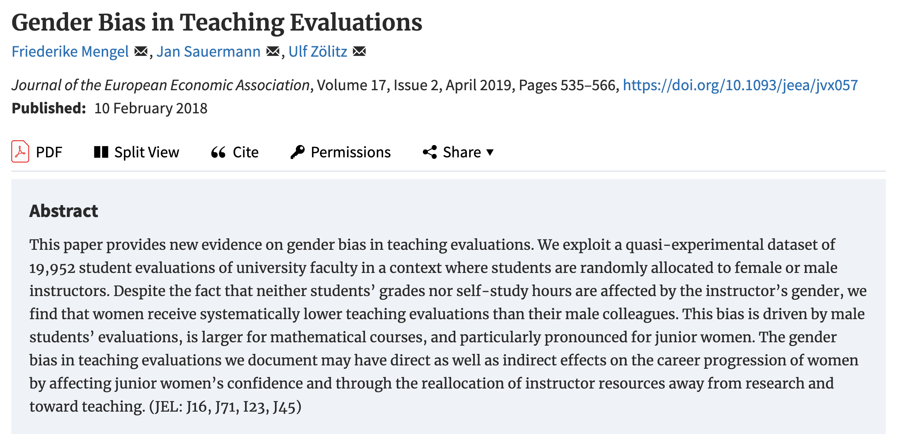
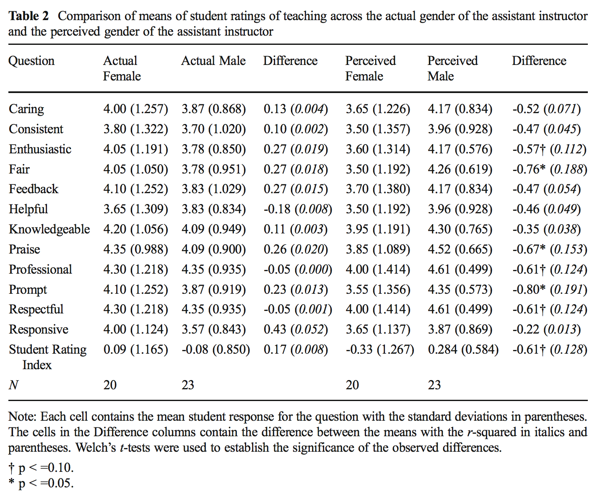

# Permutation tests {#sec-perm-tests}

```{r}
#| include: false

source("_common.R")
fontawesome::fa_html_dependency()
```


Permutation tests are a class of statistical hypothesis tests that use computational work to create what we call a sampling distribution.  You may be familiar with sampling distributions from your introductory statistics course in which case you likely ran into the sampling distribution modeled as a t-distribution (for use in a t-test or a t confidence interval).  We will not discuss t-tests in this course, but we will set up the structure of a hypothesis test.  Before we see the structure, however, let's do an example.

## Example: Friend or Foe {#ex:helper}

This example comes from Investigation 1.1: Friend or Foe? @iscam.  The idea is to use simulation to determine how likely our data would be if nothing interesting was going on.


> In a study reported in the November 2007 issue of *Nature*, researchers investigated whether infants take into account an individual's actions towards others in evaluating that individual as appealing or aversive, perhaps laying for the foundation for social interaction [@hamlin2007]. In other words, do children who aren't even yet talking still form impressions as to someone's friendliness based on their actions? In one component of the study, 10-month-old infants were shown a "climber" character (a piece of wood with "googly" eyes glued onto it) that could not make it up a hill in two tries. Then the infants were shown two scenarios for the climber's next try, one where the climber was pushed to the top of the hill by another character (the "helper" toy) and one where the climber was pushed back down the hill by another character (the "hinderer" toy). The infant was alternately shown
these two scenarios several times. Then the child was presented with both pieces of wood (the helper and the hinderer characters) and asked to pick one to play with. Videos demonstrating this component of the study can be found at http://campuspress.yale.edu/infantlab/media/.

> One important design consideration to keep in mind is that in order to equalize potential influencing factors such as shape, color, and position, the researchers varied the colors and shapes of the wooden characters and even on which side the toys were presented to the infants. The researchers found that 14 of the 16 infants chose the helper over the hinderer.


#### Always Ask {-}

* What are the observational units?
    - infants
* What is the variable?  What type of variable?
    - choice of helper or hindered: categorical
* What is the statistic?
    - $\hat{p}$ = proportion of infants who chose helper = 14/16 = 0.875
* What is the parameter?
    - p = proportion of all infants who might choose helper (not measurable!)
    
#### Hypotheses {-}

$H_0$: Null hypothesis. Babies (or rather, the population of babies under consideration) have no inherent preference for the helper or the hinderer shape.

$H_A$: Alternative hypothesis. Babies (or rather, the population of babies under consideration) are more likely to prefer the helper shape over the hinderer shape.  

> **p-value** is the probability of our data or more extreme if nothing interesting is going on.

|           completely arbitrary cutoff | $\rightarrow$ | generally accepted conclusion          |
|---------------------------:|:-------------:|---------------------------------------------|
|           p-value $>$ 0.10 | $\rightarrow$ | no evidence against the null model          |
| 0.05 $<$ p-value $<$ 0.10 | $\rightarrow$ | moderate evidence against the null model    |
| 0.01 $<$ p-value $<$ 0.05 | $\rightarrow$ | strong evidence against the null model      |
|          p-value $<$ 0.01 | $\rightarrow$ | very strong evidence against the null model |


#### Computation {-}

```{r echo=TRUE, eval=TRUE}
#| fig-cap: Histogram of sample proportions calculated under the setting where babies have no inherent preference for the helper or the hinderer shape.  The red line is at the observed proportion from the @hamlin2007 study.
# to control the randomness
set.seed(47)

# first create a data frame with the Infant data
Infants <- read.delim("http://www.rossmanchance.com/iscam3/data/InfantData.txt")

# find the observed number of babies who chose the helper
help_obs <- Infants |> 
  summarize(prop_help = mean(choice == "helper")) |> 
  pull()
help_obs

# write a function to simulate a set of infants who are 
# equally likely to choose the helper or the hinderer

random_choice <- function(rep, num_babies){
  choice = sample(c("helper", "hinderer"), size = num_babies,
                  replace = TRUE, prob = c(0.5, 0.5))
  return(mean(choice == "helper"))
}

# repeat the function many times
map_dbl(1:10, random_choice, num_babies = 16)

num_exper <- 5000
help_random <- map_dbl(1:num_exper, random_choice, 
                            num_babies = 16)

# the p-value!
sum(help_random >= help_obs) / num_exper

# visualize null sampling distribution
help_random |> 
  data.frame() |> 
  ggplot(aes(x = help_random)) + 
  geom_histogram() + 
  geom_vline(xintercept = help_obs, color = "red") + 
  labs(x = "proportion of babies who chose the helper",
       title = "sampling distribution when null hypothesis is true",
       subtitle = "that is, no inherent preference for helper or hinderer")

```

#### Logic for what we believe {-}

1. If we look back to the study, we can tell that the researchers varied color, shape, side, etc. to make sure there was nothing systematic about how the infants chose the block (e.g., if they all watch *Blue's Clues* they might love the color blue, so we wouldn't always want the helper shape to be blue).  

The excellent design survey rules out outside influence as the reason so many of the infants chose the helper shape.

2. We ruled out random chance as the mechanism for the larger number of infants who chose the helper shape.  (We reject the null hypothesis.)

3. We conclude that babies are inclined to be helpful.  That is, they are more likely to choose the helper than the hindered.  [Note:  we don't have any evidence for *why* they choose the helper.  That is, they might be predisposed.  They might be modeling their parents.  They might notice that *they* need a lot of help, etc.]


## Structure of Hypothesis testing

### Hypotheses

* **Hypothesis Testing** compares data to the expectation of a specific null hypothesis.  If the data are unusual, assuming that the null hypothesis is true, then the null hypothesis is rejected.  

* The **Null Hypothesis**, $H_0$, is a specific statement about a population made for the purposes of argument.  A good null hypothesis is a statement that would be interesting to reject. 

* The **Alternative Hypothesis**, $H_A$, is a specific statement about a population that is in the researcher's interest to demonstrate.  Typically, the alternative hypothesis contains all the values of the population that are not included in the null hypothesis. 

* In a **two-sided** (or two-tailed) test, the alternative hypothesis includes values on both sides of the value specified by the null hypothesis.

* In a **one-sided** (or one-tailed) test, the alternative hypothesis includes parameter values on only one side of the value specified by the null hypothesis. $H_0$ is rejected only if the data depart from it in the direction stated by $H_A$.


### Other pieces of the process

* A  **statistic** is a numerical measurement we get from the sample, a function of the data. [Also sometimes called an **estimate**.]

* A  **parameter** is a numerical measurement of the population.  We never know the true value of the parameter.

* The **test statistic** is a quantity calculated from the data that is used to evaluate how compatible the data are with the result expected under the null hypothesis.

* The **null distribution** is the sampling distribution of outcomes for a test statistic under the assumption that the null hypothesis is true. 

* The **p-value** is the probability of obtaining the data (or data showing as great or greater difference from the null hypothesis) if the null hypothesis is true.  *The p-value is a number calculated from the dataset.*


#### Examples of Hypotheses {-}
Identify whether each of the following statements is more appropriate as the null hypothesis or as the alternative hypothesis in a test:

* The number of hours preschool children spend watching TV affects how they behave with other children when at day care.  *Alternative*

* Most genetic mutations are deleterious.  *Alternative*

* A diet of fast foods has no effect on liver function.  *Null*

* Cigarette smoking influences risk of suicide.  *Alternative*

* Growth rates of forest trees are unaffected by increases in carbon dioxide levels in the atmosphere.  *Null*

* The number of hours that grade-school children spend doing homework predicts their future success on standardized tests.  *Alternative*

* King cheetahs on average run the same speed as standard spotted cheetahs. *Null*

* The risk of facial clefts is equal for babies born to mothers who take folic acid supplements compared with those from mothers who do not.  *Null*

* The mean length of African elephant tusks has changed over the last 100 years.  *Alternative*

* Caffeine intake during pregnancy affects mean birth weight.  *Alternative*


###  All together:  structure of a hypothesis test

* decide on a research question (which will determine the test)
* collect data, **specify** the variables of interest
* state the null (and alternative) **hypothesis** values (often statements about parameters)
   - the null claim is the science we want to reject
   - the alternative claim is the science we want to demonstrate
* **generate** a (null) sampling distribution to describe the variability of the statistic that was **calculated** along the way
* **visualize** the distribution of the statistics under the null model
* **get_p_value** to measure the consistency of the observed statistic and the possible values of the statistic under the null model
* make a conclusion using words that describe the research setting


::: {.callout-note icon=false}
## Example: randomization test on Gerrymandering

Note that the idea of creating a null distribution can apply to a wide range of possible settings.  The key is to swap observations around under the null hypothesis where "randomizing under the null hypothesis" helps get the researcher to a conclusion.  

Below is a youtube video describing permuting (i.e., randomizing) different voting boundaries to come up with a null distribution of districts.  The problem (as stated) is not possible to describe using mathematical functions, but we can derive a solution using computational approaches. [https://www.youtube.com/watch?v=gRCZR_BbjTo]
:::


::: {.callout-note icon=false}
## Example: randomization test on beer and mosquitoes

Great video of how/why computational statistical methods can be extremely useful. And it's about beer and mosquitoes!  John Rauser from Pintrest gives the keynote address at Strata + Hadoop World Conference October 16, 2014.  David Smith, Revolution Analytics blog, October 17, 2014. http://blog.revolutionanalytics.com/2014/10/statistics-doesnt-have-to-be-that-hard.html

> The big lesson here, IMO, is that so many statistical problems can seem complex, but you can actually get a lot of insight by recognizing that your data is just one possible instance of a random process. If you have a hypothesis for what that process is, you can simulate it, and get an intuitive sense of how surprising your data is. R has excellent tools for simulating data, and a couple of hours spent writing code to simulate data can often give insights that will be valuable for the formal data analysis to come. (David Smith)

Rauser says that the in order to follow a statistical argument that uses simulation, you need three things:

1. Ability to follow a simple logical argument.
2. Random number generation.
3. Iteration


## Hypotheses

$H_0$: Null hypothesis. The variables beer/water and number of mosquito bites are independent. They have no relationship, and therefore any observed difference between the number of bites on those who drank beer versus those who drank water is due to chance.

$H_A$: Alternative hypothesis. The variables beer/water and number of mosquito bites are not independent. Any observed difference between the number of bites on those who drank beer versus those who drank water is **not** due to chance.
:::


### Permutation Tests Algorithm

To evaluate the p-value for a permutation test, estimate the sampling distribution of the test statistic when the null hypothesis is true by resampling in a manner that is consistent with the null hypothesis (the number of resamples is finite but can be large!).

1. Choose a test statistic

2. Shuffle the data (force the null hypothesis to be true)

3. Create a null sampling distribution of the test statistic (under $H_0$)

4. Find the observed test statistic on the null sampling distribution and compute the p-value (observed data or more extreme).  The p-value can be one or two-sided.

#### Technical Conditions {-}
Permutation tests fall into a broad class of tests called "non-parametric" tests.  The label indicates that there are no distributional conditions required about the data (i.e., no condition that the data come from a normal or binomial distribution).  However, a test which is "non-parametric" does not meant that there are no conditions on the data, simply that there are no *distributional or parametric* conditions on the data.  **The parameters are at the heart of almost all parametric tests.**

For permutation tests, we are not basing the test on population parameters, so we don't need to make any claims about them (i.e., that they are the mean of a particular distribution).

* **Permutation** The different treatments have the same effect.  [Note: exchangeability, same population, etc.]  *If the null hypothesis is true, the labels assigning groups are interchangeable with respect to the probability distribution.*
    * Note that it is our choice of *statistic* which makes the test more sensitive to some kinds of difference (e.g., difference in mean) than other kinds (e.g., difference in variance).
* **Parametric** For example, the different populations have the same mean.

**IMPORTANT KEY IDEA**  the point of technical conditions for parametric or permutation tests is to create a sampling distribution that accurately reflects the null sampling distribution for the statistic of interest (the statistic which captures the relevant research question information).


## Permutation tests in practice {#perms}

How is the test interpreted given the different types of sampling which are possibly used to collect the data?

* **Random Sample** The concept of a p-value usually comes from the idea of taking a sample from a population and comparing it to a sampling distribution (from many many random samples).

* **Random Experiment** In the context of a **randomized experiment**, the p-value represents the observed data compared to "happening by chance."

    * The interpretation is direct: if there is only a very small chance that the observed statistic would take such an extreme value, as a result only of the randomization of cases:  we reject the null treatment effect hypothesis. CAUSAL!
    
* **Observational Study** In the context of **observational studies** the results are less strong, but it is reasonable to conclude that the effect observed in the sample reflects an effect present in the population.

    * In a sample, consider the difference (or ratio) and ask "Is this difference so large it would rarely occur by chance in a particular sample constructed under the null setting?"
    * If the data come from a random sample, then the sample (or results from the sample) are probably consistent with the population [i.e., we can infer the results back to the larger population].

### MacNell Teaching Evaluations (Stratified two-sample t-test)

Boring et al. (2016) reanalyze data from MacNell et al. (2014).  Students were randomized to 4 online sections of a course.  In two sections, the instructors swapped identities.  Was the instructor who identified as female rated lower on average? (https://www.math.upenn.edu/~pemantle/active-papers/Evals/stark2016.pdf)

```{r out.width='100%', fig.align="center",  echo=FALSE, fig.cap = "@genderbias3"}
knitr::include_graphics(c("images/genderbias2a.png", "images/genderbias2b.png"))
```


```{r out.width='100%', fig.align="center",  echo=FALSE, fig.cap = "@genderbias1"}


```

```{r out.width='100%', fig.align="center", echo=FALSE, fig.cap = "@genderbias2"}
knitr::include_graphics(c("images/genderbias3a.png", "images/genderbias3b.png"))
```


#####  R code

```{r}
# The data come from `permuter` which is no longer kept up as a package
macnell <- readr::read_csv("https://raw.githubusercontent.com/statlab/permuter/master/data-raw/macnell.csv")
#library(permuter)
#data(macnell)
```


```{r warning=FALSE, message=FALSE, fig.align="center"}
library(ggridges)
macnell |> 
  mutate(TAID = ifelse(taidgender==1, "male", "female")) |>
  mutate(TAGend = ifelse(tagender==1, "male", "female")) |>
ggplot(aes(y=TAGend, x=overall, 
           group = interaction(TAGend, TAID), 
           fill=TAID)) +
  geom_point(position=position_jitterdodge(jitter.height=0.3, jitter.width = 0, dodge.width = 0.4), 
             aes(color = TAID)) +
  stat_summary(fun="mean", geom="crossbar", 
               size=.3, width = 1,
               aes(color = TAID),
               position=position_dodge(width=0.4)) +
  stat_summary(fun="mean", geom="point", shape = "X",
               size=5, aes(color = TAID),
               position=position_dodge(width=0.4)) +
  coord_flip() +
  labs(title = "Overall teaching effectiveness score",
       x = "",
       y = "TA gender",
       color = "TA identifier",
       fill = "TA identifier")
```


####  Analysis goal

Want to know if the score for the **perceived** gender is different.


$$H_0:  \mu_{ID.Female} = \mu_{ID.Male}$$
> Although for the permutation test, under the null hypothesis not only are the means of the population distributions the same, but the variance and all other aspects of the distributions across perceived gender.

#### MacNell Data without permutation

```{r}
macnell |>
  select(overall, tagender, taidgender) |> head(15)
```


#### Permuting MacNell data

Conceptually, there are two levels of randomization:

1. $N_m$ students are randomly assigned to the male instructor and $N_f$ are assigned to the female instructor.

2.  Of the $N_j$ assigned to instructor $j$, $N_{jm}$ are told that the instructor is male, and $N_{jf}$ are told that the instructor is female for $j=m,f$.

```{r}
macnell |>
  group_by(tagender, taidgender) |>
  summarize(n())
```

**Stratified two-sample test:**

* **For each instructor**, permute *perceived* gender assignments.
* Use difference in mean ratings for female-identified vs male-identified instructors.


```{r mac1}
#| code-line-numbers: "2"
macnell |> 
  group_by(tagender) |>
  mutate(permTAID = sample(taidgender, replace=FALSE)) |>
  select(overall, tagender, taidgender, permTAID) 
```


```{r mac2}
#| code-line-numbers: "2,5"
macnell |> 
  group_by(tagender) |>
  mutate(permTAID = sample(taidgender, replace=FALSE)) |>
  ungroup(tagender) |>
  group_by(permTAID) |>
  summarize(pmeans = mean(overall, na.rm=TRUE)) |>
  summarize(diff(pmeans))
```


```{r mac3}
diff_means_func <- function(.x){
  macnell |> group_by(tagender) |>
  mutate(permTAID = sample(taidgender, replace=FALSE)) |>
  ungroup(tagender) |>
  group_by(permTAID) |>
  summarize(pmeans = mean(overall, na.rm=TRUE)) |>
  summarize(diff_mean = diff(pmeans))
  }

map(1:5, diff_means_func) |> 
  list_rbind()
```


#### Observed vs. Permuted statistic

```{r}
# observed
macnell |> 
  group_by(taidgender) |>
  summarize(pmeans = mean(overall, na.rm=TRUE)) |>
  summarize(diff_mean = diff(pmeans))
```


```{r}
# permuted
set.seed(47)
reps = 1000
perm_diff_means <- map(1:reps, diff_means_func) |> list_rbind()
```


#### permutation sampling distribution:


.pull-left[
```{r echo=FALSE}
perm_diff_means |>
  ggplot(aes(x = diff_mean)) +
  geom_histogram() +
  geom_vline(xintercept = 0.474, color = "red")
```
]

.pull-right[
```{r}
# permutation p-value
perm_diff_means |>
  summarize(p_val = 
      sum(diff_mean > 0.474) / 
      reps)
```
]


```{r echo = FALSE, eval = FALSE, include = FALSE}

#### MacNell Data with different permutation tests

#The `permuter` package contains functions for a variety of different permutation tests, including one with stratification.

distr1 <- stratified_two_sample(response = macnell$overall,
                               group =  macnell$taidgender,
                               stratum = macnell$tagender,
                               stat = "mean", reps=reps)

distr2 <- stratified_two_sample(response = macnell$overall,
                               group =  macnell$taidgender,
                               stratum = macnell$tagender,
                               stat = "t", reps=reps)
```

```{r echo = FALSE, eval = FALSE, include = FALSE}

macnell |> group_by(taidgender) |>
  summarize(means = mean(overall, na.rm = TRUE)) |>
  summarize(diff(means))

macnell |> group_by(taidgender) |>
  summarize(means = mean(overall, na.rm=TRUE), 
            vars = var(overall, na.rm=TRUE), ns = n() ) |>
  summarize((means[1] - means[2])/ sqrt(vars[1]/ns[1] + vars[2]/ns[2]))

```

```{r echo = FALSE, eval = FALSE, include = FALSE}
# brute force permutation
2*sum(ov.stats > 0.47) / reps

# mean(x) - mean(y)
t2p(0.47, distr1, alternative="two-sided")

# t permutation
t2p(-1.56, distr2, alternative="two-sided")

```


#### Actual MacNell results


```{r out.width = '100%', fig.align="center", echo=FALSE}

```


#### Other Test Statistics

The example in class used a modification of the ANOVA F-statistic to compare the observed data with the permuted data test statistics.  Depending on the data and question, the permuted test statistic can take on any of a variety of forms.


| Data | Hypothesis Question | Statistic |
|:--------------|:----------:|:-------------:|
| 2 categorical | diff in prop | $\hat{p}_1 - \hat{p}_2$ or $\chi^2$ |
| variables | ratio of prop | $\hat{p}_1 /  \hat{p}_2$ |
| 1 numeric | diff in means | $\overline{X}_1 - \overline{X}_2$ |
| 1 binary | ratio of means | $\overline{X}_1 / \overline{X}_2$ |
|  | diff in medians | $\mbox{median}_1 - \mbox{median}_2$ |
|  | ratio of medians | $\mbox{median}_1 / \mbox{median}_2$ |
|  | diff in SD | $s_1 - s_2$ |
|  | diff in var | $s^2_1 - s^2_2$ |
|  | ratio of SD or VAR | $s_1 / s_2$ |
| 1 numeric | diff in means | $\sum n_i (\overline{X}_i - \overline{X})^2$ or |
| k groups |  | F stat |
| paired or | (permute *within* row) | $\overline{X}_1 - \overline{X}_2$ |
| repeated measures |  |  |
| regression | correlation | least sq slope |
| time series | no serial corr | lag 1 autocross |


Depending on the data, hypotheses, and original data collection structure (e.g., random sampling vs random allocation), the choice of statistic for the permutation test will vary.


## <i class="fas fa-lightbulb"></i> Reflection questions  


## <i class="fas fa-balance-scale"></i> Ethics considerations 

