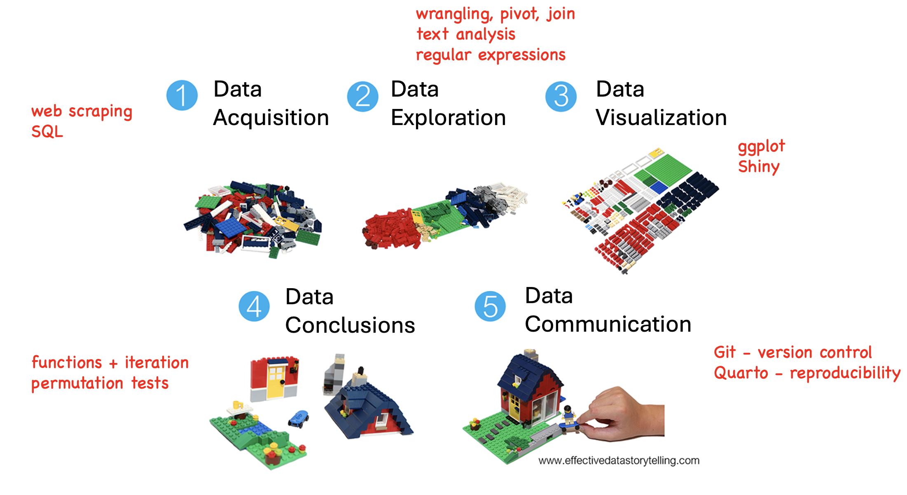
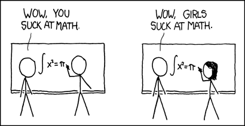
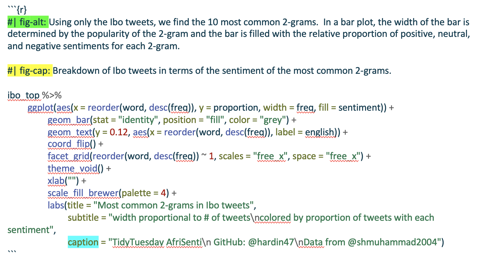
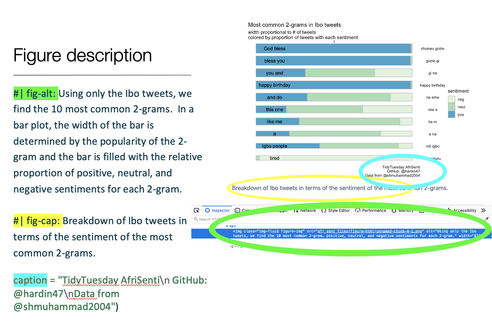
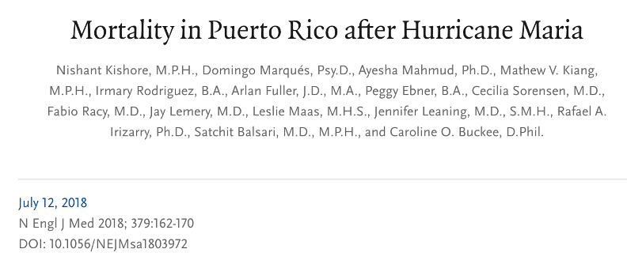
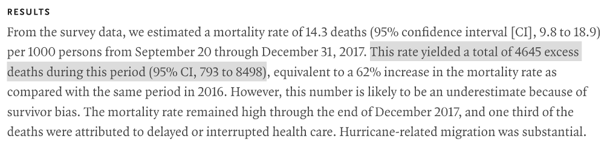

# Fin {#sec-fin}

```{r}
#| include: false

source("_common.R")
fontawesome::fa_html_dependency()
```

We learned a lot of technical tools throughout the semester.  But hopefully, the bigger take-away is the larger thought process about how we do data science and how the technical pieces come together.

Remember, the goal is to communicate insight that you obtain from data. The more you understand your data, the more insight you will have.  

## Data Science Overview 


```{r, out.width = "800px", echo=FALSE, fig.cap = "Based on [https://www.effectivedatastorytelling.com/post/a-deeper-dive-into-lego-bricks-and-data-stories](https://www.effectivedatastorytelling.com/post/a-deeper-dive-into-lego-bricks-and-data-stories), original source: [https://www.linkedin.com/learning/instructors/bill-shander](https://www.linkedin.com/learning/instructors/bill-shander)"}

```


## Data Scientists 

Who does data science?

<a href = "https://hardin47.github.io/CURV/" target = "_blank">connecting, uplifting, and recognizing voices</a> -- a database of statisticians and data scientists.

<!-- Liz Hare + Ibo tweets, Rafa Irizarry + hurricane Maria, David Blackwell -->


### David Blackwell

Arguably, the most famous/influential/brilliant African American statistician is <a href = "https://en.wikipedia.org/wiki/David_Blackwell" target = "_blank">David Blackwell</a>.  Statisticians may know Blackwell from the <a href = "https://en.wikipedia.org/wiki/Rao%E2%80%93Blackwell_theorem" target = "_blank">Rao-Blackwell theorem</a> which says that after conditioning on a sufficient statistic, the new estimator will have smaller (or equal to) mean squared error than the original estimator.  

Blackwell was the 1st African American elected to the National Academies of Science and the 1st African American tenured at UC Berkeley.  He was the 7th African American to receive a PhD in mathematics.  In 2012, President Obama posthumously awarded Blackwell the National Medal of Science.

The majority of Blackwell's career in statistics was spent at UC Berkeley (1954-1988).  However, his start at UC Berkeley was postponed due to racism in the Department of Mathematics.  Hear Blackwell describe the situation in his own words in the following video:




The full interview with David Blackwell can be found at <a href="https://www.youtube.com/watch?v=Mqpf9tw44Xw" target="_blank">https://www.youtube.com/watch?v=Mqpf9tw44Xw/</a>.


### Why does representation matter? {-}

When individuals don't feel a part of the community, their identity gets mixed up with their ability.  The following xkcd comic encapsulates what can happen when individuals of the non-dominant demographic group engage with the content of the course / curriculum / minor / major.

```{r}
#| echo: FALSE
#| fig-alt: In the first panel, a stick figure makes a mathematical mistake, and the other stick figure says "you are bad at math".  In the second panel, a stick figure with long hair (presumably a female stick figure) makes the same mistake, and the other stick figure says "girls are bad at math."
#| fig-cap: image credit -- https://xkcd.com/385/
#| out-width: "55%"
#| fig-align: center


```


>Research indicates that many young people may be deterred from pursuing STEM fields due to prominent stereotypes regarding who best fits and belongs in such fields.^[Nguyen and Riegle-Crumb.  *Who is a scientist? The relationship between counter-stereotypical beliefs about scientists and the STEM major intentions of Black and Latinx male and female students*. **International Journal of STEM Education**, volume 8, Article number: 28 (2021), https://doi.org/10.1186/s40594-021-00288-x]


#### What are some reasons that representation impacts participation in engaging in STEM? {-}

* stereotypes about innate abilities
* stereotypes about images in the field


### Liz Hare

Liz Hare is not a statistician.  Indeed, she is a geneticist, working primarily in dog / animal genetics.  However, as someone who is very active in the <a href = "https://mircommunity.com/about/" target = "_blank">Minorities in R (MiR) Community</a>,  she works regularly with statisticians.

Liz Hare is visually impaired and has focused <a href = "https://www.urban.org/sites/default/files/2022-12/Do%20No%20Harm%20Guide%20Centering%20Accessibility%20in%20Data%20Visualization.pdf#page=31&zoom=100,0,0" target = "_blank">her work</a> on communicating the value and ease with which statisticians and data scientists can add alt text to their reports.  In the alt text, she asks us to consider and report:

1. What kind of graph or chart is it?
2. What variables are on the axes?
3. What are the ranges of the variables?
4. What does the appearance tell you about the relationships between the variables?

<!--- had to mess around to get the file to show up https://github.com/quarto-dev/quarto-cli/issues/3892 --->



Importantly, including alt text in your own work is straightforward if you are using Quarto or RMarkdown documents. In R, including alt text is done by providing information for the relevant R chunk.  


```{r}
#| echo: FALSE
#| fig-alt: To include alt text in Rmarkdown or Quarto files, the alt text information is given in the arguments of the R chunk.
#| fig-cap: R code for Ibo tweets in TidyTuesday analysis.
#| out-width: "90%"
#| fig-align: center


```


```{r}
#| echo: FALSE
#| fig-alt: The figure contains information on how to communicate information about a graphic through alt text, report captions, and individual figure captions. 
#| fig-cap: Different ways to annotate a figure include alt text, figure captions for the full file, and figure captions for the ggplot.
#| out-width: "90%"
#| fig-align: center


```

### Rafael Irizarry

Rafael Irizarry is a well known biostatistician, having done his PhD at Berkeley, worked for many years at Johns Hopkins University, and currently running a lab at Harvard as Professor of Biostatistics and at the Dana-Farber Cancer Institute as Professor of Biostatistics and Computational Biology.  He has dozens of online courses through the <a href = "https://www.edx.org/bio/rafael-irizarry" target = "_blank">edX platform</a> and over a hundred publications via <a href = "https://scholar.google.com/citations?user=nFW-2Q8AAAAJ&hl=en" target = "_blank">Google scholar</a>.

Relevant to the <a href = "https://hardin47.github.io/CURV/" target = "_blank">CURV database</a> however is the work that Rafael Irizarry has done in Puerto Rico.  Having graduated from the University of Puerto Rico, Rafael Irizarry had a vested interest in the community that was ravaged in 2017 when Hurricane Maria, a category 5 hurricane, ravaged the island. With collaborators, Professor Irizarry performed a representative stratified sample to measure neighborhoods based on how easily accessible they were in the aftermath of the hurricane.

The original news reports months after the hurricane was that the official death report from Hurricane Maria was 64 people.  Professor Irizarry and colleagues estimated that the number of excess deaths was 4645, with a 95% confidence interval of 793 to 8498.

Some of the ideas being Professor Irizarry's work include: who is doing the work to understand climate change at a global level?; how is stratified sampling different from simple random samples and why can't we always take simple random samples?; and why is the CI so wide?

```{r}
#| echo: FALSE
#| fig-alt: New England Journal of Medicine paper from July 2018 titled "Mortality in Puerto Rico after Hurricane Maria" with Irizarry and co-authors.
#| out-width: "90%"
#| fig-align: center


```


```{r}
#| echo: FALSE
#| fig-alt: Abstract of the New England Journal of Medicine paper.  In particular, they provide a point estimate for the mortality number to be 4645 excess deaths, with a CI of 793 to 8498.
#| out-width: "90%"
#| fig-align: center


```


## Take-aways

* 80-90% of data science work is data wrangling and visualization
* wrangling the data well is usually more important than modeling the data well
* there are many choices along the way, there is no such thing as **truth**
* if you can't reproduce the work, you should question whether to trust it
* communicating to your audience is likely the most important aspect of doing data science


## <i class="fas fa-lightbulb"></i> Reflection questions  

* What are the pieces of the data science pipeline and how do they interact with one another?

* What is important about understanding specific details about writing code (in R or any other language)?

* What is important about understanding the bigger picture which goes beyond the coding details?

## <i class="fas fa-balance-scale"></i> Ethics considerations 

* What are the ethical considerations to consider when doing data science?

* Which ethical considerations are hardest to navigate?

* Why is it important to have lots of diverse voices at the table when doing data science?


## References