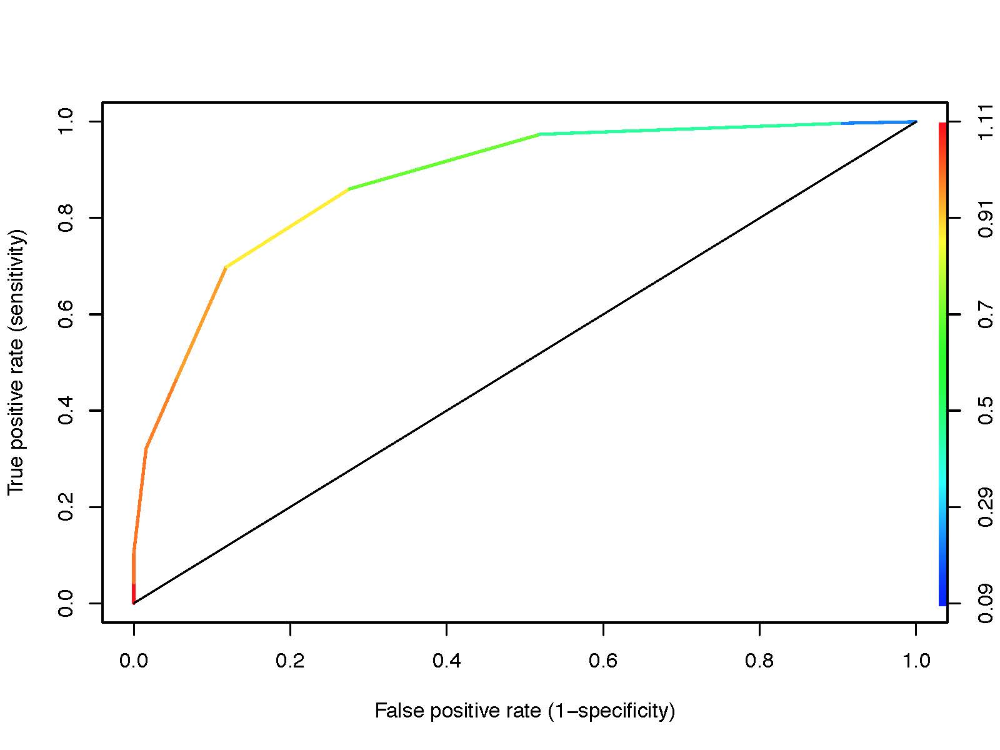

# Logistic Regression

```{r, include=FALSE, eval=TRUE, echo=FALSE, warning=FALSE, message=FALSE}
knitr::opts_chunk$set(message=FALSE, warning=FALSE, fig.height=3, fig.width=5, 
                      fig.align = "center")

library(tidyverse)
library(broom)
library(survival)
```


## Motivation for Logistic Regression {#logmodel}

During investigation of the US space shuttle *Challenger* disaster, it was learned that project managers had judged the probability of mission failure to be 0.00001, whereas engineers working on the project had estimated failure probability at 0.005.  The difference between these two probabilities, 0.00499 was discounted as being too small to worry about.  Is a different picture provided by considering odds?  How is it interpreted?

The logistic regression model is a *generalized* linear model.  That is, a linear model as a function of the expected value of the response variable.  We can now model binary response variables.
\begin{align}
GLM: g(E[Y | X]) = \beta_0 + \beta_1 X
\end{align}
where $g(\cdot)$ is the link function.  For logistic regression, we use the logit link function:
\begin{align}
\logit (p) = \ln \bigg( \frac{p}{1-p} \bigg)
\end{align}


#### Surviving Third-degree Burns {#ex:burnexamp}

These data refer to 435 adults who were treated for third-degree burns by the University of Southern California General Hospital Burn Center. The patients were grouped according to the area of third-degree burns on the body (measured in square cm). In the table below are recorded, for each midpoint of the groupings `log(area +1)`, the number of patients in the corresponding group who survived, and the number who died from the burns. [@burn]

| log(area+1) midpoint	| survived 	| died 	| prop surv 	|
|:-----------:	|:--------:	|:----:	|:---------:	|
| 1.35 	| 13 	| 0 	| 1 	|
| 1.60 	| 19 	| 0 	| 1 	|
| 1.75 	| 67 	| 2 	| 0.971 	|
| 1.85 	| 45 	| 5 	| 0.900 	|
| 1.95 	| 71 	| 8 	| 0.899 	|
| 2.05 	| 50 	| 20 	| 0.714 	|
| 2.15 	| 35 	| 31 	| 0.530 	|
| 2.25 	| 7 	| 49 	| 0.125 	|
| 2.35 	| 1 	| 12 	| 0.077 	|


```{r echo=FALSE, fig.height=10, warning=FALSE, message=FALSE, fig.show = "hold", out.width = '95%'}
burndata <- data.frame(rbind(c(1.35,13,0,1), c(1.6,19,0,1),c(1.75,67,2,0.971014493),
c(1.85,45,5,0.9),c(1.95,71,8,0.898734177), c(2.05,50,20,0.714285714),c(2.15,35,31,0.53030303),
c(2.25,7,49,0.125),c(2.35,1,12,0.076923077)))
names(burndata) <- c("logarea","surv","died","propsurv")

burndata <- burndata %>%
  mutate(logitsurv = log(propsurv / (1-propsurv)))

expl <- rep(burndata$logarea, burndata$surv+burndata$died)
resp <- c()
for(i in 1:9){
  resp<-c(resp,rep(0,burndata$died[i]),rep(1,burndata$surv[i]))}

burnglm <- data.frame(burnexpl = expl, burnresp = resp)

p3 <- ggplot(burndata, aes(x = logarea, y = propsurv)) + geom_point() + 
  xlab("log area burned") + ylab("prop who survived")
p4 <- burndata %>% dplyr::filter(logitsurv < 4) %>% 
  ggplot(aes(x = logarea, y = logitsurv)) + geom_point() + 
  xlab("log area burned") + ylab("logit of prop who survived") + ylim(c(-3,4))

library(ggpubr)
ggarrange(p3, p4, ncol = 2)
```

We can see that the logit transformation linearizes the relationship.


A first idea might be to model the relationship between the probability of success (that the patient survives) and the explanatory variable `log(area +1)` as a simple linear regression model. However, the scatterplot of the proportions of patients surviving a third-degree burn against the explanatory variable shows a distinct curved relationship between the two variables, rather than a linear one. It seems that a transformation of the data is in place.

The functional form relating x and the probability of success looks like it could be an `S` shape.  But we'd have to do some work to figure out what the form of that `S` looks like.  Below I've given some different relationships between x and the probability of success using $\beta_0$ and $\beta_1$ values that are yet to be defined.  Regardless, we can see that by tuning the functional relationship of the `S` curve, we can get a good fit to the data.

```{r echo=FALSE, fig.height=10, warning=FALSE, message=FALSE, out.width='95%'}
sfunc <- function(beta0, beta1){
  x <- seq(-5,5,.25)
  y <- exp(beta0 + beta1 * x) / (1 + exp(beta0 + beta1*x) )
	y}

x <- seq(-5,5,.25)

beta0 <- -0.2
beta1 <- -1
b1 <- data.frame(x = x,  y = sfunc(beta0, beta1)) %>%
  ggplot() +
  geom_line(aes(x = x, y = y)) +
  xlab(paste("beta0=",beta0,"   beta1=", beta1,sep="")) +
  ylab("")
beta0 <- -0.2
beta1 <- 0.4
b2 <- data.frame(x = x,  y = sfunc(beta0, beta1)) %>%
  ggplot() +
  geom_line(aes(x = x, y = y)) +
  xlab(paste("beta0=",beta0,"   beta1=", beta1,sep="")) +
  ylab("")
beta0 <- -0.3
beta1 <- 1.8
b3 <- data.frame(x = x,  y = sfunc(beta0, beta1)) %>%
  ggplot() +
  geom_line(aes(x = x, y = y)) +
  xlab(paste("beta0=",beta0,"   beta1=", beta1,sep="")) +
  ylab("")
beta0 <- -1
beta1 <- 7
b4 <- data.frame(x = x,  y = sfunc(beta0, beta1)) %>%
  ggplot() +
  geom_line(aes(x = x, y = y)) +
  xlab(paste("beta0=",beta0,"   beta1=", beta1,sep="")) +
  ylab("")

ggarrange(b1, b2, b3, b4, ncol = 2, nrow = 2, common.legend = TRUE)
```


S-curves ( `y = exp(linear) / (1+exp(linear))` ) for a variety of different parameter settings.  Note that the x-axis is some continuous variable `x` while the y-axis is the probability of success at that value of `x`.  More on this as we move through this model.


Why doesn't linear regression work here?  

* The response isn't normal  
* The response isn't linear (until we transform)  
* The predicted values go outside the bounds of (0,1)   
* Note: it *does* work to think about values inside (0,1) as probabilities  

### The logistic model

Instead of trying to model the using *linear regression*, let's say that we consider the relationship between the variable $x$ and the probability of success to be given by the following generalized linear model. (The logistic model is just one model, there isn't anything magical about it.  We do have good reasons for how we defined it, but that doesn't mean there aren't other good ways to model the relationship.)

\begin{align}
p(x) = \frac{e^{\beta_0 + \beta_1 x}}{1+e^{\beta_0 + \beta_1 x}}
\end{align}
Where $p(x)$ is the probability of success (here surviving a burn).  $\beta_1$ still determines the direction and *slope* of the line.  $\beta_0$ now determines the location (median survival).

* **Note 1**  What is the probability of success for a patient with covariate of $x = -\beta_0 / \beta_1$?  
\begin{align}
x &= - \beta_0 / \beta_1\\
\beta_0 + \beta_1 x &= 0\\
e^{0} &= 1\\
p(-\beta_0 / \beta_1) &= p(x) = 0.5
\end{align}
(for a given $\beta_1$, $\beta_0$ determines the median survival value)
* **Note 2**  If $x=0$,
\begin{align}
p(0) = \frac{e^{\beta_0}}{1+e^{\beta_0}}
\end{align}
$x=0$ can often be thought of as the baseline condition, and the probability at $x=0$ takes the place of thinking about the intercept in a linear regression.
* **Note 3**  
\begin{align}
1 - p(x) = \frac{1}{1+e^{\beta_0 + \beta_1 x}}
\end{align}  
gives the probability of failure.
\begin{align}
\frac{p(x)}{1-p(x)} = e^{\beta_0 + \beta_1 x}
\end{align}  
gives the odds of success.
\begin{align}
\ln \bigg( \frac{p(x)}{1-p(x)} \bigg) = \beta_0 + \beta_1 x
\end{align}  
gives the $\ln$ odds of success .

* **Note 4** Every type of generalized linear model has a link function. Ours is called the *logit*.  The link is the relationship between the response variable and the *linear* function in x.
\begin{align}
\logit(\star) = \ln \bigg( \frac{\star}{1-\star} \bigg) \ \ \ \ 0 < \star < 1
\end{align}


#### model assumptions

Just like in linear regression, our `Y` response is the only random component.

\begin{align}
y &= \begin{cases}
1 & \mbox{ died}\\
0 & \mbox{ survived}
\end{cases}
\end{align}

\begin{align}
Y &\sim \mbox{Bernoulli}(p)\\
P(Y=y) &= p^y(1-p)^{1-y}
\end{align}

<!--
%\begin{align}
%Y &\sim \mbox{Binomial}(m,p)\\
%P(Y=y) &= {m \choose y}p^y(1-p)^{m-y}\\
%E(Y/m) &= p\\
%E(Y) &= m p\\
%Var(Y) &= m p (1-p)
%\end{align}
-->

When each person is at risk for a different covariate (i.e., explanatory variable), they each end up with a different probability of success.
\begin{align}
Y_i \sim \mbox{Bernoulli} \bigg( p(x_i) = \frac{e^{\beta_0 + \beta_1 x_i}}{1+ e^{\beta_0 + \beta_1 x_i}}\bigg)
\end{align}


* independent trials  
* success / failure  
* probability of success is constant for a particular $X$.  
* $E[Y|x] = p(x)$ is given by the logistic function  


#### interpreting coefficients

Let's say the log odds of survival for given observed (log) burn areas $x$ and $x+1$ are:
\begin{align}
\logit(p(x)) &= \beta_0 + \beta_1 x\\
\logit(p(x+1)) &= \beta_0 + \beta_1 (x+1)\\
\beta_1 &= \logit(p(x+1)) - \logit(p(x))\\
&= \ln \bigg(\frac{p(x+1)}{1-p(x+1)} \bigg) -  \ln \bigg(\frac{p(x)}{1-p(x)} \bigg)\\
&= \ln \bigg( \frac{p(x+1) / [1-p(x+1)]}{p(x) / [1-p(x)]} \bigg)\\
e^{\beta_1} &= \bigg( \frac{p(x+1) / [1-p(x+1)]}{p(x) / [1-p(x)]} \bigg)\\
\end{align}

$e^{\beta_1}$ is the *odds ratio* for dying associated with a one unit increase in x. [$\beta_1$ is the change in log-odds associated with a one unit increase in x.

\begin{align}
\logit (\hat{p}) = 22.708 - 10.662 \cdot \ln(\mbox{ area }+1).
\end{align}

(Suppose we are interested in comparing the odds of surviving third-degree burns for patients with burns corresponding to `log(area +1)= 1.90`, and patients with burns corresponding
to `log(area +1)= 2.00`. The odds ratio $\hat{OR}_{1.90, 2.00}$ is given by
\begin{align}
\hat{OR}_{1.90, 2.00} = e^{-10.662} (1.90-2.00) = e^{1.0662} = 2.904
\end{align}
That is, the odds of survival for a patient with `log(area+1)= 1.90` is 2.9 times higher than the odds of survival for a patient with `log(area+1)= 2.0`.)


What about the RR (relative risk) or difference in risks?  It won't be constant for a given $X$, so it must be calculated as a function of $X$.

### constant OR, varying RR

The previous model specifies that the OR is constant for any value of $X$ which is not true about RR.  Using the burn data, convince yourself that the RR isn't constant.  Try computing the RR at 1.5 versus 2.5, then again at 1 versus 2.
\begin{align}
\logit (\hat{p}) &= 22.708 - 10.662 \cdot \ln(\mbox{ area }+1)\\
\hat{p}(x) &= \frac{e^{22.708 - 10.662 x}}{1+e^{22.708 - 10.662 x}}\\
\end{align}

\begin{align}
\hat{p}(1) &= 0.9999941\\
\hat{p}(1.5) &= 0.9987889\\
\hat{p}(2) &= 0.7996326\\
\hat{p}(2.5) &= 0.01894664\\
\hat{RR}_{1, 2} &= 1.250567\\
\hat{RR}_{1.5, 2.5} &= 52.71587\\
\end{align}

\begin{align}
\hat{RR} &= \frac{\frac{e^{b_0 + b_1 x}}{1+e^{b_0 + b_1 x}}}{\frac{e^{b_0 + b_1 (x+1)}}{1+e^{b_0 + b_1 (x+1)}}}\\
&= \frac{\frac{e^{b_0}e^{b_1 x}}{1+e^{b_0}e^{b_1 x}}}{\frac{e^{b_0} e^{b_1 x} e^{b_1}}{1+e^{b_0}e^{b_1 x} e^{b_1}}}\\
&= \frac{1+e^{b_0}e^{b_1 x}e^{b_1}}{e^{b_1}(1+e^{b_0}e^{b_1 x})}\\
\end{align}
(see log-linear model below, \@ref(altmodels) )

#### Alternative strategies for binary outcomes {#altmodels}

It is quite common to have binary outcomes (response variable) in the medical literature.  However, the logit link (logistic regression) is only one of a variety of models that we can use. We see above that the logistic model imposes a constant OR for any value of $X$ (and *not* a constant RR).


* **complementary log-log**  
The complementary log-log model is used when you have a rate of, for example, infection, model by instances of contact (based on a Poisson model).
\begin{align}
p(k) &= 1-(1-\lambda)^k\\
\ln[ - \ln (1-p(k))] &= \ln[-\ln(1-\lambda)] + \ln(k)\\
\ln[ - \ln (1-p(k))] &= \beta_0 + 1 \cdot \ln(k)\\
\ln[ - \ln (1-p(k))] &= \beta_0 + \beta_1 x\\
p(x) &= 1 - \exp [ -\exp(\beta_0 + \beta_1 x) ]
\end{align}
* **linear**  
The excess (or additive) risk model can modeled by using simple linear regression:
\begin{align}
p(x) &= \beta_0 + \beta_1 x
\end{align}
which we have already seen is problematic for a variety of reasons.  However, any **unit increase in $x$ gives a $\beta_1$ increase in the risk** (for *all* values of $x$).
* **log-linear**  
As long as we do not have a case-control study, we can model the risk using a log-linear model.
\begin{align}
\ln (p(x)) = \beta_0 + \beta_1 x
\end{align}
The regression coefficient, $\beta_1$, has the interpretation of the **logarithm of the relative risk associated with a unit increase in $x$**.  Although many software programs will fit this model, it may present numerical difficulties because of the constraint that the sum of terms on the right-hand side must be no greater than zero for the results to make sense (due to the constraint that the outcome probability p(x) must be in the interval [0,1]).  As a result, convergence of standard fitting algorithms may be unreliable in some cases.


## Estimating coefficients in logistic regression  {#logMLE}

### Maximum Likelihood Estimation

Recall how we estimated the coefficients for linear regression. The values of $b_0$ and $b_1$ are those that minimize the residual sum of squares:
\begin{align}
RSS &= \sum_i (Y_i - \hat{Y}_i)^2\\
 &= \sum_i (Y_i - (\beta_0 + \beta_1 X_i))^2
\end{align}
That is, we take derivatives with respect to both $\beta_0$ and $\beta_1$, set them equal to zero (take second derivatives to ensure minimums), and solve to get $b_0$ and $b_1$.  It turns out that we've also *maximized the normal likelihood*.
\begin{align}
L(\underline{y} | \beta_0, \geta_1, \underline{x}) &= \prod_i \frac{1}{\sqrt{2 \pi \sigma^2}} e^{(y_i - \beta_0 - \beta_1 x_i)^2 / 2 \sigma}\\
&= \bigg( \frac{1}{2 \pi \sigma^2} \bigg)^{n/2} e^{\sum_i (y_i - \beta_0 - \beta_1 x_i)^2 / 2 \sigma}\\
\end{align}


What does that even mean?  Likelihood?  Maximizing the likelihood? WHY???  The likelihood is the probability distribution of the data given *specific* values of the unknown parameters.

Consider a toy example where you take a sample of size 4 from a binary population (e.g., flipping a coin that has probability heads of $p$) and get: failure, success, failure, failure (FSFF).

Would you guess $p=0.49$??  No, you would guess $p=0.25$... you *maximized* the likelihood of **seeing your data**.
\begin{align}
P(FSFF| p) &=  p^1 (1-p)^{4-1}\\
P(FSFF | p = 0.90) &= 0.0009 \\
P(FSFF | p = 0.75) &= 0.0117 \\
P(FSFF | p = 0.50) &= 0.0625\\
P(FSFF | p = 0.25) &= 0.105\\
P(FSFF | p = 0.15) &= 0.092\\
P(FSFF | p = 0.05) &= 0.043\\
\end{align}

Think about the example as a set of independent binary responses, $Y_1, Y_2, \ldots Y_n$.  Since each observed response is independent and follows the Bernoulli distribution, the probability of a particular outcome can be found as:
\begin{align}
P(Y_1=y_1, Y_2=y_2, \ldots, Y_n=y_n) &= P(Y_1=y_1) P(Y_2 = y_2) \cdots P(Y_n = y_n)\\
&= p^{y_1}(1-p)^{1-y_1} p^{y_2}(1-p)^{1-y_2} \cdots p^{y_n}(1-p)^{1-y_n}\\
&= p^{\sum_i y_i} (1-p)^{\sum_i (1-y_i)}\\
\end{align}
where $y_1, y_2, \ldots, y_n$ represents a particular observed series of 0 or 1 outcomes and $p$ is a probability $0 \leq p \leq 1$.  Once $y_1, y_2, \ldots, y_n$ have been observed, they are fixed values.  Maximum likelihood estimates are functions of sample data that are derived by finding the value of $p$ that maximizes the likelihood functions.

To maximize the likelihood, we use the natural log of the likelihood (because we know we'll get the same answer):
\begin{align}
\ln L(p) &= \ln \Bigg(p^{\sum_i y_i} (1-p)^{\sum_i (1-y_i)} \Bigg)\\
&= \sum_i y_i \ln(p) + (n- \sum_i y_i) \ln (1-p)\\
\frac{ \partial \ln L(p)}{\partial p} &= \sum_i y_i \frac{1}{p} + (n - \sum_i y_i) \frac{-1}{(1-p)} = 0\\
0 &= (1-p) \sum_i y_i + p (n-\sum_i y_i) \\
\hat{p} &= \frac{ \sum_i y_i}{n}
\end{align}

Using the logistic regression model makes the likelihood substantially more complicated because the probability of success changes for each individual. Recall:
\begin{align}
p_i = p(x_i) &= \frac{e^{\beta_0 + \beta_1 x_i}}{1+e^{\beta_0 + \beta_1 x_i}}
\end{align}
which gives a likelihood of:
\begin{align}
L(\beta_0,\beta_1) &= \prod_i \Bigg( \frac{e^{\beta_0 + \beta_1 x_i}}{1+e^{\beta_0 + \beta_1 x_i}} \Bigg)^{y_i} \Bigg(1-\frac{e^{\beta_0 + \beta_1 x_i}}{1+e^{\beta_0 + \beta_1 x_i}} \Bigg)^{(1- y_i)} \\
\mbox{and a log likelihood of}: &\\
\ln L(\beta_0, \beta_1) &= \sum_i y_i \ln\Bigg( \frac{e^{\beta_0 + \beta_1 x_i}}{1+e^{\beta_0 + \beta_1 x_i}} \Bigg) + (1-  y_i) \ln \Bigg(1-\frac{e^{\beta_0 + \beta_1 x_i}}{1+e^{\beta_0 + \beta_1 x_i}} \Bigg)\\
\end{align}

To find $b_0$ and $b_1$ we actually use numerical optimization techniques to maximize $L(\beta_0,\beta_1)$  (...Because using calculus won't provide closed form solutions.  Try taking derivatives and setting them equal to zero.  What happens?)  

Why use maximum likelihood estimates?

* Estimates are essentially unbiased.  
* We can estimate the SE (Wald estimates via Fisher Information).  
* The estimates have low variability.  
* The estimates have an approximately normal sampling distribution for large sample sizes because they are maximum likelihood estimates.  
* Though it is important to realize that we cannot find estimates in closed form.  

## Formal Inference {#loginf}

### Wald Tests & Intervals

Because we will use maximum likelihood parameter estimates, we can also use large sample theory to find the SEs and consider the estimates to have normal distributions (for large sample sizes).  However, [@menard] warns that for large coefficients, standard error is inflated, lowering the Wald statistic (chi-square) value. [@agresti] states that the likelihood-ratio test is more reliable for small sample sizes than the Wald test.

\begin{align}
z = \frac{b_1 - \beta_1}{SE(b_1)}
\end{align}

```{r, echo = TRUE, message=FALSE, warning=FALSE}
burnglm %>%
  glm(burnresp~burnexpl, data = ., family="binomial") %>% 
  tidy()
```

**Note:**  Although the model is a Bernoulli model and not really a binomial model (although the Bernoulli is a binomial with $n=1$), the way to fit a logistic regression model in R is to use `family = "binomial"`.  It just is what it is.

### Likelihood Ratio Tests
$\frac{L(p_0)}{L(\hat{p})}$ gives us a sense of whether the null value or the observed value produces a higher likelihood. Recall:
\begin{align}
L(\hat{\underline{p}}) > L(p_0)
\end{align}
always.  [Where $\hat{\underline{p}}$ is the maximum likelihood estimate for the probability of success (here it will be a vector of probabilities, each based on the same MLE estimates of the linear parameters). ] The above inequality holds because $\hat{\underline{p}}$ maximizes the likelihood.

We can show that if $H_0$ is true,
\begin{align}
-2 \ln \bigg( \frac{L(p_0)}{L(\hat{p})} \bigg) \sim \chi^2_1
\end{align}
If we are testing only one parameter value.  More generally,
\begin{align}
-2 \ln \bigg( \frac{\max L_0}{\max L} \bigg) \sim \chi^2_\nu
\end{align}
where $\nu$ is the number of extra parameters we estimate using the unconstrained likelihood (as compared to the constrained null likelihood).


::: {.example}
Consider a data set with 147 people.  49 got cancer and 98 didn't.  Let's test whether the true proportion of people who get cancer is $p=0.25$.
\begin{align}
H_0:& p=0.25\\
H_1:& p \ne 0.25\\
\hat{p} &= \frac{49}{147}\\
-2 \ln \bigg( \frac{L(p_0)}{L(\hat{p})} \bigg) &= -2 [ \ln (L(p_0)) - \ln(L(\hat{p}))]\\
&= -2 \Bigg[ \ln \bigg( (0.25)^{y} (0.75)^{n-y} \bigg) - \ln \Bigg( \bigg( \frac{y}{n} \bigg)^{y} \bigg( \frac{(n-y)}{n} \bigg)^{n-y} \Bigg) \Bigg]\\
&= -2 \Bigg[ \ln \bigg( (0.25)^{49} (0.75)^{98} \bigg) - \ln \Bigg( \bigg( \frac{1}{3} \bigg)^{49} \bigg( \frac{2}{3} \bigg)^{98} \Bigg) \Bigg]\\
&= -2 [ \ln(0.0054) - \ln(0.0697) ] = 5.11\\
P( \chi^2_1 \geq 5.11) &= 0.0238
\end{align}
:::


But really, usually likelihood ratio tests are more interesting.  In fact, usually, we use them to test whether the coefficients are zero:

\begin{align}
H_0: & \beta_1 =0\\
H_1: & \beta_1 \ne 0\\
p_0 &= \frac{e^{\hat{b}_0}}{1 + e^{\hat{b}_0}}
\end{align}
where $\hat{b}_0$ is the MLE from the logistic regression model which does not contain any explanatory variable, $x$.

**Important note:**
\begin{align}
\mbox{deviance} = \mbox{constant} - 2 \ln(\mbox{likelihood})
\end{align}
That is, the difference in log likelihoods will be the opposite difference in deviances:
\begin{align}
\mbox{test stat} &= \chi^2\\
&= -2 \ln \bigg( \frac{L(\mbox{null value(s)})}{L(MLEs)} \bigg)\\
&= -2 [ \ln(L(\mbox{null value(s)}) - \ln(L(MLEs)) ]\\
&= \mbox{deviance}_0 - \mbox{deviance}_{model}\\
&= \mbox{deviance}_{null} - \mbox{deviance}_{residual}\\
&= \mbox{deviance}_{reduced} - \mbox{deviance}_{full}\\
\end{align}


```{r}
burnglm %>% 
  glm(burnresp~burnexpl, data = ., family="binomial") %>% 
  glance() 
```

\begin{align}
\mbox{test stat} &= G\\
&= -2 \ln \bigg( \frac{L(\mbox{null value(s)})}{L(MLEs)} \bigg)\\
&= -2 [ \ln(L(\mbox{null value(s)}) - \ln(L(MLEs)) ]\\
&= \mbox{deviance}_0 - \mbox{deviance}_{model}\\
&= \mbox{deviance}_{null} - \mbox{deviance}_{residual}\\
&= \mbox{deviance}_{reduced} - \mbox{deviance}_{full}\\
\end{align}

So, the LRT here is (see columns of `null deviance` and `deviance`):
\begin{align}
G &= 525.39 - 335.23 = 190.16\\
p-value &= P(\chi^2_1 \geq 190.16) = 0
\end{align}


#### modeling categorical predictors with multiple levels 

::: {.example}

**Snoring** A study was undertaken to investigate whether snoring is related to a heart disease. In the survey, 2484 people were classified according to their proneness to snoring (never, occasionally, often, always) and whether or not they had the heart disease.

| Variable 	| Description 	|
|--------------------------------	|--------------------------------------------------	|
| disease (response variable) 	| Binary variable: having disease=1, 	|
|  	| not having disease=0 	|
| snoring (explanatory variable) 	| Categorical variable indicating level of snoring 	|
|  	| (never=1, occasionally=2, often=3 and always=4) 	|	

Source: [@snoring]

\begin{align}
X_1 = \begin{cases}
  1 & \text{for occasionally} \\
  0 & \text{otherwise} \\
\end{cases}
X_2 = \begin{cases}
  1 & \text{for often} \\
  0 & \text{otherwise} \\
\end{cases}
X_3 = \begin{cases}
  1 & \text{for always} \\
  0 & \text{otherwise} \\
\end{cases}
\end{align}

Our new model becomes:
\begin{align}
\logit(p) = \beta_0 + \beta_1 X_1 + \beta_2 X_2 + \beta_3 X_3
\end{align}


We can use the drop-in-deviance test to test the effect of any or all of the parameters (of which there are now *four*) in the model.
:::


See the birdnest example, \@ref(birdexamp)

## Multiple Logistic Regression {#multlog}

### Interaction

Another worry when building models with multiple explanatory variables has to do with variables interacting.  That is, for one level of a variable, the relationship of the main predictor on the response is different.

::: {.example}
Consider a simple linear regression model on number of hours studied and exam grade.  Then add class year to the model.  There would probably be a different slope for each class year in order to model the two variables most effectively.  For simplicity, consider only first year students and seniors.

\begin{align}
E[\mbox{grade seniors}| \mbox{hours studied}] &= \beta_{0s} + \beta_{1s} \mbox{hrs}\\
E[\mbox{grade first years}| \mbox{hours studied}] &= \beta_{0f} + \beta_{1f} \mbox{hrs}\\
E[\mbox{grade}| \mbox{hours studied}] &= \beta_{0} + \beta_{1} \mbox{hrs} + \beta_2 I(\mbox{year=senior}) + \beta_{3} \mbox{hrs} I(\mbox{year = senior})\\
\beta_{0f} &= \beta_{0}\\
\beta_{0s} &= \beta_0 + \beta_2\\
\beta_{1f} &= \beta_1\\
\beta_{1s} &= \beta_1 + \beta_3
\end{align}

Why do we need the $I(\mbox{year=seniors})$ variable?
:::


::: {.definition}
*Interaction* means that the effect of an explanatory variable on the outcome differs according to the level of another explanatory variable.  (Not the case with age on smoking and lung cancer above.  With the smoking example, age is a significant variable, but it does not interact with lung cancer.)
:::

<!--
Recall the homework assignment where APACHE score was a significant predictor of the odds of dying for treated black patients but not for untreated.  This is interaction.  The relationship between the explanatory variable (APACHE score) and the response (survival) changes depending on a 3rd variables (treated vs. untreated).
-->

::: {.example}
The **Heart and Estrogen/progestin Replacement Study (HERS)** is a randomized, double-blind, placebo-controlled trial designed to test the efficacy and safety of estrogen plus progestin therapy for prevention of recurrent coronary heart disease (CHD) events in women. The participants are postmenopausal women with a uterus and with CHD.  Each woman was randomly assigned to receive one tablet containing 0.625 mg conjugated estrogens plus 2.5 mg medroxyprogesterone acetate daily or an identical placebo.  The results of the first large randomized clinical trial to examine the effect of hormone replacement therapy (HRT) on women with heart disease appeared in JAMA in 1998 [@HERS].

The Heart and Estrogen/Progestin Replacement Study (HERS) found that the use of estrogen plus progestin in postmenopausal women with heart disease did not prevent further heart attacks or death from coronary heart disease (CHD). This occurred despite the positive effect of treatment on lipoproteins: LDL (bad) cholesterol was reduced by 11 percent and HDL (good) cholesterol was increased by 10 percent.

The hormone replacement regimen also increased the risk of clots in the veins (deep vein thrombosis) and lungs (pulmonary embolism).  The results of HERS are surprising in light of previous observational studies, which found lower rates of CHD in women who take postmenopausal estrogen.
 
 
Data available at: http://www.biostat.ucsf.edu/vgsm/data/excel/hersdata.xls  For now, we will try to predict whether the individuals had a pre-existing medical condition (other than CHD, self reported), `medcond`.  We will use the variables `age`, `weight`, `diabetes` and `drinkany`.
:::


```{r echo = FALSE, warning=FALSE, message=FALSE}
HERS <- read.table("~/Dropbox/teaching/MA150/HERS.csv", 
                   sep=",", header=T, na.strings=".")
```


```{r}
glm(medcond ~ age, data = HERS, family="binomial") %>% tidy()
glm(medcond ~ age + weight, data = HERS, family="binomial") %>% tidy()
glm(medcond ~ age+diabetes, data = HERS, family="binomial") %>% tidy()
glm(medcond ~ age*diabetes, data = HERS, family="binomial") %>% tidy()
glm(medcond ~ age*drinkany, data = HERS, family="binomial") %>% tidy()
```

Write out a few models *by hand*, does any of the significance change with respect to interaction?  Does the interpretation change with interaction?  In the last model, we might want to remove all the age information.  Age seems to be less important than drinking status. How do we decide?  How do we model?

### Simpson's Paradox

**Simpson's paradox** is when the association between two variables is opposite the partial association between the same two variables after controlling for one or more other variables.

::: {.example}
Back to linear regression to consider Simpson's Paradox.  Consider data on SAT scores across different states with information on educational expenditure.  The correlation between SAT score and average teacher salary is negative with the combined data.  However, SAT score and average teacher salary is positive after controlling for the fraction of students who take the exam.  The fewer students who take the exam, the higher the SAT score.  That's because states whose public universities encourage the ACT have SAT-takers who are leaving the state for college (with their higher SAT scores).


```{r echo=FALSE}
require(mosaic); require(mosaicData)
trellis.par.set(theme=col.mosaic(bw=TRUE)); options(digits=3)

mod1 = lm(sat ~ salary, data=SAT)
#confint(mod1)
#summary(mod1)$r.squared
lm(sat ~ salary, data=SAT) %>% tidy()

mod2 = lm(sat ~ salary + frac, data=SAT)
#confint(mod2)
#summary(mod2)$r.squared
lm(sat ~ salary + frac, data=SAT) %>% tidy()

SAT = transform(SAT, fracgrp = cut(frac, breaks=c(0, 22, 49, 81),
                                   labels=c("low fraction", "medium fraction", "high fraction")))

xyplot(sat ~ salary, type=c("r", "p"),
               xlab="Average teacher salary",
               ylab="State average SAT", data=SAT)

xyplot(sat ~ salary, groups=fracgrp, auto.key=TRUE, 
        type=c("p", "r"), xlab="Average teacher salary",
       ylab="State average SAT",data=SAT)
```
:::

<!--
%Consider the following data on twenty-year vital status by smoking behavior: %(pgs 52-53 in VGSM)
%\begin{center}
%\begin{tabular}{r|cc|r}
%& smoker & nonsmoker & total\\
%\hline
%cases & 139 & 230 & 369\\
%non cases & 443 & 502 & 945\\
%\hline
%total & 582 & 502 & 1314
%\end{tabular}
%\end{center}

%Just as we have before, we can calculate the OR of cancer given the person was a smoker.  We could also break down the relationship between smoking and cancer using the age variable.

%\begin{center}
%\begin{tabular}{lccc}
%& OR & \multicolumn{2}{c}{CI}\\
%overall & 0.685 & 0.439 & 0.931\\
%18-44 & 1.777 & 0.873 & 3.615\\
%45-64 & 1.320 & 0.873 & 1.997\\
%65+ & 1.018 & 0.424 & 2.434\\
%\end{tabular}
%\end{center}

%After *adjusting* for age, smoking is no longer significant.  But more importantly, age is a variable that changes the effect of smoking on cancer.  This is referred to as Simpson's Paradox.  The effect is not due to the observational nature of the study, and so it is important to adjust for possible influential variables regardless of the study at hand.
-->

::: {.example}
Consider the example on smoking and 20-year mortality (case) from section 3.4 of *Regression Methods in Biostatistics*, pg 52-53.

| age 	| test 	| smoker 	| nonsmoker 	| prob smoke 	| odds smoke 	| empirical OR 	|
|---------	|---------	|:------:	|:---------:	|:----------:	|:----------:	|:------------:	|
| all 	| case 	| 139 	| 230 	| 0.377 	| 0.604 	| 0.685 	|
|  	| control 	| 443 	| 502 	| 0.469 	| 0.882 	|  	|
| 18-44 	| case 	| 61 	| 32 	| 0.656 	| 1.906 	| 1.627 	|
|  	| control 	| 375 	| 320 	| 0.540 	| 1.172 	|  	|
| 45-64 	| case 	| 34 	| 66 	| 0.340 	| 0.515 	| 1.308 	|
|  	| control 	| 50 	| 127 	| 0.282 	| 0.394 	|  	|
| 65+ 	| case 	| 44 	| 132 	| 0.250 	| 0.333 	| 1.019 	|
|  	| control 	| 18 	| 55 	| 0.247 	| 0.327 	|  	|

What we see is that the vast majority of the controls were young, and they had a high rate of smoking.  A good chunk of the cases were older, and the rate of smoking was substantially lower in the oldest group.  However, within each group, the cases were more likely to smoke than the controls.

After *adjusting* for age, smoking is no longer significant.  But more importantly, age is a variable that reverses the effect of smoking on cancer - Simpson's Paradox.  The effect is not due to the observational nature of the study, and so it is important to adjust for possible influential variables regardless of the study at hand.

What would it mean to *adjust* for age in this context?  It means that we have to include it in the model:


```{r echo = FALSE}
death <- c(rep(1,93),rep(0,695), rep(1,100),rep(0,177), rep(1,176), rep(0,73))
smoke <- c(rep(1,61), rep(0,32), rep(1,375), rep(0,320), rep(1,34), rep(0,66), rep(1,50), rep(0,127), rep(1,44), rep(0,132), rep(1,18), rep(0,55))
age <- c(rep("young", 788), rep("middle", 277), rep("old", 249) )
```

```{r}
glm( death ~ smoke, family="binomial") %>% tidy()

glm( death ~ as.factor(age), family="binomial") %>% tidy()

glm( death ~ smoke + as.factor(age), family="binomial") %>% tidy()

glm( death ~ smoke * as.factor(age), family="binomial") %>% tidy()
```


Using the additive model above:
\begin{align}
\logit (p(x_1, x_2) ) &= \beta_0 + \beta_1 x_1 + \beta_2 x_2\\
OR &= \mbox{odds dying if } (x_1, x_2) / \mbox{odds dying if } (x_1^*, x_2^*) = \frac{e^{\beta_0 + \beta_1 x_1 + \beta_2 x_2}}{e^{\beta_0 + \beta_1 x_1^* + \beta_2 x_2^*}}\\
x_1 &= \begin{cases}
0 & \mbox{ don't smoke}\\
1 & \mbox{ smoke}\\
\end{cases}\\
x_2 &= \begin{cases}
\mbox{young} & \mbox{18-44 years old}\\
\mbox{middle} & \mbox{45-64 years old}\\
\mbox{old} & \mbox{65+ years old}\\
\end{cases}
\end{align}
where we are modeling the probability of 20-year mortality using smoking status and age group.


**Note 1:** We can see from above that the coefficients for each variable are significantly different from zero.  That is, the variables are important in predicting odds of survival.    
**Note 2:** We can see that smoking becomes less significant as we add age into the model.  That is because age and smoking status are so highly associated (think of the coin example).  
**Note 3:**  We can estimate any of the OR (of dying for smoke vs not smoke) from the given coefficients:  
\begin{align}
\mbox{simple model} &\\
\mbox{overall OR} &= e^{-0.37858 } = 0.6848332\\
& \\
\mbox{additive model} &\\
\mbox{young, middle, old OR} &= e^{ 0.3122} = 1.3664\\
& \\
\mbox{interaction model} &\\
\mbox{young OR} &= e^{0.2689 + 0.2177} = 1.626776\\
\mbox{middle OR} &= e^{0.2689} = 1.308524\\
\mbox{old OR} &= e^{0.2689 + -0.2505} = 1.018570\\
\end{align}
What does it mean that the interaction terms are not significant in the last model?
:::


## Multicolinearity {#multicol}

::: {.example}
Consider the following data set collected from church offering plates in 62 consecutive Sundays.    Also noted is whether there was enough change to buy a candy bar for \$1.25.

```{r echo=FALSE, warning=FALSE, message=FALSE}
library(GGally)
Offering <- read_csv("~/Dropbox/teaching/coins.csv")

Offering <- Offering %>%
  mutate(Small= Dimes + Nickels + Pennies) %>%
  mutate(Candy = as.factor(ifelse(Dollars > 1.25, "yes", "no")))

ggpairs(Offering[,c(1,2,7,8)])
```

```{r warning=FALSE, message=FALSE}
glm(Candy ~ Coins, data = Offering, family="binomial") %>% tidy()

glm(Candy ~ Small, data = Offering, family="binomial") %>% tidy()

glm(Candy ~ Coins + Small, data = Offering, family="binomial") %>% tidy()
```

Notice that the directionality of the low coins changes when it is included in the model that already contains the number of coins total.  Lesson of the story:  be very very very careful interpreting coefficients when you have multiple explanatory variables.
:::


## Model Building {#logstep}

::: {.example}
Suppose that you have to take an exam that covers 100 different topics, and you do not know any of them.  The rules, however, state that you can bring two classmates as consultants.  Suppose also that you know which topics each of your classmates is familiar with.  If you could bring only one consultant, it is easy to figure out who you would bring: it would be the one who knows the most topics (the variable most associated with the answer).  Let's say this is Sage who knows 85 topics.  With two consultants you might choose Sage first, and for the second option, it seems reasonable to choose the second most knowledgeable classmate (the second most highly associated variable), for example Bruno, who knows 75 topics.  The problem with this strategy is that it may be that the 75 subjects Bruno knows are already included in the 85 that Sage knows, and therefore, Bruno does not provide any knowledge beyond that of Sage.  A better strategy is to select the second not by considering what he or she knows regarding the entire agenda, but by looking for the person who knows more about the topics than the first does not know (the variable that best explains the residual of the equation with the variables entered).  It may even happen that the best pair of consultants are not the most knowledgeable, as there may be two that complement each other perfectly in such a way that one knows 55 topics and the other knows the remaining 45, while the most knowledgeable does not complement anybody.  
<!-- %(Taken from American Statistician article that I refereed, August 2012.) -->
:::

<!--
% added January 2019 ...  I need to read through, edit, etc.

#### More thoughts on Model Selection...

Question: Did females receive lower starting salaries than males?  @sleuth

model:  y = log(salary), x's: seniority, age, experience, education, sex.

In Sleuth, they first find a good model using only seniority, age, experience and education (including considerations of interactions/quadratics). Once they find a suitable model (Model 1), they then add the sex variable to this model to determine if it is significant. (H0: Model 1 vs HA: Model 1 + sex)  In other regression texts, the models considered would include the sex variable from the beginning, and work from there, but always keeping the sex variable in.  What are the pluses/minuses of these approaches?

\begin{itemize}
\item[Resp1]
It seems possible, and even likely, that sex would be associated with some of these other variables, so depending how the model selection that starts with sex included were done, it would be entirely possible to choose a model that includes sex but not one or more of the other variables, and in which sex is significant. If however, those other variables were included, sex might not explain a significant amount of variation beyond those others. Whereas the model selection that doesn't start with sex would be more likely to include those associated covariates to start with.

I do like both of those methods in that they both end up with sex in the model; one of my pet peeves is when a model selection procedure ends up removing the variable of interest and people then claim that the variable of interest doesn't matter.  But my preference is actually to try to avoid model selection as much as possible. What I tell the people I work with is that each model you build answers a different question, and so try to get them to decide ahead of time what question they are interested in. I also find Frank Harrell's comments on model selection (in his Regression Modeling Strategies book) to be particularly helpful.

In this case I really think there are two questions of interest; are there differences at all (univariate model), and are there differences after accounting for the covariates (multivariate model)? If the differences get smaller after adjusting for the covariates, then that leads to the very interesting question of why that is, and whether those differences are also part of the sex discrimination. It bugs me when people try to explain away the wage gap between men and women by saying that men just go into higher-paying jobs, when really, that's part of the problem, that jobs that have more women in them pay less. :( The point, though, is that one model may not be sufficient for a particular situation, and looking for one "best" model can be misleading.
\item[Resp2]
If you know (or are willing to assume) the covariates that you want to adjust for and their form in the model (non-linearity, interactions) and you have enough data relative to the number of covariates, then you should not do any model selection, just compare the model with the variable of interest to the model without.  Which covariates are significant or not does not matter in this case.

See here: https://stats.stackexchange.com/questions/37564/r-code-question-model-selection-based-on-individual-significance-in-regression/37609#37609 for simulation examples where screening/model selection can either include meaningless variables, or leave out important ones.
\end{itemize}
-->

### Formal Model Building

We are going to discuss how to add (or subtract) variables from a model.  Before we do that, we can define two criteria used for suggesting an optimal model.


>AIC:  Akaike's Information Criteria = $-2 \ln$ likelihood + $2p$  
>BIC: Bayesian Information Criteria = $-2 \ln$ likelihood $+p \ln(n)$

Both techniques suggest choosing a model with the smallest AIC and BIC value; both adjust for the number of parameters in the model and are more likely to select models with fewer variables than the drop-in-deviance test.


#### Stepwise Regression

As done previously, we can add and remove variables based on the deviance.  Recall, when comparing two nested models, the differences in the deviances can be modeled by a $\chi^2_\nu$ variable where $\nu = \Delta p$.


Consider the HERS data described in your book (page 30); variable description also given on the book website http://www.epibiostat.ucsf.edu/biostat/vgsm/data/hersdata.codebook.txt

For now, we will try to predict whether the individuals had a medical condition, `medcond` (defined as a pre-existing and self-reported medical condition).  We will use the variables `age`, `weight`, `diabetes` and `drinkany`.

```{r}
HERS <- read.table("~/Dropbox/teaching/MA150/HERS.csv", 
                   sep=",", header=T, na.strings=".")
```

```{r}
glm(medcond ~ age, data = HERS, family="binomial") %>% tidy()
glm(medcond ~ age + weight, data = HERS, family="binomial") %>% tidy()
glm(medcond ~ age+diabetes, data = HERS, family="binomial") %>% tidy()
glm(medcond ~ age*diabetes, data = HERS, family="binomial") %>% tidy()
glm(medcond ~ age*drinkany, data = HERS, family="binomial") %>% tidy()


glm(medcond ~ age + weight + diabetes + drinkany, data = HERS, family="binomial") %>% tidy()
glm(medcond ~ age , data = HERS, family="binomial") %>% tidy()
glm(medcond ~ weight , data = HERS, family="binomial") %>% tidy()
glm(medcond ~ diabetes , data = HERS, family="binomial") %>% tidy()
glm(medcond ~ drinkany, data = HERS, family="binomial") %>% tidy()
```


#### Forward Selection {-}
One idea is to start with an empty model and adding the best available variable at each iteration, checking for needs for transformations. We should also look at interactions which we might suspect.  However, looking at all possible interactions (if only 2-way interactions, we could also consider 3-way interactions etc.), things can get out of hand quickly.

1. We start with the response variable versus all variables and find the best predictor.  If there are too many, we might just look at the correlation matrix.  However, we may miss out of variables that are good predictors but aren't linearly related.  Therefore, if its possible, a scatter plot matrix would be best.  
2. We locate the best variable, and regress the response variable on it.  
3. If the variable seems to be useful, we keep it and move on to looking for a second.  
4. If not, we stop.


#### Forward Stepwise Selection {-}
This method follows in the same way as Forward Regression, but as each new variable enters the model, we check to see if any of the variables already in the model can now be removed.  This is done by specifying two values, $\alpha_e$ as the $\alpha$ level needed to **enter** the model, and $\alpha_l$ as the $\alpha$ level needed to **leave** the model.  We require that $\alpha_e<\alpha_l$, otherwise, our algorithm could cycle, we add a variable, then immediately decide to delete it, continuing ad infinitum.  This is bad.

1. We start with the empty model, and add the best predictor, assuming the p-value associated with it is smaller than $\alpha_e$.  
2. Now, we find the best of the remaining variables, and add it if the p-value is smaller than $\alpha_e$.  If we add it, we also check to see if the first variable can be dropped, by calculating the p-value associated with it (which is different from the first time, because now there are two variables in the model).  If its p-value is greater than $\alpha_l$, we remove the variable.   
3. We continue with this process until there are no more variables that meet either requirements.  In many situations, this will help us from stopping at a less than desirable model.  

How do you choose the $\alpha$ values?  If you set $\alpha_e$ to be very small, you might walk away with no variables in your model, or at least not many.  If you set it to be large, you will wander around for a while, which is a good thing, because you will explore more models, but you may end up with variables in your model that aren't necessary.


#### Backward Selection {-}
1. Start with the full model including every term (and possibly every interaction, etc.).  
2. Remove the variable that is *least* significant (biggest p-value) in the model.  
3. Continue removing variables until all variables are significant at the chosen $\alpha$ level.  

```{r}
glm(medcond ~ (age + diabetes + weight + drinkany)^2, data = HERS, family="binomial") %>% glance()
glm(medcond ~ age + diabetes + weight + drinkany, data = HERS, family="binomial") %>% glance()
glm(medcond ~ age + diabetes + drinkany, data = HERS, family="binomial") %>% tidy()
```


* The big model (with all of the interaction terms) has a deviance of 3585.7; the additive model has a deviance of 3594.8.

\begin{align}
G &= 3594.8 - 3585.7= 9.1\\
p-value &= P(\chi^2_6 \geq 9.1)= 1 - pchisq(9.1, 6) = 0.1680318
\end{align}
We cannot reject the null hypothesis, so we know that we don't need the 6 interaction terms.  Next we will check whether we need weight.

* The additive model has a deviance of 3594.8; the model without weight is 3597.3.

\begin{align}
G &= 3597.3 - 3594.8 =2.5\\
p-value &= P(\chi^2_1 \geq 2.5)= 1 - pchisq(2.5, 1) = 0.1138463
\end{align}
We cannot reject the null hypothesis, so we know that we don't need the weight in the model either.


### Getting the Model Right

In terms of selecting the variables to model a particular response, four things can happen:

* The logistic regression model is correct!  
* The logistic regression model is underspecified.  
* The logistic regression model contains extraneous variables.  
* The logistic regression model is overspecified.  

##### Underspecified {-}

A regression model is underspecified if it is missing one or more important predictor variables.  Being underspecified is the worst case scenario because the model ends up being biased and predictions are wrong for virtually every observation.    (Think about Simpson's Paradox and the need for interaction.)


##### Extraneous {-}

The third type of variable situation comes when extra variables are included in the model but the variables are neither related to the response nor are they correlated with the other explanatory variables.  Generally, extraneous variables are not so problematic because they produce models with unbiased coefficient estimators, unbiased predictions, and unbiased variance estimates.  The worst thing that happens is that the error degrees of freedom is lowered which makes confidence intervals wider and p-values bigger (lower power).  Also problematic is that the model becomes unnecessarily complicated and harder to interpret.

##### Overspecified {-}

When a model is overspecified, there are one or more redundant variables.  That is, the variables contain the same information as other variables (i.e., are correlated!).  As we've seen, correlated variables cause trouble because they inflate the variance of the coefficient estimates.  With correlated variables it is still possible to get unbiased prediction estimates, but the coefficients themselves are so variable that they cannot be interpreted (nor can inference be easily performed).


Generally:  the idea is to use a model building strategy with some criteria ($\chi^2$-tests, AIC, BIC, ROC, AUC) to find the middle ground between an underspecified model and an overspecified model.


#### One Model Building Strategy

Taken from https://onlinecourses.science.psu.edu/stat501/node/332.

Model building is definitely an ``art."  Unsurprisingly, there are many approaches to model building, but here is one strategy, consisting of seven steps, that is commonly used when building a regression model.

#### The first step {-}

Decide on the type of model that is needed in order to achieve the goals of the study. In general, there are five reasons one might want to build a regression model. They are:

* For predictive reasons - that is, the model will be used to predict the response variable from a chosen set of predictors.  
* For theoretical reasons - that is, the researcher wants to estimate a model based on a known theoretical relationship between the response and predictors.   
* For control purposes - that is, the model will be used to control a response variable by manipulating the values of the predictor variables.  
* For inferential reasons - that is, the model will be used to explore the strength of the relationships between the response and the predictors.  
* For data summary reasons - that is, the model will be used merely as a way to summarize a large set of data by a single equation.  


#### The second step {-}

Decide which explanatory variables and response variable on which to collect the data. Collect the data.

#### The third step {-}

Explore the data. That is:

* On a univariate basis, check for outliers, gross data errors, and missing values.  
* Study bivariate relationships to reveal other outliers, to suggest possible transformations, and to identify possible multicollinearities.

I can't possibly over-emphasize the data exploration step. There's not a data analyst out there who hasn't made the mistake of skipping this step and later regretting it when a data point was found in error, thereby nullifying hours of work.

#### The fourth step {-}

(The fourth step is very good modeling practice.  It gives you a sense of whether or not you've overfit the model in the building process.) Randomly divide the data into a training set and a validation set:

* The training set, with at least 15-20 error degrees of freedom, is used to estimate the model.  
* The validation set is used for cross-validation of the fitted model.


#### The fifth step {-}

Using the training set, identify several candidate models:

* Use best subsets regression.  
* Use stepwise regression, which of course only yields one model unless different alpha-to-remove and alpha-to-enter values are specified.

#### The sixth step {-}

Select and evaluate a few "good" models:

* Select the models based on the criteria we learned, as well as the number and nature of the predictors.  
* Evaluate the selected models for violation of the model conditions.  
* If none of the models provide a satisfactory fit, try something else, such as collecting more data, identifying different predictors, or formulating a different type of model.

#### The seventh and final step {-}

Select the final model:

* A large cross-validation AUC on the validation data is indicative of a good predictive model (for your population of interest).  
* Consider false positive rate, false negative rate, outliers, parsimony, relevance, and ease of measurement of predictors.

And, most of all, don't forget that there is not necessarily only one good model for a given set of data. There might be a few equally satisfactory models.

#### Another Model Building Strategy

![Another strategy for model building. Figure taken from [@sleuth]](sleuthmodelbuild.jpg)


<!--
% add a bit on stepwise regression??? add1, drop1 in R

% use the binomial model for pearson residuals $\frac{Y_i - n_i \hat{p}_i}{\sqrt{n_i \hat{p}_i (1-\hat{p}_i)} and for chi-square test goodness-of-fit

% see notes from 2008 on yellow pad of paper
-->

## Model Assessment

### Measures of Association

With logistic regression, we don't have residuals, so we don't have a value like $R^2$.  We can, however, measure whether or not the estimated model is consistent with the data.  That is, is the model able to discriminate between successes and failures.

#### back to the burn data \@ref(ex:burnexamp):
Consider looking at all the pairs of successes and failures.  In the burn data we have 308 survivors and 127 deaths = 39,116 pairs of people.  Given a particular pair, if the observation corresponding to a survivor has a *higher* probability of success than the observation corresponding to a death, we call the pair *concordant*.  If the observation corresponding to a survivor has a *lower* probability of success than the observation corresponding to a death, we call the pair *discordant*.  Tied pairs occur when the observed survivor has the same estimated probability as the observed death.

* $D_{xy}$: Somers' D is the number of concordant pairs minus the number of discordant pairs divided by the total number of pairs.  
* gamma: Goodman-Kruskal gamma is the number of concordant pairs minus the number of discordant pairs divided by the total number of pairs excluding ties.  
* tau-a: Kendall's tau-a is the number of concordant pairs minus the number of discordant pairs divided by the total number of pairs of people (including pairs who both survived or both died).


For example: consider a pair of individuals with burn areas of 1.75 and 2.35.
\begin{align}
p(x=1.75) &= \frac{e^{22.7083-10.6624\cdot 1.75}}{1+e^{22.7083 -10.6624\cdot 1.75}} = 0.983\\
p(x=2.35) &= \frac{e^{22.7083-10.6624\cdot 2.35}}{1+e^{22.7083 -10.6624\cdot 2.35}} = 0.087
\end{align}
The pairs would be concordant if the first individual survived and the second didn't.  The pairs would be discordant if the first individual died and the second survived.

```{r}
# install.packages(c("Hmisc", "rms"))

library(rms)   # you need this line!!
burn.glm <- lrm(burnresp~burnexpl, data = burnglm)
print(burn.glm)
```

The summary contains the following elements:

>number of observations used in the fit, maximum absolute value of first derivative of log likelihood, model likelihood ratio chi2, d.f., P-value, $c$ index (area under ROC curve), Somers' Dxy, Goodman-Kruskal gamma, Kendall's tau-a rank correlations between predicted probabilities and observed response, the Nagelkerke $R^2$ index, the Brier score computed with respect to Y $>$ its lowest level, the $g$-index, $gr$ (the $g$-index on the odds ratio scale), and $gp$ (the $g$-index on the probability scale using the same cutoff used for the Brier score).


### Receiver Operating Characteristic Curves {#roc}

Recall that logistic regression can be used to predict the outcome of a binary event (your response variable).  A Receiver Operating Characteristic (ROC) Curve is a graphical representation of the relationship between

\begin{itemize}
\item[sensitivity] true positive rate
\item[1-specificity] false positive rate
\end{itemize}

|  	|  	| Truth 	|  	|  	|
|-----------	|----------	|:--------------:	|:--------------:	|:----:	|
|  	|  	| positive 	| negative 	|  	|
| Predicted 	| positive 	| true positive 	| false positive 	| $P'$ 	|
|  	| negative 	| false negative 	| true negative 	| $N'$ 	|
|  	|  	| $P$ 	| $N$ 	|  	|


* type I error = FP  
* type II error = FN  
* sensitivity = power = true positive rate (TPR) = TP / P = TP / (TP+FN)  
* false positive rate (FPR) = FP / N = FP / (FP + TN)  
* specificity = 1 - FPR = TN / (FP + TN)  
* accuracy (acc) = (TP+TN) / (P+N)  
* positive predictive value (PPV) = precision = TP / (TP + FP)  
* negative predictive value (NPV) = TN / (TN + FN)  
* false discovery rate = 1 - PPV = FP / (FP + TP)  


::: {.example}
For example: consider a pair of individuals with burn areas of 1.75 and 2.35.
\begin{align}
p(x=1.75) &= \frac{e^{22.7083-10.6624\cdot 1.75}}{1+e^{22.7083 -10.6624\cdot 1.75}} = 0.983\\
p(x=2.35) &= \frac{e^{22.7083-10.6624\cdot 2.35}}{1+e^{22.7083 -10.6624\cdot 2.35}} = 0.087\\
x &= \mbox{log area burned}
\end{align}
What value would we assign to 1.75 or 2.35 or 15 for log(area) burned?  By changing our cutoff, we can fit an entire curve.  We want the curve to be as far in the upper left corner as possible (sensitivity = 1, specificity = 1).  Notice that the color band represents the probability cutoff for predicting a ``success."
:::





A: Let's say we use prob=0.25 as a cutoff: 

|  	|  	| truth 	|  	|
|-----------	|-----	|:-----:	|:---:	|
|  	|  	| yes 	| no 	|
| predicted 	| yes 	| 300 	| 66 	|
|  	| no 	| 8 	| 61 	|
|  	|  	| 308 	| 127 	|

\begin{align}
\mbox{sensitivity} &= TPR = 300/308 = 0.974\\
\mbox{specificity} &= 61 / 127 = 0.480, \mbox{1 - specificity} =  FPR = 0.520\\
\end{align}

B: Let's say we use prob=0.7 as a cutoff:  

|  	|  	| truth 	|  	|
|-----------	|-----	|:-----:	|:---:	|
|  	|  	| yes 	| no 	|
| predicted 	| yes 	| 265 	| 35 	|
|  	| no 	| 43 	| 92 	|
|  	|  	| 308 	| 127 	|

\begin{align}
\mbox{sensitivity} &= TPR = 265/308 = 0.860\\
\mbox{specificity} &= 92/127 = 0.724, \mbox{1 - specificity} = FPR = 0.276\\
\end{align}

C: Let's say we use prob=0.9 as a cutoff:  

|  	|  	| truth 	|  	|
|-----------	|-----	|:-----:	|:---:	|
|  	|  	| yes 	| no 	|
| predicted 	| yes 	| 144 	| 7 	|
|  	| no 	| 164 	| 120 	|
|  	|  	| 308 	| 127 	|

\begin{align}
\mbox{sensitivity} &= TPR = 144/308 = 0.467\\
\mbox{specificity} &= 120/127 = 0.945, \mbox{1 - specificity} = FPR = 0.055\\
\end{align}

D: all models will go through (0,0) $\rightarrow$ predict everything negative, prob=1 as your cutoff

E: all models will go through (1,1) $\rightarrow$ predict everything positive, prob=0 as your cutoff

F: you have a model that gives perfect sensitivity (no FN!) and specificity (no FP)

G: random guessing.  If classifier randomly guess, it should get half the positives correct and half the negatives correct.  If it guesses 90\% of the positives correctly, it will also guess 90\% of the negatives to be positive.

H: is worse than random guessing.  Note that the opposite classifier to (H) might be quite good!


### Cross Validation {#cv}

Before reading the notes here, look through the following visualization.  Don't worry about building the model (classification trees are not a topic for class), but check out the end where they talk about predicting on test and training data.

http://www.r2d3.us/visual-intro-to-machine-learning-part-1/

#### Overfitting

Imagine you are preparing for your statistics exam. Helpfully, Professor Hardin has made previous exam papers and their worked answers available online. You begin by trying to answer the questions from previous papers and comparing your answers with the model answers provided. Unfortunately, you get carried away and spend all your time on memorizing the model answers to all past questions.

Now, if the upcoming exam completely consists of past questions, you are certain to do very well. But if the new exam asks different questions about the same material, you would be ill-prepared and get a much lower mark than with a more traditional preparation.  In this case, one could say that you were **overfitting** the past exam papers and that the knowledge gained didn't generalize to future exam questions.


#### CV Model Assessment

Cross validation is commonly used to perform two different tasks:    
1. To assess a model's accuracy (**model assessment**).    
2. To build a model (**model selection**).  

We will focus here only on model assessment.

Suppose that we build a classifier (logistic regression model) on a given data set.  We'd like to know how well the model classifies observations, but if we test on the samples at hand, the error rate will be much lower than the model's inherent accuracy rate.  Instead, we'd like to predict *new* observations that were not used to create the model.  There are various ways of creating *test* or *validation* sets of data:

*  one training set, one test set  [two drawbacks:  estimate of error is highly  variable because it depends on which points go into the training set; and because the training data set is smaller than the full data set, the error rate is biased in such a way that it overestimates the actual error rate of the modeling technique.]   
* leave one out cross validation (LOOCV)  [LOOCV is a special case of $k$-fold CV with $k=n$]  
1. remove one observation  
2. build the model using the remaining n-1 points  
3. predict class membership for the observation which was removed  
4. repeat by removing each observation one at a time  (time consuming to keep building models)  
* $k$-fold cross validation ($k$-fold CV)  
    * like LOOCV except that the algorithm is run $k$ times on each group (of approximately equal size) from a partition of the data set.  
    * advantage of $k$-fold is computational  
    * $k$-fold often has a better bias-variance trade-off [bias is lower with LOOCV.  however, because LOOCV predicts $n$ observations from $n$ models which are all basically the same, the variability will be higher.  with $k$-fold, prediction is on $n$ values from $k$ models which are much less correlated.  the effect is to average out the predicted values in such a way that there will be less variability from data set to data set.  


## R: Birdnest Example {#birdexamp}


**Length of Bird Nest**  This example is from problem E1 in your text and includes 99 species of N. American passerine birds.  Recall that the response variable is binary and represents whether there is a small opening (`closed=1`) or a large opening (`closed=0`) for the nest.  The explanatory variable of interest was the length of the bird.

```{r message=FALSE, warning=FALSE}
nests <- readr::read_csv("~/Dropbox/teaching/MA150/PracStatCD/Data Sets/Chapter 07/CSV Files/C7 Birdnest.csv",
                  na="*")
```


### Drop-in-deviance (Likelihood Ratio Test, LRT)

$\chi^2$:  The Likelihood ratio test also tests whether the response is explained by the explanatory variable.  We can output the deviance ( = K - 2 * log-likelihood) for both the full (maximum likelihood!) and reduced (null) models.
\begin{align}
G &= 2 \cdot \ln(L(MLE)) - 2 \cdot \ln(L(null))\\
&= \mbox{null (restricted) deviance - residual (full model) deviance}\\
G &\sim \chi^2_{\nu} \ \ \ \mbox{when the null hypothesis is true}
\end{align}
where $\nu$ represents the difference in the number of parameters needed to estimate in the full model versus the null model.

```{r}
glm(`Closed?` ~ Length, data = nests, family="binomial") %>% tidy()
glm(`Closed?` ~ Length, data = nests, family="binomial") %>% glance() %>% 
  print.data.frame(digits=6)
```

###  Difference between `tidy` and `augment` and `glance`

Note that `tidy` contains the same number of rows as the number of coefficients.  `augment` contains the same number of rows as number of observations.  `glance` always has one row (containing overall model information).

```{r}
glm(`Closed?` ~ Length, data = nests, family="binomial") %>% tidy()
glm(`Closed?` ~ Length, data = nests, family="binomial") %>% augment()
glm(`Closed?` ~ Length, data = nests, family="binomial") %>% glance() %>% 
  print.data.frame(digits=6)
```


###  Looking at variables in a few different ways.


Length as a continuous explanatory variable:

```{r}
glm(`Closed?` ~ Length, data = nests, family="binomial") %>% tidy()
glm(`Closed?` ~ Length, data = nests, family="binomial") %>% glance() %>%
  print.data.frame(digits=6)
```


Length as a categorical explanatory variables:

```{r}
glm(`Closed?` ~ as.factor(Length), data = nests, family="binomial") %>% tidy()
glm(`Closed?` ~ as.factor(Length), data = nests, family="binomial") %>% glance() %>%
  print.data.frame(digits=6)
```

Length plus a few other explanatory variables:
```{r}
glm(`Closed?` ~ Length + Incubate +  Color, data = nests, family="binomial") %>% tidy()
glm(`Closed?` ~ Length + Incubate +  Color, data = nests, family="binomial") %>% glance() %>% 
  print.data.frame(digits=6)
```

### Predicting Response


```{r}
bird.glm <- glm(`Closed?` ~ Length, data = nests, family="binomial")
bird.glm %>% tidy()

# predicting the linear part:
# reasonable to use the SE to create CIs
predict(bird.glm, newdata = list(Length = 47), se.fit = TRUE, type = "link")

# predicting the probability of success (on the `scale` of the response variable):
# do NOT use the SE to create a CI for the predicted value
# instead, use the SE from `type="link" ` and transform the interval
predict(bird.glm, newdata = list(Length = 47), se.fit = TRUE, type = "response")
```

### Measues of association


```{r}
# install.packages(c("Hmisc", "rms"))

library(rms)   # you need this line!!
bird.lrm <- lrm(`Closed?` ~ Length, data = nests)
print(bird.lrm)
```


###  ROC curves

```{r}
library(ROCR)

bird.glm <- glm(`Closed?` ~ Length, data = nests, family="binomial")

bird.indiv <- bird.glm %>% augment() %>% 
  mutate(probs = predict(bird.glm, type = "response"))
head(bird.indiv)

bird.ROC.info <- ROCR::prediction(bird.indiv$probs, bird.indiv$`Closed?`)
bird.perf <- ROCR::performance(bird.ROC.info, measure = "tpr", x.measure = "fpr")
plot(bird.perf, colorize = TRUE)
abline(a=0, b=1)

```


### Drawing interactions

https://interactions.jacob-long.com/index.html


