--- 
title: "Methods in Biostatistics"
author: "Jo Hardin"
date: "2021-04-12"
knit: bookdown::render_book
site: bookdown::bookdown_site
output:
  bookdown::pdf_book:
    includes:
      in_header: preamble.tex
documentclass: book
bibliography: [book.bib, packages.bib]
biblio-style: apalike
link-citations: yes
github-repo: hardin47/website/Math150/
description: "Class notes for Math 150 at Pomona College: Methods in Biostatistics.  The notes are based primarily on the text Practicing Statistics, Kuiper and Sklar"
---


# Class Information {-}

Class notes for Math 150 at Pomona College: Methods in Biostatistics.  The notes are based primarily on the text **Practicing Statistics**, [@KuiperSklar].


You are responsible for reading your text.  Your text is very good & readable, so you should use it.  Your text is not, however, overly technical.  You should make sure you are coming to class and asking lots of questions.


| Week    	| Topic                      	|  Book Chp   	|   Notes Section |
|:---------	|:---------------------------	|:----------------:	|:----------------:	|
| 1/25/21 	| t-tests / SLR  | 2 | \@ref(intro), \@ref(ttest), \@ref(tslr): t-test |
| 1/27/21 	| SLR | 2 |  \@ref(tslr): t-test as SLR   |
| 2/1/21 	| SLR | 2 | \@ref(SLR): SLR |
| 2/3/21  	| Contingency Analysis | 6 | \@ref(fisher) & \@ref(catest): Fisher's Exact Test |
| 2/8/21 	| Contingency Analysis | 6 |  \@ref(studies): Types of studies; \@ref(catest): RR and OR
| 2/10/21 	| Contingency Analysis | 6 | \@ref(ciOR): Conf Int|
| 2/15/21 	| Logistic Regression | 7 | \@ref(logmodel): Log Reg |
| 2/17/21 	| | | \@ref(logMLE): MLE |
| 2/22/21 	| Logistic Regression | 7 | \@ref(loginf): Inference |
| 2/24/21 	| | | \@ref(multlog), \@ref(multicol): Multiple Log Reg |
| 3/1/21  	| Logistic Regression | 7 | \@ref(logstep): Model Build |
| 3/3/21  	| | |  \@ref(roc): ROC | 
| 3/8/21 	| Spring Break | |
| 3/10/21 	| Spring Break |  	|
| 3/15/21 	| Cross Validation |    |    \@ref(cv): Cross Validation; |
| 3/17/21 	| Review / Exam 1 (Wednesday) |  (2, 6, 7) 	|
| 3/22/21 	| Survival Analysis | 9 | \@ref(timedata), \@ref(KM): KM curves |
| 3/24/21 	| | | \@ref(KMCI): KM CI  |
| 3/29/21  	| Survival Analysis | 9 |  \@ref(logrank): Log Rank test|
| 3/31/21  	| | |  \@ref(hazfunc): hazard functions |
| 4/5/21  	| Survival Analysis | 9 | \@ref(coxph): Cox PH model |
| 4/7/21  	| | | \@ref(multcoxph): Multiple Cox PH  |
| 4/12/21 	| Survival Analysis | 9 |  \@ref(testingph): Assessing PH |
| 4/14/21 	| Ioannidis & mult. compar. | 1.13 | \@ref(Ioannidis): False Published
| 4/19/21 	| |  | \@ref(multcomp): Mult Comp
| 4/26/21 	| Ioannidis & mult. compar. | 1.13 | \@ref(qvals): qvalues
| 4/28/21 	| Exam 2 (Wednesday) |  (9, multiple comparisons) 	|
| 5/3/21 	| Poisson Regression | 8 | \@ref(regPois): Poisson model |  
| 5/5/21  	| Poisson Regression | 8 | \@ref(inferPois): Poisson inference |

<!--chapter:end:index.Rmd-->

# Introduction {#intro}

<div class="figure" style="text-align: center">

<p class="caption">(\#fig:unnamed-chunk-1)We reject the null hypothesis based on the 'hot damn, check out this chart' test. https://xkcd.com/2400/</p>
</div>


## Course Goals

Our goals in this course are: 

* to better evaluate quantitative information with regards to clinical and biological data. We'll be sure to keep in mind:
    * Careful presentation of data  
    * Consideration of variability  
    * Meaningful comparisons  

* to be able to critically evaluate the medical literature with respect to design, analysis, and interpretation of results.  
* to understand the role of inherent variability and keep it in perspective when inferring results to a population.  
* to critically evaluate medical results given in the mainstream media.  
* to read published studies with skepticism.  Some people (in all fields!) wrongly believe that all studies published in a peer review publication must be 100% accurate and/or well designed studies.  In this course, you will learn the tools to recognize, interpret, and critique statistical results in medical literature.  


<div class="figure" style="text-align: center">

<p class="caption">(\#fig:unnamed-chunk-2)Probability vs. Statistics</p>
</div>


## Using R

Much work will be done in R using RStudio as a front end.  You will need to either download R and RStudio (both are free) onto your own computer or use them on Pomona's server.  


* You may use R on the Pomona server:  https://rstudio.campus.pomona.edu/  (All Pomona students will be able to log in immediately.  Non-Pomona students need to go to ITS at Pomona to get Pomona login information.)

* If you want to use R on your own machine, you may.  Please make sure all components are updated:
R is freely available at http://www.r-project.org/ and is already installed on college computers. Additionally, installing R Studio is required http://rstudio.org/.


* http://swirlstats.com/ is a great way to walk through learning the basics of R.

* All computing assignments should be turned in using R Markdown compiled to pdf.


<div class="figure" style="text-align: center">

<p class="caption">(\#fig:unnamed-chunk-3)Taken from [Modern Drive: An introduction to statistical and data sciences via R](https://ismayc.github.io/moderndiver-book/), by Ismay and Kim</p>
</div>


<div class="figure" style="text-align: center">

<p class="caption">(\#fig:unnamed-chunk-4)[Jessica Ward](https://jkrward.github.io/), PhD student at Newcastle University</p>
</div>


### Experimental Design {-}
In this class we'll talk about techniques used to analyze data from medical studies.  Along with the computational methods, however, we'll continue to think about issues of experimental design and interpretation.

**Descriptive statistics** describe the sample at hand with no intent on making generalizations.  
**Inferential statistics** use a sample to make claims about a population  
**Simple Random Sample** is an unbiased sample.  Sample is selected in such a way that every possible sample of size $n$ is equally likely.  
**Blind / double blind** when the patient and/or doctor do not know which patient is receiving which treatment.  
**Placebo** mock treatment  
**Sample size** reduces variability (large samples make small effects easier to discern)  
**Experiment vs. Observational Study** whether the treatment was assigned by the researchers; randomized experiments make concluding causation possible  
**Funding of study** goals, bias  


<!--chapter:end:01-intro.Rmd-->

# t-tests vs SLR


We are going to build on a very basic model of the following form:

```
data = deterministic model + random error
```

**planned variability** your experimental conditions, hopefully represented by an interesting deterministic model  
**random error** natural variability due to individuals.  
**systematic error** error that is not contained within the model.  It can happen because of poor sampling or poor experimental conditions.  

### Surgery Timing {-}
The study, "Operation Timing and 30-Day Mortality After Elective General Surgery", tested the hypotheses that the risk of 30-day mortality associated with elective general surgery: 1) increases from morning to evening throughout the routine workday; 2) increases from Monday to Friday through the workweek; and 3) is more frequent in July and August than during other months of the year. As a presumed negative control, the investigators also evaluated mortality as a function of the phase of the moon. Secondarily, they evaluated these hypotheses as they pertain to a composite in-hospital morbidity endpoint.

The related data set contains 32,001 elective general surgical patients. Age, gender, race, BMI, several comorbidities, several surgical risk indices, the surgical timing predictors (hour, day of week, month,moon phase) and the outcomes (30-day mortality and in-hospital complication) are provided. The dataset is cleaned and complete (no missing data except for BMI). There are no outliers or data problems. The data are from [@Sessler2011]


Note that in the example, mortality rates are compared for patients electing to have surgery in July vs August.  We'd like to compare the average age of the participants from the July group to the August group.  Even if the mortality difference is significant, we can't conclude causation because it was an observational study.  However, the more similar the groups are based on clinical variables, the more likely any differences in mortality are due to timing.  How different are the groups based on clinical variables?


```r
surgeryurl <- url("https://www.causeweb.org/tshs/datasets/surgery_timing.Rdata")
load(surgeryurl)
surgery <- stata_data
head(surgery)  %>%
  select(age, gender, race, hour, dow, month, complication, bmi, everything(), -ahrq_ccs) %>%
  kable(caption = "Varibles associated with the surgery data.") %>%
 kable_styling()
```

<table class="table" style="margin-left: auto; margin-right: auto;">
<caption>(\#tab:unnamed-chunk-2)Varibles associated with the surgery data.</caption>
 <thead>
  <tr>
   <th style="text-align:right;"> age </th>
   <th style="text-align:left;"> gender </th>
   <th style="text-align:left;"> race </th>
   <th style="text-align:right;"> hour </th>
   <th style="text-align:left;"> dow </th>
   <th style="text-align:left;"> month </th>
   <th style="text-align:left;"> complication </th>
   <th style="text-align:right;"> bmi </th>
   <th style="text-align:left;"> asa_status </th>
   <th style="text-align:left;"> baseline_cancer </th>
   <th style="text-align:left;"> baseline_cvd </th>
   <th style="text-align:left;"> baseline_dementia </th>
   <th style="text-align:left;"> baseline_diabetes </th>
   <th style="text-align:left;"> baseline_digestive </th>
   <th style="text-align:left;"> baseline_osteoart </th>
   <th style="text-align:left;"> baseline_psych </th>
   <th style="text-align:left;"> baseline_pulmonary </th>
   <th style="text-align:right;"> baseline_charlson </th>
   <th style="text-align:right;"> mortality_rsi </th>
   <th style="text-align:right;"> complication_rsi </th>
   <th style="text-align:right;"> ccsmort30rate </th>
   <th style="text-align:right;"> ccscomplicationrate </th>
   <th style="text-align:left;"> moonphase </th>
   <th style="text-align:left;"> mort30 </th>
  </tr>
 </thead>
<tbody>
  <tr>
   <td style="text-align:right;"> 67.8 </td>
   <td style="text-align:left;"> M </td>
   <td style="text-align:left;"> Caucasian </td>
   <td style="text-align:right;"> 9.03 </td>
   <td style="text-align:left;"> Mon </td>
   <td style="text-align:left;"> Nov </td>
   <td style="text-align:left;"> No </td>
   <td style="text-align:right;"> 28.0 </td>
   <td style="text-align:left;"> I-II </td>
   <td style="text-align:left;"> No </td>
   <td style="text-align:left;"> Yes </td>
   <td style="text-align:left;"> No </td>
   <td style="text-align:left;"> No </td>
   <td style="text-align:left;"> Yes </td>
   <td style="text-align:left;"> No </td>
   <td style="text-align:left;"> No </td>
   <td style="text-align:left;"> No </td>
   <td style="text-align:right;"> 0 </td>
   <td style="text-align:right;"> -0.63 </td>
   <td style="text-align:right;"> -0.26 </td>
   <td style="text-align:right;"> 0.004 </td>
   <td style="text-align:right;"> 0.072 </td>
   <td style="text-align:left;"> Full Moon </td>
   <td style="text-align:left;"> No </td>
  </tr>
  <tr>
   <td style="text-align:right;"> 39.5 </td>
   <td style="text-align:left;"> F </td>
   <td style="text-align:left;"> Caucasian </td>
   <td style="text-align:right;"> 18.48 </td>
   <td style="text-align:left;"> Wed </td>
   <td style="text-align:left;"> Sep </td>
   <td style="text-align:left;"> No </td>
   <td style="text-align:right;"> 37.9 </td>
   <td style="text-align:left;"> I-II </td>
   <td style="text-align:left;"> No </td>
   <td style="text-align:left;"> Yes </td>
   <td style="text-align:left;"> No </td>
   <td style="text-align:left;"> No </td>
   <td style="text-align:left;"> No </td>
   <td style="text-align:left;"> No </td>
   <td style="text-align:left;"> No </td>
   <td style="text-align:left;"> No </td>
   <td style="text-align:right;"> 0 </td>
   <td style="text-align:right;"> -0.63 </td>
   <td style="text-align:right;"> -0.26 </td>
   <td style="text-align:right;"> 0.004 </td>
   <td style="text-align:right;"> 0.072 </td>
   <td style="text-align:left;"> New Moon </td>
   <td style="text-align:left;"> No </td>
  </tr>
  <tr>
   <td style="text-align:right;"> 56.5 </td>
   <td style="text-align:left;"> F </td>
   <td style="text-align:left;"> Caucasian </td>
   <td style="text-align:right;"> 7.88 </td>
   <td style="text-align:left;"> Fri </td>
   <td style="text-align:left;"> Aug </td>
   <td style="text-align:left;"> No </td>
   <td style="text-align:right;"> 19.6 </td>
   <td style="text-align:left;"> I-II </td>
   <td style="text-align:left;"> No </td>
   <td style="text-align:left;"> No </td>
   <td style="text-align:left;"> No </td>
   <td style="text-align:left;"> No </td>
   <td style="text-align:left;"> No </td>
   <td style="text-align:left;"> No </td>
   <td style="text-align:left;"> No </td>
   <td style="text-align:left;"> No </td>
   <td style="text-align:right;"> 0 </td>
   <td style="text-align:right;"> -0.49 </td>
   <td style="text-align:right;"> 0.00 </td>
   <td style="text-align:right;"> 0.004 </td>
   <td style="text-align:right;"> 0.072 </td>
   <td style="text-align:left;"> Full Moon </td>
   <td style="text-align:left;"> No </td>
  </tr>
  <tr>
   <td style="text-align:right;"> 71.0 </td>
   <td style="text-align:left;"> M </td>
   <td style="text-align:left;"> Caucasian </td>
   <td style="text-align:right;"> 8.80 </td>
   <td style="text-align:left;"> Wed </td>
   <td style="text-align:left;"> Jun </td>
   <td style="text-align:left;"> No </td>
   <td style="text-align:right;"> 32.2 </td>
   <td style="text-align:left;"> III </td>
   <td style="text-align:left;"> No </td>
   <td style="text-align:left;"> Yes </td>
   <td style="text-align:left;"> No </td>
   <td style="text-align:left;"> No </td>
   <td style="text-align:left;"> No </td>
   <td style="text-align:left;"> No </td>
   <td style="text-align:left;"> No </td>
   <td style="text-align:left;"> No </td>
   <td style="text-align:right;"> 0 </td>
   <td style="text-align:right;"> -1.38 </td>
   <td style="text-align:right;"> -1.15 </td>
   <td style="text-align:right;"> 0.004 </td>
   <td style="text-align:right;"> 0.072 </td>
   <td style="text-align:left;"> Last Quarter </td>
   <td style="text-align:left;"> No </td>
  </tr>
  <tr>
   <td style="text-align:right;"> 56.3 </td>
   <td style="text-align:left;"> M </td>
   <td style="text-align:left;"> African American </td>
   <td style="text-align:right;"> 12.20 </td>
   <td style="text-align:left;"> Thu </td>
   <td style="text-align:left;"> Aug </td>
   <td style="text-align:left;"> No </td>
   <td style="text-align:right;"> 24.3 </td>
   <td style="text-align:left;"> I-II </td>
   <td style="text-align:left;"> Yes </td>
   <td style="text-align:left;"> No </td>
   <td style="text-align:left;"> No </td>
   <td style="text-align:left;"> No </td>
   <td style="text-align:left;"> No </td>
   <td style="text-align:left;"> No </td>
   <td style="text-align:left;"> No </td>
   <td style="text-align:left;"> No </td>
   <td style="text-align:right;"> 0 </td>
   <td style="text-align:right;"> 0.00 </td>
   <td style="text-align:right;"> 0.00 </td>
   <td style="text-align:right;"> 0.004 </td>
   <td style="text-align:right;"> 0.072 </td>
   <td style="text-align:left;"> Last Quarter </td>
   <td style="text-align:left;"> No </td>
  </tr>
  <tr>
   <td style="text-align:right;"> 57.7 </td>
   <td style="text-align:left;"> F </td>
   <td style="text-align:left;"> Caucasian </td>
   <td style="text-align:right;"> 7.67 </td>
   <td style="text-align:left;"> Thu </td>
   <td style="text-align:left;"> Dec </td>
   <td style="text-align:left;"> No </td>
   <td style="text-align:right;"> 40.3 </td>
   <td style="text-align:left;"> I-II </td>
   <td style="text-align:left;"> No </td>
   <td style="text-align:left;"> Yes </td>
   <td style="text-align:left;"> No </td>
   <td style="text-align:left;"> No </td>
   <td style="text-align:left;"> No </td>
   <td style="text-align:left;"> No </td>
   <td style="text-align:left;"> Yes </td>
   <td style="text-align:left;"> No </td>
   <td style="text-align:right;"> 0 </td>
   <td style="text-align:right;"> -0.77 </td>
   <td style="text-align:right;"> -0.84 </td>
   <td style="text-align:right;"> 0.004 </td>
   <td style="text-align:right;"> 0.072 </td>
   <td style="text-align:left;"> First Quarter </td>
   <td style="text-align:left;"> No </td>
  </tr>
</tbody>
</table>


```r
surgery %>%
 dplyr::filter(month %in% c("Jul", "Aug")) %>%
 dplyr::group_by(month) %>%
 dplyr::summarize(agemean = mean(age, na.rm=TRUE), agesd = sd(age, na.rm=TRUE), agen = sum(!is.na(age)))
#> # A tibble: 2 x 4
#>   month agemean agesd  agen
#>   <chr>   <dbl> <dbl> <int>
#> 1 Aug      58.1  15.2  3176
#> 2 Jul      57.6  15.5  2325
```


## t-test {#ttest}

(Section 2.1 in @KuiperSklar.)

A t-test is a test of means.  For the surgery timing data, the groups would ideally have similar age distributions.  Why? What are the advantages and disadvantages of running a retrospective cohort study?
  
  
The two-sample t-test starts with the assumption that the population means of the two groups are equal, $H_0: \mu_1 = \mu_2$.  The sample means $\overline{y}_1$ and $\overline{y}_2$ will always be different.  How different must the $\overline{y}$ values be in order to reject the null hypothesis?

##### Model 1: {-}

\begin{align}
y_{1j} &= \mu_{1} + \epsilon_{1j} \ \ \ \ j=1, 2, \ldots, n_1\\
y_{2j} &= \mu_{2} + \epsilon_{2j} \ \ \ \ j=1, 2, \ldots, n_2\\
\epsilon_{ij} &\sim N(0,\sigma^2)\\
E[Y_i] &= \mu_i
\end{align}

That is, we are assuming that for each group the true population *average* is fixed and an individual that is randomly selected will have some amount of *random error* away from the true population mean.  Note that we have assumed that the variances of the two groups are equal.  We have also assumed that there is independence between and within the groups.
  
Note: we will assume the *population variances* are equal if neither *sample variance* is more than twice as big as the other.
  


::: {.example}
Are the mean ages of the July vs August patients statistically different? (why two sided?)
  
\begin{align}
H_0: \mu_1 = \mu_2\\
H_1: \mu_1 \ne \mu_2
\end{align}
  
\begin{align}
t &= \frac{(\overline{y}_1 - \overline{y}_2) - 0}{s_p \sqrt{\frac{1}{n_1} + \frac{1}{n_2}}}\\
s_p &= \sqrt{ \frac{(n_1 - 1)s_1^2 + (n_2-1) s_2^2}{n_1 + n_2 -2}}\\
df &= n_1 + n_2 -2\\
&\\
t &= \frac{(58.05 - 57.57) - 0}{15.34 \sqrt{\frac{1}{3176} + \frac{1}{2325}}}\\
&= 1.15\\  
s_p &= \sqrt{ \frac{(3176-1)15.22^2 + (2325-1) 15.5^2}{3176 + 2325 -2}}\\
&= 15.34\\
df &= n_1 + n_2 -2\\
&= 5499\\
\mbox{p-value} &= 2 \cdot (1-pt(1.15,5499)) = 0.25\\
\end{align}
:::

The same analysis can be done in R (with and without tidying the output):

```r
surgery %>%
  dplyr::filter(month %in% c("Jul", "Aug")) %>%
  t.test(age ~ month, data = .)
#> 
#> 	Welch Two Sample t-test
#> 
#> data:  age by month
#> t = 1, df = 4954, p-value = 0.2
#> alternative hypothesis: true difference in means is not equal to 0
#> 95 percent confidence interval:
#>  -0.337  1.309
#> sample estimates:
#> mean in group Aug mean in group Jul 
#>              58.1              57.6

surgery %>%
  dplyr::filter(month %in% c("Jul", "Aug")) %>%
  t.test(age ~ month, data = .) %>%
  tidy()
#> # A tibble: 1 x 10
#>   estimate estimate1 estimate2 statistic p.value parameter conf.low conf.high
#>      <dbl>     <dbl>     <dbl>     <dbl>   <dbl>     <dbl>    <dbl>     <dbl>
#> 1    0.486      58.1      57.6      1.16   0.247     4954.   -0.337      1.31
#> # … with 2 more variables: method <chr>, alternative <chr>
```
  
* Look at SD and SEM
* What is the statistic? What is the sampling distribution of the statistic?
* Why do we use the t-distribution?
* Why is the big p-value important?  (It's a good thing!)  How do we interpret the p-value?
* What can we conclude?
* applet from [@iscam]: [http://www.rossmanchance.com/applets/2021/sampling/OneSample.html]
* What are the model assumptions? (basically all the assumptions are given in the original linear model: independence between & within groups, random sample, pop values don't change, additive error, $\epsilon_{i,j} \ \sim \ iid \  N(0, \sigma^2))$

 
Considerations when running a t-test:  

* one-sample vs two-sample t-test  
* one-sided vs. two-sided hypotheses  
* t-test with unequal variance (less powerful, more conservative)  
\begin{align}
  t &= \frac{(\overline{y}_1 - \overline{y}_2) - (\mu_1 - \mu_2)}{ \sqrt{\frac{s_1^2}{n_1} + \frac{s_2^2}{n_2}}}\\
  df &= \min(n_1-1, n_2-1)\\
\end{align}
* two dependent (paired) samples -- one sample t-test!


   
::: {.example}
Assume we have two very small **samples**: $(y_{11}=3, y_{12} = 9, y_{21} = 5, y_{22}=1, y_{23}=9).$  Find $\hat{\mu}_1, \hat{\mu}_2, \hat{\epsilon}_{11}, \hat{\epsilon}_{12}, \hat{\epsilon}_{21}, \hat{\epsilon}_{22}, \hat{\epsilon}_{23}, n_1, n_2$.
:::
  
### What is an Alternative Hypothesis?
  
Consider the brief video from the movie Slacker, an early movie by Richard Linklater (director of Boyhood, School of Rock, Before Sunrise, etc.). You can view the video here from starting at 2:22 and ending at 4:30:  [https://www.youtube.com/watch?v=b-U_I1DCGEY]
  
In the video, a rider in the back of a taxi (played by Linklater himself) muses about alternate realities that could have happened as he arrived in Austin on the bus. What if instead of taking a taxi, he had found a ride with a woman at the bus station? He could have take a different road into a different alternate reality, and in that reality his current reality would be an alternate reality. And so on.
  
What is the point?  Why watch the video?  How does it relate the to the material from class?  What is the relationship to sampling distributions?  [Thanks to Ben Baumer at Smith College for the pointer to the specific video.]
    
    
## ANOVA {-}
Skip ANOVA in your text (2.4 and part of 2.9 in @KuiperSklar).
  
  
## Simple Linear Regression {#tslr}

(Section 2.3 in @KuiperSklar.)
  
Simple Linear Regression is a model (hopefully discussed in introductory statistics) used for describing a {\sc linear} relationship between two variables.  It typically has the form of:

\begin{align}
y_i &= \beta_0 + \beta_1 x_i + \epsilon_i  \ \ \ \ i = 1, 2, \ldots, n\\
\epsilon_i &\sim N(0, \sigma^2)\\
E(Y|x) &= \beta_0 + \beta_1 x
\end{align}

For this model, the deterministic component ($\beta_0 + \beta_1 x$) is a linear function of the two parameters, $\beta_0$ and $\beta_1$, and the explanatory variable $x$.  **The random error terms, $\epsilon_i$, are assumed to be independent and to follow a normal distribution with mean 0 and variance $\sigma^2$.**
    
How can we use this model to describe the two sample means case we discussed on the esophageal data?  Consider $x$ to be a dummy variable that takes on the **value 0 if the observation is a control and 1 if the observation is a case**.  Assume we have $n_1$ controls and $n_2$ cases.  It turns out that, coded in this way, the regression model and the two-sample t-test model are mathematically equivalent!
    
(For the color game in the text, the natural way to code is 1 for the color distracter and 0 for the standard game. Why?  What does $\beta_0$ represent?  What does $\beta_1$ represent?)
  
\begin{align}
\mu_1 &= \beta_0 + \beta_1 (0) = \beta_0 \\
\mu_2 &= \beta_0 +  \beta_1 (1) = \beta_0 + \beta_1\\
\mu_2 - \mu_1 &= \beta_1
\end{align}
  
### Why are they the same? {-}
\begin{align}
b_1= \hat{\beta}_1 &= \frac{n \sum x_i y_i - \sum x_i \sum y_i}{n \sum x_i^2 - (\sum x_i )^2}\\
&= \frac{n \sum_2 y_i - n_2 \sum y_i}{(n n_2-n_2^2)}\\
&= \frac{ n \sum_2 y_i - n_2 (\sum_1 y_i + \sum_2 y_i)}{n_2(n-n_2)}\\
&= \frac{(n_1 + n_2) \sum_2 y_i - n_2 \sum_1 y_i - n_2 \sum_2 y_i}{n_1 n_2}\\
&= \frac{n_1 \sum_2 y_i - n_2 \sum_1 y_i}{n_1 n_2}\\
&= \frac{n_1 n_2 \overline{y}_2 - n_2 n_1 \overline{y}_1}{n_1 n_2}\\
&= \overline{y}_2 - \overline{y}_1\\
b_0 = \hat{\beta}_0 &= \frac{\sum y_i - b_1 \sum x_i}{n}\\
&= \frac{\sum_1 y_i + \sum_2 y_i - b_1 n_2}{n}\\
&= \frac{n_1 \overline{y}_1 + n_2 \overline{y}_2 - n_2 \overline{y}_2 + n_2 \overline{y}_1}{n}\\
&= \frac{n \overline{y}_1 + n_2 \overline{y}_2 - n_2 \overline{y}_2 + n_2 \overline{y}_1}{n}\\
&= \frac{n \overline{y}_1}{n} = \overline{y}_1
\end{align}
  

##### Model 2: {-}

\begin{align}
y_{i} &= \beta_0 + \beta_1 x_i + \epsilon_i \ \ \ \ i=1, 2, \ldots, n\\
\epsilon_{i} &\sim N(0,\sigma^2)\\
E[Y_i] &= \beta_0 + \beta_1 x_i\\
\hat{y}_i &= b_0 + b_1 x_i
\end{align}

That is, we are assuming that for each observation the true population *average* is fixed and an individual that is randomly selected will have some amount of *random error* away from the true population mean at their value for the explanatory variable, $x_i$.  Note that we have assumed that the variance is constant across any level of the explanatory variable.  We have also assumed that there is independence across individuals.  **[Note: there are no assumptions about the distribution of the explanatory variable, $X$]**.
  
Note the similarity in running a `t.test()` and a linear model (`lm()`):


```r
surgery %>%
  dplyr::filter(month %in% c("Jul", "Aug")) %>%
  t.test(age ~ month, data = .) %>%
  tidy()
#> # A tibble: 1 x 10
#>   estimate estimate1 estimate2 statistic p.value parameter conf.low conf.high
#>      <dbl>     <dbl>     <dbl>     <dbl>   <dbl>     <dbl>    <dbl>     <dbl>
#> 1    0.486      58.1      57.6      1.16   0.247     4954.   -0.337      1.31
#> # … with 2 more variables: method <chr>, alternative <chr>

surgery %>%
  dplyr::filter(month %in% c("Jul", "Aug")) %>%
  lm(age ~ month, data = .) %>%
  tidy()
#> # A tibble: 2 x 5
#>   term        estimate std.error statistic p.value
#>   <chr>          <dbl>     <dbl>     <dbl>   <dbl>
#> 1 (Intercept)   58.1       0.272    213.     0    
#> 2 monthJul      -0.486     0.419     -1.16   0.245
```


* What are the similarities in the t-test vs. SLR models?
     * predicting average
     * assuming independent, constant errors
     * errors follow a normal distribution with zero mean and variance $\sigma^2$
* What are the differences in the two models?
     * one subscript versus two (or similarly, two models for the t-test)
     * two samples for the t-test (two variables for the regression... or is that a similarity??)
     * both variables are quantitative in SLR
  
## Confidence Intervals

(Section 2.11 in @KuiperSklar.)

A fantastic applet for visualizing what it means to have 95% confidence:  [http://www.rossmanchance.com/applets/2021/confsim/ConfSim.html]
  
In general, the format of a confidence interval is give below... what is the interpretation?  Remember, the interval is for a given parameter and the "coverage" happens in alternative universes with repeated sampling.  We're 95% confident that the interval captures the parameter.

```
estimate +/- critical value x standard error of the estimate
```

Age data:
\begin{align}
90\% \mbox{ CI for } \mu_1: & \overline{y}_1 \pm t^*_{3176-1} \times \hat{\sigma}_{\overline{y}_1}\\
& 58.05 \pm 1.645 \times 15.22/\sqrt{3176}\\
& (57.61, 58.49)\\
95\% \mbox{ CI for }\mu_1 - \mu_2: & \overline{y}_1 - \overline{y}_2 \pm t^*_{5499} s_p \sqrt{1/n_1 + 1/n_2}\\
& 0.48 \pm 1.96 \times 0.42\\
& (-0.34, 1.30)
\end{align}

Note the CI on pgs 54/55, there is a typo.  The correct interval for $\mu_1 - \mu_2$ for the games data should be:
    
\begin{align}
95\% \mbox{ CI for } \mu_1 - \mu_2: & \overline{y}_1 - \overline{y}_2 \pm t^*_{38} \hat{\sigma}_{\overline{y}_1 - \overline{y}_2}\\
& \overline{y}_1 - \overline{y}_2 \pm t^*_{38} s_p \sqrt{1/n_1 + 1/n_2}\\
& 38.1 - 35.55 \pm 2.02 \times \sqrt{\frac{(19)3.65^2 + (19)3.39^2}{20+20-2}} \sqrt{\frac{1}{20} + \frac{1}{20}}\\
& (0.29 s, 4.81 s)
\end{align}
  
  
## Random Sample vs. Random allocation 
  
Recall what you've learned about how good random samples lead to inference about a population.  On the other hand, in order to make a causal conclusion, you need a randomized experiment with random allocation of the treatments (impossible to happen in many settings).  Random sampling and random allocation are DIFFERENT ideas that should be clear in your mind.
  

<div class="figure" style="text-align: center">
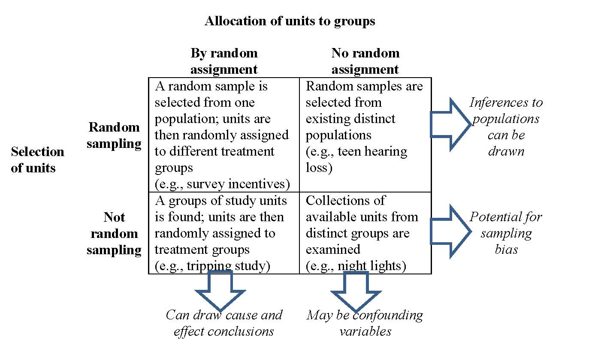
<p class="caption">(\#fig:unnamed-chunk-6)Figure taken from [@iscam]</p>
</div>
  
Note: no ANOVA (section 2.4 in @KuiperSklar) or normal probability plots (section 2.8 in @KuiperSklar).
  

<!--chapter:end:02-ttest.Rmd-->

# Simple Linear Regression {#SLR}


Though we've discussed the relationship between tests of means and simple linear regression, we will really consider simple linear regression in a much broader context (one where both the explanatory and response variables are quantitative).

The data below represents 10 different variables on health of a country measured on 143 countries.  Data taken from [@Lock5], originally from the Happy Planet Index Project [http://www.happyplanetindex.org/].  Region of the world is coded as 1 = Latin America, 2 = Western nations, 3 = Middle East, 4 = Sub-Saharan Africa, 5 = South Asia, 6 = East Asia, 7 = former Communist countries.  We are going to investigate happiness and life expectancy.  

## Inference on the Linear Model

In order to make an inferential claims on a linear regression model (e.g., p-values on hypotheses about coefficients, confidence intervals for coefficients, confidence interval for the line, prediction interval for the points, ...), we have a set of technical conditions that provide the mathematical structure leading to the t-procedures (e.g., t-test).  A course more focused on linear regression would spend time discussing how robust the model is to various deviations from the following technical conditions.  For now, we will say that sometimes transformations of either the explanatory or response variables can be an effective way to mitigate deviations from the model.

As with any measurement of the data / population, regression models are built from either statistics (Roman letters to describe a sample) or parameters (Greek letters to describe a population).  For linear regression, we have one additional differentiation due to whether the observed values ($y_i$) or the average values ($\hat{y}_i$ or $E[Y_i]$) are being modeled.  

\begin{eqnarray*}
E[Y_i|x_i] &=& \beta_0 + \beta_1 x_i \\
y_i &=& \beta_0 + \beta_1 x_i + \epsilon_i\\
&& \epsilon_i = y_i -  (\beta_0 + \beta_1 x_i)\\
\hat{y}_i &=& b_0 + b_1 x_i\\
y_i &=& b_0 + b_1 x_i + e_i\\
&& e_i = y_i - \hat{y}_i = y_i -  (b_0 + b_1 x_i)\\
\end{eqnarray*}

### Technical Conditions 


* The average value for the response variable is a linear function of the explanatory variable.
* The error terms follow a normal distribution around the linear model.
* The error terms have a mean of zero.
* The error terms have a constant variance of $\sigma^2$.
* The error terms are independent (and identically distributed).
* [http://www.rossmanchance.com/applets/2021/regshuffle/regshuffle.htm]

How do we tell whether the assumptions are met?  We can't always.  But it's good to look at plots: scatter plot, residual plot, histograms of residuals.  We denote the residuals for this model as:

\begin{align}
r_i = \hat{e}_i = y_i - \hat{y}_i
\end{align}

<div class="figure" style="text-align: center">

<p class="caption">(\#fig:unnamed-chunk-2)Figs 3.13 and 3.15 taken from @kutner.</p>
</div>


**important note!!**  The idea behind transformations is to make the model as appropriate as possible for the data at hand.  We want to find the correct **linear** model; we want our assumptions to hold.  We are not trying to find the most *significant* model or big $R^2$.


See section 2.9 in @KuiperSklar.  No normal probability plots (qq-plots); use histograms or boxplots to assess the symmetry and normality of the residuals.


## Fitting the regression line
How do we fit a regression line?  Find $b_0$ and $b_1$ that minimize the sum of squared distance of the points to the line (called ordinary least squares):

\begin{align}
\min \sum (y_i \hat{y}_i)^2 &= \min RSS \mbox{ residual sum of squares}\\
RSS &= \sum (y_i - b_0 - b_1 x_i)^2\\
\frac{\partial RSS}{\partial b_0} &= 0\\
\frac{\partial RSS}{\partial b_1} &= 0\\
b_0 &= \overline{y} - b_1 \overline{x}\\
b_1 &= r(x,y) \frac{s_x}{s_y}\\
\end{align}


* Is that the only way to find values for $b_0$ and $b_1$? (absolute distances, maximum likelihood,...)
* Resistance to outliers?
* What is $\hat{y}$ at $\overline{x}$?

\begin{align}
\hat{y} &= b_0 + b_1 \overline{x}\\
&= \overline{y} - b_1 \overline{x} + b_1 \overline{x}\\
&= \overline{y}
\end{align}

The regression line will always pass through the point $(\overline{x}, \overline{y})$.

::: {.definition}
An estimate is *unbiased* if, over many repeated samples drawn from the population, the average value of the estimates based on the different samples would equal the population value of the parameter being estimated.  That is, a statistic is unbiased if the mean of its sampling distribution is the population parameter.
:::


## Correlation

Consider a scatterplot, you'll have variability in both directions:  $(x_i - \overline{x}) \& (y_i - \overline{y})$.

\begin{align}
\mbox{sample covariance}&\\
cov(x,y) &= \frac{1}{n-1}\sum (x_i - \overline{x}) (y_i - \overline{y})\\
\mbox{sample correlation}&\\
r(x,y) &= \frac{cov(x,y)}{s_x s_y}\\
&= \frac{\frac{1}{n-1} \sum (x_i - \overline{x}) (y_i - \overline{y})}{\sqrt{\frac{\sum(x_i - \overline{x})^2}{n-1} \frac{\sum(y_i - \overline{y})^2}{n-1}}}\\
\mbox{pop cov} &= \sigma_{xy}\\
\mbox{pop cor} &= \rho = \frac{\sigma_{xy}}{\sigma_x \sigma_y}\\
\end{align}


* $-1 \leq r \leq 1 \ \ \ \ \ \& \ \ \ -1 \leq \rho \leq 1$.  
* No Spearman's rank correlation or Kendall's $\tau$.  
* $b_1 = r \frac{s_y}{s_x}$  
    * if $r=0, b_1=0$  
    * if $r=1, b_1 > 0$ but can be anything!  
    * $r < 0 \leftrightarrow b_1 < 0, r > 0 \leftrightarrow b_1 > 0$  
* Recall that $R^2$ is the proportion of variability explained by the line.  


## Errors / Residuals
Recall, part of the technical conditions required that $\epsilon_i \sim N(0, \sigma^2)$.  How do we estimate $\sigma^2$?

\begin{align}
RSS &= \sum (y_i - \hat{y}_i)^2 \ \ \ \mbox{ residual sum of squares}\\
MSS &= \sum (\hat{y}_i - \overline{y})^2 \ \ \ \mbox{ model sum of squares}\\
TSS &= \sum (y_i - \overline{y})^2 \ \ \ \mbox{ total sum of squares}\\
s_{y|x}^2 &= \hat{\sigma^2} = \frac{1}{n-2} RSS\\
s_x^2 &= \frac{1}{n-1} \sum (x_i - \overline{x})^2\\
s_y^2 &= \frac{1}{n-1} \sum (y_i - \overline{y})^2\\
var(\epsilon) &= s_{y|x}^2 = \frac{RSS}{n-2} = \frac{\sum(y_i - \hat{y}_i)^2}{n-2} = SE(\epsilon)\\
var(b_1) &= \frac{s_{y|x}^2}{(n-1) s_x^2}\\
SE(b_1) &= \frac{s_{y|x}}{\sqrt{(n-1)} s_x}\\
&= \frac{\hat{\sigma}}{\sqrt{\sum(x_i - \overline{x})^2}} = \frac{\sqrt{\sum(y_i - \hat{y}_i)^2/(n-2)}}{\sqrt{\sum(x_i - \overline{x})^2}}\\
\end{align}

* $SE(b_1) \downarrow$ as $\sigma \downarrow$
* $SE(b_1) \downarrow$ as $n \uparrow$
* $SE(b_1) \downarrow$ as $s_x \uparrow$
* WHY?
* What do we mean by $SE(b_1)$?

As we saw above, the correlation and the slope estimates are intimately related.  They are also both related to the *coefficient of determination*.
\begin{align}
R^2 = r^2 = \frac{MSS}{TSS}
\end{align}

$R^2$ is the proportion of total variability explained by the regression line (the linear relationship between the explanatory and response variables).

* If $x$ and $y$ are not at all correlated, $\hat{y}_i \approx \overline{y}$, MSS = 0, $R^2=0$.
* If $x$ and $y$ are perfectly correlated, $\hat{y}_i = y_i$, MSS=TSS, $R^2 = 1$.


### Testing $\beta_1$
If the technical conditions hold, the mathematics describing the sampling distribution of $b_1$ are well defined.  That is:

If $H_0: \beta=0$ is true, then
\begin{align}
\frac{b_1 - 0}{SE(b_1)} \sim t_{n-2}
\end{align}
Note that the degrees of freedom are now $n-2$ because we are estimating two parameters ($\beta_0$ and $\beta_1$).  We can also find a $(1-\alpha)100\%$ confidence interval for $\beta_1$:
\begin{align}
b_1 \pm t_{\alpha/2, n-2} SE(b_1)
\end{align}


## Intervals {#intervals}

As with anything that has some type of standard error, we can create intervals that give us some confidence in the statements we are making.

### Confidence Intervals

In general, confidence intervals are of the form:

```
point estimate +/- multiplier * SE(point estimate)
```

### Slope

We can create a CI for the slope parameter, $\beta_1$:
\begin{align}
b_1 &\pm t_{\alpha/2,n-2} SE(b_1)\\
b_1 &\pm t_{\alpha/2, n-2} \frac{s_{y|x}}{\sqrt{(n-1)}s_x}\\
6.693 &\pm t_{.025, 141} 0.375\\
t_{.025,141} &= qt(0.025, 141) = -1.977\\
\mbox{CI} & (5.95 \mbox{ years/unit of happy}, 7.43 \mbox{ years/unit of happy})
\end{align}
How can we interpret the CI?  Does it make sense to talk about a unit of happiness?

### Mean Response
We can also create a CI for the mean response, $E[Y|x^*] = \beta_0 + \beta_1 x^*$.  Note that the standard error of the point estimate ($\hat{y}=b_0 + b_1 x^*$) now depends on the variability associated with two things ($b_0, b_1$).
\begin{align}
SE(\hat{y(x^*)}) &= \sqrt{ \frac{s^2_{y|x}}{n} + (x^* - \overline{x})^2 SE(b_1)^2}\\
SE(\hat{y}(\overline{x})) &= s_{y|x}/\sqrt{n}\\
SE(\hat{y}(x)) &\geq s_{y|x}/\sqrt{n} \ \ \ \forall x
\end{align}
How would you interpret the associated interval?


### Prediction of an Individual Response

As should be obvious, predicting an individual is more variable than predicting a mean.

\begin{align}
SE(y(x^*)) &= \sqrt{ \frac{s^2_{y|x}}{n} + (x^* - \overline{x})^2 SE(b_1)^2 + s^2_{y|x}}\\
SE(y(x^*)) &= \sqrt{ SE(\hat{y}(x^*))^2 + s^2_{y|x}}\\
\end{align}
How would you interpret the associated interval?


## Influential Points {#infl}

**We are skipping Section \@ref(infl); you are not responsible for it.**

::: {.theorem}
*High leverage points* are x-outliers with the potential to exert undue influence on regression coefficient estimates.  *Influential points* are points that have exerted undue influence on the regression coefficient estimates.
:::

Note: typically we think of more data as better; more values will tend to decrease the sampling variability of our statistic.  But if I give you a lot more data and put it all at $\overline{x}$, $SE(b_1)$ stays exactly the same.  Why??

Recall
\begin{align}
y_{i} &= \beta_0 + \beta_1 x_i \ \ \ \epsilon_i \sim N(0,\sigma^2)\\
e_i &= y_i - \hat{y}_i
\end{align}

We plot $e_i$ versus $\hat{y}_i$.  (Why?  Typically, we want the $e_i$ to be constant at each value of $x_i$.  Note that $\hat{y}_i$ is a simple linear transformation of $x_i$, so the plot is identical.)  We want to see if the distributions of the residuals is different across the fitted line (we look for patterns).


**Not all residuals have an equal effect on the regression line!!**

### leverage
\begin{align}
h_i = \frac{1}{n} +\frac{(x_i - \overline{x})^2}{\sum_{j=1}^n (x_j - \overline{x})^2}\\
\frac{1}{n} \leq h_i \leq 1\\
\end{align}
Leverage represents the effect of point $x_i$ on the line.  We need large leverage for a particular value to have a large effect.

Note:
\begin{align}
SE(\hat{y}(x_i)) &= s_{y|x} \sqrt{h_i}\\
SE(y(x_i)) &= s_{y|x} \sqrt{(h_i + 1)}\\
SE(e_i) &= s_{y|x} \sqrt{(1-h_i)}\\
\hat{y}(x^*) &\pm t_{n-2, .025} (s_{y|x} \sqrt{h(x^*)+1})\\
\end{align}
is a 95\% prediction interval at $x^*$.  High leverage reduces the variability because the line gets pulled toward the point.

### standardized residuals

\begin{align}
\frac{e_i}{s_{y|x} \sqrt{1-h_i}} \sim t_{n-2}\\
\end{align}

### studentized residuals

\begin{align}
\frac{e_i}{s_{y|x, (i)} \sqrt{1-h_i}} &\sim t_{n-3}\\
s_{y|x, (i)} &= \frac{1}{n-3} \sum_{j \ne i} (y_j - \hat{y}_{j(i)})^2
\end{align}

Where do we predict 90\% of residuals?  $\pm t_{n-2,3 , .05}$.  About $\pm 2$.

### DFBETAs

DFBETAs represent the change in the parameter estimate due to one observation.

\begin{align}
DFBETAS_i &= \frac{b_1 - b_{1(i)}}{\frac{s_{y|x, (i)}}{\sqrt{(n-1)} s_x}}\\
\end{align}


## R Example (SLR): Happy Planet  
  

The data below represents 10 different variables on health of a country measured on 143 countries.  Data taken from [@Lock5], originally from the Happy Planet Index Project [http://www.happyplanetindex.org/].  Region of the world is coded as 1 = Latin America, 2 = Western nations, 3 = Middle East, 4 = Sub-Saharan Africa, 5 = South Asia, 6 = East Asia, 7 = former Communist countries.  We are going to investigate happiness and life expectancy.  


### Reading the data into R

```r
happy <- read_delim("~/Dropbox/teaching/MA150/spring17/happyPlanet.txt", delim="\t")
glimpse(happy)  
#> Rows: 143
#> Columns: 11
#> $ Country        <chr> "Albania", "Algeria", "Angola", "Argentina", "Armenia",…
#> $ Region         <dbl> 7, 3, 4, 1, 7, 2, 2, 7, 5, 7, 2, 1, 4, 5, 1, 7, 4, 1, 7…
#> $ Happiness      <dbl> 5.5, 5.6, 4.3, 7.1, 5.0, 7.9, 7.8, 5.3, 5.3, 5.8, 7.6, …
#> $ LifeExpectancy <dbl> 76.2, 71.7, 41.7, 74.8, 71.7, 80.9, 79.4, 67.1, 63.1, 6…
#> $ Footprint      <dbl> 2.2, 1.7, 0.9, 2.5, 1.4, 7.8, 5.0, 2.2, 0.6, 3.9, 5.1, …
#> $ HLY            <dbl> 41.7, 40.1, 17.8, 53.4, 36.1, 63.7, 61.9, 35.4, 33.1, 4…
#> $ HPI            <dbl> 47.9, 51.2, 26.8, 59.0, 48.3, 36.6, 47.7, 41.2, 54.1, 3…
#> $ HPIRank        <dbl> 54, 40, 130, 15, 48, 102, 57, 85, 31, 104, 64, 27, 134,…
#> $ GDPperCapita   <dbl> 5316, 7062, 2335, 14280, 4945, 31794, 33700, 5016, 2053…
#> $ HDI            <dbl> 0.801, 0.733, 0.446, 0.869, 0.775, 0.962, 0.948, 0.746,…
#> $ Population     <dbl> 3.15, 32.85, 16.10, 38.75, 3.02, 20.40, 8.23, 8.39, 153…
```


### Running the linear model (lm)


```r
happy.lm = lm(LifeExpectancy ~ Happiness, data=happy) 

happy.lm %>% tidy()
#> # A tibble: 2 x 5
#>   term        estimate std.error statistic  p.value
#>   <chr>          <dbl>     <dbl>     <dbl>    <dbl>
#> 1 (Intercept)    28.2      2.28       12.4 2.76e-24
#> 2 Happiness       6.69     0.375      17.8 5.78e-38
```

### Ouptut

Some analyses will need the residuals, fitted values, or coefficients individually.

```r
happy.lm %>% augment()
#> # A tibble: 143 x 8
#>   LifeExpectancy Happiness .fitted  .resid    .hat .sigma   .cooksd .std.resid
#>            <dbl>     <dbl>   <dbl>   <dbl>   <dbl>  <dbl>     <dbl>      <dbl>
#> 1           76.2       5.5    65.0  11.2   0.00765   6.09 0.0128        1.83  
#> 2           71.7       5.6    65.7   6.00  0.00737   6.14 0.00357       0.980 
#> 3           41.7       4.3    57.0 -15.3   0.0168    6.02 0.0539       -2.51  
#> 4           74.8       7.1    75.7  -0.944 0.0122    6.16 0.000148     -0.155 
#> 5           71.7       5      61.7  10.0   0.0101    6.10 0.0138        1.64  
#> 6           80.9       7.9    81.1  -0.198 0.0216    6.16 0.0000118    -0.0326
#> # … with 137 more rows
```


We can plot the main relationship, or we can plot the residuals (to check that technical conditions hold):
```
happy %>%
         ggplot(aes(x=Happiness, y=LifeExpectancy)) + 
         geom_point() + 
         geom_smooth(method="lm", se=FALSE) 

happy.lm %>% 
         augment() %>% 
         ggplot(aes(x = .fitted, y = .resid)) + 
         geom_point() + 
         geom_hline(yintercept=0)
```


Intervals of interest: mean response, individual response, and parameter(s).

```r
predict.lm(happy.lm, newdata=list(Happiness=c(4,7)),interval=c("conf"), level=.95)
#>    fit  lwr  upr
#> 1 55.0 53.2 56.7
#> 2 75.1 73.8 76.4
predict.lm(happy.lm, newdata=list(Happiness=c(4,7)),interval=c("pred"), level=.95)
#>    fit  lwr  upr
#> 1 55.0 42.7 67.3
#> 2 75.1 62.9 87.3

happy.lm %>% tidy(conf.int = TRUE)
#> # A tibble: 2 x 7
#>   term        estimate std.error statistic  p.value conf.low conf.high
#>   <chr>          <dbl>     <dbl>     <dbl>    <dbl>    <dbl>     <dbl>
#> 1 (Intercept)    28.2      2.28       12.4 2.76e-24    23.7      32.7 
#> 2 Happiness       6.69     0.375      17.8 5.78e-38     5.95      7.43
```
  
  
#### Residuals in R

We skipped the residuals section, so you are not responsible for finding residuals in R, but the R code is here for completion in case you are interested:
  


```r
happy.lm %>% augment()
#> # A tibble: 143 x 8
#>   LifeExpectancy Happiness .fitted  .resid    .hat .sigma   .cooksd .std.resid
#>            <dbl>     <dbl>   <dbl>   <dbl>   <dbl>  <dbl>     <dbl>      <dbl>
#> 1           76.2       5.5    65.0  11.2   0.00765   6.09 0.0128        1.83  
#> 2           71.7       5.6    65.7   6.00  0.00737   6.14 0.00357       0.980 
#> 3           41.7       4.3    57.0 -15.3   0.0168    6.02 0.0539       -2.51  
#> 4           74.8       7.1    75.7  -0.944 0.0122    6.16 0.000148     -0.155 
#> 5           71.7       5      61.7  10.0   0.0101    6.10 0.0138        1.64  
#> 6           80.9       7.9    81.1  -0.198 0.0216    6.16 0.0000118    -0.0326
#> # … with 137 more rows
```


<!--chapter:end:03-SLR.Rmd-->

# Analysis of Categorical Data 

(Section 6.3 in @KuiperSklar.) 


## Categorical Inference {#cat}

In either an observational study or a randomized experiment, we are often interested in assessing the statistical significance of the differences we see: Is the observed difference too big to have reasonably occurred just due to chance?  To answer the question, we will use

* simulation
* mathematical probability models.

::: {.example} 
**Back Pain & Botox**, @iscam, @botox  
The randomized clinical trial examined whether the drug botulinum toxin A (Botox) is helpful for reducing pain among patients who suffer from chronic low back pain.  The 31 subjects who participated in the study were randomly assigned to one of two treatment groups: 16 received a placebo of normal saline and the other 15 received the drug itself.  The subjects' pain levels were evaluated at the beginning of the study and again after eight weeks.  The researchers found that 2 of the 16 subjects who received the saline experienced a substantial reduction in pain, compared to 9 of the 15 subjects who received the actual drug.


1. Is this an experiment or an observational study?  
2. Explain the importance of using the "placebo" treatment of saline.  
3. Create the two-way table for summarizing the data, putting the explanatory variable as the rows and the response variable as the columns  
4. Calculate the conditional proportions of pain reduction in the two groups.  Display the results as a segmented bar graph.  Comment on the preliminary analysis.  


|           	| pain reduction 	| no pain reduction	|    	|
|-----------	|---------	|-------	|----	|
| Botox 	    | 9       	|    6  	| 15 	|
| placebo    	| 2        	| 14     	| 16 	|
|         | 11    	| 20	| 31 	|


\begin{eqnarray*}
\mbox{risk}_{\mbox{placebo}} = \frac{2}{16} &=& 0.125\\
\mbox{risk}_{\mbox{Botox}} = \frac{9}{15} &=& 0.6\\
RR &=& 4.8
\end{eqnarray*}


```r
backpain <- data.frame(treatment = c(rep("placebo", 16), rep("Botox", 15)),
                     outcome = c(rep("reduction", 2), rep("no_reduction", 14), 
                                 rep("reduction", 9), rep("no_reduction", 6)))
backpain %>%
  table()
#>          outcome
#> treatment no_reduction reduction
#>   Botox              6         9
#>   placebo           14         2
```


Note that sometimes it makes sense for the y-axis to be count and sometimes it makes sense for the y-axis to be percent.  Probably doesn't matter much here, you should choose the bar plot that seems most informative to you.


```r
backpain %>%
  ggplot(aes(x = treatment)) + 
  geom_bar(aes(fill = outcome), position = "fill") +
  ylab("percentage")

backpain %>%
  ggplot(aes(x = treatment)) + 
  geom_bar(aes(fill = outcome))
```


5. If there was no association between the treatment and the back pain relief, about how many of the 11 "successes" would you expect to see in each group?  Did the researchers observe more successes in the saline group than expected (if the drug had no effect) or fewer successes than expected?  Is this in the direction conjectured by the researchers?

6. Is is *possible* that the drug has absolutely no effect on back pain?  That the differences were simply due to chance or random variability?  How likely is that?
:::

#### Simulation {-}

* 11 red "success" cards (pain reduction); 20 black "failure" cards (no pain reduction)
* randomly deal out (i.e. shuffle) 15 cards to the treatment group and 16 cards to the placebo group.
* count how many people in the treatment group were successes?  Repeat 5 times.

* process
    * what do the cards represent?
    * what does shuffling the cards represent?
    * what implicit assumption about the two groups did the shuffling of cards represent?
    * what observational units would be represented by the dots on the dotplot?
    * why would we count the number of repetitions with 9 or more "successes"?

* Repeat simulation using the two-way table applet:
[http://www.rossmanchance.com/applets/2021/chisqshuffle/ChiSqShuffle.htm]

* summary
    * How many reps?
    * How many as extreme as the true data?
    * What proportion are at least as extreme as the true data?
    * Do our data support the researchers conjecture?
    * What if the actual data had been 7 successes in the treatment group (and 4 in the placebo group)?

::: {.definition}
**p-value**  The p-value is the probability of seeing our results or more extreme if there is nothing interesting going on with the data.  (This is the same definition of p-value that you will always use in this class and in your own research.)
:::


Notice that regardless of whether or not the drug has an effect, the data will be different each time (think: new 31 people).  The small p-value allows us to draw cause-and-effect conclusions, but doesn't necessarily allow us to infer to a larger population.  Why not? 

|  low cutoff     	| p-value 	| high cutoff	| evidence         	|
|:-------:	|:--------------------:	|:-------:|:------------------------------	|
|       	| p-value $\leq$ 	| 0.001 	| very strong evidence         	|
| 0.001 	|  $<$ p-value $\leq$  	| 0.01  	| strong evidence              	|
| 0.01  	|  $<$ p-value $\leq$  	| 0.05  	| moderate evidence            	|
| 0.05  	|  $<$ p-value $\leq$  	| 0.10  	| weak but suggestive evidence 	|
| 0.10  	|   $<$ p-value   	|       	| little or no evidence        	|


### Simulation using R {#inferFET}

The simulation from the applet can be recreated using the **infer** package in R.  Note the different pieces of the simulation using functions like `specify()`, `hypothesize()`, `generate()`, and `calculate()`.  Also notice that this particular function works best using the difference in proportions (which we discussed in class is equivalent to recording the single count of Botox patients who had reduced back pain).

Step 1.  Calculate the observed difference in proportion of patients with reduced back pain.  Note that as with linear regression we continue to use the syntax:  `responsevariable ~ explanatoryvariable`.  

Step 2.  Go through the simulation steps, just like the applet.

* `specify()` the variables  
* `hypothesize()` about the null claim  
* `generate()` many permutions of the data  
* `calculate()` the statistic of interest for all the different permutations  

Step 3. Plot a histogram representing the differences in proportions for all the many permuted tables. The plot represents the distribution of the differences in proportion under the null hypothesis.

Step 4. Calculate the p-value from the sampling distribution generated in Step 3.


```r
library(infer)

# Step 1.
diff_props <- backpain %>%
  specify(outcome ~ treatment, success = "reduction") %>%
  calculate(stat = "diff in props")

diff_props  # print to screen to see the observed difference
#> # A tibble: 1 x 1
#>    stat
#>   <dbl>
#> 1 0.475

# Step 2.
nulldist <- backpain %>%
  specify(outcome ~ treatment, success = "reduction") %>%
  hypothesize(null = "independence") %>%
  generate(reps = 1000, type = "permute") %>%
  calculate(stat = "diff in props")

# Step 3.
visualize(nulldist) + 
  shade_p_value(obs_stat = diff_props, direction = "greater")

# Step 4.
nulldist %>%
  get_p_value(obs_stat = diff_props, direction = "greater")
#> # A tibble: 1 x 1
#>   p_value
#>     <dbl>
#> 1   0.007
```


## Fisher's Exact Test {#fisher}

(Section 6.4 in @KuiperSklar, great detailed explanation!)

Because we have a fixed sample, we use the hypergeometric distribution to enumerate the possible ways of choosing our data or more extreme given fixed row and column totals.


|           	| pain reduction 	| no pain reduction	|    	|
|-----------	|---------	|-------	|----	|
| Botox 	    | 9 = x      	|    6  	| 15 	= n |
| placebo    	| 2        	| 14     	| 16 	|
|         | 11  = M  	| 20 = N - M	| 31 	= N|

To make it simpler, let's say I have 5 items (N=5), and I want to choose 3 of them (n=3).  How many ways can I do that?


> SSSNN, SSNSN, SSNNS, SNSSN, SNSNS, SNNSS, NSSSN, NSSNS, NSNSS, NNSSS  [5!/ 3! 2!]
> (S = select, N = not selected)


So, how many different ways can I select 11 people (out of 31) to be my "pain reduction" group?  That is the total number of different groups of size 11 from 31.  But really, we want our groups to be of a certain breakdown.  We need 2 (of 16) to have gotten the placebo and 9 (of 15) to have gotten the Botox treatment.

::: {.definition}
**Hypergeometric Probability**  For any $2 \times 2$ table when there are N observations with M total successes , the probability of observing x successes in a sample of size n is:
:::

\begin{eqnarray*}
P(X=x) = \frac{\# \mbox{ of ways to select x successes and n-x failures}}{\# \mbox{ of ways to select n subjects}} = \frac{ { M \choose x} {N-M \choose n-x}}{{N \choose n}}\\
\end{eqnarray*}

Find the P(X=2)

We can now find EXACT probabilities associated with the following hypotheses.
\begin{eqnarray*}
&&H_0: p_{pl} = p_{btx}\\
&&H_a: p_{pl} < p_{btx}\\
&&p = \mbox{true probability of no pain}\\
\end{eqnarray*}


Is this a one- or two-sided test?  Why?  [Note:  the conditions here include that the row and column totals are fixed -- a **conditional test of independence**.  However, the research project in the back of chapter 6 extends the permutation test to demonstrated that the probabilities hold even under alternative technical conditions.

Note also that we get an exact probability with no conditions needed about the sample size being big enough (we can use Fisher's Exact Test even when true probabilities are close to 0 or 1.]


## Testing independence of two categorical variables {#chisq}

(Sections 6.5, 6.6, 6.7 in @KuiperSklar.)

### $\chi^2$ tests 

(Section 6.6 in @KuiperSklar.)

2x2... but also rxc ($p_a = p_b = p_c$)


We can also use $\chi^2$ tests to evaluate $r \times c$ contingency tables.  Our main question now will be whether there is an association between two categorical variables of interest.  Note that we are now generalizing what we did with the Botox and back pain example.  Are the two variables independent?  If the two variables are independent, then the state of one variable is not related to the probability of the different outcomes of the other variable.

If the data were sampled in such a way that we have random samples of both the explanatory and response variables (e.g., cross classification study), then we typically do a test of association:

\begin{eqnarray*}
H_0: && \mbox{ the two variables are independent}\\
H_a: && \mbox{ the two variables are not independent}
\end{eqnarray*}

If the data are sampled in such a way that the response is measured across specified populations (as in the example below), we typically do a test of homogeneity of proportions.  For example,

\begin{eqnarray*}
H_0: && p_1 = p_2 = p_3\\
H_a: && \mbox{not } H_0
\end{eqnarray*}
where $p=P(\mbox{success})$ for each of groups 1,2,3.


How do we get expected frequencies?  The same mathematics hold regardless of the type of test (i.e., sampling mechanism used to collect the data). If, in fact,the variables are independent, then we should be able to multiply their probabilities.  If the probabilities are the same, we expect the overall proportion of each response variable to be the same as the proportion of the response variable in each explanatory group.  And the math in the example below follows directly.

::: {.example} 
The table below show the observed distributions of ABO blood type in three random samples of African Americans living in different locations.  The three datasets, collected in the 1950s by three different investigators, are reproduced in [@bloodtype].


|          |            |      | Blood | Type |      |       |
|----------|------------|------|-------|------|------|-------|
|          |            | A    | B     | AB   | O    | Total |
| Location | (Florida)  | 122  | 117   | 19   | 244  | 502   |
|          | (Iowa)     | 1781 | 1351  | 289  | 3301 | 6722  |
|          | (Missouri) | 353  | 269   | 60   | 713  | 1395  |
|          | Total      | 2256 | 1737  | 368  | 4258 | 8619  |
:::

#### Test of Homogeneity of Proportions (equivalent mathematically to independence)

If there is no difference in blood type proportions across the groups, then:

\begin{eqnarray*}
P(AB | FL) = P(AB | IA) = P(AB | MO) = P(AB)
\end{eqnarray*}

We will use $\hat{P}(AB) = \frac{368}{8619}$ as baseline for expectation (under $H_0$) for all the groups.  That is, we would expect,

\begin{eqnarray*}
\# \mbox{expected for AB blood and Iowa} &=&  \frac{368}{8619} \cdot 6722\\
\end{eqnarray*}


#### Test of Independence (equivalent mathematically to homogeneity of proporitions)

\begin{eqnarray*}
P(cond1 \mbox{ & } cond2 ) &=& P(cond1) P(cond2)  \mbox{ if variables 1 and 2 are independent}\\
P(AB \mbox{ blood & Iowa}) &=& P(AB \mbox{ blood}) P(\mbox{Iowa}) \\
&=& \bigg( \frac{368}{8619}\bigg) \bigg( \frac{6722}{8619} \bigg)\\
&=& 0.0333\\
\# \mbox{expected for AB blood and Iowa} &=& 0.033 \cdot 8619\\
&=& \frac{368 \cdot 6722}{8619}\\
E_{i,j} &=& \frac{(i \mbox{ row total})(j \mbox{ col total})}{\mbox{grand total}}\\
\end{eqnarray*}


And the expected values under the null hypothesis...

|          |            |         | Blood   | Type   |         |       |
|----------|------------|---------|---------|--------|---------|-------|
|          |            | A       | B       | AB     | O       | Total |
| Location | (Florida)  | 131.4   | 101.17  | 21.43  | 248.00  | 502   |
|          | (Iowa)     | 1759.47 | 1354.69 | 287.00 | 3320.83 | 6722  |
|          | (Missouri) | 365.14  | 281.14  | 59.56  | 689.16  | 1395  |
|          | Total      | 2256    | 1737    | 368    | 4258    | 8619  |


\begin{eqnarray*}
X^2 &=& \sum_{all cells} \frac{( O - E)^2}{E}\\
&=& 5.65\\
\mbox{p-value} &=& P(\chi^2_6 \geq 5.65) \\
&=& 1 - pchisq(5.65, 6)\\
&=& 0.464
\end{eqnarray*}


We cannot reject the null hypothesis.  Again, we have no evidence against the null hypothesis that blood types are independently distributed in the various regions.


How do we know if our test statistic is a big number or not?  Well, it turns out that the test statistic ($X^2$) will have an approximate $\chi^2$ distribution with degrees of freedom = $(r- 1)\cdot (c-1)$.  As long as:


* We have a random sample from the population.  
* We expect at least 1 observation in every cell ($E_i \geq 1 \forall i$)  
* We expect at least 5 observations in 80\% of the cells ($E_i \geq 5$ for 80% of $i$)  


When there are only two populations, the $\chi^2$ procedure is equivalent to the two-sided z-test for proportions.  The chi-squared test statistic is the square of the z-test statistic.  That is, the chi-squared test is exactly the same as the two-sided alternative for the z-test.

use chi-square if you have multiple populations

use z-test if you want one-sided tests or confidence intervals.


## Parameter Estimation {#catest}

(Section 6.8 in @KuiperSklar.)

::: {.definition}
**Data Types** Data are often classified as
:::

* Categorical - each unit is assigned to a category  
* Quantitative - each observational unit is assigned a numerical value  
* (Binary - a special case of categorical with 2 categories, e.g. male/female)  


> Table 6.6 on page 193 of @KuiperSklar is excellent and worth looking at.


::: {.example} 
**Popcorn & Lung Disease** @iscam  

How can we tell if popcorn production is related to lung disease?  Consider High / Low exposure:


|               | Airway obstructed | Airway not obstructed |     |
|---------------|-------------------|-----------------------|-----|
| low exposure  | 6                 | 52                    | 58  |
| high exposure | 15                | 43                    | 58  |
|               | 21                | 95                    | 116 |


Is 21 a lot of people?  Can we compare 6 vs. 15?  What should we look at?  *proportions* (always a number between 0 and 1).  Look at your data (graphically and numerically).  Segmented bar graph (mosaic plot):

\begin{figure}[ht]
\begin{center}
\includegraphics[scale=.4,angle=0]{popcornbar.pdf}
\end{center}
\end{figure}

Is there a difference in the two groups?  Look at the difference in proportions or risk:

\begin{eqnarray*}
6/58 = 0.103 & 15/58=0.2586 & \Delta = 0.156\\
p_1 = 0.65 & p_2 = 0.494 & \Delta = 0.156\\
p_1 = 0.001 & p_2 = 0.157 & \Delta = 0.156\\
\end{eqnarray*}
:::

### Differences in Proportions

It turns out that the sampling distribution of the difference in the sample proportions (of success) across two *independent* groups can be modeled by the normal distribution if we have reasonably large sample sizes (CLT).

To ensure the accuracy of the test, check whether np and n(1-p) is bigger than 5 in both samples is usually adequate.  A more precise check is $n_s \hat{p}_c$ and $n_s(1-\hat{p}_c)$ are both greater than 5; $n_s$ is the smaller of the two sample sizes and $\hat{p}_c$is the sample proportion when the two samples are combined into one.


Note:
\begin{eqnarray*}
\hat{p}_1 - \hat{p}_2 \sim N\Bigg(p_1 - p_2, \sqrt{\frac{p_1(1-p_1)}{n_1} + \frac{p_2(1-p_2)}{n_2}}\Bigg)
\end{eqnarray*}

When testing independence, we assume that $p_1=p_2$, so we use the pooled estimate of the proportion to calculate the SE:
\begin{eqnarray*}
SE(\hat{p}_1 - \hat{p}_2) = \sqrt{ \hat{p}_c(1-\hat{p}_c) \bigg(\frac{1}{n_1} + \frac{1}{n_2}\bigg)}
\end{eqnarray*}

So, when testing, the appropriate test statistic is:
\begin{eqnarray*}
 Z = \frac{\hat{p}_1 - \hat{p}_2 - 0}{ \sqrt{ \hat{p}_c(1-\hat{p}_c) (\frac{1}{n_1} + \frac{1}{n_2})}}
\end{eqnarray*}


### CI for differences in proportions

We can't pool our estimate for the SE, but everything else stays the same...


\begin{eqnarray*}
SE(\hat{p}_1 - \hat{p}_2) = \sqrt{\frac{\hat{p}_1(1-\hat{p}_1)}{n_1} + \frac{\hat{p}_2(1-\hat{p}_2)}{n_2}}
\end{eqnarray*}


The main idea here is to determine whether two categorical variables are independent.  That is, does knowledge of the value of one variable tell me something about the probability of the other variable (gender and pregnancy).  We're going to talk about two different ways to approach this problem.

### Relative Risk

::: {.definition}
**Relative Risk**  The relative risk (RR) is the ratio of risks for each group.  We say, "The risk of success is **RR** times higher for those in group 1 compared to those in group 2."
:::

\begin{eqnarray*}
\mbox{relative risk} &=& \frac{\mbox{risk group 1}}{\mbox{risk group 2}}\\
&=&  \frac{\mbox{proportion of successes in group 1}}{\mbox{proportion of successes in group 2}}\\
\mbox{RR} &=& \frac{p_1}{p_2} = \frac{p_1}{p_2}\\
\hat{\mbox{RR}} &=& \frac{\hat{p}_1}{\hat{p}_2}
\end{eqnarray*}


$\hat{RR}$ in the popcorn example is $\frac{15/58}{6/58} = 2.5$.  We say, "The risk of airway obstruction is 2.5 times higher for those in high exposure group compared to those in the low exposure group."  What about

* sample size?  
* baseline risk?  

To create confidence intervals for relative risk, we use the fact that:

\begin{eqnarray*}
SE(\ln (\hat{RR})) &\approx& \sqrt{\frac{(1 - \hat{p}_1)}{n_1 \hat{p}_1} + \frac{(1-\hat{p}_2)}{n_2 \hat{p}_2}}
\end{eqnarray*}

### Odds Ratios

A related concept to risk is odds.  It is often used in horse racing, where "success" is typically defined as losing.  So, if the odds are 3 to 1 we would expect to lose 3/4 of the time.

::: {.definition}
**Odds Ratio** A related concept to risk is odds.  It is often used in horse racing, where "success" is typically defined as losing.  So, if the odds are 3 to 1 we would expect to lose 3/4 of the time.  The odds ratio (OR) is the ratio of odds for each group.  We say, "The odds of success is **OR** times higher for those in group 1 compared to those group 2."
:::

\begin{eqnarray*}
\mbox{odds} &=& \frac{\mbox{proportion of successes}}{\mbox{proportion of failures}}\\
&=& \frac{\mbox{number of successes}}{\mbox{number of failures}} = \theta\\
\hat{\mbox{odds}} &=& \hat{\theta}\\
\mbox{odds ratio} &=& \frac{\mbox{odds group 1}}{\mbox{odds group 2}} \\
\mbox{OR} &=& \frac{\theta_1}{\theta_2} = \frac{p_1/(1-p_1)}{p_2/(1-p_2)}= \frac{p_1/(1-p_1)}{p_2/(1-p_2)}\\
\hat{\mbox{OR}} &=& \frac{\hat{\theta}_1}{\hat{\theta}_2} = \frac{\hat{p}_1/(1-\hat{p}_1)}{\hat{p}_2/(1-\hat{p}_2)}\\
\end{eqnarray*}


$\hat{OR}$ in the popcorn example is $\frac{15/43}{6/52} = 3.02$.  We say, "The odds of airway obstruction are 3 times higher for those in the high exposure group compared to those in the low exposure group."


#### OR is more extreme than RR

Without loss of generality, assume the true $RR > 1$, implying $p_1 / p_2 > 1$ and $p_1 > p_2$.

Note the following sequence of consequences:

\begin{eqnarray*}
RR = \frac{p_1}{p_2} &>& 1\\
\frac{1 - p_1}{1 - p_2} &<& 1\\
\frac{ 1 / (1 - p_1)}{1 / (1 - p_2)} &>& 1\\
\frac{p_1}{p_2} \cdot \frac{ 1 / (1 - p_1)}{1 / (1 - p_2)} &>& \frac{p_1}{p_2}\\
OR &>& RR
\end{eqnarray*}

#### Other considerations:

* Observational study (who worked in each place?)  
* Cross sectional (only one point in time)  
* Healthy worker effect (who stayed home sick?)    
* **Explanatory variable** is one that is a potential explanation for any changes (here exposure level).  
* **Response variable** is the measured outcome of interest (here airway obstruction).  


::: {.example} 
**Smoking & Lung Cancer** @iscam  

After World War II, evidence began mounting that there was a link between cigarette smoking and pulmonary carcinoma (lung cancer).  In the 1950s, two now classic articles were published on the subject.  One of these studies was conducted in the United States by @wynder.  They found records from a large number (684) of patients with proven bronchiogenic carcinoma (a specific form of lung cancer) in hospitals in California, Colorado, Missouri, New Jersey, New York, Ohio, Pennsylvania, and Utah.  They personally interviewed 634 of the subjects to identify their smoking habits, occupation, exposure to dust and fumes, alcohol intake, education, and cause of death of parents and siblings.  Thirty-three subjects completed mailed questionnaires, and information for the other 17 was obtained from family members or close acquaintances.  Of those in the study, the researchers focused on 605 male patients with the same form of lung cancer.  Another 1332 hospital patients with similar age and economic distribution (including 780 males) without lung cancer were interviewed by these researchers in St. Louis and by other researchers in Boston, Cleveland, and Hines, Illinois.

The following two-way table replicates the counts for the 605 male patients with the same form of cancer and for the "control-group" of 780 males.


|           |           | patients | controls |
|-----------|-----------|----------|----------|
| none      | $<$ 1/day | 8        | 114      |
| light     | 1-9/day   | 14       | 90       |
| mod heavy | 10-15/day | 61       | 148      |
| heavy     | 16-20/day | 213      | 278      |
| excessive | 21-34/day | 187      | 90       |
| chain     | 35$+$/day | 122      | 60       |


Given the results of the study, do you think we can generalize from the sample to the population?  Explain and make it clear that you know the difference between a sample and a population.
:::


|               | cancer | healthy |     |
|---------------|--------|---------|-----|
| chain smoking | 122    | 60      | 182 |
| no smoking    | 8      | 114     | 122 |
|               | 130    | 174     | 304 |

* Causation?  
* Case-control study  (605 with lung cancer, 780 without... baseline rate?)  


| Group A 	| Group B 	|
|-----------------------	|-----------------------	|
| expl = smoking status 	| expl = lung cancer 	|
| resp = lung cancer 	| resp = smoking status 	|


* If lung cancer is considered a success and no smoking is baseline:  

\begin{eqnarray*}
\hat{RR} &=& \frac{122/182}{8/122} = 10.22\\
\hat{OR} &=& \frac{122/60}{8/114} = 28.9\\
\end{eqnarray*}
The risk of lung cancer is 10.22 times higher for those who smoke than for those who don't smoke.

The odds of lung cancer is 28.9 times higher for those who smoke than for those who don't smoke.


* If chain smoking is considered a success and healthy is baseline:  

\begin{eqnarray*}
\hat{RR} &=& \frac{122/130}{60/174} = 2.7\\
\hat{OR} &=& \frac{122/8}{60/114} = 28.9\\
\end{eqnarray*}
The risk of smoking is 2.7 times higher for those who have lung cancer than for those who don't have lung cancer.

The odds of smoking is 28.9 times higher for those who have lung cancer than for those who don't have lung cancer.


\noindent
We know the risk of being a light smoker if you have lung cancer but we do *not* know the risk of lung cancer if you are a light smoker.  Let's say we have a *population* of 1,000,000 people:

|               | cancer | healthy |           |
|---------------|--------|---------|-----------|
| light smoking | 49,000 | 51,000  | 100,000   |
| no smoking    | 1,000  | 899,000 | 900,000   |
|               | 50,000 | 950,000 | 1,000,000 |

\begin{eqnarray*}
P(\mbox{light} | \mbox{lung cancer}) &=& \frac{49,000}{50,000} = 0.98\\
P(\mbox{lung cancer} | \mbox{light}) &=& \frac{49,000}{100,000} = 0.49\\
\end{eqnarray*}


* What is the explanatory variable?
* What is the response variable?
* relative risk?
* odds ratio?


| Group A 	| Group B 	|
|-----------------------	|-----------------------	|
| expl = smoking status 	| expl = lung cancer 	|
| resp = lung cancer 	| resp = smoking status 	|


* If lung cancer is considered a success and no smoking is baseline:

\begin{eqnarray*}
RR &=& \frac{49/100}{1/900} = 441\\
OR &=& \frac{49/51}{1/899} = 863.75\\
\end{eqnarray*}

* If light smoking is considered a success and healthy is baseline:

\begin{eqnarray*}
RR &=& \frac{49/50}{51/950} = 18.25\\
OR &=& \frac{49/1}{51/899} = 863.75\\
\end{eqnarray*}


OR is the same no matter which variable you choose as explanatory versus response!  Though, in general, we still prefer to know baseline odds or baseline risk (which we can't know with a case-control study).


::: {.example} 
**More on Smoking & Lung Cancer**, @iscam  
Now we have a cohort prospective study.  (Previously we had a case-control retrospective study).  Now do we have baseline risk estimates?  Yes!  But be careful, we can't conclude causation, because the study is still observational.
:::


### Confidence Interval for OR {#ciOR}

Due to some theory that we won't cover:

\begin{eqnarray*}
SE(\ln (\hat{OR})) &\approx& \sqrt{\frac{1}{n_1 \hat{p}_1 (1-\hat{p}_1)} + \frac{1}{n_2 \hat{p}_2 (1-\hat{p}_2)}}
\end{eqnarray*}

Note that your book introduces $SE(\ln(\hat{OR}))$ in the context of hypothesis testing where the null, $H_0: p_1 = p_2$, is assumed to be true.  If the null is true, you'd prefer an estimate for the proportion of success to be based on the entire sample:

\begin{eqnarray*}
SE(\ln (\hat{OR})) &\approx& \sqrt{\frac{1}{n_1 \hat{p} (1-\hat{p})} + \frac{1}{n_2 \hat{p}(1-\hat{p})}}
\end{eqnarray*}


So, a $(1-\alpha)100\%$ CI for the $\ln(OR)$ is:
\begin{eqnarray*}
\ln(\hat{OR}) \pm z_{1-\alpha/2} SE(\ln(\hat{OR}))
\end{eqnarray*}

Which gives a $(1-\alpha)100\%$ CI for the $OR$:
\begin{eqnarray*}
(e^{\ln(\hat{OR}) - z_{1-\alpha/2} SE(\ln(\hat{OR}))}, e^{\ln(\hat{OR}) + z_{1-\alpha/2} SE(\ln(\hat{OR}))})
\end{eqnarray*}


Back to the example... $OR = 28.9.$
\begin{eqnarray*}
SE(\ln(\hat{OR})) &=& \sqrt{\frac{1}{182*0.67*(1-0.67)} + \frac{1}{122*0.0656*(1-0.0656)}}\\
&=& 0.398\\
90\% \mbox{ CI for } \ln(OR) && \ln(28.9) \pm 1.645 \cdot 0.398\\
&& 3.366 \pm 1.645 \cdot 0.398\\
&& (2.71, 4.02)\\
90\% \mbox{ CI for } OR && (e^{2.71}, e^{4.02})\\
&& (15.04, 55.47)\\
\end{eqnarray*}


We are 90% confident that the true $\ln(OR)$ is between 2.71 and 4.02.  We are 90% confident that the true $OR$ is between 15.04 and 55.47.  That is, the true odds of getting lung cancer if you smoke are somewhere between 15.04 and 55.47 times higher than if you don't smoke, with 90% confidence.


Note 1: we use the theory which allows us to understand the sampling distribution for the $\ln(\hat{OR}).$  We use the *process* for creating CIs to transform back to $OR$.

Note 2: We do not use the t-distribution here because we are not estimating the population standard deviation.

Note 3: There are not good general guidelines for checking whether the sample sizes are large enough for the normal approximation.  Most authorities agree that one can get away with smaller sample sizes here than for the differences of two proportions.  If the sample sizes pass the rough check discussed for $\chi^2$, they should be large enough to support inferences based on the approximate normality of the log of the estimated odds ratio, too.  [@sleuth, page 541]

For the normal approximation to hold, we need the expected counts in each cell to be at least 5. [@pagano, page 355]


Note 4: If any of the cells are zero, many people will add 0.5 to that cell's observed value.


Note 5: The OR will always be more extreme than the RR (one more reason to be careful...)

\begin{eqnarray*}
\mbox{assume } && \frac{X_1 / n_1}{X_2 / n_2} = RR > 1\\
& & \\
\frac{X_1}{n_1} &=& RR \ \ \frac{X_2}{n_2}\\
\frac{X_1}{n_1 - X_1} &=& RR \ \ \bigg( \frac{n_1}{n_2}  \frac{n_2 - X_2}{n_1 - X_1} \bigg) \frac{X_2}{n_2-X_2}\\
OR &=& RR \ \ \bigg(\frac{n_1}{n_2} \bigg) \frac{n_2 - X_2}{n_1 - X_1}\\
 &=& RR \ \ \bigg(\frac{1/n_2}{1/n_1} \bigg) \frac{n_2 - X_2}{n_1 - X_1}\\
 &=& RR  \ \ \frac{1 - X_2/n_2}{1 - X_1/n_1}\\
 & > & RR
\end{eqnarray*}
[$1 - \frac{X_2}{n_2} > 1 - \frac{X_1}{n_1} \rightarrow \frac{1 - \frac{X_2}{n_2}}{1 - \frac{X_1}{n_1}} > 1$]


Note 6: $RR \approx OR$ if the risk is small (the denominator of the OR will be very similar to the denominator of the RR).


## Types of Studies {#studies}

(Section 6.9 of @KuiperSklar.)

::: {.definition}
**Explanatory variable** is one that is a potential explanation for any changes in the response variable.
:::

::: {.definition}
**Response variable** is the measured outcome of interest.
:::

::: {.definition}
**Case-control study:** identify observational units by response
:::

::: {.definition}
**Cohort study:** identify observational units by explanatory variable
:::

::: {.definition}
**Cross-classification study:** identify observational units regardless of levels of the variable.
:::

### Retrospective versus Prospective Studies

After much research (and asking many people who do not all agree!), I finally came across a definition of retrospective that I like.  Note, however, that many many books *define* retrospective as synonymous with case-control.  That is, they define a retrospective study to be one in which the observational units were chosen based on their status of the response variable.  I disagree with that definition.  As you see below, retrospective studies are defined based on the when the variables were *measured*.  I've also given a quote from the Kuiper text where retrospective is defined as any study where historic data are collected (I like this definition less).

::: {.definition}
A **prospective** study watches for outcomes, such as the development of a disease, during the study period.  The explanatory variables are *measured* before the response variable occurs.
:::

::: {.definition}
A **retrospective** study looks backwards and examines exposures to suspected risk or protection factors in relation to an outcome that is established at the start of the study.   The explanatory variables are *measured* after the response has happened.
:::

> Studies can be classified further as either prospective or retrospective. We define a prospective study as one in which exposure and covariate measurements are made before the cases of illness occur. In a retrospective study these measurements are made after the cases have already occurred... Early writers referred to cohort studies as prospective studies and to case-control studies as retrospective studies because cohort studies usually begin with identification of the exposure status and then measure disease occurrence, whereas case-control studies usually begin by identifying cases and controls and then measure exposure status. The terms prospective and retrospective, however, are more usefully employed to describe the **timing of disease occurrence with respect to exposure measurement**. For example, case-control studies can be either prospective or retrospective.  A prospective case-control study uses exposure measurements taken before disease, whereas a retrospective case-control study uses measurements taken after disease.  [@modepi, page 74]

> Retrospective cohort studies also exist. In these designs past (medical) records are often used to collect data. As with prospective cohort studies, the objective is still to first establish groups based on an explanatory variable. However since these are past records the response variable can be collected at the same time. [@KuiperSklar, chapter 6, page 24]


Understanding if a study is retrospective or prospective leads to having a sense of the biases within a study.  

* The retrospective aspect may introduce selection bias and misclassification or information bias. With retrospective studies, the temporal relationship is frequently difficult to assess.  

#### Disadvantages of Prospective Cohort Studies {-}
  
* You may have to follow large numbers of subjects for a long time.  
* They can be very expensive and time consuming.  
* They are not good for rare diseases.  
* They are not good for diseases with a long latency.  
* Differential loss to follow up can introduce bias.  


#### Disadvantages of Retrospective Cohort Studies {-}  

* As with prospective cohort studies, they are not good for very rare diseases.
* If one uses records that were not designed for the study, the available data may be of poor quality.
* There is frequently an absence of data on potential confounding factors if the data was recorded in the past.
* It may be difficult to identify an appropriate exposed cohort and an appropriate comparison group.
* Differential losses to follow up can also bias retrospective cohort studies.

Disadvantages from: http://sphweb.bumc.bu.edu/otlt/MPH-Modules/EP/EP713_CohortStudies/EP713_CohortStudies5.html


##### Examples of studies: {-}

* cross-classification, prospective: NHANES  
* cross-classification, retrospective: death records (if exposure is measured post-hoc)  
* case-control, prospective: the investigator still *enrolls* based on outcome status, but the investigator must wait for the cases to occur    
* case-control, retrospective: at the start of the study, all cases have already occurred and the investigator goes back to measure the exposure (explanatory) variable  
* cohort, prospective: follows the selected participants to assess the proportion who develop the disease of interest  
* cohort, retrospective: the exposure and outcomes have already happened (i.e., death records)    

#### Which test? {-}

(Section 6.1 of @KuiperSklar.)

It turns out that the tests above (independence, homogeneity of proportions, homogeneity of odds) are typically equivalent with respect to their conclusions.  However, they each have particular conditions related to what they are testing, but that we can generally use any of them for our hypotheses of interest.  However, we need to be very careful about our **interpretations**!


(No goodness of fit, section 6.11 of @KuiperSklar.)

## R Example (categorical data): Botox and back pain


###  Entering and visualizing the data


```r
backpain <- data.frame(treatment = c(rep("placebo", 16), rep("Botox", 15)),
                     outcome = c(rep("reduction", 2), rep("no reduction", 14), 
                                 rep("reduction", 9), rep("no reduction", 6)))
backpain %>%
  table()
#>          outcome
#> treatment no reduction reduction
#>   Botox              6         9
#>   placebo           14         2

backpain %>%
  ggplot(aes(x = treatment)) + 
  geom_bar(aes(fill = outcome), position = "fill") +
  ylab("percentage")

backpain %>%
  ggplot(aes(x = treatment)) + 
  geom_bar(aes(fill = outcome))
```


### Fisher's Exact Test


```r
backpain %>%
  table() %>%
  fisher.test()
#> 
#> 	Fisher's Exact Test for Count Data
#> 
#> data:  .
#> p-value = 0.009
#> alternative hypothesis: true odds ratio is not equal to 1
#> 95 percent confidence interval:
#>  0.00848 0.71071
#> sample estimates:
#> odds ratio 
#>      0.104

# their CI is an inversion of the HT
# an approximate SE for the ln(OR) is given by:
se.lnOR <- sqrt(1/(16*(2/16)*(14/16)) + 1/(15*(9/15)*(6/15)))
se.lnOR
#> [1] 0.922
```

### Chi-squared Analysis


```r
backpain %>%
  table() %>%
  chisq.test()
#> 
#> 	Pearson's Chi-squared test with Yates' continuity correction
#> 
#> data:  .
#> X-squared = 6, df = 1, p-value = 0.02
```

<!--chapter:end:04-cat.Rmd-->

# Logistic Regression


## Motivation for Logistic Regression {#logmodel}

During investigation of the US space shuttle *Challenger* disaster, it was learned that project managers had judged the probability of mission failure to be 0.00001, whereas engineers working on the project had estimated failure probability at 0.005.  The difference between these two probabilities, 0.00499 was discounted as being too small to worry about.  Is a different picture provided by considering odds?  How is it interpreted?

The logistic regression model is a *generalized* linear model.  That is, a linear model as a function of the expected value of the response variable.  We can now model binary response variables.
\begin{align}
GLM: g(E[Y | X]) = \beta_0 + \beta_1 X
\end{align}
where $g(\cdot)$ is the link function.  For logistic regression, we use the logit link function:
\begin{align}
\mbox{logit} (p) = \ln \bigg( \frac{p}{1-p} \bigg)
\end{align}


#### Surviving Third-degree Burns {#ex:burnexamp}

These data refer to 435 adults who were treated for third-degree burns by the University of Southern California General Hospital Burn Center. The patients were grouped according to the area of third-degree burns on the body (measured in square cm). In the table below are recorded, for each midpoint of the groupings `log(area +1)`, the number of patients in the corresponding group who survived, and the number who died from the burns. [@burn]

| log(area+1) midpoint	| survived 	| died 	| prop surv 	|
|:-----------:	|:--------:	|:----:	|:---------:	|
| 1.35 	| 13 	| 0 	| 1 	|
| 1.60 	| 19 	| 0 	| 1 	|
| 1.75 	| 67 	| 2 	| 0.971 	|
| 1.85 	| 45 	| 5 	| 0.900 	|
| 1.95 	| 71 	| 8 	| 0.899 	|
| 2.05 	| 50 	| 20 	| 0.714 	|
| 2.15 	| 35 	| 31 	| 0.530 	|
| 2.25 	| 7 	| 49 	| 0.125 	|
| 2.35 	| 1 	| 12 	| 0.077 	|


We can see that the logit transformation linearizes the relationship.


A first idea might be to model the relationship between the probability of success (that the patient survives) and the explanatory variable `log(area +1)` as a simple linear regression model. However, the scatterplot of the proportions of patients surviving a third-degree burn against the explanatory variable shows a distinct curved relationship between the two variables, rather than a linear one. It seems that a transformation of the data is in place.

The functional form relating x and the probability of success looks like it could be an `S` shape.  But we'd have to do some work to figure out what the form of that `S` looks like.  Below I've given some different relationships between x and the probability of success using $\beta_0$ and $\beta_1$ values that are yet to be defined.  Regardless, we can see that by tuning the functional relationship of the `S` curve, we can get a good fit to the data.


S-curves ( `y = exp(linear) / (1+exp(linear))` ) for a variety of different parameter settings.  Note that the x-axis is some continuous variable `x` while the y-axis is the probability of success at that value of `x`.  More on this as we move through this model.


Why doesn't linear regression work here?  

* The response isn't normal  
* The response isn't linear (until we transform)  
* The predicted values go outside the bounds of (0,1)   
* Note: it *does* work to think about values inside (0,1) as probabilities  

### The logistic model

Instead of trying to model the using *linear regression*, let's say that we consider the relationship between the variable $x$ and the probability of success to be given by the following generalized linear model. (The logistic model is just one model, there isn't anything magical about it.  We do have good reasons for how we defined it, but that doesn't mean there aren't other good ways to model the relationship.)

\begin{align}
p(x) = \frac{e^{\beta_0 + \beta_1 x}}{1+e^{\beta_0 + \beta_1 x}}
\end{align}
Where $p(x)$ is the probability of success (here surviving a burn).  $\beta_1$ still determines the direction and *slope* of the line.  $\beta_0$ now determines the location (median survival).

* **Note 1**  What is the probability of success for a patient with covariate of $x = -\beta_0 / \beta_1$?  
\begin{align}
x &= - \beta_0 / \beta_1\\
\beta_0 + \beta_1 x &= 0\\
e^{0} &= 1\\
p(-\beta_0 / \beta_1) &= p(x) = 0.5
\end{align}
(for a given $\beta_1$, $\beta_0$ determines the median survival value)
* **Note 2**  If $x=0$,
\begin{align}
p(0) = \frac{e^{\beta_0}}{1+e^{\beta_0}}
\end{align}
$x=0$ can often be thought of as the baseline condition, and the probability at $x=0$ takes the place of thinking about the intercept in a linear regression.
* **Note 3**  
\begin{align}
1 - p(x) = \frac{1}{1+e^{\beta_0 + \beta_1 x}}
\end{align}  
gives the probability of failure.
\begin{align}
\frac{p(x)}{1-p(x)} = e^{\beta_0 + \beta_1 x}
\end{align}  
gives the odds of success.
\begin{align}
\ln \bigg( \frac{p(x)}{1-p(x)} \bigg) = \beta_0 + \beta_1 x
\end{align}  
gives the $\ln$ odds of success .

* **Note 4** Every type of generalized linear model has a link function. Ours is called the *logit*.  The link is the relationship between the response variable and the *linear* function in x.
\begin{align}
\mbox{logit}(\star) = \ln \bigg( \frac{\star}{1-\star} \bigg) \ \ \ \ 0 < \star < 1
\end{align}


#### model assumptions

Just like in linear regression, our `Y` response is the only random component.

\begin{align}
y &= \begin{cases}
1 & \mbox{ died}\\
0 & \mbox{ survived}
\end{cases}
\end{align}

\begin{align}
Y &\sim \mbox{Bernoulli}(p)\\
P(Y=y) &= p^y(1-p)^{1-y}
\end{align}

<!--
%\begin{align}
%Y &\sim \mbox{Binomial}(m,p)\\
%P(Y=y) &= {m \choose y}p^y(1-p)^{m-y}\\
%E(Y/m) &= p\\
%E(Y) &= m p\\
%Var(Y) &= m p (1-p)
%\end{align}
-->

When each person is at risk for a different covariate (i.e., explanatory variable), they each end up with a different probability of success.
\begin{align}
Y_i \sim \mbox{Bernoulli} \bigg( p(x_i) = \frac{e^{\beta_0 + \beta_1 x_i}}{1+ e^{\beta_0 + \beta_1 x_i}}\bigg)
\end{align}


* independent trials  
* success / failure  
* probability of success is constant for a particular $X$.  
* $E[Y|x] = p(x)$ is given by the logistic function  


#### interpreting coefficients

Let's say the log odds of survival for given observed (log) burn areas $x$ and $x+1$ are:
\begin{align}
\mbox{logit}(p(x)) &= \beta_0 + \beta_1 x\\
\mbox{logit}(p(x+1)) &= \beta_0 + \beta_1 (x+1)\\
\beta_1 &= \mbox{logit}(p(x+1)) - \mbox{logit}(p(x))\\
&= \ln \bigg(\frac{p(x+1)}{1-p(x+1)} \bigg) -  \ln \bigg(\frac{p(x)}{1-p(x)} \bigg)\\
&= \ln \bigg( \frac{p(x+1) / [1-p(x+1)]}{p(x) / [1-p(x)]} \bigg)\\
e^{\beta_1} &= \bigg( \frac{p(x+1) / [1-p(x+1)]}{p(x) / [1-p(x)]} \bigg)\\
\end{align}

$e^{\beta_1}$ is the *odds ratio* for dying associated with a one unit increase in x. [$\beta_1$ is the change in log-odds associated with a one unit increase in x.

\begin{align}
\mbox{logit} (\hat{p}) = 22.708 - 10.662 \cdot \ln(\mbox{ area }+1).
\end{align}

(Suppose we are interested in comparing the odds of surviving third-degree burns for patients with burns corresponding to `log(area +1)= 1.90`, and patients with burns corresponding
to `log(area +1)= 2.00`. The odds ratio $\hat{OR}_{1.90, 2.00}$ is given by
\begin{align}
\hat{OR}_{1.90, 2.00} = e^{-10.662} (1.90-2.00) = e^{1.0662} = 2.904
\end{align}
That is, the odds of survival for a patient with `log(area+1)= 1.90` is 2.9 times higher than the odds of survival for a patient with `log(area+1)= 2.0`.)


What about the RR (relative risk) or difference in risks?  It won't be constant for a given $X$, so it must be calculated as a function of $X$.

### constant OR, varying RR

The previous model specifies that the OR is constant for any value of $X$ which is not true about RR.  Using the burn data, convince yourself that the RR isn't constant.  Try computing the RR at 1.5 versus 2.5, then again at 1 versus 2.
\begin{align}
\mbox{logit} (\hat{p}) &= 22.708 - 10.662 \cdot \ln(\mbox{ area }+1)\\
\hat{p}(x) &= \frac{e^{22.708 - 10.662 x}}{1+e^{22.708 - 10.662 x}}\\
\end{align}

\begin{align}
\hat{p}(1) &= 0.9999941\\
\hat{p}(1.5) &= 0.9987889\\
\hat{p}(2) &= 0.7996326\\
\hat{p}(2.5) &= 0.01894664\\
\hat{RR}_{1, 2} &= 1.250567\\
\hat{RR}_{1.5, 2.5} &= 52.71587\\
\end{align}

\begin{align}
\hat{RR} &= \frac{\frac{e^{b_0 + b_1 x}}{1+e^{b_0 + b_1 x}}}{\frac{e^{b_0 + b_1 (x+1)}}{1+e^{b_0 + b_1 (x+1)}}}\\
&= \frac{\frac{e^{b_0}e^{b_1 x}}{1+e^{b_0}e^{b_1 x}}}{\frac{e^{b_0} e^{b_1 x} e^{b_1}}{1+e^{b_0}e^{b_1 x} e^{b_1}}}\\
&= \frac{1+e^{b_0}e^{b_1 x}e^{b_1}}{e^{b_1}(1+e^{b_0}e^{b_1 x})}\\
\end{align}
(see log-linear model below, \@ref(altmodels) )

#### Alternative strategies for binary outcomes {#altmodels}

It is quite common to have binary outcomes (response variable) in the medical literature.  However, the logit link (logistic regression) is only one of a variety of models that we can use. We see above that the logistic model imposes a constant OR for any value of $X$ (and *not* a constant RR).


* **complementary log-log**  
The complementary log-log model is used when you have a rate of, for example, infection, model by instances of contact (based on a Poisson model).
\begin{align}
p(k) &= 1-(1-\lambda)^k\\
\ln[ - \ln (1-p(k))] &= \ln[-\ln(1-\lambda)] + \ln(k)\\
\ln[ - \ln (1-p(k))] &= \beta_0 + 1 \cdot \ln(k)\\
\ln[ - \ln (1-p(k))] &= \beta_0 + \beta_1 x\\
p(x) &= 1 - \exp [ -\exp(\beta_0 + \beta_1 x) ]
\end{align}
* **linear**  
The excess (or additive) risk model can modeled by using simple linear regression:
\begin{align}
p(x) &= \beta_0 + \beta_1 x
\end{align}
which we have already seen is problematic for a variety of reasons.  However, any **unit increase in $x$ gives a $\beta_1$ increase in the risk** (for *all* values of $x$).
* **log-linear**  
As long as we do not have a case-control study, we can model the risk using a log-linear model.
\begin{align}
\ln (p(x)) = \beta_0 + \beta_1 x
\end{align}
The regression coefficient, $\beta_1$, has the interpretation of the **logarithm of the relative risk associated with a unit increase in $x$**.  Although many software programs will fit this model, it may present numerical difficulties because of the constraint that the sum of terms on the right-hand side must be no greater than zero for the results to make sense (due to the constraint that the outcome probability p(x) must be in the interval [0,1]).  As a result, convergence of standard fitting algorithms may be unreliable in some cases.


## Estimating coefficients in logistic regression  {#logMLE}

### Maximum Likelihood Estimation

Recall how we estimated the coefficients for linear regression. The values of $b_0$ and $b_1$ are those that minimize the residual sum of squares:
\begin{align}
RSS &= \sum_i (Y_i - \hat{Y}_i)^2\\
 &= \sum_i (Y_i - (\beta_0 + \beta_1 X_i))^2
\end{align}
That is, we take derivatives with respect to both $\beta_0$ and $\beta_1$, set them equal to zero (take second derivatives to ensure minimums), and solve to get $b_0$ and $b_1$.  It turns out that we've also *maximized the normal likelihood*.
\begin{align}
L(\underline{y} | \beta_0, \beta_1, \underline{x}) &= \prod_i \frac{1}{\sqrt{2 \pi \sigma^2}} e^{(y_i - \beta_0 - \beta_1 x_i)^2 / 2 \sigma}\\
&= \bigg( \frac{1}{2 \pi \sigma^2} \bigg)^{n/2} e^{\sum_i (y_i - \beta_0 - \beta_1 x_i)^2 / 2 \sigma}\\
\end{align}


What does that even mean?  Likelihood?  Maximizing the likelihood? WHY???  The likelihood is the probability distribution of the data given *specific* values of the unknown parameters.

Consider a toy example where you take a sample of size 4 from a binary population (e.g., flipping a coin that has probability heads of $p$) and get: failure, success, failure, failure (FSFF).

Would you guess $p=0.49$??  No, you would guess $p=0.25$... you *maximized* the likelihood of **seeing your data**.
\begin{align}
P(FSFF| p) &=  p^1 (1-p)^{4-1}\\
P(FSFF | p = 0.90) &= 0.0009 \\
P(FSFF | p = 0.75) &= 0.0117 \\
P(FSFF | p = 0.50) &= 0.0625\\
P(FSFF | p = 0.25) &= 0.105\\
P(FSFF | p = 0.15) &= 0.092\\
P(FSFF | p = 0.05) &= 0.043\\
\end{align}

Think about the example as a set of independent binary responses, $Y_1, Y_2, \ldots Y_n$.  Since each observed response is independent and follows the Bernoulli distribution, the probability of a particular outcome can be found as:
\begin{align}
P(Y_1=y_1, Y_2=y_2, \ldots, Y_n=y_n) &= P(Y_1=y_1) P(Y_2 = y_2) \cdots P(Y_n = y_n)\\
&= p^{y_1}(1-p)^{1-y_1} p^{y_2}(1-p)^{1-y_2} \cdots p^{y_n}(1-p)^{1-y_n}\\
&= p^{\sum_i y_i} (1-p)^{\sum_i (1-y_i)}\\
\end{align}
where $y_1, y_2, \ldots, y_n$ represents a particular observed series of 0 or 1 outcomes and $p$ is a probability $0 \leq p \leq 1$.  Once $y_1, y_2, \ldots, y_n$ have been observed, they are fixed values.  Maximum likelihood estimates are functions of sample data that are derived by finding the value of $p$ that maximizes the likelihood functions.

To maximize the likelihood, we use the natural log of the likelihood (because we know we'll get the same answer):
\begin{align}
\ln L(p) &= \ln \Bigg(p^{\sum_i y_i} (1-p)^{\sum_i (1-y_i)} \Bigg)\\
&= \sum_i y_i \ln(p) + (n- \sum_i y_i) \ln (1-p)\\
\frac{ \partial \ln L(p)}{\partial p} &= \sum_i y_i \frac{1}{p} + (n - \sum_i y_i) \frac{-1}{(1-p)} = 0\\
0 &= (1-p) \sum_i y_i + p (n-\sum_i y_i) \\
\hat{p} &= \frac{ \sum_i y_i}{n}
\end{align}

Using the logistic regression model makes the likelihood substantially more complicated because the probability of success changes for each individual. Recall:
\begin{align}
p_i = p(x_i) &= \frac{e^{\beta_0 + \beta_1 x_i}}{1+e^{\beta_0 + \beta_1 x_i}}
\end{align}
which gives a likelihood of:
\begin{align}
L(\beta_0,\beta_1) &= \prod_i \Bigg( \frac{e^{\beta_0 + \beta_1 x_i}}{1+e^{\beta_0 + \beta_1 x_i}} \Bigg)^{y_i} \Bigg(1-\frac{e^{\beta_0 + \beta_1 x_i}}{1+e^{\beta_0 + \beta_1 x_i}} \Bigg)^{(1- y_i)} \\
\mbox{and a log likelihood of}: &\\
\ln L(\beta_0, \beta_1) &= \sum_i y_i \ln\Bigg( \frac{e^{\beta_0 + \beta_1 x_i}}{1+e^{\beta_0 + \beta_1 x_i}} \Bigg) + (1-  y_i) \ln \Bigg(1-\frac{e^{\beta_0 + \beta_1 x_i}}{1+e^{\beta_0 + \beta_1 x_i}} \Bigg)\\
\end{align}

To find $b_0$ and $b_1$ we actually use numerical optimization techniques to maximize $L(\beta_0,\beta_1)$  (...Because using calculus won't provide closed form solutions.  Try taking derivatives and setting them equal to zero.  What happens?)  

Why use maximum likelihood estimates?

* Estimates are essentially unbiased.  
* We can estimate the SE (Wald estimates via Fisher Information).  
* The estimates have low variability.  
* The estimates have an approximately normal sampling distribution for large sample sizes because they are maximum likelihood estimates.  
* Though it is important to realize that we cannot find estimates in closed form.  

## Formal Inference {#loginf}

### Wald Tests & Intervals

Because we will use maximum likelihood parameter estimates, we can also use large sample theory to find the SEs and consider the estimates to have normal distributions (for large sample sizes).  However, [@menard] warns that for large coefficients, standard error is inflated, lowering the Wald statistic (chi-square) value. [@agresti] states that the likelihood-ratio test is more reliable for small sample sizes than the Wald test.

\begin{align}
z = \frac{b_1 - \beta_1}{SE(b_1)}
\end{align}


```r
burnglm %>%
  glm(burnresp~burnexpl, data = ., family="binomial") %>% 
  tidy()
#> # A tibble: 2 x 5
#>   term        estimate std.error statistic  p.value
#>   <chr>          <dbl>     <dbl>     <dbl>    <dbl>
#> 1 (Intercept)     22.7      2.27     10.0  1.23e-23
#> 2 burnexpl       -10.7      1.08     -9.85 6.95e-23
```

**Note:**  Although the model is a Bernoulli model and not really a binomial model (although the Bernoulli is a binomial with $n=1$), the way to fit a logistic regression model in R is to use `family = "binomial"`.  It just is what it is.

### Likelihood Ratio Tests
$\frac{L(p_0)}{L(\hat{p})}$ gives us a sense of whether the null value or the observed value produces a higher likelihood. Recall:
\begin{align}
L(\hat{\underline{p}}) > L(p_0)
\end{align}
always.  [Where $\hat{\underline{p}}$ is the maximum likelihood estimate for the probability of success (here it will be a vector of probabilities, each based on the same MLE estimates of the linear parameters). ] The above inequality holds because $\hat{\underline{p}}$ maximizes the likelihood.

We can show that if $H_0$ is true,
\begin{align}
-2 \ln \bigg( \frac{L(p_0)}{L(\hat{p})} \bigg) \sim \chi^2_1
\end{align}
If we are testing only one parameter value.  More generally,
\begin{align}
-2 \ln \bigg( \frac{\max L_0}{\max L} \bigg) \sim \chi^2_\nu
\end{align}
where $\nu$ is the number of extra parameters we estimate using the unconstrained likelihood (as compared to the constrained null likelihood).


::: {.example}
Consider a data set with 147 people.  49 got cancer and 98 didn't.  Let's test whether the true proportion of people who get cancer is $p=0.25$.
\begin{align}
H_0:& p=0.25\\
H_1:& p \ne 0.25\\
\hat{p} &= \frac{49}{147}\\
-2 \ln \bigg( \frac{L(p_0)}{L(\hat{p})} \bigg) &= -2 [ \ln (L(p_0)) - \ln(L(\hat{p}))]\\
&= -2 \Bigg[ \ln \bigg( (0.25)^{y} (0.75)^{n-y} \bigg) - \ln \Bigg( \bigg( \frac{y}{n} \bigg)^{y} \bigg( \frac{(n-y)}{n} \bigg)^{n-y} \Bigg) \Bigg]\\
&= -2 \Bigg[ \ln \bigg( (0.25)^{49} (0.75)^{98} \bigg) - \ln \Bigg( \bigg( \frac{1}{3} \bigg)^{49} \bigg( \frac{2}{3} \bigg)^{98} \Bigg) \Bigg]\\
&= -2 [ \ln(0.0054) - \ln(0.0697) ] = 5.11\\
P( \chi^2_1 \geq 5.11) &= 0.0238
\end{align}
:::


But really, usually likelihood ratio tests are more interesting.  In fact, usually, we use them to test whether the coefficients are zero:

\begin{align}
H_0: & \beta_1 =0\\
H_1: & \beta_1 \ne 0\\
p_0 &= \frac{e^{\hat{b}_0}}{1 + e^{\hat{b}_0}}
\end{align}
where $\hat{b}_0$ is the MLE from the logistic regression model which does not contain any explanatory variable, $x$.

**Important note:**
\begin{align}
\mbox{deviance} = \mbox{constant} - 2 \ln(\mbox{likelihood})
\end{align}
That is, the difference in log likelihoods will be the opposite difference in deviances:
\begin{align}
\mbox{test stat} &= \chi^2\\
&= -2 \ln \bigg( \frac{L(\mbox{null value(s)})}{L(MLEs)} \bigg)\\
&= -2 [ \ln(L(\mbox{null value(s)}) - \ln(L(MLEs)) ]\\
&= \mbox{deviance}_0 - \mbox{deviance}_{model}\\
&= \mbox{deviance}_{null} - \mbox{deviance}_{residual}\\
&= \mbox{deviance}_{reduced} - \mbox{deviance}_{full}\\
\end{align}


```r
burnglm %>% 
  glm(burnresp~burnexpl, data = ., family="binomial") %>% 
  glance() 
#> # A tibble: 1 x 8
#>   null.deviance df.null logLik   AIC   BIC deviance df.residual  nobs
#>           <dbl>   <int>  <dbl> <dbl> <dbl>    <dbl>       <int> <int>
#> 1          525.     434  -168.  339.  347.     335.         433   435
```

\begin{align}
\mbox{test stat} &= G\\
&= -2 \ln \bigg( \frac{L(\mbox{null value(s)})}{L(MLEs)} \bigg)\\
&= -2 [ \ln(L(\mbox{null value(s)}) - \ln(L(MLEs)) ]\\
&= \mbox{deviance}_0 - \mbox{deviance}_{model}\\
&= \mbox{deviance}_{null} - \mbox{deviance}_{residual}\\
&= \mbox{deviance}_{reduced} - \mbox{deviance}_{full}\\
\end{align}

So, the LRT here is (see columns of `null deviance` and `deviance`):
\begin{align}
G &= 525.39 - 335.23 = 190.16\\
p-value &= P(\chi^2_1 \geq 190.16) = 0
\end{align}


#### modeling categorical predictors with multiple levels 

::: {.example}

**Snoring** A study was undertaken to investigate whether snoring is related to a heart disease. In the survey, 2484 people were classified according to their proneness to snoring (never, occasionally, often, always) and whether or not they had the heart disease.

| Variable 	| Description 	|
|--------------------------------	|--------------------------------------------------	|
| disease (response variable) 	| Binary variable: having disease=1, 	|
|  	| not having disease=0 	|
| snoring (explanatory variable) 	| Categorical variable indicating level of snoring 	|
|  	| (never=1, occasionally=2, often=3 and always=4) 	|	

Source: [@snoring]

\begin{align}
X_1 = \begin{cases}
  1 & \text{for occasionally} \\
  0 & \text{otherwise} \\
\end{cases}
X_2 = \begin{cases}
  1 & \text{for often} \\
  0 & \text{otherwise} \\
\end{cases}
X_3 = \begin{cases}
  1 & \text{for always} \\
  0 & \text{otherwise} \\
\end{cases}
\end{align}

Our new model becomes:
\begin{align}
\mbox{logit}(p) = \beta_0 + \beta_1 X_1 + \beta_2 X_2 + \beta_3 X_3
\end{align}


We can use the drop-in-deviance test to test the effect of any or all of the parameters (of which there are now *four*) in the model.
:::


See the birdnest example, \@ref(birdexamp)

## Multiple Logistic Regression {#multlog}

### Interaction

Another worry when building models with multiple explanatory variables has to do with variables interacting.  That is, for one level of a variable, the relationship of the main predictor on the response is different.

::: {.example}
Consider a simple linear regression model on number of hours studied and exam grade.  Then add class year to the model.  There would probably be a different slope for each class year in order to model the two variables most effectively.  For simplicity, consider only first year students and seniors.

\begin{align}
E[\mbox{grade seniors}| \mbox{hours studied}] &= \beta_{0s} + \beta_{1s} \mbox{hrs}\\
E[\mbox{grade first years}| \mbox{hours studied}] &= \beta_{0f} + \beta_{1f} \mbox{hrs}\\
E[\mbox{grade}| \mbox{hours studied}] &= \beta_{0} + \beta_{1} \mbox{hrs} + \beta_2 I(\mbox{year=senior}) + \beta_{3} \mbox{hrs} I(\mbox{year = senior})\\
\beta_{0f} &= \beta_{0}\\
\beta_{0s} &= \beta_0 + \beta_2\\
\beta_{1f} &= \beta_1\\
\beta_{1s} &= \beta_1 + \beta_3
\end{align}

Why do we need the $I(\mbox{year=seniors})$ variable?
:::


::: {.definition}
*Interaction* means that the effect of an explanatory variable on the outcome differs according to the level of another explanatory variable.  (Not the case with age on smoking and lung cancer above.  With the smoking example, age is a significant variable, but it does not interact with lung cancer.)
:::

<!--
Recall the homework assignment where APACHE score was a significant predictor of the odds of dying for treated black patients but not for untreated.  This is interaction.  The relationship between the explanatory variable (APACHE score) and the response (survival) changes depending on a 3rd variables (treated vs. untreated).
-->

::: {.example}
The **Heart and Estrogen/progestin Replacement Study (HERS)** is a randomized, double-blind, placebo-controlled trial designed to test the efficacy and safety of estrogen plus progestin therapy for prevention of recurrent coronary heart disease (CHD) events in women. The participants are postmenopausal women with a uterus and with CHD.  Each woman was randomly assigned to receive one tablet containing 0.625 mg conjugated estrogens plus 2.5 mg medroxyprogesterone acetate daily or an identical placebo.  The results of the first large randomized clinical trial to examine the effect of hormone replacement therapy (HRT) on women with heart disease appeared in JAMA in 1998 [@HERS].

The Heart and Estrogen/Progestin Replacement Study (HERS) found that the use of estrogen plus progestin in postmenopausal women with heart disease did not prevent further heart attacks or death from coronary heart disease (CHD). This occurred despite the positive effect of treatment on lipoproteins: LDL (bad) cholesterol was reduced by 11 percent and HDL (good) cholesterol was increased by 10 percent.

The hormone replacement regimen also increased the risk of clots in the veins (deep vein thrombosis) and lungs (pulmonary embolism).  The results of HERS are surprising in light of previous observational studies, which found lower rates of CHD in women who take postmenopausal estrogen.
 
 
Data available at: http://www.biostat.ucsf.edu/vgsm/data/excel/hersdata.xls  For now, we will try to predict whether the individuals had a pre-existing medical condition (other than CHD, self reported), `medcond`.  We will use the variables `age`, `weight`, `diabetes` and `drinkany`.
:::


```r
glm(medcond ~ age, data = HERS, family="binomial") %>% tidy()
#> # A tibble: 2 x 5
#>   term        estimate std.error statistic   p.value
#>   <chr>          <dbl>     <dbl>     <dbl>     <dbl>
#> 1 (Intercept)  -1.60     0.401       -4.00 0.0000624
#> 2 age           0.0162   0.00597      2.71 0.00664
glm(medcond ~ age + weight, data = HERS, family="binomial") %>% tidy()
#> # A tibble: 3 x 5
#>   term        estimate std.error statistic   p.value
#>   <chr>          <dbl>     <dbl>     <dbl>     <dbl>
#> 1 (Intercept) -2.17      0.496       -4.37 0.0000124
#> 2 age          0.0189    0.00613      3.09 0.00203  
#> 3 weight       0.00528   0.00274      1.93 0.0542
glm(medcond ~ age+diabetes, data = HERS, family="binomial") %>% tidy()
#> # A tibble: 3 x 5
#>   term        estimate std.error statistic      p.value
#>   <chr>          <dbl>     <dbl>     <dbl>        <dbl>
#> 1 (Intercept)  -1.89     0.408       -4.64 0.00000349  
#> 2 age           0.0185   0.00603      3.07 0.00217     
#> 3 diabetes      0.487    0.0882       5.52 0.0000000330
glm(medcond ~ age*diabetes, data = HERS, family="binomial") %>% tidy()
#> # A tibble: 4 x 5
#>   term         estimate std.error statistic     p.value
#>   <chr>           <dbl>     <dbl>     <dbl>       <dbl>
#> 1 (Intercept)   -2.52     0.478       -5.26 0.000000141
#> 2 age            0.0278   0.00707      3.93 0.0000844  
#> 3 diabetes       2.83     0.914        3.10 0.00192    
#> 4 age:diabetes  -0.0354   0.0137      -2.58 0.00986
glm(medcond ~ age*drinkany, data = HERS, family="binomial") %>% tidy()
#> # A tibble: 4 x 5
#>   term         estimate std.error statistic p.value
#>   <chr>           <dbl>     <dbl>     <dbl>   <dbl>
#> 1 (Intercept)  -0.991     0.511       -1.94  0.0526
#> 2 age           0.00885   0.00759      1.17  0.244 
#> 3 drinkany     -1.44      0.831       -1.73  0.0833
#> 4 age:drinkany  0.0168    0.0124       1.36  0.175
```

Write out a few models *by hand*, does any of the significance change with respect to interaction?  Does the interpretation change with interaction?  In the last model, we might want to remove all the age information.  Age seems to be less important than drinking status. How do we decide?  How do we model?

### Simpson's Paradox

**Simpson's paradox** is when the association between two variables is opposite the partial association between the same two variables after controlling for one or more other variables.

::: {.example}
Back to linear regression to consider Simpson's Paradox in the wild.  Consider data on SAT scores across different states with information on educational expenditure.  The correlation between SAT score and average teacher salary is negative with the combined data.  However, SAT score and average teacher salary is positive after controlling for the fraction of students who take the exam.  The fewer students who take the exam, the higher the SAT score.  That's because states whose public universities encourage the ACT have SAT-takers who are leaving the state for college (with their higher SAT scores).


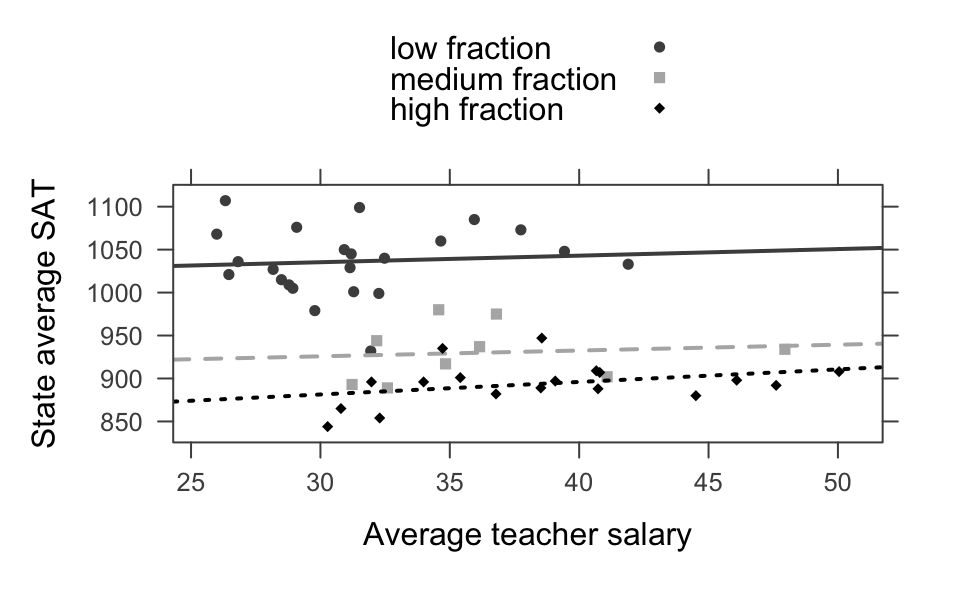


```r
head(SAT)
#>        state expend ratio salary frac verbal math  sat         fracgrp
#> 1    Alabama   4.41  17.2   31.1    8    491  538 1029    low fraction
#> 2     Alaska   8.96  17.6   48.0   47    445  489  934 medium fraction
#> 3    Arizona   4.78  19.3   32.2   27    448  496  944 medium fraction
#> 4   Arkansas   4.46  17.1   28.9    6    482  523 1005    low fraction
#> 5 California   4.99  24.0   41.1   45    417  485  902 medium fraction
#> 6   Colorado   5.44  18.4   34.6   29    462  518  980 medium fraction
lm(sat ~ salary, data=SAT) %>% tidy()
#> # A tibble: 2 x 5
#>   term        estimate std.error statistic  p.value
#>   <chr>          <dbl>     <dbl>     <dbl>    <dbl>
#> 1 (Intercept)  1159.       57.7      20.1  5.13e-25
#> 2 salary         -5.54      1.63     -3.39 1.39e- 3
lm(sat ~ salary + frac, data=SAT) %>% tidy()
#> # A tibble: 3 x 5
#>   term        estimate std.error statistic  p.value
#>   <chr>          <dbl>     <dbl>     <dbl>    <dbl>
#> 1 (Intercept)   988.      31.9       31.0  6.20e-33
#> 2 salary          2.18     1.03       2.12 3.94e- 2
#> 3 frac           -2.78     0.228    -12.2  4.00e-16
lm(sat ~ salary * frac, data=SAT) %>% tidy()
#> # A tibble: 4 x 5
#>   term         estimate std.error statistic  p.value
#>   <chr>           <dbl>     <dbl>     <dbl>    <dbl>
#> 1 (Intercept) 1082.       54.4       19.9   3.00e-24
#> 2 salary        -0.720     1.70      -0.424 6.73e- 1
#> 3 frac          -5.03      1.09      -4.62  3.15e- 5
#> 4 salary:frac    0.0648    0.0308     2.11  4.05e- 2
lm(sat ~ salary + fracgrp, data=SAT) %>% tidy()
#> # A tibble: 4 x 5
#>   term                   estimate std.error statistic  p.value
#>   <chr>                     <dbl>     <dbl>     <dbl>    <dbl>
#> 1 (Intercept)             1002.      31.8       31.5  8.55e-33
#> 2 salary                     1.09     0.988      1.10 2.76e- 1
#> 3 fracgrpmedium fraction  -112.      14.3       -7.82 5.46e-10
#> 4 fracgrphigh fraction    -150.      12.8      -11.7  2.09e-15
lm(sat ~ salary * fracgrp, data=SAT) %>% tidy()
#> # A tibble: 6 x 5
#>   term                           estimate std.error statistic  p.value
#>   <chr>                             <dbl>     <dbl>     <dbl>    <dbl>
#> 1 (Intercept)                   1012.         55.8    18.1    4.85e-22
#> 2 salary                           0.768       1.77    0.435  6.65e- 1
#> 3 fracgrpmedium fraction        -107.        103.     -1.04   3.03e- 1
#> 4 fracgrphigh fraction          -175.         79.2    -2.21   3.27e- 2
#> 5 salary:fracgrpmedium fraction   -0.0918      2.93   -0.0313 9.75e- 1
#> 6 salary:fracgrphigh fraction      0.692       2.28    0.303  7.63e- 1
```
:::

<!--
%Consider the following data on twenty-year vital status by smoking behavior: %(pgs 52-53 in VGSM)
%\begin{center}
%\begin{tabular}{r|cc|r}
%& smoker & nonsmoker & total\\
%\hline
%cases & 139 & 230 & 369\\
%non cases & 443 & 502 & 945\\
%\hline
%total & 582 & 502 & 1314
%\end{tabular}
%\end{center}

%Just as we have before, we can calculate the OR of cancer given the person was a smoker.  We could also break down the relationship between smoking and cancer using the age variable.

%\begin{center}
%\begin{tabular}{lccc}
%& OR & \multicolumn{2}{c}{CI}\\
%overall & 0.685 & 0.439 & 0.931\\
%18-44 & 1.777 & 0.873 & 3.615\\
%45-64 & 1.320 & 0.873 & 1.997\\
%65+ & 1.018 & 0.424 & 2.434\\
%\end{tabular}
%\end{center}

%After *adjusting* for age, smoking is no longer significant.  But more importantly, age is a variable that changes the effect of smoking on cancer.  This is referred to as Simpson's Paradox.  The effect is not due to the observational nature of the study, and so it is important to adjust for possible influential variables regardless of the study at hand.
-->

::: {.example}
Consider the example on smoking and 20-year mortality (case) from section 3.4 of *Regression Methods in Biostatistics*, pg 52-53.  The study represents women participating in a health survey in Whickham, England in 1972-1972 with follow-up 20 years later [@Vanderpump95]. Mortality was recorded as the response variable and self-reported smoking and age (both given in the original study) as the explanatory variables.

| age 	| test 	| smoker 	| nonsmoker 	| prob smoke 	| odds smoke 	| empirical OR 	|
|---------	|---------	|:------:	|:---------:	|:----------:	|:----------:	|:------------:	|
| all 	| case 	| 139 	| 230 	| 0.377 	| 0.604 	| 0.685 	|
|  	| control 	| 443 	| 502 	| 0.469 	| 0.882 	|  	|
| 18-44 	| case 	| 61 	| 32 	| 0.656 	| 1.906 	| 1.627 	|
|  	| control 	| 375 	| 320 	| 0.540 	| 1.172 	|  	|
| 45-64 	| case 	| 34 	| 66 	| 0.340 	| 0.515 	| 1.308 	|
|  	| control 	| 50 	| 127 	| 0.282 	| 0.394 	|  	|
| 65+ 	| case 	| 44 	| 132 	| 0.250 	| 0.333 	| 1.019 	|
|  	| control 	| 18 	| 55 	| 0.247 	| 0.327 	|  	|

What we see is that the vast majority of the controls were young, and they had a high rate of smoking.  A good chunk of the cases were older, and the rate of smoking was substantially lower in the oldest group.  However, within each group, the cases were more likely to smoke than the controls.

After *adjusting* for age, smoking is no longer significant.  But more importantly, age is a variable that reverses the effect of smoking on cancer - Simpson's Paradox.  The effect is not due to the observational nature of the study, and so it is important to adjust for possible influential variables regardless of the study at hand.

What would it mean to *adjust* for age in this context?  It means that we have to include it in the model:


```r
glm( death ~ smoke, family="binomial") %>% tidy()
#> # A tibble: 2 x 5
#>   term        estimate std.error statistic  p.value
#>   <chr>          <dbl>     <dbl>     <dbl>    <dbl>
#> 1 (Intercept)   -0.781    0.0796     -9.80 1.10e-22
#> 2 smoke         -0.379    0.126      -3.01 2.59e- 3

glm( death ~ as.factor(age), family="binomial") %>% tidy()
#> # A tibble: 3 x 5
#>   term                estimate std.error statistic  p.value
#>   <chr>                  <dbl>     <dbl>     <dbl>    <dbl>
#> 1 (Intercept)           -0.571     0.125     -4.56 5.01e- 6
#> 2 as.factor(age)old      1.45      0.187      7.75 9.00e-15
#> 3 as.factor(age)young   -1.44      0.167     -8.63 6.02e-18

glm( death ~ smoke + as.factor(age), family="binomial") %>% tidy()
#> # A tibble: 4 x 5
#>   term                estimate std.error statistic  p.value
#>   <chr>                  <dbl>     <dbl>     <dbl>    <dbl>
#> 1 (Intercept)           -0.668     0.135     -4.96 7.03e- 7
#> 2 smoke                  0.312     0.154      2.03 4.25e- 2
#> 3 as.factor(age)old      1.47      0.188      7.84 4.59e-15
#> 4 as.factor(age)young   -1.52      0.173     -8.81 1.26e-18

glm( death ~ smoke * as.factor(age), family="binomial") %>% tidy()
#> # A tibble: 6 x 5
#>   term                      estimate std.error statistic  p.value
#>   <chr>                        <dbl>     <dbl>     <dbl>    <dbl>
#> 1 (Intercept)                 -0.655     0.152    -4.31  1.61e- 5
#> 2 smoke                        0.269     0.269     0.999 3.18e- 1
#> 3 as.factor(age)old            1.53      0.221     6.93  4.29e-12
#> 4 as.factor(age)young         -1.65      0.240    -6.88  6.00e-12
#> 5 smoke:as.factor(age)old     -0.251     0.420    -0.596 5.51e- 1
#> 6 smoke:as.factor(age)young    0.218     0.355     0.614 5.40e- 1
```


Using the additive model above:
\begin{align}
\mbox{logit} (p(x_1, x_2) ) &= \beta_0 + \beta_1 x_1 + \beta_2 x_2\\
OR &= \mbox{odds dying if } (x_1, x_2) / \mbox{odds dying if } (x_1^*, x_2^*) = \frac{e^{\beta_0 + \beta_1 x_1 + \beta_2 x_2}}{e^{\beta_0 + \beta_1 x_1^* + \beta_2 x_2^*}}\\
x_1 &= \begin{cases}
0 & \mbox{ don't smoke}\\
1 & \mbox{ smoke}\\
\end{cases}\\
x_2 &= \begin{cases}
\mbox{young} & \mbox{18-44 years old}\\
\mbox{middle} & \mbox{45-64 years old}\\
\mbox{old} & \mbox{65+ years old}\\
\end{cases}
\end{align}
where we are modeling the probability of 20-year mortality using smoking status and age group.


**Note 1:** We can see from above that the coefficients for each variable are significantly different from zero.  That is, the variables are important in predicting odds of survival.    
**Note 2:** We can see that smoking becomes less significant as we add age into the model.  That is because age and smoking status are so highly associated (think of the coin example).  
**Note 3:**  We can estimate any of the OR (of dying for smoke vs not smoke) from the given coefficients:  
\begin{align}
\mbox{simple model} &\\
\mbox{overall OR} &= e^{-0.37858 } = 0.6848332\\
& \\
\mbox{additive model} &\\
\mbox{young, middle, old OR} &= e^{ 0.3122} = 1.3664\\
& \\
\mbox{interaction model} &\\
\mbox{young OR} &= e^{0.2689 + 0.2177} = 1.626776\\
\mbox{middle OR} &= e^{0.2689} = 1.308524\\
\mbox{old OR} &= e^{0.2689 + -0.2505} = 1.018570\\
\end{align}
What does it mean that the interaction terms are not significant in the last model?
:::


## Multicolinearity {#multicol}

::: {.example}
Consider the following data set collected from church offering plates in 62 consecutive Sundays.    Also noted is whether there was enough change to buy a candy bar for \$1.25.

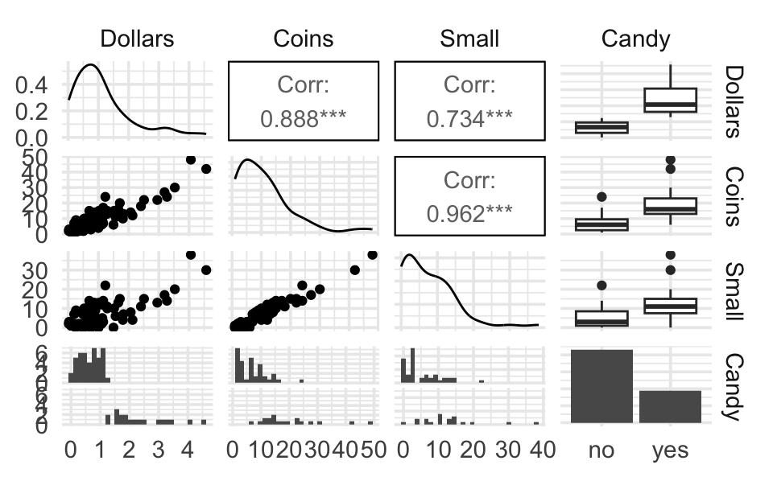


```r
glm(Candy ~ Coins, data = Offering, family="binomial") %>% tidy()
#> # A tibble: 2 x 5
#>   term        estimate std.error statistic   p.value
#>   <chr>          <dbl>     <dbl>     <dbl>     <dbl>
#> 1 (Intercept)   -4.14     0.996      -4.16 0.0000321
#> 2 Coins          0.286    0.0772      3.70 0.000213

glm(Candy ~ Small, data = Offering, family="binomial") %>% tidy()
#> # A tibble: 2 x 5
#>   term        estimate std.error statistic   p.value
#>   <chr>          <dbl>     <dbl>     <dbl>     <dbl>
#> 1 (Intercept)   -2.33     0.585      -3.98 0.0000693
#> 2 Small          0.184    0.0576      3.19 0.00142

glm(Candy ~ Coins + Small, data = Offering, family="binomial") %>% tidy()
#> # A tibble: 3 x 5
#>   term        estimate std.error statistic p.value
#>   <chr>          <dbl>     <dbl>     <dbl>   <dbl>
#> 1 (Intercept)   -17.0       7.80     -2.18  0.0296
#> 2 Coins           3.49      1.75      1.99  0.0461
#> 3 Small          -3.04      1.57     -1.93  0.0531
```

Notice that the directionality of the low coins changes when it is included in the model that already contains the number of coins total.  Lesson of the story:  be very very very careful interpreting coefficients when you have multiple explanatory variables.
:::


## Model Building {#logstep}

::: {.example}
Suppose that you have to take an exam that covers 100 different topics, and you do not know any of them.  The rules, however, state that you can bring two classmates as consultants.  Suppose also that you know which topics each of your classmates is familiar with.  If you could bring only one consultant, it is easy to figure out who you would bring: it would be the one who knows the most topics (the variable most associated with the answer).  Let's say this is Sage who knows 85 topics.  With two consultants you might choose Sage first, and for the second option, it seems reasonable to choose the second most knowledgeable classmate (the second most highly associated variable), for example Bruno, who knows 75 topics.  

The problem with this strategy is that it may be that the 75 subjects Bruno knows are already included in the 85 that Sage knows, and therefore, Bruno does not provide any knowledge beyond that of Sage.  

A better strategy is to select the second not by considering what they  know regarding the entire agenda, but by looking for the person who knows more about the topics that the first does not know (the variable that best explains the residual of the equation with the variables entered).  It may even happen that the best pair of consultants are not the most knowledgeable, as there may be two that complement each other perfectly in such a way that one knows 55 topics and the other knows the remaining 45, while the most knowledgeable does not complement anybody.  

|    Individual    |    # topics   |     Pair    |    # topics      |
|--------------|-----------|---------------------|------------|
|     Sage     |     85    |     Sage & Bruno    |     95     |
|     Bruno    |     80    |     Sage & Beta     |     93     |
|     Luna     |     55    |     Sage & Luna     |     92     |
|     Beta     |     45    |     Bruno & Beta    |     90     |
|              |           |     Bruno & Luna    |     90     |
|              |           |     Beta & Luna     |     100    |


With forward selection, which two are chosen?^[Sage & Bruno]

With backward selection, which two are chosen?^[Beta & Luna]

<!-- %(Taken from American Statistician article that I refereed, August 2012.) -->
:::

<!--
% added January 2019 ...  I need to read through, edit, etc.

#### More thoughts on Model Selection...

Question: Did females receive lower starting salaries than males?  @sleuth

model:  y = log(salary), x's: seniority, age, experience, education, sex.

In Sleuth, they first find a good model using only seniority, age, experience and education (including considerations of interactions/quadratics). Once they find a suitable model (Model 1), they then add the sex variable to this model to determine if it is significant. (H0: Model 1 vs HA: Model 1 + sex)  In other regression texts, the models considered would include the sex variable from the beginning, and work from there, but always keeping the sex variable in.  What are the pluses/minuses of these approaches?

\begin{itemize}
\item[Resp1]
It seems possible, and even likely, that sex would be associated with some of these other variables, so depending how the model selection that starts with sex included were done, it would be entirely possible to choose a model that includes sex but not one or more of the other variables, and in which sex is significant. If however, those other variables were included, sex might not explain a significant amount of variation beyond those others. Whereas the model selection that doesn't start with sex would be more likely to include those associated covariates to start with.

I do like both of those methods in that they both end up with sex in the model; one of my pet peeves is when a model selection procedure ends up removing the variable of interest and people then claim that the variable of interest doesn't matter.  But my preference is actually to try to avoid model selection as much as possible. What I tell the people I work with is that each model you build answers a different question, and so try to get them to decide ahead of time what question they are interested in. I also find Frank Harrell's comments on model selection (in his Regression Modeling Strategies book) to be particularly helpful.

In this case I really think there are two questions of interest; are there differences at all (univariate model), and are there differences after accounting for the covariates (multivariate model)? If the differences get smaller after adjusting for the covariates, then that leads to the very interesting question of why that is, and whether those differences are also part of the sex discrimination. It bugs me when people try to explain away the wage gap between men and women by saying that men just go into higher-paying jobs, when really, that's part of the problem, that jobs that have more women in them pay less. :( The point, though, is that one model may not be sufficient for a particular situation, and looking for one "best" model can be misleading.
\item[Resp2]
If you know (or are willing to assume) the covariates that you want to adjust for and their form in the model (non-linearity, interactions) and you have enough data relative to the number of covariates, then you should not do any model selection, just compare the model with the variable of interest to the model without.  Which covariates are significant or not does not matter in this case.

See here: https://stats.stackexchange.com/questions/37564/r-code-question-model-selection-based-on-individual-significance-in-regression/37609#37609 for simulation examples where screening/model selection can either include meaningless variables, or leave out important ones.
\end{itemize}
-->

### Formal Model Building

We are going to discuss how to add (or subtract) variables from a model.  Before we do that, we can define two criteria used for suggesting an optimal model.


>AIC:  Akaike's Information Criteria = $-2 \ln$ likelihood + $2p$  
>BIC: Bayesian Information Criteria = $-2 \ln$ likelihood $+p \ln(n)$

Both techniques suggest choosing a model with the smallest AIC and BIC value; both adjust for the number of parameters in the model and are more likely to select models with fewer variables than the drop-in-deviance test.


#### Stepwise Regression

As done previously, we can add and remove variables based on the deviance.  Recall, when comparing two nested models, the differences in the deviances can be modeled by a $\chi^2_\nu$ variable where $\nu = \Delta p$.


Consider the HERS data described in your book (page 30); variable description also given on the book website http://www.epibiostat.ucsf.edu/biostat/vgsm/data/hersdata.codebook.txt

For now, we will try to predict whether the individuals had a medical condition, `medcond` (defined as a pre-existing and self-reported medical condition).  We will use the variables `age`, `weight`, `diabetes` and `drinkany`.


```r
glm(medcond ~ age, data = HERS, family="binomial") %>% tidy()
#> # A tibble: 2 x 5
#>   term        estimate std.error statistic   p.value
#>   <chr>          <dbl>     <dbl>     <dbl>     <dbl>
#> 1 (Intercept)  -1.60     0.401       -4.00 0.0000624
#> 2 age           0.0162   0.00597      2.71 0.00664
glm(medcond ~ age + weight, data = HERS, family="binomial") %>% tidy()
#> # A tibble: 3 x 5
#>   term        estimate std.error statistic   p.value
#>   <chr>          <dbl>     <dbl>     <dbl>     <dbl>
#> 1 (Intercept) -2.17      0.496       -4.37 0.0000124
#> 2 age          0.0189    0.00613      3.09 0.00203  
#> 3 weight       0.00528   0.00274      1.93 0.0542
glm(medcond ~ age+diabetes, data = HERS, family="binomial") %>% tidy()
#> # A tibble: 3 x 5
#>   term        estimate std.error statistic      p.value
#>   <chr>          <dbl>     <dbl>     <dbl>        <dbl>
#> 1 (Intercept)  -1.89     0.408       -4.64 0.00000349  
#> 2 age           0.0185   0.00603      3.07 0.00217     
#> 3 diabetes      0.487    0.0882       5.52 0.0000000330
glm(medcond ~ age*diabetes, data = HERS, family="binomial") %>% tidy()
#> # A tibble: 4 x 5
#>   term         estimate std.error statistic     p.value
#>   <chr>           <dbl>     <dbl>     <dbl>       <dbl>
#> 1 (Intercept)   -2.52     0.478       -5.26 0.000000141
#> 2 age            0.0278   0.00707      3.93 0.0000844  
#> 3 diabetes       2.83     0.914        3.10 0.00192    
#> 4 age:diabetes  -0.0354   0.0137      -2.58 0.00986
glm(medcond ~ age*drinkany, data = HERS, family="binomial") %>% tidy()
#> # A tibble: 4 x 5
#>   term         estimate std.error statistic p.value
#>   <chr>           <dbl>     <dbl>     <dbl>   <dbl>
#> 1 (Intercept)  -0.991     0.511       -1.94  0.0526
#> 2 age           0.00885   0.00759      1.17  0.244 
#> 3 drinkany     -1.44      0.831       -1.73  0.0833
#> 4 age:drinkany  0.0168    0.0124       1.36  0.175


glm(medcond ~ age + weight + diabetes + drinkany, data = HERS, family="binomial") %>% tidy()
#> # A tibble: 5 x 5
#>   term        estimate std.error statistic    p.value
#>   <chr>          <dbl>     <dbl>     <dbl>      <dbl>
#> 1 (Intercept) -1.87      0.505      -3.72  0.000203  
#> 2 age          0.0184    0.00620     2.96  0.00304   
#> 3 weight       0.00143   0.00285     0.500 0.617     
#> 4 diabetes     0.432     0.0924      4.68  0.00000288
#> 5 drinkany    -0.253     0.0835     -3.03  0.00248
glm(medcond ~ age , data = HERS, family="binomial") %>% tidy()
#> # A tibble: 2 x 5
#>   term        estimate std.error statistic   p.value
#>   <chr>          <dbl>     <dbl>     <dbl>     <dbl>
#> 1 (Intercept)  -1.60     0.401       -4.00 0.0000624
#> 2 age           0.0162   0.00597      2.71 0.00664
glm(medcond ~ weight , data = HERS, family="binomial") %>% tidy()
#> # A tibble: 2 x 5
#>   term        estimate std.error statistic  p.value
#>   <chr>          <dbl>     <dbl>     <dbl>    <dbl>
#> 1 (Intercept) -0.769     0.198       -3.88 0.000106
#> 2 weight       0.00339   0.00267      1.27 0.204
glm(medcond ~ diabetes , data = HERS, family="binomial") %>% tidy()
#> # A tibble: 2 x 5
#>   term        estimate std.error statistic  p.value
#>   <chr>          <dbl>     <dbl>     <dbl>    <dbl>
#> 1 (Intercept)   -0.652    0.0467    -13.9  3.18e-44
#> 2 diabetes       0.468    0.0878      5.34 9.55e- 8
glm(medcond ~ drinkany, data = HERS, family="binomial") %>% tidy()
#> # A tibble: 2 x 5
#>   term        estimate std.error statistic  p.value
#>   <chr>          <dbl>     <dbl>     <dbl>    <dbl>
#> 1 (Intercept)   -0.398    0.0498     -8.00 1.26e-15
#> 2 drinkany      -0.330    0.0818     -4.04 5.46e- 5
```


#### Forward Selection {-}
One idea is to start with an empty model and adding the best available variable at each iteration, checking for needs for transformations. We should also look at interactions which we might suspect.  However, looking at all possible interactions (if only 2-way interactions, we could also consider 3-way interactions etc.), things can get out of hand quickly.

1. We start with the response variable versus all variables and find the best predictor.  If there are too many, we might just look at the correlation matrix.  However, we may miss out of variables that are good predictors but aren't linearly related.  Therefore, if its possible, a scatter plot matrix would be best.  
2. We locate the best variable, and regress the response variable on it.  
3. If the variable seems to be useful, we keep it and move on to looking for a second.  
4. If not, we stop.


#### Forward Stepwise Selection {-}
This method follows in the same way as Forward Regression, but as each new variable enters the model, we check to see if any of the variables already in the model can now be removed.  This is done by specifying two values, $\alpha_e$ as the $\alpha$ level needed to **enter** the model, and $\alpha_l$ as the $\alpha$ level needed to **leave** the model.  We require that $\alpha_e<\alpha_l$, otherwise, our algorithm could cycle, we add a variable, then immediately decide to delete it, continuing ad infinitum.  This is bad.

1. We start with the empty model, and add the best predictor, assuming the p-value associated with it is smaller than $\alpha_e$.  
2. Now, we find the best of the remaining variables, and add it if the p-value is smaller than $\alpha_e$.  If we add it, we also check to see if the first variable can be dropped, by calculating the p-value associated with it (which is different from the first time, because now there are two variables in the model).  If its p-value is greater than $\alpha_l$, we remove the variable.   
3. We continue with this process until there are no more variables that meet either requirements.  In many situations, this will help us from stopping at a less than desirable model.  

How do you choose the $\alpha$ values?  If you set $\alpha_e$ to be very small, you might walk away with no variables in your model, or at least not many.  If you set it to be large, you will wander around for a while, which is a good thing, because you will explore more models, but you may end up with variables in your model that aren't necessary.


#### Backward Selection {-}
1. Start with the full model including every term (and possibly every interaction, etc.).  
2. Remove the variable that is *least* significant (biggest p-value) in the model.  
3. Continue removing variables until all variables are significant at the chosen $\alpha$ level.  


```r
glm(medcond ~ (age + diabetes + weight + drinkany)^2, data = HERS, family="binomial") %>% glance()
#> # A tibble: 1 x 8
#>   null.deviance df.null logLik   AIC   BIC deviance df.residual  nobs
#>           <dbl>   <int>  <dbl> <dbl> <dbl>    <dbl>       <int> <int>
#> 1         3643.    2758 -1793. 3608. 3673.    3586.        2748  2759
glm(medcond ~ age + diabetes + weight + drinkany, data = HERS, family="binomial") %>% glance()
#> # A tibble: 1 x 8
#>   null.deviance df.null logLik   AIC   BIC deviance df.residual  nobs
#>           <dbl>   <int>  <dbl> <dbl> <dbl>    <dbl>       <int> <int>
#> 1         3643.    2758 -1797. 3605. 3634.    3595.        2754  2759
glm(medcond ~ age + diabetes + drinkany, data = HERS, family="binomial") %>% tidy()
#> # A tibble: 4 x 5
#>   term        estimate std.error statistic     p.value
#>   <chr>          <dbl>     <dbl>     <dbl>       <dbl>
#> 1 (Intercept)  -1.72     0.413       -4.17 0.0000300  
#> 2 age           0.0176   0.00605      2.90 0.00369    
#> 3 diabetes      0.442    0.0895       4.94 0.000000786
#> 4 drinkany     -0.252    0.0834      -3.01 0.00257
```


* The big model (with all of the interaction terms) has a deviance of 3585.7; the additive model has a deviance of 3594.8.

\begin{align}
G &= 3594.8 - 3585.7= 9.1\\
p-value &= P(\chi^2_6 \geq 9.1)= 1 - pchisq(9.1, 6) = 0.1680318
\end{align}
We cannot reject the null hypothesis, so we know that we don't need the 6 interaction terms.  Next we will check whether we need weight.

* The additive model has a deviance of 3594.8; the model without weight is 3597.3.

\begin{align}
G &= 3597.3 - 3594.8 =2.5\\
p-value &= P(\chi^2_1 \geq 2.5)= 1 - pchisq(2.5, 1) = 0.1138463
\end{align}
We cannot reject the null hypothesis, so we know that we don't need the weight in the model either.


### Getting the Model Right

In terms of selecting the variables to model a particular response, four things can happen:

* The logistic regression model is correct!  
* The logistic regression model is underspecified.  
* The logistic regression model contains extraneous variables.  
* The logistic regression model is overspecified.  

##### Underspecified {-}

A regression model is underspecified if it is missing one or more important predictor variables.  Being underspecified is the worst case scenario because the model ends up being biased and predictions are wrong for virtually every observation.    (Think about Simpson's Paradox and the need for interaction.)


##### Extraneous {-}

The third type of variable situation comes when extra variables are included in the model but the variables are neither related to the response nor are they correlated with the other explanatory variables.  Generally, extraneous variables are not so problematic because they produce models with unbiased coefficient estimators, unbiased predictions, and unbiased variance estimates.  The worst thing that happens is that the error degrees of freedom is lowered which makes confidence intervals wider and p-values bigger (lower power).  Also problematic is that the model becomes unnecessarily complicated and harder to interpret.

##### Overspecified {-}

When a model is overspecified, there are one or more redundant variables.  That is, the variables contain the same information as other variables (i.e., are correlated!).  As we've seen, correlated variables cause trouble because they inflate the variance of the coefficient estimates.  With correlated variables it is still possible to get unbiased prediction estimates, but the coefficients themselves are so variable that they cannot be interpreted (nor can inference be easily performed).


Generally:  the idea is to use a model building strategy with some criteria ($\chi^2$-tests, AIC, BIC, ROC, AUC) to find the middle ground between an underspecified model and an overspecified model.


#### One Model Building Strategy

Taken from https://onlinecourses.science.psu.edu/stat501/node/332.

Model building is definitely an "art."  Unsurprisingly, there are many approaches to model building, but here is one strategy, consisting of seven steps, that is commonly used when building a regression model.

#### The first step {-}

Decide on the type of model that is needed in order to achieve the goals of the study. In general, there are five reasons one might want to build a regression model. They are:

* For predictive reasons - that is, the model will be used to predict the response variable from a chosen set of predictors.  
* For theoretical reasons - that is, the researcher wants to estimate a model based on a known theoretical relationship between the response and predictors.  For example, there may be a known physical relationship (with parameters to esimate) or a differential equation that models state changes.   
* For control purposes - that is, the model will be used to control a response variable by manipulating the values of the predictor variables.  
* For inferential reasons - that is, the model will be used to explore the strength of the relationships between the response and the predictors.  
* For data summary reasons - that is, the model will be used merely as a way to summarize a large set of data by a single equation.  


#### The second step {-}

Decide which explanatory variables and response variable on which to collect the data. Collect the data.

#### The third step {-}

Explore the data. That is:

* On a univariate basis, check for outliers, gross data errors, and missing values.  
* Study bivariate relationships to reveal other outliers, to suggest possible transformations, and to identify possible multicollinearities.

I can't possibly over-emphasize the data exploration step. There's not a data analyst out there who hasn't made the mistake of skipping this step and later regretting it when a data point was found in error, thereby nullifying hours of work.

#### The fourth step {-}

(The fourth step is very good modeling practice.  It gives you a sense of whether or not you've overfit the model in the building process.) Randomly divide the data into a training set and a validation set:

* The training set, with at least 15-20 error degrees of freedom, is used to estimate the model.  
* The validation set is used for cross-validation of the fitted model.


#### The fifth step {-}

Using the training set, identify several candidate models:

* Use best subsets regression.  
* Use stepwise regression, which of course only yields one model unless different alpha-to-remove and alpha-to-enter values are specified.

#### The sixth step {-}

Select and evaluate a few "good" models:

* Select the models based on the criteria we learned, as well as the number and nature of the predictors.  
* Evaluate the selected models for violation of the model conditions.  
* If none of the models provide a satisfactory fit, try something else, such as collecting more data, identifying different predictors, or formulating a different type of model.

#### The seventh and final step {-}

Select the final model:

* A large cross-validation AUC on the validation data is indicative of a good predictive model (for your population of interest).  
* Consider false positive rate, false negative rate, outliers, parsimony, relevance, and ease of measurement of predictors.

And, most of all, don't forget that there is not necessarily only one good model for a given set of data. There might be a few equally satisfactory models.

#### Another Model Building Strategy


<div class="figure" style="text-align: center">
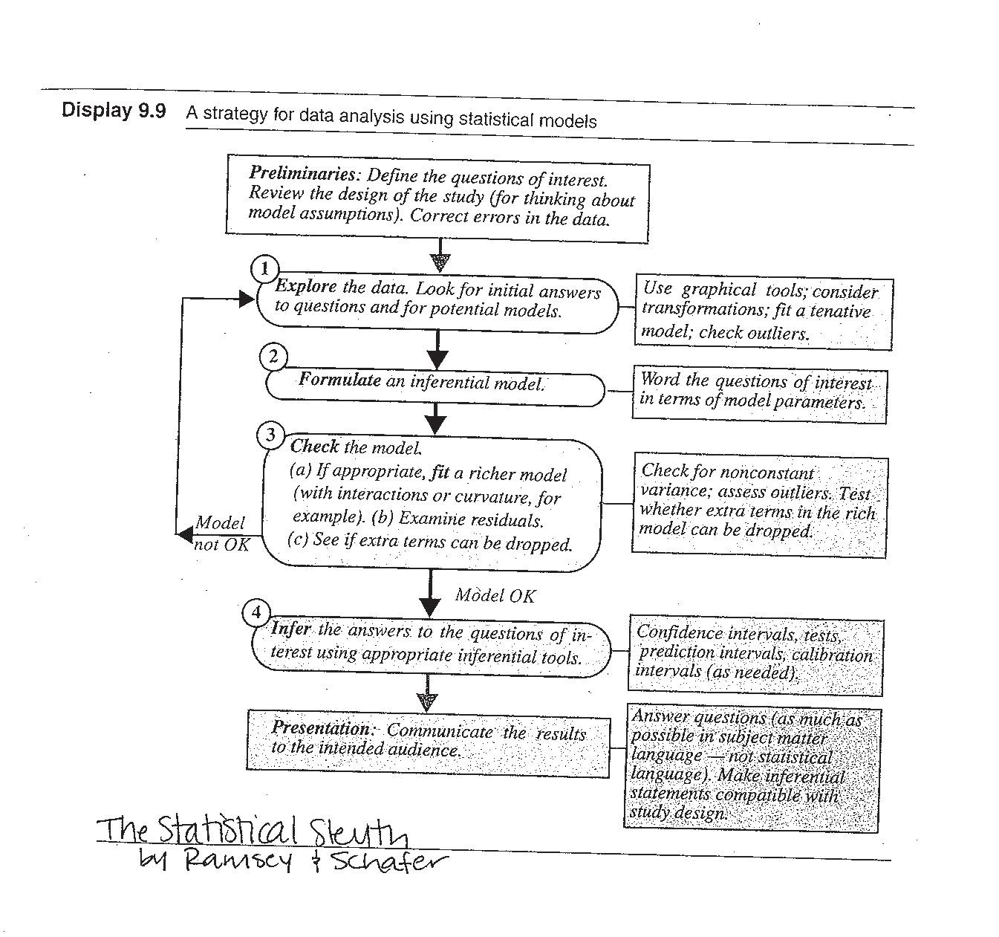
<p class="caption">(\#fig:unnamed-chunk-18)Another strategy for model building. Figure taken from [@sleuth].</p>
</div>


<!--
% add a bit on stepwise regression??? add1, drop1 in R

% use the binomial model for pearson residuals $\frac{Y_i - n_i \hat{p}_i}{\sqrt{n_i \hat{p}_i (1-\hat{p}_i)} and for chi-square test goodness-of-fit

% see notes from 2008 on yellow pad of paper
-->

## Model Assessment

### Measures of Association

With logistic regression, we don't have residuals, so we don't have a value like $R^2$.  We can, however, measure whether or not the estimated model is consistent with the data.  That is, is the model able to discriminate between successes and failures.

We'd like to choose a model that produces high probabilities of success for those observations where success was recorded and low probabilities of success for those observation where failure was recorded.  In other words, we want mostly **concordant** pairs.

Given a particular pair of observations where one was a success and the other was a failure, if the observation corresponding to a success has a *higher* probability of success than the observation corresponding to a failure, we call the pair *concordant*.  If the observation corresponding to a success has a *lower* probability of success than the observation corresponding to a failure, we call the pair *discordant*.  Tied pairs occur when the observed success has the same estimated probability as the observed failure.

#### Back to the burn data \@ref(ex:burnexamp):
Consider looking at all the pairs of successes and failures in the burn data, we have 308 survivors and 127 deaths = 39,116 pairs of individuals.  

One pair of individuals has burn areas of 1.75 and 2.35.
\begin{align}
p(x=1.75) &= \frac{e^{22.7083-10.6624\cdot 1.75}}{1+e^{22.7083 -10.6624\cdot 1.75}} = 0.983\\
p(x=2.35) &= \frac{e^{22.7083-10.6624\cdot 2.35}}{1+e^{22.7083 -10.6624\cdot 2.35}} = 0.087
\end{align}
The pairs would be concordant if the first individual survived and the second didn't.  The pairs would be discordant if the first individual died and the second survived.

Ideally the model chosen would have a large number of concordant pairs.  The following metrics quantify the concordance across the entire model with respect to the observed data:

* $D_{xy}$: **Somers' D** is the number of concordant pairs minus the number of discordant pairs divided by the total number of pairs.  
* gamma: **Goodman-Kruskal gamma** is the number of concordant pairs minus the number of discordant pairs divided by the total number of pairs excluding ties.  
* tau-a: **Kendall's tau-a** is the number of concordant pairs minus the number of discordant pairs divided by the total number of pairs of people (including pairs who both survived or both died).


```r
# install.packages(c("Hmisc", "rms"))

library(rms)   # you need this line!!
burn.glm <- lrm(burnresp~burnexpl, data = burnglm)
print(burn.glm)
#> Logistic Regression Model
#>  
#>  lrm(formula = burnresp ~ burnexpl, data = burnglm)
#>  
#>                         Model Likelihood    Discrimination    Rank Discrim.    
#>                               Ratio Test           Indexes          Indexes    
#>  Obs           435    LR chi2     190.15    R2       0.505    C       0.877    
#>   0            127    d.f.             1    g        2.576    Dxy     0.753    
#>   1            308    Pr(> chi2) <0.0001    gr      13.146    gamma   0.824    
#>  max |deriv| 8e-11                          gp       0.313    tau-a   0.312    
#>                                             Brier    0.121                     
#>  
#>            Coef     S.E.   Wald Z Pr(>|Z|)
#>  Intercept  22.7083 2.2661 10.02  <0.0001 
#>  burnexpl  -10.6624 1.0826 -9.85  <0.0001 
#> 
```

The summary contains the following elements:

>number of observations used in the fit, maximum absolute value of first derivative of log likelihood, model likelihood ratio chi2, d.f., P-value, $c$ index (area under ROC curve), Somers' Dxy, Goodman-Kruskal gamma, Kendall's tau-a rank correlations between predicted probabilities and observed response, the Nagelkerke $R^2$ index, the Brier score computed with respect to Y $>$ its lowest level, the $g$-index, $gr$ (the $g$-index on the odds ratio scale), and $gp$ (the $g$-index on the probability scale using the same cutoff used for the Brier score).


### Receiver Operating Characteristic Curves {#roc}

Recall that logistic regression can be used to predict the outcome of a binary event (your response variable).  A Receiver Operating Characteristic (ROC) Curve is a graphical representation of the relationship between

\begin{itemize}
\item[sensitivity] true positive rate
\item[1-specificity] false positive rate
\end{itemize}

|  	|  	| Truth 	|  	|  	|
|-----------	|----------	|:--------------:	|:--------------:	|:----:	|
|  	|  	| positive 	| negative 	|  	|
| Predicted 	| positive 	| true positive 	| false positive 	| $P'$ 	|
|  	| negative 	| false negative 	| true negative 	| $N'$ 	|
|  	|  	| $P$ 	| $N$ 	|  	|


* type I error = FP  
* type II error = FN  
* sensitivity = power = true positive rate (TPR) = TP / P = TP / (TP+FN)  
* false positive rate (FPR) = FP / N = FP / (FP + TN)  
* specificity = 1 - FPR = TN / (FP + TN)  
* accuracy (acc) = (TP+TN) / (P+N)  
* positive predictive value (PPV) = precision = TP / (TP + FP)  
* negative predictive value (NPV) = TN / (TN + FN)  
* false discovery rate = 1 - PPV = FP / (FP + TP)  


::: {.example}
For example: consider a pair of individuals with burn areas of 1.75 and 2.35.
\begin{align}
p(x=1.75) &= \frac{e^{22.7083-10.6624\cdot 1.75}}{1+e^{22.7083 -10.6624\cdot 1.75}} = 0.983\\
p(x=2.35) &= \frac{e^{22.7083-10.6624\cdot 2.35}}{1+e^{22.7083 -10.6624\cdot 2.35}} = 0.087\\
x &= \mbox{log area burned}
\end{align}
What value would we assign to 1.75 or 2.35 or 15 for log(area) burned?  By changing our cutoff, we can fit an entire curve.  We want the curve to be as far in the upper left corner as possible (sensitivity = 1, specificity = 1).  Notice that the color band represents the probability cutoff for predicting a ``success."
:::

<div class="figure" style="text-align: center">

<p class="caption">(\#fig:unnamed-chunk-20)ROC curve.  Color indicates the probability cutoff used to determine predictions.</p>
</div>


A: Let's say we use prob=0.25 as a cutoff: 

|  	|  	| truth 	|  	|
|-----------	|-----	|:-----:	|:---:	|
|  	|  	| yes 	| no 	|
| predicted 	| yes 	| 300 	| 66 	|
|  	| no 	| 8 	| 61 	|
|  	|  	| 308 	| 127 	|

\begin{align}
\mbox{sensitivity} &= TPR = 300/308 = 0.974\\
\mbox{specificity} &= 61 / 127 = 0.480, \mbox{1 - specificity} =  FPR = 0.520\\
\end{align}

B: Let's say we use prob=0.7 as a cutoff:  

|  	|  	| truth 	|  	|
|-----------	|-----	|:-----:	|:---:	|
|  	|  	| yes 	| no 	|
| predicted 	| yes 	| 265 	| 35 	|
|  	| no 	| 43 	| 92 	|
|  	|  	| 308 	| 127 	|

\begin{align}
\mbox{sensitivity} &= TPR = 265/308 = 0.860\\
\mbox{specificity} &= 92/127 = 0.724, \mbox{1 - specificity} = FPR = 0.276\\
\end{align}

C: Let's say we use prob=0.9 as a cutoff:  

|  	|  	| truth 	|  	|
|-----------	|-----	|:-----:	|:---:	|
|  	|  	| yes 	| no 	|
| predicted 	| yes 	| 144 	| 7 	|
|  	| no 	| 164 	| 120 	|
|  	|  	| 308 	| 127 	|

\begin{align}
\mbox{sensitivity} &= TPR = 144/308 = 0.467\\
\mbox{specificity} &= 120/127 = 0.945, \mbox{1 - specificity} = FPR = 0.055\\
\end{align}

D: all models will go through (0,0) $\rightarrow$ predict everything negative, prob=1 as your cutoff

E: all models will go through (1,1) $\rightarrow$ predict everything positive, prob=0 as your cutoff

F: you have a model that gives perfect sensitivity (no FN!) and specificity (no FP)

G: random guessing.  If classifier randomly guess, it should get half the positives correct and half the negatives correct.  If it guesses 90\% of the positives correctly, it will also guess 90\% of the negatives to be positive.

H: is worse than random guessing.  Note that the opposite classifier to (H) might be quite good!


### Cross Validation {#cv}

Before reading the notes here, look through the following visualization.  Don't worry about building the model (classification trees are not a topic for class), but check out the end where they talk about predicting on test and training data.

http://www.r2d3.us/visual-intro-to-machine-learning-part-1/

#### Overfitting

Imagine you are preparing for your statistics exam. Helpfully, Professor Hardin has made previous exam papers and their worked answers available online. You begin by trying to answer the questions from previous papers and comparing your answers with the model answers provided. Unfortunately, you get carried away and spend all your time on memorizing the model answers to all past questions.

Now, if the upcoming exam completely consists of past questions, you are certain to do very well. But if the new exam asks different questions about the same material, you would be ill-prepared and get a much lower mark than with a more traditional preparation.  In this case, one could say that you were **overfitting** the past exam papers and that the knowledge gained didn't generalize to future exam questions.


#### CV Model Assessment

Cross validation is commonly used to perform two different tasks:    
1. To assess a model's accuracy (**model assessment**).    
2. To build a model (**model selection**).  

We will focus here only on model assessment.

Suppose that we build a classifier (logistic regression model) on a given data set.  We'd like to know how well the model classifies observations, but if we test on the samples at hand, the error rate will be much lower than the model's inherent accuracy rate.  Instead, we'd like to predict *new* observations that were not used to create the model.  There are various ways of creating *test* or *validation* sets of data:

*  one training set, one test set  [two drawbacks:  estimate of error is highly  variable because it depends on which points go into the training set; and because the training data set is smaller than the full data set, the error rate is biased in such a way that it overestimates the actual error rate of the modeling technique.]   
* leave one out cross validation (LOOCV)  [LOOCV is a special case of $k$-fold CV with $k=n$]  
1. remove one observation  
2. build the model using the remaining n-1 points  
3. predict class membership for the observation which was removed  
4. repeat by removing each observation one at a time  (time consuming to keep building models)  
* $k$-fold cross validation ($k$-fold CV)  
    * like LOOCV except that the algorithm is run $k$ times on each group (of approximately equal size) from a partition of the data set.  
    * advantage of $k$-fold is computational  
    * $k$-fold often has a better bias-variance trade-off [bias is lower with LOOCV.  however, because LOOCV predicts $n$ observations from $n$ models which are all basically the same, the variability will be higher.  with $k$-fold, prediction is on $n$ values from $k$ models which are much less correlated.  the effect is to average out the predicted values in such a way that there will be less variability from data set to data set.  


<div class="figure" style="text-align: center">

<p class="caption">(\#fig:unnamed-chunk-21)4-fold CV is depicted.  Notice that the holdout group is never used as part of the coefficient estimation process.</p>
</div>

## R: Birdnest Example {#birdexamp}


**Length of Bird Nest**  This example is from problem E1 in your text and includes 99 species of N. American passerine birds.  Recall that the response variable is binary and represents whether there is a small opening (`closed=1`) or a large opening (`closed=0`) for the nest.  The explanatory variable of interest was the length of the bird.


### Drop-in-deviance (Likelihood Ratio Test, LRT)

$\chi^2$:  The Likelihood ratio test also tests whether the response is explained by the explanatory variable.  We can output the deviance ( = K - 2 * log-likelihood) for both the full (maximum likelihood!) and reduced (null) models.
\begin{align}
G &= 2 \cdot \ln(L(MLE)) - 2 \cdot \ln(L(null))\\
&= \mbox{null (restricted) deviance - residual (full model) deviance}\\
G &\sim \chi^2_{\nu} \ \ \ \mbox{when the null hypothesis is true}
\end{align}
where $\nu$ represents the difference in the number of parameters needed to estimate in the full model versus the null model.


```r
glm(`Closed?` ~ Length, data = nests, family="binomial") %>% tidy()
#> # A tibble: 2 x 5
#>   term        estimate std.error statistic p.value
#>   <chr>          <dbl>     <dbl>     <dbl>   <dbl>
#> 1 (Intercept)   0.457     0.753      0.607   0.544
#> 2 Length       -0.0677    0.0425    -1.59    0.112
glm(`Closed?` ~ Length, data = nests, family="binomial") %>% glance() %>% 
  print.data.frame(digits=6)
#>   null.deviance df.null   logLik    AIC     BIC deviance df.residual nobs
#> 1       119.992      94 -58.4399 120.88 125.987   116.88          93   95
```

###  Difference between `tidy` and `augment` and `glance`

Note that `tidy` contains the same number of rows as the number of coefficients.  `augment` contains the same number of rows as number of observations.  `glance` always has one row (containing overall model information).


```r
glm(`Closed?` ~ Length, data = nests, family="binomial") %>% tidy()
#> # A tibble: 2 x 5
#>   term        estimate std.error statistic p.value
#>   <chr>          <dbl>     <dbl>     <dbl>   <dbl>
#> 1 (Intercept)   0.457     0.753      0.607   0.544
#> 2 Length       -0.0677    0.0425    -1.59    0.112
glm(`Closed?` ~ Length, data = nests, family="binomial") %>% augment()
#> # A tibble: 95 x 9
#>   .rownames `Closed?` Length .fitted .resid .std.resid   .hat .sigma .cooksd
#>   <chr>         <dbl>  <dbl>   <dbl>  <dbl>      <dbl>  <dbl>  <dbl>   <dbl>
#> 1 1                 0   20    -0.896 -0.827     -0.833 0.0137   1.12 0.00288
#> 2 2                 1   20    -0.896  1.57       1.58  0.0137   1.11 0.0173 
#> 3 4                 1   20    -0.896  1.57       1.58  0.0137   1.11 0.0173 
#> 4 5                 1   22.5  -1.07   1.65       1.67  0.0202   1.11 0.0305 
#> 5 6                 0   18.5  -0.795 -0.863     -0.868 0.0116   1.12 0.00267
#> 6 7                 1   17    -0.693  1.48       1.49  0.0110   1.12 0.0112 
#> # … with 89 more rows
glm(`Closed?` ~ Length, data = nests, family="binomial") %>% glance() %>% 
  print.data.frame(digits=6)
#>   null.deviance df.null   logLik    AIC     BIC deviance df.residual nobs
#> 1       119.992      94 -58.4399 120.88 125.987   116.88          93   95
```


###  Looking at variables in a few different ways.


Length as a continuous explanatory variable:


```r
glm(`Closed?` ~ Length, data = nests, family="binomial") %>% tidy()
#> # A tibble: 2 x 5
#>   term        estimate std.error statistic p.value
#>   <chr>          <dbl>     <dbl>     <dbl>   <dbl>
#> 1 (Intercept)   0.457     0.753      0.607   0.544
#> 2 Length       -0.0677    0.0425    -1.59    0.112
glm(`Closed?` ~ Length, data = nests, family="binomial") %>% glance() %>%
  print.data.frame(digits=6)
#>   null.deviance df.null   logLik    AIC     BIC deviance df.residual nobs
#> 1       119.992      94 -58.4399 120.88 125.987   116.88          93   95
```


Length as a categorical explanatory variables:


```r
glm(`Closed?` ~ as.factor(Length), data = nests, family="binomial") %>% tidy()
#> # A tibble: 34 x 5
#>   term                       estimate std.error statistic p.value
#>   <chr>                         <dbl>     <dbl>     <dbl>   <dbl>
#> 1 (Intercept)            19.6            10754.  1.82e- 3   0.999
#> 2 as.factor(Length)10     0.000000432    13171.  3.28e-11   1.00 
#> 3 as.factor(Length)10.5   0.000000430    15208.  2.82e-11   1.00 
#> 4 as.factor(Length)11   -18.9            10754. -1.75e- 3   0.999
#> 5 as.factor(Length)12   -21.2            10754. -1.97e- 3   0.998
#> 6 as.factor(Length)12.5   0.000000431    15208.  2.83e-11   1.00 
#> # … with 28 more rows
glm(`Closed?` ~ as.factor(Length), data = nests, family="binomial") %>% glance() %>%
  print.data.frame(digits=6)
#>   null.deviance df.null   logLik     AIC     BIC deviance df.residual nobs
#> 1       119.992      94 -36.8776 141.755 228.587  73.7552          61   95
```

Length plus a few other explanatory variables:

```r
glm(`Closed?` ~ Length + Incubate +  Color, data = nests, family="binomial") %>% tidy()
#> # A tibble: 4 x 5
#>   term        estimate std.error statistic p.value
#>   <chr>          <dbl>     <dbl>     <dbl>   <dbl>
#> 1 (Intercept)   -2.64     2.06      -1.28   0.201 
#> 2 Length        -0.114    0.0527    -2.17   0.0302
#> 3 Incubate       0.314    0.172      1.82   0.0684
#> 4 Color         -0.420    0.609     -0.690  0.490
glm(`Closed?` ~ Length + Incubate +  Color, data = nests, family="binomial") %>% glance() %>% 
  print.data.frame(digits=6)
#>   null.deviance df.null   logLik     AIC     BIC deviance df.residual nobs
#> 1       110.086      87 -51.6633 111.327 121.236  103.327          84   88
```

### Predicting Response


```r
bird_glm <- glm(`Closed?` ~ Length, data = nests, family="binomial")
bird_glm %>% tidy()
#> # A tibble: 2 x 5
#>   term        estimate std.error statistic p.value
#>   <chr>          <dbl>     <dbl>     <dbl>   <dbl>
#> 1 (Intercept)   0.457     0.753      0.607   0.544
#> 2 Length       -0.0677    0.0425    -1.59    0.112

# predicting the linear part:
# reasonable to use the SE to create CIs
predict(bird_glm, newdata = list(Length = 47), se.fit = TRUE, type = "link")
#> $fit
#>     1 
#> -2.72 
#> 
#> $se.fit
#> [1] 1.3
#> 
#> $residual.scale
#> [1] 1

# predicting the probability of success (on the `scale` of the response variable):
# do NOT use the SE to create a CI for the predicted value
# instead, use the SE from `type="link" ` and transform the interval
predict(bird_glm, newdata = list(Length = 47), se.fit = TRUE, type = "response")
#> $fit
#>      1 
#> 0.0616 
#> 
#> $se.fit
#>      1 
#> 0.0751 
#> 
#> $residual.scale
#> [1] 1
```

### Measues of association


```r
# install.packages(c("Hmisc", "rms"))

library(rms)   # you need this line!!
bird_lrm <- lrm(`Closed?` ~ Length, data = nests)
print(bird_lrm)
#> Frequencies of Missing Values Due to Each Variable
#> Closed?  Length 
#>       0       4 
#> 
#> Logistic Regression Model
#>  
#>  lrm(formula = `Closed?` ~ Length, data = nests)
#>  
#>  
#>                        Model Likelihood    Discrimination    Rank Discrim.    
#>                              Ratio Test           Indexes          Indexes    
#>  Obs            95    LR chi2      3.11    R2       0.045    C       0.638    
#>   0             64    d.f.            1    g        0.455    Dxy     0.276    
#>   1             31    Pr(> chi2) 0.0777    gr       1.576    gamma   0.288    
#>  max |deriv| 2e-07                         gp       0.088    tau-a   0.123    
#>                                            Brier    0.210                     
#>  
#>            Coef    S.E.   Wald Z Pr(>|Z|)
#>  Intercept  0.4571 0.7530  0.61  0.5438  
#>  Length    -0.0677 0.0425 -1.59  0.1117  
#> 
```


###  ROC curves


```r
library(plotROC)

nests <- nests %>%
  mutate(Closed = as.factor(ifelse(`Closed?` == 0, "no", 
                                   ifelse(`Closed?` == 1, "yes", `Closed?`))))

bird_glm <- glm(Closed ~ Length, data = nests, family="binomial")

bird_indiv <- bird_glm %>% 
  augment(type.predict = "response") 

head(bird_indiv)
#> # A tibble: 6 x 9
#>   .rownames Closed Length .fitted .resid .std.resid   .hat .sigma .cooksd
#>   <chr>     <fct>   <dbl>   <dbl>  <dbl>      <dbl>  <dbl>  <dbl>   <dbl>
#> 1 1         no       20     0.290 -0.827     -0.833 0.0137   1.12 0.00288
#> 2 2         yes      20     0.290  1.57       1.58  0.0137   1.11 0.0173 
#> 3 4         yes      20     0.290  1.57       1.58  0.0137   1.11 0.0173 
#> 4 5         yes      22.5   0.256  1.65       1.67  0.0202   1.11 0.0305 
#> 5 6         no       18.5   0.311 -0.863     -0.868 0.0116   1.12 0.00267
#> 6 7         yes      17     0.333  1.48       1.49  0.0110   1.12 0.0112

bird_cv_plot <- bird_indiv %>%
  ggplot() + 
  geom_roc(aes(d = Closed, m = .fitted)) +
  geom_abline(intercept = 0, slope = 1)

bird_cv_plot

calc_auc(bird_cv_plot)
#>   PANEL group   AUC
#> 1     1    -1 0.638
```


### Cross Validation on nest data

Note that the syntax here is slightly different from what we've seen previously.  From the **caret** and **plotROC** packages:

* `train()` to partition the data into 4 groups and run the logistic regression separately
* `geom_roc()` to plot the ROC curve for each partition


```r
library(caret)
library(plotROC)

bird_cv <- train(Closed ~ Length + Incubate + Nestling,
                 data = nests,
                 na.action = na.omit,
                 method = "glm", 
                 family = "binomial",
                 trControl = trainControl(method = "cv", number = 4,
                                          classProbs = TRUE,
                                          savePredictions = TRUE))

bird_cv
#> Generalized Linear Model 
#> 
#> 99 samples
#>  3 predictor
#>  2 classes: 'no', 'yes' 
#> 
#> No pre-processing
#> Resampling: Cross-Validated (4 fold) 
#> Summary of sample sizes: 64, 65, 65, 64 
#> Resampling results:
#> 
#>   Accuracy  Kappa
#>   0.744     0.39
bird_cv$pred %>% head()
#>   pred obs     no    yes rowIndex parameter Resample
#> 1   no yes 0.7817 0.2183        2      none    Fold1
#> 2   no  no 0.6644 0.3356        8      none    Fold1
#> 3   no  no 0.9808 0.0192        9      none    Fold1
#> 4  yes yes 0.0338 0.9662       12      none    Fold1
#> 5  yes  no 0.1455 0.8545       14      none    Fold1
#> 6   no  no 0.9729 0.0271       15      none    Fold1

bird_cv_plot <- bird_cv$pred %>%
  ggplot() + 
  geom_roc(aes(m = yes, d = obs, color = Resample))


bird_cv_plot +  
  geom_abline(slope = 1, intercept = 0) +
  geom_roc(aes(m = yes, d = obs), color = "black")

calc_auc(bird_cv_plot)
#>   PANEL group   AUC
#> 1     1     1 0.686
#> 2     1     2 0.847
#> 3     1     3 0.806
#> 4     1     4 0.876
```


We might try the whole thing over using a model with only one variable.  Do the CV values and accuracy get better?


```r
bird_cv_length <- train(Closed ~ Length,
                 data = nests,
                 na.action = na.omit,
                 method = "glm", 
                 family = "binomial",
                 trControl = trainControl(method = "cv", number = 4,
                                          classProbs = TRUE,
                                          savePredictions = TRUE))

bird_cv_length
#> Generalized Linear Model 
#> 
#> 99 samples
#>  1 predictor
#>  2 classes: 'no', 'yes' 
#> 
#> No pre-processing
#> Resampling: Cross-Validated (4 fold) 
#> Summary of sample sizes: 72, 71, 71, 71 
#> Resampling results:
#> 
#>   Accuracy  Kappa
#>   0.684     0.04
bird_cv_length$pred %>% head()
#>   pred obs    no   yes rowIndex parameter Resample
#> 1   no  no 0.706 0.294        1      none    Fold1
#> 2   no yes 0.706 0.294        3      none    Fold1
#> 3   no  no 0.620 0.380        8      none    Fold1
#> 4   no yes 0.638 0.362       11      none    Fold1
#> 5   no yes 0.706 0.294       14      none    Fold1
#> 6   no  no 0.800 0.200       19      none    Fold1

bird_cv_length_plot <- bird_cv_length$pred %>%
  ggplot() + 
  geom_roc(aes(m = yes, d = obs, color = Resample))


bird_cv_length_plot +  
  geom_abline(slope = 1, intercept = 0) +
  geom_roc(aes(m = yes, d = obs), color = "black")

calc_auc(bird_cv_length_plot)
#>   PANEL group   AUC
#> 1     1     1 0.509
#> 2     1     2 0.750
#> 3     1     3 0.781
#> 4     1     4 0.574
```

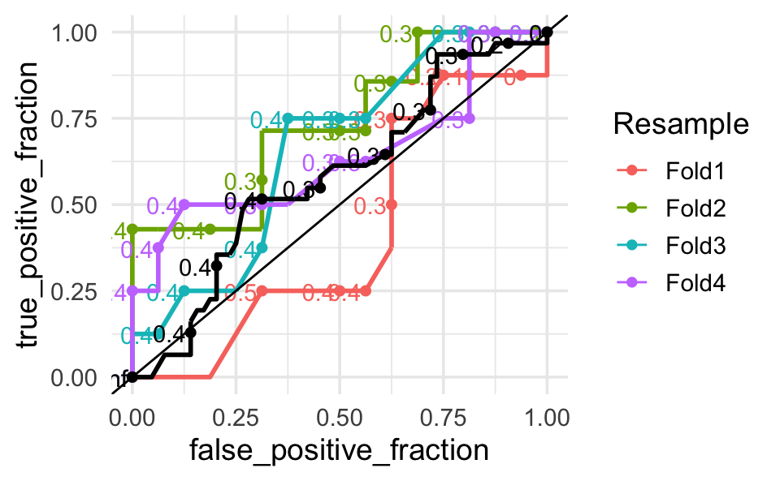

### Drawing interactions

https://interactions.jacob-long.com/index.html


<!--chapter:end:05-log.Rmd-->

# Survival Analysis


To motivate the technical details which are vital to understanding survival analysis, consider the following example [@gerds].

::: {.example}
In class -- experience the Titanic going down.

-   The Titanic is sinking. How long can you hold your breath?\
-   Every person is sinking and will also be their own time keeper (number of seconds the sinker can hold their breath).\
-   Because the Titanic is sinking slowly, the participants go under water asynchronously (i.e., at different times).\
-   Accrual period will last about a minute.\
-   When I say "stop" (about another minute), everyone should end their time clocks (this is the end of the follow-up period).\
-   Each participant will have a recorded time as well as an indicator as to whether or not they have died.

Based on the data, we would like to calculate:\
1. What is the probability of surviving 40 seconds?\
2. What is the median survival time?\
3. What is the average survival time?
:::

The next example is given in your text [@KuiperSklar (chapter 9)] as part of the motivation for survival analysis.

::: {.example}
Class chocolate melting activity

-   Each student should be randomly assigned to a white or milk chocolate chip (flip a coin)\
-   When the instructor gives approval, students should place either a white or milk chocolate chip into their mouths and record the time until it completely melts.\
-   Treat the study as if it could only be done for a specified period of time (this may require some experimenting, but 60 seconds has worked well). If the actual time is less than 60 seconds, then the actual time will be complete. The student should submit the data (chip color, actual time, censoring status); 1=observed, 0=censored. Any chips that are "swallowed" prior to 60 seconds should be regarded as censored.
:::

Survival analysis is typically done with a prospective study (see censoring below) on a cohort of patients (observational or experimental) to determine some clinical outcome. We will also usually measure covariates of interest: treatment, clinical variables measured at recruitment, etc.

> **Key Point**: the outcome of interest (death, recurrence, etc.) may *not* occur

Possible responses:

-   Outcome of interest occurs\

-   Study ends\

-   The individual can no longer be measured (moves away, etc.)

-   **response** fate *and* length of follow-up\

-   **data** suppose we are following n patients\
    $$
    \begin{align*}
    t_i &= \mbox{time the } i^{th} \mbox{ has event of interest}\\
    m(t) &= \mbox{number of patients for whom } t_i > t \mbox{ (die
    later)}\\
    d(t) &= \mbox{number of patients for whom } t_i \leq t \mbox{
    (die sooner)}\\
    \end{align*}
    $$

## Time-to-event data {#timedata}

### Survival Function

The two main quantities of interest (i.e., *parameters*) are:

$$
\begin{align*}
S(t) &= P(T > t) = \mbox{ probability of surviving until after time } t\\
D(t) &= P(T \leq t) = \mbox{ probability of dying by time } t \ (= F(t))\\
\end{align*}
$$ Where $T$ is a random variable representing the time to event; t is a number.

If $t_i$ is known for all i (no censoring), we can estimate $S(t)$ and $D(t)$ with $$
\begin{align*}
\hat{S}(t)_E &= m(t)/n = \mbox{ proportion alive at time } t\\
\hat{D}(t)_E &= d(t)/n = \mbox{ proportion who have died by time } t\\
\end{align*}
$$

#### censoring

-   **right** censoring: when the observation on an individual begins at a defined starting time and ends before the outcome of interest happens (this is the censoring for our model)\
-   **left** censoring: when the outcome of interest is known to have occurred before the study begins (infection of a disease, learning to count). Note that the event of interest *has happened*, unlike in right censoring where the event of interest has not happened.\
-   **interval** censoring; when the event of interest is only known to have occurred between two time points, but the precise time is not known.

**Important Assumption**: survival time must be independent of any mechanism which causes censoring (called non-informative censoring). Censoring should be random: a person who is censored has the same probability of dying as non-censored people at given explanatory variables $\underline{X}$.

Said differently: within any subgroup of interest, the subjects who are censored at time $t$ should be representative of all the subjects in that subgroup who remained at risk at time $t$ with respect to their survival experience.

-   Not independent

    -   Subjects who drop out because they are extremely ill\
    -   Subjects who drop out because of adverse effects of the treatment regimen\

-   Independent

    -   Subjects who drop out because the study ends\
    -   Subjects who drop out because they move away

::: {.example}
Suppose we have the following melting times (in seconds) of milk chocolate chips for 7 students where the maximum time allowed for the experiment was 60 seconds:

| Student |  1  |  2  |  3  |  4  |  5  |  6  |  7  |
|--------:|:---:|:---:|:---:|:---:|:---:|:---:|:---:|
|    Time | 35  | 30  | 60  | 45  | 25  | 55  | 30  |

To find the estimated proportion of chocolate chips that have not melted after 45 seconds we use the **empirical survival function**, $\hat{S}(45)_E$. $$
\begin{align*}
\hat{S}(45)_E &= \frac{\mbox{number of chips that have not melted
after 45 seconds}}{\mbox{total number of chips in the sample}}\\
&= 2/7 = 0.286\\
\hat{S}(t)_E &= \frac{\mbox{number of individuals yet to experience
the event at time } t}{\mbox{number of individuals in the study}}\\
&= \frac{\mbox{number of event times greater than } t}{\mbox{number
of individuals in the study}}\\
\end{align*}
$$

What if some of the observations are incomplete (i.e., censored)?

| Student |   1    |  2  |   3    |  4  |  5  |  6  |   7    |
|--------:|:------:|:---:|:------:|:---:|:---:|:---:|:------:|
|    Time | $35^+$ | 30  | $60^+$ | 45  | 25  | 55  | $30^+$ |

One way to deal with censored observations is to remove them from the study. We would consider our sample to be only those observations that have complete information.

| Student |  2  |  4  |  5  |  6  |
|--------:|:---:|:---:|:---:|:---:|
|    Time | 30  | 45  | 25  | 55  |

$$
\begin{align*}
\hat{S}(45)_E &= \frac{\mbox{number of chips that have not melted after 45 seconds}}{\mbox{total number of chips in the sample}}\\
&= 1/4 = 0.25\\
\end{align*}
$$
:::

By treating censored observations as complete, we assume that the event times are shorter than what they actually are (thereby underestimating the true probability of survival). By removing the censored observations from the data, we lose information. By treating censored observations as complete we bias the estimate based on the remaining times; by ignoring censored observations, we reduce the power of the inferential model.

## Kaplan-Meier Curves {#KM}

When a data set contains incomplete observations, the best estimator of the survival function is the Kaplan-Meier estimator, $\hat{S}(t)_{KM}$. We'll create a few curves by hand, and then we'll let R make them for us.

$$
\begin{align*}
t_1 < t_2 < \cdots < t_n & \ \mbox{ are the ordered completed times}\\
n_i &= \mbox{number of patients known to be at risk at time (day) } t_i, \mbox{ just before } [t_i, t_{i+1})\\
d_i &= \mbox{number of patients who die at time (day) } t_i, \mbox{ in } [t_i, t_{i+1})\\
\end{align*}
$$

For the patients alive at the beginning of the $t_i^{th}$ time, the probability of surviving that time is $$p_i = \frac{n_i - d_i}{n_i}$$ The probability that a patient survives to time 2 given that they survived to time 1 is $$p_2 = \frac{n_2 - d_2}{n_2}$$ The probability that (at the outset) a patient survives to time 2 is: $$
\begin{align*}
P(T > t_2) &= P(T > t_2 | T > t_1) P(T > t_1)\\
&= \frac{n_1 - d_1}{n_1} \frac{n_2 - d_2}{n_2}
\end{align*}
$$ The probability of surviving the first t days is: $$
\begin{align*}
\hat{S}(t)_{KM} &= \prod_{i:t_i < t} \frac{n_i - d_i}{n_i}\\
&= \prod_{i:t_i < t} p_i\\
\hat{D}(t)_{KM} &= 1 - \hat{S}(t)_{KM}\\
\end{align*}
$$ If there are no deaths at time $t_i$, then $(n_i -d_i) / n_i = 1$.

If there is no censoring at time $t_i$, then $n_i - d_i = n_{i+1}$. The Kaplan-Meier survival curve will be equivalent to the empirical survival curve:

$$
\begin{align*}
\hat{S}(t)_{KM} &= \prod_{i:t_i < t} \frac{n_i - d_i}{n_i}\\
&= \frac{n_1 - d_1}{n_1} \frac{n_2 - d_2}{n_2} \cdots \frac{n_k - d_k}{n_k}\\
&= \frac{m(t)}{n}
\end{align*}
$$ ::: {.example} milk chocolate times by hand.

| $t_i$ | $n_i$ | $d_i$ | $n_i - d_i$ | $\frac{n_i - d_i}{n_i}$ |
|:-----:|:-----:|:-----:|:-----------:|:-----------------------:|
|  25   |   7   |   1   |      6      |       6/7= 0.857        |
|  30   |   6   |   1   |      5      |       5/6 = 0.833       |
|  35   |   4   |   0   |      4      |         4/4 = 1         |
|  45   |   3   |   1   |      2      |       2/3 = 0.667       |
|  55   |   2   |   1   |      1      |         1/2=0.5         |
|  60   |   1   |   0   |      1      |          1/1=1          |

| time interval |      $\hat{S}(t)_{KM}$      |
|:-------------:|:---------------------------:|
|   $[0,25)$    |              1              |
|   $[25,30)$   |            0.857            |
|  $[30, 35)$   | 0.857 $\cdot$ 0.833 = 0.714 |
|   $[35,45)$   |   0.714 $\cdot$ 1 = 0.714   |
|   $[45,55)$   | 0.714 $\cdot$ 0.667 = 0.476 |
|   $[55,60)$   |  0.476 $\cdot$ 0.5 = 0.238  |

:::

### CI for KM curve {#KMCI}

Recall: $\hat{S}(t)_{KM} = \prod_{k:t_k < t} [ (n_k - d_k) / n_k]$.

Because $\hat{S}(t)_{KM}$ is just a product of counts, we can "easily" estimate the SE: $$
\begin{align*}
s^2_{\hat{S}(t)_{KM}} = \hat{S}(t)_{KM}^2 \sum_{k:t_k < t}
\frac{d_k}{n_k(n_k - d_k)}
\end{align*}
$$

Your book uses the above SE and normal theory which does work, particularly with large sample sizes. However, with smaller sample sizes and at the ends of the survival curve (close to zero or one), the sampling distribution of the estimated KM curve will not be normal. Additionally if we try to apply normal theory, we'll get something meaningless because the CI will go outside the bounds of 0 and 1. Fortunately, someone figured out a transformation for us!

$l l \hat{S}(t) = \ln (-\ln \hat{S}(t)_{KM})$ has a much more normal sampling distribution than the sampling distribution of the untransformed estimator $\hat{S}(t)_{KM}$.

$$
\begin{align*}
\hat{\sigma}^2(t) &= SE( l l \hat{S}(t))\\
&= \frac{\sum_{k:t_k < t} \frac{d_k}{n_k(n_k - d_k)}}{\bigg[\sum_{k:t_k < t} \ln ( (n_k - d_k) / n_k) \bigg]^2}
\end{align*}
$$ A 95 % CI for $\ln ( -\ln S(t))$ is $$ll\hat{S}(t) \pm 1.96 \hat{\sigma}(t) \ \ \ \mbox{(a function of
t!!!)}$$

A 95 % CI for $S(t)$ is $$\bigg(\hat{S}(t)_{KM}^{\exp(1.96\hat{\sigma}(t))},
\hat{S}(t)_{KM}^{\exp(-1.96\hat{\sigma}(t))} \bigg)$$

We can also find a CI for $D(t) = 1- S(t)$ using:

$$
\begin{align*}
\bigg(1 - \hat{S}(t)_{KM}^{\exp(-1.96\hat{\sigma}(t))}, 1 -
\hat{S}(t)_{KM}^{\exp(1.96\hat{\sigma}(t))} \bigg)
\end{align*}
$$

##### Derivation of the above confidence intervals. {.unnumbered}

Remember that $\exp(a \cdot b) = (\exp(a))^b$, we'll need that below. A CI is an interval of values that captures the true parameter in 95 of samples. Let's say that the complementary log-log interval from above happens to catch the true value of $S(t)$. Then,

$$
\begin{align*}
ll\hat{S}(t) - 1.96 \hat{\sigma}(t) \leq  & llS(t)  \leq ll\hat{S}(t) + 1.96 \hat{\sigma}(t) \\
\exp(ll\hat{S}(t) - 1.96 \hat{\sigma}(t)) \leq  & -lS(t)  \leq \exp(ll\hat{S}(t) + 1.96 \hat{\sigma}(t)) \\
-l\hat{S}(t)\exp(- 1.96 \hat{\sigma}(t))\leq  &-lS(t)  \leq -l\hat{S}(t)\exp(1.96 \hat{\sigma}(t)) \\
l\hat{S}(t)\exp(- 1.96 \hat{\sigma}(t))\geq  & lS(t)  \geq l\hat{S}(t)\exp(1.96 \hat{\sigma}(t)) \\
l\hat{S}(t)\exp(1.96 \hat{\sigma}(t))\leq  & lS(t)  \leq l\hat{S}(t)\exp(-1.96 \hat{\sigma}(t)) \\
\exp(l\hat{S}(t)\exp(1.96 \hat{\sigma}(t))) \leq  & S(t)  \leq \exp(l\hat{S}(t)\exp(-1.96 \hat{\sigma}(t))) \\
\exp(l\hat{S}(t))^{\exp(1.96 \hat{\sigma}(t))} \leq  & S(t)  \leq \exp(l\hat{S}(t))^{\exp(-1.96 \hat{\sigma}(t))} \\
(\hat{S}(t))^{\exp(1.96 \hat{\sigma}(t))} \leq  & S(t)  \leq (\hat{S}(t))^{\exp(-1.96 \hat{\sigma}(t))}
\end{align*}
$$

#### Mean and Median values

**Mean**

> Mean survival time is estimated as the area under the survival curve. The estimator is based upon the entire range of data. Some software uses only the data up to the last observed event [@SurvHL] point out that this biases the estimate of the mean downwards, and they recommend that the entire range of data be used. A large sample method is used to estimate the variance of the mean survival time and thus to construct a confidence interval [@Andersen]. [@KMmean]

In some ways, it is easier to conceptualize the mean as the average under the curve by thinking about calculating average as horizontal bars instead of vertical bars. The jumps along the y-axis are approximately 1/n, so each horizontal bar represents one of the individual deaths. See the example here: <http://blog.data-miners.com/2010/06/why-is-area-under-survival-curve-equal.html>

$$
\begin{align*}
\hat{\mu} = \left\{
    \begin{array}{ll}
    \sum_{i=0}^{m-1} \hat{S}(t_i)_{KM} (t_{i+1} - t_i) & \mbox{if } t_n = t_m  \mbox{ (last obs is complete)}\\
    \sum_{i=0}^{m-1} \hat{S}(t_i)_{KM} (t_{i+1} - t_i) + \hat{S}(t_m)_{KM}(t_n-t_m) & \mbox{if last obs is censored}
    \end{array}
\right.
\end{align*}
$$

Each entry can be rearranged to be thought of as the proportion of people who die in the interval times the width of the interval: $[\hat{S}(t_{i-1})_{KM} - \hat{S}(t_{i})_{KM}]t_i$. The difference, $[\hat{S}(t_{i-1})_{KM} - \hat{S}(t_{i})_{KM}]$, gives the proportion of individuals who die in that time interval. Therefore, our estimate is a weighted average of the time points $t_i$ where the weight is $[\hat{S}(t_{i-1})_{KM} - \hat{S}(t_{i})_{KM}]$.

$$
\begin{align*}
\hat{\mu} &= \sum_{i=0}^{m-1} \hat{S}(t_i)_{KM}(t_{i+1} - t_i)\\
&= \hat{S}(t_0)_{KM}(t_1 - t_0) + \hat{S}(t_1)_{KM}(t_2 - t_1) + \hat{S}(t_2)_{KM} (t_3 - t_2) + \cdots + \hat{S}(t_{m-1})_{KM} (t_m - t_{m-1}) \\
&= -t_0  \hat{S}(t_0)_{KM} + t_1 ( \hat{S}(t_0)_{KM} -  \hat{S}(t_1)_{KM}) + \cdots + t_{m-1}( \hat{S}(t_{m-2})_{KM} -  \hat{S}(t_{m-1})_{KM}) + t_m  \hat{S}(t_{m-1})_{KM}\\
&= 0 + t_1 ( \hat{S}(t_0)_{KM} -  \hat{S}(t_1)_{KM}) + \cdots + t_{m-1}( \hat{S}(t_{m-2})_{KM} -  \hat{S}(t_{m-1})_{KM}) + t_m ( \hat{S}(t_{m-1})_{KM} - 0)\\
&= \mbox{a weighted average of the times}
\end{align*}
$$

**Median**\
Since the distribution of survival times tend to be positively skewed, the median is often the preferred summary measure of location of the distribution. Once the survivor function has been estimated, it is straightforward to obtain an estimate of the *median survival time*. That is, the time beyond which 50 % of the individuals in the population under study are expected to survive, and is given by the value $t_{(50)}$ such that $S(t_{(50)}) = 0.5$.

$$
\begin{align*}
\hat{t}_{(p)} = \mbox{smallest complete event time, } t_i, \mbox{ in the sample such that } \hat{S}(t_i)_{KM} \leq 1-p/100
\end{align*}
$$

$\hat{S}(t_i)_{KM}$ then gives the time at which at least p % of events have occurred. There are also ways of compute confidence intervals for percentiles. We won't cover those here.

### Log-rank Test {#logrank}

As before, we'd like to know if two treatments produce the same probability of survival (how did we do that with logistic regression? significance of the $\beta$ coefficient). Here: $$
\begin{align*}
H_0: & S_1(t) = S_2(t) \ \ \ \ \ \forall t \mbox{
parameters!}\\
H_1: & S_1(t) \ne S_2(t) \ \ \ \ \ \mbox{ for some } t\\
\end{align*}
$$

We want to test whether the curves are the same over all $t$ (or different at any $t$). Let's consider a particular time, the $j^{th}$ event time (we don't look at the censored times, because we only consider when the curve changes / steps):

|          |      Group 1      |      Group 2      | Total       |
|---------:|:-----------------:|:-----------------:|-------------|
|     died |     $d_{1j}$      |     $d_{2j}$      | $d_j$       |
| survived | $n_{1j} - d_{1j}$ | $n_{2j} - d_{2j}$ | $n_j - d_j$ |
|          |     $n_{1j}$      |     $n_{2j}$      | $n_j$       |

Because it's a $2x2$ table with fixed margins, we only need to consider one group. If survival is similar for the two groups, we'd expect:

$$
\begin{align*}
d_{1j} &\approx \frac{d_j}{n_j}n_{1j}\\
d_{1j} &= \mbox{observed}\\
\frac{d_j}{n_j} n_{1j} &= E(d_{1j} | d_j) = E_{1j} \\
var(d_{1j}) &= \frac{n_{1j} n_{2j} d_j (n_j - d_j)}{n_j^2(n_j-1)}
= V_{1j}\\
\end{align*}
$$ where the variance is derived from the hypergeometric distribution.

To estimate the overall difference between the observed and expected death counts: $$
\begin{align*}
\sum_j d_{1j} - \sum_j E(d_{1j} | d_j) = \sum_j d_{1j} - \sum_j
\frac{d_j}{n_j}n\_{1j}
\end{align*}
$$ The overall variability: $$\sum_j var(d_{1j}|d_j)$$ The test statistic we use to compare the observed and expected frequency of deaths. (Sum over all of the death (or event) times.) $$
\begin{align*}
T = \frac{(|\sum_j d_{1j} - \sum_j E(d_{1j} | d_j)| -
0.5)^2}{\sum_j var(d_{1j}|d_j)} \sim \chi^2_1
\end{align*}
$$

What if we had had $g$ groups (instead of 2)? We would have $g-1$ "death" values. Consider the test statistic above, call it $T_1$. If we had $g$ groups, we would need to sum $T_i, i=1,2, \ldots, g-1$. However, the variances of the $T_i$ would be correlated (because the values must sum to $D_k$)... so the test statistic is slightly more complicated. [@Collett(section 2.6)]

-   The Wilcoxon test is very similar to the log-rank test, but it uses a different derivation for the variance, and therefore a different denominator and test statistic.\
-   The log-rank test is more powerful than the Wilcoxon, but the log-rank test requires the proportional hazards assumption.\
-   Wilcoxon test does not require the proportional hazards assumption, but it does require that one curve is always bigger than the other.\
-   Neither work if the curves cross.\
-   Other technical conditions are that the sample size should be "big enough." The sample size is dependent on the number of deaths. No specific criteria, but the results are asymptotic, so the p-values converge to the actual probabilities as the number of deaths gets larger.

## Hazard Functions {#hazfunc}

Another important idea in survival analysis is the hazard function or instantaneous death rate. Let T be the random variable representing death time. [Your text implicitly redefines $S(t) = P(T \geq t)$ which is inconsistent but not fundamentally problematic.]

$$
\begin{align*}
h(t)&= \lim_{\Delta t \rightarrow 0} \frac{P(\mbox{patient dies by time } t + \Delta t | \mbox{alive at } t)}{\Delta t}\\
 &= \lim_{\Delta t \rightarrow 0} \frac{P(T < t + \Delta t | T \geq t)}{\Delta t}\\
 &= \lim_{\Delta t \rightarrow 0} \frac{P(t \leq T < t + \Delta t | T \geq t)}{\Delta t}\\
 &= \lim_{\Delta t \rightarrow 0} \frac{P(t \leq T < t + \Delta t )}{P(T \geq t) \Delta t}\\
 &= \lim_{\Delta t \rightarrow 0} \frac{S(t) - S(t + \Delta t)}{S(t) \Delta t}\\
 &= \lim_{\Delta t \rightarrow 0} -\frac{S(t + \Delta t) - S(t)}{\Delta t}\frac{1}{S(t)}\\
 &= -S'(t) \frac{1}{S(t)}\\
 &= -\frac{d}{dt} \ln(S(t))\\
S(t) &= \exp \{ - \int^t_0 h(x) dx  \}\\
\end{align*}
$$

How do different functions of $h$ affect the survival curve, $S$?

$$
\begin{align*}
h(t) = 0 &&\Rightarrow \mbox{ no risk of death at time } t\\
&& \Rightarrow S(t) \mbox{ is flat at } t\\
h(t) \> \>&& \Rightarrow S(t) \mbox{ is rapidly declining in } t\\
h(t) =k && \Rightarrow S(t) = e^{-kt}
\end{align*}
$$

#### hazard function as a constant

If $h(t) =k \rightarrow S(t) = e^{-kt}$.

Plots of different hazard functions and their corresponding survival functions.


### Estimating $h(t)$ ala Kaplan-Meier

$h(t)$ is the rate at which individuals in the population experience the event in the next *instant* of time, conditional on surviving to time $t$. The estimated hazard curve can only extend to the last complete event time, otherwise the denominator is infinitely large. Also, keep in mind that $h(t)$ is very hard to estimate, and $\hat{h}_{KM}(t)$ can be erratic.

$$
\begin{align*}
\hat{P}(t_i \leq T < t_{i+1} | T \geq t_i) &= \frac{d_i}{n_i} = \hat{p}_i\\
\hat{h}_{KM}(t) &= \frac{\hat{p}_i}{t_{i+1} - t_i}  \ \ \ \ \ \ t_{i+1} \leq t < t_i\\
\end{align*}
$$

### Proportional Hazards

Suppose that $h_0(t)$ and $h_1(t)$ are the hazard functions for patients on control and experimental treatments. The two groups have {\sc proportional hazards} if $h_1(t) = R h_0(t)$ for some constant R: $$\frac{h_1(t)}{h_0(t)} = R \ \ \ \ \ \forall t$$ R is called the **hazard ratio**. $h_0(t)$ can be anything as long as $h_1(t)$ is proportional. Note in the pictures below that no one dies between 3 and 7 days, the survival curves are flat over that interval.


Consider the notion of risk of death: $$
\begin{align*}
\mbox{risk of death by } t + \Delta t \mbox{ given alive at } t=
\left\{
\begin{array}{ll}
h_0(t) \Delta t & \mbox{control}\\
h_1(t) \Delta t & \mbox{experiment}
\end{array}
\right.
\end{align*}
$$

$$
\begin{align*}
\frac{\mbox{risk of dying for experim}}{\mbox{risk of dying control}} = \frac{h_1(t) \Delta t}{h_0(t) \Delta t} = \frac{h_1(t) }{h_0(t) } = R
\end{align*}
$$Ratio of hazard functions can be thought of as the **instantaneous relative risk** (i.e., at a time $t$).

### Cox PH Regression Analysis {#coxph}

#### Simple proportional hazards model

ASSUMING proportional hazards! Let $h_0(t)$ be the hazard function for the control group. $x_i$ =1 if the $i^{th}$ patient receives treatment; 0 if the $i^{th}$ patient receives the control. A big value of $\beta$ means that the event is more likely to happen.

$$
\begin{align*}
h_i(t) &= h_0(t) e^{\beta x_i} = \left\{
\begin{array}{ll}
h_0(t) e^\beta & \mbox{experim}\\
h_0(t) & \mbox{control}
\end{array}
\right.\\
\mbox{inst. RR} &= \frac{h_0(t) e^\beta}{h_0(t)} = e^\beta\\
S_i(t) &= (S_0(t))^{e^\beta}\\
\end{align*}
$$ We don't yet know how to run this model and estimate the parameters, but still, we can probably do it. Right? We run a **Cox proportional hazards model**, get $b$, and estimate the HR using: $\widehat{HR} = e^{b}$! It turns out that for large samples (as with logistic regression, the CI and tests below are again called Wald CI and tests),

$$
\begin{align*}
b \sim N: & \\
& 95\% \mbox{ CI for } \beta: b \pm 1.96 SE(b)\\
& 95\% \mbox{ CI for } HR: (e^{b - 1.96 SE(b)}, e^{b + 1.96 SE(b)})\\
\end{align*}
$$ And we can test HR by using $\beta$: $$
\begin{align*}
H_0: \ & \beta=0 \iff HR = 1\\
Z &= \frac{b - 0 }{SE(b)}
\end{align*}
$$

#### Estimating the proportional hazards coefficients

The main point of proportional hazards is that if we have proportional hazards, then we don't actually need to know the hazard function in order to estimate the coefficients which affect the survival function. [We divide out the hazard function.]

Intervals between death times convey no information about the relationship between hazard and explanatory variables (including treatment). We are also assuming that we have no ties for our death times. [Importantly, we assume that the proportional hazards assumption holds over *all* $t$.]

$$
\begin{align*}
P(i^{th} \mbox{ indiv, w/}x_i, \mbox{ dies at } t_i | \mbox{one death at } t_i) &= \frac{P(i^{th} \mbox{ indiv w/}x_i \mbox{ dies at } t_i )}{P(\mbox{at least one death at } t_i)}\\
&= \frac{\mbox{hazard at } t_i}{\mbox{sum over all patients at risk at time } t_i}\\
&= \frac{h_i(t_i)}{\sum_{k:t_k \geq t_i} h_k (t_i)} \\
&= \frac{e^{\beta x_i}}{\sum_{k:t_k \geq t_i} e^{\beta x_k}}
\end{align*}
$$ As with logistic regression (and linear regression!) we'll use maximum likelihood to estimate the parameter(s). (The product is over only patients who have death times recorded, not censored times).

$$
\begin{align*}
L(\beta) &= \prod_{i=1}^r \frac{e^{\beta x_i}}{\sum_{k:t_k
\geq t_i} e^{\beta x_k}}\\
\delta_i &= \left\{\begin{array}{ll}
1 & \mbox{death}\\
0 & \mbox{censored}
\end{array}
\right.\\
L(\beta) &= \prod_{i=1}^n \Bigg( \frac{e^{\beta
x_i}}{\sum_{k:t_k \geq t_i} e^{\beta x_k}} \Bigg)^{\delta_i}\\
\ln L(\beta) &= \sum_{i=1}^n \delta_i \bigg[ \beta x_i - \ln
(\sum_{k:t_k \geq t_i} e^{\beta x_k}) \bigg]
\end{align*}
$$ $b$ is found using numerical methods (as it was with logistic regression).

::: {.example}
Consider the following data from a prostate cancer study. The study was performed as a randomized clinical trail to compare treatments for prostatic cancer, and was begun in 1967 by the Veteran's Administration Cooperative Urological Research Group. The trial was double blind and two of the treatments used were a placebo and 1.0 mg of diethylstilbestrol (DES). The time origin of the study is the date on which a patient was randomized to a treatment, and the end-point is the death of the patient from prostate cancer. The full data set is given in @AndHerz, but the data used in this example are from patients presenting with Stage III cancer and given in @Collett (page 8).


```r
library(survival)
prostate <- readr::read_csv("PROSTATE.csv")
head(prostate)
#> # A tibble: 6 x 7
#>   Treatment  Time Status   Age  Haem  Size Gleason
#>       <dbl> <dbl>  <dbl> <dbl> <dbl> <dbl>   <dbl>
#> 1         1    65      0    67  13.4    34       8
#> 2         2    61      0    60  14.6     4      10
#> 3         2    60      0    77  15.6     3       8
#> 4         1    58      0    64  16.2     6       9
#> 5         2    51      0    65  14.1    21       9
#> 6         1    51      0    61  13.5     8       8

coxph(Surv(Time,Status) ~ Treatment, data = prostate)
#> Call:
#> coxph(formula = Surv(Time, Status) ~ Treatment, data = prostate)
#> 
#>           coef exp(coef) se(coef)  z    p
#> Treatment -2.0       0.1      1.1 -2 0.07
#> 
#> Likelihood ratio test=5  on 1 df, p=0.03
#> n= 38, number of events= 6

coxph(Surv(Time,Status) ~ Treatment, data = prostate) %>% tidy()
#> # A tibble: 1 x 5
#>   term      estimate std.error statistic p.value
#>   <chr>        <dbl>     <dbl>     <dbl>   <dbl>
#> 1 Treatment    -1.98      1.10     -1.80  0.0717
coxph(Surv(Time,Status) ~ Treatment, data = prostate) %>% glance()
#> # A tibble: 1 x 18
#>       n nevent statistic.log p.value.log statistic.sc p.value.sc statistic.wald
#>   <int>  <dbl>         <dbl>       <dbl>        <dbl>      <dbl>          <dbl>
#> 1    38      6          4.55      0.0329         4.42     0.0355           3.24
#> # … with 11 more variables: p.value.wald <dbl>, statistic.robust <dbl>,
#> #   p.value.robust <dbl>, r.squared <dbl>, r.squared.max <dbl>,
#> #   concordance <dbl>, std.error.concordance <dbl>, logLik <dbl>, AIC <dbl>,
#> #   BIC <dbl>, nobs <int>
```

-   **Note 1**: There is no intercept in the model. The intercept is contained within the $h_0(t)$ parameter.\

-   **Note 2**: Nowhere have we made any assumptions about the form of $h_0(t)$.\

-   **Note 3**: To estimate $h_0(t)$, we use the pointwise values, just like Kaplan-Meier plots ($\tau_j = t_{(j+1)} - t_j):$ $$h_0(t_j) = \frac{d_j}{n_j \tau_j}$$ If there are covariates, the estimation gets much more complicated.\

-   **Note 4**: The logrank statistic can be derived as the score test for the Cox proportional hazards model comparing two groups. It is therefore approximately equivalent to the likelihood ratio test statistics from that model [@Collett (section 3.9, page 102-106)]. Additionally, the log-rank test is most powerful against the alternative that the hazard of death at any given time for an individual in one group is proportional to the hazard at that time for a similar individual in the other group (i.e., the proportional hazards assumption). [@Collett (section 2.5.4, pg 44-45)] $$
    \begin{align*}
    H_0:\ &h_1(t) = h_2(t)\\
    H_1:\ &h_1(t) = R h_2(t)
    \end{align*}
    $$

-   **Note 5**: You need proportional hazards to do the *inference* (otherwise your p-values are meaningless!). The technical assumptions for the Cox Proportional Hazards model are:

    -   Observations are independent (this is almost always an important assumption in all of statistical inference)\
    -   Proportional hazards: the hazard ratios are not dependent on time.\
    -   Independent censoring: the censored observations have the same survival prospects as the non-censored participants.\
:::

#### Cox PH Multiple Regression Analysis {#multcoxph}

Extending the simple proportional hazards model to include multiple covariates.

Let $x_{i1}, x_{i2}, \ldots, x_{iq}$ be the $q$ covariates for person $i$. We define the baseline hazard as: $$
\begin{align*}
h_0(t) &= \mbox{hazard for patients with covariates }
x_{i1}=x_{i2}=\cdots=x_{iq} = 0\\
h_i(t) &= h_0(t) e^{\beta_1 x_{i1} + \beta_2 x_{i2} + \cdots +
\beta_q x_{iq}}\\
\end{align*}
$$ is the hazard function for the $i^{th}$ patient.

As before, we can consider nested models and compare their likelihoods.

$$
\begin{align*}
-2 \ln \frac{L_{\mbox{reduced model}}}{L_{\mbox{full model}}}
&\sim \chi^2_{\Delta p}\\
& \\
2 \bigg( \ln L_{\mbox{full model}} - \ln L_{\mbox{reduced model}} \bigg) &=
\mbox{test stat}\\
\end{align*}
$$

::: {.example}
**Framingham Heart Study** [example @Dupont (section 3.10)] Long-term follow-up and cardiovascular risk factor data on almost 5000 residents of the town of Framingham, MA. Recruitment started in 1948 (went for 40+ years). These data are 4699 patients who were free of coronary heart disease at their baseline exam [@framingham]:

| variable |     | code                                                   |
|----------|:---:|--------------------------------------------------------|
| sex      |  =  | gender coded as                                        |
|          |     | 1=if subject is male                                   |
|          |     | 0= if subject is female                                |
| sbp      |  =  | systolic blood pressure (SBP) in mm Hg                 |
| dbp      |  =  | diastolic blood pressure (DBP) in mm Hg                |
| scl      |  =  | serum cholesterol (SCL) in mg/100ml                    |
| chdfate  |  =  | 1= if the patient develops CHD at the end of follow-up |
|          |     | 0= otherwise                                           |
| followup |  =  | the subject's follow-up in days                        |
| age      |  =  | age in years                                           |
| bmi      |  =  | body mass index (BMI) =weight/height$^2$ in kg/m$^2$   |
| month    |  =  | month of year in which baseline exam occurred          |
| id       |  =  | a patient identification variable (numbered 1 to 4699) |

We look at the K-M survival curves broken down by diastolic blood pressure. The logrank statistic comparing all 7 groups is highly significant ($p < 10^{-52}$), and the pairwise logrank tests for adjacent pairs of risk groups are also all significant (though be careful with multiple comparisons!).
:::


```r
heart <- readr::read_csv("framingham.csv")

heart <- heart %>% 
  mutate(dbpf = case_when(
    dbp <= 60 ~ "under60",
    dbp <=70 ~ "60-70",
    dbp <= 80 ~ "70-80",
    dbp <=90 ~ "80-90",
    dbp <=100 ~ "90-100",
    dbp <=110 ~ "100-110",
    TRUE ~ "over110")) %>%
  mutate(dbpf = factor(dbpf,
                       levels = c("under60", "60-70", "70-80","80-90", "90-100","100-110","over110")),
         sex = case_when(
           sex == 1 ~ "male", 
           TRUE ~ "female"))
```

$$
\begin{align*}
dbp_{ij} &= \left\{
\begin{array}{ll}
1 & \mbox{if the } i^{th} \mbox{ patient is in DBP group } j\\
0 & \mbox{otherwise}
\end{array}
\right.\\
male_i &= \left\{
\begin{array}{ll}
1 & \mbox{if the } i^{th} \mbox{ patient is male}\\
0 & \mbox{if the } i^{th} \mbox{ patient is female}\\
\end{array}
\right.\\
\end{align*}
$$

-   **Table 7.1**\
    Using a proportional hazards model for estimating the hazard ratio associated with each blood pressure group, we get: $$
    \begin{align*}
    h_i(t) &= h_0(t) \exp \bigg\{ \beta_2 dbp_{i2} + \beta_3 dbp_{i3} + \beta_4 dbp_{i4} + \beta_5 dbp_{i5} + \beta_6 dbp_{i6} + \beta_7 dbp_{i7} \bigg\}\\ 
    h_i(t) &= h0(t) \exp \bigg\{ \sum_{j=2}^7 \beta_j dbp_{ij} \bigg\} 
    \end{align*}
    $$

We can use the model with dbp as categorical to check whether dbp could be used as a continuous variable. Indeed, it seems that the model is linear (in ln(HR)) with respect to `dbp`. What we see (in the linearity) is that the hazard ratio for an increase in 10 dbp is constant regardless of the actual value of `dbp`. Indeed, it seems like the hazard ratio for a 10 unit increase in `dbp` is roughly $e^{0.3}$ regardless of the value of `dbp`. When the model is run on `dbp` as a continuous variable (instead of as groups) we **also** see that the hazard ratio associated with a 10 unit increase in `dbp` is $e^{0.3}$.

One reason, however, to keep the variable broken into groups is because of the way the results are nicely laid out for each group.


```r
coxph(Surv(followup,chdfate) ~ dbpf, data = heart) %>% tidy()
#> # A tibble: 6 x 5
#>   term        estimate std.error statistic  p.value
#>   <chr>          <dbl>     <dbl>     <dbl>    <dbl>
#> 1 dbpf60-70      0.677     0.247      2.74 6.11e- 3
#> 2 dbpf70-80      0.939     0.241      3.90 9.56e- 5
#> 3 dbpf80-90      1.12      0.241      4.64 3.54e- 6
#> 4 dbpf90-100     1.51      0.243      6.22 4.97e-10
#> 5 dbpf100-110    1.84      0.254      7.23 4.86e-13
#> 6 dbpfover110    2.25      0.271      8.29 1.18e-16
coxph(Surv(followup,chdfate) ~ dbp, data = heart) %>% tidy()
#> # A tibble: 1 x 5
#>   term  estimate std.error statistic  p.value
#>   <chr>    <dbl>     <dbl>     <dbl>    <dbl>
#> 1 dbp     0.0316   0.00193      16.3 4.53e-60

coxph(Surv(followup,chdfate) ~ dbpf, data = heart) %>% glance()
#> # A tibble: 1 x 18
#>       n nevent statistic.log p.value.log statistic.sc p.value.sc statistic.wald
#>   <int>  <dbl>         <dbl>       <dbl>        <dbl>      <dbl>          <dbl>
#> 1  4699   1473          222.    4.22e-45         260.   3.44e-53           237.
#> # … with 11 more variables: p.value.wald <dbl>, statistic.robust <dbl>,
#> #   p.value.robust <dbl>, r.squared <dbl>, r.squared.max <dbl>,
#> #   concordance <dbl>, std.error.concordance <dbl>, logLik <dbl>, AIC <dbl>,
#> #   BIC <dbl>, nobs <int>
```

<div class="figure" style="text-align: center">

<p class="caption">(\#fig:unnamed-chunk-7)Table 7.1 from @Collett.</p>
</div>


-   **Table 7.2**\
    As our next step, we can consider adding gender as a *multiplicative effect* to our model. $$
    \begin{align*}
    h_i(t) &= h_0(t) \exp \bigg\{ \sum_{j=2}^7 \beta_j
    dbp_{ij} + \gamma male_i \bigg\}
    \end{align*}
    $$ We say the effects are multiplicative because we are adding in the exponent, so any effect due to gender will be multiplied with the effect due to dbp. How do we tell - from the results - that interaction wasn't modeled? Look at the hazard ratios, are they consistent when comparing one variable and keeping the other one constant? That is, check to see if the HR for two different levels of dbp is the same regardless of whether men or women are considered.

    -   The change in deviance is 133 ($H_0: \gamma =0$), so with one degree of freedom, the p-value is very small. We do not think that $\gamma=0$, so we need gender in the model.


```r
coxph(Surv(followup,chdfate) ~ sex + dbpf, data = heart) %>% tidy()
#> # A tibble: 7 x 5
#>   term        estimate std.error statistic  p.value
#>   <chr>          <dbl>     <dbl>     <dbl>    <dbl>
#> 1 sexmale        0.606    0.0528     11.5  1.54e-30
#> 2 dbpf60-70      0.648    0.247       2.62 8.74e- 3
#> 3 dbpf70-80      0.888    0.241       3.69 2.27e- 4
#> 4 dbpf80-90      1.02     0.241       4.24 2.25e- 5
#> 5 dbpf90-100     1.40     0.243       5.76 8.48e- 9
#> 6 dbpf100-110    1.79     0.254       7.02 2.29e-12
#> # … with 1 more row

coxph(Surv(followup,chdfate) ~ sex + dbpf, data = heart) %>% glance()
#> # A tibble: 1 x 18
#>       n nevent statistic.log p.value.log statistic.sc p.value.sc statistic.wald
#>   <int>  <dbl>         <dbl>       <dbl>        <dbl>      <dbl>          <dbl>
#> 1  4699   1473          355.    1.10e-72         397.   1.08e-81           369.
#> # … with 11 more variables: p.value.wald <dbl>, statistic.robust <dbl>,
#> #   p.value.robust <dbl>, r.squared <dbl>, r.squared.max <dbl>,
#> #   concordance <dbl>, std.error.concordance <dbl>, logLik <dbl>, AIC <dbl>,
#> #   BIC <dbl>, nobs <int>
```


<div class="figure" style="text-align: center">

<p class="caption">(\#fig:unnamed-chunk-9)Table 7.2 from @Collett.</p>
</div>


-   **Table 7.3** Considering gender and dbp interacting. $$
    \begin{align*}
    h_i(t) &= h_0(t) \exp \bigg\{ \sum_{j=2}^7 \beta_j
    dbp_{ij} + \gamma male_i + \sum_{j=2}^7 \delta_j dbp_{ij}
    male_i \bigg\}
    \end{align*}
    $$

    -   The change in deviance is 21.23 ($H_0: \delta_j =0$), so with six degrees of freedom, the p-value is 0.002. The evidence of interaction is statistically significant.\
    -   Note the marked differences between the estimates in table 7.2 and 7.3. The interactive model indicates that the effect of gender on the risk of CHD is greatest for people with low or moderate blood pressure and diminishes as blood pressure rises. Gender appears to have no effect on CHD for people with a DBP above 110 mm Hg.


```r
coxph(Surv(followup,chdfate) ~ sex*dbpf, data = heart) %>% tidy()
#> # A tibble: 13 x 5
#>   term        estimate std.error statistic      p.value
#>   <chr>          <dbl>     <dbl>     <dbl>        <dbl>
#> 1 sexmale        0.864     0.471      1.83 0.0668      
#> 2 dbpf60-70      0.603     0.352      1.71 0.0866      
#> 3 dbpf70-80      0.887     0.342      2.60 0.00944     
#> 4 dbpf80-90      1.26      0.341      3.68 0.000230    
#> 5 dbpf90-100     1.55      0.347      4.46 0.00000829  
#> 6 dbpf100-110    2.03      0.358      5.67 0.0000000141
#> # … with 7 more rows
coxph(Surv(followup,chdfate) ~ sex*dbpf, data = heart) %>% glance()
#> # A tibble: 1 x 18
#>       n nevent statistic.log p.value.log statistic.sc p.value.sc statistic.wald
#>   <int>  <dbl>         <dbl>       <dbl>        <dbl>      <dbl>          <dbl>
#> 1  4699   1473          376.    2.43e-72         409.   3.29e-79           362.
#> # … with 11 more variables: p.value.wald <dbl>, statistic.robust <dbl>,
#> #   p.value.robust <dbl>, r.squared <dbl>, r.squared.max <dbl>,
#> #   concordance <dbl>, std.error.concordance <dbl>, logLik <dbl>, AIC <dbl>,
#> #   BIC <dbl>, nobs <int>
```

<div class="figure" style="text-align: center">
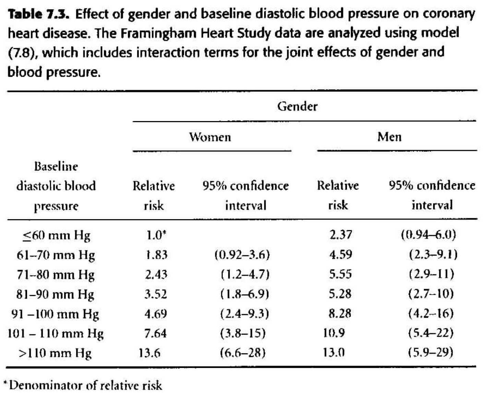
<p class="caption">(\#fig:unnamed-chunk-11)Table 7.3 from @Collett.</p>
</div>


-   **Table 7.4**\
    Adjusting for confounding variables. Of particular interest is age at baseline exam. We know that age varied widely among study subjects, and both DBP and risk of CHD increase with age. We will also consider the effect of body mass index and serum cholesterol. $$
    \begin{align*}
    h_i(t) &= h_0(t) \exp \bigg\{ \sum_{j=2}^7 \beta_j dbp_{ij} + \gamma male_i + \sum_{j=2}^7 \delta_j dbp_{ij} male_i \\
    & \ \ \ \ \ \ \ \ \ \ \ \ \ \ \  \ \ \ \ \ \  \theta_1 age_i + \theta_2 bmi_i + \theta_3 scl_i \bigg\}
    \end{align*}
    $$

    -   We need $\theta_1, \theta_2, \theta_3$, as they are all statistically significant.
    -   The HR in Table 7.4 are substantially smaller than those in Table 7.3. It is important to realize that the HR in Table 7.4 compare people of the same age, body mass index, and serum cholesterol, while those of Table 7.3 compare people without regard to other variables. It is not surprising that the unadjusted HR are inflated due to the confounding variables.
    -   Goal: to predict CHD $\rightarrow$ because it's easier to measure blood pressure than cholesterol, we may just prefer to use the unadjusted model.
    -   Goal: to establish a causal link $\rightarrow$ we *must* adjust for all possible confounding variables.

When should we transform a continuous variable into a factor variable?

-   **continuous** If we believe that the relationship is linear in log(HR)\
-   **factor** If the relationship is not linear. Although keep in mind that there can be lots of coefficients to estimate when we make factor variables, so we lose df.


```r
coxph(Surv(followup,chdfate) ~ dbpf * sex + age + bmi + scl, data = heart) %>% tidy()
#> # A tibble: 16 x 5
#>   term        estimate std.error statistic   p.value
#>   <chr>          <dbl>     <dbl>     <dbl>     <dbl>
#> 1 dbpf60-70      0.415     0.352      1.18 0.238    
#> 2 dbpf70-80      0.503     0.343      1.47 0.142    
#> 3 dbpf80-90      0.648     0.344      1.89 0.0592   
#> 4 dbpf90-100     0.661     0.351      1.88 0.0599   
#> 5 dbpf100-110    1.13      0.363      3.12 0.00183  
#> 6 dbpfover110    1.66      0.377      4.40 0.0000107
#> # … with 10 more rows
coxph(Surv(followup,chdfate) ~ dbpf * sex + age + bmi + scl, data = heart) %>% glance()
#> # A tibble: 1 x 18
#>       n nevent statistic.log p.value.log statistic.sc p.value.sc statistic.wald
#>   <int>  <dbl>         <dbl>       <dbl>        <dbl>      <dbl>          <dbl>
#> 1  4658   1465          754.   5.12e-150         774.  2.21e-154           707.
#> # … with 11 more variables: p.value.wald <dbl>, statistic.robust <dbl>,
#> #   p.value.robust <dbl>, r.squared <dbl>, r.squared.max <dbl>,
#> #   concordance <dbl>, std.error.concordance <dbl>, logLik <dbl>, AIC <dbl>,
#> #   BIC <dbl>, nobs <int>
```


<div class="figure" style="text-align: center">
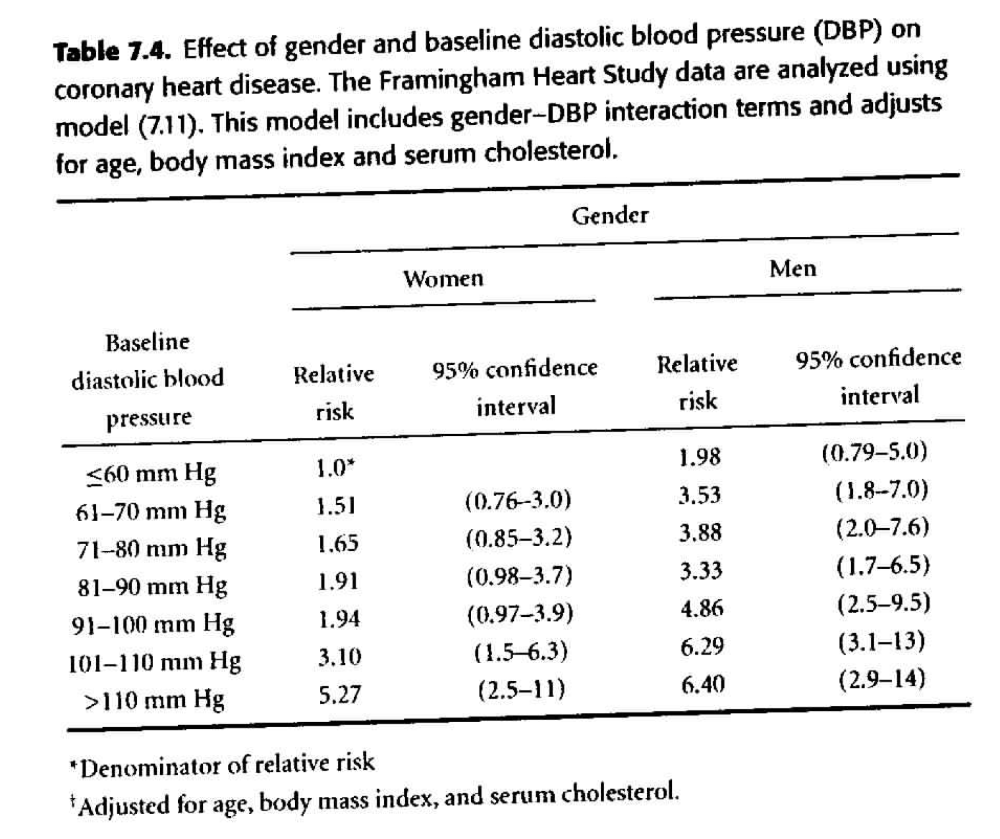
<p class="caption">(\#fig:unnamed-chunk-13)Table 7.4 from @Collett.</p>
</div>


### Testing Proportional Hazards {#testingph}

<!-- Note: in my yellow notes from 2008 I've covered all the residual analysis stuff.  The notes aren't particularly organized or well thought-out.  The topic probably isn't relevant for this class. -->

#### Proportional Hazards via survival curves:

We've discussed that proportional hazards means that the hazard in one group is a constant multiple of the hazard in another group. What does that mean in terms of the survival function?

$$
\begin{align*}
h_1 (t) &= h_0 (t) e^\beta\\
S(t) &= e^{-\int_0^t h(x) dx}\\
S_0(t) &= e^{-\int_0^t h_0(x) dx}\\
S_1(t) &= e^{-\int_0^t h_0(x)e^\beta dx}\\
S_1(t) &= e^{- e^\beta \int_0^t h_0(x) dx}\\
S_1(t) &= \bigg[ e^{- \int_0^t h_0(x) dx} \bigg]^{e^\beta}\\
\ln(S_1(t)) &= e^\beta \ln [e^{- \int_0^t h_0(x) dx}]\\
-\ln(S_1(t)) &= e^\beta  [-\ln(S_0(t))]\\
\ln(-\ln(S_1(t))) &= \beta + \ln [-\ln(S_0(t))]\\
\end{align*}
$$ 

##### Test 1 for PH {-}

Therefore, the $\ln (- \ln$ survival curves) should be parallel and differ only by a y-intercept constant of $\beta$.

Note that if $h_0(t)$ is a constant (i.e., $h_i(t) = e^\beta$), then

$$
\begin{align*}
S(t) &= e^{-\int_0^t h(x) dx}\\
&= e^{- e^\beta t}\\
\ln S(t) &= - e^\beta t\\
- \ln S(t) &= e^\beta t\\
\ln(- \ln S(t)) &= \beta + \ln(t)\\
\end{align*}
$$

Which is to say that if $ln(- ln S(t))$ is linear in $\ln(t)$, then $h_0(t)$ is not only PH but also constant for all $t$.

#### Proportional Hazards via a test for time dependent covariates

If the PH assumption is violated, then we have:

$$\frac{h_i(t)}{h_0(t)} = g(t)$$ some function of $t$. Consider the following model (the function of time is completely specified, but it is just one possibility for the dependence relationship):

$$
\begin{align*}
x_{i1}  &= \left\{
\begin{array}{ll}
1 & treatment\\
0 & control
\end{array}
\right.\\
x_{i2} &= \left\{
\begin{array}{ll}
t & treatment\\
0 & control\\
\end{array}
\right.\\
\end{align*}
$$

The relative hazard becomes: 
$$
\begin{align*}
h_i(t) &= e^{\beta_1 x_{i1} + \beta_2 x_{i2}} h_0(t)\\
\frac{h_1(t)}{h_0(t)} &= e^{\beta_1 +\beta_2 t}\\
\end{align*}
$$

If $\beta_2 < 0$, the relative hazard decreases with time. If $\beta_2 > 0$, the relative hazard increases with time.

##### Test 2 for PH {-}

The PH test of interest will be: $$H_0: \beta_2 = 0$$ It isn't a Wald test, but it is the same general idea (in R: `cox.zph`). [The variable in the denominator of the likelihood (for calculating the MLE) will have different values at different times.] An alternative form of the test is to call: $x_{i2} = t \ \ \forall t$ and let $$h_i(t) = e^{\beta_1 x_{i1} + \beta_2 x_{i1} x_{i2}} h_0(t).$$

If there is time dependency in the model, then the `coxph` analysis won't be accurate.

#### Proportional Hazards via Schoenfeld Residuals

Recall: under the Cox model, the probability that any particular member $i$ fails at time $t_j$ is: 

$$
\begin{align*}
P(i^{th} \mbox{ indiv w/}x_i \mbox{ dies at } t_j | \mbox{at least
one death at } t_j) &= \frac{P(i^{th} \mbox{ indiv w/}x_i \mbox{
dies at } t_j )}{P(\mbox{at least one death at } t_j)}\\
&= \frac{\mbox{hazard at } t_i}{\mbox{sum over all patients at risk
at time } t_j}\\
&= \frac{h_i(t_j)}{\sum_{k:t_k \geq t_j} h_k (t_j)} \\
&= \frac{e^{\beta x_i}}{\sum_{k:t_k \geq t_j} e^{\beta
x_k}}\\
w_j(\beta, t_j) &= \frac{e^{\beta x_i}}{\sum_{k:t_k \geq t_j}
e^{\beta x_k}}
\end{align*}
$$

Using the weights above, we can calculate the average value for the $l^{th}$ covariate (i.e., explanatory variable): $$\bar{x}_l (\beta,t_j) = \sum_{k: t_k \geq t_j} x_{kl}
w_j(\beta, t_j)$$

The Schoenfeld Residual for $x_l$ and any subject $i$ who is still alive at time $t_j$, is the *difference* between the covariate $x_{il}$ for that subject and the weighted average of the covariates in the risk set: $$\mbox{Schoenfeld resid }_i = x_{il} - \bar{x}_l(\beta, t_i)$$ Note that the calculation is for the $i^{th}$ subject which means there was a death at time $t_i$.

##### Test 3 for PH {-}

The idea is for the residual plot of (Schoenfeld residual wrt a paticular covariate on the y-axis, time on the x-axis)to be flat. What if there is a strong linear trend for the residuals? What would that say about the time dependency? Imagine a scatterplot where the residual is very positively linearly associated with time. If $t_i > >$ then $x_i$ is much bigger than expected; if $t_i < <$ then $x_i$ is much smaller than expected. That is, the covariate of interest changes over time and its effect on the risk of survival does, too.

#### Solutions to violations of PH

-   **crossing** If the hazard functions (or survivor functions!) cross over time, the PH assumption is violated.\
-   **help** What should we do?\

1.  Don't do coxph, just fit K-M curves separately and perform a log-rank test.\
2.  Start at $t^*$, the crossing point.\
3.  Fit different models for before $t^*$ and after $t^*$.\
4.  Fit a model with a time dependent covariate.\
5.  Creative analysis: instead of tumor size, use % change over a set period of time.

-   **examples** of PH violations

    -   over time, the treatment effect lessens (short term benefits)\
    -   tumor size at endpoint is more predictive than tumor size at entrance.\
    -   clinical variables that change over time (lung capacity, weight, white blood cell count)\
    -   exposure variables (pollution, UV rays, etc.)\
    -   age, temperature

#### Log linearity

We've also assumed that the log of the hazard ratio is linear in the covariates. That a one unit change in any covariate has the same effect on the log of the HR (at any level of the covariate). Just like with logistic regression, this assumption is hard to check. However, we can see how the modeling performs by checking to see if quadratic (or other higher order terms) are significant in the model. Another possibility is to categorize a continuous predictor to check PH assumptions as above.

## Other stuff {#othersurv}

### Sample Size Calculation

#### Sample Size for Two Independent Sample Means Inference

Taking a step back to consider a slightly simpler inference (two sample mean), let's say we want a size of $\alpha=0.05$ and a power of $1-\beta=0.8$. What does that mean? How do they relate to the type I and type II errors? Draw some pictures. We're talking about the only thing we can control: the sample size. We cannot actually control the truth of the hypotheses, the extent of the difference in in $H_0$ versus $H_A$, or the variability of the underlying population. We **can** control the sample size. The larger your sample size, the easier it is to identify a true alternative hypothesis (that is, the higher the power).

In order to estimate the needed sample size, you need to know how often you are willing to make type I errors, how often you are willing to make type II errors, and how big of a difference between $H_0$ and $H_A$ you would like to determine. Without all three of those components, it is **impossible** to determine the sample size. If you read that a sample size calculation has been done, they **must** report the associated size, power, and difference (or their calculation will be meaningless).

$$
\begin{align*}
H_0: \ &\mu_1 - \mu_2 = 0\\
H_A: \ &\mu_1 - \mu_2 \ne 0
\end{align*}
$$

We have to make some assumptions. We assume that the size is 0.05, the power is 0.8, and the alternative hypothesis is $D = \mu_1 - \mu_2$. For this case, let's also assume that $\sigma_1=\sigma_2=\sigma$ and $n_1=n_2=n$. Without loss of generality, let's say $\overline{Y}_1 - \overline{Y}_2 > 0$.

$$
\begin{align*}
P\bigg(\frac{\overline{Y}_1 - \overline{Y}_2 - 0}{\sigma
\sqrt{1/n + 1/n}} > 1.96 \bigg| \mu_1 - \mu_2 = 0 \bigg) &=
0.025\\
P(\overline{Y}_1 - \overline{Y}_2 > 1.96 \sigma \sqrt{1/n + 1/n}
\bigg| \mu_1 - \mu_2 = 0) &= 0.025\\
P(\overline{Y}_1 - \overline{Y}_2 > 1.96 \sigma \sqrt{1/n + 1/n}
\bigg| \mu_1 - \mu_2 = D) &\geq 0.8\\
P\bigg(\frac{\overline{Y}_1 - \overline{Y}_2 - D}{\sigma
\sqrt{1/n + 1/n}} > \frac{1.96 \sigma \sqrt{1/n + 1/n}-D}{\sigma
\sqrt{1/n + 1/n}} \bigg| \mu_1 - \mu_2 = D \bigg) &\geq 0.8\\
P\bigg(Z > \frac{1.96 \sigma \sqrt{1/n + 1/n}-D}{\sigma \sqrt{1/n
+ 1/n}} \bigg) &\geq 0.8\\
\frac{1.96 \sigma \sqrt{1/n + 1/n}-D}{\sigma \sqrt{1/n + 1/n}}
&\leq Z\_{0.8}\\
1.96 \sigma \sqrt{2/n} - D &\leq Z\_{0.8} \sigma \sqrt{2/n}\\
2.845 \sigma \sqrt{2/n} &\leq D\\
n &\geq \frac{16 \sigma^2}{D^2}
\end{align*}
$$

Again, if we want to be able to find a 2 point difference in unrestricted versus deprived mean visual acuity scores, ($\sigma=14$, equal sample sizes): 

$$
\begin{align*}
n &\geq \frac{16 \cdot 14^2}{4}\\
&\geq 784
\end{align*}
$$

#### Sample Size for Survival model

The sample size calculations below are derived from the inference done with a log-rank statistics comparing two groups. The total number of deaths required to detect a difference in groups with a size of $\alpha$ and a power of $1-\beta$ is $$d = \frac{(z_{\alpha/2} + z_\beta)^2}{\pi_1 \pi_2 \theta^2_R}$$ where $\pi_1$ is the proportion of the sample in group 1, $\pi_2$ is the proportion of the sample in group 2, and $\theta_R$ is the log hazard ratio to detect.

(Derivation in @Collett pg 256.)

Consider the following sample size calculator. The variables included are slightly different, but give the same general structure to the calculation. For example, the equation above calculates the number of deaths. The applet calculates the number of samples (where $d = p_E \cdot n$). <http://powerandsamplesize.com/Calculators/Test-Time-To-Event-Data/Cox-PH-Equivalence>

#### Significance level vs. Power vs. Sample Size

-   **Sig level** $\alpha$: we *set* our type I error rate\
-   **power** $1-\beta$: probability of not making a type II error. To set the power, we would need to know the sample size, significance level, and the clinically important difference that we wish to detect (effect size).\
-   **sample size** n: To set the sample size, we need $\alpha$, $\beta$, and effect size\

1.  "The trial has 90% power" is meaningless\
2.  "With 500 subjects per group, the trial has 90% power to detect a decrease of 10mmHg in blood pressure due to the new treatment at a 0.05 significance level."

### Study Design

-   Randomized, controlled trial

-   Factorial design

    -   Random allocation (within a factorial design) allows for estimation of interaction between treatments\
    -   Physicians' health study was factorial with aspirin (to measure myocardial infarction) and beta carotene (cancer)\
    -   Can include 3 or more treatments (but would need large sample sizes to measure anything)

|                 |     | treatment A |         |
|-----------------|-----|:-----------:|:-------:|
|                 |     |     Yes     |   No    |
|                 | Yes | Both A & B  | only B  |
| **treatment B** | No  |   only A    | neither |

-   Cross-over design: all participants receive *both* treatments (e.g., surgery and chemotherapy)

    -   Each patient serves as their own control (need fewer samples)\
    -   Often cross-over effect from the initial treatment

|    $\swarrow$    |                                  |    $\searrow$    |
|:----------------:|:--------------------------------:|:----------------:|
|     Group 1      |                                  |     Group 2      |
| $\downarrow$ (1) |                                  | $\downarrow$ (1) |
|      Drug A      |  $\stackrel{(2)}{\rightarrow}$   |      Drug B      |
|                  | $\stackrel{(2)}{\hookleftarrow}$ |                  |

-   Noncompliance

    -   Patients will switch on their own! How do you analyze the data?\
    -   Analyze according to assigned treatment (intent-to-treat). Crossover does not happen randomly and is well known to be associated to outcome.\
    -   Can perform a secondary analysis on only those patients who stayed on treatment.\
    -   Example: surgery and radiation

#### subgroup analysis

-   Refers to analyzing a subset of patients in a trial separately (e.g., gender, race, family background, etc.)\

-   Important for: clinical decision making, regulatory requirements, hypothesis generation\

-   Problems:

    -   insufficient power. If powered for overall treatment effect, it will be underpowered to detect similar effects in subgroups.\
    -   multiple comparisons. If you torture your data long enough, eventually it will confess to anything.\
    -   whenever possible, subgroup analysis should be defined *a priori* in the protocol

#### Some topics worth investigating

-   Meta Analysis [@crowley]\
-   General Thoughts on Clinical Trials for cancer [@crowley]\
-   Stratified Cox Model [@vittinghoff]\
-   Interim analyses / stopping rules\
-   Intent-to-treat (missing data)\
-   Investigating time-varying effects [@timevar]

### Simulating survival data

There is a package designed to simulate survival data, `simsurv`. It allows for complex models, but there is some difficulty with scenarios with very few events or with binary explanatory variables. Sam Brilleman spoke about the `simsurv` package at useR! 2018: <https://www.youtube.com/watch?v=fJTYsncvpvI>.

## R example: ProPublica Analysis {#Rsurv}

### Recidivism in Florida

> [The ProPublica] analysis of Northpointe's tool, called COMPAS (which stands for Correctional Offender Management Profiling for Alternative Sanctions), found that black defendants were far more likely than white defendants to be incorrectly judged to be at a higher risk of recidivism, while white defendants were more likely than black defendants to be incorrectly flagged as low risk.

> [ProPublica] looked at more than 10,000 criminal defendants in Broward County, Florida, and compared their predicted recidivism rates with the rate that actually occurred over a two-year period. When most defendants are booked in jail, they respond to a COMPAS questionnaire. Their answers are fed into the COMPAS software to generate several scores including predictions of "Risk of Recidivism" and "Risk of Violent Recidivism." [@angwin]

The original article is here: <https://www.propublica.org/article/machine-bias-risk-assessments-in-criminal-sentencing>

The data analysis is here: <https://www.propublica.org/article/how-we-analyzed-the-compas-recidivism-algorithm>

The GitHub repo with data and code is here: <https://github.com/propublica/compas-analysis>


```r
library(survival)
recid <- readr::read_csv("https://raw.githubusercontent.com/propublica/compas-analysis/master/compas-scores-two-years.csv")

recid <- dplyr::select(recid, age, c_charge_degree, race, age_cat, score_text, sex, priors_count, 
                    days_b_screening_arrest, decile_score, is_recid, two_year_recid, 
                    c_jail_in, c_jail_out) %>% 
        filter(days_b_screening_arrest <= 30) %>%
        filter(days_b_screening_arrest >= -30) %>%
        filter(is_recid != -1) %>%
        filter(c_charge_degree != "O") %>%
        filter(score_text != 'N/A')
        
recid <- recid %>% mutate(length_of_stay = as.numeric(as.Date(c_jail_out) - as.Date(c_jail_in))) %>%
      mutate(crime_factor = factor(c_charge_degree)) %>%
      mutate(age_factor = as.factor(age_cat)) %>%
      within(age_factor <- relevel(age_factor, ref = 1)) %>%
      mutate(race_factor = factor(race,
                                  labels = c("African-American", 
                                             "Asian",
                                             "Caucasian", 
                                             "Hispanic", 
                                             "Native American",
                                             "Other"))) %>%
      within(race_factor <- relevel(race_factor, ref = 3)) %>%
      mutate(gender_factor = factor(sex, labels= c("Female","Male"))) %>%
      within(gender_factor <- relevel(gender_factor, ref = 2)) %>%
      mutate(score_factor = factor(score_text != "Low", labels = c("LowScore","HighScore")))
      
```


```r
recidKM <- filter(filter(read_csv("https://raw.githubusercontent.com/propublica/compas-analysis/master/cox-parsed.csv"), score_text != "N/A"), end > start) %>%
        mutate(race_factor = factor(race,
                                  labels = c("African-American", 
                                             "Asian",
                                             "Caucasian", 
                                             "Hispanic", 
                                             "Native American",
                                             "Other"))) %>%
        within(race_factor <- relevel(race_factor, ref = 3)) %>%
        mutate(score_factor = factor(score_text)) %>%
        within(score_factor <- relevel(score_factor, ref=2)) %>%
        mutate(timefollow = end - start) %>%
        filter(race %in% c("African-American", "Caucasian"))

recidKMV <- filter(filter(read_csv("https://raw.githubusercontent.com/propublica/compas-analysis/master/cox-violent-parsed.csv"), score_text != "N/A"), end > start) %>%
        mutate(race_factor = factor(race,
                                  labels = c("African-American", 
                                             "Asian",
                                             "Caucasian", 
                                             "Hispanic", 
                                             "Native American",
                                             "Other"))) %>%
        within(race_factor <- relevel(race_factor, ref = 3)) %>%
        mutate(score_factor = factor(score_text)) %>%
        within(score_factor <- relevel(score_factor, ref=2)) %>%
        mutate(timefollow = end - start) %>%
        filter(race %in% c("African-American", "Caucasian"))
```

### Kaplan-Meier survival curve


```r
recid.surv <- survfit(Surv(timefollow,event) ~ score_factor, data=recidKM)
plot(recid.surv, lty=2:4, xlab="time", ylab="survival function")
legend(10,.4, c("low", "high", "medium"),lty=2:4)

survminer::ggsurvplot(recid.surv, conf.int=TRUE, censor=F) + ggtitle("Overall")
```


```r
ggsurvplot(recid.surv[1], conf.int=TRUE, censor=FALSE) + ggtitle("Low Only")

ggsurvplot(recid.surv, conf.int=TRUE, censor=FALSE, risk.table = TRUE)
```


different options for CI


```r
set.seed(4747)
recidKM2 <- recidKM %>% sample_n(200)  # CI on a smaller random sample just to see the different CIs
ggsurvplot(survfit(Surv(timefollow,event) ~ score_factor, data=recidKM2), 
           censor=F, conf.int=F) + ggtitle("No CI")
ggsurvplot(survfit(Surv(timefollow,event) ~ score_factor, data=recidKM2,
                   conf.type="log"), censor=F, conf.int=T) + ggtitle("Log CI")
ggsurvplot(survfit(Surv(timefollow,event) ~ score_factor, data=recidKM2,
                   conf.type="log-log"), censor=F, conf.int=T) + ggtitle("Log-Log CI")
ggsurvplot(survfit(Surv(timefollow,event) ~ score_factor, data=recidKM2,
                   conf.type="plain"), censor=F, conf.int=T) + ggtitle("Plain CI")

ggsurvplot_facet(survfit(Surv(timefollow,event) ~ score_factor, data=recidKM2), 
                 data=recidKM2, facet.by = "race")
```

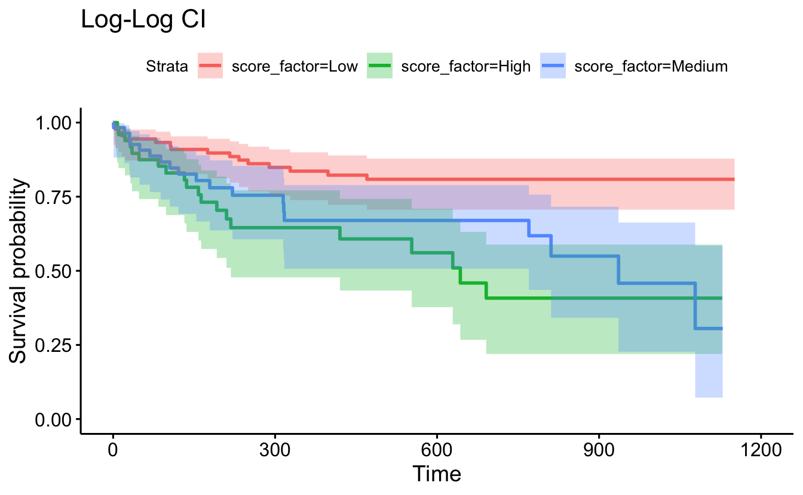

### Log-rank test [rho=0] and the Wilcoxon test [rho=1]

General recidivism


```r
survdiff(Surv(timefollow,event) ~ score_factor, data=recidKM2, rho=0)
#> Call:
#> survdiff(formula = Surv(timefollow, event) ~ score_factor, data = recidKM2, 
#>     rho = 0)
#> 
#>                      N Observed Expected (O-E)^2/E (O-E)^2/V
#> score_factor=Low    91       16     29.3      6.04     13.13
#> score_factor=High   52       20     11.6      6.11      7.80
#> score_factor=Medium 57       19     14.1      1.70      2.29
#> 
#>  Chisq= 14.1  on 2 degrees of freedom, p= 9e-04
survdiff(Surv(timefollow,event) ~ score_factor, data=recidKM2, rho=1)
#> Call:
#> survdiff(formula = Surv(timefollow, event) ~ score_factor, data = recidKM2, 
#>     rho = 1)
#> 
#>                      N Observed Expected (O-E)^2/E (O-E)^2/V
#> score_factor=Low    91     13.8    24.54      4.68     11.69
#> score_factor=High   52     17.0     9.99      4.88      7.21
#> score_factor=Medium 57     15.8    12.04      1.16      1.82
#> 
#>  Chisq= 12.6  on 2 degrees of freedom, p= 0.002

ggsurvplot(survfit(Surv(timefollow,event) ~ score_factor, data=recidKM2), 
           censor=F, conf.int=F, pval=TRUE) + ggtitle("No CI")
```


Violent recidivism


```r
set.seed(4747)
recidKMV2 <- recidKMV %>%
  sample_n(500)

recidKMV2 %>% filter(race == "Caucasian") %>%
  survdiff(Surv(timefollow,event) ~ score_factor, data=., rho=0)
#> Call:
#> survdiff(formula = Surv(timefollow, event) ~ score_factor, data = ., 
#>     rho = 0)
#> 
#>                       N Observed Expected (O-E)^2/E (O-E)^2/V
#> score_factor=Low    112        6    6.087   0.00126   0.00392
#> score_factor=High    25        2    0.966   1.10625   1.24725
#> score_factor=Medium  46        1    1.946   0.46016   0.58870
#> 
#>  Chisq= 1.6  on 2 degrees of freedom, p= 0.5

recidKMV2 %>% filter(race == "African-American") %>%
  survdiff(Surv(timefollow,event) ~ score_factor, data=., rho=0)
#> Call:
#> survdiff(formula = Surv(timefollow, event) ~ score_factor, data = ., 
#>     rho = 0)
#> 
#>                       N Observed Expected (O-E)^2/E (O-E)^2/V
#> score_factor=Low     94        3     4.11     0.301     0.488
#> score_factor=High   131        6     3.77     1.322     2.037
#> score_factor=Medium  92        2     3.12     0.401     0.560
#> 
#>  Chisq= 2  on 2 degrees of freedom, p= 0.4

survdiff(Surv(timefollow,event) ~ score_factor, data=recidKMV2, rho=1)
#> Call:
#> survdiff(formula = Surv(timefollow, event) ~ score_factor, data = recidKMV2, 
#>     rho = 1)
#> 
#>                       N Observed Expected (O-E)^2/E (O-E)^2/V
#> score_factor=Low    206     8.77     9.63    0.0771     0.158
#> score_factor=High   156     7.78     4.87    1.7317     2.389
#> score_factor=Medium 138     2.96     5.00    0.8343     1.151
#> 
#>  Chisq= 2.7  on 2 degrees of freedom, p= 0.3

ggsurvplot(survfit(Surv(timefollow,event) ~ score_factor, data=recidKMV2), 
           censor=F, conf.int=T, pval=TRUE) + ggtitle("Violent Recidivism")

ggsurvplot(survfit(Surv(timefollow,event) ~ score_factor, data=recidKMV2), 
                 data=recidKMV, censor = FALSE, conf.int = TRUE, facet.by = "race") + 
  ggtitle("Violent Recidivism")

as.data.frame(recidKMV2) %>%  # must be a data.frame see "." below:
ggsurvplot(survfit(Surv(timefollow,event) ~ score_factor, data= .), 
                 data = ., censor = FALSE, conf.int = TRUE, pval=TRUE, facet.by = "race") + 
  ggtitle("Violent Recidivism")
```

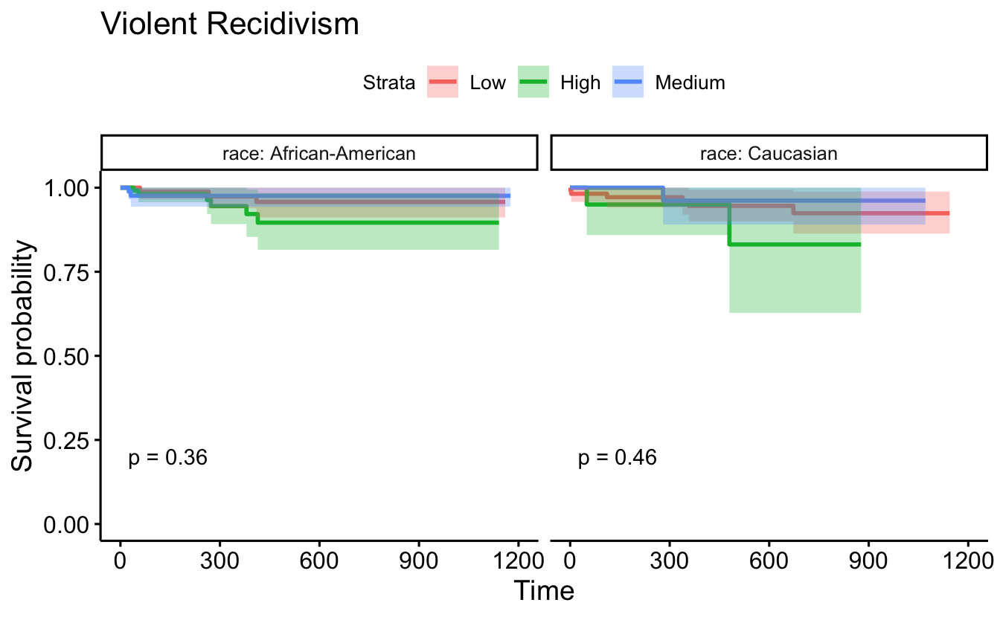

### Cox Proportional Hazards models


```r
# Just score_factor
coxph(Surv(timefollow,event) ~ score_factor, data=recidKM) %>% tidy()
#> # A tibble: 2 x 5
#>   term               estimate std.error statistic   p.value
#>   <chr>                 <dbl>     <dbl>     <dbl>     <dbl>
#> 1 score_factorHigh      1.08     0.0446      24.1 7.67e-129
#> 2 score_factorMedium    0.704    0.0439      16.0 9.78e- 58
coxph(Surv(timefollow,event) ~ score_factor, data=recidKM) %>% glance()
#> # A tibble: 1 x 18
#>       n nevent statistic.log p.value.log statistic.sc p.value.sc statistic.wald
#>   <int>  <dbl>         <dbl>       <dbl>        <dbl>      <dbl>          <dbl>
#> 1 11426   3058          617.   9.39e-135         654.  1.15e-142           609.
#> # … with 11 more variables: p.value.wald <dbl>, statistic.robust <dbl>,
#> #   p.value.robust <dbl>, r.squared <dbl>, r.squared.max <dbl>,
#> #   concordance <dbl>, std.error.concordance <dbl>, logLik <dbl>, AIC <dbl>,
#> #   BIC <dbl>, nobs <int>

# score_factor and race
coxph(Surv(timefollow,event) ~ score_factor + race, data=recidKM) %>% tidy()
#> # A tibble: 3 x 5
#>   term               estimate std.error statistic   p.value
#>   <chr>                 <dbl>     <dbl>     <dbl>     <dbl>
#> 1 score_factorHigh      1.03     0.0460     22.3  3.96e-110
#> 2 score_factorMedium    0.674    0.0445     15.2  7.45e- 52
#> 3 raceCaucasian        -0.170    0.0396     -4.29 1.78e-  5
coxph(Surv(timefollow,event) ~ score_factor + race, data=recidKM) %>% glance()
#> # A tibble: 1 x 18
#>       n nevent statistic.log p.value.log statistic.sc p.value.sc statistic.wald
#>   <int>  <dbl>         <dbl>       <dbl>        <dbl>      <dbl>          <dbl>
#> 1 11426   3058          636.   1.65e-137         671.  3.72e-145           626.
#> # … with 11 more variables: p.value.wald <dbl>, statistic.robust <dbl>,
#> #   p.value.robust <dbl>, r.squared <dbl>, r.squared.max <dbl>,
#> #   concordance <dbl>, std.error.concordance <dbl>, logLik <dbl>, AIC <dbl>,
#> #   BIC <dbl>, nobs <int>

# score_factor, race, age, sex
coxph(Surv(timefollow,event) ~ score_factor + race + age + sex, data=recidKM) %>% tidy()
#> # A tibble: 5 x 5
#>   term               estimate std.error statistic  p.value
#>   <chr>                 <dbl>     <dbl>     <dbl>    <dbl>
#> 1 score_factorHigh     0.926    0.0471      19.6  7.63e-86
#> 2 score_factorMedium   0.611    0.0452      13.5  1.54e-41
#> 3 raceCaucasian       -0.120    0.0398      -3.01 2.63e- 3
#> 4 age                 -0.0137   0.00175     -7.82 5.38e-15
#> 5 sexMale              0.411    0.0502       8.19 2.53e-16
coxph(Surv(timefollow,event) ~ score_factor + race + age + sex, data=recidKM) %>% glance()
#> # A tibble: 1 x 18
#>       n nevent statistic.log p.value.log statistic.sc p.value.sc statistic.wald
#>   <int>  <dbl>         <dbl>       <dbl>        <dbl>      <dbl>          <dbl>
#> 1 11426   3058          768.   8.91e-164         787.  7.45e-168           739.
#> # … with 11 more variables: p.value.wald <dbl>, statistic.robust <dbl>,
#> #   p.value.robust <dbl>, r.squared <dbl>, r.squared.max <dbl>,
#> #   concordance <dbl>, std.error.concordance <dbl>, logLik <dbl>, AIC <dbl>,
#> #   BIC <dbl>, nobs <int>
```

Using the `rms` package, we can plot CIs for each of the relevant HRs for the model at hand:


```r
recid.data <- recidKM %>%
  select(timefollow, event, score_factor, race, age, sex)
recid.final <- rms::cph(Surv(timefollow,event) ~ score_factor + race + age + sex, data=recid.data)
ddist <- rms::datadist(recid.data)
options(datadist = 'ddist')
plot(summary(recid.final), log = TRUE)
```


### Checking proportional hazards with the plot of $\ln(-\ln(S(t)))$


```r
ggsurvplot(survfit(Surv(timefollow,event) ~ score_factor, data=recidKM), 
           censor=F, conf.int=T, fun="cloglog") + ggtitle("Complementary Log-Log")
```

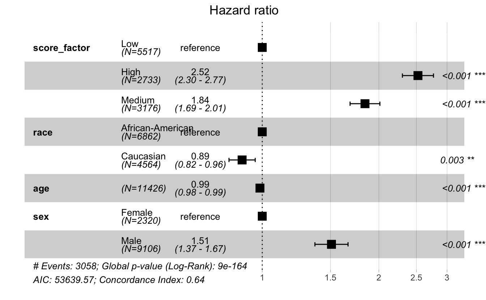

The cox.zph function will test proportionality of all the predictors in the model by creating interactions with time using the transformation of time specified in the transform option. In this example we are testing proportionality by looking at the interactions with log(time). The column rho is the Pearson product-moment correlation between the scaled Schoenfeld residuals and log(time) for each covariate. The last row contains the global test for all the interactions tested at once. A p-value less than 0.05 indicates a violation of the proportionality assumption.

### Checking proportional hazards with cox.zph


```r
cox.zph(coxph(Surv(timefollow,event) ~ score_factor, data=recidKM))
#>              chisq df   p
#> score_factor 0.457  2 0.8
#> GLOBAL       0.457  2 0.8
cox.zph(coxph(Surv(timefollow,event) ~ score_factor, data=recidKM), transform="log")
#>              chisq df    p
#> score_factor  3.04  2 0.22
#> GLOBAL        3.04  2 0.22
cox.zph(coxph(Surv(timefollow,event) ~ score_factor + race + age + sex, data=recidKM))
#>                chisq df      p
#> score_factor  0.5254  2 0.7690
#> race          7.6193  1 0.0058
#> age           6.7511  1 0.0094
#> sex           0.0387  1 0.8440
#> GLOBAL       13.6196  5 0.0182
```

Note the big p-values. We do not reject the null hypothesis, so we conclude that there is no evidence of non-proportional hazards. If for example, the model seemed to be non-proportional on time but proportional on log(time), you might consider transforming the time variable (i.e., taking the natural log) in your original model.

The function cox.zph creates a cox.zph object that contains a list of the scaled Schoenfeld residuals. The ordering of the residuals in the list is the same order as the predictors were entered in the cox model. So, the first element of the list corresponds to the scaled Schoenfeld residuals for married, the second element corresponds to the scaled Schoenfeld residuals for person, and so forth. The cox.zph object can be used in a plot function. By specifying a particular element of the list it is possible to generate plots of residuals for individual predictors. Leaving out the list number results in plots for all the predictors being generated at one time. In the plots a non-zero slope is evidence against proportionality. The horizontal line at y=0 has been added for reference.


```r
ggcoxzph(cox.zph(coxph(Surv(timefollow,event) ~ score_factor + race + age + sex, data=recidKM))) 
```

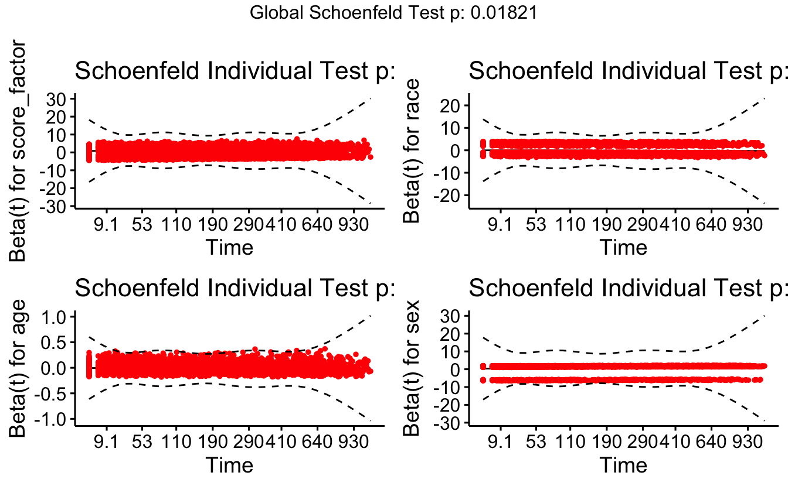

### Coxph diagnostics ... look into all the different arguments of the function!


```r
ggcoxdiagnostics(coxph(Surv(timefollow,event) ~ score_factor + race + age + sex, data=recidKM))
```


<!--chapter:end:06-surv.Rmd-->

# Multiple Comparisons

* What is a p-value?

> The **p-value** is the probability of collecting the observed data (or data showing as great or greater difference from the null hypothesis) if the null hypothesis is true.  *The p-value is a number calculated from the dataset.*

* George Cobb (2014) put the p-value into perspective:

>Q:  Why do so many colleges and grad schools teach p = .05?  
>A:  Because that's still what the scientific community and journal editors use.

>Q:  Why do so many people still use p = 0.05?  
>A:  Because that's what they were taught in college or grad school.

* In 2014, the journal *Basic and Applied Social Psychology* banned the use of all null hypothesis significance testing procedures (NHSTP).  What are the [implications for authors](https://www.tandfonline.com/doi/full/10.1080/01973533.2015.1012991)?   

> Question 3. Are any inferential statistical procedures required?   
> Answer to Question 3. No, because the state of the art remains uncertain. However, BASP will require strong descriptive statistics, including effect sizes. We also encourage the presentation of frequency or distributional data when this is feasible. Finally, we encourage the use of larger sample sizes than is typical in much psychology research, because as the sample size increases, descriptive statistics become increasingly stable and sampling error is less of a problem. However, we will stop short of requiring particular sample sizes, because it is possible to imagine circumstances where more typical sample sizes might be justifiable.

* The American Statistical Association put out a [statement on p-values](https://amstat.tandfonline.com/doi/pdf/10.1080/00031305.2016.1154108)  

1. P-values can indicate how incompatible the data are with a specified statistical model.  
2. P-values do not measure the probability that the studied hypothesis is true, or the probability that the data were produced by random chance alone.  
3. Scientific conclusions and business or policy decisions should not be based only on whether a p- value passes a specific threshold.  
4. Proper inference requires full reporting and transparency.  
5. A p-value, or statistical significance, does not measure the size of an effect or the importance of a result.  
6. By itself, a p-value does not provide a good measure of evidence regarding a model or hypothesis.  

* Other interested parties weigh in:  
  - [Statisticians issue warning over misuse of P values](http://www.nature.com/news/statisticians-issue-warning-over-misuse-of-p-values-1.19503)  (Nature, March 7, 2016)
  - [The value of p](https://richarddmorey.medium.com/the-value-of-p-212bcfb1ed66) (Richard Morey, blog entry, Jan 3, 2021)


##  Why Most Published Research Findings are False	{#Ioannidis}


The Ioannidis article [@Ioannidis], and our related discussion, focuses on multiple testing.  We'd like to understand the effect of testing in three different contexts:


1. When looking for as many possible significant findings as possible (publish or perish)
2. When bias exists in our work
3. When (many) researchers study the same effect

#### Definitions
* **R**
\begin{eqnarray*}
R = \frac{ \mbox{# true relationships}}{\mbox{# null relationships}} \ \ \ \mbox{ in the population}
\end{eqnarray*}
* **TRUE**
\begin{eqnarray*}
P(\mbox{study is true}) &=& \frac{ \mbox{# true relationships}}{\mbox{# total}}\\
&=& \frac{ \mbox{# true relationships}}{\mbox{# true + # null}}\\
&=& \frac{ \mbox{R(# null relationships)}}{\mbox{R (# null) + # null}}\\
&=& \frac{R}{R+1}
\end{eqnarray*}
* **size**
\begin{eqnarray*}
\alpha &=& P(\mbox{type I error})\\
&=& P(\mbox{reject } H_0 | H_0 \mbox{ true})\\
\end{eqnarray*}
* **power**
\begin{eqnarray*}
1 - \beta &=& P(\mbox{reject } H_0 | H_0 \mbox{ false})\\
\beta &=& P(\mbox{type II error})\\
&=& P(\mbox{not reject } H_0 | H_0 \mbox{ false})\\
\end{eqnarray*}
* **tests**
\begin{eqnarray*}
c &=& \mbox{# of tests run}
\end{eqnarray*}


Baseball power simulation applet [@iscam]  http://www.rossmanchance.com/applets/power.html


### Positive Predictive Value (PPV)

We'll focus here on the Positive Predictive Value (PPV).  That is, what is the probability that the positive result you found is actually true?

| Research Finding 	| Yes 	| No 	| Total 	|
|------------------	|-----------------------	|---------------------	|-------------------------------	|
| Yes 	| $c(1-\beta)R / (R+1)$ 	| $c \alpha / (R+1)$ 	| $c(R+\alpha - \beta R)/(R+1)$ 	|
| No 	| $c \beta R / (R+1)$ 	| $c(1-\alpha)/(R+1)$ 	| $c(1-\alpha + \beta R)/(R+1)$ 	|
| Total 	| $cR/(R+1)$ 	| $c/(R+1)$ 	| $c$ 	|


\begin{eqnarray*}
PPV &=& \frac{c(1-\beta)R / (R+1)}{c(1-\beta)R / (R+1) + c \alpha / (R+1)}\\
&=& \frac{c(1-\beta)R}{c(1-\beta)R + c \alpha}\\
&=& \frac{(1-\beta)R}{(1-\beta)R +  \alpha}\\
&=& \frac{1}{1 + \alpha / (1-\beta) R}\\
&& \\
PPV &>& 0.5 \mbox{ more likely true}\\
\mbox{iff   } (1-\beta)R &>& (R-\beta R + \alpha) 0.5\\
(1-\beta) R 0.5 &>& \alpha 0.5\\
(1-\beta) R &>& \alpha \\
&& \\
PPV &<& 0.5  \mbox{ more likely false}\\
\mbox{iff   } (1-\beta) R &<& \alpha \\
\end{eqnarray*}

### Bias

* **bias**
\begin{eqnarray*}
u &=& \mbox{proportion of results that would not have been research findings but ended up}\\
 && \mbox{reported as such because of bias}
\end{eqnarray*}

Note: bias simply moves $u$\% of the findings from the `No` row to the `Yes` row.

| Research Finding 	| Yes 	| No 	| Total 	|
|------------------	|-------------------------------------	|--------------------------------------	|-------------------------------------------------------	|
| Yes 	| $[c(1-\beta)R +uc \beta R] / (R+1)$ 	| $[c \alpha + u c(1-\alpha)] / (R+1)$ 	| $c[R+\alpha - \beta R + u(1-\alpha + \beta R)]/(R+1)$ 	|
| No 	| $(1-u)c \beta R / (R+1)$ 	| $(1-u)c(1-\alpha)/(R+1)$ 	| $c(1-u)(1-\alpha + \beta R)/(R+1)$ 	|
| Total 	| $cR/(R+1)$ 	| $c/(R+1)$ 	| $c$ 	|


\begin{eqnarray*}
PPV &=& \frac{[c(1-\beta)R +uc \beta R] / (R+1)}{c[R+\alpha - \beta R + u(1-\alpha + \beta R)]/(R+1)}\\
 &=& \frac{[(1-\beta)R +u \beta R]}{[R+\alpha - \beta R + u(1-\alpha + \beta R)]}\\
&=& \frac{1}{1 + \frac{\alpha + u(1-\alpha)}{(1-\beta)R + u\beta R}}
\end{eqnarray*}

Note that $PPV \uparrow$ as $u \uparrow$ as long as $(1-\beta) \leq \alpha$.  Or really, it is probably easier to think about if $(1-\beta) > \alpha$, then $PPV \uparrow$ as $u \downarrow$.  The second sentence is more realistic, e.g., $\beta < .95$ means that we have more true results in our list of significant findings as the bias goes down.  [To understand the direction of the relationships, find $\partial PPV / \partial u < 0$ if $(1-\beta) > \alpha$  (decreasing with u).]


### Multiple Studies

* $\alpha$
    * If a study is null, the probability of seeing null is $(1-\alpha)$
    * If 3 of us test the same thing, the probability that we will all see null is $(1-\alpha)^3$
    * *and* the probability that at least one of use will see significance goes from $\alpha$ to $1 - (1-\alpha)^3$
    * As $n \uparrow$ someone will definitely see significance (bad!)

* $\beta$
    * If a study is significant, the probability of seeing null is $\beta$
    * If 3 of us test the same thing, the probability that we'll all see null is $\beta^3$
    * *and* the probability that at least one of us will see significance goes from $(1-\beta)$ to $(1-\beta^3)$
    * As $n \uparrow$, someone will definitely see significance (good!)


| Research Finding 	| Yes 	| No 	| Total 	|
|------------------	|-------------------------	|------------------------------	|-----------------------------------------	|
| Yes 	| $c(1-\beta^n)R / (R+1)$ 	| $c(1-[1- \alpha]^n) / (R+1)$ 	| $c(R+1-[1-\alpha]^n - \beta^n R)/(R+1)$ 	|
| No 	| $c \beta^n R / (R+1)$ 	| $c(1-\alpha)^n/(R+1)$ 	| $c([1-\alpha]^n + \beta^n R)/(R+1)$ 	|
| Total 	| $cR/(R+1)$ 	| $c/(R+1)$ 	| $c$ 	|


\begin{eqnarray*}
PPV &=& \frac{(1-\beta^n)R}{(R+1-[1-\alpha]^n - \beta^n R)}
\end{eqnarray*}


$PPV \downarrow$ as $n \uparrow$ unless $(1-\beta) < \alpha$  that is, $\beta > 0.95$ !!


### Corollaries

* **Corollary 1**   The smaller the studies conducted in a scientific field, the less likely the research findings are to be true.  (low power)  
* **Corollary 2**   The smaller the effect sizes in a scientific field, the less likely the research findings are to be true.  (also low power)  
* **Corollary 3**  The greater the number and the lesser the selection of tested relationships in a scientific field, the less likely the research findings are to be true. (pre-study odds: R; phase III trials have better odds than microarray studies)  
* **Corollary 4**  The greater the flexibility in designs, definitions, outcomes, and analytical modes in a scientific field, the less likely the research findings are to be true.  (increased bias)  
* **Corollary 5**  The greater the financial and other interests and prejudices in a scientific field, the less likely the research findings are to be true. (increased bias)
* **Corollary 6**  The hotter a scientific field (with more scientific teams involved), the less likely the research findings are to be true. (increased $n$)


## Multiple Comparisons {#multcomp}

As you might expect, if you have 10 groups, **all of which come from the same population**, you might wrongly conclude that some of the means are *significantly* different.  If you try pairwise comparisons on all 10 groups, you'll have ${10 \choose 2} = 45$ comparisons.  Out of the 45 CI, you'd expect 2.25 of them to not contain the true difference (of zero); equivalently, you'd expect 2.25 tests to reject the true $H_0$.  In an overall test of comparing all 10 groups simultaneously, you can't use size as a performance measure anymore.

* **FWER** = $P(V\geq1)$

The Familywise Error Rate (FWER) is the probability of making one or more type I errors in a series of multiple tests.  In the example above (with 10 comparisons), you would almost always make at least one type I error if you used a size of $\alpha = 0.05$.  So, your FWER would be close to 1.  Methods exist for controlling the FWER instead of the size ($\alpha$).


### Bonferroni

The Bonferroni method of adjusting for multiple comparisons is used to control the FWER.

Assume all  our tests are null
\begin{eqnarray*}
A_1 &=& \mbox{event reject test 1}\\
P(A_1) &=& \alpha^*\\
A_2 &=& \mbox{event reject test 2}\\
P(A_2) &=& \alpha^*\\
\end{eqnarray*}

We want to bound the probability that all our tests don't commit a type 1 error (that is, none of them reject).
\begin{eqnarray*}
P( A_1 \mbox{ or } A_2) &=& P(A_1) + P(A_2) - P(A_1 \mbox{ and } A_2)\\
&=& \alpha^* + \alpha^* - ???\\
& \leq& 2 \alpha^* \\
FWER = P(\mbox{at least one rejects}) &\leq& 2 \alpha^*\\
\mbox{let} && P(A_1) = P(A_2) = \alpha^* = \frac{\alpha}{2}\\
FWER &\leq& \alpha
\end{eqnarray*}

That is, with $m$ tests, rejecting any test whose p-value is less than or equal to $\alpha/m$ will control the FWER at $\alpha$.  Alternatively, rejecting adjusted p-values less than $\alpha$ will also control the FWER at $\alpha$.  Where the adjusted p-values are defined as:

\begin{eqnarray*}
\tilde{p}_j = \min(m p_j, 1)
\end{eqnarray*}
Reject any hypothesis such that $\tilde{p}_j \leq \alpha$.


* Note that interpretations depend heavily on the number of tests (which is true about most multiple comparison adjustments).  
* Bonferroni is extremely conservative, and therefore it has very high type II error rates (low power).  
* We aren't really interested in the situation where "all true null tests don't get rejected."  

### Holm

Holm is a less conservative (than Bonferroni) method for controlling the FWER.  Because each p-value is considered sequentially, the Holm adjustment is referred to as "step-up".  The intuition is that on the first step, the bound assumes up to $m$ null hypotheses.  But on the second step, there are only $m-1$ null hypotheses (assuming the first p-value is rejected).  

To control the FWER at $\alpha$, first order the p-values as $p_1 \leq p_2 \leq \cdots \leq p_m$ and define the adjusted p-values to be:

\begin{eqnarray*}
\tilde{p}_j = \max_{i \leq j} [ \min((m-i+1) p_i, 1) ]
\end{eqnarray*}
Reject any hypothesis such that $\tilde{p}_j \leq \alpha$.

* **FDR**  = $E[V/R]$

The FDR (false discovery rate) is the expected proportion of false discoveries out of all the discoveries.

* **PPV** = $E[S/R]$

Consider $m$ hypotheses:

|  	|  	| Null True 	| Alt True 	|  	|
|----------	|-----------------	|:---------:	|:--------:	|:-----:	|
| Research 	| not significant 	| $U$ 	| $T$ 	| $m-R$ 	|
| Finding 	| significant 	| $V$ 	| $S$ 	| $R$ 	|
|  	|  	| $m_0$ 	| $m-m_0$ 	| $m$ 	|


### Benjamini-Hochberg

When running experiments that have many many tests of significance, it is often more desirable to worry about the *number* of false discoveries as opposed to the probability of getting *one* false discovery.  That is, we are typically comfortable with a few false positives (i.e., a very HIGH FWER) as long as the rate of false positives is low.


Define the estimated false discovery proportion at a cutoff t ($\hat{FDR}(t)$) to be the number of false discoveries at a given cutoff.  Again, to control the FDR at $\alpha$, first order the p-values as $p_1 \leq p_2 \leq \cdots \leq p_m$.

\begin{eqnarray*}
\hat{FDR}(t)&=& \frac{\# \{ p_j \leq t \mbox{ out of the null tests } \}}{ \# \{p_j \leq t\} + (1 \mbox{ if all } p_j > t)}
\end{eqnarray*}
Notice that p-values from null hypotheses will be distributed uniformly from zero to one.  That means that a good estimate of the numerator is $t\cdot$ \# of null tests.
\begin{eqnarray*}
\hat{FDR}(p_j) &=& \frac{p_j \cdot m \cdot \pi_0}{j} < \frac{p_j m}{j}
\end{eqnarray*}
where $\pi_0$ is the proportion of tests which are truly null ($m_0/m$).  Consider the adjusted p-values,

\begin{eqnarray*}
\tilde{p}_j = \min [ (m/j) p_j, \tilde{p}_{j+1} ]
\end{eqnarray*}
Reject any hypothesis such that $\tilde{p}_j \leq \delta$ to control the FDR at $\delta$.


Intuition:  let $m=1000$, and suppose the $\tilde{p}_{250} < 0.4$.  Show that FDR $< 0.4$.

$\tilde{p}_{250} < 0.4$ implies two different things:

1. $p_{250} \leq \frac{0.4\cdot 250}{1000} = 0.1$
2. and $\approx 750$ null tests have p-values between 0.1 and 1.

If 750 null tests have p-values between 0.1 and 1, then $m_0 \cdot 0.9 = 750 \rightarrow m_0 = 833.33$.  Therefore, the number of null hypotheses which were rejected is 833.33 - 750 = 83.33.

\begin{eqnarray*}
FDR = \frac{83.33}{250} = 0.33 < 0.4
\end{eqnarray*}

More generally if $\tilde{p}_k = \frac{p_k \cdot m}{k} \leq \delta$:
\begin{eqnarray*}
p_k &<& \frac{k}{m} \delta\\
\# \mbox{ null not rejected} &=& \mbox{length of null interval }\bigg[\frac{k}{m}\delta,1\bigg] \cdot \mbox{ total } \# \mbox{ of null}\\
(m-k) &=& \bigg(1-\frac{k}{m} \delta\bigg) m_0\\
m_0 &=& \frac{(m-k) m}{(m-k \delta)}\\
& &\\
FDR &=& \frac{\# \mbox{ null rejected}}{\# \mbox{ rejected}}\\
&=& \frac{\frac{m(m-k)}{(m-k\delta)} - (m-k)}{k}\\
&=& \frac{m^2 - mk - (m-k) (m-k \delta)}{(m-k \delta)k}\\
&=& \frac{k(m \delta - k \delta)}{k(m-k \delta)} = \delta\bigg(\frac{m-k}{m/\delta - k}\bigg)\\
FDR &<& \delta
\end{eqnarray*}
because $m/\delta > m$ so $\frac{m-k}{m/\delta -k} < 1$.


Consider a one sample t-test.  The population is normal centered at 47 with $\sigma=3$; samples of size 20 are taken from the population.  The following hypotheses are tested:
\begin{eqnarray*}
H_0: \mu = 47\\
H_{0_1}: \mu = 40\\
H_{0_2}: \mu = 48\\
H_{0_3}: \mu = 50\\
\end{eqnarray*}
In the null setting, the p-values are uniformly distributed from 0 to 1.  When the data are not consistent with the null, there are more p-values close to zero (and even closer to zero as the data become more and more distinct from the null).

#### Distribution of p-values under different amounts of divergence from the null hypothesis.


The previous example considered the situation where all the p-values came from the distribution.  In reality, p-values will come from many different distributions.  For simplification, consider the situation where g100% of the tests come from the null distribution, and (1-g)100% of the tests come from a distribution where the p-values are much closer to one and skewed right.

#### Distribution of p-values under differing proportions of null versus significant tests.

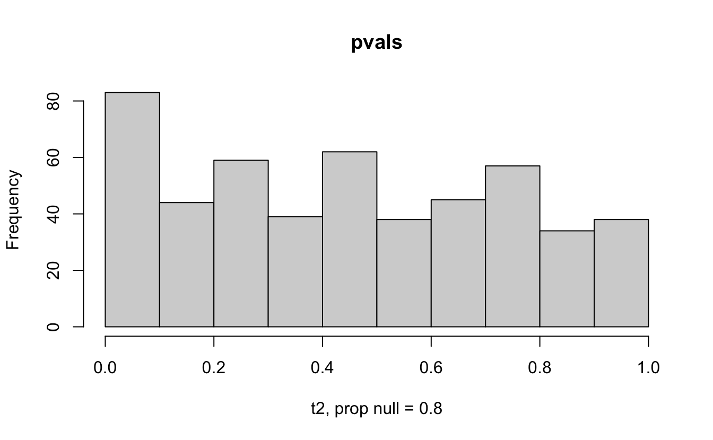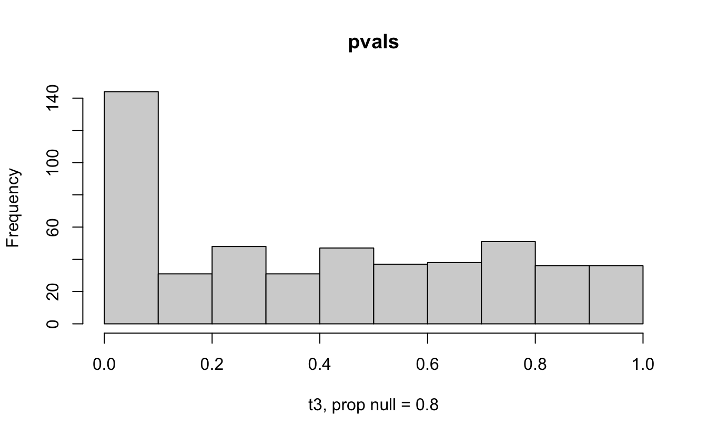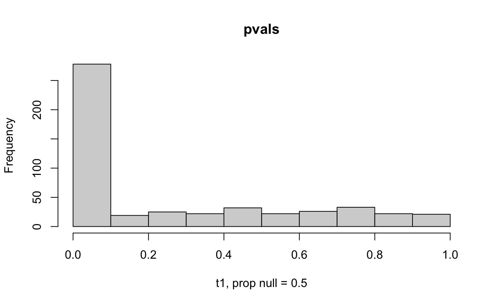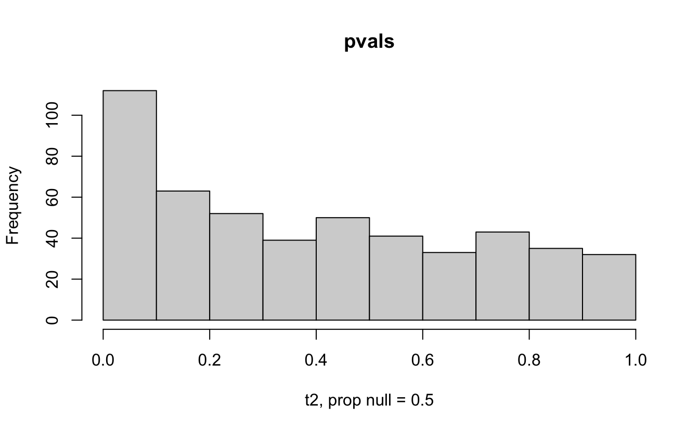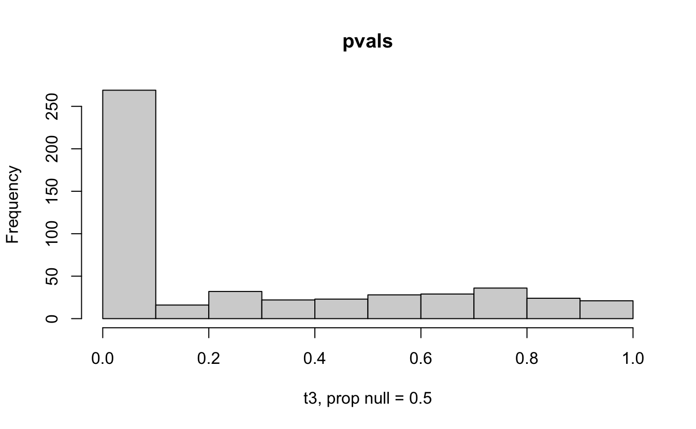


## Storey & q-values {#qvals}

The previous methods allowed the larger family of tests to control either the FWER or the FDR (global measures of accuracy).  However, for a given test, there was no measure to quantify FDR for a given test.


* **p-value**  Recall that the p-value is the smallest level of significance (P(type I error)) possible to reject $H_0$.
* **q-value**  Akin to the p-value, the q-value is the minimum FDR at that score which can be attained when calling the test significant.


Storey defines the q-value to be the FDR associated with a given test of significance. For example, say a q-value = 0.013 for test X.  Then at most 1.3% of tests with p-values at least as small as test X are false positives.  In particular, let
\begin{eqnarray*}
\hat{\pi}_0 = \frac{\# \{ p_j > \lambda \} }{m(1-\lambda)} \ \ \  \mbox{ for some } \lambda
\end{eqnarray*}
(though there are many ways to estimate $\pi_0$.)

In a step-down algorithm, the q-value is defined using the p-value at hand and the next {\em largest} p-value.  Additionally, the $\pi_0$ is implemented as seen in the original intuition behind FDR control.

* **step 1** let
\begin{eqnarray*}
\hat{q}(p_{m}) = \hat{\pi}_0 p_{m}
\end{eqnarray*}
Note that $\hat{q}(p_{m})$ is the biggest q-value and $ p_{m}$ is the biggest p-value.
* **step 2**
\begin{eqnarray*}
\hat{q}(p_{m-1}) = \min( \hat{\pi}_0 p_{m-1} \frac{m}{m-1}, \hat{q}( p_{m}))
\end{eqnarray*}
If $\hat{q}(p_{m}) = 0.7$ and $\hat{\pi}_0 p_{m-1} \frac{m}{m-1} = 0.8$, then the next smallest q-value would be 0.7 because the FDR can be as low as 0.7 (see the definition of FDR).
* **step 3**  more generally,
\begin{eqnarray*}
\hat{q}(p_{j}) = \min( \hat{\pi}_0 p_{j} \frac{m}{j}, \hat{q}( p_{j+1}))
\end{eqnarray*}


Can a q-value be less than a p-value?  Sure!  If the number of null hypotheses is small and the test is powerful.  For example, consider testing 1000 hypotheses with 20% null tests ($\pi_0=0.2$).  Assume 500 of the p-values are less than 0.05 (very powerful!).  With 200 null we would expect 10 to be less than 0.05.  So, the FDR is 10/500 = 0.02 (which is smaller than the p-value of 0.05 at the cutoff for the $500^{th}$ test).

#### How are FWER and FDR related?

First note that for both FDR and FWER, the procedure is to *control* the errors not to compute or estimate the errors (except in the case of the q-value).

Recall that $FDR = E[V/R]$ and is defined to equal zero if R=0

\begin{eqnarray*}
FDR &=& E\bigg[\frac{V}{R} \bigg]\\
&=& E\bigg[\frac{V}{R} | R > 0 \bigg] P(R >0) + E\bigg[\frac{V}{R} | R=0 \bigg] P(R=0)\\
&=& E\bigg[\frac{V}{R} | R > 0 \bigg] P(R >0)
\end{eqnarray*}


* **case 1**  In the first case, consider $V=R$ such that all significant hypotheses are null.
\begin{eqnarray*}
FDR &=& E\bigg[\frac{V}{R} | R > 0 \bigg] P(R >0)\\
&=& 1 P(R>0) = 1 P(V \geq 1)\\
&=& FWER
\end{eqnarray*}
* **case 2**  In the second case, consider $V < R$ such that some of the significant hypotheses are null and some are not.  ($V/R < 1$)
\begin{eqnarray*}
FDR &=& E\bigg[\frac{V}{R} | R > 0 \bigg] P(R >0)\\
&=& E\bigg[\frac{V}{R} | R > 0, V\geq 1 \bigg] P(R >0, V \geq 1) + E\bigg[\frac{V}{R} | R > 0, V=0 \bigg] P(R >0, V =0)\\ 
&& \mbox{ (note: } V/R \equiv 0 \mbox{ if } V = 0)\\
&=& E\bigg[\frac{V}{R} | R > 0, V\geq 1 \bigg] P(R >0, V \geq 1) \\
&<& P(V \geq 1) = FWER \ \ \mbox{ because } V/R < 1
\end{eqnarray*}


The proof above shows that FWER controls the FDR when not all significant tests are null.  When all significant tests are null, FWER=FDR.


## Interim Analyses

An important application of multiple comparisons issues comes when deciding whether or not to stop a clinical trial early due to either positive or negative results.  Looking too often will create many false positives which can be quite problematic. [@subgroup]

Consider the following case studies:  

* HIV -- Indinavir was stopped early due to positive results [@hiv]
* HVTN 505 was stopped early due to negative results [@hvtn]
* Truvada & Tenofovir were also stopped early [@hrt]

What happens when the research performs $k$ interim analyses and the research scenario is truly null?
\begin{eqnarray*}
P( test1 < \alpha \mbox{ or } test2 < \alpha \mbox{ or } \ldots \mbox{ or }  testk < \alpha ) > \alpha
\end{eqnarray*}

The researcher has two options:

1. Let $\alpha^* < < < \alpha$
2. Change $\alpha$ at each step along the way so that the total probability of a type I error is $\alpha$


### Pocock
Advantages:

* simple
* aggressive with respect to stopping early.  that is, there is a small expected sample size  (when the effect size is large)


Disadvantage:

* low power and therefore large maximum sample size (when the effect size is small)

### O'Brien-Flemming

Advantages:

* final $\alpha$ is close to desired $\alpha$
* more power than Pocock, so smaller max sample size

Disadvantage:

* less likely to stop early, so larger expected sample size


### Some parting thoughts
* If $H_a$ is true, the effect size is likely overestimated (true in general, not just for interim analyses).
* Symmetry:  which is more important, harm or good?
* Can split alpha into two halves and apply one method (e.g., Pocock) to stopping early for positive reasons and apply another method (e.g., O'Brien-Flemming) to stopping early for negative reasons.


####  Advice 1
The following quote is general advice from statistical researchers doing clinical oncology. [@crowley]


> Even the specifics of the most basic task of the data monitoring committee, evaluation of interim results for evidence of benefit or harm, are not necessarily obvious.  Questions (and our personal answers) include:

> * How often should the data monitoring committee review interim data?  (The answer to this should depend on how fast additional information becomes available on a trial.  we generally recommend monitoring advanced disease studies, or any other study with rapidly accumulating events, every 6 months.  Yearly monitoring may be sufficient for adjuvant or slowly accruing studies.)

> * Should the primary outcome data be reviewed each time or should they be reviewed only at times of planned interim analyses?  (All data, including primary outcome data, should be reviewed at each time, since the unexpected does occur.)

> * Should treatment arms be blinded to the data monitoring committee or not?  (Definitely not.  If A looks better than B, the decision to continue could well be different if A is the control arm instead of the experimental arm.)

> * Should a data monitoring committee decision that evidence is sufficient to close a trail be final, or should it be advisory only?  (We would say advisory, but rarely overturned.)

> * If advisory, advisory to whom - the funding agency? an executive group? the investigators?  (Reports should go to the individuals with ultimate responsibility for the integrity of the trial.)

> * Should a data monitoring committee be able to make major design changes to a trial?  (No, the data monitoring committee may offer suggestions but design is the responsibility of the principal investigators.  On the other hand, major design changes initiated by the principal investigators should be approved by the committee.)

> * Are data monitoring committee duties over when study accrual is complete, or should the data monitoring committee also decide when results are to be reported?  (It should also decide when results are to be reported - additional follow-up generates additional data that still need to be monitored.)

> * How much weight should be accorded to outside information versus current information on the study being monitored?  (Definitive outside information cannot be ignored - but this begs the question of what is definitive.  A single trial of moderate size probably is not definitive; two large trials probably are; a meta-analysis probably is not.)

> * How much should results of secondary endpoints influence the decision to continue or not?  (Not much unless toxic death is considered secondary.)

> * How scary do results have to be to stop at a time other than a planned interim analysis?  (Very scary, or the purpose of interim analyses is defeated.)

> * When do accrual problems justify early closure?  (When results won't be available until after they are no longer of interest.)

> * Should confidential information ever be provided to other data monitoring committees or planning groups?  (Sometimes.  If study conduct will not be compromised by limited release of information, it might be reasonable to let investigators planning new trials know of potential problems or benefits to treatment arms they are considering.  Risk to the ongoing trial includes leaked information or intelligent guesses as to the current status; risk to the new trial includes choosing an inappropriate arm based on early results that don't hold up.)

> Every monitoring committee functions differently because no two people have the same ethical, scientific, or practical perspectives.  This means different committees might well come up with different answers to the same monitoring issues.  To ensure some balance of opinions, it is best to have a variety of knowledgeable people as members of the committee.


####  Advice 2

Duncan Temple-Lang is a leader in the area of combining computer science research concepts within the context of statistics and science more generally.  Recently, he was invited to participate in a workshop, *Training Students to Extract Value from Big Data*.  The workshop was subsequently summarized in a manuscript of the same name and has been provided free of charge.  http://www.nap.edu/catalog.php?record_id=18981 


**Principles for the Data Science Process**, Duncan Temple Lang, University of California, Davis [@duncanTL]


Duncan Temple Lang began by listing the core concepts of data science - items that will need to be taught: statistics and machine learning, computing and technologies, and domain knowledge of each problem. He stressed the importance of interpretation and reasoning - not only methods - in addressing data. Students who work in data science will have to have a broad set of skills - including knowledge of randomness and uncertainty, statistical methods, programming, and technology - and practical experience in them. Students tend to have had few computing and statistics classes on entering graduate school in a domain science.

Temple Lang then described the data analysis pipeline, outlining the steps in one example of a
data analysis and exploration process:


1. Asking a general question.

2. Refining the question, identifying data, and understanding data and metadata. Temple Lang
noted that the data used are usually not collected for the specific question at hand, so the original experiment and data set should be understood.

3. Access to data. This is unrelated to the science but does require computational skill.

4. Transforming to data structures.

5. Exploratory data analyses to understand the data and determine whether the results will scale.
This is a critical step; Temple Lang noted that 80 percent of a data scientist's time can be spent in cleaning and preparing the data.

6. Dimension reduction. Temple Lang stressed that it can be difficult or impossible to automate
this step.

7. Modeling and estimation. Temple Lang noted that computer and machine learning scientists
tend to focus more on predictive models than on modeling of physical behavior or characteristics.

8. Diagnostics. This helps to understand how well the model fits the data and identifies
anomalies and aspects for further study. This step has similarities to exploratory data analysis.

9. Quantifying uncertainty. Temple Lang indicated that quantifying uncertainty with statistical
techniques is important for understanding and interpreting models and results.

10. Conveying results.

Temple Lang stressed that the data analysis process is highly interactive and iterative and requires the presence of a human in the loop. The next step in data processing is often not clear until the results of the current step are clear, and often something unexpected is uncovered. He also emphasized the importance of abstract skills and concepts and said that people need to be exposed to authentic data analyses, not only to the methods used. Data scientists also need to have a statistical understanding, and Temple Lang described the statistical concepts that should be taught to a student:


* Mapping the general question to a statistical framework.
* Understanding the scope of inference, sampling, biases, and limitations.
* Exploratory data analyses, including missing values, data quality, cleaning, matching, and
fusing.
* Understanding randomness, variability, and uncertainty. Temple Lang noted that many
students do not understand sampling variability.
* Conditional dependence and heterogeneity.
* Dimension reduction, variable selection, and sparsity.
* Spurious relationships and multiple testing.
* Parameter estimation versus "black box" prediction and classification.
* Diagnostics, residuals, and comparing models.
* Quantifying the uncertainty of a model.
* Sampling structure and dependence for data reduction. Temple Lang noted that modeling of
data becomes complicated when variables are not independent, identically distributed.
* Statistical accuracy versus computational complexity and efficiency.

Temple Lang then briefly discussed some of the practical aspects of computing, including the
following:

* Accessing data.
* Manipulating raw data.
* Data structures and storage, including correlated data.
* Visualization at all stages (particularly in exploratory data analyses and conveying the
results).
* Parallel computing, which can be challenging for a new student.
* Translating high-level descriptions to optimal programs.

During the discussion, Temple Lang proposed computing statistics on visualizations to examine
data rigorously in a statistical and automated way. He explained that "scagnostics" (from scatter plot diagnostics) is a data analysis technique for graphically exploring the relationships among variables. A small set of statistical measures can characterize scatter plots, and exploratory data analysis can be conducted on the residuals.

(More information about scagnostics can be found in @scagnostics.)

A workshop participant noted the difference between a data error and a data blunder. A blunder is a large, easily noticeable mistake. The participant gave the example of shipboard observations of cloud cover; blunders, in that case, occur when the location of the ship observation is given to be on land rather than at sea. Another blunder would be a case of a ship's changing location too quickly. The participant speculated that such blunders could be generalized to detect problematic observations, although the tools would need to be scalable to be applied to large data sets.


<!--chapter:end:07-MC.Rmd-->

# Poisson Regression


## Regression Models {#regPois}

Consider the following example from @poole (described in @sleuth) on age and mating success (number of successful matings) in male African Elephants.


```r
elephants <- readr::read_csv("elephants.csv")

ggplot(elephants, aes(x=jitter(AGE), y=MATINGS)) + geom_point()
```


While it does seem like there is an increasing trend in the two variables, there are some concerns with directly applying linear regression.  Indeed, the example above acts as a proxy for many regression examples where the response variable is a count with particular properties:

1. The response variable is a count (in particular, it cannot be negative).

2. The model may or may not be linear in X.

3. The model appears to have increasing variance as a function of X.


For the setting above, it is often preferable to use Poisson regression instead of the normal errors linear regression.  

### The Poisson Regression Model

The Poisson distribution is given by a probability function of the form:

$$P(Y = y) = \frac{e^{-\mu} \mu^y}{y!} \ \ \ \ \ y=0, 1, 2, \ldots$$

Which gives: $E(Y) = \mu$ and $Var(Y) = \mu$.   That is, the Poisson model is characterized by a mean and variance given by the same value.


Recall that with linear regression, $E(Y_i) = \beta_0 + \beta_1 X_i$ which might be a reasonable idea to apply to the count data; however, as seen above, if the mean of the distribution is modeled strictly as a linear function in $X$, then the line has the potential to predict negative counts and the variability will not be a function of $X$ if normal errors regression is used.

An alternative the normal errors regression is to use a $\ln$ transformation to describe the relationship between the predicted value of the response and the explanatory variables of interest:

$$\ln(E(Y_i)) = \ln(\mu_i) = \beta_0 + \beta_1 X_i.$$
where the observed counts come from a Poisson model:  $Y_i \sim Pois(\mu_i)$ and the Poisson parameter is given as a function of the explanatory variable(s).  [Note that Poisson regression contains no error term like linear regression because the Poisson distribution has inherent variability which is determined by the mean which equals the variance.]

####  Technical Conditions

Like every model, there are technical conditions associated with Poisson Regression.  The closer the data (population) conform to the conditions, the more useful the model will be at describing the context at hand.  Remember, 
 > All models are wrong, but some models are useful."  -George Box.  
 
 So, assessing whether the technical conditions are reasonable will help in determining whether the analysis performed under a particular model was a good thing to do.
 
1. Line:  The log of the mean is a linear function of $X$:  $\ln(\mu_i) = \beta_0 + \beta_1 X_i.$
2. Independence: The observations are independent (often characterized by a simple random sample or something approximating a simple random sample).
3. Poisson: The response variable is a count.
4. Error: The mean of the response variables is equal to the variance of the response variable for each combination of explanatory variables in the model.


### Comparison to Linear Regression

One question that might come to mind is whether there is any difference in the Poisson log-linear model and a normal errors regression model with a log transformation on the response???  The short answer is that yes, there is a difference.

* **Poisson Log-Linear:**  $\ln(E(Y_i)) = \beta_0 + \beta_1 X_i, Y_i \sim Pois(e^{\beta_0 + \beta_1 X_i})$

* **Normal w Log Transformation:**  $E(\ln(Y_i)) = \beta_0 + \beta_1 X_i, \ln(Y_i) \sim N(\beta_0 + \beta_1 X_i, \sigma^2)$

There are two main differences with the models.

1. The first is to remember that the average (i.e., expected value) of the logs is not the log of the averages.  So in the Poisson model, the linear function measures the log of the average, and in the normal model, the linear function measures the average of the logs.


```r
set.seed(47)
example <- abs(rcauchy(10))
example
#>  [1]  0.0725  2.3911  0.9302  0.6237  4.2508  1.4575  2.7521 10.2177  7.3042
#> [10]  0.2404

log(mean(example))
#> [1] 1.11
mean(log(example))
#> [1] 0.343
```

2.  The second difference to note across the two regression set-ups is that the variability is modeled differently.  Indeed, the likelihood functions are quite different and will produce different maximum likelihood estimates of the parameter values.


###  Interpreting Poisson Regression Coefficients

As we've done with other generalized linear models (linear regression, logistic regression, even survival analysis!), in order to understand the model more completely, we look at the impact on the response variable for a one unit change in $X$.

Consider $X$ and $X+1$.

$$\frac{E(Y|X+1)}{E(Y|X)} = \frac{e^{\beta_0 + \beta_1 (X+1)}}{e^{\beta_0 + \beta_1 (X)}} = e^{\beta_1}$$

That is, $e^{\beta_1}$ represents the ratio of means for a one unit increase in $X$.  In the elephant example, for every additional year of life, we expect the elephant's mating success, on average, to change by a factor of $e^{\beta_1}$.  [For the savvy consumer, you might note that this is an additional contrast to normal error regression on the log transformed Y where it was required to interpret the multiplicative change in *median*.  Because with Poisson, the log is taken after the average, taking the inverse of the log gives the mean directly.  Previously, it was necessary to use the identity:  $median(\ln(Y)) = \ln(median(Y))$.]

###  Assessing Model Validity

Just as with linear regression we used scatterplots to give a sense of whether or not a linear regression was appropriate, we can use exploratory data analysis (including scatterplot!) to give a sense of whether or not Poisson regression is an appropriate model.  [The EDA steps here are based on excellent descriptions of Poisson model building in @bysh.]


**Technical Condition 3, Poisson:** Let's first look at the response variable.  A histogram of the number of successful matings shows a right skew which is typically not acceptable for normal errors regression (although, remember, the value of the response variable is dependent on the value of the explanatory variable!)


Likely, it makes more sense to look at the distribution of the response variable at each value of the explanatory variables.  Because the sample size is limited, we group the age variable into 5 year increments.  Looking at the plot below, again it seems as though, even when conditioning on the explanatory variable, the response is right skewed with variance dependent on the mean.  It might also be good to find the sample mean per group and plot the Poisson probabilities onto each bar.


**Technical Condition 4, Error:** To check whether the mean and variance are similar, we can calculate the values per group  (with more data we would probably have more groups of the explanatory variable, and the following analysis would be done with a scatterplot of means on the x-axis and variance on the y-axis).  Note that the mean and variance are reasonably similar!  When the "mean=variance" condition is violated, it is almost always violated in such that the variance is even *bigger* than would have been expected by the Poisson model.  Large variance is called overdispersion, and methods for measuring and accounting for overdispersion are given in the following section \@ref(overdis).


```
#> # A tibble: 3 x 5
#>   AGEgroups  mean variance stdev     n
#>   <chr>     <dbl>    <dbl> <dbl> <int>
#> 1 (20,30]    1.08    0.992 0.996    12
#> 2 (30,40]    2.71    2.85  1.69     17
#> 3 (40,55]    4.25    7.84  2.80     12
```

**Technical Condition 1, Line:** The Poisson model implies that the log of the mean will be a linear function of the explanatory variable:

$$\ln(\mu_i) = \beta_0 + \beta_1 X_i,$$
which means we'd really like to plot $\mu_i$ as a function of the explanatory variable.  Unfortunately, $\mu_i$ is unknown, and so cannot be plotted.  We can, however, plot the log of the average value of the response for a group of x values which are close to one another.  In the plot below, we've grouped observations based on the age of the elephants being within 3 years of years of each other.   It is actually quite linear!  The points that don't follow the linear relationship are based on age groups with very few observations.


```r
matelogmean <- elephants %>%
  dplyr::mutate(agecut = cut(AGE, breaks=seq(26.5,53.5,by=3))) %>%
  group_by(agecut) %>%
  summarize(meanmate = mean(MATINGS), logmate = log(mean(MATINGS)), n = n() )

elephantsGRP <- cbind(matelogmean, age = c(seq(26.5,52.5,by=3)+1.5 ))

elephantsGRP
#>        agecut meanmate logmate  n age
#> 1 (26.5,29.5]     1.09   0.087 11  28
#> 2 (29.5,32.5]     1.50   0.405  2  31
#> 3 (32.5,35.5]     2.44   0.894  9  34
#> 4 (35.5,38.5]     3.50   1.253  6  37
#> 5 (38.5,41.5]     2.00   0.693  2  40
#> 6 (41.5,44.5]     3.57   1.273  7  43
#> 7 (44.5,47.5]     6.00   1.792  2  46
#> 8 (47.5,50.5]     2.00   0.693  1  49
#> 9 (50.5,53.5]     9.00   2.197  1  52

elephantsGRP %>% ggplot(aes(x=age, y=logmate)) + geom_point()
```


## Inference in Poisson Regression {#inferPois}

Recall that in Poisson regression, $E(Y_i) = \mu_i = e^{\beta_0 + \beta_1 X_i}$.  Therefore, the probability function for the $i^{th}$ observation is:

$$f(y_i) = \frac{e^{-\mu_i} \mu_i^{y_i}}{y_i!} = \frac{e^{-e^{\beta_0 + \beta_1 X_i}} \bigg(e^{\beta_0 + \beta_1 X_i}\bigg)^{y_i}}{y_i!}.$$
Which gives the resulting likelihood of:


$$L(\beta_0, \beta_1) = \prod_{i=1}^n f(y_i) = \prod_{i=1}^n \frac{e^{-\mu_i} \mu_i^{y_i}}{y_i!} = \prod_{i=1}^n \frac{e^{-e^{\beta_0 + \beta_1 X_i}} \bigg(e^{\beta_0 + \beta_1 X_i}\bigg)^{y_i}}{y_i!}.$$

And the log likelihood becomes:

\begin{eqnarray*}
l(\beta_0, \beta_1) &=& \ln L(\beta_0, \beta_1) = \sum_{i=1}^n \bigg(-\mu_i + y_i \ln(\mu_i) - \ln(y_i!) \bigg) \\
&=& \sum_{i=1}^n \bigg(-e^{\beta_0 + \beta_1 X_i} + y_i (\beta_0 + \beta_1 X_i) - \ln(y_i!) \bigg).
\end{eqnarray*}

### Maximum Likelihood 

As with other probabilistic models we've encountered, the joint likelihood of the entire sample represents the product of the individual likelihoods for each data value.  The likelihood (or more typically, the $\ln$-likelihood) is maximized to find estimates for $\beta_0$ and $\beta_1$.

The parameter estimates maximize the $\ln$-likelihood, and the SE of the estimates are given by the Fisher Information from the likelihood (roughly the second derivative).

Given $b_0$ and $b_1$ as estimates of the parameter values, $\beta_0$ and $\beta_1$, we can estimate the average count value:

$$\hat{\mu}_i = e^{b_0 + b_1 X_i}$$

#### Residuals

Note that we *expect* the residuals of a Poisson model to have larger variability for larger values of the prediction.  That makes interpreting the residuals slightly different that previously for a linear regression model.

Pearson residual:

$$res_{pi} = \frac{y_i - \hat{\mu}_i}{\hat{\mu}_i}$$

Deviance residual:

\begin{eqnarray*}
res_{di} &=& [-\hat{\mu}_i + y_i \ln(\hat{\mu}_i) - \ln(y_i!) ] - [-y_i + y_i \ln(y_i) - \ln(y_i!) ] \\
&=& y_i-\hat{\mu}_i + y_i \ln\bigg(\frac{\hat{\mu}_i}{y_i}\bigg)
\end{eqnarray*}


Along with giving information about individual residual values, the sum of the Deviance residuals is also a way to test for goodness-of-fit of the model.  Given the null hypothesis that the Poisson is the appropriate model, the test of goodness-of-fit for the Poisson model is given by:

$$\sum_{i=1}^n res_{di} \stackrel{H_0}{\sim} \chi_{n-p}^2.$$


#### Dealing with Overdispersion {#overdis}

A probability structure that is given by a variance which is larger than the mean, may end up with:

\begin{eqnarray*}
E(Y_i) &=& \mu_i\\
Var(Y_i) &=& \phi \mu_i\\
\end{eqnarray*}

If we can estimate $\phi$, then a more appropriate SE to use is adjusted by $\phi$:  $SE_Q(\hat{\beta}) = \sqrt{\phi} SE(\hat{\beta})$.  ($Q$ stands for "quasiPoisson".)

When $Y$ comes from a setting where the sample size is large, then we can use normal (sums of standard normal random variables are distributed according to a $\chi^2$ distribution) theory to assess the residuals:

$$\sum_{i=1}^n res_{pi}^2 = \sum_{i=1}^n \frac{(Y_i - \mu_i)^2}{Var(Y_i)} = \sum_{i=1}^n \frac{(Y_i - \mu_i)^2}{\phi \mu_i} \sim \chi^2_{n-p}$$

The expected value of $\chi^2_{n-p}$ is $n-p$, which gives an estimator of $\phi$ to be:

$$\hat{\phi} =  \sum_{i=1}^n \frac{(Y_i - \mu_i)^2}{\mu_i} /(n-p).$$


Note that your text uses the Deviance residual instead of the Pearson residual to estimate $\phi$.  Both are reasonable things to do.

### Wald Tests

As before, Wald tests are given by standardizing the coefficients and finding p-values using normal theory:

$$\frac{b_i - 0}{SE(b_i)} \stackrel{H_0}{\sim} N(0,1).$$

If overdispersion is expected, then the SE is adjusted and the t-distribution is used for calculating p-values:

$$\frac{b_i - 0}{SE_Q(b_i)} =  \frac{b_i - 0}{\sqrt{\hat{\phi}} SE(b_i)} \stackrel{H_0}{\sim} t_{n-p}.$$


### Drop-in-Deviance Tests


The deviance for a Poisson is reasonably straightforward and comes directly from the likelihood, it is twice the sum of the deviance residuals:

$$D = 2 \sum_{i=1}^n [Y_i \ln(Y_i / \hat{\mu_i}) - (Y_i - \hat{\mu_i})].$$


For two nested models (that is, the smaller one is obtained by forcing some of the coefficients in the larger model to be zero), a drop-in-deviance test can be calculated using:

$$D_{reduced} - D_{full} \stackrel{H_0}{\sim} \chi^2_{d}$$

where $d$ is the difference in the number of parameters estimated in the two models.

The drop-in-deviance test can also be adjusted for overdispersion:  $F_Q =  (D_{reduced} - D_{full}) / \hat{\phi} \sim F_{d, n-p}$ where $d$ is the difference in the number of parameters estimated in the two models, and $p$ is the total number of parameters estimated in the full model.

## R Poisson Example

The R example is taken from data given in the textbook.  The scientific question relates to predicting the total number of observed `species` on the Galapagos archipelago related to island `area` (km$^2$), `elevation` (m), distance (km) to the `nearest` neighbor and to the largest island (km$^2$) in the archipelago Santa Cruz (`scruz`), and the area of the `adjacent` island (km$^2$).  We could also consider an additional response variable which is the island `endemic` species count.


```r
galap <- readr::read_csv("Galapagos.csv")
head(galap)
#> # A tibble: 6 x 8
#>   island      species endemics  area elevation nearest scruz adjacent
#>   <chr>         <dbl>    <dbl> <dbl>     <dbl>   <dbl> <dbl>    <dbl>
#> 1 Baltra           58       23 25.1        346     0.6   0.6     1.84
#> 2 Bartolome        31       21  1.24       109     0.6  26.3   572.  
#> 3 Caldwell          3        3  0.21       114     2.8  58.7     0.78
#> 4 Champion         25        9  0.1         46     1.9  47.4     0.18
#> 5 Coamano           2        1  0.05        77     1.9   1.9   904.  
#> 6 DaphneMajor      18       11  0.34       119     8     8       1.84
```


```r
ggplot(galap, aes(y=species, x = log(area), color = adjacent)) + geom_point()
```

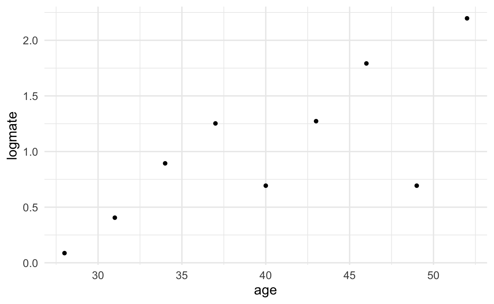

###  glm


```r
glm(species ~ log(area) + log(elevation) + nearest + scruz + adjacent, 
    data= galap, family="poisson") %>% tidy()
#> # A tibble: 6 x 5
#>   term            estimate std.error statistic  p.value
#>   <chr>              <dbl>     <dbl>     <dbl>    <dbl>
#> 1 (Intercept)     3.02     0.303         9.96  2.28e-23
#> 2 log(area)       0.315    0.0185       17.1   2.20e-65
#> 3 log(elevation)  0.0977   0.0604        1.62  1.06e- 1
#> 4 nearest        -0.00106  0.00169      -0.626 5.32e- 1
#> 5 scruz          -0.00314  0.000597     -5.26  1.40e- 7
#> 6 adjacent       -0.000243 0.0000281    -8.65  5.31e-18
```

### drop in deviance

It seems like we might not need either `log(elevation)` or `nearest`.  A drop in deviance test will help:


```r
glm(species ~ log(area) + log(elevation) + nearest + scruz + adjacent, 
    data= galap, family="poisson") %>% glance()
#> # A tibble: 1 x 8
#>   null.deviance df.null logLik   AIC   BIC deviance df.residual  nobs
#>           <dbl>   <int>  <dbl> <dbl> <dbl>    <dbl>       <int> <int>
#> 1         3511.      29  -294.  600.  609.     427.          24    30

glm(species ~ log(area) + scruz + adjacent, 
    data= galap, family="poisson") %>% glance()
#> # A tibble: 1 x 8
#>   null.deviance df.null logLik   AIC   BIC deviance df.residual  nobs
#>           <dbl>   <int>  <dbl> <dbl> <dbl>    <dbl>       <int> <int>
#> 1         3511.      29  -296.  600.  606.     431.          26    30

431.11 - 427.48
#> [1] 3.63
1 - pchisq(3.63, 2)
#> [1] 0.163
```

The relatively large p-value suggests that we do not need either of the variables `log(elevation)` or `nearest`

### residuals

Keep in mind that the expectation of a Poisson model is that the residuals will be more variable for larger predicted values.  The `broom` package provides `.resid`uals which are the observed value minus the fitted value.  I *think* that `.std.resid` is the Pearson residual.


```r
glm(species ~ log(area) + scruz + adjacent, 
    data= galap, family="poisson") %>% augment() %>% head()
#> # A tibble: 6 x 10
#>   species `log(area)` scruz adjacent .fitted .resid .std.resid   .hat .sigma
#>     <dbl>       <dbl> <dbl>    <dbl>   <dbl>  <dbl>      <dbl>  <dbl>  <dbl>
#> 1      58       3.22    0.6     1.84    4.61 -4.57      -4.83  0.105    4.04
#> 2      31       0.215  26.3   572.      3.36  0.414      0.427 0.0605   4.15
#> 3       3      -1.56   58.7     0.78    2.76 -3.96      -4.05  0.0417   4.07
#> 4      25      -2.30   47.4     0.18    2.55  3.01       3.08  0.0413   4.11
#> 5       2      -3.00    1.9   904.      2.27 -3.01      -3.10  0.0559   4.11
#> 6      18      -1.08    8       1.84    3.11 -0.953     -0.986 0.0661   4.15
#> # … with 1 more variable: .cooksd <dbl>

glm(species ~ log(area) + scruz + adjacent, 
    data= galap, family="poisson") %>% augment() %>%
  ggplot(aes(x=.fitted, y=.resid)) + geom_point()

glm(species ~ log(area) + scruz + adjacent, 
    data= galap, family="poisson") %>% augment() %>%
  ggplot(aes(x=.fitted, y=.std.resid)) + geom_point()
```

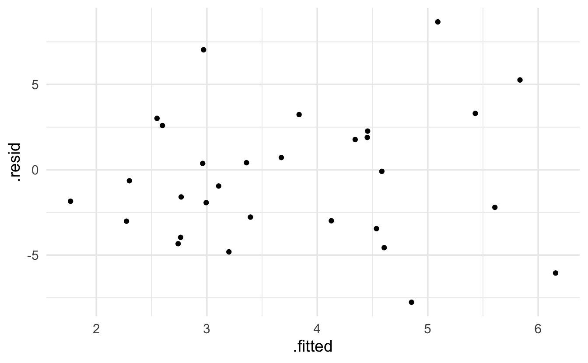


###  quasiPoisson

Note that all of the above analyses can be done using the overdispersed quasiPoisson model.


```r
glm(species ~ log(area) + log(elevation) + nearest + scruz + adjacent, 
    data= galap, family="quasipoisson") %>% tidy()
#> # A tibble: 6 x 5
#>   term            estimate std.error statistic  p.value
#>   <chr>              <dbl>     <dbl>     <dbl>    <dbl>
#> 1 (Intercept)     3.02      1.29         2.34  0.0278  
#> 2 log(area)       0.315     0.0786       4.02  0.000507
#> 3 log(elevation)  0.0977    0.257        0.381 0.707   
#> 4 nearest        -0.00106   0.00720     -0.147 0.884   
#> 5 scruz          -0.00314   0.00254     -1.24  0.228   
#> 6 adjacent       -0.000243  0.000120    -2.03  0.0532

glm(species ~ log(area) + scruz + adjacent, 
    data= galap, family="quasipoisson") %>% tidy()
#> # A tibble: 4 x 5
#>   term         estimate std.error statistic  p.value
#>   <chr>           <dbl>     <dbl>     <dbl>    <dbl>
#> 1 (Intercept)  3.50      0.203        17.3  8.76e-16
#> 2 log(area)    0.342     0.0304       11.3  1.63e-11
#> 3 scruz       -0.00354   0.00197      -1.80 8.36e- 2
#> 4 adjacent    -0.000221  0.000104     -2.12 4.35e- 2
```


```r
glm(species ~ log(area) + scruz + adjacent, 
    data= galap, family="quasipoisson") %>% augment() %>% head()
#> # A tibble: 6 x 10
#>   species `log(area)` scruz adjacent .fitted .resid .std.resid   .hat .sigma
#>     <dbl>       <dbl> <dbl>    <dbl>   <dbl>  <dbl>      <dbl>  <dbl>  <dbl>
#> 1      58       3.22    0.6     1.84    4.61 -4.57      -1.18  0.105    4.04
#> 2      31       0.215  26.3   572.      3.36  0.414      0.104 0.0605   4.15
#> 3       3      -1.56   58.7     0.78    2.76 -3.96      -0.989 0.0417   4.07
#> 4      25      -2.30   47.4     0.18    2.55  3.01       0.752 0.0413   4.11
#> 5       2      -3.00    1.9   904.      2.27 -3.01      -0.758 0.0559   4.11
#> 6      18      -1.08    8       1.84    3.11 -0.953     -0.241 0.0661   4.15
#> # … with 1 more variable: .cooksd <dbl>

glm(species ~ log(area) + scruz + adjacent, 
    data= galap, family="quasipoisson") %>% augment() %>%
  ggplot(aes(x=.fitted, y=.resid)) + geom_point()

glm(species ~ log(area) + scruz + adjacent, 
    data= galap, family="quasipoisson") %>% augment() %>%
  ggplot(aes(x=.fitted, y=.std.resid)) + geom_point()
```


<!--chapter:end:08-PoisReg.Rmd-->


# References {-}


<!--chapter:end:09-references.Rmd-->

