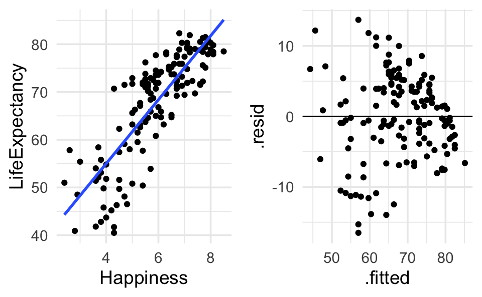

# Simple Linear Regression {#SLR}


Though we've discussed the relationship between tests of means and simple linear regression, we will really consider simple linear regression in a much broader context (one where both the explanatory and response variables are quantitative).

The data below represents 10 different variables on health of a country measured on 143 countries.  Data taken from [@Lock5], originally from the Happy Planet Index Project [http://www.happyplanetindex.org/].  Region of the world is coded as 1 = Latin America, 2 = Western nations, 3 = Middle East, 4 = Sub-Saharan Africa, 5 = South Asia, 6 = East Asia, 7 = former Communist countries.  We are going to investigate happiness and life expectancy.  

## Transformations

### Model assumptions {-}


* The average value for the response variable is a linear function of the explanatory variable.
* The error terms follow a normal distribution around the linear model.
* The error terms have a mean of zero.
* The error terms have a constant variance of $\sigma^2$.
* The error terms are independent (and identically distributed).
* [http://www.rossmanchance.com/applets/RegSim/RegCoeff.html]

How do we tell whether the assumptions are met?  We can't always.  But it's good to look at plots: scatter plot, residual plot, histograms of residuals.  We denote the residuals for this model as:

\begin{align}
r_i = \hat{e}_i = y_i - \hat{y}_i
\end{align}

<div class="figure" style="text-align: center">

<p class="caption">(\#fig:unnamed-chunk-2)Figs 3.13 and 3.15 taken from @kutner.</p>
</div>


**important note!!**  The idea behind transformations is to make the model as appropriate as possible for the data at hand.  We want to find the correct **linear** model; we want our assumptions to hold.  We are not trying to find the most *significant* model or big $R^2$.


See section 2.9 in @KuiperSklar.  No normal probability plots (qq-plots); use histograms or boxplots to assess the symmetry and normality of the residuals.


## Fitting the regression line
How do we fit a regression line?  Find $b_0$ and $b_1$ that minimize the sum of squared distance of the points to the line (called ordinary least squares):

\begin{align}
\min \sum (y_i \hat{y}_i)^2 &= \min RSS \mbox{ residual sum of squares}\\
RSS &= \sum (y_i - b_0 - b_1 x_i)^2\\
\frac{\partial RSS}{\partial b_0} &= 0\\
\frac{\partial RSS}{\partial b_1} &= 0\\
b_0 &= \overline{y} - b_1 \overline{x}\\
b_1 &= r(x,y) \frac{s_x}{s_y}\\
\end{align}


* Is that the only way to find values for $b_0$ and $b_1$? (absolute distances, maximum likelihood,...)
* Resistance to outliers?
* What is $\hat{y}$ at $\overline{x}$?

\begin{align}
\hat{y} &= b_0 + b_1 \overline{x}\\
&= \overline{y} - b_1 \overline{x} + b_1 \overline{x}\\
&= \overline{y}
\end{align}

The regression line will always pass through the point $(\overline{x}, \overline{y})$.


## Correlation

Consider a scatterplot, you'll have variability in both directions:  $(x_i - \overline{x}) \& (y_i - \overline{y})$.

\begin{align}
\mbox{sample covariance}&\\
cov(x,y) &= \frac{1}{n-1}\sum (x_i - \overline{x}) (y_i - \overline{y})\\
\mbox{sample correlation}&\\
r(x,y) &= \frac{cov(x,y)}{s_x s_y}\\
&= \frac{\frac{1}{n-1} \sum (x_i - \overline{x}) (y_i - \overline{y})}{\sqrt{\frac{\sum(x_i - \overline{x})^2}{n-1} \frac{\sum(y_i - \overline{y})^2}{n-1}}}\\
\mbox{pop cov} &= \sigma_{xy}\\
\mbox{pop cor} &= \rho = \frac{\sigma_{xy}}{\sigma_x \sigma_y}\\
\end{align}


* $-1 \leq r \leq 1 \ \ \ \ \ \& \ \ \ -1 \leq \rho \leq 1$.  
* No Spearman's rank correlation or Kendall's $\tau$.  
* $b_1 = r \frac{s_y}{s_x}$  
    * if $r=0, b_1=0$  
    * if $r=1, b_1 > 0$ but can be anything!  
    * $r < 0 \leftrightarrow b_1 < 0, r > 0 \leftrightarrow b_1 > 0$  
* Recall that $R^2$ is the proportion of variability explained by the line.  


## Errors / Residuals
Recall, $\epsilon_i \sim N(0, \sigma^2)$.  How do we estimate $\sigma^2$?

\begin{align}
RSS &= \sum (y_i - \hat{y}_i)^2 \ \ \ \mbox{ residual sum of squares}\\
MSS &= \sum (\hat{y}_i - \overline{y})^2 \ \ \ \mbox{ model sum of squares}\\
TSS &= \sum (y_i - \overline{y})^2 \ \ \ \mbox{ total sum of squares}\\
s_{y|x}^2 &= \hat{\sigma^2} = \frac{1}{n-2} RSS\\
s_x^2 &= \frac{1}{n-1} \sum (x_i - \overline{x})^2\\
s_y^2 &= \frac{1}{n-1} \sum (y_i - \overline{y})^2\\
var(\epsilon) &= s_{y|x}^2 = \frac{RSS}{n-2} = \frac{\sum(y_i - \hat{y}_i)^2}{n-2} = SE(\epsilon)\\
var(b_1) &= \frac{s_{y|x}^2}{(n-1) s_x^2}\\
SE(b_1) &= \frac{s_{y|x}}{\sqrt{(n-1)} s_x}\\
&= \frac{\hat{\sigma}}{\sqrt{\sum(x_i - \overline{x})^2}} = \frac{\sqrt{\sum(y_i - \hat{y}_i)^2/(n-2)}}{\sqrt{\sum(x_i - \overline{x})^2}}\\
\end{align}

* $SE(b_1) \downarrow$ as $\sigma \downarrow$
* $SE(b_1) \downarrow$ as $n \uparrow$
* $SE(b_1) \downarrow$ as $s_x \uparrow$
* WHY?
* What do we mean by $SE(b_1)$?

As we saw above, the correlation and the slope estimates are intimately related.  They are also both related to the *coefficient of determination*.
\begin{align}
R^2 = r^2 = \frac{MSS}{TSS}
\end{align}

$R^2$ is the proportion of total variability explained by the regression line (the linear relationship between the explanatory and response variables).

* If $x$ and $y$ are not at all correlated, $\hat{y}_i \approx \overline{y}$, MSS = 0, $R^2=0$.
* If $x$ and $y$ are perfectly correlated, $\hat{y}_i = y_i$, MSS=TSS, $R^2 = 1$.


### Testing $\beta_1$
If $H_0: \beta=0$ is true, then
\begin{align}
\frac{b_1 - 0}{SE(b_1)} \sim t_{n-2}
\end{align}
Note that the degrees of freedom are now $n-2$ because we are estimating two parameters ($\beta_0$ and $\beta_1$).  We can also find a $(1-\alpha)100\%$ confidence interval for $\beta_1$:
\begin{align}
b_1 \pm t_{\alpha/2, n-2} SE(b_1)
\end{align}


## Intervals {#intervals}

As with anything that has some type of standard error, we can create intervals that give us some confidence in the statements we are making.

### Confidence Intervals

In general, confidence intervals are of the form:

```
point estimate +/- multiplier * SE(point estimate)
```

### Slope

We can create a CI for the slope parameter, $\beta_1$:
\begin{align}
b_1 &\pm t_{\alpha/2,n-2} SE(b_1)\\
b_1 &\pm t_{\alpha/2, n-2} \frac{s_{y|x}}{\sqrt{(n-1)}s_x}\\
6.693 &\pm t_{.025, 141} 0.375\\
t_{.025,141} &= qt(0.025, 141) = -1.977\\
\mbox{CI} & (5.95 \mbox{ years/unit of happy}, 7.43 \mbox{ years/unit of happy})
\end{align}
How can we interpret the CI?  Does it make sense to talk about a unit of happiness?

### Mean Response
We can also create a CI for the mean response, $E[Y|x^*] = \beta_0 + \beta_1 x^*$.  Note that the standard error of the point estimate ($\hat{y}=b_0 + b_1 x^*$) now depends on the variability associated with two things ($b_0, b_1$).
\begin{align}
SE(\hat{y(x^*)}) &= \sqrt{ \frac{s^2_{y|x}}{n} + (x^* - \overline{x})^2 SE(b_1)^2}\\
SE(\hat{y}(\overline{x})) &= s_{y|x}/\sqrt{n}\\
SE(\hat{y}(x)) &\geq s_{y|x}/\sqrt{n} \ \ \ \forall x
\end{align}
How would you interpret the associated interval?


### Prediction of an Individual Response

As should be obvious, predicting an individual is more variable than predicting a mean.

\begin{align}
SE(y(x^*)) &= \sqrt{ \frac{s^2_{y|x}}{n} + (x^* - \overline{x})^2 SE(b_1)^2 + s^2_{y|x}}\\
SE(y(x^*)) &= \sqrt{ SE(\hat{y}(x^*))^2 + s^2_{y|x}}\\
\end{align}
How would you interpret the associated interval?


## Influential Points {#infl}

**We are skipping Section \@ref(infl); you are not responsible for it.**


Note: typically we think of more data as better; more values will tend to decrease the sampling variability of our statistic.  But if I give you a lot more data and put it all at $\overline{x}$, $SE(b_1)$ stays exactly the same.  Why??

Recall
\begin{align}
y_{i} &= \beta_0 + \beta_1 x_i \ \ \ \epsilon_i \sim N(0,\sigma^2)\\
e_i &= y_i - \hat{y}_i
\end{align}

We plot $e_i$ versus $\hat{y}_i$.  (Why?  Typically, we want the $e_i$ to be constant at each value of $x_i$.  Note that $\hat{y}_i$ is a simple linear transformation of $x_i$, so the plot is identical.)  We want to see if the distributions of the residuals is different across the fitted line (we look for patterns).


**Not all residuals have an equal effect on the regression line!!**

### leverage
\begin{align}
h_i = \frac{1}{n} +\frac{(x_i - \overline{x})^2}{\sum_{j=1}^n (x_j - \overline{x})^2}\\
\frac{1}{n} \leq h_i \leq 1\\
\end{align}
Leverage represents the effect of point $x_i$ on the line.  We need large leverage for a particular value to have a large effect.

Note:
\begin{align}
SE(\hat{y}(x_i)) &= s_{y|x} \sqrt{h_i}\\
SE(y(x_i)) &= s_{y|x} \sqrt{(h_i + 1)}\\
SE(e_i) &= s_{y|x} \sqrt{(1-h_i)}\\
\hat{y}(x^*) &\pm t_{n-2, .025} (s_{y|x} \sqrt{h(x^*)+1})\\
\end{align}
is a 95\% prediction interval at $x^*$.  High leverage reduces the variability because the line gets pulled toward the point.

### standardized residuals

\begin{align}
\frac{e_i}{s_{y|x} \sqrt{1-h_i}} \sim t_{n-2}\\
\end{align}

### studentized residuals

\begin{align}
\frac{e_i}{s_{y|x, (i)} \sqrt{1-h_i}} &\sim t_{n-3}\\
s_{y|x, (i)} &= \frac{1}{n-3} \sum_{j \ne i} (y_j - \hat{y}_{j(i)})^2
\end{align}

Where do we predict 90\% of residuals?  $\pm t_{n-2,3 , .05}$.  About $\pm 2$.

### DFBETAs

DFBETAs represent the change in the parameter estimate due to one observation.

\begin{align}
DFBETAS_i &= \frac{b_1 - b_{1(i)}}{\frac{s_{y|x, (i)}}{\sqrt{(n-1)} s_x}}\\
\end{align}


## R Example (SLR): Happy Planet  
  

The data below represents 10 different variables on health of a country measured on 143 countries.  Data taken from [@Lock5], originally from the Happy Planet Index Project [http://www.happyplanetindex.org/].  Region of the world is coded as 1 = Latin America, 2 = Western nations, 3 = Middle East, 4 = Sub-Saharan Africa, 5 = South Asia, 6 = East Asia, 7 = former Communist countries.  We are going to investigate happiness and life expectancy.  


### Reading the data into R

```
#> Rows: 143
#> Columns: 11
#> $ Country        <chr> "Albania", "Algeria", "Angola", "Argentina", "Armenia"…
#> $ Region         <dbl> 7, 3, 4, 1, 7, 2, 2, 7, 5, 7, 2, 1, 4, 5, 1, 7, 4, 1, …
#> $ Happiness      <dbl> 5.5, 5.6, 4.3, 7.1, 5.0, 7.9, 7.8, 5.3, 5.3, 5.8, 7.6,…
#> $ LifeExpectancy <dbl> 76.2, 71.7, 41.7, 74.8, 71.7, 80.9, 79.4, 67.1, 63.1, …
#> $ Footprint      <dbl> 2.2, 1.7, 0.9, 2.5, 1.4, 7.8, 5.0, 2.2, 0.6, 3.9, 5.1,…
#> $ HLY            <dbl> 41.7, 40.1, 17.8, 53.4, 36.1, 63.7, 61.9, 35.4, 33.1, …
#> $ HPI            <dbl> 47.9, 51.2, 26.8, 59.0, 48.3, 36.6, 47.7, 41.2, 54.1, …
#> $ HPIRank        <dbl> 54, 40, 130, 15, 48, 102, 57, 85, 31, 104, 64, 27, 134…
#> $ GDPperCapita   <dbl> 5316, 7062, 2335, 14280, 4945, 31794, 33700, 5016, 205…
#> $ HDI            <dbl> 0.801, 0.733, 0.446, 0.869, 0.775, 0.962, 0.948, 0.746…
#> $ Population     <dbl> 3.15, 32.85, 16.10, 38.75, 3.02, 20.40, 8.23, 8.39, 15…
```


### Running the linear model (lm)


```
#> # A tibble: 2 x 5
#>   term        estimate std.error statistic  p.value
#>   <chr>          <dbl>     <dbl>     <dbl>    <dbl>
#> 1 (Intercept)    28.2      2.28       12.4 2.76e-24
#> 2 Happiness       6.69     0.375      17.8 5.78e-38
```

### Ouptut

Some analyses will need the residuals, fitted values, or coefficients individually.

```
#> # A tibble: 143 x 8
#>   LifeExpectancy Happiness .fitted  .resid    .hat .sigma   .cooksd .std.resid
#>            <dbl>     <dbl>   <dbl>   <dbl>   <dbl>  <dbl>     <dbl>      <dbl>
#> 1           76.2       5.5    65.0  11.2   0.00765   6.09 0.0128        1.83  
#> 2           71.7       5.6    65.7   6.00  0.00737   6.14 0.00357       0.980 
#> 3           41.7       4.3    57.0 -15.3   0.0168    6.02 0.0539       -2.51  
#> 4           74.8       7.1    75.7  -0.944 0.0122    6.16 0.000148     -0.155 
#> 5           71.7       5      61.7  10.0   0.0101    6.10 0.0138        1.64  
#> 6           80.9       7.9    81.1  -0.198 0.0216    6.16 0.0000118    -0.0326
#> # … with 137 more rows
```


We can plot the main relationship, or we can plot the residuals (to check that technical conditions hold):
```
happy %>%
         ggplot(aes(x=Happiness, y=LifeExpectancy)) + 
         geom_point() + 
         geom_smooth(method="lm", se=FALSE) 

happy.lm %>% 
         augment() %>% 
         ggplot(aes(x = .fitted, y = .resid)) + 
         geom_point() + 
         geom_hline(yintercept=0)
```




Intervals of interest: mean response, individual response, and parameter(s).

```
#>    fit  lwr  upr
#> 1 55.0 53.2 56.7
#> 2 75.1 73.8 76.4
#>    fit  lwr  upr
#> 1 55.0 42.7 67.3
#> 2 75.1 62.9 87.3
#> # A tibble: 2 x 7
#>   term        estimate std.error statistic  p.value conf.low conf.high
#>   <chr>          <dbl>     <dbl>     <dbl>    <dbl>    <dbl>     <dbl>
#> 1 (Intercept)    28.2      2.28       12.4 2.76e-24    23.7      32.7 
#> 2 Happiness       6.69     0.375      17.8 5.78e-38     5.95      7.43
```
  
  
#### Residuals in R

We skipped the residuals section, so you are not responsible for finding residuals in R, but the R code is here for completion in case you are interested:
  


```
#> # A tibble: 143 x 8
#>   LifeExpectancy Happiness .fitted  .resid    .hat .sigma   .cooksd .std.resid
#>            <dbl>     <dbl>   <dbl>   <dbl>   <dbl>  <dbl>     <dbl>      <dbl>
#> 1           76.2       5.5    65.0  11.2   0.00765   6.09 0.0128        1.83  
#> 2           71.7       5.6    65.7   6.00  0.00737   6.14 0.00357       0.980 
#> 3           41.7       4.3    57.0 -15.3   0.0168    6.02 0.0539       -2.51  
#> 4           74.8       7.1    75.7  -0.944 0.0122    6.16 0.000148     -0.155 
#> 5           71.7       5      61.7  10.0   0.0101    6.10 0.0138        1.64  
#> 6           80.9       7.9    81.1  -0.198 0.0216    6.16 0.0000118    -0.0326
#> # … with 137 more rows
```


