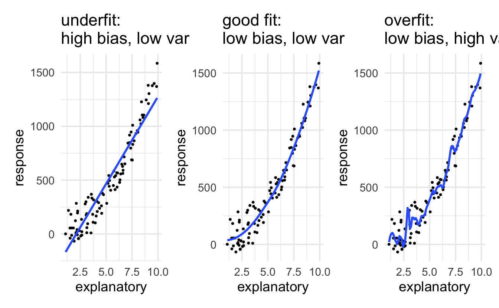
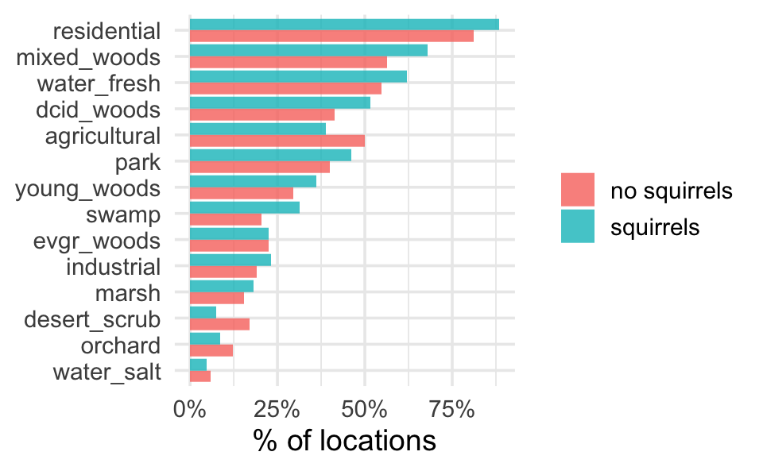
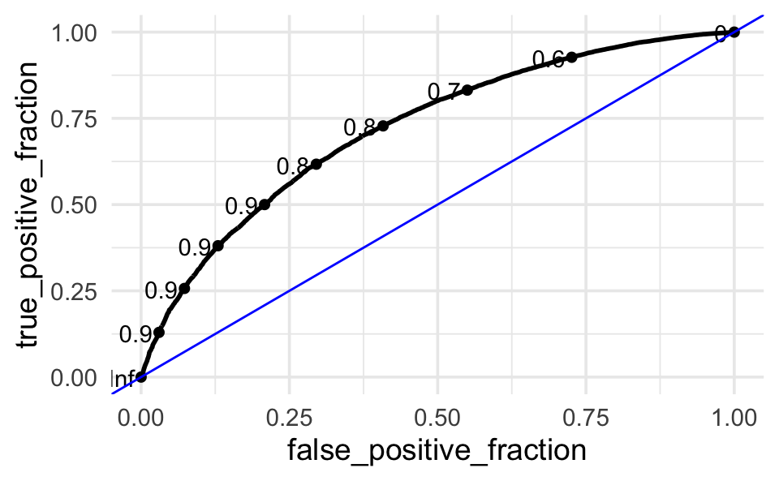
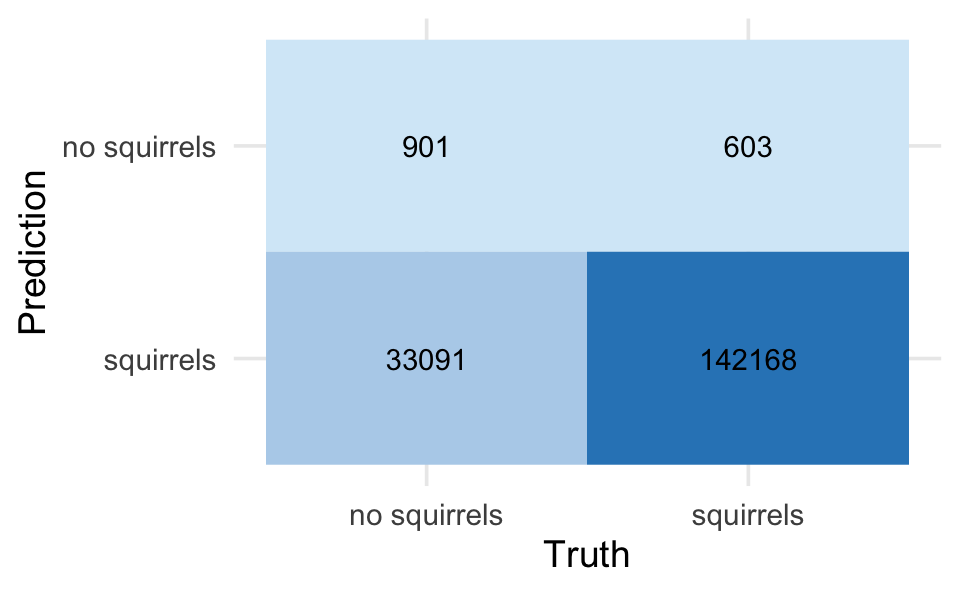
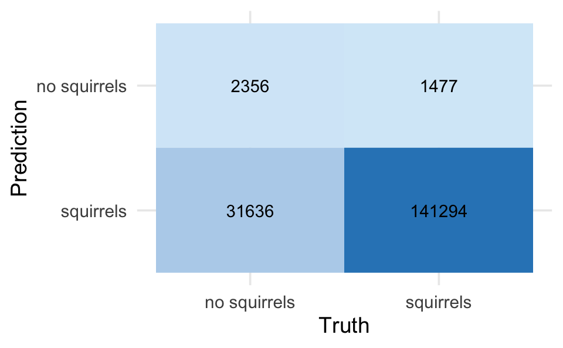
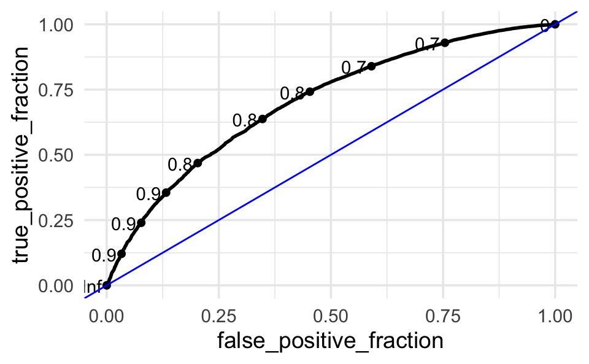

# Modeling as a Process {#process}


## Comparing Models^[Thanks to Mine Çentinkaya-Rundel and Julia Silge for the ideas and much of the code in this chapter.  Mine's course is at https://mine-cr.com/teaching/sta210/. Julia's blog is at https://juliasilge.com/blog/project-feederwatch/.]

So many models, so little time.  Understanding how to interpret a multiple linear regression model is only half of the modeling process.  In most real-life situations, there are many variables which can be used to predict or describe the response variable at hand.  But how to choose which combination or subset of variables is best?

Here, we'll walk through many of the big ideas surrounding the modeling building process.  In the next chapter we will consider the technical ideas behind statistical inference for modeling building.  But even when using formal inference, the ideas here should always inform the larger process and analysis conclusions.

[Leo Breiman](https://en.wikipedia.org/wiki/Leo_Breiman) was among the giants in machine learning who helped to bridge ideas in statistics and computer science.  Trained as a statistician, he spent his career at the University of California, Berkeley where he developed Classification and Regression Trees (CART), bagging, and Random Forests.  

Among his important insights was an idea that there are [two cultures](https://projecteuclid.org/journals/statistical-science/volume-16/issue-3/Statistical-Modeling--The-Two-Cultures-with-comments-and-a/10.1214/ss/1009213726.full) which can motivate (linear) modeling:

> Think of the data as being generated by a black box in which a vector of input variables x (independent variables) go in one side, and on the other side the response variables y come out. Inside the black box, nature functions to associate the predictor variables with the response variables.


> 1. Data Modeling: The analysis in this culture starts with assuming a stochastic data model for the inside of the black box...The values of the parameters are estimated from the data and the model then used for information and/or prediction

> 2. Algorithmic Modeling: The analysis in this culture considers the inside of the box complex and unknown. [The] approach is to find a function f(x) — an algorithm that operates on x to predict the responses y.

Here in Chapter \@ref(process), the focus will be on algorithmic modeling and developing models which are optimally predictive of the response variable at hand.

**Spoiler:**

- In Chapter \@ref(logreg), the model building uses hypothesis testing and p-values.
- In Chapter \@ref(process), the model building uses outside information and independent assessment.

There isn't a right way to model.  In fact, good data analysis is **hard**.  You are building a tool box.  Make sure to notice that not every tool is the same, and you have more than just one hammer to use.  Sometimes the tools can work together to form even better models.

#### Worth a comment {-}

Notice that the R code has gotten more interesting now.  How fun!! The R code will help the process!  The R package **tidymodels** includes tools to facilitate, in particular, feature engineering and cross validation.


### Bias-variance trade-off {-}

**Excellent resource**

for explaining the bias-variance trade-off:  http://scott.fortmann-roe.com/docs/BiasVariance.html

* **Variance** refers to the amount by which $\hat{f}$ would change if we estimated it using a different training set.  Generally, the closer the model fits the data, the more variable it will be (it'll be different for each data set!).  A model with many many explanatory variables will often fit the data too closely.

* **Bias** refers to the error that is introduced by approximating the "truth" by a model which is too simple. For example, we often use linear models to describe complex relationships, but it is unlikely that any real life situation actually has a *true* linear model.  However, if the true relationship is close to linear, then the linear model will have a low bias.

Generally, the simpler the model, the lower the variance.  The more complicated the model, the lower the bias.  In this class, cross validation will be used to assess model fit using metrics like accuracy and Receiver Operating Characteristic (ROC) curves.


\begin{align}
\mbox{prediction error } = \mbox{ irreducible error } + \mbox{ bias } + \mbox{ variance}
\end{align}

* **irreducible error**  The irreducible error is the natural variability that comes with observations.  No matter how good the model is, we will never be able to predict perfectly.
* **bias**  The bias of the model represents the difference between the true model and a model which is too simple.  That is, the more complicated the model (e.g., the more variables), the closer the points are to the prediction.  As the model gets more complicated (e.g., as variables are added), the bias goes down.
* **variance**  The variance represents the variability of the model from sample to sample.  That is, a simple model (very few variables) would not change a lot from sample to sample.  The variance decreases as the model becomes more simple (e.g., variables are removed).


Note the bias-variance trade-off.  We want our prediction error to be small, so we choose a model that is medium with respect to both bias and variance.  We cannot control the irreducible error.

<div class="figure" style="text-align: center">

<p class="caption">(\#fig:unnamed-chunk-3)Test and training error as a function of model complexity.  Note that the error goes down monotonically only for the training data.  Be careful not to overfit!!  [@ESL]</p>
</div>

In the linear regression case, the following plots describe the bias-variance tradeoff.  In our setting, the models change due to the number of variables included in the model (which is difficult to draw because those models exist in dozens of dimensions).




## Modeling Squirrel Activity

For the example used to consider feature engineering and cross validation, the data come from <a href = "https://feederwatch.org/explore/raw-dataset-requests/" target = "_blank">Project FeederWatch</a>#TidyTuesday dataset on Project FeederWatch, a citizen science project for bird science, by way of <a href = "https://github.com/rfordatascience/tidytuesday/tree/master/data/2023/2023-01-10" target = "_blank">TidyTuesday</a>.  Many of the ideas below are due to <a href = "https://juliasilge.com/blog/project-feederwatch/" target = "_blank">screencasts by Julia Silge</a>.


> Can the characteristics of the bird feeder site like the surrounding yard and habitat predict whether a bird feeder site will be used by squirrels?

Instead of jumping into the predictions immediately, let's look at the data itself.  What wrangling can we do to the data in order to take advantage of all the information in the variables?  We'd also like to make the model accurate and easy to communicate.


```r
site_data <- read_csv('https://raw.githubusercontent.com/rfordatascience/tidytuesday/master/data/2023/2023-01-10/PFW_count_site_data_public_2021.csv') %>%
  mutate(squirrels = as.factor(ifelse(squirrels, "squirrels", "no squirrels")))

glimpse(site_data)
#> Rows: 254,355
#> Columns: 62
#> $ loc_id                       <chr> "L100016", "L100016", "L100016", "L100016…
#> $ proj_period_id               <chr> "PFW_2002", "PFW_2003", "PFW_2004", "PFW_…
#> $ yard_type_pavement           <dbl> 0, 0, 0, 0, 0, 0, 0, 0, 0, 0, 0, 0, 0, 0,…
#> $ yard_type_garden             <dbl> 0, 0, 0, 0, 0, 0, 0, 0, 0, 0, 0, 0, 0, 0,…
#> $ yard_type_landsca            <dbl> 1, 1, 1, 1, 1, 1, 0, 0, 0, 0, 1, 1, 1, 1,…
#> $ yard_type_woods              <dbl> 0, 0, 0, 0, 0, 0, 1, 1, 1, 1, 1, 1, 1, 1,…
#> $ yard_type_desert             <dbl> 0, 0, 0, 0, 0, 0, 0, 0, 0, 0, 0, 0, 0, 0,…
#> $ hab_dcid_woods               <dbl> 1, 1, 1, 1, 1, 1, 1, 1, 1, 1, NA, NA, NA,…
#> $ hab_evgr_woods               <dbl> NA, NA, NA, NA, 0, 0, NA, NA, NA, NA, NA,…
#> $ hab_mixed_woods              <dbl> 1, 1, 1, 1, 1, 1, NA, NA, NA, NA, 1, 1, 1…
#> $ hab_orchard                  <dbl> NA, NA, NA, NA, 0, 0, NA, NA, NA, NA, NA,…
#> $ hab_park                     <dbl> NA, NA, NA, NA, 0, 0, NA, NA, NA, NA, 1, …
#> $ hab_water_fresh              <dbl> 1, 1, 1, 1, 1, 1, 1, 1, 1, 1, 1, 1, 1, 1,…
#> $ hab_water_salt               <dbl> NA, NA, NA, NA, 0, 0, NA, NA, NA, NA, 1, …
#> $ hab_residential              <dbl> 1, 1, 1, 1, 1, 1, NA, NA, NA, NA, 1, 1, 1…
#> $ hab_industrial               <dbl> NA, NA, NA, NA, 0, 0, NA, NA, NA, NA, 1, …
#> $ hab_agricultural             <dbl> 1, 1, 1, 1, 1, 1, NA, NA, NA, NA, 1, 1, 1…
#> $ hab_desert_scrub             <dbl> NA, NA, NA, NA, 0, 0, NA, NA, NA, NA, NA,…
#> $ hab_young_woods              <dbl> NA, NA, NA, NA, 0, 0, NA, NA, NA, NA, NA,…
#> $ hab_swamp                    <dbl> NA, NA, NA, NA, 0, 0, NA, NA, NA, NA, NA,…
#> $ hab_marsh                    <dbl> 1, 1, 1, 1, 1, 1, NA, NA, NA, NA, 1, 1, 1…
#> $ evgr_trees_atleast           <dbl> 11, 11, 11, 11, 11, 11, 0, 0, 0, 4, 1, 1,…
#> $ evgr_shrbs_atleast           <dbl> 4, 4, 4, 4, 1, 1, 1, 1, 1, 1, 4, 4, 4, 4,…
#> $ dcid_trees_atleast           <dbl> 11, 11, 11, 11, 1, 1, 11, 11, 11, 11, 4, …
#> $ dcid_shrbs_atleast           <dbl> 4, 4, 4, 4, 4, 4, 11, 11, 11, 11, 4, 4, 4…
#> $ fru_trees_atleast            <dbl> 4, 4, 4, 4, 1, 1, 1, 1, 1, 1, 1, 1, 1, 1,…
#> $ cacti_atleast                <dbl> 0, 0, 0, 0, 0, 0, 0, 0, 0, 0, 0, 0, 0, 0,…
#> $ brsh_piles_atleast           <dbl> 0, 0, 0, 0, 0, 0, 1, 1, 1, 1, 1, 1, 1, 1,…
#> $ water_srcs_atleast           <dbl> 1, 1, 1, 1, 1, 1, 0, 0, 0, 0, 0, 0, 0, 0,…
#> $ bird_baths_atleast           <dbl> 0, 0, 0, 0, 0, 0, 1, 1, 1, 1, 0, 0, 0, 1,…
#> $ nearby_feeders               <dbl> 0, 1, 1, 1, 0, 0, 1, 0, 1, 1, 1, 1, 1, 1,…
#> $ squirrels                    <fct> no squirrels, no squirrels, no squirrels,…
#> $ cats                         <dbl> 0, 1, 1, 1, 1, 1, 1, 0, 0, 0, 1, 1, 1, 1,…
#> $ dogs                         <dbl> 0, 0, 0, 0, 0, 0, 1, 0, 0, 0, 1, 1, 1, 1,…
#> $ humans                       <dbl> 0, 0, 0, 0, 0, 1, 1, 1, 0, 1, 1, 1, 1, 1,…
#> $ housing_density              <dbl> 2, 2, 2, 2, 2, 2, 1, 1, 1, 1, 2, 2, 2, 2,…
#> $ fed_yr_round                 <dbl> 0, 0, 0, 0, NA, NA, 1, 1, 1, 1, 0, NA, 0,…
#> $ fed_in_jan                   <dbl> 1, 1, 1, 1, 1, 1, 1, 1, 1, 1, 1, NA, 1, N…
#> $ fed_in_feb                   <dbl> 1, 1, 1, 1, 1, 1, 1, 1, 1, 1, 1, NA, 1, N…
#> $ fed_in_mar                   <dbl> 1, 1, 1, 1, 1, 1, 1, 1, 1, 1, 1, NA, 1, N…
#> $ fed_in_apr                   <dbl> 1, 1, 1, 1, 1, 0, 1, 1, 1, 1, 1, NA, 0, N…
#> $ fed_in_may                   <dbl> 0, 0, 0, 0, 0, 0, 1, 1, 1, 1, 0, NA, 0, N…
#> $ fed_in_jun                   <dbl> 0, 0, 0, 0, 0, 0, 1, 1, 1, 1, 0, NA, 0, N…
#> $ fed_in_jul                   <dbl> 0, 0, 0, 0, 0, 0, 1, 1, 1, 1, 0, NA, 0, N…
#> $ fed_in_aug                   <dbl> 0, 0, 0, 0, 0, 0, 1, 1, 1, 1, 0, NA, 0, N…
#> $ fed_in_sep                   <dbl> 0, 0, 0, 0, 0, 0, 1, 1, 1, 1, 0, NA, 0, N…
#> $ fed_in_oct                   <dbl> 0, 0, 0, 0, 0, 0, 1, 1, 1, 1, 0, NA, 1, N…
#> $ fed_in_nov                   <dbl> 1, 1, 1, 1, 1, 1, 1, 1, 1, 1, 1, NA, 1, N…
#> $ fed_in_dec                   <dbl> 1, 1, 1, 1, 1, 1, 1, 1, 1, 1, 1, NA, 1, N…
#> $ numfeeders_suet              <dbl> 1, 1, 1, 1, 1, 1, 3, 3, 3, 3, 1, 1, 1, 2,…
#> $ numfeeders_ground            <dbl> NA, 0, 0, 0, NA, NA, 1, 1, 1, 1, 3, 3, 3,…
#> $ numfeeders_hanging           <dbl> 1, 1, 1, 3, NA, NA, 2, 2, 2, 2, 2, 2, 1, …
#> $ numfeeders_platfrm           <dbl> 1, 1, 1, 0, NA, NA, 1, 1, 1, 2, 1, 1, 1, …
#> $ numfeeders_humming           <dbl> NA, 0, 0, 0, NA, NA, 1, 1, 1, 1, NA, 0, 0…
#> $ numfeeders_water             <dbl> 1, 1, 1, 1, NA, NA, 2, 2, 2, 2, 1, 1, 1, …
#> $ numfeeders_thistle           <dbl> NA, 0, 0, 0, NA, NA, 1, 1, 1, 2, 1, 1, 1,…
#> $ numfeeders_fruit             <dbl> NA, 0, 0, 0, NA, NA, 1, 1, 1, 1, NA, 0, 0…
#> $ numfeeders_hopper            <dbl> NA, NA, NA, NA, 1, 1, NA, NA, NA, NA, NA,…
#> $ numfeeders_tube              <dbl> NA, NA, NA, NA, 1, 1, NA, NA, NA, NA, NA,…
#> $ numfeeders_other             <dbl> NA, NA, NA, NA, NA, NA, NA, NA, NA, NA, N…
#> $ population_atleast           <dbl> 1, 1, 1, 1, 1, 1, 1, 1, 1, 1, 5001, 5001,…
#> $ count_area_size_sq_m_atleast <dbl> 1.01, 1.01, 1.01, 1.01, 1.01, 1.01, 375.0…
```

It is a huge dataset, although it has a lot of missing information.


```r
site_data %>%
  count(squirrels)
#> # A tibble: 3 × 2
#>   squirrels         n
#>   <fct>         <int>
#> 1 no squirrels  45323
#> 2 squirrels    190362
#> 3 <NA>          18670
```
How are other characteristics of these sites related to the presence of squirrels?


```r
site_data %>%
  filter(!is.na(squirrels)) %>%
  group_by(squirrels) %>%
  summarise(nearby_feeders = mean(nearby_feeders, na.rm = TRUE))
#> # A tibble: 2 × 2
#>   squirrels    nearby_feeders
#>   <fct>                 <dbl>
#> 1 no squirrels          0.344
#> 2 squirrels             0.456
```
What about some of the other variables like those describing the habitat?


```r
site_data %>%
  filter(!is.na(squirrels)) %>%
  group_by(squirrels) %>%
  summarise(across(contains("hab"), mean, na.rm = TRUE)) %>%
  pivot_longer(contains("hab")) %>%
  mutate(name = str_remove(name, "hab_")) %>%
  ggplot(aes(value, fct_reorder(name, value), fill = squirrels)) +
  geom_col(alpha = 0.8, position = "dodge") +
  scale_x_continuous(labels = scales::percent) +
  labs(x = "% of locations", y = NULL, fill = NULL)
```




## Building a Model

If the idea is to build a model which can predict squirrel activity, we need to have a way to see how we did (at the end).  Indeed, it is important for us to put some data in our pocket (it will be called the "test" data) which doesn't see any of the modeling process.  We'll use the test data at the end to assess whether or not our predictions are any good.

#### Create the dataset

There is a little bit of work to do to use only the observations that recodered whether or not there was a squirrel and to remove a few variables which are not of interest.


```r
library(tidymodels)

site_data <- site_data %>%
  filter(!is.na(squirrels)) %>%
  select(where(~!all(is.na(.x)))) %>%
  select(-loc_id, -proj_period_id, -fed_yr_round) %>%
  select(squirrels, everything()) 
```


#### Train / test {-}

**Step 1:** Create an initial split:


```r
set.seed(470)
feeder_split <- site_data %>%
  initial_split(strata = squirrels) # prop = 3/4 in each group, by default
```

**Step 2:** Save training data


```r
feeder_train <- training(feeder_split)
dim(feeder_train)
#> [1] 176763     59
```

**Step 3:** Save testing data


```r
feeder_test  <- testing(feeder_split)
dim(feeder_test)
#> [1] 58922    59
```

#### Using the training data {-}


```r
feeder_train
#> # A tibble: 176,763 × 59
#>   squirrels    yard_type_pavement yard_type_garden yard_type_landsca
#>   <fct>                     <dbl>            <dbl>             <dbl>
#> 1 no squirrels                  0                0                 1
#> 2 no squirrels                  0                0                 1
#> 3 no squirrels                  0                0                 1
#> 4 no squirrels                  0                0                 1
#> 5 no squirrels                  0                0                 1
#> 6 no squirrels                  0                0                 1
#> # ℹ 176,757 more rows
#> # ℹ 55 more variables: yard_type_woods <dbl>, yard_type_desert <dbl>,
#> #   hab_dcid_woods <dbl>, hab_evgr_woods <dbl>, hab_mixed_woods <dbl>,
#> #   hab_orchard <dbl>, hab_park <dbl>, hab_water_fresh <dbl>,
#> #   hab_water_salt <dbl>, hab_residential <dbl>, hab_industrial <dbl>,
#> #   hab_agricultural <dbl>, hab_desert_scrub <dbl>, hab_young_woods <dbl>,
#> #   hab_swamp <dbl>, hab_marsh <dbl>, evgr_trees_atleast <dbl>, …
```


### Modeling workflow

Ideally, the feature engineering / variable selection happens as part of the workflow.  That is, part of the modeling process.  That way, when the training data is used to fit the model, feature engineering happens.  When the test data is used to come up with predictions, feature engineering also happens.

-   Create a **recipe** for feature engineering steps to be applied to the training data

-   Fit the model to the training data after these steps have been applied

-   Use the model estimates from the training data, predict outcomes for the test data

-   Evaluate the performance of the model on the test data


The process is synthesized in the following graphic from a course at Johns Hopkins, <a href = "https://jhudatascience.org/tidyversecourse/" target = "_blank">Tidyverse Skills for Data Science</a>.


<div class="figure" style="text-align: center">

<p class="caption">(\#fig:unnamed-chunk-14)Image credit: Wright et al., Chapter 5 of Tidyverse Skills for Data Science https://jhudatascience.org/tidyversecourse/</p>
</div>

### Specifying a model

Instead of using the `glm()` command, we're going to use the **tidymodels** framework to specify a model.  In Math 150 we will *always* use "glm" as the engine, but if you take other applied statistics classes, you'll use different model specifications with the same feature engineering and modeling fitting steps.

Note that (above) I pulled in all of the relevant functions from the package using `library(tidymodels)`.


```r
feeder_spec <- logistic_reg() %>%
  set_engine("glm") 

feeder_spec
#> Logistic Regression Model Specification (classification)
#> 
#> Computational engine: glm
```

### Building a recipe

The steps in building a recipe are done sequentially so that the format of each variable is as desired for the model.  As seen in Section (\@ref{sec:wflow}), the recipe steps can happen in sequence using the pipe (`%>%`) function.

However, when you work with a single pipeline, the recipe effects on the data aren't seen, which can be unsettling.  You can look at what will happen when you ultimately apply the recipe to your data by using the functions `prep()` and `bake()`.

**Note:**  Using `prep()` and `bake()` are shown here for demonstrative purposes.  They do not need to be a part of your pipeline.  I do find them assuring, however, so that I can see the effects of the recipe steps as the recipe is built.

#### Initiate a recipe {-}


```r
feeder_rec <- recipe(
  squirrels ~ .,    # formula
  data = feeder_train # data for cataloging names and types of variables
  )

feeder_rec
#> Recipe
#> 
#> Inputs:
#> 
#>       role #variables
#>    outcome          1
#>  predictor         58
```


#### Remove zero variance predictors {-}

Remove all predictors that contain only a single value.  "zero variance" means that there is no variability in the entire column, literally every value is the same.  Those variables won't ever help with prediction.

> `step_impute_mean()` fills in all the missing values using the average of that variable.
> `step_nzv()` creates a specification of a recipe step that will remove variables that contain only a single value.


```r
feeder_rec <- feeder_rec %>%
  step_impute_mean(all_numeric_predictors()) %>%
  step_nzv(all_numeric_predictors())

feeder_rec
#> Recipe
#> 
#> Inputs:
#> 
#>       role #variables
#>    outcome          1
#>  predictor         58
#> 
#> Operations:
#> 
#> Mean imputation for all_numeric_predictors()
#> Sparse, unbalanced variable filter on all_numeric_predictors()
```


```r
feeder_rec_trained <- prep(feeder_rec)

bake(feeder_rec_trained, feeder_train) %>%
  glimpse
#> Rows: 176,763
#> Columns: 59
#> $ yard_type_pavement           <dbl> 0, 0, 0, 0, 0, 0, 0, 0, 0, 0, 0, 0, 0, 0,…
#> $ yard_type_garden             <dbl> 0, 0, 0, 0, 0, 0, 0, 0, 0, 0, 0, 0, 0, 0,…
#> $ yard_type_landsca            <dbl> 1, 1, 1, 1, 1, 1, 0, 1, 1, 1, 1, 1, 1, 1,…
#> $ yard_type_woods              <dbl> 0, 0, 0, 0, 1, 0, 1, 1, 0, 1, 0, 1, 1, 0,…
#> $ yard_type_desert             <dbl> 0, 0, 0, 0, 0, 0, 0, 0, 0, 0, 0, 0, 0, 0,…
#> $ hab_dcid_woods               <dbl> 1.000, 1.000, 1.000, 1.000, 1.000, 1.000,…
#> $ hab_evgr_woods               <dbl> 0.223, 0.223, 0.000, 0.223, 0.000, 0.223,…
#> $ hab_mixed_woods              <dbl> 1.000, 1.000, 1.000, 0.655, 0.000, 1.000,…
#> $ hab_orchard                  <dbl> 0.0932, 0.0932, 0.0000, 0.0932, 0.0000, 0…
#> $ hab_park                     <dbl> 0.45, 0.45, 0.00, 0.45, 0.00, 0.45, 0.00,…
#> $ hab_water_fresh              <dbl> 1.000, 1.000, 1.000, 1.000, 1.000, 0.605,…
#> $ hab_water_salt               <dbl> 0.0502, 0.0502, 0.0000, 0.0502, 0.0000, 0…
#> $ hab_residential              <dbl> 1.000, 1.000, 1.000, 1.000, 1.000, 1.000,…
#> $ hab_industrial               <dbl> 0.222, 0.222, 0.000, 0.222, 0.000, 0.222,…
#> $ hab_agricultural             <dbl> 1.00, 1.00, 1.00, 0.41, 1.00, 0.41, 0.00,…
#> $ hab_desert_scrub             <dbl> 0.0926, 0.0926, 0.0000, 0.0926, 0.0000, 0…
#> $ hab_young_woods              <dbl> 0.35, 0.35, 0.00, 0.35, 0.00, 1.00, 0.00,…
#> $ hab_swamp                    <dbl> 0.292, 0.292, 0.000, 0.292, 0.000, 0.292,…
#> $ hab_marsh                    <dbl> 1.000, 1.000, 1.000, 0.175, 0.000, 0.175,…
#> $ evgr_trees_atleast           <dbl> 11, 11, 11, 0, 11, 1, 4, 4, 4, 1, 1, 1, 1…
#> $ evgr_shrbs_atleast           <dbl> 4, 4, 1, 4, 0, 1, 4, 4, 4, 1, 0, 4, 4, 11…
#> $ dcid_trees_atleast           <dbl> 11, 11, 1, 4, 1, 4, 11, 11, 4, 1, 1, 1, 1…
#> $ dcid_shrbs_atleast           <dbl> 4, 4, 4, 1, 1, 4, 11, 11, 1, 1, 0, 4, 4, …
#> $ fru_trees_atleast            <dbl> 4.00, 4.00, 1.00, 1.00, 0.00, 0.00, 2.39,…
#> $ cacti_atleast                <dbl> 0.000, 0.000, 0.000, 0.000, 0.000, 0.000,…
#> $ brsh_piles_atleast           <dbl> 0, 0, 0, 1, 0, 0, 1, 4, 1, 0, 0, 1, 1, 1,…
#> $ water_srcs_atleast           <dbl> 1.000, 1.000, 1.000, 0.000, 0.000, 0.000,…
#> $ bird_baths_atleast           <dbl> 0, 0, 0, 1, 0, 0, 1, 1, 4, 0, 0, 0, 0, 1,…
#> $ nearby_feeders               <dbl> 1, 1, 0, 1, 0, 0, 0, 1, 1, 0, 0, 0, 0, 1,…
#> $ cats                         <dbl> 1, 1, 1, 1, 0, 0, 0, 1, 0, 1, 1, 0, 0, 0,…
#> $ dogs                         <dbl> 0, 0, 0, 1, 0, 0, 0, 1, 1, 1, 1, 1, 0, 1,…
#> $ humans                       <dbl> 0, 0, 1, 1, 1, 0, 0, 1, 1, 1, 1, 1, 1, 1,…
#> $ housing_density              <dbl> 2, 2, 2, 2, 2, 3, 1, 1, 1, 1, 2, 1, 2, 2,…
#> $ fed_in_jan                   <dbl> 1.00, 1.00, 1.00, 1.00, 1.00, 1.00, 0.00,…
#> $ fed_in_feb                   <dbl> 1.000, 1.000, 1.000, 1.000, 1.000, 1.000,…
#> $ fed_in_mar                   <dbl> 1.000, 1.000, 1.000, 1.000, 1.000, 1.000,…
#> $ fed_in_apr                   <dbl> 1.000, 1.000, 0.000, 1.000, 1.000, 0.000,…
#> $ fed_in_may                   <dbl> 0.000, 0.000, 0.000, 1.000, 1.000, 0.000,…
#> $ fed_in_jun                   <dbl> 0.000, 0.000, 0.000, 1.000, 1.000, 0.000,…
#> $ fed_in_jul                   <dbl> 0.000, 0.000, 0.000, 1.000, 1.000, 0.000,…
#> $ fed_in_aug                   <dbl> 0.000, 0.000, 0.000, 1.000, 1.000, 0.000,…
#> $ fed_in_sep                   <dbl> 0.000, 0.000, 0.000, 1.000, 1.000, 0.000,…
#> $ fed_in_oct                   <dbl> 0.000, 0.000, 0.000, 1.000, 1.000, 1.000,…
#> $ fed_in_nov                   <dbl> 1, 1, 1, 1, 1, 1, 1, 1, 1, 1, 1, 1, 1, 1,…
#> $ fed_in_dec                   <dbl> 1, 1, 1, 1, 1, 1, 1, 1, 1, 1, 1, 1, 1, 1,…
#> $ numfeeders_suet              <dbl> 1, 1, 1, 2, 1, 1, 1, 1, 3, 2, 2, 3, 4, 1,…
#> $ numfeeders_ground            <dbl> 0.00, 0.00, 1.27, 1.00, 0.00, 1.00, 1.27,…
#> $ numfeeders_hanging           <dbl> 1.00, 1.00, 2.71, 2.00, 2.71, 1.00, 2.71,…
#> $ numfeeders_platfrm           <dbl> 1.00, 1.00, 1.03, 1.03, 0.00, 0.00, 1.03,…
#> $ numfeeders_humming           <dbl> 0.000, 0.000, 0.499, 0.499, 0.000, 0.000,…
#> $ numfeeders_water             <dbl> 1.000, 1.000, 0.789, 0.789, 0.789, 0.000,…
#> $ numfeeders_thistle           <dbl> 0.00, 0.00, 1.01, 1.00, 1.01, 0.00, 1.01,…
#> $ numfeeders_fruit             <dbl> 0.000, 0.000, 0.144, 0.144, 0.000, 0.000,…
#> $ numfeeders_hopper            <dbl> 1.39, 1.39, 1.00, 1.39, 0.00, 1.39, 1.39,…
#> $ numfeeders_tube              <dbl> 2.16, 2.16, 1.00, 2.16, 2.00, 2.16, 1.00,…
#> $ numfeeders_other             <dbl> 0.604, 0.604, 0.604, 0.604, 0.000, 0.604,…
#> $ population_atleast           <dbl> 1, 1, 1, 25001, 5001, 25001, 1, 1, 1, 1, …
#> $ count_area_size_sq_m_atleast <dbl> 1.01, 1.01, 1.01, 1.01, 1.01, 1.01, 375.0…
#> $ squirrels                    <fct> no squirrels, no squirrels, no squirrels,…
```

**`step_` functions**

For more information: https://recipes.tidymodels.org/reference/index.html


```r
ls(pattern = '^step_', env = as.environment('package:recipes'))
#>  [1] "step_arrange"            "step_bagimpute"         
#>  [3] "step_bin2factor"         "step_BoxCox"            
#>  [5] "step_bs"                 "step_center"            
#>  [7] "step_classdist"          "step_corr"              
#>  [9] "step_count"              "step_cut"               
#> [11] "step_date"               "step_depth"             
#> [13] "step_discretize"         "step_dummy"             
#> [15] "step_dummy_extract"      "step_dummy_multi_choice"
#> [17] "step_factor2string"      "step_filter"            
#> [19] "step_filter_missing"     "step_geodist"           
#> [21] "step_harmonic"           "step_holiday"           
#> [23] "step_hyperbolic"         "step_ica"               
#> [25] "step_impute_bag"         "step_impute_knn"        
#> [27] "step_impute_linear"      "step_impute_lower"      
#> [29] "step_impute_mean"        "step_impute_median"     
#> [31] "step_impute_mode"        "step_impute_roll"       
#> [33] "step_indicate_na"        "step_integer"           
#> [35] "step_interact"           "step_intercept"         
#> [37] "step_inverse"            "step_invlogit"          
#> [39] "step_isomap"             "step_knnimpute"         
#> [41] "step_kpca"               "step_kpca_poly"         
#> [43] "step_kpca_rbf"           "step_lag"               
#> [45] "step_lincomb"            "step_log"               
#> [47] "step_logit"              "step_lowerimpute"       
#> [49] "step_meanimpute"         "step_medianimpute"      
#> [51] "step_modeimpute"         "step_mutate"            
#> [53] "step_mutate_at"          "step_naomit"            
#> [55] "step_nnmf"               "step_nnmf_sparse"       
#> [57] "step_normalize"          "step_novel"             
#> [59] "step_ns"                 "step_num2factor"        
#> [61] "step_nzv"                "step_ordinalscore"      
#> [63] "step_other"              "step_pca"               
#> [65] "step_percentile"         "step_pls"               
#> [67] "step_poly"               "step_poly_bernstein"    
#> [69] "step_profile"            "step_range"             
#> [71] "step_ratio"              "step_regex"             
#> [73] "step_relevel"            "step_relu"              
#> [75] "step_rename"             "step_rename_at"         
#> [77] "step_rm"                 "step_rollimpute"        
#> [79] "step_sample"             "step_scale"             
#> [81] "step_select"             "step_shuffle"           
#> [83] "step_slice"              "step_spatialsign"       
#> [85] "step_spline_b"           "step_spline_convex"     
#> [87] "step_spline_monotone"    "step_spline_natural"    
#> [89] "step_spline_nonnegative" "step_sqrt"              
#> [91] "step_string2factor"      "step_time"              
#> [93] "step_unknown"            "step_unorder"           
#> [95] "step_window"             "step_YeoJohnson"        
#> [97] "step_zv"
```

### Building workflows


**Workflows** bring together models and recipes so that they can be easily applied to both the training and test data.


#### Specify model {-}


```r
feeder_spec <- logistic_reg() %>%
  set_engine("glm")

feeder_spec
#> Logistic Regression Model Specification (classification)
#> 
#> Computational engine: glm
```

**The workflow:**  Notice that the two important parts to the workflows are the model specification and the feature engineering recipe information.


```r
feeder_wflow <- workflow() %>%
  add_model(feeder_spec) %>%
  add_recipe(feeder_rec)

feeder_wflow
#> ══ Workflow ════════════════════════════════════════════════════════════════════
#> Preprocessor: Recipe
#> Model: logistic_reg()
#> 
#> ── Preprocessor ────────────────────────────────────────────────────────────────
#> 2 Recipe Steps
#> 
#> • step_impute_mean()
#> • step_nzv()
#> 
#> ── Model ───────────────────────────────────────────────────────────────────────
#> Logistic Regression Model Specification (classification)
#> 
#> Computational engine: glm
```


#### Fit model to training data {-}

With the workflow in hand, the model can now be fit to the training data.  Although, wow... there are *so many predictors*!


```r
feeder_fit <- feeder_wflow %>%
  fit(data = feeder_train)

feeder_fit %>% tidy() %>% print(n = 21)
#> # A tibble: 59 × 5
#>    term               estimate std.error statistic   p.value
#>    <chr>                 <dbl>     <dbl>     <dbl>     <dbl>
#>  1 (Intercept)         -1.42     0.0505    -28.2   2.26e-174
#>  2 yard_type_pavement  -0.854    0.149      -5.74  9.23e-  9
#>  3 yard_type_garden    -0.175    0.0392     -4.47  7.89e-  6
#>  4 yard_type_landsca    0.168    0.0219      7.69  1.45e- 14
#>  5 yard_type_woods      0.309    0.0170     18.1   1.59e- 73
#>  6 yard_type_desert    -0.297    0.0789     -3.76  1.68e-  4
#>  7 hab_dcid_woods       0.336    0.0161     20.9   6.55e- 97
#>  8 hab_evgr_woods      -0.0797   0.0192     -4.15  3.36e-  5
#>  9 hab_mixed_woods      0.420    0.0158     26.5   3.17e-155
#> 10 hab_orchard         -0.307    0.0252    -12.2   4.00e- 34
#> 11 hab_park             0.0614   0.0192      3.20  1.36e-  3
#> 12 hab_water_fresh      0.0638   0.0157      4.07  4.79e-  5
#> 13 hab_water_salt      -0.320    0.0331     -9.67  4.03e- 22
#> 14 hab_residential      0.197    0.0208      9.51  1.88e- 21
#> 15 hab_industrial      -0.0365   0.0191     -1.91  5.61e-  2
#> 16 hab_agricultural    -0.578    0.0179    -32.3   2.87e-228
#> 17 hab_desert_scrub    -0.557    0.0240    -23.2   2.42e-119
#> 18 hab_young_woods      0.0874   0.0186      4.70  2.63e-  6
#> 19 hab_swamp            0.406    0.0223     18.2   5.54e- 74
#> 20 hab_marsh           -0.0149   0.0231     -0.644 5.20e-  1
#> 21 evgr_trees_atleast   0.0405   0.00220    18.4   1.44e- 75
#> # ℹ 38 more rows
```


### Evaluate the model

#### Predictions for training data {-}

#### Model assessment {-}


```r
feeder_train_pred <- predict(feeder_fit, feeder_train, type = "prob") %>%
  mutate(.pred_class = as.factor(ifelse(.pred_squirrels >=0.5,
                                        "squirrels", "no squirrels"))) %>%
  bind_cols(feeder_train %>% select(squirrels))

feeder_train_pred %>% select(squirrels, .pred_class) %>% table()
#>               .pred_class
#> squirrels      no squirrels squirrels
#>   no squirrels         3448     30544
#>   squirrels            2122    140649

rbind(roc_auc(feeder_train_pred, truth = squirrels, 
              estimate = .pred_squirrels, event_level = "second"),
      accuracy(feeder_train_pred, truth = squirrels, 
               estimate = .pred_class),
      sensitivity(feeder_train_pred, truth = squirrels, 
                  estimate = .pred_class, event_level = "second"),
      specificity(feeder_train_pred, truth = squirrels, 
                  estimate = .pred_class, event_level = "second")
)
#> # A tibble: 4 × 3
#>   .metric     .estimator .estimate
#>   <chr>       <chr>          <dbl>
#> 1 roc_auc     binary         0.720
#> 2 accuracy    binary         0.815
#> 3 sensitivity binary         0.985
#> 4 specificity binary         0.101

feeder_train_pred %>%
  ggplot() + 
  plotROC::geom_roc(aes(m = .pred_squirrels, d = squirrels)) + 
  geom_abline(intercept = 0, slope = 1, color = "blue")
```


Wow, that model does **TERRIBLY** at predicting when there are no squirrels.  Yikes!  (The underlying problem is all about the imbalance in the dataset.)

But, really...

*who cares about predictions on **training** data?*

### Predictions for testing data {-}


```r
feeder_test_pred <- predict(feeder_fit, feeder_test) %>%
  bind_cols(feeder_test %>% select(squirrels))

feeder_test_pred %>% table()
#>               squirrels
#> .pred_class    no squirrels squirrels
#>   no squirrels         1119       726
#>   squirrels           10212     46865
```


```r
feeder_test_pred <- predict(feeder_fit, feeder_test, type = "prob") %>%
  mutate(.pred_class = as.factor(ifelse(.pred_squirrels >=0.5,
                                        "squirrels", "no squirrels"))) %>%
  bind_cols(feeder_test %>% select(squirrels))

feeder_test_pred %>% select(squirrels, .pred_class) %>% table()
#>               .pred_class
#> squirrels      no squirrels squirrels
#>   no squirrels         1119     10212
#>   squirrels             726     46865

rbind(roc_auc(feeder_test_pred, truth = squirrels, 
              estimate = .pred_squirrels, event_level = "second"),
      accuracy(feeder_test_pred, truth = squirrels, 
               estimate = .pred_class),
      sensitivity(feeder_test_pred, truth = squirrels, 
                  estimate = .pred_class, event_level = "second"),
      specificity(feeder_test_pred, truth = squirrels, 
                  estimate = .pred_class, event_level = "second")
)
#> # A tibble: 4 × 3
#>   .metric     .estimator .estimate
#>   <chr>       <chr>          <dbl>
#> 1 roc_auc     binary        0.721 
#> 2 accuracy    binary        0.814 
#> 3 sensitivity binary        0.985 
#> 4 specificity binary        0.0988

feeder_test_pred %>%
  ggplot() + 
  plotROC::geom_roc(aes(m = .pred_squirrels, d = squirrels)) + 
  geom_abline(intercept = 0, slope = 1, color = "blue")
```




#### Evaluating performance on training data {-}

-   The training set does not have the capacity to be a good arbiter of performance.

-   It is not an independent piece of information; predicting the training set can only reflect what the model already knows.

-   Suppose you give a class a test, then give them the answers, then provide the same test.
    The student scores on the second test do not accurately reflect what they know about the subject; these scores would probably be higher than their results on the first test.


## Cross Validation

Before reading the notes, look through <a href = "http://www.r2d3.us/visual-intro-to-machine-learning-part-1/" target = "_blank">this great visualization</a>.  Don't worry about building the model (classification trees are not a topic for class), but check out the end where they talk about predicting on test and training data.

In order to motivate cross validation, let's set up the scenario for when we need cross validation.  Recall that we use the test data to assess how the model does.  But we haven't yet thought about how to use the data to **build** a particular model.

For example, let's set up a scenario to compare two different models to predict whether or not there are squirrels.  The first model removes the information about the habitat and about the trees and shrubs, but it is otherwise similar to the model above.  The second model does use the habitat + trees + shrubs information, but it removes the information about feeding the birds.

**Model 1:**

```r
feeder_rec1 <- recipe(squirrels ~ ., data = feeder_train) %>%
  # delete the habitat variables
  step_rm(contains("hab")) %>%
  # delete the tree/shrub info
  step_rm(contains("atleast")) %>%
  step_impute_mean(all_numeric_predictors()) %>%
  step_nzv(all_numeric_predictors())
```


```r
prep(feeder_rec1) %>%
bake(feeder_train) %>%
  glimpse()
#> Rows: 176,763
#> Columns: 34
#> $ yard_type_pavement <dbl> 0, 0, 0, 0, 0, 0, 0, 0, 0, 0, 0, 0, 0, 0, 0, 0, 0, …
#> $ yard_type_garden   <dbl> 0, 0, 0, 0, 0, 0, 0, 0, 0, 0, 0, 0, 0, 0, 0, 0, 0, …
#> $ yard_type_landsca  <dbl> 1, 1, 1, 1, 1, 1, 0, 1, 1, 1, 1, 1, 1, 1, 1, 1, 1, …
#> $ yard_type_woods    <dbl> 0, 0, 0, 0, 1, 0, 1, 1, 0, 1, 0, 1, 1, 0, 1, 1, 1, …
#> $ yard_type_desert   <dbl> 0, 0, 0, 0, 0, 0, 0, 0, 0, 0, 0, 0, 0, 0, 0, 0, 0, …
#> $ nearby_feeders     <dbl> 1, 1, 0, 1, 0, 0, 0, 1, 1, 0, 0, 0, 0, 1, 1, 1, 1, …
#> $ cats               <dbl> 1, 1, 1, 1, 0, 0, 0, 1, 0, 1, 1, 0, 0, 0, 0, 1, 1, …
#> $ dogs               <dbl> 0, 0, 0, 1, 0, 0, 0, 1, 1, 1, 1, 1, 0, 1, 1, 1, 0, …
#> $ humans             <dbl> 0, 0, 1, 1, 1, 0, 0, 1, 1, 1, 1, 1, 1, 1, 1, 1, 0, …
#> $ housing_density    <dbl> 2, 2, 2, 2, 2, 3, 1, 1, 1, 1, 2, 1, 2, 2, 3, 3, 3, …
#> $ fed_in_jan         <dbl> 1.00, 1.00, 1.00, 1.00, 1.00, 1.00, 0.00, 1.00, 1.0…
#> $ fed_in_feb         <dbl> 1.000, 1.000, 1.000, 1.000, 1.000, 1.000, 0.000, 1.…
#> $ fed_in_mar         <dbl> 1.000, 1.000, 1.000, 1.000, 1.000, 1.000, 0.000, 1.…
#> $ fed_in_apr         <dbl> 1.000, 1.000, 0.000, 1.000, 1.000, 0.000, 0.000, 1.…
#> $ fed_in_may         <dbl> 0.000, 0.000, 0.000, 1.000, 1.000, 0.000, 0.000, 1.…
#> $ fed_in_jun         <dbl> 0.000, 0.000, 0.000, 1.000, 1.000, 0.000, 0.000, 1.…
#> $ fed_in_jul         <dbl> 0.000, 0.000, 0.000, 1.000, 1.000, 0.000, 1.000, 1.…
#> $ fed_in_aug         <dbl> 0.000, 0.000, 0.000, 1.000, 1.000, 0.000, 1.000, 1.…
#> $ fed_in_sep         <dbl> 0.000, 0.000, 0.000, 1.000, 1.000, 0.000, 1.000, 1.…
#> $ fed_in_oct         <dbl> 0.000, 0.000, 0.000, 1.000, 1.000, 1.000, 1.000, 1.…
#> $ fed_in_nov         <dbl> 1, 1, 1, 1, 1, 1, 1, 1, 1, 1, 1, 1, 1, 1, 1, 1, 1, …
#> $ fed_in_dec         <dbl> 1, 1, 1, 1, 1, 1, 1, 1, 1, 1, 1, 1, 1, 1, 1, 1, 1, …
#> $ numfeeders_suet    <dbl> 1, 1, 1, 2, 1, 1, 1, 1, 3, 2, 2, 3, 4, 1, 1, 1, 1, …
#> $ numfeeders_ground  <dbl> 0.00, 0.00, 1.27, 1.00, 0.00, 1.00, 1.27, 1.00, 0.0…
#> $ numfeeders_hanging <dbl> 1.00, 1.00, 2.71, 2.00, 2.71, 1.00, 2.71, 2.00, 3.0…
#> $ numfeeders_platfrm <dbl> 1.00, 1.00, 1.03, 1.03, 0.00, 0.00, 1.03, 2.00, 0.0…
#> $ numfeeders_humming <dbl> 0.000, 0.000, 0.499, 0.499, 0.000, 0.000, 1.000, 0.…
#> $ numfeeders_water   <dbl> 1.000, 1.000, 0.789, 0.789, 0.789, 0.000, 0.789, 1.…
#> $ numfeeders_thistle <dbl> 0.00, 0.00, 1.01, 1.00, 1.01, 0.00, 1.01, 1.00, 1.0…
#> $ numfeeders_fruit   <dbl> 0.000, 0.000, 0.144, 0.144, 0.000, 0.000, 0.144, 0.…
#> $ numfeeders_hopper  <dbl> 1.39, 1.39, 1.00, 1.39, 0.00, 1.39, 1.39, 1.39, 1.3…
#> $ numfeeders_tube    <dbl> 2.16, 2.16, 1.00, 2.16, 2.00, 2.16, 1.00, 2.16, 2.1…
#> $ numfeeders_other   <dbl> 0.604, 0.604, 0.604, 0.604, 0.000, 0.604, 0.604, 0.…
#> $ squirrels          <fct> no squirrels, no squirrels, no squirrels, no squirr…
```


**Model 2:**

```r
feeder_rec2 <- recipe(squirrels ~ ., data = feeder_train) %>%
  # delete the variables on when the birds were fed
  step_rm(contains("fed")) %>%
  # delete the variables about the bird feeders
  step_rm(contains("feed")) %>%
  step_impute_mean(all_numeric_predictors()) %>%
  step_nzv(all_numeric_predictors())
```


```r
prep(feeder_rec2) %>%
bake(feeder_train) %>%
  glimpse()
#> Rows: 176,763
#> Columns: 35
#> $ yard_type_pavement           <dbl> 0, 0, 0, 0, 0, 0, 0, 0, 0, 0, 0, 0, 0, 0,…
#> $ yard_type_garden             <dbl> 0, 0, 0, 0, 0, 0, 0, 0, 0, 0, 0, 0, 0, 0,…
#> $ yard_type_landsca            <dbl> 1, 1, 1, 1, 1, 1, 0, 1, 1, 1, 1, 1, 1, 1,…
#> $ yard_type_woods              <dbl> 0, 0, 0, 0, 1, 0, 1, 1, 0, 1, 0, 1, 1, 0,…
#> $ yard_type_desert             <dbl> 0, 0, 0, 0, 0, 0, 0, 0, 0, 0, 0, 0, 0, 0,…
#> $ hab_dcid_woods               <dbl> 1.000, 1.000, 1.000, 1.000, 1.000, 1.000,…
#> $ hab_evgr_woods               <dbl> 0.223, 0.223, 0.000, 0.223, 0.000, 0.223,…
#> $ hab_mixed_woods              <dbl> 1.000, 1.000, 1.000, 0.655, 0.000, 1.000,…
#> $ hab_orchard                  <dbl> 0.0932, 0.0932, 0.0000, 0.0932, 0.0000, 0…
#> $ hab_park                     <dbl> 0.45, 0.45, 0.00, 0.45, 0.00, 0.45, 0.00,…
#> $ hab_water_fresh              <dbl> 1.000, 1.000, 1.000, 1.000, 1.000, 0.605,…
#> $ hab_water_salt               <dbl> 0.0502, 0.0502, 0.0000, 0.0502, 0.0000, 0…
#> $ hab_residential              <dbl> 1.000, 1.000, 1.000, 1.000, 1.000, 1.000,…
#> $ hab_industrial               <dbl> 0.222, 0.222, 0.000, 0.222, 0.000, 0.222,…
#> $ hab_agricultural             <dbl> 1.00, 1.00, 1.00, 0.41, 1.00, 0.41, 0.00,…
#> $ hab_desert_scrub             <dbl> 0.0926, 0.0926, 0.0000, 0.0926, 0.0000, 0…
#> $ hab_young_woods              <dbl> 0.35, 0.35, 0.00, 0.35, 0.00, 1.00, 0.00,…
#> $ hab_swamp                    <dbl> 0.292, 0.292, 0.000, 0.292, 0.000, 0.292,…
#> $ hab_marsh                    <dbl> 1.000, 1.000, 1.000, 0.175, 0.000, 0.175,…
#> $ evgr_trees_atleast           <dbl> 11, 11, 11, 0, 11, 1, 4, 4, 4, 1, 1, 1, 1…
#> $ evgr_shrbs_atleast           <dbl> 4, 4, 1, 4, 0, 1, 4, 4, 4, 1, 0, 4, 4, 11…
#> $ dcid_trees_atleast           <dbl> 11, 11, 1, 4, 1, 4, 11, 11, 4, 1, 1, 1, 1…
#> $ dcid_shrbs_atleast           <dbl> 4, 4, 4, 1, 1, 4, 11, 11, 1, 1, 0, 4, 4, …
#> $ fru_trees_atleast            <dbl> 4.00, 4.00, 1.00, 1.00, 0.00, 0.00, 2.39,…
#> $ cacti_atleast                <dbl> 0.000, 0.000, 0.000, 0.000, 0.000, 0.000,…
#> $ brsh_piles_atleast           <dbl> 0, 0, 0, 1, 0, 0, 1, 4, 1, 0, 0, 1, 1, 1,…
#> $ water_srcs_atleast           <dbl> 1.000, 1.000, 1.000, 0.000, 0.000, 0.000,…
#> $ bird_baths_atleast           <dbl> 0, 0, 0, 1, 0, 0, 1, 1, 4, 0, 0, 0, 0, 1,…
#> $ cats                         <dbl> 1, 1, 1, 1, 0, 0, 0, 1, 0, 1, 1, 0, 0, 0,…
#> $ dogs                         <dbl> 0, 0, 0, 1, 0, 0, 0, 1, 1, 1, 1, 1, 0, 1,…
#> $ humans                       <dbl> 0, 0, 1, 1, 1, 0, 0, 1, 1, 1, 1, 1, 1, 1,…
#> $ housing_density              <dbl> 2, 2, 2, 2, 2, 3, 1, 1, 1, 1, 2, 1, 2, 2,…
#> $ population_atleast           <dbl> 1, 1, 1, 25001, 5001, 25001, 1, 1, 1, 1, …
#> $ count_area_size_sq_m_atleast <dbl> 1.01, 1.01, 1.01, 1.01, 1.01, 1.01, 375.0…
#> $ squirrels                    <fct> no squirrels, no squirrels, no squirrels,…
```


#### Creating workflows {-}

Using each of the separate recipes, different workflows are set up:

**Model 1:**

```r
feeder_wflow1 <- workflow() %>%
  add_model(feeder_spec) %>%
  add_recipe(feeder_rec1)

feeder_wflow1
#> ══ Workflow ════════════════════════════════════════════════════════════════════
#> Preprocessor: Recipe
#> Model: logistic_reg()
#> 
#> ── Preprocessor ────────────────────────────────────────────────────────────────
#> 4 Recipe Steps
#> 
#> • step_rm()
#> • step_rm()
#> • step_impute_mean()
#> • step_nzv()
#> 
#> ── Model ───────────────────────────────────────────────────────────────────────
#> Logistic Regression Model Specification (classification)
#> 
#> Computational engine: glm
```

**Model 2:**

```r
feeder_wflow2 <- workflow() %>%
  add_model(feeder_spec) %>%
  add_recipe(feeder_rec2) 

feeder_wflow2
#> ══ Workflow ════════════════════════════════════════════════════════════════════
#> Preprocessor: Recipe
#> Model: logistic_reg()
#> 
#> ── Preprocessor ────────────────────────────────────────────────────────────────
#> 4 Recipe Steps
#> 
#> • step_rm()
#> • step_rm()
#> • step_impute_mean()
#> • step_nzv()
#> 
#> ── Model ───────────────────────────────────────────────────────────────────────
#> Logistic Regression Model Specification (classification)
#> 
#> Computational engine: glm
```


#### Fit the models to the training data {-}


**WAIT**, not so fast!  


#### Implementing Cross Validation {-}


<div class="figure" style="text-align: center">

<p class="caption">(\#fig:unnamed-chunk-34)[@flach12]</p>
</div>

Cross validation is typically used in two ways.  

1. To assess a model's accuracy (*model assessment*).  
2. To build a model (*model selection*).

### Different ways to CV

Suppose that we build a classifier on a given data set.  We'd like to know how well the model classifies observations, but if we test on the samples at hand, the error rate will be much lower than the model's inherent accuracy rate.  Instead, we'd like to predict *new* observations that were not used to create the model.  There are various ways of creating *test* or *validation* sets of data:

* one training set, one test set  [two drawbacks:  estimate of error is highly  variable because it depends on which points go into the training set; and because the training data set is smaller than the full data set, the error rate is biased in such a way that it overestimates the actual error rate of the modeling technique.]

* leave one out cross validation (LOOCV)
1. remove one observation
2. build the model using the remaining n-1 points
3. predict class membership for the observation which was removed
4. repeat by removing each observation one at a time

* $V$-fold cross validation ($V$-fold CV)
    * like LOOCV except that the algorithm is run $V$ times on each group (of approximately equal size) from a partition of the data set.]
    * LOOCV is a special case of $V$-fold CV with $V=n$
    * advantage of $V$-fold is computational
    * $V$-fold often has a better bias-variance trade-off [bias is lower with LOOCV.  however, because LOOCV predicts $n$ observations from $n$ models which are basically the same, the variability will be higher (i.e., based on the $n$ data values).  with $V$-fold, prediction is on $n$ values from $V$ models which are much less correlated.  the effect is to average out the predicted values in such a way that there will be less variability from data set to data set.]


#### CV for **Model assessment** 10-fold {-}

1. assume variables are set
2. remove 10% of the data
3. build the model using the remaining 90%
4. predict response for the 10% of the observations which were removed
5. repeat by removing each decile one at a time
6. a good measure of the model's ability to predict is the error rate associated with the predictions on the data which have been independently predicted


#### CV for **Model selection** 10-fold {-}

1. set the variables
2. build the model using the variables set above:
    a. remove 10% of the data
    b. build the model using the remaining 90%
    c. predict response for the 10% of the observations which were removed
    d. repeat by removing each decile one at a time
3. measure the CV prediction error for the $k$ value at hand
4. repeat steps 1-3 and choose the variables for which the prediction error is lowest

<div class="figure" style="text-align: center">

<p class="caption">(\#fig:unnamed-chunk-35)4-fold CV is depicted.  Notice that the holdout group is never used as part of the coefficient estimation process.</p>
</div>


Once the model has been built (i.e., the variables have been selected), we can come up with a good estimate of the accuracy in the wild by applying the model to the test data.

<div class="figure" style="text-align: center">

<p class="caption">(\#fig:unnamed-chunk-37)Nested cross-validation: two cross-validation loops are run one inside the other.  [@CVpaper]</p>
</div>


### Fit the models using cross validation

#### "Spending" the data {-}

-   We have already established that the idea of data spending where the test set was recommended for obtaining an unbiased estimate of performance.
-   However, we need to decide which model to choose *before using the test set*.
-   Typically we can't decide on *which* final model to take to the test set without making model assessments.
-   Remedy: Cross validation to make model assessments on training data in a way that can generalize to new data.

#### CV for model assessment {-}

**Cross validation is only conducted on the training set**.
The test set is not involved.
For each iteration, the data are partitioned into two subsamples:

-   The model is fit with the **analysis set**.
-   The model is evaluated with the **assessment set**.


#### Cross validation {-}

More specifically, **v-fold cross validation**:

-   Randomly split the **training** **data** into v partitions
-   Use 1 partition for assessment, and the remaining v-1 partitions for analysis
-   Repeat v times, updating which partition is used for assessment each time

Let's give an example where `v = 3`...

#### Cross validation, step 1 {-}

Consider the example below where the **training** **data** are randomly split into 3 partitions:

<div class="figure" style="text-align: center">

<p class="caption">(\#fig:unnamed-chunk-40)Splitting the data into a partition of v=3 groups. Source: [@tidymodelingR]</p>
</div>


```r
set.seed(4747)
folds <- vfold_cv(feeder_train, v = 3, strata = squirrels)
folds
#> #  3-fold cross-validation using stratification 
#> # A tibble: 3 × 2
#>   splits                 id   
#>   <list>                 <chr>
#> 1 <split [117841/58922]> Fold1
#> 2 <split [117842/58921]> Fold2
#> 3 <split [117843/58920]> Fold3
```

Note that the three repeated samples ("resamples") are taken without replacement from the original dataset.

#### Cross validation, steps 2 and 3 {-}

-   Use 1 partition for assessment, and the remaining v-1 partitions for analysis
-   Repeat v times, updating which partition is used for assessment each time

<div class="figure" style="text-align: center">

<p class="caption">(\#fig:unnamed-chunk-42)With the data split into three groups, we can see how 2/3 of the observations are used to fit the model and 1/3 of the observations are used to estimate the performance of the model. Source: [@tidymodelingR]</p>
</div>

#### Fit CV folds {-}

After the data have been split into v (here 3) resamples, they can each be fit to the two models of interest.

Let's also make sure that we can get back all of the metrics we are interested in:


```r
metrics_interest <- metric_set(accuracy, roc_auc, 
                              sensitivity, specificity)
```


> sensitivty = number of squirrels that are accurately predicted to be squirrels (true positive rate)

> specificity = number of non-squirrels that are accurately predicted to be non-squirrels (true negative rate)


```r
feeder_train %>% select(squirrels) %>% table()
#> squirrels
#> no squirrels    squirrels 
#>        33992       142771
```


**Model 1:**

```r
feeder_fit_rs1 <- feeder_wflow1 %>%
  fit_resamples(resamples = folds,
                metrics = metrics_interest,
                control = control_resamples(save_pred = TRUE,
                                            event_level = "second"))

feeder_fit_rs1
#> # Resampling results
#> # 3-fold cross-validation using stratification 
#> # A tibble: 3 × 5
#>   splits                 id    .metrics         .notes           .predictions
#>   <list>                 <chr> <list>           <list>           <list>      
#> 1 <split [117841/58922]> Fold1 <tibble [4 × 4]> <tibble [0 × 3]> <tibble>    
#> 2 <split [117842/58921]> Fold2 <tibble [4 × 4]> <tibble [0 × 3]> <tibble>    
#> 3 <split [117843/58920]> Fold3 <tibble [4 × 4]> <tibble [0 × 3]> <tibble>
```


**Model 2:**

```r
feeder_fit_rs2 <- feeder_wflow2 %>%
  fit_resamples(resamples = folds,
                metrics = metrics_interest,
                control = control_resamples(save_pred = TRUE,
                                            event_level = "second"))

feeder_fit_rs2
#> # Resampling results
#> # 3-fold cross-validation using stratification 
#> # A tibble: 3 × 5
#>   splits                 id    .metrics         .notes           .predictions
#>   <list>                 <chr> <list>           <list>           <list>      
#> 1 <split [117841/58922]> Fold1 <tibble [4 × 4]> <tibble [0 × 3]> <tibble>    
#> 2 <split [117842/58921]> Fold2 <tibble [4 × 4]> <tibble [0 × 3]> <tibble>    
#> 3 <split [117843/58920]> Fold3 <tibble [4 × 4]> <tibble [0 × 3]> <tibble>
```

#### Cross validation, now what? {-}

-   We've fit a bunch of models
-   Now it's time to use them to collect metrics (e.g., accuracy or AUC) on each model and use them to evaluate model fit and how it varies across folds

#### Collect CV metrics {-}

**Model 1:**

```r
collect_metrics(feeder_fit_rs1)
#> # A tibble: 4 × 6
#>   .metric     .estimator   mean     n  std_err .config             
#>   <chr>       <chr>       <dbl> <int>    <dbl> <chr>               
#> 1 accuracy    binary     0.809      3 0.000247 Preprocessor1_Model1
#> 2 roc_auc     binary     0.663      3 0.00180  Preprocessor1_Model1
#> 3 sensitivity binary     0.996      3 0.000190 Preprocessor1_Model1
#> 4 specificity binary     0.0265     3 0.000545 Preprocessor1_Model1
```


```r
feeder_fit_rs1 %>% augment() %>%
  select(squirrels, .pred_class) %>%
  yardstick::conf_mat(squirrels, .pred_class) %>%
  autoplot(type = "heatmap") + 
  scale_fill_gradient(low="#D6EAF8", high="#2E86C1") 
```



**Model 2:**

```r
collect_metrics(feeder_fit_rs2)
#> # A tibble: 4 × 6
#>   .metric     .estimator   mean     n  std_err .config             
#>   <chr>       <chr>       <dbl> <int>    <dbl> <chr>               
#> 1 accuracy    binary     0.813      3 0.000325 Preprocessor1_Model1
#> 2 roc_auc     binary     0.698      3 0.00228  Preprocessor1_Model1
#> 3 sensitivity binary     0.990      3 0.000424 Preprocessor1_Model1
#> 4 specificity binary     0.0693     3 0.000291 Preprocessor1_Model1
```


```r
feeder_fit_rs2 %>% augment() %>%
  select(squirrels, .pred_class) %>%
  yardstick::conf_mat(squirrels, .pred_class) %>%
  autoplot(type = "heatmap") + 
  scale_fill_gradient(low="#D6EAF8", high="#2E86C1") 
```



#### Deeper look into CV metrics {-}

**Model 1:**

```r
cv_metrics1 <- collect_metrics(feeder_fit_rs1, summarize = FALSE) 

cv_metrics1
#> # A tibble: 12 × 5
#>   id    .metric     .estimator .estimate .config             
#>   <chr> <chr>       <chr>          <dbl> <chr>               
#> 1 Fold1 accuracy    binary        0.810  Preprocessor1_Model1
#> 2 Fold1 sensitivity binary        0.996  Preprocessor1_Model1
#> 3 Fold1 specificity binary        0.0275 Preprocessor1_Model1
#> 4 Fold1 roc_auc     binary        0.666  Preprocessor1_Model1
#> 5 Fold2 accuracy    binary        0.809  Preprocessor1_Model1
#> 6 Fold2 sensitivity binary        0.995  Preprocessor1_Model1
#> # ℹ 6 more rows
```

**Model 2:**

```r
cv_metrics2 <- collect_metrics(feeder_fit_rs2, summarize = FALSE) 

cv_metrics2
#> # A tibble: 12 × 5
#>   id    .metric     .estimator .estimate .config             
#>   <chr> <chr>       <chr>          <dbl> <chr>               
#> 1 Fold1 accuracy    binary        0.813  Preprocessor1_Model1
#> 2 Fold1 sensitivity binary        0.990  Preprocessor1_Model1
#> 3 Fold1 specificity binary        0.0687 Preprocessor1_Model1
#> 4 Fold1 roc_auc     binary        0.699  Preprocessor1_Model1
#> 5 Fold2 accuracy    binary        0.812  Preprocessor1_Model1
#> 6 Fold2 sensitivity binary        0.989  Preprocessor1_Model1
#> # ℹ 6 more rows
```

#### Better tabulation of CV metrics {-}

**Model 1:**

```
#> # A tibble: 3 × 5
#>   id    accuracy sensitivity specificity roc_auc
#>   <chr>    <dbl>       <dbl>       <dbl>   <dbl>
#> 1 Fold1    0.81        0.996       0.028   0.666
#> 2 Fold2    0.809       0.995       0.026   0.662
#> 3 Fold3    0.809       0.996       0.026   0.66
```

**Model 2:**

```
#> # A tibble: 3 × 5
#>   id    accuracy sensitivity specificity roc_auc
#>   <chr>    <dbl>       <dbl>       <dbl>   <dbl>
#> 1 Fold1    0.813       0.99        0.069   0.699
#> 2 Fold2    0.812       0.989       0.069   0.701
#> 3 Fold3    0.813       0.99        0.07    0.693
```


**Conclusions:**

-  The logistic model is **terrible** at predicting when there are no squirrels (this is partly due to imbalanced data).
-  It seems as though the linear model which includes the information about the habitat and the trees does a slightly better job than the linear model that includes the information about when and how the birds are fed.

#### Cross validation jargon {-}

-   Referred to as v-fold or k-fold cross validation
-   Also commonly abbreviated as CV

#### Cross validation, redux {-}

-   To illustrate how CV works, we used `v = 3`:

  -   Analysis sets are 2/3 of the training set
  -   Each assessment set is a distinct 1/3
  -   The final resampling estimate of performance averages each of the 3 replicates

-   It was useful for illustrative purposes, but `v = 3` is a poor choice in practice

-   Values of `v` are most often 5 or 10; we generally prefer 10-fold cross-validation as a default

## Final model assessment

Now that Model 2 has been chosen as the better model, the test data is **finally** brought in to measure how well Model 2 will predict data in the wild.

**Model 2:**

n.b. For whatever reason, `collect_metrics()` only works when multiple models have been run.  When a single model is run, the metrics need to be evaluated individually.


```r
feeder_preds2 <- feeder_wflow2 %>%
  fit(data = feeder_train) %>%
  predict(feeder_test, type = "prob") %>% 
  mutate(.pred_class = as.factor(ifelse(.pred_squirrels >=0.5,
                              "squirrels", "no squirrels"))) %>%
  bind_cols(feeder_test %>% select(squirrels)) 

rbind(roc_auc(feeder_preds2, truth = squirrels, 
              estimate = .pred_squirrels, event_level = "second"),
      accuracy(feeder_preds2, truth = squirrels, 
               estimate = .pred_class, event_level = "second"),
      sensitivity(feeder_preds2, truth = squirrels, 
                  estimate = .pred_class, event_level = "second"),
      specificity(feeder_preds2, truth = squirrels, 
                  estimate = .pred_class, event_level = "second")
)
#> # A tibble: 4 × 3
#>   .metric     .estimator .estimate
#>   <chr>       <chr>          <dbl>
#> 1 roc_auc     binary        0.702 
#> 2 accuracy    binary        0.813 
#> 3 sensitivity binary        0.989 
#> 4 specificity binary        0.0697
```


  

## R: Full pipeline with CV + assessment

The following example uses **tidymodels** modeling to work through different aspects of the logistic regression model.  Using the same example as above, the process has been synthesized into the essential aspects / code.

### The data

Break the data into test and training sets.


```r
set.seed(470)
feeder_split <- site_data %>%
  initial_split(strata = squirrels) # prop = 3/4 in each group, by default
feeder_train <- training(feeder_split)
feeder_test <- testing(feeder_split)
```


### The model / enigne

Tell the computer to run logistic regression using the `glm()` function.


```r
feeder_spec <- logistic_reg() %>%
  set_engine("glm")
```

### The recipe(s)

Set the variables of interest (in the formula) and perform any necessary feature engineering.


```r
feeder_rec <- recipe(
  squirrels ~ .,    # formula
  data = feeder_train # data for cataloging names and types of variables
  ) %>%
  step_impute_mean(all_numeric_predictors()) %>%
  step_nzv(all_numeric_predictors())

feeder_rec1 <- recipe(squirrels ~ ., data = feeder_train) %>%
  # delete the habitat variables
  step_rm(contains("hab")) %>%
  # delete the tree/shrub info
  step_rm(contains("atleast")) %>%
  step_impute_mean(all_numeric_predictors()) %>%
  step_nzv(all_numeric_predictors())


feeder_rec2 <- recipe(squirrels ~ ., data = feeder_train) %>%
  # delete the variables on when the birds were fed
  step_rm(contains("fed")) %>%
  # delete the variables about the bird feeders
  step_rm(contains("feed")) %>%
  step_impute_mean(all_numeric_predictors()) %>%
  step_nzv(all_numeric_predictors())
```


### The workflow(s)


```r
feeder_wflow <- workflow() %>%
  add_model(feeder_spec) %>%
  add_recipe(feeder_rec)

feeder_wflow1 <- workflow() %>%
  add_model(feeder_spec) %>%
  add_recipe(feeder_rec1)

feeder_wflow2 <- workflow() %>%
  add_model(feeder_spec) %>%
  add_recipe(feeder_rec2)
```


### Choice:  fit the model? cross validate to decide between models?

#### Fit the model {-}


```r
feeder_fit <- feeder_wflow %>%
  fit(data = feeder_train)
```

The fit object is the same as the output of `glm()` that you are used to working with:

```r
feeder_fit %>% tidy()
#> # A tibble: 59 × 5
#>   term               estimate std.error statistic   p.value
#>   <chr>                 <dbl>     <dbl>     <dbl>     <dbl>
#> 1 (Intercept)          -1.42     0.0505    -28.2  2.26e-174
#> 2 yard_type_pavement   -0.854    0.149      -5.74 9.23e-  9
#> 3 yard_type_garden     -0.175    0.0392     -4.47 7.89e-  6
#> 4 yard_type_landsca     0.168    0.0219      7.69 1.45e- 14
#> 5 yard_type_woods       0.309    0.0170     18.1  1.59e- 73
#> 6 yard_type_desert     -0.297    0.0789     -3.76 1.68e-  4
#> # ℹ 53 more rows

feeder_fit %>% glance()
#> # A tibble: 1 × 8
#>   null.deviance df.null  logLik     AIC     BIC deviance df.residual   nobs
#>           <dbl>   <int>   <dbl>   <dbl>   <dbl>    <dbl>       <int>  <int>
#> 1       173067.  176762 -77659. 155435. 156030.  155317.      176704 176763
```

#### Cross validate to choose between models {-}

If cross validating, the model needs to be fit separately on each one of the hold out folds of the CV model.  Here, `v=10` is used, different from above where `v=3` was used to simplify the explanation.  Typically, the number of folds is 5 or 10.

Note that the objects are now similar to what you've worked with previously (output of `glm()`), but they contain a separate fit (i.e., linear model) for each of the CV folds.


```r
set.seed(47)
folds <- vfold_cv(feeder_train, v = 10)

feeder_fit_rs1 <- feeder_wflow1 %>%
  fit_resamples(folds,
                metrics = metrics_interest,
                control = control_resamples(save_pred = TRUE,
                                            event_level = "second"))

feeder_fit_rs2 <- feeder_wflow2 %>%
  fit_resamples(folds,
                metrics = metrics_interest,
                control = control_resamples(save_pred = TRUE,
                                            event_level = "second"))
```

### Assess the fit

#### On the test data {-}

Note that we should only assess the fit to the test data if we are done with the model building process and we've chosen the model we want to move forward with.

Accuracy, AUC, sensitivity, and specificity are all calculated.

If the first few lines don't make sense, run the pieces.  That is, run `predict(feeder_fit, feeder_test)` and then run `feeder_test %>% select(imdb_rating, title)` and then think about what it would mean to **bind** those columns together.


```r
feeder_test_pred <- predict(feeder_fit, feeder_test, type = "prob") %>%
  mutate(.pred_class = as.factor(ifelse(.pred_squirrels >=0.5,
                                        "squirrels", "no squirrels"))) %>%
  bind_cols(feeder_test %>% select(squirrels))

rbind(roc_auc(feeder_test_pred, truth = squirrels, 
              estimate = .pred_squirrels, event_level = "second"),
      accuracy(feeder_test_pred, truth = squirrels, 
               estimate = .pred_class),
      sensitivity(feeder_test_pred, truth = squirrels, 
                  estimate = .pred_class, event_level = "second"),
      specificity(feeder_test_pred, truth = squirrels, 
                  estimate = .pred_class, event_level = "second")
)
#> # A tibble: 4 × 3
#>   .metric     .estimator .estimate
#>   <chr>       <chr>          <dbl>
#> 1 roc_auc     binary        0.721 
#> 2 accuracy    binary        0.814 
#> 3 sensitivity binary        0.985 
#> 4 specificity binary        0.0988

feeder_test_pred %>%
  ggplot() + 
  plotROC::geom_roc(aes(m = .pred_squirrels, d = squirrels)) + 
  geom_abline(intercept = 0, slope = 1, color = "blue")
```


#### On the CV folds {-}

Note the difference in the information.  If you want the values per fold, don't summarize.  If you want the overall information, do summarize.


```r
feeder_fit_rs1 %>% collect_metrics()
#> # A tibble: 4 × 6
#>   .metric     .estimator   mean     n  std_err .config             
#>   <chr>       <chr>       <dbl> <int>    <dbl> <chr>               
#> 1 accuracy    binary     0.810     10 0.000747 Preprocessor1_Model1
#> 2 roc_auc     binary     0.663     10 0.00183  Preprocessor1_Model1
#> 3 sensitivity binary     0.996     10 0.000154 Preprocessor1_Model1
#> 4 specificity binary     0.0269    10 0.000563 Preprocessor1_Model1
feeder_fit_rs2 %>% collect_metrics()
#> # A tibble: 4 × 6
#>   .metric     .estimator   mean     n  std_err .config             
#>   <chr>       <chr>       <dbl> <int>    <dbl> <chr>               
#> 1 accuracy    binary     0.813     10 0.000727 Preprocessor1_Model1
#> 2 roc_auc     binary     0.698     10 0.00162  Preprocessor1_Model1
#> 3 sensitivity binary     0.990     10 0.000367 Preprocessor1_Model1
#> 4 specificity binary     0.0695    10 0.00156  Preprocessor1_Model1

feeder_fit_rs1 %>% collect_metrics(summarize = FALSE)
#> # A tibble: 40 × 5
#>   id     .metric     .estimator .estimate .config             
#>   <chr>  <chr>       <chr>          <dbl> <chr>               
#> 1 Fold01 accuracy    binary        0.808  Preprocessor1_Model1
#> 2 Fold01 sensitivity binary        0.996  Preprocessor1_Model1
#> 3 Fold01 specificity binary        0.0263 Preprocessor1_Model1
#> 4 Fold01 roc_auc     binary        0.661  Preprocessor1_Model1
#> 5 Fold02 accuracy    binary        0.805  Preprocessor1_Model1
#> 6 Fold02 sensitivity binary        0.996  Preprocessor1_Model1
#> # ℹ 34 more rows
feeder_fit_rs2 %>% collect_metrics(summarize = FALSE)
#> # A tibble: 40 × 5
#>   id     .metric     .estimator .estimate .config             
#>   <chr>  <chr>       <chr>          <dbl> <chr>               
#> 1 Fold01 accuracy    binary        0.814  Preprocessor1_Model1
#> 2 Fold01 sensitivity binary        0.991  Preprocessor1_Model1
#> 3 Fold01 specificity binary        0.0738 Preprocessor1_Model1
#> 4 Fold01 roc_auc     binary        0.701  Preprocessor1_Model1
#> 5 Fold02 accuracy    binary        0.809  Preprocessor1_Model1
#> 6 Fold02 sensitivity binary        0.991  Preprocessor1_Model1
#> # ℹ 34 more rows
```

Note that the variables in Model 2 perform better using cross validation than the variables in Model 1, we choose Model 2 to report out:


```r
feeder_test_pred_2 <- feeder_wflow2 %>%
  fit(feeder_train) %>%
  predict(feeder_test, type = "prob") %>%
  mutate(.pred_class = as.factor(ifelse(.pred_squirrels >=0.5,
                                        "squirrels", "no squirrels"))) %>%
  bind_cols(feeder_test %>% select(squirrels))

rbind(roc_auc(feeder_test_pred_2, truth = squirrels, 
              estimate = .pred_squirrels, event_level = "second"),
      accuracy(feeder_test_pred_2, truth = squirrels, 
               estimate = .pred_class),
      sensitivity(feeder_test_pred_2, truth = squirrels, 
                  estimate = .pred_class, event_level = "second"),
      specificity(feeder_test_pred_2, truth = squirrels, 
                  estimate = .pred_class, event_level = "second")
)
#> # A tibble: 4 × 3
#>   .metric     .estimator .estimate
#>   <chr>       <chr>          <dbl>
#> 1 roc_auc     binary        0.702 
#> 2 accuracy    binary        0.813 
#> 3 sensitivity binary        0.989 
#> 4 specificity binary        0.0697
```


```r
feeder_test_pred_2 %>%
  ggplot() + 
  plotROC::geom_roc(aes(m = .pred_squirrels, d = squirrels)) + 
  geom_abline(intercept = 0, slope = 1, color = "blue")
```




