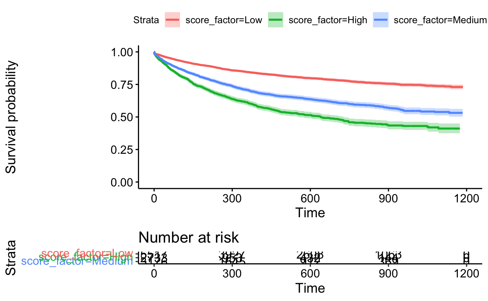
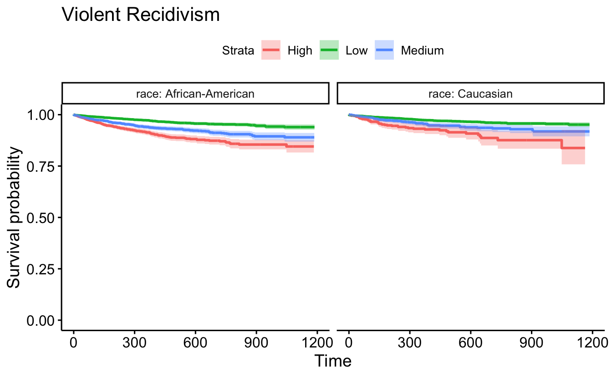
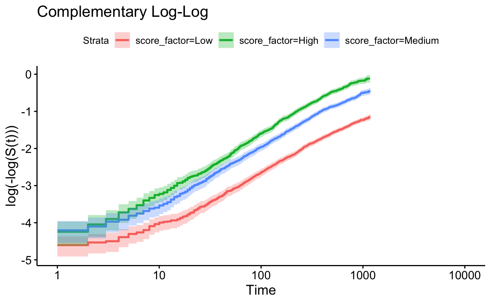
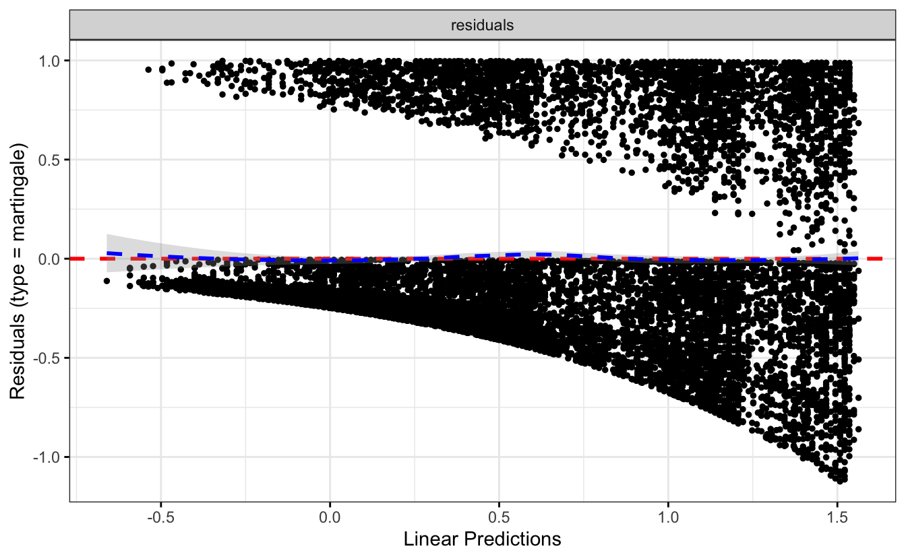

# Survival Analysis


To motivate the technical details which are vital to understanding survival analysis, consider the following example [@gerds].

::: {.example}
In class -- experience the Titanic going down.

-   The Titanic is sinking. How long can you hold your breath?\
-   Every person is sinking and will also be their own time keeper (number of seconds the sinker can hold their breath).\
-   Because the Titanic is sinking slowly, the participants go under water asynchronously (i.e., at different times).\
-   Accrual period will last about a minute.\
-   When I say "stop" (about another minute), everyone should end their time clocks (this is the end of the follow-up period).\
-   Each participant will have a recorded time as well as an indicator as to whether or not they have died.

Based on the data, we would like to calculate:\
1. What is the probability of surviving 40 seconds?\
2. What is the median survival time?\
3. What is the average survival time?
:::

The next example is given in your text [@KuiperSklar (chapter 9)] as part of the motivation for survival analysis.

::: {.example}
Class chocolate melting activity

-   Each student should be randomly assigned to a white or milk chocolate chip (flip a coin)\
-   When the instructor gives approval, students should place either a white or milk chocolate chip into their mouths and record the time until it completely melts.\
-   Treat the study as if it could only be done for a specified period of time (this may require some experimenting, but 60 seconds has worked well). If the actual time is less than 60 seconds, then the actual time will be complete. The student should submit the data (chip color, actual time, censoring status); 1=observed, 0=censored. Any chips that are "swallowed" prior to 60 seconds should be regarded as censored.
:::

Survival analysis is typically done with a prospective study (see censoring below) on a cohort of patients (observational or experimental) to determine some clinical outcome. We will also usually measure covariates of interest: treatment, clinical variables measured at recruitment, etc.

> **Key Point**: the outcome of interest (death, recurrence, etc.) may *not* occur

Possible responses:

-   Outcome of interest occurs\

-   Study ends\

-   The individual can no longer be measured (moves away, etc.)

-   **response** fate *and* length of follow-up\

-   **data** suppose we are following n patients\
    $$
    \begin{align*}
    t_i &= \mbox{time the } i^{th} \mbox{ has event of interest}\\
    m(t) &= \mbox{number of patients for whom } t_i > t \mbox{ (die
    later)}\\
    d(t) &= \mbox{number of patients for whom } t_i \leq t \mbox{
    (die sooner)}\\
    \end{align*}
    $$

## Time-to-event data {#timedata}

### Survival Function

The two main quantities of interest (i.e., *parameters*) are:

$$
\begin{align*}
S(t) &= P(T > t) = \mbox{ probability of surviving until after time } t\\
D(t) &= P(T \leq t) = \mbox{ probability of dying by time } t \ (= F(t))\\
\end{align*}
$$ Where $T$ is a random variable representing the time to event; t is a number.

If $t_i$ is known for all i (no censoring), we can estimate $S(t)$ and $D(t)$ with $$
\begin{align*}
\hat{S}(t)_E &= m(t)/n = \mbox{ proportion alive at time } t\\
\hat{D}(t)_E &= d(t)/n = \mbox{ proportion who have died by time } t\\
\end{align*}
$$

#### censoring

-   **right** censoring: when the observation on an individual begins at a defined starting time and ends before the outcome of interest happens (this is the censoring for our model)\
-   **left** censoring: when the outcome of interest is known to have occurred before the study begins (infection of a disease, learning to count). Note that the event of interest *has happened*, unlike in right censoring where the event of interest has not happened.\
-   **interval** censoring; when the event of interest is only known to have occurred between two time points, but the precise time is not known.

**Important Assumption**: survival time must be independent of any mechanism which causes censoring (called non-informative censoring). Censoring should be random: a person who is censored has the same probability of dying as non-censored people at given explanatory variables $\underline{X}$.

Said differently: within any subgroup of interest, the subjects who are censored at time $t$ should be representative of all the subjects in that subgroup who remained at risk at time $t$ with respect to their survival experience.

-   Not independent

    -   Subjects who drop out because they are extremely ill\
    -   Subjects who drop out because of adverse effects of the treatment regimen\

-   Independent

    -   Subjects who drop out because the study ends\
    -   Subjects who drop out because they move away

::: {.example}
Suppose we have the following melting times (in seconds) of milk chocolate chips for 7 students where the maximum time allowed for the experiment was 60 seconds:

| Student |  1  |  2  |  3  |  4  |  5  |  6  |  7  |
|--------:|:---:|:---:|:---:|:---:|:---:|:---:|:---:|
|    Time | 35  | 30  | 60  | 45  | 25  | 55  | 30  |

To find the estimated proportion of chocolate chips that have not melted after 45 seconds we use the **empirical survival function**, $\hat{S}(45)_E$. $$
\begin{align*}
\hat{S}(45)_E &= \frac{\mbox{number of chips that have not melted
after 45 seconds}}{\mbox{total number of chips in the sample}}\\
&= 2/7 = 0.286\\
\hat{S}(t)_E &= \frac{\mbox{number of individuals yet to experience
the event at time } t}{\mbox{number of individuals in the study}}\\
&= \frac{\mbox{number of event times greater than } t}{\mbox{number
of individuals in the study}}\\
\end{align*}
$$

What if some of the observations are incomplete (i.e., censored)?

| Student |   1    |  2  |   3    |  4  |  5  |  6  |   7    |
|--------:|:------:|:---:|:------:|:---:|:---:|:---:|:------:|
|    Time | $35^+$ | 30  | $60^+$ | 45  | 25  | 55  | $30^+$ |

One way to deal with censored observations is to remove them from the study. We would consider our sample to be only those observations that have complete information.

| Student |  2  |  4  |  5  |  6  |
|--------:|:---:|:---:|:---:|:---:|
|    Time | 30  | 45  | 25  | 55  |

$$
\begin{align*}
\hat{S}(45)_E &= \frac{\mbox{number of chips that have not melted after 45 seconds}}{\mbox{total number of chips in the sample}}\\
&= 1/4 = 0.25\\
\end{align*}
$$
:::

By treating censored observations as complete, we assume that the event times are shorter than what they actually are (thereby underestimating the true probability of survival). By removing the censored observations from the data, we lose information. By treating censored observations as complete we bias the estimate based on the remaining times; by ignoring censored observations, we reduce the power of the inferential model.

## Kaplan-Meier Curves {#KM}

When a data set contains incomplete observations, the best estimator of the survival function is the Kaplan-Meier estimator, $\hat{S}(t)_{KM}$. We'll create a few curves by hand, and then we'll let R make them for us.

$$
\begin{align*}
t_1 < t_2 < \cdots < t_n & \ \mbox{ are the ordered completed times}\\
n_i &= \mbox{number of patients known to be at risk at time (day) } t_i, \mbox{ just before } [t_i, t_{i+1})\\
d_i &= \mbox{number of patients who die at time (day) } t_i, \mbox{ in } [t_i, t_{i+1})\\
\end{align*}
$$

For the patients alive at the beginning of the $t_i^{th}$ time, the probability of surviving that time is $$p_i = \frac{n_i - d_i}{n_i}$$ The probability that a patient survives to time 2 given that they survived to time 1 is $$p_2 = \frac{n_2 - d_2}{n_2}$$ The probability that (at the outset) a patient survives to time 2 is: $$
\begin{align*}
P(T > t_2) &= P(T > t_2 | T > t_1) P(T > t_1)\\
&= \frac{n_1 - d_1}{n_1} \frac{n_2 - d_2}{n_2}
\end{align*}
$$ The probability of surviving the first t days is: $$
\begin{align*}
\hat{S}(t)_{KM} &= \prod_{i:t_i < t} \frac{n_i - d_i}{n_i}\\
&= \prod_{i:t_i < t} p_i\\
\hat{D}(t)_{KM} &= 1 - \hat{S}(t)_{KM}\\
\end{align*}
$$ If there are no deaths at time $t_i$, then $(n_i -d_i) / n_i = 1$.

If there is no censoring at time $t_i$, then $n_i - d_i = n_{i+1}$. The Kaplan-Meier survival curve will be equivalent to the empirical survival curve:

$$
\begin{align*}
\hat{S}(t)_{KM} &= \prod_{i:t_i < t} \frac{n_i - d_i}{n_i}\\
&= \frac{n_1 - d_1}{n_1} \frac{n_2 - d_2}{n_2} \cdots \frac{n_k - d_k}{n_k}\\
&= \frac{m(t)}{n}
\end{align*}
$$ ::: {.example} milk chocolate times by hand.

| $t_i$ | $n_i$ | $d_i$ | $n_i - d_i$ | $\frac{n_i - d_i}{n_i}$ |
|:-----:|:-----:|:-----:|:-----------:|:-----------------------:|
|  25   |   7   |   1   |      6      |       6/7= 0.857        |
|  30   |   6   |   1   |      5      |       5/6 = 0.833       |
|  35   |   4   |   0   |      4      |         4/4 = 1         |
|  45   |   3   |   1   |      2      |       2/3 = 0.667       |
|  55   |   2   |   1   |      1      |         1/2=0.5         |
|  60   |   1   |   0   |      1      |          1/1=1          |

| time interval |      $\hat{S}(t)_{KM}$      |
|:-------------:|:---------------------------:|
|   $[0,25)$    |              1              |
|   $[25,30)$   |            0.857            |
|  $[30, 35)$   | 0.857 $\cdot$ 0.833 = 0.714 |
|   $[35,45)$   |   0.714 $\cdot$ 1 = 0.714   |
|   $[45,55)$   | 0.714 $\cdot$ 0.667 = 0.476 |
|   $[55,60)$   |  0.476 $\cdot$ 0.5 = 0.238  |

:::

### CI for KM curve {#KMCI}

Recall: $\hat{S}(t)_{KM} = \prod_{k:t_k < t} [ (n_k - d_k) / n_k]$.

Because $\hat{S}(t)_{KM}$ is just a product of counts, we can "easily" estimate the SE: $$
\begin{align*}
s^2_{\hat{S}(t)_{KM}} = \hat{S}(t)_{KM}^2 \sum_{k:t_k < t}
\frac{d_k}{n_k(n_k - d_k)}
\end{align*}
$$

Your book uses the above SE and normal theory which does work, particularly with large sample sizes. However, with smaller sample sizes and at the ends of the survival curve (close to zero or one), the sampling distribution of the estimated KM curve will not be normal. Additionally if we try to apply normal theory, we'll get something meaningless because the CI will go outside the bounds of 0 and 1. Fortunately, someone figured out a transformation for us!

$l l \hat{S}(t) = \ln (-\ln \hat{S}(t)_{KM})$ has a much more normal sampling distribution than the sampling distribution of the untransformed estimator $\hat{S}(t)_{KM}$.

$$
\begin{align*}
\hat{\sigma}^2(t) &= SE( l l \hat{S}(t))\\
&= \frac{\sum_{k:t_k < t} \frac{d_k}{n_k(n_k - d_k)}}{\bigg[\sum_{k:t_k < t} \ln ( (n_k - d_k) / n_k) \bigg]^2}
\end{align*}
$$ A 95 % CI for $\ln ( -\ln S(t))$ is $$ll\hat{S}(t) \pm 1.96 \hat{\sigma}(t) \ \ \ \mbox{(a function of
t!!!)}$$

A 95 % CI for $S(t)$ is $$\bigg(\hat{S}(t)_{KM}^{\exp(1.96\hat{\sigma}(t))},
\hat{S}(t)_{KM}^{\exp(-1.96\hat{\sigma}(t))} \bigg)$$

We can also find a CI for $D(t) = 1- S(t)$ using:

$$
\begin{align*}
\bigg(1 - \hat{S}(t)_{KM}^{\exp(-1.96\hat{\sigma}(t))}, 1 -
\hat{S}(t)_{KM}^{\exp(1.96\hat{\sigma}(t))} \bigg)
\end{align*}
$$

##### Derivation of the above confidence intervals. {.unnumbered}

Remember that $\exp(a \cdot b) = (\exp(a))^b$, we'll need that below. A CI is an interval of values that captures the true parameter in 95 of samples. Let's say that the complementary log-log interval from above happens to catch the true value of $S(t)$. Then,

$$
\begin{align*}
ll\hat{S}(t) - 1.96 \hat{\sigma}(t) \leq  & llS(t)  \leq ll\hat{S}(t) + 1.96 \hat{\sigma}(t) \\
\exp(ll\hat{S}(t) - 1.96 \hat{\sigma}(t)) \leq  & -lS(t)  \leq \exp(ll\hat{S}(t) + 1.96 \hat{\sigma}(t)) \\
-l\hat{S}(t)\exp(- 1.96 \hat{\sigma}(t))\leq  &-lS(t)  \leq -l\hat{S}(t)\exp(1.96 \hat{\sigma}(t)) \\
l\hat{S}(t)\exp(- 1.96 \hat{\sigma}(t))\geq  & lS(t)  \geq l\hat{S}(t)\exp(1.96 \hat{\sigma}(t)) \\
l\hat{S}(t)\exp(1.96 \hat{\sigma}(t))\leq  & lS(t)  \leq l\hat{S}(t)\exp(-1.96 \hat{\sigma}(t)) \\
\exp(l\hat{S}(t)\exp(1.96 \hat{\sigma}(t))) \leq  & S(t)  \leq \exp(l\hat{S}(t)\exp(-1.96 \hat{\sigma}(t))) \\
\exp(l\hat{S}(t))^{\exp(1.96 \hat{\sigma}(t))} \leq  & S(t)  \leq \exp(l\hat{S}(t))^{\exp(-1.96 \hat{\sigma}(t))} \\
(\hat{S}(t))^{\exp(1.96 \hat{\sigma}(t))} \leq  & S(t)  \leq (\hat{S}(t))^{\exp(-1.96 \hat{\sigma}(t))}
\end{align*}
$$

#### Mean and Median values

**Mean**

> Mean survival time is estimated as the area under the survival curve. The estimator is based upon the entire range of data. Some software uses only the data up to the last observed event [@SurvHL] point out that this biases the estimate of the mean downwards, and they recommend that the entire range of data be used. A large sample method is used to estimate the variance of the mean survival time and thus to construct a confidence interval [@Andersen]. [@KMmean]

In some ways, it is easier to conceptualize the mean as the average under the curve by thinking about calculating average as horizontal bars instead of vertical bars. The jumps along the y-axis are approximately 1/n, so each horizontal bar represents one of the individual deaths. See the example here: <http://blog.data-miners.com/2010/06/why-is-area-under-survival-curve-equal.html>

$$
\begin{align*}
\hat{\mu} = \left\{
    \begin{array}{ll}
    \sum_{i=0}^{m-1} \hat{S}(t_i)_{KM} (t_{i+1} - t_i) & \mbox{if } t_n = t_m  \mbox{ (last obs is complete)}\\
    \sum_{i=0}^{m-1} \hat{S}(t_i)_{KM} (t_{i+1} - t_i) + \hat{S}(t_m)_{KM}(t_n-t_m) & \mbox{if last obs is censored}
    \end{array}
\right.
\end{align*}
$$

Each entry can be rearranged to be thought of as the proportion of people who die in the interval times the width of the interval: $[\hat{S}(t_{i-1})_{KM} - \hat{S}(t_{i})_{KM}]t_i$. The difference, $[\hat{S}(t_{i-1})_{KM} - \hat{S}(t_{i})_{KM}]$, gives the proportion of individuals who die in that time interval. Therefore, our estimate is a weighted average of the time points $t_i$ where the weight is $[\hat{S}(t_{i-1})_{KM} - \hat{S}(t_{i})_{KM}]$.

$$
\begin{align*}
\hat{\mu} &= \sum_{i=0}^{m-1} \hat{S}(t_i)_{KM}(t_{i+1} - t_i)\\
&= \hat{S}(t_0)_{KM}(t_1 - t_0) + \hat{S}(t_1)_{KM}(t_2 - t_1) + \hat{S}(t_2)_{KM} (t_3 - t_2) + \cdots + \hat{S}(t_{m-1})_{KM} (t_m - t_{m-1}) \\
&= -t_0  \hat{S}(t_0)_{KM} + t_1 ( \hat{S}(t_0)_{KM} -  \hat{S}(t_1)_{KM}) + \cdots + t_{m-1}( \hat{S}(t_{m-2})_{KM} -  \hat{S}(t_{m-1})_{KM}) + t_m  \hat{S}(t_{m-1})_{KM}\\
&= 0 + t_1 ( \hat{S}(t_0)_{KM} -  \hat{S}(t_1)_{KM}) + \cdots + t_{m-1}( \hat{S}(t_{m-2})_{KM} -  \hat{S}(t_{m-1})_{KM}) + t_m ( \hat{S}(t_{m-1})_{KM} - 0)\\
&= \mbox{a weighted average of the times}
\end{align*}
$$

**Median**\
Since the distribution of survival times tend to be positively skewed, the median is often the preferred summary measure of location of the distribution. Once the survivor function has been estimated, it is straightforward to obtain an estimate of the *median survival time*. That is, the time beyond which 50 % of the individuals in the population under study are expected to survive, and is given by the value $t_{(50)}$ such that $S(t_{(50)}) = 0.5$.

$$
\begin{align*}
\hat{t}_{(p)} = \mbox{smallest complete event time, } t_i, \mbox{ in the sample such that } \hat{S}(t_i)_{KM} \leq 1-p/100
\end{align*}
$$

$\hat{S}(t_i)_{KM}$ then gives the time at which at least p % of events have occurred. There are also ways of compute confidence intervals for percentiles. We won't cover those here.

### Log-rank Test {#logrank}

As before, we'd like to know if two treatments produce the same probability of survival (how did we do that with logistic regression? significance of the $\beta$ coefficient). Here: $$
\begin{align*}
H_0: & S_1(t) = S_2(t) \ \ \ \ \ \forall t \mbox{
parameters!}\\
H_1: & S_1(t) \ne S_2(t) \ \ \ \ \ \mbox{ for some } t\\
\end{align*}
$$

We want to test whether the curves are the same over all $t$ (or different at any $t$). Let's consider a particular time, the $j^{th}$ event time (we don't look at the censored times, because we only consider when the curve changes / steps):

|          |      Group 1      |      Group 2      | Total       |
|---------:|:-----------------:|:-----------------:|-------------|
|     died |     $d_{1j}$      |     $d_{2j}$      | $d_j$       |
| survived | $n_{1j} - d_{1j}$ | $n_{2j} - d_{2j}$ | $n_j - d_j$ |
|          |     $n_{1j}$      |     $n_{2j}$      | $n_j$       |

Because it's a $2x2$ table with fixed margins, we only need to consider one group. If survival is similar for the two groups, we'd expect:

$$
\begin{align*}
d_{1j} &\approx \frac{d_j}{n_j}n_{1j}\\
d_{1j} &= \mbox{observed}\\
\frac{d_j}{n_j} n_{1j} &= E(d_{1j} | d_j) = E_{1j} \\
var(d_{1j}) &= \frac{n_{1j} n_{2j} d_j (n_j - d_j)}{n_j^2(n_j-1)}
= V_{1j}\\
\end{align*}
$$ where the variance is derived from the hypergeometric distribution.

To estimate the overall difference between the observed and expected death counts: $$
\begin{align*}
\sum_j d_{1j} - \sum_j E(d_{1j} | d_j) = \sum_j d_{1j} - \sum_j
\frac{d_j}{n_j}n\_{1j}
\end{align*}
$$ The overall variability: $$\sum_j var(d_{1j}|d_j)$$ The test statistic we use to compare the observed and expected frequency of deaths. (Sum over all of the death (or event) times.) $$
\begin{align*}
T = \frac{(|\sum_j d_{1j} - \sum_j E(d_{1j} | d_j)| -
0.5)^2}{\sum_j var(d_{1j}|d_j)} \sim \chi^2_1
\end{align*}
$$

What if we had had $g$ groups (instead of 2)? We would have $g-1$ "death" values. Consider the test statistic above, call it $T_1$. If we had $g$ groups, we would need to sum $T_i, i=1,2, \ldots, g-1$. However, the variances of the $T_i$ would be correlated (because the values must sum to $D_k$)... so the test statistic is slightly more complicated. [@Collett(section 2.6)]

-   The Wilcoxon test is very similar to the log-rank test, but it uses a different derivation for the variance, and therefore a different denominator and test statistic.\
-   The log-rank test is more powerful than the Wilcoxon, but the log-rank test requires the proportional hazards assumption.\
-   Wilcoxon test does not require the proportional hazards assumption, but it does require that one curve is always bigger than the other.\
-   Neither work if the curves cross.\
-   Other technical conditions are that the sample size should be "big enough." The sample size is dependent on the number of deaths. No specific criteria, but the results are asymptotic, so the p-values converge to the actual probabilities as the number of deaths gets larger.

## Hazard Functions {#hazfunc}

Another important idea in survival analysis is the hazard function or instantaneous death rate. Let T be the random variable representing death time. [Your text implicitly redefines $S(t) = P(T \geq t)$ which is inconsistent but not fundamentally problematic.]

$$
\begin{align*}
h(t)&= \lim_{\Delta t \rightarrow 0} \frac{P(\mbox{patient dies by time } t + \Delta t | \mbox{alive at } t)}{\Delta t}\\
 &= \lim_{\Delta t \rightarrow 0} \frac{P(T < t + \Delta t | T \geq t)}{\Delta t}\\
 &= \lim_{\Delta t \rightarrow 0} \frac{P(t \leq T < t + \Delta t | T \geq t)}{\Delta t}\\
 &= \lim_{\Delta t \rightarrow 0} \frac{P(t \leq T < t + \Delta t )}{P(T \geq t) \Delta t}\\
 &= \lim_{\Delta t \rightarrow 0} \frac{S(t) - S(t + \Delta t)}{S(t) \Delta t}\\
 &= \lim_{\Delta t \rightarrow 0} -\frac{S(t + \Delta t) - S(t)}{\Delta t}\frac{1}{S(t)}\\
 &= -S'(t) \frac{1}{S(t)}\\
 &= -\frac{d}{dt} \ln(S(t))\\
S(t) &= \exp \{ - \int^t_0 h(x) dx  \}\\
\end{align*}
$$

How do different functions of $h$ affect the survival curve, $S$?

$$
\begin{align*}
h(t) = 0 &&\Rightarrow \mbox{ no risk of death at time } t\\
&& \Rightarrow S(t) \mbox{ is flat at } t\\
h(t) \> \>&& \Rightarrow S(t) \mbox{ is rapidly declining in } t\\
h(t) =k && \Rightarrow S(t) = e^{-kt}
\end{align*}
$$

#### hazard function as a constant

If $h(t) =k \rightarrow S(t) = e^{-kt}$.

Plots of different hazard functions and their corresponding survival functions.


### Estimating $h(t)$ ala Kaplan-Meier

$h(t)$ is the rate at which individuals in the population experience the event in the next *instant* of time, conditional on surviving to time $t$. The estimated hazard curve can only extend to the last complete event time, otherwise the denominator is infinitely large. Also, keep in mind that $h(t)$ is very hard to estimate, and $\hat{h}_{KM}(t)$ can be erratic.

$$
\begin{align*}
\hat{P}(t_i \leq T < t_{i+1} | T \geq t_i) &= \frac{d_i}{n_i} = \hat{p}_i\\
\hat{h}_{KM}(t) &= \frac{\hat{p}_i}{t_{i+1} - t_i}  \ \ \ \ \ \ t_{i+1} \leq t < t_i\\
\end{align*}
$$

### Proportional Hazards

Suppose that $h_0(t)$ and $h_1(t)$ are the hazard functions for patients on control and experimental treatments. The two groups have {\sc proportional hazards} if $h_1(t) = R h_0(t)$ for some constant R: $$\frac{h_1(t)}{h_0(t)} = R \ \ \ \ \ \forall t$$ R is called the **hazard ratio**. $h_0(t)$ can be anything as long as $h_1(t)$ is proportional. Note in the pictures below that no one dies between 3 and 7 days, the survival curves are flat over that interval.


Consider the notion of risk of death: $$
\begin{align*}
\mbox{risk of death by } t + \Delta t \mbox{ given alive at } t=
\left\{
\begin{array}{ll}
h_0(t) \Delta t & \mbox{control}\\
h_1(t) \Delta t & \mbox{experiment}
\end{array}
\right.
\end{align*}
$$

$$
\begin{align*}
\frac{\mbox{risk of dying for experim}}{\mbox{risk of dying control}} = \frac{h_1(t) \Delta t}{h_0(t) \Delta t} = \frac{h_1(t) }{h_0(t) } = R
\end{align*}
$$Ratio of hazard functions can be thought of as the **instantaneous relative risk** (i.e., at a time $t$).

### Cox PH Regression Analysis {#coxph}

#### Simple proportional hazards model

ASSUMING proportional hazards! Let $h_0(t)$ be the hazard function for the control group. $x_i$ =1 if the $i^{th}$ patient receives treatment; 0 if the $i^{th}$ patient receives the control. A big value of $\beta$ means that the event is more likely to happen.

$$
\begin{align*}
h_i(t) &= h_0(t) e^{\beta x_i} = \left\{
\begin{array}{ll}
h_0(t) e^\beta & \mbox{experim}\\
h_0(t) & \mbox{control}
\end{array}
\right.\\
\mbox{inst. RR} &= \frac{h_0(t) e^\beta}{h_0(t)} = e^\beta\\
S_i(t) &= (S_0(t))^{e^\beta}\\
\end{align*}
$$ We don't yet know how to run this model and estimate the parameters, but still, we can probably do it. Right? We run a **Cox proportional hazards model**, get $b$, and estimate the HR using: $\widehat{HR} = e^{b}$! It turns out that for large samples (as with logistic regression, the CI and tests below are again called Wald CI and tests),

$$
\begin{align*}
b \sim N: & \\
& 95\% \mbox{ CI for } \beta: b \pm 1.96 SE(b)\\
& 95\% \mbox{ CI for } HR: (e^{b - 1.96 SE(b)}, e^{b + 1.96 SE(b)})\\
\end{align*}
$$ And we can test HR by using $\beta$: $$
\begin{align*}
H_0: \ & \beta=0 \iff HR = 1\\
Z &= \frac{b - 0 }{SE(b)}
\end{align*}
$$

#### Estimating the proportional hazards coefficients

The main point of proportional hazards is that if we have proportional hazards, then we don't actually need to know the hazard function in order to estimate the coefficients which affect the survival function. [We divide out the hazard function.]

Intervals between death times convey no information about the relationship between hazard and explanatory variables (including treatment). We are also assuming that we have no ties for our death times. [Importantly, we assume that the proportional hazards assumption holds over *all* $t$.]

$$
\begin{align*}
P(i^{th} \mbox{ indiv, w/}x_i, \mbox{ dies at } t_i | \mbox{one death at } t_i) &= \frac{P(i^{th} \mbox{ indiv w/}x_i \mbox{ dies at } t_i )}{P(\mbox{at least one death at } t_i)}\\
&= \frac{\mbox{hazard at } t_i}{\mbox{sum over all patients at risk at time } t_i}\\
&= \frac{h_i(t_i)}{\sum_{k:t_k \geq t_i} h_k (t_i)} \\
&= \frac{e^{\beta x_i}}{\sum_{k:t_k \geq t_i} e^{\beta x_k}}
\end{align*}
$$ As with logistic regression (and linear regression!) we'll use maximum likelihood to estimate the parameter(s). (The product is over only patients who have death times recorded, not censored times).

$$
\begin{align*}
L(\beta) &= \prod_{i=1}^r \frac{e^{\beta x_i}}{\sum_{k:t_k
\geq t_i} e^{\beta x_k}}\\
\delta_i &= \left\{\begin{array}{ll}
1 & \mbox{death}\\
0 & \mbox{censored}
\end{array}
\right.\\
L(\beta) &= \prod_{i=1}^n \Bigg( \frac{e^{\beta
x_i}}{\sum_{k:t_k \geq t_i} e^{\beta x_k}} \Bigg)^{\delta_i}\\
\ln L(\beta) &= \sum_{i=1}^n \delta_i \bigg[ \beta x_i - \ln
(\sum_{k:t_k \geq t_i} e^{\beta x_k}) \bigg]
\end{align*}
$$ $b$ is found using numerical methods (as it was with logistic regression).

::: {.example}
Consider the following data from a prostate cancer study. The study was performed as a randomized clinical trail to compare treatments for prostatic cancer, and was begun in 1967 by the Veteran's Administration Cooperative Urological Research Group. The trial was double blind and two of the treatments used were a placebo and 1.0 mg of diethylstilbestrol (DES). The time origin of the study is the date on which a patient was randomized to a treatment, and the end-point is the death of the patient from prostate cancer. The full data set is given in @AndHerz, but the data used in this example are from patients presenting with Stage III cancer and given in @Collett (page 8).


```r
library(survival)
prostate <- readr::read_csv("PROSTATE.csv")
head(prostate)
#> # A tibble: 6 × 7
#>   Treatment  Time Status   Age  Haem  Size Gleason
#>       <dbl> <dbl>  <dbl> <dbl> <dbl> <dbl>   <dbl>
#> 1         1    65      0    67  13.4    34       8
#> 2         2    61      0    60  14.6     4      10
#> 3         2    60      0    77  15.6     3       8
#> 4         1    58      0    64  16.2     6       9
#> 5         2    51      0    65  14.1    21       9
#> 6         1    51      0    61  13.5     8       8

coxph(Surv(Time,Status) ~ Treatment, data = prostate)
#> Call:
#> coxph(formula = Surv(Time, Status) ~ Treatment, data = prostate)
#> 
#>           coef exp(coef) se(coef)  z    p
#> Treatment -2.0       0.1      1.1 -2 0.07
#> 
#> Likelihood ratio test=5  on 1 df, p=0.03
#> n= 38, number of events= 6

coxph(Surv(Time,Status) ~ Treatment, data = prostate) %>% tidy()
#> # A tibble: 1 × 5
#>   term      estimate std.error statistic p.value
#>   <chr>        <dbl>     <dbl>     <dbl>   <dbl>
#> 1 Treatment    -1.98      1.10     -1.80  0.0717
coxph(Surv(Time,Status) ~ Treatment, data = prostate) %>% glance()
#> # A tibble: 1 × 18
#>       n nevent statist…¹ p.val…² stati…³ p.val…⁴ stati…⁵ p.val…⁶ stati…⁷ p.val…⁸
#>   <int>  <dbl>     <dbl>   <dbl>   <dbl>   <dbl>   <dbl>   <dbl>   <dbl>   <dbl>
#> 1    38      6      4.55  0.0329    4.42  0.0355    3.24  0.0717      NA      NA
#> # … with 8 more variables: r.squared <dbl>, r.squared.max <dbl>,
#> #   concordance <dbl>, std.error.concordance <dbl>, logLik <dbl>, AIC <dbl>,
#> #   BIC <dbl>, nobs <int>, and abbreviated variable names ¹​statistic.log,
#> #   ²​p.value.log, ³​statistic.sc, ⁴​p.value.sc, ⁵​statistic.wald, ⁶​p.value.wald,
#> #   ⁷​statistic.robust, ⁸​p.value.robust
#> # ℹ Use `colnames()` to see all variable names
```

-   **Note 1**: There is no intercept in the linear component of the model (i.e., there is no $\beta_0$ or $b_0).$ The baseline estimate (usually the role of the "intercept") is contained within the $h_0(t)$ parameter.\

-   **Note 2**: Nowhere have we made any assumptions about the form of $h_0(t)$.\

-   **Note 3**: To estimate $h_0(t)$, we use the pointwise values (here for the control group only to get $h_0),$ just like Kaplan-Meier plots $(\tau_j = t_{(j+1)} - t_j):$ $$h_0(t_j) = \frac{d_j}{n_j \tau_j}$$ If there are covariates, the estimation gets much more complicated.\

-   **Note 4**: The logrank statistic can be derived as the score test for the Cox proportional hazards model comparing two groups. It is therefore approximately equivalent to the likelihood ratio test statistics from that model [@Collett (section 3.9, page 102-106)]. Additionally, the log-rank test is most powerful against the alternative that the hazard of death at any given time for an individual in one group is proportional to the hazard at that time for a similar individual in the other group (i.e., the proportional hazards assumption). [@Collett (section 2.5.4, pg 44-45)] $$
    \begin{align*}
    H_0:\ &h_1(t) = h_2(t)\\
    H_1:\ &h_1(t) = R h_2(t)
    \end{align*}
    $$

-   **Note 5**: You need proportional hazards to do the *inference* (otherwise your p-values are meaningless!). The technical assumptions for the Cox Proportional Hazards model are:

    -   Observations are independent (this is almost always an important assumption in all of statistical inference)\
    -   Proportional hazards: the hazard ratios are not dependent on time.\
    -   Independent censoring: the censored observations have the same survival prospects as the non-censored participants.\
:::

#### Cox PH Multiple Regression Analysis {#multcoxph}

Extending the simple proportional hazards model to include multiple covariates.

Let $x_{i1}, x_{i2}, \ldots, x_{iq}$ be the $q$ covariates for person $i$. We define the baseline hazard as: $$
\begin{align*}
h_0(t) &= \mbox{hazard for patients with covariates }
x_{i1}=x_{i2}=\cdots=x_{iq} = 0\\
h_i(t) &= h_0(t) e^{\beta_1 x_{i1} + \beta_2 x_{i2} + \cdots +
\beta_q x_{iq}}\\
\end{align*}
$$ is the hazard function for the $i^{th}$ patient.

As before, we can consider nested models and compare their likelihoods.

$$
\begin{align*}
-2 \ln \frac{L_{\mbox{reduced model}}}{L_{\mbox{full model}}}
&\sim \chi^2_{\Delta p}\\
& \\
2 \bigg( \ln L_{\mbox{full model}} - \ln L_{\mbox{reduced model}} \bigg) &=
\mbox{test stat}\\
\end{align*}
$$

::: {.example}
**Framingham Heart Study** [example @Dupont (section 3.10)] Long-term follow-up and cardiovascular risk factor data on almost 5000 residents of the town of Framingham, MA. Recruitment started in 1948 (went for 40+ years). These data are 4699 patients who were free of coronary heart disease at their baseline exam [@framingham]:

| variable |     | code                                                   |
|----------|:---:|--------------------------------------------------------|
| sex      |  =  | gender coded as                                        |
|          |     | 1=if subject is male                                   |
|          |     | 0= if subject is female                                |
| sbp      |  =  | systolic blood pressure (SBP) in mm Hg                 |
| dbp      |  =  | diastolic blood pressure (DBP) in mm Hg                |
| scl      |  =  | serum cholesterol (SCL) in mg/100ml                    |
| chdfate  |  =  | 1= if the patient develops CHD at the end of follow-up |
|          |     | 0= otherwise                                           |
| followup |  =  | the subject's follow-up in days                        |
| age      |  =  | age in years                                           |
| bmi      |  =  | body mass index (BMI) =weight/height$^2$ in kg/m$^2$   |
| month    |  =  | month of year in which baseline exam occurred          |
| id       |  =  | a patient identification variable (numbered 1 to 4699) |

We look at the K-M survival curves broken down by diastolic blood pressure. The logrank statistic comparing all 7 groups is highly significant ($p < 10^{-52}$), and the pairwise logrank tests for adjacent pairs of risk groups are also all significant (though be careful with multiple comparisons!).
:::


```r
heart <- readr::read_csv("framingham.csv")

heart <- heart %>% 
  mutate(dbpf = case_when(
    dbp <= 60 ~ "under60",
    dbp <=70 ~ "60-70",
    dbp <= 80 ~ "70-80",
    dbp <=90 ~ "80-90",
    dbp <=100 ~ "90-100",
    dbp <=110 ~ "100-110",
    TRUE ~ "over110")) %>%
  mutate(dbpf = factor(dbpf,
                       levels = c("under60", "60-70", "70-80","80-90", "90-100","100-110","over110")),
         sex = case_when(
           sex == 1 ~ "male", 
           TRUE ~ "female"))
```

$$
\begin{align*}
dbp_{ij} &= \left\{
\begin{array}{ll}
1 & \mbox{if the } i^{th} \mbox{ patient is in DBP group } j\\
0 & \mbox{otherwise}
\end{array}
\right.\\
male_i &= \left\{
\begin{array}{ll}
1 & \mbox{if the } i^{th} \mbox{ patient is male}\\
0 & \mbox{if the } i^{th} \mbox{ patient is female}\\
\end{array}
\right.\\
\end{align*}
$$

-   **Table 7.1**\
    Using a proportional hazards model for estimating the hazard ratio associated with each blood pressure group, we get: $$
    \begin{align*}
    h_i(t) &= h_0(t) \exp \bigg\{ \beta_2 dbp_{i2} + \beta_3 dbp_{i3} + \beta_4 dbp_{i4} + \beta_5 dbp_{i5} + \beta_6 dbp_{i6} + \beta_7 dbp_{i7} \bigg\}\\ 
    h_i(t) &= h0(t) \exp \bigg\{ \sum_{j=2}^7 \beta_j dbp_{ij} \bigg\} 
    \end{align*}
    $$

We can use the model with dbp as categorical to check whether dbp could be used as a continuous variable. Indeed, it seems that the model is linear (in ln(HR)) with respect to `dbp`. What we see (in the linearity) is that the hazard ratio for an increase in 10 dbp is constant regardless of the actual value of `dbp`. Indeed, it seems like the hazard ratio for a 10 unit increase in `dbp` is roughly $e^{0.3}$ regardless of the value of `dbp`. When the model is run on `dbp` as a continuous variable (instead of as groups) we **also** see that the hazard ratio associated with a 10 unit increase in `dbp` is $e^{0.3}$.

One reason, however, to keep the variable broken into groups is because of the way the results are nicely laid out for each group.


```r
coxph(Surv(followup,chdfate) ~ dbpf, data = heart) %>% tidy() %>%
  kable(caption = "coefficients for Cox PH with dpb categorical.",
        digits = 3) %>%
  kable_styling()
```

<table class="table" style="margin-left: auto; margin-right: auto;">
<caption>(\#tab:unnamed-chunk-6)coefficients for Cox PH with dpb categorical.</caption>
 <thead>
  <tr>
   <th style="text-align:left;"> term </th>
   <th style="text-align:right;"> estimate </th>
   <th style="text-align:right;"> std.error </th>
   <th style="text-align:right;"> statistic </th>
   <th style="text-align:right;"> p.value </th>
  </tr>
 </thead>
<tbody>
  <tr>
   <td style="text-align:left;"> dbpf60-70 </td>
   <td style="text-align:right;"> 0.677 </td>
   <td style="text-align:right;"> 0.247 </td>
   <td style="text-align:right;"> 2.74 </td>
   <td style="text-align:right;"> 0.006 </td>
  </tr>
  <tr>
   <td style="text-align:left;"> dbpf70-80 </td>
   <td style="text-align:right;"> 0.939 </td>
   <td style="text-align:right;"> 0.241 </td>
   <td style="text-align:right;"> 3.90 </td>
   <td style="text-align:right;"> 0.000 </td>
  </tr>
  <tr>
   <td style="text-align:left;"> dbpf80-90 </td>
   <td style="text-align:right;"> 1.117 </td>
   <td style="text-align:right;"> 0.241 </td>
   <td style="text-align:right;"> 4.64 </td>
   <td style="text-align:right;"> 0.000 </td>
  </tr>
  <tr>
   <td style="text-align:left;"> dbpf90-100 </td>
   <td style="text-align:right;"> 1.512 </td>
   <td style="text-align:right;"> 0.243 </td>
   <td style="text-align:right;"> 6.22 </td>
   <td style="text-align:right;"> 0.000 </td>
  </tr>
  <tr>
   <td style="text-align:left;"> dbpf100-110 </td>
   <td style="text-align:right;"> 1.839 </td>
   <td style="text-align:right;"> 0.254 </td>
   <td style="text-align:right;"> 7.23 </td>
   <td style="text-align:right;"> 0.000 </td>
  </tr>
  <tr>
   <td style="text-align:left;"> dbpfover110 </td>
   <td style="text-align:right;"> 2.247 </td>
   <td style="text-align:right;"> 0.271 </td>
   <td style="text-align:right;"> 8.29 </td>
   <td style="text-align:right;"> 0.000 </td>
  </tr>
</tbody>
</table>

```r

coxph(Surv(followup,chdfate) ~ dbp, data = heart) %>% tidy() %>%
  kable(caption = "coefficients for Cox PH with dpb numeric",
        digits = 3) %>%
  kable_styling()
```

<table class="table" style="margin-left: auto; margin-right: auto;">
<caption>(\#tab:unnamed-chunk-6)coefficients for Cox PH with dpb numeric</caption>
 <thead>
  <tr>
   <th style="text-align:left;"> term </th>
   <th style="text-align:right;"> estimate </th>
   <th style="text-align:right;"> std.error </th>
   <th style="text-align:right;"> statistic </th>
   <th style="text-align:right;"> p.value </th>
  </tr>
 </thead>
<tbody>
  <tr>
   <td style="text-align:left;"> dbp </td>
   <td style="text-align:right;"> 0.032 </td>
   <td style="text-align:right;"> 0.002 </td>
   <td style="text-align:right;"> 16.3 </td>
   <td style="text-align:right;"> 0 </td>
  </tr>
</tbody>
</table>

```r

coxph(Surv(followup,chdfate) ~ dbpf, data = heart) %>% glance() %>%
  kable(caption = "glance for Cox PH with dpb categorical.",
        digits = 2) %>%
  kable_styling()
```

<table class="table" style="margin-left: auto; margin-right: auto;">
<caption>(\#tab:unnamed-chunk-6)glance for Cox PH with dpb categorical.</caption>
 <thead>
  <tr>
   <th style="text-align:right;"> n </th>
   <th style="text-align:right;"> nevent </th>
   <th style="text-align:right;"> statistic.log </th>
   <th style="text-align:right;"> p.value.log </th>
   <th style="text-align:right;"> statistic.sc </th>
   <th style="text-align:right;"> p.value.sc </th>
   <th style="text-align:right;"> statistic.wald </th>
   <th style="text-align:right;"> p.value.wald </th>
   <th style="text-align:right;"> statistic.robust </th>
   <th style="text-align:right;"> p.value.robust </th>
   <th style="text-align:right;"> r.squared </th>
   <th style="text-align:right;"> r.squared.max </th>
   <th style="text-align:right;"> concordance </th>
   <th style="text-align:right;"> std.error.concordance </th>
   <th style="text-align:right;"> logLik </th>
   <th style="text-align:right;"> AIC </th>
   <th style="text-align:right;"> BIC </th>
   <th style="text-align:right;"> nobs </th>
  </tr>
 </thead>
<tbody>
  <tr>
   <td style="text-align:right;"> 4699 </td>
   <td style="text-align:right;"> 1473 </td>
   <td style="text-align:right;"> 222 </td>
   <td style="text-align:right;"> 0 </td>
   <td style="text-align:right;"> 260 </td>
   <td style="text-align:right;"> 0 </td>
   <td style="text-align:right;"> 237 </td>
   <td style="text-align:right;"> 0 </td>
   <td style="text-align:right;">  </td>
   <td style="text-align:right;">  </td>
   <td style="text-align:right;"> 0.05 </td>
   <td style="text-align:right;"> 0.99 </td>
   <td style="text-align:right;"> 0.61 </td>
   <td style="text-align:right;"> 0.01 </td>
   <td style="text-align:right;"> -11724 </td>
   <td style="text-align:right;"> 23460 </td>
   <td style="text-align:right;"> 23492 </td>
   <td style="text-align:right;"> 4699 </td>
  </tr>
</tbody>
</table>

<div class="figure" style="text-align: center">

<p class="caption">(\#fig:unnamed-chunk-7)Table 7.1 from @Dupont.</p>
</div>


-   **Table 7.2**\
    As our next step, we can consider adding gender as a *multiplicative effect* to our model. $$
    \begin{align*}
    h_i(t) &= h_0(t) \exp \bigg\{ \sum_{j=2}^7 \beta_j
    dbp_{ij} + \gamma male_i \bigg\}
    \end{align*}
    $$ We say the effects are multiplicative because we are adding in the exponent, so any effect due to gender will be multiplied with the effect due to dbp. How do we tell - from the results - that interaction wasn't modeled? Look at the hazard ratios, are they consistent when comparing one variable and keeping the other one constant? That is, check to see if the HR for two different levels of dbp is the same regardless of whether men or women are considered.

    -   The change in deviance is 133 ($H_0: \gamma =0$), so with one degree of freedom, the p-value is very small. We do not think that $\gamma=0$, so we need gender in the model.


```r
coxph(Surv(followup,chdfate) ~ sex + dbpf, data = heart) %>% 
  tidy() %>%
  kable(caption = "coefficients for Cox PH with sex and dpb categorical.",
        digits = 3) %>%
  kable_styling()
```

<table class="table" style="margin-left: auto; margin-right: auto;">
<caption>(\#tab:unnamed-chunk-8)coefficients for Cox PH with sex and dpb categorical.</caption>
 <thead>
  <tr>
   <th style="text-align:left;"> term </th>
   <th style="text-align:right;"> estimate </th>
   <th style="text-align:right;"> std.error </th>
   <th style="text-align:right;"> statistic </th>
   <th style="text-align:right;"> p.value </th>
  </tr>
 </thead>
<tbody>
  <tr>
   <td style="text-align:left;"> sexmale </td>
   <td style="text-align:right;"> 0.606 </td>
   <td style="text-align:right;"> 0.053 </td>
   <td style="text-align:right;"> 11.49 </td>
   <td style="text-align:right;"> 0.000 </td>
  </tr>
  <tr>
   <td style="text-align:left;"> dbpf60-70 </td>
   <td style="text-align:right;"> 0.648 </td>
   <td style="text-align:right;"> 0.247 </td>
   <td style="text-align:right;"> 2.62 </td>
   <td style="text-align:right;"> 0.009 </td>
  </tr>
  <tr>
   <td style="text-align:left;"> dbpf70-80 </td>
   <td style="text-align:right;"> 0.888 </td>
   <td style="text-align:right;"> 0.241 </td>
   <td style="text-align:right;"> 3.69 </td>
   <td style="text-align:right;"> 0.000 </td>
  </tr>
  <tr>
   <td style="text-align:left;"> dbpf80-90 </td>
   <td style="text-align:right;"> 1.022 </td>
   <td style="text-align:right;"> 0.241 </td>
   <td style="text-align:right;"> 4.24 </td>
   <td style="text-align:right;"> 0.000 </td>
  </tr>
  <tr>
   <td style="text-align:left;"> dbpf90-100 </td>
   <td style="text-align:right;"> 1.401 </td>
   <td style="text-align:right;"> 0.243 </td>
   <td style="text-align:right;"> 5.76 </td>
   <td style="text-align:right;"> 0.000 </td>
  </tr>
  <tr>
   <td style="text-align:left;"> dbpf100-110 </td>
   <td style="text-align:right;"> 1.785 </td>
   <td style="text-align:right;"> 0.254 </td>
   <td style="text-align:right;"> 7.01 </td>
   <td style="text-align:right;"> 0.000 </td>
  </tr>
  <tr>
   <td style="text-align:left;"> dbpfover110 </td>
   <td style="text-align:right;"> 2.217 </td>
   <td style="text-align:right;"> 0.271 </td>
   <td style="text-align:right;"> 8.18 </td>
   <td style="text-align:right;"> 0.000 </td>
  </tr>
</tbody>
</table>

```r
  
coxph(Surv(followup,chdfate) ~ sex + dbpf, data = heart) %>% 
  glance() %>%
  kable(caption = "glance for Cox PH with sex and dpb categorical.",
        digits = 2) %>%
  kable_styling()
```

<table class="table" style="margin-left: auto; margin-right: auto;">
<caption>(\#tab:unnamed-chunk-8)glance for Cox PH with sex and dpb categorical.</caption>
 <thead>
  <tr>
   <th style="text-align:right;"> n </th>
   <th style="text-align:right;"> nevent </th>
   <th style="text-align:right;"> statistic.log </th>
   <th style="text-align:right;"> p.value.log </th>
   <th style="text-align:right;"> statistic.sc </th>
   <th style="text-align:right;"> p.value.sc </th>
   <th style="text-align:right;"> statistic.wald </th>
   <th style="text-align:right;"> p.value.wald </th>
   <th style="text-align:right;"> statistic.robust </th>
   <th style="text-align:right;"> p.value.robust </th>
   <th style="text-align:right;"> r.squared </th>
   <th style="text-align:right;"> r.squared.max </th>
   <th style="text-align:right;"> concordance </th>
   <th style="text-align:right;"> std.error.concordance </th>
   <th style="text-align:right;"> logLik </th>
   <th style="text-align:right;"> AIC </th>
   <th style="text-align:right;"> BIC </th>
   <th style="text-align:right;"> nobs </th>
  </tr>
 </thead>
<tbody>
  <tr>
   <td style="text-align:right;"> 4699 </td>
   <td style="text-align:right;"> 1473 </td>
   <td style="text-align:right;"> 355 </td>
   <td style="text-align:right;"> 0 </td>
   <td style="text-align:right;"> 397 </td>
   <td style="text-align:right;"> 0 </td>
   <td style="text-align:right;"> 369 </td>
   <td style="text-align:right;"> 0 </td>
   <td style="text-align:right;">  </td>
   <td style="text-align:right;">  </td>
   <td style="text-align:right;"> 0.07 </td>
   <td style="text-align:right;"> 0.99 </td>
   <td style="text-align:right;"> 0.65 </td>
   <td style="text-align:right;"> 0.01 </td>
   <td style="text-align:right;"> -11657 </td>
   <td style="text-align:right;"> 23329 </td>
   <td style="text-align:right;"> 23366 </td>
   <td style="text-align:right;"> 4699 </td>
  </tr>
</tbody>
</table>


<div class="figure" style="text-align: center">

<p class="caption">(\#fig:unnamed-chunk-9)Table 7.2 from @Dupont.</p>
</div>


-   **Table 7.3** Considering gender and dbp interacting. $$
    \begin{align*}
    h_i(t) &= h_0(t) \exp \bigg\{ \sum_{j=2}^7 \beta_j
    dbp_{ij} + \gamma male_i + \sum_{j=2}^7 \delta_j dbp_{ij}
    male_i \bigg\}
    \end{align*}
    $$

    -   The change in deviance is 21.23 ($H_0: \delta_j =0$), so with six degrees of freedom, the p-value is 0.002. The evidence of interaction is statistically significant.\
    -   The individual p-values associated with each of the interaction coefficients are all big!  Are the two sets of p-values inconsistent?  No, they test different things!  The likelihood ratio test is assessing whether **all** of the interaction terms can be dropped (answer: no).  The individual coefficient p-values assess whether that single variable can be dropped when everything else is in the model (answer: yes).  One way to figure out which interaction term is driving the model is to look at each level separately.  That is, create a binary variable for only one of the levels and model that variable with interaction.  As such, note that "80-90" is quite significant as a variable interacting with gender (model not shown).
    -   Note the marked differences between the estimates in table 7.2 and 7.3. The interactive model indicates that the effect of gender on the risk of CHD is greatest for people with low or moderate blood pressure and diminishes as blood pressure rises. Gender appears to have no effect on CHD for people with a DBP above 110 mm Hg.


```r
coxph(Surv(followup,chdfate) ~ sex*dbpf, data = heart) %>% 
  tidy() %>%
  kable(caption = "coefficients for Cox PH with sex and dpb categorical interacting.",
        digits = 3) %>%
  kable_styling()
```

<table class="table" style="margin-left: auto; margin-right: auto;">
<caption>(\#tab:unnamed-chunk-10)coefficients for Cox PH with sex and dpb categorical interacting.</caption>
 <thead>
  <tr>
   <th style="text-align:left;"> term </th>
   <th style="text-align:right;"> estimate </th>
   <th style="text-align:right;"> std.error </th>
   <th style="text-align:right;"> statistic </th>
   <th style="text-align:right;"> p.value </th>
  </tr>
 </thead>
<tbody>
  <tr>
   <td style="text-align:left;"> sexmale </td>
   <td style="text-align:right;"> 0.864 </td>
   <td style="text-align:right;"> 0.471 </td>
   <td style="text-align:right;"> 1.833 </td>
   <td style="text-align:right;"> 0.067 </td>
  </tr>
  <tr>
   <td style="text-align:left;"> dbpf60-70 </td>
   <td style="text-align:right;"> 0.603 </td>
   <td style="text-align:right;"> 0.352 </td>
   <td style="text-align:right;"> 1.714 </td>
   <td style="text-align:right;"> 0.087 </td>
  </tr>
  <tr>
   <td style="text-align:left;"> dbpf70-80 </td>
   <td style="text-align:right;"> 0.887 </td>
   <td style="text-align:right;"> 0.342 </td>
   <td style="text-align:right;"> 2.596 </td>
   <td style="text-align:right;"> 0.009 </td>
  </tr>
  <tr>
   <td style="text-align:left;"> dbpf80-90 </td>
   <td style="text-align:right;"> 1.258 </td>
   <td style="text-align:right;"> 0.341 </td>
   <td style="text-align:right;"> 3.683 </td>
   <td style="text-align:right;"> 0.000 </td>
  </tr>
  <tr>
   <td style="text-align:left;"> dbpf90-100 </td>
   <td style="text-align:right;"> 1.546 </td>
   <td style="text-align:right;"> 0.347 </td>
   <td style="text-align:right;"> 4.458 </td>
   <td style="text-align:right;"> 0.000 </td>
  </tr>
  <tr>
   <td style="text-align:left;"> dbpf100-110 </td>
   <td style="text-align:right;"> 2.033 </td>
   <td style="text-align:right;"> 0.358 </td>
   <td style="text-align:right;"> 5.672 </td>
   <td style="text-align:right;"> 0.000 </td>
  </tr>
  <tr>
   <td style="text-align:left;"> dbpfover110 </td>
   <td style="text-align:right;"> 2.612 </td>
   <td style="text-align:right;"> 0.372 </td>
   <td style="text-align:right;"> 7.023 </td>
   <td style="text-align:right;"> 0.000 </td>
  </tr>
  <tr>
   <td style="text-align:left;"> sexmale:dbpf60-70 </td>
   <td style="text-align:right;"> 0.057 </td>
   <td style="text-align:right;"> 0.495 </td>
   <td style="text-align:right;"> 0.115 </td>
   <td style="text-align:right;"> 0.908 </td>
  </tr>
  <tr>
   <td style="text-align:left;"> sexmale:dbpf70-80 </td>
   <td style="text-align:right;"> -0.038 </td>
   <td style="text-align:right;"> 0.482 </td>
   <td style="text-align:right;"> -0.079 </td>
   <td style="text-align:right;"> 0.937 </td>
  </tr>
  <tr>
   <td style="text-align:left;"> sexmale:dbpf80-90 </td>
   <td style="text-align:right;"> -0.458 </td>
   <td style="text-align:right;"> 0.482 </td>
   <td style="text-align:right;"> -0.951 </td>
   <td style="text-align:right;"> 0.342 </td>
  </tr>
  <tr>
   <td style="text-align:left;"> sexmale:dbpf90-100 </td>
   <td style="text-align:right;"> -0.296 </td>
   <td style="text-align:right;"> 0.487 </td>
   <td style="text-align:right;"> -0.608 </td>
   <td style="text-align:right;"> 0.543 </td>
  </tr>
  <tr>
   <td style="text-align:left;"> sexmale:dbpf100-110 </td>
   <td style="text-align:right;"> -0.508 </td>
   <td style="text-align:right;"> 0.509 </td>
   <td style="text-align:right;"> -0.999 </td>
   <td style="text-align:right;"> 0.318 </td>
  </tr>
  <tr>
   <td style="text-align:left;"> sexmale:dbpfover110 </td>
   <td style="text-align:right;"> -0.913 </td>
   <td style="text-align:right;"> 0.549 </td>
   <td style="text-align:right;"> -1.661 </td>
   <td style="text-align:right;"> 0.097 </td>
  </tr>
</tbody>
</table>

```r
  
coxph(Surv(followup,chdfate) ~ sex*dbpf, data = heart) %>% 
  glance() %>%
  kable(caption = "glance for Cox PH with sex and dpb categorical interacting.",
        digits = 2) %>%
  kable_styling()
```

<table class="table" style="margin-left: auto; margin-right: auto;">
<caption>(\#tab:unnamed-chunk-10)glance for Cox PH with sex and dpb categorical interacting.</caption>
 <thead>
  <tr>
   <th style="text-align:right;"> n </th>
   <th style="text-align:right;"> nevent </th>
   <th style="text-align:right;"> statistic.log </th>
   <th style="text-align:right;"> p.value.log </th>
   <th style="text-align:right;"> statistic.sc </th>
   <th style="text-align:right;"> p.value.sc </th>
   <th style="text-align:right;"> statistic.wald </th>
   <th style="text-align:right;"> p.value.wald </th>
   <th style="text-align:right;"> statistic.robust </th>
   <th style="text-align:right;"> p.value.robust </th>
   <th style="text-align:right;"> r.squared </th>
   <th style="text-align:right;"> r.squared.max </th>
   <th style="text-align:right;"> concordance </th>
   <th style="text-align:right;"> std.error.concordance </th>
   <th style="text-align:right;"> logLik </th>
   <th style="text-align:right;"> AIC </th>
   <th style="text-align:right;"> BIC </th>
   <th style="text-align:right;"> nobs </th>
  </tr>
 </thead>
<tbody>
  <tr>
   <td style="text-align:right;"> 4699 </td>
   <td style="text-align:right;"> 1473 </td>
   <td style="text-align:right;"> 376 </td>
   <td style="text-align:right;"> 0 </td>
   <td style="text-align:right;"> 409 </td>
   <td style="text-align:right;"> 0 </td>
   <td style="text-align:right;"> 362 </td>
   <td style="text-align:right;"> 0 </td>
   <td style="text-align:right;">  </td>
   <td style="text-align:right;">  </td>
   <td style="text-align:right;"> 0.08 </td>
   <td style="text-align:right;"> 0.99 </td>
   <td style="text-align:right;"> 0.65 </td>
   <td style="text-align:right;"> 0.01 </td>
   <td style="text-align:right;"> -11647 </td>
   <td style="text-align:right;"> 23320 </td>
   <td style="text-align:right;"> 23388 </td>
   <td style="text-align:right;"> 4699 </td>
  </tr>
</tbody>
</table>

<div class="figure" style="text-align: center">

<p class="caption">(\#fig:unnamed-chunk-11)Table 7.3 from @Dupont.</p>
</div>


-   **Table 7.4**\
    Adjusting for confounding variables. Of particular interest is age at baseline exam. We know that age varied widely among study subjects, and both DBP and risk of CHD increase with age. We will also consider the effect of body mass index and serum cholesterol. $$
    \begin{align*}
    h_i(t) &= h_0(t) \exp \bigg\{ \sum_{j=2}^7 \beta_j dbp_{ij} + \gamma male_i + \sum_{j=2}^7 \delta_j dbp_{ij} male_i \\
    & \ \ \ \ \ \ \ \ \ \ \ \ \ \ \  \ \ \ \ \ \  \theta_1 age_i + \theta_2 bmi_i + \theta_3 scl_i \bigg\}
    \end{align*}
    $$

    -   We need $\theta_1, \theta_2, \theta_3$, as they are all statistically significant.
    -   The HR in Table 7.4 are substantially smaller than those in Table 7.3. It is important to realize that the HR in Table 7.4 compare people of the same age, body mass index, and serum cholesterol, while those of Table 7.3 compare people without regard to other variables. It is not surprising that the unadjusted HR are inflated due to the confounding variables.
    -   Goal: to predict CHD $\rightarrow$ because it's easier to measure blood pressure than cholesterol, we may just prefer to use the unadjusted model.
    -   Goal: to establish a causal link $\rightarrow$ we *must* adjust for all possible confounding variables.

When should we transform a continuous variable into a factor variable?

-   **continuous** If we believe that the relationship is linear in log(HR)\
-   **factor** If the relationship is not linear. Although keep in mind that there can be lots of coefficients to estimate when we make factor variables, so we lose df.


```r
coxph(Surv(followup,chdfate) ~ dbpf * sex + age + bmi + scl, data = heart) %>% 
  tidy() %>% 
  kable(caption = "coefficients for Cox PH with sex and dpb categorical interacting PLUS age, bmi, and scl.",
        digits = 3) %>%
  kable_styling()
```

<table class="table" style="margin-left: auto; margin-right: auto;">
<caption>(\#tab:unnamed-chunk-12)coefficients for Cox PH with sex and dpb categorical interacting PLUS age, bmi, and scl.</caption>
 <thead>
  <tr>
   <th style="text-align:left;"> term </th>
   <th style="text-align:right;"> estimate </th>
   <th style="text-align:right;"> std.error </th>
   <th style="text-align:right;"> statistic </th>
   <th style="text-align:right;"> p.value </th>
  </tr>
 </thead>
<tbody>
  <tr>
   <td style="text-align:left;"> dbpf60-70 </td>
   <td style="text-align:right;"> 0.415 </td>
   <td style="text-align:right;"> 0.352 </td>
   <td style="text-align:right;"> 1.180 </td>
   <td style="text-align:right;"> 0.238 </td>
  </tr>
  <tr>
   <td style="text-align:left;"> dbpf70-80 </td>
   <td style="text-align:right;"> 0.503 </td>
   <td style="text-align:right;"> 0.343 </td>
   <td style="text-align:right;"> 1.469 </td>
   <td style="text-align:right;"> 0.142 </td>
  </tr>
  <tr>
   <td style="text-align:left;"> dbpf80-90 </td>
   <td style="text-align:right;"> 0.648 </td>
   <td style="text-align:right;"> 0.344 </td>
   <td style="text-align:right;"> 1.887 </td>
   <td style="text-align:right;"> 0.059 </td>
  </tr>
  <tr>
   <td style="text-align:left;"> dbpf90-100 </td>
   <td style="text-align:right;"> 0.661 </td>
   <td style="text-align:right;"> 0.351 </td>
   <td style="text-align:right;"> 1.882 </td>
   <td style="text-align:right;"> 0.060 </td>
  </tr>
  <tr>
   <td style="text-align:left;"> dbpf100-110 </td>
   <td style="text-align:right;"> 1.131 </td>
   <td style="text-align:right;"> 0.363 </td>
   <td style="text-align:right;"> 3.117 </td>
   <td style="text-align:right;"> 0.002 </td>
  </tr>
  <tr>
   <td style="text-align:left;"> dbpfover110 </td>
   <td style="text-align:right;"> 1.662 </td>
   <td style="text-align:right;"> 0.377 </td>
   <td style="text-align:right;"> 4.403 </td>
   <td style="text-align:right;"> 0.000 </td>
  </tr>
  <tr>
   <td style="text-align:left;"> sexmale </td>
   <td style="text-align:right;"> 0.685 </td>
   <td style="text-align:right;"> 0.472 </td>
   <td style="text-align:right;"> 1.453 </td>
   <td style="text-align:right;"> 0.146 </td>
  </tr>
  <tr>
   <td style="text-align:left;"> age </td>
   <td style="text-align:right;"> 0.047 </td>
   <td style="text-align:right;"> 0.003 </td>
   <td style="text-align:right;"> 13.991 </td>
   <td style="text-align:right;"> 0.000 </td>
  </tr>
  <tr>
   <td style="text-align:left;"> bmi </td>
   <td style="text-align:right;"> 0.038 </td>
   <td style="text-align:right;"> 0.007 </td>
   <td style="text-align:right;"> 5.617 </td>
   <td style="text-align:right;"> 0.000 </td>
  </tr>
  <tr>
   <td style="text-align:left;"> scl </td>
   <td style="text-align:right;"> 0.006 </td>
   <td style="text-align:right;"> 0.001 </td>
   <td style="text-align:right;"> 9.867 </td>
   <td style="text-align:right;"> 0.000 </td>
  </tr>
  <tr>
   <td style="text-align:left;"> dbpf60-70:sexmale </td>
   <td style="text-align:right;"> 0.160 </td>
   <td style="text-align:right;"> 0.495 </td>
   <td style="text-align:right;"> 0.323 </td>
   <td style="text-align:right;"> 0.747 </td>
  </tr>
  <tr>
   <td style="text-align:left;"> dbpf70-80:sexmale </td>
   <td style="text-align:right;"> 0.167 </td>
   <td style="text-align:right;"> 0.482 </td>
   <td style="text-align:right;"> 0.346 </td>
   <td style="text-align:right;"> 0.729 </td>
  </tr>
  <tr>
   <td style="text-align:left;"> dbpf80-90:sexmale </td>
   <td style="text-align:right;"> -0.131 </td>
   <td style="text-align:right;"> 0.482 </td>
   <td style="text-align:right;"> -0.272 </td>
   <td style="text-align:right;"> 0.785 </td>
  </tr>
  <tr>
   <td style="text-align:left;"> dbpf90-100:sexmale </td>
   <td style="text-align:right;"> 0.236 </td>
   <td style="text-align:right;"> 0.488 </td>
   <td style="text-align:right;"> 0.483 </td>
   <td style="text-align:right;"> 0.629 </td>
  </tr>
  <tr>
   <td style="text-align:left;"> dbpf100-110:sexmale </td>
   <td style="text-align:right;"> 0.023 </td>
   <td style="text-align:right;"> 0.510 </td>
   <td style="text-align:right;"> 0.045 </td>
   <td style="text-align:right;"> 0.964 </td>
  </tr>
  <tr>
   <td style="text-align:left;"> dbpfover110:sexmale </td>
   <td style="text-align:right;"> -0.490 </td>
   <td style="text-align:right;"> 0.550 </td>
   <td style="text-align:right;"> -0.891 </td>
   <td style="text-align:right;"> 0.373 </td>
  </tr>
</tbody>
</table>

```r

coxph(Surv(followup,chdfate) ~ dbpf * sex + age + bmi + scl, data = heart) %>% 
  glance() %>% 
  kable(caption = "glance for Cox PH with sex and dpb categorical interacting PLUS age, bmi, and scl.",
        digits = 3) %>%
  kable_styling()
```

<table class="table" style="margin-left: auto; margin-right: auto;">
<caption>(\#tab:unnamed-chunk-12)glance for Cox PH with sex and dpb categorical interacting PLUS age, bmi, and scl.</caption>
 <thead>
  <tr>
   <th style="text-align:right;"> n </th>
   <th style="text-align:right;"> nevent </th>
   <th style="text-align:right;"> statistic.log </th>
   <th style="text-align:right;"> p.value.log </th>
   <th style="text-align:right;"> statistic.sc </th>
   <th style="text-align:right;"> p.value.sc </th>
   <th style="text-align:right;"> statistic.wald </th>
   <th style="text-align:right;"> p.value.wald </th>
   <th style="text-align:right;"> statistic.robust </th>
   <th style="text-align:right;"> p.value.robust </th>
   <th style="text-align:right;"> r.squared </th>
   <th style="text-align:right;"> r.squared.max </th>
   <th style="text-align:right;"> concordance </th>
   <th style="text-align:right;"> std.error.concordance </th>
   <th style="text-align:right;"> logLik </th>
   <th style="text-align:right;"> AIC </th>
   <th style="text-align:right;"> BIC </th>
   <th style="text-align:right;"> nobs </th>
  </tr>
 </thead>
<tbody>
  <tr>
   <td style="text-align:right;"> 4658 </td>
   <td style="text-align:right;"> 1465 </td>
   <td style="text-align:right;"> 754 </td>
   <td style="text-align:right;"> 0 </td>
   <td style="text-align:right;"> 774 </td>
   <td style="text-align:right;"> 0 </td>
   <td style="text-align:right;"> 707 </td>
   <td style="text-align:right;"> 0 </td>
   <td style="text-align:right;">  </td>
   <td style="text-align:right;">  </td>
   <td style="text-align:right;"> 0.149 </td>
   <td style="text-align:right;"> 0.994 </td>
   <td style="text-align:right;"> 0.712 </td>
   <td style="text-align:right;"> 0.006 </td>
   <td style="text-align:right;"> -11382 </td>
   <td style="text-align:right;"> 22796 </td>
   <td style="text-align:right;"> 22881 </td>
   <td style="text-align:right;"> 4658 </td>
  </tr>
</tbody>
</table>


<div class="figure" style="text-align: center">

<p class="caption">(\#fig:unnamed-chunk-13)Table 7.4 from @Dupont.</p>
</div>


### Testing Proportional Hazards {#testingph}

<!-- Note: in my yellow notes from 2008 I've covered all the residual analysis stuff.  The notes aren't particularly organized or well thought-out.  The topic probably isn't relevant for this class. -->

As mentioned earlier, proportional hazards means that the ratio of hazard functions is not a function of time.  Therefore a violation of proportional hazards means that there is interaction between the covariate (e.g., the treatment) and time when determining the response (time to event).  Non-proportional hazards means you have work to do in interpreting the model and understanding the coefficients.  Generally, violation of proportional hazards also means that you will have lower power.

#### Proportional Hazards via survival curves:

We've discussed that proportional hazards means that the hazard in one group is a constant multiple of the hazard in another group. What does that mean in terms of the survival function?

$$
\begin{align*}
h_1 (t) &= h_0 (t) e^\beta\\
S(t) &= e^{-\int_0^t h(x) dx}\\
S_0(t) &= e^{-\int_0^t h_0(x) dx}\\
S_1(t) &= e^{-\int_0^t h_0(x)e^\beta dx}\\
S_1(t) &= e^{- e^\beta \int_0^t h_0(x) dx}\\
S_1(t) &= \bigg[ e^{- \int_0^t h_0(x) dx} \bigg]^{e^\beta}\\
\ln(S_1(t)) &= e^\beta \ln [e^{- \int_0^t h_0(x) dx}]\\
-\ln(S_1(t)) &= e^\beta  [-\ln(S_0(t))]\\
\ln(-\ln(S_1(t))) &= \beta + \ln [-\ln(S_0(t))]\\
\end{align*}
$$ 

##### Test 1 for PH {-}

Therefore, the $\ln (- \ln$ survival curves) should be parallel and differ only by a y-intercept constant of $\beta$.

Note that if $h_0(t)$ is a constant (i.e., $h_i(t) = e^\beta$), then

$$
\begin{align*}
S(t) &= e^{-\int_0^t h(x) dx}\\
&= e^{- e^\beta t}\\
\ln S(t) &= - e^\beta t\\
- \ln S(t) &= e^\beta t\\
\ln(- \ln S(t)) &= \beta + \ln(t)\\
\end{align*}
$$

Which is to say that if $ln(- ln S(t))$ is linear in $\ln(t)$, then $h_0(t)$ is not only PH but also constant for all $t$.

#### Proportional Hazards via a test for time dependent covariates

If the PH assumption is violated, then we have:

$$\frac{h_i(t)}{h_0(t)} = g(t)$$ some function of $t$. Consider the following model (the function of time is completely specified, but it is just one possibility for the dependence relationship):

$$
\begin{align*}
x_{i1}  &= \left\{
\begin{array}{ll}
1 & treatment\\
0 & control
\end{array}
\right.\\
x_{i2} &= \left\{
\begin{array}{ll}
t & treatment\\
0 & control\\
\end{array}
\right.\\
\end{align*}
$$

The relative hazard becomes: 
$$
\begin{align*}
h_i(t) &= e^{\beta_1 x_{i1} + \beta_2 x_{i2}} h_0(t)\\
\frac{h_1(t)}{h_0(t)} &= e^{\beta_1 +\beta_2 t}\\
\end{align*}
$$

If $\beta_2 < 0$, the relative hazard decreases with time. If $\beta_2 > 0$, the relative hazard increases with time.

##### Test 2 for PH {-}

The PH test of interest will be: $$H_0: \beta_2 = 0$$ It isn't a Wald test, but it is the same general idea (in R: `cox.zph`). [The variable in the denominator of the likelihood (for calculating the MLE) will have different values at different times.] An alternative form of the test is to call: $x_{i2} = t \ \ \forall t$ and let $$h_i(t) = e^{\beta_1 x_{i1} + \beta_2 x_{i1} x_{i2}} h_0(t).$$

If there is time dependency in the model, then the `coxph` analysis won't be accurate.

@therneau:2021 have written an accessible vignette about using time dependent covariates and how to do so with the survival R package.  [Using Time Dependent Covariates in the Cox Model](https://cran.r-project.org/web/packages/survival/vignettes/timedep.pdf).

#### Proportional Hazards via Schoenfeld Residuals

Recall: under the Cox model, the probability that any particular member $i$ fails at time $t_j$ is: 

$$
\begin{align*}
P(i^{th} \mbox{ indiv w/}x_i \mbox{ dies at } t_j | \mbox{at least
one death at } t_j) &= \frac{P(i^{th} \mbox{ indiv w/}x_i \mbox{
dies at } t_j )}{P(\mbox{at least one death at } t_j)}\\
&= \frac{\mbox{hazard at } t_i}{\mbox{sum over all patients at risk
at time } t_j}\\
&= \frac{h_i(t_j)}{\sum_{k:t_k \geq t_j} h_k (t_j)} \\
&= \frac{e^{\beta x_i}}{\sum_{k:t_k \geq t_j} e^{\beta
x_k}}\\
w_j(\beta, t_j) &= \frac{e^{\beta x_i}}{\sum_{k:t_k \geq t_j}
e^{\beta x_k}}
\end{align*}
$$

Using the weights above, we can calculate the average value for the $l^{th}$ covariate (i.e., explanatory variable): $$\bar{x}_l (\beta,t_j) = \sum_{k: t_k \geq t_j} x_{kl}
w_j(\beta, t_j)$$

The Schoenfeld Residual for $x_l$ and any subject $i$ who is still alive at time $t_j$, is the *difference* between the covariate $x_{il}$ for that subject and the weighted average of the covariates in the risk set: $$\mbox{Schoenfeld resid }_i = x_{il} - \bar{x}_l(\beta, t_i)$$ Note that the calculation is for the $i^{th}$ subject which means there was a death at time $t_i$.

##### Test 3 for PH {-}

The idea is for the residual plot of (Schoenfeld residual wrt a particular covariate on the y-axis, time on the x-axis)to be flat. What if there is a strong linear trend for the residuals? What would that say about the time dependency? Imagine a scatterplot where the residual is very positively linearly associated with time. If $t_i > >$ then $x_i$ is much bigger than expected; if $t_i < <$ then $x_i$ is much smaller than expected. That is, the covariate of interest changes over time and its effect on the risk of survival does, too.

#### Solutions to violations of PH

-   **crossing** If the hazard functions (or survivor functions!) cross over time, the PH assumption is violated.\
-   **help** What should we do?\

1.  Don't do Cox PH, just fit K-M curves separately and perform a Wilcoxon test (as long as the curves don't cross).\
2.  Start at $t^*$, the crossing point.\
3.  Fit different models for before $t^*$ and after $t^*$.\
4.  Fit a model with a time dependent covariate.\
5.  Creative analysis: instead of tumor size, use % change over a set period of time.

-   **examples** of PH violations

    -   over time, the treatment effect lessens (short term benefits)\
    -   tumor size at endpoint is more predictive than tumor size at entrance.\
    -   clinical variables that change over time (lung capacity, weight, white blood cell count)\
    -   exposure variables (pollution, UV rays, etc.)\
    -   age, temperature

#### Log linearity

We've also assumed that the log of the hazard ratio is linear in the covariates. That a one unit change in any covariate has the same effect on the log of the HR (at any level of the covariate). Just like with logistic regression, this assumption is hard to check. However, we can see how the modeling performs by checking to see if quadratic (or other higher order terms) are significant in the model. Another possibility is to categorize a continuous predictor to check PH assumptions as above.

## Other stuff {#othersurv}

### Sample Size Calculation

#### Sample Size for Two Independent Sample Means Inference

Taking a step back to consider a slightly simpler inference (two sample mean), let's say we want a size of $\alpha=0.05$ and a power of $1-\beta=0.8$. What does that mean? How do they relate to the type I and type II errors? Draw some pictures. We're talking about the only thing we can control: the sample size. We cannot actually control the truth of the hypotheses, the extent of the difference in in $H_0$ versus $H_A$, or the variability of the underlying population. We **can** control the sample size. The larger your sample size, the easier it is to identify a true alternative hypothesis (that is, the higher the power).

In order to estimate the needed sample size, you need to know how often you are willing to make type I errors, how often you are willing to make type II errors, and how big of a difference between $H_0$ and $H_A$ you would like to determine. Without all three of those components, it is **impossible** to determine the sample size. If you read that a sample size calculation has been done, they **must** report the associated size, power, and difference (or their calculation will be meaningless).

$$
\begin{align*}
H_0: \ &\mu_1 - \mu_2 = 0\\
H_A: \ &\mu_1 - \mu_2 \ne 0
\end{align*}
$$

We have to make some assumptions. We assume that the size is 0.05, the power is 0.8, and the alternative hypothesis is $D = \mu_1 - \mu_2$. For this case, let's also assume that $\sigma_1=\sigma_2=\sigma$ and $n_1=n_2=n$. Without loss of generality, let's say $\overline{Y}_1 - \overline{Y}_2 > 0$.

$$
\begin{align*}
P\bigg(\frac{\overline{Y}_1 - \overline{Y}_2 - 0}{\sigma
\sqrt{1/n + 1/n}} > 1.96 \bigg| \mu_1 - \mu_2 = 0 \bigg) &=
0.025\\
P(\overline{Y}_1 - \overline{Y}_2 > 1.96 \sigma \sqrt{1/n + 1/n}
\bigg| \mu_1 - \mu_2 = 0) &= 0.025\\
P(\overline{Y}_1 - \overline{Y}_2 > 1.96 \sigma \sqrt{1/n + 1/n}
\bigg| \mu_1 - \mu_2 = D) &\geq 0.8\\
P\bigg(\frac{\overline{Y}_1 - \overline{Y}_2 - D}{\sigma
\sqrt{1/n + 1/n}} > \frac{1.96 \sigma \sqrt{1/n + 1/n}-D}{\sigma
\sqrt{1/n + 1/n}} \bigg| \mu_1 - \mu_2 = D \bigg) &\geq 0.8\\
P\bigg(Z > \frac{1.96 \sigma \sqrt{1/n + 1/n}-D}{\sigma \sqrt{1/n
+ 1/n}} \bigg) &\geq 0.8\\
\frac{1.96 \sigma \sqrt{1/n + 1/n}-D}{\sigma \sqrt{1/n + 1/n}}
&\leq Z\_{0.8}\\
1.96 \sigma \sqrt{2/n} - D &\leq Z\_{0.8} \sigma \sqrt{2/n}\\
2.845 \sigma \sqrt{2/n} &\leq D\\
n &\geq \frac{16 \sigma^2}{D^2}
\end{align*}
$$

Again, if we want to be able to find a 2 point difference in unrestricted versus deprived mean visual acuity scores, ($\sigma=14$, equal sample sizes): 

$$
\begin{align*}
n &\geq \frac{16 \cdot 14^2}{4}\\
&\geq 784
\end{align*}
$$

#### Sample Size for Survival model

The sample size calculations below are derived from the inference done with a log-rank statistics comparing two groups. The total number of deaths required to detect a difference in groups with a size of $\alpha$ and a power of $1-\beta$ is $$d = \frac{(z_{\alpha/2} + z_\beta)^2}{\pi_1 \pi_2 \theta^2_R}$$ where $\pi_1$ is the proportion of the sample in group 1, $\pi_2$ is the proportion of the sample in group 2, and $\theta_R$ is the log hazard ratio to detect.

(Derivation in @Collett pg 256.)

Consider the following sample size calculator. The variables included are slightly different, but give the same general structure to the calculation. For example, the equation above calculates the number of deaths. The applet calculates the number of samples (where $d = p_E \cdot n$). <http://powerandsamplesize.com/Calculators/Test-Time-To-Event-Data/Cox-PH-Equivalence>

#### Significance level vs. Power vs. Sample Size

-   **Sig level** $\alpha$: we *set* our type I error rate\
-   **power** $1-\beta$: probability of not making a type II error. To set the power, we would need to know the sample size, significance level, and the clinically important difference that we wish to detect (effect size).\
-   **sample size** n: To set the sample size, we need $\alpha$, $\beta$, and effect size\

1.  "The trial has 90% power" is meaningless\
2.  "With 500 subjects per group, the trial has 90% power to detect a decrease of 10mmHg in blood pressure due to the new treatment at a 0.05 significance level."

### Study Design

-   Randomized, controlled trial

-   Factorial design

    -   Random allocation (within a factorial design) allows for estimation of interaction between treatments\
    -   Physicians' health study was factorial with aspirin (to measure myocardial infarction) and beta carotene (cancer)\
    -   Can include 3 or more treatments (but would need large sample sizes to measure anything)

|                 |     | treatment A |         |
|-----------------|-----|:-----------:|:-------:|
|                 |     |     Yes     |   No    |
|                 | Yes | Both A & B  | only B  |
| **treatment B** | No  |   only A    | neither |

-   Cross-over design: all participants receive *both* treatments (e.g., surgery and chemotherapy)

    -   Each patient serves as their own control (need fewer samples)\
    -   Often cross-over effect from the initial treatment

|    $\swarrow$    |                                  |    $\searrow$    |
|:----------------:|:--------------------------------:|:----------------:|
|     Group 1      |                                  |     Group 2      |
| $\downarrow$ (1) |                                  | $\downarrow$ (1) |
|      Drug A      |  $\stackrel{(2)}{\rightarrow}$   |      Drug B      |
|                  | $\stackrel{(2)}{\hookleftarrow}$ |                  |

-   Noncompliance

    -   Patients will switch on their own! How do you analyze the data?\
    -   Analyze according to assigned treatment (intent-to-treat). Crossover does not happen randomly and is well known to be associated to outcome.\
    -   Can perform a secondary analysis on only those patients who stayed on treatment.\
    -   Example: surgery and radiation

#### subgroup analysis

-   Refers to analyzing a subset of patients in a trial separately (e.g., gender, race, family background, etc.)\

-   Important for: clinical decision making, regulatory requirements, hypothesis generation\

-   Problems:

    -   insufficient power. If powered for overall treatment effect, it will be underpowered to detect similar effects in subgroups.\
    -   multiple comparisons. If you torture your data long enough, eventually it will confess to anything.\
    -   whenever possible, subgroup analysis should be defined *a priori* in the protocol

#### Some topics worth investigating

-   Meta Analysis [@crowley]\
-   General Thoughts on Clinical Trials for cancer [@crowley]\
-   Stratified Cox Model [@vittinghoff]\
-   Interim analyses / stopping rules\
-   Intent-to-treat (missing data)\
-   Investigating time-varying effects [@timevar]

### Simulating survival data

There is a package designed to simulate survival data, `simsurv`. It allows for complex models, but there is some difficulty with scenarios with very few events or with binary explanatory variables. Sam Brilleman spoke about the `simsurv` package at useR! 2018: <https://www.youtube.com/watch?v=fJTYsncvpvI>.

## R example: ProPublica Analysis {#Rsurv}

### Recidivism in Florida

> [The ProPublica] analysis of Northpointe's tool, called COMPAS (which stands for Correctional Offender Management Profiling for Alternative Sanctions), found that black defendants were far more likely than white defendants to be incorrectly judged to be at a higher risk of recidivism, while white defendants were more likely than black defendants to be incorrectly flagged as low risk.

> [ProPublica] looked at more than 10,000 criminal defendants in Broward County, Florida, and compared their predicted recidivism rates with the rate that actually occurred over a two-year period. When most defendants are booked in jail, they respond to a COMPAS questionnaire. Their answers are fed into the COMPAS software to generate several scores including predictions of "Risk of Recidivism" and "Risk of Violent Recidivism." [@angwin]

The original article is here: <https://www.propublica.org/article/machine-bias-risk-assessments-in-criminal-sentencing>

The data analysis is here: <https://www.propublica.org/article/how-we-analyzed-the-compas-recidivism-algorithm>

The GitHub repo with data and code is here: <https://github.com/propublica/compas-analysis>


```r
library(survival)
recid <- readr::read_csv("https://raw.githubusercontent.com/propublica/compas-analysis/master/compas-scores-two-years.csv")

recid <- recid %>%
  dplyr::select(age, c_charge_degree, race, age_cat, score_text, sex, `priors_count...15`,
                days_b_screening_arrest, `decile_score...12`, is_recid, two_year_recid, 
                    c_jail_in, c_jail_out) %>% 
  dplyr::rename(priors_count = `priors_count...15`, decile_score = `decile_score...12`) %>%
        dplyr::filter(days_b_screening_arrest <= 30) %>%
        dplyr::filter(days_b_screening_arrest >= -30) %>%
        dplyr::filter(is_recid != -1) %>%
        dplyr::filter(c_charge_degree != "O") %>%
        dplyr::filter(score_text != 'N/A')
        
recid <- recid %>% mutate(length_of_stay = as.numeric(as.Date(c_jail_out) - as.Date(c_jail_in))) %>%
      mutate(crime_factor = factor(c_charge_degree)) %>%
      mutate(age_factor = as.factor(age_cat)) %>%
      within(age_factor <- relevel(age_factor, ref = 1)) %>%
      mutate(race_factor = factor(race,
                                  labels = c("African-American", 
                                             "Asian",
                                             "Caucasian", 
                                             "Hispanic", 
                                             "Native American",
                                             "Other"))) %>%
      within(race_factor <- relevel(race_factor, ref = 3)) %>%
      mutate(gender_factor = factor(sex, labels= c("Female","Male"))) %>%
      within(gender_factor <- relevel(gender_factor, ref = 2)) %>%
      mutate(score_factor = factor(score_text != "Low", labels = c("LowScore","HighScore")))
      
```


```r
recidKM <- filter(filter(read_csv("https://raw.githubusercontent.com/propublica/compas-analysis/master/cox-parsed.csv"), score_text != "N/A"), end > start) %>%
        mutate(race_factor = factor(race,
                                  labels = c("African-American", 
                                             "Asian",
                                             "Caucasian", 
                                             "Hispanic", 
                                             "Native American",
                                             "Other"))) %>%
        within(race_factor <- relevel(race_factor, ref = 3)) %>%
        mutate(score_factor = factor(score_text)) %>%
        within(score_factor <- relevel(score_factor, ref=2)) %>%
        mutate(timefollow = end - start) %>%
        filter(race %in% c("African-American", "Caucasian"))

recidKMV <- filter(filter(read_csv("https://raw.githubusercontent.com/propublica/compas-analysis/master/cox-violent-parsed.csv"), score_text != "N/A"), end > start) %>%
        mutate(race_factor = factor(race,
                                  labels = c("African-American", 
                                             "Asian",
                                             "Caucasian", 
                                             "Hispanic", 
                                             "Native American",
                                             "Other"))) %>%
        within(race_factor <- relevel(race_factor, ref = 3)) %>%
        mutate(score_factor = factor(score_text)) %>%
        within(score_factor <- relevel(score_factor, ref=2)) %>%
        mutate(timefollow = end - start) %>%
        filter(race %in% c("African-American", "Caucasian"))
```

### Kaplan-Meier survival curve


```r
recid.surv <- survfit(Surv(timefollow,event) ~ score_factor, data=recidKM)
plot(recid.surv, lty=2:4, xlab="time", ylab="survival function")
legend(10,.4, c("low", "high", "medium"),lty=2:4)

survminer::ggsurvplot(recid.surv, conf.int=TRUE, censor=F) + ggtitle("Overall")
```


```r
ggsurvplot(recid.surv[1], conf.int=TRUE, censor=FALSE) + ggtitle("Low Only")

ggsurvplot(recid.surv, conf.int=TRUE, censor=FALSE, risk.table = TRUE)
```



different options for CI


```r
set.seed(4747)
recidKM2 <- recidKM %>% sample_n(200)  # CI on a smaller random sample just to see the different CIs
ggsurvplot(survfit(Surv(timefollow,event) ~ score_factor, data=recidKM2), 
           censor=F, conf.int=F) + ggtitle("No CI")
ggsurvplot(survfit(Surv(timefollow,event) ~ score_factor, data=recidKM2,
                   conf.type="log"), censor=F, conf.int=T) + ggtitle("Log CI")
ggsurvplot(survfit(Surv(timefollow,event) ~ score_factor, data=recidKM2,
                   conf.type="log-log"), censor=F, conf.int=T) + ggtitle("Log-Log CI")
ggsurvplot(survfit(Surv(timefollow,event) ~ score_factor, data=recidKM2,
                   conf.type="plain"), censor=F, conf.int=T) + ggtitle("Plain CI")

ggsurvplot_facet(survfit(Surv(timefollow,event) ~ score_factor, data=recidKM2), 
                 data=recidKM2, facet.by = "race")
```


### Log-rank test [rho=0] and the Wilcoxon test [rho=1]

General recidivism


```r
survdiff(Surv(timefollow,event) ~ score_factor, data=recidKM2, rho=0)
#> Call:
#> survdiff(formula = Surv(timefollow, event) ~ score_factor, data = recidKM2, 
#>     rho = 0)
#> 
#>                      N Observed Expected (O-E)^2/E (O-E)^2/V
#> score_factor=Low    91       16     29.3      6.04     13.13
#> score_factor=High   52       20     11.6      6.11      7.80
#> score_factor=Medium 57       19     14.1      1.70      2.29
#> 
#>  Chisq= 14.1  on 2 degrees of freedom, p= 9e-04
survdiff(Surv(timefollow,event) ~ score_factor, data=recidKM2, rho=1)
#> Call:
#> survdiff(formula = Surv(timefollow, event) ~ score_factor, data = recidKM2, 
#>     rho = 1)
#> 
#>                      N Observed Expected (O-E)^2/E (O-E)^2/V
#> score_factor=Low    91     13.8    24.54      4.68     11.69
#> score_factor=High   52     17.0     9.99      4.88      7.21
#> score_factor=Medium 57     15.8    12.04      1.16      1.82
#> 
#>  Chisq= 12.6  on 2 degrees of freedom, p= 0.002

ggsurvplot(survfit(Surv(timefollow,event) ~ score_factor, data=recidKM2), 
           censor=F, conf.int=F, pval=TRUE) + ggtitle("No CI")
```


Violent recidivism


```r
set.seed(4747)
recidKMV2 <- recidKMV %>%
  sample_n(500)

recidKMV2 %>% filter(race == "Caucasian") %>%
  survdiff(Surv(timefollow,event) ~ score_factor, data=., rho=0)
#> Call:
#> survdiff(formula = Surv(timefollow, event) ~ score_factor, data = ., 
#>     rho = 0)
#> 
#>                       N Observed Expected (O-E)^2/E (O-E)^2/V
#> score_factor=Low    112        6    6.087   0.00126   0.00392
#> score_factor=High    25        2    0.966   1.10625   1.24725
#> score_factor=Medium  46        1    1.946   0.46016   0.58870
#> 
#>  Chisq= 1.6  on 2 degrees of freedom, p= 0.5

recidKMV2 %>% filter(race == "African-American") %>%
  survdiff(Surv(timefollow,event) ~ score_factor, data=., rho=0)
#> Call:
#> survdiff(formula = Surv(timefollow, event) ~ score_factor, data = ., 
#>     rho = 0)
#> 
#>                       N Observed Expected (O-E)^2/E (O-E)^2/V
#> score_factor=Low     94        3     4.11     0.301     0.488
#> score_factor=High   131        6     3.77     1.322     2.037
#> score_factor=Medium  92        2     3.12     0.401     0.560
#> 
#>  Chisq= 2  on 2 degrees of freedom, p= 0.4

survdiff(Surv(timefollow,event) ~ score_factor, data=recidKMV2, rho=1)
#> Call:
#> survdiff(formula = Surv(timefollow, event) ~ score_factor, data = recidKMV2, 
#>     rho = 1)
#> 
#>                       N Observed Expected (O-E)^2/E (O-E)^2/V
#> score_factor=Low    206     8.77     9.63    0.0771     0.158
#> score_factor=High   156     7.78     4.87    1.7317     2.389
#> score_factor=Medium 138     2.96     5.00    0.8343     1.151
#> 
#>  Chisq= 2.7  on 2 degrees of freedom, p= 0.3

ggsurvplot(survfit(Surv(timefollow,event) ~ score_factor, data=recidKMV2), 
           censor=F, conf.int=T, pval=TRUE) + ggtitle("Violent Recidivism")

ggsurvplot(survfit(Surv(timefollow,event) ~ score_factor, data=recidKMV2), 
                 data=recidKMV, censor = FALSE, conf.int = TRUE, facet.by = "race") + 
  ggtitle("Violent Recidivism")

as.data.frame(recidKMV2) %>%  # must be a data.frame see "." below:
ggsurvplot(survfit(Surv(timefollow,event) ~ score_factor, data= .), 
                 data = ., censor = FALSE, conf.int = TRUE, pval=TRUE, facet.by = "race") + 
  ggtitle("Violent Recidivism")
```



### Cox Proportional Hazards models


```r
# Just score_factor
coxph(Surv(timefollow,event) ~ score_factor, data=recidKM) %>% 
  tidy()
#> # A tibble: 2 × 5
#>   term               estimate std.error statistic   p.value
#>   <chr>                 <dbl>     <dbl>     <dbl>     <dbl>
#> 1 score_factorHigh      1.08     0.0446      24.1 7.67e-129
#> 2 score_factorMedium    0.704    0.0439      16.0 9.78e- 58
coxph(Surv(timefollow,event) ~ score_factor, data=recidKM) %>% 
  glance()
#> # A tibble: 1 × 18
#>       n nevent statistic…¹ p.value…² stati…³ p.value…⁴ stati…⁵ p.value…⁶ stati…⁷
#>   <int>  <dbl>       <dbl>     <dbl>   <dbl>     <dbl>   <dbl>     <dbl>   <dbl>
#> 1 11426   3058        617. 9.39e-135    654. 1.15e-142    609. 5.57e-133      NA
#> # … with 9 more variables: p.value.robust <dbl>, r.squared <dbl>,
#> #   r.squared.max <dbl>, concordance <dbl>, std.error.concordance <dbl>,
#> #   logLik <dbl>, AIC <dbl>, BIC <dbl>, nobs <int>, and abbreviated variable
#> #   names ¹​statistic.log, ²​p.value.log, ³​statistic.sc, ⁴​p.value.sc,
#> #   ⁵​statistic.wald, ⁶​p.value.wald, ⁷​statistic.robust
#> # ℹ Use `colnames()` to see all variable names

# score_factor and race
coxph(Surv(timefollow,event) ~ score_factor + race, data=recidKM) %>% 
  tidy()
#> # A tibble: 3 × 5
#>   term               estimate std.error statistic   p.value
#>   <chr>                 <dbl>     <dbl>     <dbl>     <dbl>
#> 1 score_factorHigh      1.03     0.0460     22.3  3.96e-110
#> 2 score_factorMedium    0.674    0.0445     15.2  7.45e- 52
#> 3 raceCaucasian        -0.170    0.0396     -4.29 1.78e-  5
coxph(Surv(timefollow,event) ~ score_factor + race, data=recidKM) %>% 
  glance()
#> # A tibble: 1 × 18
#>       n nevent statistic…¹ p.value…² stati…³ p.value…⁴ stati…⁵ p.value…⁶ stati…⁷
#>   <int>  <dbl>       <dbl>     <dbl>   <dbl>     <dbl>   <dbl>     <dbl>   <dbl>
#> 1 11426   3058        636. 1.65e-137    671. 3.72e-145    626. 2.10e-135      NA
#> # … with 9 more variables: p.value.robust <dbl>, r.squared <dbl>,
#> #   r.squared.max <dbl>, concordance <dbl>, std.error.concordance <dbl>,
#> #   logLik <dbl>, AIC <dbl>, BIC <dbl>, nobs <int>, and abbreviated variable
#> #   names ¹​statistic.log, ²​p.value.log, ³​statistic.sc, ⁴​p.value.sc,
#> #   ⁵​statistic.wald, ⁶​p.value.wald, ⁷​statistic.robust
#> # ℹ Use `colnames()` to see all variable names

# score_factor, race, age, sex
coxph(Surv(timefollow,event) ~ score_factor + race + age + sex, data=recidKM) %>% 
  tidy()
#> # A tibble: 5 × 5
#>   term               estimate std.error statistic  p.value
#>   <chr>                 <dbl>     <dbl>     <dbl>    <dbl>
#> 1 score_factorHigh     0.926    0.0471      19.6  7.63e-86
#> 2 score_factorMedium   0.611    0.0452      13.5  1.54e-41
#> 3 raceCaucasian       -0.120    0.0398      -3.01 2.63e- 3
#> 4 age                 -0.0137   0.00175     -7.82 5.38e-15
#> 5 sexMale              0.411    0.0502       8.19 2.53e-16
coxph(Surv(timefollow,event) ~ score_factor + race + age + sex, data=recidKM) %>% 
  glance()
#> # A tibble: 1 × 18
#>       n nevent statistic…¹ p.value…² stati…³ p.value…⁴ stati…⁵ p.value…⁶ stati…⁷
#>   <int>  <dbl>       <dbl>     <dbl>   <dbl>     <dbl>   <dbl>     <dbl>   <dbl>
#> 1 11426   3058        768. 8.91e-164    787. 7.45e-168    739. 2.07e-157      NA
#> # … with 9 more variables: p.value.robust <dbl>, r.squared <dbl>,
#> #   r.squared.max <dbl>, concordance <dbl>, std.error.concordance <dbl>,
#> #   logLik <dbl>, AIC <dbl>, BIC <dbl>, nobs <int>, and abbreviated variable
#> #   names ¹​statistic.log, ²​p.value.log, ³​statistic.sc, ⁴​p.value.sc,
#> #   ⁵​statistic.wald, ⁶​p.value.wald, ⁷​statistic.robust
#> # ℹ Use `colnames()` to see all variable names
```

Using the rms package, we can plot CIs for each of the relevant HRs for the model at hand:


```r
recid.data <- recidKM %>%
  select(timefollow, event, score_factor, race, age, sex)
recid.final <- rms::cph(Surv(timefollow,event) ~ score_factor + race + age + sex, data=recid.data)
ddist <- rms::datadist(recid.data)
options(datadist = 'ddist')
plot(summary(recid.final), log = TRUE)
```


The survminer packages also has the `ggforest()` function which makes a fantastic data viz.


```r
#broken right now
#survminer::ggforest(coxph(Surv(timefollow,event) ~ score_factor + race + age + sex, data=recidKM) )
```

### Checking proportional hazards with the plot of $\ln(-\ln(S(t)))$


```r
ggsurvplot(survfit(Surv(timefollow,event) ~ score_factor, data=recidKM), 
           censor=F, conf.int=T, fun="cloglog") + ggtitle("Complementary Log-Log")
```



The cox.zph function will test proportionality of all the predictors in the model by creating interactions with time using the transformation of time specified in the transform option. In this example we are testing proportionality by looking at the interactions with log(time). The column rho is the Pearson product-moment correlation between the scaled Schoenfeld residuals and log(time) for each covariate. The last row contains the global test for all the interactions tested at once. A p-value less than 0.05 indicates a violation of the proportionality assumption.

### Checking proportional hazards with cox.zph


```r
cox.zph(coxph(Surv(timefollow,event) ~ score_factor, data=recidKM))
#>              chisq df   p
#> score_factor 0.457  2 0.8
#> GLOBAL       0.457  2 0.8
cox.zph(coxph(Surv(timefollow,event) ~ score_factor, data=recidKM), transform="log")
#>              chisq df    p
#> score_factor  3.04  2 0.22
#> GLOBAL        3.04  2 0.22
cox.zph(coxph(Surv(timefollow,event) ~ score_factor + race + age + sex, data=recidKM))
#>                chisq df      p
#> score_factor  0.5254  2 0.7690
#> race          7.6193  1 0.0058
#> age           6.7511  1 0.0094
#> sex           0.0387  1 0.8440
#> GLOBAL       13.6196  5 0.0182
```

Note the big p-values. We do not reject the null hypothesis, so we conclude that there is no evidence of non-proportional hazards. If for example, the model seemed to be non-proportional on time but proportional on log(time), you might consider transforming the time variable (i.e., taking the natural log) in your original model.

The function cox.zph creates a cox.zph object that contains a list of the scaled Schoenfeld residuals. The ordering of the residuals in the list is the same order as the predictors were entered in the cox model. So, the first element of the list corresponds to the scaled Schoenfeld residuals for married, the second element corresponds to the scaled Schoenfeld residuals for person, and so forth. The cox.zph object can be used in a plot function. By specifying a particular element of the list it is possible to generate plots of residuals for individual predictors. Leaving out the list number results in plots for all the predictors being generated at one time. In the plots a non-zero slope is evidence against proportionality. The horizontal line at y=0 has been added for reference.


```r
ggcoxzph(cox.zph(coxph(Surv(timefollow,event) ~ score_factor + race + age + sex, data=recidKM))) 
```


### Cox PH diagnostics ... look into all the different arguments of the function!


```r
ggcoxdiagnostics(coxph(Surv(timefollow,event) ~ score_factor + race + age + sex, data=recidKM))
```


