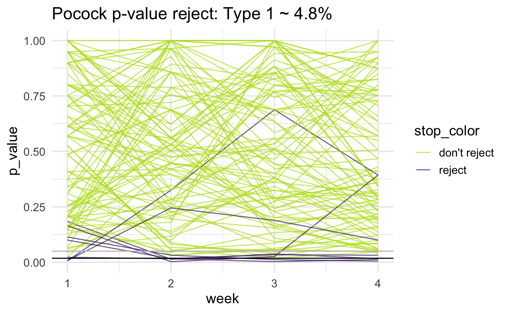

# Multiple Comparisons

* What is a p-value?

> The **p-value** is the probability of collecting the observed data (or data showing as great or greater difference from the null hypothesis) if the null hypothesis is true.  *The p-value is a number calculated from the dataset.*

* George Cobb (2014) put the p-value into perspective:

>Q:  Why do so many colleges and grad schools teach p = .05?  
>A:  Because that's still what the scientific community and journal editors use.

>Q:  Why do so many people still use p = 0.05?  
>A:  Because that's what they were taught in college or grad school.

* In 2014, the journal *Basic and Applied Social Psychology* banned the use of all null hypothesis significance testing procedures (NHSTP).  What are the [implications for authors](https://www.tandfonline.com/doi/full/10.1080/01973533.2015.1012991)?   

> Question 3. Are any inferential statistical procedures required?   
> Answer to Question 3. No, because the state of the art remains uncertain. However, BASP will require strong descriptive statistics, including effect sizes. We also encourage the presentation of frequency or distributional data when this is feasible. Finally, we encourage the use of larger sample sizes than is typical in much psychology research, because as the sample size increases, descriptive statistics become increasingly stable and sampling error is less of a problem. However, we will stop short of requiring particular sample sizes, because it is possible to imagine circumstances where more typical sample sizes might be justifiable.

* The American Statistical Association put out a [statement on p-values](https://amstat.tandfonline.com/doi/pdf/10.1080/00031305.2016.1154108)  

1. P-values can indicate how incompatible the data are with a specified statistical model.  
2. P-values do not measure the probability that the studied hypothesis is true, or the probability that the data were produced by random chance alone.  
3. Scientific conclusions and business or policy decisions should not be based only on whether a p- value passes a specific threshold.  
4. Proper inference requires full reporting and transparency.  
5. A p-value, or statistical significance, does not measure the size of an effect or the importance of a result.  
6. By itself, a p-value does not provide a good measure of evidence regarding a model or hypothesis.  

* Other interested parties weigh in:  
  - [Statisticians issue warning over misuse of P values](http://www.nature.com/news/statisticians-issue-warning-over-misuse-of-p-values-1.19503)  (Nature, March 7, 2016)
  - [The value of p](https://richarddmorey.medium.com/the-value-of-p-212bcfb1ed66) (Richard Morey, blog entry, Jan 3, 2021)


##  Why Most Published Research Findings are False	{#Ioannidis}


The Ioannidis article [@Ioannidis], and our related discussion, focuses on multiple testing.  We'd like to understand the effect of testing in three different contexts:


1. When looking for as many possible significant findings as possible (publish or perish)
2. When bias exists in our work
3. When (many) researchers study the same effect

#### Definitions
* **R**
\begin{eqnarray*}
R = \frac{ \mbox{# true relationships}}{\mbox{# null relationships}} \ \ \ \mbox{ in the population}
\end{eqnarray*}
* **TRUE**
\begin{eqnarray*}
P(\mbox{study is true}) &=& \frac{ \mbox{# true relationships}}{\mbox{# total}}\\
&=& \frac{ \mbox{# true relationships}}{\mbox{# true + # null}}\\
&=& \frac{ \mbox{R(# null relationships)}}{\mbox{R (# null) + # null}}\\
&=& \frac{R}{R+1}
\end{eqnarray*}
* **size**
\begin{eqnarray*}
\alpha &=& P(\mbox{type I error})\\
&=& P(\mbox{reject } H_0 | H_0 \mbox{ true})\\
\end{eqnarray*}
* **power**
\begin{eqnarray*}
1 - \beta &=& P(\mbox{reject } H_0 | H_0 \mbox{ false})\\
\beta &=& P(\mbox{type II error})\\
&=& P(\mbox{not reject } H_0 | H_0 \mbox{ false})\\
\end{eqnarray*}
* **tests**
\begin{eqnarray*}
c &=& \mbox{# of tests run}
\end{eqnarray*}


Baseball power simulation applet [@iscam]  http://www.rossmanchance.com/applets/power.html


### Positive Predictive Value (PPV)

We'll focus here on the Positive Predictive Value (PPV).  That is, what is the probability that the positive result you found is actually true?

| Research Finding 	| Yes 	| No 	| Total 	|
|------------------	|-----------------------	|---------------------	|-------------------------------	|
| Yes 	| $c(1-\beta)R / (R+1)$ 	| $c \alpha / (R+1)$ 	| $c(R+\alpha - \beta R)/(R+1)$ 	|
| No 	| $c \beta R / (R+1)$ 	| $c(1-\alpha)/(R+1)$ 	| $c(1-\alpha + \beta R)/(R+1)$ 	|
| Total 	| $cR/(R+1)$ 	| $c/(R+1)$ 	| $c$ 	|


\begin{eqnarray*}
PPV &=& \frac{c(1-\beta)R / (R+1)}{c(1-\beta)R / (R+1) + c \alpha / (R+1)}\\
&=& \frac{c(1-\beta)R}{c(1-\beta)R + c \alpha}\\
&=& \frac{(1-\beta)R}{(1-\beta)R +  \alpha}\\
&=& \frac{1}{1 + \alpha / (1-\beta) R}\\
&& \\
PPV &>& 0.5 \mbox{ more likely true}\\
\mbox{iff   } (1-\beta)R &>& (R-\beta R + \alpha) 0.5\\
(1-\beta) R 0.5 &>& \alpha 0.5\\
(1-\beta) R &>& \alpha \\
&& \\
PPV &<& 0.5  \mbox{ more likely false}\\
\mbox{iff   } (1-\beta) R &<& \alpha \\
\end{eqnarray*}

### Bias

* **bias**
\begin{eqnarray*}
u &=& \mbox{proportion of results that would not have been research findings but ended up}\\
 && \mbox{reported as such because of bias}
\end{eqnarray*}

Note: bias simply moves $u$\% of the findings from the `No` row to the `Yes` row.

| Research Finding 	| Yes 	| No 	| Total 	|
|------------------	|-------------------------------------	|--------------------------------------	|-------------------------------------------------------	|
| Yes 	| $[c(1-\beta)R +uc \beta R] / (R+1)$ 	| $[c \alpha + u c(1-\alpha)] / (R+1)$ 	| $c[R+\alpha - \beta R + u(1-\alpha + \beta R)]/(R+1)$ 	|
| No 	| $(1-u)c \beta R / (R+1)$ 	| $(1-u)c(1-\alpha)/(R+1)$ 	| $c(1-u)(1-\alpha + \beta R)/(R+1)$ 	|
| Total 	| $cR/(R+1)$ 	| $c/(R+1)$ 	| $c$ 	|


\begin{eqnarray*}
PPV &=& \frac{[c(1-\beta)R +uc \beta R] / (R+1)}{c[R+\alpha - \beta R + u(1-\alpha + \beta R)]/(R+1)}\\
 &=& \frac{[(1-\beta)R +u \beta R]}{[R+\alpha - \beta R + u(1-\alpha + \beta R)]}\\
&=& \frac{1}{1 + \frac{\alpha + u(1-\alpha)}{(1-\beta)R + u\beta R}}
\end{eqnarray*}

Note that $PPV \uparrow$ as $u \uparrow$ as long as $(1-\beta) \leq \alpha$.  Or really, it is probably easier to think about if $(1-\beta) > \alpha$, then $PPV \uparrow$ as $u \downarrow$.  The second sentence is more realistic, e.g., $\beta < .95$ means that we have more true results in our list of significant findings as the bias goes down.  [To understand the direction of the relationships, find $\partial PPV / \partial u < 0$ if $(1-\beta) > \alpha$  (decreasing with u).]


### Multiple Studies

* $\alpha$
    * If a study is null, the probability of seeing null is $(1-\alpha)$
    * If 3 of us test the same thing, the probability that we will all see null is $(1-\alpha)^3$
    * *and* the probability that at least one of use will see significance goes from $\alpha$ to $1 - (1-\alpha)^3$
    * As $n \uparrow$ someone will definitely see significance (bad!)

* $\beta$
    * If a study is significant, the probability of seeing null is $\beta$
    * If 3 of us test the same thing, the probability that we'll all see null is $\beta^3$
    * *and* the probability that at least one of us will see significance goes from $(1-\beta)$ to $(1-\beta^3)$
    * As $n \uparrow$, someone will definitely see significance (good!)


| Research Finding 	| Yes 	| No 	| Total 	|
|------------------	|-------------------------	|------------------------------	|-----------------------------------------	|
| Yes 	| $c(1-\beta^n)R / (R+1)$ 	| $c(1-[1- \alpha]^n) / (R+1)$ 	| $c(R+1-[1-\alpha]^n - \beta^n R)/(R+1)$ 	|
| No 	| $c \beta^n R / (R+1)$ 	| $c(1-\alpha)^n/(R+1)$ 	| $c([1-\alpha]^n + \beta^n R)/(R+1)$ 	|
| Total 	| $cR/(R+1)$ 	| $c/(R+1)$ 	| $c$ 	|


\begin{eqnarray*}
PPV &=& \frac{(1-\beta^n)R}{(R+1-[1-\alpha]^n - \beta^n R)}
\end{eqnarray*}


$PPV \downarrow$ as $n \uparrow$ unless $(1-\beta) < \alpha$  that is, $\beta > 0.95$ !!


### Corollaries

* **Corollary 1**   The smaller the studies conducted in a scientific field, the less likely the research findings are to be true.  (low power)  
* **Corollary 2**   The smaller the effect sizes in a scientific field, the less likely the research findings are to be true.  (also low power)  
* **Corollary 3**  The greater the number and the lesser the selection of tested relationships in a scientific field, the less likely the research findings are to be true. (pre-study odds: R; phase III trials have better odds than microarray studies)  
* **Corollary 4**  The greater the flexibility in designs, definitions, outcomes, and analytical modes in a scientific field, the less likely the research findings are to be true.  (increased bias)  
* **Corollary 5**  The greater the financial and other interests and prejudices in a scientific field, the less likely the research findings are to be true. (increased bias)
* **Corollary 6**  The hotter a scientific field (with more scientific teams involved), the less likely the research findings are to be true. (increased $n$)


## Multiple Comparisons {#multcomp}

As you might expect, if you have 10 groups, **all of which come from the same population**, you might wrongly conclude that some of the means are *significantly* different.  If you try pairwise comparisons on all 10 groups, you'll have ${10 \choose 2} = 45$ comparisons.  Out of the 45 CI, you'd expect 2.25 of them to not contain the true difference (of zero); equivalently, you'd expect 2.25 tests to reject the true $H_0$.  In an overall test of comparing all 10 groups simultaneously, you can't use size as a performance measure anymore.

### Familywise Error Rate

* **FWER** = $P(V\geq1)$

The Familywise Error Rate (FWER) is the probability of making one or more type I errors in a series of multiple tests.  In the example above (with 10 comparisons), you would almost always make at least one type I error if you used a size of $\alpha = 0.05$.  So, your FWER would be close to 1.  Methods exist for controlling the FWER instead of the size ($\alpha$).


#### Bonferroni {-}

The Bonferroni method of adjusting for multiple comparisons is used to control the FWER.

Assume all  our tests are null
\begin{eqnarray*}
A_1 &=& \mbox{event reject test 1}\\
P(A_1) &=& \alpha^*\\
A_2 &=& \mbox{event reject test 2}\\
P(A_2) &=& \alpha^*\\
\end{eqnarray*}

We want to bound the probability that all our tests don't commit a type 1 error (that is, none of them reject).
\begin{eqnarray*}
P( A_1 \mbox{ or } A_2) &=& P(A_1) + P(A_2) - P(A_1 \mbox{ and } A_2)\\
&=& \alpha^* + \alpha^* - ???\\
& \leq& 2 \alpha^* \\
FWER = P(\mbox{at least one rejects}) &\leq& 2 \alpha^*\\
\mbox{let} && P(A_1) = P(A_2) = \alpha^* = \frac{\alpha}{2}\\
FWER &\leq& \alpha
\end{eqnarray*}

That is, with $m$ tests, rejecting any test whose p-value is less than or equal to $\alpha/m$ will control the FWER at $\alpha$.  Alternatively, rejecting adjusted p-values less than $\alpha$ will also control the FWER at $\alpha$.  Where the adjusted p-values are defined as:

\begin{eqnarray*}
\tilde{p}_j = \min(m p_j, 1)
\end{eqnarray*}
Reject any hypothesis such that $\tilde{p}_j \leq \alpha$.


#### Holm {-}

Holm is a less conservative (than Bonferroni) method for controlling the FWER.  Because each p-value is considered sequentially, the Holm adjustment is referred to as "step-up".  The intuition is that on the first step, the bound assumes up to $m$ null hypotheses.  But on the second step, there are only $m-1$ null hypotheses (assuming the first p-value is rejected).  

To control the FWER at $\alpha$, first order the p-values as $p_1 \leq p_2 \leq \cdots \leq p_m$ and define the adjusted p-values to be:

\begin{eqnarray*}
\tilde{p}_j = \max_{i \leq j} [ \min((m-i+1) p_i, 1) ]
\end{eqnarray*}
Reject any hypothesis such that $\tilde{p}_j \leq \alpha$.


* Note that interpretations depend heavily on the number of tests (which is true about most multiple comparison adjustments).  
* Bonferroni is extremely conservative, and therefore it has very high type II error rates (low power).  
* We aren't really interested in the situation where "all true null tests don't get rejected."  

## False Discovery Rate

* **FDR**  = $E[V/R]$

The FDR (false discovery rate) is the expected proportion of false discoveries out of all the discoveries.

* **PPV** = $E[S/R]$

Consider $m$ hypotheses:

|  	|  	| Null True 	| Alt True 	|  	|
|----------	|-----------------	|:---------:	|:--------:	|:-----:	|
| Research 	| not significant 	| $U$ 	| $T$ 	| $m-R$ 	|
| Finding 	| significant 	| $V$ 	| $S$ 	| $R$ 	|
|  	|  	| $m_0$ 	| $m-m_0$ 	| $m$ 	|


#### Benjamini-Hochberg {-}

When running experiments that have many many tests of significance, it is often more desirable to worry about the *number* of false discoveries as opposed to the probability of getting *one* false discovery.  That is, we are typically comfortable with a few false positives (i.e., a very HIGH FWER) as long as the rate of false positives is low.


Define the estimated false discovery proportion at a cutoff t ($\hat{FDR}(t)$) to be the number of false discoveries at a given cutoff.  Again, to control the FDR at $\alpha$, first order the p-values as $p_1 \leq p_2 \leq \cdots \leq p_m$.

\begin{eqnarray*}
\hat{FDR}(t)&=& \frac{\# \{ p_j \leq t \mbox{ out of the null tests } \}}{ \# \{p_j \leq t\} + (1 \mbox{ if all } p_j > t)}
\end{eqnarray*}
Notice that p-values from null hypotheses will be distributed uniformly from zero to one.  That means that a good estimate of the numerator is $t\cdot$ \# of null tests.
\begin{eqnarray*}
\hat{FDR}(p_j) &=& \frac{p_j \cdot m \cdot \pi_0}{j} < \frac{p_j m}{j}
\end{eqnarray*}
where $\pi_0$ is the proportion of tests which are truly null ($m_0/m$).  Consider the adjusted p-values,

\begin{eqnarray*}
\tilde{p}_j = \min [ (m/j) p_j, \tilde{p}_{j+1} ]
\end{eqnarray*}
Reject any hypothesis such that $\tilde{p}_j \leq \delta$ to control the FDR at $\delta$.


Intuition:  let $m=1000$, and suppose the $\tilde{p}_{250} < 0.4$.  Show that FDR $< 0.4$.

$\tilde{p}_{250} < 0.4$ implies two different things:

1. $p_{250} \leq \frac{0.4\cdot 250}{1000} = 0.1$
2. and $\approx 750$ null tests have p-values between 0.1 and 1.

If 750 null tests have p-values between 0.1 and 1, then $m_0 \cdot 0.9 = 750 \rightarrow m_0 = 833.33$.  Therefore, the number of null hypotheses which were rejected is 833.33 - 750 = 83.33.

\begin{eqnarray*}
FDR = \frac{83.33}{250} = 0.33 < 0.4
\end{eqnarray*}

More generally if $\tilde{p}_k = \frac{p_k \cdot m}{k} \leq \delta$:
\begin{eqnarray*}
p_k &<& \frac{k}{m} \delta\\
\# \mbox{ null not rejected} &=& \mbox{length of null interval }\bigg[\frac{k}{m}\delta,1\bigg] \cdot \mbox{ total } \# \mbox{ of null}\\
(m-k) &=& \bigg(1-\frac{k}{m} \delta\bigg) m_0\\
m_0 &=& \frac{(m-k) m}{(m-k \delta)}\\
& &\\
FDR &=& \frac{\# \mbox{ null rejected}}{\# \mbox{ rejected}}\\
&=& \frac{\frac{m(m-k)}{(m-k\delta)} - (m-k)}{k}\\
&=& \frac{m^2 - mk - (m-k) (m-k \delta)}{(m-k \delta)k}\\
&=& \frac{k(m \delta - k \delta)}{k(m-k \delta)} = \delta\bigg(\frac{m-k}{m/\delta - k}\bigg)\\
FDR &<& \delta
\end{eqnarray*}
because $m/\delta > m$ so $\frac{m-k}{m/\delta -k} < 1$.


Consider a one sample t-test.  The population is normal centered at 47 with $\sigma=3$; samples of size 20 are taken from the population.  The following hypotheses are tested:
\begin{eqnarray*}
H_0: \mu = 47\\
H_{0_1}: \mu = 40\\
H_{0_2}: \mu = 48\\
H_{0_3}: \mu = 50\\
\end{eqnarray*}
In the null setting, the p-values are uniformly distributed from 0 to 1.  When the data are not consistent with the null, there are more p-values close to zero (and even closer to zero as the data become more and more distinct from the null).

#### Distribution of p-values under different amounts of divergence from the null hypothesis. {-}


The previous example considered the situation where all the p-values came from the distribution.  In reality, p-values will come from many different distributions.  For simplification, consider the situation where g100% of the tests come from the null distribution, and (1-g)100% of the tests come from a distribution where the p-values are much closer to one and skewed right.

#### Distribution of p-values under differing proportions of null versus significant tests. {-}


### Storey & q-values {#qvals}

The previous methods allowed the larger family of tests to control either the FWER or the FDR (global measures of accuracy).  However, for a given test, there was no measure to quantify FDR for a given test.


* **p-value**  Recall that the p-value is the smallest level of significance (P(type I error)) possible to reject $H_0$.
* **q-value**  Akin to the p-value, the q-value is the minimum FDR at that score which can be attained when calling the test significant.


Storey defines the q-value to be the FDR associated with a given test of significance. For example, say a q-value = 0.013 for test X.  Then at most 1.3% of tests with p-values at least as small as test X are false positives.  In particular, let
\begin{eqnarray*}
\hat{\pi}_0 = \frac{\# \{ p_j > \lambda \} }{m(1-\lambda)} \ \ \  \mbox{ for some } \lambda
\end{eqnarray*}
(though there are many ways to estimate $\pi_0$.)

In a step-down algorithm, the q-value is defined using the p-value at hand and the next {\em largest} p-value.  Additionally, the $\pi_0$ is implemented as seen in the original intuition behind FDR control.

* **step 1** let
\begin{eqnarray*}
\hat{q}(p_{m}) = \hat{\pi}_0 p_{m}
\end{eqnarray*}
Note that $\hat{q}(p_{m})$ is the biggest q-value and $ p_{m}$ is the biggest p-value.
* **step 2**
\begin{eqnarray*}
\hat{q}(p_{m-1}) = \min( \hat{\pi}_0 p_{m-1} \frac{m}{m-1}, \hat{q}( p_{m}))
\end{eqnarray*}
If $\hat{q}(p_{m}) = 0.7$ and $\hat{\pi}_0 p_{m-1} \frac{m}{m-1} = 0.8$, then the next smallest q-value would be 0.7 because the FDR can be as low as 0.7 (see the definition of FDR).
* **step 3**  more generally,
\begin{eqnarray*}
\hat{q}(p_{j}) = \min( \hat{\pi}_0 p_{j} \frac{m}{j}, \hat{q}( p_{j+1}))
\end{eqnarray*}


Can a q-value be less than a p-value?  Sure!  If the number of null hypotheses is small and the test is powerful.  For example, consider testing 1000 hypotheses with 20% null tests ($\pi_0=0.2$).  Assume 500 of the p-values are less than 0.05 (very powerful!).  With 200 null we would expect 10 to be less than 0.05.  So, the FDR is 10/500 = 0.02 (which is smaller than the p-value of 0.05 at the cutoff for the $500^{th}$ test).

#### How are FWER and FDR related? {-}

First note that for both FDR and FWER, the procedure is to *control* the errors not to compute or estimate the errors (except in the case of the q-value).

Recall that $FDR = E[V/R]$ and is defined to equal zero if R=0

\begin{eqnarray*}
FDR &=& E\bigg[\frac{V}{R} \bigg]\\
&=& E\bigg[\frac{V}{R} | R > 0 \bigg] P(R >0) + E\bigg[\frac{V}{R} | R=0 \bigg] P(R=0)\\
&=& E\bigg[\frac{V}{R} | R > 0 \bigg] P(R >0)
\end{eqnarray*}


* **case 1**  In the first case, consider $V=R$ such that all significant hypotheses are null.
\begin{eqnarray*}
FDR &=& E\bigg[\frac{V}{R} | R > 0 \bigg] P(R >0)\\
&=& 1 P(R>0) = 1 P(V \geq 1)\\
&=& FWER
\end{eqnarray*}
* **case 2**  In the second case, consider $V < R$ such that some of the significant hypotheses are null and some are not.  ($V/R < 1$)
\begin{eqnarray*}
FDR &=& E\bigg[\frac{V}{R} | R > 0 \bigg] P(R >0)\\
&=& E\bigg[\frac{V}{R} | R > 0, V\geq 1 \bigg] P(R >0, V \geq 1) + E\bigg[\frac{V}{R} | R > 0, V=0 \bigg] P(R >0, V =0)\\ 
&& \mbox{ (note: } V/R \equiv 0 \mbox{ if } V = 0)\\
&=& E\bigg[\frac{V}{R} | R > 0, V\geq 1 \bigg] P(R >0, V \geq 1) \\
&<& P(V \geq 1) = FWER \ \ \mbox{ because } V/R < 1
\end{eqnarray*}


The proof above shows that FWER controls the FDR when not all significant tests are null.  When all significant tests are null, FWER=FDR.


## Interim Analyses {#interim}

An important application of multiple comparisons issues comes when deciding whether or not to stop a clinical trial early due to either positive or negative results.  Looking at the data too often will create false positives which can be quite problematic. [@subgroup]

Consider the following case studies:  

* HIV -- Indinavir was stopped early due to positive results [@hiv]
* HVTN 505 was stopped early due to negative results [@hvtn]
* Truvada & Tenofovir were also stopped early [@hrt]

What happens when the research performs $k$ interim analyses and the research scenario is truly null?
\begin{eqnarray*}
P( test1 < \alpha \mbox{ or } test2 < \alpha \mbox{ or } \ldots \mbox{ or }  testk < \alpha ) > \alpha
\end{eqnarray*}

The researcher has two options:

1. Let $\alpha^* < < < \alpha$
2. Change $\alpha$ at each step along the way so that the total probability of a type I error is $\alpha$


Sometimes the interim criteria are referred to as "alpha spending" because the total type I error rate (that is, rejecting the original claim at any of the interim analysis steps if $H_0$ is true) should be $\alpha$, but the $\alpha$ probability of a type I error should be spread over the interim tests. 

### Pocock

The Pocock boundary 

Advantages:

* simple
* aggressive with respect to stopping early.  that is, there is a small expected sample size  (when the effect size is large)


Disadvantage:

* low power and therefore large maximum sample size (when the effect size is small)

### O'Brien-Flemming

Advantages:

* final $\alpha$ is close to desired $\alpha$
* more power than Pocock, so smaller max sample size

Disadvantage:

* less likely to stop early, so larger expected sample size


### Some parting thoughts
* If $H_a$ is true, the effect size is likely overestimated (true in general, not just for interim analyses).
* Symmetry:  which is more important, harm or good?
* Can split alpha into two halves and apply one method (e.g., Pocock) to stopping early for positive reasons and apply another method (e.g., O'Brien-Flemming) to stopping early for negative reasons.


```
#> # A tibble: 1 x 1
#>   type1
#>   <dbl>
#> 1 0.131
```


####  Bonferroni {-}

Type 1 error rate:


```
#> # A tibble: 1 x 1
#>   type1
#>   <dbl>
#> 1 0.027
```


####  Pocock {-}

Type 1 error rate:


```
#> # A tibble: 1 x 1
#>   type1
#>   <dbl>
#> 1 0.048
```


####  Peto {-}

Type 1 error rate:


```
#> # A tibble: 1 x 1
#>   type1
#>   <dbl>
#> 1 0.054
```



####  O'Brien-Fleming {-}

Type 1 error rate:


```
#> # A tibble: 1 x 1
#>   type1
#>   <dbl>
#> 1 0.049
```


####  Advice 1
The following quote is general advice from statistical researchers doing clinical oncology. [@crowley]


> Even the specifics of the most basic task of the data monitoring committee, evaluation of interim results for evidence of benefit or harm, are not necessarily obvious.  Questions (and our personal answers) include:

> * How often should the data monitoring committee review interim data?  (The answer to this should depend on how fast additional information becomes available on a trial.  we generally recommend monitoring advanced disease studies, or any other study with rapidly accumulating events, every 6 months.  Yearly monitoring may be sufficient for adjuvant or slowly accruing studies.)

> * Should the primary outcome data be reviewed each time or should they be reviewed only at times of planned interim analyses?  (All data, including primary outcome data, should be reviewed at each time, since the unexpected does occur.)

> * Should treatment arms be blinded to the data monitoring committee or not?  (Definitely not.  If A looks better than B, the decision to continue could well be different if A is the control arm instead of the experimental arm.)

> * Should a data monitoring committee decision that evidence is sufficient to close a trail be final, or should it be advisory only?  (We would say advisory, but rarely overturned.)

> * If advisory, advisory to whom - the funding agency? an executive group? the investigators?  (Reports should go to the individuals with ultimate responsibility for the integrity of the trial.)

> * Should a data monitoring committee be able to make major design changes to a trial?  (No, the data monitoring committee may offer suggestions but design is the responsibility of the principal investigators.  On the other hand, major design changes initiated by the principal investigators should be approved by the committee.)

> * Are data monitoring committee duties over when study accrual is complete, or should the data monitoring committee also decide when results are to be reported?  (It should also decide when results are to be reported - additional follow-up generates additional data that still need to be monitored.)

> * How much weight should be accorded to outside information versus current information on the study being monitored?  (Definitive outside information cannot be ignored - but this begs the question of what is definitive.  A single trial of moderate size probably is not definitive; two large trials probably are; a meta-analysis probably is not.)

> * How much should results of secondary endpoints influence the decision to continue or not?  (Not much unless toxic death is considered secondary.)

> * How scary do results have to be to stop at a time other than a planned interim analysis?  (Very scary, or the purpose of interim analyses is defeated.)

> * When do accrual problems justify early closure?  (When results won't be available until after they are no longer of interest.)

> * Should confidential information ever be provided to other data monitoring committees or planning groups?  (Sometimes.  If study conduct will not be compromised by limited release of information, it might be reasonable to let investigators planning new trials know of potential problems or benefits to treatment arms they are considering.  Risk to the ongoing trial includes leaked information or intelligent guesses as to the current status; risk to the new trial includes choosing an inappropriate arm based on early results that don't hold up.)

> Every monitoring committee functions differently because no two people have the same ethical, scientific, or practical perspectives.  This means different committees might well come up with different answers to the same monitoring issues.  To ensure some balance of opinions, it is best to have a variety of knowledgeable people as members of the committee.


####  Advice 2

Duncan Temple-Lang is a leader in the area of combining computer science research concepts within the context of statistics and science more generally.  Recently, he was invited to participate in a workshop, *Training Students to Extract Value from Big Data*.  The workshop was subsequently summarized in a manuscript of the same name and has been provided free of charge.  http://www.nap.edu/catalog.php?record_id=18981 


**Principles for the Data Science Process**, Duncan Temple Lang, University of California, Davis [@duncanTL]


Duncan Temple Lang began by listing the core concepts of data science - items that will need to be taught: statistics and machine learning, computing and technologies, and domain knowledge of each problem. He stressed the importance of interpretation and reasoning - not only methods - in addressing data. Students who work in data science will have to have a broad set of skills - including knowledge of randomness and uncertainty, statistical methods, programming, and technology - and practical experience in them. Students tend to have had few computing and statistics classes on entering graduate school in a domain science.

Temple Lang then described the data analysis pipeline, outlining the steps in one example of a
data analysis and exploration process:


1. Asking a general question.

2. Refining the question, identifying data, and understanding data and metadata. Temple Lang
noted that the data used are usually not collected for the specific question at hand, so the original experiment and data set should be understood.

3. Access to data. This is unrelated to the science but does require computational skill.

4. Transforming to data structures.

5. Exploratory data analyses to understand the data and determine whether the results will scale.
This is a critical step; Temple Lang noted that 80 percent of a data scientist's time can be spent in cleaning and preparing the data.

6. Dimension reduction. Temple Lang stressed that it can be difficult or impossible to automate
this step.

7. Modeling and estimation. Temple Lang noted that computer and machine learning scientists
tend to focus more on predictive models than on modeling of physical behavior or characteristics.

8. Diagnostics. This helps to understand how well the model fits the data and identifies
anomalies and aspects for further study. This step has similarities to exploratory data analysis.

9. Quantifying uncertainty. Temple Lang indicated that quantifying uncertainty with statistical
techniques is important for understanding and interpreting models and results.

10. Conveying results.

Temple Lang stressed that the data analysis process is highly interactive and iterative and requires the presence of a human in the loop. The next step in data processing is often not clear until the results of the current step are clear, and often something unexpected is uncovered. He also emphasized the importance of abstract skills and concepts and said that people need to be exposed to authentic data analyses, not only to the methods used. Data scientists also need to have a statistical understanding, and Temple Lang described the statistical concepts that should be taught to a student:


* Mapping the general question to a statistical framework.
* Understanding the scope of inference, sampling, biases, and limitations.
* Exploratory data analyses, including missing values, data quality, cleaning, matching, and
fusing.
* Understanding randomness, variability, and uncertainty. Temple Lang noted that many
students do not understand sampling variability.
* Conditional dependence and heterogeneity.
* Dimension reduction, variable selection, and sparsity.
* Spurious relationships and multiple testing.
* Parameter estimation versus "black box" prediction and classification.
* Diagnostics, residuals, and comparing models.
* Quantifying the uncertainty of a model.
* Sampling structure and dependence for data reduction. Temple Lang noted that modeling of
data becomes complicated when variables are not independent, identically distributed.
* Statistical accuracy versus computational complexity and efficiency.

Temple Lang then briefly discussed some of the practical aspects of computing, including the
following:

* Accessing data.
* Manipulating raw data.
* Data structures and storage, including correlated data.
* Visualization at all stages (particularly in exploratory data analyses and conveying the
results).
* Parallel computing, which can be challenging for a new student.
* Translating high-level descriptions to optimal programs.

During the discussion, Temple Lang proposed computing statistics on visualizations to examine
data rigorously in a statistical and automated way. He explained that "scagnostics" (from scatter plot diagnostics) is a data analysis technique for graphically exploring the relationships among variables. A small set of statistical measures can characterize scatter plots, and exploratory data analysis can be conducted on the residuals.

(More information about scagnostics can be found in @scagnostics.)

A workshop participant noted the difference between a data error and a data blunder. A blunder is a large, easily noticeable mistake. The participant gave the example of shipboard observations of cloud cover; blunders, in that case, occur when the location of the ship observation is given to be on land rather than at sea. Another blunder would be a case of a ship's changing location too quickly. The participant speculated that such blunders could be generalized to detect problematic observations, although the tools would need to be scalable to be applied to large data sets.

