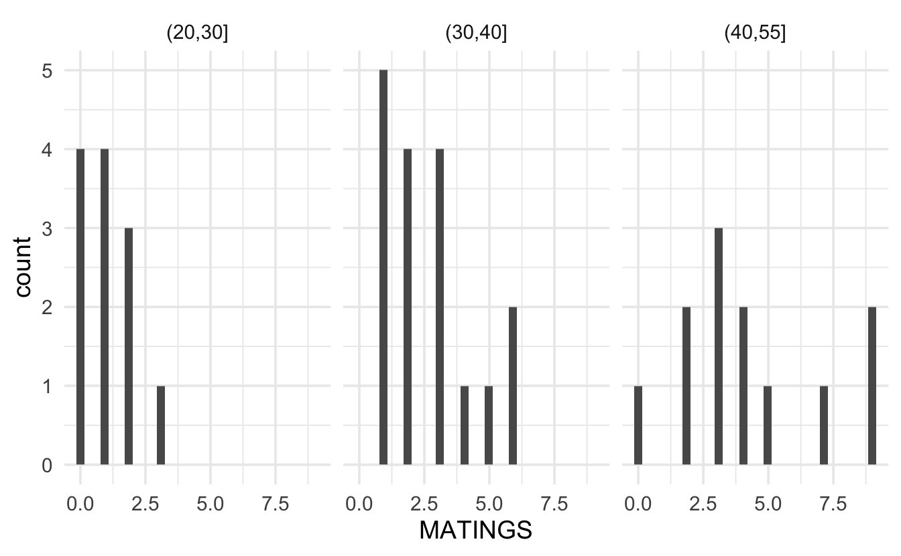
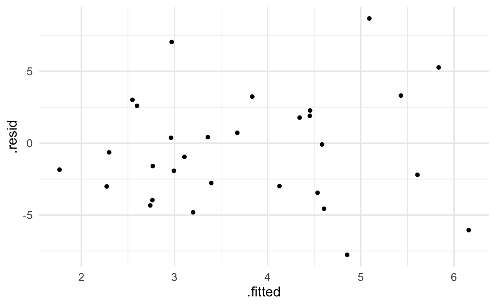
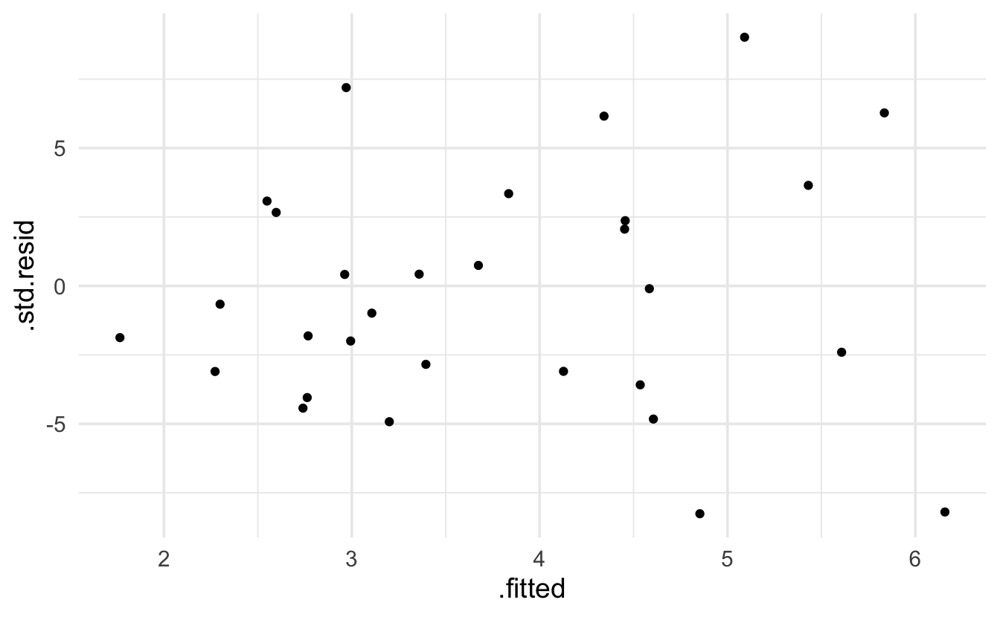

# Poisson Regression


## Regression Models {#regPois}

Consider the following example from @poole (described in @sleuth) on age and mating success (number of successful matings) in male African Elephants.


```r
elephants <- readr::read_csv("elephants.csv")

ggplot(elephants, aes(x=jitter(AGE), y=MATINGS)) + geom_point()
```


While it does seem like there is an increasing trend in the two variables, there are some concerns with directly applying linear regression.  Indeed, the example above acts as a proxy for many regression examples where the response variable is a count with particular properties:

1. The response variable is a count (in particular, it cannot be negative).

2. The model may or may not be linear in X.

3. The model appears to have increasing variance as a function of X.


For the setting above, it is often preferable to use Poisson regression instead of the normal errors linear regression.  

### The Poisson Regression Model

The Poisson distribution is given by a probability function of the form:

$$P(Y = y) = \frac{e^{-\mu} \mu^y}{y!} \ \ \ \ \ y=0, 1, 2, \ldots$$

Which gives: $E(Y) = \mu$ and $Var(Y) = \mu$.   That is, the Poisson model is characterized by a mean and variance given by the same value.


Recall that with linear regression, $E(Y_i) = \beta_0 + \beta_1 X_i$ which might be a reasonable idea to apply to the count data; however, as seen above, if the mean of the distribution is modeled strictly as a linear function in $X$, then the line has the potential to predict negative counts and the variability will not be a function of $X$ if normal errors regression is used.

An alternative the normal errors regression is to use a $\ln$ transformation to describe the relationship between the predicted value of the response and the explanatory variables of interest:

$$\ln(E(Y_i)) = \ln(\mu_i) = \beta_0 + \beta_1 X_i.$$
where the observed counts come from a Poisson model:  $Y_i \sim Pois(\mu_i)$ and the Poisson parameter is given as a function of the explanatory variable(s).  [Note that Poisson regression contains no error term like linear regression because the Poisson distribution has inherent variability which is determined by the mean which equals the variance.]

####  Technical Conditions

Like every model, there are technical conditions associated with Poisson Regression.  The closer the data (population) conform to the conditions, the more useful the model will be at describing the context at hand.  Remember, 
 > All models are wrong, but some models are useful."  -George Box.  
 
 So, assessing whether the technical conditions are reasonable will help in determining whether the analysis performed under a particular model was a good thing to do.
 
1. Line:  The log of the mean is a linear function of $X$:  $\ln(\mu_i) = \beta_0 + \beta_1 X_i.$
2. Independence: The observations are independent (often characterized by a simple random sample or something approximating a simple random sample).
3. Poisson: The response variable is a count.
4. Error: The mean of the response variables is equal to the variance of the response variable for each combination of explanatory variables in the model.


```r
include_graphics("NormPoisReg1.jpg")
```

<div class="figure" style="text-align: center">

<p class="caption">(\#fig:unnamed-chunk-3)Visualizing Normal vs Poisson Error Regression from @bysh.</p>
</div>


### Comparison to Linear Regression

One question that might come to mind is whether there is any difference in the Poisson log-linear model and a normal errors regression model with a log transformation on the response???  The short answer is that yes, there is a difference.

* **Poisson Log-Linear:**  $\ln(E(Y_i)) = \beta_0 + \beta_1 X_i, Y_i \sim Pois(e^{\beta_0 + \beta_1 X_i})$

* **Normal w Log Transformation:**  $E(\ln(Y_i)) = \beta_0 + \beta_1 X_i, \ln(Y_i) \sim N(\beta_0 + \beta_1 X_i, \sigma^2)$

There are two main differences with the models.

1. The first is to remember that the average (i.e., expected value) of the logs is not the log of the averages.  So in the Poisson model, the linear function measures the log of the average, and in the normal model, the linear function measures the average of the logs.


```r
set.seed(47)
example <- abs(rcauchy(10))
example
#>  [1]  0.0725  2.3911  0.9302  0.6237  4.2508  1.4575  2.7521 10.2177  7.3042
#> [10]  0.2404

log(mean(example))
#> [1] 1.11
mean(log(example))
#> [1] 0.343
```

2.  The second difference to note across the two regression set-ups is that the variability is modeled differently.  Indeed, the likelihood functions are quite different and will produce different maximum likelihood estimates of the parameter values.


```r
include_graphics("NormPoisReg2.jpg")
```

<div class="figure" style="text-align: center">

<p class="caption">(\#fig:unnamed-chunk-5)Differences in Normal vs Poisson Error Regression from @bysh.</p>
</div>


###  Interpreting Poisson Regression Coefficients

As we've done with other generalized linear models (linear regression, logistic regression, even survival analysis!), in order to understand the model more completely, we look at the impact on the response variable for a one unit change in $X$.

Consider $X$ and $X+1$.

$$\frac{E(Y|X+1)}{E(Y|X)} = \frac{e^{\beta_0 + \beta_1 (X+1)}}{e^{\beta_0 + \beta_1 (X)}} = e^{\beta_1}$$

That is, $e^{\beta_1}$ represents the ratio of means for a one unit increase in $X$.  In the elephant example, for every additional year of life, we expect the elephant's mating success, on average, to change by a factor of $e^{\beta_1}$.  [For the savvy consumer, you might note that this is an additional contrast to normal error regression on the log transformed Y where it was required to interpret the multiplicative change in *median*.  Because with Poisson, the log is taken after the average, taking the inverse of the log gives the mean directly.  Previously, it was necessary to use the identity:  $median(\ln(Y)) = \ln(median(Y))$.]

###  Assessing Model Validity

Just as with linear regression we used scatterplots to give a sense of whether or not a linear regression was appropriate, we can use exploratory data analysis (including scatterplot!) to give a sense of whether or not Poisson regression is an appropriate model.  [The EDA steps here are based on excellent descriptions of Poisson model building in @bysh.]


**Technical Condition 3, Poisson:** Let's first look at the response variable.  A histogram of the number of successful matings shows a right skew which is typically not acceptable for normal errors regression (although, remember, the value of the response variable is dependent on the value of the explanatory variable!)


Likely, it makes more sense to look at the distribution of the response variable at each value of the explanatory variables.  Because the sample size is limited, we group the age variable into 5 year increments.  Looking at the plot below, again it seems as though, even when conditioning on the explanatory variable, the response is right skewed with variance dependent on the mean.  It might also be good to find the sample mean per group and plot the Poisson probabilities onto each bar.



**Technical Condition 4, Error:** To check whether the mean and variance are similar, we can calculate the values per group  (with more data we would probably have more groups of the explanatory variable, and the following analysis would be done with a scatterplot of means on the x-axis and variance on the y-axis).  Note that the mean and variance are reasonably similar!  When the "mean=variance" condition is violated, it is almost always violated in such that the variance is even *bigger* than would have been expected by the Poisson model.  Large variance is called overdispersion, and methods for measuring and accounting for overdispersion are given in the following section \@ref(overdis).


```
#> # A tibble: 3 x 5
#>   AGEgroups  mean variance stdev     n
#>   <chr>     <dbl>    <dbl> <dbl> <int>
#> 1 (20,30]    1.08    0.992 0.996    12
#> 2 (30,40]    2.71    2.85  1.69     17
#> 3 (40,55]    4.25    7.84  2.80     12
```

**Technical Condition 1, Line:** The Poisson model implies that the log of the mean will be a linear function of the explanatory variable:

$$\ln(\mu_i) = \beta_0 + \beta_1 X_i,$$
which means we'd really like to plot $\mu_i$ as a function of the explanatory variable.  Unfortunately, $\mu_i$ is unknown, and so cannot be plotted.  We can, however, plot the log of the average value of the response for a group of x values which are close to one another.  In the plot below, we've grouped observations based on the age of the elephants being within 3 years of years of each other.   It is actually quite linear!  The points that don't follow the linear relationship are based on age groups with very few observations.


```r
matelogmean <- elephants %>%
  dplyr::mutate(agecut = cut(AGE, breaks=seq(26.5,53.5,by=3))) %>%
  group_by(agecut) %>%
  summarize(meanmate = mean(MATINGS), logmate = log(mean(MATINGS)), n = n() )

elephantsGRP <- cbind(matelogmean, age = c(seq(26.5,52.5,by=3)+1.5 ))

elephantsGRP
#>        agecut meanmate logmate  n age
#> 1 (26.5,29.5]     1.09   0.087 11  28
#> 2 (29.5,32.5]     1.50   0.405  2  31
#> 3 (32.5,35.5]     2.44   0.894  9  34
#> 4 (35.5,38.5]     3.50   1.253  6  37
#> 5 (38.5,41.5]     2.00   0.693  2  40
#> 6 (41.5,44.5]     3.57   1.273  7  43
#> 7 (44.5,47.5]     6.00   1.792  2  46
#> 8 (47.5,50.5]     2.00   0.693  1  49
#> 9 (50.5,53.5]     9.00   2.197  1  52

elephantsGRP %>% ggplot(aes(x=age, y=logmate)) + geom_point()
```


## Inference in Poisson Regression {#inferPois}

Recall that in Poisson regression, $E(Y_i) = \mu_i = e^{\beta_0 + \beta_1 X_i}$.  Therefore, the probability function for the $i^{th}$ observation is:

$$f(y_i) = \frac{e^{-\mu_i} \mu_i^{y_i}}{y_i!} = \frac{e^{-e^{\beta_0 + \beta_1 X_i}} \bigg(e^{\beta_0 + \beta_1 X_i}\bigg)^{y_i}}{y_i!}.$$
Which gives the resulting likelihood of:


$$L(\beta_0, \beta_1) = \prod_{i=1}^n f(y_i) = \prod_{i=1}^n \frac{e^{-\mu_i} \mu_i^{y_i}}{y_i!} = \prod_{i=1}^n \frac{e^{-e^{\beta_0 + \beta_1 X_i}} \bigg(e^{\beta_0 + \beta_1 X_i}\bigg)^{y_i}}{y_i!}.$$

And the log likelihood becomes:

\begin{eqnarray*}
l(\beta_0, \beta_1) &=& \ln L(\beta_0, \beta_1) = \sum_{i=1}^n \bigg(-\mu_i + y_i \ln(\mu_i) - \ln(y_i!) \bigg) \\
&=& \sum_{i=1}^n \bigg(-e^{\beta_0 + \beta_1 X_i} + y_i (\beta_0 + \beta_1 X_i) - \ln(y_i!) \bigg).
\end{eqnarray*}

### Maximum Likelihood 

As with other probabilistic models we've encountered, the joint likelihood of the entire sample represents the product of the individual likelihoods for each data value.  The likelihood (or more typically, the $\ln$-likelihood) is maximized to find estimates for $\beta_0$ and $\beta_1$.

The parameter estimates maximize the $\ln$-likelihood, and the SE of the estimates are given by the Fisher Information from the likelihood (roughly the second derivative).

Given $b_0$ and $b_1$ as estimates of the parameter values, $\beta_0$ and $\beta_1$, we can estimate the average count value:

$$\hat{\mu}_i = e^{b_0 + b_1 X_i}$$

#### Residuals

Note that we *expect* the residuals of a Poisson model to have larger variability for larger values of the prediction.  That makes interpreting the residuals slightly different that previously for a linear regression model.

Pearson residual:

$$res_{pi} = \frac{y_i - \hat{\mu}_i}{\hat{\mu}_i}$$

Deviance residual:

\begin{eqnarray*}
res_{di} &=& [-\hat{\mu}_i + y_i \ln(\hat{\mu}_i) - \ln(y_i!) ] - [-y_i + y_i \ln(y_i) - \ln(y_i!) ] \\
&=& y_i-\hat{\mu}_i + y_i \ln\bigg(\frac{\hat{\mu}_i}{y_i}\bigg)
\end{eqnarray*}


Along with giving information about individual residual values, the sum of the Deviance residuals is also a way to test for goodness-of-fit of the model.  Given the null hypothesis that the Poisson is the appropriate model, the test of goodness-of-fit for the Poisson model is given by:

$$\sum_{i=1}^n res_{di} \stackrel{H_0}{\sim} \chi_{n-p}^2.$$


#### Dealing with Overdispersion {#overdis}

A probability structure that is given by a variance which is larger than the mean, may end up with:

\begin{eqnarray*}
E(Y_i) &=& \mu_i\\
Var(Y_i) &=& \phi \mu_i\\
\end{eqnarray*}

If we can estimate $\phi$, then a more appropriate SE to use is adjusted by $\phi$:  $SE_Q(\hat{\beta}) = \sqrt{\phi} SE(\hat{\beta})$.  ($Q$ stands for "quasiPoisson".)

When $Y$ comes from a setting where the sample size is large, then we can use normal (sums of standard normal random variables are distributed according to a $\chi^2$ distribution) theory to assess the residuals:

$$\sum_{i=1}^n res_{pi}^2 = \sum_{i=1}^n \frac{(Y_i - \mu_i)^2}{Var(Y_i)} = \sum_{i=1}^n \frac{(Y_i - \mu_i)^2}{\phi \mu_i} \sim \chi^2_{n-p}$$

The expected value of $\chi^2_{n-p}$ is $n-p$, which gives an estimator of $\phi$ to be:

$$\hat{\phi} =  \sum_{i=1}^n \frac{(Y_i - \mu_i)^2}{\mu_i} /(n-p).$$


Note that your text uses the Deviance residual instead of the Pearson residual to estimate $\phi$.  Both are reasonable things to do.

### Wald Tests

As before, Wald tests are given by standardizing the coefficients and finding p-values using normal theory:

$$\frac{b_i - 0}{SE(b_i)} \stackrel{H_0}{\sim} N(0,1).$$

If overdispersion is expected, then the SE is adjusted and the t-distribution is used for calculating p-values:

$$\frac{b_i - 0}{SE_Q(b_i)} =  \frac{b_i - 0}{\sqrt{\hat{\phi}} SE(b_i)} \stackrel{H_0}{\sim} t_{n-p}.$$


### Drop-in-Deviance Tests


The deviance for a Poisson is reasonably straightforward and comes directly from the likelihood, it is twice the sum of the deviance residuals:

$$D = 2 \sum_{i=1}^n [Y_i \ln(Y_i / \hat{\mu_i}) - (Y_i - \hat{\mu_i})].$$


For two nested models (that is, the smaller one is obtained by forcing some of the coefficients in the larger model to be zero), a drop-in-deviance test can be calculated using:

$$D_{reduced} - D_{full} \stackrel{H_0}{\sim} \chi^2_{d}$$

where $d$ is the difference in the number of parameters estimated in the two models.

The drop-in-deviance test can also be adjusted for overdispersion:  $F_Q =  (D_{reduced} - D_{full}) / \hat{\phi} \sim F_{d, n-p}$ where $d$ is the difference in the number of parameters estimated in the two models, and $p$ is the total number of parameters estimated in the full model.

## R Poisson Example

The R example is taken from data given in the textbook.  The scientific question relates to predicting the total number of observed `species` on the Galapagos archipelago related to island `area` (km$^2$), `elevation` (m), distance (km) to the `nearest` neighbor and to the largest island (km$^2$) in the archipelago Santa Cruz (`scruz`), and the area of the `adjacent` island (km$^2$).  We could also consider an additional response variable which is the island `endemic` species count.


```r
galap <- readr::read_csv("Galapagos.csv")
head(galap)
#> # A tibble: 6 x 8
#>   island      species endemics  area elevation nearest scruz adjacent
#>   <chr>         <dbl>    <dbl> <dbl>     <dbl>   <dbl> <dbl>    <dbl>
#> 1 Baltra           58       23 25.1        346     0.6   0.6     1.84
#> 2 Bartolome        31       21  1.24       109     0.6  26.3   572.  
#> 3 Caldwell          3        3  0.21       114     2.8  58.7     0.78
#> 4 Champion         25        9  0.1         46     1.9  47.4     0.18
#> 5 Coamano           2        1  0.05        77     1.9   1.9   904.  
#> 6 DaphneMajor      18       11  0.34       119     8     8       1.84
```


```r
ggplot(galap, aes(y=species, x = log(area), color = adjacent)) + geom_point()
```


###  glm


```r
glm(species ~ log(area) + log(elevation) + nearest + scruz + adjacent, 
    data= galap, family="poisson") %>% tidy()
#> # A tibble: 6 x 5
#>   term            estimate std.error statistic  p.value
#>   <chr>              <dbl>     <dbl>     <dbl>    <dbl>
#> 1 (Intercept)     3.02     0.303         9.96  2.28e-23
#> 2 log(area)       0.315    0.0185       17.1   2.20e-65
#> 3 log(elevation)  0.0977   0.0604        1.62  1.06e- 1
#> 4 nearest        -0.00106  0.00169      -0.626 5.32e- 1
#> 5 scruz          -0.00314  0.000597     -5.26  1.40e- 7
#> 6 adjacent       -0.000243 0.0000281    -8.65  5.31e-18
```

### drop in deviance

It seems like we might not need either `log(elevation)` or `nearest`.  A drop in deviance test will help:


```r
glm(species ~ log(area) + log(elevation) + nearest + scruz + adjacent, 
    data= galap, family="poisson") %>% glance()
#> # A tibble: 1 x 8
#>   null.deviance df.null logLik   AIC   BIC deviance df.residual  nobs
#>           <dbl>   <int>  <dbl> <dbl> <dbl>    <dbl>       <int> <int>
#> 1         3511.      29  -294.  600.  609.     427.          24    30

glm(species ~ log(area) + scruz + adjacent, 
    data= galap, family="poisson") %>% glance()
#> # A tibble: 1 x 8
#>   null.deviance df.null logLik   AIC   BIC deviance df.residual  nobs
#>           <dbl>   <int>  <dbl> <dbl> <dbl>    <dbl>       <int> <int>
#> 1         3511.      29  -296.  600.  606.     431.          26    30

431.11 - 427.48
#> [1] 3.63
1 - pchisq(3.63, 2)
#> [1] 0.163
```

The relatively large p-value suggests that we do not need either of the variables `log(elevation)` or `nearest`

### residuals

Keep in mind that the expectation of a Poisson model is that the residuals will be more variable for larger predicted values.  The `broom` package provides `.resid`uals which are the observed value minus the fitted value.  I *think* that `.std.resid` is the Pearson residual.


```r
glm(species ~ log(area) + scruz + adjacent, 
    data= galap, family="poisson") %>% augment() %>% head()
#> # A tibble: 6 x 10
#>   species `log(area)` scruz adjacent .fitted .resid .std.resid   .hat .sigma
#>     <dbl>       <dbl> <dbl>    <dbl>   <dbl>  <dbl>      <dbl>  <dbl>  <dbl>
#> 1      58       3.22    0.6     1.84    4.61 -4.57      -4.83  0.105    4.04
#> 2      31       0.215  26.3   572.      3.36  0.414      0.427 0.0605   4.15
#> 3       3      -1.56   58.7     0.78    2.76 -3.96      -4.05  0.0417   4.07
#> 4      25      -2.30   47.4     0.18    2.55  3.01       3.08  0.0413   4.11
#> 5       2      -3.00    1.9   904.      2.27 -3.01      -3.10  0.0559   4.11
#> 6      18      -1.08    8       1.84    3.11 -0.953     -0.986 0.0661   4.15
#> # … with 1 more variable: .cooksd <dbl>

glm(species ~ log(area) + scruz + adjacent, 
    data= galap, family="poisson") %>% augment() %>%
  ggplot(aes(x=.fitted, y=.resid)) + geom_point()

glm(species ~ log(area) + scruz + adjacent, 
    data= galap, family="poisson") %>% augment() %>%
  ggplot(aes(x=.fitted, y=.std.resid)) + geom_point()
```




###  quasiPoisson

Note that all of the above analyses can be done using the overdispersed quasiPoisson model.


```r
glm(species ~ log(area) + log(elevation) + nearest + scruz + adjacent, 
    data= galap, family="quasipoisson") %>% tidy()
#> # A tibble: 6 x 5
#>   term            estimate std.error statistic  p.value
#>   <chr>              <dbl>     <dbl>     <dbl>    <dbl>
#> 1 (Intercept)     3.02      1.29         2.34  0.0278  
#> 2 log(area)       0.315     0.0786       4.02  0.000507
#> 3 log(elevation)  0.0977    0.257        0.381 0.707   
#> 4 nearest        -0.00106   0.00720     -0.147 0.884   
#> 5 scruz          -0.00314   0.00254     -1.24  0.228   
#> 6 adjacent       -0.000243  0.000120    -2.03  0.0532

glm(species ~ log(area) + scruz + adjacent, 
    data= galap, family="quasipoisson") %>% tidy()
#> # A tibble: 4 x 5
#>   term         estimate std.error statistic  p.value
#>   <chr>           <dbl>     <dbl>     <dbl>    <dbl>
#> 1 (Intercept)  3.50      0.203        17.3  8.76e-16
#> 2 log(area)    0.342     0.0304       11.3  1.63e-11
#> 3 scruz       -0.00354   0.00197      -1.80 8.36e- 2
#> 4 adjacent    -0.000221  0.000104     -2.12 4.35e- 2
```


```r
glm(species ~ log(area) + scruz + adjacent, 
    data= galap, family="quasipoisson") %>% augment() %>% head()
#> # A tibble: 6 x 10
#>   species `log(area)` scruz adjacent .fitted .resid .std.resid   .hat .sigma
#>     <dbl>       <dbl> <dbl>    <dbl>   <dbl>  <dbl>      <dbl>  <dbl>  <dbl>
#> 1      58       3.22    0.6     1.84    4.61 -4.57      -1.18  0.105    4.04
#> 2      31       0.215  26.3   572.      3.36  0.414      0.104 0.0605   4.15
#> 3       3      -1.56   58.7     0.78    2.76 -3.96      -0.989 0.0417   4.07
#> 4      25      -2.30   47.4     0.18    2.55  3.01       0.752 0.0413   4.11
#> 5       2      -3.00    1.9   904.      2.27 -3.01      -0.758 0.0559   4.11
#> 6      18      -1.08    8       1.84    3.11 -0.953     -0.241 0.0661   4.15
#> # … with 1 more variable: .cooksd <dbl>

glm(species ~ log(area) + scruz + adjacent, 
    data= galap, family="quasipoisson") %>% augment() %>%
  ggplot(aes(x=.fitted, y=.resid)) + geom_point()

glm(species ~ log(area) + scruz + adjacent, 
    data= galap, family="quasipoisson") %>% augment() %>%
  ggplot(aes(x=.fitted, y=.std.resid)) + geom_point()
```


