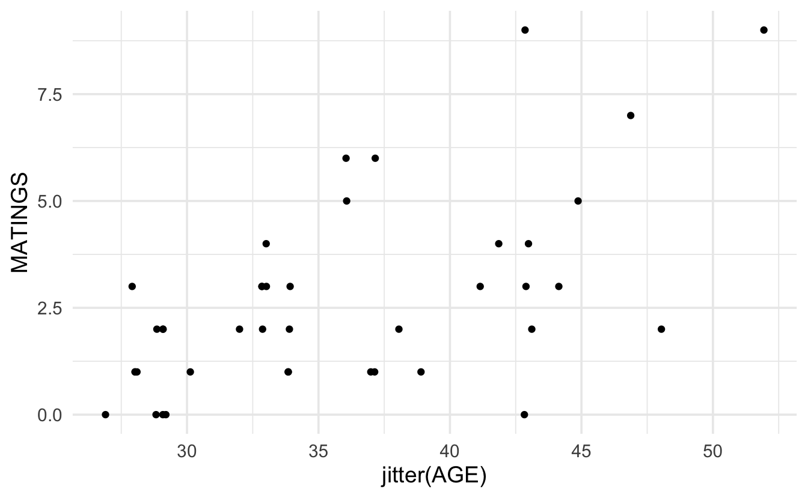
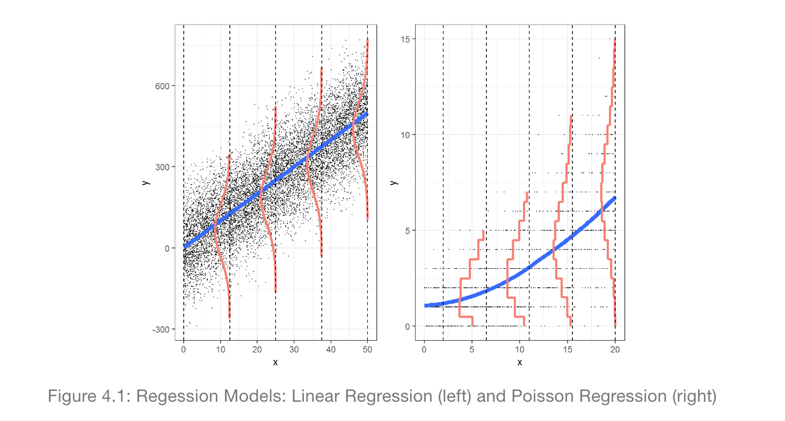
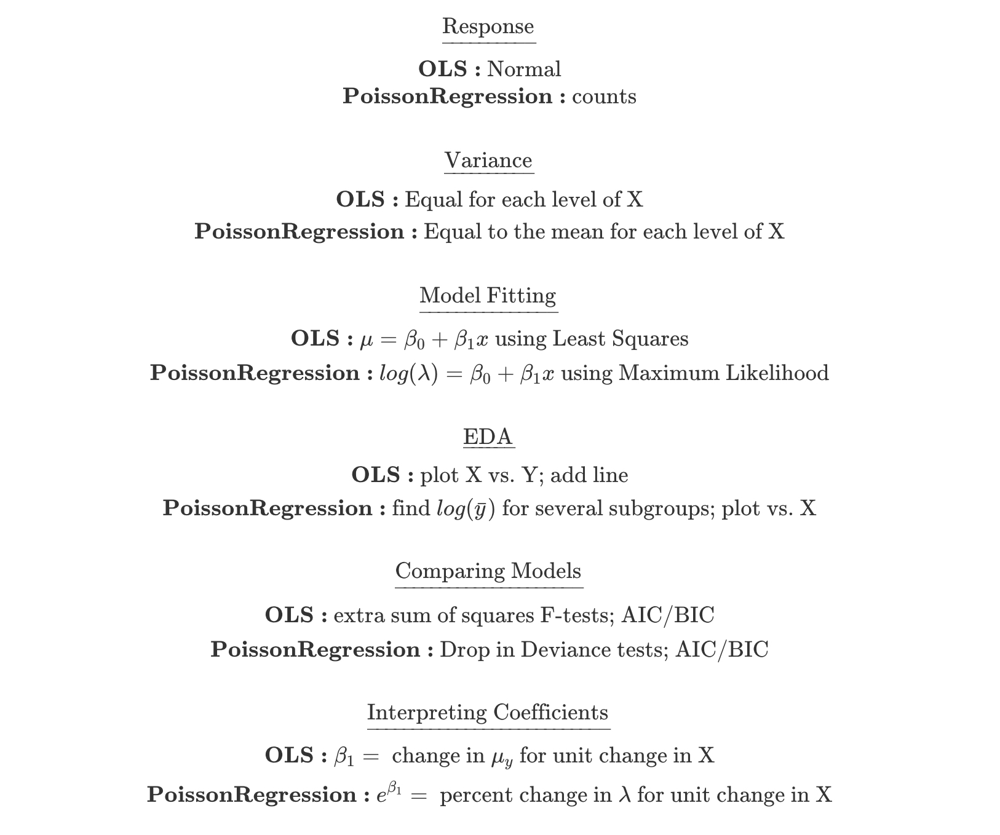

# Poisson Regression


## Regression Models

Consider the following example from @poole (described in @sleuth) on age and mating success (number of successful matings) in male African Elephants.


```r
elephants <- readr::read_csv("elephants.csv")

ggplot(elephants, aes(x=jitter(AGE), y=MATINGS)) + geom_point()
```



While it does seem like there is an increasing trend in the two variables, there are some concerns with directly applying linear regression.  Indeed, the example above acts as a proxy for many regression examples where the response variable is a count with particular properties:

1. The response variable is a count (in particular, it cannot be negative).

2. The model may or may not be linear in X.

3. The model appears to have increasing variance as a function of X.


For the setting above, it is often preferable to use Poisson regression instead of the nomal errors linear regression.  

### The Poisson Regression Model

The Poisson distribution is given by a probability function of the form:

$$P(Y = y) = \frac{e^{-\mu} \mu^y}{y!} \ \ \ \ \ y=0, 1, 2, \ldots$$

Which gives: $E(Y) = \mu$ and $Var(Y) = \mu$.   That is, the Poisson model is characterized by a mean and variance given by the same value.


Recall that with linear regression, $E(Y_i) = \beta_0 + \beta_1 X_i$ which might be a reasonable idea to apply to the count data; however, as seen above, if the mean of the distribution is modeled strictly as a linear function in $X$, then the line has the potential to predict negative counts and the variability will not be a function of $X$ if normal errors regression is used.

An alternative the normal errors regression is to use a $\ln$ transformation to describe the relationship between the predicted value of the response and the explanatory variables of interest:

$$\ln(E(Y_i)) = \ln(\mu_i) = \beta_0 + \beta_1 X_i.$$
where the observed counts come from a Poisson model:  $Y_i \sim Pois(\mu_i)$ and the Poisson parameter is given as a function of the explanatory variable(s).  [Note that Poisson regression contains no error term like linear regression because the Poisson distribution has inherent variability which is determined by the mean which equals the variance.]

####  Technical Conditions

Like every model, there are technical conditions associated with Poisson Regression.  The closer the data (population) conform to the conditions, the more useful the model will be at describing the context at hand.  Remember, 
 > All models are wrong, but some models are useful."  -George Box.  
 
 So, assessing whether the technical conditions are reasonable will help in determing whether the analysis performed under a particular model was a good thing to do.
 
1. Line:  The log of the mean is a linear function of $X$:  $\ln(\mu_i) = \beta_0 + \beta_1 X_i.$
2. Independence: The observations are independent (often characterized by a simple random sample or something approximating a simple random sample).
3. Poisson: The response variable is a count.
4. Error: The mean of the response variables is equal to the variance of the response variable for each combination of explanatory variables in the model.





### Comparison to Linear Regression

One question that might come to mind is whether there is any difference in the Poisson log-linear model and a normal errors regression model with a log transformation on the response???  The short answer is that yes, there is a difference.

* **Poisson Log-Linear:**  $\ln(E(Y_i)) = \beta_0 + \beta_1 X_i, Y_i \sim Pois(e^{\beta_0 + \beta_1 X_i})$

* **Normal w Log Transformation:**  $E(\ln(Y_i)) = \beta_0 + \beta_1 X_i, \ln(Y_i) \sim N(\beta_0 + \beta_1 X_i, \sigma^2)$

There are two main differences with the models.

1. The first is to remember that the average (i.e., expected value) of the logs is not the log of the averages.  So in the Poisson model, the linear function measures the log of the average, and in the normal model, the linear function measures the average of the logs.


```r
set.seed(47)
example <- abs(rcauchy(10))
example
```

```
##  [1]  0.07250266  2.39114995  0.93022166  0.62369321  4.25084018
##  [6]  1.45750156  2.75212953 10.21765703  7.30420453  0.24043747
```

```r
log(mean(example))
```

```
## [1] 1.106592
```

```r
mean(log(example))
```

```
## [1] 0.3426701
```

2.  The second difference to note across the two regression set-ups is that the variability is modeled differently.  Indeed, the likelihood functions are quite different and will produce different maximum likelihood estimates of the parameter values.



###  Interpreting Poisson Regression Coefficients

As we've done with other generalized linear models (linear regression, logistic regression, even survival analysis!), in order to understand the model more completely, we look at the impact on the response variable for a one unit change in $X$.

Consider $X$ and $X+1$.

$$\frac{E(Y|X+1)}{E(Y|X)} = \frac{e^{\beta_0 + \beta_1 (X+1)}}{e^{\beta_0 + \beta_1 (X)}} = e^{\beta_1}$$

That is, $e^{\beta_1}$ represents the ratio of means for a one unit increase in $X$.  In the elephant example, for every additional year of life, we expect the elephant's mating success, on average, to change by a factor of $e^{\beta_1}$.  [For the saavy consumer, you might note that this is an additional contrast to normal error regression on the log transformed Y where it was required to interpret the multiplicative change in *median*.  Because with Poisson, the log is taken after the average, taking th inverse of the log gives the mean directly.  Previously, it was necessary to use the identity:  $median(log(Y)) - log(median(Y))$.]

###  Assessing Model Validity

Just as with linear regression we used scatterplots to give a sense of whether or not a linear regression was appropriate, we can use exploratory data anlaysis (including scatterplot!) to give a sense of whether or not Poisson regression is an appropriate model.  [The EDA steps here are based on excellent descriptions of Poisson model building in @bysh.]


**Technical Condition 3, Poisson:** Let's first look at the respone variable.  A histogram of the number of successful matings shows a right skew which is typically not acceptable for normal errors regression (although, remember, the value of the response variable is dependent on the value of the explanatory variable!)


Likely, it makes more sense to look at the distribution of the response variable at each value of the explanatory variables.  Because the sample size is limited, we group the age variable into 5 year increments.  Looking at the plot below, again it seems as though, even when conditioning on the explanatory variable, the response is right skewed with variance dependent on the mean.  It might also be good to find the sample mean per group and plot the Poisson probabilities onto each bar.


**Technical Condition 4, Error:** To check whether the mean and variance are similar, we can calculate the values per group  (with more data we would probably have more groups of the explanatory variable, and the following analysis would be done with a scatterplot of means on the x-axis and variance on the y-axis).  Note that the mean and variance are reasonably similar!  When the "mean=variance" condition is violated, it is almost always violated in such that the variance is even *bigger* than would have been expected by the Poisson model.  Large variance is called overdispersion, and methods for measuring and accounting for overdispersion are given in the following section \@ref{overdis}.


```
## # A tibble: 3 x 5
##   AGEgroups  mean variance stdev     n
##   <chr>     <dbl>    <dbl> <dbl> <int>
## 1 (20,30]    1.08    0.992 0.996    12
## 2 (30,40]    2.71    2.85  1.69     17
## 3 (40,55]    4.25    7.84  2.80     12
```

**Technical Condition 1, Line:** The Poisson model implies that the log of the mean will be a linear function of the explanatory variable:

$$\ln(\mu_i) = \beta_0 + \beta_1 X_i,$$
which means we'd really like to plot $\mu_i$ as a function of the explanatory variable.  Unfortunately, $\mu_i$ is unknown, and so cannot be plotted.  We can, however, plot the log of the average value of the response for a group of x values which are close to one another.  In the plot below, we've grouped observations based on the age of the elephants being within 3 years of years of each other.   It is actually quite linear!  The points that don't follow the linear relationship are based on age groups with very few observations.


```r
matelogmean <- elephants %>%
  dplyr::mutate(agecut = cut(AGE, breaks=seq(26.5,53.5,by=3))) %>%
  group_by(agecut) %>%
  summarize(meanmate = mean(MATINGS), logmate = log(mean(MATINGS)), n = n() )

elephantsGRP <- cbind(matelogmean, age = c(seq(26.5,52.5,by=3)+1.5 ))

elephantsGRP
```

```
##        agecut meanmate    logmate  n age
## 1 (26.5,29.5] 1.090909 0.08701138 11  28
## 2 (29.5,32.5] 1.500000 0.40546511  2  31
## 3 (32.5,35.5] 2.444444 0.89381788  9  34
## 4 (35.5,38.5] 3.500000 1.25276297  6  37
## 5 (38.5,41.5] 2.000000 0.69314718  2  40
## 6 (41.5,44.5] 3.571429 1.27296568  7  43
## 7 (44.5,47.5] 6.000000 1.79175947  2  46
## 8 (47.5,50.5] 2.000000 0.69314718  1  49
## 9 (50.5,53.5] 9.000000 2.19722458  1  52
```

```r
elephantsGRP %>% ggplot(aes(x=age, y=logmate)) + geom_point()
```


#### Residuals

Pearson residual:

$$res_{pi} = \frac{y_i - \hat{\mu}_i}{\hat{\mu}_i}$$

Deviance residual:

$$res_{di} = [-\hat{\mu}_i + y_i \ln(\hat{\mu}_i) - \ln(y_i!) ] - [-y_i + y_i \ln(y_i) - \ln(y_i!) ] = y_i-\hat{\mu}_i + y_i \ln\bigg(\frac{\hat{\mu}_i}{y_i}\bigg) $$

#### Dealing with Overdispersion {#overdis}

## Inference in Poisson Regression

Recall that in Poisson regression, $E(Y_i) = \mu_i = e^{\beta_0 + \beta_1 X_i}$.  Therefore, the probability fuction for the $i^{th}$ observation is:

$$f(y_i) = \frac{e^{-\mu_i} \mu_i^{y_i}}{y_i!} = \frac{e^{-e^{\beta_0 + \beta_1 X_i}} \bigg(e^{\beta_0 + \beta_1 X_i}\bigg)^{y_i}}{y_i!}.$$
Which gives the resulting likelihood of:


$$L(\beta_0, \beta_1) = \prod_{i=1}^n f(y_i) = \prod_{i=1}^n \frac{e^{-\mu_i} \mu_i^{y_i}}{y_i!} = \prod_{i=1}^n \frac{e^{-e^{\beta_0 + \beta_1 X_i}} \bigg(e^{\beta_0 + \beta_1 X_i}\bigg)^{y_i}}{y_i!}.$$

And the log likelihood becomes:

$$l(\beta_0, \beta_1) = \ln L(\beta_0, \beta_1) = \sum_{i=1}^n \bigg(-\mu_i + y_i \ln(\mu_i) - \ln(y_i!) \bigg) = \sum_{i=1}^n \bigg(-e^{\beta_0 + \beta_1 X_i} + y_i (\beta_0 + \beta_1 X_i) - \ln(y_i!) \bigg).$$

### Maximum Likelihood 

### Wald Tests

### Drop-in-Deviance Tests

