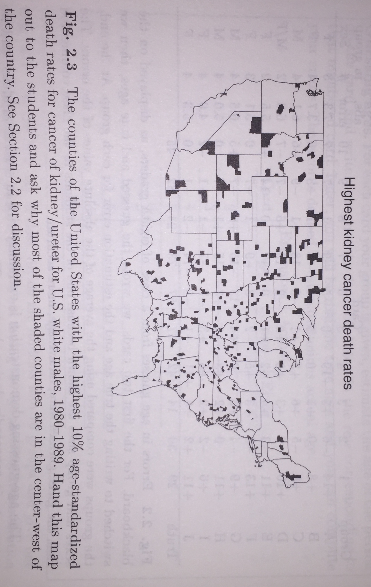
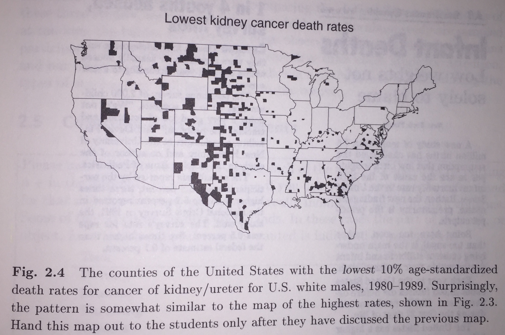

# Bayesian Estimation {#bayes}

<!--
% Great Shiny App that compares Bayesian & Frequentist:
% https://kruschke.shinyapps.io/KruschkeFreqAndBayesApp/
% https://link.springer.com/article/10.3758%2Fs13423-016-1221-4
% Psychonomic Bulletin & Review
% February 2018, Volume 25, Issue 1, pp 178?206 
% The Bayesian New Statistics: Hypothesis testing, estimation, meta-analysis, and power analysis from a Bayesian perspective
% John Kruschke
-->

```{r echo = FALSE, warning = FALSE, message = FALSE}
knitr::opts_chunk$set(warning = FALSE, message = FALSE)
```


## Bayes' Rule

```{theorem}
**Bayes' Rule**  

Given events $A$ and $B$,
\begin{eqnarray*}
P(A|B) &=& \frac{P(AB)}{P(B)} = \frac{P(B|A) P(A)}{P(AB) + P(A^cB)} \nonumber \\
&=& \frac{P(B|A)P(A)}{ \sum_i P(B|A_i) P(A_i)}
\end{eqnarray*}
```


Many of the following examples may be familiar to you.  When reading them, work to understand both the intuition (the **denominator** changes when we condition!) as well as the mathematical connection to Bayes' Rule.

::: {.example}
Suppose the rate of infection with TB is 1 in 1000 (about 0.1 percent = 0.001).  Suppose a TB test is used which is 90% accurate: it gives a positive result for 10 percent of people who do not actually have TB, but do have a reaction to the skin test. Also, 10% of the people who actually have TB fail to react to the test.^[Example taken from *A Course in Probability* by Neil Weiss.]

* What's the chance that someone has TB if they test positive? 
* What's the chance that a randomly chosen person tests negative and actually has TB? 
* There is another TB test which gives fewer false positives, but is more expensive.   Would it be better to use that one? 
* What is the prior probability of having TB? 
* What is the posterior probability of having TB (given a positive test)?

**Solution:**  

We can use a table to figure out the probabilities.  Consider a population with 10,000 people:

|       | Test + | Test - |  Total |
|-------|:------:|:------:|:------:|
| TB +  |    9   |    1   |   10   |
| TB -  |   999  |  8,991 |  9,990 |
| Total |  1,008 |  8,992 | 10,000 |


Alternatively, we can use probability statements which will be easier to work with in the long-run as the scenarios get more complicated.  We know the following:

\begin{eqnarray*}
P(TB + ) &=& 0.001\\
P(Test + | TB - ) &=& 0.1 \\
P(Test - | TB + ) &=& 0.1
\end{eqnarray*}
  
* 10 in 10,000 people will have the disease.  9 of those 10 will actually test positive for TB.  However, 999 of 9990 people will be false positives.  so, only $9/(999+9) = 0.0089 \mbox{ or } \approx$ 0.9% of people who test positive actually have TB. 

\begin{eqnarray*}
P( TB + | Test + ) &=& \frac{P(TB + \& Test + )}{P(Test + )} = \frac{P(Test  + | TB + ) P(TB+)}{P(Test + )}\\
&=& \frac{P(Test  + | TB + ) P(TB+)}{P(Test  + | TB - ) P(TB-) + P(Test  + | TB + ) P(TB+)} \\
&=& \frac{0.9 \cdot 0.001}{ 0.1 \cdot 0.999 + 0.9 \cdot 0.001}\\
&=& 0.0089
\end{eqnarray*}

* About 1 in 10,000 people will have a false negative (0.0001 = 0.01% as opposed to 9.99% false positives). 

\begin{eqnarray*}
P( TB + | Test - ) &=& \frac{P(TB + \& Test - )}{P(Test - )} = \frac{P(Test  - | TB + ) P(TB+)}{P(Test - )}\\
&=& \frac{P(Test - | TB + ) P(TB+)}{P(Test  - | TB - ) P(TB-) + P(Test  - | TB + ) P(TB+)} \\
&=& \frac{0.1 \cdot 0.001}{ 0.9 \cdot 0.999 + 0.1 \cdot 0.001}\\
&=& 0.00011121
\end{eqnarray*}

* Not necessarily, since it's much worse to have a false negative than a false positive.  People who test positive are then given another test with fewer false positives. 
* 0.001 
* 0.009 
:::

::: {.example}
A cab was involved in a hit and run accident at night.  Two cab companies, the Green and the Blue, operate in the city.  Suppose you are told the following:

* 85 percent of the cabs in the city are Green, and the remaining 15 percent are Blue.
* A witness identified the cab as Blue (but it was dark!)  The court tested the reliability of the witness under the same circumstances that existed on the night of the accident, and determined that the witness correctly identified the cab color 80% of the time, and made a mistake 20% of the time, regardless of the actual color of the cab.


What's the verdict? I.e., what is the probability that the cab involved in the hit-and-run was actually Blue?  

**Solution:**

From the information given, the following probabilities are known:
\begin{eqnarray*}
P(said B | B) &=& 0.8\\
P(said G | B) &=& 0.2\\
P(B) &=& 0.15 \ \ \ \mbox{prior probability!}
\end{eqnarray*}

The probability of interest is:
\begin{eqnarray*}
P(B | said B) &=& \frac{P(said B | B) P(B)}{P(said B | G) P(G) + P(said B | B) P(B)}\\
&=& \frac{0.8*0.15}{0.2*0.85 + 0.8*0.15} = 0.41
\end{eqnarray*}
:::

::: {.example}
Consider the famous Monte Hall problem based on a game show, *Let's Make a Deal*.   As part of the show, the contestant is asked to pick one of three doors.  Two of the doors have nothing behind them, and the third door has a car as a prize.  Monte Hall (the host) opens a non-prize door that the contestant hadn't chosen (there is always such a door available to open because there is only one prize).  Monte then offers the contestant the opportunity to switch from the original door to the remaining door.  Should she switch?  Stay?  Or it doesn't matter?  What is the probability of winning under each of the situations?


Define the following:
\begin{eqnarray*}
C_i &:& \mbox{the car is behind Door $i$, for } i \in \{ 1, 2, 3\}\\
H_{ij} &:& \mbox{the host opens Door $j$ after the player has picked Door $i$, for } i, j \in \{ 1,2,3\}
\end{eqnarray*}

For example, $C_2$ is the situation that the car is behind Door 2, and $H_{23}$ denotes the situation that the host opened Door 3 after I chose Door 2.  Note that $H_{ij}$ is the information we have (what we'll condition on).  Let's say you start off by picking Door 2, and the host opens Door 3.

\begin{eqnarray*}
P(C_i) &=& \frac{1}{3}\\
P(C_2) &=& \frac{1}{3}\\
P(C_2 | H_{23}) &=& \frac{P(H_{23} | C_2) P(C_2)}{P(H_{23})} \ \ \ \ \ \mbox{(Bayes rule, right here!  See } P(H_{23}) \mbox{ below)}\\
&=& \frac{\frac{1}{2} \cdot \frac{1}{3}}{P(H_{23})} \\
\nonumber \\
P(H_{23}) &=&  P(H_{23} C_1) + P(H_{23} C_2) + P(H_{23} C_3)\\
&=&  P(H_{23} | C_1) P(C_1) + P(H_{23} | C_2) P(C_2) + P(H_{23} | C_3) P(C_3)\\
&=& \frac{1}{2} \cdot \frac{1}{3} + 1 \frac{1}{3} + 0 \frac{1}{3} = \frac{1}{2}\\
\nonumber\\
P(C_2 | H_{23}) &=& \frac{\frac{1}{2} \cdot \frac{1}{3}}{\frac{1}{2}}\\
&=& \frac{1}{3}\\
\end{eqnarray*}

Using what we know about the rules of the game (that is, if the car is behind door 3, he'd never open it for you!), we know:
\begin{eqnarray*}
P(C_3 | H_{23}) = 0
\end{eqnarray*}

Because the car has to be behind one of the three doors:
\begin{eqnarray*}
1 &=& P(C_1 | H_{23}) + P(C_2 | H_{23}) + P(C_3 | H_{23})\\
P(C_1 | H_{23} ) &=& 1 - P(C_2 | H_{23}) - P(C_3 | H_{23})\\
&=& 1 - \frac{1}{3} - 0\\
&=& \frac{2}{3}
\end{eqnarray*}


So.... the probability that the car is behind Door 1 is 2/3 where the probability that it's behind Door 2 is 1/3 $\rightarrow$ you should switch doors!
:::


The previous situations have all been based on discrete values for both the parameter and the data (neither of which are typically true).  If we think of {\bf A = parameter} and {\bf B = data}, we want to find the value of {\bf A} such that $P(A|B)$ is maximized.  We are going to use probability distribution functions (pdfs) instead of discrete probabilities, so we need more notation.

## Prior Distributions

A **prior distribution** is the distribution of a parameter (e.g., $\theta$) before observing any data.  Note:

* observations come from $f(x|\theta), \theta \in \Omega$
* we can express how likely $\theta$ is to be in various regions of $\Omega$ in terms of probability or a **distribution** on $\theta$.
* **Bayesians** believe we should use prior distributions for all our modeling because we always know *something* about the situation at hand.
* **Frequentists** believe we should only use the data collected in the experiment or sample (and no prior information).

```{example}
We want to predict the high temperature on a given day in October.
\begin{align*}
\Omega = \{ (\theta, \sigma^2) &: \theta \in I\!\!R, \sigma^2 \in I\!\!R^+\}\\
\mbox{or } &: -\infty < \theta < \infty, \sigma^2 > 0 \}\\
\mbox{or } &: \theta > 30, 0 < \sigma^2 < 625 \}\\
\end{align*}
Suppose we know the variance $\sigma^2 = 12^2$.  The mean, $\theta$ is unknown.  We might specify the prior distribution on $\theta$ as:
\begin{eqnarray*}
\xi (\theta) &\rightarrow& \theta \sim N(\mu, \nu^2)\\
&& \mu =78^\circ, \nu^2 = (2.5^\circ)^2\\
\end{eqnarray*}
```


The value for $\nu$ is a measure of the uncertainty of our **prior beliefs**.  That is, we have estimated $\theta$ to be $78^\circ$, but we aren't sure of that value, so we add some uncertainty on to our belief ($\nu$).  $\mu$ and $\nu$ are called **hyper-parameters**.


## Posterior Distributions

A **posterior distribution** is the conditional distribution of the parameter (e.g., $\theta$) given the observed data.

Aside, a little probability review:


```{example}
Suppose you are interested in rolling two dice.  Let $X$ be the larger value; let $Y$ be the sum of the two dice.  Find the **joint** and **marginal** distributions of $X$ and $Y$.  The solution is a table of **probabilities**:

| $X \backslash Y$ |        2       |        3       |        4       |        5       |        6       |        7       |        8       |        9       |       10       |       11       |       12       |       P(X)      |
|:----------------:|:--------------:|:--------------:|:--------------:|:--------------:|:--------------:|:--------------:|:--------------:|:--------------:|:--------------:|:--------------:|:--------------:|:---------------:|
|         1        | $\frac{1}{36}$ |                |                |                |                |                |                |                |                |                |                |  $\frac{1}{36}$ |
|         2        |                | $\frac{2}{36}$ | $\frac{1}{36}$ |                |                |                |                |                |                |                |                |  $\frac{3}{36}$ |
|         3        |                |                | $\frac{2}{36}$ | $\frac{2}{36}$ | $\frac{1}{36}$ |                |                |                |                |                |                |  $\frac{5}{36}$ |
|         4        |                |                |                | $\frac{2}{36}$ | $\frac{2}{36}$ | $\frac{2}{36}$ | $\frac{1}{36}$ |  |                |                |                |  $\frac{7}{36}$ |
|         5        |                |                |                |                | $\frac{2}{36}$ | $\frac{2}{36}$ | $\frac{2}{36}$ | $\frac{2}{36}$ | $\frac{1}{36}$ |                |                |  $\frac{9}{36}$ |
|         6        |                |                |                |                |                | $\frac{2}{36}$ | $\frac{2}{36}$ | $\frac{2}{36}$ | $\frac{2}{36}$ | $\frac{2}{36}$ | $\frac{1}{36}$ | $\frac{11}{36}$ |
| P(Y) | $\frac{1}{36}$ |  $\frac{2}{36}$ |  $\frac{3}{36}$ |  $\frac{4}{36}$ |  $\frac{5}{36}$ |  $\frac{6}{36}$ |  $\frac{5}{36}$ |  $\frac{4}{36}$ |  $\frac{3}{36}$ |  $\frac{2}{36}$ |  $\frac{1}{36}$ |
```


**More notation review**.  Suppose we have $n$ data points from $f(x| \theta)$.  We'll assume it's a simple random sample (SRS), and therefore the observations are independent.

\begin{eqnarray*}
f(x_1, x_2, \ldots, x_n| \theta) &=& f(x_1| \theta) f(x_2| \theta) \cdots f(x_n| \theta)\\
\mbox{where  } \underline{x} &=& \{ x_1, x_2, \ldots, x_n \}\\
f(x_1, x_2, \ldots, x_n| \theta) &=& f(\underline{x} | \theta)
\end{eqnarray*}


Remember, $f(\underline{x} | \theta)$ is the **conditional** distribution of $\underline{x}$ given $\theta$.  The **likelihood function**, $f(\underline{x} | \theta)$, is the joint pdf of the observations (representing: how **likely** are the data?).


Define
\begin{eqnarray*}
f(\underline{x}, \theta) &=& f(\underline{x} | \theta) \xi (\theta)\\
g_n(\underline{x}) &=& \int_\Omega f(\underline{x}, \theta) d\theta\\
&=& \int_\Omega f(\underline{x} | \theta) \xi(\theta) d\theta
\end{eqnarray*}

Remember, however, that we are interested in the probability of the parameter given the data:
\begin{eqnarray*}
\xi(\theta| \underline{x}) = \frac{f(\underline{x} | \theta) \xi(\theta)}{g_n(\underline{x})} \ \ \ \ \ \ \ \theta \in \Omega
\end{eqnarray*}

(Which is Bayes' Theorem!!!)

* The prior, $\xi(\theta)$ is the relative likelihood of $\theta$ \underline{before} any data have been observed.
* The posterior, $\xi(\theta | \underline{x})$ is the relative likelihood of $\theta$ **after** $\underline{X} = \underline{x}$ have been observed.


We know that **the posterior is a function of $\theta$**.  It's important to keep in mind what a function is, and that the posterior is **not** a function of the data.

\begin{eqnarray*}
\xi(\theta | \underline{x}) &\propto& f(\underline{x} | \theta) \xi(\theta)\\
\mbox{posterior} &\propto& \mbox{likelihood} \cdot \mbox{prior}
\end{eqnarray*}

So, the posterior is proportional to the product of the likelihood and the prior.  Note that $g_n(\underline{x})$ does not depend on $\theta$ and is part of the proportionality constant.  But, we can always find $g_n(\underline{x})$ because we know that the posterior integrates to 1.  (Sometimes $g_n$ is extraordinarily difficult to find.)
\begin{eqnarray*}
\int_\Omega \xi(\theta | \underline{x}) d\theta = 1
\end{eqnarray*}


```{example}
Suppose the true proportion of freethrows that Steph Curry is able to make successfully is unknown.  We assume that his freethrows are **distributed** according to a Bernoulli process.

\begin{eqnarray*}
X = \left\{ \begin{array}{ll}
    1 & \mbox{Curry makes the shot}\\
    0 & \mbox{Curry misses the shot}\\
    \end{array} \right.
\end{eqnarray*}
    
We say,
\begin{eqnarray*}
X &\sim& \mbox{Bernoulli}(\theta)\\
f(\underline{x}|\theta)&=&  \theta ^y (1 - \theta)^{n-y} \ \ \ \ y = \sum_{i=1}^n x_i
\end{eqnarray*}

\noindent
Note: here $\underline{x} = \{x_1, x_2, \ldots, x_n\}$ is a specific ordering of 0s and 1s.

\bigskip

If we have **no prior** information about Curry's abilities, we put a uniform prior on $\theta$.

\begin{eqnarray*}
\xi(\theta) = \left\{ \begin{array}{ll}
    1 & 0 \leq \theta \leq 1\\
    0 & \mbox{else}\\
    \end{array} \right.
\end{eqnarray*}

\begin{eqnarray*}
\xi(\theta | \underline{x}) \propto \theta^y (1-\theta)^{n-y} I_{[0,1]}(\theta)
\end{eqnarray*}

is the functional form of the posterior (the likelihood times the prior).  We're trying to estimate $\theta$, what distribution does $\theta$ have given the data?  Recall the Beta distribution (probability review):

\begin{eqnarray*}
W &\sim& \mbox{Beta}(\alpha,\beta)\\
f(w) &=& \frac{1}{B(\alpha,\beta)} w^{\alpha - 1} (1-w)^{\beta-1}\\
&=& \frac{\Gamma(\alpha + \beta)}{\Gamma(\alpha) \Gamma(\beta)}w^{\alpha - 1} (1-w)^{\beta-1} \ \ \ \ w \in [0,1]
\end{eqnarray*}


Using the likelihood and the prior, we are able to find the full posterior distribution through integration:
\begin{eqnarray*}
1 &=& \int_\Omega \xi(\theta | \underline{x}) d\theta \\
&=&  k \cdot \int_\Omega \theta^y (1-\theta)^{n-y} I_{[0,1]}(\theta) d\theta\\
&=& k \cdot \int_0^1 \theta^y (1-\theta)^{n-y} d\theta\\
&=& k \cdot \frac{\Gamma(y+1)\Gamma(n-y+1)}{\Gamma(y+1 + n-y + 1)} \cdot \int_0^1 \frac{\Gamma(y+1 + n-y + 1)}{\Gamma(y+1)\Gamma(n-y+1)} \theta^{y+1-1} (1-\theta)^{n-y+1-1} d\theta\\
&=& k \cdot \frac{\Gamma(y+1)\Gamma(n-y+1)}{\Gamma(n+2)} \cdot 1\\
k &=& \frac{\Gamma(n+2)}{\Gamma(y+1)\Gamma(n-y+1)}\\
g(\underline{x}) &=& \frac{\Gamma(y+1)\Gamma(n-y+1)}{\Gamma(n+2)}\\
\xi(\theta | \underline{x}) &=& \frac{\Gamma(n+2)}{\Gamma(y+1)\Gamma(n-y+1)} \theta^y (1-\theta)^{n-y} I_{[0,1]}(\theta)
\end{eqnarray*}

Note, however, we didn't actually need to integrate to find $g(\underline{x})$.  We simply needed to note that $\theta$ takes the place of $w$ in the above Beta distribution, and we would automatically know the appropriate constant value.
```

What if we do have some information about the prior distribution on $\theta$?  Suppose we believe it is Beta(a,b). \Big(Note: $E[\theta] = \frac{a}{a+b}$, Var$(\theta) = \frac{ab}{(a+b)^2 (a+b+1)}$, SD$(\theta) = \sqrt{\frac{ab}{(a+b)^2 (a+b+1) }} $ \Big).

\begin{eqnarray*}
\xi(\theta) &\propto& \theta^{a-1} (1-\theta)^{b-1} I_{[0,1]}(\theta)\\
\xi(\theta | \underline{x}) &\propto& \theta^y (1-\theta)^{n-y} \theta^{a-1} (1-\theta)^{b-1} I_{[0,1]}(\theta)\\
&\propto& \theta^{y+a-1} (1-\theta)^{n-y+b-1} I_{[0,1]}(\theta)\\
\theta| \underline{x} &\sim& \mbox{Beta}(y+a, n-y+b)\\
\xi(\theta | \underline{x}) &=& \frac{\Gamma(n+a+b)}{\Gamma(y+a)\Gamma(n-y+b)}\theta^{y+a-1} (1-\theta)^{n-y+b-1}
\end{eqnarray*}

* Note: we didn't need to calculate $g(\underline{x})$!!!
* $E[\theta | \underline{x}] = \frac{y+a}{n+a+b}$
* Var $(\theta | \underline{x}) = \frac{(y+a)(n+a+b)}{(n+a+b)^2 (n+a+b+1)}$
* SD $(\theta | \underline{x}) = \sqrt{\frac{(y+a)(n+a+b)}{(n+a+b)^2 (n+a+b+1)}}$
* Given your prior and a sample of size $n$, what is your best guess for Curry's ability to hit freethrows?
* What kind of confidence do you have about that estimate?


## Conjugate Prior Distributions

A **conjugate prior distribution** is one where the prior distribution is in the same family as the posterior distribution.  The Beta distribution is conjugate to the Binomial distribution (note, the $U[0,1]$ distribution is Beta($\alpha$=1,$\beta$=1)).

```{example}
Continuing the example on temperature, $X \sim N(\theta, \sigma^2$ (known)) with a normal prior, $\theta \sim N(\mu, \nu^2)$.  Remember that typically, a prior is completely specified.  In our example $\mu=78$ and $\nu=2.5$.  We have:
\begin{eqnarray*}
f(\underline{x} | \theta) &\propto& \exp \bigg[ - \frac{1}{2 \sigma^2} \sum_{i=1}^n (x_i - \theta)^2 \bigg]\\
&\propto& \exp \Bigg[ - \frac{1}{2 \sigma^2} \bigg(n (\theta-\overline{x})^2 + \sum_{i=1}^n (x_i - \overline{x})^2 \bigg) \Bigg]\\
&\propto& \exp \bigg[ - \frac{n}{2 \sigma^2} (\theta - \overline{x})^2\bigg]\\
&&\\
\xi(\theta) &\propto& \exp \bigg[ - \frac{1}{2 \nu^2} (\theta - \mu)^2 \bigg]\\
&&\\
\xi(\theta|\underline{x}) &\propto& f(\underline{x} | \theta) \xi (\theta)\\
&\propto& \exp \bigg[ - \frac{n}{2 \sigma^2} (\theta - \overline{x})^2 -\frac{1}{2 \nu^2} (\theta - \mu)^2 \bigg]\\
\mbox{note: } && \frac{n}{\sigma^2}(\theta - \overline{x})^2 + \frac{1}{\nu^2}(\theta - \mu)^2 = \frac{1}{\nu_1^2}(\theta - \mu_1)^2 + \frac{n}{\sigma^2 + n \nu^2}(\overline{x}-\mu)^2 \ \ \ \mbox{ pg 399}\\
\xi(\theta|\underline{x}) &\propto& \exp \bigg[ - \frac{1}{2 \nu_1^2} (\theta - \mu_1)^2 \bigg]\\
\theta | \underline{x} &\sim& N (\mu_1, \nu_1^2)\\
\mbox{where: } && \mu_1 = \frac{\sigma^2 \mu + n \nu^2 \overline{x}}{\sigma^2 + n \nu^2} \ \ \ \ \nu_1^2 = \frac{\sigma^2 \nu^2}{\sigma^2 + n \nu^2}
\end{eqnarray*}
```


Remember, when we are computing the posterior for $\theta$, we can ignore anything that doesn't depend on $\theta$ (other "known" parameters, data, constants,...)

| Prior  | Likelihood                    | Posterior |
|--------|-------------------------------|-----------|
| Beta   | Bernoulli, Binomial, Geometric, Negative Binomial  | Beta      |
| Gamma  | Poisson, Gamma (with known first parameter), exponential | Gamma     |
| Normal | Normal (with known second parameter)    | Normal    |
: Some of the conjugate families.  Note that to be conjugate, the prior distribution will be of the *same* family as the posterior distribution.

## Improper Priors

Improper prior distributions are not actually probability functions, yet they lead to posterior distributions that are probability functions (that is, they integrate to 1).   Improper priors capture the idea that the data are worth more than the prior belief.  Often, an improper prior will lead to a Frequentist result.  For example, a Beta(0,0) prior with a Bernoulli likelihood leads to:

\begin{eqnarray*}
\xi(\theta) = \left\{ \begin{array}{ll}
    \theta^{-1}(1-\theta)^{-1} & 0 \leq \theta \leq 1\\
    0 & \mbox{else}\\
    \end{array} \right.
\end{eqnarray*}

Where $\xi(\theta)$ does not integrate to 1, so is not a proper pdf.  However the posterior is a proper pdf,

\begin{eqnarray*}
\xi(\theta | \underline{x}) &\propto& \theta^y (1-\theta)^{n-y} \theta^{-1} (1-\theta)^{-1} I_{[0,1]}(\theta)\\
&\propto& \theta^{y-1} (1-\theta)^{n-y-1} I_{[0,1]}(\theta)\\
\theta| \underline{x} &\sim& \mbox{Beta}(y, n-y)\\
\xi(\theta | \underline{x}) &=& \frac{\Gamma(n)}{\Gamma(y)\Gamma(n-y)}\theta^{y-1} (1-\theta)^{n-y-1}\\
\mbox{Note: } && E[\theta | \underline{X} ] = \frac{y}{n} \ \ \ \mbox{ as expected under the frequentist model!}
\end{eqnarray*}


All conjugate priors have an improper prior as a limiting case:  Beta(0,0), gamma(0,0), Normal($\mu, \nu^2 = \infty$).  The normal improper prior ignores the prior constant, and becomes:

\begin{eqnarray*}
\xi(\theta) = \lim_{\nu^2 \rightarrow \infty} exp\bigg(-\frac{1}{2\nu^2}(\theta - \mu)^2\bigg) = 1
\end{eqnarray*}


That is, the improper normal prior is a flat line over all the reals.  Note that if the improper normal prior is used with the normal likelihood, the posterior will be $\theta | \underline{x} \sim N (\underline{x}, \sigma^2 /n)$.  [That is, a prior indicating no knowledge of $\theta$ produces a posterior that depends only on the data.]

## Bayes' Estimators

Prior and posterior distributions tell us how Bayesians think about parameters.  The next question we need to address is how do they think about estimators?  An **estimator** is a function of the data that we hope is close to the true value of the parameter.


Note:
\begin{eqnarray*}
\delta(X_1, X_2, \ldots, X_n) &=& \delta(\underline{X}) \mbox{  is our estimator}\\
\delta(x_1, x_2, \ldots, x_n) &=& \delta(\underline{x}) \mbox{  is our estimate}\\
\end{eqnarray*}


### Loss functions

(You are not responsible for the material on loss functions.  The take away message from this section is that the Bayes estimator we will use is the expected value of the posterior distribution.  However, as seen below, there are other Bayes estimators, for example, the median of the posterior distribution could be used.)

We want an estimator of $\theta$ that leads to an estimate which is close to the **true** value of $\theta$.  A **loss function** helps determine how far off an estimator is.  For a particular estimate, $a$:
\begin{eqnarray*}
\mbox{squared error loss: } L(\theta, a) &=& (\theta - a)^2\\
\mbox{absolute error loss: } L(\theta, a) &=& |\theta - a|\\
\end{eqnarray*}
We want the loss to be small (minimized).


#### Squared Error Loss {-}

**Without data**, find $a$ that minimizes:
\begin{eqnarray*}
E[L(\theta,a)] = \int_\Omega L(\theta, a) \xi(\theta) d\theta
\end{eqnarray*}

**With data**, find $a$ that minimizes:
\begin{eqnarray*}
E[L(\theta,a) | \underline{X}] &=& \int_\Omega L(\theta, a) \xi(\theta| \underline{X}) d\theta\\
\end{eqnarray*}
Let $\delta^*(\underline{X})$ be the value of a such that such that
\begin{eqnarray*}
E[L(\theta, \delta^*(\underline{X})) | \underline{X} ] &=& \min_{a \in \Omega} E[ L(\theta,a) | \underline{X} ]\\
\delta^*(\underline{X}) && \mbox{ is the Bayes estimator of } \theta\\
\delta^*(\underline{x}) && \mbox{ is the Bayes estimate of } \theta\\
\end{eqnarray*}
So what is $\delta^*$?


Note: $\delta^*$ depends on the loss function and the prior / posterior.

\begin{eqnarray*}
E[L(\theta, a) | \underline{X} ] &=& E[ (\theta - a)^2 | \underline{X}]\\
&=& E[ \theta^2 - 2a\theta + a^2 | \underline{X}]\\
&=& E[\theta^2 | \underline{X}] - 2a E[\theta | \underline{X}] + a^2\\
&&\\
\frac{\partial E[ (\theta - a)^2 | \underline{X}]}{\partial a} &=& 0\\
&&\\
- 2 E[\theta | \underline{X}] + 2a &=& 0\\
a &=& E[\theta | \underline{X}] = \delta^*(\underline{X}) !!!\\
&&\\
\frac{\partial^2 E[ (\theta - a)^2 | \underline{X}]}{\partial a^2} &=& 2 > 0 \rightarrow \mbox{ loss is minimized}\\
\end{eqnarray*}


```{example, tape}
Let $\theta$ denote the average number of defects per 100 feet of tape.  $\theta$ is unknown, but the prior on $\theta$ is a gamma distribution with $E[\theta] = \alpha / \beta = 2/10, \alpha= 2, \beta = 10$. When a 1200 foot roll of tape is inspected, exactly 4 defects are found.

What is the Bayes' estimate of the average number of defects per 100 feet?

\begin{eqnarray*}
\mbox{Prior:     }&&\\
\xi(\theta) &=& \frac{\beta^\alpha}{\Gamma(\alpha)} \theta^{\alpha-1} e^{-\beta \theta} = \frac{10^2}{\Gamma(2)} \theta e^{-10\theta}\\
\mbox{Likelihood:     }&&\\
f(\underline{x} | \theta) &=& \prod_{i=1}^n \frac{e^{-\theta} \theta^{x_i}}{x_i!} = \frac{e^{-n\theta} \theta^{\sum x_i}}{\prod (x_i !)}\\
\mbox{Posterior:     }&&\\
\xi(\theta | \underline{x}) &\propto& \frac{ \theta e^{-10\theta} e^{-n \theta} \theta^{\sum x_i}}{\Gamma(2) 10^2 \prod (x_i !)}\\
&\propto& e^{-\theta(n+10)} \theta ^{\sum x_i + 1} \\
\\
\theta | \underline{x} &\sim& \mbox{Gamma } (\sum x_i + 2 = 6, n + 10 = 22)\\
\\
\delta^*(\underline{X}) &=& \frac{ \sum X_i + 2}{n+10}\\
\delta^*(\underline{x}) &=& \frac{6}{22} = \frac{3}{11}
\end{eqnarray*}

\noindent
Note: The Gamma distribution is parameterized slightly differently in DeGroot and on your sheet (as is the exponential).  Make sure the expected value matches what you've been given in the problem.
```

#### Absolute Loss {-}

How do we minimize $E[ | \theta - a |  | \underline{X}]$ ?  $\rightarrow \ \ \ \delta^*(\underline{X}) = \mbox{median} (\theta | \underline{X})$ (see Theorem 4.5.1 in @degroot).  However, it isn't always obvious how to compute the median for non-symmetric distributions.  And for symmetric distributions median = mean.

## Evaluating Bayes Estimators

### Mean Squared Error

Before we get to MSE, let's talk about the Agresti-Coull estimate of the Binomial parameter of the probability of success.  The estimator attenuates the sample proportion closer to 0.5 which has the effect of reducing the variability of the estimator.  Indeed, there is evidence that the "add two successes and two failures" approach will create more precise confidence intervals.^[Agresti, Alan; Coull, Brent A. (1998)."Approximate is better than 'exact' for interval estimation of binomial proportions". The American Statistician. 52: 119-126.]

Even though there is some agreement that it is a better estimate, we'd like to show here that it is biased.

\begin{eqnarray*}
\tilde{p} &=& \frac{X+2}{n+4}\\
E[\tilde{p}] &=& \frac{n\theta+2}{n+4}\\
bias(\tilde{p}) &=& \frac{n\theta+2}{n+4} - \theta\\
&=& \frac{n\theta + 2 - n\theta - 4\theta}{n+4}\\
&=& \frac{2-4\theta}{n+4}
\end{eqnarray*}


#### MSE in general ("Frequentist") {-}

The Mean Squared Error (MSE) is the expected squared difference between a parameter ($\theta$) and its estimate ($\hat{\theta}$), where, typically, $\hat{\theta}$ is a function of the data.

> The frequentist MSE is based on expected values taken with the likelihood pdf ($X | \theta$).

Note that the MSE can be written as a sum of the bias squared and the variance:
\begin{eqnarray*}
(\mbox{MSE}_F(\hat{\theta}(\underline{X})) =) \mbox{MSE}_F(\hat{\theta}) &=& E [ (\hat{\theta} - \theta)^2 ]\\
&=& E [ ( \hat{\theta} - E(\hat{\theta}) + E(\hat{\theta}) - \theta)^2 ] \mbox{ the RV is X!} \\
&=& E [ (\hat{\theta} -  E(\hat{\theta}))^2 + 2(\hat{\theta} - E(\hat{\theta}))(E(\hat{\theta}) - \theta) + (E(\hat{\theta}) - \theta)^2]\\
&=& E [ (\hat{\theta} -  E(\hat{\theta}))^2] + 0 + E[ (E(\hat{\theta}) - \theta)^2 ] \\
&=& E [ (\hat{\theta} -  E(\hat{\theta}))^2] + (E(\hat{\theta}) - \theta)^2  \\
&=& \mbox{var}(\hat{\theta}) + (\mbox{bias}(\hat{\theta}))^2
\end{eqnarray*}

Note that we are taking expected values, so the resulting MSE is a function of $\theta$ only (not a function of the data).

For example, consider the Bernoulli situation (e.g., the Basketball shooter):
\begin{eqnarray*}
\hat{\theta} &=& \frac{\sum X_i}{n}\\
Var(\hat{\theta}) &=& \frac{\theta}{n}\\
bias(\hat{\theta}) &=& E(\hat{\theta}) - \theta = 0\\
MSE_F(\hat{\theta}) &=& \frac{\theta}{n}\\
\end{eqnarray*}

#### Bayesian MSE {-}

For Bayesians, the MSE is simply the expected squared error loss conditional on the data (that is, the expected value is taken on the posterior, $\theta | \underline{X}$.)  

> The Bayesian MSE is based on expected values taken with the posterior pdf $(\theta | \underline{X}).$


If we let $\delta = \delta(\underline{X}) = E(\theta | \underline{X})$ be our estimator, the MSE is:
\begin{eqnarray*}
(\mbox{MSE}_B(\hat{\theta}(\underline{X})) =) \mbox{MSE}_B(\delta(\underline{X})) &=& E [ (\delta - \theta)^2 | \underline{X}]\\
&=& E [ ( E(\theta | \underline{X}) - \theta)^2 | \underline{X}] \mbox{the RV is } \theta \mbox{!!}\\
&=& \mbox{var}(\theta | \underline{X})\\
\end{eqnarray*}

Continuing the example, note that if $\theta \sim Beta(a,b)$, that means $\theta | \underline{X} \sim Beta(X + a, n - X + b)$.

\begin{eqnarray*}
\delta(X) &=& \frac{X + a}{n +a+b}\\
MSE_B(\delta(X)) &=& \frac{(X+a)(n+a+b)}{(n+a+b)^2(n+a+b+1)}\\
\end{eqnarray*}


Note that the Bayesian MSE is simply the posterior variance of the parameter of interest.  This is because we've used the expected value as our estimate, so there is no bias.  Note that the Bayesian MSE is a function of the data (and **not** $\theta$), so we cannot compare the Bayesian MSE and the Frequentist MSE directly.


```{example}
Recall the tape example, Example \@ref(exm:tape).  

* Prior: Gamma(2, 10)  (or (2, 1/10) depending on how you parametrize))
* Data likelihood: Poisson($\theta$)
* Posterior: Gamma \bigg($\sum X_i + 2$, $n$ + 10\bigg)

Note that the calculations done for the Frequentist MSE are **not** conditional on the data.

\begin{eqnarray*}
(\mbox{frequentist estimator}) \ \ \hat{\theta} &=& \frac{\sum X_i}{n}\\
(\mbox{Bayesian estimator}) \ \ \delta(\underline{X}) &=& \frac{\sum X_i+2}{n+10}\\
& \\
MSE_F(\hat{\theta}) &=& var(\hat{\theta}) + bias(\hat{\theta})^2\\
&=& \theta/n + 0 = \theta/n\\
MSE_B(\delta(\underline{X})) &= & var(\theta | \underline{X})\\
&=& \frac{\sum X_i+2}{(n+10)^2}\\
&&\\
MSE_F(\delta(\underline{X})) &=& var(\delta(\underline{X})) + bias(\delta(\underline{X}))^2\\
\end{eqnarray*}

\begin{eqnarray*}
bias(\delta(\underline{X})) &=& E\bigg[\frac{\sum X_i+2}{n+10}\bigg] - \theta\\
&=& \frac{n \theta +2}{n+10} - \theta = \frac{n\theta + 2 - n\theta -10\theta}{n+10}\\
&=& \frac{2-n\theta}{n+10}\\
var(\delta(\underline{X})) &=& var\bigg[\frac{\sum X_i+2}{n+10}\bigg]\\
&=& \frac{1}{(n+10)^2}var\bigg(\sum X_i\bigg)\\
&=& \frac{1}{(n+10)^2} n \  var(X_i)\\
&=& \frac{n}{(n+10)^2} \theta\\
\end{eqnarray*}

\begin{align*}
MSE_F(\delta(\underline{X})) &= \frac{n}{(n+10)^2} \theta + \frac{(2-n\theta)^2}{(n+10)^2}\\
&= \frac{n \theta+ (2-n\theta)^2}{(n+10)^2}
\end{align*}
Note that we couldn't directly compare $MSE_F$ and $MSE_B$ (they are functions of different variables!).  Because we'd have to come up with a prior to think about $MSE_B(\hat{\theta})$, it seems like we can't calculate that quantity.  Instead, we take the easier route, and find $MSE_F(\delta(\underline{X}))$ in order to have a reasonable comparison of estimators.
```


### Sensitivity of Estimators

How sensitive are our results to different priors?

```{example}
Continuing with the tape example, Example \@ref(exm:tape), below are different values for the estimate of theta depending on different priors and data values:

|                 | $\alpha = 2, \beta = 10$ | $\alpha = 8, \beta = 10$ | $\alpha = 2, \beta = 20$ |
|----------------:|:------------------------:|:------------------------:|:------------------------:|
|  $\hat{\theta}$ |  $\alpha / \beta = 0.2$  |  $\alpha / \beta = 0.8$  |  $\alpha / \beta = 0.1$  |
|    4 in 1200 ft |           0.273          |           0.545          |           0.188          |
| 40 in 12,000 ft |           0.323          |           0.368          |           0.300          |

  
Note:  $E[ \theta | \underline{x} ] = \frac{\sum x_i + \alpha}{ n + \beta} = w_1 \frac{\sum x_i}{n} + w_2 \frac{\alpha}{\beta}$, where $w_1 = \frac{n}{n+\beta}, w_2 = \frac{\beta}{n+\beta}$.\\
\noindent

As $n \rightarrow \infty, \hat{\theta} \rightarrow \frac{\sum x_i}{n}$, as $n \rightarrow 0, \hat{\theta} \rightarrow \frac{\alpha}{\beta}$.
```

### Consistency of Estimators

A **consistent** estimator of $\theta$ is one that converges in probability to $\theta$.  Many of the Bayes estimators are consistent.  In fact, under fairly general regularity conditions, a wide class of Bayes estimators are consistent.

Note, an estimator $Y_n$ converges to $\theta$ in probability if:
\begin{eqnarray*}
\lim_{n \rightarrow \infty} P [ | Y_n - \theta | < \epsilon ] &=& 1 \ \ \ \ \ \mbox{pg 233}\\
\mbox{or, equivalently}\\
\lim_{n \rightarrow \infty} P [ | Y_n - \theta | \geq \epsilon ] &=& 0\\
\end{eqnarray*}

(You saw this idea in the weak and strong laws of large numbers: $\overline{X} \stackrel{P}{\rightarrow} \mu$ as $n \rightarrow \infty$ is the Weak Law of Large Numbers.) [n.b.  In case you are curious, the strong law of large numbers says that $\overline{X} \stackrel{a.s.}{\rightarrow} \mu$ (almost surely).  That means $\lim_{n \rightarrow \infty} P [ \overline{X} = \mu ] = 1$

```{example}
Continuing with the tape example, Example \@ref(exm:tape):
\begin{eqnarray*}
\delta^*(\underline{X}) &=& \frac{\sum X_i + \alpha}{n+\beta}\\
\overline{X} &\stackrel{P}{\rightarrow}& \theta \mbox{ (WLLN)}\\
\mbox{and } && \\
\delta^*(\underline{X}) - \overline{X} &=& \frac{- \beta}{n+\beta} \overline{X} + \frac{\beta}{n+\beta} \frac{\alpha}{\beta} \stackrel{P}{\rightarrow} 0 \mbox{ (Slutsky's theorem)}\\
&& \\
\delta^*(\underline{X}) &\stackrel{P}{\rightarrow} \theta\\
\end{eqnarray*}

$\delta^*(\underline{X})$ is a consistent estimator of $\theta$.
```


## Benefits and Limitations of Bayes' Estimators

### Benefits

* you can incorporate other information
* the interpretation is more intuitive

### Limitations
* you need prior information
* it can be difficult to produce a prior on two parameters simultaneously (e.g., normal, gamma)
* you need to agree on the prior information


## Additional Examples

```{example}
Suppose there is a Beta(4,4) prior distribution on the probability $\theta$ that a coin will yield a `head` when spun in a specified manner.  The coin is independently spun ten times, and `heads` appears fewer than 3 times.  You are not told how many heads were seen, only that the number is less than 3.  Calculate your exact posterior density for $\theta$.^[Problem taken from *Bayesian Data Analysis* by Gelman, Carlin, Stern, and Rubin.]
```

```{example, baseball}
**Baseball and Bayes**^[Example taken from *The Practice of Statistics: Putting the Pieces Together* by Spurrier.]

You are a statistician employed by On The Ball Consulting.  Veteran major-league baseball scout Rocky Chew seeks your advice regarding estimating the probability that amateur baseball player John Spurrier will get a base hit against a major-league pitcher.  Rocky has arranged for Spurrier to have ten at bats against a major-league pitcher.

The traditional batting average, $\hat{\theta}_f = X/n$ is a frequentist estimator in that it makes use of the observed data, but ignores any prior information that might exist.^[Some of you baseball enthusiasts will be a bit uncomfortable that we're going to assume that our denominator is # of times up to bat.]  If we assume that the at bats are independent Bernoulli trials with a constant probability of getting a base hit, then
 
\begin{eqnarray*}
X \sim Bin( n=\mbox{number at bat}, \theta=\mbox{P(getting a base hit)})
\end{eqnarray*}

 $\hat{\theta}_f$, is a good estimator of the unknown probability (of getting a base hit), but it ignores information we might have about baseball.  You have the following prior information:

* John Spurrier appears to be a good but not great player.  He is one of the better batters on a somewhat above-average American Legion (high school) baseball team.
*  The few major-league scouts who have watched him play do not believe that Spurrier's batting ability is at the professional level.
* A barely adequate major-league hitter has a batting average of about 0.200.
* A very good major-league batter has a batting average of about 0.300.
* Ty Cobb has the all-time best major-league batting average of 0.366.

We're going to use a Beta prior to incorporate our previous knowledge.  What should that prior look like?


#### The Experiment {-}
1. John Spurrier will have n=10 at bats.  The random variable, $X$, will be the number of base hits that he gets.
2. Determining the prior probability: As a class we will find $\alpha$ and $\beta$ that are consistent with our prior information.
3. Collecting data: let's calculate our estimates for all possible realizations of the random variable.


| $x$   | $\hat{\theta}_f$   | $\ \ \ \ \ \ \ \ \ \hat{\theta}_b \ \ \ \ \ \ \ \ \ $  |   |
|-------|--------------------|--------------------------------------------------------|---|
| 0     | 0.00               |                                                        |   |
| 1     | 0.10               |                                                        |   |
| 2     | 0.20               |                                                        |   |
| 3     | 0.30               |                                                        |   |
| 4     | 0.40               |                                                        |   |
| 5     | 0.50               |                                                        |   |
| 6     | 0.60               |                                                        |   |
| 7     | 0.70               |                                                        |   |
| 8     | 0.80               |                                                        |   |
| 9     | 0.90               |                                                        |   |
| 10    | 1.00               |                                                        |   |

  
4. Comparison of the estimators:
$$ \ \ \ \ \hat{\theta}_f = \frac{x}{n} \ \ \ \ \ \ \ \hat{\theta}_b = \frac{x + \alpha}{ n + \alpha + \beta}$$
To evaluate the two estimators, we might use Mean Squared Error (MSE) in the frequentist sense (that is, $X$ is the random variable, $\theta$ is no longer random) to compare estimators (apples to apples):
\begin{eqnarray*}
MSE(\hat{\theta}) = E[(\hat{\theta} - \theta)^2] = Var(\hat{\theta}) + bias^2(\hat{\theta}) = Var(\hat{\theta}) + [E(\hat{\theta}) - \theta]^2
\end{eqnarray*}

5. Problems:
* What are your choices of $\alpha$ and $\beta$?  What features of the plot of the prior density function made you think these were good choices?
* Use properties of expectation of X, to find the bias (=$E[\hat{\theta}] - \theta$) and variance (=Var($\hat{\theta}$)) of $\hat{\theta}_f$ and $\hat{\theta}_b$.
* Do you recommend using $\hat{\theta}_f$ or $\hat{\theta}_b$?  Explain.
* If John Spurrier gets three hits in ten at bats, what is your estimate of $\theta$?
* Show that $\hat{\theta}_b$ is a weighted average of $\hat{\theta}_f$ and the prior mean, $\frac{\alpha}{\alpha + \beta}$.
```


::: {.example}
**Kidney Cancer rates**^[Example taken from *Teaching Statistics, a bag of tricks* by Gelman and Nolan.] In this example, we're going to use Bayes theory to adjust kidney cancer rates for less variability. First, we'd like to investigate the counties with the highest and lowest kidney cancer death rates in the US (white men, 1980-1989).  

* What patterns do you see in figures 2.3 & 2.4?  Can you give plausible reasons for the patterns you see? 
* What if a county only had 100 people?  Small counties are more variable.  Keep in mind that the rates are age-adjusted.

```{r fig.cap = "Figure 2.3 from Teaching Statistics, a bag of tricks by Gelman and Nolan.", fig.alt = "The caption reads: the counties of the United States with the highest 10% age-standardized death rates for cancer of kidney/ureter for U.S. white males, 1980-1989.", preview = TRUE, out.extra="style='transform:rotate(270deg);'", out.width="75%", echo = FALSE}

```

* Consider figure 13.4, the highest 10% of Bayes-estimated kidney cancer death rates in the US (white men, 1980-1989).  Let's assume that number of deaths is distributed Poisson($n_j \theta_j$) where $n_j$ is the number of people in the county, and $\theta_j$ is the true kidney cancer death rate in that county.  Further, we will assume that there are no outside influences on kidney cancer (e.g., pollution) and that each county's cancer rate comes from a Gamma distribution with parameters ($\alpha = 61, \beta = 47000$).  That is,

\begin{eqnarray*}
\mbox{Likelihood:} && y_j \sim \mbox{ Poisson}(n_j \theta_j) \ \ \ n_j = \mbox{ county population}\\
\mbox{Prior:} && \theta_j \sim \mbox{ Gamma}(\alpha=61, \beta = 47000)\\
&& E[\theta_j] = \alpha / \beta = 1.296 \times 10^{-3} \ \ \ \ (\mbox{10 yr cancer rate})\\
\end{eqnarray*}
We know that $E[\theta | y] = \frac{\alpha + y}{m + \beta}$.  How does this estimate compare to the frequentist estimate, $\hat{\theta} = \frac{y}{m}$?


* To investigate the relationship between the Bayes estimate versus the frequentist estimate, we're going to simulate kidney cancer death rates in a variety of counties.
* Everyone gets a county (and population).  For each county, we'll generate the *true*, underlying, kidney cancer rate $\theta_j$.  (Note, $\theta_j$ was sampled (or *simulated*) from a Gamma($\alpha=61, \beta=47,000$) distribution.)
* Using your cancer rate ($\theta_j$) and your county's population ($n_j$), simulate a value for the number of people in your county who have died from kidney cancer in the last 10 years (Poisson($n_j \theta_j$)).
* Report the frequentist estimate of the kidney cancer rate for your county (erase / hide the true cancer rate).  Leave only the county name, the population, the number of deaths, and the estimated rate.
* Our public officials are left with the task of guessing which counties have the highest cancer rates... what do you think?
* Calculate the Bayes estimate of the cancer rate.  Compare the underlying ($\theta_j$), observed / frequentist \big($\frac{y_j}{n_j}$\big), and posterior / Bayesian ($\hat{\theta}_j | y_j$) kidney cancer death rates.


| County                     | 2007 population |
|----------------------------|----------------:|
| Charleston County, SC      |         342,973 |
| Divide County, ND          |           2,004 |
| Durham County, NC          |         256,500 |
| Esmeralda County, NV       |             695 |
| Fayette County, KY         |         279,044 |
| Franklin County, OH        |       1,118,107 |
| Hardin County, IL          |           4,468 |
| King and Queen County, VA  |           6,882 |
| Lafayette County, MS       |          42,716 |
| Lehigh County, PA          |         337,343 |
| Los Angeles County, CA     |       9,878,554 |
| Loup County, NE            |             644 |
| Loving County, TX          |              55 |
| Major County, OK           |           7,190 |
| Mercer County, NJ          |         365,449 |
| New York County, NY        |       1,620,867 |
| Petroleum County, MT       |             438 |
| Pima County, AZ            |         967,089 |
| Prince George's County, MD |         828,770 |
| Putnam County, MO          |           4,913 |
| Real County, TX            |           2,965 |
| Rosebud County, MT         |           9,182 |
| Sacramento County, CA      |       1,386,667 |
| Slope County, ND           |             659 |
| Yellow Medicine County, MN |          10,128 |


```{r fig.cap = "Figure 2.4 from Teaching Statistics, a bag of tricks by Gelman and Nolan.", fig.alt = "The caption reads: the counties of the United States with the lowest 10% age-standardized death rates for cancer of kidney/ureter for U.S. white males, 1980-1989.  Surprisingly, the pattern is somewhat similar to the map of the highest rates, show in Figure 2.3.", preview = TRUE, out.width="75%", echo = FALSE}

```

:::


## <i class="fas fa-lightbulb" target="_blank"></i> Reflection Questions

1. What is a prior distribution?  What is the random variable described by a prior?
2. What is a likelihood?  What is the random variable described by a likelihood?
3. What is a posterior distribution?  What is the random variable described by a posterior?
4. What is a conjugate prior?  What is the benefit of a conjugate prior?
5. Is all hope lost if the prior is not conjugate?  If it is not, how would we approach the problem of coming up with a posterior?


## <i class="fas fa-balance-scale"></i> Ethics Considerations

1. When does it make sense to incorporate prior information?  When doesn't it make sense to incorporate prior information?
2. What are some legitimate ways to calculate a prior?  What are some illegitimate ways to calculate a prior?
3. How is an analyst able to come up with a prior or a likelihood?  


## R code: Bayesian Example

::: {.example}

Recall the Baseball and Bayes example, Example \@ref(exm:baseball).

The functions allow us to label each plot with the parameter information.

```{r}
library(tidyverse)
library(glue)

ex <- function(a,b) {round(a / (a+b), 2)}
sdx <- function(a,b) {round(sqrt(a*b/((a+b)^2 * (a+b+1))),3)}

beta_legend <- function(a,b) {
  glue::glue('a = {a}, ',
             'b = {b}, ',
             'EX = {ex(a,b)}, ',
             'SDX = {sdx(a,b)}')}

# see it in action:
ggplot(data = data.frame(x = c(0, 1)), mapping = aes(x = x)) +
  stat_function(fun = dbeta, args = c(3,17), n = 100) + 
  ggtitle(beta_legend(3,17)) + ylab("y") + xlab("theta")
```

#### Priors: {-}

By trying out a variety of different values for $a$ and $b$, the prior distributions can be visualized.

```{r}
library(patchwork)

p1 <- ggplot(data = data.frame(x = c(0, 1)), mapping = aes(x = x)) +
  stat_function(fun = dbeta, args = c(3,17), n = 100) + 
  ggtitle(beta_legend(3,17)) + ylab("y") + xlab("theta")
p2 <- ggplot(data = data.frame(x = c(0, 1)), mapping = aes(x = x)) +
  stat_function(fun = dbeta, args = c(2,15), n = 100) + 
  ggtitle(beta_legend(2,15)) + ylab("y") + xlab("theta") 
p3 <- ggplot(data = data.frame(x = c(0, 1)), mapping = aes(x = x)) +
  stat_function(fun = dbeta, args = c(1,8), n = 100) + 
  ggtitle(beta_legend(1,8)) + ylab("y") + xlab("theta")
p4 <- ggplot(data = data.frame(x = c(0, 1)), mapping = aes(x = x)) +
  stat_function(fun = dbeta, args = c(12,68), n = 100) + 
  ggtitle(beta_legend(12,68)) + ylab("y") + xlab("theta") 
p5 <- ggplot(data = data.frame(x = c(0, 1)), mapping = aes(x = x)) +
  stat_function(fun = dbeta, args = c(1, 17), n = 100) + 
  ggtitle(beta_legend(1, 17)) + ylab("y") + xlab("theta") 
p6 <- ggplot(data = data.frame(x = c(0, 1)), mapping = aes(x = x)) +
  stat_function(fun = dbeta, args = c(3, 47), n = 100) + 
  ggtitle(beta_legend(3, 47)) + ylab("y") + xlab("theta") 
p7 <- ggplot(data = data.frame(x = c(0, 1)), mapping = aes(x = x)) +
  stat_function(fun = dbeta, args = c(2, 36), n = 100) + 
  ggtitle(beta_legend(2, 36)) + ylab("y") + xlab("theta") 
p8 <- ggplot(data = data.frame(x = c(0, 1)), mapping = aes(x = x)) +
  stat_function(fun = dbeta, args = c(9, 162), n = 100) + 
  ggtitle(beta_legend(9, 162)) + ylab("y") + xlab("theta") 


(p1 + p2) / (p3 + p4) + 
  plot_annotation(
    title = "Possible Prior Distributions I")
  
(p5 + p6) / (p7 + p8) + 
  plot_annotation(
    title = "Possible Prior Distributions II")
```


#### MSE: {-}

Which prior distribution should be used?  The answer is that it depends!  Of course, if we have a lot of information about the situation, we should use a steep prior that contains the known information.  If our information is weak, we should use a flat prior.

Mean Squared Error can be used to determine if the prior was the correct one to use, but only if we know the true value of $\theta$!!  In this case, we'll compare the MSE of the Bayesian estimator with the MSE of the frequentist estimator under various *truth* conditions.  Because we are comparing apples to oranges (Bayesian vs. frequentist), we are forced to use the frequentist formulation of the MSE (there is no way to find an expected value or variance of the $\theta$ random variable under the frequentist paradigm).

Consider $X$ to be the random variable with a Binomial(n=10, $\theta$) distribution. In the Bayesian setting, $\hat{\theta} = (x+\alpha) / (n+\alpha+\beta)$.  Deriving the $MSE$ (as a function of $\theta$) below is given as a homework problem. 

\begin{eqnarray*}
\mbox{MSE}_F(\hat{\theta}) &=& \mbox{var}(\hat{\theta}) + (\mbox{bias}(\hat{\theta}))^2\\
&=& \frac{(\alpha-\alpha\theta-\beta\theta)^2+n\theta(1-\theta)}{(n+\alpha+\beta)^2} 
\end{eqnarray*}

```{r}
# frequentist MSE for Bayesian estimator
mse_b <- function(t,a,b,n) {
  ( (a - a*t - b*t)^2 + n*t*(1-t) ) / (n + a + b)^2
}

# frequentist MSE for frequentist estimator
mse_f <- function(t, n){
  t*(1-t) / n
}
```


The MSE can be used to assess the estimator (which may or may not be a function of the prior information).  Note that the value on the x-axis is the **truth**, and the value on the y-axis is how good / bad the estimator is (as measured by mean squared error).

```{r}
t <- data.frame(theta = seq(0, 1, by = 0.01))

ggplot(t) + 
  geom_line(aes(x = theta, y = mse_f(theta, 10), color = "frequentist est")) + 
  geom_line(aes(x = theta, y = mse_b(theta, 1, 17, 10), color = "beta(1,17) prior")) + 
  geom_line(aes(x = theta, y = mse_b(theta, 3, 47, 10), color = "beta(3,47) prior")) + 
  geom_line(aes(x = theta, y = mse_b(theta, 2, 36, 10), color = "beta(2,36) prior")) + 
  geom_line(aes(x = theta, y = mse_b(theta, 9, 162, 10), color = "beta(9,162) prior")) +
  ylab("MSE") + 
  ggtitle("MSE for frequentist and different beta priors")
 

ggplot(t) + 
  geom_line(aes(x = theta, y = mse_f(theta, 10), color = "frequentist est")) + 
  geom_line(aes(x = theta, y = mse_b(theta, 1, 17, 10), color = "beta(1,17) prior")) + 
  geom_line(aes(x = theta, y = mse_b(theta, 3, 47, 10), color = "beta(3,47) prior")) + 
  geom_line(aes(x = theta, y = mse_b(theta, 2, 36, 10), color = "beta(2,36) prior")) + 
  geom_line(aes(x = theta, y = mse_b(theta, 9, 162, 10), color = "beta(9,162) prior")) +
  ylab("MSE") + 
  ggtitle("MSE zoomed in") +
  ylim(c(0, 0.05))
```


:::
