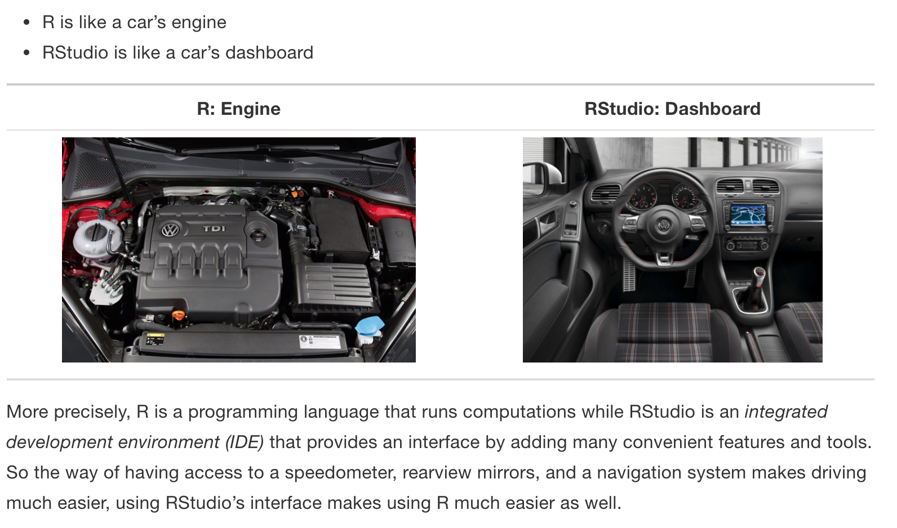
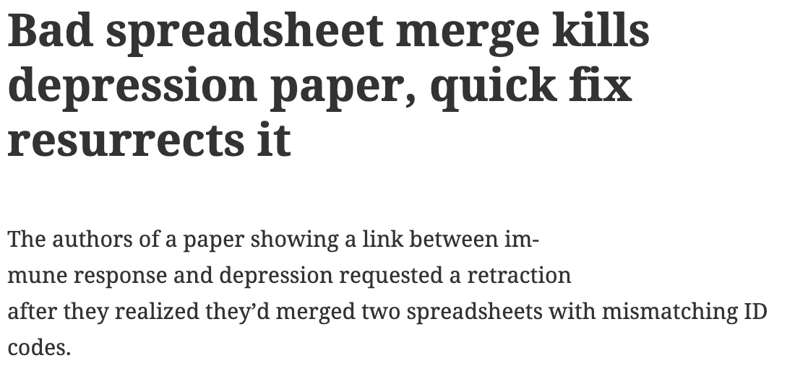

# Introduction {#intro}
  
## Course Logistics

#### What is Statistics?
Generally, statistics is the academic discipline which uses data to make claims and predictions about larger populations of interest.  It is the science of collecting, wrangling, visualizing, and analyzing data as a representation of a larger whole.  It is worth noting that probability represents the majority of mathematical tools used in statistics, but probability as a discipline does not work with data.  Having taken a probability class may help you with some of the mathematics covered in the course, but it is not a substitute for understanding the basics of introductory statistics.

(\#fig:unnamed-chunk-1)Probability vs. Statistics

* *descriptive statistics* describe the sample at hand with no intent on making generalizations.
* *inferential statistics* use a sample to make claims about a population

#### What is the content of Math 152?

**Statistical Theory**  is an introduction to statistics for students with a background in probability theory, calculus, and linear algebra.  There is no statistics prerequisite for this class. The course will be focused on the theoretical aspects of the material, though there will be some real world applications in class and in the homework assignments. The idea is to have a strong mathematical understanding of the concepts while also understanding how the concepts are applied in the real world.

At the completion of this course, students will:

* be able to derive the methods from introductory statistics using tools from mathematics (i.e., calculus and probability).
* be able to justify the use of a particular method (technical conditions).
* be able to weigh advantages and disadvantages of different estimation techniques (e.g., bias, variability, resistance to outliers).
* know to and how to communicate results effectively.

#### Who should take Math 152?
Linear Models are ubiquitous.  They are used in every science and social science to analyze relationships between variables.  Anyone planning to work in a field which uses statistical arguments to make claims based on data should have a fundamental knowledge of linear models.  Additionally, linear models is the most common required applied statistics course for someone who is applying to graduate school in statistics.     

#### What are the prerequisites for Math 152?
The prerequisites for Statistical Theory are Probability (Math 151 or equivalent) and completion of the three semester sequence of calculus and linear algebra. We rely heavily on these prerequisites, and students with no background in probability or multivariable calculus will find themselves trying to catch up throughout the semester. You should be familiar with topics such as conditional probabilities and expectations, the Central Limit Theorem, moment generating functions, and probability density functions.

#### Is there overlap with other classes?
Statistical Theory covers many of the same topics in Introductory Statistics (e.g., Math 58), however, the treatment of the topics is completely different.
Statistical Theory uses mathematical tools (e.g., probability theory and calculus) to derive the topics and prove that they are, in many ways, optimal.

#### When should I take Math 152?
Because of the prerequisite structure, most students in Math 152 are juniors or seniors.

#### What is the workload for Math 152?
There is one homework assignment per week, two in-class midterm exams, two take-home midterm exams, and a final exam.  Many students report working about 8-10 hours per week outside of class.   

##What software will we use? Will there be any real world applications?  Will there be any mathematics?  Will there be any CS?

The majority of the work for Statistical Theory will be done with a pencil (/ pen / LaTeX).
However, we will use R as a way of investigating theorecial concepts computationally.  
All of the R work will be done using the RStudio IDE.
You will need to either download R and RStudio (both are free) onto your own computer or use them on Pomona's server.
There will be some real-world applications to motivate the theory, but the cours is no applied and does not focus on data analysis.

You can use R on the Pomona server: https://rstudio.pomona.edu/ (All Pomona students will be able to log in immediately.
Non-Pomona students need to get Pomona login information.)

Alternatively, feel free to download R onto your own computer.
R is freely available at http://www.r-project.org/ and is already installed on college computers.
Additionally, you are required to install RStudio and turn in all R assignments using RMarkdown. http://rstudio.org/.
(You can use the LaTeX compiler at:  https://yihui.name/tinytex/)

(\#fig:unnamed-chunk-2)Taken from [Modern Drive: An introduction to statistical and data sciences via R](https://ismayc.github.io/moderndiver-book/), by Ismay and Kim

(\#fig:unnamed-chunk-3)[Jessica Ward](https://jkrward.github.io/), PhD student at Newcastle University

## Statistics: a review

Although Statistical Theory does not have a *statistics* prerequisite, students will have seen many of the building blocks in high school classes and Probability Theory.
Here we review some of the vocabulary covered in previous contexts.

### Vocabulary

#### Probability {-}

* The **probability** of an outcome refers to how often the outcome would occur in the long run if a random process were repeated over and over under identical conditions (relative frequency interpretation) or as the degree to which the statement is supported by the available evidence (subjective interpretation).
* An **experiment** is any activity or situation in which there is uncertainty about the outcome.
* The **sample space** is the list of all possible outcomes of a random trial. (Called S.)
* An **event** is any potential subset of the sample space.
* The set of all events (i.e., the set of all subsets of S) is called the **power set** of $S$, $\mathcal{P}(S)$.
* A **simple event** is an event consisting of exactly one outcome.
* Two events are **mutually exclusive** or **disjoint** if they cannot both occur simultaneously.
* Two events are **independent** if the occurrence of one does not change the probability that the second will occur.

* A **random variable** is a *function* from the sample space, $S$, to the real line: $$ X: S \mapsto {\mathbb R}$$

* The random variable, $X$, has a **discrete distribution** iff $X$ takes on a discrete set of values:
$$ f(x_i) = P( X = x_i) \quad i = 1, 2, \dots k$$
and $f(x) = 0$ for all other values of $x$.

* The continuous random variable $X: S \mapsto {\mathbb R}$ can take on a *continuous*
set of values (i.e., values in an interval).  Then:
$$P ( a \le X \le b) = \int_a^b f(x) \, dx $$
where $f(x)$ is called the **probability density function**, or **pdf**, of $X$.

* For both continuous and discrete random variables, the **cumulative distribution function** (**cdf**) of a random variable, $X$, is *defined* by:
$$ F(x) = P(X \le x), \quad -\infty < x < \infty$$

#### Statistics {-}

* A  **statistic** is a numerical measurement we get from the sample, a function of the data.
* A  **parameter** is a numerical measurement of the population.  We never know the true value of the parameter.
* An  **estimator** is a function of the unobserved data that tries to approximate the unknown parameter value.
* An  **estimate** is the value of the estimator for a given set of data.  [Estimate and statistic can be used interchangeably.]
* $\Omega$ is the **parameter space**, a set of values which contains all possible realizations of the parameter.

In many statistical problems, we assume the distribution that generated the data is completely known except for the parameters. **Our goal in statistics is to make statements (*inference*) about a population using our sample (*data*).**  The course will be broken up into two main parts: parameter estimation and tests of hypotheses.

### Estimation
In many statistical problems, we assume the distribution that generated the data is completely known except for the parameter(s). During the first half of the course, we're going to learn different ways to estimate parameters, properties of those estimators, and what makes a good estimator.

#### example {-}
Consider trying to estimate the true average weight of a dozen eggs from a particular farm.  We could add up random 12 values with the same pdf which is different from multiplying one observation by 12. Clearly 12*one egg is much more variable than the weight of a dozen eggs.
\begin{align*}
\mbox{statistic } 1 &= 12 X\\
\mbox{statistic } 2 &= \sum_{i=1}^{12} X_i\\
\Omega &= \{ \mu: \mu \in I\!\!R+\}\\
\end{align*}

## <i class="fas fa-lightbulb" target="_blank"></i> Reflection Questions

1. What is the difference between a sample and a population? 
2. What is the difference between a discrete random variable and a continuous random variable?
3. What is the difference between a pdf and a cdf?
4. How can you find the expected value of a discrete random variable?  How can you find the expected value of a continuous random variable?
5. What is the difference between R and RStudio?

## <i class="fas fa-balance-scale"></i> Ethics Considerations

1. Why is it important to distinguish between a sample and a population?
2. Is it ever okay to model a discrete random variable using a continuous probability model?  If not, why not?  If so, when?
3. When is it better to understand a method's properties theoretically and when is it better to use computational tools to investigate the method's properties?  [A question you probably won't be able to answer until the end of the semester.]

## R code: reproduciblity

 
### Reproducibility {#repro}

Reproducibility has long been considered an important topic for consideration in any research project.  However, recently there has been increased press and available examples for understanding the impact that non-reproducible science can have.  

@reprobook provide a full textbook on the structure of reproducible research as well as dozens of case studies to help hone skills and consider different aspects of the reproducible pipeline.  Below are a handful of examples to get us started.

#### Need for Reproducibility

(\#fig:unnamed-chunk-4)slide taken from Kellie Ottoboni https://github.com/kellieotto/useR2016

####  Example 1 {-}
Science retracts gay marriage paper without agreement of lead author LaCour

* In May 2015 Science retracted a study of how canvassers can sway people's opinions about gay marriage published just 5 months prior.
* Science Editor-in-Chief Marcia McNutt: 
    * Original survey data not made available for independent reproduction of results. 
    * Survey incentives misrepresented. 
    * Sponsorship statement false.
* Two Berkeley grad students who attempted to replicate the study quickly discovered that the data must have been faked.
* Methods we'll discuss can't prevent fraud, but they can make it easier to discover issues.
* Source: http://news.sciencemag.org/policy/2015/05/science-retracts-gay-marriage-paper-without-lead-author-s-consent

#### Example 2 {-}
Seizure study retracted after authors realize data got "terribly mixed"

* From the authors of Low Dose Lidocaine for Refractory Seizures in Preterm Neonates:

> The article has been retracted at the request of the authors. After carefully re-examining the data presented in the article, they identified that data of two different hospitals got terribly mixed. The published results cannot be reproduced in accordance with scientific and clinical correctness.

* Source: http://retractionwatch.com/2013/02/01/seizure-study-retracted-after-authors-realize-data-got-terribly-mixed/

#### Example 3 {-}
Bad spreadsheet merge kills depression paper, quick fix resurrects it

* The authors informed the journal that the merge of lab results and other survey data used in the paper resulted in an error regarding the identification codes. Results of the analyses were based on the incorrectly merged data set. Further analyses established the results reported in the manuscript and interpretation of the data are not correct.

> Original conclusion: Lower levels of CSF IL-6 were associated with current depression and with future depression ... 

> Revised conclusion: Higher levels of CSF IL-6 and IL-8 were associated with current depression ... 

* Source: http://retractionwatch.com/2014/07/01/bad-spreadsheet-merge-kills-depression-paper-quick-fix-resurrects-it/

#### Example 4 {-}

PNAS paper retracted due to problems with figure and reproducibility (April 2016):
http://cardiobrief.org/2016/04/06/pnas-paper-by-prominent-cardiologist-and-dean-retracted/

#### The reproducible data analysis process

* Scriptability $\rightarrow$ R
* Literate programming $\rightarrow$ R Markdown
* Version control $\rightarrow$ Git / GitHub

 
##### Scripting and literate programming {-}

Donald Knuth "Literate Programming" (1983) 

> Let us change our traditional attitude to the construction of programs: Instead of imagining that our main task is to instruct a computer- what to do, let us concentrate rather on explaining to human beings- what we want a computer to do.

* The ideas of literate programming have been around for many years!
* and tools for putting them to practice have also been around
* but they have never been as accessible as the current tools

##### Reproducibility checklist {-}

* Are the tables and figures reproducible from the code and data?
* Does the code actually do what you think it does?
* In addition to what was done, is it clear why it was done? (e.g., how were parameter settings chosen?)
* Can the code be used for other data?
* Can you extend the code to do other things?

##### Tools: R & R Studio {-}

See a great video (less than 2 min) on a reproducible workflow: https://www.youtube.com/watch?v=s3JldKoA0zw&feature=youtu.be

* You must use both R and RStudio software programs
* R does the programming
* R Studio brings everything together
* You may use Pomona's server: https://rstudio.pomona.edu/

(\#fig:unnamed-chunk-9)Taken from [Modern Drive: An introduction to statistical and data sciences via R](https://ismayc.github.io/moderndiver-book/), by Ismay and Kim

(\#fig:unnamed-chunk-10)[Jessica Ward](https://jkrward.github.io/), PhD student at Newcastle University

