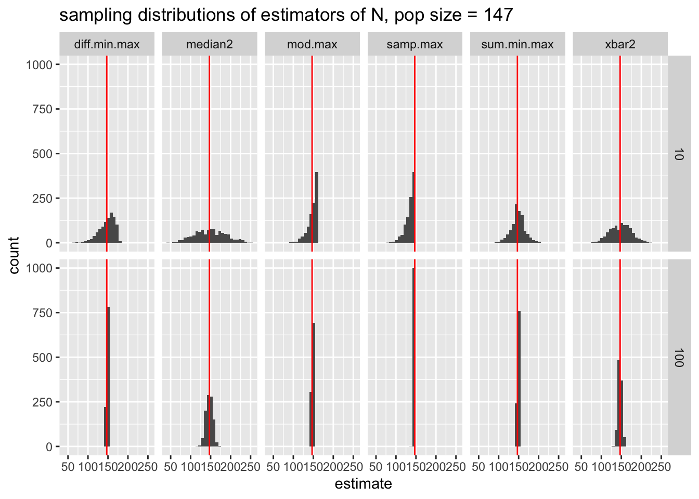
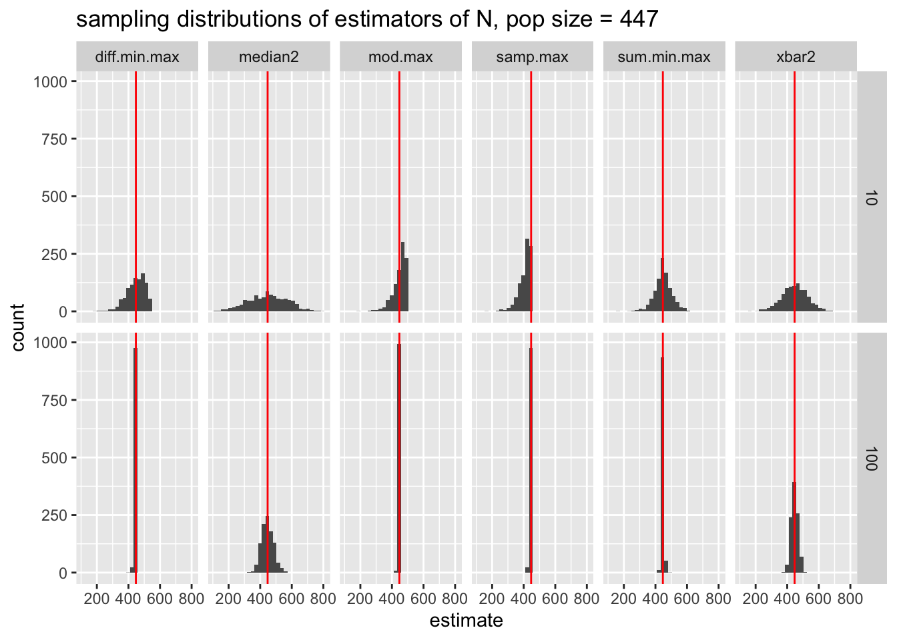

# Sampling Distributions of Estimators {#sampdist}

A **statistic** is a function of some observed random variables.  The **sampling distribution** of a statistic tells us which values a statistic assumes and how likely those values are.  Because a statistic is a function of the random variables $X_1, X_2, \ldots, X_n$, if we know the distribution of $X$, in principle, we should be able to derive the distribution of our statistic.

::: {.example}
If the data are normal, the sampling distribution of their mean is also normal.  While the result may look like the Central Limit Theorem, there is no limiting behavior here.  That is, the sampling distribution of $\overline{X}$ is normal regardless of the sample size.  The proof come directly from the result that linear combinations of normal random variables are also normal.

\begin{eqnarray*}
X_i &\sim& N(\mu, \sigma^2)\\
\overline{X} &\sim& N(\mu, \sigma^2 / n)
\end{eqnarray*}
:::

## The Chi-Square Distribution

The chi-square distribution is a probability distribution with the following characteristics.

\begin{eqnarray*}
X &\sim& \chi^2_n\\
f_X(x) &=& \frac{1}{2^{n/2} \Gamma(n/2)} x^{n/2 -1} e^{-x/2} \ \ \ \ \ \ x > 0\\
E[X] &=& n\\
Var[X] &=& 2n\\
\psi_X(t) &=& \Bigg( \frac{1}{1-2t} \Bigg)^{n/2} \ \ \ \ \ \ t < 1/2\\
( &=&  E[e^{tX}] )\\
\end{eqnarray*}

Recall Moment Generating Functions $(\psi_X(t))$, @degroot page 205.

::: {.theorem}
@degroot 7.2.1

Let $X_1, X_2, \ldots X_k \sim \chi^2_{n_i}, \ \ i=1, \ldots, k$, independently.  Then, $X_1 + X_2 + \cdots + X_k = \sum_{i=1}^k X_i \sim \chi^2_{n_1+n_2 +\cdots+n_k}$.

That is, if the data are independent chi-square random variables, the sampling distribution of their sum is also chi-square.
:::


::: {.proof}

\begin{eqnarray*}
Y&=& \sum_{i=1}^k X_i\\
\psi_Y (t) &=& E[e^{Yt} ]\\
&=& E[e^{t \sum_{i=1}^k X_i}]\\
&=& \prod_{i=1}^k E[e^{tX_i}]\\
&=& \prod_{i=1}^k \psi_{X_i}(t)\\
&=& \prod_{i=1}^k \bigg( \frac{1}{1-2t} \bigg)^{ n_i /2}\\
&=& \Bigg( \frac{1}{1-2t} \Bigg)^{\sum n_i /2}
\end{eqnarray*}
See theorem 4.4.3, pg 207.
:::


::: {.theorem}
@degroot 7.2.1 1/2

If $Z \sim N(0,1), Y=Z^2,$ then $Y \sim \chi^2_1$.

Note that the result here is to provide the distribution of a transformation of a random variable.  There is a single data value $(Z),$ and the result provides the distribution of another single value, $(Y).$  The value $Y$ would typically not be referred to as a statistic because it is not a summary of observations.

That said, just below, $Z$ itself will be a statistic (instead of a single value) and then both $Z$ and $Y$ will have sampling distributions!
:::

::: {.proof}
Let $\Phi$ and $\phi$ be the cdf and pdf of Z.  
Let F and f be the cdf and pdf of Y.  
\begin{eqnarray*}
F_Y(y) &=& P(Y \leq y) = P(Z^2 \leq y)\\
&=& P(-y^{1/2} \leq Z \leq y^{1/2})\\
&=& \Phi(y^{1/2}) -  \Phi(- y^{1/2})  \ \ \ \ \ y > 0\\
\end{eqnarray*}
\smallskip
\begin{eqnarray*}
f_Y(y) &=& \frac{\partial F_Y(y)}{\partial y} = \phi(y^{1/2}) \cdot \frac{1}{2} y^{-1/2} - \phi(-y^{1/2}) \cdot \frac{1}{2} -y^{-1/2}\\
&=& \frac{1}{2} y^{-1/2} ( \phi(y^{1/2}) + \phi(-y^{1/2})) \ \ \ \ \ \ y > 0\\
\mbox{we know} && \phi(y^{1/2}) = \phi(-y^{1/2}) = \frac{1}{\sqrt{2 \pi}} e^{-y/2}\\
%\therefore
f_Y(y) &=& y^{-1/2} \frac{1}{\sqrt{2 \pi}} e^{-y/2} \ \ \ \ \ \ y > 0 \\
&=& \frac{1}{2^{1/2}\pi^{1/2}} y^{1/2 - 1} e^{-y/2} \ \ \ \ \ \ y >0\\
Y &\sim& \chi^2_1\\
\end{eqnarray*}
note: $\Gamma(1/2) = \sqrt{\pi}$.
:::


By combining Theorems 7.2.1 and 7.2.1 1/2, we get:

::: {.theorem}
@degroot 7.2.2

If $X_1, X_2, \ldots, X_k \stackrel{iid}{\sim} N(0,1)$,
\begin{eqnarray*}
\sum_{i=1}^k X_i^2 \sim \chi^2_k
\end{eqnarray*}
\noindent
Note: if $X_1, X_2, \ldots, X_k \stackrel{iid}{\sim} N(\mu, \sigma^2)$,
\begin{eqnarray*}
\frac{X_i - \mu}{\sigma} &\sim& N(0,1)\\
\sum_{i=1}^k \frac{(X_i - \mu)^2}{\sigma^2} &\sim& \chi^2_k\\
\end{eqnarray*}

If the data are $iid$ normal, the sum of their squared values has a sampling distribution which is chi-square.
:::


## Independence of the Mean and Variance of a Normal Random Variable


::: {.theorem}
@degroot 8.3.1

Let $X_1, X_2, \ldots, X_n \stackrel{iid}{\sim} N(\mu, \sigma^2)$.

1. $\overline{X}$ and $\frac{1}{n} \sum(X_i - \overline{X})^2$ are independent.  (This is **only** true for normal random variables.  You should read through the proof in your book.) 
2. $\overline{X} \sim N(\mu, \sigma^2/n)$.  (Not the CLT, why not?) 
3. $\frac{\sum(X_i - \overline{X})^2}{\sigma^2} \sim \chi^2_{n-1}$.  (Main idea is that we only have $n-1$ independent things.)
:::


## The t-distribution

Let $Z \sim N(0,1)$ and $Y \sim \chi^2_n$.  If $Z$ and $Y$ are independent, then:

::: {.definition}
\begin{eqnarray*}
X = \frac{Z}{\sqrt{Y/n}} \sim t_n \mbox{  by definition}
\end{eqnarray*}
:::

\begin{eqnarray*}
f_X(x) &=& \frac{\Gamma(\frac{n+1}{2})}{(n \pi)^{1/2} \Gamma(\frac{n}{2})} (1 + \frac{x^2}{n})^{-(n+1)/2} \ \ \ \ n > 2\\
E[X] &=&0\\
Var(X) &=& \frac{n}{n-2}
\end{eqnarray*}

Let $X_1, X_2, \ldots, X_n \sim N(\mu, \sigma^2)$, the following hold:
\begin{eqnarray*}
\frac{\overline{X} - \mu}{\sigma/\sqrt{n}} \sim N(0,1) \mbox{ independently of } \frac{\sum(X_i - \overline{X})^2}{\sigma^2} \sim \chi^2_{n-1}
\end{eqnarray*}

\begin{eqnarray*}
\frac{\frac{\overline{X} - \mu}{\sigma/\sqrt{n}}}{\sqrt{\frac{\sum(X_i - \overline{X})^2}{\sigma^2}/(n-1)}} &=& \frac{\overline{X} - \mu}{\sqrt{\frac{\sum(X_i - \overline{X})^2}{n-1}/n}}\\
&=& \frac{\overline{X} - \mu}{s/\sqrt{n}} \sim t_{n-1} !
\end{eqnarray*}

As stated above, the t-distribution is defined as the distribution which is given when a standard normal is divided by the square root of a chi-square random variable divided by its degrees of freedom.  And while that may seem obtuse at first glance, it comes in extremely handy when standardizing a sample mean by using the standard error (instead of the standard deviation) of the mean.


::: {.example}
According to some investors, foreign stocks have the potential for high yield, but the variability in their dividends may be greater than what is typical for American companies.   Let's say we take a random sample of 10 foreign stocks; assume also that we know the population distribution from which American stocks come (i.e., we have the American parameters).  If **we believe that foreign stock prices are distributed similarly  (normal with the same mean and variance)** to American stock prices, how likely is it that a sample of 10 foreign stocks would produce a standard deviation which is 50% bigger than American stocks?

\begin{eqnarray*}
P(\hat{\sigma} / \sigma > 1.5 ) &=& ?\\
\frac{\sum (X_i - \overline{X})^2}{\sigma^2} &\sim& \chi^2_{n-1} \ \ \ \ \mbox{(normality assumption)}\\
\frac{\sum (X_i - \overline{X})^2}{\sigma^2} &=& n\frac{\sum (X_i - \overline{X})^2/n}{\sigma^2}\\
&=& \frac{n \hat{\sigma^2}}{\sigma^2}\\
P(\hat{\sigma} / \sigma > 1.5 ) &=& P(\hat{\sigma}^2 / \sigma^2 > 1.5^2 ) \\
&=& P(n \hat{\sigma}^2 / \sigma^2 > n 1.5^2 )\\
&=& 1 - \chi^2_{n-1} (n 1.5^2)\\
&=& 1 - \chi^2_{n-1} (22.5)\\
&=& 1 - pchisq(22.5,9) = 0.00742 \ \ \ \mbox{ in R}
\end{eqnarray*}
:::

::: {.example}
Suppose we take a random sample of foreign stocks (both $\mu$ and $\sigma^2$ unknown).  Find the value of $k$ such that the sample mean is no more than $k$ sample standard deviations $(s)$ above the mean $\mu$ with probability 0.90.

\noindent
Data:  $n=10$, $\hat{\mu}  = \overline{x}$, $s^2 = \frac{\sum(x_i - \overline{x})^2}{n-1}$, $s = \sigma'$.

\begin{eqnarray*}
P(\overline{X} < \mu + k s) &=& 0.9\\
P\Bigg(\frac{\overline{X} - \mu}{s} < k \Bigg) = P\Bigg(\frac{\overline{X} - \mu}{s/\sqrt{n}} < k \sqrt{n}\Bigg) &=& 0.9\\
\frac{\overline{X} - \mu}{s / \sqrt{n}} &\sim& t_9\\
\sqrt{n} k &=& 1.383\\
k &=& \frac{1.383}{\sqrt{10}} = 0.437\\
\mbox{note, in R: } qt(0.9,9) &=& 1.383
\end{eqnarray*}

How would this problem have been different if we had known $\sigma$?  Or even if we had wanted the answer to the question in terms of number of population standard deviations?
:::


## <i class="fas fa-lightbulb" target="_blank"></i> Reflection Questions

1. What does it mean for a statistic to have a sampling distribution? 
2. What is the difference between the theoretical MSE and the empirical MSE (e.g., in the tank example below)?
3. Why can't a standard normal distribution be used when the statistic of interest is $\frac{\overline{X} - \mu}{s / \sqrt{n}}?$
4. What different tools are used to determine the distribution of a random variable?  (Note, in this chapter, the majority of the random variables of interest are functions of data, also called statistics.)

## <i class="fas fa-balance-scale"></i> Ethics Considerations

1. How do you know which estimator to use in a consulting situation?
2. How do you respond to someone who tells you "there isn't one right answer" to the previous question?
3. What are the technical conditions for doing inference using a t-distribution?  That is, what are the conditions on the data that give rise to the t-distribution?  What happens if the technical conditions are violated and the inference is done anyway?  [Here, inference means confidence intervals and hypothesis testing.]


## R code: Tanks Example

How can a random sample of integers between 1 and $N$ (with $N$ unknown to the researcher) be used to estimate $N$?  This problem is known as the German tank problem and is derived directly from a situation where the Allies used maximum likelihood estimation to determine how many tanks the Axes had produced.  See \url{https://en.wikipedia.org/wiki/German_tank_problem}.

The tanks are numbered from 1 to $N$.  
Think about how you would use your data to estimate $N$. 

Some possible estimators of $N$ are:[^5]  
\begin{eqnarray*}
\hat{N}_1 &=& 2\cdot\overline{X} - 1 \ \ \ \mbox{the MOM}\\
\hat{N}_2 &=& 2\cdot \mbox{median}(\underline{X}) - 1 \\
\hat{N}_3 &=& \max(\underline{X})  \ \ \ \mbox{the MLE}\\
\hat{N}_4 &=& \frac{n+1}{n} \max(\underline{X})  \ \ \ \mbox{less biased version of the MLE}\\
\hat{N}_5 &=& \max(\underline{X}) + \min(\underline{X}) \\
\hat{N}_6 &=& \frac{n+1}{n-1}[\max(\underline{X}) - \min(\underline{X})] \\
\end{eqnarray*}

[^5]: Note that the MOM and MLE estimators were derived under the assumption that the data are *iid* from a population of discrete uniform values.  Because our data is sampled without replacement, we don't have an *iid* model.  However, if $n < < < N$, the *iid* discrete uniform is a reasonable model for the situation at hand.

### Theoretical Mean Squared Error


Most of our estimators are made up of four basic functions of the data: the mean, the median, the min, and the max.  Fortunately, we know something about the moments of these functions:


| g($\underline{X}$)                              |    E( g($\underline{X}$) )    |       Var( g($\underline{X}$) )       |
|-------------------------------------------------|:-----------------------------:|:-------------------------------------:|
| \vspace{-.3cm}$\overline{X}$                    |        $\frac{N+1}{2}$        |  $\frac{(N+1)(N-1)}{12 n}$  |
| \vspace{-.3cm}median($\underline{X}$) = M |        $\frac{N+1}{2}$        |         $\frac{(N-1)^2}{4 n}$         |
| \vspace{-.3cm}min($\underline{X}$)              | $\frac{(N-1)}{n} + 1$  |     $\bigg(\frac{N-1}{n}\bigg)^2$     |
| \vspace{-.3cm}max($\underline{X}$)              |     $N - \frac{(N-1)}{n}$     |     $\bigg(\frac{N-1}{n}\bigg)^2$     |

Using the information on expected value and variance, we can calculate the MSE for 4 of the estimators that we have derived.  (Remember that MSE = Variance + Bias$^2$.)

\begin{eqnarray}
\mbox{MSE } ( 2 \cdot \overline{X} - 1) &=& \frac{4 (N+1) (N-1)}{12n} + \Bigg(2 \bigg(\frac{N+1}{2}\bigg) - 1 - N\Bigg)^2 \nonumber \\
&=& \frac{4 (N+1) (N-1)}{12n} \\
\nonumber \\
\mbox{MSE } ( 2 \cdot M - 1) &=& \frac{4 (N-1)^2}{4n} + \Bigg(2 \bigg(\frac{N+1}{2}\bigg) - 1 - N\Bigg)^2 \nonumber \\
&=& \frac{4 (N-1)^2}{4n} \\
\nonumber \\
\mbox{MSE } ( \max(\underline{X})) &=& \bigg(\frac{N-1}{n}\bigg)^2 + \Bigg(N - \frac{(N-1)}{n} - N\Bigg)^2 \nonumber\\
&=& \bigg(\frac{N-1}{n}\bigg)^2 + \bigg(\frac{N-1}{n} \bigg)^2  = 2*\bigg(\frac{N-1}{n} \bigg)^2 \\
\nonumber \\
\mbox{MSE } \Bigg( \bigg( \frac{n+1}{n} \bigg) \max(\underline{X})\Bigg) &=& \bigg(\frac{n+1}{n}\bigg)^2 \bigg(\frac{N-1}{n}\bigg)^2 + \Bigg(\bigg(\frac{n+1}{n}\bigg) \bigg(N - \frac{N-1}{n} \bigg) - N \Bigg)^2
\end{eqnarray}


### Empirical MSE

We don't need to know the theoretical expected value or variance of the functions to approximate the MSE.  We can visualize the sampling distributions and also calculate the actual empirical MSE for any estimator we come up with.

By changing the population size and the sample size, we can assess how the estimators compare and whether one is particularly better under a given setting.


```r
calculate_N <- function(nsamp,npop){
  mysample =  sample(1:npop,nsamp,replace=F)  # what does this line do?
  xbar2 <- 2 * mean(mysample) - 1
  median2 <- 2 * median(mysample) - 1
  samp.max <- max(mysample)
  mod.max <- ((nsamp + 1)/nsamp) * max(mysample)
  sum.min.max <- min(mysample) + max(mysample)
  diff.min.max <- ((nsamp + 1)/(nsamp - 1)* (max(mysample) - min(mysample)))
  data.frame(xbar2, median2, samp.max, mod.max, sum.min.max, diff.min.max,nsamp,npop)
}

reps <- 2
nsamp_try <- c(10,100, 10, 100)
npop_try <- c(147, 147, 447, 447)
map_df(1:reps, ~map2(nsamp_try, npop_try, calculate_N))
```

```
##    xbar2 median2 samp.max mod.max sum.min.max diff.min.max nsamp npop
## 1 129.20     132      128  140.80         129     155.2222    10  147
## 2 151.24     150      147  148.47         149     147.9293   100  147
## 3 320.40     352      387  425.70         398     459.5556    10  447
## 4 424.88     375      445  449.45         454     444.8081   100  447
## 5 134.00     150      103  113.30         121     103.8889    10  147
## 6 145.70     147      147  148.47         148     148.9495   100  147
## 7 551.80     569      424  466.40         492     435.1111    10  447
## 8 435.98     423      446  450.46         447     453.9899   100  447
```


```r
reps <- 1000
results <- map_df(1:reps, ~map2(nsamp_try, npop_try, calculate_N))

# making the results long instead of wide:
results_long <- results %>%
  pivot_longer(cols = xbar2:diff.min.max, names_to = "estimator", values_to = "estimate")

# how is results different from results_long?  let's look at it:
results_long
```

```
## # A tibble: 24,000 × 4
##    nsamp  npop estimator    estimate
##    <dbl> <dbl> <chr>           <dbl>
##  1    10   147 xbar2            114.
##  2    10   147 median2           64 
##  3    10   147 samp.max         145 
##  4    10   147 mod.max          160.
##  5    10   147 sum.min.max      148 
##  6    10   147 diff.min.max     174.
##  7   100   147 xbar2            146.
##  8   100   147 median2          143 
##  9   100   147 samp.max         147 
## 10   100   147 mod.max          148.
## # … with 23,990 more rows
## # ℹ Use `print(n = ...)` to see more rows
```


```r
results_long %>%
  group_by(nsamp, npop, estimator) %>%
  summarize(mean = mean(estimate), median = median(estimate), bias = mean(estimate - npop),
            var = var(estimate), mse = (mean(estimate - npop))^2 + var(estimate))
```

```
## `summarise()` has grouped output by 'nsamp', 'npop'. You can override using the
## `.groups` argument.
```

```
## # A tibble: 24 × 8
## # Groups:   nsamp, npop [4]
##    nsamp  npop estimator     mean median    bias    var    mse
##    <dbl> <dbl> <chr>        <dbl>  <dbl>   <dbl>  <dbl>  <dbl>
##  1    10   147 diff.min.max  147.   150.   0.261   382.   382.
##  2    10   147 median2       146.   146   -0.638  1436.  1437.
##  3    10   147 mod.max       148.   152.   0.734   181.   181.
##  4    10   147 samp.max      134.   138  -12.7     149.   310.
##  5    10   147 sum.min.max   148.   148    1.12    358.   360.
##  6    10   147 xbar2         147.   147.  -0.127   674.   674.
##  7    10   447 diff.min.max  450.   460.   3.26   3620.  3631.
##  8    10   447 median2       446.   444   -0.504 14574. 14575.
##  9    10   447 mod.max       449.   460.   1.94   1573.  1576.
## 10    10   447 samp.max      408.   418  -38.9    1300.  2811.
## # … with 14 more rows
## # ℹ Use `print(n = ...)` to see more rows
```


```r
results_long %>%
  filter(npop == 147) %>%
  ggplot(aes(x = estimate)) +
  geom_histogram() +
  geom_vline(aes(xintercept = npop), color = "red") +
  facet_grid(nsamp ~ estimator) + 
  ggtitle("sampling distributions of estimators of N, pop size = 147")
```



```r
results_long %>%
  filter(npop == 447) %>%
  ggplot(aes(x = estimate)) +
  geom_histogram() +
  geom_vline(aes(xintercept = npop), color = "red") +
  facet_grid(nsamp ~ estimator) + 
  ggtitle("sampling distributions of estimators of N, pop size = 447")
```




