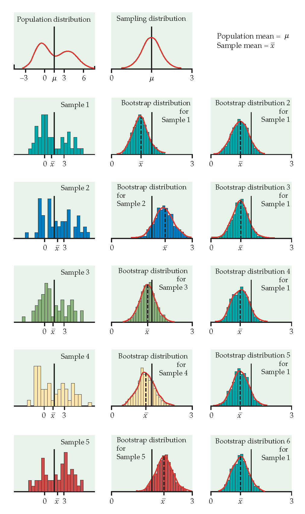
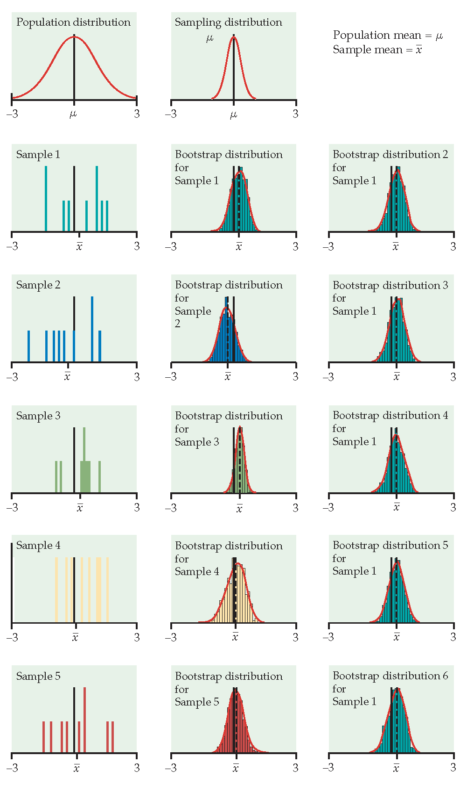

# Bootstrap Distributions {#bootdist}

## Bootstrap Sampling Distributions

Before introducing the bootstrap, let's reflect on the work we've done so far.  Note that one of the big goals has been to understand how variability in data (samples) affects the estimation.  Consider the different approaches we've taken to understanding that variability:

1. As a Bayesian, $\theta | \underline{X} \sim$ according to a posterior distribution which describes the variability of $\theta$ conditional on the data.  
2. As a Frequentist, the focus was on the variability of the statistic instead of the variability of the parameter.
   a. When $f(x|\theta)$ is known, we can simulate data from the population and use the empirical sampling distribution to see how the estimates vary from sample to sample.  For example, consider the work we did with the tanks.
   b. When $f(x|\theta)$ and the statistic are lovely, we can use mathematical theory.  Mostly (so far) "lovely" meant that the data were normal and the statistic was one of those that produced either a $\chi^2$ or $t$ distribution.  
   c. When $f(x|\theta)$ is unknown but $n$ is large and the statistic of interest is the sample mean (note: a proportion is a sample mean!), we can use the Central Limit Theorem.
   d. When $f(x|\theta)$ is **unknown** and the statistic is **arbitrary**, we use the Bootstrap.

### Introduction

Main idea:  we will be able to estimate the **variability** or our estimator, by using a single random sample to describe the population (hey, that's what we always do because we usually only have one sample to use!).

* It's not so strange to get $\hat{\theta}$ and SE($\hat{\theta}$) from the data (consider $\hat{p}$ \& $\sqrt{\hat{p}(1-\hat{p})/n}$ and $\overline{X}$ \& $s/\sqrt{n}$).
* We'll only consider confidence intervals for now.
* Bootstrapping doesn't help get around small samples.

The following applets may be helpful:

* Bootstrapping from actual datasets: http://lock5stat.com/statkey/index.html 
* Bootstrapping in contrast to sampling from a population:  https://www.rossmanchance.com/applets/OneSample.html?population=bootstrap
* The logic of confidence intervals: http://www.rossmanchance.com/applets/ConfSim.html

### Basics & Notation

Let $\theta$ be the parameter of interest, and let $\hat{\theta}$ be the estimate of $\theta$.  If we could, we'd take lots of samples of size $n$ from the population to create a \underline{sampling distribution} for $\hat{\theta}$.  Consider taking $B$ random samples from $F$:
\begin{eqnarray*}
\hat{\theta}(\cdot) = \frac{1}{B} \sum_{b=1}^B \hat{\theta}_b
\end{eqnarray*}
is our best guess for $\theta$.  If $\hat{\theta}$ is very different from $\theta$, we would call it \underline{biased}.
\begin{eqnarray*}
SE(\hat{\theta}) &=& \bigg[ \frac{1}{B-1} \sum_{b=1}^B(\hat{\theta}_b - \hat{\theta}(\cdot))^2 \bigg]^{1/2}\\
q_1 &=& [0.25 B] \ \ \ \ \hat{\theta}^{(q_1)} = \mbox{25}\% \mbox{ cutoff}\\
q_3 &=& [0.75 B] \ \ \ \ \hat{\theta}^{(q_3)} = \mbox{75}\% \mbox{ cutoff}\\
\end{eqnarray*}

If we could, we would completely characterize the sampling distribution (as a function of $\theta$) which would allow us to make inference on $\theta$ when we only had $\hat{\theta}$.

(\#fig:unnamed-chunk-1)Image credit: Hesterberg: supplemental chapter for Introduction to the Practice of Statistics, 5th Edition by Moore and McCabe.  https://www.timhesterberg.net/bootstrap-and-resampling

#### The Plug-in Principle {-}

Recall
\begin{eqnarray*}
F(x) &=& P(X \leq x)\\
\hat{F}(x) &=& S(x) = \frac{\# X_i \leq x}{n}
\end{eqnarray*}
$\hat{F}(x)$ is a sufficient statistic for $F(x)$.  That is, all the information about $F$ that is in the data is contained in $\hat{F}(x)$.  Additionally, $\hat{F}(x)$ is the MLE of $F(x)$. (They are both probabilities, so it's a multinomial argument.  Very similar to a binomial argument, but the maximization happens with the additional constraint that the probabilities have to sum to one, so Lagrangian multipliers are used.)

Note that, in general, we are interested in a parameter, $\theta$ which is a functional of $F$ (functional means that the \emph{argument} is a function).
\begin{eqnarray*}
t(F) = \theta \ \ \ \ \Bigg[\mbox{e.g., } \int x f(x) dx = \mu \Bigg]
\end{eqnarray*}

The *plug-in estimate* of $\theta$ is:
\begin{eqnarray*}
t(\hat{F}) = \hat{\theta}  \ \ \ \ \Bigg[\mbox{e.g., }  \sum_x x \hat{f}(x) = \sum_{i=1}^n x_i \bigg(\frac{1}{n}\bigg) =  \frac{1}{n} \sum x_i  = \overline{x} \Bigg]
\end{eqnarray*}

That is: *to estimate a parameter, use the statistic that is the corresponding quantity for the sample.*

The idea of boostrapping (and in fact, the bootstrap samples themselves), depends on the double arrow below.  We must have a random sample: that is, $\hat{F}$ must do a good job of estimating $F$ in order for bootstrap concepts to be meaningful.

\begin{eqnarray*}
\underline{\mbox{Real World}} && \underline{\mbox{Boostrap World}}\\
F \rightarrow x &\Rightarrow& \hat{F} \rightarrow x^*\\
\downarrow & & \ \ \ \ \ \ \ \ \ \downarrow\\
\hat{\theta} & & \ \ \ \ \ \ \ \ \ \hat{\theta}^*
\end{eqnarray*}

Note that you've seen the plug-in principle before:
\begin{eqnarray*}
\sqrt{\frac{p(1-p)}{n}} &\approx& \sqrt{\frac{\hat{p}(1-\hat{p})}{n}}\\
\mbox{Fisher's Information: } I(\theta) &\approx& I(\hat{\theta})
\end{eqnarray*}

Okay, okay, you haven't seen Fisher's Information yet, but you'll see it in a few weeks, and the plug-in principle will apply.

#### The Bootstrap Idea {-}

We can *resample* from the *sample* to represent samples from the actual population!  The *boostrap distribution* of a statistic, based on many resamples, represents the **sampling distribution** of the statistic based on many samples.  Is this okay??  What are we assuming?

1. As $n \rightarrow \infty$, $\hat{F}(x) \rightarrow F(x)$
2. As $B \rightarrow \infty$, $\hat{F}(\hat{\theta}^*) \rightarrow F(\hat{\theta})$  (with large $n$).  Or really, what we typically see is $\hat{F}(\hat{\theta}^* / \hat{\theta}) \rightarrow F(\hat{\theta} / \theta)$ or $\hat{F}(\hat{\theta}^* - \hat{\theta}) \rightarrow F(\hat{\theta} - \theta)$

#### Bootstrap Procedure {-}

1. Resample data *with replacement*.
2. Calculate the statistic of interest for each resample.
3. Repeat 1. and 2. $B$ times.
4. Use the bootstrap distribution for inference.

#### Bootstrap Notation {-}

Take lots ($B$) resamples of sample of size n from the sample, $\hat{F}(x)$ (instead of from the population, $F(x)$ ) to create a bootstrap distribution for $\hat{\theta}^*$ (instead of the sampling distribution for $\hat{\theta}$).

Let $\hat{\theta}^*_b$ be the calculated statistic of interest for the $b^{th}$ bootstrap sample.  Our best guess for $\theta$ is:
\begin{eqnarray*}
\hat{\theta}^* = \frac{1}{B} \sum_{b=1}^B \hat{\theta}^*_b
\end{eqnarray*}
(if $\hat{\theta}^*$ is very different from $\hat{\theta}$, we call it biased.)  And the estimated value for the standard error of our estimate is
\begin{eqnarray*}
\hat{SE}^*_B = \bigg[ \frac{1}{B-1} \sum_{b=1}^B ( \hat{\theta}^*_b - \hat{\theta}^*)^2 \bigg]^{1/2}
\end{eqnarray*}

Just like repeatedly taking samples from the population, taking resamples from the sample allows us to characterize the bootstrap distribution which approximates the sampling distribution.  The bootstrap distribution approximates the **shape, spread, & bias** of the actual sampling distribution.  The bootstrap sampling distribution does not estimate the center of the true sampling distribution.

(\#fig:unnamed-chunk-2)From Hesterberg et al., Chapter 16 of Introduction to the Practice of Statistics by  Moore, McCabe, and Craig.  The left image represents the mean with n=50.  The center image represents the mean with n=9.  The right image represents the median with n=15.

<!--
#### How accurate is a bootstrap distribution? {-}
\begin{itemize}
\item
\underline{Almost all} of the variation in a bootstrap distribution comes from the selection of the original sample.  (That is,  boostrapping does not overcome issues associated with small sample or non-random samples.)
\item
Resampling $B>1000$ does not typically reduce variability more.
\end{itemize}

Again,
\begin{enumerate}
\item
As $n \rightarrow \infty$, $\hat{F}(x) \rightarrow F(x)$
\item
As $B \rightarrow \infty$, $\hat{F^*}(\hat{\theta}^*) \rightarrow F(\hat{\theta})$  (with large $n$)
\end{enumerate}

#### When does the bootstrap not work? {-}

Consider $X \sim U[0,1]$ (note this would also work with $U[a,b]$).  Let $Y = \max(X_i)$.
\begin{eqnarray*}
F_Y(y) = P(Y \leq y) &=& P( \mbox{ all } X_i \leq y)\\
&=& P(X_i \leq y ) ^n\\
&=& y^n\\
f_Y(y) &=& \frac{\partial F_Y(y)}{\partial y}\\
&=& n y^{n-1} \\
\end{eqnarray*}

Note that the Bootstrap sampling distribution for the sample maximum is a poor approximation to the true sampling distribution.  The problem is that $\hat{F}$ is not a good estimate of the true distribution $F$ in the extreme tail.  Options to fix this problem include using a parametric bootstrap (with knowledge of the population distribution) or smoothing $\hat{F}$ to approximate $F$ better.

However, we can estimate the bias of the sample max:

\begin{eqnarray*}
bias_F &=& E[\hat{\theta}] - \theta\\
E[\hat{\theta}] &=& E [\max(X_i)] \\
&=& \int_0^1 y n y^{n-1} dy\\
&=& \frac{n}{n+1} y^{n+1} \bigg|_0^1\\
&=& \frac{n}{n+1}\\
bias_F &=& \frac{n}{n+1} -1 = \frac{-1}{n+1}
\end{eqnarray*}

We can think about the bootstrap bias in the same way:
\begin{eqnarray*}
bias_{\hat{F}} &=& E[\theta^*]- \hat{\theta}\\
&\approx& \hat{\theta}^* - \hat{\theta}\\
\hat{\theta} &=& 0.9997507\\
\hat{\theta}^* &=& 0.9805526\\
\hat{bias}_{\hat{F}} &=&  0.01919808\\
1/51 &=&  0.01960784\\
\end{eqnarray*}
-->

<!--
%\begin{examp}
%Hesketh and Everitt (2000) report on a study by Caplehorn and Bell (1991) that investigated the times (in days) that heroin addicts remained in a clinic for methadone maintenance treatment.  The data in \verb;heroin.txt; include the amount of time that the subjects stayed in the facility until treatment was terminated (column 4).  For about 37\% of the subjects, the study ended while they were still the in clinic (status=0).  Thus, their survival time has been truncated.  For this reason we might not want to estimate the mean survival time, but rather some other measure of typical survival time.  We explore using the median as well as the 25\% trimmed mean.  We treat the group of 238 patients as representative of the population.
%% From ISCAM Chance & Rossman, Investigation 4.5.3
%\end{examp}
%
-->

### Improving the Bootstrap Distribution 

 Consider using the bootstrap to estimate the distribution for $\frac{\hat{\theta} - \theta}{SE(\hat{\theta})}$.
\begin{eqnarray*}
T^*(b) &=& \frac{\hat{\theta}^*_b - \hat{\theta}}{\hat{SE}^*(b)}
\end{eqnarray*}
\noindent
where $\hat{\theta}^*_b$ is the value of $\hat{\theta}$ for the $b^{th}$ bootstrap sample, and $\hat{SE}^*(b)$ is the estimated standard error of $\hat{\theta}^*_b$ for the $b^{th}$ bootstrap sample.  The $\alpha/2^{th}$ percentile of $T^*(b)$ is estimated by the value of $\hat{q}^*_{\alpha/2}$ such that
\begin{eqnarray*}
\frac{\# \{T^*(b) \leq \hat{q}^*_{\alpha/2} \} }{B} = \alpha/2
\end{eqnarray*}
\noindent
For example, if $B=1000$, the estimate of the 5\% point is the $50^{th}$ smallest value of the $T^*(b)$s, and the estimate of the 95\% point is the $950^{th}$ smallest value of the $T^*(b)$s.

To find a different SE for each bootstrapped dataset, we have to bootstrap twice. The algorithm is as follows:

1. Generate $B_1$ bootstrap samples, and for each sample $\underline{X}^{*b}$ compute the bootstrap estimate $\hat{\theta}^*_b$.
2. Take $B_2$ bootstrap samples from $\underline{X}^{*b}$, and estimate the standard error, $\hat{SE}^*(b)$.
3. Find $B_1$ values for $T^*(b)$.  Calculate $\hat{q}^*_\alpha$ and $\hat{q}^*_{1-\alpha}$ (or $\alpha/2$).
