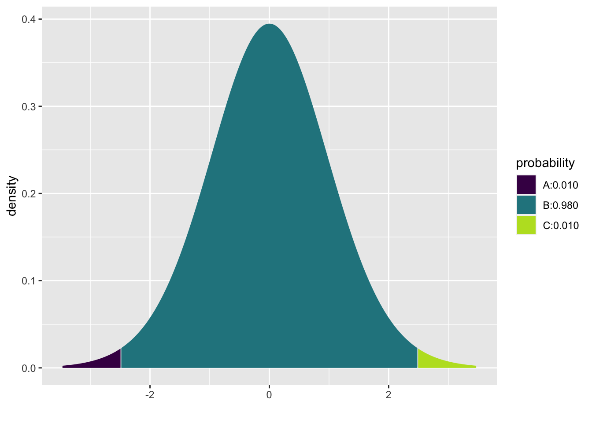

# Interval Estimates {#intest}


Up until now, we've used $\hat{\theta}$ to estimate $\theta$.  But a single numerical value gives us no information about the degree of uncertainty of the estimate.  A confidence interval is a set of values, (A,B), that we think is likely to contain $\theta$ (the true parameter).  The length of the interval gives us an idea of how closely we are able to estimate $\theta$.

## Frequentist Confidence Intervals
A frequentist confidence interval (CI) is created in such a way that the interval itself contains the parameter some specified percentage of the time.

### CI for the mean, $\mu$ in a normal random sample

We know,
\begin{eqnarray*}
\frac{\overline{X} - \mu}{s / \sqrt{n}} \sim t_{n-1}
\end{eqnarray*}

n.b., Your text uses $\sigma' = s = \sqrt{\frac{\sum_{i=1}^{n}(X_i - \overline{X})^2}{n-1}}.$  So whenever you see $\sigma'$, think $s.$


Let $c$ be some constant such that $\int_{-c}^c f_{t_{n-1}}(x) dx = \gamma$ (e.g., = 0.95).  Or:

\begin{eqnarray*}
P(-c \leq \frac{\overline{X} - \mu}{s/\sqrt{n}} \leq c) &=& 0.95\\
P( \overline{X} - c s/\sqrt{n} \leq \mu \leq \overline{X} + c s/\sqrt{n} ) &=& 0.95\\
\end{eqnarray*}


What is random here?  $\overline{X}$ and $s$ are both random! The probability of getting $(\overline{X}$,$s)$ such that $\overline{X} - c s/\sqrt{n} \leq \mu \leq \overline{X} + c s/\sqrt{n}$ is 0.95.  What is $c?$


As frequentists, we don't interpret the interval as "the probability that $\theta$ is in the interval"
\begin{eqnarray*}
X_1, X_2, \ldots, X_n &\rightarrow& \mbox{random}\\
\theta &\rightarrow& \mbox{fixed}\\
\end{eqnarray*}


>We are 95% confident that $\mu$ is between $\overline{X} - c s/\sqrt{n}$ and $\overline{X} + c s/\sqrt{n}$


Bayesians interpret intervals as "the probability that $\theta$ is in the interval" because Bayesians treat $\theta$ as a random variable (we would need a prior, etc...)  [See the next section on Bayesian Intervals.]

::: {.example}
A sample of 25 statistics students reported that they spend an average of 110 minutes per week studying statistics, with a standard deviation of 40 minutes.  Find a one-sided CI such that we are 98% confident that we know the *lower* bound of the true average studying time in the population.  Let's assume that the data are reasonably independent and normally distributed.


We need an interval $[ A,\infty)$, such that with 98% confidence, $\mu$ is in the interval.  We know:
\begin{eqnarray*}
P(c_1 \leq \frac{\overline{X} - \mu}{s/\sqrt{n}} \leq c_2) &=& 0.98\\
P( \overline{X} - c_2 s/\sqrt{n} \leq \mu \leq \overline{X} - c_1 s/\sqrt{n} ) &=& 0.98\\
P(-\infty \leq \frac{\overline{X} - \mu}{s/\sqrt{n}} \leq c_2) &=& 0.98\\
\\
\frac{\overline{X} - \mu}{s/\sqrt{n}} &\sim& t_{24} \rightarrow c_2 = 2.172\\
P( \overline{X} - 2.172 s/\sqrt{n} \leq \mu (\leq \infty) ) &=& 0.98\\
( \overline{X} - 2.172 s/\sqrt{n},\infty ) && \mbox{is a 98% CI}\\
\end{eqnarray*}
We are 98% confident that the true average studying time (in the population) is at least 92.62 minutes.  Why can't we plug in the numbers above and keep it as a probability?


2-sided interval: $c=2.492=c_2, c_1 = -2.492$
\begin{eqnarray*}
( \overline{X} - 2.492 s/\sqrt{n},\overline{X} + 2.492 s/\sqrt{n} ) && \mbox{is a 98% CI}\\
(90.06 \mbox{ min}, 129.94 \mbox{ min}) &&\\
\end{eqnarray*}


We are 98% confident that the average number of minutes per week spent studying in the population is between 90.06 min and 129.94 min.
:::


## Bayesian Intervals

Note: your book calls Bayesian intervals "posterior intervals", so we will stick to that language.  However, most people in the Bayesian literature call them <a href = "https://en.wikipedia.org/wiki/Credible_interval" target = "_blank">"credible intervals"</a>.


We'd like to say "the probability that $\theta$ is in the interval is..."  As a Bayesian we can do that because Bayesians think about $\theta$ as random, and they put a distribution on $\theta | \underline{x}$.

A Bayesian *posterior* or *credible* interval is given by the posterior distribution.  That is, a ($1-\alpha$)% posterior interval for $\theta$ is $$\Xi^{-1}_{\alpha/2} (\theta | \underline{X}), \Xi^{-1}_{1-\alpha/2} (\theta | \underline{X})$$
where $\Xi(\theta | \underline{X})$ is the posterior cumulative distribution function of $\theta$ (but maybe we should use better notation).  Do not focus on the $\Xi$ cdf notation.  Instead, keep in mind that the inverse cdf defines the tail probabilities associated with the posterior distribution.

::: {.example}
Recall the Beta-Binomial example which aims to model the true probability that Steph Curry can make a free throw, $\theta.$  Let's say we'll have him shoot 25 times and record the number of times he makes the shot.  Also, let's say we have a Beta(10,2) prior which induces a prior mean of 10/12 and is quite wide.


```r
mosaic::plotDist('beta', params = list(10, 2), main = "Beta(10,2) pdf")
```


Construct a 90% posterior interval for $\theta.$

\begin{eqnarray*}
X &\sim& \mbox{Bin}(25, \theta)\\
\theta &\sim& \mbox{Beta}(10, 2)\\
\theta | \underline{X} &\sim& \mbox{Beta}(31, 6)
\end{eqnarray*}

(n.b., look back to Section \@ref(bayes) for a refresher on how to get a posterior distribution from the prior and the likelihood.)

To build a posterior interval, we need to solve the following equation:

$$P( \_\_\_\_\_\_\_\_\_ \leq \theta \leq \_\_\_\_\_\_\_\_\_ \ | \ \underline{X}) = 0.9$$

```r
mosaic::xqbeta(c(0.05, 0.95), 31, 6)
```


```
## [1] 0.730 0.925
```

We say:  there is a 0.9 probability that the true value of $\theta$ is between (0.73, 0.92).
:::

### Joint Posterior Distribution for $\mu$ and $\sigma$ in a Normal Distribution
Remember, we found the posterior distribution of $\mu | \underline{x}$ with *known* $\sigma$.  But we don't really ever know $\sigma$.  To find a joint posterior on $\mu, \sigma | \underline{x}$, we need two priors.


Only to simplify calculations, let $\tau = 1/\sigma^2$.  $\tau$ is called the precision. The joint distribution is calculated using the product of the marginal normal distributions.  Note that that the data are assumed to be a random sample (i.e., they are independent and identically distributed according to the same $N(\mu, 1/\tau)$ distribution).

\begin{eqnarray*}
f(x | \mu, \tau) &=& \Bigg( \frac{\tau}{2 \pi} \Bigg) ^{1/2} exp \bigg[ \frac{-1}{2} \tau (x-\mu)^2 \bigg]\\
f(\underline{x} | \mu, \tau) &=& \Bigg( \frac{\tau}{2 \pi} \Bigg) ^{n/2} exp \bigg[ \frac{-1}{2} \tau \sum_{i=1}^n (x_i-\mu)^2 \bigg]\\
\end{eqnarray*}


::: {.theorem}
(@degroot Theorem 7.6.1) 
Let $X_1, X_2, \ldots X_n \sim N(\mu, 1/\tau)$ and suppose you have **priors** on $\mu|\tau$ and $\tau$,
\begin{eqnarray*}
\mu|\tau &\sim& N(\mu_0, 1/(\lambda_0 \tau) )\\
\tau &\sim& \mbox{ Gamma} (\alpha_0, \beta_0)
\end{eqnarray*}


Then, the **posteriors** on $\mu|\tau$ and $\tau$ are,
\begin{eqnarray*}
\mu | \tau, \underline{x} &\sim& N(\mu_1, 1/(\lambda_1 \tau) )\\
\tau \  | \ \underline{x}  &\sim& \mbox{ Gamma} (\alpha_1, \beta_1)
\end{eqnarray*}
where $\mu_1 = \frac{\lambda_0 \mu_0 + n \overline{x}}{\lambda_0 + n}, \ \ \ \ \lambda_1 = \lambda_0 + n, \ \ \ \ \alpha_1 = \alpha_0 + \frac{n}{2}, \ \ \ \ \ \beta_1 = \beta_0 + \frac{1}{2} \sum_{i=1}^n (x_i - \overline{x})^2 + \frac{n \lambda_0 (\overline{x} - \mu_0)^2}{2(\lambda_0 +n)}.$


Note that the prior is a joint conjugate family of distributions.  $\mu$ and $\tau$ have a normal-gamma distribution.  Note also that $\mu$ and $\tau$ are **not** independent.
:::

::: {.proof}

\begin{align}
f(\underline{x} | \mu, \tau) &= \Bigg( \frac{\tau}{2\pi}\Bigg)^{n/2} exp \Bigg[ -\frac{1}{2} \tau \sum_{i=1}^n (x_i - \mu)^2 \Bigg] \nonumber \\
\xi_1(\mu|\tau) &= \Bigg( \frac{\lambda_0 \tau}{2\pi}\Bigg)^{1/2} exp \Bigg[ -\frac{1}{2} \lambda_0 \tau (\mu - \mu_0)^2 \Bigg]  \nonumber \\
\xi_2(\tau) &= \frac{\beta_0^{\alpha_0}}{\Gamma(\alpha_0)} \tau^{\alpha_0 - 1}e^{-\beta_0 \tau} \nonumber \\
\mbox{Note, } & \mu  \mbox{ and $\tau$ are not independent, and } \xi(\mu, \tau) = \xi_1(\mu|\tau) \ \xi_2(\tau) \nonumber \\
 \nonumber \\
\xi(\mu,\tau|\underline{x}) &\propto f(\underline{x} | \mu, \tau) \ \xi_1(\mu|\tau) \ \xi_2(\tau) \nonumber \\
&\propto \tau^{\alpha_0 + (n+1)/2 -1} \exp \Bigg[-\frac{\tau}{2} \Bigg(\lambda_0 [\mu-\mu_0]^2 + \sum_{i=1}^{n}(x_i -\mu)^2 \Bigg) - \beta_0 \tau \Bigg]    (\#eq:one) \end{align}

Add and subtract $\overline{x}$ inside $(x_i -\mu)^2$ to get:

\begin{align}
\sum_{i=1}^n(x_i -\mu)^2 &= \sum_{i=1}^n(x_i - \overline{x})^2 + n(\overline{x} -\mu)^2 (\#eq:two) 
\end{align}

By adding and subtracting $\mu_1$:

\begin{align}
n(\overline{x} -\mu)^2 + \lambda_0 (\mu - \mu_0)^2 &= (\lambda_0 + n)(\mu - \mu_1)^2 + \frac{n\lambda_0(\overline{x} - \mu_0)^2}{\lambda_0 + n} (\#eq:three)
\end{align}

Combining \@ref(eq:two) and \@ref(eq:three) we get:

\begin{align}
\sum_{i=1}^n(x_i -\mu)^2 + \lambda_0 (\mu - \mu_0)^2 = (\lambda_0 + n)(\mu - \mu_1)^2 + \sum_{i=1}^n(x_i - \overline{x})^2 + \frac{n\lambda_0(\overline{x} - \mu_0)^2}{\lambda_0 + n} (\#eq:four)
\end{align}

By plugging \@ref(eq:four) into \@ref(eq:one) we get:

\begin{eqnarray}
\xi(\mu, \tau | \underline{x}) &\propto& \Bigg\{ \tau^{1/2} exp \Bigg[ -\frac{1}{2} \lambda_1 \tau (\mu - \mu_1)^2 \Bigg] \Bigg\} (\tau^{\alpha_1 -1} e^{-\beta_1 \tau})\\
\xi(\mu, \tau | \underline{x}) &=& \xi_1(\mu | \tau, \underline{x}) \xi_2(\tau | \underline{x})
\end{eqnarray}
\begin{flushright}
$\sqcap \! \! \! \! \sqcup$
\end{flushright}
:::


::: {.theorem}
Let $X_1, X_2, \ldots X_n \sim N(\mu, 1/\tau)$ and suppose you have priors on $\mu|\tau$ and $\tau$,
\begin{eqnarray*}
\mu|\tau &\sim& N(\mu_0, 1/(\lambda_0 \tau) )\\
\tau &\sim& \mbox{ Gamma} (\alpha_0, \beta_0)
\end{eqnarray*}


Then, the marginal posterior distribution of $\mu$ can be written as:
\begin{eqnarray*}
\bigg(\frac{\lambda_1 \alpha_1}{\beta_1} \bigg)^{1/2} (\mu-\mu_1) \  | \ \underline{x} \sim t_{2\alpha_1}
\end{eqnarray*}
where $\mu_1, \lambda_1, \alpha_1,$ and $\beta_1$ are given in the previous theorem.
:::

::: {.proof}
First, let
\begin{eqnarray*}
z &=& (\lambda_1 \tau)^{1/2} (\mu-\mu_1) = u(\mu)\\
\mu &=& z (\lambda_1 \tau)^{-1/2} + \mu_1 = w(z)
\end{eqnarray*}
We know (from the previous theorem):
\begin{eqnarray}
\xi(\mu,\tau|\underline{x}) &=& \xi_1(\mu|\tau,\underline{x}) \ \ \xi_2(\tau|\underline{x})\\
\mbox{So, } \xi(z,\tau|\underline{x}) &=& \xi_1(w(z)|\tau,\underline{x})\ \ \Bigg| \frac{\partial w(z)}{\partial z} \Bigg| \ \ \xi_2 (\tau|\underline{x})\\
&=& \xi_1(z(\lambda_1 \tau)^{-1/2} + \mu_1| \tau,\underline{x}) \ \ \big| (\lambda_1 \tau)^{-1/2} \big| \ \ \xi_2 (\tau|\underline{x})\\
&=& \sqrt{\frac{\lambda_1 \tau}{2 \pi}} \exp \Bigg \{ \frac{-(z(\lambda_1 \tau)^{-1/2} + \mu_1 -\mu_1)^2}{2(\lambda_1 \tau)^{-1}} \Bigg\} \ \ (\lambda_1 \tau)^{-1/2} \ \ \xi_2(\tau|\underline{x})\\
&=& \sqrt{\frac{1}{2\pi}} \exp(-z^2/2) \ \ \xi_2(\tau|\underline{x})\\
&=& \Phi(z|\underline{x}) \ \ \xi_2(\tau|\underline{x})\\
\end{eqnarray}
Which gives us:
\begin{eqnarray*}
Z|\underline{x} &\sim& N(0,1) \ \ \ \ \tau| \underline{x} \sim \mbox{Gamma}(\alpha_1,\beta_1) \ \ \mbox{  (Independent!)}\\
\mbox{Let } Y &=& 2\beta_1\tau \rightarrow Y|\underline{x} \sim \mbox{Gamma}(\alpha_1, 1/2) \equiv \chi^2_{2\alpha_1}
\end{eqnarray*}
So, creating a t random variable:
\begin{eqnarray}
U = \frac{Z}{\sqrt{Y/2\alpha_1}} = \frac{(\lambda_1 \tau)^{1/2} (\mu-\mu_1)}{\sqrt{2\beta_1\tau/2\alpha_1}} = \Bigg(\frac{\lambda_1 \alpha_1}{\beta_1} \Bigg)^{1/2}(\mu-\mu_1)
\end{eqnarray}
Which gives:
\begin{eqnarray}
\Bigg(\frac{\lambda_1 \alpha_1}{\beta_1} \Bigg)^{1/2}(\mu-\mu_1) \  | \ \underline{x}  \sim t_{2\alpha_1}
\end{eqnarray}
\begin{flushright}
$\sqcap \! \! \! \! \sqcup$
\end{flushright}
:::


Note: $E[ U | \underline{x} ] = 0$ and $Var(U | \underline{x}) = \frac{2 \alpha_1}{2 \alpha_1 - 2} = \frac{ \alpha_1}{\alpha_1 -1}$

$\rightarrow E[\mu| \underline{x}] = \mu_1$ and $Var(\mu | \underline{x}) = \frac{\beta_1}{\lambda_1 \alpha_1} \frac{\alpha_1}{\alpha_1 -1} = \frac{\beta_1}{\lambda_1(\alpha_1 -1)}$


### Posterior Interval for the mean, $\mu$ in a normal random sample

Let the confidence level be $1-\alpha$.  As with frequentist CI, the interval can be built by pivoting around the value of interest, $\mu$.
\begin{eqnarray*}
P( -c \leq U \leq c \  | \ \underline{x} ) &=& 1 - \alpha\\
P( -c \leq \Bigg( \frac{\lambda_1 \alpha_1}{\beta_1} \Bigg)^{1/2} (\mu - \mu_1) \leq c \  | \ \underline{x} ) &=& 1 - \alpha\\
P( \mu_1 - c \Bigg(\frac{\beta_1}{\lambda_1 \alpha_1} \Bigg)^{1/2} \leq \mu \leq \mu_1 + c \Bigg(\frac{\beta_1}{\lambda_1 \alpha_1} \Bigg)^{1/2} \  | \ \underline{x} ) &=& 1 - \alpha\\
\end{eqnarray*}

$\Rightarrow$ \ \ \ $\mu_1 \pm c \Bigg(\frac{\beta_1}{\lambda_1 \alpha_1} \Bigg)^{1/2}$ is a $(1 - \alpha)100\%$ posterior interval for $\mu$.

::: {.example}
Let's say we are trying to estimate the total number of soft drinks a particular vending machine will sell in a typical week.  We want to find a 90% posterior interval for $\mu$.  Our prior information (e.g., from past weeks) tells us:
\begin{eqnarray*}
\mu | \tau &\sim& N(750, 5 / \tau = \frac{1}{(1/5)\tau} )\\
\tau &\sim& gamma(1, 45)
\end{eqnarray*}
$\mu_0 = 750$, $\lambda_0 = 1/5$, $\alpha_0 = 1$, $\beta_0=45$

Our random sample of 10 weeks gives $\overline{x} = 692$ and $s^2 = \frac{14400}{9} = 1600$.

Our posterior parameters are:
\begin{eqnarray*}
\mu_1 &=& \frac{\lambda_0 \mu_0 + n \overline{x}}{\lambda_0 + n} = \frac{(1/5)750 + 6920}{(1/5) + 10} = 693.14\\
\lambda_1 &=& \lambda_0 + n = 10.2\\
\alpha_1 &=& \alpha_0 + n/2 = 1+ 5 =6\\
\beta_1 &=& \beta_0 + \frac{1}{2} \sum_{i=1}^n (x_i - \overline{x})^2 + \frac{n \lambda_0 (\overline{x} - \mu_0)^2}{2(\lambda_0 +n)} = 45 + 14400/2 + \frac{10(1/5) (692-750)^2}{2(1/5 +10)} = 7574.8
\end{eqnarray*}


To find a 90% PI, find cutoff values such that $P(-c \leq t_{2\alpha_1} \leq c) = 0.9$. $2 \alpha_1 =12$, $P(t_{12} \leq 1.782) = 0.95$.
\begin{eqnarray*}
P(-1.782 \leq U \leq 1.782  \  | \ \underline{x} ) &=& 0.9\\
P(\mu_1 - 1.782 (\frac{\beta_1}{\lambda_1 \alpha_1})^{1/2} \leq \mu \leq \mu_1 + 1.782 (\frac{\beta_1}{\lambda_1 \alpha_1})^{1/2} \  | \ \underline{x} ) &=& 0.9\\
P(673.31 \leq \mu \leq 712.97 \  | \ \underline{x} ) &=& 0.9
\end{eqnarray*}

Given our prior beliefs and data, there is a 90% probability that the average number of cans sold per week is between 673.31 and 712.97 cans.
:::

#### Improper priors, continued... {-}
Notice that if $\mu_0 = \beta_0 = \lambda_0 = 0$ and $\alpha_0= -1/2$, $\mu_1 = \overline{x}$, $\lambda_1 = n$, $\alpha_1 = (n-1)/2$, $\beta_1 = \sum(x_i - \overline{x})^2 / 2$.  Our interval becomes:

\begin{eqnarray*}
\overline{x} &\pm& t^* \Bigg( \frac{(1/2) \sum(x_i - \overline{x})^2}{n (n-1)/2} \Bigg)^{1/2}\\
\overline{x} &\pm& t^* s/\sqrt{n}
\end{eqnarray*}


The improper prior down-weights any beliefs and gives a frequentist-like (i.e., data only) answer with a Bayesian-like interpretation.


## <i class="fas fa-lightbulb" target="_blank"></i> Reflection Questions

1. In a frequentist confidence interval, is it the parameter or the endpoints of the interval that are random? 
2. What is the correct interpretation of a frequentist confidence interval? 
3. Why might we create a one-sided interval vs a two-sided interval? 
4. Why do you need to first find a posterior distribution in order to create a Bayesian posterior (credible) interval
5. What is the correct interpretation of a Bayesian posterior (credible) interval? 
6. What is the marginal posterior distribution of $\mu$ in the situation where both $\mu$ and $\sigma^2$ are unknown (and we have prior distributions for both)?
7. How do you use the marginal posterior distribution for $\mu$ to create a posterior (credible) interval? 
8. From previous chapters, but used here: what are the different ways to determine the distribution of a statistic?

## <i class="fas fa-balance-scale"></i> Ethics Considerations

1. What is wrong with each of the following interpretations for a CI:
    * There is a 0.9 prob that the true average number of chips is between 3.7 & 17.2.
    * 90% of cookies have between 3.7 & 17.2 chips.
    * We are 90% confident that in our sample, the sample average number of chips is between 3.7 and 17.2.
    * In many repeated samples, 90% of sample averages will be between 3.7 and 17.2.
2. What are the technical conditions for creating confident intervals using a t-distribution?  That is, what are the conditions on the data that give rise to the t-distribution?  What happens if the technical conditions are violated and the confidence interval is created anyway?  
3. How much influence does the prior have on the resulting posterior (credible) interval?  (Hint: the answer is "it depends.")

## R code: Creating Interval Estimates

### Finding cutoffs

Recall that the `q` in the distributional functions (e.g., `qnorm()`, `qbinom()`, `qunif()`, `qchisq()`, `qt()`) indicates that the output is a **quantile**.

The **mosiac** package adds an `x` to the front of the function name which allows a figure to accompany the numerical value of the quantile.  I highly recommend drawing pictures when finding quantiles or percentages.

One-sided 98% t-interval $(df = 24)$ where 98% of the probability is to the left of the quantile of interest. Note that the t-distribution is symmetric.


```r
mosaic::xqt(.98, 24)
```


```
## [1] 2.17
```

Two-sided 98% t-interval $(df = 24)$ where 98% of the area is in the center, so 99% of the area is to the left.  Note that the code can be written in two different ways and provides the same quantile values. Note also that the t-distribution is symmetric.


```r
mosaic::xqt(.99, 24)
```


```
## [1] 2.49
```

```r
mosaic::xqt(c(0.01, 0.99), 24)
```



```
## [1] -2.49  2.49
```

Two-sided 95% chi-square interval $(df = 9)$.  Note that the chi-square distribution is not symmetric.


```r
mosaic::xqchisq(c(0.025, 0.975), 9)
```


```
## [1]  2.7 19.0
```

To find a 90% prediction inteval cutoff, the same R code is used:


```r
mosaic::xqt(0.95, 12)
```


```
## [1] 1.78
```


