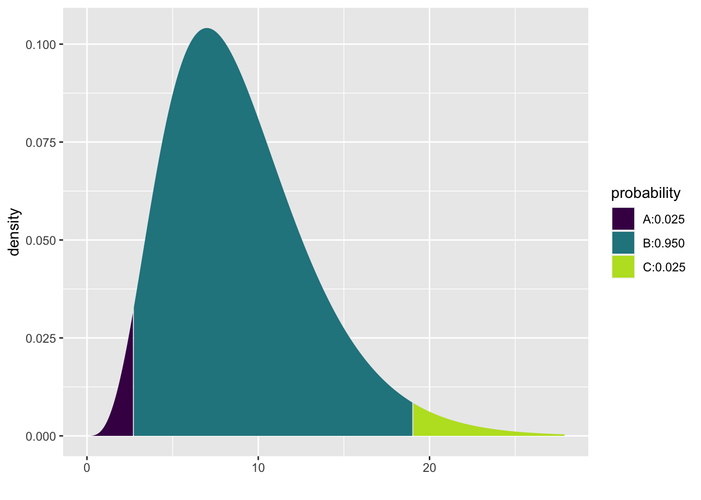

# Interval Estimates {#intest}


Up until now, we've used $\hat{\theta}$ to estimate $\theta$.  But a single numerical value gives us no information about the degree of uncertainty of the estimate.  A confidence interval is a set of values, (A,B), that we think is likely to contain $\theta$ (the true parameter).  The length of the interval gives us an idea of how closely we are able to estimate $\theta$.

## Frequentist Confidence Intervals
A frequentist confidence interval (CI) is created in such a way that the interval itself contains the parameter some specified percentage of the time.

### CI for the mean, $\mu$ in a normal random sample

We know,
\begin{eqnarray*}
\frac{\overline{X} - \mu}{s / \sqrt{n}} \sim t_{n-1}
\end{eqnarray*}

n.b., Your text uses $\sigma' = s = \sqrt{\frac{\sum_{i=1}^{n}(X_i - \overline{X})^2}{n-1}}.$  So whenever you see $\sigma'$, think $s.$


Let $c$ be some constant such that $\int_{-c}^c f_{t_{n-1}}(x) dx = \gamma$ (e.g., = 0.95).  Or:

\begin{eqnarray*}
P(-c \leq \frac{\overline{X} - \mu}{s/\sqrt{n}} \leq c) &=& 0.95\\
P( \overline{X} - c s/\sqrt{n} \leq \mu \leq \overline{X} + c s/\sqrt{n} ) &=& 0.95\\
\end{eqnarray*}


What is random here?  $\overline{X}$ and $s$ are both random! The probability of getting $(\overline{X}$,$s)$ such that $\overline{X} - c s/\sqrt{n} \leq \mu \leq \overline{X} + c s/\sqrt{n}$ is 0.95.  What is $c?$


As frequentists, we don't interpret the interval as "the probability that $\theta$ is in the interval"
\begin{eqnarray*}
X_1, X_2, \ldots, X_n &\rightarrow& \mbox{random}\\
\theta &\rightarrow& \mbox{fixed}\\
\end{eqnarray*}


>We are 95% confident that $\mu$ is between $\overline{X} - c s/\sqrt{n}$ and $\overline{X} + c s/\sqrt{n}$


Bayesians interpret intervals as "the probability that $\theta$ is in the interval" because Bayesians treat $\theta$ as a random variable (we would need a prior, etc...)  [See the next section on Bayesian Intervals.]

::: {.example}
A sample of 25 statistics students reported that they spend an average of 110 minutes per week studying statistics, with a standard deviation of 40 minutes.  Find a one-sided CI such that we are 98% confident that we know the *lower* bound of the true average studying time in the population.  Let's assume that the data are reasonably independent and normally distributed.


We need an interval $[ A,\infty)$, such that with 98% confidence, $\mu$ is in the interval.  We know:
\begin{eqnarray*}
P(c_1 \leq \frac{\overline{X} - \mu}{s/\sqrt{n}} \leq c_2) &=& 0.98\\
P( \overline{X} - c_2 s/\sqrt{n} \leq \mu \leq \overline{X} - c_1 s/\sqrt{n} ) &=& 0.98\\
P(-\infty \leq \frac{\overline{X} - \mu}{s/\sqrt{n}} \leq c_2) &=& 0.98\\
\\
\frac{\overline{X} - \mu}{s/\sqrt{n}} &\sim& t_{24} \rightarrow c_2 = 2.172\\
P( \overline{X} - 2.172 s/\sqrt{n} \leq \mu (\leq \infty) ) &=& 0.98\\
( \overline{X} - 2.172 s/\sqrt{n},\infty ) && \mbox{is a 98% CI}\\
\end{eqnarray*}
We are 98% confident that the true average studying time (in the population) is at least 92.62 minutes.  Why can't we plug in the numbers above and keep it as a probability?


2-sided interval: $c=2.492=c_2, c_1 = -2.492$
\begin{eqnarray*}
( \overline{X} - 2.492 s/\sqrt{n},\overline{X} + 2.492 s/\sqrt{n} ) && \mbox{is a 98% CI}\\
(90.06 \mbox{ min}, 129.94 \mbox{ min}) &&\\
\end{eqnarray*}


We are 98% confident that the average number of minutes per week spent studying in the population is between 90.06 min and 129.94 min.
:::


## Bayesian Intervals

Note: your book calls Bayesian intervals "posterior intervals", so we will stick to that language.  However, most people in the Bayesian literature call them <a href = "https://en.wikipedia.org/wiki/Credible_interval" target = "_blank">"credible intervals"</a>.


We'd like to say "the probability that $\theta$ is in the interval is..."  As a Bayesian we can do that because Bayesians think about $\theta$ as random, and they put a distribution on $\theta | \underline{x}$.

A Bayesian *posterior* or *credible* interval is given by the posterior distribution.  That is, a ($1-\alpha$)% posterior interval for $\theta$ is $$\Xi^{-1}_{\alpha/2} (\theta | \underline{X}), \Xi^{-1}_{1-\alpha/2} (\theta | \underline{X})$$
where $\Xi(\theta | \underline{X})$ is the posterior cumulative distribution function of $\theta$ (but maybe we should use better notation).  Do not focus on the $\Xi$ cdf notation.  Instead, keep in mind that the inverse cdf defines the tail probabilities associated with the posterior distribution.

::: {.example}
Recall the Beta-Binomial example which aims to model the true probability that Steph Curry can make a free throw, $\theta.$  Let's say we'll have him shoot 25 times and record the number of times he makes the shot.  Also, let's say we have a Beta(10,2) prior which induces a prior mean of 10/12 and is quite wide.


```r
mosaic::plotDist('beta', params = list(10, 2), main = "Beta(10,2) pdf")
```


Construct a 90% posterior interval for $\theta.$

\begin{eqnarray*}
X &\sim& \mbox{Bin}(25, \theta)\\
\theta &\sim& \mbox{Beta}(10, 2)\\
\theta | \underline{X} &\sim& \mbox{Beta}(31, 6)
\end{eqnarray*}

(n.b., look back to Section \@ref(bayes) for a refresher on how to get a posterior distribution from the prior and the likelihood.)

To build a posterior interval, we need to solve the following equation:

$$P( \_\_\_\_\_\_\_\_\_ \leq \theta \leq \_\_\_\_\_\_\_\_\_ \ | \ \underline{X}) = 0.9$$

```r
mosaic::xqbeta(c(0.05, 0.95), 31, 6)
```


```
## [1] 0.730 0.925
```

We say:  there is a 0.9 probability that the true value of $\theta$ is between (0.73, 0.92).
:::

### Joint Posterior Distribution for $\mu$ and $\sigma$ in a Normal Distribution
Remember, we found the posterior distribution of $\mu | \underline{x}$ with *known* $\sigma$.  But we don't really ever know $\sigma$.  To find a joint posterior on $\mu, \sigma | \underline{x}$, we need two priors.


Only to simplify calculations, let $\tau = 1/\sigma^2$.  $\tau$ is called the precision. The joint distribution is calculated using the product of the marginal normal distributions.  Note that that the data are assumed to be a random sample (i.e., they are independent and identically distributed according to the same $N(\mu, 1/\tau)$ distribution).

\begin{eqnarray*}
f(x | \mu, \tau) &=& \Bigg( \frac{\tau}{2 \pi} \Bigg) ^{1/2} exp \bigg[ \frac{-1}{2} \tau (x-\mu)^2 \bigg]\\
f(\underline{x} | \mu, \tau) &=& \Bigg( \frac{\tau}{2 \pi} \Bigg) ^{n/2} exp \bigg[ \frac{-1}{2} \tau \sum_{i=1}^n (x_i-\mu)^2 \bigg]\\
\end{eqnarray*}


::: {.theorem}
(@degroot Theorem 7.6.1) 
Let $X_1, X_2, \ldots X_n \sim N(\mu, 1/\tau)$ and suppose you have **priors** on $\mu|\tau$ and $\tau$,
\begin{eqnarray*}
\mu|\tau &\sim& N(\mu_0, 1/(\lambda_0 \tau) )\\
\tau &\sim& \mbox{ Gamma} (\alpha_0, \beta_0)
\end{eqnarray*}


Then, the **posteriors** on $\mu|\tau$ and $\tau$ are,
\begin{eqnarray*}
\mu | \tau, \underline{x} &\sim& N(\mu_1, 1/(\lambda_1 \tau) )\\
\tau \  | \ \underline{x}  &\sim& \mbox{ Gamma} (\alpha_1, \beta_1)
\end{eqnarray*}
where $\mu_1 = \frac{\lambda_0 \mu_0 + n \overline{x}}{\lambda_0 + n}, \ \ \ \ \lambda_1 = \lambda_0 + n, \ \ \ \ \alpha_1 = \alpha_0 + \frac{n}{2}, \ \ \ \ \ \beta_1 = \beta_0 + \frac{1}{2} \sum_{i=1}^n (x_i - \overline{x})^2 + \frac{n \lambda_0 (\overline{x} - \mu_0)^2}{2(\lambda_0 +n)}.$


Note that the prior is a joint conjugate family of distributions.  $\mu$ and $\tau$ have a normal-gamma distribution.  Note also that $\mu$ and $\tau$ are **not** independent.
:::

::: {.proof}

\begin{align}
f(\underline{x} | \mu, \tau) &= \Bigg( \frac{\tau}{2\pi}\Bigg)^{n/2} exp \Bigg[ -\frac{1}{2} \tau \sum_{i=1}^n (x_i - \mu)^2 \Bigg] \nonumber \\
\xi_1(\mu|\tau) &= \Bigg( \frac{\lambda_0 \tau}{2\pi}\Bigg)^{1/2} exp \Bigg[ -\frac{1}{2} \lambda_0 \tau (\mu - \mu_0)^2 \Bigg]  \nonumber \\
\xi_2(\tau) &= \frac{\beta_0^{\alpha_0}}{\Gamma(\alpha_0)} \tau^{\alpha_0 - 1}e^{-\beta_0 \tau} \nonumber \\
\mbox{Note, } & \mu  \mbox{ and $\tau$ are not independent, and } \xi(\mu, \tau) = \xi_1(\mu|\tau) \ \xi_2(\tau) \nonumber \\
\end{align}
\begin{align}
\xi(\mu,\tau|\underline{x}) &\propto f(\underline{x} | \mu, \tau) \ \xi_1(\mu|\tau) \ \xi_2(\tau) \nonumber \\
&\propto \tau^{\alpha_0 + (n+1)/2 -1} \exp \Bigg[-\frac{\tau}{2} \Bigg(\lambda_0 [\mu-\mu_0]^2 + \sum_{i=1}^{n}(x_i -\mu)^2 \Bigg) - \beta_0 \tau \Bigg]    (\#eq:one) \end{align}

Add and subtract $\overline{x}$ inside $(x_i -\mu)^2$ to get:

\begin{align}
\sum_{i=1}^n(x_i -\mu)^2 &= \sum_{i=1}^n(x_i - \overline{x})^2 + n(\overline{x} -\mu)^2 (\#eq:two) 
\end{align}

By adding and subtracting $\mu_1$:

\begin{align}
n(\overline{x} -\mu)^2 + \lambda_0 (\mu - \mu_0)^2 &= (\lambda_0 + n)(\mu - \mu_1)^2 + \frac{n\lambda_0(\overline{x} - \mu_0)^2}{\lambda_0 + n} (\#eq:three)
\end{align}

Combining \@ref(eq:two) and \@ref(eq:three) we get:

\begin{align}
\sum_{i=1}^n(x_i -\mu)^2 + \lambda_0 (\mu - \mu_0)^2 = (\lambda_0 + n)(\mu - \mu_1)^2 + \sum_{i=1}^n(x_i - \overline{x})^2 + \frac{n\lambda_0(\overline{x} - \mu_0)^2}{\lambda_0 + n} (\#eq:four)
\end{align}

By plugging \@ref(eq:four) into \@ref(eq:one) we get:

\begin{eqnarray}
\xi(\mu, \tau | \underline{x}) &\propto& \Bigg\{ \tau^{1/2} exp \Bigg[ -\frac{1}{2} \lambda_1 \tau (\mu - \mu_1)^2 \Bigg] \Bigg\} (\tau^{\alpha_1 -1} e^{-\beta_1 \tau})\\
\xi(\mu, \tau | \underline{x}) &=& \xi_1(\mu | \tau, \underline{x}) \xi_2(\tau | \underline{x})
\end{eqnarray}
\begin{flushright}
$\sqcap \! \! \! \! \sqcup$
\end{flushright}
:::


::: {.theorem}
Let $X_1, X_2, \ldots X_n \sim N(\mu, 1/\tau)$ and suppose you have priors on $\mu|\tau$ and $\tau$,
\begin{eqnarray*}
\mu|\tau &\sim& N(\mu_0, 1/(\lambda_0 \tau) )\\
\tau &\sim& \mbox{ Gamma} (\alpha_0, \beta_0)
\end{eqnarray*}


Then, the marginal posterior distribution of $\mu$ can be written as:
\begin{eqnarray*}
\bigg(\frac{\lambda_1 \alpha_1}{\beta_1} \bigg)^{1/2} (\mu-\mu_1) \  | \ \underline{x} \sim t_{2\alpha_1}
\end{eqnarray*}
where $\mu_1, \lambda_1, \alpha_1,$ and $\beta_1$ are given in the previous theorem.
:::

::: {.proof}
First, let
\begin{eqnarray*}
z &=& (\lambda_1 \tau)^{1/2} (\mu-\mu_1) = u(\mu)\\
\mu &=& z (\lambda_1 \tau)^{-1/2} + \mu_1 = w(z)
\end{eqnarray*}
We know (from the previous theorem):
\begin{eqnarray}
\xi(\mu,\tau|\underline{x}) &=& \xi_1(\mu|\tau,\underline{x}) \ \ \xi_2(\tau|\underline{x})\\
\mbox{So, } \xi(z,\tau|\underline{x}) &=& \xi_1(w(z)|\tau,\underline{x})\ \ \Bigg| \frac{\partial w(z)}{\partial z} \Bigg| \ \ \xi_2 (\tau|\underline{x})\\
&=& \xi_1(z(\lambda_1 \tau)^{-1/2} + \mu_1| \tau,\underline{x}) \ \ \big| (\lambda_1 \tau)^{-1/2} \big| \ \ \xi_2 (\tau|\underline{x})\\
&=& \sqrt{\frac{\lambda_1 \tau}{2 \pi}} \exp \Bigg \{ \frac{-(z(\lambda_1 \tau)^{-1/2} + \mu_1 -\mu_1)^2}{2(\lambda_1 \tau)^{-1}} \Bigg\} \ \ (\lambda_1 \tau)^{-1/2} \ \ \xi_2(\tau|\underline{x})\\
&=& \sqrt{\frac{1}{2\pi}} \exp(-z^2/2) \ \ \xi_2(\tau|\underline{x})\\
&=& \Phi(z|\underline{x}) \ \ \xi_2(\tau|\underline{x})\\
\end{eqnarray}
Which gives us:
\begin{eqnarray*}
Z|\underline{x} &\sim& N(0,1) \ \ \ \ \tau| \underline{x} \sim \mbox{Gamma}(\alpha_1,\beta_1) \ \ \mbox{  (Independent!)}\\
\mbox{Let } Y &=& 2\beta_1\tau \rightarrow Y|\underline{x} \sim \mbox{Gamma}(\alpha_1, 1/2) \equiv \chi^2_{2\alpha_1}
\end{eqnarray*}
So, creating a t random variable:
\begin{eqnarray}
U = \frac{Z}{\sqrt{Y/2\alpha_1}} = \frac{(\lambda_1 \tau)^{1/2} (\mu-\mu_1)}{\sqrt{2\beta_1\tau/2\alpha_1}} = \Bigg(\frac{\lambda_1 \alpha_1}{\beta_1} \Bigg)^{1/2}(\mu-\mu_1)
\end{eqnarray}
Which gives:
\begin{eqnarray}
\Bigg(\frac{\lambda_1 \alpha_1}{\beta_1} \Bigg)^{1/2}(\mu-\mu_1) \  | \ \underline{x}  \sim t_{2\alpha_1}
\end{eqnarray}
\begin{flushright}
$\sqcap \! \! \! \! \sqcup$
\end{flushright}
:::


Note: $E[ U | \underline{x} ] = 0$ and $Var(U | \underline{x}) = \frac{2 \alpha_1}{2 \alpha_1 - 2} = \frac{ \alpha_1}{\alpha_1 -1}$

$\rightarrow E[\mu| \underline{x}] = \mu_1$ and $Var(\mu | \underline{x}) = \frac{\beta_1}{\lambda_1 \alpha_1} \frac{\alpha_1}{\alpha_1 -1} = \frac{\beta_1}{\lambda_1(\alpha_1 -1)}$


### Posterior Interval for the mean, $\mu$ in a normal random sample

Let the confidence level be $1-\alpha$.  As with frequentist CI, the interval can be built by pivoting around the value of interest, $\mu$.
\begin{eqnarray*}
P( -c \leq U \leq c \  | \ \underline{x} ) &=& 1 - \alpha\\
P( -c \leq \Bigg( \frac{\lambda_1 \alpha_1}{\beta_1} \Bigg)^{1/2} (\mu - \mu_1) \leq c \  | \ \underline{x} ) &=& 1 - \alpha\\
P( \mu_1 - c \Bigg(\frac{\beta_1}{\lambda_1 \alpha_1} \Bigg)^{1/2} \leq \mu \leq \mu_1 + c \Bigg(\frac{\beta_1}{\lambda_1 \alpha_1} \Bigg)^{1/2} \  | \ \underline{x} ) &=& 1 - \alpha\\
\end{eqnarray*}

$\Rightarrow$ \ \ \ $\mu_1 \pm c \Bigg(\frac{\beta_1}{\lambda_1 \alpha_1} \Bigg)^{1/2}$ is a $(1 - \alpha)$100% posterior interval for $\mu$.

::: {.example}
Let's say we are trying to estimate the total number of soft drinks a particular vending machine will sell in a typical week.  We want to find a 90% posterior interval for $\mu$.  Our prior information (e.g., from past weeks) tells us:
\begin{eqnarray*}
\mu | \tau &\sim& N(750, 5 / \tau = \frac{1}{(1/5)\tau} )\\
\tau &\sim& gamma(1, 45)
\end{eqnarray*}
$\mu_0 = 750$, $\lambda_0 = 1/5$, $\alpha_0 = 1$, $\beta_0=45$

Our random sample of 10 weeks gives $\overline{x} = 692$ and $s^2 = \frac{14400}{9} = 1600$.

Our posterior parameters are:
\begin{eqnarray*}
\mu_1 &=& \frac{\lambda_0 \mu_0 + n \overline{x}}{\lambda_0 + n} = \frac{(1/5)750 + 6920}{(1/5) + 10} = 693.14\\
\lambda_1 &=& \lambda_0 + n = 10.2\\
\alpha_1 &=& \alpha_0 + n/2 = 1+ 5 =6\\
\beta_1 &=& \beta_0 + \frac{1}{2} \sum_{i=1}^n (x_i - \overline{x})^2 + \frac{n \lambda_0 (\overline{x} - \mu_0)^2}{2(\lambda_0 +n)} = 45 + 14400/2 + \frac{10(1/5) (692-750)^2}{2(1/5 +10)} = 7574.8
\end{eqnarray*}


To find a 90% PI, find cutoff values such that $P(-c \leq t_{2\alpha_1} \leq c) = 0.9$. $2 \alpha_1 =12$, $P(t_{12} \leq 1.782) = 0.95$.
\begin{eqnarray*}
P(-1.782 \leq U \leq 1.782  \  | \ \underline{x} ) &=& 0.9\\
P(\mu_1 - 1.782 (\frac{\beta_1}{\lambda_1 \alpha_1})^{1/2} \leq \mu \leq \mu_1 + 1.782 (\frac{\beta_1}{\lambda_1 \alpha_1})^{1/2} \  | \ \underline{x} ) &=& 0.9\\
P(673.31 \leq \mu \leq 712.97 \  | \ \underline{x} ) &=& 0.9
\end{eqnarray*}

Given our prior beliefs and data, there is a 90% probability that the average number of cans sold per week is between 673.31 and 712.97 cans.
:::

#### Improper priors, continued... {-}
Notice that if $\mu_0 = \beta_0 = \lambda_0 = 0$ and $\alpha_0= -1/2$, $\mu_1 = \overline{x}$, $\lambda_1 = n$, $\alpha_1 = (n-1)/2$, $\beta_1 = \sum(x_i - \overline{x})^2 / 2$.  Our interval becomes:

\begin{eqnarray*}
\overline{x} &\pm& t^* \Bigg( \frac{(1/2) \sum(x_i - \overline{x})^2}{n (n-1)/2} \Bigg)^{1/2}\\
\overline{x} &\pm& t^* s/\sqrt{n}
\end{eqnarray*}


The improper prior down-weights any beliefs and gives a frequentist-like (i.e., data only) answer with a Bayesian-like interpretation.


## Bootstrap Confidence Intervals

Notice that we use the phrase "confidence intervals" when describing intervals made using the bootstrap process.  That is because the logic and interpretation for bootstrap confidence intervals is the same as the theory based frequentist confidence intervals.  

### Different Bootstrap CIs

There are many ways to use the bootstrap sampling distribution to create an interval estimate for $\theta$.  We will cover a few different approaches, but keep in mind that the techniques extend beyond what we will cover here.

#### Bootstrap Confidence Interval Logic

Keep in mind that what we are trying to do is approximate the sampling distribution of $\hat{\theta}$.  In fact, what we are really able to do here is to estimate the sampling distribution of $\frac{\hat{\theta} - \theta}{SE(\hat{\theta})}$.  We hope that:
\begin{eqnarray*}
\hat{F}\bigg(\frac{\hat{\theta}^*_b - \hat{\theta}}{\hat{SE}^*_B} \bigg) \rightarrow F\bigg(\frac{\hat{\theta} - \theta}{SE(\hat{\theta})}\bigg)
\end{eqnarray*}

Recall the derivation of conventional confidence intervals (for a location parameter, like $\mu$).  We somehow know the distribution of $ \frac{\hat{\theta} - \theta}{SE(\hat{\theta})}$ (which gives the cutoff vales of $q$), and then we isolate $\theta$ in the middle of the probability statement.  Keeping in mind that the randomness in the probability statement comes from the **endpoints** not the parameter.
\begin{eqnarray*}
P\bigg(q_{(\alpha/2)} \leq \frac{\hat{\theta} - \theta}{SE(\hat{\theta})} \leq q_{(1-\alpha/2)}\bigg)&=& 1 - \alpha\\
P\bigg(\hat{\theta} - q_{(1-\alpha/2)} SE(\hat{\theta}) \leq \theta \leq \hat{\theta} - q_{(\alpha/2)} SE(\hat{\theta})\bigg) &=& 1 - \alpha\\
\end{eqnarray*}

That is, it's the endpoints that are random, and we have a 0.95 probability that we'll get a random sample which will produce endpoints which will capture the true parameter.

#### BS SE Confidence Interval
We could use the BS SE within the CI formula (with standard normal values like 1.96 for 95% interval as the estimated quantiles).  The problem is that such an interval will only be accurate if the distribution for $\hat{\theta}$ is reasonably normal.  If there is any bias or skew, the CI will not have desired coverage levels [@efrontibs, pg 161 & chp 22].

95% BS SE CI for $\theta$: $$\hat{\theta} \pm 1.96 \cdot \hat{SE}^*_B$$

#### BS-t Confidence Interval
Now consider using the bootstrap to estimate the **distribution** for $\frac{\hat{\theta} - \theta}{SE(\hat{\theta})}$ (and not just the SE of $\hat{\theta}$).
\begin{eqnarray*}
T^*(b) &=& \frac{\hat{\theta}^*_b - \hat{\theta}}{\hat{SE}^*(b)}
\end{eqnarray*}
\noindent
where $\hat{\theta}^*_b$ is the value of $\hat{\theta}$ for the $b^{th}$ bootstrap sample, and $\hat{SE}^*(b)$ is the estimated standard error of $\hat{\theta}^*_b$ for the $b^{th}$ bootstrap sample.  The $\alpha/2^{th}$ percentile of $T^*(b)$ is estimated by the value of $\hat{q}^*_{\alpha/2}$ such that
\begin{eqnarray*}
\frac{\# \{T^*(b) \leq \hat{q}^*_{\alpha/2} \} }{B} = \alpha/2
\end{eqnarray*}
\noindent
For example, if $B=1000$, the estimate of the 5% point is the $50^{th}$ smallest value of the $T^*(b)$s, and the estimate of the 95% point is the $950^{th}$ smallest value of the $T^*(b)$s (two values that would be used to create a 90% interval).

Finally, the boostrap-t confidence interval is:
\begin{align} 
(\hat{\theta} - \hat{q}^*_{1-\alpha/2}\hat{SE}^*_B,  \hat{\theta} - \hat{q}^*_{\alpha/2}\hat{SE}^*_B) (\#eq:BSt)
\end{align}


Note that the multiplier $(q^*)$ is given by $T^*(b)$ which requires a separate estimate of the SE for each bootstrap sample.  Accordingly, to find a bootstrap-t interval, we have to bootstrap twice, see Figure \@ref(BSt). The algorithm is as follows:

1. Generate $B$ bootstrap samples, and for each sample $\underline{X}^{*b}$ compute the bootstrap estimate $\hat{\theta}^*_b$. 
2. $\rightarrow$ Take $M$ bootstrap samples from $\underline{X}^{*b}$, and estimate the standard error, $\hat{SE}^*(b)$. 
3. Find $B$ values for $T^*(b)$.  Calculate $\hat{q}^*_\alpha$ and $\hat{q}^*_{1-\alpha}$. 
4. Calculate the CI as in equation \@ref(eq:BSt).


<div class="figure" style="text-align: center">

<p class="caption">(\#fig:BSt)From each of the B bootstrap samples, take an additional M bootstrap samples.  The goal is to estimate the SE of the statistics B times.</p>
</div>

Reflecting on the BS-t interval process, we have the following considerations:

* If $B\cdot \alpha$ is not an integer, use $k=\lfloor (B+1) \alpha \rfloor$ and $B+1-k$.
* Bootstrap-t intervals are somewhat erratic and can be influenced by a few outliers.  Percentile methods are more reliable when the sampling distribution for $\hat{\theta}$ is reasonably normal.
* $B=100$ or 200 is usually not enough for a bootstrap-t CI.  However, $M=25$ may be enough to estimate the SE.  $B=1000$ is needed for computing percentiles from either $\hat{\theta}^*_b$ or of $\hat{q}^*$.
* In choosing the appropriate multiplier:
  - The normal multiplier ($Z$) is more general, and when appropriate to use, it works  for all $n$ and all samples.
  - The bootstrap-t multiplier is good for *this* sample only.
* The resulting intervals will typically not be symmetric (that is $\hat{q}^*_\alpha \ne - \hat{q}^*_{1-\alpha}$).  The asymmetry is part of the improvement over $Z$ or $t$ intervals.
* Bootstrap-t intervals are good for location statistics (mean, quantiles, trimmed means) but cannot be trusted for other statistics like the correlation.


#### Bootstrap Percentile Confidence Intervals
The interval between the $\alpha/2$ and $1-\alpha/2$ quantiles of the bootstrap distribution of  a statistic is a $(1-\alpha)100$% bootstrap percentile confidence interval for the corresponding parameter:
\begin{eqnarray*}
[\hat{\theta}^*_{\alpha/2}, \hat{\theta}^*_{1-\alpha/2}]  = [F^{-1}_{\hat{\theta}^*} (\alpha/2), F^{-1}_{\hat{\theta}^*} (1 - \alpha/2)]
\end{eqnarray*}

Why does it work? It isn't immediately obvious that the interval above will capture the true parameter, $\theta$, at a rate or 95%.  Consider a skewed sampling distribution.  If your $\hat{\theta}$ comes from the long tail, is it obvious that the short tail side of your CI will get up to the true parameter value at the correct rate?  (@hall refers to these as Efron's "backwards" intervals.) Or, if your sampling distribution is biased, the percentiles of the bootstrap interval won't capture the parameter with the correct rate.


To see how / why percentiles intervals work, we first start by considering normal sampling distributions for a function of our statistic. Let $\phi = g(\theta), \hat{\phi} = g(\hat{\theta}), \hat{\phi}^* = g(\hat{\theta}^*)$, where $g$ is a monotonic function (assume wlog that $g$ is increasing).  The point is to choose (if possible) $g(\cdot)$ such that
\begin{eqnarray}
 \hat{\phi}^* - \hat{\phi} \sim \hat{\phi} - \phi \sim N(0, \sigma^2). (\#eq:phidist)
 \end{eqnarray}
Again, consider the logic for the conventional frequentist confidence interval.  Because $\hat{\phi} - \phi \sim N(0, \sigma^2)$, the interval for $\theta$ is created by:
\begin{eqnarray}
P( (\hat{\phi} - \phi ) / \sigma > z_\alpha) &=& 1 - \alpha \nonumber\\
P( \hat{\phi} - z_\alpha \sigma > \phi) &=& 1 - \alpha \nonumber\\
\mbox{Interval for } \phi && (-\infty, \hat{\phi} + \sigma z_{1-\alpha}) \nonumber \\
\mbox{Interval for } \theta && (-\infty, g^{-1}(\hat{\phi} + \sigma z_{1-\alpha})) (\#eq:phiint)
\end{eqnarray}
where $z_{1-\alpha}$ is the $100(1-\alpha)$ percent point of the standard normal distribution.   Note that the interval for $\theta$ in equation \@ref(eq:phiint) is problematic in that it requires knowledge of $g.$  (Also, it doesn't use any of the power of the bootstrap.)


Equation \@ref(eq:phidist) implies that $\hat{\phi} + \sigma z_{1-\alpha} = F^{-1}_{\hat{\phi}^*}(1-\alpha)$.  [A picture goes a long way here:  draw two normal curves, one describing the sampling distribution of $\hat{\phi} - \phi $, and the other describing the sampling distribution of $\hat{\phi}^* - \hat{\phi}$.   Because of the assumption in equation \@ref(eq:phidist), the two sketched out normal curves should be the same, which implies that $\hat{\phi} + \sigma z_{1-\alpha} = F^{-1}_{\hat{\phi}^*}(1-\alpha)$.]  Further, since $g$ is monotonically increasing, $F^{-1}_{\hat{\phi}^*}(1-\alpha) = g(F^{-1}_{\hat{\theta}^*}(1-\alpha)).$
Substituting in \@ref(eq:phiint), gives the percentile interval for $\theta$^[Proof from Carpenter and Bithell, *Statistics in Medicine*, 2000],
\begin{eqnarray}
(-\infty, F^{-1}_{\hat{\theta}^*}(1-\alpha)).
\end{eqnarray}


As a tangible example of how a statistic might have a transformation resulting in a normal sampling distribution, consider the sample correlation.  Fisher worked on the correlation coefficient and had two interesting results.


::: {.example}
Consider a population of 82 law schools.  Two measurements were made on the entering class of each school (in 1973!).  LSAT, the average score for the class on a national law test, and GPA, the average undergraduate grade-point average for the class.  A random sample of 15 schools is selected from the population, and the correlation between GPA and LSAT score was found to be 0.776.

In a perfect world, how would we then proceed to think about this problem?  What do we want to know?  What do we want to say about the population?  **We'd want to know the *sampling distribution* of r...$\hat{\theta}.$**
:::


1. Fisher (1915) proved that the expected value of the correlation coefficient based on random sampling from a normal population is approximately:
\begin{eqnarray*}
E[r] = \rho - \frac{\rho(1-\rho^2)}{2n}
\end{eqnarray*}
Solving for $\rho$ gives an approximately unbiased estimator of the population correlation:
\begin{eqnarray*}
\hat{\rho} = r \Big[ 1 + \frac{(1-r^2)}{2n} \Big]
\end{eqnarray*}
Further work has been done (Fisher (1915), Kenny and Keeping (1951), Sawkins (1944), and Olkin and Pratt (1958)) the later which recommend using
\begin{eqnarray*}
\hat{\rho} = r \Big[ 1 + \frac{(1-r^2)}{2(n-3)} \Big]
\end{eqnarray*}
Note that the bias decreases as $n$ increases and as $\rho$ approaches zero.  Note also that if the data are distributed normally:
\begin{eqnarray*}
SE(r) = \frac{(1-\rho^2)}{\sqrt{n-2}}
\end{eqnarray*}
(No other data distribution leads to a simple formula for the SE of the correlation.)

2. Fisher also introduced the $r$ to $Z$ transformation:
\begin{eqnarray*}
Z = \frac{1}{2} \ln \Big[\frac{1+r}{1-r}\Big]
\end{eqnarray*}
We think of this as the non-linear transformation that normalizes the sampling distribution of r.  (Note: it is an inverse hyperbolic tangent function.)


<!--
\iffalse
\begin{eqnarray*}
P\bigg(q_{(\alpha/2)} \leq \frac{\hat{\theta} - \theta}{SE(\theta)} \leq q_{(1-\alpha/2)}\bigg)&=& 1 - \alpha\\
P\bigg(\hat{\theta} - q_{(1-\alpha/2)} SE(\theta) \leq \theta \leq \hat{\theta} - q_{(\alpha/2)} SE(\theta)\bigg) &=& 1 - \alpha\\
\end{eqnarray*}
Let's think about the endpoints in a way that is convenient for bootstrap CIs.  Let $\hat{\theta}^*$ indicate a random variable drawn from the distribution $N(\hat{\theta}, \hat{SE}^2)$.  That is, assume (for a minute) that the true sampling distribution for $\hat{\theta}$ (and for $\hat{\theta}^*$) is normal.
\begin{eqnarray*}
\hat{\theta}^* \sim N(\hat{\theta}, \hat{SE}^2)
\end{eqnarray*}
Then $\hat{\theta}_{lo} = \hat{\theta} - q_{(1-\alpha/2)} \hat{SE} \approx \hat{\theta} - q_{(1-\alpha/2)} SE(\theta)$ and $\hat{\theta}_{up} = \hat{\theta} - q_{(\alpha/2)} \hat{SE} \approx \hat{\theta} - q_{(\alpha/2)} SE(\theta)$ are the $100\alpha^{th}$ and $100(1-\alpha)^{th}$ percentiles for the distribution of $\hat{\theta}^*$.   In other words:
\begin{eqnarray*}
\hat{\theta}_{lo} &=& \hat{\theta}^*_\alpha = 100 \alpha^{th} \mbox{ percentile of the distribution for } \hat{\theta}^*\\
\hat{\theta}_{up} &=& \hat{\theta}^*_{1-\alpha} = 100 (1-\alpha)^{th} \mbox{ percentile of the distribution for } \hat{\theta}^*\\
\end{eqnarray*}

That is, if in fact $\hat{\theta}^*$ has a normal distribution, the percentiles will equal the appropriate CI bounds, and so we know that the probability theory will hold.
\fi
-->


#### BCa Confidence Interval

(Fall 2022: we won't cover BCa intervals.)


In the percentile method, we've assumed that there exists a transformation of $\theta$, $\phi(\theta)$, such that
\begin{eqnarray*}
\phi(\hat{\theta}) - \phi(\theta) \sim N(0,1)
\end{eqnarray*}
The transformation assumes that neither $\theta$ nor $\phi$ are biased, and it assumes that the variance is constant for all values of the parameter.  That is, in the percentage intervals, we assume the normalizing transformation creates a sampling distribution that is unbiased and variance stabilizing.  Consider a monotone transformation that *normalizes* the sampling distribution (we no longer assume unbiased or constant variance).


We now consider the case where $\theta$ is a biased estimator. That is:
\begin{eqnarray*}
\frac{\phi(\hat{\theta}) - \phi(\theta)}{c} \sim N(-z_0,1)
\end{eqnarray*}
We've corrected for the bias, but if there is non-constant variance, we need a further adjustment to stabilize the variance:

\begin{eqnarray*}
\phi(\hat{\theta}) - \phi(\theta) \sim N(-z_0 \sigma_\phi,\sigma_\phi), \ \ \ \ \ \ \sigma_\phi = 1 + a \phi
\end{eqnarray*}
That is, there must exist a monotone transformation $\phi$ such that $\phi(\hat{\theta}) \sim N$ where
\begin{eqnarray*}
E(\phi(\hat{\theta})) = \phi(\theta) - z_0 [1 + a \phi(\theta)] && SE(\phi(\hat{\theta})) = 1 + a \phi(\theta)
\end{eqnarray*}
(Note: in the expected value and SE we've assumed that $c=1$. If $c\ne1$, then we can always choose a different transformation, $\phi'$ so that $c=1$.)  Then
\begin{eqnarray*}
P(z_{\alpha/2} \leq \frac{\phi(\hat{\theta}) - \phi(\theta)}{1 + a \phi(\theta)} + z_0 \leq z_{1-\alpha/2}) = 1 - \alpha
\end{eqnarray*}
A $(1-\alpha)$100% CI for $\phi(\theta)$ is
\begin{eqnarray*}
\bigg[ \frac{\phi(\hat{\theta}) - (z_{1-\alpha/2} - z_0)}{1 + a (z_{1-\alpha/2} - z_0)}, \frac{\phi(\hat{\theta}) - (z_{\alpha/2} - z_0)}{1 + a (z_{\alpha/2} - z_0)} \bigg]
\end{eqnarray*}
Let's consider an interesting probability question:
\begin{eqnarray*}
P\bigg( \phi(\hat{\theta}^*) &\leq& \frac{\phi(\hat{\theta}) - (z_{1-\alpha/2} - z_0)}{(1 + a (z_{1-\alpha/2} - z_0))} \bigg) = ?\\
= P\bigg( \frac{\phi(\hat{\theta}^*) - \phi(\hat{\theta})}{1 + a \phi(\hat{\theta})} &\leq& \frac{\phi(\hat{\theta}) - (z_{1-\alpha/2} - z_0) - \phi(\hat{\theta}) - \phi(\hat{\theta})a(z_{1-\alpha/2} - z_0)}{(1 + a (z_{1-\alpha/2} - z_0))(1+a \phi(\hat{\theta}))} \bigg)\\
= P\bigg( \frac{\phi(\hat{\theta}^*) - \phi(\hat{\theta})}{1 + a \phi(\hat{\theta})} &\leq& \frac{ - (z_{1-\alpha/2} - z_0) - \phi(\hat{\theta})a(z_{1-\alpha/2} - z_0)}{(1 + a (z_{1-\alpha/2} - z_0))(1+a \phi(\hat{\theta}))} \bigg)\\
= P\bigg( \frac{\phi(\hat{\theta}^*) - \phi(\hat{\theta})}{1 + a \phi(\hat{\theta})} &\leq& \frac{ -(1+a \phi(\hat{\theta})) (z_{1-\alpha/2} - z_0) }{(1 + a (z_{1-\alpha/2} - z_0))(1+a \phi(\hat{\theta}))} \bigg)\\
= P\bigg( \frac{\phi(\hat{\theta}^*) - \phi(\hat{\theta})}{1 + a \phi(\hat{\theta})} &\leq& \frac{ - (z_{1-\alpha/2} - z_0) }{(1 + a (z_{1-\alpha/2} - z_0))} \bigg)\\
= P\bigg( \frac{\phi(\hat{\theta}^*) - \phi(\hat{\theta})}{1 + a \phi(\hat{\theta})} &\leq& \frac{ (z_{\alpha/2} + z_0) }{(1 - a (z_{\alpha/2} + z_0))} \bigg)\\
= P\bigg( \frac{\phi(\hat{\theta}^*) - \phi(\hat{\theta})}{1 + a \phi(\hat{\theta})} + z_0 &\leq& \frac{ (z_{\alpha/2} + z_0) }{(1 - a (z_{\alpha/2} + z_0))} + z_0 \bigg)\\
= P\bigg( Z &\leq& \frac{ (z_{\alpha/2} + z_0) }{(1 - a (z_{\alpha/2} + z_0))} + z_0 \bigg) = \gamma_1\\
\mbox{where } \gamma_1 &=& \Phi \bigg(\frac{ (z_{\alpha/2} + z_0) }{(1 - a (z_{\alpha/2} + z_0))} + z_0 \bigg)\\
 &=& \verb;pnorm; \bigg(\frac{ (z_{\alpha/2} + z_0) }{(1 - a (z_{\alpha/2} + z_0))} + z_0 \bigg)
\end{eqnarray*}

What we've shown is that the $\gamma_1$ quantile of the $\phi(\hat{\theta}^*)$ sampling distribution will be a good estimate for the lower bound of the confidence interval for $\phi(\theta)$.  Using the same argument on the upper bound, we find a $(1-\alpha)$100% confidence interval for $\phi(\theta)$ to be:

\begin{eqnarray*}
&&[\phi(\hat{\theta}^*)_{\gamma_1}, \phi(\hat{\theta}^*)_{\gamma_2}]\\
&& \\
\mbox{where } \gamma_1 &=& \Phi\bigg(\frac{ (z_{\alpha/2} + z_0) }{(1 - a (z_{\alpha/2} + z_0))} + z_0 \bigg)\\
 \gamma_2 &=& \Phi \bigg(\frac{ (z_{1-\alpha/2} + z_0) }{(1 - a (z_{1-\alpha/2} + z_0))} + z_0 \bigg)\\
\end{eqnarray*}

Using the transformation respecting property of percentile intervals, we know that a $(1-\alpha)$100% confidence interval for $\theta$ is:

\begin{eqnarray*}
&&[\hat{\theta}^*_{\gamma_1}, \hat{\theta}^*_{\gamma_2}]
\end{eqnarray*}


**How do we estimate $a$ and $z_0$?**

**bias:**
$z_0$ is a measure of the bias.  Recall:
\begin{eqnarray*}
bias &=& E(\hat{\theta}) - \theta\\
\hat{bias} &=& \hat{\theta}^* - \hat{\theta}\\
\end{eqnarray*}

But remember that $z_0$ represents the bias for $\phi(\hat{\theta})$, not for $\hat{\theta}$ (and we don't know $\phi$!).  So, we use $\theta$ to see what proportion of $\theta$ values are too low, and we can map it back to the $\phi$ space using the normal distribution:
\begin{eqnarray*}
\hat{z}_0 &=& \Phi^{-1} \bigg( \frac{ \# \hat{\theta}^*_b < \hat{\theta}}{B} \bigg)
\end{eqnarray*}
That is, if $\hat{\theta}^*$ underestimates $\hat{\theta}$, then $\hat{\theta}$ likely underestimates $\theta$; $z_0 > 0$.  We think of $z_0$ and the normal quantile associated with the proportion of BS replicates less than $\hat{\theta}$.

**skew:**
$a$ is a measure of skew.
\begin{eqnarray*}
bias&=& E(\hat{\theta} - \theta)\\
var &=& E(\hat{\theta} - \theta)^2 = \sigma^2\\
skew &=& E(\hat{\theta} - \theta)^3 / \sigma^3\\
\end{eqnarray*}
We can think of the skew as the rate of chance of the standard error on a normalized scale.  If there is no skew, we will estimate $a=0$.  Our estimate of $a$ comes from a procedure known as the jackknife.
\begin{eqnarray*}
\hat{a} = \frac{\sum_{i=1}^n (\hat{\theta} - \hat{\theta}_{(i)})^3}{6 [ \sum_{i=1}^n (\hat{\theta} - \hat{\theta}_{(i)})^2 ] ^{3/2}}
\end{eqnarray*}


### What makes a CI good?

**The transformation respecting property**  A CI is transformation respecting if, for any monotone transformation, the CI for the transformed parameter is simply the transformed CI for the unstransformed parameter.  Let $\phi = m(\theta)$.
\begin{eqnarray*}
[\phi_{lo}, \phi_{up}] = [m(\theta_{lo}), m(\theta_{up})]
\end{eqnarray*}
Note that the idea has to do with the process of creating the CI.  That is, if we create the confidence interval using $\phi$, we'll get the same thing as if we created the CI using $\theta$ and then transformed it.  It is straightforward to see that the percentile CI is transformation respecting.  That is, for any monotone transformation of the statistic and parameter, the CI will be transformed appropriately.

Let
\begin{eqnarray*}
\hat{\phi} &=& 0.5 \ln\bigg(\frac{1+r}{1-r}\bigg)\\
r &=&\frac{e^{2\phi}+1}{e^{2\phi}-1}\\
\end{eqnarray*}

We know that $\hat{\phi}$ does have an approximate normal distribution.  So, the percentile CI for $\phi$ will approximate the normal theory CI which we know to be correct (for a given $\alpha$).  But once we have a CI for $\phi$ we can find the CI for $\rho$ by taking the inverse monotonic transformation; or rather... we can just use the r percentile CI to start with!


**Percentile interval lemma** [@efrontibs, pg 173]  Suppose the transformation for $\hat{\phi} = m(\hat{\theta})$ perfectly normalizes the distribution of $\hat{\theta}$:
\begin{eqnarray*}
\hat{\phi} \sim N (\phi, 1)
\end{eqnarray*}
Then the percentile interval based on $\hat{\theta}$ equals $[m^{-1}(\hat{\phi} - z_{1-\alpha/2} ), m^{-1}(\hat{\phi} - z_{\alpha/2} )]$.

And we can approximate $[m^{-1}(\hat{\phi} - z_{1-\alpha/2} ), m^{-1}(\hat{\phi} - z_{\alpha/2} )]$ using $[\hat{\theta}^*_{\alpha/2}, \hat{\theta}^*_{1-\alpha/2}]$

In order for a percentile interval to be appropriate, we simply need to know that a normalizing transformation exists.  We do not need to actually find the transformation! [In complete disclosure, the transformation doesn't have to be to a normal distribution.  But it must be a monotonic transformation to a distribution which is symmetric about zero.]

::: {.example}
From Charlotte Chang's (Prof Chang in Bio!) example on bootstrapping a loess smooth for her thesis data. <!--(carryingcap.r)-->  The idea was this:  Prof Chang had some data that she wanted to model (using differential equations, DE).  She asked me how to tell whether or not her new model was reflective of the data / population.  The model was applied in repeated simulations and can be seen with the black / red lines.  Additionally, we fit a loess spline to see the shape of the data (blue line).  Then we bootstrapped the data and fit 1000 more loess splines.  Using the percentile CI method, we created a CI for a population loess spline fit (green lines).  The DE model  (confidence within the red bounds) doesn't seem to be a terrible fit, but it definitely seems to say something different about the relationship between year and pipits than the data / bootstrapping (confidence within the green bounds).


<div class="figure" style="text-align: center">

<p class="caption">(\#fig:unnamed-chunk-4)Model of number of birds per route as a function of time.  Blue line is loess fit; green lines are bootstrap CI for the loess fit.  The differential expression model is given by the red CI bounds under model simulation (not bootstrapping).</p>
</div>

:::

Keeping in mind that the theory we've covered here doesn't exactly work for this situation (our work has been on simple parameter estimation), you can imagine that many of the ideas we've talked about do apply to Charlotte's situation.  To do a more precise analysis, we need to be careful about multiple comparisons and non-independent data values.

**The range preserving property**  Another advantage of the percentile interval is that it is range preserving.  That is, the CI always produces endpoints that fall within the allowable range of the parameter.


**Bias** The percentile interval is not, however, perfect.  If the statistic is a biased estimator of the parameter, there will not exist a transformation such that the distribution is centered around the correct function of the parameter.  Formally,  if
\begin{eqnarray*}
\hat{\theta} \sim N(\theta + bias, \hat{SE}^2)
\end{eqnarray*}
no transformation $\phi = m(\theta)$ can fix things up.  Keep in mind that standard intervals can fail in a variety of ways, and the percentile method has simply fixed the situation when the distribution is non-normal.


* Symmetry (important??): the interval is symmetric, pivotal around some value.  Not necessarily a good thing.  Maybe a bad thing to force?
* Robust: BS-t is particularly not robust (can make it more robust with a variance stabilizing transformation)
* Range preserving: the CI always contains only values that fall within an allowable range ($p, \rho$,...)
* Transformation respecting: for any monotone transformation, $\phi = m(\theta)$, the interval for $\theta$ is mapped by $m(\theta)$.  If $[\hat{\theta}_{(lo)},\hat{\theta}_{(hi)}]$ is a $(1-\alpha)100$% interval for $\theta$, then
\begin{eqnarray*}
[\hat{\phi}_{(lo)},\hat{\phi}_{(hi)}] = [m(\hat{\theta}_{(lo)}),m(\hat{\theta}_{(hi)})]
\end{eqnarray*}
are exactly the same interval.
* Correct level of confidence: A central (not symmetric) confidence interval, $[\hat{\theta}_{(lo)},\hat{\theta}_{(hi)}]$ should have probability $\alpha/2$ of not covering $\theta$ from above or below:
\begin{eqnarray*}
P(\theta < \hat{\theta}_{(lo)})&=&\alpha/2\\
P(\theta > \hat{\theta}_{(hi)})&=&\alpha/2\\
\end{eqnarray*}


Note:  all of the bootstrap intervals are approximate.  We judge them based on how accurately they cover $\theta$.


A CI is **first order accurate** if:
\begin{eqnarray*}
P(\theta < \hat{\theta}_{(lo)})&=&\alpha/2 + \frac{const_{lo}}{\sqrt{n}}\\
P(\theta > \hat{\theta}_{(hi)})&=&\alpha/2+ \frac{const_{hi}}{\sqrt{n}}\\
\end{eqnarray*}

A CI is **second order accurate** if:
\begin{eqnarray*}
P(\theta < \hat{\theta}_{(lo)})&=&\alpha/2 + \frac{const_{lo}}{n}\\
P(\theta > \hat{\theta}_{(hi)})&=&\alpha/2+ \frac{const_{hi}}{n}\\
\end{eqnarray*}

|   CI  | Symmetric | Range Resp | Trans Resp |    Accuracy    | Normal Samp Dist? | Other                              |
|:-----:|:---------:|:----------:|:----------:|:--------------:|:-----------------:|------------------------------------|
|  perc |     No    |     Yes    |     Yes    | $1^{st}$ order |         No        | small $n \rightarrow$ low accuracy |
| BS SE |    Yes    |     No     |     No     | $1^{st}$ order |        Yes        | param assump $F(\hat{\theta})$     |
|  BS-t |     No    |     No     |     No     | $2^{nd}$ order |      Yes-ish      | computer intensive                 |
|  BCa  |     No    |     Yes    |     Yes    | $2^{nd}$ order |         No        | limited param assump               |


#### Advantages and Disadvantages


BS SE Interval

* **Advantages**
similar to the familiar parametric approach; useful with a normally distributed $\hat{\theta}$; requires the least computation ($B=50-200$)
* **Disadvantages**
fails to use the entire $\hat{F}^*(\hat{\theta}^*)$

Bootstrap-t Confidence Interval

* **Advantages**
highly accurate CI in many cases; handles skewed $F(\hat{\theta})$ better than the percentile method;
* **Disadvantages**
not invariant to transformations; computationally expensive with the double bootstrap

Percentile Interval

* **Advantages**
uses the entire $\hat{F}^*(\hat{\theta}^*)$; allows $F(\hat{\theta})$ to be asymmetrical; invariant to transformations; range respecting; simple to execute
* **Disadvantages**
small samples may result in low accuracy (because of the dependence on the tail behavior); assumes $\hat{F}^*(\hat{\theta}^*)$ to be unbiased

BCa Interval

* **Advantages**
all of those of the percentile method; allows for bias in $\hat{F}^*(\hat{\theta}^*)$; $z_0$ can be calculated easily from $\hat{F}^*(\hat{\theta}^*)$ 
* **Disadvantages**
requires a limited parametric assumption; can be complicated to compute

### Bootstrap CI and Hypothesis Testing

(Fall 2022: we won't cover bootstrap hypothesis testing.)

In this class we have seen many times that if a null value for a parameter is not contained in a CI, we reject the null hypothesis; similarly, we do not reject a null value if it does lie inside the CI.  Using BS CIs, we can apply the same logic, and test any hypothesis of interest (note: we can always create one-sided intervals as well!).  But simply using CIs leaves out the p-value information.  How do we get a p-value from a CI? Consider an alternative definition for the p-value:

**p-value:**  The smallest level of significance at which you would reject $H_0$.

So, what we want is for the null value ($\theta_0$) to be one of the endpoints of the confidence interval with some level of confidence $1-2\alpha_0$.  $\alpha_0$ will then be the one-sided p-value, $2\alpha_0$ will be the two-sided p-value.

For percentile intervals,
\begin{eqnarray*}
p-value = \alpha_0 = \frac{\# \hat{\theta}^*_b < \theta_0}{B}
\end{eqnarray*}
(without loss of generality, assuming we set $\hat{\theta}^*_{lo} = \theta_0$).


## <i class="fas fa-lightbulb" target="_blank"></i> Reflection Questions

1. In a frequentist confidence interval, is it the parameter or the endpoints of the interval that are random? 
2. What is the correct interpretation of a frequentist confidence interval? 
3. Why might we create a one-sided interval vs a two-sided interval? 
4. Why do you need to first find a posterior distribution in order to create a Bayesian posterior (credible) interval
5. What is the correct interpretation of a Bayesian posterior (credible) interval? 
6. What is the marginal posterior distribution of $\mu$ in the situation where both $\mu$ and $\sigma^2$ are unknown (and we have prior distributions for both)?
7. How do you use the marginal posterior distribution for $\mu$ to create a posterior (credible) interval? 
8. From previous chapters, but used here: what are the different ways to determine the distribution of a statistic?

## <i class="fas fa-balance-scale"></i> Ethics Considerations

1. What is wrong with each of the following interpretations for a CI:
    * There is a 0.9 prob that the true average number of chips is between 3.7 & 17.2.
    * 90% of cookies have between 3.7 & 17.2 chips.
    * We are 90% confident that in our sample, the sample average number of chips is between 3.7 and 17.2.
    * In many repeated samples, 90% of sample averages will be between 3.7 and 17.2.
2. What are the technical conditions for creating confident intervals using a t-distribution?  That is, what are the conditions on the data that give rise to the t-distribution?  What happens if the technical conditions are violated and the confidence interval is created anyway?  
3. How much influence does the prior have on the resulting posterior (credible) interval?  (Hint: the answer is "it depends.")

## R code: Creating Interval Estimates

### Finding cutoffs

Recall that the `q` in the distributional functions (e.g., `qnorm()`, `qbinom()`, `qunif()`, `qchisq()`, `qt()`) indicates that the output is a **quantile**.

The **mosiac** package adds an `x` to the front of the function name which allows a figure to accompany the numerical value of the quantile.  I highly recommend drawing pictures when finding quantiles or percentages.

One-sided 98% t-interval $(df = 24)$ where 98% of the probability is to the left of the quantile of interest. Note that the t-distribution is symmetric.


```r
mosaic::xqt(.98, 24)
```


```
## [1] 2.17
```

Two-sided 98% t-interval $(df = 24)$ where 98% of the area is in the center, so 99% of the area is to the left.  Note that the code can be written in two different ways and provides the same quantile values. Note also that the t-distribution is symmetric.


```r
mosaic::xqt(.99, 24)
```


```
## [1] 2.49
```

```r
mosaic::xqt(c(0.01, 0.99), 24)
```


```
## [1] -2.49  2.49
```

Two-sided 95% chi-square interval $(df = 9)$.  Note that the chi-square distribution is not symmetric.


```r
mosaic::xqchisq(c(0.025, 0.975), 9)
```



```
## [1]  2.7 19.0
```

To find a 90% prediction inteval cutoff, the same R code is used:


```r
mosaic::xqt(0.95, 12)
```


```
## [1] 1.78
```


