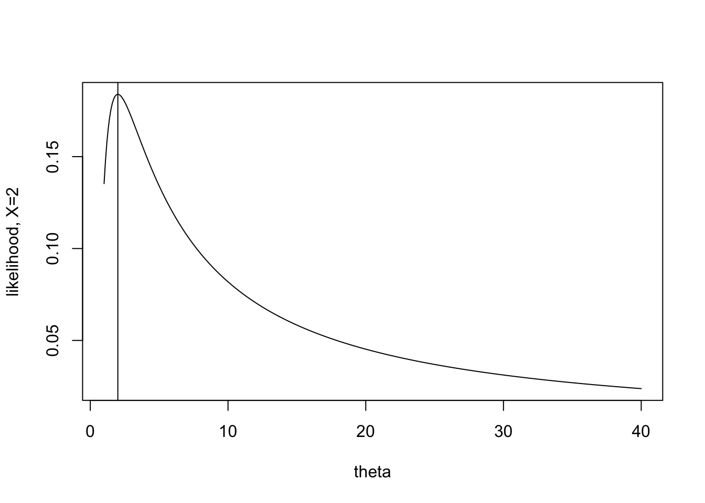
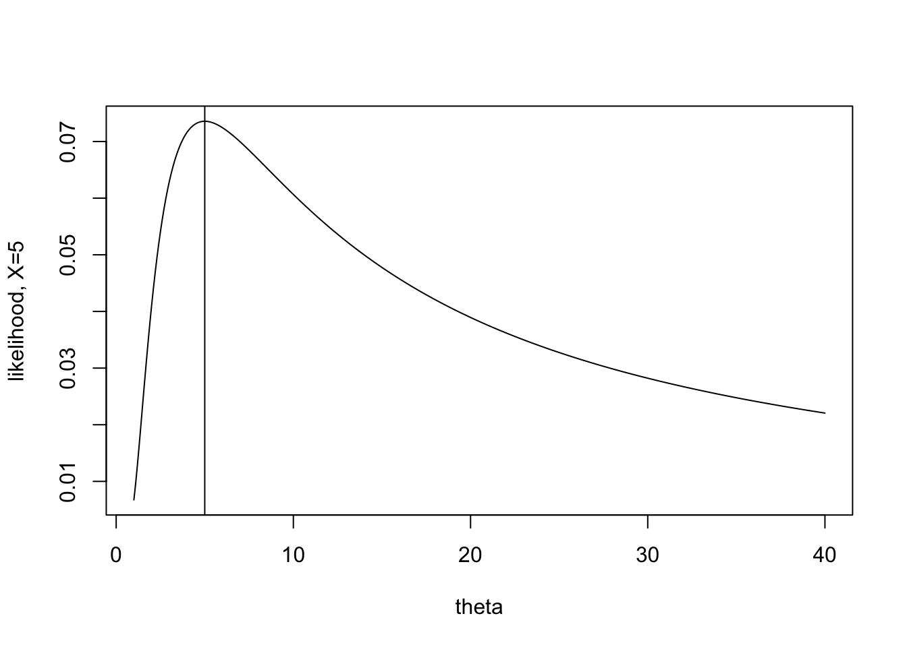
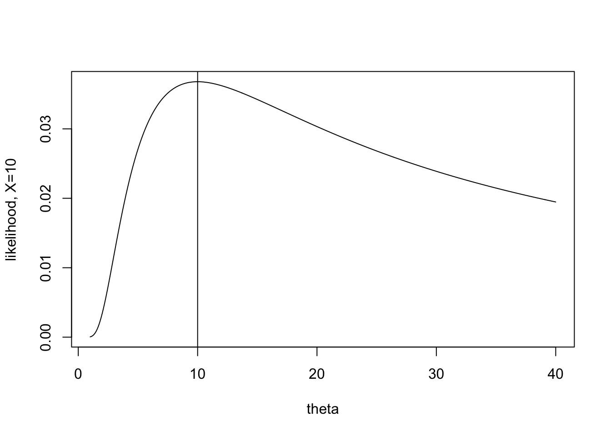
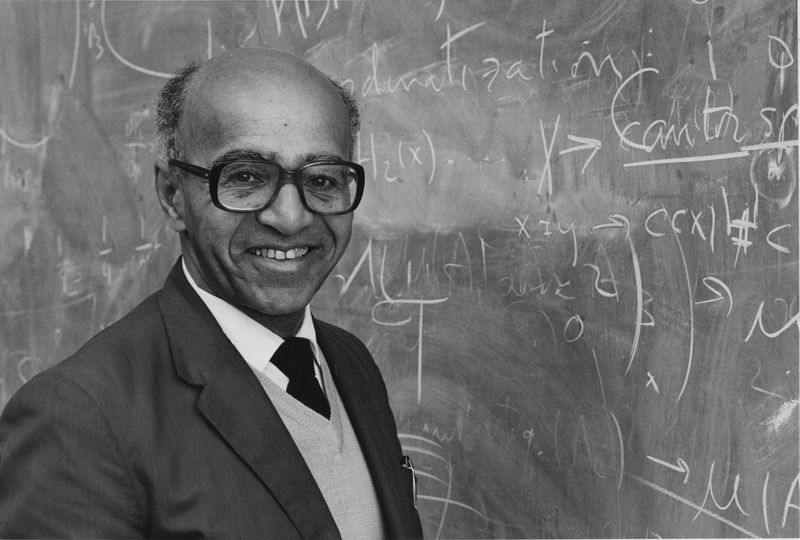

# Fisher Information {#fisher}

Fisher Information is a method for measuring the amount of information a sample of data contains about an unknown parameter.  We are going to use Fisher Information to approximate the variance of estimators obtained from large samples (specifically, it will give us info about the variance of MLEs).  Note, we're back to thinking like Frequentists (the hint is that Information is given about the MLEs).

Note:  Fisher information measures the curvature of the likelihood.  If the likelihood is flat (with respect to the parameter), the estimate of the maximum of the likelihood (MLE) can be quite off.  If the likelihood is steep with respect to the parameter (2nd derivative small, asymptotic variance small), the estimate of the maximum (MLE) will be good.

## Fisher Information in one observation

### Some intuition describing the second derivative of the likelihood {-}

Fisher Information describes the curvature of a likelihood function, that is, the negative of the expected value of the second derivative. Why the second derivative?  Let's look at some examples.

**Important:**  all the plots below / derivatives / intuition is in thinking about the likelihood as a function of $\theta$!!  (Not a function of the data.)

Consider a simplified example with only a single observation from an exponential distribution with mean $\theta$.

$$f(x | \theta) = (1/\theta) e^{-x/\theta}$$

Recall that the maximum likelihood estimator is the value of the parameter the maximizes the likelihood.  That is, in plotting the likelihood, find the value of $\theta$ (on the x-axis) that gives the highest likelihood (on the y-axis).

$$\mbox{MLE} = \frac{\sum_i X_i}{n} \ \ \ \ \mbox{if } n=1, \mbox{MLE} = X$$

The task for today is to consider how certain we are about the estimate.  When $X=2$ the likelihood is extremely peaked, and the maximum value appears somewhat obvious.  When $X=10$ it is still possible to maximize the function, but the process seems somewhat less certain to give the "best" value of $\theta$.

The information itself is given by the expected value of the second derivative.  For each value of X, there is a particular shape to the second derivative (some more peaked, some less peaked).  The expected value will average over the values of the second derivative, giving weights as defined by the pdf (because that's what expected value does).

### Mathematical formulation of the second derivative of the likelihood {-}

Define the following (note, they are all just functions of x):
\begin{eqnarray*}
\lambda(x | \theta) &=& \ln f(x | \theta) \\
\lambda ' (x | \theta) &=& \frac{\partial}{\partial \theta} \ln f(x | \theta) \\
\lambda '' (x | \theta) &=& \frac{\partial^2}{\partial \theta^2} \ln f(x | \theta) \\
 \end{eqnarray*}

**Fisher Information:**
\begin{align}
 I (\theta) = E \{ [ \lambda ' (X | \theta) ] ^2 \} (\#eq:1FI)
\end{align}

Now the math gets a little messy...

\begin{eqnarray*}
I(\theta) &=& \int [ \lambda '(x | \theta) ] ^2 f(x | \theta) dx\\
\mbox{because} && \int f(x| \theta) dx = 1\\
\mbox{then} && \int f'(x | \theta) dx = 0\\
\mbox{and} && \int f''(x | \theta) dx = 0\\
\end{eqnarray*}

We can now construct two alternative forms for Fisher Information:
\begin{align}
 \lambda '(x| \theta) &= \frac{\partial}{\partial \theta} ln (f(x | \theta)) = \frac{f'(x | \theta)}{f(x| \theta)} \nonumber \\
 E[ \lambda '(X | \theta) ] &= \int \frac{f'(x | \theta)}{f(x|\theta)} f(x|\theta) dx \nonumber\\
 &= \int f'(x | \theta) dx = 0 \nonumber \\
 I(\theta) &= E \{ [\lambda'(X | \theta) ]^2 \} = var(\lambda'(X | \theta)) (\#eq:2FI)
\end{align}
 (Because the mean of $\lambda'(x | \theta)$ is zero.)

\begin{align}
 \lambda''(x|\theta) &= \frac{f(x|\theta) f''(x|\theta) - [ f'(x|\theta) ]^2}{ [f(x|\theta)]^2}  \mbox{  (chain rule)} \nonumber\\
 &= \frac{f''(x|\theta)}{f(x|\theta)} - [ \lambda'(x | \theta) ]^2 \nonumber\\
 E[\lambda''(X|\theta)] &= \int f''(x|\theta) dx - E \{ [\lambda'(x|\theta)]^2 \} \nonumber\\
 I(\theta) &= - E [ \lambda''(X | \theta) ] (\#eq:3FI)
\end{align}

The last of the equations \@ref(eq:3FI) is often the easiest to compute.

::: {.example}
 Suppose $X\sim$Poisson($\theta$).  $f(x|\theta) = \frac{e^{-\theta} \theta^x}{x!}$.  Find the Fisher Information in $X$.

 \begin{eqnarray*}
 \lambda(x | \theta) &=& \ln f(x|\theta) = -\theta + x \ln \theta - \ln(x!)\\
 \lambda ' (x | \theta) &=& -1 + x/\theta\\
 \lambda '' (x | \theta) &=& -x / \theta^2\\
 \end{eqnarray*}

\noindent
By \@ref(eq:3FI):
\begin{eqnarray*}
I(\theta) &=& - E [ \lambda '' (X|\theta) ] = - E[ -X / \theta^2]\\
&=& \theta / \theta^2 = 1/\theta
\end{eqnarray*}

\noindent
By \@ref(eq:2FI):
 \begin{eqnarray*}
 I(\theta) &=& var(\lambda '(X|\theta)) = var(-1 + X/\theta)\\
 &=& \frac{1}{\theta^2} var(X) = \theta / \theta^2 = 1/\theta
 \end{eqnarray*}

\noindent
By \@ref(eq:1FI):
\begin{eqnarray*}
I(\theta) &=& E \{ [ \lambda'(X | \theta) ]^2 \}\\
&=& E[ 1 - 2X /\theta + X^2 / \theta^2\\
&=& 1 - \frac{2}{\theta}E[X] + \frac{1}{ \theta^2} E(X^2)\\
&=& 1 - \frac{2}{\theta} \theta + \frac{1}{ \theta^2} (var(X) + E[X]^2)\\
&=& 1 - 2 +\frac{1}{\theta^2}(\theta + \theta^2) = 1/\theta
\end{eqnarray*}

:::

Notice that the information about $\theta$ in $X$ depends on $\theta$.  This isn't always true.

## Fisher Information in a random sample

It seems, as though, we should be asking ourselves how much information there is about a parameter in a joint likelihood (not in a single sample).  We define the Fisher Information on a random sample as:
\begin{eqnarray*}
I_n (\theta) &=& E \{ [ \lambda ' (\underline{X} | \theta) ]^2 \}\\
&=& var [ \lambda ' (\underline{X} | \theta) ] \\
&=& - E [ \lambda '' (\underline{X} | \theta) ] \\
\end{eqnarray*}

To find the log likelihood of a joint distribution (based on a random sample):
\begin{eqnarray*}
f(\underline{x} | \theta) &=& \prod_i f(x_i | \theta) \mbox{ (iid)}\\
\lambda(\underline{x} | \theta) &=& \sum_i \lambda(x_i | \theta) \\
\lambda'(\underline{x} | \theta) &=& \sum_i \lambda'(x_i | \theta) \\
\lambda''(\underline{x} | \theta) &=& \sum_i \lambda''(x_i | \theta) \\
I_n (\theta) &=& - E[\lambda''(\underline{X} | \theta) ]\\
&=& - E[ \sum \lambda''(X_i | \theta) ]\\
&=& \sum -E[\lambda''(X_i | \theta)]\\
&=& n I(\theta) \ \ !!!
\end{eqnarray*}

::: {.example}
Let $X_1, X_2, \ldots, X_n \sim N(\theta,\theta); E[X] = Var[X] = \theta$, independently.  Find the Fisher Information for $\theta$ in the random sample.

<!-- This problem takes a while.  They get pretty stuck with the derivatives.  Maybe a hint?  Or doing some of the work for them????-->

\begin{eqnarray*}
f(x|\theta) &=& \frac{1}{\sqrt{2 \pi \theta}} exp \{ - (x-\theta)^2 / 2\theta \}\\
\lambda(x | \theta) &=& \frac{-1}{2} \ln 2\pi - \frac{1}{2}\ln \theta - \frac{(x-\theta)^2}{2\theta}\\
&=& \frac{-1}{2} \ln 2\pi - \frac{1}{2}\ln \theta - \frac{x^2}{2\theta} + \frac{2x\theta}{2\theta} - \frac{\theta^2}{2\theta}\\
\lambda ' (x | \theta) &=& \frac{-1}{2 \theta} + \frac{x^2}{2 \theta^2} + 0 -\frac{1}{2}\\
\lambda '' (x| \theta) &=& \frac{1}{2 \theta^2} - \frac{2x^2}{2\theta^3}\\
I(\theta) &=& -E[ \lambda''(X|\theta) ] \\
&=& \frac{-1}{2\theta^2} + \frac{E[X^2]}{ \theta^3}\\
&=& \frac{-1}{2\theta^2} + \frac{(\theta + \theta^2)}{\theta^3}\\
&=& \frac{1+2\theta}{2 \theta^2}\\
I_n(\theta) &=& \frac{n(1+2\theta)}{2 \theta^2}
\end{eqnarray*}

Note, by differentiating the log-likelihood (and using the quadratic formula), you can find that the MLE is:
\begin{eqnarray*}
\hat{\theta} = \frac{-1 + \sqrt{1+4 \frac{\sum x_i^2}{n}}}{2}
\end{eqnarray*}
Using the CRLB and the theorems in the book, we can show that the MLE has an approximate normal distribution centered around $\theta$ with variance given above by the Fisher Information.
:::

## Cramér-Rao Lower Bound

**Cramér-Rao Lower Bound**  By using the characteristics of $\lambda, \lambda',$ and $\lambda''$, we can show that for any estimator of $\theta$ (see page 519 in @degroot; note regularity conditions on page 514):
\begin{eqnarray*}
T &=& r(X_1, X_2, \ldots, X_n) = r(\underline{X}) \mbox{ such that}\\
E[T] &=& m(\theta)\\
\mbox{then: } var(T) &\geq& \frac{[m'(\theta)]^2}{nI(\theta)}
\end{eqnarray*}
Note, $m'(\theta) = \partial m(\theta) / \partial(\theta)$.  If $m(\theta) = \theta$, then $m'(\theta) = 1$ and var$(T) \geq 1/nI(\theta)$.

**Proof**  Note: $\lambda'(\underline{x} | \theta) = f'(\underline{x} | \theta) / f(\underline{x} | \theta)$

Also, recall that:   $Cov(X, Y) = E(XY) - E(X)E(Y) = E[(X - E(X))(Y - E(Y))]$

\begin{eqnarray*}
\mbox{we showed    } \ \ \ \ 0 = E[\lambda'(\underline{X} | \theta)] &=& \int_S \cdots \int_S f'(\underline{x} | \theta) dx_1 \ldots dx_n.\\
\mbox{therefore    } \ \ \ \ \mbox{Cov}[T, \lambda'(\underline{X} | \theta) &=& E[T \lambda'(\underline{X} | \theta)]\\
&=& \int_S \cdots \int_S r(\underline{x}) \lambda'(\underline{x} | \theta) f(\underline{x} | \theta) dx_1 \ldots dx_n.\\
&=& \int_S \cdots \int_S r(\underline{x}) f'(\underline{x} | \theta) dx_1 \ldots dx_n.\\
\mbox{we also know    } \ \ \ \ m(\theta) &=& \int_S \cdots \int_S r(\underline{x}) f(\underline{x} | \theta) dx_1 \ldots dx_n.\\
\mbox{derivative wrt $\theta$    } \ \ \ \  m'(\theta) &=& \int_S \cdots \int_S r(\underline{x}) f'(\underline{x} | \theta) dx_1 \ldots dx_n.\\
\mbox{Therefore    } \ \ \ \  \mbox{Cov}[T, \lambda'(\underline{X} | \theta) ]&=& m'(\theta)\\
\mbox{Cauchy-Schwarz     } \ \ \ \  [\mbox{Cov}[T, \lambda'(\underline{X} | \theta) ]^2 &\leq& Var(T) Var(\lambda'(\underline{X} | \theta)]\\
Var(T) &\geq& \frac{(m'(\theta))^2}{nI(\theta)}
\end{eqnarray*}

The equality holds iff: $aT + b\lambda'(\underline{X} | \theta) = c$.  That is, if T is a linear combination of $\lambda'$, where the only $X$ is in the $\lambda'$.  [The iff is a part of the proof of the Cauchy-Schwarz inequality.]  Because of the equality term in the C-S, we know that the minimum variance estimator with expected value $m(\theta)$ is $$ T = u(\theta) \lambda'(\underline{X}|\theta) + v(\theta).$$

::: {.example}
Back to the example, $N(\theta,\theta)$.  We found that the MLE is: $r(\underline{x}) = \frac{-1 + \sqrt{1+4 \frac{\sum x_i^2}{n}}}{2}$.    And $I(\theta) = \frac{(1+2\theta)}{2 \theta^2}$.

We need to find $m(\theta)$, but meanwhile, we know from the proof above that
$$ Var(r(\underline{X})) \geq \frac{(m'(\theta))^2 2 \theta^2}{n (1+2\theta)}$$
:::

## Efficiency

If var($T) = \frac{[m'(\theta)]^2}{nI(\theta)}$, we say that $T$ is efficient for $m(\theta)$.  If $T$ is both efficient and unbiased, we say it is the Uniformly Minimum Variance Unbiased Estimator (UMVUE).

::: {.example}
Let $X_1, X_2, \ldots, X_n \sim Poisson(\theta)$.  Let $T=\overline{X}$ estimate $\theta$.
\begin{eqnarray*}
m(\theta) &=& E[T] = \theta\\
var(T) &\geq& \frac{1}{nI(\theta)} = \frac{1}{n/\theta} = \frac{\theta}{n}\\
\end{eqnarray*}

But we know that var($\overline{X}) = \frac{1}{n}$ var($X_i) = \frac{\theta}{n}$!.  $T$ is an efficient estimator of $\theta$.  $T$ is the uniformly minimum variance unbiased estimator of $\theta$.  Note, $T$ is also unbiased, does $T$ have to be unbiased to be efficient? Our result above says that $T=\overline{X}$ has the smallest variance of **any** unbiased estimator of $\theta$.  Why?
:::

### Asymptotic distribution of the MLE
Let $\hat{\theta}$ be the MLE for $\theta$ in a random sample of size n.  [Not true for every case, but if $T = u(\theta) \lambda'(\underline{X} | \theta) + v(\theta)$, we can use the CLT because $\lambda'(\underline{x}|\theta) = \sum_{i=1}^n \lambda'(x_i | \theta)$.]  The asymptotic distribution of:
\begin{eqnarray*}
[nI(\theta) ]^{1/2} (\hat{\theta} - \theta) &\mbox{is}& N(0,1)\\
\mbox{we say } [nI(\theta) ]^{1/2} (\hat{\theta} - \theta) &\stackrel{D}{\rightarrow}& N(0,1)
\end{eqnarray*}

::: {.example}
In the Poisson example, we know $\overline{X}$ is the MLE for $\theta$.  Which gives:
\begin{eqnarray*}
(n\frac{1}{\theta})^{1/2} [ \overline{X} - \theta ] &\stackrel{D}{\rightarrow}& N(0,1)\\
\frac{\overline{X} - \theta}{\sqrt{\theta/n}} &\stackrel{D}{\rightarrow}& N(0,1)
\end{eqnarray*}

\noindent
Well, we knew that through the CLT as well...
:::

## Fisher Information and Bayesian Estimators

In the Bayesian setting, it can be shown that $\theta | \underline{X}$ is asymptotically normal with mean $\hat{\theta}$ = MLE and variance $\frac{1}{nI(\hat{\theta})}$.  Note that there is no $\theta$ in the mean or variance because $\theta$ is now our random quantity, and $\hat{\theta}$ is our fixed part.  In large samples, we swamp the prior information:
\begin{eqnarray*}
[nI(\hat{\theta})]^{1/2} (\theta - \hat{\theta}) | \underline{X} \stackrel{D}{\rightarrow} N(0,1)
\end{eqnarray*}

Again, notice that neither $\hat{\theta}$ nor $I(\hat{\theta})$ have any $\theta$ values in them.

::: {.example}
Back to the example, $N(\theta,\theta)$.  We found that the MLE is: $\hat{\theta} = \frac{-1 + \sqrt{1+4 \frac{\sum x_i^2}{n}}}{2}$.    And $I(\theta) = \frac{(1+2\theta)}{2 \theta^2}$.

$$\Bigg[\frac{n(1+2\hat{\theta})}{2 \hat{\theta}^2}\Bigg]^{1/2} (\theta - \hat{\theta}) | \underline{X} \stackrel{D}{\rightarrow} N(0,1)$$
:::

<!--
### Jefferys' Prior

(We won't cover Jefferys' Prior, but it's pretty cool, and it's fun to think about how Bayesian and Frequentist methods come together.)

Jefferys' prior gives an additional uninformative prior when approaching a problem as a Bayesian.  Consider the information gotten from the mean ($\mu$) and variance ($\sigma^2$) in a $N(\mu, \sigma^2)$ problem.

\begin{eqnarray*}
f(\underline{x} | \mu, \sigma^2) &=& \bigg( \frac{1}{\sqrt{2 \pi \sigma^2}} \bigg)^2 e^{\frac{-\sum(x_i - \mu)^2}{2\sigma^2}} \\
I(\mu) &=& \frac{n}{\sigma^2}\\
I(\sigma^2) &=& \frac{n}{2 \sigma^4}
\end{eqnarray*}

Notice that the information in $\mu$ does not depend on $\mu$, but the information in $\sigma^2$ does depend on $\sigma^2$.  In many cases, it is desirable for the prior to be constant with respect to the parameter of interest.  That is, we can specify a flat (i.e., non-informative) prior on $\mu$ by using the Information (because the information does not depend on $\mu$).  Indeed, we use $$\xi_J(\mu) \propto \sqrt{I(\mu)} \propto k$$ to be Jefferys' prior.

However, as above, the information in $\sigma^2$ is not constant with respect to $\sigma^2$.  That means for different values of $\sigma^2$, the information in the likelihood varies.  Recall, information has to do with the second derivative of the likelihood and how peaked it is for estimating the parameter of interest.  We can find a transformation on $\sigma^2$ ($=g(\sigma^2)$ )such that the information contained in the likelihood about $g(\sigma^2)$ IS constant with respect to $g(\sigma^2)$.  In fact, $$I(\ln(\sigma^2)) \propto k$$ where k is a constant that does not depend on $\sigma^2$.

Which is to say, given the likelihood, we believe that there should be a flat prior on $\ln(\sigma^2)$!  It turns out that if we put a flat prior on $\ln(\sigma^2)$, we need a prior on $\sigma^2$ to be $$\xi_J(\sigma^2) \propto \sqrt{I(\sigma^2)} \propto \frac{1}{\sigma^2}.$$

The Jefferys prior is an uninformative prior that uses only the likelihood.
\begin{eqnarray*}
X &\sim& f(x| \theta)\\
\xi_J(\theta) &\propto& I(\theta)^{1/2}
\end{eqnarray*}

Let $\phi = g(\theta)$, so that $\theta = g^{-1} (\phi)$.

\begin{eqnarray*}
\xi_J(\phi) &=& \xi_J(\theta) \cdot \bigg| \frac{\partial \theta}{\partial \phi} \bigg|\\
&=& \sqrt{I(\theta) \bigg(\frac{\partial \theta}{\partial \phi} \bigg)^2}\\
&=& \sqrt{E \bigg[ \bigg(\frac{\partial \lambda(X | \theta)}{\partial \theta} \bigg)^2 \bigg] \bigg(\frac{\partial \theta}{\partial \phi} \bigg)^2}\\
&=& \sqrt{E \bigg(\frac{\partial \lambda(X | \theta)}{\partial \theta} \frac{\partial \theta}{\partial \phi} \bigg)^2}\\
&=& \sqrt{E \bigg(\frac{\partial \lambda(X | \theta)}{\partial \phi}  \bigg)^2}\\
&=& \sqrt{E \bigg(\frac{\partial \lambda(X | \phi)}{\partial \phi}  \bigg)^2}\\
&=& \sqrt{I(\phi)}
\end{eqnarray*}

Jefferys prior is invariant to a change in variable.

%\fi

%\iffalse
Historically, flat uninformative priors don't stay uninformative under transformations.  Consider the following example:

\begin{eqnarray*}
X \sim Bin(n, \theta) \ \ \ \ \ \ \xi(\theta) &=& 1  \ \ \ \ \ \  \rho = \ln(\frac{\theta}{1-\theta})\\
F_\Theta(\theta) &=& P(\Theta \leq \theta) = \theta\\
F_\rho(\rho) &=& P(\rho \leq \rho) = P(\ln (\frac{\Theta}{1-\Theta}) \leq \rho)\\
&=&  P(\frac{\Theta}{1-\Theta} \leq e^\rho)= P(\Theta \leq \frac{e^\rho}{1+e^\rho})\\
&=& \frac{e^\rho}{1+e^\rho}\\
\xi(\rho) &=& \frac{e^\rho}{1+e^\rho} \frac{\partial}{\partial \rho} \frac{e^\rho}{1+e^\rho}\\
&=& \frac{e^{2\rho}}{(1+e^\rho)^3} \ \ \ \ \ \ -\infty < \rho < \infty
\end{eqnarray*}
The prior is uniform in one parametrization and very informative in another parametrization.  The problem gets worse in higher dimension (e.g., multivariate Gaussian estimation of the $p$-variate mean vector $\underline{\mu}$).\\
-->

### David Blackwell: The Rao-Blackwell Theorem

While not beyond the scope of this class, we will not cover the <a href = "https://en.wikipedia.org/wiki/Rao-Blackwell_theorem" target = "_blank">Rao-Blackwell theorem</a> due to time constraints.  Broadly, a *sufficient* statistic is one that is made up of the same function of the data as the summary function of the data given in the likelihood (think: sum of $X_i$ or sum of $X_i^2$ in the Gaussian likelihood).  The Rao-Blackwell theorem says that conditioning on the sufficient statistic creates an estimator with minimum mean squared error.  The result is not only quite important (we all want estimators with small mean squared error!), but it is also mathematically beautiful.  The proof of the theorem is given in your book in Section 7.9, Theorem 7.9.1.

I provide information on the Rao-Blackwell Theorem in the class notes to highlight one of the giants in statistics: <a href = "https://en.wikipedia.org/wiki/David_Blackwell" target = "_blank">David Blackwell</a> (1919-2010).  Blackwell was the first Black person to receive a PhD in statistics in the US and the first Black scholar to be admitted to the National Academy of Sciences.  He was a statistician at UC Berkeley for more than 50 years.  He was hired in 1954 after the department almost made him an offer in 1942 (but declined to do so when one faculty member's wife said she didn't want Blackwell hired because she wouldn't feel comfortable having faculty events in her home with a Black man).  Hear Blackwell <a href = "https://www.youtube.com/watch?v=Mqpf9tw44Xw" target = "_blank">tell the story in his own words</a>.  Also, read more about Blackwell and other <a href = "https://www.mathad.com/profile?bidg2518292537111213526biii=" target = "_blank">Mathematicians of the African Diaspora.</a>

(\#fig:unnamed-chunk-2)David Blackwell. Image credit: https://math.illinois.edu/david-blackwell

### C.R. Rao:  Cramér-Rao Lower Bound

The Cramér-Rao Lower Bound (seen previously in these notes) and the Rao-Blackwell Theorem were both results with contributions from C.R. Rao who is an Indian-American statistician, originally from Karnataka, India.  Rao just celebrated his $102^{nd}$ birthday (b. Sep 10, 1920), and he is well known to be among the greatest statisticians of all time.  Indeed, he was very much a student of Fisher, working with likelihoods and focusing on inferential claims.   Rao was known to be genial and kind.  In a recent article (by Brad Efron, the creator of the boostrap) celebrating his centennial birthday [@rao] Rao is reported to have written his statistical results in order... 

>... to communicate to others with great clarity.

>I do not remember when I first met Rao in person, but I think it was when I was visiting a colleague at the Penn State Department of Statistics. Rao was clearly the "heart" of that department, surrounded by many talented individuals, but his presence created its vitality and helped to ensure its stature among US departments of statistics.

>Despite his dominant reputation, Rao always seemed to be extremely modest and, moreover, helpful to younger colleagues. 

(\#fig:unnamed-chunk-3)C.R. Rao. Image credit: https://pib.gov.in/PressReleseDetail.aspx?PRID=1653064

## <i class="fas fa-lightbulb" target="_blank"></i> Reflection Questions

1. Does an estimator need to be unbiased in order to be efficient? 
2. If the estimator is unbiased, what variance would that estimator have in order to have the smallest variance of the class of all unbiased estimators?
3. How can the asymptotic distribution of the MLE be written down in terms of the CRLB?
4. How can the asymptotic distribution of the Bayes estimator be written down in terms of the CRLB?
5. What are the main differences between the MLE and the Bayes estimator?
6. Why would one use the MLE result as compared to the Bayes result?

## <i class="fas fa-balance-scale"></i> Ethics Considerations

1. Why does it matter **who** does mathematics and statistics?
2. Is there only one definition of "best" (in terms of an estimator)?
3. What version of "best" estimator does the CRLB provide?

## R code: 
