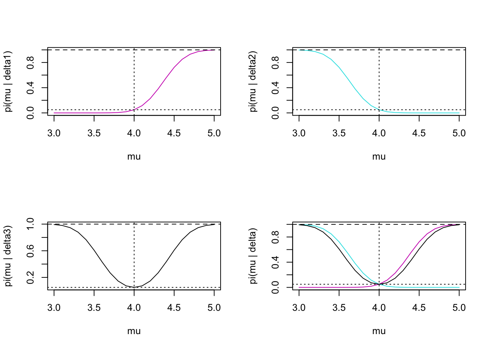

# Hypothesis Testing {#ht}

## Statistical Hypotheses

Instead of giving bounds on parameter values (interval estimates), we are going to test specific claims about a parameter (e.g., $\theta$).  We know $\theta \in \Omega$.  Let $\Omega$ have a disjoint partition:
\begin{eqnarray*}
\Omega_0 \cup \Omega_1 &=& \Omega\\
\Omega_0 \cap \Omega_1 &=& \emptyset\\
\end{eqnarray*}

\begin{eqnarray*}
\mbox{Claim 1:  } H_0: \theta \in \Omega_0\\
\mbox{Claim 2:  } H_1: \theta \in \Omega_1\\
\end{eqnarray*}

We want to decide which one is true, $H_0$ (the null) or $H_1$ (the alternative)?

* If $\Omega_0$ or $\Omega_1$ is a single value, then we say it is a **simple hypothesis**
* If $\Omega_0$ or $\Omega_1$ contain more than a single value, then we say it is a **composite hypothesis**

::: {.example}
We want to test whether a coin is fair.  We'll flip the coin 20 times to collect data.  We have the following two-sided test:
\begin{eqnarray*}
H_0:&& \theta=0.5 \mbox{  (simple)}\\
H_1:&& \theta\ne0.5 \mbox{  (composite)}\\
\end{eqnarray*}

Often we'll write $\theta_0$ as a placeholder for the null value:
\begin{eqnarray*}
H_0:&& \theta=\theta_0 \mbox{  (simple)}\\
H_1:&& \theta\ne \theta_0 \mbox{  (composite)}\\
\end{eqnarray*}

If we are betting, and the dealer always bets on heads, we probably want a one-sided test.
\begin{eqnarray*}
H_0: \theta=0.5 \mbox{  (simple)}&  \mbox{ or } & H_0: \theta \leq 0.5 \mbox{  (composite)}\\
H_1: \theta > 0.5 \mbox{  (composite)}&   &H_1: \theta > 0.5 \mbox{  (composite)}\\
\end{eqnarray*}
:::

We always put our research question in the **alternative** hypothesis.  Ask yourself: why are they/we collecting the data?

### What is an Alternative Hypothesis? {-}

Consider the brief video from the movie Slacker, an early movie by Richard Linklater (director of Boyhood, School of Rock, Before Sunrise, etc.). You can view the video here from starting at 2:22 and ending at 4:30:  https://www.youtube.com/watch?v=b-U_I1DCGEY.

In the video, a rider in the back of a taxi (played by Linklater himself) muses about alternate realities that could have happened as he arrived in Austin on the bus. What if instead of taking a taxi, he had found a ride with a woman at the bus station? He could have take a different road into a different alternate reality, and in that reality his current reality would be an alternate reality. And so on.

What is the point?  Why did we see the video?  How does it relate the to the material from class?  What is the relationship to sampling distributions?

### Critical Regions and Test Statistics

Let X count the number of heads, what would you think if your data gave X=20 (n=20) and your hypotheses were:
\begin{eqnarray*}
H_0:&& \theta=0.5 \\
H_1:&& \theta\ne0.5
\end{eqnarray*}

The data help you decide which hypothesis to believe.  What if X=11?  X=7?  We set up a critical region so that if X is in the region, we reject $H_0$.  Here, $\exists \ \ c \ \ s.t. \ \ | x - 10| > c \ \Rightarrow$ \ \ reject\ \  $H_0$.

A **test statistic**, $T=r(\underline{X})$ is a function of the data that will (hopefully) provide you with enough knowledge to make a decision about your hypothesis.  Here, $T=X$.  Often $T=\overline{X}$ or $T= \overline{X} - \mu_0$ or $T=(\overline{X} - \mu_0) / s/\sqrt{n}$.  Usually, the **critical region** will be of some form like:

> "if $T \geq c$" $\Rightarrow$ reject $H_0$

### Errors:  Power & Size

We can make two types of mistakes (jury example):

|                     |  $H_0$ true  |   $H_1$ true  |
|---------------------|:------------:|:-------------:|
| Reject $H_0$        | type I error |    $\surd$    |
| Do not Reject $H_0$ |    $\surd$   | type II error |

#### Power 
We rate our test by considering the "power" of the test.  Let $\delta$ be a test procedure that defines a critical region $c$ such that we reject $H_0$ if $T \in C$.  For example:
\begin{eqnarray*}
\delta &=& \{ \mbox{ always reject } H_0 \}\\
\delta &=& \{ \mbox{ reject } H_0 \mbox{ if } X > 60 \}\\
\end{eqnarray*}

The **power function** is:
\begin{eqnarray*}
\pi (\theta | \delta) = P(T \in C | \theta)
\end{eqnarray*}

* If $\theta \in \Omega_0$, $\pi(\theta | \delta)$ is the probability of making a type I error.
* If $\theta \in \Omega_1$, $1 - \pi(\theta | \delta)$ is the probability of making a type II error.

Note: $\theta \in \Omega_0$ OR $\theta \in \Omega_1$, but not both!  So, only one type of error is ever possible, but we never know which it is.  If we have our choice between test procedures, we want one for which:
\begin{eqnarray*}
\theta \in \Omega_0, \pi(\theta | \delta) \mbox{ is small}\\
\theta \in \Omega_1, \pi(\theta | \delta) \mbox{ is big}\\
\end{eqnarray*}

::: {.example}
Let $\delta =$"always reject $H_0$", $\delta = \{ T \in I\!\!R \}$.
\begin{eqnarray*}
\mbox{if } \theta \in \Omega_0, \pi(\theta | \delta) = 1, \mbox{ bad!!}, P(\mbox{type I error}) = 1\\
\mbox{if } \theta \in \Omega_1, \pi(\theta | \delta) = 1, \mbox{ good!!}, P(\mbox{type II error}) = 0
\end{eqnarray*}
We need a balance.
:::

Typically, we bound $\pi(\theta | \delta) \ \ \forall \ \ \theta \in \Omega_0$.  That is, $\pi(\theta | \delta) \leq \alpha_0 \ \ \forall \ \ \theta \in \Omega_0$.  Note, $\alpha_0$ is called the **level of significance**.

Among all tests that satisfy the bound for $\theta \in \Omega_0$, we want the power function when $\theta \in \Omega_1$ to be as big as possible (probability of type II error to be as low as possible).

#### Size {-}

The **size** of the test is:
\begin{eqnarray*}
\alpha(\delta) = \sup_{\theta \in \Omega_0} \pi (\theta | \delta)
\end{eqnarray*}
if $\Omega_0 = \theta_0$ (simple hypothesis), $\alpha(\delta) = \pi(\theta_0 | \delta)$.

Note:  you may be wondering about the $\sup$ function.  Note that often the $\sup$ over a set is the same as the $\max$ over a set!  So what is the difference?  The $\max$ is the largest value that the function can take on over all the possible values **within** a set (that is, the argument of the function *must* be contained in the range over which we are evaluating the function).  The $\sup$ is the largest value that the function can take on over all the possible values that **bound** the range of possible values.  The $\sup$ may or may not happen at a value in the range.  If the $\max$ exists, then the $\sup = \max$.  The hypothesis testing structure is set up to be very general and to accommodate all different types of hypotheses, thus the $\sup$ is the right choice (over the $\max$) in defining $\alpha(\delta).$

::: {.example}
Back to the cheating example, n=100,
\begin{eqnarray*}
H_0: \theta \leq 0.5 \\
H_1: \theta > 0.5
\end{eqnarray*}

Let $\delta = \{$ reject $H_0$ if $X>55 \}.$
\begin{eqnarray*}
\pi(\theta | \delta) &=& P(X > 55 | \theta = 0.5)\\
&=& P( Z > 1) \\
&=& 0.1587
\end{eqnarray*}
What if $\theta < 0.5$?  $\rightarrow \pi(\theta | \delta) < 0.1587$ !  The **size** of the test is $\alpha(\delta) = 0.1587.$  Can we make the test better??  The previous statement says that if $\theta=0.5,$ we'll reject $H_0$ 15.87% of the time.  (That is a pretty big type I error).  We want $\alpha(\delta) \leq 0.05 (= \alpha_0).$

\begin{eqnarray*}
\delta &=& \{ \mbox{ reject } H_0 \mbox{ if } T \geq c \}\\
\alpha(\delta) &=& \sup_{\theta \in \Omega_0} P (T \geq c | \theta) \\
&=& \sup_{\theta \in \Omega_0} \pi (\theta | \delta)\\
\pi (\theta | \delta) &=& 1 - \Phi\Bigg( \frac{ c - 100 \theta}{\sqrt{100\theta(1-\theta)}} \Bigg)\\
\end{eqnarray*}

Note: $\pi (\theta | \delta)$ is an increasing function in $\theta$.  Also, $\pi (\theta | \delta)$ is a decreasing function in c ($\Phi$ is an increasing function in c).

Keeping in mind that we want to find a c s.t. $\sup_{\theta \in \Omega_0} \pi(\theta | \delta) \leq 0.05$, we want to maximize $\pi (\theta | \delta) \ \ \forall \ \ \theta \in \Omega$ (make c as small as possible).

We already know that: $\sup_{\theta \in \Omega_0} \pi(\theta | \delta) = \pi(\theta_0 = 0.5 | \delta)$. So,
\begin{eqnarray*}
\pi (\theta_0 = 0.5 | \delta) &\leq& 0.05\\
c &\geq& 58.25 \mbox{ (see WU)}\\
\mbox{notice: } c &=& \Phi^{-1} (1 - \alpha_0) \sigma_0 + \mu_0\\
\mbox{reject if: } T &\geq& c\\
\\
\mbox{or, equivalently, if: } \frac{x - \mu_0}{\sigma_0} &\geq& \Phi^{-1} (1-\alpha_0)\\
\mbox{let: } T &=& \frac{X - n \theta_0}{\sqrt{\theta_0 (1-\theta_0) / n}} \ \ \ \mbox{ be our test statistic}\\
\mbox{now, reject if: } T &\geq& \Phi^{-1} (1-\alpha_0)\\
\end{eqnarray*}

Because the data are discrete, we cannot actually set our type I error rate to be 0.05.  So, we end up with
\begin{eqnarray*}
\alpha_0 &=& 0.05\\
\alpha(\delta) &=& P(X \geq 59 | \theta = 0.5)\\
&=& 0.04431
\end{eqnarray*}
:::

Notice that we can only report P(type II error) for a simple alternative (more in section 9.2 of @degroot).  In addition to reporting our decision, we would like to report a measure of certainty in our decision.  How **strong** is the evidence for the unfair coin?

**p-value** is the probability of seeing your data or more extreme if the null hypothesis is true.

Let $\hat{T}$ be the observed test statistic

Let $T$ be the test statistic random variable

\begin{eqnarray*}
\mbox{p-value } &=& \sup_{\theta \in \Omega_0} P(T > \hat{T})\\
&=& \sup_{\theta \in \Omega_0} \pi (\theta | \delta_{\hat{T}}) \mbox{ the size of the test } \delta_{\hat{T}}\\
&=& \alpha(\delta_{\hat{T}})\\
\end{eqnarray*}

That is, the smallest level of significance that would reject $H_0$ with the observed data.

::: {.example}
cheating dealer example continued...

* Let x=52
\begin{eqnarray*}
\mbox{p-value } &=& P(T > \frac{52-50}{5})\\
&=& P( Z > 0.4)\\
&=& 0.3446
\end{eqnarray*}

* Let x=62
\begin{eqnarray*}
\mbox{p-value } &=& P(T > \frac{62-50}{5})\\
&=& P( Z > 2.4)\\
&=& 0.0082
\end{eqnarray*}

Notice:
\begin{eqnarray*}
0.0082 < 0.05 <  0.3446\\
52 < 58.25 < 62\\
\end{eqnarray*}
(equivalence of tests and rejection regions)
:::

::: {.example}
Assume weights of cereal in 10oz boxes are normally distributed, $N(\mu, \sigma^2),$ both unknown.  To test whether or not the box label is accurate, we set up our hypotheses:
\begin{eqnarray*}
H_0: \mu = 10\mbox{oz}\\
H_1: \mu \ne 10\mbox{oz}\\
\end{eqnarray*}

What does the form of our critical region look like?  (Reject if less than a certain amount below 10oz, or bigger than a certain amount above 10oz, draw a number line with shaded rejection region.)  We will reject $H_0$ if $\overline{X}$ is too big or too small.

If $|\overline{X} - 10 |$ is too big, then $\frac{|\overline{X} - 10 |}{s/\sqrt{n}}$ will also be too big.
\begin{eqnarray*}
C &=& \Bigg\{ \frac{|\overline{X} - 10 |}{s/\sqrt{n}} > c \Bigg\}\\
\delta: && \Bigg\{ \mbox{reject $H_0$ if } T \in C \mbox{ where } T = \frac{|\overline{X} - 10|}{s/\sqrt{n}} \Bigg\}
\end{eqnarray*}

\begin{eqnarray*}
\alpha(\delta) &=& \sup_{\mu \in \Omega_0} \pi(\mu | \delta)\\
&=& P\Bigg(\frac{|\overline{X} - 10|}{s/\sqrt{n}} > c \ \  \bigg| \ \ \mu=10 \Bigg)\\
&=& P \bigg( -c < \frac{\overline{X} - 10}{s/\sqrt{n}} < c \ \  \bigg| \ \  \mu=10 \bigg) \\
&=& P( -c < t_{15} < c) = 0.95\\
c &=& 2.131\\
\end{eqnarray*}
Note: we also reject $H_0$ if $\overline{X} \notin 10 \pm 0.453$.  (More later on computing the power $\pi(\mu | \delta), \ \mu \in \Omega_1.)$

What is the p-value given our data?
\begin{eqnarray*}
\mbox{p-value} &=& P (T > \widehat{T})\\
&=& P \Bigg( \frac{|\overline{X} - 10|}{s/\sqrt{16}} > \frac{|10.4 - 10|}{0.85/\sqrt{16}} \Bigg)\\
&=& 2 P (t_{15} > 1.88)\\
&=& 2 (1 - \texttt{pt(1.88, 15)})\\
&=& 2 (1 - 0.96) \\
&=& 0.0797
\end{eqnarray*}
<!--%1.753 \leq &1.88& \leq 2.131\\
%2 \cdot 0.025 \leq &\mbox{p-value}& \leq 2 \cdot 0.05\\
%0.05 \leq &\mbox{p-value}& \leq 0.10\\-->
There is moderate evidence (not strong) to say that cereal boxes weigh, on average, something other than 10oz.
:::

## Simple Hypotheses

Consider:
\begin{eqnarray*}
H_0: \theta = \theta_0\\
H_1: \theta = \theta_1\\
\end{eqnarray*}

Let
\begin{eqnarray*}
f_i(\underline{x}) = f(x_1 | \theta_i) f(x_2 | \theta_i) \cdots f(x_n | \theta_i)
\end{eqnarray*}
(the joint pdf if $\theta=\theta_i, H_i$, is true.)

Our errors now become:
\begin{eqnarray*}
&&\alpha(\delta) = P(\mbox{reject } H_0 | \theta=\theta_0) = \pi(\theta_0 | \delta) = \mbox{size}\\
&&\beta(\delta) = P(\mbox{do not reject } H_0 | \theta=\theta_1) = 1 - \pi(\theta_1 | \delta) = 1 - \mbox{power}\\
\end{eqnarray*}

We cannot find a test for which $\alpha(\delta)$ and $\beta(\delta)$ are both arbitrarily small.  Instead, we can minimize a linear combination of the two types of errors.  That is, we want to find $\delta$ such that $a \alpha(\delta) + b \beta(\delta)$ is minimized.  (Is $\alpha$ worse?  $\beta?)$

::: {.theorem}
(Theorem 9.2.1, @degroot)
Let  $a > 0$ and $b > 0$.  Consider $\delta^*$, a test such that we will:
\begin{eqnarray*}
\mbox{reject } H_0 \mbox{ if } a f_0(\underline{x}) < b f_1(\underline{x})\\
\mbox{not reject } H_0 \mbox{ if } a f_0(\underline{x}) > b f_1(\underline{x})\\
\mbox{either decision if }  a f_0(\underline{x}) = b f_1(\underline{x})\\
\end{eqnarray*}
Then, $\forall \delta$
\begin{eqnarray*}
a \alpha(\delta^*) + b \beta(\delta^*) \leq a \alpha(\delta) + b \beta(\delta)
\end{eqnarray*}

**Proof:**
Let $C$ be the critical region, $C^c$ is the complement of the critical region.  (Note, this proof is for the discrete case, the continuous case is analogous.)

\begin{eqnarray*}
a \alpha(\delta) + b \beta(\delta) &=& a \sum_{\underline{x} \in C} f_0(\underline{x}) + b \sum_{\underline{x} \in C^c} f_1(\underline{x})\\
&=& a \sum_{\underline{x} \in C} f_0(\underline{x}) + b [1 - \sum_{\underline{x} \in C} f_1(\underline{x})]\\
&=& b + \sum_{\underline{x} \in C} [ af_0(\underline{x}) - b f_1(\underline{x})]\\
\end{eqnarray*}
We want the parenthetical part to be negative $\forall \underline{x} \in C$ and positive $\forall \underline{x} \in C^c$. That is, choose $C$ such that:

\begin{eqnarray*}
a f_0(\underline{x}) - bf_1(\underline{x}) &<& 0 \ \ \ \forall \underline{x} \in C\\
a f_0(\underline{x}) - bf_1(\underline{x}) &>& 0 \ \ \ \forall \underline{x} \in C^c\\
\mbox{if } a f_0(\underline{x}) - bf_1(\underline{x}) = 0 && \mbox{it doesn't matter if } \underline{x} \in C \mbox{ or } \in C^c\\
\end{eqnarray*}

\begin{eqnarray*}
\Rightarrow \delta^*: \{ \mbox{reject } H_0 \mbox{ if } a f_0(\underline{x}) < b f_1(\underline{x}) \} \\
\mbox{note: } \delta^*: \bigg\{ \mbox{reject } H_0 \mbox{ if } \frac{f_1(\underline{x})}{f_0(\underline{x})} > \frac{a}{b} \bigg\}
\end{eqnarray*}
(the likelihood ratio).  That is, $\delta^*$ minimizes the linear combination of errors $a \alpha(\delta) + b \beta(\delta)$ over all tests, $\delta$.
:::

But what if, like before, we want to minimize the probability of a type II error (subject to $\alpha(\delta) \leq \alpha_0$)?

::: {.theorem}
(Theorem 9.2.2, @degroot, Neyman-Pearson Lemma)

Let $k > 0$.  Suppose
\begin{eqnarray*}
\delta^*: && \{ \mbox{ reject } H_0 \mbox{ if } k f_0(\underline{x}) < f_1(\underline{x})\\
&& \mbox{ do not reject } H_0 \mbox{ if } k f_0(\underline{x}) > f_1(\underline{x}) \} \\
\end{eqnarray*}

Let $\delta$ be another test procedure such that:
\begin{eqnarray*}
&&\alpha(\delta) \leq \alpha(\delta^*) \rightarrow \mbox{Then: } \beta(\delta^*) \leq \beta(\delta) \mbox{ (i.e., the power is greater for } \delta^*)\\
&&\alpha(\delta) < \alpha(\delta^*) \rightarrow \mbox{Then: }  \beta(\delta^*) < \beta(\delta) \mbox{ (i.e., the power is strictly greater for } \delta^*)\\
\end{eqnarray*}
(find k such that $\alpha(\delta^*) \leq \alpha_0.)$

**Proof:**

\begin{eqnarray*}
k \alpha(\delta^*) +  \beta(\delta^*) \leq k \alpha(\delta) +  \beta(\delta)\\
\mbox{ if } \alpha(\delta^*) \geq \alpha(\delta)\\
\mbox{ then } \beta(\delta^*) \leq \beta(\delta)
\end{eqnarray*}
:::

::: {.example}
Consider a situation where we're trying to figure out if someone is purely guessing on a multiple choice questions with 5 possible answers.  Although we wouldn't typically think about this type of situation with a simple-vs-simple set of hypotheses, we'll compare a random guessing hypothesis $(\theta = 0.2)$ to a hypothesis where we are able to rule out one of the options $(\theta = 0.25)$.  We will collect 25 observations, and we'll use the binomial distribution to describe the probability model.

$H_0: \theta = 0.2$  
$H_1: \theta = 0.25$

To calculate the likelihoods, we'll use a binomial distribution.  Note that almost always, the joint distribution is the product of the $n$ marginal distributions.  But with a binomial distribution, the likelihood is already a joint distribution.

\begin{eqnarray*}
f_0(x) &=& {n \choose x} (0.2)^x (0.8)^{n-x}\\
f_1(x) &=& {n \choose x} (0.25)^x (0.75)^{n-x}\\
\end{eqnarray*}

We know that if we want to find a test that minimized the type I plus type II error $(\alpha(\delta) + \beta(\delta))$, we will find the test that rejects if $$\frac{f_1(x)}{f_0(x)} > \frac{a}{b} = \frac{1}{1} = 1.$$

To find the actual test, use the likelihoods provided above:

\begin{eqnarray*}
\frac{f_1(x)}{f_0(x)}  = (1.25)^x (0.9375)^{n-x} &>& 1\\
x \ln(1.25) + (n-x) \ln(0.9375) &>& 0\\
x( \ln(1.25) - \ln(0.9375) ) &>& -n \ln(0.9375)\\
x &>& \frac{-n \ln(0.9375)}{( \ln(1.25) - \ln(0.9375) )}\\
x &>& 5.61\\
x &\geq& 6\\
\end{eqnarray*}

That is to say, we'll minimize the sum of the two types of errors by creating the following test:  $$\delta = \{ \mbox{reject } H_0 \mbox{ if } X \geq 6 \}.$$

Which leads to:
\begin{eqnarray*}
\alpha(\delta) = 1 - \texttt{pbinom}(5,25,0.2) = 0.383\\
\beta(\delta) = \texttt{pbinom}(5,25,0.4) = 0.029\\
\end{eqnarray*}

While having a type II error rate close to 3% is lovely, we find that a type I error rate of 38.3% is **WAY** too big.  In fact, we need to control the type I error rate in order to be able to confidently reject $H_0$ and promote our scientific claims.  So, instead of using $a/b$, we'll find the cutoff that keeps the type I error under 0.01.  That is, find $k$ such that:

 $$\delta_{NP} = \{ \mbox{reject } H_0 \mbox{ if } X \geq k \}, \ \ \ \ \  \alpha(\delta) \leq 0.01.$$

We can calculate the type I error rate directly from the binomial distribution:

\begin{eqnarray*}
\alpha(\delta_{NP}) = 1 - \texttt{pbinom}(10, 25, .2) = 0.00555
\end{eqnarray*}
leads to a test of:

$$\delta_{NP} = \{ \mbox{reject } H_0 \mbox{ if } X \geq 11 \}.$$

Note that the type II error rate for $\delta_{NP}$ can be calculated: $$\beta{\delta_{N}} = \texttt{pbinom}(10, 25, .25) = 0.97.$$

We aren't very happy with such a large type II error rate,  but it turns out that it is difficult to distinguish between the two hypotheses above.  And so to control the type I error rate, we need to be pretty conservative, and the type II error becomes pretty large.
:::

::: {.example}
Let's say we have 2 batches of paint one of which is quick-dry.  The paint is unlabeled, and we forgot which was which!  We paint 5 boards from batch 1 and record the drying time.  We think batch 1 is quick dry.  We also believe that the drying times are normally distributed with a standard deviation of 5 min.
\begin{eqnarray*}
H_0: \theta=25 \mbox{ min}\\
H_1: \theta=10 \mbox{ min}\\
\end{eqnarray*}

For funzies, let's find $\delta^*$ that minimizes $a \alpha(\delta^*) + b \beta(\delta^*).$

\begin{eqnarray*}
f_0(\underline{x}) &=& \frac{1}{\sqrt{2 \pi 25}} \exp \Bigg( \frac{-1}{2 \cdot 25} \sum(x_i - 25)^2\Bigg)\\
f_1(\underline{x}) &=& \frac{1}{\sqrt{2 \pi 25}} \exp \Bigg( \frac{-1}{2 \cdot 25} \sum(x_i - 10)^2\Bigg)\\
\frac{f_1(\underline{x})}{f_0(\underline{x})} &=& \exp\Bigg( \frac{-1}{2 \cdot 25} \sum( (x_i - 10)^2 - (x_i - 25)^2 )\Bigg)\\
&=&  \exp\Bigg( \frac{-1}{2 \cdot 25} \sum( x_i^2 -20x_i + 100 - x_i^2 + 50x_i - 625 ) \Bigg)\\
&=&  \exp\Bigg( \frac{-1}{50} \sum( 30x_i - 525 ) \Bigg)\\
&=&  \exp\Bigg( \frac{-30}{50} \sum( x_i - 17.5 )\Bigg)\\
&=&  \exp\Bigg( \frac{-3 n}{5} (\overline{x} - 17.5 ) \Bigg)\\
&> & \frac{a}{b}\\
\overline{x} - 17.5 &<& \frac{-5}{3n} \ln\bigg(\frac{a}{b}\bigg)\\
\overline{x} &<& 17.5 -\frac{5}{3n} \ln\bigg(\frac{a}{b}\bigg)\\
\end{eqnarray*}

* If a type I error is worse $(\alpha(\delta) < < )$ then $\frac{a}{b} > 1,$ and your rejection rule would be when $\overline{x} < c_1$ where $c_1 < 17.5$ (we reject $H_0$ less often).
* If a type II error is worse $(\beta(\delta) < < )$ then $\frac{a}{b} < 1,$ and your rejection rule would be when $\overline{x} < c_2$ where $c_2 > 17.5$ (we reject $H_0$ more often).

What if $a=k$ and $b=1$ and $\alpha(\delta) = \alpha_0$?
\begin{eqnarray*}
\delta^*: \{ \mbox{reject } H_0 \mbox{ if } \overline{x} < 17.5 - \frac{5}{3n} \ln(k) \} \\
\end{eqnarray*}
\begin{eqnarray*}
P(\overline{X} < 17.5 - \frac{5}{3n} \ln(k)  | \theta=25) &=& 0.05\\
P( Z < \frac{17.5 -5/3n \ln(k) - 25}{5/\sqrt{n}} ) &=& 0.05\\
\frac{17.5 -5/3n \ln(k) - 25}{5/\sqrt{n}} &=& -1.68\\
\ln(k) &=& -11.23\\
\delta^*: \{ \mbox{reject } H_0 \mbox{ if } \overline{x} < 21.24 \} \\
\mbox{note: } P(\overline{X} > 21.24 | \theta=10) &=& 0\\
\end{eqnarray*}
:::

## Uniformly Most Powerful Tests

In the previous section we talked about Uniformly Most Powerful (UMP) tests without explicitly defining them.  Let our hypotheses be more general.
\begin{eqnarray*}
H_0: \theta \in \Omega_0\\
H_1: \theta \in \Omega_1\\
\end{eqnarray*}

Let $\delta^*$ be a UMP test at level $\alpha_0, \ \ \alpha(\delta^*) \leq \alpha_0$, then for any other $\delta$ s.t. $\alpha(\delta) \leq \alpha_0$:
\begin{eqnarray*}
\pi(\theta | \delta) \leq \pi(\theta | \delta^*) \ \ \forall \theta \in \Omega_1
\end{eqnarray*}
That is, for any test, $\delta$, of equivalent size, $\delta^*$ has more power.  (Note, for $\theta \in \Omega_1, \pi(\theta | \delta) = 1 - \beta(\delta)$ if $\Omega_1$ is simple.)

### Monotone Likelihood Ratio
Let $T = r(\underline{X})$ be a statistic.  We say $f(\underline{x} | \theta)$ has a monotone likelihood ratio in the statistic $T$ if $\forall \theta_1, \theta_2 \in \Omega$ with $\theta_1 < \theta_2$ then:
\begin{eqnarray*}
\frac{f(\underline{x} | \theta_2)}{f(\underline{x} | \theta_1)}
\end{eqnarray*}

* depends on $\underline{x}$ only through $T$
* is a nondecreasing function of $T$ over the range of possible values of $T$

::: {.example}
Let $X_1, X_2, \ldots, X_n \sim Gamma(10, \theta), E[X] = 10/\theta$.
\begin{eqnarray*}
f(x | \theta) &=& \frac{\theta^{10}}{\Gamma(10)} x^{10 - 1} e ^{-x \theta} \ \ \ \ 0 \leq x \leq \infty
\mbox{let } \theta_1 < \theta_2\\
\frac{f(\underline{x} | \theta_2)}{f(\underline{x} | \theta_1)} &=& \frac{\theta_2^{10n}}{\theta_1^{10n}} e^{- \sum x_i \theta_2 + \sum x_i \theta_1}\\
&=& \Bigg( \frac{\theta_2}{\theta_1}\Bigg)^{10n} e^{-\sum x_i (\theta_2 - \theta_1)}\\
T &=& - \sum X_i\\
\end{eqnarray*}
$f(\underline{X} | \theta)$ has a monotone likelihood ratio in $- \sum X_i$.
:::

::: {.theorem} 
(@degroot 9.3.1)

Without loss of generality, consider:
\begin{eqnarray*}
H_0: \theta \leq \theta_0\\
H_1: \theta > \theta_0
\end{eqnarray*}

Suppose that $f(\underline{x} | \theta)$ has a monotone likelihood ratio in $T=r(\underline{X})$.  Let $c$ be a constant such that $P(T \geq c | \theta = \theta_0) = \alpha_0$.
\begin{eqnarray*}
\delta: \{\mbox{reject } H_0 \mbox{ if } T \geq c \}
\end{eqnarray*}
is a UMP test at level $\alpha_0$.

Note: if $H_0: \theta \geq \theta_0 \rightarrow T \leq c$ is UMP.
:::

Read through the proof (pages 562-563 of @degroot).  Because parameter spaces consist of consecutive intervals, and likelihood ratio is monotone, it is straightforward to see where $\alpha$ and $\beta$ are minimized.

You shouldn't have to memorize the directionality associated with the theorem for one-sided UMP tests (instead use the intuition behind the theorem).  For example, consider the opposite hypotheses:
\begin{eqnarray*}
H_0: \theta \geq \theta_0\\
H_1: \theta < \theta_0
\end{eqnarray*}

1.  We know that $T \uparrow$ produces $\frac{f(\underline{X} | \theta_2)}{f(\underline{X} | \theta_1)} \uparrow$
2. We can visualize $\theta_2 \in \Omega_0$ and $\theta_1 \in \Omega_1$  (convince yourself that this makes sense).
3. So, a small T would mean there is more evidence toward the alternative.  Therefore, reject $H_0$ if $T \leq c$.

::: {.example}
Suppose $X_1, X_2, \ldots, X_n \stackrel{iid}{\sim} N(0, \sigma^2)$, and it is desired to test:
\begin{eqnarray*}
H_0: \sigma^2 \leq 2\\
H_1: \sigma^2 > 2
\end{eqnarray*}

1. Find the UMP test at level $\alpha_0$.
2. Assume $n=20, \alpha_0 = 0.01$, find the power function for the test in part 1.

Let $\sigma_1^2 < \sigma_2^2, \sigma_1^2, \sigma_2^2 \in \Omega$.
\begin{eqnarray*}
\frac{f(\underline{x} | \sigma_2^2)}{f(\underline{x} | \sigma_1^2)} &=& \Bigg(\frac{\sigma_1}{\sigma_2} \Bigg)^n \frac{e^{-\sum x_i^2 / 2 \sigma_2^2}}{e^{-\sum x_i^2 / 2 \sigma_1^2}}\\
&=& \Bigg(\frac{\sigma_1}{\sigma_2} \Bigg)^n e^{\sum x_i^2 ( 1/2 \sigma_1^2 - 1/2 \sigma_2^2)}\\
( 1/2 \sigma_1^2 - 1/2 \sigma_2^2) &>& 0 \\
T &=& \sum X_i^2\\
\delta: && \{ \mbox{reject } H_0 \mbox{ if } \sum x_i^2 \geq c \}
\end{eqnarray*}
is UMP at $\alpha_0$.
For $n=20, \alpha_0 = 0.01$, find $c$.
\begin{eqnarray*}
P(\sum X_i^2 \geq c | \sigma^2 = 2) &=& 0.01\\
P(\sum X_i^2/2 \geq c/2 | \sigma^2 = 2) &=& 0.01\\
c/2 &=& 37.57\\
c&=& 75.14\\
\delta: && \{ \mbox{reject } H_0 \mbox{ if } \sum x_i^2 \geq 75.14 \}
\end{eqnarray*}
The power function is found by calculating the probability of rejecting $H_0$ for various values of $\sigma^2$.
\begin{eqnarray*}
\pi(\sigma^2 | \delta) &=& P( \mbox{reject } H_0 | \sigma^2)\\
&=& P (\sum X_i^2 \geq 75.14 | \sigma^2)\\
&=& P (\sum X_i^2 / \sigma^2 \geq 75.14 / \sigma^2)\\
&=& 1 - \chi^2_{20}(75.14 / \sigma^2)\\
\pi(\sigma^2 = 6 | \delta) &=& 1 - \chi^2_{20} (12.52) \approx 0.80\\
\pi(\sigma^2 = 3 | \delta) &=& 1 - \chi^2_{20} (25.05) \approx 0.20\\
\pi(\sigma^2 = 4 | \delta) &=& 1 - \chi^2_{20} (18.79) \approx 0.45\\
\end{eqnarray*}
:::

## Power functions revisited
$X_i \sim N(\mu, \sigma^2 (\mbox{known})), \delta_1: \{ \mbox{reject } H_0 \mbox{ if } \frac{\overline{X} - \mu_0}{\sigma / \sqrt{n}} \geq z_{1 - \alpha_0} \}$
\begin{eqnarray*}
H_0: \mu \leq \mu_0\\
H_1: \mu > \mu_0\\
\end{eqnarray*}

\begin{eqnarray*}
\pi(\mu | \delta_1) &=& P\bigg(\frac{\overline{X} - \mu_0}{\sigma / \sqrt{n}} \geq z_{1 - \alpha_0} | \mu \bigg)\\
&=& P\bigg(\frac{\overline{X} - \mu}{\sigma / \sqrt{n}} \geq \frac{z_{1 - \alpha_0} \sigma / \sqrt{n} + \mu_0 - \mu}{\sigma / \sqrt{n}} | \mu \bigg)\\
&=& 1 - \Phi \bigg( \frac{z_{1 - \alpha_0} \sigma / \sqrt{n} + \mu_0 - \mu}{\sigma / \sqrt{n}} \bigg)
\end{eqnarray*}

Alternatively, $\delta_2: \{ \mbox{reject } H_0 \mbox{ if } \frac{\overline{X} - \mu_0}{\sigma / \sqrt{n}} \leq z_{\alpha_0} \}$
\begin{eqnarray*}
H_0: \mu \geq \mu_0\\
H_1: \mu < \mu_0\\
\end{eqnarray*}

\begin{eqnarray*}
\pi(\mu | \delta_2) &=&  \Phi \bigg( \frac{z_{\alpha_0} \sigma / \sqrt{n} + \mu_0 - \mu}{\sigma / \sqrt{n}} \bigg)
\end{eqnarray*}

Last, $\delta_3: \{ \mbox{reject } H_0 \mbox{ if } \frac{|\overline{X} - \mu_0|}{\sigma / \sqrt{n}} \geq z_{1-{\alpha_0}/2} \}$
\begin{eqnarray*}
H_0: \mu = \mu_0\\
H_1: \mu \ne \mu_0\\
\end{eqnarray*}

\begin{eqnarray*}
\pi(\mu | \delta_3) &=& 1 - \Phi \bigg( \frac{z_{1 - {\alpha_0}/2} \sigma / \sqrt{n} + \mu_0 - \mu}{\sigma / \sqrt{n}} \bigg)  + \Phi \bigg( \frac{ z_{ {\alpha_0}/2} \sigma / \sqrt{n} + \mu_0 - \mu}{\sigma / \sqrt{n}} \bigg)
\end{eqnarray*}

(\#fig:unnamed-chunk-1)Power as a function of mu.  Reading across the rows, the first plot describes the delta1 test; second plot describes the delta2 test; third plot describes the delta3 (two-sided!) test; last plot puts all three together. On each plot, the dotted horizontal line is at 0.05 (the size), the dashed horizontal line is at 1, and the dotted vertical line is at 4 (the null value of mu).

## The t-test

The t-test deserves special attention.  Remember, it's a test of $\mu$, but the variance is **unknown**.   If you work out the ratio of the likelihoods, it'll be pretty hard to find an MLR statistic. But before we get to likelihood ratios in discussing the t-test, first let's think about the t-test paradigm.

::: {.example}
Let's say we have a population of radon detectors whose accuracy we'd like to test.  Because we don't want to open all the packages, we randomly select 12 of them and put them in a room with 105 picocuries per liter (pCi/l) of radon.
\begin{eqnarray*}
H_0: \mu \geq 105 \mbox{ pCi/l}\\
H_1: \mu < 105 \mbox{ pCi/l}\\
\end{eqnarray*}
$\overline{x} = 104.13, \sum(x_i - \overline{x})^2 = 931, s=\sqrt{\frac{\sum(x_i - \overline{x})^2}{n-1}} = \sqrt{931/11} = 9.20$.
:::

We will reject $H_0$ if $\overline{X}$ is too small.  How small does $\overline{X}$ have to be?  Let $U = \frac{\overline{X} - \mu_0}{s/\sqrt{n}}.$
\begin{eqnarray*}
\delta: \{ \mbox{reject } H_0 \mbox{ if } U \leq c \}
\end{eqnarray*}
As seen in previous sections, often the test boils down to computing the constant $c$ which gives a test of size $\alpha_0$. In particular, we need to know that the boundary value will give the maximum type I error over $\mu \in \Omega_0$.  Note that we can find $c$ such that $P( t_{11} \leq c) = \alpha_0$.  If $\mu=\mu_0$ then $U \sim t_{11}$.  But our null is composite: $\mu \geq \mu_0$.  What is the distribution of $U$ if $\mu > \mu_0?$

\begin{eqnarray*}
\mbox{let } U^* = \frac{\overline{X} - \mu}{s/\sqrt{n}} &\mbox{and}& W = \frac{\mu - \mu_0}{s/\sqrt{n}}\\
U = U^* + W & U^* \sim t_{11} & W > 0\\
P(U \leq c) = P(U^* + W \leq c)\\
= P( U^* \leq c  - W)\\
< P( U^* \leq c) = \alpha_0\\
\end{eqnarray*}
That is, if $\mu > \mu_0, P(U \leq c) < \alpha_0$.  So,
\begin{eqnarray*}
\delta: \{ \mbox{reject } H_0 \mbox{ if } U \leq c \}
\end{eqnarray*}
is size $\alpha_0$ if $c = t_{n-1}^{-1}(\alpha_0)$.

::: {.example} 
(Radon continued)

$\alpha=0.05, df = 11$

\begin{eqnarray*}
\delta:&& \{ \mbox{reject } H_0 \mbox{ if } U \leq c = -1.812\}\\
U &=& \frac{104.13 - 105}{9.2/\sqrt{12}} = -0.327 \rightarrow \mbox{ do not reject } H_0\\
\mbox{p-value} &=& P( t_{11} < -0.327) \approx 0.35
 \end{eqnarray*}
:::

### Power of the t-test
\begin{eqnarray*}
H_0: \mu \geq \mu_0\\
H_1: \mu < \mu_0
\end{eqnarray*}

We would expect the following characteristics of the power function:

1. $\pi(\mu,\sigma^2 | \delta) = \alpha_0 \ \ \ \ \ \ \ \mu=\mu_0$
2. $\pi(\mu,\sigma^2 | \delta) < \alpha_0 \ \ \ \ \ \ \ \mu>\mu_0$
3. $\pi(\mu,\sigma^2 | \delta) > \alpha_0 \ \ \ \ \ \ \ \mu<\mu_0$
4. $\pi(\mu,\sigma^2 | \delta) \rightarrow 0 \ \ \ \ \ \ \ \mu \rightarrow \infty$
5. $\pi(\mu,\sigma^2 | \delta) \rightarrow 1 \ \ \ \ \ \ \ \mu \rightarrow -\infty$

How would you calculate the power at $\mu = 103.5$?
\begin{eqnarray*}
\pi(\mu, \sigma^2 | \delta) &=& P( U \leq -1.812\bigg)\\
&=& P\bigg(\frac{\overline{X} - 105}{s/\sqrt{n}} \leq -1.812\bigg)\\
&=& P\bigg( \overline{X} \leq 105 - 1.812 \cdot s/\sqrt{n}\bigg)\\
&=& P\bigg( \frac{\overline{X} - 103.5}{s/\sqrt{n}} \leq \frac{1.5 - 1.812 \cdot s/\sqrt{n}}{s/\sqrt{n}}\bigg)\\
&=& P\bigg( t_{n-1} \leq \frac{1.5 - 1.812 \cdot s/\sqrt{n}}{s/\sqrt{n}}\bigg)\\
&=& P\bigg( t_{n-1} \leq \mbox{ a RANDOM VARIABLE!}\bigg)\\
&\approx& P\bigg( t_{n-1} \leq \frac{1.5 - 1.812 \cdot 9.2/\sqrt{12}}{9.2/\sqrt{12}}\bigg)\\
0.10 & \approx \leq& \pi(\mu=103.5 | \delta) \approx \leq 0.15\\
0.85 &\approx \leq& \beta \approx \leq 0.9\\
\end{eqnarray*}

The point is that in order to calculate the power for the t-test, you end up with a probability statement which has random variables on both sides of the inequality.  It isn't the worst idea to approximate the power by considering the righthand side to be a number.  However, the true power function is based on what is called the *non-central t-distribution*.

What if we have a two-sided test?
\begin{eqnarray*}
H_0: \mu = \mu_0\\
H_1: \mu \ne \mu_0
\end{eqnarray*}
now we reject if $|U| > c$, and we want $P(|U| > c | \mu= \mu_0) = \alpha_0$  (or $P(U > c_1 \mbox{ or} U < c_2 | \mu=\mu_0) = \alpha_0$.)

If n=12, $U = \frac{\overline{X} - \mu_0}{s/\sqrt{n}} \sim t_{11}$.
\begin{eqnarray*}
P(|U| > c | \mu= \mu_0) = \alpha_0 = 0.10 &\rightarrow& c=1.363\\
P(U > c_1 | \mu=\mu_0)=0.025,  P(U < c_2 | \mu=\mu_0) = 0.075 &\rightarrow& c_1=2.201, c_2 = -1.58\\
\end{eqnarray*}

::: {.example} 
(Radon example continued)
\begin{eqnarray*}
H_0: \mu = 105 \mbox{ pCi/l}\\
H_1: \mu \ne 105 \mbox{ pCi/l}\\
\end{eqnarray*}
$\alpha_0 = 0.05, P(|U| > c | \mu= \mu_0) = 0.05 \rightarrow c=2.2014$.
\begin{eqnarray*}
\mbox{p-value} &=& P(U < -0.327 \mbox{ or } U > 0.327)\\
&=& 2 P( U > 0.327)\\
&\approx& 2 \cdot 0.35 = 0.7
\end{eqnarray*}
:::

## Likelihood Ratio Tests

Likelihood ratio tests are arguably the most used test in statistics.  There are good reasons for this!

1. As we have seen, the theory suggests that tests based on likelihoods are often quite powerful (and typically more powerful than other tests for the same hypotheses).
2. A likelihood ratio test gives a test statistic we can use to make decisions.
3. Under general regularity conditions, the asymptotic distribution of the likelihood ratio itself is known.

Suppose we have
\begin{eqnarray*}
H_0: \theta \in \Omega_0\\
H_1: \theta \in \Omega_1
\end{eqnarray*}
\begin{eqnarray*}
\Lambda(\underline{x}) = \frac{\sup_{\theta \in \Omega_1} f(\underline{x} | \theta)}{\sup_{\theta \in \Omega_0} f(\underline{x} | \theta)}
\end{eqnarray*}
Just like Neyman-Pearson!!  We reject $H_0$ if $\Lambda(\underline{x}) \geq k$ (i.e., if the likelihood is big for $\Omega_1$ compared to $\Omega_0).$  As before, $k$ is chosen so that the test has a given size, $\alpha_0.$  However, for likelihood ratio tests, we do not have ideas of uniformly most powerful.  In fact, two-sided tests are generally NOT UMP  (that is, it is not typically possible to find a UMP test in a two-sided setting).  The one-sided test for $\mu < \mu_0$ is more powerful than the two-sided test on one side; the one-sided test for $\mu > \mu_0$ is more powerful than the two-sided test on the other side.

::: {.example}
Consider $X_1, X_2, \ldots, X_n \sim N(\mu, \sigma^2)$ where both $\mu$ and $\sigma^2$ are unknown.
\begin{eqnarray*}
H_0: \mu \geq \mu_0\\
H_1: \mu < \mu_0
\end{eqnarray*}
When is the likelihood maximized?  At the MLEs!!  $\hat{\mu} = \overline{X}, \hat{\sigma}^2 = (1/n) \sum(X_i - \overline{X})^2$.
\begin{eqnarray*}
\Lambda(\underline{x}) &=& \frac{\sup_{\mu < \mu_0} f(\underline{x} | \mu, \sigma^2)}{\sup_{\mu \geq \mu_0} f(\underline{x} | \mu, \sigma^2)}\\
&=& \frac{ f(\underline{x} | \hat{\mu}_1, \hat{\sigma}_1^2)}{ f(\underline{x} | \hat{\mu_0}, \hat{\sigma}_0^2)}\\
\mbox{if } \overline{X} < \mu_0 &\rightarrow& (\hat{\mu}, \hat{\sigma}^2) \in \Omega_1\\
(\mu, \sigma^2) &\in& \Omega_0 \mbox{ is maximized at } \hat{\mu}_0 = \mu_0, \hat{\sigma}_0^2 = (1/n) \sum (X_i - \mu_0)^2
\end{eqnarray*}

\begin{eqnarray*}
\Lambda(\underline{x}) &=& \frac{(1/\sqrt{2 \pi \hat{\sigma}_1^2})^n \exp(\frac{-1}{2 \hat{\sigma}_1^2} \sum(x_i - \hat{\mu}_1)^2)} {(1/\sqrt{2 \pi \hat{\sigma}_0^2})^n \exp(\frac{-1}{2 \hat{\sigma}_0^2} \sum(x_i - \hat{\mu}_0)^2)}\\
&=& \bigg(\frac{\hat{\sigma}_0^2}{\hat{\sigma}_1^2} \bigg)^{n/2} \frac{\exp \frac{-1}{2 (1/n) \sum(x_i - \overline{x})^2} \sum(x_i - \overline{x})^2}{\exp \frac{-1}{2 (1/n) \sum(x_i - \mu_0)^2} \sum(x_i - \mu_0)^2}\\
&=& \bigg( \frac{(1/n) \sum(x_i - \mu_0)^2}{(1/n) \sum(x_i - \overline{x})^2} \bigg)^{n/2}\\
\mbox{if } \Lambda(\underline{x}) &\geq& k' \rightarrow \mbox{ reject } H_0
\end{eqnarray*}

note: $\sum(X_i - \mu_0)^2 = \sum(X_i - \overline{X})^2 + n(\overline{X} - \mu_0)^2$

\begin{eqnarray*}
\Lambda(\underline{x}) &=& \bigg( \frac{\sum(x_i - \overline{x})^2 + n(\overline{x} - \mu_0)^2}{\sum(x_i - \overline{x})^2} \bigg)^{n/2} \geq k' \\
&=& \bigg ( 1 + \frac{(\overline{x} - \mu_0)^2}{\sum(x_i - \overline{x})^2 / n} \bigg)^{n/2} \geq k'\\
&\Rightarrow& \frac{\overline{X} - \mu_0}{\sqrt{\sum(X_i - \overline{X})^2/(n-1)} / \sqrt{n}} \leq k
\end{eqnarray*}
(because $\overline{x} < \mu_0$).

> **We derived the t-test!!!!**
:::

## Tests of Goodness-of-fit

Let's say we want to test M&M's claim of the distribution of colors in their candy:

| color | red | green | blue | brown | yellow | orange |
|:-----:|:---:|:-----:|:----:|:-----:|:------:|:------:|
|   p   | 0.2 |  0.1  |  0.1 |  0.3  |   0.2  |   0.1  |

How are the data distributed?  Multinomial.  Note that the claim about the data now has to do with a distribution and not a parameter.  The multinomial distribution is one of a certain situation (think back to the binomial requirements) not a spread (like with some continuous distributions).  What we're really testing is the respective probabilities for each group, so we're testing many parameters simultaneously.  ($N_i$ are the observed counts in each cell)
\begin{eqnarray*}
f(\underline{N}) = \frac{n!}{N_1! N_2! \cdots N_m!} p_1^{N_1}p_2^{N_2} \cdots p_m^{N_m}
\end{eqnarray*}

\begin{eqnarray*}
H_0:&& p_i = p_i^0 \ \ \ \ \forall i\\
H_1:&& p_i \ne p_i^0 \ \ \ \ \mbox{for some } i\\
\mbox{recall LRT: } \Lambda(\underline{x}) &=& \frac{\max_{\Omega_1} f(\underline{x})}{\max_{\Omega_0} f(\underline{x})}
\end{eqnarray*}

we reject $H_0$ if $\Lambda(\underline{x}) \geq c$.

\begin{eqnarray*}
\Lambda(\underline{N}) &=& \frac{\frac{n!}{N_1! N_2! \cdots N_m!} \hat{p}_1^{N_1} \hat{p}_2^{N_2} \cdots \hat{p}_m^{N_m}}{\frac{n!}{N_1! N_2! \cdots N_m!} p_1^{0 N_1} p_2^{0 N_2} \cdots p_m^{0 N_m}}\\
&=& \prod_{i=1}^m \Big( \frac{\hat{p_i}}{p_i^0} \Big)^{N_i}\\
\hat{p}_i &=& \frac{N_i}{n} \ \ \ \ \mbox{(MLE)}\\
\ln \Lambda(\underline{N}) &=& \sum_{i=1}^m N_i \ln \Big( \frac{N_i/n}{p_i^0} \Big)\\
&=& \sum_{i=1}^m N_i \ln \Big( \frac{N_i}{n p_i^0} \Big)\\
\end{eqnarray*}

For any general LRT (under reasonable conditions) the following holds (but the proof is outside the scope of our work):
\begin{eqnarray*}
2 \ln \Lambda(\underline{X}) \stackrel{n \rightarrow \infty}{\rightarrow} \chi^2_\nu
\end{eqnarray*}
where $\nu =$ dim $\Omega_1$ - dim $\Omega_0.$  Here, dim $\Omega_1 = m-1,$ dim $\Omega_0 = 0.$  Note that dimension gives the dimension of the parameter space (think about the Euclidean world we live in, a piece of paper is (sort of) two dimensional, people are three dimensional).  The parameter space is the possible values of the parameter.  So in $\Omega_0,$ there is only one possible value of the parameter, so it is a point.  A point has no dimension.  In $\Omega_1$ the possible values for the parameter live in $m-1$ dimensions.  If we only had two groups, $p_1$ could be anything between 0 and 1.  And $p_2$ would have to be such that $p_1 + p_2 = 1.$  Which means that the space of possible values is one dimensional.

If we think about the problem of estimating $\mu$ (a t-test)...  The alternative space is a two dimensional space $\Omega_1 = (\mu, \sigma^2): \mu \in I\!\!R, \sigma^2 \in I\!\!R+ )$.  The null space is one dimensional because we specify the value for $\mu$, $\Omega_0 = (\mu, \sigma^2): \mu = \mu_0, \sigma^2 \in I\!\!R+ )$.  Which gives us the degrees of freedom for a $\chi^2$ test of the mean: $\nu = dim(\Omega_1) - dim(\Omega_0) = 2-1=1.$

For our likelihood ratio test:
\begin{eqnarray*}
2 \ln \Lambda(\underline{N}) &=& 2 \sum_{i=1}^m N_i \ln \Big( \frac{N_i}{n p_i^0} \Big)\\
&\stackrel{n \rightarrow \infty}{\rightarrow}& \chi^2_{m-1}
\end{eqnarray*}
Note: if $H_0$ is true and $n$ is quite large, then $\hat{p}_i \approx p_i^0$ and $N_i \approx n p_i^0$.  A Taylor expansion of $f(x) = x \ln (x / x_0) \mbox{ about } x_0$ gives $f(x) = (x - x_0) + \frac{1}{2}(x-x_0)^2\frac{1}{x_0} + \ldots .$
\begin{eqnarray*}
2 \ln \Lambda(\underline{N}) &\approx& 2 \sum_{i=1}^m (N_i - n p_i^0) + 2 \frac{1}{2} \sum_{i=1}^m \Big( \frac{(N_i - n p_i^0)^2}{n p_i^0} \Big)\\
&\approx& \sum_{i=1}^m \Big( \frac{(N_i - n p_i^0)^2}{n p_i^0} \Big)\\
&\approx& \sum_{\mbox{all cells}} \frac{(\mbox{observed} - \mbox{expected})^2}{\mbox{expected}}\\
&\rightarrow& \chi^2_{\nu = m-1}
\end{eqnarray*}

Note:  not only does the derivation lead us to the $\chi^2$ test we've seen many times (and its equivalency to the likelihood ratio test), but it also allows us to do (said equivalent) testing without using the $\ln$ function.  You might not care so much about computing logs, but certainly it used to be a big deal (many years ago when these tests were derived).

::: {.example} 
(M & M's)

Let's say we get the following data:

| \begin{tabular}{c\|c\|c\|c\|c\|c\|c}color | red | green | blue | brown | yellow | orange |
|-------------------------------------------|-----|-------|------|-------|--------|--------|
| $N_i$                                     | 14  | 5     | 5    | 13    | 8      | 10     |

\begin{eqnarray*}
\chi^2 &=& \frac{(13 - .3\cdot55)^2}{.3 \cdot 55} + \frac{(8 - .2\cdot55)^2}{.2 \cdot 55} + \frac{(5 - .1\cdot55)^2}{.1 \cdot 55} +\frac{(10 - .1\cdot55)^2}{.1 \cdot 55} \\
&& + \frac{(5 - .1\cdot55)^2}{.1 \cdot 55} +\frac{(14 - .2\cdot55)^2}{.2 \cdot 55}\\
&=& 6.15\\
\mbox{p-value}&=& P(\chi^2_5 > 6.15) > 0.25\\
\end{eqnarray*}
Do not reject the null hypothesis.  There is no evidence to say that M & M's is lying about the color distribution of their candy.
:::

In general, the asymptotics associated with $\chi^2$ tests hold if there are at least 5 observations in each cell.

### Goodness-of-Fit for Composite Hypotheses

#### Testing distributions

Notice that we can use the same results from above to test a particular distribution of the data.  For example,
\begin{eqnarray*}
H_0:&& \mbox{ pdf is uniform / normal / exponential...}\\
H_1: &&\mbox{not } H_0
\end{eqnarray*}
Here, the degrees of freedom will be $\nu =$ \# cells - \# parameters - 1.  (Note dim $\Omega_0 =$ \# parameters, dim $\Omega_1 = m-1$.)

## Bayes Test Procedures

Recall that using Bayesian procedures, we can find the posterior distribution of the parameter.  That is, we can create a distribution which gives us the probability associated with any interval of interest for the parameter.  Seemingly, a natural Bayesian hypothesis test would be of the form:

\begin{eqnarray*}
\delta = \{ \mbox{reject } H_0 \mbox{ if } P(H_0 \mbox{ true } | \underline{X}) \leq ? \}
\end{eqnarray*}

The problem is that because the structure has changed ($\mu$ is now the random variable!), we can't talk about the distribution of $\mu$ under the assumption that $\mu \in \Omega_0$ or $\mu \in \Omega_1.$  That makes it hard to talk about type I and type II errors with only the posterior distribution.  We might consider a test that rejects $H_0$ when $P(H_0 \mbox{ true } | \underline{X}) \leq \alpha_0$, but we haven't considered whether $H_0$ is true or false.

Instead, the general idea is to choose the decision that leads to the smaller posterior expected loss.  We assume that the loss in making the right decision is zero (that is, we don't have an idea of "gain").  Let:

\begin{center}
$d_0$: decision to accept $H_0$\\
$d_1$: decision to reject $H_0$
\end{center}

Yikes!  Now our conclusions are slightly different.  It's because the logic is different and we actually measure the probability of the null hypothesis being true!

Our loss matrix can be written as ($L(\theta, d_i)$ is the loss in units of $\omega_0$ or $\omega_1).$

|            |    $d_0$   |    $d_1$   |
|-----------:|:----------:|:----------:|
| $H_0$ true |      0     | $\omega_0$ |
| $H_1$ true | $\omega_1$ |      0     |

Assume $\Omega_0$ and $\Omega_1$ are simple hypotheses:
\begin{eqnarray*}
H_0: \theta = \theta_0\\
H_1: \theta = \theta_1\\
\end{eqnarray*}

Let:

* $\xi_0$ be the prior probability that $H_0$ is true
* $\xi_1$ be the prior probability that $H_1$ is true

The **expected loss** of the test procedure based on the prior information is:
\begin{eqnarray*}
r(\delta) &=& \xi_0 E[loss | \theta=\theta_0] + \xi_1 E[loss | \theta=\theta_1]\\
E[loss | \theta=\theta_0] &=& \omega_0 P(d_1 | \theta=\theta_0) = \omega_0 \alpha(\delta)\\
E[loss | \theta=\theta_1] &=& \omega_1 P(d_0 | \theta=\theta_1) = \omega_1 \beta(\delta)\\
r(\delta) &=& \xi_o \omega_0 \alpha(\delta) + \xi_1 \omega_1 \beta(\delta)\\
\end{eqnarray*}

A procedure which minimizes $r(\delta)$ is called a **Bayes Test Procedure**.  (Notice that $r(\delta)$ is just a linear combination of $\alpha$ and $\beta$!!  A Bayes test procedure can immediately be determined from Theorem 8.2.1 of @degroot:

\begin{eqnarray*}
\delta: \{ \mbox{reject } H_0 \mbox{ if } \xi_0 \omega_0 f_0(\underline{x}) < \xi_1 \omega_1 f_1(\underline{x})\}\\
\end{eqnarray*}

However, if we want to follow our previous Bayesian ideas, it makes more sense to think about posterior distributions and minimize the posterior expected loss.  Considering composite hypotheses, the posterior expected loss is:

\begin{eqnarray*}
r(d_i | \underline{x}) &=& \int_{\Omega_i} L(\theta, d_i) \xi(\theta | \underline{x}) d\theta\\
r(d_0 | \underline{x}) &=& \int_{\Omega_1} \omega_1 \xi(\theta | \underline{x}) d\theta = \omega_1[1-P(H_0 true | \underline{x})]\\
r(d_1 | \underline{x}) &=& \int_{\Omega_0} \omega_0 \xi(\theta | \underline{x}) d\theta = \omega_0 P(H_0 true | \underline{x}) \\
\end{eqnarray*}

A Bayes test procedure is one that chooses the decision that has the smaller posterior expected loss:
\begin{eqnarray*}
\mbox{choose } d_0 \mbox{ if } r(d_0 | \underline{x}) < r(d_1 | \underline{x})\\
\mbox{choose } d_1 \mbox{ if } r(d_0 | \underline{x}) > r(d_1 | \underline{x})\\
\delta: \{ \mbox{reject } H_0 \mbox{ if } P(H_0 \mbox{ true } | \underline{x}) \leq \frac{\omega_1}{\omega_0 + \omega_1} \}
\end{eqnarray*}

is the Bayes test for all situations given by the loss table (with zeros for no loss).  The result holds whether or not MLR, one vs. two-sided, discrete vs. continuous parameters, etc.

#### Two-sided alternatives

\begin{eqnarray*}
H_0: \theta = \theta_0\\
H_1: \theta \ne \theta_0\\
P(H_0 \mbox{ true }| \underline{x}) = 0
\end{eqnarray*}
we don't even need to look at the data...

\begin{eqnarray*}
H_0: |\theta - \theta_0| \leq d\\
H_1: |\theta - \theta_0| > d\\
\end{eqnarray*}
We might want to choose such hypotheses as more meaningful.  But we'd need to choose d.  Note, we're trying to balance practical versus statistical significance.  

#### Improper Priors
With improper priors, t-tests, F-tests, etc. are exactly the same as the Frequentist likelihood ratio tests we saw previously.  (Using $\omega_0$ and $\omega_1$ to set $\alpha$, in particular, $\alpha_0 = \frac{\omega_1}{\omega_0 + \omega_1}.)$

::: {.example}
Suppose an electronic failure can occur because of either a major or a minor defect.  80% of the defects are minor, 20% are major. When a failure occurs, $n$ independent tests are made on the system.  If the failure was due to a minor defect, $X \sim$ Poisson(3).  If the failure was major, $X \sim$ Poisson(7).  The cost of deciding the failure was major if it was actually minor is $400.  The cost of deciding the failure was minor if it was actually major is $2500.  What decision minimizes the cost?

\begin{eqnarray*}
H_0: \mbox{minor } \lambda=3\\
H_1: \mbox{major } \lambda=7\\
\end{eqnarray*}

Reject if:
\begin{eqnarray*}
0.8 \cdot 400 f(\underline{x} | 3) &<& 0.2 \cdot 2500 f(\underline{x} | 7)\\
320 \frac{e^{-3n}3^{\Sigma x_i}}{\prod x_i !} &<& 500 \frac{e^{-7n}7^{\Sigma x_i}}{\prod x_i !}\\
0.64 e^{4n} &<& (7/3)^{\Sigma x_i}\\
\Sigma x_i &>& \frac{ \ln(0.64) + 4n}{\ln(7/3)}
\end{eqnarray*}
:::

<!--% \# 7, section 8.8, pg 526-->

::: {.example} 
Suppose that we have a situation in which the Bayes test that rejects $H_0$ when P($H_0$ true $| \underline{x}) \leq \alpha_0$ is the same as the level $\alpha_0$ test of $H_0$ for all $\alpha_0$  ["same" here means that for any sample $\underline{x}$, both tests would come to the same conclusion reject $H_0$ or don't reject $H_0.]$  Prove that the p-value equals the posterior probability that $H_0$ is true.

**Solution:**
Argue by contradiction.  Suppose that there is an $\underline{x}$ such that the p-value is not equal to the posterior probability that $H_0$ is true.  First, suppose that the p-value is greater.  Let $\alpha_0$ be greater than the posterior probability and less than the p-value.  Then the tst that rejects $H_0$ when $P(H_0 \mbox{ is true } \leq \alpha_0)$ will reject $H_0$, but the level $\alpha_0$ test will not reject $H_0$ because the p-value is greater than $\alpha_0$.  This contradicts the fact that the two tests are the same.  If the p-value is smaller, the argument is identical.
:::

## Foundational Ideas

Section 9.9 [@degroot] has lots of important ideas that we've talked about in the last few weeks.  All fair game on the final, you should probably read that section.

* the relationship between level of significance and sample size
* statistically significant results

<!--% \# 2, section 9.9, pg 620-->
 
::: {.example}
Suppose that a random sample of 10,000 observations is taken from the normal distribution with unknown mean $\mu$ and known variance is 1, and it is desired to test the following hypotheses at the level of significance 0.05.
\begin{eqnarray*}
H_0: && \mu=0\\
H_1: && \mu \ne 0
\end{eqnarray*}
Suppose that the test procedure specifies rejecting $H_0$ when $|\overline{X}| \geq c$, where the constant $c$ is chosen so that $P(|\overline{X}| \geq c | \mu=0) = 0.05.$  Find the probability that the test will reject $H_0$ if (a) the actual value of $\mu$ is 0.01, and (b) the actual value of $\mu$ is 0.02.

**Solution:**

When $\mu=0$, $\frac{\overline{X}-0}{1/\sqrt{10,000}}$ has a standard normal distribution.  Therefore, $P(100 | \overline{X}| > 1.96 | \mu=0) = 0.05$.  Therefore, $c=1.96/100 = 0.0196$

(a) When $\mu=0.01$, the random variable $\frac{\overline{X} - 0.01}{1/\sqrt{10,000}}$ has a standard normal distribution.
\begin{eqnarray*}
P(|\overline{X}| < c) &=& P(-1.96 < 100 \overline{X} < 1.96 | \mu=0.01)\\
&=& P(-2.96 < Z < 0.96)\\
&=& 0.8315 - 0.0015 = 0.83
\end{eqnarray*}
Therefore, $P(|\overline{X}| \geq c | \mu = 0.01) = 0.17$

(b) When $\mu=0.02$, the random variable $\frac{\overline{X} - 0.02}{1/\sqrt{10,000}}$ has a standard normal distribution.
\begin{eqnarray*}
P(|\overline{X}| < c) &=& P(-1.96 < 100 \overline{X} < 1.96 | \mu=0.02)\\
&=& P(-3.96 < Z < -.04)\\
&=& 0.484
\end{eqnarray*}
Therefore, $P(|\overline{X}| \geq c | \mu = 0.02) = 0.516.$
:::

## <i class="fas fa-lightbulb" target="_blank"></i> Reflection Questions

One of the most important tools that statisticians can bring to the table is understanding about variability.  That is, we don't take the results of the test, CI, or model as *truth*.  Instead, we think about how likely our results would be under one setting and under another setting.  We use power as a way of differentiating some processes (tests, algorithms, statistics) in comparison with others.

1. What happens with power as the sample size changes (increases / decreases)?^[]
2. What happens to the power curve for a two-sided test?^[]
3. Why is (for some values) a one-sided test more powerful if there is a two-sided hypothesis?^[]
4. Why can't we find the exact power associated with the t-test?  What does it mean to have a probability statement associated with two different random variables?^[]
5. What is the difference between size, level of significance, and power?^[For all the values of $\theta$ in $\Ometa_0$, size is the largest probability of rejecting.  The level of significance is the bound on the size, usually provided by an external source.  The power is the probability of rejecting (usually for a value of $\theta$ in $\Omega_1$).]
6. What does it mean for a result to be "significant"?^[The null hypothesis is rejected.]
7. How can hypothesis testing be used to assess whether the data come from a particular probability model (i.e., a population given by a pdf)?^[]
8. Let's say that person A is using a test of "$-\overline{X} \leq c$" and person B is using a test of "$\frac{1}{\overline{X}} \leq c'$".  What do we mean when we say that the two tests are the **same** (given that the two people use the same level of significance)?^[If both tests are constrained to have the same size, then both tests will result in the exact same decision for every dataset: reject if $\overline{X} \geq k$.]

## <i class="fas fa-balance-scale"></i> Ethics Considerations

1. Which is worse, type I or type II errors?^[It depends on your problem at hand.  But usually, we control the type I error, thus insinuating that the problem at hand is more concerned with not making type I errors.  If the level of significance is set at 0.05, then an equivalent type II error would have a power of 0.95.  It is unusual to have tests with power higher than 0.9 (such a test would probably have a very large sample size).]
2. N-P, MLR, and LRT provide tests that are "best" (or close to best) in some way.  What way?  And is that way the only criteria for assessing whether or not a test is good?^[]
3. Is the p-value the probability that the null hypothesis is true?  Explain.^[Unless we are Bayesians, we don't ever measure the probability that the null hypothesis is true.  The p-value is the probability of the observed data **conditional** on the fact that the null hypothesis is true.]

## R code: 

