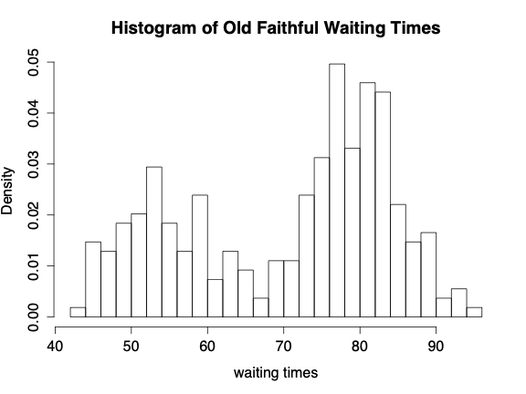
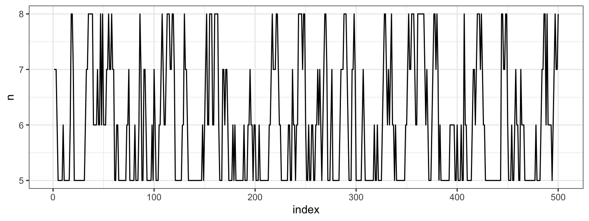
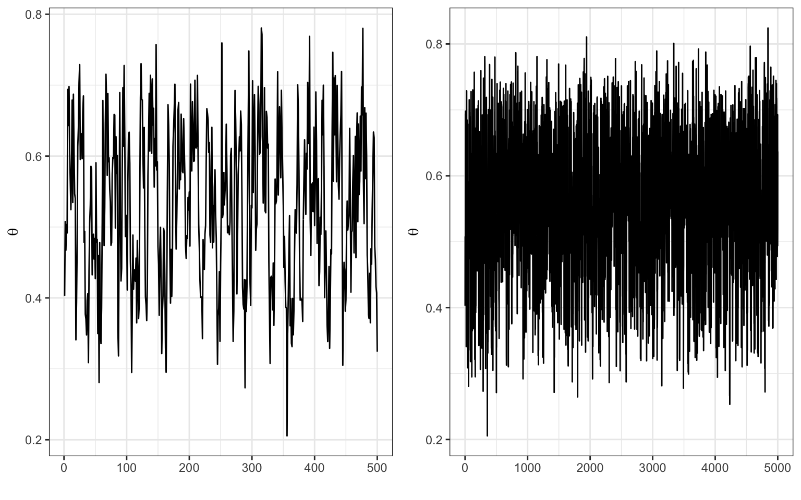
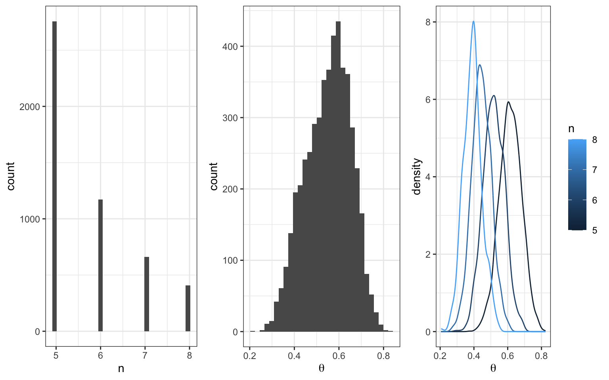
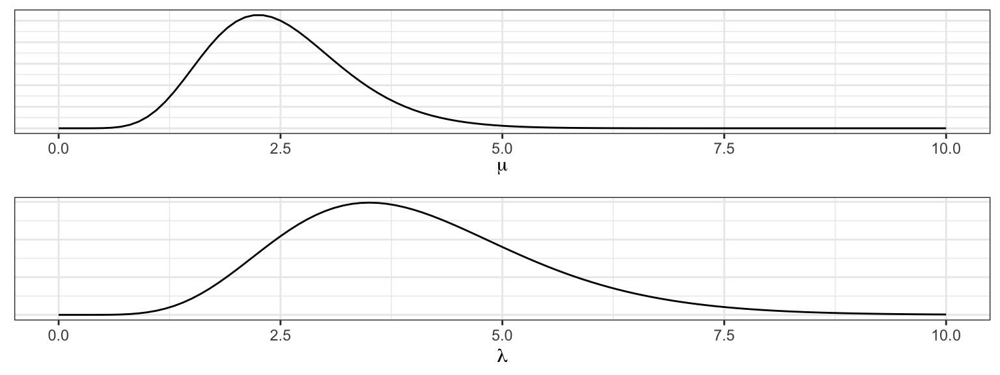
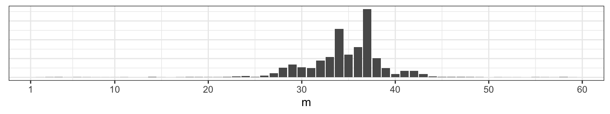
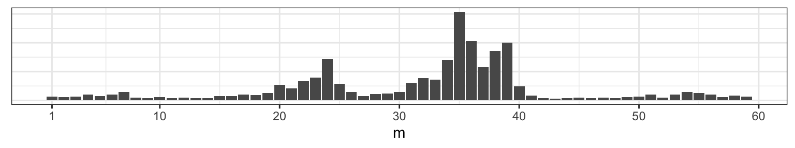

# Gibbs Sampler {#gibbs}


The Gibbs Sampler is a special case of a larger theory on Markov Chains.  A Markov chain is a stochastic (i.e., probabilistic) model that describes a sequence of random variables in which the state of the random variable depends only on the state of the variable attained in the previous step.  Markov chain Monte Carlo (MCMC) simulation is a widely used technique for simulating from a probability distribution to find the distribution itself or to describe aspects of that distribution.  The **Gibbs Sampler** is a type of MCMC simulation with particular properties.  A more generalized form of MCMC is the Metropolis-Hastings algorithm used when it is difficult to obtain a sequence of random variables directly from a given probability distribution.

In the interest of time, and also because MCMC is a topic that is more typically aligned with a probability course, we will focus only on Gibbs sampler as applied to Bayesian inference.   That is, we will use the Gibbs sampler to find / sample from a posterior distribution when the analytic / closed-form distribution is difficult to use directly.  The posterior distribution can then be used to perform Bayesian Inference.

Consider a situation where a posterior distribution is needed.  For example, the question might call for estimation, confidence bounds, or hypothesis testing.  However, the posterior distribution is not easy to work with in closed form.  The problem might be that the product of the likelihood and the prior is not conjugate to anything (i.e., the constant in the denominator is difficult to find).  Or the problem might be that there are too many parameters to integrate out the desired marginal distribution (e.g., recall the normal-gamma posterior for which we actually could find the marginal posterior, but for which we had to use some heavy lifting from both calculus and probability theory).  

## The Gibbs Sampler

**Gibbs Sampler Algorithm**

0. Let j = 0.  
1.  Take initial guesses for the parameters $\theta_0$, $\psi_0$, $\mu_0$.  
2.  Set j = j+1.  Sample from each of the conditional probabilities:  
\begin{eqnarray*}
\theta_j &\sim& p(\theta | \psi_{j-1}, \mu_{j-1}, \underline{x})\\
\psi_j &\sim& p(\psi | \theta_j, \mu_{j-1}, \underline{x})\\
\mu_j &\sim& p(\mu | \theta_j, \psi_j, \underline{x})
\end{eqnarray*}
3. Iterate Step 2. 


* The samples approximate the joint distribution of all variables.
* The marginal distribution of any subset of variables can be approximated by simply considering the samples for that subset of variables, ignoring the rest.
* The expected value of any variable can be approximated by averaging over all the samples.
Gibbs sampling was proposed in the early 1990s (Geman and Geman, 1984; Gelfand and Smith, 1990) and fundamentally changed Bayesian computing.
* Gibbs sampling is attractive because it can sample from high-dimensional posteriors.
* The main idea is to break the problem of sampling from the high-dimensional joint distribution into a series of samples from low-dimensional conditional distributions.
* Because the low-dimensional updates are done in a loop, samples are not independent as in rejection sampling.
* The dependence of the samples turns out to follow a Markov distribution, leading to the name Markov chain Monte Carlo (MCMC).
*  When does the chain converge? That is, for which $t$ can we assume that $\theta_t \sim p(\theta | \underline{x})$?
* Proving that the chain will eventually converge requires many stochastic process theorems.
* The Markov chain will converge to $p(\theta | \underline{x})$ if it satisfies the detailed balance condition
$$ p(\theta_t | \underline{x}) p(\theta_{t+1} | \theta_t) = p(\theta_{t+1}|\underline{x}) p(\theta_t | \theta_{t+1})$$
where $p(\theta_{t+1} | \theta_t)$ is the PDF of the transition from one iteration to the next.
* Geman and Geman showed this holds for Gibbs sampling.
* This is an asymptotic result, in practice we need a finite time to mark convergence.


### two Bernoulli RVs example

In order to motivate the use of a Gibbs sampler, we start with an example of two variables which both have marginal Bernoulli distributions and the following joint distribution^[Taken from Casella and George, "Explaining the Gibbs Sampler." *The American Statistician, 46*(3), 1992, pgs 167-174.]:

|   |   |   X   |       |
|:-:|:-:|:-----:|:-----:|
|   |   |   0   |   1   |
| Y | 0 | $p_1$ | $p_2$ |
|   | 1 | $p_3$ | $p_4$ |

where $p_i \geq 0, \ \ p_1 + p_2 + p_3 + p_4 = 1.$

Note that the conditional distributions can be written as:
\begin{align*}
P_{y|x} = 
\begin{bmatrix}
\frac{p_1}{p_1 + p_3} & \frac{p_3}{p_1 + p_3}\\
\frac{p_2}{p_2 + p_4} & \frac{p_4}{p_2 + p_4}\\
\end{bmatrix}
\end{align*}

\begin{align*}
P_{x|y} = 
\begin{bmatrix}
\frac{p_1}{p_1 + p_2} & \frac{p_2}{p_1 + p_2}\\
\frac{p_3}{p_3 + p_4} & \frac{p_4}{p_3 + p_4}
\end{bmatrix}
\end{align*}

Where $P_{y|x}$ contains the conditional probabilities of $Y$ given $X=x$, and $P_{x|y}$ has the conditional probabilities of $X$ given $Y=y$.  The iterative sampling scheme of the Gibbs sampler produces a sequence of 0s and 1s.  As long as we start in a position that has probability greater than zero, the Gibbs sampler iteration should visit each state with the appropriate relative probabilities (as our sequence gets infinitely long).   Additionally, notice that the marginal probabilities will hold.

The algebra / intuition for the $2 \times 2$ case generalizes to the $m \times n$ case for discrete variables.  If either of the variables are continuous, the finite dimensional arguments will not work.  However, with some reasonable assumptions, the logic is not terribly different from that given above for the discrete variables.


### beta-binomial-poisson example

Recall what you know about joint and conditional distributions.  That is,

\begin{eqnarray*}
f(x | y) &=& \frac{ f(x,y)}{f(y)} \propto f(x,y) \mbox{  (no y)} \\
f(y | x) &=& \frac{ f(x,y)}{f(x)} \propto f(x,y) \mbox{  (no x)} \\
\end{eqnarray*}

Ok, to the example.  Consider a situation where we do the following:

* Flip a coin $n$ times ($n$ unknown)
* P(heads) = $\theta$ (unknown)


We are looking for the posterior distribution of $(n, \theta | x).$     Consider the following data likelihood and prior distributions:

\begin{eqnarray*}
X &\sim& \mbox{Binomial}(n, \theta)\\
n &\sim& \mbox{Poisson}(\lambda) \ \ \ \lambda \mbox{ known}\\
\theta &\sim& \mbox{Beta}(a,b)\\
\xi (n, \theta | \underline{x}) &\propto& f(\underline{x} | n, \theta) \xi(n) \xi(\theta)\\
&\propto& {n \choose x} \theta^{x} (1-\theta)^{n - x} \cdot \theta^{a-1} (1-\theta)^{b-1} \cdot e^{-\lambda} \frac{\lambda^n}{n!}\\
\xi(\theta | n, x) &\propto& \theta^{a + x - 1} (1 - \theta)^{b + n - x -1} \bigg[\mbox{  Beta}(a + x, b + n - x) \bigg]\\
\xi(n | \theta, x) &\propto& {n \choose x} e^{-\lambda} \frac{\lambda^n}{n!}(1-\theta)^{n-x}\\
&\propto& \frac{[\lambda(1-\theta)]^{n-x}}{(n-x)!}, \ \ \ n = x, x+1, x+2, \ldots\\
\mbox{Let } z = n - x && z \sim \mbox{Poisson}(\lambda(1-\theta))\\
\end{eqnarray*}

**Gibbs Sampler for binomial-beta-Poisson**
 
0. Let j = 0. 
1.  Take initial guesses for the parameters $\theta_0$, $n_0$. 
2.  Set j = j+1.  Sample from each of the conditional probabilities: 
\begin{eqnarray*}
\theta_j &\sim& \mbox{Beta}(a + x, b + n_j - x)\\
n_j &= & x + z, \ \ z \sim \mbox{Poisson}(\lambda(1-\theta_j))
\end{eqnarray*}
3. Iterate Step 2. 

Or maybe the example is slightly different.  Consider a large number of examples.  For each example, do the following:

* Flip a coin $n$ times ($n$ unknown)
* P(heads) = $\theta$ (unknown)
* Repeat the experiment $k$ times, and get $(x_1, x_2, \ldots, x_k).$

Interest is in the posterior distribution of $(n, \theta | \underline{x}).$     Consider the following data likelihood and prior distributions:

\begin{eqnarray*}
X_i &\sim& \mbox{Binomial}(n, \theta)\\
n &\sim& \mbox{Discrete Uniform}[5,8]\\
\theta &\sim& \mbox{Beta}(1,1)\\
\xi (n, \theta | \underline{x}) &\propto& f(\underline{x} | n, \theta) \xi(n) \xi(\theta)\\
&\propto& \prod_{i=1}^k {n \choose x_i} \theta^{x_i} (1-\theta)^{n - x_i} \cdot \mbox{const} \\
\xi(\theta | n, \underline{x}) &\propto& \theta^{1 + k\overline{x} - 1} (1 - \theta)^{1 + k\cdot n - k\overline{x} -1} \Bigg[\mbox{  Beta}\bigg(1 + k\overline{x}, 1 + k(\cdot n - \overline{x})\bigg) \Bigg]\\
\xi(n | \theta, \underline{x}) &\propto& (1-\theta)^{nk} \prod_{i=1}^k {n \choose x_i} \\
\end{eqnarray*}

Here we don't know the functional form of the posterior distribution of $n!$  The good news is that the discrete uniform prior distribution told us that $n$ could only be 5, 6, 7, 8.  Therefore, the marginal posterior distribution of $n | \theta, \underline{x}$ is a discrete distribution where we know the exact values of the probability for each value of $n.$

\begin{eqnarray*}
\xi(n | \theta, \underline{x}) & = & \frac{(1-\theta)^{nk} \prod_{i=1}^k {n \choose x_i}}{\sum_{n=5}^8(1-\theta)^{nk} \prod_{i=1}^k {n \choose x_i} } \\
\end{eqnarray*}


### hierarchical normal model

Consider the situation where $y_{ij}, i=1,2,\ldots,n_j \ \ j=1,2,\ldots , J$ are independently distributed within each of $J$ groups with mean $\theta_j$ and common variance $\sigma^2$.  The total number of observations is $n=\sum_{j=1}^J n_j$.  The data in the example come from a mixture of normals.  For example, consider the Old Faithful geyser with the following histogram of waiting times between each eruption:



*Prior:* The group means are assumed to follow a normal distribution with unknown mean $\mu$ and variance $\tau^2$; a non-informative prior distribution is assumed for $(\mu, \log(\sigma), \log(\tau)), \ \ \  \tau > 0, \sigma > 0$.  

$$ f(\mu, \log(\sigma), \log(\tau)) \propto \tau$$

*Posterior:*

\begin{eqnarray*}
f(\theta, \mu, \log(\sigma), \log(\tau) | {\bf y}) \propto \tau \prod_{j=1}^J N(\theta_j | \mu, \tau^2) \prod_{j=1}^J \prod_{i=1}^{n_j} N(y_{ij} | \theta_j, \sigma^2)
\end{eqnarray*}


### Gibbs Sampler Algorithm^[Algorithm and example from *Bayesian Data Analysis*, 2004, Gelman, Carlin, Stern, and Rubin]

The conditional distributions for this model all have simple conjugate forms.  Accordingly, it is easy to iterate through the conditional posterior distributions one at a time to generate a marginal posterior distribution of any of the individual parameters of interest.  (Note, the vector of values is taken after sufficient burn in time such that the distribution of the variables converge to their true values.)  Often starting values (here, we initialize $\theta_j$ and $\mu$ and start at step 3) are found using frequentist estimates of the observations.  We won't go over the technical conditions which lead to the iterative procedure producing a sample of values from the marginal posterior distributions, but know that there are technical conditions (those conditions are all met here for the normal mixture problem).   Generally, however, a 

> **Gibbs sample** is a **Markov Chain Monte Carlo (MCMC)** algorithm for constructing a specific marginal distribution (or distributions) from a specified multivariate distribution.


1. *Conditional posterior distribution of each $\theta_j.$*  The factors in the join posterior density that involve $\theta_j$ are the $N(\mu, \tau^2)$ prior distribution and the normal likelihood from the data in the $j^{th}$ group.  The conditional posterior distribution of each $\theta_j$ given the other parameters in the model is:
$$ \theta_j | \mu, \sigma, \tau, {\bf y} \sim N(\hat{\theta}_j, V_{\theta_j})$$
where the parameters of the conditional posterior distribution depend on $\mu, \sigma,$ and $\tau$, as well as ${\bf y}$:
\begin{eqnarray*}
\hat{\theta}_j &=& \frac{\frac{1}{\tau^2} \mu + \frac{n_j}{\sigma^2} \overline{y}_j}{\frac{1}{\tau^2} + \frac{n_j}{\sigma^2}}\\
V_{\theta_j} &=& \frac{1}{\frac{1}{\tau^2} + \frac{n_j}{\sigma^2}}\\
\end{eqnarray*}
These conditional distributions are independent; thus drawing the $\theta_j$s one at a time is equivalent to drawing the vector $\theta$ all at once from its conditional posterior distribution.

2. *Conditional posterior distribution of $\mu$*  Conditional on ${\bf y}$ and the other parameters in the model, $\mu$ has a normal distribution determined by the $J$ values $\theta_j:$
\begin{eqnarray*}
\mu | \theta, \sigma, \tau, {\bf y} \sim N(\hat{\mu}, \tau^2/J)
\end{eqnarray*}
where
$$ \hat{\mu} = \frac{1}{J} \sum_{j=1}^J \theta_j.$$
3. *Conditional posterior distribution of $\sigma^2.$*  The conditional posterior distribution for $\sigma^2$ has the form corresponding to a normal variance with known mean; there are $n$ observations $y_{ij}$ with means $\theta_j$.  The conditional posterior distribution is:
$$ \sigma^2 | \theta, \mu, \tau, {\bf y} \sim Inv-\chi^2(n, \hat{\sigma}^2),$$
where
$$ \hat{\sigma}^2 = \frac{1}{n} \sum_{j=1}^J \sum_{i=1}^{n_j} (y_{ij} - \theta_j)^2.$$
4. *Conditional posterior distribution of $\tau^2.$*  Conditional on the data and the other parameters in the model, $\tau^2$ has a scaled $Inv-\chi^2$ distribution, with parameters depending only on $\mu$ and $\theta$:
$$ \tau^2  | \theta, \mu, \sigma, {\bf y} \sim Inv-\chi^2(J-1, \hat{\tau}^2),$$
where
$$\hat{\tau}^2 = \frac{1}{J-1} \sum_{j=1}^J (\theta_j - \mu)^2.$$

The expressions for $\tau^2$ have $J-1$ degrees of freedom instead of $J$ because $f(\tau) \propto 1$ rather than $f(\tau) \propto \tau^{-1}$.


There are times when the distributions are not conjugate or easy to sample from.  Additionally, we might not have a complicated hierarchical structure, but we might be interested in sampling from a distribution for which the only unknown is the integrating constant.  In such cases, the Metropolis-Hastings algorithm should be used.


## <i class="fas fa-lightbulb" target="_blank"></i> Reflection Questions

1. 


## <i class="fas fa-balance-scale"></i> Ethics Considerations

1. 


## R code: 


### Small Example
Consider a large number of examples.  For each example, do the following:  
   - Flip a coin $n$ times ($n$ unknown)  
   - P(heads) = $\theta$ (unknown)  
   - Repeat the experiment $k$ times, and get $(x_1, x_2, \ldots, x_k)$.  

Interest is of the posterior distribution of $(n, \theta \  | \ \underline{x})$.     Consider the following data likelihood and prior distributions:

#### Posterior Distributions {-}

\begin{eqnarray*}
X_i &\sim& \mbox{Binomial}(n, \theta)\\
n &\sim& \mbox{Discrete Uniform}[5,8]\\
\theta &\sim& \mbox{Beta}(1,1)\\
\xi (n, \theta | \underline{x}) &\propto& f(\underline{x} | n, \theta) \xi(n) \xi(\theta)\\
&\propto& \prod_{i=1}^k {n \choose x_i} \theta^{x_i} (1-\theta)^{n - x_i} \cdot \mbox{const} \\
\xi(\theta | n, \underline{x}) &\propto& \theta^{1 + k\overline{x} - 1} (1 - \theta)^{1 + k\cdot n - k\overline{x} -1} \Bigg[\mbox{  Beta}\bigg(1 + k\overline{x}, 1 + k(\cdot n - \overline{x})\bigg) \Bigg]\\
\xi(n | \theta, \underline{x}) &\propto& (1-\theta)^{nk} \prod_{i=1}^k {n \choose x_i} \\
\end{eqnarray*}

Here we don't know the functional form of the posterior distribution of $n$!  The good news is that the discrete uniform prior distribution told us that $n$ could only be 5, 6, 7, 8.  Therefore, the marginal posterior distribution of $n | \theta, \underline{x}$ is a discrete distribution where we know the exact values of the probability for each value of $n$.

#### Gibbs Sampler {-}

We'll run our Gibbs sampler 5,000 times and store the results in a matrix called `post_samples1`. Note that the observed data are: $\underline{x} = (2,4,3,3,3,2,3,3,4,4)$.  (The data tell us that $n$ must be at least 4, but the prior told us that $n$ has to be at least 5, so the bounds on $n$ don't change given the data information.)


```r
it <- 5000
post_samples1 <- matrix(rep(NA, it * 2), ncol = 2)
colnames(post_samples1) <- c("theta", "n")

exes <- c(2,4,3,3,3,2,3,3,4,4)
n_j <- 8 # initialize n
for (j in 1:it) {
  # sample theta
  theta_j <- rbeta(1, 1 + 10 * mean(exes), 1 + 10 * (n_j - mean(exes)))
  # sample n
  n_vec <- rep(NA, 4)
  for (n in 5:8) {
    n_vec[n-4] <- (1-theta_j)^(n*10) * prod(choose(n,exes))
  }
  p <- n_vec/sum(n_vec)
  n_j <- sample(5:8, size = 1, prob = p)
  # store results
  post_samples1[j, "theta"]  <- theta_j
  post_samples1[j, "n"]      <- n_j
}
```


#### Convergence {-}

After gathering the results from running a Gibbs Sampler, it's a good idea to investigate the convergence. Let's look at the first 500 $m$s that we drew.



Let's plot the full sample across all indices.




### Changepoint Problem


*Preliminaries for the Changepoint Problem*^[Thanks to Andrew Bray at Reed College as well as Ilker Yildirim "Bayesian Inference: Gibbs Sampling" at http://www.mit.edu/~ilkery/papers/GibbsSampling.pdf]


Consider a series of Poisson random variables, $Y_1, Y_2, \ldots, Y_n$. At some unknown point, $m$, the rate of the Poisson distribution changed. That is,

\begin{align}
Y_1, \ldots, Y_m &\sim \textrm{Poi}(\mu) \\
Y_{m+1}, \ldots, Y_n &\sim \textrm{Poi}(\lambda)
\end{align}


To get a sense of what we're talking about, let's pick $\mu =$ 2,  $\lambda =$ 4 and $m =$ 38 (at $n =$ 60). We can visualize one realization of this process by plotting the index against the combined Poisson vector of counts from both random variables $\{Y_{\mu}, Y_{\lambda}  \}$.

<div class="figure" style="text-align: center">

<p class="caption">(\#fig:unnamed-chunk-11)Counts on the y-axis, index on the x-axis.  At m=38 we can see that the sequence changes from varying around 2 to varying around 4.</p>
</div>

Our goal is to assess when the change occurred by learning the posterior distribution of the parameter $m$ by synthesizing our prior expectation with the observed data.

* * *

#### I. Specifying priors {-}

When thinking about a prior distribution, it's important that distribution's support match the conceivable values of the parameter. In the case of the Poisson rate parameter, that means we need to be looking for a density function that is non-zero over the positive real line. While there are many (indeed infinitely many) to choose from, we'll select the Gamma distribution because it is fairly flexible and happens to be a conjugate prior for the Poisson.

Let's say that based on my prior knowledge of this process, I have reason to think that the process had a lower rate before the change and a higher rate after the change (note that this needs to be selected before looking at the plot above). I'll select

\begin{align}
\mu &\sim \textrm{Gamma}(\alpha = 10, \beta = 4) \\
\lambda &\sim \textrm{Gamma}(\nu = 8, \phi = 2).
\end{align}




The third parameter that governs this process is $m$, the changepoint. If we assume that the data set has at least one observation from each Poisson distribution, then $m$ can take integer values between 1 and $n - 1$. Any discrete distribution on those integers will work. We'll express our ambivalence concerning its value by specifying a flat prior.

$$
m \sim \textrm{Unif}\{1, 2, \ldots, n - 1\}
$$


#### II. Full Joint Distribution {-}

While our primary interest is the posterior distribution of $m$, to get there we need to start by writing down the joint distribution of all the parameters and all of the data, $f(Y_\mu, Y_\lambda, \mu, \lambda, m)$. This is an unusual expression for those that have spent most of their time with frequentist statistics. To a Bayesian, though, these are all random variables, so it's no problem to think about their joint distribution.

If each of these random variables were independent of one another, we could write their joint distribution like this.

$$
f(Y_\mu, Y_\lambda, \mu, \lambda, m) = f(Y_\mu)f(Y_\lambda)f(\mu)f(\lambda)f(m)
$$
But if we went to write down the first term, $f(Y_\mu)$, we'd find it's actually a function of two other random variables, $\mu$ and $m$. So the full joint probability is more accurately expressed as,

$$
f(Y_\mu, Y_\lambda, \mu, \lambda, m) = f(Y_\mu\,|\,\mu, m)f(Y_\lambda\,|\,\lambda, m)f(\mu)f(\lambda)f(m)
$$
The last three terms are fine to leave as marginal probabilities since they are independent of one another and of the conditional distributions of data. Next we substitute in the respective density functions, keeping in mind that the data are vectors, so we'll use the product notation shorthand.

\begin{align}
f(Y_\mu, Y_\lambda, \mu, \lambda, m) &\propto 
\prod_{i = 1}^{m} \left( \frac{\mu^{Y_i}e^{-\mu}}{Y_i!} \right)
\prod_{j = m+1}^{n} \left( \frac{\lambda^{Y_j}e^{-\lambda}}{Y_j!} \right)
\frac{\beta^\alpha}{\Gamma(\alpha)}\mu^{\alpha - 1}e^{-\beta \mu}
\frac{\phi^\nu}{\Gamma(\nu)}\lambda^{\nu - 1}e^{-\phi \lambda}
\end{align}

It looks like a mess right now, but it's a useful formulation to have on hand when thinking about posterior distributions.


#### III. Joint Posterior {-}

To move from the full joint to the joint posterior distribution of just the parameters given the data, we'll use the following definition of conditional probability.

\begin{align}
f(\mu, \lambda, m \,|\, Y_\mu, Y_\lambda) = \frac{f(Y_\mu, Y_\lambda, \mu, \lambda, m)}{f(Y_\mu, Y_\lambda)}
\end{align}

If you look at the denominator, that's what we'd get if we took the joint distribution in the numerator and integrated over all values of the parameters. This leaves us with an expression that is only a function of the data, and since we'll be conditioning on those, the denominator is just a constant, which we'll call $1/c$. So we can rewrite like this:

\begin{align}
f(\mu, \lambda, m \,|\, Y_\mu, Y_\lambda) = c \,f(Y_\mu, Y_\lambda, \mu, \lambda, m)
\end{align}

To get an expression that is clearly a function of the parameters, let's expand out the term on the right but move any terms that aren't a function of $\mu$, $\lambda$, or $m$ into $c$ (which is now a different constant but we'll still call it $c$).

\begin{align}
f(\mu, \lambda, m \,|\, Y_\mu, Y_\lambda) &= c \,f(Y_\mu, Y_\lambda, \mu, \lambda, m) \\
&= c \,\prod_{i = 1}^{m} \left( \frac{\mu^{Y_i}e^{-\mu}}{Y_i!} \right)
\prod_{j = m+1}^{n} \left( \frac{\lambda^{Y_j}e^{-\lambda}}{Y_j!} \right)
\frac{\beta^\alpha}{\Gamma(\alpha)}\mu^{\alpha - 1}e^{-\beta \mu}
\frac{\phi^\nu}{\Gamma(\nu)}\lambda^{\nu - 1}e^{-\phi \lambda} \frac{1}{n - 1} \\
&= c \,\prod_{i = 1}^{m} \left( \mu^{Y_i}e^{-\mu} \right)
\prod_{j = m+1}^{n} \left( \lambda^{Y_j}e^{-\lambda} \right)
\mu^{\alpha - 1}e^{-\beta \mu}
\lambda^{\nu - 1}e^{-\phi \lambda} \\
&= c \,  \mu^{\sum_{i=1}^{m}Y_i}e^{-m\mu} 
\lambda^{\sum_{j=m+1}^{n}Y_j}e^{-(n - m)\lambda}
\mu^{\alpha - 1}e^{-\beta \mu}
\lambda^{\nu - 1}e^{-\phi \lambda} \\
&= c \,  \mu^{\alpha + \sum_{i=1}^{m}Y_i - 1}e^{-(\beta + m) \mu} 
\lambda^{\nu + \sum_{j=m+1}^{n}Y_j - 1}e^{-(\phi + n - m)\lambda}
\end{align}


#### IV. Conditional Posteriors {-}

##### Posterior for m {-}

The key to implementing a Gibbs Sampler is to secure the conditional distribution of the parameters. We can find them from the joint posterior distribution by repeating the same technique of conditioning: treating this as a function of just the parameter of interest and dividing by the new normalizing constant. Staring with $m$, the normalizing constant is $f(\mu, \lambda \,|\, Y_\mu, Y_\lambda)$, which can be found by summing the joint posterior over all possible values of $m$. If we take $\mu$ to be $A$ and $\lambda$ to be $B$, this is just an application of the law of total probability, $P(A) = \sum_n A\cap B_n$.

\begin{align}
f(m \,|\, \mu, \lambda, Y_\mu, Y_\lambda) &= \frac{f(\mu, \lambda, m \,|\, Y_\mu, Y_\lambda)}{f(\mu, \lambda \,|\, Y_\mu, Y_\lambda)} \\
&= \frac{c \,  \mu^{\alpha + \sum_{i=1}^{m}Y_i - 1}e^{-(\beta + m) \mu}\lambda^{\nu + \sum_{j=m+1}^{n}Y_j - 1}e^{-(\phi + n - m)\lambda}}
{\sum_{k = 1}^{n - 1} c \,  \mu^{\alpha + \sum_{i=1}^{k}Y_i - 1}e^{-(\beta + k) \mu}\lambda^{\nu + \sum_{j=k+1}^{n}Y_j - 1}e^{-(\phi + n - k)\lambda}}
\end{align}

Once we cancel out the $c$, this serves as our discrete posterior distribution on $m$.

##### Posterior for $\mu$ {-}

We can repeat this same process to find the conditional posterior for $\mu$, which requires that we first find the normalizing constant $f(\lambda, m \,|\, Y_\mu, Y_\lambda)$.

\begin{align}
f(\lambda, m \,|\, Y_\mu, Y_\lambda) &= \int_0^\infty f(\mu, \lambda, m \,|\, Y_\mu, Y_\lambda) \, \textrm{d}\mu \\
&= \int_{0}^{\infty}c \,  \mu^{\alpha + \sum_{i=1}^{m}Y_i - 1}e^{-(\beta + m) \mu}\lambda^{\nu + \sum_{j=m+1}^{n}Y_j - 1}e^{-(\phi + n - m)\lambda} \,  \mathrm{d} \mu \\
&= c  \, \lambda^{\nu + \sum_{j=m+1}^{n}Y_j - 1}e^{-(\phi + n - m)\lambda}
\int_{0}^{\infty} \mu^{\alpha + \sum_{i=1}^{m}Y_i + 1} e^{-(\beta + m)\mu} \mathrm{d} \mu \\
&= c  \, \lambda^{\nu + \sum_{j=m+1}^{n}Y_j - 1}e^{-(\phi + n - m)\lambda}
\frac{\Gamma(\alpha + \sum_{i=1}^{m}Y_i)}{(\beta + m)^{\alpha + \sum_{i=1}^{m}Y_i}}
\int_{0}^{\infty} \frac{(\beta + m)^{\alpha + \sum_{i=1}^{m}Y_i}}{\Gamma(\alpha + \sum_{i=1}^{m}Y_i)}
\mu^{\alpha + \sum_{i=1}^{m}Y_i + 1} e^{-(\beta + m)\mu} \mathrm{d} \mu \\
&= c  \, \lambda^{\nu + \sum_{j=m+1}^{n}Y_j - 1}e^{-(\phi + n - m)\lambda}
\frac{\Gamma(\alpha + \sum_{i=1}^{m}Y_i)}{(\beta + m)^{\alpha + \sum_{i=1}^{m}Y_i}}
\end{align}

In step 4 above we introduced a constant and it's reciprocal so that the function being integrated is recognizable as the pdf of a Gamma random variable, which evaluates to 1 in the step 5. With this normalizing constant in hand, we can write out the form of the posterior for $\mu$.

\begin{align}
f(\mu \,|\, \lambda, m, Y_\mu, Y_\lambda) &= \frac{f(\mu, \lambda, m, \,|\, Y_\mu, Y_\lambda)}{f(\lambda, m \,|\, Y_\mu, Y_\lambda)} \\
&= \frac{c \,  \mu^{\alpha + \sum_{i=1}^{m}Y_i - 1}e^{-(\beta + m) \mu}\lambda^{\nu + \sum_{j=m+1}^{n}Y_j - 1}e^{-(\phi + n - m)\lambda}}{c  \, \lambda^{\nu + \sum_{j=m+1}^{n}Y_j - 1}e^{-(\phi + n - m)\lambda}
\frac{\Gamma(\alpha + \sum_{i=1}^{m}Y_i)}{(\beta + m)^{\alpha + \sum_{i=1}^{m}Y_i}}} \\
&= \frac{(\beta + m)^{\alpha + \sum_{i=1}^{m}Y_i}}{\Gamma(\alpha + \sum_{i=1}^{m}Y_i)}
\mu^{\alpha + \sum_{i=1}^{m}Y_i - 1}e^{-(\beta + m) \mu}
\end{align}

Which is recognizable as the pdf of the a Gamma random variable. Therefore,

$$
\mu \,|\, m, Y_\mu \sim \textrm{Gamma}(\alpha + \sum_{i=1}^{m}Y_i, \beta + m)
$$

##### Posterior for $\lambda$ {-}

The approach that we used to find the posterior distribution of $\mu$ is the very same that we can carry out on $\lambda$. Instead of replicating all of the steps, we'll note the link between the joint posterior and posterior for $\mu$ and use the same mapping to assert that,

$$
\lambda \,|\, m, Y_\lambda \sim \textrm{Gamma}(\nu + \sum_{i=m+1}^n Y_i, \phi + n - m)
$$


#### Gibbs Sampler {-}

To draw samples from the joint posterior $f(\mu, \lambda, m \,|\, Y_\mu, Y_\lambda)$, we will form a Markov chain that begins by initializing a value for $m_{j-1}$, then iterates through the following three steps many times.

1. Sample $\mu_j$ from $\textrm{Gamma}(\alpha + \sum_{i=1}^{m_{j-1}}Y_i, \beta + m_{i-j})$
2. Sample $\lambda_j$ from $\textrm{Gamma}(\nu + \sum_{i=m_{j-1}+1}^n Y_i, \phi + n - m_{j-1})$
3. Sample $m_j$ from $f(m \,|\, \mu_{j}, \lambda_j, Y_{\mu_{j}}, Y_{\lambda_{j}})$

We'll run our Gibbs sampler 5,000 times and store the results in a matrix called `post_samples`. Note that we're moving back into the specific scenario where $n = 60$, $\alpha = 10$, $\beta = 4$, $\nu = 8$, and $\phi = 2$.


```r
it <- 5000
post_samples <- matrix(rep(NA, it * 3), ncol = 3)
colnames(post_samples) <- c("mu", "lambda", "m")
m_j <- 2 # initialize m
for (j in 1:it) {
  # sample mu
  mu_j      <- rgamma(1, alpha + sum(y[1:m_j]), beta + m_j)
  # sample lambda
  lambda_j  <- rgamma(1, nu + sum(y[(m_j+1):n]), phi + (n - m_j))
  # sample m
  m_vec <- rep(NA, n - 1)
  for (k in 1:(n - 1)) {
    m_vec[k] <-  mu_j^(alpha + sum(y[1:k]) - 1) *
      exp(-(beta + k) * mu_j) *
      lambda_j^(nu + sum(y[(k+1):n]) - 1) *
      exp(-(phi + n - k) * lambda_j)
  }
  p <- m_vec/sum(m_vec)
  m_j <- sample(1:(n - 1), size = 1, prob = p)
  # store results
  post_samples[j, "mu"]     <- mu_j
  post_samples[j, "lambda"] <- lambda_j
  post_samples[j, "m"]      <- m_j
}
```


#### Convergence {-}

After gathering the results from running a Gibbs Sampler, it's a good idea to investigate the convergence. We started with a fairly extreme initial value for $m$, so let's look at the first 500 $m$s that we drew.


We see that the chain escaped the initial value very quickly. Part of the reason for this is the conditional independence of two of the three parameters. Let's plot the full sample across all indices.


#### Conclusions {-}

Returning to the question that motivated this example, what is our updated best guess for when the changepoint occurred? We can start by looking at the posterior distribution on $m$.



Those two prominent modes are at 34 and 27, so those are probably fine point estimates for $m$ based on this data and your prior information. Before you try to puzzle through why there might be two modes, consider what happens if we change our our random seed at the outset, where we first generated the data.



This reveals that with a flat prior on $m$, the posterior will be drawing most of it's structure from the data, which, at these sample sizes, are still subject to considerable sampling variability.


## Appendix

### Density functions

The random variable $X$ is *Poisson* if,

$$
f(x \,|\, \lambda) = \frac{\lambda^x e^{-\lambda}}{x!} \, ; \quad \quad \lambda > 0, x \in \{0, 1, 2, \ldots \}
$$

The random variable $X$ is *Gamma* if,

$$
f(x\,|\,\alpha, \beta) = \frac{\beta^\alpha}{\Gamma(\alpha)}x^{\alpha - 1}e^{-\beta x} \, ; \quad \quad \alpha > 0, \beta > 0, x \in \{0, \infty \}
$$

Where $E(X) = \frac{\alpha}{\beta}$ and $Var(X) = \frac{\alpha}{\beta^2}$


