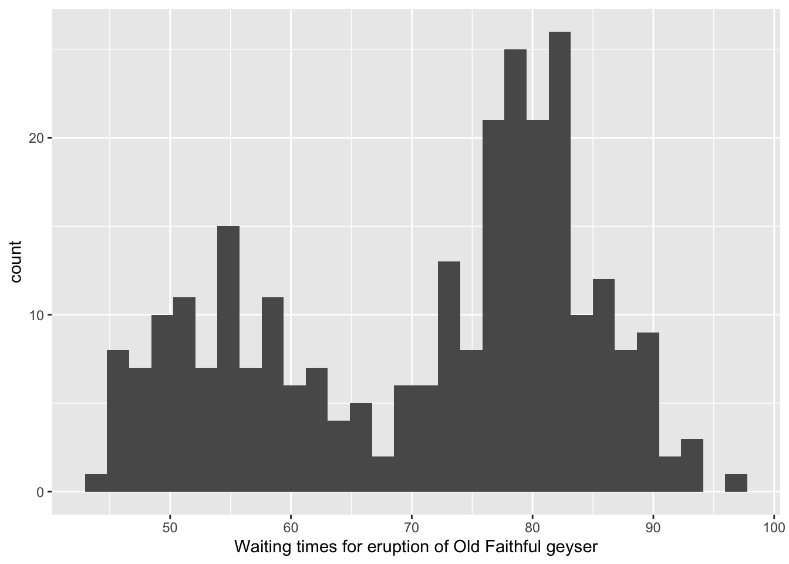

# The EM Algorithm {#em}

Remember how MLEs were motivated ...  Maximum likelihood estimation is a method for choosing estimators of parameters that avoids using prior distributions or loss functions.  MLE chooses $\hat{\theta}$ as the estimate of $\theta$ that **maximizes** the likelihood function (easily the most widely used estimation method in statistics).  But what happens when the maximization process cannot be performed in closed form?

*THE* seminal EM Algorithm paper is: Dempster, Laird, Rubin (1977) "Maximum likelihood from incomplete data via the EM Algorithm."  *JRSS B 39*: 1-38. 

## EM Motivation

Recall that the goal is to maximize the likelihood (or log likelihood) of the observed data:
$$\log (P_Y(y; \theta)).$$

Sometimes, when the log likelihood is difficult to maximize, a missing (or latent) variable can help with the computations.  Consider $Z$ to be the missing / latent variable.  By using the law of total probability (and wlog assume $Z$ is discrete):
$$\log (P_Y(y; \theta)) = \log \bigg( \sum_z P_{Y,Z}(y, z; \theta)\bigg).$$
The next few steps require some of the techniques and tools covered in Probability Theory.
\begin{eqnarray}
\log (P_Y(y; \theta)) &=& \log \bigg( \sum_z P_{Y,Z}(y, z; \theta)\bigg) \nonumber \\
&=&  \log \bigg( \sum_z  q_{Z,\theta^i}(z) \frac{P_{Y,Z}(y, z; \theta)}{q_{Z,\theta^i}(z)}\bigg) \nonumber \\
&=&  \log \bigg(E_{q_{Z,\theta^i}} \bigg[ \frac{P_{Y,Z}(y, z; \theta)}{q_{Z,\theta^i}(z)} \bigg] \bigg) \nonumber \\
&\geq& E_{q_{Z,\theta^i}}   \bigg[  \log \bigg(\frac{P_{Y,Z}(y, z; \theta)}{q_{Z,\theta^i}(z)}  \bigg) \bigg]  \mbox{ by Jensen's Inequality} (\#eq:emmax)
\end{eqnarray}
Equation \@ref(eq:emmax) creates a lower bound on the quantity we want to maximize.  For ease of computation, the focus will be on the right side of equation \@ref(eq:emmax) during the *maximization step}.

\begin{eqnarray}
E_{q_{Z,\theta^i}}   \bigg[  \log \bigg(\frac{P_{Y,Z}(y, z; \theta)}{q_{Z,\theta^i}(z)}  \bigg) \bigg]  &=&  E_{q_{Z,\theta^i}} [\log( P_{Y,Z}(y,z; \theta))] -  E_{q_{Z,\theta^i}} [\log(q_{Z,\theta^i}(z))] \\
&=& Q(\theta | \theta^i) -  E_{q_{Z,\theta^i}} [\log(q_{Z,\theta^i}(z))]  (\#eq:emlog)
\end{eqnarray}

Because the goal is to maximize the likelihood with respect to $\theta,$ only the first term on the right side of equation \@ref(eq:emlog) is relevant.  That is, if $Z$ is known (for a given value of $\theta^i$), then the maximization of the likelihood simplifies to:

**The M-Step**
\begin{eqnarray*}
\hat{\theta} &\leftarrow& \mbox{argmax}_{\theta} E_{q_{Z,\theta^i}} [\log( P_{Y,Z}(y,z; \theta))]\\
\hat{\theta} &\leftarrow& \mbox{argmax}_\theta \ \ Q(\theta | \theta^{i})
\end{eqnarray*}
\noindent
But unfortunately, we don't typically know the value of $Z,$ or really, $q_{Z,\theta^i}(z).$  

**The E-Step**
In the *expectation step* we aim to find $q_{Z,\theta^i}(z)$ that will optimize the likelihood.  Recall the quantity above that we hope to maximize:

\begin{eqnarray*}
E_{q_{Z,\theta^i}}   \bigg[  \log \bigg(\frac{P_{Y,Z}(y, z; \theta)}{q_{Z,\theta^i}(z)}  \bigg) \bigg]  &=& 
E_{q_{Z,\theta^i}}   \bigg[  \log \bigg(\frac{P_Y(y; \theta) P_{Z|Y}(z|y; \theta)}{q_{Z,\theta^i}(z)}  \bigg) \bigg]\\
&=& \log ( P_Y(y; \theta) ) - E_{q_{Z,\theta^i}}   \bigg[  \log \bigg(\frac{q_{Z,\theta^i}(z)}{P_{Z|Y}(z|y; \theta)}  \bigg) \bigg]
\end{eqnarray*}
It turns out that $\frac{q_{Z,\theta^i}(z)}{P_{Z|Y}(z|y; \theta)}$ is always greater than 1 (it is called the Kullback-Leibler divergence), so  $\log(\frac{q_{Z,\theta^i}(z)}{P_{Z|Y}(z|y; \theta)})$ is always greater than zero.  In order to make it as small as possible (i.e., to maximize the righthand size), we want the ratio to be as close to one as possible.

\begin{eqnarray*}
q_{Z,\theta^i}(z) \approx P_{Z|Y}(z|y; \theta)
\end{eqnarray*}
That is, the value of $q_{Z,\theta^i}(z)$ that maximizes the likelihood, is $P_{Z|Y}(z|y; \theta).$  So, what did we do?    We wanted to maximize the likelihood of the given data.  Because it was difficult to do directly, we found an algorithm that would iterate between maximizing the likelihood with respect to $\theta$ when $q_{Z,\theta^i}(z)$ is known, and then solving for $q_{Z,\theta^i}(z)$ when $\theta$ is known.

### Does it work?

The EM Algorithm (especially in implementation below!) seems like an intuitive way to go back and forth between parameter estimation and estimation of missing information.  However, how can we show that it actually converges to a maximum of some kind?

\begin{eqnarray*}
\log(P_Y(y; \theta)) &=& \log(P_{Y,Z}(y,z ; \theta)) - \log(P_{Z|Y}(z | y; \theta)) \ \ \mbox{cond prob, rearranged}\\
E_{q_{Z,\theta^i}} [\log(P_Y(y; \theta)) ]&=& E_{q_{Z,\theta^i}} [\log(P_{Y,Z}(y,z ; \theta)) ] - E_{q_{Z,\theta^i}} [\log(P_{Z|Y}(z | y; \theta))] \\
\log(P_Y(y; \theta)) &=& Q(\theta | \theta^i) + H(\theta | \theta^i)\\
\end{eqnarray*}
which holds for any value of $\theta,$ including $\theta^i.$

\begin{eqnarray*}
\log(P_Y(y; \theta^i)) &=& Q(\theta^i | \theta^i) + H(\theta^i | \theta^i)\\
\end{eqnarray*}
Subtracting the two previous equations gives:
\begin{eqnarray*}
\log(P_Y(y; \theta))  - \log(P_Y(y; \theta^i)) &=& Q(\theta | \theta^i) - Q(\theta^i | \theta^i) + H(\theta | \theta^i) - H(\theta^i | \theta^i)\\
\end{eqnarray*}
And Gibbs' inequality tells us that $H(\theta | \theta^i) \geq H(\theta^i | \theta^i).$  So we can conclude that:
\begin{eqnarray*}
\log(P_Y(y; \theta))  - \log(P_Y(y; \theta^i)) &\geq& Q(\theta | \theta^i) - Q(\theta^i | \theta^i) 
\end{eqnarray*}
That is, if we choose a value of $\theta$ which makes $Q(\theta | \theta^i)$ bigger than $Q(\theta^i | \theta^i),$ then  $\log(P_Y(y; \theta))$ cannot go lower than $\log(P_Y(y; \theta^i)).$

## EM Algorithm

**EM Algorithm**

1. Take initial guesses for the parameters, $i=0.$
2. For $i = 1, 2, 3, \ldots$ *Expectation Step:*  
    a. compute the probabilities of each possible value of $Z,$ given $\theta.$ Use them to estimate the complete data likelihood as a function of $\theta.$
$$ q_{Z,\theta^{i-1}} \leftarrow p_{Z|Y}(z|y; \theta^{i-1})$$
    b. find:
$$ Q(\theta | \theta^{i-1} ) = E_{q_{Z, \theta^{i-1}}} [P_{Y,Z}(y,z; \theta)]$$
3. *Maximization Step:*
   a. compute the values of the parameters by maximizing the likelihood with the distribution of $z$ known (that is, under the probability distribution of $Z$ given above).
$$\theta^{i} \leftarrow \mbox{argmax}_\theta E_{q_{Z,\theta^{i-1}}} [P_{Y,Z}(y,z; \theta)]$$
   b. alternatively:
$$\theta^i \leftarrow \mbox{argmax}_\theta \ Q(\theta | \theta^{i-1})$$
4. If $\theta^{i} \approx \theta^{i-1},$ return $\theta^{i}.$

## Examples

### Multinomial Example

Consider the following data to be distributed according to a multinomial distribution:^[problem taken from McLachlan and Krishnan, (1997) **The EM Algorithm and Extensions**, page 9.  Originally given in Dempster, Laird, and Rubin (1977).]

\begin{eqnarray*}
\underline{y} &=& (y_1, y_2, y_3, y_4)\\
\underline{y} &\sim& \mbox{multinomial}\bigg(197, \bigg(\frac{1}{2} + \frac{1}{4}\theta, \frac{1}{4}(1-\theta), \frac{1}{4}(1-\theta), \frac{1}{4}\theta\bigg)\bigg)\\
&& \mbox{with } 0 \leq \theta \leq 1\\
&&\\
\mbox{ observed data:}&&\\
\underline{y} &=& (125, 18, 20, 34)
\end{eqnarray*}

The probability function $f(\underline{y}; \theta)$ for the observed data is given by:
\begin{eqnarray*}
f(\underline{y}; \theta) &=& \frac{n!}{y_1! y_2! y_3! y_4!} \bigg(\frac{1}{2} + \frac{1}{4}\theta\bigg)^{y_1} \bigg(\frac{1}{4}(1-\theta)\bigg)^{y_2} \bigg(\frac{1}{4}(1-\theta)\bigg)^{y_3} \bigg(\frac{1}{4}\theta\bigg)^{y_4}\\
\frac{\partial log L(\theta)}{\partial \theta} &=& \frac{y_1}{2 + \theta} - \frac{y_2 + y_3}{(1-\theta)} + \frac{y_4}{\theta}
\end{eqnarray*}

It turns out that the righthand side of the derivative of the log likelihood can be written as a rational function whose numerator is quadratic in $\theta.$  One of the roots is negative and so the binomial formula give the other root (which is the MLE).  However, in the example here, we will use the EM algorithm to solve the problem.

Suppose, that instead of 4 multinomial cells, we have five multinomial cells where the first one is split into two subcells have probabilities $\frac{1}{2}$ and $\frac{1}{4}\theta$ respectively.  Let 

$$y_1 = y_{11} + z.$$

If we knew the above split, it is a straightforward rearrangement of the original multinomial likelihood into a binomial (with sample size = $z + y_2 + y_3 + y_4$ and parameter $\theta$) to see that the MLE of $\theta$ is:

\begin{eqnarray*}
\hat{\theta} = \frac{z + y_4}{z + y_2 + y_3 + y_4}
\end{eqnarray*}

But we don't know know $z,$ so we'll have to *estimate* $z,$ then find the MLE (i.e., *maximize*), then iterate.

#### Applying the EM Algorithm {-}

The data (including the missing information) are now seen to come from a multinomial distribution with five sells.  That is, the complete log likelihood is:

\begin{eqnarray*}
\underline{x} &=& (y_{11}, z, y_2, y_3, y_4)\\
f(\underline{x}; \theta) &\propto& \theta^{z + y_4} (1-\theta)^{y_2 + y_3}\\
\end{eqnarray*}

*E-step*  
Given the observed data $y_1$ and an initial value of $\theta = \theta^{0},$ $Z \sim$ binomial($y_1,$ prob = $\frac{\theta^{0}/4}{1/2 + \theta^0 /4} = \frac{\theta^0}{2+\theta^0}$).

\begin{eqnarray*}
Q(\theta | \theta^0) &=& E_{q_{Z,\theta^0}} [\log( P_{Y,Z}(y,z; \theta))]\\
&\propto& E_{q_{Z,\theta^0}}  [(Z + y_4) \log \theta + (y_2 + y_3) \log (1-\theta) ] \ \ \mbox{ only $Z$ is random}\\
&\propto& (E_{q_{Z,\theta^0}}[Z] + y_4) \log \theta + (y_2 + y_3) \log (1-\theta)  \\
&=& \bigg(\frac{y_1 \theta^0}{2 + \theta^0}+ y_4 \bigg) \log \theta + (y_2 + y_3) \log (1-\theta)  \\
&=& \bigg(z^1 + y_4 \bigg) \log \theta + (y_2 + y_3) \log (1-\theta) 
\end{eqnarray*}

*M-step*
\begin{eqnarray*}
\frac{\partial Q(\theta | \theta^0) }{\partial \theta} &=& \bigg(z^1 + y_4 \bigg) (1/\theta) - (y_2 + y_3) (1 / (1-\theta))\\
\theta^1 &=& \frac{z^1 + y_4}{z_1 + y_2 + y_3 + y_4}
\end{eqnarray*}

n.b.  Although we won't discuss it in detail here, initializing the EM algorithm is an important aspect of the algorithm.  The algorithm is known to converge, but not always to a global max.  Initializing the algorithm at a value close to the MLE gives it a better chance of converging to the actual MLE value.

\begin{eqnarray*}
E[Y_1]  &=& n\cdot \bigg(\frac{1}{2} + \frac{1}{4}\theta\bigg)\\
E[Y_2]  &=& n\cdot \bigg(\frac{1}{4}(1 - \theta)\bigg)\\
E[Y_3]  &=& n\cdot \bigg(\frac{1}{4}(1 - \theta)\bigg)\\
E[Y_4]  &=& n\cdot \bigg( \frac{1}{4}\theta\bigg)\\
E\bigg[ \frac{Y_1 - Y_2 - Y_3 + Y_4}{4n} \bigg] &=& \theta
\end{eqnarray*}
Therefore, the algorithm is initialized with $\hat{\theta} = (y_1 - y_2 - y_3 + y_4)/4n = 0.057.$

**EM Algorithm for Multinomial**

1.  Let $\theta^0 = (y_1 - y_2 - y_3 + y_4)/4n.$
2.  *Expectation Step:*  estimate the missing data:
$$ z^i = \frac{y_1 \theta^{i-1}}{2 + \theta^{i-1}}$$
3.  *Maximization Step:*  maximize Q to estimate the parameter
\begin{eqnarray*}
\theta^i &=& \frac{z^i + y_4}{z_i + y_2 + y_3 + y_4}
\end{eqnarray*}
4. Iterate Steps 2. and 3. until convergence.

### Censored Exponential

Consider an experiment where it is assumed that the lifetime of light bulbs follows an exponential distribution with mean $\theta.$ To estimate $\theta,$ $n$ light
bulbs were tested but only $r$ of them failed.

$$ f(w; \mu) = \frac{1}{\mu} e^{-w / \mu}$$

Recall that the exponential has the memoryless property, so $P(W > w) = e^{-w / \mu}.$

Generally, observed censored data is thought of as:
\begin{eqnarray*}
y_j &=& (c_j, \delta_j)\\
w_j &=& c_j \ \ \ \ \mbox{if }  \delta_j = 1\\
w_j & > & c_j \ \ \ \ \mbox{if } \delta_j = 0
\end{eqnarray*}

Using the information above, we can write out the loglikelihood for the observed data. Assume that the first $r$ observations are uncensored.
\begin{eqnarray*}
\log L(\mu) &=& \log(\prod_{j=1}^n f(c_j; \mu))\\
&=& \log(\prod_{j=1}^r \frac{1}{\mu} e^{-c_j / \mu}) \log(\prod_{j=r+1}^n e^{-c_j / \mu})\\
&=& -r\log \mu - \sum_{j=1}^n \frac{c_j}{\mu}
\end{eqnarray*}
It turns out that the MLE for $\mu$ is actually straightforward to find given the likelihood above, but this missing data case provides a nice implementation of the EM algorithm that is instructive for working through the steps of the algorithm.

$$\mbox{MLE: }\hat{\mu} = \frac{\sum_{j=1}^n c_j}{r}$$

Consider the complete data likelihood to contain the true failure times of all $n$ lightbulbs.  
$$z = (w_{r+1}, \ldots, w_n)$$
represents the missing (censored) observations, which givens the complete log likelihood:

\begin{eqnarray*}
\log L(\mu) &=& -n\log \mu - \sum_{j=1}^n \frac{w_j}{\mu}
\end{eqnarray*}

*E-Step:*  
Recall that the expectation step requires that we compute the probabilities of $Z$ and their expected values under the new probability model.  The complete loglikelihood above is linear in the missing information, so the expected values are straightforward to compute.

By the lack of memory property, the conditional distribution of $W_j - c_j$ given that $W_j > c_j$ is exponential with mean $\mu$;
$$f(w_j - c_j | w_j > c_j) = \frac{1}{\mu} e^{-(w_j - c_j) / \mu}$$
leads to
\begin{eqnarray*}
E_{q_{Z,\mu^{i-1}}} [W_j ] &=& E_{\mu^{i-1}} [ W_j | W_j > c_j]\\
&=& c_j + E_{\mu^{i-1}} [ W_j ]\\
&=& c_j + \mu^{i-1}
\end{eqnarray*}

Putting together the expected value of the missing information with the joint likelihood, we get:

\begin{eqnarray*}
Q(\mu | \mu^{i-1}) &=& -n \log \mu - \frac{1}{\mu} \Bigg\{ \sum_{j=1}^r c_j + \sum_{j=r+1}^n (c_j + \mu^{i-1}) \Bigg\}\\
&=& -n \log \mu - \frac{1}{\mu} \Bigg\{ \sum_{j=1}^n c_j + (n-r)\mu^{i-1} \Bigg\}\\
\end{eqnarray*}

*M-Step:*  
Either by directly differentiating, or by recognizing the form of the loglikelihood is an exponential with each unobservable value of $w_j$ replaced by its censored value plus the current value of the parameter:

\begin{eqnarray*}
\mu^i &=& \Bigg\{  \sum_{j=1}^r c_j + \sum_{j=r+1}^n (c_j + \mu^{i-1}) \Bigg\} / n\\
&=&\Bigg\{ \sum_{j=1}^n c_j + (n-r)\mu^{i-1} \Bigg\} / n
\end{eqnarray*}

### Mixture Models

The EM algorithm procedure is used here in the context of estimating the parameters of a two-component mixture model.  Consider the Old Faithful geyser with the following histogram of waiting times between each eruption:

\begin{eqnarray*}
Y_1 &\sim& N(\mu_1, \sigma_1^2)\\
Y_2 &\sim& N(\mu_2, \sigma_2^2)\\
Y &=& (1-\Delta) Y_1 + \Delta Y_2\\
P(\Delta=1) &=& \pi\\
\end{eqnarray*}
In the two component case, we can see that the representation above indicates that first we generate a $\Delta \in \{0,1\},$ and then, depending on the result, we generate either $Y_1$ or $Y_2.$  The likelihood associated with the above setting is:

\begin{eqnarray*}
g_Y(y_j) = (1-\pi) \phi_{\theta_1}(y_j) + \pi\phi_{\theta_2}(y_j)
\end{eqnarray*}
where $\phi_\theta$ represents the normal distribution with a vector $\theta=(\mu, \sigma)$ of parameters.  Typically, to find $\theta,$ we would take the derivative of the log-likelihood to find the values which maximize.  Here, however, the likelihood is too complicated to solve for $\theta$ in closed form.

$$l(\theta; {\bf y}) = \sum_{j=1}^N \log [(1-\pi) \phi_{\theta_1}(y_j) + \pi \phi_{\theta_2}(y_j)]$$

If we know which point comes from which distribution, however, the maximization is straightforward in that we can use the points in group one to estimate the parameters from the first distribution, and the points in group two to estimate the parameters in the second distribution.  With the goal of creating easier maximum likelihood estimation, create a new latent variable to denote group membership.  [n.b., sometimes the group membership is tangible in the sense that the variables came from different populations, but sometimes the "missing" information is just a conceptual device that allows us to formulate the problem within the EM framework (e.g., see the Geyser data).]

Let $z_{j} = 1$ if it belongs to group 2.  The use of $z_j$ leads to an MLE for $\pi$:
$$\hat{\pi} = \frac{\sum_{j=1}^n z_j}{n}.$$

The complete loglikelihood now becomes:
\begin{eqnarray*}
l(\theta; {\bf y, z}) &=& \log\Bigg(\prod_{j=1}^n \bigg[(1-\pi) \phi_{\theta_1}(y_j) \bigg]^{1-z_j} \bigg[\pi\phi_{\theta_2}(y_j)\bigg]^{z_j} \Bigg)\\
&=& \sum_{j=1}^n \bigg[(1 - z_j)\log((1-\pi) \phi_{\theta_1}(y_j)) + z_j \log(\pi\phi_{\theta_2}(y_j)) \bigg]\\
&=&  \sum_{j=1}^n \bigg[(1 - z_j)\bigg[\log(1-\pi)  + \log(\phi_{\theta_1}(y_j)) \bigg] + z_j \bigg[\log(\pi) + \log(\phi_{\theta_2}(y_j)) \bigg] \bigg]\\
&=&  \sum_{j=1}^n \bigg[(1 - z_j)\log(1-\pi)) + z_j \log(\pi)) \bigg]  +  \sum_{j=1}^n \bigg[(1 - z_j)\log(\phi_{\theta_1}(y_j))+ z_j  \log(\phi_{\theta_2}(y_j)) \bigg]
\end{eqnarray*}

Again, notice that the loglikelihood is linear in the unobservable variables, so the expected value of the loglikelihood boils down to finding the expected value of the $Z_j$ given the observed data and the parameters at the previous iteration.

\begin{eqnarray*}
E_{q_Z, \theta^{i-1}} [Z_j] &=& P(Z_j = 1 | y_j; \theta^{i-1})\\
&=& P(Z_j = 1, y_j; \theta^{i-1}) / P(y_j; \theta^{i-1}) \\
&=& \frac{\hat{\pi} \phi_{\hat{\theta}_2} (y_j)}{(1-\hat{\pi}) \phi_{\hat{\theta}_1} (y_j) + \hat{\pi} \phi_{\hat{\theta}_2} (y_j)}
\end{eqnarray*}

The process of assigning points and estimating parameters can be thought of as two steps:

1. *Expectation:* an assignment (soft here, because the points are weighted) of each observation to a group.
2. *Maximization:* update the parameter estimates.

**EM Algorithm for two-component Gaussian mixture**^[From *The Elements of Statistical Learning* (2001), by Hastie, Tibshirani, and Friedman, pg 238.]

1. Take initial guesses for the parameters $\hat{\mu}_1, \hat{\sigma}_1^2, \hat{\mu}_2, \hat{\sigma}_2^2, \hat{\pi}.$
2. *Expectation Step:*  compute the responsibilities:
$$ \hat{z}_j = \frac{\hat{\pi} \phi_{\hat{\theta}_2} (y_j)}{(1-\hat{\pi}) \phi_{\hat{\theta}_1} (y_j) + \hat{\pi} \phi_{\hat{\theta}_2} (y_j)}, j=1, 2, \ldots, n.$$
3. *Maximization Step:* compute the weighted means and variances:
\begin{eqnarray*}
\hat{\mu}_1 = \frac{\sum_{j=1}^n (1-\hat{z}_j)y_j}{\sum_{j=1}^n (1-\hat{z})} && \hat{\sigma}_1^2 = \frac{\sum_{j=1}^n (1-\hat{z}_j)(y_j - \hat{\mu}_1)^2}{\sum_{j=1}^n (1-\hat{z}_j)}\\
\hat{\mu}_2 = \frac{\sum_{j=1}^n \hat{z}_jy_j}{\sum_{j=1}^n \hat{z}_j} && \hat{\sigma}_2^2 = \frac{\sum_{j=1}^n \hat{z}_j(y_j - \hat{\mu}_2)^2}{\sum_{j=1}^n \hat{z}_j}
\end{eqnarray*}
and the mixing probability $\hat{\pi} = \sum_{j=1}^n z_i / n.$
4. Iterate Steps 2. and 3. until convergence.

The algorithm shows that for a particular allocation of the points, we can maximize the given likelihood to estimate the parameter values (done in the Maximization Step).  However, it is not obvious from the algorithm that the first allocation step leads to a maximization (local or global) of the likelihood.  The proof of the EM algorithm converging to a local maximum likelihood (it does not necessarily converge to a global max) uses information on the marginal prior and posterior likelihoods of the parameter values and Jensen's inequality to show that the likelihood does not decrease through the iterative steps.

Note that in the previous $k$-means algorithm we iterated between two steps of assigning points to clusters and estimating the cluster centers (we thought of the space as scaled so that the Euclidean distance was appropriate in all dimensions).  Two differences in the algorithms we covered are:

1. $k$-means uses hard thresholding and EM uses soft thresholding
2. $k$-means uses a fixed standard deviation of 1, EM allows the data/algorithm to find the standard deviation

Indeed, although the EM-algorithm above is slightly different than the previous $k$-means algorithm, the two methods typically converge to the same result and are both considered to be different implementations of a $k$-means algorithm.  

