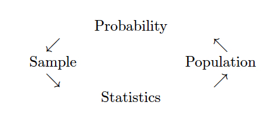

# Introduction {#intro}

## Course Logistics

**What is Statistics?**
Generally, statistics is the academic discipline which uses data to make claims and predictions about larger populations of interest.  It is the science of collecting, wrangling, visualizing, and analyzing data as a representation of a larger whole.  It is worth noting that probability represents the majority of mathematical tools used in statistics, but probability as a discipline does not work with data.  Having taken a probability class may help you with some of the mathematics covered in the course, but it is not a substitute for understanding the basics of introductory statistics.

<figure>

<figcaption> Probability vs. Statistics</figcaption> 
</figure>

* *descriptive statistics* describe the sample at hand with no intent on making generalizations.
* *inferential statistics* use a sample to make claims about a population

**What is the content of Math 154?**
This class will be an introduction to statistical methods that rely heavily on the use of computers.  The course will generally have three parts.  The first section will include communicating and working with data in a modern era.  This includes data wrangling, data visualization, data ethics, and collaborative research (via GitHub).  The second part of the course will focus on traditional statistical inference done through computational methods (e.g., permutation tests, bootstrapping, and regression smoothers).  The last part of the course will focus on machine learning ideas such as classification, clustering, and dimension reduction techniques.  Some of the methods were invented before the ubiquitous use of personal computers, but only because the calculus used to solve the problem was relatively straightforward (or because the method wasn't actually every used).  Some of the methods have been developed within the last few years. 

**Who should take Math 154?**
Computational Statistics will cover many of the concepts and tools for modern data analysis, and therefore the ideas are important for people who would like to do modern data analysis.  Some individuals may want to go to graduate school in statistics or data science, some may hope to become data scientists without additional graduate work, and some may hope to use modern techniques in other disciplines (e.g., computational biology, environmental analysis, or political science).  All of these groups of individuals will get a lot out of Computational Statistics as they turn to analyzing their own data.  Computational Statistics is not, however, a course which is necessary for entry into graduate school in statistics, mathematics, data science, or computer science.     

**What are the prerequisites for Math 154?**
Computational Statistics requires a strong background in both statistics as well as algorithmic thinking.  The formal prerequisite is any introductory statistics course, but if you have had only AP Statistics, you may find yourself working very hard in the first few weeks of the class to catch up.   If you have taken a lot of mathematics, there are parts of the course that will come easily to you.  However, a mathematics degree is not a substitute for introductory statistics, and if you have not taken introductory statistics, the majority of the course work will not be intuitive for you.   You must have taken a prior statistics course as a pre-requisite to Math 154; a computer science course is also recommended.

It is worth noting that probability represents the majority of mathematical tools used in statistics, but probability as a discipline does not work with data.  Having taken a probability class may help you with some of the mathematics covered in the course, but it is not a substitute for understanding the basics of introductory statistics. 

**Is there overlap with other classes?**
There are many machine learning and data science courses at the 5Cs which overlap with Math 154.  Those courses continue to be developed and change, so I cannot speak to all of them.  Generally, the Data Science courses taught in other 5C math departments focus slightly more on the mathematics of the tools (e.g., mathematically breaking down sparse matrices) and the Machine Learning courses taught in 5C CS departments focus on the programming aspects of the tools (e.g., how to code a Random Forest).  Our focus will be on the inferential aspect of the tools, that is, what do the results say about the larger problem which we are trying to solve?  How can we know the results are accurate?  What are the sources of variability? 

**When should I take Math 154?**
While the prerequisite for Computational Statistics is Introduction to Statistics, the course moves very quickly and covers a tremendous amount of material.  It is not ideally suited for a first year student coming straight out of AP Statistics.  Instead, that student should focus on taking more mathematics, CS, interdisciplinary science, or other statistics courses.  Most students taking Computational Statistics are juniors and seniors. 

**What is the workload for Math 154?**
There is one homework assignment per week, two in-class midterm exams, two take-home midterm exams, and a final end of the semester project.  Many students report working about 8-10 hours per week on this class.   

**What software will we use? Will there be any real world applications?  Will there be any mathematics?  Will there be any CS?**
All of the work will be done in R using RStudio as a front end.  You will need to either download R and RStudio (both are free) onto your own computer or use them on Pomona's server.  All assignments will be posted to private repositories on GitHub.  The class is a mix of many real world applications and case studies, some higher level math, programming, and communication skills.  The final project requires your own analysis of a dataset of your choosing.

* You may use R on the Pomona server:  https://rstudio.campus.pomona.edu/  (All Pomona students will be able to log in immediately.  Non-Pomona students need to go to ITS at Pomona to get Pomona login information.)
* If you want to use R on your own machine, you may.  Please make sure all components are updated:
R is freely available at http://www.r-project.org/ and is already installed on college computers. Additionally, installing R Studio is required http://rstudio.org/.
* http://swirlstats.com/ is one way to walk through learning the basics of R.
* All assignments should be turned in using R Markdown compiled to pdf.

<figure>

<figcaption> Taken from [Modern Drive: An introduction to statistical and data sciences via R](https://ismayc.github.io/moderndiver-book/), by Ismay and Kim</figcaption> 
</figure>

<figure>

<figcaption> [Jessica Ward](https://jkrward.github.io/), PhD student at Newcastle University</figcaption> 
</figure>

## Course Content

### Vocabulary
* A  **statistic** is a numerical measurement we get from the sample, a function of the data.
* A  **parameter** is a numerical measurement of the population.  We never know the true value of the parameter.
* An  **estimator** is a function of the unobserved data that tries to approximate the unknown parameter value.
* An  **estimate** is the value of the estimator for a given set of data.  [Estimate and statistic can be used interchangeably.]

> One of my goals for this course was to convince students that there are two major kinds of skills one must have in order to be a successful data scientist: technical skills to actually do the analyses; and communication skills in order to present one's findings to a presumably non-technical audience.  

With thanks to Ben Baumer for perspective and sharing course materials. [@Baumer15]

### The Workflow

<figure>

<figcaption> A schematic of the typical workflow used in data analysis.  Most statistics classes focus only on the left side.  We will work to address all aspects (including those on the right side). [@Baumer15]</figcaption> 
</figure>

<figure>

<figcaption> [Stitch Fix Algorithms Tour](http://algorithms-tour.stitchfix.com/)</figcaption> 
</figure>

### Principles for the Data Science Process
Duncan Temple Lang, University of California, Davis 

Duncan Temple-Lang is a leader in the area of combining computer science research concepts within the context of statistics and science more generally.  Recently, he was invited to participate in a workshop,  *Training Students to Extract Value from Big Data*.  The workshop was subsequently summarized in a manuscript of the same name and has been provided free of charge.  http://www.nap.edu/catalog.php?record_id=18981  [National Research Council.  *Training Students to Extract Value from Big Data: Summary of a Workshop*. Washington, DC: The National Academies Press, 2014.]

Duncan Temple Lang began by listing the core concepts of data science - items that will need to be taught: statistics and machine learning, computing and technologies, and domain knowledge of each problem. He stressed the importance of interpretation and reasoning - not only methods - in addressing data. Students who work in data science will have to have a broad set of skills - including knowledge of randomness and uncertainty, statistical methods, programming, and technology - and practical experience in them. Students tend to have had few computing and statistics classes on entering graduate school in a domain science.

Temple Lang then described the data analysis pipeline, outlining the steps in one example of a data analysis and exploration process:

1. Asking a general question.
2. Refining the question, identifying data, and understanding data and metadata. Temple Lang noted that the data used are usually not collected for the specific question at hand, so the original experiment and data set should be understood.
3. Access to data. This is unrelated to the science but does require computational skill.
4. Transforming to data structures.
5. Exploratory data analyses to understand the data and determine whether the results will scale.

This is a critical step; Temple Lang noted that 80 percent of a data scientist's time can be spent in cleaning and preparing the data.
6. Dimension reduction. Temple Lang stressed that it can be difficult or impossible to automate this step.
7. Modeling and estimation. Temple Lang noted that computer and machine learning scientists tend to focus more on predictive models than on modeling of physical behavior or characteristics.
8. Diagnostics. This helps to understand how well the model fits the data and identifies
anomalies and aspects for further study. This step has similarities to exploratory data analysis.
9. Quantifying uncertainty. Temple Lang indicated that quantifying uncertainty with statistical techniques is important for understanding and interpreting models and results.
10. Conveying results.

Temple Lang stressed that the data analysis process is highly interactive and iterative and requires the presence of a human in the loop. The next step in data processing is often not clear until the results of the current step are clear, and often something unexpected is uncovered. He also emphasized the importance of abstract skills and concepts and said that people need to be exposed to authentic data analyses, not only to the methods used. Data scientists also need to have a statistical understanding, and Temple Lang described the statistical concepts that should be taught to a student:

* Mapping the general question to a statistical framework.
* Understanding the scope of inference, sampling, biases, and limitations.
* Exploratory data analyses, including missing values, data quality, cleaning, matching, and fusing.
* Understanding randomness, variability, and uncertainty. Temple Lang noted that many
students do not understand sampling variability.
* Conditional dependence and heterogeneity.
* Dimension reduction, variable selection, and sparsity.
* Spurious relationships and multiple testing.
* Parameter estimation versus "black box" prediction and classification.
* Diagnostics, residuals, and comparing models.
* Quantifying the uncertainty of a model.
* Sampling structure and dependence for data reduction. Temple Lang noted that modeling of data becomes complicated when variables are not independent, identically distributed.
* Statistical accuracy versus computational complexity and efficiency.

Temple Lang then briefly discussed some of the practical aspects of computing, including the following:

* Accessing data.
* Manipulating raw data.
* Data structures and storage, including correlated data.
* Visualization at all stages (particularly in exploratory data analyses and conveying the results).
* Parallel computing, which can be challenging for a new student.
* Translating high-level descriptions to optimal programs.

During the discussion, Temple Lang proposed computing statistics on visualizations to examine data rigorously in a statistical and automated way. He explained that "scagnostics" (from scatter plot diagnostics) is a data analysis technique for graphically exploring the relationships among variables. A small set of statistical measures can characterize scatter plots, and exploratory data analysis can be conducted on the residuals. [More information about scagnostics can be found in (Wilkinson et al., 2005, 2006).]

A workshop participant noted the difference between a data error and a data blunder. A blunder is a large, easily noticeable mistake. The participant gave the example of shipboard observations of cloud cover; blunders, in that case, occur when the location of the ship observation is given to be on land rather than at sea. Another blunder would be a case of a ship's changing location too quickly. The participant speculated that such blunders could be generalized to detect problematic observations, although the tools would need to be scalable to be applied to large data sets.

## Reproducibility

### Need for Reproducibility

<figure>

<figcaption> slide taken from Kellie Ottoboni https://github.com/kellieotto/useR2016</figcaption> 
</figure>

####  Example 1
Science retracts gay marriage paper without agreement of lead author LaCour

* In May 2015 Science retracted a study of how canvassers can sway people's opinions about gay marriage published just 5 months prior.
* Science Editor-in-Chief Marcia McNutt: 
    * Original survey data not made available for independent reproduction of results. 
    * Survey incentives misrepresented. 
    * Sponsorship statement false.
* Two Berkeley grad students who attempted to replicate the study quickly discovered that the data must have been faked.
* Methods we'll discuss can't prevent this, but they can make it easier to discover issues.
* Source: http://news.sciencemag.org/policy/2015/05/science-retracts-gay-marriage-paper-without-lead-author-s-consent

### Example 2
Seizure study retracted after authors realize data got "terribly mixed"

* From the authors of Low Dose Lidocaine for Refractory Seizures in Preterm Neonates:

> The article has been retracted at the request of the authors. After carefully re-examining the data presented in the article, they identified that data of two different hospitals got terribly mixed. The published results cannot be reproduced in accordance with scientific and clinical correctness.

* Source: http://retractionwatch.com/2013/02/01/seizure-study-retracted-after-authors-realize-data-got-terribly-mixed/

### Example 3
Bad spreadsheet merge kills depression paper, quick fix resurrects it

* The authors informed the journal that the merge of lab results and other survey data used in the paper resulted in an error regarding the identification codes. Results of the analyses were based on the data set in which this error occurred. Further analyses established the results reported in this manuscript and interpretation of the data are not correct.

> Original conclusion: Lower levels of CSF IL-6 were associated with current depression and with future depression ... 

> Revised conclusion: Higher levels of CSF IL-6 and IL-8 were associated with current depression ... 

* Source: http://retractionwatch.com/2014/07/01/bad-spreadsheet-merge-kills-depression-paper-quick-fix-resurrects-it/

### Example 4

PNAS paper retracted due to problems with figure and reproducibility (April 2016):
http://cardiobrief.org/2016/04/06/pnas-paper-by-prominent-cardiologist-and-dean-retracted/

### Reproducible data analysis process

* Scriptability $\rightarrow$ R
* Literate programming $\rightarrow$ R Markdown
* Version control $\rightarrow$ Git / GitHub

 
#### {-} Scripting and literate programming

Donald Knuth "Literate Programming" (1983) 
> Let us change our traditional attitude to the construction of programs: Instead of imagining that our main task is to instruct a computer- what to do, let us concentrate rather on explaining to human beings- what we want a computer to do.

* The ideas of literate programming have been around for many years!
* and tools for putting them to practice have also been around
* but they have never been as accessible as the current tools

#### {-} Reproducibility checklist

* Are the tables and figures reproducible from the code and data?
* Does the code actually do what you think it does?
* In addition to what was done, is it clear why it was done? (e.g., how were parameter settings chosen?)
* Can the code be used for other data?
* Can you extend the code to do other things?

#### {-} Tools: R & R Studio

See this great video (less than 2 min) on a reproducible workflow: https://www.youtube.com/watch?v=s3JldKoA0zw&feature=youtu.be

* You must use both R and RStudio software programs
* R does the programming
* R Studio brings everything together
* You may use Pomona's server: https://rstudio.pomona.edu/
* See course website for getting started: http://research.pomona.edu/johardin/math154f19/

#### {-} Tools: GitHub

* You must submit your assignments via GitHub
* Follow Jenny Bryan's advice on how to get set-up: http://happygitwithr.com/
* Follow Jacob Fiksel's advice on how to connect to our classroom: https://github.com/jfiksel/github-classroom-for-students

#### {-} Tools: a GitHub merge conflict (demo)

* On GitHub (on the web) edit the README document and Commit it with a message describing what you did.
* Then, in RStudio also edit the README document with a different change.
    * Commit your changes
    * Try to push $rightarrow$ you'll get an error!
    * Try pulling
    * Resolve the merge conflict and then commit and push
* As you work in teams you will run into merge conflicts, learning how to resolve them properly will be very important.

#### {-} Steps for weekly homework

1. You will get a link to the new assignment (clicking on the link will create a new private repo)  
2. Use R Studio  
    * New Project, version control, Git  
    * Clone the repo using SSH  
3. If it exists, rename the Rmd file to ma154-hw#-lname-fname.Rmd  
4.  Do the assignment  
    *  `commit` and  `push` after every problem  
5. All necessary files  *must* be in the same folder (e.g., data)  

## Data Examples

#### {-} What can/can't Data Science Do?
* Can model the data at hand!
* Can find patterns & visualizations in large datasets.
* Can't establish causation.
* Can't represent data if it isn't there.

#### {-} Stats / Data Science / Math are not apolitical

* "Inner city crime is reaching record levels"  (Donald Trump, 8/30/16)
* "The unemployment rate for African-American youth is 59 percent" (Donald Trump 6/20/16)
* "Two million more Latinos are in poverty today than when President Obama took his oath of office less than eight years ago" (Donald Trump 8/25/16)
* "We are now, for the first time ever, energy independent" (Hillary Clinton 8/10/16)
* "If you look worldwide, the number of terrorist incidents have not substantially increased" (Barack Obama 10/13/16)
* "Illegal immigration is lower than it's been in 40 years" (Barack Obama, 3/17/16)

Source: http://www.politifact.com/truth-o-meter/statements/

### College Rankings Systems

**Cheating**

> Bucknell University lied about SAT averages from 2006 to 2012, and Emory University sent in biased SAT scores and class ranks for at least 11 years, starting in 2000. Iona College admitted to fudging SAT scores, graduation rates, retention rates, acceptance rates, and student-to-faculty ratios in order to move from 50th place to 30th for nine years before it was discovered.  ( **Weapons of Math Destruction**, O'Neil, https://weaponsofmathdestructionbook.com/ and http://www.slate.com/articles/business/moneybox/2016/09/how_big_data_made_applying_to_college_tougher_crueler_and_more_expensive.html) 

**Gaming the system**

> Point by point, senior staff members tackled different criteria, always with an eye to U.S. News's methodology. Freeland added faculty, for instance, to reduce class size. "We did play other kinds of games," he says. "You get credit for the number of classes you have under 20 [students], so we lowered our caps on a lot of our classes to 19 just to make sure." From 1996 to the 2003 edition (released in 2002), Northeastern rose 20 spots. ( *14 Reasons Why US News College Rankings are Meaningless* http://www.liberalartscolleges.com/us-news-college-rankings-meaningless/)

No way to measure "quality of education"

What is "best"?  A big part of the ranking system has to do with peer-assessed reputation (feedback loop!).

### Trump and Twitter

Analysis of Trump's tweets with evidence that someone else tweets from his account using an iPhone
*  http://varianceexplained.org/r/trump-tweets/

> My analysis, shown below, concludes that the Android and iPhone tweets are clearly from different people, posting during different times of day and using hashtags, links, and retweets in distinct ways. What?s more, we can see that the Android tweets are angrier and more negative, while the iPhone tweets tend to be benign announcements and pictures.

* http://varianceexplained.org/r/trump-followup/

> *There is a year of new data, with over 2700 more tweets. And quite notably, Trump stopped using the Android in March 2017.} This is why machine learning approaches like http://didtrumptweetit.com/ are useful, since they can still distinguish Trump?s tweets from his campaign?s by training on the kinds of features I used in my original post.

> *I've found a better dataset: in my original analysis, I was working quickly and used the `twitteR` package (https://cran.r-project.org/web/packages/twitteR/) to query Trump?s tweets. I since learned there?s a bug in the package that caused it to retrieve only about half the tweets that could have been retrieved, and in any case I was able to go back only to January 2016. I've since found the truly excellent Trump Twitter Archive (http://www.trumptwitterarchive.com/), which contains all of Trump's tweets going back to 2009. Below I show some R code for querying it.

> *I've heard some interesting questions that I wanted to follow up on: These come from the comments on the original post and other conversations I've had since. Two questions included what device Trump tended to use before the campaign, and what types of tweets tended to lead to high engagement.

### Can Twitter Predict Election Results?

<!--
http://www.math.smith.edu/~bbaumer/mth292-f14/
-->

In 2013, @DiGrazia13 published a provocative paper suggesting that polling could now be replaced by analyzing social media data.  They analyzed 406 competitive US congressional races using over 3.5 billion tweets.  In an article in  *The Washington Post* one of the co-authors, Rojas, writes: ``Anyone with programming skills can write a program that will harvest tweets, sort them for content and analyze the results.  This can be done with nothing more than a laptop computer." [@Rojas13]

What makes using Tweets to predict elections relevant to our class? (See @Baumer15.)

1. The data come from neither an experiment nor a random sample - there must be careful thought applied to the question of  *to whom} the analysis can be generalized.  The data were also scraped from the internet.
2. The analysis was done combining domain knowledge (about congressional races) with a data source that seems completely irrelevant at the outset (tweets).
3. The dataset was quite large!  3.5 billion tweets were collected and a random sample of 500,000 tweets were analyzed.
4. The researchers were from sociology and computer science - a truly collaborative endeavor, and one that is often quite efficient at producing high quality analyses.

#### {-} Activity

Spend a few minutes reading the Rojas editorial and skimming the actual paper. Be sure to consider Figure 1 and Table 1 carefully, and address the following questions.
* working paper: http://papers.ssrn.com/sol3/papers.cfm?abstract_id=2235423 
* published in  *PLoS ONE*: http://journals.plos.org/plosone/article?id=10.1371/journal.pone.0079449   DiGrazia J, McKelvey K, Bollen J, Rojas F (2013) More Tweets, More Votes: Social Media as a Quantitative Indicator of Political Behavior.  *PLoS ONE 8* (11): e79449. 
* editorial in  *The Washington Post* by Rojas: http://www.washingtonpost.com/opinions/how-twitter-can-predict-an-election/2013/08/11/35ef885a-0108-11e3-96a8-d3b921c0924a_story.html
* editorial in the Huffington Post by Linkins: http://www.huffingtonpost.com/2013/08/14/twitter-predict-elections_n_3755326.html
* editorial blog by Gelman: http://andrewgelman.com/2013/04/24/the-tweets-votes-curve/

#### {-} Statistics Hat
1. Write a sentence summarizing the findings of the paper.
2. Discuss Figure 1 with your neighbor. What is its purpose? What does it convey? Think critically about this data visualization. What would you do differently? 
    * should be proportion for the response variable. The bizarre scaling could dramatically change the results 
    * dots could then be scaled in proportion to the number of tweets 
    * linear fit may be questionable. 
    * How would you improve the plot?  I.e., annotate it to make it more convincing / communicative?  Does it need enhancement? 
3. Interpret the coefficient of `Republican Tweet Share` in both models shown in Table 1. Be sure to include units.
4. Discuss with your neighbor the differences between the `Bivariate` model and the `Full Model`. Which one do you think does a better job of predicting the outcome of an election? Which one do you think best addresses the influence of tweets on an election? 
    * $R^2$ is way higher after control variables are included, but duh! 
    * the full model will likely do a better job of predicting
5. Why do you suppose that the coefficient of `Republican Tweet Share` is so much larger in the `Bivariate` model? How does this reflect on the influence of tweets in an election? 
    * After controlling for how many Republicans are in the district, most of the effect disappears 
    * While the coefficient of the main term is still statistically significant, the size of the coefficient
    * (155 +/- 43 votes) is of little practical significance
6. Do you think the study holds water? Why or why not? What are the shortcomings of this study? 
    * Not really. First of all, how many of these races are actually competitive? It's not 406, it's probably fewer than 100. If you redid the study on that sample, would the tweet share still be statistically significant in the full model?

#### {-} Data Scientist Hat
Imagine that your boss, who does not have advanced technical skills or knowledge, asked you to reproduce the study you just read. Discuss the following with your neighbor.

1. What steps are necessary to reproduce this study? Be as specific as you can! Try to list the subtasks that you would have to perform.
2. What computational tools would you use for each task? 
Identify all the steps necessary to conduct the study.  Could you do it given your current abilities & knowledge?  What about the practical considerations?  (1) How do you download from Twitter?  (2) What is an API (Application Programming Interface), and how does R interface with APIs?  (3) How hard is it to store 3.5 billion tweets?  (4) How big is a tweet?  (5) How do you know which congressional district the person who tweeted was in?   

How much storage  *does* it take to download 3.5 billion tweets? = 2000+ Gb = 2+ Tb (your hard drive is likely 1Tb, unless you have a small computer).  Can you explain the billions of tweets stored at Indiana University?  How would you randomly sample from the database?  One tweet is about 2/3 of a Kb.

#### {-} Advantages
* Cheap
* Can measure any political race (not just the wealthy ones).

#### {-} Disadvantages
* Is it really reflective of the voting populace?  Who would it bias toward?
* Does simple mention of a candidate always reflect voting patterns?  When wouldn't it?
* Margin of error of 2.7%.  How is that number typically calculated in a poll?  Note: $2 \cdot \sqrt{(1/2)(1/2)/1000} = 0.0316$.
* Tweets feel more free in terms of what you are able to say - is that a good thing or a bad thing with respect to polling?
* Can't measure any demographic information.

#### {-} What could be done differently?
* Gelman:  look only at close races
* Gelman: "It might make sense to flip it around and predict twitter mentions given candidate popularity. That is, rotate the graph 90 degrees, and see how much variation there is in tweet shares for elections of different degrees of closeness."
* Gelman: "And scale the size of each dot to the total number of tweets for the two candidates in the election."
* Gelman: Make the data publicly available so that others can try to reproduce the results

#### {-} Tweeting and R

The twitter analysis requires a twitter password, and sorry, I won't give you mine.  If you want to download tweets, follow the instructions at http://stats.seandolinar.com/collecting-twitter-data-introduction/  or maybe one of these: https://www.credera.com/blog/business-intelligence/twitter-analytics-using-r-part-1-extract-tweets/ and  http://davetang.org/muse/2013/04/06/using-the-r_twitter-package/  and ask me if you have any questions.

