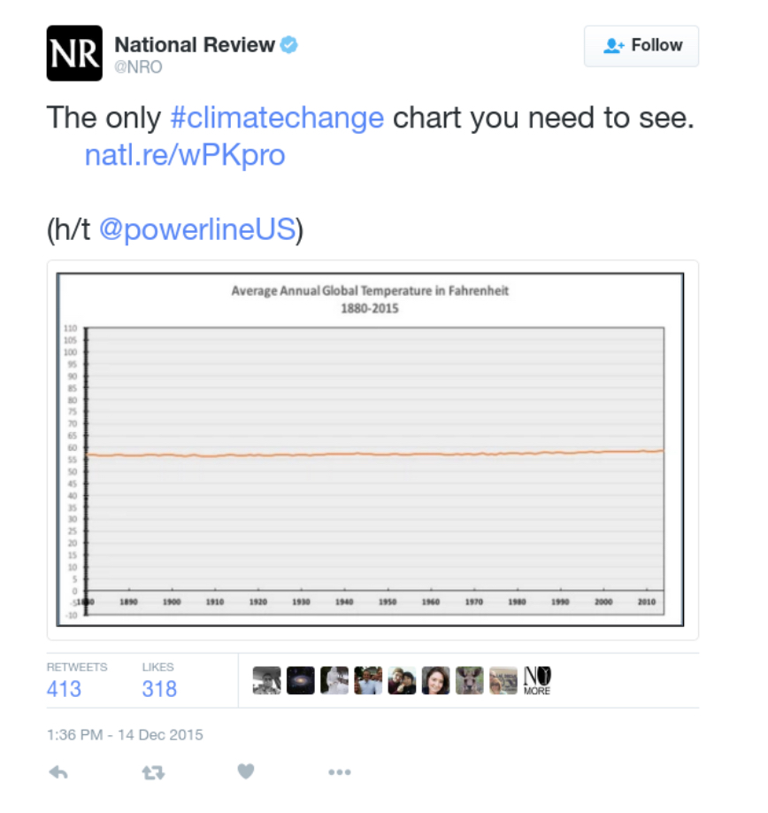
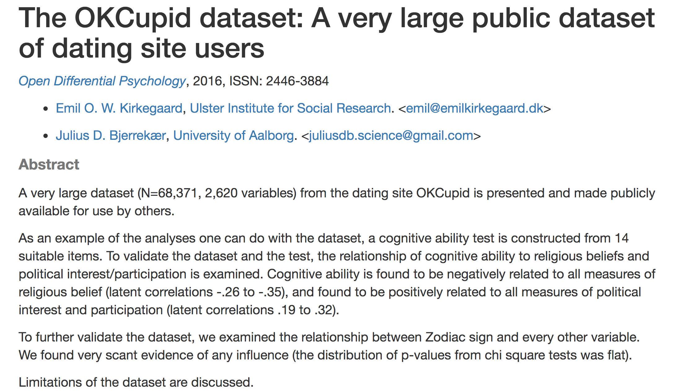
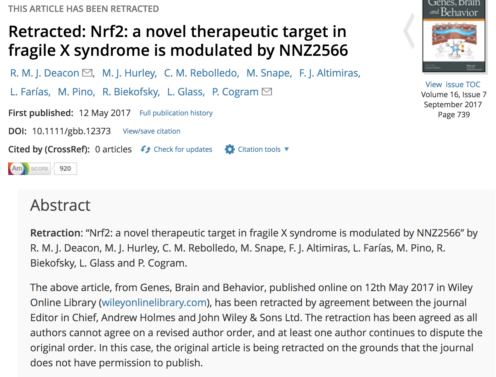
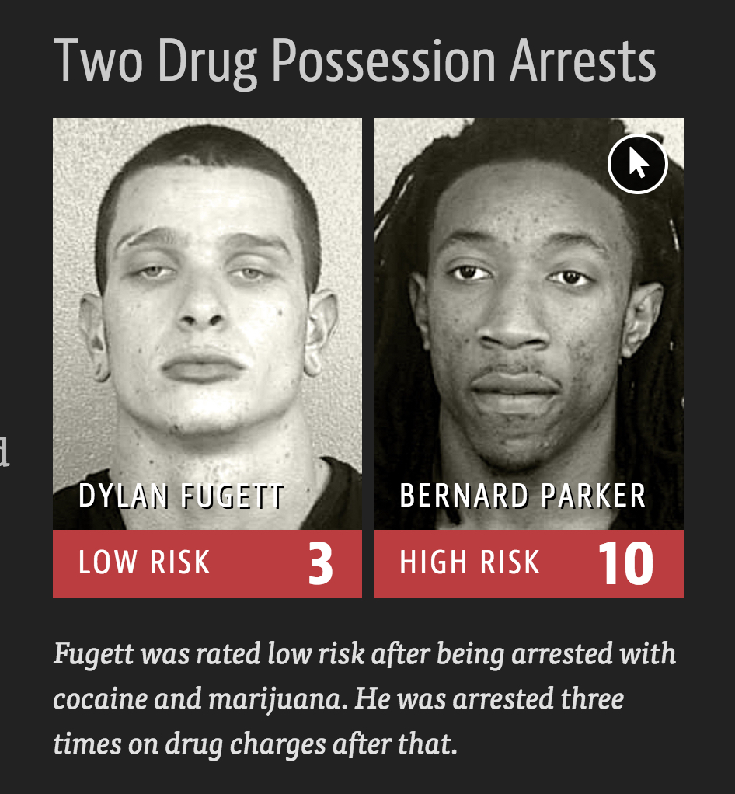
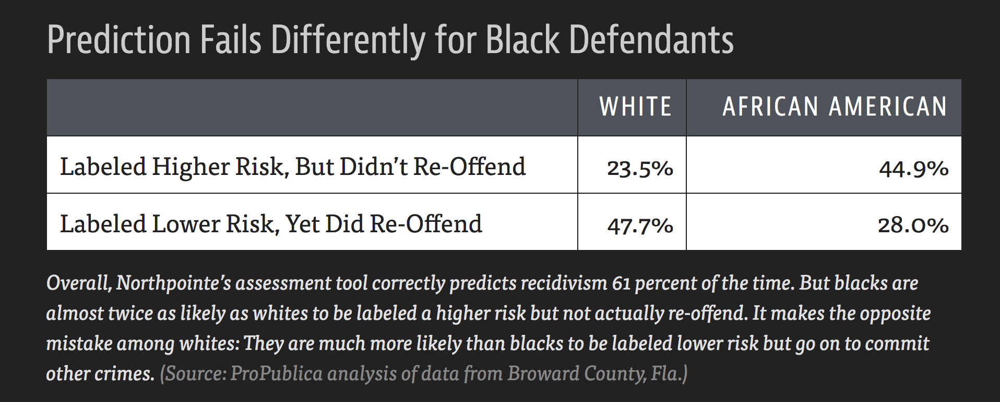

# Ethics {#ethics}

```{r, include=FALSE, eval=TRUE, echo=FALSE, warning=FALSE, message=FALSE}
knitr::opts_chunk$set(message=FALSE, warning=FALSE, 
                      fig.height=3, fig.width=5,  
                      cache=TRUE, fig.align = "center")

library(tidyverse)
```

## 10/24/19 Agenda {#Oct24}
1. graphics
2. p-hacking
3. human subjects research
4. authorship
5. algorithms
6. guided ethical principles


## Doing Data Science

Questions to ask yourself in every single data analysis you perform (taken from Data Science for Social Good at the University of Chicago https://dssg.uchicago.edu/):

* What biases may exist in the data you've been given?  How can you find out?
* How will your choices with tuning parameters affect different populations represented in the data?
* How do you know you aren't getting the right answer to the wrong question?
* How would you justify what you'd built to someone whose welfare is made worse off by the implementation of your algorithm?
* See the section on bias in modeling (\@ref(biasmodels)) for times when there are no inherent biases but the structure of the data create unequal model results.

## Graphics

There are so many ways to lie with graphics.  You may already be familiar with the book *How to Lie with Statistics}.  Many of the ideas are replicated here: http://www.rci.rutgers.edu/~roos/Courses/grstat502/wainer.pdf  [just the plots are provided here: http://www.stat.berkeley.edu/~nolan/stat133/Fall05/lectures/DirtyDozen.pdf]

For a recent and relevant example, consider the following image.  What do you think is wrong?  (Hint: examine the y-axis carefully)


```{r fig.cap = "Reproduction of a data graphic reporting the number of gun deaths in Florida over time. The original image was published by Reuters.  [@MDSR]", out.width='100%', fig.align='center', echo=FALSE}
knitr::include_graphics("figs/FLguns.jpg")
```

<!--
% reuters image: http://graphics.thomsonreuters.com/14/02/US-FLORIDA0214.gif
% graphic designer: https://twitter.com/ChristineHHChan/status/455971685783441408
% https://www.reddit.com/r/politicalfactchecking/comments/23gi0k/did_the_reuters_graph_on_gun_deaths_in_flordia/
-->

Or another plot that has gotten a lot of press is the following.  What is wrong with this plot?  (Hint:  again, think about the y-axis)


```{r fig.cap = "A tweet by *National Review* on December 14, 2015 showing the change in global temperature over time.  [@MDSR]", out.width='100%', fig.align='center', echo=FALSE}

```

## p-hacking

J. Ioannidis, *Why most published research findings are false*.  PLoS Medicine, 2. e124 2005.  Ioannidis  focuses on multiple testing with specific understanding of the effect of testing in three different contexts:


1. When looking for as many possible significant findings as possible (publish or perish)
2. When bias exists in our work
3. When the researchers study the same effect


### Multiple Studies

* $\alpha$
    * If a study is null, the probability of seeing null is $(1-\alpha)$
    * If 3 of us test the same thing, the probability that we will all see null is $(1-\alpha)^3$
    * *and* the probability that at least one of use will see significance goes from $\alpha$ to $1 - (1-\alpha)^3$
    * As $n \uparrow$ someone will definitely see significance (bad!)
* $\beta$
    * If a study is significant, the probability of seeing null is $\beta$
    * If 3 of us test the same thing, the probability that we'll all see null is $\beta^3$
    * *and* the probability that at least one of us will see significance goes from $(1-\beta)$ to $(1-\beta^3)$
    * As $n \uparrow$, someone will definitely see significance (good!)

### p-values


* In 1929 RA Fisher said the following (and thus 0.05 was born):

> ...An observation is judged significant, if it would rarely have been produced, in the absence of a real cause of the kind we are seeking. <p style="color:red">It is a common practice to judge a result significant, if it is of such a magnitude that it would have been produced by chance not more frequently than once in twenty trials. This is an arbitrary, but convenient, level of significance for the practical investigator, but it does not mean that he allows himself to be deceived once in every twenty experiments. The test of significance only tells him what to ignore, namely all experiments in which significant results are not obtained.</p> He should only claim that a phenomenon is experimentally demonstrable when he knows how to design an experiment so that it will rarely fail to give a significant result. Consequently, isolated significant results which he does not know how to reproduce are left in suspense pending further investigation.


Note the Fisher is telling us that studies with p-values above 0.05 are not worth pursuing.  He is *not* saying the studies with p-values less than 0.05 establish any sort of truth.

* In 2014 George Cobb (Amherst College) posed the following questions:

Q:  Why do so many colleges and grad schools teach p = .05?

A:  Because that's still what the scientific community and journal editors use.


Q:  Why do so many people still use p = 0.05?

A:  Because that's what they were taught in college or grad school.

* In 2015, *Basic and Applied Social Psychology*  banned all NHSTP (null hypothesis significance testing procedures) from scientific articles.

What are the implications for authors? 
http://www.tandfonline.com/doi/full/10.1080/01973533.2015.1012991

Question 3. Are any inferential statistical procedures required? 

Answer to Question 3. No, because the state of the art remains uncertain. However, BASP will require strong descriptive statistics, including effect sizes. We also encourage the presentation of frequency or distributional data when this is feasible. Finally, we encourage the use of larger sample sizes than is typical in much psychology research, because as the sample size increases, descriptive statistics become increasingly stable and sampling error is less of a problem. However, we will stop short of requiring particular sample sizes, because it is possible to imagine circumstances where more typical sample sizes might be justifiable.

* Many people think CIs are far superior to p-values.  Not only can you assess significance, but you can also assess effect size.  Here is a video that makes clear the comparison between a p-value and a confidence interval:

https://www.youtube.com/watch?v=5OL1RqHrZQ8

* In 2016, the American Statistical Association came out with a statement on p-values http://amstat.tandfonline.com/doi/abs/10.1080/00031305.2016.1154108.  The 6 main tenants of the statement are:

1. P-values can indicate how incompatible the data are with a specified statistical model.

2. P-values do not measure the probability that the studied hypothesis is true, or the probability that the data were produced by random chance alone.

3. Scientific conclusions and business or policy decisions should not be based only on whether a p- value passes a specific threshold.

4. Proper inference requires full reporting and transparency.

5. A p-value, or statistical significance, does not measure the size of an effect or the importance of a result.

6. By itself, a p-value does not provide a good measure of evidence regarding a model or hypothesis.


* "Statisticians issue warning over misuse of P values"  (**Nature**, March 7, 2016) http://www.nature.com/news/statisticians-issue-warning-over-misuse-of-p-values-1.19503

* Many people think CIs are far superior to p-values.  Not only can you assess significance, but you can also assess effect size.  Here is a video that makes clear the comparison between a p-value and a confidence interval, it also addresses how p-values can be misinterpreted.  The Dance of the P-values (think about power when you watch it): https://www.youtube.com/watch?v=5OL1RqHrZQ8

* Last, you can discover your own level of significance through this activity: https://www.openintro.org/stat/why05.php?stat_book=os


## Human Subjects Research

There are many ways to learn about federal regulations on studying human subjects.  Any study that goes through an academic institution must be approved by the institution's Institutional Review Board (IRB); each of the Claremont Colleges has an IRB.  Some of you may be familiar with HIPPA (Health Insurance Portability and Accountability Act of 1996) which is United States legislation that provides data privacy and security provisions for safeguarding medical information.  HIPPA is also the legislation that keeps your academic records private.

Training in IRB policies can be found by Citi Program here: https://about.citiprogram.org/en/series/human-subjects-research-hsr/

Consider the following article: Cami Gearhart, "IRB Review of the Use of
Social Media in Research", **Monitor**, 2012.  https://www.quorumreview.com/wp-content/uploads/2012/12/IRB-Review-of-the-Use-of-Social-Media-in-Research_Gearhart_Quorum-Review_Monitor_2012_12_01.pdf


> The use of interactive social media to collect information during study recruitment raises additional issues under the HIPAA Privacy Rule. The Privacy Rule prohibits the collection of an individual?s personal health information (or PHI) by a covered entity without prior written authorization from that individual.18 As PHI includes an individual?s contact information, including name, age, e-mail address, and mailing address, the Privacy Rule prohibits the collection of contact information via a website without prior authorization.

>This rule creates a conundrum when using social media, as it may be impractical to obtain a written authorization prior to collecting contact information during the recruitment process. To get around this restriction, a researcher generally must obtain a partial waiver of the HIPAA authorization requirement. (A waiver in this situation is considered "partial" because it is needed only for the recruitment phase of the clinical study.) A researcher can apply to either an IRB or a privacy board for such a waiver; the researcher will be asked to explain why it is impractical to obtain written authorizations, the plan for collecting information, and the planned safeguards for the data.


Also keep in mind the various laws which are designed to protect privacy and civil liberties.  Just because you didn't try to build an algorithm that is biased against a protected group does not mean that you are off the hook.  There are two ways that laws are enforced (both equally important):

1. disparate treatment $\rightarrow$ means that the differential treatment is intentional

2. disparate impact $\rightarrow$ means that the differential treatment is unintentional or implicit (some examples include advancing mortgage credit, employment selection, predictive policing)

#### Anti-discrimination Laws {-}

* Civil Rights Acts of 1964 and 1991
* Americans with Disabilities Act
* Genetic Information Nondiscrimination Act
* Equal Credit Opportunity Act
* Fair Housing Act


#### OKCupid {-}
Consider a study done on a dataset of nearly 70,000 users of the online dating site OkCupid (including usernames, age, gender, location, relationship interests, personality traits, and many other profile variables).  The authors did not violate any technical policies such as breaking passwords.  However, their work indicates a violation of privacy ethics as indicated by HIPPA and use of IRBs.  [Kirkegaard and Bjerrekaer, "The OKCupid dataset: A very large public dataset of dating site users," *Open Differential Pyschology*, 2016.] https://openpsych.net/paper/46


```{r fig.cap = "Not only is it worth discussing the ethics of how the data were collected, but it also seems like maybe the study did some p-hacking.", out.width='100%', fig.align='center', echo=FALSE}

```

## Authorship


From the International Committee of Medical Journal Editors, http://www.icmje.org/recommendations/browse/roles-and-responsibilities/defining-the-role-of-authors-and-contributors.html.  Many other organizations have suggested guidelines for authorship, but such guidelines generally follow the same criteria.

#### Authors {-}
1. Substantial contributions to the conception or design of the work; or the acquisition, analysis, or interpretation of data for the work; AND
2. Drafting the work or revising it critically for important intellectual content; AND
3. Final approval of the version to be published; AND
4. Agreement to be accountable for all aspects of the work in ensuring that questions related to the accuracy or integrity of any part of the work are appropriately investigated and resolved.

#### Non-authors {-}

> Contributors who meet fewer than all 4 of the above criteria for authorship should not be listed as authors, but they should be acknowledged. Examples of activities that alone (without other contributions) do not qualify a contributor for authorship are acquisition of funding; general supervision of a research group or general administrative support; and writing assistance, technical editing, language editing, and proofreading. 


```{r fig.cap = "The paper was retracted because the authors could not agree on the order of authorship.", out.width='100%', fig.align='center', echo=FALSE}

```

## Algorithms

We could spend days talking about bias in algorithms.  The take away from the examples below is that the data that is used to *train* the model can have huge effects on the creation of the model.  A fantastic book on the issue is **Weapons of Math Destruction** by Cathy O'Neil.   A podcast about the book is at: https://99percentinvisible.org/episode/the-age-of-the-algorithm/.  

### Sentencing {-}

"Machine Bias" in *Pro Publica* by Julia Angwin, Jeff Larson, Surya Mattu, and Lauren Kirchner, May 23, 2016 https://www.propublica.org/article/machine-bias-risk-assessments-in-criminal-sentencing/


```{r fig.cap = "Dylan Fugett had three subsequent arrests for drug possession.  Bernard Parker had no subsequent offenses.", out.width='100%', fig.align='center', echo=FALSE}

```


\begin{tabular}{l|l}
DYLAN FUGETT & BERNARD PARKER\\
\hline
Prior Offense & Prior Offense\\
1 attempted burglary & 1 resisting arrest without violence\\
LOW RISK3 & HIGH RISK10\\
\hline
Subsequent Offenses & Subsequent Offenses\\
3 drug possessions & None\\
\end{tabular}


```{r fig.cap = "False positive and false negative rates broken down by race.", out.width='100%', fig.align='center', echo=FALSE}

```

### Algorithmic Justice League {-}

https://www.ajlunited.org/

The Algorithmic Justice League is a collective that aims to:
* Highlight algorithmic bias through media, art, and science
* Provide space for people to voice concerns and experiences with coded bias
* Develop practices for accountability during design, development, and deployment of coded systems

### Sentiment Analysis {-}

https://blog.dominodatalab.com/video-how-machine-learning-amplifies-societal-privilege/

In this talk, Mike Williams, Research Engineer at Fast Forward Labs, looks at how supervised machine learning has the potential to amplify power and privilege in society.  Using sentiment analysis, he demonstrates how text analytics often favors the voices of men. Mike discusses how bias can inadvertently be introduced into any model, and how to recognize and mitigate these harms.


> There isn't an option which is objective and fair.  That option doesn't exist... The whole premise is based on bias in your training set.  If there are no biases, there are no patterns in your training set.  Then the system is not going to work... Supervised machine learning, when it goes really well, when you do a really good job, reproduces the biases in the training data.


#### R packages {-}

* **wru**
Who are You? Bayesian Prediction of Racial Category Using Surname and Geolocation  \url{https://cran.r-project.org/web/packages/wru/index.html}
* **tm**
A framework for text mining applications within R. https://cran.r-project.org/web/packages/tm/vignettes/tm.pdf
* **RSentiment**
Analyses sentiment of a sentence in English and assigns score to it. It can classify sentences to the following categories of sentiments:- Positive, Negative, very Positive, very negative, Neutral. For a vector of sentences, it counts the number of sentences in each category of sentiment.In calculating the score, negation and various degrees of adjectives are taken into consideration. It deals only with English sentences. https://cran.r-project.org/web/packages/RSentiment/index.html
* **SentimentAnalysis**
Performs a sentiment analysis of textual contents in R. This implementation utilizes various existing dictionaries, such as Harvard IV, or finance-specific dictionaries. Furthermore, it can also create customized dictionaries. The latter uses LASSO regularization as a statistical approach to select relevant terms based on an exogenous response variable. https://cran.r-project.org/web/packages/SentimentAnalysis/index.html

## Guiding Ethical Principles

From @MDSR:
1. Do your work well by your own standards and by the standards of your profession (avoid using your skills in a way that is effectively lying - leading others to believe one thing when in fact something different is true).
2. Recognize the parties to whom you have a special professional obligation (you should worry about conflict of interest!).
3. Report results and methods honestly and respect your responsibility to identify and report flaws and shortcomings in your work (don't be over-confident, do use reproducible methods).


### ASA Ethical Guidelines for Statistical Practice {-}


http://www.amstat.org/ASA/Your-Career/Ethical-Guidelines-for-Statistical-Practice.aspx


#### Professional Integrity and Accountability {-}
The ethical statistician uses methodology and data that are relevant and appropriate, without favoritism or prejudice, and in a manner intended to produce valid, interpretable, and reproducible results. The ethical statistician does not knowingly accept work for which he/she is not sufficiently qualified, is honest with the client about any limitation of expertise, and consults other statisticians when necessary or in doubt.

#### Integrity of Data and Methods {-}
The ethical statistician is candid about any known or suspected limitations, defects, or biases in the data that may impact the integrity or reliability of the statistical analysis. Objective and valid interpretation of the results requires that the underlying analysis recognizes and acknowledges the degree of reliability and integrity of the data.

#### Responsibilities to Science/Public/Funder/Client {-}
The ethical statistician supports valid inferences, transparency, and good science in general, keeping the interests of the public, funder, client, or customer in mind (as well as professional colleagues, patients, the public, and the scientific community).

#### Responsibilities to Research Subjects {-}
The ethical statistician protects and respects the rights and interests of human and animal subjects at all stages of their involvement in a project. This includes respondents to the census or to surveys, those whose data are contained in administrative records, and subjects of physically or psychologically invasive research.

#### Responsibilities to Research Team Colleagues {-}
Science and statistical practice are often conducted in teams made up of professionals with different professional standards. The statistician must know how to work ethically in this environment.

#### Responsibilities to Other Statisticians or Statistics Practitioners {-}
The practice of statistics requires consideration of the entire range of possible explanations for observed phenomena, and distinct observers drawing on their own unique sets of experiences can arrive at different and potentially diverging judgments about the plausibility of different explanations. Even in adversarial settings, discourse tends to be most successful when statisticians treat one another with mutual respect and focus on scientific principles, methodology and the sub- stance of data interpretations.

#### Responsibilities Regarding Allegations of Misconduct {-}
The ethical statistician understands the difference between questionable scientific practices and practices that constitute misconduct, avoids both, but knows how each should be handled.

#### Responsibilities of Employers, Including Organizations, Individuals, Attorneys, or Other Clients Employing Statistical Practitioners {-}
Those employing any person to analyze data are implicitly relying on the profession's reputation for objectivity. However, this creates an obligation on the part of the employer to understand and respect statisticians' obligation of objectivity.

