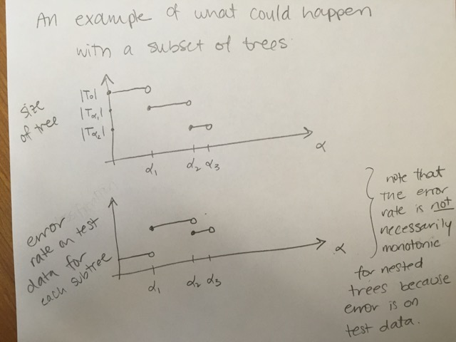

# Classification {#class}

```{r, include=FALSE, eval=TRUE, echo=FALSE, warning=FALSE, message=FALSE}
knitr::opts_chunk$set(message=FALSE, warning=FALSE, 
                      fig.height=3, fig.width=5,  
                      cache=TRUE, fig.align = "center")

library(tidyverse)
library(caret)
```

## 10/29/19 Agenda {#Oct29}
1. classification
2. $k$-Nearest Neighbors
3. bias-variance trade-off
4. cross validation


**Important Note**:  For the majority of the classification and clustering methods, we will use the `caret` package in R.  For more information see: http://topepo.github.io/caret/index.html

Also, check out the `caret` cheat sheet:  https://github.com/rstudio/cheatsheets/raw/master/caret.pdf

@Baumer15 provides a concise explanation of how both statistics and data science work to enhance ideas of machine learning, one aspect of which is classification:


> In order to understand machine learning, one must recognize the differences between the mindset of the data miner and the statistician, notably characterized by @brei01, who distinguished two types of models f for y, the response variable, and x, a vector of explanatory variables. One might consider a *data model* f such that y $\sim$ f(x), assess whether f could reasonably have been the process that generated y from x, and then make inferences about f. The goal here is to learn about the real process that generated y from x, and the conceit is

> Alternatively, one might construct an *algorithmic model* f, such that $y \sim f(x)$, and use f to predict unobserved values of y. If it can be determined that f does in fact do a good job of predicting values of y, one might not care to learn much about f. In the former case, since we want to learn about f, a simpler model may be preferred. Conversely, in the latter case, since we want to predict new values of y, we may be indifferent to model complexity (other than concerns about overfitting and scalability).


Classification is a supervised learning technique to extract general patterns from the data in order to build a predictor for a new test or validation data set.  That is, the model should *classify* new points into groups (or with a numerical response values) based on a model built from a set of data which provides known group membership for each value.  For most of the methods below, we will consider classifying into categories (in fact, usually only two categories), but sometimes (e.g., support vector machines and linear regression) the goal is to predict a numeric variable.

Some examples of classification techniques include: linear regression, logistic regression, neural networks, **classification trees**, **random forests**, **k-nearest neighbors**, **support vector machines**, n&auml;ive Bayes, and linear discriminant analysis.  We will cover the methods in **bold**.

**Simple is Better**  (From @field07, p. 87)

1. We want to avoid over-fitting the model (certainly, it is a bad idea to model the noise!)
2. Future prediction performance goes down with too many predictors.
3. Simple models provide better insight into causality and specific associations.
4. Fewer predictors implies fewer variables to collect in later studies.

That said, the model should still represent the complexity of the data!  We describe the trade-off above as the "bias-variance" trade-off. In order to fully understand that trade-off, let's first cover the classification method known as $k$-Nearest Neighbors.


## Cross Validation {#cv}

### Bias-variance trade-off

* **Variance** refers to the amount by which $\hat{f}$ would change if we estimated it using a different training set.  Generally, the closer the model fits the data, the more variable it will be (it'll be different for each data set!).  A model with many many explanatory variables will often fit the data too closely.

* **Bias** refers to the error that is introduced by approximating the "truth" by a model which is too simple. For example, we often use linear models to describe complex relationships, but it is unlikely that any real life situation actually has a *true* linear model.  However, if the true relationship is close to linear, then the linear model will have a low bias.

Generally, the simpler the model, the lower the variance.  The more complicated the model, the lower the bias.  In this class, cross validation will be used to assess model fit.  [If time permits, Receiver Operating Characteristic (ROC) curves will also be covered.]


\begin{align}
\mbox{prediction error } = \mbox{ irreducible error } + \mbox{ bias } + \mbox{ variance}
\end{align}

* **irreducible error**  The irreducible error is the natural variability that comes with observations.  No matter how good the model is, we will never be able to predict perfectly.
* **bias**  The bias of the model represents the difference between the true model and a model which is too simple.  That is, with more complicated models (e.g., smaller $k$ in $k$NN) the closer the points are to the prediction.  As the model gets more complicated (e.g., as $k$ decreases), the bias goes down.
* **variance**  The variance represents the variability of the model from sample to sample.  That is, a simple model (big $k$ in $k$NN) would not change a lot from sample to sample.  The variance decreases as the model becomes more simple (e.g., as $k$ increases).


Note the bias-variance trade-off.  We want our prediction error to be small, so we choose a model that is medium with respect to both bias and variance.  We cannot control the irreducible error.

```{r fig.cap = "Test and training error as a function of model complexity.  Note that the error goes down monotonically only for the training data.  Be careful not to overfit!!  [@ESL]", out.width='100%', fig.align='center', echo=FALSE}
knitr::include_graphics("figs/varbias.png")
```


The following visualization does an excellent job of communicating the trade-off between bias and variance as a function of a specific tuning parameter, here: minimum node size of a classification tree.  http://www.r2d3.us/visual-intro-to-machine-learning-part-2/

### Implementing Cross Validation 


```{r fig.cap = "[@flach12]", out.width='100%', fig.align='center', echo=FALSE}
knitr::include_graphics("figs/overfitting.jpg")
```

Cross validation is typically used in two ways.  

1. To assess a model's accuracy (*model assessment*).  
2. To build a model (*model selection*).

#### Different ways to CV {-}

Suppose that we build a classifier on a given data set.  We'd like to know how well the model classifies observations, but if we test on the samples at hand, the error rate will be much lower than the model's inherent accuracy rate.  Instead, we'd like to predict *new* observations that were not used to create the model.  There are various ways of creating *test* or *validation* sets of data:

* one training set, one test set  [two drawbacks:  estimate of error is highly  variable because it depends on which points go into the training set; and because the training data set is smaller than the full data set, the error rate is biased in such a way that it overestimates the actual error rate of the modeling technique.]
* leave one out cross validation (LOOCV)
1. remove one observation
2. build the model using the remaining n-1 points
3. predict class membership for the observation which was removed
4. repeat by removing each observation one at a time

* $k$-fold cross validation ($k$-fold CV)
    * like LOOCV except that the algorithm is run $k$ times on each group (of approximately equal size) from a partition of the data set.]
    * LOOCV is a special case of $k$-fold CV with $k=n$
    * advantage of $k$-fold is computational
    * $k$-fold often has a better bias-variance trade-off [bias is lower with LOOCV.  however, because LOOCV predicts $n$ observations from $n$ models which are basically the same, the variability will be higher (i.e., based on the $n$ data values).  with $k$-fold, prediction is on $n$ values from $k$ models which are much less correlated.  the effect is to average out the predicted values in such a way that there will be less variability from data set to data set.]


#### CV for **Model assessment** 10-fold {-}

1. assume $k$ is given for $k$-NN
2. remove 10% of the data
3. build the model using the remaining 90%
4. predict class membership / continuous response for the 10% of the observations which were removed
5. repeat by removing each decile one at a time
6. a good measure of the model's ability to predict is the error rate associated with the predictions on the data which have been independently predicted


#### CV for **Model selection** 10-fold {-}

1. set $k$ in $k$-NN
2. build the model using the $k$ value set above:
    a. remove 10% of the data
    b. build the model using the remaining 90%
    c. predict class membership / continuous response for the 10% of the observations which were removed
    d. repeat by removing each decile one at a time

3. measure the CV prediction error for the $k$ value at hand
4. repeat steps 1-3 and choose the $k$ for which the prediction error is lowest


#### CV for **Model assessment and selection** 10-fold {-}

To do both, one approach is to use test/training data *and* CV in order to both model assessment and selection.   Note that CV could be used in both steps, but the algorithm is slightly more complicated.

1. split the data into training and test observations
2. set $k$ in $k$-NN
3. build the model using the $k$ value set above on *only the training data*:
    a. remove 10% of the training data
    b. build the model using the remaining 90% of the training data
    c. predict class membership / continuous response for the 10% of the training observations which were removed
    d. repeat by removing each decile one at a time from the training data
4. measure the CV prediction error for the $k$ value at hand on the training data
5. repeat steps 2-4 and choose the $k$ for which the prediction error is lowest for the training data
6. using the $k$ value given in step 5, assess the prediction error on the test data


```{r fig.cap = "Nested cross-validation: two cross-validation loops are run one inside the other.  [@CVpaper]", out.width='100%', fig.align='center', echo=FALSE}
knitr::include_graphics("figs/CV.jpg")
```


## $k$-Nearest Neighbors {#knn}


The $k$-Nearest Neighbor algorithm does exactly what it sounds like it does.  The user decides on the integer value for $k$, and a point is classified to be in the group for which the majority of the $k$ closest points in the training data.

### $k$-NN algorithm

1. Decide on a distance metric (e.g., Euclidean distance, 1 - correlation, etc.) and find the distances from each point in the test set to each point in the training set.  The distance is measured in the feature space,  that is, with respect to the explanatory variables (not the response variable).

n.b.  In most machine learning algorithms that use "distance" as a measure, the "distance" is not required to be a mathematical distance metric.  Indeed, 1-correlation is a very common distance measure, and it fails the triangle inequality.


2. Consider a point in the test set.  Find the $k$ closest points in the training set to the one test observation.

3. Using majority vote, find the dominate class of the $k$ closest points.  Predict that class label to the test observation. 

Note: if the response variable is continuous (instead of categorical), find the average response variable of the $k$ training point to be the predicted response for the one test observation.


**Shortcomings of $k$-NN**:
* one class can dominate if it has a large majority
* Euclidean distance is dominated by scale
* it can be computationally unwieldy (and unneeded!!) to calculate all distances (there are algorithms to search smartly)
* the output doesn't provide any information about which explanatory variables are informative.


**Strengths of $k$-NN**:
* it can easily work for any number of categories
* it can predict a quantitative response variable
* the bias of 1-NN is often low (but the variance is high)
* any distance metric can be used (so the algorithm models the data appropriately)
* the method is simple to implement / understand
* model is nonparametric (no distributional assumptions on the data)
* great model for imputing missing data

```{r fig.cap = "", out.width='100%', fig.align='center', echo=FALSE}
knitr::include_graphics("figs/knnmodel.jpg")
knitr::include_graphics("figs/knnK.jpg")
```


###  R knn Example  

R code for using the `caret` package to cluster the `iris` data.  The `caret` package vignette for `knn` is here: http://topepo.github.io/caret/miscellaneous-model-functions.html#yet-another-k-nearest-neighbor-function


```{r message=FALSE, warning=FALSE}
library(GGally) # for plotting
library(caret)  # for partitioning & classification
data(iris)
```

#### iris Data {-}

```{r message=FALSE, warning=FALSE}
ggpairs(iris, color="Species", alpha=.4)
```

#### kNN {-}

Without thinking about test / training data, a naive model is:

```{r}
fitControl <- trainControl(method="none", classProbs = TRUE)
tr.iris <- train(Species ~ ., data=iris, 
                 method="knn", 
                 trControl = fitControl, 
                 tuneGrid= data.frame(k=3))

caret::confusionMatrix(data=predict(tr.iris, newdata = iris), 
                reference = iris$Species)
```


#### Why naive? {-}

1. Not good to train and test on the same data set!
2. Assumed the knowledge of $k$ groups.
3. Was Euclidean distance the right thing to use?  [The `knn` package in R only uses Euclidean distance.]


#### Using test/training data sets. {-}

One of the common pieces to use in the `caret` package is creating test and training datasets for cross validation.

```{r}
set.seed(4747)
inTrain <- caret::createDataPartition(y = iris$Species, p=0.7, list=FALSE)
iris.train <- iris[inTrain,]
iris.test <- iris[-c(inTrain),]

fitControl <- caret::trainControl(method="none")
tr.iris <- caret::train(Species ~ ., 
                        data=iris.train, 
                        method="knn", 
                        trControl = fitControl, 
                        tuneGrid= data.frame(k=5))

caret::confusionMatrix(data=predict(tr.iris, newdata = iris.test), 
                reference = iris.test$Species)
```

#### $k$ neighbors?  CV on TRAINING to find $k$ {-}

```{r}
set.seed(47)
fitControl <- caret::trainControl(method="cv", number=10)
tr.iris <- caret::train(Species ~ ., data=iris.train, 
                        method="knn", 
                        trControl = fitControl, 
                        tuneGrid= data.frame(k=c(1,3,5,7,9,11)))
tr.iris
```


#### Then measure accuracy by testing on test data! {-}

```{r}
caret::confusionMatrix(data=predict(tr.iris, newdata = iris.test), 
                       reference = iris.test$Species)
```


## 10/31/19 Agenda {#Oct31}
1. trees (CART)
2. building trees (binary recursive splitting)
3. homogeneity measures
4. pruning trees


## CART {#cart}

See the following (amazing!) demonstration for tree intuition:  http://www.r2d3.us/visual-intro-to-machine-learning-part-1/


```{r fig.cap = "http://graphics8.nytimes.com/images/2008/04/16/us/0416-nat-subOBAMA.jpg Best information was whether or not the county was more than 20 percent black.   Then each successive node is split again on the best possible informative variable.  Note that the leaves on the tree are reasonably homogenous. NYT, April 16, 2008.", out.width='100%', fig.align='center', echo=FALSE}

```

### CART algorithm

**Basic Classification and Regression Trees (CART) Algorithm:**

1. Start with all variables in one group.
2. Find the variable/split that best separates the outcomes (successive binary partitions based on the different predictors - explanatory variables).
    * Evaluation "homogeneity" within each group
    * Divide the data into two groups ("leaves") on that split ("node").
    * Within each split, find the best variable/split that separates the outcomes.
3. Continue until the groups are too small or sufficiently "pure".
4. Prune tree.


**Shortcomings of CART:**

* Straight CART do not generally have the same predictive accuracy as other classification approaches.  (we will improve the model - see random forests, boosting, bagging)
* Difficult to write down / consider the CART "model"
* Without proper pruning, the model can easily lead to overfitting
* With lots of predictors, (even greedy) partitioning can become computationally unwieldy
* Often, prediction performance is poor


**Strengths of CART:**

* They are easy to explain; trees are easy to display graphically (which make them easy to interpret). (They mirror the typical human decision-making process.)
* Can handle categorical or numerical predictors or response variables (indeed, they can handle mixed predictors at the same time!).
* Can handle more than 2 groups for categorical predictions
* Easily ignore redundant variables.
* Perform better than linear models in non-linear settings.  Classification trees are non-linear models, so they immediately use interactions between variables.
* Data transformations may be less important (monotone transformations on the explanatory variables won't change anything).


#### Classification Trees

A *classification tree* is used to predict a categorical response variable (rather than a quantitative one).  The end predicted value will be the one of the *most commonly occurring class* of training observations in the region to which it belongs.  The goal is to create regions which are as homogeneous as possible with respect to the response variable - categories.

**measures of impurity**

1. Calculate the *classification error rate* as the fraction of the training observations in that region that do not belong to the most common class: $$E_m = 1 - \max_k(\hat{p}_{mk})$$
where $\hat{p}_{mk}$ represents the proportion of training observations in the $m$th region that are from the $k$th class.  However, the classification error rate is not particularly sensitive to node purity, and so two additional measures are typically used to partition the regions.
2. Further, the *Gini index* is defined by $$G_m= \sum_{k=1}^K \hat{p}_{mk}(1-\hat{p}_{mk})$$
a measure of total variance across the $K$ classes. [Recall, the variance of a Bernoulli random variable with $\pi$ = P(success) is $\pi(1-\pi)$.] Note that the Gini index takes on a small value if all of the $\hat{p}_{mk}$ values are close to zero or one.  For this reason, the Gini index is referred to as a measure of node *purity* - a small value indicates that a node contains predominantly observations from a single class.
3. Last, the *cross-entropy* is defined as $$D_m = - \sum_{k=1}^K \hat{p}_{mk} \log \hat{p}_{mk}$$
Since $0 \leq \hat{p}_{mk} \leq 1$ it follows that $0 \leq -\hat{p}_{mk} \log\hat{p}_{mk} $.  One can show that the cross-entropy will take on a value near zero if the $\hat{p}_{mk} $ values are all near zero or all near one.  Therefore, like the Gini index, the cross-entropy will take on a small value if the $m$th node is pure.
4. To *build* the tree, typically the Gini index or the cross-entropy are used to evaluate a particular split.
5. To *prune* the tree, often classification error is used (if accuracy of the final pruned tree is the goal)


Computationally, it is usually infeasible to consider every possible partition of the observations.  Instead of looking at all partitions, we perform a *top down* approach to the problem which is known as *recursive binary splitting*  (*greedy* because we look only at the current split and not at the outcomes of the splits to come).


**Recursive Binary Splitting on Categories** (for a given node)

1. Select the predictor $X_j$ and the cutpoint $s$ such that splitting the predictor space into the regions $\{X | X_j< s\}$ and $\{X | X_j \geq s\}$ lead to the greatest reduction in Gini index or cross-entropy.
2. For any $j$ and $s$, define the pair of half-planes to be
$$R_1(j,s) = \{X | X_j < s\} \mbox{ and } R_2(j,s) = \{X | X_j \geq s\}$$
and we seek the value of $j$ and $s$ that minimize the equation:
\begin{align}
& \sum_{i:x_i \in R_1(j,s)} \sum_{k=1}^K \hat{p}_{{R_1}k}(1-\hat{p}_{{R_1}k}) + \sum_{i:x_i \in R_2(j,s)} \sum_{k=1}^K \hat{p}_{{R_2}k}(1-\hat{p}_{{R_2}k})\\
\mbox{equivalently: } & n_{R_1} \sum_{k=1}^K \hat{p}_{{R_1}k}(1-\hat{p}_{{R_1}k}) + n_{R_2} \sum_{k=1}^K \hat{p}_{{R_2}k}(1-\hat{p}_{{R_2}k})\\
\end{align}
3. Repeat the process, looking for the best predictor and best cutpoint *within* one of the previously identified regions (producing three regions, now).
4. Keep repeating the process until a stopping criterion is reached - for example, until no region contains more than 5 observations.


#### Regression Trees


The goal of the algorithm in a *regression tree* is to split the set of possible value for the data into $J$ distinct and non-overlapping regions, $R_1, R_2, \ldots, R_J$.  For every observation that falls into the region $R_J$, we make the same prediction - the mean of the response values for the training observations in $R_J$.  So how do we find the regions $R_1, \ldots, R_J$?


$\Rightarrow$ Minimize RSS, $$RSS = \sum_{j=1}^J \sum_{i \in R_j} (y_i - \overline{y}_{R_j})^2$$
where $\overline{y}_{R_j}$ is the mean response for the training observations within the $j$th region.

(Note:  in the chapter [@ISL] they refer to MSE - mean squared error - in addition to RSS where MSE is simply RSS / n, see equation (2.5).)

$$ MSE = \frac{\sum_{i=1}^N (y_i - \overline{y}_i)^2}{N}$$

Again, it is usually infeasible to consider every possible partition of the observations.  Instead of looking at all partitions, we perform a *top down* approach to the problem which is known as *recursive binary splitting*  (*greedy* because we look only at the current split and not at the outcomes of the splits to come).


**Recursive Binary Splitting on Numerical Response** (for a given node)

1. Select the predictor $X_j$ and the cutpoint $s$ such that splitting the predictor space into the regions $\{X | X_j< s\}$ and $\{X | X_j \geq s\}$ lead to the greatest reduction in RSS.
2. For any $j$ and $s$, define the pair of half-planes to be
$$R_1(j,s) = \{X | X_j < s\} \mbox{ and } R_2(j,s) = \{X | X_j \geq s\}$$
and we see the value of $j$ and $s$ that minimize the equation:
$$\sum_{i:x_i \in R_1(j,s)} (y_i - \overline{y}_{R_1})^2 + \sum_{i:x_i \in R_2(j,s)} (y_i - \overline{y}_{R_2})^2$$
where $\overline{y}_{R_1}$ is the mean response for the training observations in $R_1(j,s)$ and $\overline{y}_{R_2}$ is the mean response for training observations in $R_2(j,s)$.
3. Repeat the process, looking for the best predictor and best cutpoint *within* one of the previously identified regions (producing three regions, now).
4. Keep repeating the process until a stopping criterion is reached - for example, until no region contains more than 5 observations.


#### (Avoiding) Overfitting

Ideally, the tree would not overfit the training data.  One could imagine how easy it would be to grow the treee over the training data so as to end up with terminal nodes which are completely homogenous (but then don't represent the test data).


See the following (amazing!) demonstration for intuition on model validation / overfitting:  http://www.r2d3.us/visual-intro-to-machine-learning-part-2/

One possible algorithm for building a tree is to split based on the reduction in RSS (or Gini index, etc.) exceeding some (presumably high) threshold.  However, the strategy is known to be short sighted, as a split later down the tree may contain a large amount of information.  A better strategy is to grow a very large tree $T_0$ and then prune it back in order to obtain a subtree.  We use cross validation to build the subtree so as to not overfit the data.


******
**Algorithm**:  Building a Regression Tree

******
1.  Use recursive binary splitting to grow a large tree on the training data, stopping only when each terminal node has fewer than some minimum number of observations.
2.  Apply cost complexity pruning to the large tree in order to obtain a sequence of best subtrees, as a function of $\alpha$.
3. Use $K$-fold cross-validation to choose $\alpha$.  That is, divide the training observations into $K$ folds.  For each $k=1, 2, \ldots, K$:
    a. Repeat Steps 1 and 2 on all but the $k$th fold of the training data.
    b. Evaluate the mean squared prediction error on the data in the left-out $k$th fold, as a function of $\alpha$.
    For each value of $\alpha$, average the prediction error (either misclassification or RSS), and pick $\alpha$ to minimize the average error.
4. Return the subtree from Step 2 that corresponds to the chosen value of $\alpha$.

******


#### Cost Complexity Pruning

Also known as *weakest link pruning*, the idea is to consider a sequence of trees indexed by a nonnegative tuning parameter $\alpha$ (instead of considering every single subtree).  Generally, the idea is that there is a cost to having a larger (more complex!) tree.  We define the cost complexity criterion ($\alpha > 0$):
\begin{align}
\mbox{numerical: } C_\alpha(T) &= \sum_{m=1}^{|T|} \sum_{i \in R_m} (y_i - \overline{y}_{R_m})^2 + \alpha|T|\\
\mbox{categorical: } C_\alpha(T) &= \sum_{m=1}^{|T|} \sum_{i \in R_m} I(y_i \ne k(m)) + \alpha|T|
\end{align}
where $k(m)$ is the class with the majority of observations in node $m$ and $|T|$ is the number of terminal nodes in the tree.


* $\alpha$ small:  If $\alpha$ is set to be small, we are saying that the risk is more worrisome than the complexity and larger trees are favored because they reduce the risk.
* $\alpha$ large:  If $\alpha$ is set to be large, then the complexity of the tree is more worrisome and smaller trees are favored.

The way to think about cost complexity is to consider $\alpha$ increasing.  As $\alpha$ gets bigger, the "best" tree will be smaller.  But the test error will not be monotonically related to the size of the training tree.


```{r  out.width='100%', fig.align='center', echo=FALSE}

```

##### Variations on a theme {-}

The main ideas above are consistent throughout all CART algorithms.  However, the exact details of implementation can change from function to function, and often times it is very difficult to decipher exactly which equation is being used.  In the `tree` function in R, much of the decision making is done on `deviance` which is defined as:
\begin{align}
\mbox{numerical: } \mbox{deviance} &= \sum_{m=1}^{|T|}  \sum_{i \in R_m} (y_i - \overline{y}_{R_m})^2\\
\mbox{categorical: }  \mbox{deviance} &= -2\sum_{m=1}^{|T|} \sum_{k=1}^K n_{mk} \log \hat{p}_{mk}\\
\end{align}

For the CART algorithm, minimize the deviance (for both types of variables).  The categorical deviance will be small if most of the observations are in the majority group  (with high proportion).  Also, $\lim_{\epsilon \rightarrow 0} \epsilon \log(\epsilon) = 0$.  Additionally, methods of cross validation can also vary.  In particular, if the number of variables is large, the tree algorithm can be slow and so the cross validation process - choice of $\alpha$ - needs to be efficient.


##### CV for model building and model assessment {-}

Notice that CV is used for both model building and model assessment.  It is possible (and practical, though quite computational!) to use both practices on the same classification model.  The algorithm could be as follows.


******
**Algorithm**:  CV for both $k_1$-fold CV building and $k_2$-fold CV assessment

******
1. Partition the data in $k_1$ groups.
2. Remove the first group, and train the data on the remaining $k_1-1$ groups.
3. Use $k_2$-fold cross-validation (on the $k_1-1$ groups) to choose $\alpha$.  That is, divide the training observations into $k_2$ folds and find $\alpha$ that minimizes the error.
4. Using the subtree that corresponds to the chosen value of $\alpha$, predict the first of the $k_1$ hold out samples.
5. Repeat steps 2-4 using the remaining $k_1 - 1$ groups.

******


### R CART Example

There are multiple tree building options in R both in the `caret` package and `party`, `rpart`, and `tree` packages.

#### Classification and Regression Trees {-}

**Classification Trees** are used to predict a response or class $Y$ from input $X_1, X_2, \ldots, X_n$. If it is a continuous response it's called a regression tree, if it is categorical, it's called a classification tree. At each node of the tree, we check the value of one the input $X_i$ and depending of the (binary) answer we continue to the left or to the right subbranch. When we reach a leaf we will find the prediction (usually it is a simple statistic of the dataset the leaf represents, like the most common value from the available classes).


Note on `maxdepth`:  as you might expect, `maxdepth` indicates the longest length from the root of the tree to a terminal node.  However, for `rpart` (in particular, using `rpart` or `rpart2` in `caret`), there are other default settings that keep the tree from growing all the way to singular nodes, even with a high `maxdepth`.


#### Regression Trees  {-}

```{r, fig.width=7, fig.height=5, echo=TRUE, message=FALSE, warning=FALSE}
real.estate <- read.table("http://pages.pomona.edu/~jsh04747/courses/math154/CA_housedata.txt", 
                          header=TRUE)

set.seed(4747)
fitControl <- caret::trainControl(method="none")
tr.house <- caret::train(log(MedianHouseValue) ~ Longitude + Latitude, 
                         data=real.estate, method="rpart2", 
                         trControl = fitControl, 
                         tuneGrid= data.frame(maxdepth=5))

rpart.plot::rpart.plot(tr.house$finalModel)
```


#### Scatterplot  {-}

Compare the predictions with the dataset (darker is more expensive) which seem to capture the global price trend.  Note that this plot uses the `tree` model (instead of the `rpart2` model) because the optimization is different.

```{r, fig.width=8, fig.height=5}
tree.model <- tree::tree(log(MedianHouseValue) ~ Longitude + Latitude, 
                         data=real.estate)

price.deciles <- quantile(real.estate$MedianHouseValue, 0:10/10)
cut.prices    <- cut(real.estate$MedianHouseValue, price.deciles, 
                     include.lowest=TRUE)
plot(real.estate$Longitude, real.estate$Latitude, 
     col=grey(10:2/11)[cut.prices], pch=20, 
     xlab="Longitude",ylab="Latitude")

tree::partition.tree(tree.model, 
                     ordvars=c("Longitude","Latitude"), 
                     add=TRUE) 
```


#### Finer partition  {-}

```
12) Latitude>=34.7 2844  645.0 11.5 
```

the node that splits at latitude greater than 34.7 has 2844 houses.  645 is the "deviance" which is the sum of squares value for that node.  the predicted value is the average of the points in that node: 11.5.  it is not a terminal node (no asterisk).

```{r, fig.width=7, fig.height=5}
set.seed(4747)
fitControl <- caret::trainControl(method="none")
tr.house <- caret::train(log(MedianHouseValue) ~ Longitude + Latitude, data=real.estate, method="rpart2", 
                  trControl = fitControl, tuneGrid= data.frame(maxdepth=5))

tr.house$finalModel
```


#### More variables {-}

Including all the variables, not only the latitude and longitude:

```{r, fig.width=7, fig.height=5}
set.seed(4747)
fitControl <- caret::trainControl(method="none")
tr.full.house <- caret::train(log(MedianHouseValue) ~ ., 
                              data=real.estate, method="rpart2", 
                              trControl = fitControl, 
                              tuneGrid= data.frame(maxdepth=5))

tr.full.house$finalModel

rpart.plot::rpart.plot(tr.full.house$finalModel)
```


#### Cross Validation (model building!)  {-}

Turns out that the tree does "better" by being more complex -- why is that?  The tree with 14 nodes corresponds to the tree with the highest accuracy / lowest deviance.

```
plot(cv.model$size, cv.model$dev, type="l", xlab="size", ylab="deviance")
```

```{r message=FALSE, warning=FALSE}
# here, let's use all the variables and all the samples
set.seed(4747)
fitControl <- caret::trainControl(method="cv")
tree.cv.house <- caret::train(log(MedianHouseValue) ~ ., data=real.estate, 
                              method="rpart2",
                              trControl=fitControl,
                              tuneGrid=data.frame(maxdepth=1:20),
                              parms=list(split="gini"))
  
tree.cv.house  

rpart.plot::rpart.plot(tree.cv.house$finalModel)

plot(tree.cv.house)
```


#### Training / test data for model building AND model accuracy {-}

```{r message=FALSE, warning=FALSE}
# first create two datasets: one training, one test
inTrain <- caret::createDataPartition(y = real.estate$MedianHouseValue, 
                                      p=.8, list=FALSE)
house.train <- real.estate[inTrain,]
house.test <- real.estate[-c(inTrain),]


# then use CV on the training data to find the best maxdepth
set.seed(4747)
fitControl <- caret::trainControl(method="cv")
tree.cvtrain.house <- caret::train(log(MedianHouseValue) ~ ., 
                                   data=house.train, 
                                   method="rpart2",
                                   trControl=fitControl, 
                                   tuneGrid=data.frame(maxdepth=1:20),
                                   parms=list(split="gini"))


tree.cvtrain.house

tree.train.house <- caret::train(log(MedianHouseValue) ~ ., 
                                 data=house.train, method="rpart2",
                                 trControl=caret::trainControl(method="none"),
                                 tuneGrid=data.frame(maxdepth=14),
                                 parms=list(split="gini"))

# use confusionMatrix instead of postResample for classification results

test.pred <- predict(tree.train.house, house.test)
postResample(pred = test.pred, obs=log(house.test$MedianHouseValue))

```


#### Other tree R packages  {-}

* `rpart` is faster than `tree`

* `party`  gives great plotting options

* `maptree` also gives trees from hierarchical clustering

* `randomForest`  up next!

Reference: slides built from http://www.stat.cmu.edu/~cshalizi/350/lectures/22/lecture-22.pdf

## 11/5/19 Agenda


