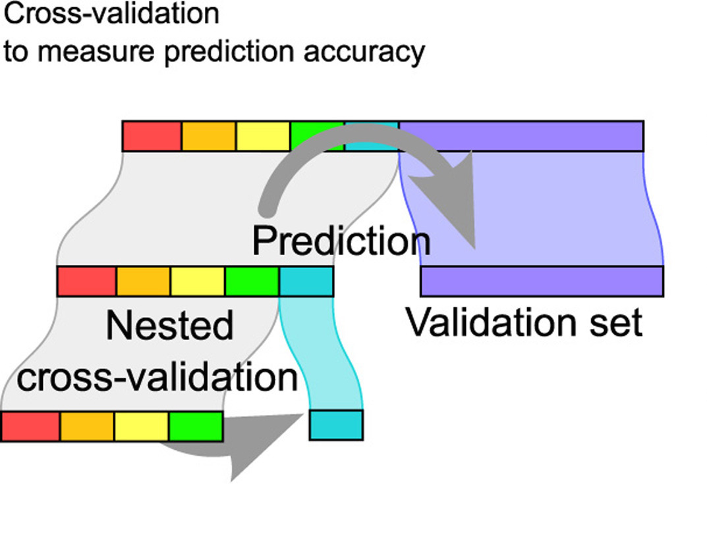

# Classification {#class}

```{r, include=FALSE, eval=TRUE, echo=FALSE, warning=FALSE, message=FALSE}
knitr::opts_chunk$set(message=FALSE, warning=FALSE, 
                      fig.height=3, fig.width=5,  
                      cache=TRUE, fig.align = "center")

library(tidyverse)
library(caret)
```

## 10/29/19 Agenda {#Oct29}
1. classification
2. $k$-Nearest Neighbors
3. bias-variance trade-off
4. cross validation


**Important Note**:  For the majority of the classification and clustering methods, we will use the `caret` package in R.  For more information see: http://topepo.github.io/caret/index.html

@Baumer15 provides a concise explanation of how both statistics and data science work to enhance ideas of machine learning, one aspect of which is classification:


> In order to understand machine learning, one must recognize the differences between the mindset of the data miner and the statistician, notably characterized by @brei01, who distinguished two types of models f for y, the response variable, and x, a vector of explanatory variables. One might consider a *data model* f such that y $\sim$ f(x), assess whether f could reasonably have been the process that generated y from x, and then make inferences about f. The goal here is to learn about the real process that generated y from x, and the conceit is

> Alternatively, one might construct an *algorithmic model* f, such that $y \sim f(x)$, and use f to predict unobserved values of y. If it can be determined that f does in fact do a good job of predicting values of y, one might not care to learn much about f. In the former case, since we want to learn about f, a simpler model may be preferred. Conversely, in the latter case, since we want to predict new values of y, we may be indifferent to model complexity (other than concerns about overfitting and scalability).


Classification is a supervised learning technique to extract general patterns from the data in order to build a predictor for a new test or validation data set.  That is, the model should *classify* new points into groups (or with a numerical response values) based on a model built from a set of data which provides known group membership for each value.  For most of the methods below, we will consider classifying into categories (in fact, usually only two categories), but sometimes (e.g., support vector machines and linear regression) the goal is to predict a numeric variable.

Some examples of classification techniques include: linear regression, logistic regression, neural networks, **classification trees**, **random forests**, **k-nearest neighbors**, **support vector machines**, n{\"a}ive Bayes, and linear discriminant analysis.  We will cover the methods in **bold**.

**Simple is Better**  (From @field07, p. 87)

1. We want to avoid over-fitting the model (certainly, it is a bad idea to model the noise!)
2. Future prediction performance goes down with too many predictors.
3. Simple models provide better insight into causality and specific associations.
4. Fewer predictors implies fewer variables to collect in later studies.

That said, the model should still represent the complexity of the data!  We describe the trade-off above as the ``bias-variance" trade-off. In order to fully understand that trade-off, let's first cover the classification method known as $k$-Nearest Neighbors.


## $k$-Nearest Neighbors {#knn}


The $k$-Nearest Neighbor algorithm does exactly what it sounds like it does.  The user decides on the integer value for $k$, and a point is classified to be in the group for which the majority of the $k$ closest points in the training data.

### $k$-NN algorithm

1. Decide on a distance metric (e.g., Euclidean distance, 1 - correlation, etc.) and find the distances from each point in the test set to each point in the training set.  The distance is measured in the feature space,  that is, with respect to the explanatory variables (not the response variable).

n.b.  In most machine learning algorithms that use "distance" as a measure, the "distance" is not required to be a mathematical distance metric.  Indeed, 1-correlation is a very common distance measure, and it fails the triangle inequality.


2. Consider a point in the training set.  Find the $k$ closest points in the test set to the one test observation.

3. Using majority vote, find the dominate class of the $k$ closest points.  Predict that class label to the test observation. 

Note: if the response variable is continuous (instead of categorical), find the average response variable of the $k$ training point to be the predicted response for the one test observation.


**Shortcomings of $k$-NN**:
* one class can dominate if it has a large majority
* Euclidean distance is dominated by scale
* it can be computationally unwieldy (and unneeded!!) to calculate all distances (there are algorithms to search smartly)
* the output doesn't provide any information about which explanatory variables are informative.


**Strengths of $k$-NN**:
* it can easily work for any number of categories
* it can predict a quantitative response variable
* the bias of 1-NN is often low (but the variance is high)
* any distance metric can be used (so the algorithm models the data appropriately)
* the method is simple to implement / understand
* model is nonparametric (no distributional assumptions on the data)
* great model for imputing missing data

```{r fig.cap = "", out.width='100%', fig.align='center', echo=FALSE}

knitr::include_graphics("figs/knnK.jpg")
```


###  R knn Example  

R code for using the `knn` package to cluster the `iris` data.  The `caret` package vignette for `knn` is here: http://topepo.github.io/caret/miscellaneous-model-functions.html#yet-another-k-nearest-neighbor-function

## Cross Validation {#cv}

### Bias-variance trade-off

* **Variance** refers to the amount by which $\hat{f}$ would change if we estimated it using a different training set.  Generally, the closer the model fits the data, the more variable it will be (it'll be different for each data set!).  A model with many many explanatory variables will often fit the data too closely.

* **Bias** refers to the error that is introduced by approximating the "truth" by a model which is too simple. For example, we often use linear models to describe complex relationships, but it is unlikely that any real life situation actually has a *true* linear model.  However, if the true relationship is close to linear, then the linear model will have a low bias.

Generally, the simpler the model, the lower the variance.  The more complicated the model, the lower the bias.  In this class, cross validation will be used to assess model fit.  [If time permits, Receiver Operating Characteristic (ROC) curves will also be covered.]


\begin{align}
\mbox{prediction error } = \mbox{ irreducible error } + \mbox{ bias } + \mbox{ variance}
\end{align}

* **irreducible error**  The irreducible error is the natural variability that comes with observations.  No matter how good the model is, we will never be able to predict perfectly.
* **bias**  The bias of the model represents the difference between the true model and a model which is too simple.  That is, with more complicated models (e.g., smaller $k$ in $k$NN) the closer the points are to the prediction.  As the model gets more complicated (e.g., as $k$ decreases), the bias goes down.
* **variance**  The variance represents the variability of the model from sample to sample.  That is, a simple model (big $k$ in $k$NN) would not change a lot from sample to sample.  The variance decreases as the model becomes more simple (e.g., as $k$ increases).


Note the bias-variance trade-off.  We want our prediction error to be small, so we choose a model that is medium with respect to both bias and variance.  We cannot control the irreducible error.

```{r fig.cap = "Test and training error as a function of model complexity.  Note that the error goes down monotonically only for the training data.  Be careful not to overfit!!  [@ESL]", out.width='100%', fig.align='center', echo=FALSE}
knitr::include_graphics("figs/varbias.png")
```


The following visualization does an excellent job of communicating the trade-off between bias and variance as a function of a specific tuning parameter, here: minimum node size of a classification tree.  http://www.r2d3.us/visual-intro-to-machine-learning-part-2/

### Implementing Cross Validation 


```{r fig.cap = "[@flach12]", out.width='100%', fig.align='center', echo=FALSE}
knitr::include_graphics("figs/overfitting.jpg")
```

Cross validation is typically used in two ways.  

1. To assess a model's accuracy (*model assessment*).  
2. To build a model (*model selection*).

#### Different ways to CV {-}

Suppose that we build a classifier on a given data set.  We'd like to know how well the model classifies observations, but if we test on the samples at hand, the error rate will be much lower than the model's inherent accuracy rate.  Instead, we'd like to predict *new* observations that were not used to create the model.  There are various ways of creating *test* or *validation* sets of data:

* one training set, one test set  [two drawbacks:  estimate of error is highly  variable because it depends on which points go into the training set; and because the training data set is smaller than the full data set, the error rate is biased in such a way that it overestimates the actual error rate of the modeling technique.]
* leave one out cross validation (LOOCV)
1. remove one observation
2. build the model using the remaining n-1 points
3. predict class membership for the observation which was removed
4. repeat by removing each observation one at a time

* $k$-fold cross validation ($k$-fold CV)
    * like LOOCV except that the algorithm is run $k$ times on each group (of approximately equal size) from a partition of the data set.]
    * LOOCV is a special case of $k$-fold CV with $k=n$
    * advantage of $k$-fold is computational
    * $k$-fold often has a better bias-variance trade-off [bias is lower with LOOCV.  however, because LOOCV predicts $n$ observations from $n$ models which are basically the same, the variability will be higher (i.e., based on the $n$ data values).  with $k$-fold, prediction is on $n$ values from $k$ models which are much less correlated.  the effect is to average out the predicted values in such a way that there will be less variability from data set to data set.]


#### CV for Model assessment 10-fold {-}

1. assume $k$ is given for $k$NN
2. remove 10% of the data
3. build the model using the remaining 90%
4. predict class membership / continuous response for the 10% of the observations which were removed
5. repeat by removing each decile one at a time
6. a good measure of the model's ability to predict is the error rate associated with the predictions on the data which have been independently predicted


#### CV for Model selection 10-fold {-}

1. set $k$ in $k$NN
2. build the model using the $k$ value set above:
    a. remove 10% of the data
    b. build the model using the remaining 90%
    c. predict class membership / continuous response for the 10% of the observations which were removed
    d. repeat by removing each decile one at a time

3. measure the CV prediction error for the $k$ value at hand
4. repeat steps 1-3 and choose the $k$ for which the prediction error is lowest


#### CV for Model assessment and selection 10-fold {-}

For now we will talk about test/training data *and* CV in order to both model assessment and selection.   Note that CV could be used in both steps, but the algorithm is slightly more complicated.

1. split the data into training and test observations
2. set $k$ in $k$NN
3. build the model using the $k$ value set above on *only the training data*:
    a. remove 10% of the training data
    b. build the model using the remaining 90% of the training data
    c. predict class membership / continuous response for the 10% of the training observations which were removed
    d. repeat by removing each decile one at a time from the training data
4. measure the CV prediction error for the $k$ value at hand on the training data
5. repeat steps 2-4 and choose the $k$ for which the prediction error is lowest for the training data
6. using the $k$ value given in step 5, assess the prediction error on the test data


```{r fig.cap = "Nested cross-validation: two cross-validation loops are run one inside the other.  [@CVpaper]", out.width='100%', fig.align='center', echo=FALSE}

```

## 10/31/19 Agenda {#Oct31}
1. trees (CART)
2. building trees (binary recursive splitting)
3. homogeneity measures
4. pruning trees


## CART {#cart}