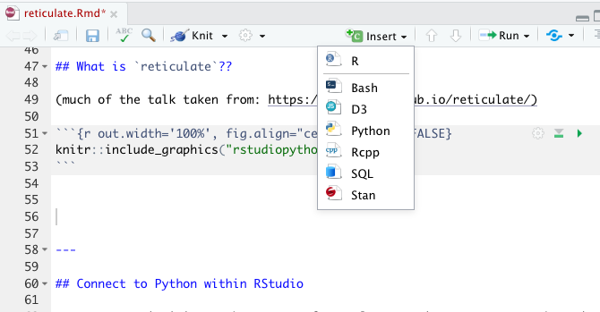
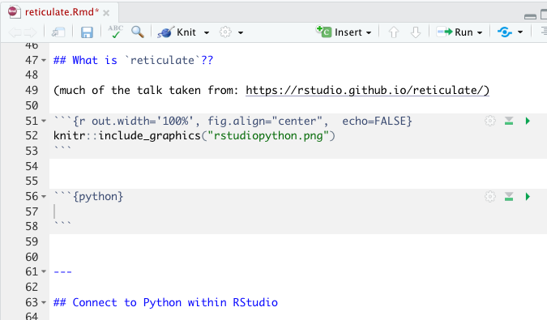

# Misc {#misc}

```{r, include=FALSE, eval=TRUE, echo=FALSE, warning=FALSE, message=FALSE}
knitr::opts_chunk$set(message=FALSE, warning=FALSE, 
                      fig.height=3, fig.width=5,  
                      cache=TRUE, fig.align = "center")

library(tidyverse)
library(caret)
```


## 11/26/19 Agenda {#Nov26}
1. API / authenticating 
2. parallel computing
3. cloud computing
4. `reticulate` (Python in R!)
5. SQL

## API

.pull-left[
What is an API? (Application Programming Interface)

Think of an API as a restaurant menu.  The menu provides a list of what the restaurant has to offer, and you order off the menu by choosing the dish that you want.  After you order, the restaurant figures out how to bring the food from the kitchen to your table in the way that you've specified. 

An API is an intermediary that allows two applications to talk to one another.  It is not the database or the server, instead it is the *code* that allows communication.
]

.pull-right[

```{r out.width='40%', fig.align="right",  echo=FALSE}
knitr::include_graphics("figs/api_xkcd.png")
```
]

#### Examples of APIs {-}

* When you use an app on your phone, the app connects to the internet and sends information to a server somewhere.  The server retrieves the data, interprets is, does what it does, and sends it back to you.  The application which takes the data from the server and presents it to you in a readable way is an API.

* Let's say you are booking a flight on United.  You choose all the details, you interact with the airline's website.  BUT INSTEAD, what if you are interacting with a software like Expedia?  Then Expedia has to talk to United's API to get all the information about available flights, costs, seats, etc.

* If you've ever been to a third party site and clicked on "Share on Facebook" or "Share on Twitter" your third party site is communicating with the Facebook API or the Twitter API.

* You sign up to go to a concert, and StubHub asks whether you want to add the concert to your Google calendar.  StubHub needs to talk to Google via Google's API.

* What if you want some Twitter data?  How might you get it?  Well, you could email Twitter and ask someone for it.  **Instead** Twitter provides information about how their data is stored, and allows you to query their data in an automated way.


## Parallel Computing

## Cloud Computing

## `reticulate`

### Connect to Python within RStudio {-}

For many statisticians, the go-to software language is R.  However, there is no doubt that Python is a very important language in data science.  Why not do both??

```{r message=FALSE, warning=FALSE}
library(tidyverse)
library(reticulate)
use_virtualenv("r-reticulate")
reticulate::import("statsmodels")
```

#### I can run Python inside R?? {-}

```{r out.width='65%', fig.align="left",  echo=FALSE}

```
```{r out.width='65%', fig.align="right",  echo=FALSE}

```


* `pandas` for data wrangling.  
* In R, the chunk is specified to be a Python chunk (RStudio is now running Python). 


````
```{python}`r ''`
import pandas
flights = pandas.read_csv("flights.csv")
flights = flights[flights["dest"] == "ORD"]
flights = flights[['carrier', 'dep_delay', 'arr_delay']]
flights = flights.dropna()
```
````

A view of the Python chunk which is actually run:

```{python}
import pandas
flights = pandas.read_csv("flights.csv")
flights = flights[flights["dest"] == "ORD"]
flights = flights[['carrier', 'dep_delay', 'arr_delay']]
flights = flights.dropna()
```


#### Learn about the dataset {-}

````
```{python}`r ''`
flights.shape
flights.head(3)
flights.describe()
```
````


```{python}
flights.shape
flights.head(3)
flights.describe()
```


#### Computations using `pandas` {-}


````
```{python}`r ''`
flights = pandas.read_csv("flights.csv")
flights = flights[['carrier', 'dep_delay', 'arr_delay']]
flights.groupby("carrier").mean()
```
````

```{python}
flights = pandas.read_csv("flights.csv")
flights = flights[['carrier', 'dep_delay', 'arr_delay']]
flights.groupby("carrier").mean()
```


#### From Python chunk to R chunk {-}

* `py$x` accesses an `x` variable created within Python from R
* `r.x` accesses an `x` variable created within R from Python


```{r}
library(ggplot2)
ggplot(py$flights, 
       aes(x=carrier, 
           y=arr_delay)) + 
  geom_point() + 
  geom_jitter()
```


#### From R chunk to Python chunk {-}

```{r}
data(diamonds)
head(diamonds)
```


####  Python chunks {-}

Note that we're calling Python code on an R object.

```{python}
print(r.diamonds.describe())
```


```{python out.width = "20px"}
import statsmodels.formula.api as smf
model = smf.ols('price ~ carat', data = r.diamonds).fit()
print(model.summary())
```


#### Running just Python {-}

```{r out.width='120%', echo=FALSE}
knitr::include_graphics("figs/PyScript.png")
```


#### Full disclosure {-}

Reticulate is not always trivial to set up.  Indeed, I've had trouble figuring out which Python version is talking to R and where different module versions live.


#### Learn more {-}

- [RStudio R Interface to Python](https://rstudio.github.io/reticulate/)

https://rstudio.github.io/reticulate/  

- [RStudio blog on Reticulated Python](https://blog.rstudio.com/2018/10/09/rstudio-1-2-preview-reticulated-python/)  

https://blog.rstudio.com/2018/10/09/rstudio-1-2-preview-reticulated-python


## SQL


## 12/10/19 Agenda {#Dec10}
1. Regular Expressions

## Regular Expressions {#regexpr}

