# Visualization

Data visualization is integral to understanding both data and models.  Computational statistics and data science sometimes focus on models or resulting predictions from the models.  But there is no doubt that the structure and format of the data are the key to whether or not a model is appropriate or good.  A good data analyst will always spend a lot of time and effort on exploratory data analysis, much of which includes making as many visualizations of the data as possible.


Depending on the introductory (or other) statistics classes you've had, your instructor may have focused more or less on visualizations in class.  They (I) may have even said something like *making visualizations are incredibly important to the entire data analysis process.*  But even if you buy the perspective, why is it that we don't see more good graphics in our analyses?   Andrew Gelman [@Gelman11] responds by stating, "Good statistical graphics are hard to do, much harder than running regressions and making tables."   **Our goal will be to create graphics and visualizations that convey statistical information.**

Nolan [@Nolan16] describes three important ways that graphics can be used to convey statistical information.  The "guiding principles" will be used as a way of evaluating others' figures as well as a metric for creating our own visualizations to help with statistical analysis.

1.  *Make the data stand out* 

The important idea here is to find anything unusual in the data.  Are there patterns?  Outliers?  What are the bounds of the variables?  How should the axes be scaled?  Are transformations warranted?   

2. *Facilitate comparison*

The second item allows us to consider the research questions at hand. What are the important variables?  How do we emphasize them?  Which variables should be plotted together?  Can they be super-imposed?  Does color, plotting character, size of plot character help to bring out the important relationships?  Be aware of over plotting and issues of color blindness. http://colorbrewer2.org/

3. *Add information*

Plots should also add context to the comparison.  Figure legends, axes scales, and reference markers (e.g., a line at $y=x$) go a long way toward helping the reader understand your message.  Captions should be self-contained (and not assume the user has also read your text) and descriptive; they should summarize the content of the figure and the conclusion related to the message you want to convey.


Randy Pruim asks the following question to decide whether or not a plot is good:  *Does my plot make the comparisons I am interested in...*

* easily? and
* accurately?

Consider adding alt text to allow screen readers to parse the image.  The DataViz Society/Nightingale by way of Amy Cesal has an article on writing good alt text for plots/graphs, <a href = "https://medium.com/nightingale/writing-alt-text-for-data-visualization-2a218ef43f81" target = "_blank">Writing Alt Text for Data Visualization</a>.

## Examples

The first two examples are taken from a book by Edward Tufte who is arguably the master at visualizations.  The book is *Visual and Statistical Thinking: Displays of Evidence for Making decisions*.  The book can be purchased for $7 at http://www.edwardtufte.com/tufte/books_textb, though there may be online versions of it that you can download. 


##### An aside {-}
Generally, the better your graphics are, the better able you will be to communicate ideas broadly (that's how you become rich and famous).  By graphics I mean not only figures associated with analyses, but also power point presentations, posters, and information on your website provided for other scientists who might be interested in your work.  Tufte is a master at understanding how to convey information visually, and I strongly recommend you look at his work.  Start with Wikipedia where some of his main ideas are provided (e.g., "data-ink ratio") and then check out his incredible texts.  I have many of them in my office and am happy to let you peruse them. http://www.edwardtufte.com/tufte/books_vdqi


As mentioned in the booklet we are using, there are two main motivational steps to working with graphics as part of an argument [@Tufte97].

1. "An essential analytic task in making decisions based on evidence is to understand how things work."
2. Making decisions based on evidence requires the appropriate display of that evidence."

Back to the examples... 

### Cholera via Tufte

In September 1854, the worst outbreak of cholera in London occurred in a few block radius - within 10 days, there were more than 500 fatalities.  John Snow recognized the clumping of deaths, and hypothesized that they were due to contamination of the Broad Street water pump.  Despite testing the water from the pump and finding no suspicious impurities, he did notice that the water quality varies from data to day.  More importantly, there seemed to be no other possible causal mechanism for the outbreak.  Eight days after the outbreak began, Snow described his findings to the authorities, and the Board of Guardians of St. James's Parish ordered the Broad Street pump handle removed.  The epidemic ended soon after. 

*Why was John Snow successful at solving the problem?*  Some thoughts to consider (as reported in @Tufte97):

1. The bacterium *Vibrio cholerae* was not discovered until 1886, however Snow had myriad experience both as a medical doctor and in looking at patterns of of other outbreaks.  He was the first to realized that cholera was transmitted through water instead of by air or other means.

2. **Data in Context**  Snow thought carefully about how to present the data.  Instead of simply looking at the data as counts or frequencies, he looked at the death *spatially* - on a map of the area.

3. **Comparisons**  In order to isolate the pump as the *cause* of the outbreak, Snow needed to understand how the individuals who had died were different than the individuals who had survived.  Snow found two other groups of individuals (brewers who drank only beer, and employees at a work house who had an on-site pump) who had not succumbed to the disease.

4. **Alternatives**  Whenever a theory is present, it is vitally important to contrast the theory against all possible alternative possibilities.  In Snow's case, he needed to consider all individuals who did not regularly use the Broad Street pump - he was able to understand the exceptions in every case.

5. Did removing the pump handle really *cause* the outbreak to cease?  Wasn't it already on the decline?

6. **Assessment of the Graphic**  Did the individuals die at the place on the map?  Live at the place on the map? Which (types of) individuals were missing from the graph?  Missing at random?  What decisions did he make in creating the graph (axes, binning of histogram bars, time over which data are plotted, etc.) that change the story needing to be told?


### Challenger via Tufte

John Snow's story of the successful graphical intervention in the cholera outbreak is contrasted with the fateful poor-graphical non-intervention of the Challenger disaster.  On January 28, 1986, the space shuttle Challenger took off from Cape Canaveral, FL and immediately exploded, killing all seven astronauts aboard.  We now know that the reason for the explosion was due to the failure of two rubber O-rings which malfunctioned due to the cold temperature of the day ($\sim 29^\circ$ F).   

Unlike the cholera epidemic, those who understood the liability of a shuttle launch under cold conditions were unable to convince the powers that be to postpone the launch (there was much political momentum going forward to get the shuttle off the ground, including the first teacher in space, Christa McAuliffe).  As seen in the Tufte chapter, the evidence was clear but not *communicated*! 

The biggest problem (existing in many of the bullet points below) is that the engineers failed to as the important question about the data: **in relation to what??**

1. The engineers who understood the problem created tables and engineering graphs which were
     (a) Not visually appealing.
     (b) Not decipherable to the layman (e.g., "At about $50^\circ$ F blow-by could be experienced in case joints")
     (c) There was also no authorship (reproducibility!).  **Figures should always have both accountability and reproducibility.**

2. The information provided included very relevant points (about temperature) and superfluous information unrelated to temperature.  The univariate analysis was insufficient because the story the data were trying to tell was about the **bivariate relationship between temperature and o-ring failure**.

3. Missing data created an illusion of *lack of evidence*, when in fact, the true story was quite strong given the full set of information.  (92% of the temperature data was missing from some of the most vital tables.)

4. Anecdotal evidence was misconstrued:  SRM-15 at 57F at the most damage, but SRM-22 at 75F had the second most damage.

5. In the end, the shuttle launched on a day which was an extrapolation from the model suggested by the data.  They had never launched a shuttle at temperatures of $26^\circ-29^\circ$F.

6. Tufte goes on to describe many ways which the final presentation by the engineers to the administrators was inadequate:  disappearing legend (labels), chartjunk, lack of clarity depicting cause and effect, and wrong order.

As with the cholera outbreak, a persuasive argument could have been made if the visualizations had

(1) been in context *plot data versus temperature not time!*, 
(2) used appropriate comparisons: *as compared with what?*, 
(3) consider alternative scenarios *when else did O-rings fail?  What is the science behind O-ring failure?*, and 
(4) the graphics had been assessed *what is all of the extra noise?  are the words being used accessible to non-engineers?*. 

Tufte [@Tufte97] created the graphic below which should have been used before the launch to convince others to postpone.  As you can see, the graphic is extremely convincing.  An aside: the O-ring data are well suited for an analysis using logistic regression.  Today, most scientists believe that the temperature *caused* the O-ring failure, however, the data do not speak to the causal relationship because they were not collected using a randomized experiment.  That is, there could have been other confounding variables (e.g., humidity) which were possible causal mechanisms.


<div class="figure" style="text-align: center">

<p class="caption">(\#fig:unnamed-chunk-2)The graphic the engineers should have led with in trying to persuade the administrators not to launch.  It is evident that the number of O-ring failures is quite highly associated with the ambient temperature.  Note the *vital* information on the x-axis associated with the large number of launches at warm temperatures that had *zero* O-ring failures. [@Tufte97]</p>
</div>

## Thoughts on Plotting {#thoughts}

### Advice

* Basic plotting
    - Avoid having other graph elements interfere with data
    - Use visually prominent symbols
    - Avoid over-plotting  (One way to avoid over plotting: Jitter the values)
    - Different values of data may obscure each other
    - Include all or nearly all of the data
    - Fill data region
* Eliminate superfluous material
    - Chart junk & stuff that adds no meaning, e.g. butterflies on top of barplots, background images
    - Extra tick marks and grid lines
    - Unnecessary text and arrows
    - Decimal places beyond the measurement error or the level of difference
* Facilitate Comparisons
    - Put juxtaposed plots on same scale
    - Make it easy to distinguish elements of  superposed plots (e.g. color)
    - Emphasizes the important difference
    - Comparison: volume, area, height  (be careful, volume can seem bigger than you mean it to)
* Choosing the Scale (n.b., some of the principles may go counter to one another, use your judgment.)
    - Keep scales on x and y axes the same for both plots to facilitate the comparison
    - Zoom in to focus on the region that contains the bulk of the data
    - Keep the scale the same throughout the plot (i.e. don't change it mid-axis)
    - Origin need not be on the scale
    - Choose a scale that improves resolution
    - Avoid jiggling the baseline
* How to make a plot information rich
    - Describe what you see in the caption
    - Add context with reference markers (lines and points) including text
    - Add legends and labels
    - Use color and plotting symbols to add more information
    - Plot the same thing more than once in different ways/scales
    - Reduce clutter
* Captions should
    - Be comprehensive
    - Self-contained
    - Describe what has been graphed
    - Draw attention to important features
    - Describe conclusions drawn from graph
* Good Plot Making Practice
    - Put major conclusions in graphical form
    - Provide reference information
    - Proof read for clarity and consistency
    - Graphing is an iterative process
    - Multiplicity is OK, i.e. two plots of the same variable may provide different messages
    - Make plots data rich


Creating a statistical graphic is an iterative process of discovery and fine tuning. We try to model the process of creating visualizations in the course by dedicating class time to an iterative creation of a plot. We begin either with a plot that screams for correction, and we transform it step-by-step, always thinking about the goal of a graph that is data rich and presents a clear vision of the important features of the data.

### An example from Information is Beautiful

(See HW2 for details on R code)

Consider the plot at http://www.informationisbeautiful.net/visualizations/caffeine-and-calories/.  Note that the origin is at the point (150,150).  While we can get over the hurdle, it is not what is expected when looking at a graph.


<div class="figure" style="text-align: center">

<p class="caption">(\#fig:unnamed-chunk-3)http://infobeautiful3.s3.amazonaws.com/2013/01/1276_buzz_v_bulge.png</p>
</div>

I have removed the vertical and horizontal lines which detracted from the idea of an origin.  I have also added additional information (color) to describe the chain from which the drink comes from.  Notice that an additional difference between my plot and the original plot is that I have many more observations.


<div class="figure" style="text-align: center">

<p class="caption">(\#fig:unnamed-chunk-4)Calories and Caffeine for drinks from various drinks and other items.  Data source is: World Cancer Research Fund, Starbucks Beverage Nutrition Guide, Calorie Counter Database.  Seemingly, the observational units (rows) are not a random sample of anything.  As such, we should be careful of summarizing the data in any way - what would the 'average' calories even mean?  Note, from the entire dataset give, the average calories is 179.8 and the average caffeine is 134.43.  How do those numbers compare to the original plot?</p>
</div>

Data retrieved from: 
https://docs.google.com/spreadsheets/d/1KYMUjrCulPtpUHwep9bVvsBvmVsDEbucdyRZ5uHCDxw/edit?hl=en_GB#gid=0


#### Fonts Matter

At RStudio::conf 2020, [The Glamour of Graphics](https://rstudio.com/resources/rstudioconf-2020/the-glamour-of-graphics/), Will Chase makes some very important points about how and why making good graphics matters. The talk might be summarized by the plot below: fonts matter.


### Assessing Graphics (and Other Analyses)

| Critical Task 	| Needs Improvement 	| Basic 	| Surpassed 	|
|------------------------------------------------------------------------------------------------	|-------------------------------------------------------------------------------	|---------------------------------------------------------------------------------------------------	|--------------------------------------------------------------------------------------	|
| **Computation** Perform computations 	| Computations contain errors and extraneous code 	| Computations are correct but contain extraneous / unnecessary computations 	| Computations are correct and properly identified and labeled 	|
| **Analysis** Choose and carry out analysis appropriate for data and content(s) 	| Choice of analysis is overly simplistic, irrelevant, or missing key component 	| Analysis appropriate, but incomplete, or not important features and assumptions not made explicit 	| Analysis appropriate, complete, advanced, relevant, and informative 	|
| **Synthesis** Identify key features of the analysis, and interpret results (including context) 	| Conclusions are missing, incorrect, or not made based on results of analysis 	| Conclusions reasonable, but is partially correct or partially complete 	| Make relevant conclusions explicitly connect to analysis and to context 	|
| **Visual presentation** Communicate findings graphically clearly, precisely, and concisely 	| Inappropriate choice of plots; poorly labeled plots; plots missing 	| Plots convey information correctly but lack context for interpretation 	| Plots convey information correctly with adequate / appropriate reference information 	|
| **Written** Communicate findings clearly, precisely, and concisely 	| Explanation is illogical, incorrect, or incoherent 	| Explanation is partially correct but incomplete or unconvincing 	| Explanation is correct, complete, and convincing 	|

A rubric for assessing analysis and corresponding visualization.  Note that there can be a large amount of information gained in moving from basic competency to surpassed competency.  Table taken from @Nolan16.


<!---
% look at Di's plenary talk from rstudio::conf 2018
% (1) making many different plots from the same data, they show very different things!
% (2) ideas of null plots
--->

## Deconstructing a graph {#deconstruct}

###  The Grammar of Graphics (`gg`) {#gg}

@Yau and @Wickham14  have come up with a *taxonomy* and a *grammar* for thinking about the parts of a figure just like we conceptualize the parts of a body or the parts of a sentence.

One great way of thinking of the new process:  it is not longer necessary to talk about the name of the graph (e.g., boxplot).  Instead we now think in glyphs (geoms), and so we can put whatever we want on the plot.  Note also that the transition leads you from a passive consumer (I need to make plot XXX because everyone else does, so I just plug in the data) into an active participant (what do I want my data to say?  and how can I put that information onto my graphic?)

The most important questions you can ask with respect to creating figures are:

1. What do we want R to do? (What is the goal?)
2. What does R need to know?

@Yau gives us nine visual cues, and @Wickham14 translates them into a language using `ggplot2`.  (The items below are from @MDSR, chapter 2.)


1. Visual Cues:  the aspects of the figure where we should focus.  
**Position** (numerical) where in relation to other things?  
**Length** (numerical) how big (in one dimension)?  
**Angle** (numerical) how wide? parallel to something else?  
**Direction** (numerical) at what slope?  In a time series, going up or down?  
**Shape** (categorical) belonging to what group?  
**Area** (numerical) how big (in two dimensions)?  Beware of improper scaling!  
**Volume** (numerical) how big (in three dimensions)?  Beware of improper scaling!  
**Shade** (either) to what extent?  how severely?  
**Color** (either) to what extent? how severely? Beware of red/green color blindness.  

2. Coordinate System: rectangular, polar, geographic, etc.

3. Scale: numeric (linear? logarithmic?), categorical (ordered?), time

4. Context: in comparison to what (think back to ideas from Tufte)


#### Order Matters {-}


#### Cues Together {-}


##### What are the visual cues on the plot? {-}

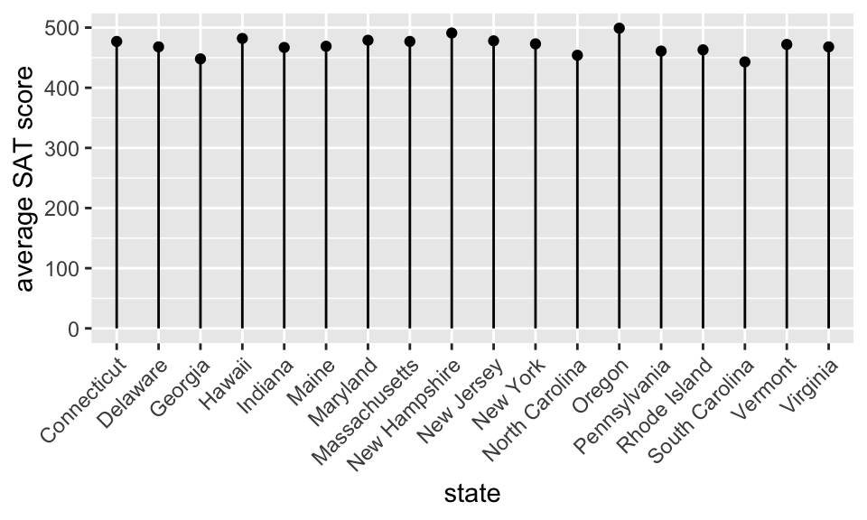


* position?
* length?
* shape?
* area/volume?
* shade/color?
* coordinate System?  
* scale?

##### What are the visual cues on the plot? {-}


* position?
* length?
* shape?
* area/volume?
* shade/color?
* coordinate System?  
* scale?


##### What are the visual cues on the plot? {-}

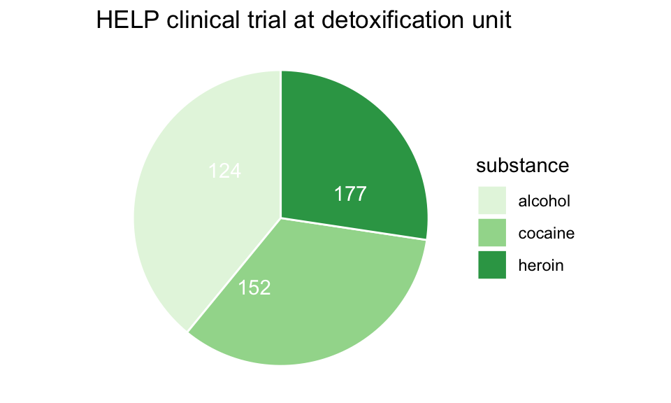


* position?
* length?
* shape?
* area/volume?
* shade/color?
* coordinate System?  
* scale?


#### The grammar of graphics in `ggplot2`

**geom**: the geometric "shape" used to display data
 
  * bar, point, line, ribbon, text, etc.
 
**aesthetic**: an attribute controlling how geom is displayed with respect to variables

  * x position, y position, color, fill, shape, size, etc.

**scale**: adjust information in the aesthetic to map onto the plot

  * *particular* assignment of colors, shapes, sizes, etc.; making axes continuous or constrained to a particular range of values.
 
**guide**: helps user convert visual data back into raw data (legends, axes)

**stat**: a transformation applied to data before geom gets it

  * example: histograms work on binned data
 


### `ggplot2`


In `ggplot2`, an *aesthetic* refers to a mapping between a variable and the information it conveys on the plot.  Further information about plotting and visualizing information is given in chapter 2 (Data visualization) of @MDSR.  Much of the data in the presentation represents all births from 1978 in the US: the date, the day of the year, and the number of births.

<!---
%Things to talk about:
%layers 
%facets 
%tidy data 
%scale: the computer maps the data to the aesthetic (computer doing the work) 
%guide: the aesthetic gets mapped back to the data (the human interpreting the graph) 
%frame: the variables that define the space (e.g., x & y coordinates and faceting) 
--->

##### Goals {-}

What I will try to do

 * give a tour of `ggplot2`
 
 * explain how to think about plots the `ggplot2` way
 
 * prepare/encourage you to learn more later
 
What I can't do in one session

 * show every bell and whistle
 
 * make you an expert at using `ggplot2`
 
##### Getting help {-}

1.  One of the best ways to get started with ggplot is to google what you want to do with the word ggplot.  Then look through the images that come up.  More often than not, the associated code is there.  There are also ggplot galleries of images, one of them is here: https://plot.ly/ggplot2/

2. `ggplot2` cheat sheet: https://www.rstudio.com/wp-content/uploads/2015/03/ggplot2-cheatsheet.pdf

3. Look at the end of the presentation.  More help options there.


```r
require(mosaic)
require(lubridate) # package for working with dates
data(Births78)     # restore fresh version of Births78
head(Births78, 3)
```

```
##         date births wday year month day_of_year day_of_month day_of_week
## 1 1978-01-01   7701  Sun 1978     1           1            1           1
## 2 1978-01-02   7527  Mon 1978     1           2            2           2
## 3 1978-01-03   8825  Tue 1978     1           3            3           3
```


##### How can we make the plot? {-}


Two Questions:

 1. What do we want R to do?  (What is the goal?)
 
 2. What does R need to know?

    * data source: `Births78`

    * aesthetics: 
 
        * `date -> x`
        * `births -> y`
        * points (!) 


 1. Goal: scatterplot = a plot with points
 
    * `ggplot() + geom_point()`
 
 2. What does R need to know?
 
    * data source: `data = Births78`

    * aesthetics: `aes(x = date, y = births)`


##### How can we make the plot? {-}


What has changed?  

 * new aesthetic: mapping color to day of week

##### Adding day of week to the data set {-}


The `wday()` function in the `lubridate` package computes  the day of the week from a date.


```r
Births78 <-  
  Births78 %>% 
  mutate(wday = lubridate::wday(date, label=TRUE))
```


```r
ggplot(data=Births78) +
  geom_point(aes(x=date, y=births, color=wday))+
  ggtitle("US Births in 1978")
```

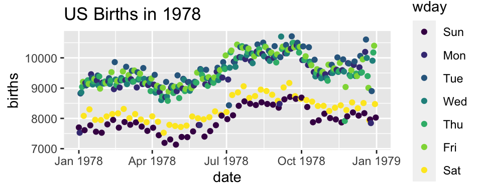


##### How can we make the plot? {-}

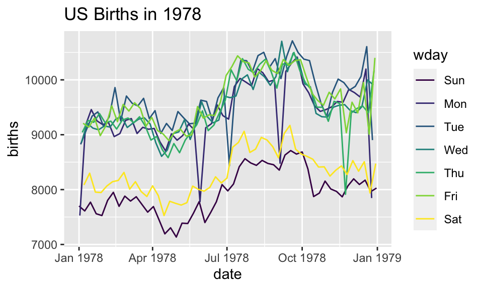


Now we use lines instead of dots


```r
ggplot(data=Births78) +
  geom_line(aes(x=date, y=births, color=wday)) +
  ggtitle("US Births in 1978")
```


##### How can we make the plot? {-}


Now we have two **layers**, one with points and one with
lines


```r
ggplot(data=Births78, 
       aes(x=date, y=births, color=wday)) + 
  geom_point() +  geom_line()+
  ggtitle("US Births in 1978")
```


 *  The layers are placed one on top of the other:  the points 
are *below* and the lines are *above*.   

 * `data` and `aes` specified in `ggplot()` affect all geoms
 
##### Alternative Syntax {-}


```r
Births78 %>% 
  ggplot(aes(x=date, y=births, color=wday)) + 
  geom_point() + 
  geom_line()+
  ggtitle("US Births in 1978")
```


##### What does adding the color argument do? {-}


```r
Births78 %>%
  ggplot(aes(x=date, y=births, color="navy")) + 
  geom_point()  +
  ggtitle("US Births in 1978")
```


Because there is no variable, we have *mapped* the color aesthetic to a new variable with only one value ("navy").   So all the dots get set to the same color, but it's not navy.

##### Setting vs. Mapping {-}


If we want to *set* the color to be navy for all of the dots, we do it outside the aesthetic, without a dataset variable:


```r
Births78 %>%
  ggplot(aes(x=date, y=births)) +   # map x & y 
  geom_point(color = "navy")   +     # set color
  ggtitle("US Births in 1978")
```


* Note that `color = "navy"` is now outside of the aesthetics list.  That's how `ggplot2` distinguishes between mapping and setting.


##### How can we make the plot? {-}


```r
Births78 %>%
  ggplot(aes(x=date, y=births)) + 
  geom_line(aes(color=wday)) +       # map color here
  geom_point(color="navy") +          # set color here
  ggtitle("US Births in 1978")
```

* `ggplot()` establishes the default data and aesthetics for the geoms, but each geom may change the defaults.

* good practice: put into `ggplot()` the things that affect all (or most) of the layers; rest in `geom_blah()`

##### Setting vs. Mapping (again) {-}

Information gets passed to the plot via:

a. `map` the **variable** information inside the aes (aesthetic) command

a. `set` the **non-variable** information outside the aes (aesthetic) command

##### Other geoms {-}


```r
apropos("^geom_")
```

```
 [1] "geom_abline"                  "geom_area"                   
 [3] "geom_ash"                     "geom_bar"                    
 [5] "geom_barh"                    "geom_bin2d"                  
 [7] "geom_blank"                   "geom_boxplot"                
 [9] "geom_boxploth"                "geom_col"                    
[11] "geom_colh"                    "geom_contour"                
[13] "geom_contour_filled"          "geom_count"                  
[15] "geom_crossbar"                "geom_crossbarh"              
[17] "geom_curve"                   "geom_density"                
[19] "geom_density_2d"              "geom_density_2d_filled"      
[21] "geom_density_line"            "geom_density_ridges"         
[23] "geom_density_ridges_gradient" "geom_density_ridges2"        
[25] "geom_density2d"               "geom_density2d_filled"       
[27] "geom_dotplot"                 "geom_errorbar"               
[29] "geom_errorbarh"               "geom_errorbarh"              
[31] "geom_freqpoly"                "geom_function"               
[33] "geom_hex"                     "geom_histogram"              
[35] "geom_histogramh"              "geom_hline"                  
[37] "geom_jitter"                  "geom_label"                  
[39] "geom_line"                    "geom_linerange"              
[41] "geom_linerangeh"              "geom_lm"                     
[43] "geom_map"                     "geom_path"                   
[45] "geom_point"                   "geom_pointrange"             
[47] "geom_pointrangeh"             "geom_polygon"                
[49] "geom_qq"                      "geom_qq_line"                
[51] "geom_quantile"                "geom_rangeframe"             
[53] "geom_raster"                  "geom_rect"                   
[55] "geom_ribbon"                  "geom_ridgeline"              
[57] "geom_ridgeline_gradient"      "geom_rug"                    
[59] "geom_segment"                 "geom_sf"                     
[61] "geom_sf_label"                "geom_sf_text"                
[63] "geom_sina"                    "geom_smooth"                 
[65] "geom_spline"                  "geom_spoke"                  
[67] "geom_step"                    "geom_text"                   
[69] "geom_tile"                    "geom_tufteboxplot"           
[71] "geom_violin"                  "geom_violinh"                
[73] "geom_vline"                   "geom_vridgeline"             
```

help pages will tell you their aesthetics, default stats, etc.


```r
?geom_area             # for example
```


##### Let's try `geom_area` {-}


```r
Births78 %>%
  ggplot(aes(x=date, y=births, fill=wday)) + 
  geom_area()+
  ggtitle("US Births in 1978")
```


Using area does not produce a good plot

* over plotting is hiding much of the data
* extending y-axis to 0 may or may not be desirable.

##### Side note: what makes a plot good? {-}

Most (all?) graphics are intended to help us make comparisons

* How does something change over time?
* Do my treatments matter?  How much?
* Do men and women respond the same way?

**Key plot metric:** Does my plot make the comparisons I am interested in 

* easily, and 
* accurately?

##### Time for some different data {-}


`HELPrct`: Health Evaluation and Linkage to Primary care randomized clinical trial


```r
head(HELPrct)
```

```
##   age anysubstatus anysub cesd d1 daysanysub dayslink drugrisk e2b female
## 1  37            1    yes   49  3        177      225        0  NA      0
## 2  37            1    yes   30 22          2       NA        0  NA      0
## 3  26            1    yes   39  0          3      365       20  NA      0
## 4  39            1    yes   15  2        189      343        0   1      1
## 5  32            1    yes   39 12          2       57        0   1      0
## 6  47            1    yes    6  1         31      365        0  NA      1
##      sex g1b homeless i1 i2 id indtot linkstatus link       mcs      pcs pss_fr
## 1   male yes   housed 13 26  1     39          1  yes 25.111990 58.41369      0
## 2   male yes homeless 56 62  2     43         NA <NA> 26.670307 36.03694      1
## 3   male  no   housed  0  0  3     41          0   no  6.762923 74.80633     13
## 4 female  no   housed  5  5  4     28          0   no 43.967880 61.93168     11
## 5   male  no homeless 10 13  5     38          1  yes 21.675755 37.34558     10
## 6 female  no   housed  4  4  6     29          0   no 55.508991 46.47521      5
##   racegrp satreat sexrisk substance treat avg_drinks max_drinks
## 1   black      no       4   cocaine   yes         13         26
## 2   white      no       7   alcohol   yes         56         62
## 3   black      no       2    heroin    no          0          0
## 4   white     yes       4    heroin    no          5          5
## 5   black      no       6   cocaine    no         10         13
## 6   black      no       5   cocaine   yes          4          4
##   hospitalizations
## 1                3
## 2               22
## 3                0
## 4                2
## 5               12
## 6                1
```

Subjects admitted for treatment for addiction to one of three substances.

##### Who are the people in the study? {-}


```r
HELPrct %>% 
  ggplot(aes(x=substance)) + 
  geom_bar()+
  ggtitle("HELP clinical trial at detoxification unit")
```


* Hmm.  What's up with `y`?

    * `stat_bin()` is being applied to the data before the 
    `geom_bar()` gets to do its thing.  Binning creates the
    `y` values.

##### Who are the people in the study? {-}


```r
HELPrct %>% 
  ggplot(aes(x=substance, fill=sex)) + 
  geom_bar()+
  ggtitle("HELP clinical trial at detoxification unit")
```


##### Who are the people in the study? {-}


```r
library(scales)
HELPrct %>% 
  ggplot(aes(x=substance, fill=sex)) + 
  geom_bar() +
  scale_y_continuous(labels = percent)+
  ggtitle("HELP clinical trial at detoxification unit")
```

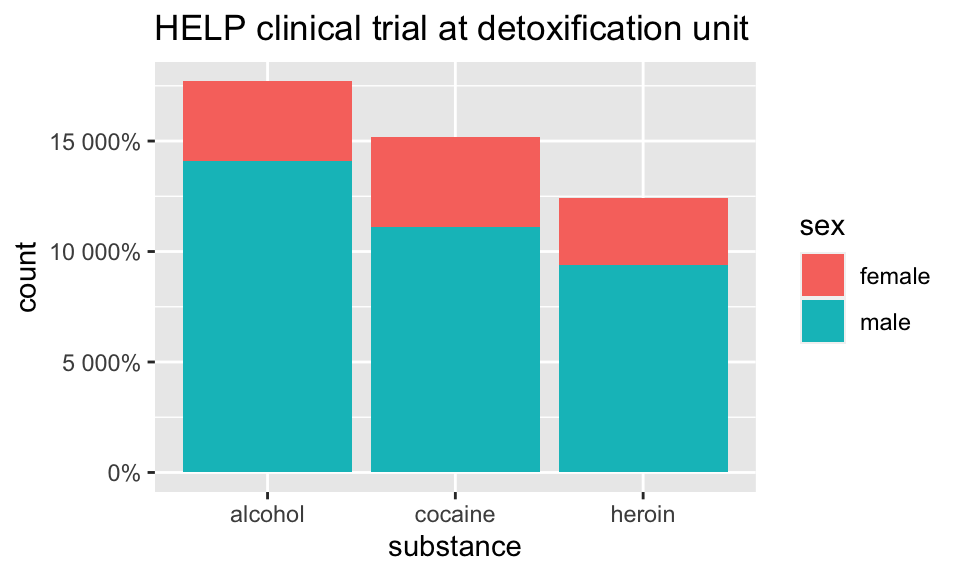


##### Who are the people in the study? {-}


```r
HELPrct %>% 
  ggplot(aes(x=substance, fill=sex)) + 
  geom_bar(position="fill") +
  scale_y_continuous("actually, percent")+
  ggtitle("HELP clinical trial at detoxification unit")
```

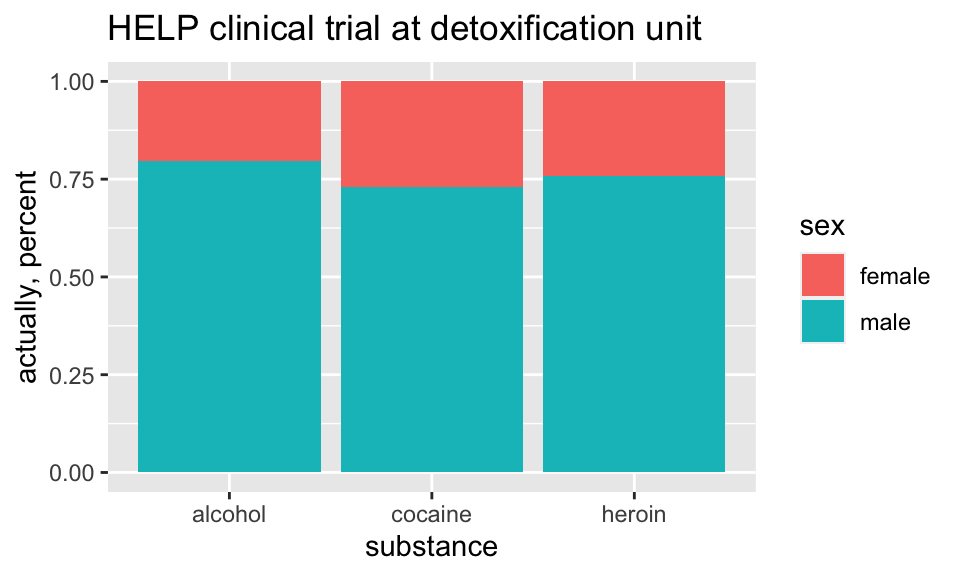


##### How old are people in the HELP study? {-}


```r
HELPrct %>% 
  ggplot(aes(x=age)) + 
  geom_histogram()+
  ggtitle("HELP clinical trial at detoxification unit")
```

```
## `stat_bin()` using `bins = 30`. Pick better value with `binwidth`.
```


Notice the messages

* `stat_bin`:  Histograms are not mapping the raw data but binned data.  
`stat_bin()` performs the data transformation.

* `binwidth`: a default `binwidth` has been selected, but we should really choose our own.

##### Setting the binwidth manually {-}


```r
HELPrct %>% 
  ggplot(aes(x=age)) + 
  geom_histogram(binwidth=2)+
  ggtitle("HELP clinical trial at detoxification unit")
```


##### How old are people in the HELP study? -- Other geoms {-}


```r
HELPrct %>% 
  ggplot(aes(x=age)) + 
  geom_freqpoly(binwidth=2)+
  ggtitle("HELP clinical trial at detoxification unit")
```


```r
HELPrct %>% 
  ggplot(aes(x=age)) + 
  geom_density()+
  ggtitle("HELP clinical trial at detoxification unit")
```


##### Selecting stat and geom manually {-}

Every geom comes with a default stat

* for simple cases, the stat is `stat_identity()` which does nothing
* we can mix and match geoms and stats however we like


```r
HELPrct %>% 
  ggplot(aes(x=age)) + 
  geom_line(stat="density")+
  ggtitle("HELP clinical trial at detoxification unit")
```


##### Selecting stat and geom manually {-}

Every stat comes with a default `geom`, every geom with a default stat

* we can specify stats instead of `geom`, if we prefer
* we can mix and match geoms and stats however we like


```r
HELPrct %>% 
  ggplot(aes(x=age)) + 
  stat_density( geom="line")+
  ggtitle("HELP clinical trial at detoxification unit")
```


##### More combinations {-}


```r
HELPrct %>% 
  ggplot(aes(x=age)) + 
  geom_point(stat="bin", binwidth=3) + 
  geom_line(stat="bin", binwidth=3)  +
  ggtitle("HELP clinical trial at detoxification unit")
```


```r
HELPrct %>% 
  ggplot(aes(x=age)) + 
  geom_area(stat="bin", binwidth=3) +
  ggtitle("HELP clinical trial at detoxification unit") 
```


```r
HELPrct %>% 
  ggplot(aes(x=age)) + 
  geom_point(stat="bin", binwidth=3, aes(size=..count..)) +
  geom_line(stat="bin", binwidth=3) +
  ggtitle("HELP clinical trial at detoxification unit")
```


##### How much do they drink? (i1) {-}


```r
HELPrct %>% 
  ggplot(aes(x=i1)) + geom_histogram()+
  ggtitle("HELP clinical trial at detoxification unit")
```

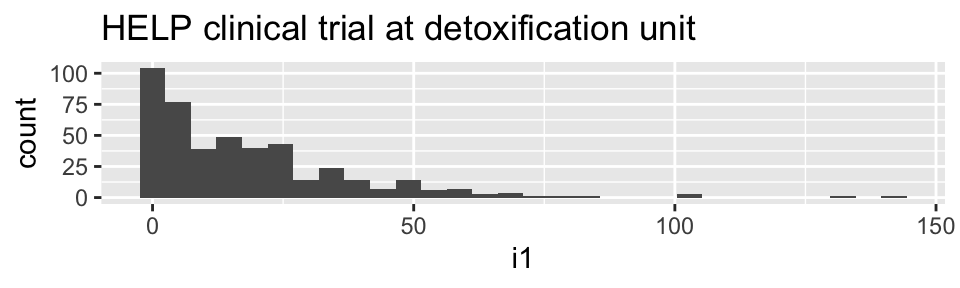


```r
HELPrct %>% 
  ggplot(aes(x=i1)) + geom_density()+
  ggtitle("HELP clinical trial at detoxification unit")
```


```r
HELPrct %>% 
  ggplot(aes(x=i1)) + geom_area(stat="density")+
  ggtitle("HELP clinical trial at detoxification unit")
```


##### Covariates: Adding in more variables {-}


Using `color` and `linetype`:


```r
HELPrct %>% 
  ggplot(aes(x=i1, color=substance, linetype=sex)) + 
  geom_line(stat="density")+
  ggtitle("HELP clinical trial at detoxification unit")
```


Using `color` and `facet`s


```r
HELPrct %>% 
  ggplot(aes(x=i1, color=substance)) + 
  geom_line(stat="density") + facet_grid( . ~ sex )+
  ggtitle("HELP clinical trial at detoxification unit")
```


```r
HELPrct %>% 
  ggplot(aes(x=i1, color=substance)) + 
  geom_line(stat="density") + facet_grid( sex ~ . )+
  ggtitle("HELP clinical trial at detoxification unit")
```


##### Boxplots {-}
Boxplots use `stat_quantile()`  which computes a five-number summary  (roughly the five quartiles of the data) and uses them to define a "box" and "whiskers".

The quantitative variable must be `y`, and there must be an additional `x` variable. 


```r
HELPrct %>% 
  ggplot(aes(x=substance, y=age, color=sex)) + 
  geom_boxplot()+
  ggtitle("HELP clinical trial at detoxification unit")
```


##### Horizontal boxplots {-}

Horizontal boxplots are obtained by flipping the coordinate system:

```r
HELPrct %>% 
  ggplot(aes(x=substance, y=age, color=sex)) + 
  geom_boxplot() +
  coord_flip()+
  ggtitle("HELP clinical trial at detoxification unit")
```

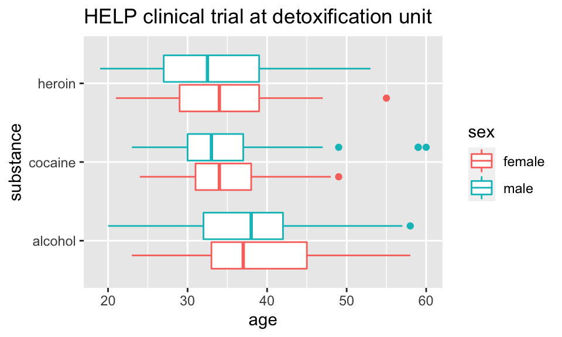

* `coord_flip()` may be used with other plots as well to reverse the roles
of `x` and `y` on the plot.


##### Axes scaling with boxplots {-}

We can scale the continuous axis

```r
HELPrct %>% 
  ggplot(aes(x=substance, y=age, color=sex)) + 
  geom_boxplot() +
  coord_trans(y="log")+
  ggtitle("HELP clinical trial at detoxification unit")
```


##### Give me some space {-}

We've triggered a new feature: `dodge` (for dodging things left/right). We can control how much if we set the dodge manually.


```r
HELPrct %>% 
  ggplot(aes(x=substance, y=age, color=sex)) + 
  geom_boxplot(position=position_dodge(width=1)) +
  ggtitle("HELP clinical trial at detoxification unit")
```


##### Issues with bigger data {-}


```r
require(NHANES)
dim(NHANES)
```

```
## [1] 10000    76
```

```r
NHANES %>%  ggplot(aes(x=Height, y=Weight)) +
  geom_point() + facet_grid( Gender ~ PregnantNow ) +
  ggtitle("National Health and Nutrition Examination Survey")
```


* Although we can see a generally positive association (as we would expect), the over plotting may be hiding information.

##### Using alpha (opacity) {-}

One way to deal with over plotting is to set the opacity low.


```r
NHANES %>% 
  ggplot(aes(x=Height, y=Weight)) +
  geom_point(alpha=0.01) + facet_grid( Gender ~ PregnantNow ) +
  ggtitle("National Health and Nutrition Examination Survey")
```


##### geom_density2d {-}

Alternatively (or simultaneously) we might prefer a different `geom` altogether.


```r
NHANES %>% 
  ggplot(aes(x=Height, y=Weight)) +
  geom_density2d() + facet_grid( Gender ~ PregnantNow ) +
  ggtitle("National Health and Nutrition Examination Survey")
```


##### Multiple layers {-}


```r
ggplot( data=HELPrct, aes(x=sex, y=age)) +
  geom_boxplot(outlier.size=0) +
  geom_jitter(alpha=.6) +
  coord_flip()+
  ggtitle("HELP clinical trial at detoxification unit")
```

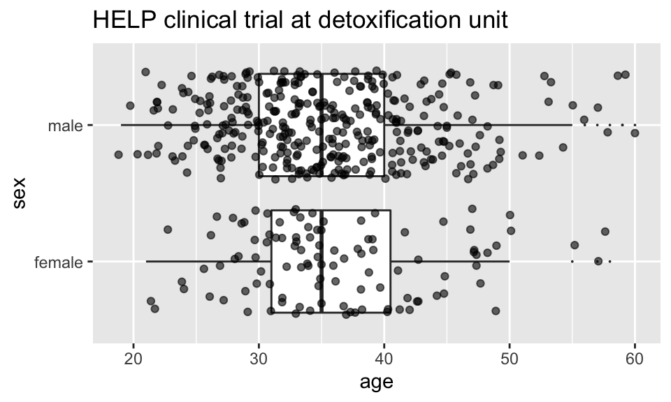

##### Multiple layers {-}


```r
ggplot( data=HELPrct, aes(x=sex, y=age)) +
  geom_boxplot(outlier.size=0) +
  geom_point(alpha=.6, position=position_jitter(width=.1, height=0)) +
  coord_flip()+
  ggtitle("HELP clinical trial at detoxification unit")
```

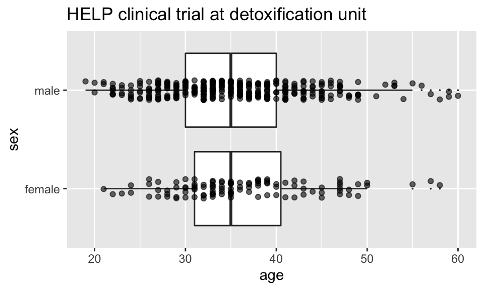


##### Things I haven't mentioned (much) {-}


 * coords (`coord_flip()` is good to know about)
 
 * themes (for customizing appearance)

 * position (`position_dodge()`, `position_jitterdodge()`, `position_stack()`, etc.)
 
 * transforming axes


```r
require(ggthemes)
ggplot(Births78, aes(x=date, y=births)) + geom_point() + 
          theme_wsj()
```


 

```r
ggplot(data=HELPrct, aes(x=substance, y=age, color=sex)) +
  geom_boxplot(coef = 10, position=position_dodge()) +
  geom_point(aes(color=sex, fill=sex), position=position_jitterdodge()) +
  ggtitle("HELP clinical trial at detoxification unit")
```


##### A little bit of everything {-}


```r
ggplot( data=HELPrct, aes(x=substance, y=age, color=sex)) +
  geom_boxplot(coef = 10, position=position_dodge(width=1)) +
  geom_point(aes(fill=sex), alpha=.5, 
             position=position_jitterdodge(dodge.width=1)) + 
  facet_wrap(~homeless)+
  ggtitle("HELP clinical trial at detoxification unit")
```

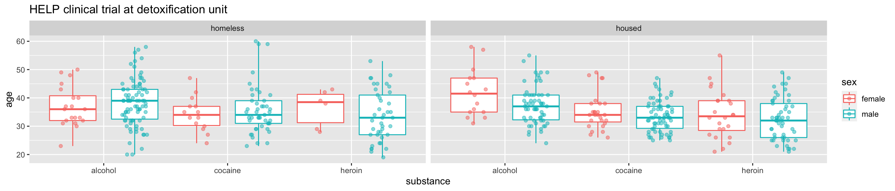


#### Want to learn more? {-}

 * [docs.ggplot2.org/](http://docs.ggplot2.org/)
 
 * Winston Chang's: *R Graphics Cookbook*
 


#### What else can we do? {-}


`shiny`

* interactive graphics / modeling

* https://shiny.rstudio.com/

`plotly` 

> `Plotly` is an R package for creating interactive web-based graphs via plotly's JavaScript graphing library, `plotly.js`. The `plotly` R library contains the `ggplotly` function , which will convert `ggplot2` figures into a Plotly object. Furthermore, you have the option of manipulating the Plotly object with the `style` function.
 
 * https://plot.ly/ggplot2/getting-started/
 
Dynamic documents

 * combination of `RMarkdown`, `ggvis`, and `shiny`
 
 
