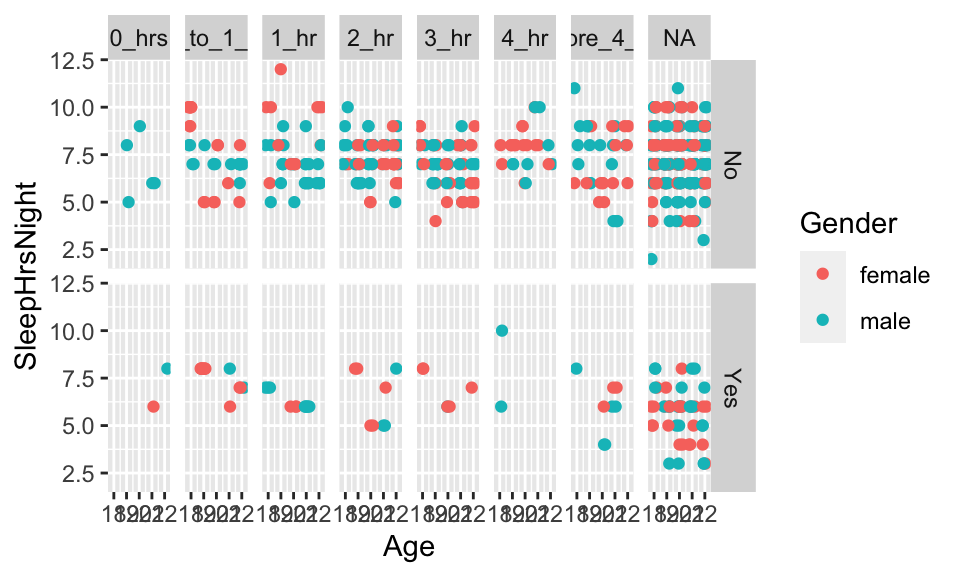
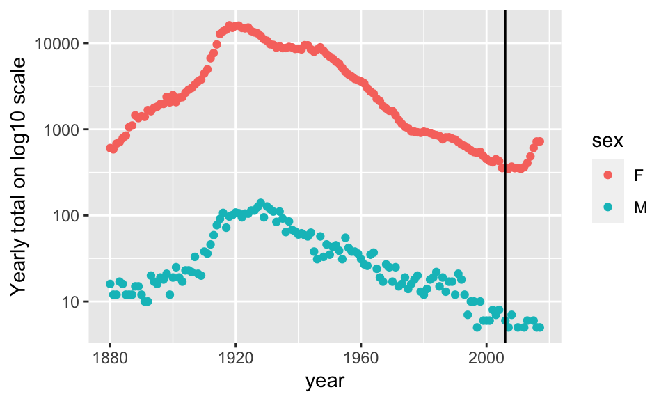
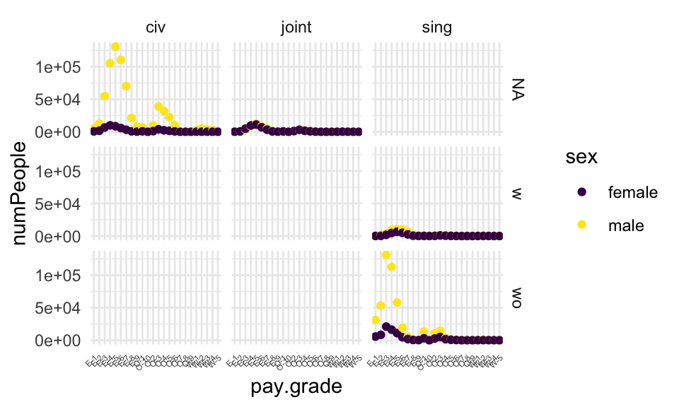

# Data Wrangling {#wrang}


## 9/17/19 Agenda {#Sep17}
1. Tidy Data (structure of data)
2. Piping / chaining
3. Basic data Verbs
4. babynames / NHANES examples

>Information is what we want, but data are what we've got. [@Kaplan15]

**Embrace all the ways to get help!**

1. cheat sheets: https://www.rstudio.com/resources/cheatsheets/
2. tidyverse vignettes: https://www.tidyverse.org/articles/2019/09/tidyr-1-0-0/
3. pivoting: https://tidyr.tidyverse.org/articles/pivot.html
4. google what you need and include `R tidy` or `tidyverse`

## Structure of Data {#datastruc}

For plotting, analyses, model building, etc., it's important that the data be structured in a very particular way.   Hadley Wickham provides a thorough discussion and advice for cleaning up the data in @Wickham14.

* *Tidy Data*: rows (cases/observational units) and columns (variables).  The key is that *every* row is a case and *every} column is a variable.  No exceptions.
* Creating tidy data is not trivial.  We work with objects (often data tables), functions, and arguments (often variables).


The Active Duty data are not tidy!  What are the cases?  How are the data not tidy?  What might the data look like in tidy form?  Suppose that the case was "an individual in the armed forces."  What variables would you use to capture the information in the following table?

https://docs.google.com/spreadsheets/d/1Ow6Cm4z-Z1Yybk3i352msulYCEDOUaOghmo9ALajyHo/edit#gid=1811988794


**Problem:** totals and different sheets

**Better for R:** longer format with columns - grade, gender, status, service, count (case is still the total pay grade)

**Case is individual (?)**:  grade, gender, status, service (no count because each row does the counting)

### Building Tidy Data

Within R (really within any type of computing language, Python, SQL, Java, etc.), we need to understand how to build data using the patterns of the language.  Some things to consider:


* `object_name = function_name(arguments)` is a way of using a function to create a new object.
* `object_name = data_table %>% function_name(arguments)` uses chaining syntax as an extension of the ideas of functions.  In chaining, the value on the left side of `%>%` becomes the *first argument* to the function on the right side.

* 
``` 
object_name = data_table %>%
function_name(arguments) %>% 
function_name(arguments)
```
is extended chaining.  `%>%` is never at the front of the line, it is always connecting one idea with the continuation of that idea on the next line.
* In R, all functions take arguments in round parentheses (as opposed to subsetting observations or variables from data objects which happen with square parentheses).  Additionally, the spot to the left of `%>%` is always a data table.
* The pipe syntax should be read as *then*, `%>%`.

### Examples of Chaining

The pipe syntax (`%>%`) takes a data frame (or data table) and sends it to the argument of a function.  The mapping goes to the first available argument in the function.  For example:

`x %>% f(y)` is the same as `f(x, y)`

` y %>% f(x, ., z)` is the same as `f(x,y,z)`

#### Little Bunny Foo Foo

From Hadley Wickham, how to think about tidy data.

> Little bunny Foo Foo
> Went hopping through the forest
> Scooping up the field mice
> And bopping them on the head

The nursery rhyme could be created by a series of steps where the output from each step is saved as an object along the way.

```
foo_foo <- little_bunny()
foo_foo_1 <- hop(foo_foo, through = forest)
foo_foo_2 <- scoop(foo_foo_2, up = field_mice)
foo_foo_3 <- bop(foo_foo_2, on = head)
```

Another approach is to concatenate the functions so that there is only one output.  

```
bop(
   scoop(
      hop(foo_foo, through = forest),
      up = field_mice),
   on = head)
```

Or even worse, as one line:

```
bop(scoop(hop(foo_foo, through = forest), up = field_mice), on = head)))
```

Instead, the code can be written using the pipe in the **order** in which the function is evaluated:

```
foo_foo %>%
   hop(through = forest) %>%
       scoop(up = field_mice) %>%
           bop(on = head)
```

**babynames**  Each year, the US Social Security Administration publishes a list of the most popular names given to babies.  In 2014, http://www.ssa.gov/oact/babynames/#ht=2 shows Emma and Olivia leading for girls, Noah and Liam for boys.

The `babynames` data table in the `babynames` package comes from the Social Security Administration's listing of the names givens to babies in each year, and the number of babies of each sex given that name. (Only names with 5 or more babies are published by the SSA.)

See wrangExamp.pdf for more examples.

### Data Verbs (on single data frames)

> Super important resource:  The RStudio `dplyr` cheat sheet: https://github.com/rstudio/cheatsheets/raw/master/data-transformation.pdf

**Data verbs take data tables as input and give data tables as output (that's how we can use the chaining syntax!).**  We will use the R package `dplyr` to do much of our data wrangling.  Below is a list of verbs which will be helpful in wrangling many different types of data.  See the Data Wrangling cheat sheet from RStudio for additional help.   https://www.rstudio.com/wp-content/uploads/2015/02/data-wrangling-cheatsheet.pdf}

* `sample_n()` take a random row(s)
 * `head()`  grab the first few rows
 * `tail()` grab the last few rows
 * `filter()`  removes unwanted *cases}
 *  `arrange()` reorders the cases
 *  `select()` removes unwanted *variables}   (and `rename()` )
 *  `distinct()` returns the unique values in a table
 * `mutate()` transforms the variable (and `transmute()` like mutate, returns only new variables)
 *  `group_by()` 
`group_by` tells R that SUCCESSIVE functions keep in mind that there are groups of items.  So `group_by` only makes sense with variables later on (like `summarize`).
 *  `summarize()`  collapses a data frame to a single row.  Not useful yet (will be useful with `group_by()`).  Some functions that are used within `summarize()` include:
\begin{itemize}
* `min(), max(), mean(), sum(), sd(), median()`, and `IQR()`
* `n()`: number of observations in the current group
* `n_distinct(x)`: count the number of unique values in `x`
* `first_value(x), last_value(x)` and `nth_value(x, n)`: work similarly to `x[1], x[length(x)]`, and `x[n]` 


<!--
The following Shiny app ("Visualizing data manipulation operations") is for demonstrating how to work with dplyr/tidyr data manipulation.  It includes tabs for data selection, `filter` and `select`, `mutate`, `group_by` and `summarize`, `group_by` and `mutate`, and `join`.   http://rstudio.calvin.edu:3838/rpruim/dataOps/
-->

## R examples, basic verbs

  
### Datasets


**starwars** is from `dplyr`, although originally from SWAPI, the Star Wars API, http://swapi.co/.

**NHANES** From `?NHANES`:  NHANES is survey data collected by the US National Center for Health Statistics (NCHS) which has conducted a series of health and nutrition surveys since the early 1960's. Since 1999 approximately 5,000 individuals of all ages are interviewed in their homes every year and complete the health examination component of the survey. The health examination is conducted in a mobile examination centre (MEC).

**babynames**  Each year, the US Social Security Administration publishes a list of the most popular names given to babies.  In 2018, http://www.ssa.gov/oact/babynames/#ht=2 shows Emma and Olivia leading for girls, Noah and Liam for boys. (Only names with 5 or more babies are published by the SSA.)

  
### Examples of Chaining


```r
library(babynames)
babynames %>% nrow()
```

```
## [1] 1924665
```

```r
babynames %>% names()
```

```
## [1] "year" "sex"  "name" "n"    "prop"
```

```r
babynames %>% glimpse()
```

```
## Observations: 1,924,665
## Variables: 5
## $ year <dbl> 1880, 1880, 1880, 1880, 1880, 1880, 1880, 1880, 1880, 1880,…
## $ sex  <chr> "F", "F", "F", "F", "F", "F", "F", "F", "F", "F", "F", "F",…
## $ name <chr> "Mary", "Anna", "Emma", "Elizabeth", "Minnie", "Margaret", …
## $ n    <int> 7065, 2604, 2003, 1939, 1746, 1578, 1472, 1414, 1320, 1288,…
## $ prop <dbl> 0.07238359, 0.02667896, 0.02052149, 0.01986579, 0.01788843,…
```

```r
babynames %>% head()
```

```
## # A tibble: 6 x 5
##    year sex   name          n   prop
##   <dbl> <chr> <chr>     <int>  <dbl>
## 1  1880 F     Mary       7065 0.0724
## 2  1880 F     Anna       2604 0.0267
## 3  1880 F     Emma       2003 0.0205
## 4  1880 F     Elizabeth  1939 0.0199
## 5  1880 F     Minnie     1746 0.0179
## 6  1880 F     Margaret   1578 0.0162
```

```r
babynames %>% tail()
```

```
## # A tibble: 6 x 5
##    year sex   name       n       prop
##   <dbl> <chr> <chr>  <int>      <dbl>
## 1  2017 M     Zyhier     5 0.00000255
## 2  2017 M     Zykai      5 0.00000255
## 3  2017 M     Zykeem     5 0.00000255
## 4  2017 M     Zylin      5 0.00000255
## 5  2017 M     Zylis      5 0.00000255
## 6  2017 M     Zyrie      5 0.00000255
```

```r
babynames %>% sample_n(size=5)
```

```
## # A tibble: 5 x 5
##    year sex   name       n       prop
##   <dbl> <chr> <chr>  <int>      <dbl>
## 1  1997 M     Jaqwon     5 0.0000025 
## 2  1988 F     Jamera     7 0.00000364
## 3  2001 M     Othon      6 0.0000029 
## 4  2001 M     Dean     744 0.000360  
## 5  2006 F     Ngoc       8 0.00000383
```

```r
babynames %>% mosaic::favstats(n ~ sex, data = .)
```

```
##   sex min Q1 median Q3   max     mean       sd       n missing
## 1   F   5  7     11 31 99686 151.4294 1180.557 1138293       0
## 2   M   5  7     12 33 94756 223.4940 1932.338  786372       0
```


### Data Verbs

Taken from the dplyr tutorial: http://dplyr.tidyverse.org/

#### Starwars

```r
library(dplyr)

starwars %>% dim()
```

```
## [1] 87 13
```

```r
starwars %>% names()
```

```
##  [1] "name"       "height"     "mass"       "hair_color" "skin_color"
##  [6] "eye_color"  "birth_year" "gender"     "homeworld"  "species"   
## [11] "films"      "vehicles"   "starships"
```

```r
starwars %>% head()
```

```
## # A tibble: 6 x 13
##   name  height  mass hair_color skin_color eye_color birth_year gender
##   <chr>  <int> <dbl> <chr>      <chr>      <chr>          <dbl> <chr> 
## 1 Luke…    172    77 blond      fair       blue            19   male  
## 2 C-3PO    167    75 <NA>       gold       yellow         112   <NA>  
## 3 R2-D2     96    32 <NA>       white, bl… red             33   <NA>  
## 4 Dart…    202   136 none       white      yellow          41.9 male  
## 5 Leia…    150    49 brown      light      brown           19   female
## 6 Owen…    178   120 brown, gr… light      blue            52   male  
## # … with 5 more variables: homeworld <chr>, species <chr>, films <list>,
## #   vehicles <list>, starships <list>
```

```r
starwars %>%
  mosaic::favstats(mass~gender, data = .)
```

```
##          gender  min      Q1 median      Q3  max       mean       sd  n
## 1        female   45   49.25   52.5   55.90   75   54.02000  8.37215 10
## 2 hermaphrodite 1358 1358.00 1358.0 1358.00 1358 1358.00000       NA  1
## 3          male   15   76.50   80.0   87.25  159   81.00455 28.22371 44
## 4          none  140  140.00  140.0  140.00  140  140.00000       NA  1
##   missing
## 1       9
## 2       0
## 3      18
## 4       1
```

```r
starwars %>% 
  dplyr::filter(species == "Droid")
```

```
## # A tibble: 5 x 13
##   name  height  mass hair_color skin_color eye_color birth_year gender
##   <chr>  <int> <dbl> <chr>      <chr>      <chr>          <dbl> <chr> 
## 1 C-3PO    167    75 <NA>       gold       yellow           112 <NA>  
## 2 R2-D2     96    32 <NA>       white, bl… red               33 <NA>  
## 3 R5-D4     97    32 <NA>       white, red red               NA <NA>  
## 4 IG-88    200   140 none       metal      red               15 none  
## 5 BB8       NA    NA none       none       black             NA none  
## # … with 5 more variables: homeworld <chr>, species <chr>, films <list>,
## #   vehicles <list>, starships <list>
```

```r
starwars %>% 
  dplyr::filter(species != "Droid") %>%
  mosaic::favstats(mass~gender, data = .)
```

```
##          gender  min     Q1 median      Q3  max       mean        sd  n
## 1        female   45   50.0     55   56.20   75   54.68889  8.591921  9
## 2 hermaphrodite 1358 1358.0   1358 1358.00 1358 1358.00000        NA  1
## 3          male   15   76.5     80   87.25  159   81.00455 28.223707 44
##   missing
## 1       7
## 2       0
## 3      16
```

```r
starwars %>% 
  dplyr::select(name, ends_with("color"))
```

```
## # A tibble: 87 x 4
##    name               hair_color    skin_color  eye_color
##    <chr>              <chr>         <chr>       <chr>    
##  1 Luke Skywalker     blond         fair        blue     
##  2 C-3PO              <NA>          gold        yellow   
##  3 R2-D2              <NA>          white, blue red      
##  4 Darth Vader        none          white       yellow   
##  5 Leia Organa        brown         light       brown    
##  6 Owen Lars          brown, grey   light       blue     
##  7 Beru Whitesun lars brown         light       blue     
##  8 R5-D4              <NA>          white, red  red      
##  9 Biggs Darklighter  black         light       brown    
## 10 Obi-Wan Kenobi     auburn, white fair        blue-gray
## # … with 77 more rows
```

```r
starwars %>% 
  dplyr::mutate(name, bmi = mass / ((height / 100)  ^ 2)) %>%
  dplyr::select(name:mass, bmi)
```

```
## # A tibble: 87 x 4
##    name               height  mass   bmi
##    <chr>               <int> <dbl> <dbl>
##  1 Luke Skywalker        172    77  26.0
##  2 C-3PO                 167    75  26.9
##  3 R2-D2                  96    32  34.7
##  4 Darth Vader           202   136  33.3
##  5 Leia Organa           150    49  21.8
##  6 Owen Lars             178   120  37.9
##  7 Beru Whitesun lars    165    75  27.5
##  8 R5-D4                  97    32  34.0
##  9 Biggs Darklighter     183    84  25.1
## 10 Obi-Wan Kenobi        182    77  23.2
## # … with 77 more rows
```

```r
starwars %>% 
  dplyr::arrange(desc(mass))
```

```
## # A tibble: 87 x 13
##    name  height  mass hair_color skin_color eye_color birth_year gender
##    <chr>  <int> <dbl> <chr>      <chr>      <chr>          <dbl> <chr> 
##  1 Jabb…    175  1358 <NA>       green-tan… orange         600   herma…
##  2 Grie…    216   159 none       brown, wh… green, y…       NA   male  
##  3 IG-88    200   140 none       metal      red             15   none  
##  4 Dart…    202   136 none       white      yellow          41.9 male  
##  5 Tarf…    234   136 brown      brown      blue            NA   male  
##  6 Owen…    178   120 brown, gr… light      blue            52   male  
##  7 Bossk    190   113 none       green      red             53   male  
##  8 Chew…    228   112 brown      unknown    blue           200   male  
##  9 Jek …    180   110 brown      fair       blue            NA   male  
## 10 Dext…    198   102 none       brown      yellow          NA   male  
## # … with 77 more rows, and 5 more variables: homeworld <chr>,
## #   species <chr>, films <list>, vehicles <list>, starships <list>
```

```r
starwars %>%
  dplyr::group_by(species) %>%
  dplyr::summarise(
    n = n(),
    mass = mean(mass, na.rm = TRUE)
  ) %>%
  dplyr::filter(n > 1)
```

```
## # A tibble: 9 x 3
##   species      n  mass
##   <chr>    <int> <dbl>
## 1 Droid        5  69.8
## 2 Gungan       3  74  
## 3 Human       35  82.8
## 4 Kaminoan     2  88  
## 5 Mirialan     2  53.1
## 6 Twi'lek      2  55  
## 7 Wookiee      2 124  
## 8 Zabrak       2  80  
## 9 <NA>         5  48
```


#### NHANES

```r
require(NHANES)
names(NHANES)
```

```
##  [1] "ID"               "SurveyYr"         "Gender"          
##  [4] "Age"              "AgeDecade"        "AgeMonths"       
##  [7] "Race1"            "Race3"            "Education"       
## [10] "MaritalStatus"    "HHIncome"         "HHIncomeMid"     
## [13] "Poverty"          "HomeRooms"        "HomeOwn"         
## [16] "Work"             "Weight"           "Length"          
## [19] "HeadCirc"         "Height"           "BMI"             
## [22] "BMICatUnder20yrs" "BMI_WHO"          "Pulse"           
## [25] "BPSysAve"         "BPDiaAve"         "BPSys1"          
## [28] "BPDia1"           "BPSys2"           "BPDia2"          
## [31] "BPSys3"           "BPDia3"           "Testosterone"    
## [34] "DirectChol"       "TotChol"          "UrineVol1"       
## [37] "UrineFlow1"       "UrineVol2"        "UrineFlow2"      
## [40] "Diabetes"         "DiabetesAge"      "HealthGen"       
## [43] "DaysPhysHlthBad"  "DaysMentHlthBad"  "LittleInterest"  
## [46] "Depressed"        "nPregnancies"     "nBabies"         
## [49] "Age1stBaby"       "SleepHrsNight"    "SleepTrouble"    
## [52] "PhysActive"       "PhysActiveDays"   "TVHrsDay"        
## [55] "CompHrsDay"       "TVHrsDayChild"    "CompHrsDayChild" 
## [58] "Alcohol12PlusYr"  "AlcoholDay"       "AlcoholYear"     
## [61] "SmokeNow"         "Smoke100"         "Smoke100n"       
## [64] "SmokeAge"         "Marijuana"        "AgeFirstMarij"   
## [67] "RegularMarij"     "AgeRegMarij"      "HardDrugs"       
## [70] "SexEver"          "SexAge"           "SexNumPartnLife" 
## [73] "SexNumPartYear"   "SameSex"          "SexOrientation"  
## [76] "PregnantNow"
```

```r
# find the sleep variables
NHANESsleep <- NHANES %>% select(Gender, Age, Weight, Race1, Race3, Education, SleepTrouble, 
                                 SleepHrsNight, TVHrsDay, TVHrsDayChild, PhysActive)
names(NHANESsleep)
```

```
##  [1] "Gender"        "Age"           "Weight"        "Race1"        
##  [5] "Race3"         "Education"     "SleepTrouble"  "SleepHrsNight"
##  [9] "TVHrsDay"      "TVHrsDayChild" "PhysActive"
```

```r
dim(NHANESsleep)
```

```
## [1] 10000    11
```

```r
# subset for college students
NHANESsleep <- NHANESsleep %>% filter(Age %in% c(18:22)) %>% 
  mutate(Weightlb = Weight*2.2)

names(NHANESsleep)
```

```
##  [1] "Gender"        "Age"           "Weight"        "Race1"        
##  [5] "Race3"         "Education"     "SleepTrouble"  "SleepHrsNight"
##  [9] "TVHrsDay"      "TVHrsDayChild" "PhysActive"    "Weightlb"
```

```r
dim(NHANESsleep)
```

```
## [1] 655  12
```

```r
NHANESsleep %>% ggplot(aes(x=Age, y=SleepHrsNight, color=Gender)) + 
  geom_point(position=position_jitter(width=.25, height=0) ) + 
  facet_grid(SleepTrouble ~ TVHrsDay) 
```


  
### `summarise` and `group_by`

```r
# number of people (cases) in NHANES
NHANES %>% summarise(n())
```

```
## # A tibble: 1 x 1
##   `n()`
##   <int>
## 1 10000
```

```r
# total weight of all the people in NHANES (silly)
NHANES %>% mutate(Weightlb = Weight*2.2) %>% summarise(sum(Weightlb, na.rm=TRUE))
```

```
## # A tibble: 1 x 1
##   `sum(Weightlb, na.rm = TRUE)`
##                           <dbl>
## 1                      1549419.
```

```r
# mean weight of all the people in NHANES
NHANES %>% mutate(Weightlb = Weight*2.2) %>% summarise(mean(Weightlb, na.rm=TRUE))
```

```
## # A tibble: 1 x 1
##   `mean(Weightlb, na.rm = TRUE)`
##                            <dbl>
## 1                           156.
```

```r
# repeat the above but for groups

# males versus females
NHANES %>% group_by(Gender) %>% summarise(n())
```

```
## # A tibble: 2 x 2
##   Gender `n()`
##   <fct>  <int>
## 1 female  5020
## 2 male    4980
```

```r
NHANES %>% group_by(Gender) %>% mutate(Weightlb = Weight*2.2) %>% 
  summarise(mean(Weightlb, na.rm=TRUE))
```

```
## # A tibble: 2 x 2
##   Gender `mean(Weightlb, na.rm = TRUE)`
##   <fct>                           <dbl>
## 1 female                           146.
## 2 male                             167.
```

```r
# smokers and non-smokers
NHANES %>% group_by(SmokeNow) %>% summarise(n())
```

```
## # A tibble: 3 x 2
##   SmokeNow `n()`
##   <fct>    <int>
## 1 No        1745
## 2 Yes       1466
## 3 <NA>      6789
```

```r
NHANES %>% group_by(SmokeNow) %>% mutate(Weightlb = Weight*2.2) %>% 
  summarise(mean(Weightlb, na.rm=TRUE))
```

```
## # A tibble: 3 x 2
##   SmokeNow `mean(Weightlb, na.rm = TRUE)`
##   <fct>                             <dbl>
## 1 No                                 186.
## 2 Yes                                177.
## 3 <NA>                               144.
```

```r
# people with and without diabetes
NHANES %>% group_by(Diabetes) %>% summarise(n())
```

```
## # A tibble: 3 x 2
##   Diabetes `n()`
##   <fct>    <int>
## 1 No        9098
## 2 Yes        760
## 3 <NA>       142
```

```r
NHANES %>% group_by(Diabetes) %>% mutate(Weightlb = Weight*2.2) %>% 
  summarise(mean(Weightlb, na.rm=TRUE))
```

```
## # A tibble: 3 x 2
##   Diabetes `mean(Weightlb, na.rm = TRUE)`
##   <fct>                             <dbl>
## 1 No                                155. 
## 2 Yes                               202. 
## 3 <NA>                               21.6
```

```r
# break down the smokers versus non-smokers further, by sex
NHANES %>% group_by(SmokeNow, Gender) %>% summarise(n())
```

```
## # A tibble: 6 x 3
## # Groups:   SmokeNow [3]
##   SmokeNow Gender `n()`
##   <fct>    <fct>  <int>
## 1 No       female   764
## 2 No       male     981
## 3 Yes      female   638
## 4 Yes      male     828
## 5 <NA>     female  3618
## 6 <NA>     male    3171
```

```r
NHANES %>% group_by(SmokeNow, Gender) %>% mutate(Weightlb = Weight*2.2) %>% 
  summarise(mean(Weightlb, na.rm=TRUE))
```

```
## # A tibble: 6 x 3
## # Groups:   SmokeNow [3]
##   SmokeNow Gender `mean(Weightlb, na.rm = TRUE)`
##   <fct>    <fct>                           <dbl>
## 1 No       female                           167.
## 2 No       male                             201.
## 3 Yes      female                           167.
## 4 Yes      male                             185.
## 5 <NA>     female                           138.
## 6 <NA>     male                             151.
```

```r
# break down the people with diabetes further, by smoking
NHANES %>% group_by(Diabetes, SmokeNow) %>% summarise(n())
```

```
## # A tibble: 8 x 3
## # Groups:   Diabetes [3]
##   Diabetes SmokeNow `n()`
##   <fct>    <fct>    <int>
## 1 No       No        1476
## 2 No       Yes       1360
## 3 No       <NA>      6262
## 4 Yes      No         267
## 5 Yes      Yes        106
## 6 Yes      <NA>       387
## 7 <NA>     No           2
## 8 <NA>     <NA>       140
```

```r
NHANES %>% group_by(Diabetes, SmokeNow) %>% mutate(Weightlb = Weight*2.2) %>% 
  summarise(mean(Weightlb, na.rm=TRUE))
```

```
## # A tibble: 8 x 3
## # Groups:   Diabetes [3]
##   Diabetes SmokeNow `mean(Weightlb, na.rm = TRUE)`
##   <fct>    <fct>                             <dbl>
## 1 No       No                                183. 
## 2 No       Yes                               175. 
## 3 No       <NA>                              143. 
## 4 Yes      No                                204. 
## 5 Yes      Yes                               204. 
## 6 Yes      <NA>                              199. 
## 7 <NA>     No                                193. 
## 8 <NA>     <NA>                               19.1
```
  
### babynames


```r
babynames %>% group_by(sex) %>%
  summarise(total=sum(n))
```

```
## # A tibble: 2 x 2
##   sex       total
##   <chr>     <int>
## 1 F     172371079
## 2 M     175749438
```

```r
babynames %>% group_by(year, sex) %>%
  summarise(name_count = n_distinct(name)) %>% head()
```

```
## # A tibble: 6 x 3
## # Groups:   year [3]
##    year sex   name_count
##   <dbl> <chr>      <int>
## 1  1880 F            942
## 2  1880 M           1058
## 3  1881 F            938
## 4  1881 M            997
## 5  1882 F           1028
## 6  1882 M           1099
```

```r
babynames %>% group_by(year, sex) %>%
  summarise(name_count = n_distinct(name)) %>% tail()
```

```
## # A tibble: 6 x 3
## # Groups:   year [3]
##    year sex   name_count
##   <dbl> <chr>      <int>
## 1  2015 F          19074
## 2  2015 M          14024
## 3  2016 F          18817
## 4  2016 M          14162
## 5  2017 F          18309
## 6  2017 M          14160
```

```r
babysamp <- babynames %>% sample_n(size=50)
babysamp %>% select(year) %>% distinct() %>% table()
```

```
## .
## 1898 1903 1911 1913 1917 1919 1920 1921 1922 1928 1929 1935 1946 1948 1950 
##    1    1    1    1    1    1    1    1    1    1    1    1    1    1    1 
## 1951 1954 1956 1958 1962 1970 1972 1973 1975 1977 1978 1980 1983 1985 1989 
##    1    1    1    1    1    1    1    1    1    1    1    1    1    1    1 
## 1991 1998 1999 2001 2002 2003 2006 2007 2008 2009 2011 2014 2015 2017 
##    1    1    1    1    1    1    1    1    1    1    1    1    1    1
```

```r
babysamp %>% distinct() %>% select(year) %>% table()
```

```
## .
## 1898 1903 1911 1913 1917 1919 1920 1921 1922 1928 1929 1935 1946 1948 1950 
##    1    1    1    1    1    1    1    1    1    1    1    1    2    1    1 
## 1951 1954 1956 1958 1962 1970 1972 1973 1975 1977 1978 1980 1983 1985 1989 
##    1    1    1    1    1    1    1    1    1    1    1    1    1    2    1 
## 1991 1998 1999 2001 2002 2003 2006 2007 2008 2009 2011 2014 2015 2017 
##    2    3    1    1    1    1    1    1    1    1    1    1    2    1
```

```r
Frances <- babynames %>%
  filter(name== "Frances") %>%
  group_by(year, sex) %>%
  summarise(yrTot = sum(n))

Frances %>% ggplot(aes(x=year, y=yrTot)) +
  geom_point(aes(color=sex)) + 
  geom_vline(xintercept=2006) + scale_y_log10() +
  ylab("Yearly total on log10 scale")
```


  


## 9/19/19 Agenda {#Sep19}
1. Higher level data verbs: `gather`, `spread`, `join`
2. `lubridate`

## Higher Level Data Verbs {#highverb}

There are more complicated verbs which may be important for more sophisticated analyses.  See the RStudio `dplyr` cheat sheet,  https://www.rstudio.com/wp-content/uploads/2015/02/data-wrangling-cheatsheet.pdf}.


* `gather` makes many columns into 2 columns: gather(data, key, value, columns)
* `spread` makes one column into multiple columns: spread(data, key, value)
* `left_join` returns all rows from the left table, and any rows with matching keys from the right table.
* `inner_join` returns only the rows in which the left table have matching keys in the right table (i.e., matching rows in both sets).
* `full_join` returns all rows from both tables, join records from the left which have matching keys in the right table.


Good practice:  always specify the `by` argument when joining data frames.


## R examples, higher level verbs

<!--
In class example on babynames via Nick  http://dtkaplan.github.io/CVC/Summer2015/Learn/BabyNames/WhatHappenedToJane.Rmd   http://dtkaplan.github.io/CVC/Summer2015/Learn/BabyNames/WhatHappenedToJane-answers.pdf
-->

`tidyr 1.0.0` has just been released!  The new release means that you need to update `tidyr`.  You will know if you have the latest version if the following command works in the console (window below):

```
?tidyr::pivot_longer
```

If you are familiar with `spread` and `gather`, you should acquaint yourself with `pivot_longer()` and `pivot_wider()`.  The idea is to go from very wide dataframes to very long dataframes and vice versa.

### `pivot_longer`

`pivot` the military paygrade to become longer? 


```r
library(googlesheets4)
sheets_auth()

navy_gs = read_sheet("https://docs.google.com/spreadsheets/d/1Ow6Cm4z-Z1Yybk3i352msulYCEDOUaOghmo9ALajyHo/edit#gid=1877566408", 
                     col_types = "ccnnnnnnnnnnnnnnn")
```


```r
dplyr::glimpse(navy_gs)
```

```
## Observations: 38
## Variables: 17
## $ ...1                 <chr> NA, NA, NA, NA, NA, NA, NA, NA, NA, NA, NA,…
## $ `Active Duty Family` <chr> NA, "Marital Status Report", NA, "Data Refl…
## $ ...3                 <dbl> NA, NA, NA, NA, NA, NA, NA, NA, 31229, 5309…
## $ ...4                 <dbl> NA, NA, NA, NA, NA, NA, NA, NA, 5717, 8388,…
## $ ...5                 <dbl> NA, NA, NA, NA, NA, NA, NA, NA, 36946, 6148…
## $ ...6                 <dbl> NA, NA, NA, NA, NA, NA, NA, NA, 563, 1457, …
## $ ...7                 <dbl> NA, NA, NA, NA, NA, NA, NA, NA, 122, 275, 1…
## $ ...8                 <dbl> NA, NA, NA, NA, NA, NA, NA, NA, 685, 1732, …
## $ ...9                 <dbl> NA, NA, NA, NA, NA, NA, NA, NA, 139, 438, 3…
## $ ...10                <dbl> NA, NA, NA, NA, NA, NA, NA, NA, 141, 579, 4…
## $ ...11                <dbl> NA, NA, NA, NA, NA, NA, NA, NA, 280, 1017, …
## $ ...12                <dbl> NA, NA, NA, NA, NA, NA, NA, NA, 5060, 12483…
## $ ...13                <dbl> NA, NA, NA, NA, NA, NA, NA, NA, 719, 1682, …
## $ ...14                <dbl> NA, NA, NA, NA, NA, NA, NA, NA, 5779, 14165…
## $ ...15                <dbl> NA, NA, NA, NA, NA, NA, NA, NA, 36991, 6747…
## $ ...16                <dbl> NA, NA, NA, NA, NA, NA, NA, NA, 6699, 10924…
## $ ...17                <dbl> NA, NA, NA, NA, NA, NA, NA, NA, 43690, 7839…
```

```r
names(navy_gs) = c("X","pay.grade", "male.sing.wo", "female.sing.wo",
                   "tot.sing.wo", "male.sing.w", "female.sing.w", 
                   "tot.sing.w", "male.joint.NA", "female.joint.NA",
                   "tot.joint.NA", "male.civ.NA", "female.civ.NA",
                   "tot.civ.NA", "male.tot.NA", "female.tot.NA", 
                   "tot.tot.NA")
navy = navy_gs[-c(1:8), -1]
dplyr::glimpse(navy)
```

```
## Observations: 30
## Variables: 16
## $ pay.grade       <chr> "E-1", "E-2", "E-3", "E-4", "E-5", "E-6", "E-7",…
## $ male.sing.wo    <dbl> 31229, 53094, 131091, 112710, 57989, 19125, 5446…
## $ female.sing.wo  <dbl> 5717, 8388, 21019, 16381, 11021, 4654, 1913, 438…
## $ tot.sing.wo     <dbl> 36946, 61482, 152110, 129091, 69010, 23779, 7359…
## $ male.sing.w     <dbl> 563, 1457, 4264, 9491, 10937, 10369, 6530, 1786,…
## $ female.sing.w   <dbl> 122, 275, 1920, 4662, 6576, 4962, 2585, 513, 144…
## $ tot.sing.w      <dbl> 685, 1732, 6184, 14153, 17513, 15331, 9115, 2299…
## $ male.joint.NA   <dbl> 139, 438, 3579, 8661, 12459, 8474, 5065, 1423, 4…
## $ female.joint.NA <dbl> 141, 579, 4902, 9778, 11117, 6961, 3291, 651, 15…
## $ tot.joint.NA    <dbl> 280, 1017, 8481, 18439, 23576, 15435, 8356, 2074…
## $ male.civ.NA     <dbl> 5060, 12483, 54795, 105556, 130944, 110322, 7000…
## $ female.civ.NA   <dbl> 719, 1682, 6641, 9961, 8592, 5827, 3206, 820, 29…
## $ tot.civ.NA      <dbl> 5779, 14165, 61436, 115517, 139536, 116149, 7320…
## $ male.tot.NA     <dbl> 36991, 67472, 193729, 236418, 212329, 148290, 87…
## $ female.tot.NA   <dbl> 6699, 10924, 34482, 40782, 37306, 22404, 10995, …
## $ tot.tot.NA      <dbl> 43690, 78396, 228211, 277200, 249635, 170694, 98…
```

```r
# get rid of total columns & rows:

navyWR = navy %>% dplyr::select(-contains("tot")) %>%
   dplyr::filter(substr(pay.grade, 1, 5) != "TOTAL" & substr(pay.grade, 1, 5) != "GRAND" ) %>%
   tidyr::pivot_longer(-pay.grade, values_to = "numPeople", names_to = "status") %>%
   tidyr::separate(status, into = c("sex", "marital", "kids"))

navyWR %>% head()
```

```
## # A tibble: 6 x 5
##   pay.grade sex    marital kids  numPeople
##   <chr>     <chr>  <chr>   <chr>     <dbl>
## 1 E-1       male   sing    wo        31229
## 2 E-1       female sing    wo         5717
## 3 E-1       male   sing    w           563
## 4 E-1       female sing    w           122
## 5 E-1       male   joint   NA          139
## 6 E-1       female joint   NA          141
```

Does a graph tell us if we did it right?  what if we had done it wrong...?

```r
navyWR %>% ggplot(aes(x=pay.grade, y=numPeople, color=sex)) + 
  geom_point()  + facet_grid(kids~marital)
```



### `pivot_wider`


```r
library(babynames)
babynames %>% dplyr::select(-prop) %>%
   tidyr::pivot_wider(names_from = sex, values_from = n) %>% 
   head()
```

```
## # A tibble: 6 x 4
##    year name          F     M
##   <dbl> <chr>     <int> <int>
## 1  1880 Mary       7065    27
## 2  1880 Anna       2604    12
## 3  1880 Emma       2003    10
## 4  1880 Elizabeth  1939     9
## 5  1880 Minnie     1746     9
## 6  1880 Margaret   1578    NA
```


```r
babynames %>% 
  dplyr::select(-prop) %>% 
  tidyr::pivot_wider(names_from = sex, values_from = n) %>%
  dplyr::filter(!is.na(F) & !is.na(M)) %>%
  arrange(desc(year), desc(M))
```

```
## # A tibble: 168,381 x 4
##     year name         F     M
##    <dbl> <chr>    <int> <int>
##  1  2017 Liam        36 18728
##  2  2017 Noah       170 18326
##  3  2017 William     18 14904
##  4  2017 James       77 14232
##  5  2017 Logan     1103 13974
##  6  2017 Benjamin     8 13733
##  7  2017 Mason       58 13502
##  8  2017 Elijah      26 13268
##  9  2017 Oliver      15 13141
## 10  2017 Jacob       16 13106
## # … with 168,371 more rows
```


```r
babynames %>% 
  tidyr::pivot_wider(names_from = sex, values_from = n) %>%
  dplyr::filter(!is.na(F) & !is.na(M)) %>%
  arrange(desc(prop))
```

```
## # A tibble: 12 x 5
##     year name            prop     F     M
##    <dbl> <chr>          <dbl> <int> <int>
##  1  1986 Marquette 0.0000130     24    25
##  2  1996 Dariel    0.0000115     22    23
##  3  2014 Laramie   0.0000108     21    22
##  4  1939 Earnie    0.00000882    10    10
##  5  1939 Vertis    0.00000882    10    10
##  6  1921 Vernis    0.00000703     9     8
##  7  1939 Alvia     0.00000529     6     6
##  8  1939 Eudell    0.00000529     6     6
##  9  1939 Ladell    0.00000529     6     6
## 10  1939 Lory      0.00000529     6     6
## 11  1939 Maitland  0.00000529     6     6
## 12  1939 Delaney   0.00000441     5     5
```

### `join` (use `join` to **merge** two datasets)

#### First get the data (GapMinder)

Both of the following datasets come from GapMinder.  The first represents country, year, and female literacy rate.  The second represents country, year, and GDP (in fixed 2000 US$).


```r
litF = read_sheet("https://docs.google.com/spreadsheets/d/1hDinTIRHQIaZg1RUn6Z_6mo12PtKwEPFIz_mJVF6P5I/pub?gid=0")

litF = litF %>% dplyr::select(country=starts_with("Adult"), starts_with("1"), starts_with("2")) %>%
  tidyr::pivot_longer(-country, names_to = "year", values_to = "litRateF") %>%
  dplyr::filter(!is.na(litRateF))
```


```r
gdp = read_sheet("https://docs.google.com/spreadsheets/d/1RctTQmKB0hzbm1E8rGcufYdMshRdhmYdeL29nXqmvsc/pub?gid=0")

gdp = gdp %>% dplyr::select(country = starts_with("Income"), starts_with("1"), starts_with("2")) %>%
  tidyr::pivot_longer(-country, names_to = "year", values_to = "gdp") %>%
  dplyr::filter(!is.na(gdp))
```
  

```r
head(litF)
```

```
## # A tibble: 6 x 3
##   country     year  litRateF
##   <chr>       <chr>    <dbl>
## 1 Afghanistan 1979      4.99
## 2 Afghanistan 2011     13   
## 3 Albania     2001     98.3 
## 4 Albania     2008     94.7 
## 5 Albania     2011     95.7 
## 6 Algeria     1987     35.8
```

```r
head(gdp)
```

```
## # A tibble: 6 x 3
##   country year    gdp
##   <chr>   <chr> <dbl>
## 1 Albania 1980  1061.
## 2 Albania 1981  1100.
## 3 Albania 1982  1111.
## 4 Albania 1983  1101.
## 5 Albania 1984  1065.
## 6 Albania 1985  1060.
```

```r
# left
litGDPleft = dplyr::left_join(litF, gdp, by=c("country", "year"))
dim(litGDPleft)
```

```
## [1] 571   4
```

```r
sum(is.na(litGDPleft$gdp))
```

```
## [1] 66
```

```r
# inner
litGDPinner = dplyr::inner_join(litF, gdp, by=c("country", "year"))
dim(litGDPinner)
```

```
## [1] 505   4
```

```r
sum(is.na(litGDPinner$gdp))
```

```
## [1] 0
```

```r
# full
litGDPfull = dplyr::full_join(litF, gdp, by=c("country", "year"))
dim(litGDPfull)
```

```
## [1] 8054    4
```

```r
sum(is.na(litGDPfull$gdp))
```

```
## [1] 66
```


#### lubridate

`lubridate` is a another R package meant for data wrangling [@lubridate].  In particular, `lubridate` makes it very easy to work with days, times, and dates.  The base idea is to start with dates in a `ymd` (year month day) format and transform the information into whatever you want.  The linked table is from the original paper and provides many of the basic `lubridate` commands:  http://blog.yhathq.com/static/pdf/R_date_cheat_sheet.pdf}.

Example from  https://cran.r-project.org/web/packages/lubridate/vignettes/lubridate.html

#### If anyone drove a time machine, they would crash

The length of months and years change so often that doing arithmetic with them can be unintuitive. Consider a simple operation, January 31st + one month. Should the answer be:


1. February 31st (which doesn't exist)
2. March 4th (31 days after January 31), or
3. February 28th (assuming its not a leap year)

A basic property of arithmetic is that a + b - b = a. Only solution 1 obeys the mathematical property, but it is an invalid date. Wickham wants to  make lubridate as consistent as possible by invoking the following rule: if adding or subtracting a month or a year creates an invalid date, lubridate will return an NA. 

If you thought solution 2 or 3 was more useful, no problem. You can still get those results with clever arithmetic, or by using the special `%m+%` and `%m-%` operators. `%m+%` and `%m-%` automatically roll dates back to the last day of the month, should that be necessary.

#### R examples, `lubridate`

##### Some basics in lubridate {-}

(See wrangExamp.pdf for output/worked out examples.)


```r
require(lubridate)
rightnow <- now()

day(rightnow)
```

```
## [1] 17
```

```r
week(rightnow)
```

```
## [1] 38
```

```r
month(rightnow, label=FALSE)
```

```
## [1] 9
```

```r
month(rightnow, label=TRUE)
```

```
## [1] Sep
## 12 Levels: Jan < Feb < Mar < Apr < May < Jun < Jul < Aug < Sep < ... < Dec
```

```r
year(rightnow)
```

```
## [1] 2019
```

```r
minute(rightnow)
```

```
## [1] 54
```

```r
hour(rightnow)
```

```
## [1] 4
```

```r
yday(rightnow)
```

```
## [1] 260
```

```r
mday(rightnow)
```

```
## [1] 17
```

```r
wday(rightnow, label=FALSE)
```

```
## [1] 3
```

```r
wday(rightnow, label=TRUE)
```

```
## [1] Tue
## Levels: Sun < Mon < Tue < Wed < Thu < Fri < Sat
```

##### But how do I create a date object? {-}


```r
jan31 <- ymd("2013-01-31")
jan31 + months(0:11)
```

```
##  [1] "2013-01-31" NA           "2013-03-31" NA           "2013-05-31"
##  [6] NA           "2013-07-31" "2013-08-31" NA           "2013-10-31"
## [11] NA           "2013-12-31"
```

```r
floor_date(jan31, "month") + months(0:11) + days(31)
```

```
##  [1] "2013-02-01" "2013-03-04" "2013-04-01" "2013-05-02" "2013-06-01"
##  [6] "2013-07-02" "2013-08-01" "2013-09-01" "2013-10-02" "2013-11-01"
## [11] "2013-12-02" "2014-01-01"
```

```r
jan31 + months(0:11) + days(31)
```

```
##  [1] "2013-03-03" NA           "2013-05-01" NA           "2013-07-01"
##  [6] NA           "2013-08-31" "2013-10-01" NA           "2013-12-01"
## [11] NA           "2014-01-31"
```

```r
jan31 %m+% months(0:11)
```

```
##  [1] "2013-01-31" "2013-02-28" "2013-03-31" "2013-04-30" "2013-05-31"
##  [6] "2013-06-30" "2013-07-31" "2013-08-31" "2013-09-30" "2013-10-31"
## [11] "2013-11-30" "2013-12-31"
```


##### NYC flights {-}

```r
library(nycflights13)
names(flights)
```

```
##  [1] "year"           "month"          "day"            "dep_time"      
##  [5] "sched_dep_time" "dep_delay"      "arr_time"       "sched_arr_time"
##  [9] "arr_delay"      "carrier"        "flight"         "tailnum"       
## [13] "origin"         "dest"           "air_time"       "distance"      
## [17] "hour"           "minute"         "time_hour"
```

```r
flightsWK <- flights %>% 
   mutate(ymdday = ymd(paste(year, month,day, sep="-"))) %>%
   mutate(weekdy = wday(ymdday, label=TRUE), 
          whichweek = week(ymdday))

head(flightsWK)
```

```
## # A tibble: 6 x 22
##    year month   day dep_time sched_dep_time dep_delay arr_time
##   <int> <int> <int>    <int>          <int>     <dbl>    <int>
## 1  2013     1     1      517            515         2      830
## 2  2013     1     1      533            529         4      850
## 3  2013     1     1      542            540         2      923
## 4  2013     1     1      544            545        -1     1004
## 5  2013     1     1      554            600        -6      812
## 6  2013     1     1      554            558        -4      740
## # … with 15 more variables: sched_arr_time <int>, arr_delay <dbl>,
## #   carrier <chr>, flight <int>, tailnum <chr>, origin <chr>, dest <chr>,
## #   air_time <dbl>, distance <dbl>, hour <dbl>, minute <dbl>,
## #   time_hour <dttm>, ymdday <date>, weekdy <ord>, whichweek <dbl>
```

```r
flightsWK <- flights %>% 
   mutate(ymdday = ymd(paste(year,"-", month,"-",day))) %>%
   mutate(weekdy = wday(ymdday, label=TRUE), whichweek = week(ymdday))

flightsWK %>% select(year, month, day, ymdday, weekdy, whichweek, dep_time, 
                     arr_time, air_time) %>%  
   head()
```

```
## # A tibble: 6 x 9
##    year month   day ymdday     weekdy whichweek dep_time arr_time air_time
##   <int> <int> <int> <date>     <ord>      <dbl>    <int>    <int>    <dbl>
## 1  2013     1     1 2013-01-01 Tue            1      517      830      227
## 2  2013     1     1 2013-01-01 Tue            1      533      850      227
## 3  2013     1     1 2013-01-01 Tue            1      542      923      160
## 4  2013     1     1 2013-01-01 Tue            1      544     1004      183
## 5  2013     1     1 2013-01-01 Tue            1      554      812      116
## 6  2013     1     1 2013-01-01 Tue            1      554      740      150
```


<!--
## Scraping Data

Need to talk about this!  Scraping from HTML. 

* Example / instructions:  Beginner's Guide on Web Scraping in R (using rvest) with hands-on example
by Saurav Kaushik   https://www.analyticsvidhya.com/blog/2017/03/beginners-guide-on-web-scraping-in-r-using-rvest-with-hands-on-knowledge/
* Mine Dogucu at eCOTS18  https://www.causeweb.org/cause/ecots/ecots18/tech-talk/1
* La Quinta vs. Dennys (Colin Rundel & Mine Cetinkaya-Rundel )  https://github.com/rundel/Dennys_LaQuinta_Chance Webinar about the study:  https://www.rstudio.com/resources/webinars/data-science-case-study/  OR what if you look at Holiday Inn???)
-->


