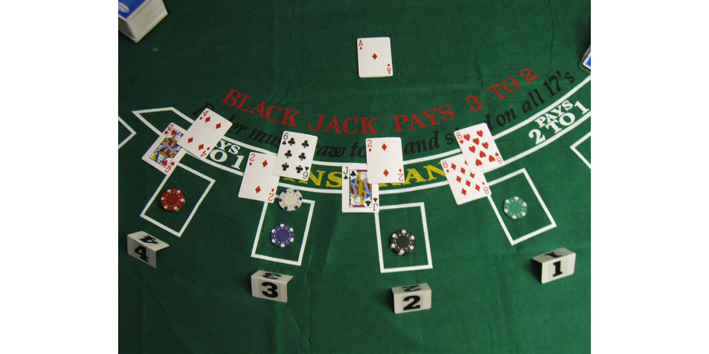
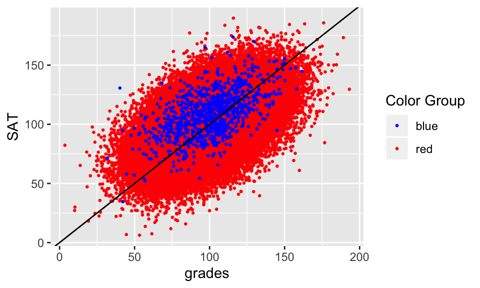
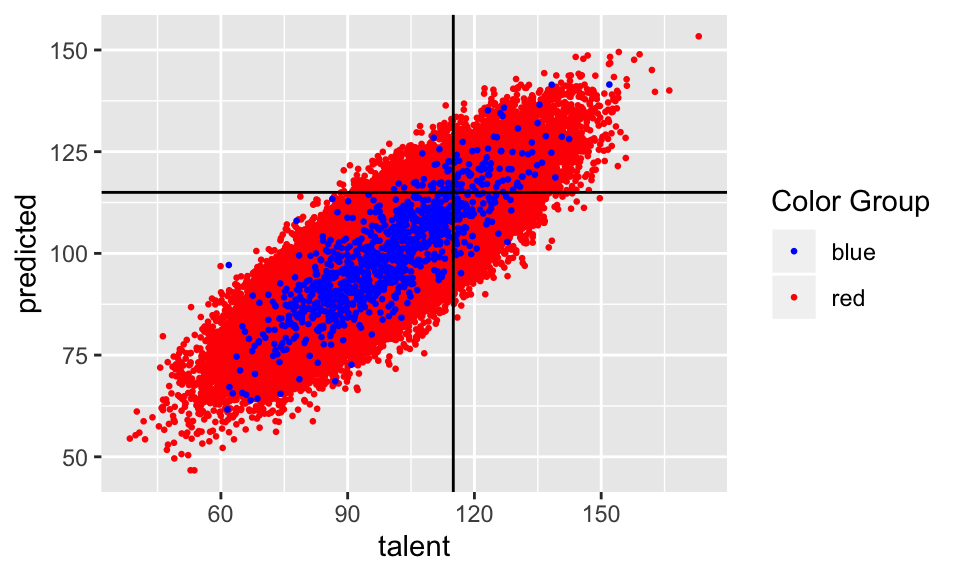
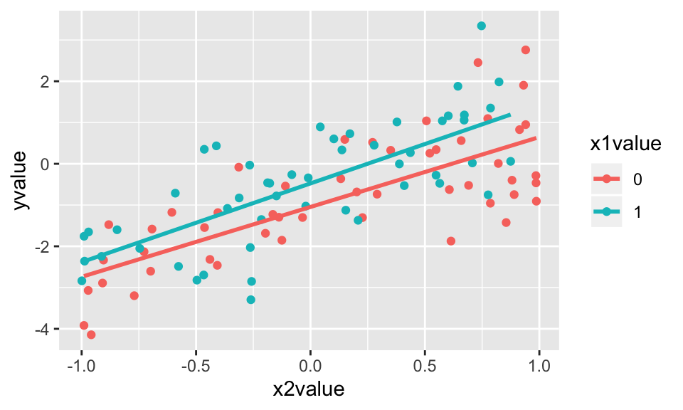
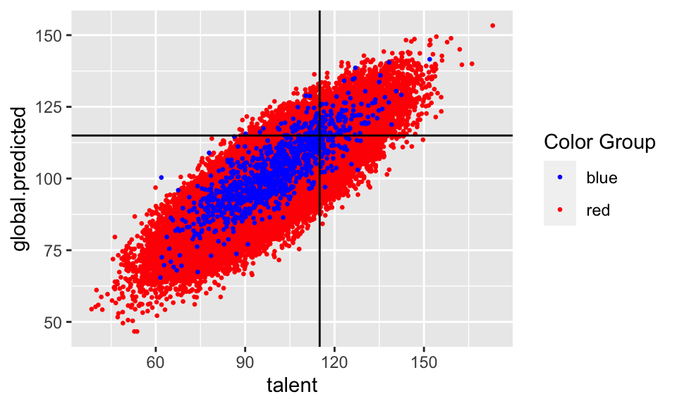
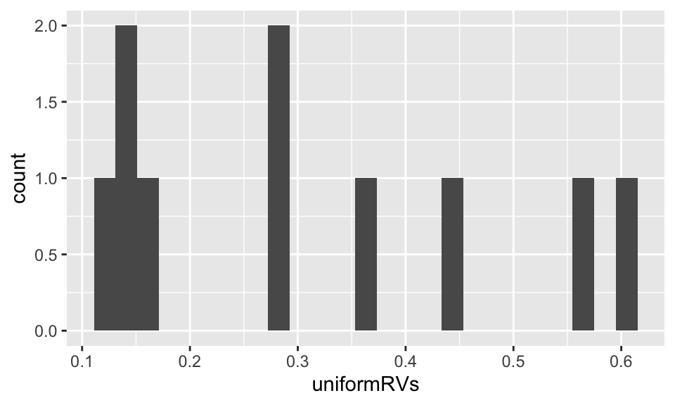
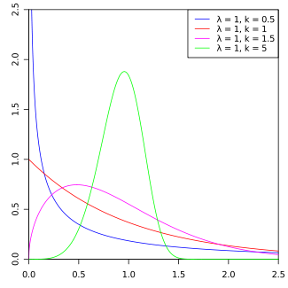
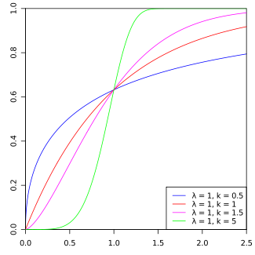
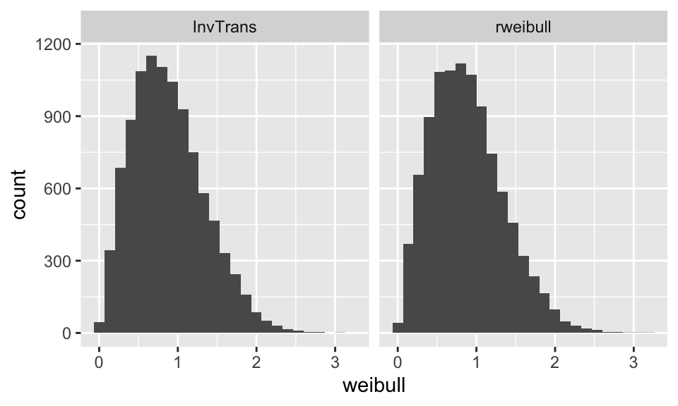

# Simulating {#sims}


## 9/24/19 Agenda {#Sep24}
1. Why simulate?
2. What makes a good simulation?
3. pigs / blackjack examples


Below, computer simulations will be used for two main objectives:

1. To understand complicated models
2. To assess sensitivity of procedures

We can use simulation studies to understand complex estimators, stochastic processes, etc.  Often times, such analytic solutions exist in theory, but are extremely complicated to solve.  In particular, as slight variations to the model are added, the simulation is often trivial to change whereas the analytic solution often becomes intractable.  Similarly, repeated applications of a procedure (e.g., linear regression) to a scenario (e.g., a dataset, a set of parameters, etc.) can provide important insight into how the procedure varies / behaves.

<!--
Snell's probability book discusses the need for simulation at length:  \url{http://www.dartmouth.edu/~chance/teaching_aids/books_articles/probability_book/amsbook.mac.pdf}
-->

## Simulating Complicated Models {#simmodels}

Simulation is done to model a scenario which allows us to understand random behavior without actually replicating the entire study multiple times or trying to model the process analytically.  

For example, what if you have a keen interest in understanding the probability of getting a single during room draw?  Or getting a single on north campus?  You wouldn't actually run room draw thousands of times to find your probability of getting a single room.  Similarly, the situation (e.g., room draw) may have too much information (e.g., all the different permutations of integers assigned to groups of 3 or 4 people) to model (easily) in a closed form solution.  With a few moderate assumptions (proportion of students in groups of 1, 2, 3, 4; probability of choosing dorm X over dorm Y; random allocation of integers to students; etc.) it is straightforward to simulate the scenario thousands of time and measure the proportion of times your rank (47) will give you the room you want (single in Sontag).

Consider the following simulation where the top 10 GOP candidates get to participate in the debate, and the remaining 6 are kept out (example taken for debate on August 6, 2015).   The write-up (and example) is a few years old, but the process is **identical** to the process used for deciding who is eligible for the 2020 Democtratic debates for president. http://www.nytimes.com/interactive/2015/07/21/upshot/election-2015-the-first-gop-debate-and-the-role-of-chance.html?_r=0

> A candidate needed to get at least two percent support in four different polls published from a list of approved pollsters between June 28 and August 28, 2019, which cannot be based on open-ended questions and may cover either the national level or one of the first four primary/caucus states (Iowa, New Hampshire, Nevada, and South Carolina). Only one poll from each approved pollster counted towards meeting the criterion in each region. [Wikipedia](https://en.wikipedia.org/wiki/2020_Democratic_Party_presidential_debates_and_forums)

<div class="figure" style="text-align: center">

<p class="caption">(\#fig:unnamed-chunk-2)For the 2016 election the Republican primary debates allowed only the top 10 candidates, ranked by national polls [NYT](https://www.nytimes.com/interactive/2015/07/21/upshot/election-2015-the-first-gop-debate-and-the-role-of-chance.html?_r=0)</p>
</div>


**Example** Consider the following problem from probability.  Two points are selected randomly on a line of length $L$ so as to be on opposite sides of the midpoint of the line.  [In other words, the two points $X$ and $Y$ are independent random variables such that $X$ is uniformly distributed over $(0,L/2)$ and $Y$ is uniformly distributed over $(L/2, 1)$.]   Find the probability that the 3 line segments from $0$ to $X$, from $X$ to $Y$, and from $Y$ to $L$ could be made to form the three sides of a triangle. (Note that three line segments can be made to form a triangle if the length of each of them is less than the sum of the lengths of the others.)


The joint density is:
$$ f(x,y) = \begin{cases} \frac{4}{L^2} & 0 \le x \le L/2, \, L/2 \le y \le L \\ 0 & else \end{cases} $$

The three pieces have lengths: $X$, $Y- X$ and $L - Y$.  Three conditions need to be satisfied in order that the three pieces form a triangle:

\begin{align}
X + (Y- X) &> (L - Y) \Rightarrow Y > L - Y \Rightarrow 2 Y > L \Rightarrow Y > L/2 \\
X + (L-Y ) &> Y - X \Rightarrow 2X + L > 2Y \Rightarrow X + \frac{L}{2} > Y \\
Y + (L - Y) &> X \Rightarrow L > X
\end{align}

<!--
%\begin{figure}[H]
%\begin{center}
%\includegraphics[scale=.2]{HW7Prob5.jpg}
%\caption{n.b. The picture is wrong.  The line should go from corner to corner, line $y=x + 1/2$.}
%\end{center}
%\end{figure}
-->


The first and third conditions are always satisfied, so we just need to find the probability that $Y$ is below the line $X + \frac{L}{2}$.  The density is the same as in the previous problem, so, as before,  we just need to find the area of the region below the line that is within the square $[0, L/2] \times [L/2, L]$, and then multiply it by $\frac{4}{L^2}$.

Area  = $\displaystyle{ \frac{1}{2}\frac{L}{2}\frac{L}{2} = \frac{L^2}{8} }$.

Thus, the probability is

\begin{align}
\int_{area} f(x,y)dxdy = \frac{4}{L^2} \frac{L^2}{8} =  \frac{1}{2}.
\end{align}

What happens for different values of $f(x,y)$?  For example, if $x$ and $y$ have Beta(3,47) distributions on [0,.5] and [.5,1]?  Simulating the probability in R is quite straightforward.  What is the confidence bounds on the point estimates for the probabilities??  [n.b., we could simulate repeatedly to get a sense for the variability of our estimate!]


```r
sticks <- function() {
	pointx <- runif(1,0,.5)  # runif is "random uniform", not "run if"
	pointy <- runif(1,.5,1)
	l1 <- pointx
	l2 <- pointy-pointx
	l3 <- 1 - pointy
	max(l1,l2,l3) > 1-max(l1,l2,l3)}
	
sum(replicate(100000, sticks())) / 100000
```

```
## [1] 0.5
```


```r
sticks_beta <- function() {
  pointx <- rbeta(1,3, 47) / 2  # rbeta is random beta
  pointy <- (rbeta(1, 3, 47) +  1)/2
  l1 <- pointx
  l2 <- pointy-pointx
  l3 <- 1 - pointy
  max(l1,l2,l3) > 1-max(l1,l2,l3)}

sum(replicate(100000, sticks_beta())) / 100000
```

```
## [1] 0.5
```

**Example**  Or consider the problem where the goal is to estimate $E(X)$ where $X=\max \{ k: \sum_{i=1}^k U_i < 1 \}$ and $U_i$ are uniform(0,1).  The simulation problem is quite straightforward.  Look carefully at the pieces.  How are they broken down into steps?  Notice that the steps go from inside out.


1. Set k (the number of random numbers) equal to zero.  And the running sum to zero.
2. Generate a uniform random variable.
3. Add the random variable to the running sum.  Repeat steps 1 and 2 until the sum is larger than 1.
4. Figure out how many random variables were needed to get the sum larger than 1.
5. Repeat the entire process many times so as to account for variability in the simulation.
6. Use the law of large numbers to conclude that the average of the simulation approximates the expected value.


```r
allk <- c()
for(i in 1:1000){
  k <- 0; sumU <- 0  
  while(sumU < 1) {
    sumU <- sumU + runif(1)
    k <- k+1 }
  allk <- c(allk, k-1) }
mean(allk)
```

```
## [1] 1.71
```


### Goals of Simulating Complicated Models

The goal of simulating a complicated model is not only to create a program which will provide the desired results.  We also hope to be able to code such that:

1. The problem is broken down into small pieces
2. The problem has checks in it to see what works (run the lines *inside* the if statements!)
3. Simple code is best

 
### Examples of Pigs and Blackjack


#### Pass the Pigs

*  Familiarize yourself with how to play Pass the Pigs at http://www.hasbro.com/common/instruct/passthepigs.pdf and https://en.wikipedia.org/wiki/Pass_the_Pigs.
* For more information on how to play Pass the Pigs, google online resources and see the following manuscript, http://pubsonline.informs.org/doi/pdf/10.1287/ited.1120.0088 *Analytics, Pedagogy and the Pass the Pigs Game*, (2012), Gorman, **INFORMS Transactions on Education 1**.
* More sophisticated modeling: http://www.amstat.org/publications/jse/v14n3/datasets.kern.html
* Some strategies for playing: http://passpigs.tripod.com/strat.html  (The link has other stuff, too.)


#### Blackjack

* Example and code come from **Data Science in R: a case studies approach to computational reasoning and problem solving*, by Nolan and Temple Lang.
* Chapter 9 *Simulating Blackjack*, by Hadley Wickham
* All R code is online at [http://rdatasciencecases.org/](http://rdatasciencecases.org/)
* More about the game of blackjack, there are many online resources that you can use to learn about the came.  Two resources that Nolan and Temple Lang recommend are http://wizardofodds.com/games/blackjack/ and http://hitorstand.net/.


##### Basic Blackjack {-}

* Card game, goal: sum cards as close to 21 without going over
* A few nuances to card value (e.g., Ace can be 1 or 11)
* Start with 2 cards, build up one card at a time
* Lots of different strategies (also based on dealer's cards)



---

##### What do we need to simulate poker? {-}

> - set-up of cards, dealing, hands
> - "score" (both sum of cards and payout)
> - strategies
> - result of strategies (summary of outcomes)

##### Source  {-}

* Example and code come from **Data Science in R: a case studies approach to computational reasoning and problem solving** by Nolan and Temple Lang.
* Chapter 9 *Simulating Blackjack* by Hadley Wickham
* All R code is online at [http://rdatasciencecases.org/](http://rdatasciencecases.org/)
* Link is also on the HW4 assignment

##### Setting up the Game in R  {-}


```r
deck = rep(c(1:10, 10, 10, 10), 4)

shuffle_decks = function(ndecks){sample(rep(deck, ndecks))}

head(shuffle_decks(4), 10)
```

```
##  [1]  2  6  6  1  6 10 10 10  2 10
```

##### Outcome of cards in hand {-}

```r
handValue = function(cards) {
  value = sum(cards)
  
       # Check for an Ace and change value if it doesn't bust
  if (any(cards == 1) && value <= 11) 
    value = value + 10
    value
  
       # Check bust (set to 0); check Blackjack (set to 21.5)
  if(value > 21)  
    0 
  else if (value == 21 && length(cards) == 2)  
    21.5 # Blackjack
  else 
    value
}
handValue(c(10,4))
```

```
## [1] 14
```

##### $ of cards in hand {-}

```r
winnings = function(dealer, players) {
  if (dealer > 21) {  # Dealer=Blackjack, ties players with Blackjack
    -1 * (players <= 21)
  } else if (dealer == 0) { # Dealer busts - all non-busted players win
    1.5 * (players > 21) +
      1 * (players <= 21 & players > 0) +
     -1 * (players == 0) 
  } else {            # Dealer 21 or below, all players > dealer win
    1.5 * (players > 21) +  
      1 * (players <= 21 & players > dealer) +
     -1 * (players <= 21 & players < dealer) 
  }
}
winnings(17,c(20, 21.5, 14, 0, 21))
```

```
## [1]  1.0  1.5 -1.0 -1.0  1.0
```

##### Better $ of cards in hand {-}

```r
winnings = function(dealer, players){
  (players > dealer & players > 21) * 1.5 + # Blackjack
  (players > dealer & players <= 21) * 1 +  # win
  (players < dealer | players == 0) * -1    # lose
}

winnings(17,c(20, 21.5, 14, 0, 21))
```

```
## [1]  1.0  1.5 -1.0 -1.0  1.0
```

```r
winnings(21.5,c(20, 21.5, 14, 0, 21))
```

```
## [1] -1  0 -1 -1 -1
```


##### How well does `handValue` work? {-}

```r
test_cards = list( c(10, 1), c(10, 5, 6), c(10, 1, 1), 
                   c(7, 6, 1, 5), c(3, 6, 1, 1), 
                   c(2, 3, 4, 10), c(5, 1, 9, 1, 1),
                   c(5, 10, 7), c(10, 9, 1, 1, 1)) 

test_cards_val = c(21.5, 21, 12, 19, 21, 19, 17, 0, 0)
sapply(test_cards, handValue)  # apply the function handValue to test_cards
```

```
## [1] 21.5 21.0 12.0 19.0 21.0 19.0 17.0  0.0  0.0
```

```r
identical(test_cards_val, sapply(test_cards, handValue))
```

```
## [1] TRUE
```

##### Testing winnings (create known) {-}

```r
test_vals = c(0, 16, 19, 20, 21, 21.5)

testWinnings =
  matrix(c( -1,  1,  1,  1,  1, 1.5,
            -1,  0,  1,  1,  1, 1.5,
            -1, -1,  0,  1,  1, 1.5,
            -1, -1, -1,  0,  1, 1.5,
            -1, -1, -1, -1,  0, 1.5,
            -1, -1, -1, -1, -1, 0), 
         nrow = length(test_vals), byrow = TRUE)
dimnames(testWinnings) = list(dealer = test_vals, 
                              player = test_vals)

testWinnings
```

```
##       player
## dealer  0 16 19 20 21 21.5
##   0    -1  1  1  1  1  1.5
##   16   -1  0  1  1  1  1.5
##   19   -1 -1  0  1  1  1.5
##   20   -1 -1 -1  0  1  1.5
##   21   -1 -1 -1 -1  0  1.5
##   21.5 -1 -1 -1 -1 -1  0.0
```

##### Does `winnings` work? {-}

```r
check = testWinnings  # make the matrix the right size
check[] = NA  # make all entries NA
 
for(i in seq_along(test_vals)) {
  for(j in seq_along(test_vals)) {
    check[i, j] = winnings(test_vals[i], test_vals[j])
  }
}

identical(check, testWinnings)
```

```
## [1] TRUE
```

##### Function for getting more cards  {-}

```r
shoe = function(m = 1) sample(deck, m, replace = TRUE)

new_hand = function(shoe, cards = shoe(2), bet = 1) {
  list(bet = bet, shoe = shoe, cards = cards)
}
myCards = new_hand(shoe, bet = 7)
myCards
```

```
## $bet
## [1] 7
## 
## $shoe
## function(m = 1) sample(deck, m, replace = TRUE)
## 
## $cards
## [1] 4 9
```

##### First action: hit {-}
receive another card

```r
hit = function(hand) {
  hand$cards = c(hand$cards, hand$shoe(1))
  hand
}

hit(myCards)$cards
```

```
## [1]  4  9 10
```

##### Second action: stand  {-}
stay with current cards

```r
stand = function(hand) hand

stand(myCards)$cards
```

```
## [1] 4 9
```


##### Third action: double down {-}
double the bet after receiving exactly one more card

```r
dd =  function(hand) {
  hand$bet = hand$bet * 2
  hand = hit(hand)
  stand(hand)
}

dd(myCards)$cards
```

```
## [1] 4 9 3
```

##### Fourth action: split a pair {-}
create two different hands from initial hand with two cards of the same value


```r
splitPair = function(hand) {
  list( new_hand(hand$shoe, 
             cards = c(hand$cards[1], hand$shoe(1)),
             bet = hand$bet),
        new_hand(hand$shoe, 
             cards = c(hand$cards[2], hand$shoe(1)),
             bet = hand$bet))   }
splitHand = splitPair(myCards)
```
  
##### Results of splitting {-}
(can we always split?)

```r
splitHand[[1]]$cards
```

```
## [1] 4 1
```

```r
splitHand[[2]]$cards
```

```
## [1] 9 5
```


##### Let's play!  Not yet automated... {-}

```r
set.seed(470); dealer = new_hand(shoe); player = new_hand(shoe); 
dealer$cards[1]
```

```
## [1] 2
```

```r
player$cards; player = hit(player); player$cards
```

```
## [1]  5 10
```

```
## [1]  5 10  9
```

```r
dealer$cards; dealer = hit(dealer); dealer$cards
```

```
## [1] 2 3
```

```
## [1] 2 3 3
```

##### Who won? {-}

```r
dealer$cards; player$cards
```

```
## [1] 2 3 3
```

```
## [1]  5 10  9
```

```r
handValue(dealer$cards); handValue(player$cards)
```

```
## [1] 8
```

```
## [1] 0
```

```r
winnings(handValue(dealer$cards), handValue(player$cards))
```

```
## [1] -1
```

#####  Simply strategy {-}
recall the handValue function -- what if player busts?

```r
strategy_simple = function(mine, dealerFaceUp) {
  if (handValue(dealerFaceUp) > 6 && handValue(mine) < 17) 
     "H" 
  else 
     "S"
}
```

##### Better simple strategy {-}

```r
strategy_simple = function(mine, dealerFaceUp) {
  if (handValue(mine) == 0) return("S")
  if (handValue(dealerFaceUp) > 6 && handValue(mine) < 17) 
     "H" 
  else 
     "S"
}
```

#####  Dealer {-}
The dealer gets cards regardless of what the player does

```r
dealer_cards = function(shoe) {
  cards = shoe(2)
  while(handValue(cards) < 17 && handValue(cards) > 0) {
    cards = c(cards, shoe(1))
  }
  cards
}

dealer_cards(shoe)
```

```
## [1] 5 9 1 8
```

```r
dealer_cards(shoe)
```

```
## [1]  4  4  7 10
```

##### Playing a hand {-}

```r
play_hand = function(shoe, strategy, 
                      hand = new_hand(shoe), 
                      dealer = dealer_cards(shoe)) {
  
  face_up_card = dealer[1]
  
  action = strategy(hand$cards, face_up_card)
  while(action != "S" && handValue(hand$cards) != 0) {
    if (action == "H") {
      hand = hit(hand)
      action = strategy(hand$cards, face_up_card)
    } else {
      stop("Unknown action: should be one of S, H")
    }
  }  

  winnings(handValue(dealer), handValue(hand$cards)) * hand$bet
}
```

##### Play a few hands {-}

```r
play_hand(shoe, strategy_simple)
```

```
## [1] 0
```

```r
play_hand(shoe, strategy_simple)
```

```
## [1] -1
```

```r
play_hand(shoe, strategy_simple, new_hand(shoe, bet=7))
```

```
## [1] 0
```

```r
play_hand(shoe, strategy_simple, new_hand(shoe, bet=7))
```

```
## [1] 7
```

##### Repeated games {-}

To repeat the game, we simply repeat the `play_hand` function and keep track of the dollars gained or lost.


```r
reps=10
money=20
for(i in 1:reps){
  money <- money + play_hand(shoe, strategy_simple)
  print(money)}
```

```
## [1] 19
## [1] 20
## [1] 19
## [1] 18
## [1] 19.5
## [1] 18.5
## [1] 20
## [1] 19
## [1] 18
## [1] 19.5
```


## 9/26/19 Agenda {#Sep26}
1. Understanding bias in modeling
2. Sensitivity of statistical inferential procedures to technical conditions
3. <p style = "color:red">(Not responsible for: Generating random numbers) </p>


## Simulating to Assess Sensitivity {#simsens}


As a second use of simulations, we can assess the sensitivity of parameters, model assumptions, sample size, etc.  Ideally, the results will be summarized graphically, instead of as a table.   A graphical representation can often provide insight into how parameters are related, whereas a table can be very hard to read.

### Bias in Models {#biasmodels}

The example below is taken directly (and mostly verbatim) from a blog by Aaron Roth [Algorithmic Unfairness Without Any Bias Baked In](http://aaronsadventures.blogspot.com/2019/01/discussion-of-unfairness-in-machine.html).  

>Bias in the data is certainly a problem, especially when labels are gathered by human beings. But its far from being the only problem. In this post, I want to walk through a very simple example in which the algorithm designer is being entirely reasonable, there are no human beings injecting bias into the labels, and yet the resulting outcome is "unfair". Here is the (toy) scenario -- the specifics aren't important. High school students are applying to college, and each student has some innate "talent" $I$, which we will imagine is normally distributed, with mean 100 and standard deviation 15: $I \sim N(100,15)$. The college would like to admit students who are sufficiently talented --- say one standard deviation above the mean (so, it would like to admit students with $I \geq 115$). The problem is that talent isn't directly observable. Instead, the college can observe grades $g$ and SAT scores $s$, which are a noisy estimate of talent. For simplicity, lets imagine that both grades and SAT scores are independently and normally distributed, centered at a student's talent level, and also with standard deviation 15: $g \sim N(I, 15)$, $s \sim N(I, 15)$.

>In this scenario, the college has a simple, optimal decision rule: It should run a linear regression to try and predict student talent from grades and SAT scores, and then it should admit the students whose predicted talent is at least 115. This is indeed "driven by math" -- since we assumed everything was normally distributed here, this turns out to correspond to the Bayesian optimal decision rule for the college.

####  The data {-}

>Ok. Now lets suppose there are two populations of students, which we will call Reds and Blues. Reds are the majority population, and Blues are a small minority population -- the Blues only make up about 1% of the student body. But the Reds and the Blues are no different when it comes to talent: they both have the same talent distribution, as described above. And there is no bias baked into the grading or the exams: both the Reds and the Blues also have exactly the same grade and exam score distributions, as described above.

>But there is one difference: the Blues have a bit more money than the Reds, so they each take the SAT twice, and report only the highest of the two scores to the college. This results in a small but noticeable bump in their average SAT scores, compared to the Reds.


```r
n = 100000
n.red = n*0.99
n.blue = n*0.01
reds <- rnorm(n.red, mean = 100, sd = 15)
blues <- rnorm(n.blue, mean = 100, sd = 15)

red.sat <- reds + rnorm(n.red, mean = 0, sd = 15)
blue.sat <- blues + 
    pmax(rnorm(n.blue, mean = 0, sd = 15),
         rnorm(n.blue, mean = 0, sd = 15))

red.grade <- reds + rnorm(n.red, mean = 0, sd = 15)
blue.grade <- blues + rnorm(n.blue, mean = 0, sd = 15)

college.data <- data.frame(talent = c(reds, blues),
                           SAT = c(red.sat, blue.sat),
                           grades = c(red.grade, blue.grade),
                           color = c(rep("red", n.red), rep("blue", n.blue)))

ggplot(college.data, aes(x = grades, y = SAT, color = color)) +
  geom_point(size = 0.5) +
  scale_color_identity(name = "Color Group",
                       guide = "legend") +
  geom_abline(intercept = 0, slope = 1)
```



#### Two separate models {-}

>So what is the effect of this when we use our reasonable inference procedure? First, lets consider what happens when we learn two different regression models: one for the Blues, and a different one for the Reds. We don't see much difference:


```r
red.lm = college.data %>%
  dplyr::filter(color == "red") %>%
  lm(talent ~ SAT + grades, data = .)

blue.lm = college.data %>%
  dplyr::filter(color == "blue") %>%
  lm(talent ~ SAT + grades, data = .)

global.lm = college.data %>%
  lm(talent ~ SAT + grades, data = .)

red.lm %>% broom::tidy()
```

```
## # A tibble: 3 x 5
##   term        estimate std.error statistic p.value
##   <chr>          <dbl>     <dbl>     <dbl>   <dbl>
## 1 (Intercept)   33.2     0.153        216.       0
## 2 SAT            0.333   0.00151      220.       0
## 3 grades         0.335   0.00151      222.       0
```

```r
blue.lm %>% broom::tidy()
```

```
## # A tibble: 3 x 5
##   term        estimate std.error statistic   p.value
##   <chr>          <dbl>     <dbl>     <dbl>     <dbl>
## 1 (Intercept)   25.6      1.64        15.6 1.85e- 49
## 2 SAT            0.429    0.0169      25.3 1.12e-109
## 3 grades         0.280    0.0157      17.9 3.50e- 62
```

```r
global.lm %>% broom::tidy()
```

```
## # A tibble: 3 x 5
##   term        estimate std.error statistic p.value
##   <chr>          <dbl>     <dbl>     <dbl>   <dbl>
## 1 (Intercept)   33.2     0.153        217.       0
## 2 SAT            0.333   0.00151      221.       0
## 3 grades         0.335   0.00150      223.       0
```


```r
new.reds <- rnorm(n.red, mean = 100, sd = 15)
new.blues <- rnorm(n.blue, mean = 100, sd = 15)

new.red.sat <- new.reds + rnorm(n.red, mean = 0, sd = 15)
new.blue.sat <- new.blues + 
    pmax(rnorm(n.blue, mean = 0, sd = 15),
         rnorm(n.blue, mean = 0, sd = 15))

new.red.grade <- new.reds + rnorm(n.red, mean = 0, sd = 15)
new.blue.grade <- new.blues + rnorm(n.blue, mean = 0, sd = 15)

new.college.data <- data.frame(talent = c(new.reds, new.blues),
                           SAT = c(new.red.sat, new.blue.sat),
                           grades = c(new.red.grade, new.blue.grade),
                           color = c(rep("red", n.red), rep("blue", n.blue)))


new.red.pred <- new.college.data %>%
  filter(color == "red") %>%
  predict.lm(red.lm, newdata = .)

new.blue.pred <- new.college.data %>%
  filter(color == "blue") %>%
  predict.lm(blue.lm, newdata = .)

new.college.data <- new.college.data %>% 
  cbind(predicted = c(new.red.pred, new.blue.pred))

ggplot(new.college.data, aes(x = talent, y = predicted, color = color)) + 
  geom_point(size = 0.5) + 
  geom_hline(yintercept = 115) + 
  geom_vline(xintercept = 115) +
  scale_color_identity(name = "Color Group",
                       guide = "legend")
```



```r
new.college.data <- new.college.data %>% 
  mutate(fp = ifelse(talent < 115 & predicted > 115, 1, 0),
         tp = ifelse(talent > 115 & predicted > 115, 1, 0),
         fn = ifelse(talent > 115 & predicted < 115, 1, 0),
         tn = ifelse(talent < 115 & predicted < 115, 1, 0))

error.rates <- new.college.data %>% group_by(color) %>%
  summarize(tpr = sum(tp) / (sum(tp) + sum(fn)),
            fpr = sum(fp) / (sum(fp) + sum(tn)),
            fnr = sum(fn) / (sum(fn) + sum(tp)),
            fdr = sum(fp) / (sum(fp) + sum(tp)),
            error = (sum(fp) + sum(fn)) / (sum(fp) + sum(tp) + sum(fn) + sum(tn) ))

error.rates
```

```
## # A tibble: 2 x 6
##   color   tpr    fpr   fnr   fdr error
##   <fct> <dbl>  <dbl> <dbl> <dbl> <dbl>
## 1 blue  0.548 0.0367 0.452 0.267 0.101
## 2 red   0.506 0.0379 0.494 0.284 0.111
```
>The Red classifier makes errors approximately 11.053% of the time. The Blue classifier does about the same --- it makes errors about 10.1% of the time. This makes sense: the Blues artificially inflated their SAT score distribution without increasing their talent, and the classifier picked up on this and corrected for it. In fact, it is even a little more accurate!

>And since we are interested in fairness, lets think about the false negative rate of our classifiers. **"False Negatives" in this setting are the people who are qualified to attend the college ($I > 115$), but whom the college mistakenly rejects.** These are really the people who have come to harm as a result of the classifier's mistakes. And the False Negative Rate is the probability that a randomly selected qualified person is mistakenly rejected from college --- i.e. the probability that a randomly selected student is harmed by the classifier. We should want that the false negative rates are approximately equal across the two populations: this would mean that the burden of harm caused by the classifier's mistakes is not disproportionately borne by one population over the other. This is one reason why the difference between false negative rates across different populations has become a standard fairness metric in algorithmic fairness --- sometimes referred to as "equal opportunity."

>So how do we fare on this metric? Not so badly! The Blue model has a false negative rate of 45.161% on the blues, and the Red model has a false negative rate of 49.413% on the reds --- so the difference between these two is a satisfyingly small 4.252%.

#### One global model {-}

>But you might reasonably object: because we have learned separate models for the Blues and the Reds, we are explicitly making admissions decisions as a function of a student's color! This might sound like a form of discrimination, baked in by the algorithm designer --- and if the two populations represent e.g. racial groups, then its explicitly illegal in a number of settings, including lending.


```r
new.pred <- new.college.data %>%
  predict.lm(global.lm, newdata = .)

new.college.data <- new.college.data %>% 
  cbind(global.predicted = new.pred)

ggplot(new.college.data, aes(x = talent, 
                             y = global.predicted, 
                             color = color)) + 
  geom_point(size = 0.5) + 
  geom_hline(yintercept = 115) + 
  geom_vline(xintercept = 115) +
  scale_color_identity(name = "Color Group",
                       guide = "legend")
```


```r
new.college.data <- new.college.data %>% 
  mutate(fp = ifelse(talent < 115 & global.predicted > 115, 1, 0),
         tp = ifelse(talent > 115 & global.predicted > 115, 1, 0),
         fn = ifelse(talent > 115 & global.predicted < 115, 1, 0),
         tn = ifelse(talent < 115 & global.predicted < 115, 1, 0))

error.rates <- new.college.data %>% group_by(color) %>%
  summarize(tpr = sum(tp) / (sum(tp) + sum(fn)),
            fpr = sum(fp) / (sum(fp) + sum(tn)),
            fnr = sum(fn) / (sum(fn) + sum(tp)),
            fdr = sum(fp) / (sum(fp) + sum(tp)),
            error = (sum(fp) + sum(fn)) / (sum(fp) + sum(tp) + sum(fn) + sum(tn) ))

error.rates
```

```
## # A tibble: 2 x 6
##   color   tpr    fpr   fnr   fdr error
##   <fct> <dbl>  <dbl> <dbl> <dbl> <dbl>
## 1 blue  0.632 0.0627 0.368 0.351 0.11 
## 2 red   0.504 0.0377 0.496 0.283 0.111
```

>So what happens if we don't allow our classifier to see group membership, and just train one classifier on the whole student body? The gap in false negative rates between the two populations balloons to 12.791%.  Additionally, the Blues now have a higher false **positive** rate (people who don't have talent about 115 are let in accidentally) and the Reds now have a higher false **negative** rate (people who do have talent are mistakenly kept out). This means if you are a qualified member of the Red population, you are substantially more likely to be mistakenly rejected by our classifier than if you are a qualified member of the Blue population.

#### What happened????  {-}

>What happened? There wasn't any malice anywhere in this data pipeline. Its just that the **Red population was much larger than the Blue population**, so when we trained a classifier to minimize its average error over the entire student body, it naturally fit the Red population -- which contributed much more to the average. But this means that the classifier was no longer compensating for the artificially inflated SAT scores of the Blues, and so was making a disproportionate number of errors on them -- all in their favor.

>This is the kind of thing that happens all the time: whenever there are two populations that have different feature distributions, learning a single classifier (that is prohibited from discriminating based on population) will fit the bigger of the two populations, simply because they contribute more to average error. Depending on the nature of the distribution difference, this can be either to the benefit or the detriment of the minority population. And not only does this not involve any explicit human bias, either on the part of the algorithm designer or the data gathering process, it is exacerbated if we artificially force the algorithm to be group blind. Well intentioned "fairness" regulations prohibiting decision makers form taking sensitive attributes into account can actually make things less fair and less accurate at the same time.


### Technical Conditions

#### Definitions {-}

**p-value** is the probability of obtaining the observed data or *more extreme* given the null hypothesis is true.

**confidence interval** is a range of values collected in such a way that repeated samples of data (using the same mechanism) would capture the parameter of interest in $(1-\alpha)100$% of the intervals.

#### Examples {-}

**Equal variance in the t-test**  Recall that one of the technical conditions for the t-test is that the two samples come from populations where the variance is equal (at least when `var.equal=TRUE` is specified).  What happens if the null hypothesis is true (i.e., the *means* are equal!) but the technical conditions are violated (i.e., the variances are unequal)?


```r
pvals <- c()
reps <- 10000
for(i in 1:reps){
  x1 <- rnorm(10, mean=47, sd=1)
  x2 <- rnorm(10, mean=47, sd=1)
  pvals <- c(pvals, t.test(x1,x2, var.equal=TRUE)$p.value) }

sum(pvals < .05)/reps
```

```
## [1] 0.0502
```

**Unequal variance in the t-test** 

```r
pvals <- c()
reps <- 10000
for(i in 1:reps){
  x1 <- rnorm(10, mean=47, sd=1)
  x2 <- rnorm(10, mean=47, sd=100)
  pvals <- c(pvals, t.test(x1,x2, var.equal=TRUE)$p.value) }

sum(pvals < .05)/reps
```

```
## [1] 0.0637
```

**Equal variance in the linear model**

The [ISCAM applet](http://www.rossmanchance.com/applets/RegShuffle.htm) by Beth Chance and Allan Rossman [@iscam] demonstrates ideas of confidence intervals and what the analyst should expect with inferential assessment.

Consider the following linear model with the points normally distributed with *equal* variance around the line. [Spoiler:  when the technical conditions are met, the theory works out well.  It turns out that the confidence interval will capture the true parameter in 95% of samples!]

$$ Y = -1 + 0.5 X_1 + 1.5 X_2 + \epsilon, \ \ \ \epsilon \sim N(0,1)$$




```r
beta2.in <- c()
beta0 <- -1
beta1 <- 0.5
beta2 <- 1.5
n <- 100
reps <- 10000

set.seed(4747)
for(i in 1:reps){
  x1 <- rep(c(0,1), each=n/2)
  x2 <- runif(n, min=-1, max=1)
  y <- beta0 + beta1*x1 + beta2*x2 + rnorm(n, mean=0, sd = 1)

  CI <- lm(y~x1+x2) %>% tidy(conf.int=TRUE) %>% data.frame()
  
  beta2.in <- c(beta2.in, between(beta2, CI[3,6], CI[3,7]))
}

# coverage rate of the CI is given by:
sum(beta2.in)/reps
```

```
## [1] 0.952
```


**Unequal variance in the linear model**

Consider the following linear model with the points normally distributed with *unequal* variance around the line. [Spoiler:  when the technical conditions are met, the theory does not work out as well.  It turns out that the confidence interval will not capture the true parameter in 95% of samples!]

$$ Y = -1 + 0.5 X_1 + 1.5 X_2 + \epsilon, \ \ \ \epsilon \sim N(0,1+ X_1 + 10 \cdot |X_2|)$$




```r
beta2.in <- c()
beta0 <- -1
beta1 <- 0.5
beta2 <- 1.5
n <- 100
reps <- 10000

set.seed(4747)
for(i in 1:reps){
  x1 <- rep(c(0,1), each=n/2)
  x2 <- runif(n, min=-1, max=1)
  y <- beta0 + beta1*x1 + beta2*x2 + rnorm(n, mean=0, sd = 1 + x1 + 10*abs(x2))

  CI <- lm(y~x1+x2) %>% broom::tidy(conf.int=TRUE) %>% data.frame()
  
  beta2.in <- c(beta2.in, between(beta2, CI[3,6], CI[3,7]))
}

# coverage rate of the CI is given by:
sum(beta2.in)/reps
```

```
## [1] 0.872
```


### Generating random numbers

<p style = "color:red">You are not responsible for the material on generating random numbers, but it's pretty cool stuff that relies heavily on simulation.</p>

#### How do we generate uniform[0,1] numbers?

LCG - linear congruence generators.  Set $a,b,m$ to be large integers.  The sequence of numbers $X_i / m$ will pass all tests for uniformly distributed variables.
$$ X_{n+1} = (aX_n + b) \mod m $$

where

* $m$ and $b$ are relatively prime,
* $a - 1$ is divisible by all prime factors of $m$,
* $a - 1$ is divisible by 4 if $m$ is divisible by 4.


```r
a <- 31541435235
b <- 23462146143 
m <- 423514351351

xval <- 47 
reps <- 10000
unif.val <- c()

for(i in 1:reps){
  xval <- (a*xval + b) %% m
  unif.val <- c(unif.val, xval/m)   }

data.frame(uniformRVs = unif.val) %>%
  ggplot(aes(x = uniformRVs)) + geom_histogram(bins = 25)
```




### Generating other RVs:  **The Inverse Transform Method**

<!--
%\textcolor{red}{See Bill De Roses's simulation!!}
-->

<p style = "color:red">You are not responsible for the material on generating random numbers, but it's pretty cool stuff that relies heavily on simulation.</p>

#### Continuous RVs {-}

Use the inverse of the cumulative distribution function to generate data that come from a particular continuous distribution.  For example, generate 100 random normal deviates.  Start by assuming that $F$ is a continuous and increasing function.  Also assume that $F^{-1}$ exists.

$$F(x) = P(X \leq x)$$
Note that $F$ is just the area function describing the density (histogram) of the data.

*****
**Algorithm:** Generate Continuous RV

*****
1. Generate a uniform random variable $U$
2. Set $X = F^{-1}(U)$

*****

**Proof:** that the algorithm above generates variables that come from the probability distribution represented by $F$.

\begin{align}
P(X \leq x) &= P(F^{-1}(U) \leq x)\\
&= P(U \leq F(x))\\
&= F(x)\\
\end{align}

**Example:**
 $$ f(x) = \begin{cases}
 2x e^{-x^2} & 0 < x \\ 0 & x < 0 \end{cases}$$
 
*Note:* This is known as a Weibull($\lambda=1$, $k=2$) distribution.

<div class="figure" style="text-align: center">

<p class="caption">(\#fig:unnamed-chunk-39)Weibull PDF by Calimo - Own work, after Philip Leitch.. Licensed under CC BY-SA 3.0 via Commons</p>
</div>


* What is $F(x)$?
 $$ F(x) = \int_0^x 2w e^{-w^2} dw = 1 - e^{-x^2}$$
* What is $F^{-1}(u)$?

\begin{align}
u &= F(x)\\
&= 1 - e^{-x^2}\\
1-u &= e^{-x^2}\\
-\ln(1-u) &= x^2\\
\sqrt{-\ln(1-u)} &= x\\
F^{-1}(u) &= \sqrt{-\ln(1-u)}
\end{align}

* Suppose you could simulate uniform random variables, $U_1, U_2, \dots$.  How
 could you use these to simulate RV's with the Weibull density, $f(x)$, given above?
 $$ \mbox{Let: } X_i = \sqrt{-\ln(1-U_i)}$$


```r
unifdata = runif(10000,0,1)
weib1data = sqrt(-log(1-unifdata))
weib2data = rweibull(10000,2,1)

weibdata <- data.frame(weibull = c(weib1data, weib2data),
                       sim.method = c(rep("InvTrans", 10000), 
                                      rep("rweibull", 10000)))

ggplot(weibdata, aes(x = weibull)) + geom_histogram(bins = 25) + 
  facet_grid(~sim.method)
```




#### Discrete RVs {-}

A similar algorithm is used to generate data that come from a particular discrete distribution.  For example, generate 100 random normal deviates.  We start by assuming the probability mass function of $X$ is
$$ P(X = x_i) = p_i, i=1, \ldots, m$$


*****
**Algorithm:** Generate Discrete RV

*****
1. Generate a uniform random variable $U$
2. Transform $U$ into $X$ as follows,
$$X = x_j \mbox{ if } \sum_{i=1}^{j-1} p_i \leq U \leq \sum_{i=1}^j p_i$$

*****

**Proof:** that the algorithm above generates variables that come from the probability mass function $\{p_1, p_2, \ldots, p_m\}$.

\begin{align}
P(X = x_j) &= \sum_{i=1}^{j-1} p_i \leq U \leq \sum_{i=1}^j p_i\\
&= \sum_{i=1}^j p_i - \sum_{i=1}^{j-1} p_i\\
&= p_j\\
\end{align}


#### What if you don't know $F$? Or can't calculate $F^{-1}$? {-}

In the case that the CDF cannot be calculated explicitly (the normal for example), one could still use this methodology by estimating F at a collection of points $x_i, u_i = F(x_i)$. Now we temporarily mimic the discrete inverse transform, as we generate a $U$ and see which subinterval it falls in, i.e. $u_i \leq U \leq u_{i+1}$.  Assuming the $x_i$ are close enough, we expect the CDF to be approximately linear on this subinterval, so then we take a linear interpolation of the CDF on the subinterval to get $X$ via

\begin{align}
X = \frac{u_{i+1} -  U}{u_{i+1} - u_i} x_i + \frac{U - u_i}{u_{i+1} - u_i} x_j
\end{align}

However, the linear interpolation requires a complete approximation of $F(x)$, regardless of the sample size desired, and doesn't generalize to higher dimensions, and of course only gives you something with the approximate distribution back, even if you have your hands on real uniform random variables.
