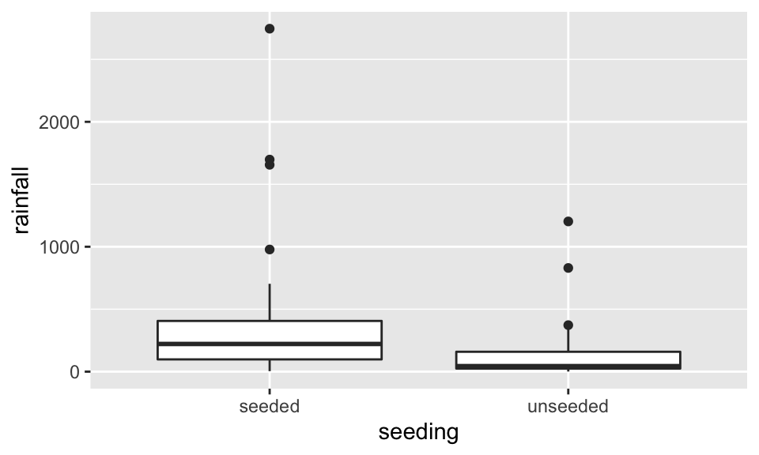
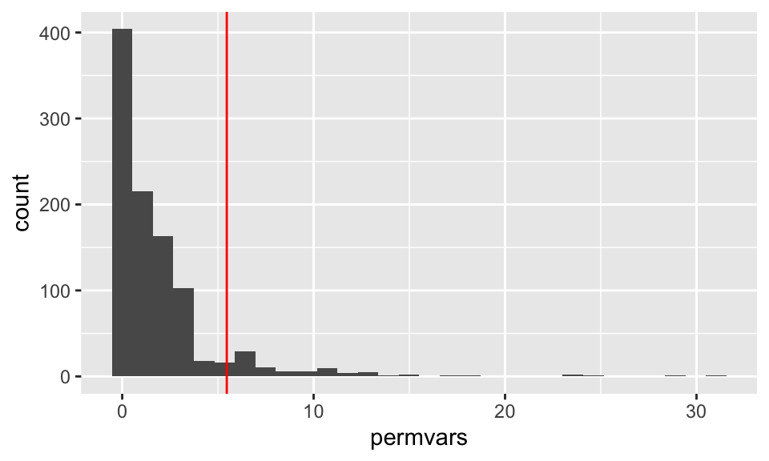

# Randomization & Permutation Tests {#permschp}


## 10/1/19 Agenda {#Oct1}
1. Review: logic of hypothesis testing
2. Logic of permutation tests
3. Examples - 2 samples and beyond


<!--
Just use repeated measures????
-->

##### Motivation: {-}  

* Great video of how/why computational statistical methods can be extremely useful. And it's about beer and mosquitos!  John Rauser from Pintrest gives the keynote address at Strata + Hadoop World Conference October 16, 2014.  David Smith, Revolution Analytics blog, October 17, 2014. http://blog.revolutionanalytics.com/2014/10/statistics-doesnt-have-to-be-that-hard.html
* A more complicated scenario with the same tools being applied.  Here the point is to understand gerrymandering.  https://www.youtube.com/watch?v=gRCZR_BbjTo&t=125s


> The big lesson here, IMO, is that so many statistical problems can seem complex, but you can actually get a lot of insight by recognizing that your data is just one possible instance of a random process. If you have a hypothesis for what that process is, you can simulate it, and get an intuitive sense of how surprising your data is. R has excellent tools for simulating data, and a couple of hours spent writing code to simulate data can often give insights that will be valuable for the formal data analysis to come. (David Smith)

Rauser says that the in order to follow a statistical argument that uses simulation, you need three things:

1. Ability to follow a simple logical argument.
2. Random number generation.
3. Iteration

## Inference Algorithms {#algs}

### Hypothesis Test Algorithm

Before working out the nitty gritty details, recall the structure of hypothesis testing.  Consider the applet on Simulating ANOVA Tables (Chance & Rossman) http://www.rossmanchance.com/applets/AnovaSim.html

1. Choose a statistic that measures the effect you are looking for.  For example, the ANOVA F statistic is:

\begin{align}
F &= \frac{\text{between-group variability}}{\text{within-group variability}}\\
&= \frac{\sum_i n_i(\overline{X}_{i\cdot} - \overline{X})^2/(K-1)}{\sum_{ij} (X_{ij}-\overline{X}_{i\cdot})^2/(N-K)}
\end{align}

2. Construct the sampling distribution that this statistic would have if the effect were *not* present in the population.  [The sampling distributions for t statistics and F statistics are based on the Central Limit Theorem and derived in Math 152.]

3. Locate the observed statistic in this distribution.  A value in the main body of the distribution could easily occur just by chance.  A value in the tail would rarely occur by chance and so is evidence that something other than chance is operating.  [This piece is going to happen in permutation tests as well as in analytic tests -- the point is to see if the observed data is consistent with the null distribution.]

##### p-value {-} is the probability of the observed data or more extreme if the null hypothesis is true.  [Also true for both types of tests!]

To estimate the p-value for a test of significance, estimate the sampling distribution of the test statistic when the null hypothesis is true by resampling in a manner that is consistent with the null hypothesis.


### Permutation Tests Algorithm

To evaluate the p-value for a permutation test, estimate the sampling distribution of the test statistic when the null hypothesis is true by resampling in a manner that is consistent with the null hypothesis (the number of resamples is finite but can be large!).

**Procedure**
1. Choose a test statistic
2. Shuffle the data (enforce the null hypothesis to be true)
3. Create a null sampling distribution of the test statistic (under $H_0$)
4. Find the observed test statistic on the null sampling distribution and compute the p-value (observed data or more extreme).  The p-value can be one or two-sided.

#### Assumptions {-}
Permutation tests fall into a broad class of tests called "non-parametric" tests.  The label indicates that there are no distributional assumptions made on the data (i.e., no assumption that the data come from a normal or binomial distribution).  However, a test which is ``non-parametric" does not meant that there are no assumptions on the data, simply that there are no *distributional or parametric* assumptions on the data.  \textcolor{red}{The parameters are at the heart of almost all parametric tests.}

For permutation tests, we are not basing the test on population parameters, so we don't need to make any assumptions about them (i.e., that they are the mean of a particular distribution).

* **Permutation** The different treatments have the same effect.  [Note: exchangeability, same population, etc.]  *If the null hypothesis is true, the labels assigning groups are interchangeable.*
    * Note that it is our choice of *statistic} which makes the test more sensitive to some kinds of difference (e.g., difference in mean) than other kinds (e.g., difference in variance).
* **Parametric** The different populations have the same mean.


## 10/3/19 Agenda {#Oct3}
1. R code, examples
2. Assumptions, exchangeability, random structure
3. Different statistics within the permutation test
4. Permutation vs. Randomization tests (Binomial)
5. Other test statistics


## Permutation tests {#perms}

How is the test interpreted given the different types of sampling which are possibly used to collect the data?
* **Random Sample** The concept of a p-value usually comes from the idea of taking a sample from a population and comparing it to a sampling distribution (from many many random samples).
* **Random Experiment** In the context of a **randomized experiment**, the p-value represents the observed data compared to "happening by chance."
    * The interpretation is easy: if there is only a very small chance that the observed statistic would take such an extreme value, as a result only of the randomization of cases:  we reject the null treatment effect hypothesis. CAUSAL!
* **Observational Study** In the context of **observational studies** the results are less strong, but it is reasonable to conclude that the effect observed in the sample reflects an effect present in the population.
    * In a sample, consider the difference (or ratio) and ask "Is this difference so large it would rarely occur by chance in a particular sample constructed under the null setting?"
    * If the data come from a random sample, then the sample (or results from the sample) are probably consistent with the population [i.e., we can infer the results back to the larger population].


#### Other Test Statistics

The example in class used a modification of the ANOVA F-statistic to compare the observed data with the permuted data test statistics.  Depending on the data and question, the permuted test statistic can take on any of a variety of forms.


| Data 	| Hypothesis Question 	| Statistic 	|
|-------------------	|:-----------------------:	|:-----------------------------------------------:	|
| 2 categorical 	| diff in prop 	| $\hat{p}_1 - \hat{p}_2$ or $\chi^2$ 	|
| variables 	| ratio of prop 	| $\hat{p}_1 /  \hat{p}_2$ 	|
| 1 numeric 	| diff in means 	| $\overline{X}_1 - \overline{X}_2$ 	|
| 1 binary 	| ratio of means 	| $\overline{X}_1 / \overline{X}_2$ 	|
|  	| diff in medians 	| $\mbox{median}_1 - \mbox{median}_2$ 	|
|  	| ratio of medians 	| $\mbox{median}_1 / \mbox{median}_2$ 	|
|  	| diff in SD 	| $s_1 - s_2$ 	|
|  	| diff in var 	| $s^2_1 - s^2_2$ 	|
|  	| ratio of SD or VAR 	| $ s_1 / s_2$ 	|
| 1 numeric 	| diff in means 	| $\sum n_i (\overline{X}_i - \overline{X})^2$ or 	|
| k groups 	|  	| F stat 	|
| paired or 	| (permute *within* row) 	| $\overline{X}_1 - \overline{X}_2$ 	|
| repeated measures 	|  	|  	|
| regression 	| correlation 	| least sq slope 	|
| time series 	| no serial core 	| lag 1 autocross 	|

Depending on the data, hypotheses, and original data collection structure (e.g., random sampling vs random allocation), the choice of statistic for the permutation test will vary.


### Permutation vs. Randomization Tests

We will call **randomization tests** those that enumerate *all* possible data permutations.  **permutation tests**, on the other hand, will permute the data $B$ ($< < $ all) times. Some authors call a permutation test applied to a randomized experiment a randomization test.

* Main difference:  randomization tests consider every possible permutation of the labels, permutation tests take a random sample of permutations of the labels.
* Both can only be applied to a comparison situation (e.g., no one sample t-tests).
* Both permute labels under $H_0$, for example, $H_0: F(x) = G(x)$.
* Both can be used in situations where sampling distributions are unknown (e.g., differences in medians).
* Both can be used in situations where sampling distributions are based on population distributions (e.g., ratio of variances).
* Randomization tests were the first nonparametric tests conceived (R.A. Fisher, 1935).

#### Randomization p-value {-}

Let $t^*$ be the observed test statistic.  For a two sample test with $N$ total observations and $n$ observations in group 1, there are ${N \choose n}$ randomizations, all of which are equally likely under $H_0$.  The p-value then becomes:
\begin{align}
p_R &= P(T \leq t^* | H_0) = \frac{\sum_{i=1}^{{N \choose n}} I(t_i \leq t*)}{{N \choose n}}
\end{align}
If we choose a significance level of $\alpha = k/{N \choose n}$, then the type I error rate is:
\begin{align}
P(\text{type I error}) &= P(p_R \leq \alpha | H_0)\\
&= P\bigg(\sum_{i=1}^{{N \choose n}} I(t_i \leq t*) \leq k | H_0 \bigg)\\
&= \frac{k}{{N \choose n}}= \alpha\\
\text{alternatively }  k&= \alpha {N \choose n}
\end{align}
The point of which is to say that the randomization test controls the probability of a Type I error under the very minimal conditions that the subjects are randomized to treatments (minimal assumption, but hard to do in practice!!)

#### Permutation p-value {-}

Now consider a permutation test that randomly permutes the data $B$ times (instead of all ${N \choose n}$ times).  A permutation test approximates a randomization test.  In fact, the permutation test can be analyzed using the following binomial random variable:
\begin{align}
X_P &= \# \ \mbox{permutations out of B that give a more extreme value than the observed test statistic}\\
X_P &\sim& Bin(p_R, B)\\
SE(X_P) &= \sqrt{\frac{p_R (1-p_R)}{B}} \approx \sqrt{\frac{\hat{p}_P (1-\hat{p}_P)}{B}}
\end{align}

Consider a situation where interest is in a small effect, say p-value$\approx 0.01$.  The SE should be less than 0.001.
\begin{align}
0.001 &= \sqrt{ (0.01)\cdot(0.99) / B}\\
B &= (0.01) \cdot (0.99) / (0.001)^2\\
&= 9900
\end{align}

Another way to look at the same problem is to use the estimated p-value = $\hat{p}_P = \frac{X_P}{B}$ to come up with a confidence interval for $p_R$.

CI for $p_R \approx \hat{p}_P \pm 1.96 \sqrt{\frac{\hat{p}_P (1-\hat{p}_P)}{B}}$


### CI from Permutation Tests

Use shifts or rescaling to create a CI for a parameter value using permutation tests.  That is, consider a situation with data from $X$ and $Y$  Use one of the following transformation (depending on the study):
\begin{align}
W &= Y + a\\
\mbox{or } Y &= Y / b
\end{align}
and run the permutation test of interest on $X$ vs. $W$ or $X$ vs. $U$.  For a series of $a$ or $b$ values we can find which we don't reject at a particular level of significance ($\alpha$) to create a $(1-\alpha)100\%$ confidence interval.

Usually, however, we use bootstrapping for confidence intervals and permutation tests for hypothesis testing.

### Permutation/Randomization Examples

#### Fisher's Exact Test -- computationally efficient randomization test

* N observations are classified into a 2x2 table.
* Each observation is classified into exactly one cell.
* Row and column totals are fixed.

Given fixed row and column totals, we can easily calculate the interior distribution using the hypergeometric.  Note that once a single cell is filled, all other cells are determined.

|  	| Col 1 	| Col 2 	| Total 	|
|:-----:	|:-----:	|:-------:	|:-----:	|
| Row 1 	| X 	| r-X 	| r 	|
| Row 2 	| c-X 	| N-r-c+X 	| N-r 	|
| Total 	| c 	| N-c 	| N 	|

<div class="slide section level6">

<p><span class="math display">\[\begin{aligned}
P(X=x) &amp;= \frac{{r \choose x}{{N-r} \choose{c-x}}}{{N \choose c}}\\
&amp;&amp; \mbox{out of those in col 1, how many are in row 1?}\\
P(X \leq x) &amp;= \sum_{i=0}^x \frac{{r \choose i}{{N-r} \choose {c-i}}}{{N \choose c}}\\
&amp;= \mbox{p-value}\end{aligned}\]</span></p>
</div>

Not common for both row and column totals to be fixed.  (More likely for just column totals to be fixed, e.g., men and women.)  Instead, consider all subsets of the sample space with $N$ observations.  For any particular combination of row and column totals ($rc$):

\begin{align}
P(\mbox{rejecting } H_0 | rc, H_0) &\leq& \alpha\\
P(\mbox{rejecting } H_0 \ \ \forall \mbox{ subsets } | H_0) &\leq& \sum_{rc \ combos} P(\mbox{rejecting } H_0 | rc, H_0) P(rc | H_0)\\
&\leq& \alpha
\end{align}


(Note: assume $P(rc | H_0) = 1 / \# rc $ combos.)  The test will be valid at any $\alpha$ level, but it won't be as powerful as one in which fixed columns/rows is actually meaningful.

#### $r \times c$ tables 

* permute data in a new way
* new test stat
\begin{align}
T = \sum_{i,j} \frac{(O_{i,j} - E_{i,j})^2}{E_{i,j}}
\end{align}
* 2-sided p-value.  what do we expect?
\begin{align}
E_{i,j} = \frac{R_i C_j}{N}
\end{align}


##### Example: Observer

In a study published in the *Journal of Personality and Social Psychology* (Butler and Baumeister, 1998), researchers investigated a conjecture that having an observer with a vested interest would decrease subjects' performance on a skill-based task.  Subjects were given time to practice playing a video game that required them to navigate an obstacle course as quickly as possible.  They were then told to play the game on final time with an observer present.  Subjects were randomly assigned to one of two groups:

* Group A was told that the participant and the observer would each win \$3 if the participant beat a certain threshold.
* Group B was told that only that the participant would win the prize if the threshold was beaten.

The goal of this data analysis is to determine whether or not there is an effect from the observer on the performance.  That is, like the $\chi^2$ test, our hypotheses are:

$H_0:$ there is no association between the two variables
$H_a:$ there is an association between the two variables


The data from the 24 subjects is given below:

|  	| A: shares prize 	| B: no sharing 	| Total 	|
|:----------------------:	|:---------------:	|:-------------:	|:-----:	|
| Beat threshold 	| 3 	| 8 	| 11 	|
| Did not beat threshold 	| 9 	| 4 	| 13 	|
| Total 	| 12 	| 12 	| 24 	|

1. Card simulation (to demonstrate how the permutation test works)
2. Permutation Test (see Chance and Rossman applet for automated permutation test, http://www.rossmanchance.com/applets/ChisqShuffle.htm?FET=1)

\begin{align}
SE(\mbox{p-value}) = \sqrt{\frac{\hat{p}_r (1-\hat{p}_r)}{100}} = 0.02
\end{align}

3. Randomization Test
\begin{align}
P(X \leq 3) = \sum_{i=0}^3 \frac{{11 \choose i}{12 \choose {12-i}}}{{24 \choose 12}} = 0.0436
\end{align}


#### Two sample test -- computationally very difficult to do a randomization test

##### Example: Cloud Seeding

Cloud seeding data:  seeding or not seeding was randomly allocated to 52 days when seeding was appropriate.  The pilot did not know whether or not the plane was seeding.  Rain is measured in acre-feet.

After running tests to compare means and variances we obtain the following p-values:

|  	| comparison of means 	|  	| comparison of variances 	|  	|
|-------------	|:-------------------:	|:------:	|:-----------------------:	|:--------:	|
|  	| Permutation 	| t-test 	| Permutation 	| F-test 	|
| Raw Data 	| 0.031 	| 0.054 	| 0.068 	| 0.000067 	|
| Logged Data 	| 0.010 	| 0.014 	| 0.535 	| 0.897 	|


######  R code

Before doing anything, let's look at the data.  Here, we visualize with both boxplots and histograms.  Also, we visualize on the raw scale as well as the log scale.  Certainly, the log10 scale indicates that a transformation makes the data more symmetric.


```r
clouds <- read_delim("https://dasl.datadescription.com/download/data/3117/cloud-seeding.txt", 
     "\t", escape_double = FALSE, trim_ws = TRUE) 

names(clouds) <- c("unseeded", "seeded")
clouds <- tidyr::pivot_longer(clouds, cols = 1:2, names_to = "seeding", values_to = "rainfall") %>%
  mutate(seeding = as.factor(seeding))

clouds %>%
  ggplot(aes(x=seeding, y=rainfall)) + geom_boxplot()
```



```r
clouds %>%
  ggplot(aes(x=rainfall)) + geom_histogram(bins = 20) + facet_wrap(~seeding)
```


```r
clouds %>%
  ggplot(aes(x=seeding, y=rainfall)) + geom_boxplot() + scale_y_log10()
```


```r
clouds %>%
  ggplot(aes(x=rainfall)) + geom_histogram(bins = 20) + facet_wrap(~seeding) + scale_x_log10()
```


#unlogged data:


```r
clouds %>%
  mutate(lnrain = log(rainfall)) %>%
  group_by(seeding) %>%
  summarize(meanrain = mean(rainfall), meanlnrain = mean(lnrain))
```

```
## # A tibble: 2 x 3
##   seeding  meanrain meanlnrain
##   <fct>       <dbl>      <dbl>
## 1 seeded       442.       5.13
## 2 unseeded     165.       3.99
```

```r
clouds %>%
  mutate(lnrain = log(rainfall)) %>%
  group_by(seeding) %>%
  summarize(meanrain = mean(rainfall), meanlnrain = mean(lnrain)) %>%
  summarize(diff(meanrain), diff(meanlnrain))
```

```
## # A tibble: 1 x 2
##   `diff(meanrain)` `diff(meanlnrain)`
##              <dbl>              <dbl>
## 1            -277.              -1.14
```

```r
raindiffs <- clouds %>%
  mutate(lnrain = log(rainfall)) %>%
  group_by(seeding) %>%
  summarize(meanrain = mean(rainfall), meanlnrain = mean(lnrain)) %>%
  summarize(diffrain = diff(meanrain), difflnrain = diff(meanlnrain))

raindiffs
```

```
## # A tibble: 1 x 2
##   diffrain difflnrain
##      <dbl>      <dbl>
## 1    -277.      -1.14
```


Below, we've formally gone through a permutation.  hhere, the resampling is not coded in a particularly tidy way, but there is a tidy way to code loops!  Generally, loops are not the fasted way to code in R, so if you need to quickly run code that seems like it should go in a loop, it is very likely that `purrr` is the direction you want to go, https://purrr.tidyverse.org/.


#####  Difference in means after permuting


```r
reps <- 1000
permdiffs <- c()

for(i in 1:reps){
  onediff <- clouds %>%
    mutate(permseed = sample(seeding)) %>%
    group_by(permseed) %>%
    summarize(meanrain = mean(rainfall)) %>%
    summarize(diff(meanrain)) %>% pull()
  
permdiffs <- c(permdiffs, onediff)
}

permdiffs %>% data.frame() %>%
  ggplot(aes(x = permdiffs)) + geom_histogram(bins=30) + geom_vline(xintercept = raindiffs$diffrain, color = "red")
```


#####  Ratio of variances after permuting


```r
rainvarratio <- clouds %>%
    group_by(seeding) %>%
    summarize(varrain = var(rainfall)) %>%
    summarize(rainratio = varrain[1] / varrain[2])


reps <- 1000
permvars <- c()

for(i in 1:reps){
  oneratio <- clouds %>%
    mutate(permseed = sample(seeding)) %>%
    group_by(permseed) %>%
    summarize(varrain = var(rainfall)) %>%
    summarize(varrain[1] / varrain[2]) %>% pull()
  
permvars <- c(permvars, oneratio)
}

permvars %>% data.frame() %>%
  ggplot(aes(x = permvars)) + geom_histogram(bins=30) + geom_vline(xintercept = rainvarratio$rainratio , color = "red")
```




#####  Testing differences in means or ratios of variances


As evidenced in the histograms above, 

* the permutation test (one-sided) for the difference in means will count the number of permuted differences that are less than or equal to the observed difference in means, just over 1%.

* the permutation test (one-sided) for the ratio of variances will count the number of permuted ratios that are greater than or equal to the observered ratio of varances, about 7%.


```r
(sum(raindiffs$diffrain >= permdiffs) + 1) /1000
```

```
## [1] 0.027
```

```r
(sum(rainvarratio$rainratio <= permvars)+1)/1000
```

```
## [1] 0.081
```

<!--

need to add b to one side before permuting.  R code was getting complicated.

#####  How can permutations be used to create confidence intervals?

To find a CI for the difference in locations of the distributions of the seeded vs. unseeded rainfall, we shift the unseeded values by some amount, and do our usual hypothesis test.  Our CI will be those values we don't reject for a given $\alpha$. Here:

|  	| b test value 	|  	|  	|  	|  	|  	|  	|  	|  	|  	|
|---	|:------------:	|:----:	|:----:	|:----:	|:----:	|:----:	|:----:	|:----:	|:----:	|:----:	|
|  	| 0 	| 20 	| 50 	| 100 	| 300 	| 400 	| 500 	| 550 	| 570 	| 600 	|
| p 	| 0.027 	| 0.03 	| 0.05 	| 0.11 	| 0.56 	| 0.80 	| 0.94 	| 0.98 	| 0.98 	| 0.99 	|


where p is the proportion of simulated test statistics greater than or equal to our observed value (after shifting by an amount "b").


```r
reps <- 1000
raindiffs <- clouds %>%
  mutate(lnrain = log(rainfall)) %>%
  group_by(seeding) %>%
  summarize(meanrain = mean(rainfall)) %>%
  summarize(diffrain = diff(meanrain))

for(b in c(0,20,50,100,300,400,500,550,570,600)){
  

permdiffs <- c()

for(i in 1:reps){
  onediff <- clouds %>%
    mutate(permseed = sample(seeding)) %>%
    group_by(permseed) %>%
    summarize(meanrain = mean(rainfall)) %>%
    summarize(diff(meanrain)) %>% pull()
  
permdiffs <- c(permdiffs, onediff)
}

cloud.ci<-cbind(rainfall=c(cloud[,1]+c(rep(b,26),rep(0,26))),cloud[,2])

obs.um.ci.stat<-tapply(cloud.ci[,1],cloud.ci[,2],mean)[2] -
tapply(cloud.ci[,1],cloud.ci[,2],mean)[1]


perm.um.ci.stat<-c()

for(i in 1:3999){
	 cloud.ci2<-sample(cloud.ci[,1],52,replace=F)
	 perm.um.ci.stat<-c(perm.um.ci.stat,tapply(cloud.ci2,cloud[,2],mean)[1] -
	tapply(cloud.ci2,cloud[,2],mean)[2])
	}

print((sum(obs.um.ci.stat>=perm.um.ci.stat)+1)/4000)
}
```

-->


