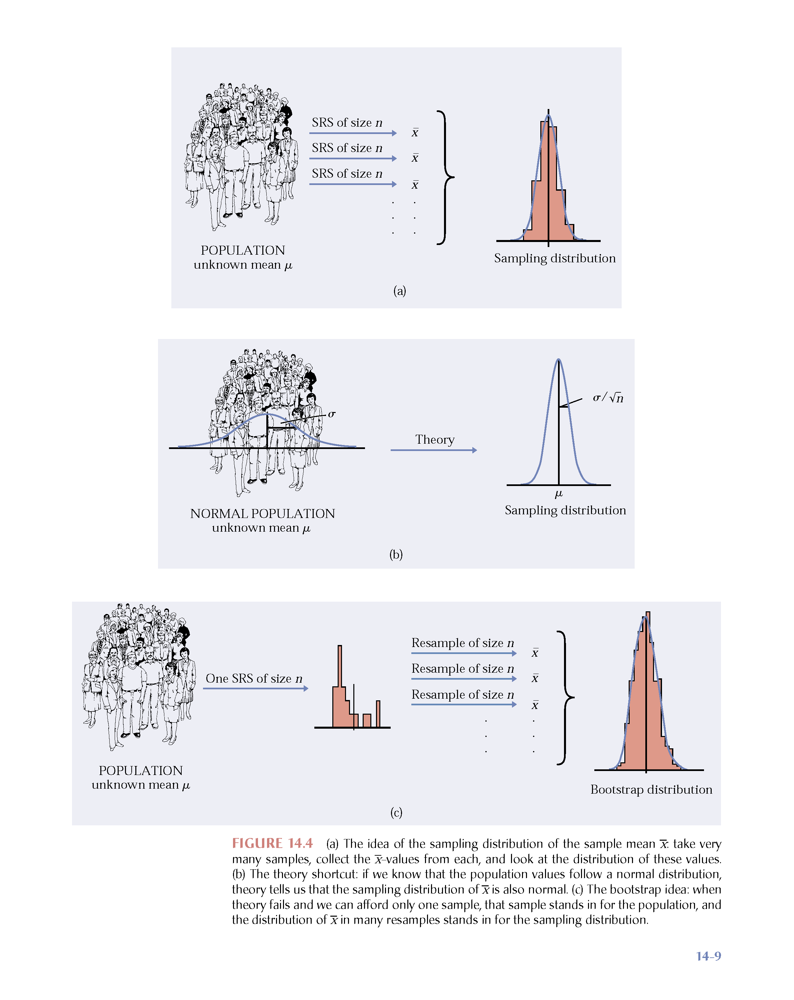
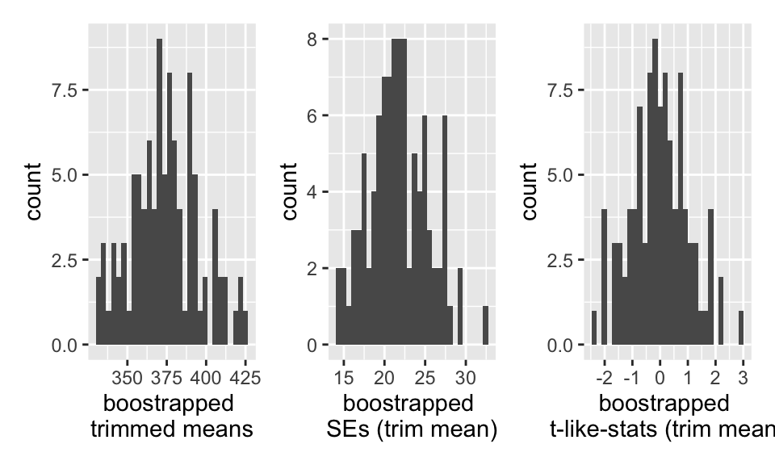
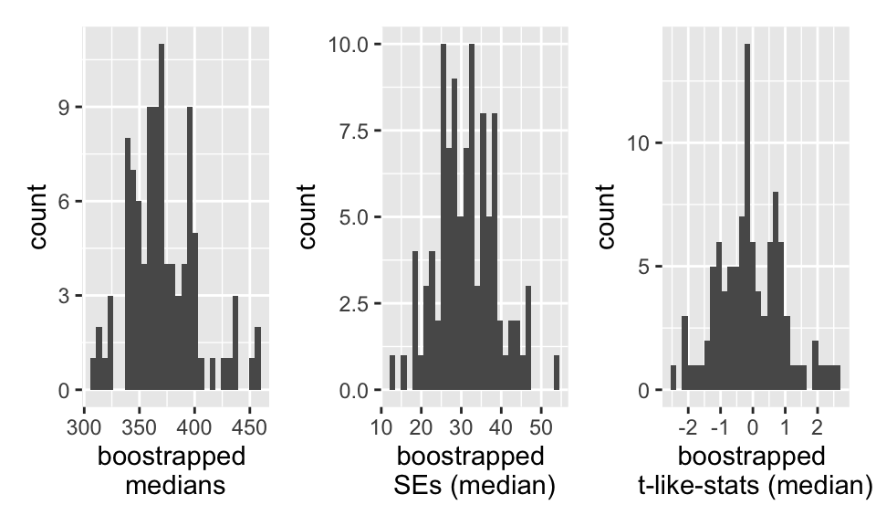

# Bootstrapping {#boot}


## Introduction

As we did with permutation tests, we are going to use random samples to describe the population (assuming we have a simple random sample).

Main idea:  we will be able to estimate the **variability** of the estimator (difference in medians, ordinary least square with non-normal errors, etc.).

* It's not so strange to get $\hat{\theta}$ and SE($\hat{\theta}$) from the data (consider $\hat{p}$ & $\sqrt{\hat{p}(1-\hat{p})/n}$ and $\overline{X}$ & $s/\sqrt{n}$).
* We'll only consider confidence intervals for now.
* Bootstrapping doesn't help get around small samples.

The following applets may be helpful:

* The logic of confidence intervals http://www.rossmanchance.com/applets/ConfSim.html
* Bootstrapping from actual datasets http://lock5stat.com/statkey/index.html

## Basics & Notation {#BSnotation}

Let $\theta$ be the parameter of interest, and let $\hat{\theta}$ be the estimate of $\theta$.  If we could, we'd take lots of samples of size $n$ from the population to create a **sampling distribution** for $\hat{\theta}$.  Consider taking $B$ random samples from $F$:

\begin{align}
\hat{\theta}(\cdot) = \frac{1}{B} \sum_{i=1}^B \hat{\theta}_i
\end{align}
is the best guess for $\theta$.  If $\hat{\theta}$ is very different from $\theta$, we would call it **biased**.
\begin{align}
SE(\hat{\theta}) &= \bigg[ \frac{1}{B-1} \sum_{i=1}^B(\hat{\theta}_i - \hat{\theta}(\cdot))^2 \bigg]^{1/2}\\
q_1 &= [0.25 B] \ \ \ \ \hat{\theta}^{(q_1)} = \mbox{25}\% \mbox{ cutoff}\\
q_3 &= [0.75 B] \ \ \ \ \hat{\theta}^{(q_3)} = \mbox{75}\% \mbox{ cutoff}\\
\end{align}

If we could, we would completely characterize the sampling distribution (as a function of $\theta$) which would allow us to make inference on $\theta$ when we only had $\hat{\theta}$.

<div class="figure" style="text-align: center">

<p class="caption">(\#fig:unnamed-chunk-2)From Hesterberg et al., Chapter 16 of Introduction to the Practice of Statistics by  Moore, McCabe, and Craig</p>
</div>


### The Plug-in Principle

Recall
\begin{align}
F(x) &= P(X \leq x)\\
\hat{F}(x) &= S(x) = \frac{\# \{X_i \leq x\} }{n}
\end{align}
$\hat{F}(x)$ is a sufficient statistic for $F(x)$.  That is, all the information about $F$ that is in the data is contained in $\hat{F}(x)$.  Additionally, $\hat{F}(x)$ is the MLE of $F(x)$ (they are both probabilities, so it's a binomial argument).

Note that, in general, we are interested in a parameter, $\theta$.
\begin{align}
\theta = t(F) \ \ \ \ [\mbox{e.g., } \mu = \int x f(x) dx ]
\end{align}

The *plug-in estimate* of $\theta$ is:
\begin{align}
\hat{\theta} = t(\hat{F}) \ \ \ \ [\mbox{e.g., } \overline{X} = \frac{1}{n} \sum X_i ]
\end{align}

That is: *to estimate a parameter, use the statistic that is the corresponding quantity for the sample.*

\begin{align}
\mbox{Ideal Real World} & \mbox{Boostrap World}\\
F \rightarrow x &\Rightarrow \hat{F} \rightarrow x^*\\
\downarrow &  \downarrow\\
\hat{\theta}  & \hat{\theta}^*
\end{align}

The idea of boostrapping (and in fact, the bootstrap samples themselves), depends on the double arrow.  We must have a random sample: that is, $\hat{F}$ must do a good job of estimating $F$ in order for bootstrap concepts to be meaningful.

Note that you've seen the plug-in-principle before:
\begin{align}
\sqrt{\frac{p(1-p)}{n}} &\approx& \sqrt{\frac{\hat{p}(1-\hat{p})}{n}}\\
\end{align}
<!--
%\mbox{Fisher's Information: } I(\theta) &\approx& I(\hat{\theta})
-->

### The Bootstrap Idea

We can *resample* from the *sample* to represent samples from the actual population!  The *boostrap distribution* of a statistic, based on many resamples, represents the **sampling distribution** of the statistic based on many samples.  Is this okay??  What are we assuming?

1. As $n \rightarrow \infty$, $\hat{F}(x) \rightarrow F(x)$

2. As $B \rightarrow \infty$, $\hat{F}(\hat{\theta}^*) \rightarrow F(\hat{\theta})$  (with large $n$).  Or really, what we typically see if $\hat{F}(\hat{\theta}^* / \hat{\theta}) \rightarrow F(\hat{\theta} / \theta)$ or $\hat{F}(\hat{\theta}^* - \hat{\theta}) \rightarrow F(\hat{\theta} - \theta)$


### Bootstrap Procedure

1. Resample data **with replacement** from the original sample.
2. Calculate the statistic of interest for each resample.
3. Repeat 1. and 2. $B$ times.
4. Use the bootstrap distribution for inference.


### Bootstrap Notation


Take many ($B$) resamples of size $n$ from the sample, $\hat{F}(x)$ (instead of from the population, $F(x)$ ) to create a bootstrap distribution for $\hat{\theta}^*$ (instead of the sampling distribution for $\hat{\theta}$).

Let $\hat{\theta}^*(b)$ be the calculated statistic of interest for the $b^{th}$ bootstrap sample.  The best guess for $\theta$ is:
\begin{align}
\hat{\theta}^* = \frac{1}{B} \sum_{b=1}^B \hat{\theta}^*(b)
\end{align}
(if $\hat{\theta}^*$ is very different from $\hat{\theta}$, we call it biased.)  And the estimated value for the standard error of the estimate is
\begin{align}
\hat{SE}^* = \bigg[ \frac{1}{B-1} \sum_{b=1}^B ( \hat{\theta}^*(b) - \hat{\theta}^*)^2 \bigg]^{1/2}
\end{align}

Just like repeatedly taking samples from the population, taking resamples from the sample allows us to characterize the bootstrap distribution which approximates the sampling distribution.  The bootstrap distribution approximates the **shape, spread, & bias** of the actual sampling distribution.


<div class="figure" style="text-align: center">

<p class="caption">(\#fig:unnamed-chunk-3)From Hesterberg et al., Chapter 16 of Introduction to the Practice of Statistics by  Moore, McCabe, and Craig.  The left image represents the mean with n=50.  The center image represents the mean with n=9.  The right image represents the median with n=15.</p>
</div>


<!--
#### How accurate is a bootstrap distribution?
\begin{itemize}
\item
**Almost all** of the variation in a bootstrap distribution comes from the selection of the original sample.  (That is,  boostrapping does not overcome issues associated with small sample or non-random samples.)
\item
Resampling $B>1000$ does not typically reduce variability more.
\end{itemize}

Again,
\begin{enumerate}
\item
As $n \rightarrow \infty$, $\hat{F}(x) \rightarrow F(x)$
\item
As $B \rightarrow \infty$, $\hat{F^*}(\hat{\theta}^*) \rightarrow F(\hat{\theta})$  (with large $n$)
\end{enumerate}


#### When does the bootstrap not work?

Consider $X \sim U[0,1]$ (note this would also work with $U[a,b]$).  Let $Y = \max(X_i)$.
\begin{align}
F_Y(y) = P(Y \leq y) &= P( \mbox{ all } X_i \leq y)\\
&= P(X_i \leq y ) ^n\\
&= y^n\\
f_Y(y) &= \frac{\partial F_Y(y)}{\partial y}\\
&= n y^{n-1} \\
\end{align}

Note that the Bootstrap sampling distributions are a poor approximation to the true sampling distribution.  The problem is that $\hat{F}$ is not a good estimate of the true distribution $F$ in the extreme tail.  Options to fix this problem include using a parametric bootstrap (with knowledge of the population distribution) or smoothing $\hat{F}$ to approximate $F$ better.

Bias of the sample max:

\begin{align}
bias_F &= E[\hat{\theta}] - \theta\\
E[\hat{\theta}] &= E [\max(X_i)] \\
&= \int_0^1 y n y^{n-1} dy\\
&= \frac{n}{n+1} y^{n+1} \bigg|_0^1\\
&= \frac{n}{n+1}\\
bias_F &= \frac{n}{n+1} -1 = \frac{-1}{n+1}
\end{align}

We can think about the bootstrap bias in the same way:
\begin{align}
bias_{\hat{F}} &= E[\theta^*]- \hat{\theta}\\
&\approx& \hat{\theta}^* - \hat{\theta}\\
\hat{\theta} &= 0.9997507\\
\hat{\theta}^* &= 0.9805526\\
\hat{bias}_{\hat{F}} &=  0.01919808\\
1/51 &=  0.01960784\\
\end{align}

Consider a population of 82 law schools.  Two measurements were made on the entering class of each school (in 1973!).  LSAT, the average score for the class on a national law test, and GPA, the average undergraduate grade-point average for the class.  A random sample of 15 schools is selected from the population, and the correlation between GPA and LSAT score was found to be 0.776.

In a perfect world, how would we then proceed to think about this problem?  What do we want to know?  What do we want to say about the population? We'd want to know the **sampling distribution** of r...$\hat{\theta}$.

Before we go any further...  Fisher worked on the correlation coefficient and had two interesting results:

\begin{enumerate}
\item
Fisher (1915) proved that the expected value of the correlation coefficient based on random sampling from a normal population is approximately:
\begin{align}
E[r] = \rho - \frac{\rho(1-\rho^2)}{2n}
\end{align}
Solving for $\rho$ gives an approximately unbiased estimator of the population correlation:
\begin{align}
\hat{\rho} = r \Big[ 1 + \frac{(1-r^2)}{2n} \Big]
\end{align}
Further work has been done (Fisher (1915), Kenny and Keeping (1951), Sawkins (1944), and Olkin and Pratt (1958)) the later which recommend using
\begin{align}
\hat{\rho} = r \Big[ 1 + \frac{(1-r^2)}{2(n-3)} \Big]
\end{align}
Note that the bias decreases as $n$ increases and as $\rho$ approaches zero.  Note also that if the data are distributed normally:
\begin{align}
SE(r) = \frac{(1-\rho^2)}{\sqrt{n-2}}
\end{align}
(No other distribution leads to a simple formula for the SE of the correlation.)
\item
Fisher also introduced the $r$ to $Z$ transformation:
\begin{align}
Z = \frac{1}{2} \ln \Big[\frac{1+r}{1-r}\Big]
\end{align}
We think of this as the non-linear transformation that normalizes the sampling distribution of r.  (Note: it is an inverse hyperbolic tangent function.)
\end{enumerate}
-->


The StatKey applets which demonstrate bootstrapping are here:  http://www.lock5stat.com/StatKey/

<!--
https://www.unc.edu/courses/2007spring/biol/145/001/docs/lectures/Sep17.html
-->


## Bootstrap Confidence Intervals {#BSCI}

### Normal (standard) CI with BootSE: `type="norm"`

Keep in mind that what we are trying to do is approximate the sampling distribution of $\hat{\theta}$.  In fact, what we are really able to do here is to estimate the sampling distribution of $\frac{\hat{\theta} - \theta}{SE(\hat{\theta})}$.  We hope that:

\begin{align}
\hat{F}\Big(\frac{\hat{\theta}^*(b) - \hat{\theta}}{\hat{SE}^*(b)} \Big) \rightarrow F\Big(\frac{\hat{\theta} - \theta}{SE(\hat{\theta})}\Big)
\end{align}

Recall the derivation of conventional confidence intervals (based on the assumption that the sampling distribution of the test statistic is normal or close):

\begin{align}
P\bigg(z_{(\alpha/2)} \leq \frac{\hat{\theta} - \theta}{SE(\hat{\theta})} \leq z_{(1-\alpha/2)}\bigg)&= 1 - \alpha\\
P\bigg(\hat{\theta} - z_{(1-\alpha/2)} SE(\hat{\theta}) \leq \theta \leq \hat{\theta} - z_{(\alpha/2)} SE(\hat{\theta})\bigg) &= 1 - \alpha\\
\end{align}

That is, it's the endpoints that are random, and we have a 0.95 probability that we'll get a random sample which will produce endpoints which will capture the true parameter.


A 95% CI for $\theta$ would then be: $$\hat{\theta} \pm z_{(\alpha/2)} \hat{SE}^*$$


### Bootstrap-t Confidence Intervals: `type="stud"`

(The idea here is that we are calculating the "t-multiplier" that is used in the CI.  It was William Gosset who went my the pseudonym of "Student" who originally figured out the distribution of the t-multiplier, so the following intervals are called either "studentized" or "t" bootstrap confidence intervals.)


Recall the derivation of conventional confidence intervals:

\begin{align}
P\bigg(z_{(\alpha/2)} \leq \frac{\hat{\theta} - \theta}{SE(\hat{\theta})} \leq z_{(1-\alpha/2)}\bigg)&= 1 - \alpha\\
P\bigg(\hat{\theta} - z_{(1-\alpha/2)} SE(\hat{\theta}) \leq \theta \leq \hat{\theta} - z_{(\alpha/2)} SE(\hat{\theta})\bigg) &= 1 - \alpha\\
\end{align}

That is, it's the endpoints that are random, and we have a 0.95 probability that we'll get a random sample which will produce endpoints which will capture the true parameter.

1. We could use the Boot SE within the CI formula (and did for the interval above).  The problem is that such an interval will only be accurate if the distribution for $\hat{\theta}$ is reasonably normal.  If there is any bias or skew, the CI will not have desired coverage levels (@efrontibs, pg 161 and chapter 22).

2. Now consider using the bootstrap to estimate the distribution for $\frac{\hat{\theta} - \theta}{SE(\hat{\theta})}$.
\begin{align}
T^*(b) &= \frac{\hat{\theta}^*(b) - \hat{\theta}}{\hat{SE}^*(b)}
\end{align}


where $\hat{\theta}^*(b)$ is the value of $\hat{\theta}$ for the $b^{th}$ bootstrap sample, and $\hat{SE}^*(b)$ is the estimated standard error of $\hat{\theta}^*(b)$ for the $b^{th}$ bootstrap sample.  The $\alpha^{th}$ percentile of $T^*(b)$ is estimated by the value of $\hat{t}^*_\alpha$ such that

\begin{align}
\frac{\# \{T^*(b) \leq \hat{t}^*_{\alpha/2} \} }{B} = \alpha/2
\end{align}

For example, if $B=1000$, the estimate of the 5% point is the $50^{th}$ smallest value of the $T^*(b)$s, and the estimate of the 95% point is the $950^{th}$ smallest value of the $T^*(b)$s.


Finally, the boostrap-t confidence interval is:
\begin{equation} 
(\hat{\theta} - \hat{t}^*_{1-\alpha/2}\hat{SE}^*,  \hat{\theta} - \hat{t}^*_{\alpha/2}\hat{SE}^*) (\#eq:BSt)
\end{equation}


To find a bootstrap-t interval, we have to bootstrap twice. The algorithm is as follows:

1. Generate $B_1$ bootstrap samples, and for each sample $\underline{X}^{*b}$ compute the bootstrap estimate $\hat{\theta}^*(b)$.

2. Take $B_2$ bootstrap samples from $\underline{X}^{*b}$, and estimate the standard error, $\hat{SE}^*(b)$.

3. Find $B_1$ values for $T^*(b)$.  Calculate $\hat{t}^*_\alpha/2$ and $\hat{t}^*_{1-\alpha/2}$.

4. Calculate the CI as in equation (\@ref(eq:BSt)).


* If $B\cdot \alpha$ is not an integer, use $k=\lfloor (B+1) \alpha \rfloor$ and $B+1-k$.

* Bootstrap-t intervals are somewhat erratic and can be influenced by a few outliers.  Percentile methods can be more reliable.  [The balance of which is best when is an open question depending a lot on the data distribution and statistic of interest.]

* $B=100$ or 200 is probably not enough for a bootstrap-t CI (500 or 1000 is better).  However, $B=25$ may be enough to estimate the SE in the inner-Bootprocedure.  ($B=1000$ is needed for computing percentiles.)

* In choosing the appropriate multiplier:

    * When it is the correct multiplier to use, the normal multiplier ($z$) is good for all $n$ and all samples.
    * When it is the correct multiplier to use, the t multiplier is good for all samples but a specified $n$.
    * When it is the correct multiplier to use, the bootstrap-t multiplier is good for *this* sample only.

* The resulting intervals will typically not be symmetric (that is $\hat{t}^*_\alpha \ne - \hat{t}^*_{1-\alpha}$).  This is part of the improvement over $z$ or $t$ intervals.

* Bootstrap-t intervals are good for location statistics (mean, quantiles, trimmed means) but cannot be trusted for other statistics like the correlation (which do not necessarily vary based on ideas of shift).


### Percentile Confidence Intervals: `type="perc"`

The interval between the $\alpha/2$ and $1-\alpha/2$ quantiles of the bootstrap distribution of  a statistic is a $(1-\alpha)100\%$ bootstrap percentile confidence interval for the corresponding parameter:

\begin{align}
[\hat{\theta}^*_{\alpha/2}, \hat{\theta}^*_{1-\alpha/2}]
\end{align}

<p style="color:red">You do not need to know *why* the percentile interval works...  but isn't it so cool to see how it works???</p>

Why does it work? It isn't immediately obvious that the interval above will capture the true parameter, $\theta$, at a rate or 95%.  Consider a skewed sampling distribution.  If the observed $\hat{\theta}$ comes from the long tail, is it obvious that the short tail side of the CI will get up to the true parameter value at the correct rate?  (Hall (*The Bootstrap and Edgeworth Expansion}, Springer, 1992, and earlier papers) refers to these as Efron's "backwards" intervals.) Or, if the sampling distribution is biased, the percentiles of the bootstrap interval won't capture the parameter with the correct rate.


To see how / why percentiles intervals work, we first start by considering normal sampling distributions for a function of the statistic. Let $\phi = g(\theta), \hat{\phi} = g(\hat{\theta}), \hat{\phi}^* = g(\hat{\theta}^*)$, where g is a monotonic function (assume wlog that g is increasing).  The point is to choose (if possible) $g(\cdot)$ such that

\begin{equation}
 \hat{\phi}^* - \hat{\phi} \sim \hat{\phi} - \phi \sim N(0, \sigma^2) (\#eq:phidist).
 \end{equation}
Again, consider the logic for the conventional confidence interval.  Because $\hat{\phi} - \phi \sim N(0, \sigma^2)$, the interval for $\theta$ is derived by:

\begin{align}
P(z_{0.05} \leq \frac{\hat{\phi} - \phi}{\sigma}  ) = 0.95  \nonumber \\
P(-\infty \leq \phi \leq \hat{\phi} - z_{0.05} \sigma) = 0.95  \nonumber \\
P(-\infty \leq \phi \leq \hat{\phi} + z_{0.95} \sigma) = 0.95  \nonumber \\
P(-\infty \leq \theta \leq g^{-1}(\hat{\phi} + z_{0.95} \sigma)) = 0.95  \nonumber \\
\Rightarrow \mbox{CI for } \theta: \ \ \ (-\infty, g^{-1}(\hat{\phi} + \sigma z_{1-\alpha})) (\#eq:phiint)
\end{align}

where $z_{1-\alpha}$ is the $100(1-\alpha)$ percent point of the standard normal distribution.  Ideally, if we knew $g$ and $\sigma$, we'd be able to do the transformation and find  $g^{-1}(\hat{\phi} + \sigma z_{1-\alpha})$  (which would give the endpoint of the confidence interval).

Going back to (\@ref(eq:phidist)) indicates that $\hat{\phi} + \sigma z_{1-\alpha} = F^{-1}_{\hat{\phi}^*}(1-\alpha)$ (because $\hat{\phi} ^* \sim N(\hat{\phi}, \sigma^2)$).  Further, since $g$ is monotonically increasing, $F^{-1}_{\hat{\phi}^*}(1-\alpha) = g(F^{-1}_{\hat{\theta}^*}(1-\alpha)).$
Substituting in (\@ref(eq:phiint)), gives the percentile interval for $\theta$,

\begin{align}
(-\infty, F^{-1}_{\hat{\theta}^*}(1-\alpha)).
\end{align}

(A similar argument gives the same derivation of the two sided confidence interval.  Proof from @carp2000)  In order for a percentile interval to be appropriate, the technical condition is only that a normalizing transformation **exists**.  We do not need to actually find the transformation! 

<!--
\begin{align}
P\bigg(t_{(\alpha/2), df} \leq \frac{\hat{\theta} - \theta}{SE(\theta)} \leq t_{(1-\alpha/2), df}\bigg)&= 1 - \alpha\\
P\bigg(\hat{\theta} - t_{(1-\alpha/2), df} SE(\theta) \leq \theta \leq \hat{\theta} - t_{(\alpha/2), df} SE(\theta)\bigg) &= 1 - \alpha\\
\end{align}
Let's think about the endpoints in a way that is convenient for bootstrap CIs.  Let $\hat{\theta}^*$ indicate a random variable drawn from the distribution $N(\hat{\theta}, \hat{SE}^2)$.  That is, assume (for a minute) that the true sampling distribution for $\hat{\theta}$ (and for $\hat{\theta}^*$) is normal.
\begin{align}
\hat{\theta}^* \sim N(\hat{\theta}, \hat{SE}^2)
\end{align}
Then $\hat{\theta}_{lo} = \hat{\theta} - t_{(1-\alpha/2), df} \hat{SE} \approx \hat{\theta} - t_{(1-\alpha/2), df} SE(\theta)$ and $\hat{\theta}_{up} = \hat{\theta} - t_{(\alpha/2), df} \hat{SE} \approx \hat{\theta} - t_{(\alpha/2), df} SE(\theta)$ are the $100\alpha^{th}$ and $100(1-\alpha)^{th}$ percentiles for the distribution of $\hat{\theta}^*$.   In other words:
\begin{align}
\hat{\theta}_{lo} &= \hat{\theta}^*_\alpha = 100 \alpha^{th} \mbox{ percentile of the distribution for } \hat{\theta}^*\\
\hat{\theta}_{up} &= \hat{\theta}^*_{1-\alpha} = 100 (1-\alpha)^{th} \mbox{ percentile of the distribution for } \hat{\theta}^*\\
\end{align}

That is, if in fact $\hat{\theta}^*$ has a normal distribution, the percentiles will equal the appropriate CI bounds, and so we know that the probability theory will hold.
-->


**The transformation respecting property**  A CI is transformation respecting if, for any monotone transformation, the CI for the transformed parameter is (exactly) the transformed CI for the unstransformed parameter.  Let $\phi = m(\theta)$.

\begin{align}
[\phi_{lo}, \phi_{up}] = [m(\theta_{lo}), m(\theta_{up})]
\end{align}

Note that the idea has to do with the process of creating the CI.  That is, if we create the confidence interval using $\phi$, we'll get the same thing as if we created the CI using $\theta$ and then transformed it.  It is straightforward to see that the percentile CI is transformation respecting.  That is, for any monotone transformation of the statistic and parameter, the CI will be transformed appropriately.

Let
\begin{align}
\hat{\phi} &= 0.5 \ln\bigg(\frac{1+r}{1-r}\bigg)\\
r &=\frac{e^{2\phi}+1}{e^{2\phi}-1}\\
\end{align}

We know that $\hat{\phi}$ does have an approximated normal distribution.  So, the percentile CI for $\phi$ will approximate the normal theory CI which we know to be correct (for a given $\alpha$).  But once we have a CI for $\phi$ we can find the CI for $\rho$ by taking the inverse monotonic transformation; or rather... we can just use the r percentile CI to start with!


<!--
**Percentile interval lemma** (@efrontibs pg 173, 1993)  Suppose the transformation for $\hat{\phi} = m(\hat{\theta})$ perfectly normalizes the distribution of $\hat{\theta}$:
\begin{align}
\hat{\phi} \sim N (\phi, 1)
\end{align}
Then the percentile interval based on $\hat{\theta}$ equals $[m^{-1}(\hat{\phi} - z_{1-\alpha/2} ), m^{-1}(\hat{\phi} - z_{\alpha/2} )]$.

And we can approximate $[m^{-1}(\hat{\phi} - z_{1-\alpha/2} ), m^{-1}(\hat{\phi} - z_{\alpha/2} )]$ using $[\hat{\theta}^*_{\alpha/2}, \hat{\theta}^*_{1-\alpha/2}]$

In order for a percentile interval to be appropriate, the technical condition is that a normalizing transformation exists.  We do not need to actually find the transformation! [In complete disclosure, the transformation doesn't have to be to a normal distribution.  But it must be a monotonic transformation to a distribution which is symmetric about zero.]

See Charlotte's example on bootstrapping a loess smooth for her thesis data (carryingcap.r).  The idea was this:  Charlotte had some data that she wanted to model (using differential equations).  She asked me how to tell whether or not her new model was reflective of the data / population.  So, we fit a loess spline to see the shape of the data.  Then we bootstrapped the data and fit 1000 more loess splines.  Using the percentile CI method, we created a CI for a population loess spline fit.

Keeping in mind that the theory we've covered here doesn't exactly work for this situation (the work has been on simple parameter estimation), you can imagine that many of the ideas we've talked about do apply to Charlotte's situation.  We just have to be careful about multiple comparisons and non-independent data values.
-->


**The range preserving property**  Another advantage of the percentile interval is that it is range preserving.  That is, the CI always produces endpoints that fall within the allowable range of the parameter.


**Bias** The percentile interval is not, however, perfect.  If the statistic is a biased estimator of the parameter, there will not exist a transformation such that the distribution is centered around the correct function of the parameter.  Formally,  if
\begin{align}
\hat{\theta} \sim N(\theta + bias, \hat{SE}^2)
\end{align}
no transformation $\phi = m(\theta)$ can fix things up.  Keep in mind that standard intervals can fail in a variety of ways, and the percentile method has only fixed the specific situation of the sampling distribution being is non-normal.


### What makes a CI procedure good?

The following qualities that may or may not result from a confidence interval procedure are what determines the choice of method for the researcher.

* Symmetry (??): the interval is symmetric, pivotal around some value.  Not necessarily a good thing.  Maybe a bad thing to force?
* Resistant: BS-t is particularly not resistant to outliers or crazy sampling distributions of the statistic (can make it more robust with a variance stabilizing transformation)
* Range preserving: the CI always contains only values that fall within an allowable range ($p, \rho$,...)
* Transformation respecting: for any monotone transformation, $\phi = m(\theta)$, the interval for $\theta$ is mapped directly by $m(\theta)$.  If $[\hat{\theta}_{(lo)},\hat{\theta}_{(hi)}]$ is a $(1-\alpha)100$% interval for $\theta$, then

\begin{align}
[\hat{\phi}_{(lo)},\hat{\phi}_{(hi)}] = [m(\hat{\theta}_{(lo)}),m(\hat{\theta}_{(hi)})]
\end{align}
are exactly the same interval.

* Level of confidence: A central (not symmetric) confidence interval, $[\hat{\theta}_{(lo)},\hat{\theta}_{(hi)}]$ should have probability $\alpha/2$ of not covering $\theta$ from above or below:

\begin{align}
P(\theta < \hat{\theta}_{(lo)})&=\alpha/2\\
P(\theta > \hat{\theta}_{(hi)})&=\alpha/2\\
\end{align}

* Note:  all of the intervals are approximate.  We judge them based on how accurately they cover $\theta$.

    * A CI is first order accurate if:
\begin{align}
P(\theta < \hat{\theta}_{(lo)})&=\alpha/2 + \frac{const_{lo}}{\sqrt{n}}\\
P(\theta > \hat{\theta}_{(hi)})&=\alpha/2+ \frac{const_{hi}}{\sqrt{n}}\\
\end{align}


    * A CI is second order accurate if:
\begin{align}
P(\theta < \hat{\theta}_{(lo)})&=\alpha/2 + \frac{const_{lo}}{n}\\
P(\theta > \hat{\theta}_{(hi)})&=\alpha/2+ \frac{const_{hi}}{n}\\
\end{align}


BS-t is $2^{nd}$ order accurate for a large general class of functions.  However, in practice, the coverage rate doesn't kick in for small/med sample sizes unless appropriate transformations make the distribution more bell-shaped.  [@tibs88]

| CI 	| Symmetric 	| Range Resp 	| Trans Resp 	| Accuracy 	| Normal Samp Dist? 	| Other 	|
|:-----:	|:---------:	|:----------:	|:----------:	|:--------------:	|:-----------------:	|------------------------------------	|
| BootSE 	| Yes 	| No 	| No 	| $1^{st}$ order 	| Yes 	| param assump $F(\hat{\theta})$ 	|
| BS-t 	| No 	| No 	| No 	| $2^{nd}$ order 	| Yes/No 	| computer intensive 	|
| perc 	| No 	| Yes 	| Yes 	| $1^{st}$ order 	| No 	| small $n \rightarrow$ low accuracy 	|
| BCa 	| No 	| Yes 	| Yes 	| $2^{nd}$ order 	| No 	| limited param assump 	|

All of the above criteria speak to the coverage rates of the parameters.  But note that they must be taken in context.  Much also depends on:
the choice of statistic itself; the original data distribution; any outlying observations; etc.


#### Advantages and Disadvantages


* Normal Approximation
    * **Advantages** similar to the familiar parametric approach; useful with a normally distributed $\hat{\theta}$; requires the least computation ($B=50-200$)
    * **Disadvantages** fails to use the entire $\hat{F}^*(\hat{\theta}^*)$; only works if $\hat{\theta}$ is reasonably normal to start with

* Bootstrap-t Confidence Interval
    * **Advantages**  highly accurate CI in many cases; handles skewed $F(\hat{\theta})$ better than the percentile method
    * **Disadvantages**  not invariant to transformations; computationally expensive with the double bootstrap; coverage probabilities are best if the distribution of $\hat{\theta}$ is nice (e.g., normal)
    
* Percentile
    * **Advantages**  uses the entire $\hat{F}^*(\hat{\theta}^*)$; allows $F(\hat{\theta})$ to be asymmetrical; invariant to transformations; range respecting; simple to execute
    * **Disadvantages**  small samples may result in low accuracy (because of the dependence on the tail behavior); assumes $\hat{F}^*(\hat{\theta}^*)$ to be unbiased
    
* BCa
    * **Advantages** 
all of those of the percentile method; allows for bias in $\hat{F}^*(\hat{\theta}^*)$; $z_0$ can be calculated easily from $\hat{F}^*(\hat{\theta}^*)$
    * **Disadvantages**  requires a limited parametric assumption; more computational than other intervals


#### Bootstrap CI and Hypothesis Testing

If a null value for a parameter is not contained in a CI, we reject the null hypothesis; similarly, we do not reject a null value if it does lie inside the CI.  Using BootCIs, we can apply the same logic, and test any hypothesis of interest (note: we can always create one-sided intervals as well!).  But using CIs leaves out the p-value information.  How do we get a p-value from a CI? Consider an alternative definition for the p-value:


**p-value:**  The smallest level of significance at which you would reject $H_0$.

So, what we want is for the null value ($\theta_0$) to be one of the endpoints of the confidence interval with some level of confidence $1-2\alpha_0$.  $\alpha_0$ will then be the one-sided p-value, $2\alpha_0$ will be the two-sided p-value.

For percentile intervals,
\begin{align}
p-value = \alpha_0 = \frac{\# \hat{\theta}^*(b) < \theta_0}{B}
\end{align}
(without loss of generality, assuming we set $\hat{\theta}^*_{lo} = \theta_0$).

<!--
% Print out this section of notes for a handout
%\begin{flushright}
%Math 152, Fall 2012\\
%Jo Hardin
%\end{flushright}
%\vspace*{-1.4cm}
-->

<h3 style = "color:red">BCa CI: `type="bca"` </h3>

<p style="color:red">Another cool bootstrap CI method that we won't have time to cover.  You are not responsible for the remainder of the bootstrap material in these notes.</p>


In the percentile method, we've assumed that there exists a transformation of $\theta$, $\phi(\theta)$, such that
\begin{align}
\phi(\hat{\theta}) - \phi(\theta) \sim N(0,1)
\end{align}
The transformation assumes that neither $\theta$ nor $\phi$ are biased, and it assumes that the variance is constant for all values of the parameter.  That is, in the percentage intervals, we assume the normalizing transformation creates a sampling distribution that is unbiased and variance stabilizing.  Consider a monotone transformation that *normalizes} the sampling distribution (we no longer assume unbiased or constant variance).


We now consider the case where $\theta$ is a biased estimator. That is:
\begin{align}
\frac{\phi(\hat{\theta}) - \phi(\theta)}{c} \sim N(-z_0,1)
\end{align}
We've corrected for the bias, but if there is non-constant variance, we need a further adjustment to stabilize the variance:

\begin{align}
\phi(\hat{\theta}) - \phi(\theta) \sim N(-z_0 \sigma_\phi,\sigma_\phi), \ \ \ \ \ \ \sigma_\phi = 1 + a \phi
\end{align}
That is, there must exist a monotone transformation $\phi$ such that $\phi(\hat{\theta}) \sim N$ where
\begin{align}
E(\phi(\hat{\theta})) = \phi(\theta) - z_0 [1 + a \phi(\theta)] & SE(\phi(\hat{\theta})) = 1 + a \phi(\theta)
\end{align}
(Note: in the expected value and SE we've assumed that $c=1$. If $c\ne1$, then we can always choose a different transformation, $\phi'$ so that $c=1$.)  Then
\begin{align}
P(z_{\alpha/2} \leq \frac{\phi(\hat{\theta}) - \phi(\theta)}{1 + a \phi(\theta)} + z_0 \leq z_{1-\alpha/2}) = 1 - \alpha
\end{align}
A $(1-\alpha)$100% CI for $\phi(\theta)$ is
\begin{align}
\bigg[ \frac{\phi(\hat{\theta}) - (z_{1-\alpha/2} - z_0)}{1 + a (z_{1-\alpha/2} - z_0)}, \frac{\phi(\hat{\theta}) - (z_{\alpha/2} - z_0)}{1 + a (z_{\alpha/2} - z_0)} \bigg]
\end{align}
Let's consider an interesting probability question:
\begin{align}
P\bigg( \phi(\hat{\theta}^*) &\leq \frac{\phi(\hat{\theta}) - (z_{1-\alpha/2} - z_0)}{(1 + a (z_{1-\alpha/2} - z_0))} \bigg) = ?\\
= P\bigg( \frac{\phi(\hat{\theta}^*) - \phi(\hat{\theta})}{1 + a \phi(\hat{\theta})} &\leq \frac{\phi(\hat{\theta}) - (z_{1-\alpha/2} - z_0) - \phi(\hat{\theta}) - \phi(\hat{\theta})a(z_{1-\alpha/2} - z_0)}{(1 + a (z_{1-\alpha/2} - z_0))(1+a \phi(\hat{\theta}))} \bigg)\\
= P\bigg( \frac{\phi(\hat{\theta}^*) - \phi(\hat{\theta})}{1 + a \phi(\hat{\theta})} &\leq \frac{ - (z_{1-\alpha/2} - z_0) - \phi(\hat{\theta})a(z_{1-\alpha/2} - z_0)}{(1 + a (z_{1-\alpha/2} - z_0))(1+a \phi(\hat{\theta}))} \bigg)\\
= P\bigg( \frac{\phi(\hat{\theta}^*) - \phi(\hat{\theta})}{1 + a \phi(\hat{\theta})} &\leq \frac{ -(1+a \phi(\hat{\theta})) (z_{1-\alpha/2} - z_0) }{(1 + a (z_{1-\alpha/2} - z_0))(1+a \phi(\hat{\theta}))} \bigg)\\
= P\bigg( \frac{\phi(\hat{\theta}^*) - \phi(\hat{\theta})}{1 + a \phi(\hat{\theta})} &\leq \frac{ - (z_{1-\alpha/2} - z_0) }{(1 + a (z_{1-\alpha/2} - z_0))} \bigg)\\
= P\bigg( \frac{\phi(\hat{\theta}^*) - \phi(\hat{\theta})}{1 + a \phi(\hat{\theta})} &\leq \frac{ (z_{\alpha/2} + z_0) }{(1 - a (z_{\alpha/2} + z_0))} \bigg)\\
= P\bigg( \frac{\phi(\hat{\theta}^*) - \phi(\hat{\theta})}{1 + a \phi(\hat{\theta})} + z_0 &\leq \frac{ (z_{\alpha/2} + z_0) }{(1 - a (z_{\alpha/2} + z_0))} + z_0 \bigg)\\
= P\bigg( Z &\leq \frac{ (z_{\alpha/2} + z_0) }{(1 - a (z_{\alpha/2} + z_0))} + z_0 \bigg) = \gamma_1\\
\mbox{where } \gamma_1 &= \Phi \bigg(\frac{ (z_{\alpha/2} + z_0) }{(1 - a (z_{\alpha/2} + z_0))} + z_0 \bigg)\\
 &= \verb;pnorm; \bigg(\frac{ (z_{\alpha/2} + z_0) }{(1 - a (z_{\alpha/2} + z_0))} + z_0 \bigg)
\end{align}

What we've shown is that the $\gamma_1$ quantile of the $\phi(\hat{\theta}^*)$ sampling distribution will be a good estimate for the lower bound of the confidence interval for $\phi(\theta)$.  Using the same argument on the upper bound, we find a $(1-\alpha)$100% confidence interval for $\phi(\theta)$ to be:

\begin{align}
&[\phi(\hat{\theta}^*)_{\gamma_1}, \phi(\hat{\theta}^*)_{\gamma_2}]\\
& \\
\mbox{where } \gamma_1 &= \Phi\bigg(\frac{ (z_{\alpha/2} + z_0) }{(1 - a (z_{\alpha/2} + z_0))} + z_0 \bigg)\\
 \gamma_2 &= \Phi \bigg(\frac{ (z_{1-\alpha/2} + z_0) }{(1 - a (z_{1-\alpha/2} + z_0))} + z_0 \bigg)\\
\end{align}

Using the transformation respecting property of percentile intervals, we know that a $(1-\alpha)$100% confidence interval for $\theta$ is:

\begin{align}
&[\hat{\theta}^*_{\gamma_1}, \hat{\theta}^*_{\gamma_2}]
\end{align}


**How do we estimate $a$ and $z_0$?**

* **bias:**
$z_0$ is a measure of the bias.  Recall:

\begin{align}
bias &= E(\hat{\theta}) - \theta\\
\hat{bias} &= \hat{\theta}^* - \hat{\theta}\\
\end{align}

But remember that $z_0$ represents the bias for $\phi(\hat{\theta})$, not for $\hat{\theta}$ (and we don't know $\phi$!).  So, we use $\theta$ to see what proportion of $\theta$ values are too low, and we can map it back to the $\phi$ space using the normal distribution:

\begin{align}
\hat{z}_0 &= \Phi^{-1} \bigg( \frac{ \# \hat{\theta}^*(b) < \hat{\theta}}{B} \bigg)
\end{align}
That is, if $\hat{\theta}^*$ underestimates $\hat{\theta}$, then $\hat{\theta}$ likely underestimates $\theta$; $z_0 > 0$.  We think of $z_0$ and the normal quantile associated with the proportion of Bootreplicates less than $\hat{\theta}$.

* **skew:**
$a$ is a measure of skew.
\begin{align}
bias&= E(\hat{\theta} - \theta)\\
var &= E(\hat{\theta} - \theta)^2 = \sigma^2\\
skew &= E(\hat{\theta} - \theta)^3 / \sigma^3\\
\end{align}
We can think of the skew as the rate of chance of the standard error on a normalized scale.  If there is no skew, we will estimate $a=0$.  The estimate of $a$ comes from a procedure known as the jackknife.

\begin{align}
\hat{a} = \frac{\sum_{i=1}^n (\hat{\theta} - \hat{\theta}_{(i)})^3}{6 [ \sum_{i=1}^n (\hat{\theta} - \hat{\theta}_{(i)})^2 ] ^{3/2}}
\end{align}


## R example: Heroin

Hesketh and Everitt (2000) report on a study by Caplehorn and Bell (1991) that investigated the times (in days) spent a clinic for methadone maintenance treatment for people addicted to heroin.  The data in `heroin.txt` include the amount of time that the subjects stayed in the facility until treatment was terminated (column 4).  For about 37% of the subjects, the study ended while they were still the in clinic (status=0).  Thus, their survival time has been truncated.  For this reason we might not want to estimate the mean survival time, but rather some other measure of typical survival time.  Below we explore using the median as well as the 25% trimmed mean.  We treat the group of 238 patients as representative of the population. [From @ISCAM, Investigation 4.5.3]


#### Why bootstrap? {-}

Motivation:  to estimate the variability of a statistic (*not* dependent on $H_0$ being true).


#### Reading in the data {-}


```r
heroin <- read_table("http://www.rossmanchance.com/iscam2/data/heroin.txt")
heroin %>%
  select(-prison)
```

```
## # A tibble: 238 × 5
##       id clinic status times  dose
##    <dbl>  <dbl>  <dbl> <dbl> <dbl>
##  1     1      1      1   428    50
##  2     2      1      1   275    55
##  3     3      1      1   262    55
##  4     4      1      1   183    30
##  5     5      1      1   259    65
##  6     6      1      1   714    55
##  7     7      1      1   438    65
##  8     8      1      0   796    60
##  9     9      1      1   892    50
## 10    10      1      1   393    65
## # … with 228 more rows
```


#### Observed Test Statistic(s) {-}

```r
heroin %>%
  summarize(obs_med = median(times), 
            obs_tr_mean = mean(times, trim = 0.25))
```

```
## # A tibble: 1 × 2
##   obs_med obs_tr_mean
##     <dbl>       <dbl>
## 1    368.        378.
```

#### Bootstrapped data! {-}

```r
set.seed(4747)

heroin %>% 
  sample_frac(size=1, replace=TRUE) %>%
  summarize(boot_med = median(times), 
            boot_tr_mean = mean(times, trim = 0.25))
```

```
## # A tibble: 1 × 2
##   boot_med boot_tr_mean
##      <dbl>        <dbl>
## 1      368         372.
```

####  Need to bootstrap a lot of times... {-}

Below is the code showing how to bootstrap using for loops (nested to create the t multipliers needed for the BS-t intervals).  (There is a package **boot** which will bootstrap for you, but you need to write functions to use it.)

**set variables**

```r
n_rep1 <- 100
n_rep2 <- 20
set.seed(4747)
```

**boot stat function**

```r
boot_stat_func <- function(df){ 
	df %>% 
    mutate(obs_med = median(times),
           obs_tr_mean = mean(times, trim = 0.25)) %>%
    sample_frac(size=1, replace=TRUE) %>%
    summarize(boot_med = median(times), 
              boot_tr_mean = mean(times, trim = 0.25),
              obs_med = mean(obs_med),
              obs_tr_mean = mean(obs_tr_mean))}
```

**resample function**

```r
boot_1_func <- function(df){
  df %>% 
    sample_frac(size=1, replace=TRUE)
}
```

**bootstrapping**

```r
map_df(1:n_rep1, ~boot_stat_func(df = heroin))
```

```
## # A tibble: 100 × 4
##    boot_med boot_tr_mean obs_med obs_tr_mean
##       <dbl>        <dbl>   <dbl>       <dbl>
##  1     368          372.    368.        378.
##  2     358          363.    368.        378.
##  3     431          421.    368.        378.
##  4     332.         350.    368.        378.
##  5     310.         331.    368.        378.
##  6     376          382.    368.        378.
##  7     366          365.    368.        378.
##  8     378.         382.    368.        378.
##  9     394          386.    368.        378.
## 10     392.         402.    368.        378.
## # … with 90 more rows
```

#### What do the **data** distributions look like? {-}


#### What do the sampling distributions look like? {-}

The distributions of both the median and the trimmed mean are symmetric and bell-shaped.  However, the trimmed mean has a more normal distribution (as evidenced by the points of the qq plot falling on the line y=x).


#### What does the boot output look like? {-}

```r
boot_stats <- map_df(1:n_rep1, ~boot_stat_func(df = heroin))

boot_stats
```

```
## # A tibble: 100 × 4
##    boot_med boot_tr_mean obs_med obs_tr_mean
##       <dbl>        <dbl>   <dbl>       <dbl>
##  1     362          373.    368.        378.
##  2     342.         345.    368.        378.
##  3     388.         393.    368.        378.
##  4     452          428.    368.        378.
##  5     400.         400.    368.        378.
##  6     348          363.    368.        378.
##  7     399          405.    368.        378.
##  8     394          398.    368.        378.
##  9     358          359.    368.        378.
## 10     299          332.    368.        378.
## # … with 90 more rows
```


#### 95% normal CI with Boot SE {-}


```r
boot_stats %>%
  summarize(low_med = mean(obs_med) + qnorm(0.025) * sd(boot_med), 
         up_med = mean(obs_med) + qnorm(0.975) * sd(boot_med),
         low_tr_mean = mean(obs_tr_mean) + qnorm(0.025) * sd(boot_tr_mean), 
         up_tr_mean = mean(obs_tr_mean) + qnorm(0.975) * sd(boot_tr_mean))
```

```
## # A tibble: 1 × 4
##   low_med up_med low_tr_mean up_tr_mean
##     <dbl>  <dbl>       <dbl>      <dbl>
## 1    301.   434.        332.       425.
```


#### 95% Percentile CI {-}


```r
boot_stats %>%
  summarize(perc_CI_med = quantile(boot_med, c(0.025, 0.975)), 
            perc_CI_tr_mean = quantile(boot_tr_mean, c(0.025, 0.975)), 
            q = c(0.025, 0.975))
```

```
## # A tibble: 2 × 3
##   perc_CI_med perc_CI_tr_mean     q
##         <dbl>           <dbl> <dbl>
## 1        319.            329. 0.025
## 2        448.            423. 0.975
```

#### 95% Bootstrap-t CI {-}

Note that the t-value is needed (which requires a different SE for each bootstrap sample).  It is necessary to bootstrap twice.


**re-resample function**

```r
boot_2_func <- function(df, reps){
  resample2 <- 1:reps
  df %>%
    summarize(boot_med = median(times), boot_tr_mean = mean(times, trim = 0.25)) %>%
    cbind(resample2, map_df(resample2, ~df %>% 
             sample_frac(size=1, replace=TRUE) %>%
             summarize(boot_2_med = median(times), 
                       boot_2_tr_mean = mean(times, trim = 0.25)))) %>%
    select(resample2, everything())
}
```
]

**double bootstrap!**

```r
boot_2_stats <- data.frame(resample1 = 1:n_rep1) %>%
  mutate(first_boot = map(1:n_rep1, ~boot_1_func(df = heroin))) %>%
  mutate(second_boot = map(first_boot, boot_2_func, reps = n_rep2)) 
```

#### Summarizing the double bootstrap

**results**

```r
boot_2_stats %>%
  unnest(second_boot) %>%
  unnest(first_boot) 
```

```
## # A tibble: 476,000 × 12
##    resample1    id clinic status times prison  dose resample2 boot_med
##        <int> <dbl>  <dbl>  <dbl> <dbl>  <dbl> <dbl>     <int>    <dbl>
##  1         1   137      2      0   563      0    70         1      372
##  2         1    91      1      0   840      0    80         1      372
##  3         1   250      1      1   117      0    40         1      372
##  4         1   168      2      0   788      0    70         1      372
##  5         1    67      1      1   386      0    60         1      372
##  6         1     3      1      1   262      0    55         1      372
##  7         1   104      2      0   713      0    50         1      372
##  8         1   251      1      1   175      1    60         1      372
##  9         1    68      1      0   439      0    80         1      372
## 10         1   118      2      0   532      0    70         1      372
## # … with 475,990 more rows, and 3 more variables: boot_tr_mean <dbl>,
## #   boot_2_med <dbl>, boot_2_tr_mean <dbl>
```

**summary for resample 1**

```r
boot_2_stats %>%
  unnest(second_boot) %>%
  unnest(first_boot) %>%
  select(resample1, resample2, everything() ) %>%
  filter(resample1 == 1) %>%
  select(boot_med, boot_tr_mean, boot_2_med, boot_2_tr_mean) %>%
  skim_without_charts() %>% as_tibble() %>% 
  select(skim_variable, numeric.mean, numeric.sd, numeric.p50)
```

```
## # A tibble: 4 × 4
##   skim_variable  numeric.mean numeric.sd numeric.p50
##   <chr>                 <dbl>      <dbl>       <dbl>
## 1 boot_med               372         0          372 
## 2 boot_tr_mean           378.        0          378.
## 3 boot_2_med             370.       46.6        365.
## 4 boot_2_tr_mean         372.       24.7        370.
```

**summary for all resamples**

```r
boot_t_stats <- boot_2_stats %>%
  unnest(second_boot) %>%
  unnest(first_boot) %>%
  group_by(resample1) %>%
  summarize(boot_se_med = sd(boot_2_med),
            boot_se_tr_mean = sd(boot_2_tr_mean),
            boot_med = mean(boot_med),  # doesn't do anything, just copies over
            boot_tr_mean = mean(boot_tr_mean))  %>% # the variables into the output
  mutate(boot_t_med = (boot_med - mean(boot_med)) / boot_se_med,
            boot_t_tr_mean = (boot_tr_mean - mean(boot_tr_mean)) / boot_se_tr_mean)

  
boot_t_stats
```

```
## # A tibble: 100 × 7
##    resample1 boot_se_med boot_se_tr_mean boot_med boot_tr_mean boot_t_med
##        <int>       <dbl>           <dbl>    <dbl>        <dbl>      <dbl>
##  1         1        46.6            24.7     372          378.     0.0222
##  2         2        24.8            25.3     344          370.    -1.09  
##  3         3        36.9            24.2     372.         380.     0.0145
##  4         4        20.8            19.7     354          359.    -0.817 
##  5         5        30.1            22.0     308          331.    -2.09  
##  6         6        25.5            24.5     318          336.    -2.08  
##  7         7        24.9            20.3     367          378.    -0.159 
##  8         8        46.3            25.0     402          393.     0.670 
##  9         9        32.3            20.8     388.         380.     0.512 
## 10        10        18.1            15.1     381          384.     0.555 
## # … with 90 more rows, and 1 more variable: boot_t_tr_mean <dbl>
```






#### 95% Bootstrap-t CI {-}

Note that the t-value is needed (which requires a different SE for each bootstrap sample).

**t-values**

```r
boot_t_stats %>%
  select(boot_t_med, boot_t_tr_mean)
```

```
## # A tibble: 100 × 2
##    boot_t_med boot_t_tr_mean
##         <dbl>          <dbl>
##  1     0.0222          0.140
##  2    -1.09           -0.160
##  3     0.0145          0.257
##  4    -0.817          -0.767
##  5    -2.09           -1.98 
##  6    -2.08           -1.56 
##  7    -0.159           0.202
##  8     0.670           0.764
##  9     0.512           0.280
## 10     0.555           0.625
## # … with 90 more rows
```
]

**multipliers**

```r
boot_q <- boot_t_stats %>%
  select(boot_t_med, boot_t_tr_mean) %>%
  summarize(q_t_med = quantile(boot_t_med, c(0.025, 0.975)), 
            q_t_tr_mean = quantile(boot_t_tr_mean, c(0.025, 0.975)),
            q = c(0.025, 0.975))

boot_q
```

```
## # A tibble: 2 × 3
##   q_t_med q_t_tr_mean     q
##     <dbl>       <dbl> <dbl>
## 1   -2.08       -2.01 0.025
## 2    2.25        2.03 0.975
```


**pull numbers**

```r
boot_q_med <- boot_q %>% select(q_t_med) %>% pull()
boot_q_med
```

```
##  2.5% 97.5% 
## -2.08  2.25
```

```r
boot_q_tr_mean <- boot_q %>% select(q_t_tr_mean) %>% pull()
boot_q_tr_mean
```

```
##  2.5% 97.5% 
## -2.01  2.03
```


**BS-t CI**

```r
boot_t_stats %>%
  summarize(boot_t_CI_med = mean(boot_med) + 
                                  boot_q_med*sd(boot_med),
            boot_t_CI_tr_mean = mean(boot_tr_mean) + 
                                  boot_q_tr_mean * sd(boot_tr_mean),
            q = c(0.025, 0.975))
```

```
## # A tibble: 2 × 3
##   boot_t_CI_med boot_t_CI_tr_mean     q
##           <dbl>             <dbl> <dbl>
## 1          306.              330. 0.025
## 2          441.              418. 0.975
```


#### Comparison of intervals

The first three columns  correspond to the CIs for the true median of the survival times.  The second three columns correspond to the CIs for the true trimmed mean of the survival times.


CI | lower | obs Med | upper | lower | obs Tr Mean | upper
--- | ----- | ----- | ----- | ----- | ------ | -------- | 
Percentile | 321 | 367.50| 434.58 | 334.86 | 378.30 | 429.77
w BS SE | 309.98 | 367.50| 425.01 | 336.90 | 378.30 | 419.77
BS-t | 309.30 | 367.50| 425.31 | 331.02 | 378.30 | 421.17


