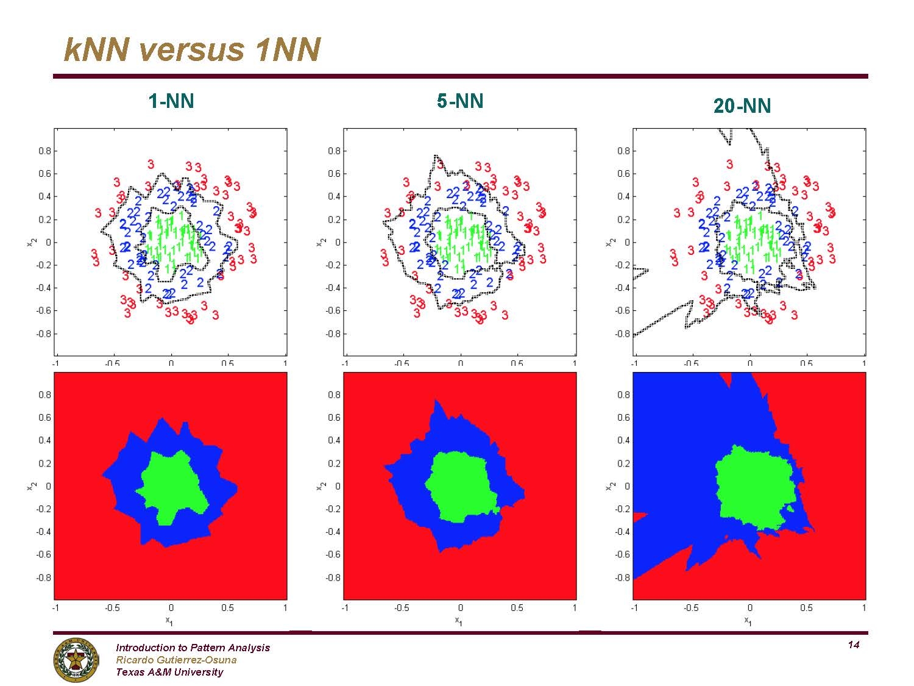
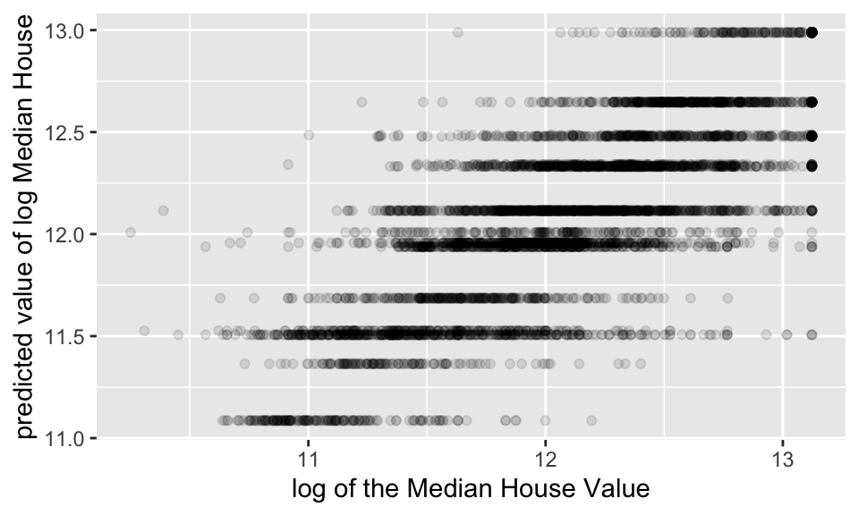

# Classification {#class}


<!---
Daniela Witten talking about inference in prediction: https://www.youtube.com/watch?v=Y4UJjzuYjfM 
R Unconference 2013

that f is a meaningful reflection of the true unknown process.


One of the most satisfying aspects of this unit is that you can now turn students loose on a massive data set. Past instances of the KDD Cup \url{http://www.sigkdd.org/kddcup/index.php} are an excellent source for such data sets. We explored data from the 2008 KDD Cup on breast cancer. Each of the n observations contained digitized data from an X-Ray image of a breast. Each observation corresponded to a small area of a particular breast, which may or may not depict a malignant tumor ￜￜthis provided the binary response variable.  In addition to a handful of well-defined variables ((x, y)-location, etc.), each observation has 117 nameless attributes, about which no information was provided. Knowing nothing about what these variables mean, students recognized the need to employ machine learning techniques to sift through them and find relationships. The size of the data and number of variables made manual exploration of the data impractical.

\textcolor{red}{See zissermanML.pdf for much more on regression trees, SVM, etc.}
\url{http://www.dabi.temple.edu/~hbling/8590.002/Montillo_RandomForests_4-2-2009.pdf}
--->


<!---
## 10/29/19 Agenda {#Oct29}
1. classification
2. $k$-Nearest Neighbors
3. bias-variance trade-off
4. cross validation


**Important Note**:  For the majority of the classification and clustering methods, we will use the `caret` package in R.  For more information see: http://topepo.github.io/caret/index.html

Also, check out the `caret` cheat sheet:  https://github.com/rstudio/cheatsheets/raw/master/caret.pdf
--->

@Baumer15 provides a concise explanation of how both statistics and data science work to enhance ideas of machine learning, one aspect of which is classification:


> In order to understand machine learning, one must recognize the differences between the mindset of the data miner and the statistician, notably characterized by @brei01, who distinguished two types of models f for y, the response variable, and x, a vector of explanatory variables. One might consider a *data model* f such that y $\sim$ f(x), assess whether f could reasonably have been the process that generated y from x, and then make inferences about f. The goal here is to learn about the real process that generated y from x.

> Alternatively, one might construct an *algorithmic model* f, such that $y \sim f(x)$, and use f to predict unobserved values of y. If it can be determined that f does in fact do a good job of predicting values of y, one might not care to learn much about f. In the former case, since we want to learn about f, a simpler model may be preferred. Conversely, in the latter case, since we want to predict new values of y, we may be indifferent to model complexity (other than concerns about overfitting and scalability).


Classification is a supervised learning technique to extract general patterns from the data in order to build a predictor for a new test or validation data set.  That is, the model should *classify* new points into groups (or with a numerical response values) based on a model built from a set of data which provides known group membership for each value.  We will consider classifying into categories (often only one of two categories) as well as predicting a numeric variable  (e.g., support vector machines and linear regression).

Some examples of classification techniques include: linear regression, logistic regression, neural networks, **classification trees**, **Random Forests**, **k-nearest neighbors**, **support vector machines**, n&auml;ive Bayes, and linear discriminant analysis.  We will cover the methods in **bold**.

**Simple is Better**  (From @field07, p. 87)

1. We want to avoid over-fitting the model (certainly, it is a bad idea to model the noise!)
2. Future prediction performance goes down with too many predictors.
3. Simple models provide better insight into causality and specific associations.
4. Fewer predictors implies fewer variables to collect in later studies.

That said, the model should still represent the complexity of the data!  We describe the trade-off above as the "bias-variance" trade-off. In order to fully understand that trade-off, let's first cover the structure of model building and also the classification method known as $k$-Nearest Neighbors.


## Model Building Process

All classification and prediction models have the same basic steps.  The data is preprocessed, the model is trained, and then the model is validated.


If the variables and information used to train the model has not been fully tuned, processed, and considered for the model, it won't matter how sophisticated or special the model is.  Garbage in, garbage out.


### Cross Validation {#cv}

#### Bias-variance trade-off {-}

**Excellent resource**

for explaining the bias-variance trade-off:  http://scott.fortmann-roe.com/docs/BiasVariance.html

* **Variance** refers to the amount by which $\hat{f}$ would change if we estimated it using a different training set.  Generally, the closer the model fits the data, the more variable it will be (it'll be different for each data set!).  A model with many many explanatory variables will often fit the data too closely.

* **Bias** refers to the error that is introduced by approximating the "truth" by a model which is too simple. For example, we often use linear models to describe complex relationships, but it is unlikely that any real life situation actually has a *true* linear model.  However, if the true relationship is close to linear, then the linear model will have a low bias.

Generally, the simpler the model, the lower the variance.  The more complicated the model, the lower the bias.  In this class, cross validation will be used to assess model fit.  [If time permits, Receiver Operating Characteristic (ROC) curves will also be covered.]


\begin{align}
\mbox{prediction error } = \mbox{ irreducible error } + \mbox{ bias } + \mbox{ variance}
\end{align}

* **irreducible error**  The irreducible error is the natural variability that comes with observations.  No matter how good the model is, we will never be able to predict perfectly.
* **bias**  The bias of the model represents the difference between the true model and a model which is too simple.  That is, the more complicated the model (e.g., smaller $k$ in $k$NN), the closer the points are to the prediction.  As the model gets more complicated (e.g., as $k$ decreases), the bias goes down.
* **variance**  The variance represents the variability of the model from sample to sample.  That is, a simple model (big $k$ in $k$NN) would not change a lot from sample to sample.  The variance decreases as the model becomes more simple (e.g., as $k$ increases).


Note the bias-variance trade-off.  We want our prediction error to be small, so we choose a model that is medium with respect to both bias and variance.  We cannot control the irreducible error.

<div class="figure" style="text-align: center">

<p class="caption">(\#fig:unnamed-chunk-4)Test and training error as a function of model complexity.  Note that the error goes down monotonically only for the training data.  Be careful not to overfit!!  [@ESL]</p>
</div>


The following visualization does an excellent job of communicating the trade-off between bias and variance as a function of a specific tuning parameter, here: minimum node size of a classification tree.  http://www.r2d3.us/visual-intro-to-machine-learning-part-2/

#### Implementing Cross Validation {-}


<div class="figure" style="text-align: center">

<p class="caption">(\#fig:unnamed-chunk-5)[@flach12]</p>
</div>

Cross validation is typically used in two ways.  

1. To assess a model's accuracy (*model assessment*).  
2. To build a model (*model selection*).

#### Different ways to CV {-}

Suppose that we build a classifier on a given data set.  We'd like to know how well the model classifies observations, but if we test on the samples at hand, the error rate will be much lower than the model's inherent accuracy rate.  Instead, we'd like to predict *new* observations that were not used to create the model.  There are various ways of creating *test* or *validation* sets of data:

* one training set, one test set  [two drawbacks:  estimate of error is highly  variable because it depends on which points go into the training set; and because the training data set is smaller than the full data set, the error rate is biased in such a way that it overestimates the actual error rate of the modeling technique.]
* leave one out cross validation (LOOCV)
1. remove one observation
2. build the model using the remaining n-1 points
3. predict class membership for the observation which was removed
4. repeat by removing each observation one at a time

* $V$-fold cross validation ($V$-fold CV)
    * like LOOCV except that the algorithm is run $V$ times on each group (of approximately equal size) from a partition of the data set.]
    * LOOCV is a special case of $V$-fold CV with $V=n$
    * advantage of $V$-fold is computational
    * $V$-fold often has a better bias-variance trade-off [bias is lower with LOOCV.  however, because LOOCV predicts $n$ observations from $n$ models which are basically the same, the variability will be higher (i.e., based on the $n$ data values).  with $V$-fold, prediction is on $n$ values from $V$ models which are much less correlated.  the effect is to average out the predicted values in such a way that there will be less variability from data set to data set.]


#### CV for **Model assessment** 10-fold {-}

1. assume $k$ is given for $k$-NN
2. remove 10% of the data
3. build the model using the remaining 90%
4. predict class membership / continuous response for the 10% of the observations which were removed
5. repeat by removing each decile one at a time
6. a good measure of the model's ability to predict is the error rate associated with the predictions on the data which have been independently predicted


#### CV for **Model selection** 10-fold {-}

1. set $k$ in $k$-NN
2. build the model using the $k$ value set above:
    a. remove 10% of the data
    b. build the model using the remaining 90%
    c. predict class membership / continuous response for the 10% of the observations which were removed
    d. repeat by removing each decile one at a time

3. measure the CV prediction error for the $k$ value at hand
4. repeat steps 1-3 and choose the $k$ for which the prediction error is lowest


#### CV for **Model assessment and selection** 10-fold {-}

To do both, one approach is to use test/training data *and* CV in order to both model assessment and selection.   Note that CV could be used in both steps, but the algorithm is slightly more complicated.

1. split the data into training and test observations
2. set $k$ in $k$-NN
3. build the model using the $k$ value set above on *only the training data*:
    a. remove 10% of the training data
    b. build the model using the remaining 90% of the training data
    c. predict class membership / continuous response for the 10% of the training observations which were removed
    d. repeat by removing each decile one at a time from the training data
4. measure the CV prediction error for the $k$ value at hand on the training data
5. repeat steps 2-4 and choose the $k$ for which the prediction error is lowest for the training data
6. using the $k$ value given in step 5, assess the prediction error on the test data


<div class="figure" style="text-align: center">

<p class="caption">(\#fig:unnamed-chunk-6)Nested cross-validation: two cross-validation loops are run one inside the other.  [@CVpaper]</p>
</div>


### **tidymodels** 

The **tidymodels** framework provides a series of steps that allow for systematic model building.  The steps are:


1. partition the data
2. build a recipe
3. select a model
4. create a workflow
5. fit the model  
6. validate the model


#### 1. Partition the data {-}

Put the testing data in your pocket (keep it secret from R!!)

<div class="figure" style="text-align: center">

<p class="caption">(\#fig:unnamed-chunk-7)Image credit: Julia Silge</p>
</div>

#### 2. build a recipe {-}

1. Start the `recipe()`
2. Define the **variables** involved
3. Describe preprocessing **step-by-step**

**feature engineering** or preprocessing:

> feature engineering is the process of transforming raw data into features (variables) that are better predictors (for the model at hand).

Examples include:

* create new variables (e.g., combine levels -> from state to region)
* transform variable (e.g., log, polar coordinates)
* continuous variables -> discrete (e.g., binning)
* numerical categorical data -> factors / character strings (one hot encoding)
* time -> discretized time
* missing values -> imputed
* NA -> level
* continuous variables -> center & scale ("normalize")


**`step_` functions**

For more information: https://recipes.tidymodels.org/reference/index.html


```r
ls(pattern = '^step_', env = as.environment('package:recipes'))
```

```
##  [1] "step_arrange"       "step_bagimpute"     "step_bin2factor"   
##  [4] "step_BoxCox"        "step_bs"            "step_center"       
##  [7] "step_classdist"     "step_corr"          "step_count"        
## [10] "step_cut"           "step_date"          "step_depth"        
## [13] "step_discretize"    "step_downsample"    "step_dummy"        
## [16] "step_factor2string" "step_filter"        "step_geodist"      
## [19] "step_holiday"       "step_hyperbolic"    "step_ica"          
## [22] "step_impute_bag"    "step_impute_knn"    "step_impute_linear"
## [25] "step_impute_lower"  "step_impute_mean"   "step_impute_median"
## [28] "step_impute_mode"   "step_impute_roll"   "step_indicate_na"  
## [31] "step_integer"       "step_interact"      "step_intercept"    
## [34] "step_inverse"       "step_invlogit"      "step_isomap"       
## [37] "step_knnimpute"     "step_kpca"          "step_kpca_poly"    
## [40] "step_kpca_rbf"      "step_lag"           "step_lincomb"      
## [43] "step_log"           "step_logit"         "step_lowerimpute"  
## [46] "step_meanimpute"    "step_medianimpute"  "step_modeimpute"   
## [49] "step_mutate"        "step_mutate_at"     "step_naomit"       
## [52] "step_nnmf"          "step_normalize"     "step_novel"        
## [55] "step_ns"            "step_num2factor"    "step_nzv"          
## [58] "step_ordinalscore"  "step_other"         "step_pca"          
## [61] "step_pls"           "step_poly"          "step_profile"      
## [64] "step_range"         "step_ratio"         "step_regex"        
## [67] "step_relevel"       "step_relu"          "step_rename"       
## [70] "step_rename_at"     "step_rm"            "step_rollimpute"   
## [73] "step_sample"        "step_scale"         "step_select"       
## [76] "step_shuffle"       "step_slice"         "step_spatialsign"  
## [79] "step_sqrt"          "step_string2factor" "step_unknown"      
## [82] "step_unorder"       "step_upsample"      "step_window"       
## [85] "step_YeoJohnson"    "step_zv"
```

#### 3. select a model {-}

To specify a model:

1. pick a **model**
2. set the **mode** (regression vs classification, if needed)
3. set the **engine**

Examples of engines for some of the classification algorithms we will cover in class:


```r
show_engines("nearest_neighbor")
```

```
## # A tibble: 2 × 2
##   engine mode          
##   <chr>  <chr>         
## 1 kknn   classification
## 2 kknn   regression
```

```r
show_engines("decision_tree")
```

```
## # A tibble: 5 × 2
##   engine mode          
##   <chr>  <chr>         
## 1 rpart  classification
## 2 rpart  regression    
## 3 C5.0   classification
## 4 spark  classification
## 5 spark  regression
```

```r
show_engines("rand_forest")
```

```
## # A tibble: 6 × 2
##   engine       mode          
##   <chr>        <chr>         
## 1 ranger       classification
## 2 ranger       regression    
## 3 randomForest classification
## 4 randomForest regression    
## 5 spark        classification
## 6 spark        regression
```

```r
show_engines("svm_poly")
```

```
## # A tibble: 2 × 2
##   engine  mode          
##   <chr>   <chr>         
## 1 kernlab classification
## 2 kernlab regression
```

```r
show_engines("svm_rbf")
```

```
## # A tibble: 4 × 2
##   engine    mode          
##   <chr>     <chr>         
## 1 kernlab   classification
## 2 kernlab   regression    
## 3 liquidSVM classification
## 4 liquidSVM regression
```

```r
show_engines("linear_reg")
```

```
## # A tibble: 5 × 2
##   engine mode      
##   <chr>  <chr>     
## 1 lm     regression
## 2 glmnet regression
## 3 stan   regression
## 4 spark  regression
## 5 keras  regression
```

#### 4. Create a workflow {-}

A workflow combines the model / engine with the recipe.


#### 5. Fit the model {-}

Putting it all together, the `fit()` will give the model specifications.

#### 6. Validate the model {-}

**model parameters**

* Some model parameters are tuned from the data (some aren't).
  - linear model coefficients are optimized (not tuned)
  - k-nn value of "k" is tuned

* If the model is tuned using the data, the same data **cannot** be used to assess the model.

* With Cross Validation, you iteratively put data in your pocket.

* For example, keep 1/5 of the data in your pocket, build the model on the remaining 4/5 of the data.

**Cross validation** for tuning parameters.  Note that all of the cross validation is done on the **training** data.

<div class="figure" style="text-align: center">

<p class="caption">(\#fig:unnamed-chunk-10)Image credit: Alison Hill</p>
</div>

$$\bigg\Downarrow$$

<div class="figure" style="text-align: center">

<p class="caption">(\#fig:unnamed-chunk-11)Image credit: Alison Hill</p>
</div>

$$\bigg\Downarrow$$

<div class="figure" style="text-align: center">

<p class="caption">(\#fig:unnamed-chunk-12)Image credit: Alison Hill</p>
</div>

$$\bigg\Downarrow$$

<div class="figure" style="text-align: center">

<p class="caption">(\#fig:unnamed-chunk-13)Image credit: Alison Hill</p>
</div>

$$\bigg\Downarrow$$

<div class="figure" style="text-align: center">

<p class="caption">(\#fig:unnamed-chunk-14)Image credit: Alison Hill</p>
</div>

$$\bigg\Downarrow$$

<div class="figure" style="text-align: center">

<p class="caption">(\#fig:unnamed-chunk-15)Image credit: Alison Hill</p>
</div>

$$\bigg\Downarrow$$

<div class="figure" style="text-align: center">

<p class="caption">(\#fig:unnamed-chunk-16)Image credit: Alison Hill</p>
</div>

$$\bigg\Downarrow$$

<div class="figure" style="text-align: center">

<p class="caption">(\#fig:unnamed-chunk-17)Image credit: Alison Hill</p>
</div>

$$\bigg\Downarrow$$

<div class="figure" style="text-align: center">

<p class="caption">(\#fig:unnamed-chunk-18)Image credit: Alison Hill</p>
</div>

$$\bigg\Downarrow$$

<div class="figure" style="text-align: center">

<p class="caption">(\#fig:unnamed-chunk-19)Image credit: Alison Hill</p>
</div>

#### Reflecting on Model Building

In <a href = "https://www.tmwr.org/" target = "_blank">Tidy Modeling with R</a>, Kuhn and Silge walk through an example of an entire model building process.  Note that each of the stages is visited often before coming up with an appropriate model. 

<div class="figure" style="text-align: center">

<p class="caption">(\#fig:unnamed-chunk-20)Image credit: https://www.tmwr.org/</p>
</div>

<div class="figure" style="text-align: center">

<p class="caption">(\#fig:unnamed-chunk-21)Image credit: https://www.tmwr.org/</p>
</div>


<div class="figure" style="text-align: center">

<p class="caption">(\#fig:unnamed-chunk-22)Image credit: https://www.tmwr.org/</p>
</div>


### R model: penguins

<div class="figure" style="text-align: right">

<p class="caption">(\#fig:unnamed-chunk-23)Image credit: Alison Hill</p>
</div>


```r
penguins
```

```
## # A tibble: 344 × 8
##    species island    bill_length_mm bill_depth_mm flipper_length_mm body_mass_g
##    <fct>   <fct>              <dbl>         <dbl>             <int>       <int>
##  1 Adelie  Torgersen           39.1          18.7               181        3750
##  2 Adelie  Torgersen           39.5          17.4               186        3800
##  3 Adelie  Torgersen           40.3          18                 195        3250
##  4 Adelie  Torgersen           NA            NA                  NA          NA
##  5 Adelie  Torgersen           36.7          19.3               193        3450
##  6 Adelie  Torgersen           39.3          20.6               190        3650
##  7 Adelie  Torgersen           38.9          17.8               181        3625
##  8 Adelie  Torgersen           39.2          19.6               195        4675
##  9 Adelie  Torgersen           34.1          18.1               193        3475
## 10 Adelie  Torgersen           42            20.2               190        4250
## # … with 334 more rows, and 2 more variables: sex <fct>, year <int>
```

#### 1. Partition the data {-}


```r
library(tidymodels)
library(palmerpenguins)

set.seed(47)
penguin_split <- initial_split(penguins)
penguin_train <- training(penguin_split)
penguin_test <- testing(penguin_split)
```

#### 2. build a recipe {-}


```r
penguin_recipe <-
  recipe(body_mass_g ~ species + island + bill_length_mm + 
           bill_depth_mm + flipper_length_mm + sex + year,
         data = penguin_train) %>%
  step_mutate(year = as.factor(year)) %>%
  step_unknown(sex, new_level = "unknown") %>%
  step_relevel(sex, ref_level = "female") %>%
  update_role(island, new_role = "id variable")
```


```r
summary(penguin_recipe)
```

```
## # A tibble: 8 × 4
##   variable          type    role        source  
##   <chr>             <chr>   <chr>       <chr>   
## 1 species           nominal predictor   original
## 2 island            nominal id variable original
## 3 bill_length_mm    numeric predictor   original
## 4 bill_depth_mm     numeric predictor   original
## 5 flipper_length_mm numeric predictor   original
## 6 sex               nominal predictor   original
## 7 year              numeric predictor   original
## 8 body_mass_g       numeric outcome     original
```

#### 3. select a model {-}


```r
penguin_lm <- linear_reg() %>%
  set_engine("lm")
```


```r
penguin_lm
```

```
## Linear Regression Model Specification (regression)
## 
## Computational engine: lm
```

#### 4. Create a workflow {-}


```r
penguin_wflow <- workflow() %>%
  add_model(penguin_lm) %>%
  add_recipe(penguin_recipe)
```


```r
penguin_wflow
```

```
## ══ Workflow ════════════════════════════════════════════════════════════════════
## Preprocessor: Recipe
## Model: linear_reg()
## 
## ── Preprocessor ────────────────────────────────────────────────────────────────
## 3 Recipe Steps
## 
## • step_mutate()
## • step_unknown()
## • step_relevel()
## 
## ── Model ───────────────────────────────────────────────────────────────────────
## Linear Regression Model Specification (regression)
## 
## Computational engine: lm
```

#### 5. Fit the model {-}


```r
penguin_fit <- penguin_wflow %>%
  fit(data = penguin_train)
```


```r
penguin_fit %>% tidy()
```

```
## # A tibble: 10 × 5
##    term              estimate std.error statistic  p.value
##    <chr>                <dbl>     <dbl>     <dbl>    <dbl>
##  1 (Intercept)        -2417.     665.      -3.64  3.36e- 4
##  2 speciesChinstrap    -208.      92.9     -2.24  2.58e- 2
##  3 speciesGentoo        985.     152.       6.48  5.02e-10
##  4 bill_length_mm        13.5      8.29     1.63  1.04e- 1
##  5 bill_depth_mm         80.9     22.1      3.66  3.10e- 4
##  6 flipper_length_mm     20.8      3.62     5.74  2.81e- 8
##  7 sexmale              351.      52.6      6.67  1.72e-10
##  8 sexunknown            47.6    103.       0.460 6.46e- 1
##  9 year2008             -24.8     47.5     -0.521 6.03e- 1
## 10 year2009             -61.9     46.0     -1.35  1.80e- 1
```

#### 6. Cross validation {-}

(See Section \@ref(cv) and future R examples for a full description of cross validation.)


## $k$-Nearest Neighbors {#knn}


The $k$-Nearest Neighbor algorithm does exactly what it sounds like it does.  

* user decides on the integer value for $k$

* user decides on a distance metric (most $k$-NN algorithms default to Euclidean distance)

* a point is classified to be in the same group as the majority of the $k$ **closest** points in the training data.


### $k$-NN algorithm

1. Decide on a distance metric (e.g., Euclidean distance, 1 - correlation, etc.) and find the distances from each point in the test set to each point in the training set.  The distance is measured in the feature space,  that is, with respect to the explanatory variables (not the response variable).

n.b.  In most machine learning algorithms that use "distance" as a measure, the "distance" is not required to be a mathematical distance metric.  Indeed, 1-correlation is a very common distance measure, and it fails the triangle inequality.


2. Consider a point in the test set.  Find the $k$ closest points in the training set to the one test observation.

3. Using majority vote, find the dominate class of the $k$ closest points.  Predict that class label to the test observation. 

Note: if the response variable is continuous (instead of categorical), find the average response variable of the $k$ training point to be the predicted response for the one test observation.


**Shortcomings of $k$-NN**:

* one class can dominate if it has a large majority
* Euclidean distance is dominated by scale
* it can be computationally unwieldy (and unneeded!!) to calculate all distances (there are algorithms to search smartly)
* the output doesn't provide any information about which explanatory variables are informative.
* doesn't work well with large datasets (the cost of prediction is high, and the model doesn't always find the structure)
* doesn't work well in high dimensions (curse of dimensionality -- distance becomes meaningless in high dimensions)
* we need a lot of feature scaling
* sensitive to noise and outliers

**Strengths of $k$-NN**:

* it can easily work for any number of categories (of the outcome variable)
* it can predict a quantitative response variable
* the bias of 1-NN is often low (but the variance is high)
* any distance metric can be used (so the algorithm models the data appropriately)
* the method is straightforward to implement / understand
* there is no training period (i.e., no discrimination function is created)
* model is nonparametric (no distributional assumptions on the data)
* great model for imputing missing data




###  R k-NN: penguins

We will fit a $k$-Nearest Neighbor algorithm to the `penguins` dataset.  As previously (and as to come), we'll use the entire **tidymodels** workflow including partitioning the data, build a recipe, select a model, create a workflow, fit a model, and validate the model


```r
library(GGally) # for plotting
library(tidymodels)
data(penguins)
```

#### penguin data {-}


```r
ggpairs(penguins, mapping = ggplot2::aes(color = species), alpha=.4)
```


#### $k$-NN to predict penguin species {-}

#### 1. Partition the data


#### 2. Build a recipe

```r
penguin_knn_recipe <-
  recipe(species ~ body_mass_g + island + bill_length_mm + 
           bill_depth_mm + flipper_length_mm,
         data = penguin_train) %>%
  update_role(island, new_role = "id variable") %>%
  step_normalize(all_predictors())

summary(penguin_knn_recipe)
```

```
## # A tibble: 6 × 4
##   variable          type    role        source  
##   <chr>             <chr>   <chr>       <chr>   
## 1 body_mass_g       numeric predictor   original
## 2 island            nominal id variable original
## 3 bill_length_mm    numeric predictor   original
## 4 bill_depth_mm     numeric predictor   original
## 5 flipper_length_mm numeric predictor   original
## 6 species           nominal outcome     original
```

#### 3. Select a model

(note that we've used the default number of neighbors (here $k=7$).)

```r
penguin_knn <- nearest_neighbor() %>%
  set_engine("kknn") %>%
  set_mode("classification")

penguin_knn
```

```
## K-Nearest Neighbor Model Specification (classification)
## 
## Computational engine: kknn
```


#### 4. Create a workflow

```r
penguin_knn_wflow <- workflow() %>%
  add_model(penguin_knn) %>%
  add_recipe(penguin_knn_recipe)

penguin_knn_wflow
```

```
## ══ Workflow ════════════════════════════════════════════════════════════════════
## Preprocessor: Recipe
## Model: nearest_neighbor()
## 
## ── Preprocessor ────────────────────────────────────────────────────────────────
## 1 Recipe Step
## 
## • step_normalize()
## 
## ── Model ───────────────────────────────────────────────────────────────────────
## K-Nearest Neighbor Model Specification (classification)
## 
## Computational engine: kknn
```


#### 5. Fit (/ predict) 


```r
penguin_knn_fit <- penguin_knn_wflow %>%
  fit(data = penguin_train)
```

For the next R code chunk break it down into pieces -- that is, run each line one at a time.

```r
penguin_knn_fit %>% 
  predict(new_data = penguin_test) %>%
  cbind(penguin_test) %>%
  metrics(truth = species, estimate = .pred_class) %>%
  filter(.metric == "accuracy")
```

```
## # A tibble: 1 × 3
##   .metric  .estimator .estimate
##   <chr>    <chr>          <dbl>
## 1 accuracy multiclass     0.988
```

#### What is $k$?

It turns out that the default value for $k$ in the **kknn** engine is 7.  Is 7 best?


**Cross Validation!!!**

The red observations are used to fit the model, the black observations are used to assess the model.

<div class="figure" style="text-align: center">

<p class="caption">(\#fig:unnamed-chunk-43)Image credit: Alison Hill</p>
</div>


As we saw above, cross validation randomly splits the training data into V distinct blocks of roughly equal size.

* leave out the first block of analysis data and fit a model.
* the model is used to predict the held-out block of assessment data.
* continue the process until all V assessment blocks have been predicted

The final performance is based on the hold-out predictions by averaging the statistics from the V blocks.

#### 1b.  A new partition of the training data


```r
set.seed(470)
penguin_vfold <- vfold_cv(penguin_train,
                          v = 3, strata = species)
```

#### 3. Select a model

Now the knn model uses `tune()` to indicate that we actually don't know how many neighbors to use.

```r
penguin_knn_tune <- nearest_neighbor(neighbors = tune()) %>%
  set_engine("kknn") %>%
  set_mode("classification")
```

#### 4. Re-create a workflow

This time, use the model that has not set the number of neighbors.


```r
penguin_knn_wflow_tune <- workflow() %>%
  add_model(penguin_knn_tune) %>%
  add_recipe(penguin_knn_recipe)
```


#### 5. Fit the model

The model is fit to all three of the folds created above for each value of $k$ in `k_grid`.


```r
k_grid <- data.frame(neighbors = seq(1, 15, by = 4))
k_grid
```

```
##   neighbors
## 1         1
## 2         5
## 3         9
## 4        13
```

```r
penguin_knn_wflow_tune %>%
  tune_grid(resamples = penguin_vfold, 
           grid = k_grid) %>%
  collect_metrics() %>%
  filter(.metric == "accuracy")
```

```
## # A tibble: 4 × 7
##   neighbors .metric  .estimator  mean     n   std_err .config             
##       <dbl> <chr>    <chr>      <dbl> <int>     <dbl> <chr>               
## 1         1 accuracy multiclass 0.971     2 0.00595   Preprocessor1_Model1
## 2         5 accuracy multiclass 0.977     2 0.000134  Preprocessor1_Model2
## 3         9 accuracy multiclass 0.988     2 0.0000668 Preprocessor1_Model3
## 4        13 accuracy multiclass 0.983     2 0.00568   Preprocessor1_Model4
```


#### 6. Validate the model

Using $k$ = 9, the model is re-trained on the training data and tested on the test data (to estimate overall model accuracy).


##### 3. select a model


```r
penguin_knn_final <- nearest_neighbor(neighbors = 9) %>%
  set_engine("kknn") %>%
  set_mode("classification")

penguin_knn_final
```

```
## K-Nearest Neighbor Model Specification (classification)
## 
## Main Arguments:
##   neighbors = 9
## 
## Computational engine: kknn
```

##### 4. create a workflow


```r
penguin_knn_wflow_final <- workflow() %>%
  add_model(penguin_knn_final) %>%
  add_recipe(penguin_knn_recipe)

penguin_knn_wflow_final
```

```
## ══ Workflow ════════════════════════════════════════════════════════════════════
## Preprocessor: Recipe
## Model: nearest_neighbor()
## 
## ── Preprocessor ────────────────────────────────────────────────────────────────
## 1 Recipe Step
## 
## • step_normalize()
## 
## ── Model ───────────────────────────────────────────────────────────────────────
## K-Nearest Neighbor Model Specification (classification)
## 
## Main Arguments:
##   neighbors = 9
## 
## Computational engine: kknn
```

##### 5. fit the model

```r
penguin_knn_fit_final <- penguin_knn_wflow_final %>%
  fit(data = penguin_train)
```


##### 6. validate the model

```r
penguin_knn_fit_final %>% 
  predict(new_data = penguin_test) %>%
  cbind(penguin_test) %>%
  metrics(truth = species, estimate = .pred_class) %>%
  filter(.metric == "accuracy")
```

```
## # A tibble: 1 × 3
##   .metric  .estimator .estimate
##   <chr>    <chr>          <dbl>
## 1 accuracy multiclass     0.977
```


Huh.  Seems like $k=9$ didn't do as well as $k=7$ (the value we tried at the very beginning before cross validating).

Well, it turns out, that's the nature of variability, randomness, and model building.

We don't know truth, and we won't every find a perfect model.


<!---
## 10/31/19 Agenda {#Oct31}
1. trees (CART)
2. building trees (binary recursive splitting)
3. homogeneity measures
4. pruning trees
--->


## Decision Trees {#cart}

Stephanie Yee and Tony Chu created the following (amazing!) demonstration for tree intuition.  Step-by-step, they build a recursive binary tree in order to model the differences between homes in SF and homes in NYC.

<div class="figure" style="text-align: center">

<p class="caption">(\#fig:unnamed-chunk-52)http://www.r2d3.us/visual-intro-to-machine-learning-part-1/ A visual introduction to machine learning.</p>
</div>

Decision trees are used for all sorts of predictive and descriptive models.  The NYT created a recursive binary decision tree to show patterns in identity and political affiliation.   

<div class="figure" style="text-align: center">

<p class="caption">(\#fig:unnamed-chunk-53)https://www.nytimes.com/interactive/2019/08/08/opinion/sunday/party-polarization-quiz.html Quiz: Let Us Predict Whether You're a Democrat or a Republican NYT, Aug 8, 2019.  Note that race is the first and dominant node, followed by religion.</p>
</div>


### CART algorithm

**Basic Classification and Regression Trees (CART) Algorithm:**

1. Start with all observations in one group.
2. Find the variable/split that best separates the response variable (successive binary partitions based on the different predictors / explanatory variables).
    * Evaluation "homogeneity" within each group
    * Divide the data into two groups ("leaves") on that split ("node").
    * Within each split, find the best variable/split that separates the outcomes.
3. Continue until the groups are too small or sufficiently "pure".
4. Prune tree.


**Shortcomings of CART:**

* Straight CART do not generally have the same predictive accuracy as other classification approaches.  (we will improve the model - see Random Forests, boosting, bagging)
* Difficult to write down / consider the CART "model"
* Without proper pruning, the model can easily lead to overfitting
* With lots of predictors, (even greedy) partitioning can become computationally unwieldy
* Often, prediction performance is poor


**Strengths of CART:**

* They are easy to explain; trees are easy to display graphically (which make them easy to interpret). (They mirror the typical human decision-making process.)
* Can handle categorical or numerical predictors or response variables (indeed, they can handle mixed predictors at the same time!).
* Can handle more than 2 groups for categorical predictions
* Easily ignore redundant variables.
* Perform better than linear models in non-linear settings.  Classification trees are non-linear models, so they immediately use interactions between variables.
* Data transformations may be less important (monotone transformations on the explanatory variables won't change anything).


#### Classification Trees

A *classification tree* is used to predict a categorical response variable (rather than a quantitative one).  The end predicted value will be the one of the *most commonly occurring class* of training observations in the region to which it belongs.  The goal is to create regions which are as homogeneous as possible with respect to the response variable - categories.

**measures of impurity**

1. Calculate the *classification error rate* as the fraction of the training observations in that region that do not belong to the most common class: $$E_m = 1 - \max_k(\hat{p}_{mk})$$
where $\hat{p}_{mk}$ represents the proportion of training observations in the $m$th region that are from the $k$th class.  However, the classification error rate is not particularly sensitive to node purity, and so two additional measures are typically used to partition the regions.
2. Further, the *Gini index* is defined by $$G_m= \sum_{k=1}^K \hat{p}_{mk}(1-\hat{p}_{mk})$$
a measure of total variance across the $K$ classes. [Recall, the variance of a Bernoulli random variable with $\pi$ = P(success) is $\pi(1-\pi)$.] Note that the Gini index takes on a small value if all of the $\hat{p}_{mk}$ values are close to zero or one.  For this reason, the Gini index is referred to as a measure of node *purity* - a small value indicates that a node contains predominantly observations from a single class.
3. Last, the *cross-entropy* is defined as $$D_m = - \sum_{k=1}^K \hat{p}_{mk} \log \hat{p}_{mk}$$
Since $0 \leq \hat{p}_{mk} \leq 1$ it follows that $0 \leq -\hat{p}_{mk} \log\hat{p}_{mk}$.  One can show that the cross-entropy will take on a value near zero if the $\hat{p}_{mk}$ values are all near zero or all near one.  Therefore, like the Gini index, the cross-entropy will take on a small value if the $m$th node is pure.
4. To *build* the tree, typically the Gini index or the cross-entropy are used to evaluate a particular split.
5. To *prune* the tree, often classification error is used (if accuracy of the final pruned tree is the goal)


Computationally, it is usually infeasible to consider every possible partition of the observations.  Instead of looking at all partitions, we perform a *top down* approach to the problem which is known as *recursive binary splitting*  (*greedy* because we look only at the current split and not at the outcomes of the splits to come).


**Recursive Binary Splitting on Categories** (for a given node)

1. Select the predictor $X_j$ and the cutpoint $s$ such that splitting the predictor space into the regions $\{X | X_j< s\}$ and $\{X | X_j \geq s\}$ lead to the greatest reduction in Gini index or cross-entropy.
2. For any $j$ and $s$, define the pair of half-planes to be
$$R_1(j,s) = \{X | X_j < s\} \mbox{ and } R_2(j,s) = \{X | X_j \geq s\}$$
and we seek the value of $j$ and $s$ that minimize the equation:
\begin{align}
& \sum_{i:x_i \in R_1(j,s)} \sum_{k=1}^K \hat{p}_{{R_1}k}(1-\hat{p}_{{R_1}k}) + \sum_{i:x_i \in R_2(j,s)} \sum_{k=1}^K \hat{p}_{{R_2}k}(1-\hat{p}_{{R_2}k})\\
\mbox{equivalently: } & n_{R_1} \sum_{k=1}^K \hat{p}_{{R_1}k}(1-\hat{p}_{{R_1}k}) + n_{R_2} \sum_{k=1}^K \hat{p}_{{R_2}k}(1-\hat{p}_{{R_2}k})\\
\end{align}
3. Repeat the process, looking for the best predictor and best cutpoint *within* one of the previously identified regions (producing three regions, now).
4. Keep repeating the process until a stopping criterion is reached - for example, until no region contains more than 5 observations.


#### Regression Trees


The goal of the algorithm in a *regression tree* is to split the set of possible value for the data into $|T|$ distinct and non-overlapping regions, $R_1, R_2, \ldots, R_{|T|}$.  For every observation that falls into the region $R_m$, we make the same prediction - the mean of the response values for the training observations in $R_m$.  So how do we find the regions $R_1, \ldots, R_{|T|}$?


$\Rightarrow$ Minimize RSS, $$RSS = \sum_{m=1}^{|T|} \sum_{i \in R_m} (y_i - \overline{y}_{R_m})^2$$
where $\overline{y}_{R_m}$ is the mean response for the training observations within the $m$th region.

(Note:  in the chapter [@ISL] they refer to MSE - mean squared error - in addition to RSS where MSE is simply RSS / n, see equation (2.5).)

<!--
$$ MSE = \frac{\sum_{i=1}^N (y_i - \overline{y}_i)^2}{N}$$
-->

Again, it is usually infeasible to consider every possible partition of the observations.  Instead of looking at all partitions, we perform a *top down* approach to the problem which is known as *recursive binary splitting*  (*greedy* because we look only at the current split and not at the outcomes of the splits to come).


**Recursive Binary Splitting on Numerical Response** (for a given node)

1. Select the predictor $X_j$ and the cutpoint $s$ such that splitting the predictor space into the regions $\{X | X_j< s\}$ and $\{X | X_j \geq s\}$ lead to the greatest reduction in RSS.
2. For any $j$ and $s$, define the pair of half-planes to be
$$R_1(j,s) = \{X | X_j < s\} \mbox{ and } R_2(j,s) = \{X | X_j \geq s\}$$
and we see the value of $j$ and $s$ that minimize the equation:
$$\sum_{i:x_i \in R_1(j,s)} (y_i - \overline{y}_{R_1})^2 + \sum_{i:x_i \in R_2(j,s)} (y_i - \overline{y}_{R_2})^2$$
where $\overline{y}_{R_1}$ is the mean response for the training observations in $R_1(j,s)$ and $\overline{y}_{R_2}$ is the mean response for training observations in $R_2(j,s)$.
3. Repeat the process, looking for the best predictor and best cutpoint *within* one of the previously identified regions (producing three regions, now).
4. Keep repeating the process until a stopping criterion is reached - for example, until no region contains more than 5 observations.


#### (Avoiding) Overfitting

Ideally, the tree would not overfit the training data.  One could imagine how easy it would be to grow the tree over the training data so as to end up with terminal nodes which are completely homogeneous (but then don't represent the test data).


See the following (amazing!) demonstration for intuition on model validation / overfitting:  http://www.r2d3.us/visual-intro-to-machine-learning-part-2/

One possible algorithm for building a tree is to split based on the reduction in RSS (or Gini index, etc.) exceeding some (presumably high) threshold.  However, the strategy is known to be short sighted, as a split later down the tree may contain a large amount of information.  A better strategy is to grow a very large tree $T_0$ and then prune it back in order to obtain a subtree.  Use cross validation to build the subtree so as to not overfit the data.


******
**Algorithm**:  Building a Regression Tree

******
1.  Use recursive binary splitting to grow a large tree on the training data, stopping only when each terminal node has fewer than some minimum number of observations.
2.  Apply cost complexity pruning to the large tree in order to obtain a sequence of best subtrees, as a function of $\alpha$.
3. Use $V$-fold cross-validation to choose $\alpha$.  That is, divide the training observations into $V$ folds.  For each $v=1, 2, \ldots, V$:
    a. Repeat Steps 1 and 2 on all but the $V$th fold of the training data.
    b. Evaluate the mean squared prediction error on the data in the left-out $k$th fold, as a function of $\alpha$.
    For each value of $\alpha$, average the prediction error (either misclassification or RSS), and pick $\alpha$ to minimize the average error.
4. Return the subtree from Step 2 that corresponds to the chosen value of $\alpha$.

******


#### Cost Complexity Pruning

Also known as *weakest link pruning*, the idea is to consider a sequence of trees indexed by a nonnegative tuning parameter $\alpha$ (instead of considering every single subtree).  Generally, the idea is that there is a cost to having a larger (more complex!) tree.  We define the cost complexity criterion ($\alpha > 0$):
\begin{align}
\mbox{numerical: } C_\alpha(T) &= \sum_{m=1}^{|T|} \sum_{i \in R_m} (y_i - \overline{y}_{R_m})^2 + \alpha \cdot |T|\\
\mbox{categorical: } C_\alpha(T) &= \sum_{m=1}^{|T|} \sum_{i \in R_m} I(y_i \ne k(m)) + \alpha \cdot |T|
\end{align}
where $k(m)$ is the class with the majority of observations in node $m$ and $|T|$ is the number of terminal nodes in the tree.


* $\alpha$ small:  If $\alpha$ is set to be small, we are saying that the risk is more worrisome than the complexity and larger trees are favored because they reduce the risk.
* $\alpha$ large:  If $\alpha$ is set to be large, then the complexity of the tree is more worrisome and smaller trees are favored.

The way to think about cost complexity is to consider $\alpha$ increasing.  As $\alpha$ gets bigger, the "best" tree will be smaller.  But the test error will not be monotonically related to the size of the training tree.


**A note on $\alpha$**

In the text (*Introduction to Statistical Learning*) and almost everywhere else you might look, the cost complexity is defined as in previous slides.

However, you might notice that in R the `cost_complexity` value is typically less than 1.  From what I can tell, the value of the function that is being minimized in R is the **average** of the squared errors and the missclassification **rate**.

\begin{align}
\mbox{numerical: } C_\alpha(T) &= \frac{1}{n}\sum_{m=1}^{|T|} \sum_{i \in R_m} (y_i - \overline{y}_{R_m})^2 + \alpha \cdot |T|\\
\mbox{categorical: } C_\alpha(T) &= \frac{1}{n}\sum_{m=1}^{|T|} \sum_{i \in R_m} I(y_i \ne k(m)) + \alpha \cdot |T|
\end{align}


##### Variations on a theme {-}

The main ideas above are consistent throughout all CART algorithms.  However, the exact details of implementation can change from function to function, and often times it is very difficult to decipher exactly which equation is being used.  In the `tree` function in R, much of the decision making is done on `deviance` which is defined as:
\begin{align}
\mbox{numerical: } \mbox{deviance} &= \sum_{m=1}^{|T|}  \sum_{i \in R_m} (y_i - \overline{y}_{R_m})^2\\
\mbox{categorical: }  \mbox{deviance} &= -2\sum_{m=1}^{|T|} \sum_{k=1}^K n_{mk} \log \hat{p}_{mk}\\
\end{align}

For the CART algorithm, minimize the deviance (for both types of variables).  The categorical deviance will be small if most of the observations are in the majority group  (with high proportion).  Also, $\lim_{\epsilon \rightarrow 0} \epsilon \log(\epsilon) = 0$.  Additionally, methods of cross validation can also vary.  In particular, if the number of variables is large, the tree algorithm can be slow and so the cross validation process - choice of $\alpha$ - needs to be efficient.


##### CV for model building and model assessment {-}

Notice that CV is used for both model building and model assessment.  It is possible (and practical, though quite computational!) to use both practices on the same classification model.  The algorithm could be as follows.


******
**Algorithm**:  CV for both $V_1$-fold CV building and $V_2$-fold CV assessment

******
1. Partition the data in $V_1$ groups.
2. Remove the first group, and train the data on the remaining $V_1-1$ groups.
3. Use $V_2$-fold cross-validation (on the $V_1-1$ groups) to choose $\alpha$.  That is, divide the training observations into $V_2$ folds and find $\alpha$ that minimizes the error.
4. Using the subtree that corresponds to the chosen value of $\alpha$, predict the first of the $V_1$ hold out samples.
5. Repeat steps 2-4 using the remaining $V_1 - 1$ groups.

******


### R CART Example

The Census Bureau divides the country up into "tracts" of approximately
equal population. For the 1990 Census, California was divided into 20640 tracts.  One data sets (houses on http://lib.stat.cmu.edu/datasets/; http://lib.stat.cmu.edu/datasets/houses.zip) records the following for each tract in California: Median house price, median house age, total number of rooms, total number of bedrooms, total number of occupants, total number of houses, median income (in thousands of dollars), latitude and longitude.  It appeared in Pace and Barry (1997), "Sparse Spatial Autoregressions", **Statistics and Probability Letters**. 

#### Classification and Regression Trees {-}

**Classification Trees** are used to predict a response or class $Y$ from input $X_1, X_2, \ldots, X_n$. If it is a continuous response it's called a regression tree, if it is categorical, it's called a classification tree. At each node of the tree, we check the value of one the input $X_i$ and depending of the (binary) answer we continue to the left or to the right subbranch. When we reach a leaf we will find the prediction (usually it is a simple statistic of the dataset the leaf represents, like the most common value from the available classes).


Note on `maxdepth`:  as you might expect, `maxdepth` indicates the longest length from the root of the tree to a terminal node.  However, for `rpart` (in particular, using `rpart` or `rpart2` in `caret`), there are other default settings that keep the tree from growing all the way to singular nodes, even with a high `maxdepth`.


#### Regression Trees  {-}

For technical reasons (e.g., see [here](https://github.com/tidymodels/TMwR/issues/33)), the `step_log()` on the outcome variable step gives problems with predictions at the end.  Therefore, we mutate the outcome variable within the dataset before starting the model building process. 


```r
real.estate <- read.table("http://pages.pomona.edu/~jsh04747/courses/math154/CA_housedata.txt", 
                          header=TRUE) %>%
  mutate(logValue = log(MedianHouseValue))

# partition
set.seed(47)
house_split <- initial_split(real.estate)
house_train <- training(house_split)
house_test <- testing(house_split)

# recipe
house_cart_recipe <-
  recipe(logValue ~ Longitude + Latitude ,
         data = house_train)
# model
house_cart <- decision_tree() %>%
  set_engine("rpart") %>%
  set_mode("regression")

# workflow
house_cart_wflow <- workflow() %>%
  add_model(house_cart) %>%
  add_recipe(house_cart_recipe)

# fit
house_cart_fit <- house_cart_wflow %>%
  fit(data = house_train)
```


#### Model Output {-}


```r
house_cart_fit
```

```
## ══ Workflow [trained] ══════════════════════════════════════════════════════════
## Preprocessor: Recipe
## Model: decision_tree()
## 
## ── Preprocessor ────────────────────────────────────────────────────────────────
## 0 Recipe Steps
## 
## ── Model ───────────────────────────────────────────────────────────────────────
## n= 15480 
## 
## node), split, n, deviance, yval
##       * denotes terminal node
## 
##   1) root 15480 5024.405000 12.08947  
##     2) Latitude>=38.485 1541  283.738200 11.59436  
##       4) Latitude>=39.355 506   48.267930 11.31530 *
##       5) Latitude< 39.355 1035  176.803400 11.73079 *
##     3) Latitude< 38.485 13939 4321.152000 12.14421  
##       6) Longitude>=-121.645 10454 3320.946000 12.06198  
##        12) Latitude>=34.635 2166  491.986400 11.52110  
##          24) Longitude>=-120.265 1083  166.051200 11.28432 *
##          25) Longitude< -120.265 1083  204.505800 11.75787 *
##        13) Latitude< 34.635 8288 2029.685000 12.20333  
##          26) Longitude>=-118.315 6240 1373.830000 12.09295  
##            52) Longitude>=-117.575 2130  516.313400 11.87918  
##             104) Latitude>=33.605 821  123.684300 11.64002 *
##             105) Latitude< 33.605 1309  316.218800 12.02918  
##               210) Longitude>=-116.33 97    8.931327 11.17127 *
##               211) Longitude< -116.33 1212  230.181300 12.09784  
##                 422) Longitude>=-117.165 796  101.805300 11.94935 *
##                 423) Longitude< -117.165 416   77.245280 12.38196 *
##            53) Longitude< -117.575 4110  709.740000 12.20373  
##             106) Latitude>=33.735 3529  542.838300 12.14908  
##               212) Latitude< 34.105 2931  379.526800 12.09154  
##                 424) Longitude< -118.165 1114  147.375800 11.91911 *
##                 425) Longitude>=-118.165 1817  178.722200 12.19726 *
##               213) Latitude>=34.105 598  106.051400 12.43109 *
##             107) Latitude< 33.735 581   92.340630 12.53568 *
##          27) Longitude< -118.315 2048  348.149000 12.53967  
##            54) Latitude>=34.165 949  106.791800 12.38022 *
##            55) Latitude< 34.165 1099  196.395200 12.67735  
##             110) Longitude>=-118.365 431   85.796770 12.38191 *
##             111) Longitude< -118.365 668   48.703000 12.86798 *
##       7) Longitude< -121.645 3485  717.479900 12.39087  
##        14) Latitude>=37.925 796  133.300900 12.10055 *
##        15) Latitude< 37.925 2689  497.226200 12.47681 *
```

The following scatter plot can only be made when the CART is built using two numerical predictor variables.


```r
#remotes::install_github("grantmcdermott/parttree")
library(parttree)
house_train %>%
  ggplot(aes(y = Longitude, x = Latitude)) + 
  geom_parttree(data = house_cart_fit, alpha = 0.2) +
  geom_point(aes(color = MedianHouseValue)) 
```


#### Predicting  {-}

As seen in the image above, there are only 12 region so there are only 12 predicted values.  The plot below seems a little odd at first glance, but it should make sense after careful consideration of what is the outcome measurement and what is the predicted value.


```r
house_cart_fit %>%
  predict(new_data = house_test) %>%
  cbind(house_test) %>%
  ggplot() +
  geom_point(aes(x = logValue, y = .pred), alpha = 0.1)
```


#### Finer partition  {-}

From above: 

```
       12) Latitude>=34.675 2182  513.95640 11.52385  
```

The node that splits at latitude greater than 34.675 has 2182 houses.  513.9564 is the "deviance" which is the sum of squares value for that node.  The predicted value is the average of the points in that node: 11.5.  It is not a terminal node (no asterisk).


#### More variables {-}

Including all the variables, not only the latitude and longitude.  Note the predictions are much better!


```r
real.estate <- read.table("http://pages.pomona.edu/~jsh04747/courses/math154/CA_housedata.txt", 
                          header=TRUE) %>%
  mutate(logValue = log(MedianHouseValue))

# partition
set.seed(47)
house_split <- initial_split(real.estate)
house_train <- training(house_split)
house_test <- testing(house_split)

# recipe
house_cart_full_recipe <-
  recipe(logValue ~ . ,
         data = house_train) %>%
  update_role(MedianHouseValue, new_role = "id variable")

# model
house_cart <- decision_tree() %>%
  set_engine("rpart") %>%
  set_mode("regression")

# workflow
house_cart_full_wflow <- workflow() %>%
  add_model(house_cart) %>%
  add_recipe(house_cart_full_recipe)

# fit
house_cart_full_fit <- house_cart_full_wflow %>%
  fit(data = house_train)
```


```r
house_cart_full_fit %>%
  predict(new_data = house_test) %>%
  cbind(house_test) %>%
  ggplot() +
  geom_point(aes(x = logValue, y = .pred), alpha = 0.01)
```


#### Cross Validation (model building!)  {-}


```r
real.estate <- read.table("http://pages.pomona.edu/~jsh04747/courses/math154/CA_housedata.txt", 
                          header=TRUE) %>%
  mutate(logValue = log(MedianHouseValue))

# partition
set.seed(47)
house_split <- initial_split(real.estate)
house_train <- training(house_split)
house_test <- testing(house_split)

set.seed(4321)
house_vfold <- vfold_cv(house_train, v = 10)

cart_grid <- expand.grid(tree_depth = seq(2, 20, by = 2))

# recipe
house_cart_tune_recipe <-
  recipe(logValue ~ .,
         data = house_train) %>%
  update_role(MedianHouseValue, new_role = "id variable")

# model
house_cart_tune <- decision_tree(tree_depth = tune()) %>%
  set_engine("rpart") %>%
  set_mode("regression")

# workflow
house_cart_tune_wflow <- workflow() %>%
  add_model(house_cart_tune) %>%
  add_recipe(house_cart_tune_recipe)

# tuning / fit
house_tuned <- house_cart_tune_wflow %>%
  tune_grid(resamples = house_vfold, 
           grid = cart_grid) 
```

**CV accuracy**


```r
house_tuned %>% collect_metrics() %>%
  filter()
```

```
## # A tibble: 20 × 7
##    tree_depth .metric .estimator  mean     n std_err .config              
##         <dbl> <chr>   <chr>      <dbl> <int>   <dbl> <chr>                
##  1          2 rmse    standard   0.428    10 0.00224 Preprocessor1_Model01
##  2          2 rsq     standard   0.436    10 0.00665 Preprocessor1_Model01
##  3          4 rmse    standard   0.383    10 0.00242 Preprocessor1_Model02
##  4          4 rsq     standard   0.547    10 0.00629 Preprocessor1_Model02
##  5          6 rmse    standard   0.366    10 0.00239 Preprocessor1_Model03
##  6          6 rsq     standard   0.588    10 0.00586 Preprocessor1_Model03
##  7          8 rmse    standard   0.366    10 0.00239 Preprocessor1_Model04
##  8          8 rsq     standard   0.588    10 0.00586 Preprocessor1_Model04
##  9         10 rmse    standard   0.366    10 0.00239 Preprocessor1_Model05
## 10         10 rsq     standard   0.588    10 0.00586 Preprocessor1_Model05
## 11         12 rmse    standard   0.366    10 0.00239 Preprocessor1_Model06
## 12         12 rsq     standard   0.588    10 0.00586 Preprocessor1_Model06
## 13         14 rmse    standard   0.366    10 0.00239 Preprocessor1_Model07
## 14         14 rsq     standard   0.588    10 0.00586 Preprocessor1_Model07
## 15         16 rmse    standard   0.366    10 0.00239 Preprocessor1_Model08
## 16         16 rsq     standard   0.588    10 0.00586 Preprocessor1_Model08
## 17         18 rmse    standard   0.366    10 0.00239 Preprocessor1_Model09
## 18         18 rsq     standard   0.588    10 0.00586 Preprocessor1_Model09
## 19         20 rmse    standard   0.366    10 0.00239 Preprocessor1_Model10
## 20         20 rsq     standard   0.588    10 0.00586 Preprocessor1_Model10
```

```r
house_tuned %>%
  autoplot(metric = "rmse")
```


```r
house_tuned %>% 
  select_best("rmse")
```

```
## # A tibble: 1 × 2
##   tree_depth .config              
##        <dbl> <chr>                
## 1          6 Preprocessor1_Model03
```
**Final model + prediction on test data**


Turns out that the tree does "better" by being more complex -- why is that?  The tree with 14 nodes (depth of 6) corresponds to the tree with the lowest deviance.


```r
# recipe
house_cart_final_recipe <-
  recipe(logValue ~ .,
         data = house_train) %>%
  update_role(MedianHouseValue, new_role = "id variable")

# model
house_cart_final <- decision_tree(tree_depth = 6) %>%
  set_engine("rpart") %>%
  set_mode("regression")

# workflow
house_cart_final_wflow <- workflow() %>%
  add_model(house_cart_final) %>%
  add_recipe(house_cart_final_recipe)

# tuning / fit
house_final <- house_cart_final_wflow %>%
  fit(data = house_train)
```


**Predicting the final model on test data**


```r
house_final
```

```
## ══ Workflow [trained] ══════════════════════════════════════════════════════════
## Preprocessor: Recipe
## Model: decision_tree()
## 
## ── Preprocessor ────────────────────────────────────────────────────────────────
## 0 Recipe Steps
## 
## ── Model ───────────────────────────────────────────────────────────────────────
## n= 15480 
## 
## node), split, n, deviance, yval
##       * denotes terminal node
## 
##  1) root 15480 5024.40500 12.08947  
##    2) MedianIncome< 3.54635 7696 1992.69800 11.77343  
##      4) MedianIncome< 2.5165 3632  904.76740 11.57590  
##        8) Latitude>=34.445 1897  412.81950 11.38488  
##         16) Longitude>=-120.265 549   63.97662 11.08633 *
##         17) Longitude< -120.265 1348  279.98120 11.50647 *
##        9) Latitude< 34.445 1735  347.04430 11.78476  
##         18) Longitude>=-117.775 645  111.86670 11.52607 *
##         19) Longitude< -117.775 1090  166.47070 11.93784 *
##      5) MedianIncome>=2.5165 4064  819.58450 11.94995  
##       10) Latitude>=37.925 809   91.49688 11.68589 *
##       11) Latitude< 37.925 3255  657.65510 12.01558  
##         22) Longitude>=-122.235 2992  563.13610 11.97426  
##           44) Latitude>=34.455 940  203.99070 11.77685  
##             88) Longitude>=-120.155 338   31.54079 11.36422 *
##             89) Longitude< -120.155 602   82.59029 12.00852 *
##           45) Latitude< 34.455 2052  305.72870 12.06470  
##             90) Longitude>=-118.285 1476  171.16160 11.95681 *
##             91) Longitude< -118.285 576   73.36843 12.34115 *
##         23) Longitude< -122.235 263   31.29310 12.48567 *
##    3) MedianIncome>=3.54635 7784 1502.97400 12.40194  
##      6) MedianIncome< 5.59185 5526  876.96730 12.25670  
##       12) MedianHouseAge< 38.5 4497  651.27750 12.20567  
##         24) MedianIncome< 4.53095 2616  388.38650 12.11491 *
##         25) MedianIncome>=4.53095 1881  211.37640 12.33189 *
##       13) MedianHouseAge>=38.5 1029  162.80030 12.47972 *
##      7) MedianIncome>=5.59185 2258  224.13060 12.75740  
##       14) MedianIncome< 7.393 1527  134.00030 12.64684 *
##       15) MedianIncome>=7.393 731   32.47344 12.98835 *
```


```r
house_final %>% 
  predict(new_data = house_test) %>%
  cbind(house_test) %>%
  ggplot() +
  geom_point(aes(x = logValue, y = .pred), alpha = 0.1) + 
  xlab("log of the Median House Value") +
  ylab("predicted value of log Median House")
```




<!---
## 11/5/19 Agenda {#Nov5}
1. pruning
2. variable selection
3. bagging (no boosting)
4. OOB error rate
--->


## Bagging {#bagging}

The tree based models given by CART are easy to understand and implement, but they suffer from *high variance*.  That is, if we split the training data into two parts at random and fit a decision tree to both halves, the results that we get could be quite different (you might have seen this in your homework assignment!).   We'd like a model that produces low variance - one for which if we ran it on different datasets, we'd get (close to) the same model every time.


**Bagging = Bootstrap Aggregating**.  The idea is that sometimes when you fit multiple models and aggregate those models together, you get a smoother model fit which will give you a better balance between bias in your fit and variance in your fit.  Bagging can be applied to any classifier to reduce variability.

<p style = "color:red">Recall that the variance of the sample mean is variance of data / n.  So we've seen the idea that averaging an outcome gives reduced variability.</p>

### Bagging algorithm

******
**Algorithm**:  Bagging Forest

******
1. Resample (bootstrap) *cases* (observational units, not variables).  
2. Build a tree on each new set of (bootstrapped) training observations.
3. Average (regression) or majority vote (classification).
4. Note that for every bootstrap sample, approximately 2/3 of the observations will be chosen and 1/3 of them will not be chosen.


******

\begin{align}
P(\mbox{observation $i$ is not in the bootstrap sample}) &= \bigg(1 - \frac{1}{n} \bigg)^n\\
\lim_{n \rightarrow \infty} \bigg(1 - \frac{1}{n} \bigg)^n = \frac{1}{e} \approx \frac{1}{3}
\end{align} 


**Shortcomings of Bagging:**

* Model is even harder to "write-down" (than CART)
* With lots of predictors, (even greedy) partitioning can become computationally unwieldy  - now computational task is even harder! (because of the number of trees grown for each bootstrap sample)


**Strengths of Bagging:**

* Can handle categorical or numerical predictors or response variables (indeed, they can handle mixed predictors at the same time!).
* Can handle more than 2 groups for categorical predictions
* Easily ignore redundant variables.
* Perform better than linear models in non-linear settings.  Classification trees are non-linear models, so they immediately use interactions between variables.
* Data transformations may be less important (monotone transformations on the explanatory variables won't change anything).
<p style = "color:red">*Similar bias* to CART, but *reduced variance*</p> (can be proved).


**Notes on bagging:**

* Bagging alone uses the full set of predictors to determine every tree  (it is the observations that are bootstrapped).
* Note that to predict for a particular observation, we start at the top, walk down the tree, and get the prediction.  We average (or majority vote) the predictions to get one prediction for the observation at hand.
* Bagging gives a smoother decision boundary
* Bagging can be done on *any* decision method (not just trees).
* No need to prune or CV trees.  The reason is that averaging keeps us from overfitting a particular few observations (think of averages in other contexts: law of large numbers).   Pruning wouldn't be a bad thing to do in terms of fit, but it is unnecessary for good predictions (and would add a lot to the complexity of the algorithm).

### Out Of Bag (OOB) error rate

Additionally, with bagging, there is no need for cross-validation or a separate test set to get an unbiased estimate of the test set error. It is estimated internally, during the run, as follows:

* Each tree is constructed using a different bootstrap sample from the original data. About one-third of the cases are left out of the bootstrap sample and not used in the construction of the $b^{th}$ tree.
* Put each case left out in the construction of the $b^{th}$ tree down the $b^{th}$ tree to get a classification. In this way, a test set classification is obtained for each case in about one-third of the trees.  
* At the end of the run, take $j$ to be the class that got most of the votes every time case $i$ was oob. The proportion of times that $j$ is not equal to the true class of n averaged over all cases is the oob error estimate. This has proven to be unbiased in many tests.


How does it work?  Consider the following predictions for a silly toy data set of 9 observations.  Recall that $\sim 1/3$ of the observations will be left out at each bootstrap sample.  Those are the observations for which predictions will be made.  In the table below, an X is given if there is a prediction made for that value.

| obs 	| tree1 	| tree2 	| tree3 	| tree4 	| $\cdots$ 	| tree100 	| average 	|
|:---:	|:-----:	|:-----:	|:-----:	|:-----:	|:--------:	|:-------:	|:---------------:	|
| 1 	|  	| X 	| X 	|  	|  	|  	| $\sum(pred)/38$ 	|
| 2 	| X 	|  	|  	|  	|  	|  	| $\sum(pred)/30$ 	|
| 3 	|  	|  	|  	| X 	|  	| X 	| $\sum(pred)/33$ 	|
| 4 	| X 	|  	|  	|  	|  	|  	| $\sum(pred)/32$ 	|
| 5 	| X 	|  	|  	|  	|  	|  	| $\sum(pred)/39$ 	|
| 6 	|  	|  	| X 	|  	|  	| X 	| $\sum(pred)/29$ 	|
| 7 	|  	|  	|  	|  	|  	| X 	| $\sum(pred)/29$ 	|
| 8 	|  	|  	| X 	| X 	|  	| X 	| $\sum(pred)/31$ 	|
| 9 	|  	|  	|  	| X 	|  	|  	| $\sum(pred)/36$ 	|

Let the OOB prediction for the $i^{th}$ observation to be  $\hat{y}_{(-i)}$

\begin{align}
\mbox{OOB}_{\mbox{error}} &= \frac{1}{n} \sum_{i=1}^n \textrm{I} (y_i \ne \hat{y}_{(-i)}) \ \ \ \ \ \ \ \  \mbox{classification}\\
\mbox{OOB}_{\mbox{error}} &= \frac{1}{n} \sum_{i=1}^n  (y_i - \hat{y}_{(-i)})^2  \ \ \ \ \ \ \ \ \mbox{regression}\\
\end{align}

<!---
## 11/7/19 Agenda {#Nov7}
1. OOB again
2. Random Forests
3. variable importance
4. R code / examples
--->

## Random Forests {#rf}

Random Forests are an extension to bagging for regression trees (note: bagging can be done on any prediction method).  Again, with the idea of infusing extra variability and then averaging over that variability, RFs use a *subset* of predictor variables at every node in the tree.

> "Random forests does not overfit. You can run as many trees as you want."  Brieman,  http://www.stat.berkeley.edu/~breiman/RandomForests/cc_home.htm


### Random Forest algorithm

******
**Algorithm**:  Random Forest

******
1. Bootstrap sample from the training set.
2. Grow an un-pruned tree on the bootstrap sample.
* *At each split*, select $m$ variables and determine the best split using only the $m$ predictors.
Typically $m = \sqrt{p}$ or $\log_2 p$, where $p$ is the number of features.  Random Forests are not overly sensitive to the value of $m$.  [splits are chosen as with trees:   according to either squared error or gini index / cross entropy / classification error.]
* Do *not* prune the tree.  Save the tree as is!

3. Repeat steps 1-2 for many many trees.
4. For each tree grown on a bootstrap sample, predict the OOB samples.  For each tree grown, $~1/3$ of the training samples won't be in the bootstrap sample -- those are called out of bootstrap (OOB) samples.  OOB samples can be used as *test* data to estimate the error rate of the tree.
5. Combine the OOB predictions to create the "out-of-bag" error rate (either majority vote or average of predictions / class probabilities).
6. All trees together represent the *model* that is used for new predictions (either majority vote or average).

******


<div class="figure" style="text-align: center">

<p class="caption">(\#fig:unnamed-chunk-67)Building multiple trees and then combining the outputs (predictions).  Note that this image makes the choice to average the tree probabilities instead of using majority vote.  Both are valid methods for creating a Random Forest prediction model.  http://www.robots.ox.ac.uk/~az/lectures/ml/lect4.pdf</p>
</div>

**Shortcomings of Random Forests:**

* Model is even harder to "write-down" (than CART)
* With lots of predictors, (even greedy) partitioning can become computationally unwieldy  - now computational task is even harder! ...  bagging the observations and


**Strengths of Random Forests:**

* refinement of bagged trees; quite popular  (Random Forests tries to improve on bagging by "de-correlating" the trees. Each tree has the same expectation, but the average will again reduce the variability.)
* subset of predictors makes Random Forests *much faster* to search through than all predictors
* creates a diverse set of trees that can be built.  Note that by bootstrapping the samples and the predictor variables, we add another level of randomness over which we can average to again decrease the variability.
* Random Forests are quite accurate
* generally, models do not overfit the data and CV is not needed.  However, CV can be used to fit the tuning parameters ($m$, node size, max number of nodes, etc.).   


**Notes on Random Forests:**

* Bagging alone uses the full set of predictors to determine every tree  (it is the observations that are bootstrapped).  Random Forests use a subset of predictors.
* Note that to predict for a particular observation, we start at the top, walk down the tree, and get the prediction.  We average (or majority vote) the predictions to get one prediction for the observation at hand.
* Bagging is a special case of Random Forest where $m=k$.
* generally, models do not overfit the data and CV is not needed.  However, CV can be used to fit the tuning parameters ($m$, node size, max number of nodes, etc.).   

> "Random forests does not overfit. You can run as many trees as you want."  Brieman,  http://www.stat.berkeley.edu/~breiman/RandomForests/cc_home.htm


#### How to choose parameters? {-}

* **$\#$ trees**
Build trees until the error no longer decreases
* **$m$**
Try the recommended defaults, half of them, and twice of them - pick the best (use CV to avoid overfitting).


#### Variable Importance {-}

All learners are bad when there are too many noisy variables because the response is bound to correlate with some of them.  We can measure the contribution of each additional variable in the model by how much the model accuracy decreased when the given variable was *excluded* from the model.

> importance = decrease in node impurity resulting from splits over that variable, averaged over all trees

("impurity" is defined as RSS for regression trees and deviance for classification trees). 

**Variable importance** is measured by two different metrics (from R help on `importance`):

* (permutation) **accuracy:** For each tree, the prediction error on the out-of-bag portion of the data is recorded (error rate for classification, MSE for regression).**Permute** the $j^{th}$ variable and recalculate the prediction error.  The difference between the two are then averaged over all trees (for the $j^{th}$ variable) to give the importance for the $j^{th}$ variable.
* **purity:** The decrease (or increase, depending on the plot) in node purity: root sum of squares (RSS) [deviance/gini for classification trees].  That is, the amount of total decrease in RSS from splitting on *that* variable, averaged over all trees.


If the number of variables is very large, forests can be run once with all the variables, then run again using only the most important variables from the first run.


### R RF Example

("impurity" is defined as RSS for regression trees and deviance for classification trees).  

`method= 'ranger' ` is about a zillion times faster than `method = 'randomForest'` or  `method = 'rf'`, but they all do the work.


```r
library(tidymodels)
library(palmerpenguins)
data(penguins)

penguins <- penguins %>%
  drop_na()

# partition
set.seed(47)
penguin_split <- initial_split(penguins)
penguin_train <- training(penguin_split)
penguin_test <- testing(penguin_split)

# recipe
penguin_rf_recipe <-
  recipe(body_mass_g ~ . ,
         data = penguin_train) %>%
  step_unknown(sex, new_level = "unknown") %>%
  step_mutate(year = as.factor(year)) 

#model
penguin_rf <- rand_forest(mtry = tune(),
                           trees = tune()) %>%
  set_engine("ranger", importance = "permutation") %>%
  set_mode("regression")

# workflow
penguin_rf_wflow <- workflow() %>%
  add_model(penguin_rf) %>%
  add_recipe(penguin_rf_recipe)

# CV
set.seed(234)
penguin_folds <- vfold_cv(penguin_train,
                          v = 4)

# parameters
penguin_grid <- grid_regular(mtry(range = c(2,7)),
                             trees(range = c(1,500)),
                             levels = 5)

# tune
penguin_rf_tune <- 
  penguin_rf_wflow %>%
  tune_grid(resamples = penguin_folds,
            grid = penguin_grid)

select_best(penguin_rf_tune, "rmse")
```

```
## # A tibble: 1 × 3
##    mtry trees .config              
##   <int> <int> <chr>                
## 1     2   375 Preprocessor1_Model16
```

Which `mtry` and number of trees?


```r
penguin_rf_tune %>%
  collect_metrics() %>%
  filter(.metric == "rmse") %>%
  ggplot() + 
  geom_line(aes(x = trees, y = mean, color = as.factor(mtry)))
```


Get the final model:


```r
penguin_rf_best <- finalize_model(
  penguin_rf,
  select_best(penguin_rf_tune, "rmse"))

penguin_rf_best
```

```
## Random Forest Model Specification (regression)
## 
## Main Arguments:
##   mtry = 2
##   trees = 375
## 
## Engine-Specific Arguments:
##   importance = permutation
## 
## Computational engine: ranger
```

```r
penguin_rf_final <-
  workflow() %>%
  add_model(penguin_rf_best) %>%
  add_recipe(penguin_rf_recipe) %>%
  fit(data = penguin_train)

penguin_rf_final
```

```
## ══ Workflow [trained] ══════════════════════════════════════════════════════════
## Preprocessor: Recipe
## Model: rand_forest()
## 
## ── Preprocessor ────────────────────────────────────────────────────────────────
## 2 Recipe Steps
## 
## • step_unknown()
## • step_mutate()
## 
## ── Model ───────────────────────────────────────────────────────────────────────
## Ranger result
## 
## Call:
##  ranger::ranger(x = maybe_data_frame(x), y = y, mtry = min_cols(~2L,      x), num.trees = ~375L, importance = ~"permutation", num.threads = 1,      verbose = FALSE, seed = sample.int(10^5, 1)) 
## 
## Type:                             Regression 
## Number of trees:                  375 
## Sample size:                      249 
## Number of independent variables:  7 
## Mtry:                             2 
## Target node size:                 5 
## Variable importance mode:         permutation 
## Splitrule:                        variance 
## OOB prediction error (MSE):       84149.09 
## R squared (OOB):                  0.8634591
```

Predict the test data:


```r
penguin_rf_final %>%
  predict(new_data = penguin_test) %>%
  cbind(penguin_test) %>%
  ggplot() +
  geom_point(aes(x = body_mass_g, y = .pred)) + 
  geom_abline(intercept = 0, slope = 1)
```


####  Variable Importance {-}

In order to get the variable importance, you need to specify importance within the model of the forest.


```r
library(vip)

penguin_rf_final %>%
  extract_fit_parsnip() %>%
  vip(geom = "point")
```


## Model Choices

There are *soooooo* many choices we've made along the way.  The following list should make you realize that there is no **truth** with respect to any given model.  Every choice will (could) lead to a different model.

|  $\mbox{  }$ 	| $\mbox{  }$	|
|---------------------------------------------	|-------------------------------	|
| * explanatory variable choice 	| * $k$ ($k$-NN) 	|
| * number of explanatory variables 	| * distance measure 	|
| * functions/transformation of explanatory 	| * V (CV) 	|
| * transformation of response 	| * CV `set.seed` 	|
| * response:continuous vs. categorical 	| * $\alpha$ prune 	|
| * how missing data is dealt with 	| * maxdepth prune 	|
| * train/test split (`set.seed`) 	| * prune or not 	|
| * train/test proportion 	| * gini / entropy (split) 	|
| * type of classification model 	| * \# trees / \# BS samples 	|
| * use of cost complexity / parameter 	| * grid search etc. for tuning 	|
| * majority / average prob (tree error rate) 	| * value(s) of `mtry` 	|
| * accuracy vs sensitivity vs specificity 	| * OOB vs CV for tuning 	|


<!---
## 11/12/19 Agenda {#Nov12}
1. linearly separable
2. dot products
3. support vector formulation
--->


## Support Vector Machines


<!--
% Great video, MIT online!!!  \url{https://www.youtube.com/watch?v=_PwhiWxHK8o}

% \url{http://www.r-bloggers.com/learning-kernels-svm/}

% \url{http://www.robots.ox.ac.uk/~az/lectures/ml/lect4.pdf}

% \textcolor{red}{See zissermanML.pdf for much more on regression trees, SVM, etc.}

% \textcolor{red}{Read Pattern Recognition \& Machine Learning by Bishop and also Chapter 9 in ISL}
-->


Support Vector Machines are one more algorithm for classification.  As you'll see, they have some excellent properties, but one important aspect to note is that they use only numeric predictor variables and only binary response variables (classify two groups).

Vladimir Vapnik (b. 1936) created SVMs in the late 1990s.   History: he actually did the work as his PhD in the early 60s in the Soviet Union.  Someone from Bell Labs asked him to visit, and he ended up immigrating to the US.  No one actually thought that SVMs would work, but he eventually (1995 - took 30 years between the idea and the implementation) bet a dinner on classifying handwriting via SVM (using a very simple kernel) versus neural networks and the rest is history.

The basic idea of SVMs is to figure out a way to create really complicated decision boundaries.  We want to put in a straight line with the widest possible street (draw street with gutters and 4 points, two positive and two negative).  The decision rule has to do with a dot product of the new sample with a vector ${\bf w}$ which is perpendicular to the median of the "street."

Note: the standard formulation of SVM requires the computer to find dot products between each of the observations.  In order to do so, the explanatory variables must be numeric.  In order for the dot products to be meaningful, the data must be on the same scale.


#### Linear Separator {#linsvm}

Recall ideas of kNN and trees:


But today's decision boundary is going to be based on a hyperplane which separates the values in the "best" way.  Certainly, if the data are linearly separable, then there are infinitely many hyperplanes which will partition the data perfectly.   For SVM, the idea is to find the "street" which separates the positive and negative samples to give the widest margin.


<div class="figure" style="text-align: center">

<p class="caption">(\#fig:unnamed-chunk-74)The correct project of the observations can often produce a perfect one dimensional (i.e., linear) classifier.  http://www.rmki.kfki.hu/~banmi/elte/Bishop - Pattern Recognition and Machine Learning.pdf</p>
</div>


#### Aside: what is a dot product? {-}

Let ${\bf x} = (x_1, x_2, \ldots, x_p)^t$ and ${\bf y} = (y_1, y_2, \ldots, y_p)^t$ be two vectors which live in $R^p$.  Then their dot product is defined as:
\begin{align}
{\bf x} \cdot {\bf y} = {\bf x}^t {\bf y} = \sum_{i=1}^p x_i y_i
\end{align}


<div class="figure" style="text-align: center">

<p class="caption">(\#fig:unnamed-chunk-75)If **w** is known, then the projection of any new observation onto **w** will lead to a linear partition of the space.</p>
</div>

How can the street be used to get a decision rule?  All that is known is that ${\bf w}$ is perpendicular to the street.  We don't yet know ${\bf w}$ or $b$.

The "width" of the street will be a vector which is perpendicular to the street (median).  We don't know the width yet, but we know know that we can use that perpendicular vector (${\bf w}$) to figure out how to classify the points.  Project an unknown point (${\bf u}$) onto ${\bf w}$ to see which side of the street  the unknown value lands.  That is, if the projection is large enough, we would classify the point as positive:  $${\bf w} \cdot {\bf u} \geq c?$$

[Keep in mind that ${\bf u} \cdot {\bf w} = ||{\bf w}|| \times$(the length of the shadow).  That is, the projection will only be the length of the shadow if ${\bf w}$ is a unit vector.  And we aren't going to constrain ${\bf w}$ to be unit vector (though we could!).  But regardless, ${\bf u} \cdot {\bf w}$ still gives the ability to classify because it is proportional to the length of the shadow.]


>Decision rule:
>if ${\bf w} \cdot {\bf u} + b \geq 0$ then label the new sample "positive"


where ${\bf w}$ is created in such a way that it is perpendicular to the median of the street.  Then the unknown (${\bf u}$) vector is projected onto ${\bf w}$ to see if it is on the left or the right side of the street.

But we don't know the values in the decision rule!  We need more constraints.  Assuming that the data are linearly separable, as an initial step to find ${\bf w}$ and $b$, for all positive samples ($x_+$) and all negative samples ($x_-$) force:
\begin{align}
{\bf w} \cdot {\bf x}_+ + b &\geq 1 (\#eq:posconstr)\\
{\bf w} \cdot {\bf x}_- + b &\leq -1 (\#eq:negconstr)
\end{align}


For mathematical convenience (so that we don't have 2 equations hanging around), introduce $y_i$ such that
\begin{align}
y_i &= 1 \mbox{ for positive samples}\\
y_i &= -1 \mbox{ for negative samples}
\end{align}

Which simplifies the criteria for finding ${\bf w}$ and $b$ to be:
$$ y_i({\bf w} \cdot {\bf x}_i + b) \geq 1$$
(Multiplying through by -1 on equation (\@ref(eq:negconstr) switches the signs, and both equation (\@ref(eq:posconstr)) and (\@ref(eq:negconstr) end up as the same for both types of points.)


Again, working toward solving for ${\bf w}$ and $b$, add the additional constraint that for the points in the gutter (on the margin lines):

> For $x_i$ in the gutter (by definition):
>$$y_i({\bf w} \cdot {\bf x}_i + b) - 1 = 0$$

Now consider two particular positive and negative values that live on the margin (gutter).  The difference is almost the width of the street (we want to find the street that is as *wide as possible*), but it is at the wrong angle  (see street picture again).  Remember, our goal here is to **find the street separating the pluses and the minuses that is as wide as possible.**  If we had a unit vector, we could dot it with $(x_+ - x_-)$ to get the width of the street!

\begin{align}
width = \frac{(x_+ - x_-) \cdot {\bf w}}{|| {\bf w} ||}
\end{align}
which doesn't do us much good yet.


<p style="color:red">Goal: Try to find as wide a street as possible.</p>  But remember, the gutter points are constrained: it turns out that  $x_+ \cdot {\bf w} = 1 - b$ and $x_- \cdot {\bf w} = -1 - b$. Therefore:

\begin{align}
width = \frac{(x_+ - x_-) \cdot {\bf w}}{|| {\bf w} ||} = \frac{(1-b) - (-1-b)}{|| {\bf w} ||} = \frac{2}{||w||}
\end{align}

In order to maximize $\frac{2}{||w||}$, minimize $||w||$, or <center><p style="color:red">minimize $(1/2)*||w||^2$ </p></center> (to make it mathematically easier).   We have all the pieces of making the decision rules as an optimization problem.  That is, minimize some quantity subject to the constraints given by the problem.

#### Lagrange multipliers {-}
Recall, with Lagrange multipliers, the first part is the optimization, the second part is the constraint.  The point of Lagrange multipliers is to put together the constraint and the optimization into one equation where you don't worry about the constraints any longer.

$L$ consists of two parts.  The first is the thing to minimize.  The second is the set of constraints (here, the summation over all the constraints).  Each constraint has a multiplier $\alpha_i$, the non-zero $\alpha_i$ will be the ones connected to the values on the gutter.

\begin{align}
L = \frac{1}{2}||{\bf w}||^2 - \sum \alpha_i [ y_i ({\bf w} \cdot {\bf x}_i + b) - 1]
\end{align}

Find derivatives, set them equal to zero.  Note that we can differentiate with respect to the vector component wise, but we'll skip that notation, but you could do it one element at a time.

\begin{align}
\frac{\partial L}{\partial {\bf w}} &= {\bf w} - \sum \alpha_i  y_i  {\bf x}_i = 0 \rightarrow {\bf w} = \sum \alpha_i  y_i  {\bf x}_i \\
\frac{\partial L}{\partial b} &= -\sum \alpha_i y_i = 0\\
\end{align}


> It turns out that ${\bf w}$ is a linear sum of data vectors, either all of them or some of them (it turns out that for some $i$, $\alpha_i=0$):
> $${\bf w} = \sum \alpha_i  y_i  {\bf x}_i$$


Use the value of ${\bf w}$ to plug back into $L$ to minimize

\begin{align}
L &= \frac{1}{2}(\sum_i \alpha_i y_i {\bf x}_i) \cdot (\sum_j \alpha_j y_j {\bf x}_j) - \sum_i \alpha_i [ y_i ((\sum_j \alpha_j y_j {\bf x}_j) \cdot{\bf x}_i + b ) - 1]\\
&= -\frac{1}{2}(\sum_i \alpha_i y_i {\bf x}_i) \cdot (\sum_j \alpha_j y_j {\bf x}_j) - \sum \alpha_i y_i b + \sum \alpha_i\\
&= -\frac{1}{2}(\sum_i \alpha_i y_i {\bf x}_i) \cdot (\sum_j \alpha_j y_j {\bf x}_j) - 0 + \sum \alpha_i\\
&= \sum \alpha_i -\frac{1}{2} \sum_i \sum_j  \alpha_i \alpha_j y_i y_j {\bf x}_i \cdot  {\bf x}_j
\end{align}

> Find the minimum of this expression:
> $$L = \sum \alpha_i -\frac{1}{2} \sum_i \sum_j  \alpha_i \alpha_j y_i y_j {\bf x}_i \cdot  {\bf x}_j$$


The computer / numerical analyst is going to solve $L$ for the $\alpha_i$, so why did we go to all the work?  We need to understand the dependencies of sample vectors.  That is, <center><p style="color:red">the optimization depends only on the dot product of pairs of samples.</p></center>And the decision rule *also* depends only on the dot product of the new observation with the original samples.  [Note, the points on the margin / gutter can be used to solve for $b$: $b =y_i -  {\bf w} \cdot {\bf x}_i$, because $y_i = 1/y_i$.]

> Decision Rule, call positive if:
> $$\sum \alpha_i y_i {\bf x}_i \cdot {\bf u} + b \geq 0$$


Note that we have a convex space (can be proved), and so we can't get stuck in a local maximum.

<!---
### 11/14/19 Agenda {#Nov14}
1. not linearly separable (SVM)
2. kernels (SVM)
3. support vector formulation
--->

### Not Linearly Separable {#notlinsvm}

#### Transformations

Simultaneously,  <center><p style="color:red">the data can be transformed into a new space where the data **are** linearly separable.</p></center>   If we can transform the data into a different space (where they are linearly separable), then we can transform the data into the new space and then do the same thing!  That is, consider the function $\phi$ such that our new space consists of vectors $\phi({\bf x})$.

Consider the case with a circle on the plane.  The class boundary should segment the space by considering the points within that circle to belong to one class, and the points outside that circle to another one. The space is not linearly separable, but mapping it into a third dimension will make it separable.  Two great videos: https://www.youtube.com/watch?v=3liCbRZPrZA and https://www.youtube.com/watch?v=9NrALgHFwTo .

Within the transformed space, the minimization procedure will amount to minimizing the following:

> We want the minimum of this expression:
> \begin{align}
L &= \sum \alpha_i -\frac{1}{2} \sum_i \sum_j  \alpha_i \alpha_j y_i y_j \phi({\bf x}_i) \cdot  \phi({\bf x}_j)\\
 &= \sum \alpha_i -\frac{1}{2} \sum_i \sum_j  \alpha_i \alpha_j y_i y_j K({\bf x}_i, {\bf x}_j)
 \end{align}


> Decision Rule, call positive if:
> \begin{align}
\sum \alpha_i y_i \phi({\bf x}_i) \cdot \phi({\bf u}) + b &\geq& 0\\
\sum \alpha_i y_i K({\bf x}_i, {\bf u}) + b &\geq& 0
\end{align}

<!---
### 11/19/19 Agenda {#Nov19}
1. kernels
2. not separable: soft margins / cost
3. one vs. one / one vs. all
--->


##### Kernel Examples: {-}

* **Kernel 1**

Consider the following transformation, $\phi: R^2 \rightarrow R^3$:
\begin{align}
\phi({\bf x}) &= (x_1^2, x_2^2, \sqrt{2} x_1 x_2)\\
K({\bf x}, {\bf y}) &= \phi({\bf x}) \cdot \phi({\bf y}) = x_1^2y_1^2 + x_2^2y_2^2 + 2x_1x_2y_1y_2\\
&= (x_1y_1 + x_2y_2)^2\\
K({\bf x}, {\bf y}) &= ({\bf x} \cdot {\bf y})^2
\end{align}
Which is to say, as long as we know the dot product of the original data, then we can recover the dot product in the transformed space using the quadratic kernel.


* **Kernel 2**
Writing the polynomial kernel out (for $d=2$), we can find the exact $\phi$ function.  Consider the following polynomial kernel for $d=2$.
$$K({\bf x}, {\bf y}) = ({\bf x} \cdot {\bf y} + c)^2$$
By writing down the dot product and then considering the square of each of the components separately, we get
\begin{align}
({\bf x} \cdot {\bf y} + c)^2 &= (c + \sum_{i=1}^p x_i y_i)^2\\
&= c^2 + \sum_{i=1}^p x_i^2 y_i^2 + \sum_{i=1}^{p-1} \sum_{j={i+1}}^{p} 2x_i y_i x_j y_j + \sum_{i=1}^p 2 cx_i y_i
\end{align}
By pulling the sum apart into all the components of the ${\bf x}$ and ${\bf y}$ vectors separately, we find that
\begin{align}
\phi({\bf x}) = (c, x_1^2, \ldots, x_p^2, \sqrt{2}x_1x_2, \ldots, \sqrt{2}x_1x_p, \sqrt{2}x_2x_3, \ldots, \sqrt{2}x_{p-1}x_p, \sqrt{2c}x_1, \ldots, \sqrt{2c}x_p)
\end{align}

<!--
%The polar transformation corresponds to $(x,y) \rightarrow (\sqrt(x^2+y^2),\arctan(x,y))$. The closest related polynomial kernel might be $(x,y) \rightarrow (x^2,y^2,\sqrt(2)xy)$. In any case, this will work for that toy case.

%If two concentric circles, just map to $(x, y, x^2 + y^2)$  (note: we went from R2 to R3, and the data were then linearly separable in R3).
-->


* **Kernel 3**
Using the radial kernel (see below) it is possible to map the observations into an infinite dimensional space yet still only consider the kernel associated with the dot product of the original data.  Consider the following example for $x$ in one dimension mapped to infinite dimensions.

\begin{align}
\phi_{RBF}(x) &= e^{-\gamma x} \bigg(1, \sqrt{\frac{2\gamma}{1!}} x, \sqrt{\frac{(2\gamma)^2}{2!}} x^2, \sqrt{\frac{(2\gamma)^3}{3!}} x^3, \ldots \bigg)^t\\
K_{RBF} (x,y) &= \exp( -\gamma ||x-y||^2)
\end{align}
where cross validation is used to find the tuning value $\gamma$ as well as the penalty parameter $C$.

Consider the following example from http://openclassroom.stanford.edu/MainFolder/DocumentPage.php?course=MachineLearning&doc=exercises/ex8/ex8.html.

##### What if the boundary is wiggly? {-}

The take home message here is that a wiggly boundary is really best, and the value of $\gamma$ should be high to represent the high model complexity.

<div class="figure" style="text-align: center">

<p class="caption">(\#fig:unnamed-chunk-77)Extremely complicated decision boundary</p>
</div>

##### What if the boundary isn't wiggly? {-}

But if the boundary has low complexity, then the best value of $\gamma$ is probably much lower.

<div class="figure" style="text-align: center">

<p class="caption">(\#fig:unnamed-chunk-78)Simple decision boundary</p>
</div>

<div class="figure" style="text-align: center">

<p class="caption">(\#fig:unnamed-chunk-79)Simple decision boundary -- reasonable gamma</p>
</div>

<div class="figure" style="text-align: center">

<p class="caption">(\#fig:unnamed-chunk-80)Simple decision boundary -- gamma too big</p>
</div>


#### What is a Kernel? {#kernels}

What is a kernel: A kernel function is a function that obeys certain mathematical properties. I won't go into these properties right now, but for now think of a kernel as a function as a function of the dot product between two vectors,  (e.g. a measure of "similarity" between the two vectors).  If $K$ is a function of two vectors ${\bf x}$ and ${\bf y}$, then it is a kernel function if $K$ is the dot product of $\phi()$ applied to those vectors.  We know that $\phi()$ exists if $K$ is symmetric and if when $K_{ij} = K({\bf x}_i, {\bf x}_j)$, the matrix ${\bf K} = [K_{ij}]$ is positive definite.

A helpful website about kernels: http://www.eric-kim.net/eric-kim-net/posts/1/kernel_trick.html


\begin{align}
K({\bf x},{\bf y}) = \phi({\bf x}) \cdot \phi({\bf y})
\end{align}

#### Examples of kernels: {-}

* **linear**
$$K({\bf x}, {\bf y}) = {\bf x} \cdot{\bf y}$$
Note, the only tuning parameter is the penalty/cost parameter $C$).

* **polynomial**
$$K_P({\bf x}, {\bf y}) =(\gamma {\bf x}\cdot {\bf y} + r)^d = \phi_P({\bf x}) \cdot \phi_P({\bf y}) \ \ \ \ \gamma > 0$$
Note, here $\gamma, r, d$ must be tuned using cross validation (along with the penalty/cost parameter $C$).

* **RBF**
The radial basis function is also called the Gaussian kernel because of its similarity to the Gaussian distribution (aka the normal distribution).  Because the RBF maps to infinite dimensional space, it can easily over fit the training data.  Care must be taken to estimate $\gamma$.
$$K_{RBF}({\bf x}, {\bf y}) = \exp( - \gamma ||{\bf x} -  {\bf y}||^2) = \phi_{RBF}({\bf x}) \cdot \phi_{RBF}({\bf y})$$
Note, here $\gamma$ must be tuned using cross validation (along with the penalty/cost parameter $C$).

* **sigmoid**
The sigmoid kernel is not a valid kernel method for all values of $\gamma$ and $r$ [which means that for certain parameter values, the $\phi()$ function may not exist].
$$K_S({\bf x}, {\bf y}) = \tanh(\gamma {\bf x}\cdot {\bf y} + r) = \phi_S({\bf x}) \cdot \phi_S({\bf y})$$
Note, here $\gamma, r$ must be tuned using cross validation (along with the penalty/cost parameter $C$).  One benefit of the sigmoid kernel is that it has equivalence to a two-layer perceptron neural network.


#### Soft Margins

But what if the data aren't linearly separable?  The optimization problem can be changed to allow for points to be on the other side of the margin.  The optimization problem is slightly more complicated, but basically the same idea:
$$y_i({\bf w} \cdot {\bf x}_i + b) \geq 1 - \xi_i  \ \ \ \ \ \ 1 \leq i \leq n, \ \  \xi_i \geq 0$$


<div class="figure" style="text-align: center">

<p class="caption">(\#fig:unnamed-chunk-81)Note that now the problem is set up such that points are allowed to cross the boundary.  Slack variables (the xi_i) allow for every point to be classified correctly up to the slack.  Note that xi_i=0 for any point that is actually calculated correctly.</p>
</div>

The optimization problem gets slightly more complicated in two ways, first, the minimization piece includes a penalty parameter, $C$  (how much misclassification is allowed - the value of $C$ is set/tuned not optimized), and second, the constraint now allows for points to be misclassified.

> Minimize (for ${\bf w}$, $\xi_i$, $b$):
> $$\frac{1}{2} ||{\bf w}||^2 + C \sum_{i=1}^n \xi_i$$
Subject to:
$$y_i ({\bf w} \cdot {\bf x}_i + b) \geq 1 - \xi_i \ \ \ \ \xi_i \geq 0$$


Which leads to the following Lagrangian equation:
\begin{align}
L = \frac{1}{2}||{\bf w}||^2 + C \sum_{i=1}^n \xi_i - \sum \alpha_i [ y_i ({\bf w} \cdot {\bf x}_i + b) - 1 + \xi_i] - \sum_{i=1}^n \beta_i \xi_i \ \ \ \ \alpha_i, \beta_i \geq 0
\end{align}


That is, the objective function now allows for a trade-off between a large margin and a small error penalty.  Again, Lagrange multipliers can be shown to give classification rule that is based only on the dot product of the observations.  The key here is that although quadratic programming can be used to solve for most of the parameters, <center><p style="color:red">$C$ is now a tuning parameter that needs to be set by the user or by cross validation.</p></center>

##### How does $C$ relate to margins? {-}

Notice that the minimization is now over many more variables (with $C$ set/tuned - not optimized).   If we are allowing for misclassification and $C=0$, that implies that $\xi_i$ can be as large as possible.  Which means the algorithm will choose the widest possible street.  The widest possible street will be the one that hits at the two most extreme data points (the "support vectors" will now be the ones on the edge, not the ones near the separating hyperplane).  $C$ small allows the constraints (on points crossing the line) to be ignored.

$$C=0 \rightarrow \mbox{ can lead to large training error}$$

If $C$ is quite large, then the algorithm will try very hard to classify exactly perfectly.  That is, it will want $\xi_i$ to be as close to zero as possible.  When projecting into high dimensions, we can always perfectly classify, so a large $C$ will tend to overfit the training data and give a very small margin.
$$C>>> \rightarrow \mbox{ can lead to classification rule which does not generalize to test data}$$


<div class="figure" style="text-align: center">

<p class="caption">(\#fig:unnamed-chunk-82)In the first figure, the low C value gives a large margin.  On the right, the high C value gives a small margin.  Which classifier is better?  Well, it depends on what the actual data (test, population, etc.) look like!  In the second row the large C classifier is better; in the third row, the small C classifier is better.  photo credit: http://stats.stackexchange.com/questions/31066/what-is-the-influence-of-c-in-svms-with-linear-kernel</p>
</div>


### Support Vector Machine algorithm


******
**Algorithm**:   Support Vector Machine

******
1. Using cross validation, find values of $C, \gamma, d, r$, etc.  (and the kernel function!)
2. Using Lagrange multipliers (read: the computer), solve for $\alpha_i$ and $b$.
3.  Classify an unknown observation (${\bf u}$) as "positive" if:
$$\sum \alpha_i y_i \phi({\bf x}_i) \cdot \phi({\bf u}) + b  = \sum \alpha_i y_i K({\bf x}_i, {\bf u}) + b \geq 0$$

******

* **Shortcomings of Support Vector Machines:**

* Can only classify binary categories (response variable).
* All predictor variables must be numeric.
     * A great differential in range will allow variables with large range to dominate the predictions.  Either linearly scale each attribute to some range [ e.g., (-1, +1) or (0,1)] or divide by the standard deviation.
     * Categorical variables can be used if formatted as binary factor variables.
     * Whatever is done to the training data *must* also be done to the test data!
* Another problem is the kernel function itself.
     * With primitive data (e.g., 2d data points), good kernels are easy to come by.
     * With harder data (e.g., MRI scans), finding a sensible kernel function may be much harder.
* With really large data, it doesn't perform well because of the large amount of required training time 
* It also doesn't perform very well when the data set has a lot of noise i.e., target classes are overlapping
* SVM doesn't directly provide probability estimates, these are calculated using an expensive five-fold cross-validation. 


* **Strengths of Support Vector Machines:**
* Can always fit a linear separating hyper plane in a high enough dimensional space.
* The kernel trick makes it possible to not know the transformation functions, $\phi$.
* Because the optimization is on a convex function, the numerical process for finding solutions are extremely efficient.
* It works really well with clear margin of separation
* It is effective in high dimensional spaces.
* It is effective in cases where number of dimensions is greater than the number of samples.
* It uses a subset of training points in the decision function (called support vectors), so it is also memory efficient.


### Classifying more than one group

When there are more than two classes, the problem needs to be reduced into a binary classification problem.  Consider the groups associated with Red, Green, and Blue.  In order to figure out which points get classified as Red, two different methods can be applied.

* **One vs All**
Each category can be compared to the *rest of the groups*.  This will create $K$ different classifiers (here $K=$ the number of classes the response variable can take on).  Each test value would then be classified according to each classifier, and the group assignment would be given by the group giving the highest value of ${\bf w}_K \cdot {\bf u} + b$, as the projection would represent the classification *farthest* into the group center.  In the end, there will be $K$ classifiers.
* **One vs One**
Alternatively, each group can be compared with each other group (e.g., Red vs. Green, Red vs. Blue, Green vs. Blue).  Class membership will be determine by the group to which the unknown point is most often classified.  In the end, there will be $K(K-1)/2$ classifiers.


### R SVM Example

We'll go back to the iris data.  As a first pass, let's use SVM to distinguish between Setosa and Versicolor/Virginica.


```r
library(kernlab)
library(e1071)
library(caret)
data(iris)

iris2 <- iris %>% dplyr::mutate(Species2 = as.factor(ifelse(Species == "setosa", "S", "V"))) %>%
  dplyr::select(-Species)
```


#### Building an SVM on training data with radial kernel


```r
set.seed(4747)
iris.svm.rad <- train(Species2 ~ ., data=iris2, method="svmRadial", 
                 trControl = trainControl(method="cv"),
                 tuneGrid= expand.grid(C=c(0.01,0.1,1,10,100), sigma=c(.5,1,2,3,4)),
                 preProcess = c("center", "scale"))

iris.svm.rad
```

```
## Support Vector Machines with Radial Basis Function Kernel 
## 
## 150 samples
##   4 predictor
##   2 classes: 'S', 'V' 
## 
## Pre-processing: centered (4), scaled (4) 
## Resampling: Cross-Validated (10 fold) 
## Summary of sample sizes: 135, 135, 135, 135, 135, 135, ... 
## Resampling results across tuning parameters:
## 
##   C      sigma  Accuracy   Kappa    
##   1e-02  0.5    0.6666667  0.0000000
##   1e-02  1.0    0.6666667  0.0000000
##   1e-02  2.0    0.6666667  0.0000000
##   1e-02  3.0    0.6666667  0.0000000
##   1e-02  4.0    0.6666667  0.0000000
##   1e-01  0.5    0.9866667  0.9684211
##   1e-01  1.0    0.9800000  0.9508772
##   1e-01  2.0    0.9466667  0.8684211
##   1e-01  3.0    0.8800000  0.6892931
##   1e-01  4.0    0.7933333  0.4411765
##   1e+00  0.5    0.9933333  0.9842105
##   1e+00  1.0    0.9933333  0.9842105
##   1e+00  2.0    0.9866667  0.9684211
##   1e+00  3.0    0.9866667  0.9684211
##   1e+00  4.0    0.9866667  0.9684211
##   1e+01  0.5    0.9933333  0.9842105
##   1e+01  1.0    0.9933333  0.9842105
##   1e+01  2.0    0.9866667  0.9684211
##   1e+01  3.0    0.9866667  0.9684211
##   1e+01  4.0    0.9866667  0.9684211
##   1e+02  0.5    0.9933333  0.9842105
##   1e+02  1.0    0.9933333  0.9842105
##   1e+02  2.0    0.9866667  0.9684211
##   1e+02  3.0    0.9866667  0.9684211
##   1e+02  4.0    0.9866667  0.9684211
## 
## Accuracy was used to select the optimal model using the largest value.
## The final values used for the model were sigma = 1 and C = 1.
```

#### Training Error


```r
iris.train.pred <- predict(iris.svm.rad, iris2)
caret::confusionMatrix(iris.train.pred, iris2$Species2)$overall
```

```
##       Accuracy          Kappa  AccuracyLower  AccuracyUpper   AccuracyNull 
##   1.000000e+00   1.000000e+00   9.757074e-01   1.000000e+00   6.666667e-01 
## AccuracyPValue  McnemarPValue 
##   3.857546e-27            NaN
```

```r
caret::confusionMatrix(iris.train.pred, iris2$Species2)
```

```
## Confusion Matrix and Statistics
## 
##           Reference
## Prediction   S   V
##          S  50   0
##          V   0 100
##                                      
##                Accuracy : 1          
##                  95% CI : (0.9757, 1)
##     No Information Rate : 0.6667     
##     P-Value [Acc > NIR] : < 2.2e-16  
##                                      
##                   Kappa : 1          
##                                      
##  Mcnemar's Test P-Value : NA         
##                                      
##             Sensitivity : 1.0000     
##             Specificity : 1.0000     
##          Pos Pred Value : 1.0000     
##          Neg Pred Value : 1.0000     
##              Prevalence : 0.3333     
##          Detection Rate : 0.3333     
##    Detection Prevalence : 0.3333     
##       Balanced Accuracy : 1.0000     
##                                      
##        'Positive' Class : S          
## 
```


#### Visualizing the Boundary

`caret` doesn't allow for visualization, so I've applied the `svm` function directly here.  I had to try various combinations of variables before finding a boundary that was visually interesting.  Note that just being in the yellow or red part doesn't necessarily indicate missclassification.  Remember that the boundary is in 4 dimensions and is not linear.


```r
iris.svm <- e1071::svm(Species2 ~ ., data = iris2, kernel = "radial")
plot(iris.svm, data = iris2, Sepal.Width ~ Petal.Width, 
     slice=list(Sepal.Length = 3, Petal.Length = 3))
```


#### 3 groups

> For multiclass-classification with k classes, k > 2, `ksvm` uses the ‘one-against-one’-approach, in which k(k-1)/2 binary classifiers are trained; the appropriate class is found by a voting scheme


```r
set.seed(474747)
train.obs <- sample(1:150, 100, replace = FALSE)
iris.train <- iris[train.obs, ]
iris.test <- iris[-train.obs, ]
```


```r
iris.svm3 <- caret::train(Species ~ ., data=iris.train, method="svmRadial", 
                 trControl = trainControl(method="none"),
                 tuneGrid= expand.grid(C=1, sigma=2),
                 preProcess = c("center", "scale"))
```


```r
predict(iris.svm3, iris.test)
```

```
##  [1] setosa     setosa     setosa     setosa     setosa     setosa    
##  [7] setosa     setosa     setosa     setosa     setosa     setosa    
## [13] virginica  setosa     setosa     setosa     versicolor versicolor
## [19] versicolor versicolor versicolor versicolor versicolor virginica 
## [25] versicolor versicolor versicolor versicolor versicolor versicolor
## [31] versicolor versicolor versicolor virginica  virginica  virginica 
## [37] virginica  virginica  virginica  versicolor virginica  virginica 
## [43] virginica  versicolor virginica  virginica  virginica  virginica 
## [49] virginica  virginica 
## Levels: setosa versicolor virginica
```

```r
table(predict(iris.svm3, iris.test), iris.test$Species)
```

```
##             
##              setosa versicolor virginica
##   setosa         15          0         0
##   versicolor      0         16         2
##   virginica       1          1        15
```

