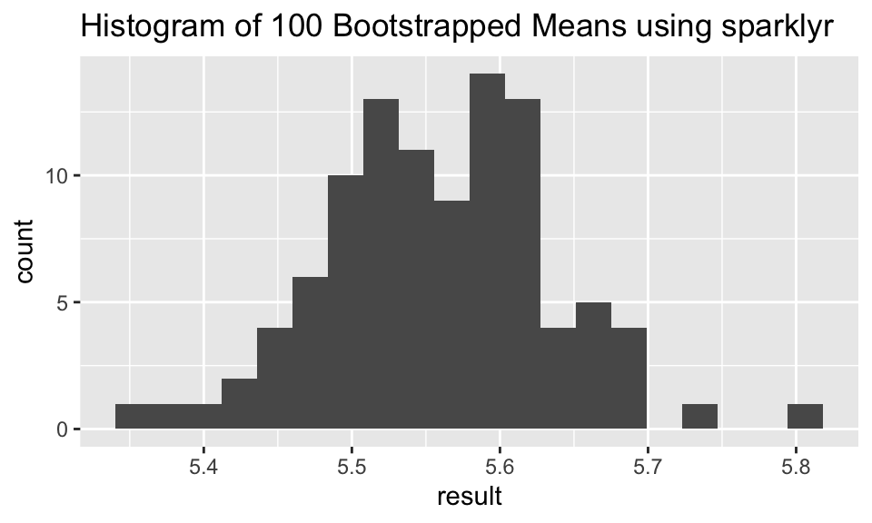
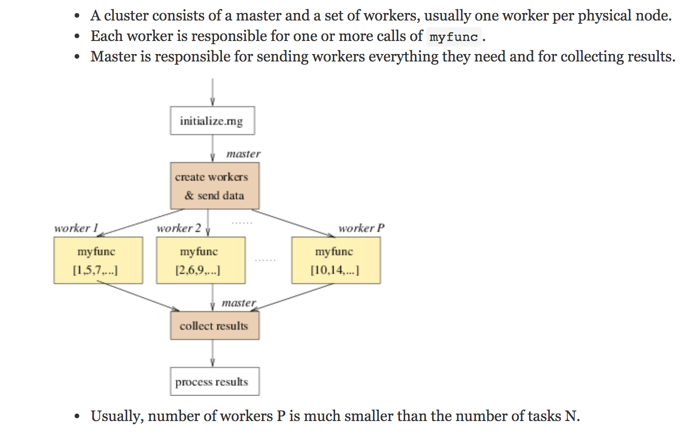

# Misc {#misc}


## 11/26/19 Agenda {#Nov26}
1. API / authenticating 
2. parallel computing
3. cloud computing
4. `reticulate` (Python in R!)
5. SQL

## API

<div style= "float:right;position: relative; top: -30px;">
<div class="figure" style="text-align: right">

<p class="caption">(\#fig:unnamed-chunk-2)xkcd, https://xkcd.com/1481/</p>
</div>
</div>

What is an API? (Application Programming Interface)

Think of an API as a restaurant menu.  The menu provides a list of what the restaurant has to offer, and you order off the menu by choosing the dish that you want.  After you order, the restaurant figures out how to bring the food from the kitchen to your table in the way that you've specified. 

An API is an intermediary that allows two applications to talk to one another.  It is not the database or the server, instead it is the *code* that allows communication.


#### Examples of APIs {-}

* When you use an app on your phone, the app connects to the internet and sends information to a server somewhere.  The server retrieves the data, interprets is, does what it does, and sends it back to you.  The application which takes the data from the server and presents it to you in a readable way is an API.

* Let's say you are booking a flight on United.  You choose all the details, you interact with the airline's website.  BUT INSTEAD, what if you are interacting with a software like Expedia?  Then Expedia has to talk to United's API to get all the information about available flights, costs, seats, etc.

* If you've ever been to a third party site and clicked on "Share on Facebook" or "Share on Twitter" your third party site is communicating with the Facebook API or the Twitter API.

* You sign up to go to a concert, and StubHub asks whether you want to add the concert to your Google calendar.  StubHub needs to talk to Google via Google's API.

* What if you want some Twitter data?  How might you get it?  Well, you could email Twitter and ask someone for it.  **Instead** Twitter provides information about how their data is stored, and allows you to query their data in an automated way.

<div class="figure" style="text-align: center">

<p class="caption">(\#fig:unnamed-chunk-3)Image taken from https://rigor.com/blog/what-is-an-api-a-brief-intro</p>
</div>

### Authenticating

* **Authenticating** is stating who you are
* **Authorization** is asking for access to a resources (and happens after authentication)


DO NOT post your credentials and keys to a public GitHub repo!!

In almost all cases, in order to communicate with an API, you must tell the API who you are and that you should have access to the information the API is providing.

<div class="figure" style="text-align: center">

<p class="caption">(\#fig:unnamed-chunk-4)Image taken from https://blog.restcase.com/restful-api-authentication-basics/</p>
</div>

## Parallel Computing

(Taken from the Teach Data Science blog: https://teachdatascience.com/parallel/)

To demonstrate what parallel computing is, we'll perform tasks that are **embarrassingly parallel** which means there is no dependency or communication between the parallel tasks.  Again, parallel computing can be powerful in ways that link computational tasks in complicated ways.  But we believe that as a *first* pass at teaching parallel computing, we should teach the parallel structure before bringing in dependence across the parallel tasks.  Examples of [embarrassingly parallel](https://en.wikipedia.org/wiki/Embarrassingly_parallel) algorithms include: Monte Carlo analysis, bootstrapping, growing trees for Random Forests, `group_by` analyses, and cross-validation.  Additionally, data science methods increasingly use [randomized algorithms](https://en.wikipedia.org/wiki/Randomized_algorithm) which can often be written in parallel.


Indeed, it isn't always easy to know when to use a parallel construction.  Because of existing overhead processes (e.g., copying data across many threads, bring results together, etc.) an algorithm run on 10 parallel strands will not reduce an original (non-parallel) run time by 10-fold.  Figuring out when a parallel implementation is appropriate is beyond the scope of this blog but should be carefully considered before embarking on large projects.


#### Some parallel examples {-}

Before running code in parallel, it is valuable to know how many cores your computer has to work with.  Note that the `detectCores` function will provide information about the specific device you are using (`logical = FALSE` tells you only the physical cores which is likely what you want).  Note that after `makeCluster` the separate threads have information.  After `stopCluster`, the code is no longer connecting to the cluster structure.


```r
library(parallel)
P <- detectCores(logical=FALSE)
P
```

```
## [1] 8
```

```r
cl <- makeCluster(P)
cl[[1]]
```

```
## node of a socket cluster on host 'localhost' with pid 6567
```

```r
stopCluster(cl)
cl[[1]]
```

```
## Error in summary.connection(connection): invalid connection
```

#### Embarrassingly embarrassing example {-}

In the example below, we generate some Cauchy data and find the max of each sample.  Note that for the current device there are 8 cores, so the process will happen 100/P = 12.5 times on each core.  The second argument of `clusterApply` is a sequence of numbers that gets passed to each worker as the (first) argument of `func1`.  Below, I've specified that the value 50 (number of reps) should be passed separately to 100 different workers.


```r
W <- 100
P <- detectCores(logical=FALSE)
cl <- makeCluster(P)

func1 <- function(reps){
  max(rcauchy(reps))
}


clusterApply(cl, rep(50,W), fun = func1) %>% head(3)
```

```
## [[1]]
## [1] 12.83799
## 
## [[2]]
## [1] 7.578554
## 
## [[3]]
## [1] 8.749791
```

```r
stopCluster(cl)
```

There are many R functions which implement parallel processing.  For example, the same code from above can be processed using `foreach`.


```r
library(doParallel)
cl <- parallel::makeCluster(P)

doParallel::registerDoParallel(cl)
foreach(reps = rep(50, 100), .combine = 'c') %dopar% {
  max(rcauchy(reps))
       } %>% head(3)
```

```
## [1] 230.797839  53.562465   8.958124
```

```r
stopCluster(cl)
```


####  Example bootstrapping {-}

A slightly less embarrassingly parallel example comes with bootstrapping.  Below we have used parallel implementation to bootstrap the mean of the iris data petal length (Virginica only).


```r
data(iris)

iris_bs <- iris %>%
  filter(Species == "virginica") %>%
  select(Petal.Length)
```


```r
cl <- parallel::makeCluster(P)

doParallel::registerDoParallel(cl)
bsmean_PL <- foreach(i = 1:100, .combine = 'c') %dopar% {
  mean(sample(iris_bs$Petal.Length, replace = TRUE))
}
bootstrap <- tibble(bsmean_PL)
stopCluster(cl)

ggplot(bootstrap, aes(x = bsmean_PL)) + geom_histogram(bins = 25) + ggtitle("Histogram of 100 Bootstrapped Means using foreach")
```


### Spark  and `sparklyr` 


Some of you may be familiar with [Apache Spark](http://spark.apache.org/) which is an open-source product for distributed cluster-computing.  You may want to learn more about its capabilities, including scheduling workflow, dispatching tasks, and consolidating end results.  While incredibly powerful, there has historically been a steep learning curve to getting R to work smoothly with a Spark connection.  Recently, RStudio has come out with a new package [`sparklyr`](https://spark.rstudio.com/) which integrates R and Spark seamlessly.  Note that in the example below, we've set up a local connection just for the purposes of the example.  For your work, you may want to connect to a cluster or cloud space with many cores.

The [RStudio `sparklyr` webpage](https://spark.rstudio.com/) provides a plethora of good examples demonstrating the sophistication and power of the technology. `sparklyr` has particularly strong connections to the suite of `tidyverse` functions. Indeed, the power of `sparklyr` is more about distributing the computing than about parallelizing it.  For example, with `sparklyr` the computations are delayed until you need the results.  Additionally, Spark is doing the heavy lifting and only at the very end (when your results are called) do you need to worry about the size of the table, results, or computational space.  The example below repeats the bootstrapping work that was done previously.

Note, it is important to look at your data structures and variables names.  For example, when copying the local dataframe `iris_samps` to the remote data source called `iris_samps_tbl`, the variable `Petal.Length` was changed to `Petal_Length`.


```r
library(sparklyr)
spark_install()

sc <- spark_connect(master = "local")

n_sim = 100
iris_samps <- iris %>% dplyr::filter(Species == "virginica") %>%
  sapply(rep.int, times=n_sim) %>% cbind(replicate = rep(1:n_sim, each = 50)) %>% 
  data.frame() %>%
  dplyr::group_by(replicate) %>%
  dplyr::sample_n(50, replace = TRUE)

iris_samps_tbl <- copy_to(sc, iris_samps)

iris_samps_tbl %>% 
  spark_apply(function(x) {mean(x$Petal_Length)}, 
    group_by = "replicate") %>%
  ggplot(aes(x = result)) + geom_histogram(bins = 20) + ggtitle("Histogram of 100 Bootstrapped Means using sparklyr")
```



```r
spark_disconnect(sc)
```

For our particular application, the adept reader has probably noticed that the average of a variable using `group_by` is a very quick and easy task for `dplyr`.  Indeed, the use of `sparklyr` above is overkill and is presented only as a way to demonstrate using `sparklyr`.  If you are working with big datasets that require large computing infrastructure, the RStudio help pages on `sparklyr` are fantastic.  Additionally, there are many instances of working with `Spark` in the wild, and you might consider working through someone else's `Spark` analysis like this [fantastic example](https://livefreeordichotomize.com/2019/06/04/using_awk_and_r_to_parse_25tb/) on splitting up large amounts of raw DNA sequencing to get data for a given genetic location.


```r
iris_samps %>% dplyr::group_by(replicate) %>%
  dplyr::summarize(result = mean(Petal.Length)) %>%
  ggplot(aes(x = result)) + geom_histogram(bins = 25) + ggtitle("Histogram of 100 Bootstrapped Means using dplyr")
```


While an introduction to parallel and cloud computing will help you become more adept and less apprehensive about using the tools, there is also a recognition that sufficient background in computer science is needed to be able to fully engage with principles of high performance computing. 


#### Learn more {-}

- Hana Sevcikova [Introduction to parallel computing with R](https://channel9.msdn.com/Events/useR-international-R-User-conferences/useR-International-R-User-2017-Conference/Introduction-to-parallel-computing-with-R) useR 2017 in Brussels, [tutorial here](https://rawgit.com/PPgp/useR2017public/master/tutorial.html)
- `sparklyr` to do [parallel cross-validation](https://blog.rstudio.com/2018/05/14/sparklyr-0-8/)
- https://www.rstudio.com/resources/cheatsheets/  
    - https://www.rstudio.com/resources/cheatsheets/#sparklyr       
    - https://github.com/rstudio/cheatsheets/raw/master/parallel_computation.pdf
- Great blog [Two Flavors of Parallel Simulation](https://thecodeforest.github.io/post/two_flavors_of_parallel_simulation.html) by Mark LeBoeuf comparing different ways to process code in parallel.


## Cloud Computing

A great overview on high performance computing (HPC) what it is and what it isn't is given here: https://www.slideshare.net/raamana/high-performance-computing-with-checklist-and-tips-optimal-cluster-usage

<div class="figure" style="text-align: center">

<p class="caption">(\#fig:unnamed-chunk-12)Image from Pradeep Redddy Raamana [High performance computing tutorial, with checklist and tips to optimize cluster usage](https://www.slideshare.net/raamana/high-performance-computing-with-checklist-and-tips-optimal-cluster-usage)</p>
</div>

(The rest, below, is taken from the Teach Data Science blog: https://teachdatascience.com/cloud2/, this entry written by Nick Horton)


The R package `parallel` is designed to send tasks to each of multiple cores.  Today's computers (even small laptops!) typically have multiple cores, and any server or cloud computing infrastructure can easily handle dozens or hundreds of parallel tasks.  The structure of the R `parallel` implementation sends tasks to workers that don't talk to one another until compiling their results at the end.  In her [2017 UseR! tutorial](https://rawgit.com/PPgp/useR2017public/master/tutorial.html), Hana Sevcikova describes the function of workers which run code/functions/iterations separately before results are subsequently combined.

<div class="figure" style="text-align: center">

<p class="caption">(\#fig:unnamed-chunk-13)Image from Sevcikova UseR! 2017 [tutorial on parallel computing](https://rawgit.com/PPgp/useR2017public/master/tutorial.html)</p>
</div>


As computing infrastructure becomes more sophisticated, it is important to have the language to describe how connected components work.  Parallel processing allows for a conversation on the [differences between](https://en.wikipedia.org/wiki/Grid_computing) distributed computing, cluster computing, and grid computing, and generally, the framework of high performance computing.  The benefit of parallel computing as an introduction to the larger infrastructure is that the task of each worker is clear, important, and easy to describe.   


This discussion is motivated by several recent papers and blog posts that describe how complex, real-world data science computation can be structured in ways that would not have been feasible in past years without herculean efforts.  It is worth noting the [fantastic example](https://livefreeordichotomize.com/2019/06/04/using_awk_and_r_to_parse_25tb/) that described multiple iterations needed to parse huge amounts of raw DNA sequencing data to undertake analyses for a given set of genetic locations.  In ["Ambitious data science can be painless"](https://hdsr.mitpress.mit.edu/pub/9mdn32tq) Monajemi et al. describe workflows that take advantage of new software stacks to undertake massive cloud-based experiments.  While a few years older, Chamandy et al.'s [Teaching statistics at Google scale](https://www.tandfonline.com/doi/full/10.1080/00031305.2015.1089790) described three examples where modern data challenges were overcome with creative statistical thinking (see companion report on [Estimating uncertainty for massive data streams](https://ai.google/research/pubs/pub43157) ).  Finally, the NSF-funded workshop report on ["Enabling computer and information science and engineering research and education in the cloud"](https://dl.acm.org/citation.cfm?id=3233928) highlights opportunities as university computing migrates to cloud solutions more and more.

And last, you may enjoy reading the recent [Three strategies for working with Big Data in R](https://www.r-bloggers.com/three-strategies-for-working-with-big-data-in-r/) blog post.  

How can we prepare for cloud computing in an undergraduate course?


#### Getting started {-}

What are the steps to exploring cloud-based systems?  Each of the main cloud providers have active educational outreach programs.

- [Google Compute Platform](https://edu.google.com/programs/faculty/?modal_active=none) allows faculty to apply to receive $100 in GCP credits and $50 per student. Credits can be used in courses, student clubs, and other faculty-sponsored events.  (To replicate our example later in this blog, you'll want to set up an account and request credits.)

- [Azure for Education](https://azure.microsoft.com/en-us/education/) provides access for educators to open source content for classes and $200 in Azure credits, plus free services.

- [Amazon Web Services Educate](https://aws.amazon.com/education/awseducate/) provides between $75 and $200 in AWS annual credits per educator (depending on membership status) and between $30 and $100 for students.

You should sign up and start to explore!  The world of cloud computing is quickly changing. By gaining experience through investment in time in learning these tools will help instructors provide guidance to their students in use of these modern computational tools.

#### An example: BigQuery in Google's GCP {-}

Consider an example using GCP (kudos to [Shukry Zablah](https://www.shukryzablah.com) for his assistance).


[BigQuery](https://cloud.google.com/bigquery/) is Google's serverless, highly-scalable, cloud data warehouse.  A [quickstart](https://cloud.google.com/bigquery/docs/quickstarts) document is available which discusses use of the web user interface and the GCP console as well as access through an API interface.  The [bigrquery](https://github.com/r-dbi/bigrquery) package in R makes it easy to work with data stored in Google BigQuery through queries to BigQuery tables.

The first step is to request GCP credits (see above) and use the online interface to create a project (below called "Test Project for Blog").  


```r
library(dplyr)
library(bigrquery)
library(ggplot2)
library(forcats)
library(purrr)
library(readr)
```


```r
projectId <- "bigquery-public-data"  # replace with your own project
billingId <- "test-project-for-blog" # replace with your own billing ID
datasetName <- "samples"
tableName <- "wikipedia"
```

BigQuery includes a number of [public datasets](https://cloud.google.com/bigquery/public-data/).
Below is an analysis of the public dataset of the revisions of Wikipedia articles up to April 2010, hosted in GCP BigQuery. The size of the table is 35.69GB. The queries take only seconds to run. 


```r
query <- "SELECT  title, COUNT(title) as n
          FROM `bigquery-public-data.samples.wikipedia` 
          GROUP BY title
          ORDER BY n DESC
          LIMIT 500"
```

For safety, always try to make sure that your queries have the `LIMIT` set on your queries. 


```r
mostRevisions_tb <- 
  bigrquery::bq_project_query(x = billingId, 
    query = query) #creates temporary table
```

When the previous `bq_project_query()` function is run within RStudio, a connection is made to Google (GCP) and an authentication window will open up in a local browser.

All the heavy lifting we perform is done on the database end (note that we are billed for it, though the first 1TB of accesses are free). The local machine only receives the data once we try to display it. Right now `mostRevisions_tb` is just a reference to a temporary table online.  The query accessed 7GB of data.

We can get a copy of the data on our local machine once we are confident that it is what we want. 


```r
mostRevisions <- bq_table_download(mostRevisions_tb) 
```


```r
glimpse(mostRevisions)
```

```
## Observations: 500
## Variables: 2
## $ title <chr> "Wikipedia:Administrator intervention against vandalism", …
## $ n     <int> 643271, 419695, 326337, 257893, 226802, 204469, 191679, 18…
```


```r
clean <- mostRevisions %>% 
  filter(!grepl("Wikipedia|User|Template|Talk", title)) %>%
  mutate(title = fct_reorder(title, n)) %>% #to sort levels
  glimpse()
```

```
## Observations: 272
## Variables: 2
## $ title <fct> George W. Bush, List of World Wrestling Entertainment empl…
## $ n     <int> 43652, 30572, 27433, 23245, 21768, 20814, 20546, 20529, 20…
```

Let's plot the top 10 entries. 


```r
ggplot(clean %>% head(10), aes(x = title, y = n, fill = n)) + 
  geom_bar(stat = "identity") + 
  labs(x = "Article Title",
       y = "Number of Revisions",
       title = "Most Revised Wikipedia Articles (Up to April 2010)") +
  scale_fill_gradient(low = "darkblue", high = "darkred", guide = FALSE) +
  theme_minimal() +
  theme(axis.text.x = element_text(angle = 20, hjust = 1)) 
```


We've obviously just scratched the surface here.  There are lots of other examples out there to consider replicating in your classroom (e.g., [returning tweets on a schedule](https://www.mikejohnpage.com/blog/returning-tweets-on-a-schedule-in-r-using-aws-ec2-rds-and-cron/)).  Hopefully you are intrigued enough to request some credits for you and your students and start to explore.  Not sure where to begin?  Check out the [GCP Essentials Videos](https://www.youtube.com/playlist?list=PLIivdWyY5sqKh1gDR0WpP9iIOY00IE0xL) series.


## `reticulate`

(Taken from the Teach Data Science blog: https://teachdatascience.com/reticulate/)

### Connect to Python within RStudio {-}

For many statisticians, the go-to software language is R.  However, there is no doubt that Python is a very important language in data science.  Why not do both??


```r
library(tidyverse)
library(reticulate)
use_virtualenv("r-reticulate")
reticulate::import("statsmodels")
```

```
## Module(statsmodels)
```

#### I can run Python inside R?? {-}


* `pandas` for data wrangling.  
* In R, the chunk is specified to be a Python chunk (RStudio is now running Python). 


````
```{python}
import pandas
flights = pandas.read_csv("flights.csv")
flights = flights[flights["dest"] == "ORD"]
flights = flights[['carrier', 'dep_delay', 'arr_delay']]
flights = flights.dropna()
```
````

A view of the Python chunk which is actually run:


```python
import pandas
flights = pandas.read_csv("flights.csv")
flights = flights[flights["dest"] == "ORD"]
flights = flights[['carrier', 'dep_delay', 'arr_delay']]
flights = flights.dropna()
```


#### Learn about the dataset {-}

````
```{python}
flights.shape
flights.head(3)
flights.describe()
```
````


```python
flights.shape
```

```
## (12590, 3)
```

```python
flights.head(3)
```

```
##    carrier  dep_delay  arr_delay
## 4       UA       -4.0       12.0
## 5       AA       -2.0        8.0
## 22      AA       -1.0       14.0
```

```python
flights.describe()
```

```
##           dep_delay     arr_delay
## count  12590.000000  12590.000000
## mean      11.709770      2.917951
## std       39.409704     44.885155
## min      -20.000000    -62.000000
## 25%       -6.000000    -22.000000
## 50%       -2.000000    -10.000000
## 75%        9.000000     10.000000
## max      466.000000    448.000000
```


#### Computations using `pandas` {-}


````
```{python}
flights = pandas.read_csv("flights.csv")
flights = flights[['carrier', 'dep_delay', 'arr_delay']]
flights.groupby("carrier").mean()
```
````


```python
flights = pandas.read_csv("flights.csv")
flights = flights[['carrier', 'dep_delay', 'arr_delay']]
flights.groupby("carrier").mean()
```

```
##          dep_delay  arr_delay
## carrier                      
## AA        8.586016   0.364291
## AS        5.804775  -9.930889
## DL        9.264505   1.644341
## UA       12.106073   3.558011
## US        3.782418   2.129595
```


#### From Python chunk to R chunk {-}

* `py$x` accesses an `x` variable created within Python from R
* `r.x` accesses an `x` variable created within R from Python


```r
library(ggplot2)
ggplot(py$flights, 
       aes(x=carrier, 
           y=arr_delay)) + 
  geom_point() + 
  geom_jitter()
```


#### From R chunk to Python chunk {-}


```r
data(diamonds)
head(diamonds)
```

```
## # A tibble: 6 x 10
##   carat cut       color clarity depth table price     x     y     z
##   <dbl> <ord>     <ord> <ord>   <dbl> <dbl> <int> <dbl> <dbl> <dbl>
## 1 0.23  Ideal     E     SI2      61.5    55   326  3.95  3.98  2.43
## 2 0.21  Premium   E     SI1      59.8    61   326  3.89  3.84  2.31
## 3 0.23  Good      E     VS1      56.9    65   327  4.05  4.07  2.31
## 4 0.290 Premium   I     VS2      62.4    58   334  4.2   4.23  2.63
## 5 0.31  Good      J     SI2      63.3    58   335  4.34  4.35  2.75
## 6 0.24  Very Good J     VVS2     62.8    57   336  3.94  3.96  2.48
```


####  Python chunks {-}

Note that we're calling Python code on an R object.


```python
print(r.diamonds.describe())
```

```
##               carat         depth  ...             y             z
## count  53940.000000  53940.000000  ...  53940.000000  53940.000000
## mean       0.797940     61.749405  ...      5.734526      3.538734
## std        0.474011      1.432621  ...      1.142135      0.705699
## min        0.200000     43.000000  ...      0.000000      0.000000
## 25%        0.400000     61.000000  ...      4.720000      2.910000
## 50%        0.700000     61.800000  ...      5.710000      3.530000
## 75%        1.040000     62.500000  ...      6.540000      4.040000
## max        5.010000     79.000000  ...     58.900000     31.800000
## 
## [8 rows x 7 columns]
```


```python
import statsmodels.formula.api as smf
model = smf.ols('price ~ carat', data = r.diamonds).fit()
print(model.summary())
```

```
##                             OLS Regression Results                            
## ==============================================================================
## Dep. Variable:                  price   R-squared:                       0.849
## Model:                            OLS   Adj. R-squared:                  0.849
## Method:                 Least Squares   F-statistic:                 3.041e+05
## Date:                Mon, 02 Dec 2019   Prob (F-statistic):               0.00
## Time:                        05:34:26   Log-Likelihood:            -4.7273e+05
## No. Observations:               53940   AIC:                         9.455e+05
## Df Residuals:                   53938   BIC:                         9.455e+05
## Df Model:                           1                                         
## Covariance Type:            nonrobust                                         
## ==============================================================================
##                  coef    std err          t      P>|t|      [0.025      0.975]
## ------------------------------------------------------------------------------
## Intercept  -2256.3606     13.055   -172.830      0.000   -2281.949   -2230.772
## carat       7756.4256     14.067    551.408      0.000    7728.855    7783.996
## ==============================================================================
## Omnibus:                    14025.341   Durbin-Watson:                   0.986
## Prob(Omnibus):                  0.000   Jarque-Bera (JB):           153030.525
## Skew:                           0.939   Prob(JB):                         0.00
## Kurtosis:                      11.035   Cond. No.                         3.65
## ==============================================================================
## 
## Warnings:
## [1] Standard Errors assume that the covariance matrix of the errors is correctly specified.
```


#### Running just Python {-}


#### Full disclosure {-}

`reticulate` is not always trivial to set up.  Indeed, I've had trouble figuring out which Python version is talking to R and where different module versions live.


#### Learn more {-}

- [RStudio R Interface to Python](https://rstudio.github.io/reticulate/)

https://rstudio.github.io/reticulate/  

- [RStudio blog on Reticulated Python](https://blog.rstudio.com/2018/10/09/rstudio-1-2-preview-reticulated-python/)  

https://blog.rstudio.com/2018/10/09/rstudio-1-2-preview-reticulated-python


## SQL (in R)

Note that there exists an R interface to work with SQL commands from within an R Markdown file.  For consistency with the class notes, we've continued to use the R Markdown structure to demonstrate the course material.

(Taken from the Teach Data Science blog: https://teachdatascience.com/sql/, this entry written by Nick Horton)

SQL (pronounced *sequel*) stands for [Structured Query Language](https://en.wikipedia.org/wiki/SQL); it is a language designed to manage data in a relational database system. 

We will use a public facing MySQL [database](http://www.science.smith.edu/wai-database/home/about) containing wideband acoustic immittance (WAI) measures made on normal ears of adults. (The project is funded by the National Institutes of Health, NIDCD, and hosted on a server at Smith College, [PI Susan Voss, R15 DC014129-01](https://projectreporter.nih.gov/project_info_description.cfm?aid=8769352&icde=44962011&ddparam=&ddvalue=&ddsub=&cr=46&csb=default&cs=ASC&pball=).) The database was created to enable auditory researchers to share WAI measurements and combine analyses over multiple datasets.

We begin by demonstrating how SQL queries can be sent to a database.  It is necessary to set up a connection using the `dbConnect()` function.


```r
library(mosaic)
library(RMySQL)  
con <- dbConnect(
  MySQL(), host = "scidb.smith.edu", user = "waiuser", 
  password = "smith_waiDB", dbname = "wai")
```

Next a series of SQL queries can be sent to the database using the `DBI::dbGetQuery()` function: each query returns an R dataframe.


```r
class(dbGetQuery(con, "SHOW TABLES"))
```

```
## [1] "data.frame"
```

There are multiple tables within the `wai` database.


```r
dbGetQuery(con, "SHOW TABLES")
```

```
##   Tables_in_wai
## 1  Measurements
## 2       PI_Info
## 3       Subject
```

The `EXPLAIN` command describes the ten field names (variables) in the `PI_Info` table.


```r
dbGetQuery(con, "EXPLAIN PI_Info")
```

```
##          Field           Type Null Key Default Extra
## 1   Identifier    varchar(20)  YES        <NA>      
## 2      PI_Year        int(11)  YES        <NA>      
## 3           PI   varchar(500)  YES        <NA>      
## 4  Affiliation   varchar(500)  YES        <NA>      
## 5        Email    varchar(30)  YES        <NA>      
## 6        Title   varchar(140)  YES        <NA>      
## 7          Pub varchar(10000)  YES        <NA>      
## 8         Date       char(20)  YES        <NA>      
## 9          URL   varchar(140)  YES        <NA>      
## 10    PI_Notes           text   NO        <NA>
```

The `SELECT` statement can be used to select all fields for eight observations in the `Measurements` table.


```r
eightobs <- dbGetQuery(con, "SELECT * FROM Measurements LIMIT 8")
eightobs
```

```
##   Identifier Sub_Number Session Left_Ear MEP Instrument    Freq Absorbance
## 1  Abur_2014          1       1        0  -5          1 210.938  0.0451375
## 2  Abur_2014          1       1        0  -5          1 234.375  0.0441247
## 3  Abur_2014          1       1        0  -5          1 257.812  0.0495935
## 4  Abur_2014          1       1        0  -5          1 281.250  0.0516088
## 5  Abur_2014          1       1        0  -5          1 304.688  0.0590836
## 6  Abur_2014          1       1        0  -5          1 328.125  0.0628038
## 7  Abur_2014          1       1        0  -5          1 351.562  0.0682962
## 8  Abur_2014          1       1        0  -5          1 375.000  0.0738373
##        Zmag      Zang Canal_Area
## 1 110638000 -0.228113         NA
## 2 100482000 -0.230561         NA
## 3  90561100 -0.230213         NA
## 4  83515500 -0.230959         NA
## 5  77476800 -0.229652         NA
## 6  71229100 -0.230026         NA
## 7  66615500 -0.229576         NA
## 8  61996200 -0.229327         NA
```


More interesting and complicated `SELECT` calls can be used to undertake grouping and aggregation.  Here we calculate the sample size for each study


```r
dbGetQuery(con, 
  "SELECT Identifier, count(*) AS NUM FROM Measurements GROUP BY Identifier ORDER BY NUM")
```

```
##       Identifier    NUM
## 1       Sun_2016   2604
## 2    Shaver_2013   2880
## 3    Feeney_2017   3162
## 4      Voss_1994   5120
## 5       Liu_2008   5520
## 6    Werner_2010   7935
## 7  Rosowski_2012  14384
## 8      Voss_2010  14880
## 9      Abur_2014  21328
## 10    Groon_2015  35469
## 11  Shahnaz_2006  58776
## 12    Lewis_2015 114716
```


#### Accessing a database using `dplyr` commands {-}

Alternatively, a connection can be made to the server by creating a series of `dplyr` tbl
objects. Connecting with familiar `dplyr` syntax is attractive because, as [Hadley Wickham](https://dbplyr.tidyverse.org/articles/dbplyr.html) has noted, SQL and R have similar syntax (but sufficiently different to be confusing).  

The setup process looks similar.


```r
db <- src_mysql(dbname = "wai", host = "scidb.smith.edu", user = "waiuser", 
          password="smith_waiDB")
Measurements <- tbl(db, "Measurements")
class(Measurements)
```

```
## [1] "tbl_MySQLConnection" "tbl_dbi"             "tbl_sql"            
## [4] "tbl_lazy"            "tbl"
```

```r
PI_Info <- tbl(db, "PI_Info")
Subject <- tbl(db, "Subject")
```

We  explore the `PI_Info` table using the `collect()` function used to force computation on the database (and return the results).  One attractive aspect of database systems is that they feature [*lazy evaluation*](https://en.wikipedia.org/wiki/Lazy_evaluation), where computation is optimized and postponed as long as possible.  


```r
PI_Info  %>% summarise(total = n())
```

```
## # Source:   lazy query [?? x 1]
## # Database: mysql 5.5.58-0ubuntu0.14.04.1-log
## #   [waiuser@scidb.smith.edu:/wai]
##   total
##   <dbl>
## 1    12
```

```r
PI_Info %>% select(-Email) %>% collect() %>% data.frame()   
```

```
##       Identifier PI_Year
## 1    Werner_2010    2010
## 2      Voss_1994    1994
## 3     Lewis_2015    2015
## 4      Voss_2010    2010
## 5       Sun_2016    2016
## 6    Shaver_2013    2013
## 7  Rosowski_2012    2012
## 8       Liu_2008    2008
## 9      Abur_2014    2014
## 10   Feeney_2017    2017
## 11    Groon_2015    2015
## 12  Shahnaz_2006    2006
##                                                                                                         PI
## 1                                                                                            Douglas Keefe
## 2                                                                                            Susan E. Voss
## 3                                                                            James D. Lewis; Stephen Neely
## 4                                                                                            Susan E. Voss
## 5                                                                                            Xiao-Ming Sun
## 6                                                                            Mark D. Shaver, Xiao-Ming Sun
## 7                                                                                         John J. Rosowski
## 8  Yi-Wen Liu; Chris A. Sanford; John C. Ellison; Denis F. Fitzpatrick; Michael P. Gorga; Douglas H. Keefe
## 9                                                            Defne Abur; Nicholas J. Horton; Susan E. Voss
## 10                                                                     M. Patrick Feeney; Douglas H. Keefe
## 11                                                                                           Stephen Neely
## 12                                                                               Navid Shahnaz; Karin Bork
##                                                                                              Affiliation
## 1                                                                 Boys Town National Research Laboratory
## 2                                                                  Smith College, formerly ATT Bell Labs
## 3                                                                 Boys Town National Research Laboratory
## 4                                                                                          Smith College
## 5                                                                               Wichita State University
## 6                                                                               Wichita State University
## 7                                  Eaton-Peabody Laboratory, Massachusetts Eye and Ear Infirmary, Boston
## 8                                                                   Boys Town National Research Hospital
## 9                                                                                          Smith College
## 10 National Center for Rehabilitative Auditory Research (NCRAR) and Boys Town National Research Hospital
## 11                                                                  Boys Town National Research Hospital
## 12                                                                        University of British Columbia
##                                                                                                                                     Title
## 1                                             Ear-Canal Wideband Acoustic Transfer Functions of Adults and Two- to Nine-Month-Old Infants
## 2                                                                Measurement of acoustic impedance and reflectance in the human ear canal
## 3                                                                    Non-invasive estimation of middle-ear input impedance and efficiency
## 4                                                                Posture systematically alters ear-canal reflectance and DPOAE properties
## 5                       Wideband acoustic immittance: Normative study and test-retest reliability of tympanometric measurements in adults
## 6  Wideband energy reflectance measurements: Effects of negative middle ear pressure and application of a pressure compensation procedure
## 7                                                          Ear-Canal Reflectance, Umbo Velocity, and Tympanometry in Normal-Hearing Adult
## 8                    Wideband absorbance tympanometry using pressure sweeps: System development and results on adults with normal hearing
## 9                                                                                           Intrasubject Variability in Power Reflectance
## 10      Normative wideband reflectance, equivalent admittance at the tympanic membrane, and acoustic stapedius reflex threshold in adults
## 11                                                                                      Air-Leak Effects on Ear-Canal Acoustic Absorbance
## 12                                                                      Wideband Reflectance Norms for Caucasian and Chinese Young Adults
##                                                  Pub       Date
## 1                                    Ear and Hearing   9/1/2017
## 2       Journal of the Acoustical Society of America 02/08/2017
## 3       Journal of the Acoustical Society of America 10/10/2018
## 4                                   Hearing Research 06/05/2018
## 5  Journal of Speech, Language, and Hearing Research 10/31/2017
## 6   The Journal of the Acoustical Society of America 10/06/2018
## 7                                    Ear and Hearing 11/06/2015
## 8   The Journal of the Acoustical Society of America  6/26/2018
## 9                                   J Am Acad Audiol 08/24/2016
## 10                                   Ear and Hearing 06/07/2018
## 11                                   Ear and Hearing 06/18/2019
## 12                                   Ear and Hearing 08/24/2016
##                                                                                                                   URL
## 1                                                                        https://www.ncbi.nlm.nih.gov/pubmed/20517155
## 2                                                                  https://asa.scitation.org/doi/abs/10.1121/1.408329
## 3                                                                 https://asa.scitation.org/doi/abs/10.1121/1.4927408
## 4                                                                        https://www.ncbi.nlm.nih.gov/pubmed/20227475
## 5                                                                        https://www.ncbi.nlm.nih.gov/pubmed/27517667
## 6                                                                        https://www.ncbi.nlm.nih.gov/pubmed/23862811
## 7                                                                         http://www.ncbi.nlm.nih.gov/pubmed/21857517
## 8                                                                        https://www.ncbi.nlm.nih.gov/pubmed/19206798
## 9                                                                        https://www.ncbi.nlm.nih.gov/pubmed/25257718
## 10                                                                       https://www.ncbi.nlm.nih.gov/pubmed/28045835
## 11 https://journals.lww.com/ear-hearing/fulltext/2015/01000/Air_Leak_Effects_on_Ear_Canal_Acoustic_Absorbance.16.aspx
## 12       http://journals.lww.com/ear-hearing/Abstract/2006/12000/Wideband_Reflectance_Norms_for_Caucasian_and.15.aspx
##                                                                                                                                                                                                                                                                                                                                   PI_Notes
## 1                                                    Used an ER-1 earphone and ER-7C microphone.  Data provided by Doug Keefe and formatted by Susan Voss with help.  Lynne Werner is retired.  In Subject Table, Sub_Notes=1  means part of 183 subjects included in the  means in paper and Sub_Notes=0 means not part of mean in paper.
## 2                                                                                                                                                                                                                       Measurements taken with a system using sysid and the Etymotic ER-2 pressure transducer and ER-7c probe microphone.
## 3                                                                                                                                                                                                                                            Used acoustically calculated areas for absorbance calculations, included in Measurement Table
## 4                                                                                                                                                                                                                                                                                                                                 No notes
## 5                                                                                                                                                                                                                                                                                                                                 No notes
## 6  A research version of Titan (Interacoustics) was used. In this study, a total of five reflectance measurements at ambient pressure were taken per ear (detailed in the article). But, results from only two sessions were reported in this article. Included in this database is the second session (baseline), as the normative data. 
## 7                                                                                                                                                                                                                                                                                                                                No Notes 
## 8                                                                                                                                                                                                                                                                                                                                No Notes 
## 9                                                                                                                                                                                                                                                                          Database includes measurements at Position 1 and Channel B only
## 10                                                                                                                                                                                                                                     Sub_Notes=Boys Town National Lab are data taken by Keefe; Sub_Notes=NCRAR are data taken by Feeney 
## 11                                                                                                                                                                                                                  First author is Groon, PI for grant is Steve Neely, data collected on system described in Rasetshwane and Neely (2011)
## 12                                                                                                                                                                                                                                                                                          Impedance angles not available and set to Null
```

```r
# be careful with collect() when dealing with large tables!
```

Note how the number of rows is unknown (`??` at the top of the output above) for the lazy query.

Similarly, we can explore the `Subjects` table.

```r
Subject  %>% summarise(total = n())
```

```
## # Source:   lazy query [?? x 1]
## # Database: mysql 5.5.58-0ubuntu0.14.04.1-log
## #   [waiuser@scidb.smith.edu:/wai]
##   total
##   <dbl>
## 1   640
```

```r
Subject %>% collect()  # be careful with collect() with large tables!
```

```
## # A tibble: 640 x 10
##    Identifier Sub_Number Session_Total   Age Female  Race Ethnicity
##    <chr>      <chr>              <int> <int>  <int> <int>     <int>
##  1 Voss_2010  1                      5    20      1     0         0
##  2 Voss_2010  2                      5    39      1     0         0
##  3 Voss_2010  3                      5    18      1     0         0
##  4 Voss_2010  4                      5    19      1     0         0
##  5 Voss_2010  5                      5    21      1     0         0
##  6 Voss_2010  6                      5    21      1     0         0
##  7 Voss_2010  7                      5    21      1     0         0
##  8 Voss_2010  8                      5    42      1     0         0
##  9 Voss_2010  9                      5    38      0     0         0
## 10 Voss_2010  10                     5    20      1     0         0
## # … with 630 more rows, and 3 more variables: Left_Ear_Status <int>,
## #   Right_Ear_Status <int>, Sub_Notes <chr>
```

Let's explore the `Measurements` table.

```r
Measurements %>% summarise(total = n())
```

```
## # Source:   lazy query [?? x 1]
## # Database: mysql 5.5.58-0ubuntu0.14.04.1-log
## #   [waiuser@scidb.smith.edu:/wai]
##    total
##    <dbl>
## 1 286774
```

There are more than a quarter million observations.  

In the next step, we will download the data from a given subject for a specific study, in this case a paper by Rosowski et al. (2012) entitled ["Ear-canal reflectance, umbo velocity, and tympanometry in normal-hearing adults"](https://www.ncbi.nlm.nih.gov/pubmed/21857517).

Arbitrarily we choose to collect data from subject number three.


```r
onesubj <- 
  Measurements %>% 
  filter(Identifier == "Rosowski_2012", Sub_Number == 3) %>%
  collect %>%
  mutate(SessionNum = as.factor(Session))
head(onesubj)
```

```
## # A tibble: 6 x 12
##   Identifier Sub_Number Session Left_Ear   MEP Instrument  Freq Absorbance
##   <chr>           <int>   <int>    <int> <dbl>      <int> <dbl>      <dbl>
## 1 Rosowski_…          3       1        1    NA          1  211.     0.0852
## 2 Rosowski_…          3       1        1    NA          1  234.     0.0903
## 3 Rosowski_…          3       1        1    NA          1  258.     0.112 
## 4 Rosowski_…          3       1        1    NA          1  281.     0.103 
## 5 Rosowski_…          3       1        1    NA          1  305.     0.129 
## 6 Rosowski_…          3       1        1    NA          1  328.     0.136 
## # … with 4 more variables: Zmag <dbl>, Zang <dbl>, Canal_Area <dbl>,
## #   SessionNum <fct>
```

Finally we can display the results of the measurements as a function of frequency and which ear (left or right) that was used.


```r
onesubj <- mutate(onesubj, Ear = ifelse(Left_Ear == 1, "Left", "Right"))
ggplot(onesubj, aes(x = Freq, y = Absorbance)) + geom_point() +
  aes(colour = Ear) + scale_x_log10() + labs(title="Absorbance by ear Rosowski subject 3")
```


We note that a number of relational database systems exist, including MySQL (illustrated here), PostgreSQL, and SQLite.  More information about databases within R can be found in the CRAN [Databases with R](https://cran.r-project.org/web/views/Databases.html) Task View.

Setting up and managing a database is a topic for a different day: here we focused on how SQL can be used within R to access data in a flexible and powerful manner.  


#### Learn more {-}

- https://chance.amstat.org/2015/04/setting-the-stage/ (Setting the stage for data technologies)
- https://www.w3schools.com/sql/sql_intro.asp (Intro to SQL)
- http://www.science.smith.edu/wai-database/home/about/ (WAI SQL Database)
- https://cran.r-project.org/web/views/Databases.html (CRAN Task View on Databases with R)
- https://db.rstudio.com (RStudio Database resources)
- https://dbplyr.tidyverse.org/articles/dbplyr.html (dbplyr package)


## 12/10/19 Agenda {#Dec10}
1. Regular Expressions
2. *Computational* and *Statistics*

## Regular Expressions {#regexpr}

> A regular expression ... is a sequence of characters that define a search pattern. Usually such patterns are used by string searching algorithms for "find" or "find and replace" operations on strings, or for input validation. It is a technique developed in theoretical computer science and formal language theory. [From https://en.wikipedia.org/wiki/Regular_expression]

#### Main tasks in character matching: {-}
1. basic string operations
2. pattern matching (regular expressions)
3. sentiment analysis


The ideas below are mostly taken from Jenny Bryan's STAT545 class: https://github.com/STAT545-UBC/STAT545-UBC-original-website/blob/master/block022_regular-expression.rmd

#### R packages to make your life easier {-}
* [`stringr` package](https://stringr.tidyverse.org/) A core package in the `tidyverse`. It is installed via `install.packages("tidyverse")` and also loaded via `library(tidyverse)`. Of course, you can also install or load it individually.
     * Many of the main functions start with `str_`. Auto-complete is your friend.
     * Replacements for base functions re: string manipulation and regular expressions (see below).
     * Main advantages over base functions: greater consistency about inputs and outputs. Outputs are more ready for your next analytical task.
     * `stringr` cheat sheet: https://github.com/rstudio/cheatsheets/raw/master/strings.pdf
* [`tidyr` package](https://tidyr.tidyverse.org/) Especially useful for functions that split one character vector into many and vice versa: `separate()`, `unite()`, `extract()`.
* Base functions: `nchar()`, `strsplit()`, `substr()`, `paste()`, `paste0()`.
* The `glue` package is fantastic for string interpolation. If `stringr::str_interp()` doesn't get your job done, check out the `glue` package.

#### String functions related to regular expression {-}
Regular expression is a pattern that describes a specific set of strings with a common structure. It is heavily used for string matching / replacing in all programming languages, although specific syntax may differ a bit. It is truly the heart and soul for string operations. In R, many string functions in `base` R as well as in `stringr` package use regular expressions, even Rstudio's search and replace allows regular expression:

  * identify match to a pattern: `grep(..., value = FALSE)`, `grepl()`, `stringr::str_detect()`
  * extract match to a pattern: `grep(..., value = TRUE)`, `stringr::str_extract()`, `stringr::str_extract_all()`     
  * locate pattern within a string, i.e. give the start position of matched patterns. `regexpr()`, `gregexpr()`, `stringr::str_locate()`, `string::str_locate_all()`     
  * replace a pattern: `sub()`, `gsub()`, `stringr::str_replace()`, `stringr::str_replace_all()`     
  * split a string using a pattern: `strsplit()`, `stringr::str_split()`     

Regular expressions typically specify characters (or character classes) to seek out, possibly with information about repeats and location within the string. This is accomplished with the help of metacharacters that have specific meaning: `$ * + . ? [ ] ^ { } | ( ) \`. We will use some small examples to introduce regular expression syntax and what these metacharacters mean. 

#### Escape sequences {-}

There are some special characters in R that cannot be directly coded in a string. For example, let's say you specify your pattern with single quotes and you want to find countries with the single quote `'`. You would have to "escape" the single quote in the pattern, by preceding it with `\`, so it is clear that it is not part of the string-specifying machinery.


There are other characters in R that require escaping, and this rule applies to all string functions in R, including regular expressions. See [here](https://stat.ethz.ch/R-manual/R-devel/library/base/html/Quotes.html) for a complete list of R escape sequences.        

  * `\'`: single quote. You don't need to escape single quote inside a double-quoted string, so we can also use `"'"` in the previous example.        
  * `\"`: double quote. Similarly, double quotes can be used inside a single-quoted string, i.e. `'"'`.          
  * `\n`: newline.   
  * `\r`: carriage return.   
  * `\t`: tab character.   

> Note: `cat()` and `print()` handle escape sequences differently, if you want to print a string out with these sequences interpreted, use `cat()`.      

```r
print("a\nb")
```

```
## [1] "a\nb"
```

```r
cat("a\nb")
```

```
## a
## b
```

#### Quantifiers {-}

Quantifiers specify how many repetitions of the pattern.   

  * `*`: matches at least 0 times.   
  * `+`: matches at least 1 times.     
  * `?`: matches at most 1 times.    
  * `{n}`: matches exactly n times.    
  * `{n,}`: matches at least n times.    
  * `{n,m}`: matches between n and m times.     


```r
(strings <- c("a", "ab", "acb", "accb", "acccb", "accccb"))
```

```
## [1] "a"      "ab"     "acb"    "accb"   "acccb"  "accccb"
```

```r
grep("ac*b", strings, value = TRUE)
```

```
## [1] "ab"     "acb"    "accb"   "acccb"  "accccb"
```

```r
grep("ac*b", strings, value = FALSE)
```

```
## [1] 2 3 4 5 6
```

```r
grep("ac+b", strings, value = TRUE)
```

```
## [1] "acb"    "accb"   "acccb"  "accccb"
```

```r
grep("ac?b", strings, value = TRUE)
```

```
## [1] "ab"  "acb"
```

```r
grep("ac{2}b", strings, value = TRUE)
```

```
## [1] "accb"
```

```r
grep("ac{2}b", strings, value = FALSE)
```

```
## [1] 4
```

```r
grep("ac{2,}b", strings, value = TRUE)
```

```
## [1] "accb"   "acccb"  "accccb"
```

```r
grep("ac{2,3}b", strings, value = TRUE)
```

```
## [1] "accb"  "acccb"
```

#### Position of pattern within the string{-}

  * `^`: matches the start of the string.   
  * `$`: matches the end of the string.   
  * `\b`: matches the empty string at either edge of a _word_. Don't confuse it with `^ $` which marks the edge of a _string_.   
  * `\B`: matches the empty string provided it is not at an edge of a word.    


```r
(strings <- c("abcd", "cdab", "cabd", "c abd"))
```

```
## [1] "abcd"  "cdab"  "cabd"  "c abd"
```

```r
grep("ab", strings, value = TRUE)
```

```
## [1] "abcd"  "cdab"  "cabd"  "c abd"
```

```r
grep("^ab", strings, value = TRUE)
```

```
## [1] "abcd"
```

```r
grep("ab$", strings, value = TRUE)
```

```
## [1] "cdab"
```

```r
grep("\\bab", strings, value = TRUE)
```

```
## [1] "abcd"  "c abd"
```


#### Operators {-}

  * `.`: matches any single character, as shown in the first example. 
  * `[...]`: a character list, matches any one of the characters inside the square brackets. We can also use `-` inside the brackets to specify a range of characters.   
  * `[^...]`: an inverted character list, similar to `[...]`, but matches any characters __except__ those inside the square brackets.  
  * `\`: suppress the special meaning of metacharacters in regular expression, i.e. `$ * + . ? [ ] ^ { } | ( ) \`, similar to its usage in escape sequences. Since `\` itself needs to be escaped in R, we need to escape these metacharacters with double backslash like `\\$`.   
  * `|`: an "or" operator, matches patterns on either side of the `|`.  
  * `(...)`: grouping in regular expressions. This allows you to retrieve the bits that matched various parts of your regular expression so you can alter them or use them for building up a new string. Each group can than be refer using `\\N`, with N being the No. of `(...)` used. This is called __backreference__.    


```r
(strings <- c("^ab", "ab", "abc", "abd", "abe", "ab 12"))
```

```
## [1] "^ab"   "ab"    "abc"   "abd"   "abe"   "ab 12"
```

```r
grep("ab.", strings, value = TRUE)
```

```
## [1] "abc"   "abd"   "abe"   "ab 12"
```

```r
grep("ab[c-e]", strings, value = TRUE)
```

```
## [1] "abc" "abd" "abe"
```

```r
grep("ab[^c]", strings, value = TRUE)
```

```
## [1] "abd"   "abe"   "ab 12"
```

```r
grep("^ab", strings, value = TRUE)
```

```
## [1] "ab"    "abc"   "abd"   "abe"   "ab 12"
```

```r
grep("\\^ab", strings, value = TRUE)
```

```
## [1] "^ab"
```

```r
grep("abc|abd", strings, value = TRUE)
```

```
## [1] "abc" "abd"
```

```r
gsub("(ab) 12", "\\1 34", strings)
```

```
## [1] "^ab"   "ab"    "abc"   "abd"   "abe"   "ab 34"
```


#### Character classes {-}

Character classes allow specifying entire classes of characters, such as numbers, letters, etc. There are two flavors of character classes, one uses `[:` and `:]` around a predefined name inside square brackets and the other uses `\` and a special character. They are sometimes interchangeable.   

  * `[:digit:]` or `\d`: digits, 0 1 2 3 4 5 6 7 8 9, equivalent to `[0-9]`.  
  * `\D`: non-digits, equivalent to `[^0-9]`.  
  * `[:lower:]`: lower-case letters, equivalent to `[a-z]`.  
  * `[:upper:]`: upper-case letters, equivalent to `[A-Z]`.  
  * `[:alpha:]`: alphabetic characters, equivalent to `[[:lower:][:upper:]]` or `[A-z]`.  
  * `[:alnum:]`: alphanumeric characters, equivalent to `[[:alpha:][:digit:]]` or `[A-z0-9]`.   
  * `\w`: word characters, equivalent to `[[:alnum:]_]` or `[A-z0-9_]`.  
  * `\W`: not word, equivalent to `[^A-z0-9_]`.  
  * `[:xdigit:]`: hexadecimal digits (base 16), 0 1 2 3 4 5 6 7 8 9 A B C D E F a b c d e f, equivalent to `[0-9A-Fa-f]`.
  * `[:blank:]`: blank characters, i.e. space and tab.  
  * `[:space:]`: space characters: tab, newline, vertical tab, form feed, carriage return, space.
  * `\s`: space, ` `.  
  * `\S`: not space.  
  * `[:punct:]`: punctuation characters, ! " # $ % & ' ( ) * + , - . / : ; < = > ? @ [ \ ] ^ _ ` { | } ~.
  * `[:graph:]`: graphical (human readable) characters: equivalent to `[[:alnum:][:punct:]]`.
  * `[:print:]`: printable characters, equivalent to `[[:alnum:][:punct:]\\s]`.
  * `[:cntrl:]`: control characters, like `\n` or `\r`, `[\x00-\x1F\x7F]`.  

Note:       
* `[:...:]` has to be used inside square brackets, e.g. `[[:digit:]]`.     
* `\` itself is a special character that needs escape, e.g. `\\d`. Do not confuse these regular expressions with R escape sequences such as `\t`.      


#### `stringr` {-}

In many cases, you will want to use the incredibly useful and tidy set of functions available in the `stringr` package.  (`stringr` is a core package in the `tidyverse`.) For example, below we've extracted the first (and then last) word as a character string from the `StreetName` variable.

* `stringr` cheat sheet: https://github.com/rstudio/cheatsheets/raw/master/strings.pdf


```r
library(Stat2Data)
data(RailsTrails)
RailsTrails <- RailsTrails %>% 
  select(HouseNum, Bedrooms, Price2014, StreetName) 
RailsTrails %>% head()
```

```
##   HouseNum Bedrooms Price2014      StreetName
## 1        1        3   210.729 Acrebrook Drive
## 2        2        3   204.171       Autumn Dr
## 3        3        3   338.662     Bridge Road
## 4        4        3   276.250     Bridge Road
## 5        5        4   169.173     Bridge Road
## 6        6        3   211.487 Brierwood Drive
```

```r
RailsTrails %>%
  mutate(first_piece = stringr::word(StreetName, start = 1)) %>% head()
```

```
##   HouseNum Bedrooms Price2014      StreetName first_piece
## 1        1        3   210.729 Acrebrook Drive   Acrebrook
## 2        2        3   204.171       Autumn Dr      Autumn
## 3        3        3   338.662     Bridge Road      Bridge
## 4        4        3   276.250     Bridge Road      Bridge
## 5        5        4   169.173     Bridge Road      Bridge
## 6        6        3   211.487 Brierwood Drive   Brierwood
```

```r
RailsTrails %>%
  mutate(last_piece = stringr::word(StreetName, start = -1)) %>% head()
```

```
##   HouseNum Bedrooms Price2014      StreetName last_piece
## 1        1        3   210.729 Acrebrook Drive      Drive
## 2        2        3   204.171       Autumn Dr         Dr
## 3        3        3   338.662     Bridge Road       Road
## 4        4        3   276.250     Bridge Road       Road
## 5        5        4   169.173     Bridge Road       Road
## 6        6        3   211.487 Brierwood Drive      Drive
```

#### An example from my work {-}

Below are a handful of string characters that represent genomic sequences which were measured in an RNA Sequencing dataset.  The task below is to find  intergenic regions (IGR) and identify which coding sequences (CDS) bookend the intergenic regions.  Note that IGRs do not code for proteins while CDSs do.  Additionally, AS refers to anti-sense which identifies the genomic sequence in the opposite orientation (e.g., CGGATCC  vs CCTAGGC).  [The code below was written by Madison Hobbs, Scripps '19.]

#####  The names of the genomic pieces {-}

```r
allCounts <- data.frame(Geneid = c("CDS:b2743:pcm:L-isoaspartate_protein_carboxylmethyltransferase_type_II:cds2705:-:626:NC_000913.3",
            "CDS:b2764:cysJ:sulfite_reductase2C_alpha_subunit2C_flavoprotein:cds2726:-:1799:NC_000913.3",
            "IGR:(CDS,b1594,mlc,glucosamine_anaerobic_growth_regulon_transcriptional_repressor3B_autorepressor,cds1581,-,1220/CDS,b1595,ynfL,LysR_family_putative_transcriptional_regulator,cds1582,-,893):+:945:NC_000913.3",
            "AS_IGR:(CDS,b0008,talB,transaldolase_B,cds7,+,953/CDS,b0009,mog,molybdochelatase_incorporating_molybdenum_into_molybdopterin,cds8,+,587):+:639:NC_000913.3",
            "IGR:(CDS,b1808,yoaA,putative_ATP-dependent_helicase2C_DinG_family,cds1798,-,1910/CDS,b1809,yoaB,putative_reactive_intermediate_deaminase,cds1799,+,344):+:396:NC_000913.3"))

allCounts$GeneidBackup = allCounts$Geneid
```

First, it is important to identify which are IGR, CDS, and anti-sense.


```r
allCounts <- allCounts %>% tidyr::separate(Geneid, c("feature", "rest"), sep="[:]")
allCounts
```

```
##   feature
## 1     CDS
## 2     CDS
## 3     IGR
## 4  AS_IGR
## 5     IGR
##                                                                                                                                                                                        rest
## 1                                                                                                                                                                                     b2743
## 2                                                                                                                                                                                     b2764
## 3 (CDS,b1594,mlc,glucosamine_anaerobic_growth_regulon_transcriptional_repressor3B_autorepressor,cds1581,-,1220/CDS,b1595,ynfL,LysR_family_putative_transcriptional_regulator,cds1582,-,893)
## 4                                                         (CDS,b0008,talB,transaldolase_B,cds7,+,953/CDS,b0009,mog,molybdochelatase_incorporating_molybdenum_into_molybdopterin,cds8,+,587)
## 5                                       (CDS,b1808,yoaA,putative_ATP-dependent_helicase2C_DinG_family,cds1798,-,1910/CDS,b1809,yoaB,putative_reactive_intermediate_deaminase,cds1799,+,344)
##                                                                                                                                                                                                      GeneidBackup
## 1                                                                                                                CDS:b2743:pcm:L-isoaspartate_protein_carboxylmethyltransferase_type_II:cds2705:-:626:NC_000913.3
## 2                                                                                                                      CDS:b2764:cysJ:sulfite_reductase2C_alpha_subunit2C_flavoprotein:cds2726:-:1799:NC_000913.3
## 3 IGR:(CDS,b1594,mlc,glucosamine_anaerobic_growth_regulon_transcriptional_repressor3B_autorepressor,cds1581,-,1220/CDS,b1595,ynfL,LysR_family_putative_transcriptional_regulator,cds1582,-,893):+:945:NC_000913.3
## 4                                                      AS_IGR:(CDS,b0008,talB,transaldolase_B,cds7,+,953/CDS,b0009,mog,molybdochelatase_incorporating_molybdenum_into_molybdopterin,cds8,+,587):+:639:NC_000913.3
## 5                                       IGR:(CDS,b1808,yoaA,putative_ATP-dependent_helicase2C_DinG_family,cds1798,-,1910/CDS,b1809,yoaB,putative_reactive_intermediate_deaminase,cds1799,+,344):+:396:NC_000913.3
```

`bnum`, `genename`, `rna.name` act as place holders for the types of elements that we will need to identify the bookends of the IGRs.


```r
bnum = "b[0-9]{4}"
bnum
```

```
## [1] "b[0-9]{4}"
```

```r
genename = ",[a-z]{3}[A-Z,]."
rna.name = ",rna[0-9].."
```


We keep only the IGR and AS_IGR strings, and we separate the two bookends.  Note, the separation comes at the backslash.

```r
igr <- allCounts %>% filter(feature %in% c("IGR", "AS_IGR"))
igr <- igr %>% tidyr::separate(GeneidBackup, c("Geneid1", "Geneid2"), sep = "[/]")
names(igr)
```

```
## [1] "feature" "rest"    "Geneid1" "Geneid2"
```

```r
igr
```

```
##   feature
## 1     IGR
## 2  AS_IGR
## 3     IGR
##                                                                                                                                                                                        rest
## 1 (CDS,b1594,mlc,glucosamine_anaerobic_growth_regulon_transcriptional_repressor3B_autorepressor,cds1581,-,1220/CDS,b1595,ynfL,LysR_family_putative_transcriptional_regulator,cds1582,-,893)
## 2                                                         (CDS,b0008,talB,transaldolase_B,cds7,+,953/CDS,b0009,mog,molybdochelatase_incorporating_molybdenum_into_molybdopterin,cds8,+,587)
## 3                                       (CDS,b1808,yoaA,putative_ATP-dependent_helicase2C_DinG_family,cds1798,-,1910/CDS,b1809,yoaB,putative_reactive_intermediate_deaminase,cds1799,+,344)
##                                                                                                            Geneid1
## 1 IGR:(CDS,b1594,mlc,glucosamine_anaerobic_growth_regulon_transcriptional_repressor3B_autorepressor,cds1581,-,1220
## 2                                                                AS_IGR:(CDS,b0008,talB,transaldolase_B,cds7,+,953
## 3                                 IGR:(CDS,b1808,yoaA,putative_ATP-dependent_helicase2C_DinG_family,cds1798,-,1910
##                                                                                                    Geneid2
## 1           CDS,b1595,ynfL,LysR_family_putative_transcriptional_regulator,cds1582,-,893):+:945:NC_000913.3
## 2 CDS,b0009,mog,molybdochelatase_incorporating_molybdenum_into_molybdopterin,cds8,+,587):+:639:NC_000913.3
## 3                 CDS,b1809,yoaB,putative_reactive_intermediate_deaminase,cds1799,+,344):+:396:NC_000913.3
```

For each of the two bookend Genes, we need to separate out the feature from the rest.  Note that we write over feature1 in the second line of code below.  Both of the bookends for all sequences are CDS elements.


```r
igr$feature1 <- tidyr::separate(igr, Geneid1, c("feature1", "rest"), sep = "[,]")$feature1
igr$feature1 <- tidyr::separate(igr, feature1, c("rest", "feature1"), sep = "[()]")$feature1
igr$feature2 <- tidyr::separate(igr, Geneid2, c("feature2", "rest"), sep = "[,]")$feature2
names(igr)
```

```
## [1] "feature"  "rest"     "Geneid1"  "Geneid2"  "feature1" "feature2"
```

```r
igr
```

```
##   feature
## 1     IGR
## 2  AS_IGR
## 3     IGR
##                                                                                                                                                                                        rest
## 1 (CDS,b1594,mlc,glucosamine_anaerobic_growth_regulon_transcriptional_repressor3B_autorepressor,cds1581,-,1220/CDS,b1595,ynfL,LysR_family_putative_transcriptional_regulator,cds1582,-,893)
## 2                                                         (CDS,b0008,talB,transaldolase_B,cds7,+,953/CDS,b0009,mog,molybdochelatase_incorporating_molybdenum_into_molybdopterin,cds8,+,587)
## 3                                       (CDS,b1808,yoaA,putative_ATP-dependent_helicase2C_DinG_family,cds1798,-,1910/CDS,b1809,yoaB,putative_reactive_intermediate_deaminase,cds1799,+,344)
##                                                                                                            Geneid1
## 1 IGR:(CDS,b1594,mlc,glucosamine_anaerobic_growth_regulon_transcriptional_repressor3B_autorepressor,cds1581,-,1220
## 2                                                                AS_IGR:(CDS,b0008,talB,transaldolase_B,cds7,+,953
## 3                                 IGR:(CDS,b1808,yoaA,putative_ATP-dependent_helicase2C_DinG_family,cds1798,-,1910
##                                                                                                    Geneid2
## 1           CDS,b1595,ynfL,LysR_family_putative_transcriptional_regulator,cds1582,-,893):+:945:NC_000913.3
## 2 CDS,b0009,mog,molybdochelatase_incorporating_molybdenum_into_molybdopterin,cds8,+,587):+:639:NC_000913.3
## 3                 CDS,b1809,yoaB,putative_reactive_intermediate_deaminase,cds1799,+,344):+:396:NC_000913.3
##   feature1 feature2
## 1      CDS      CDS
## 2      CDS      CDS
## 3      CDS      CDS
```

As CDS, it is now important to find the actual genenames for each of the IGR sequences.  We also keep each element's `bnum` which represents a unique gene identifier in *E. coli*.


```r
igr$start.gene <- dplyr::case_when(
  igr$feature1 == "CDS" ~ stringr::str_extract(igr$Geneid1, genename),
  TRUE ~ stringr::str_extract(igr$Geneid1, rna.name))
igr$end.gene <- dplyr::case_when(
  igr$feature2 == "CDS" ~ stringr::str_extract(igr$Geneid2, genename),
  TRUE ~ stringr::str_extract(igr$Geneid2, rna.name))
igr$start.bnum <- dplyr::case_when(
  igr$feature1 == "CDS" ~ stringr::str_extract(igr$Geneid1, bnum),
  TRUE ~ "none")
igr$end.bnum <- dplyr::case_when(
  igr$feature2 == "CDS" ~ stringr::str_extract(igr$Geneid2, bnum),
  TRUE ~ "none")
igr <- igr %>% tidyr::separate(start.gene, into = c("comma", "start.gene"), sep = "[,]") %>% 
  dplyr::select(-comma) %>% 
  tidyr::separate(end.gene, into = c("comma", "end.gene"), sep = "[,]") %>% 
  dplyr::select(-comma)
names(igr)
```

```
##  [1] "feature"    "rest"       "Geneid1"    "Geneid2"    "feature1"  
##  [6] "feature2"   "start.gene" "end.gene"   "start.bnum" "end.bnum"
```

```r
igr
```

```
##   feature
## 1     IGR
## 2  AS_IGR
## 3     IGR
##                                                                                                                                                                                        rest
## 1 (CDS,b1594,mlc,glucosamine_anaerobic_growth_regulon_transcriptional_repressor3B_autorepressor,cds1581,-,1220/CDS,b1595,ynfL,LysR_family_putative_transcriptional_regulator,cds1582,-,893)
## 2                                                         (CDS,b0008,talB,transaldolase_B,cds7,+,953/CDS,b0009,mog,molybdochelatase_incorporating_molybdenum_into_molybdopterin,cds8,+,587)
## 3                                       (CDS,b1808,yoaA,putative_ATP-dependent_helicase2C_DinG_family,cds1798,-,1910/CDS,b1809,yoaB,putative_reactive_intermediate_deaminase,cds1799,+,344)
##                                                                                                            Geneid1
## 1 IGR:(CDS,b1594,mlc,glucosamine_anaerobic_growth_regulon_transcriptional_repressor3B_autorepressor,cds1581,-,1220
## 2                                                                AS_IGR:(CDS,b0008,talB,transaldolase_B,cds7,+,953
## 3                                 IGR:(CDS,b1808,yoaA,putative_ATP-dependent_helicase2C_DinG_family,cds1798,-,1910
##                                                                                                    Geneid2
## 1           CDS,b1595,ynfL,LysR_family_putative_transcriptional_regulator,cds1582,-,893):+:945:NC_000913.3
## 2 CDS,b0009,mog,molybdochelatase_incorporating_molybdenum_into_molybdopterin,cds8,+,587):+:639:NC_000913.3
## 3                 CDS,b1809,yoaB,putative_reactive_intermediate_deaminase,cds1799,+,344):+:396:NC_000913.3
##   feature1 feature2 start.gene end.gene start.bnum end.bnum
## 1      CDS      CDS        mlc     ynfL      b1594    b1595
## 2      CDS      CDS       talB      mog      b0008    b0009
## 3      CDS      CDS       yoaA     yoaB      b1808    b1809
```


#### Helpful tutorials/files {-}
* `stringr` vignette: https://cran.r-project.org/web/packages/stringr/vignettes/stringr.html
* [`stringr` package](https://stringr.tidyverse.org/) 
* Jenny Bryan's STAT 545 notes: https://stat545.com/character-vectors.html
* Jenny Bryan's STAT 545 lab: http://stat545.com/block022_regular-expression.html
* Hadley Wickham's book [R for Data Science](https://r4ds.had.co.nz/strings.html)
* [regexpal](http://regexpal.com/)    
* [RegExr](http://www.regexr.com/)   
* Regular expression in R [official document](https://stat.ethz.ch/R-manual/R-devel/library/base/html/regex.html).  


#### Fun examples {-}

* The name Hilary: https://hilaryparker.com/2013/01/30/hilary-the-most-poisoned-baby-name-in-us-history/
* Trump's tweets: http://varianceexplained.org/r/trump-tweets/
* Trump's tweets, take two: http://varianceexplained.org/r/trump-followup/


