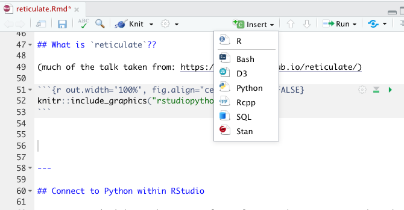

# Misc {#misc}


## 11/26/19 Agenda {#Nov26}
1. API / authenticating 
2. parallel computing
3. cloud computing
4. `reticulate` (Python in R!)
5. SQL

## API

<div style= "float:right;position: relative; top: -80px;">

</div>

What is an API? (Application Programming Interface)

Think of an API as a restaurant menu.  The menu provides a list of what the restaurant has to offer, and you order off the menu by choosing the dish that you want.  After you order, the restaurant figures out how to bring the food from the kitchen to your table in the way that you've specified. 

An API is an intermediary that allows two applications to talk to one another.  It is not the database or the server, instead it is the *code* that allows communication.


#### Examples of APIs {-}

* When you use an app on your phone, the app connects to the internet and sends information to a server somewhere.  The server retrieves the data, interprets is, does what it does, and sends it back to you.  The application which takes the data from the server and presents it to you in a readable way is an API.

* Let's say you are booking a flight on United.  You choose all the details, you interact with the airline's website.  BUT INSTEAD, what if you are interacting with a software like Expedia?  Then Expedia has to talk to United's API to get all the information about available flights, costs, seats, etc.

* If you've ever been to a third party site and clicked on "Share on Facebook" or "Share on Twitter" your third party site is communicating with the Facebook API or the Twitter API.

* You sign up to go to a concert, and StubHub asks whether you want to add the concert to your Google calendar.  StubHub needs to talk to Google via Google's API.

* What if you want some Twitter data?  How might you get it?  Well, you could email Twitter and ask someone for it.  **Instead** Twitter provides information about how their data is stored, and allows you to query their data in an automated way.


## Parallel Computing

## Cloud Computing

## `reticulate`

### Connect to Python within RStudio {-}

For many statisticians, the go-to software language is R.  However, there is no doubt that Python is a very important language in data science.  Why not do both??


```r
library(tidyverse)
library(reticulate)
use_virtualenv("r-reticulate")
reticulate::import("statsmodels")
```

```
## Module(statsmodels)
```

#### I can run Python inside R?? {-}




* `pandas` for data wrangling.  
* In R, the chunk is specified to be a Python chunk (RStudio is now running Python). 


````
```{python}
import pandas
flights = pandas.read_csv("flights.csv")
flights = flights[flights["dest"] == "ORD"]
flights = flights[['carrier', 'dep_delay', 'arr_delay']]
flights = flights.dropna()
```
````

A view of the Python chunk which is actually run:


```python
import pandas
flights = pandas.read_csv("flights.csv")
flights = flights[flights["dest"] == "ORD"]
flights = flights[['carrier', 'dep_delay', 'arr_delay']]
flights = flights.dropna()
```


#### Learn about the dataset {-}

````
```{python}
flights.shape
flights.head(3)
flights.describe()
```
````


```python
flights.shape
```

```
## (12590, 3)
```

```python
flights.head(3)
```

```
##    carrier  dep_delay  arr_delay
## 4       UA       -4.0       12.0
## 5       AA       -2.0        8.0
## 22      AA       -1.0       14.0
```

```python
flights.describe()
```

```
##           dep_delay     arr_delay
## count  12590.000000  12590.000000
## mean      11.709770      2.917951
## std       39.409704     44.885155
## min      -20.000000    -62.000000
## 25%       -6.000000    -22.000000
## 50%       -2.000000    -10.000000
## 75%        9.000000     10.000000
## max      466.000000    448.000000
```


#### Computations using `pandas` {-}


````
```{python}
flights = pandas.read_csv("flights.csv")
flights = flights[['carrier', 'dep_delay', 'arr_delay']]
flights.groupby("carrier").mean()
```
````


```python
flights = pandas.read_csv("flights.csv")
flights = flights[['carrier', 'dep_delay', 'arr_delay']]
flights.groupby("carrier").mean()
```

```
##          dep_delay  arr_delay
## carrier                      
## AA        8.586016   0.364291
## AS        5.804775  -9.930889
## DL        9.264505   1.644341
## UA       12.106073   3.558011
## US        3.782418   2.129595
```


#### From Python chunk to R chunk {-}

* `py$x` accesses an `x` variable created within Python from R
* `r.x` accesses an `x` variable created within R from Python


```r
library(ggplot2)
ggplot(py$flights, 
       aes(x=carrier, 
           y=arr_delay)) + 
  geom_point() + 
  geom_jitter()
```


#### From R chunk to Python chunk {-}


```r
data(diamonds)
head(diamonds)
```

```
## # A tibble: 6 x 10
##   carat cut       color clarity depth table price     x     y     z
##   <dbl> <ord>     <ord> <ord>   <dbl> <dbl> <int> <dbl> <dbl> <dbl>
## 1 0.23  Ideal     E     SI2      61.5    55   326  3.95  3.98  2.43
## 2 0.21  Premium   E     SI1      59.8    61   326  3.89  3.84  2.31
## 3 0.23  Good      E     VS1      56.9    65   327  4.05  4.07  2.31
## 4 0.290 Premium   I     VS2      62.4    58   334  4.2   4.23  2.63
## 5 0.31  Good      J     SI2      63.3    58   335  4.34  4.35  2.75
## 6 0.24  Very Good J     VVS2     62.8    57   336  3.94  3.96  2.48
```


####  Python chunks {-}

Note that we're calling Python code on an R object.


```python
print(r.diamonds.describe())
```

```
##               carat         depth  ...             y             z
## count  53940.000000  53940.000000  ...  53940.000000  53940.000000
## mean       0.797940     61.749405  ...      5.734526      3.538734
## std        0.474011      1.432621  ...      1.142135      0.705699
## min        0.200000     43.000000  ...      0.000000      0.000000
## 25%        0.400000     61.000000  ...      4.720000      2.910000
## 50%        0.700000     61.800000  ...      5.710000      3.530000
## 75%        1.040000     62.500000  ...      6.540000      4.040000
## max        5.010000     79.000000  ...     58.900000     31.800000
## 
## [8 rows x 7 columns]
```


```python
import statsmodels.formula.api as smf
model = smf.ols('price ~ carat', data = r.diamonds).fit()
print(model.summary())
```

```
##                             OLS Regression Results                            
## ==============================================================================
## Dep. Variable:                  price   R-squared:                       0.849
## Model:                            OLS   Adj. R-squared:                  0.849
## Method:                 Least Squares   F-statistic:                 3.041e+05
## Date:                Sat, 23 Nov 2019   Prob (F-statistic):               0.00
## Time:                        21:38:21   Log-Likelihood:            -4.7273e+05
## No. Observations:               53940   AIC:                         9.455e+05
## Df Residuals:                   53938   BIC:                         9.455e+05
## Df Model:                           1                                         
## Covariance Type:            nonrobust                                         
## ==============================================================================
##                  coef    std err          t      P>|t|      [0.025      0.975]
## ------------------------------------------------------------------------------
## Intercept  -2256.3606     13.055   -172.830      0.000   -2281.949   -2230.772
## carat       7756.4256     14.067    551.408      0.000    7728.855    7783.996
## ==============================================================================
## Omnibus:                    14025.341   Durbin-Watson:                   0.986
## Prob(Omnibus):                  0.000   Jarque-Bera (JB):           153030.525
## Skew:                           0.939   Prob(JB):                         0.00
## Kurtosis:                      11.035   Cond. No.                         3.65
## ==============================================================================
## 
## Warnings:
## [1] Standard Errors assume that the covariance matrix of the errors is correctly specified.
```


#### Running just Python {-}


#### Full disclosure {-}

Reticulate is not always trivial to set up.  Indeed, I've had trouble figuring out which Python version is talking to R and where different module versions live.


#### Learn more {-}

- [RStudio R Interface to Python](https://rstudio.github.io/reticulate/)

https://rstudio.github.io/reticulate/  

- [RStudio blog on Reticulated Python](https://blog.rstudio.com/2018/10/09/rstudio-1-2-preview-reticulated-python/)  

https://blog.rstudio.com/2018/10/09/rstudio-1-2-preview-reticulated-python


## SQL

(Taken from the Teach Data Science blog: https://teachdatascience.com/sql/)

SQL (pronounced *sequel*) stands for [Structured Query Language](https://en.wikipedia.org/wiki/SQL); it is a language designed to manage data in a relational database system. 

We will use a public facing MySQL [database](http://www.science.smith.edu/wai-database/home/about) containing wideband acoustic immittance (WAI) measures made on normal ears of adults. (The project is funded by the National Institutes of Health, NIDCD, and hosted on a server at Smith College, [PI Susan Voss, R15 DC014129-01](https://projectreporter.nih.gov/project_info_description.cfm?aid=8769352&icde=44962011&ddparam=&ddvalue=&ddsub=&cr=46&csb=default&cs=ASC&pball=).) The database was created to enable auditory researchers to share WAI measurements and combine analyses over multiple datasets.

We begin by demonstrating how SQL queries can be sent to a database.  We begin by setting up a connection using the `dbConnect()` function.


```r
library(mosaic)
library(RMySQL) # that there are plans to move this support to RMariaDB 
con <- dbConnect(
  MySQL(), host = "scidb.smith.edu", user = "waiuser", 
  password = "smith_waiDB", dbname = "wai")
```

Next a series of SQL queries can be sent to the database using the `DBI::dbGetQuery()` function: each query returns an R dataframe.


```r
class(dbGetQuery(con, "SHOW TABLES"))
```

```
## [1] "data.frame"
```

There are multiple tables within the `wai` database.


```r
dbGetQuery(con, "SHOW TABLES")
```

```
##   Tables_in_wai
## 1  Measurements
## 2       PI_Info
## 3       Subject
```

The `EXPLAIN` command describes the ten field names (variables) in the `PI_Info` table.


```r
dbGetQuery(con, "EXPLAIN PI_Info")
```

```
##          Field           Type Null Key Default Extra
## 1   Identifier    varchar(20)  YES        <NA>      
## 2      PI_Year        int(11)  YES        <NA>      
## 3           PI   varchar(500)  YES        <NA>      
## 4  Affiliation   varchar(500)  YES        <NA>      
## 5        Email    varchar(30)  YES        <NA>      
## 6        Title   varchar(140)  YES        <NA>      
## 7          Pub varchar(10000)  YES        <NA>      
## 8         Date       char(20)  YES        <NA>      
## 9          URL   varchar(140)  YES        <NA>      
## 10    PI_Notes           text   NO        <NA>
```

The `SELECT` statement can be used to select all fields for eight observations in the `Measurements` table.


```r
eightobs <- dbGetQuery(con, "SELECT * FROM Measurements LIMIT 8")
eightobs
```

```
##   Identifier Sub_Number Session Left_Ear MEP Instrument    Freq Absorbance
## 1  Abur_2014          1       1        0  -5          1 210.938  0.0451375
## 2  Abur_2014          1       1        0  -5          1 234.375  0.0441247
## 3  Abur_2014          1       1        0  -5          1 257.812  0.0495935
## 4  Abur_2014          1       1        0  -5          1 281.250  0.0516088
## 5  Abur_2014          1       1        0  -5          1 304.688  0.0590836
## 6  Abur_2014          1       1        0  -5          1 328.125  0.0628038
## 7  Abur_2014          1       1        0  -5          1 351.562  0.0682962
## 8  Abur_2014          1       1        0  -5          1 375.000  0.0738373
##        Zmag      Zang Canal_Area
## 1 110638000 -0.228113         NA
## 2 100482000 -0.230561         NA
## 3  90561100 -0.230213         NA
## 4  83515500 -0.230959         NA
## 5  77476800 -0.229652         NA
## 6  71229100 -0.230026         NA
## 7  66615500 -0.229576         NA
## 8  61996200 -0.229327         NA
```


More interesting and complicated `SELECT` calls can be used to undertake grouping and aggregation.  Here we calculate the sample size for each study


```r
dbGetQuery(con, 
  "SELECT Identifier, count(*) AS NUM FROM Measurements GROUP BY Identifier ORDER BY NUM")
```

```
##       Identifier    NUM
## 1       Sun_2016   2604
## 2    Shaver_2013   2880
## 3    Feeney_2017   3162
## 4      Voss_1994   5120
## 5       Liu_2008   5520
## 6    Werner_2010   7935
## 7  Rosowski_2012  14384
## 8      Voss_2010  14880
## 9      Abur_2014  21328
## 10    Groon_2015  35469
## 11  Shahnaz_2006  58776
## 12    Lewis_2015 114716
```


#### Accessing a database using dplyr commands {-}

Alternatively, a connection can be made to the server by creating a series of `dplyr` tbl
objects. Connecting with familiar `dplyr` syntax is attractive because, as [Hadley Wickham](https://dbplyr.tidyverse.org/articles/dbplyr.html) has noted, SQL and R have similar syntax (but sufficiently different to be confusing).  

The setup process looks similar.


```r
db <- src_mysql(dbname = "wai", host = "scidb.smith.edu", user = "waiuser", 
          password="smith_waiDB")
Measurements <- tbl(db, "Measurements")
class(Measurements)
```

```
## [1] "tbl_MySQLConnection" "tbl_dbi"             "tbl_sql"            
## [4] "tbl_lazy"            "tbl"
```

```r
PI_Info <- tbl(db, "PI_Info")
Subject <- tbl(db, "Subject")
```

We  explore the `PI_Info` table using the `collect()` function used to force computation on the database (and return the results).  One attractive aspect of database systems is that they feature [*lazy evaluation*](https://en.wikipedia.org/wiki/Lazy_evaluation), where computation is optimized and postponed as long as possible.  


```r
PI_Info  %>% summarise(total = n())
```

```
## # Source:   lazy query [?? x 1]
## # Database: mysql 5.5.58-0ubuntu0.14.04.1-log
## #   [waiuser@scidb.smith.edu:/wai]
##   total
##   <dbl>
## 1    12
```

```r
PI_Info %>% select(-Email) %>% collect() %>% data.frame()   
```

```
##       Identifier PI_Year
## 1    Werner_2010    2010
## 2      Voss_1994    1994
## 3     Lewis_2015    2015
## 4      Voss_2010    2010
## 5       Sun_2016    2016
## 6    Shaver_2013    2013
## 7  Rosowski_2012    2012
## 8       Liu_2008    2008
## 9      Abur_2014    2014
## 10   Feeney_2017    2017
## 11    Groon_2015    2015
## 12  Shahnaz_2006    2006
##                                                                                                         PI
## 1                                                                                            Douglas Keefe
## 2                                                                                            Susan E. Voss
## 3                                                                            James D. Lewis; Stephen Neely
## 4                                                                                            Susan E. Voss
## 5                                                                                            Xiao-Ming Sun
## 6                                                                            Mark D. Shaver, Xiao-Ming Sun
## 7                                                                                         John J. Rosowski
## 8  Yi-Wen Liu; Chris A. Sanford; John C. Ellison; Denis F. Fitzpatrick; Michael P. Gorga; Douglas H. Keefe
## 9                                                            Defne Abur; Nicholas J. Horton; Susan E. Voss
## 10                                                                     M. Patrick Feeney; Douglas H. Keefe
## 11                                                                                           Stephen Neely
## 12                                                                               Navid Shahnaz; Karin Bork
##                                                                                              Affiliation
## 1                                                                 Boys Town National Research Laboratory
## 2                                                                  Smith College, formerly ATT Bell Labs
## 3                                                                 Boys Town National Research Laboratory
## 4                                                                                          Smith College
## 5                                                                               Wichita State University
## 6                                                                               Wichita State University
## 7                                  Eaton-Peabody Laboratory, Massachusetts Eye and Ear Infirmary, Boston
## 8                                                                   Boys Town National Research Hospital
## 9                                                                                          Smith College
## 10 National Center for Rehabilitative Auditory Research (NCRAR) and Boys Town National Research Hospital
## 11                                                                  Boys Town National Research Hospital
## 12                                                                        University of British Columbia
##                                                                                                                                     Title
## 1                                             Ear-Canal Wideband Acoustic Transfer Functions of Adults and Two- to Nine-Month-Old Infants
## 2                                                                Measurement of acoustic impedance and reflectance in the human ear canal
## 3                                                                    Non-invasive estimation of middle-ear input impedance and efficiency
## 4                                                                Posture systematically alters ear-canal reflectance and DPOAE properties
## 5                       Wideband acoustic immittance: Normative study and test-retest reliability of tympanometric measurements in adults
## 6  Wideband energy reflectance measurements: Effects of negative middle ear pressure and application of a pressure compensation procedure
## 7                                                          Ear-Canal Reflectance, Umbo Velocity, and Tympanometry in Normal-Hearing Adult
## 8                    Wideband absorbance tympanometry using pressure sweeps: System development and results on adults with normal hearing
## 9                                                                                           Intrasubject Variability in Power Reflectance
## 10      Normative wideband reflectance, equivalent admittance at the tympanic membrane, and acoustic stapedius reflex threshold in adults
## 11                                                                                      Air-Leak Effects on Ear-Canal Acoustic Absorbance
## 12                                                                      Wideband Reflectance Norms for Caucasian and Chinese Young Adults
##                                                  Pub       Date
## 1                                    Ear and Hearing   9/1/2017
## 2       Journal of the Acoustical Society of America 02/08/2017
## 3       Journal of the Acoustical Society of America 10/10/2018
## 4                                   Hearing Research 06/05/2018
## 5  Journal of Speech, Language, and Hearing Research 10/31/2017
## 6   The Journal of the Acoustical Society of America 10/06/2018
## 7                                    Ear and Hearing 11/06/2015
## 8   The Journal of the Acoustical Society of America  6/26/2018
## 9                                   J Am Acad Audiol 08/24/2016
## 10                                   Ear and Hearing 06/07/2018
## 11                                   Ear and Hearing 06/18/2019
## 12                                   Ear and Hearing 08/24/2016
##                                                                                                                   URL
## 1                                                                        https://www.ncbi.nlm.nih.gov/pubmed/20517155
## 2                                                                  https://asa.scitation.org/doi/abs/10.1121/1.408329
## 3                                                                 https://asa.scitation.org/doi/abs/10.1121/1.4927408
## 4                                                                        https://www.ncbi.nlm.nih.gov/pubmed/20227475
## 5                                                                        https://www.ncbi.nlm.nih.gov/pubmed/27517667
## 6                                                                        https://www.ncbi.nlm.nih.gov/pubmed/23862811
## 7                                                                         http://www.ncbi.nlm.nih.gov/pubmed/21857517
## 8                                                                        https://www.ncbi.nlm.nih.gov/pubmed/19206798
## 9                                                                        https://www.ncbi.nlm.nih.gov/pubmed/25257718
## 10                                                                       https://www.ncbi.nlm.nih.gov/pubmed/28045835
## 11 https://journals.lww.com/ear-hearing/fulltext/2015/01000/Air_Leak_Effects_on_Ear_Canal_Acoustic_Absorbance.16.aspx
## 12       http://journals.lww.com/ear-hearing/Abstract/2006/12000/Wideband_Reflectance_Norms_for_Caucasian_and.15.aspx
##                                                                                                                                                                                                                                                                                                                                   PI_Notes
## 1                                                    Used an ER-1 earphone and ER-7C microphone.  Data provided by Doug Keefe and formatted by Susan Voss with help.  Lynne Werner is retired.  In Subject Table, Sub_Notes=1  means part of 183 subjects included in the  means in paper and Sub_Notes=0 means not part of mean in paper.
## 2                                                                                                                                                                                                                       Measurements taken with a system using sysid and the Etymotic ER-2 pressure transducer and ER-7c probe microphone.
## 3                                                                                                                                                                                                                                            Used acoustically calculated areas for absorbance calculations, included in Measurement Table
## 4                                                                                                                                                                                                                                                                                                                                 No notes
## 5                                                                                                                                                                                                                                                                                                                                 No notes
## 6  A research version of Titan (Interacoustics) was used. In this study, a total of five reflectance measurements at ambient pressure were taken per ear (detailed in the article). But, results from only two sessions were reported in this article. Included in this database is the second session (baseline), as the normative data. 
## 7                                                                                                                                                                                                                                                                                                                                No Notes 
## 8                                                                                                                                                                                                                                                                                                                                No Notes 
## 9                                                                                                                                                                                                                                                                          Database includes measurements at Position 1 and Channel B only
## 10                                                                                                                                                                                                                                     Sub_Notes=Boys Town National Lab are data taken by Keefe; Sub_Notes=NCRAR are data taken by Feeney 
## 11                                                                                                                                                                                                                  First author is Groon, PI for grant is Steve Neely, data collected on system described in Rasetshwane and Neely (2011)
## 12                                                                                                                                                                                                                                                                                          Impedance angles not available and set to Null
```

```r
# be careful with collect() when dealing with large tables!
```

Note how the number of rows is unknown (`??` at the top of the output above) for the lazy query.

Similarly, we can explore the `Subjects` table.

```r
Subject  %>% summarise(total = n())
```

```
## # Source:   lazy query [?? x 1]
## # Database: mysql 5.5.58-0ubuntu0.14.04.1-log
## #   [waiuser@scidb.smith.edu:/wai]
##   total
##   <dbl>
## 1   640
```

```r
Subject %>% collect()  # be careful with collect() with large tables!
```

```
## # A tibble: 640 x 10
##    Identifier Sub_Number Session_Total   Age Female  Race Ethnicity
##    <chr>      <chr>              <int> <int>  <int> <int>     <int>
##  1 Voss_2010  1                      5    20      1     0         0
##  2 Voss_2010  2                      5    39      1     0         0
##  3 Voss_2010  3                      5    18      1     0         0
##  4 Voss_2010  4                      5    19      1     0         0
##  5 Voss_2010  5                      5    21      1     0         0
##  6 Voss_2010  6                      5    21      1     0         0
##  7 Voss_2010  7                      5    21      1     0         0
##  8 Voss_2010  8                      5    42      1     0         0
##  9 Voss_2010  9                      5    38      0     0         0
## 10 Voss_2010  10                     5    20      1     0         0
## # … with 630 more rows, and 3 more variables: Left_Ear_Status <int>,
## #   Right_Ear_Status <int>, Sub_Notes <chr>
```

Let's explore the `Measurements` table.

```r
Measurements %>% summarise(total = n())
```

```
## # Source:   lazy query [?? x 1]
## # Database: mysql 5.5.58-0ubuntu0.14.04.1-log
## #   [waiuser@scidb.smith.edu:/wai]
##    total
##    <dbl>
## 1 286774
```

There are more than a quarter million observations.  

In the next step, we will download the data from a given subject for a specific study, in this case a paper by Rosowski et al (2012) entitled ["Ear-canal reflectance, umbo velocity, and tympanometry in normal-hearing adults"](https://www.ncbi.nlm.nih.gov/pubmed/21857517).

Arbitrarily we choose to collect data from subject number three.


```r
onesubj <- 
  Measurements %>% 
  filter(Identifier == "Rosowski_2012", Sub_Number == 3) %>%
  collect %>%
  mutate(SessionNum = as.factor(Session))
head(onesubj)
```

```
## # A tibble: 6 x 12
##   Identifier Sub_Number Session Left_Ear   MEP Instrument  Freq Absorbance
##   <chr>           <int>   <int>    <int> <dbl>      <int> <dbl>      <dbl>
## 1 Rosowski_…          3       1        1    NA          1  211.     0.0852
## 2 Rosowski_…          3       1        1    NA          1  234.     0.0903
## 3 Rosowski_…          3       1        1    NA          1  258.     0.112 
## 4 Rosowski_…          3       1        1    NA          1  281.     0.103 
## 5 Rosowski_…          3       1        1    NA          1  305.     0.129 
## 6 Rosowski_…          3       1        1    NA          1  328.     0.136 
## # … with 4 more variables: Zmag <dbl>, Zang <dbl>, Canal_Area <dbl>,
## #   SessionNum <fct>
```

Finally we can display the results of the measurements as a function of frequency and which ear (left or right) that was used.


```r
onesubj <- mutate(onesubj, Ear = ifelse(Left_Ear == 1, "Left", "Right"))
ggplot(onesubj, aes(x = Freq, y = Absorbance)) + geom_point() +
  aes(colour = Ear) + scale_x_log10() + labs(title="Absorbance by ear Rosowski subject 3")
```


In summary, while SQL is a powerful tool, there are straightforward ways to integrate existing databases into analyses using a small number of commands.  Particularly if instructors use [RMarkdown](https://teachdatascience.com/rmarkdown), data ingestation can be scaffolded with students able to modify and augment code that is provided to them.  

We note that a number of relational database systems exist, including MySQL (illustrated here), PostgreSQL, and SQLite.  More information about databases within R can be found in the CRAN [Databases with R](https://cran.r-project.org/web/views/Databases.html) Task View.

Setting up and managing a database is a topic for a different day: here we focused on how SQL can be used within R to access data in a flexible and powerful manner.  


#### Learn more {-}

- https://chance.amstat.org/2015/04/setting-the-stage/ (Setting the stage for data technologies)
- https://www.w3schools.com/sql/sql_intro.asp (Intro to SQL)
- http://www.science.smith.edu/wai-database/home/about/ (WAI SQL Database)
- https://cran.r-project.org/web/views/Databases.html (CRAN Task View on Databases with R)
- https://db.rstudio.com (RStudio Database resources)
- https://dbplyr.tidyverse.org/articles/dbplyr.html (dbplyr package)


## 12/10/19 Agenda {#Dec10}
1. Regular Expressions

## Regular Expressions {#regexpr}

