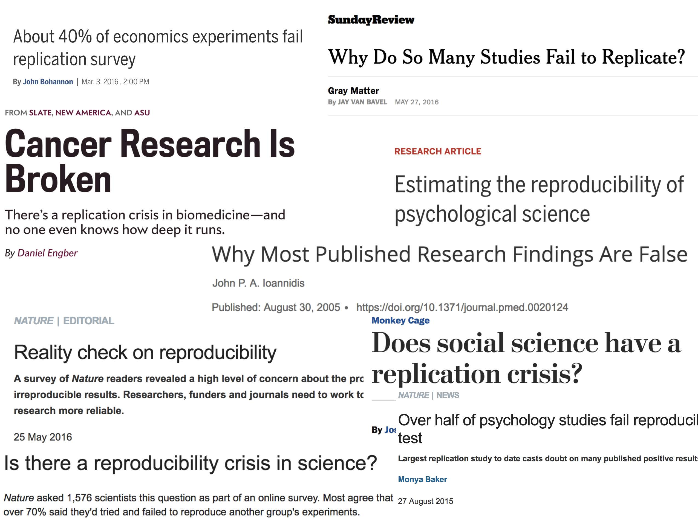

# Introduction {#intro}
  
## Course Logistics

**What is Statistics?**
Generally, statistics is the academic discipline which uses data to make claims and predictions about larger populations of interest.  It is the science of collecting, wrangling, visualizing, and analyzing data as a representation of a larger whole.  It is worth noting that probability represents the majority of mathematical tools used in statistics, but probability as a discipline does not work with data.  Having taken a probability class may help you with some of the mathematics covered in the course, but it is not a substitute for understanding the basics of introductory statistics.

```{r fig.cap = "Probability vs. Statistics", fig.width = 9, fig.align='center', echo=FALSE}
knitr::include_graphics("figs/probstat.jpg")
```

* *descriptive statistics* describe the sample at hand with no intent on making generalizations.
* *inferential statistics* use a sample to make claims about a population


**What is the content of Math 158?**
Math 158 is a course on statistical linear models.  

* The goal in Math 158 is to understand the modeling of *linear* statistical relationships between *explanatory / predictor (X)* variables and *response (Y)* variables.
* The models will grow in sophistication over the semester including multiple linear regression, interaction terms, ridge regression, Lasso, and smoothing.
* Throughout the semester, we will continue to talk about **good modeling practices**, ideas of which extend beyond linear models to any types of inference or prediction.
* We will think carefully about when inferential modeling makes sense and when predictive modeling makes sense.  And when **neither** type of analysis should be done!
* The math in the class will go quickly, but we will do very little calculus.  We will, however, learn some linear algebra.
* We will not necessarily use the linear models to determine causation (need an experimental design course to discuss issues of observational study vs. experiment).  E.g., (1) thermostat versus actual temperature, (2) ice cream sales versus boating accidents.


**Who should take Math 158?**
Linear Models are ubiquitous.  They are used in every science and social science to analyze relationships between variables.  Anyone planning to work in a field which uses statistical arguments to make claims based on data should have a fundamental knowledge of linear models.  Additionally, linear models is the most common required applied statistics course for someone who is applying to graduate school in statistics.     

**What are the prerequisites for Math 158?**
Linear Models requires a strong background in both statistics as well as algorithmic thinking.  The formal prerequisite is any introductory statistics course, but if you have had only AP Statistics, you may find yourself working very hard in the first few weeks of the class to catch up.   If you have taken a lot of mathematics, there are parts of the course that will come easily to you.  However, a mathematics degree is not a substitute for introductory statistics, and if you have not taken introductory statistics, the majority of the course work will not be intuitive for you. You must have taken a prior statistics course as a pre-requisite to Math 158; a computer science course is helpful.

Many of the derivations and much of the notation in the course come from linear algebra.  Having taken linear algebra will be enormously helpful in the class, but we will cover enough of the notation such that you do not need to have had linear algebra.

It is worth noting that the concepts from probability theory represent the majority of mathematical tools used in statistics / modeling, but probability as a discipline does not work with data.  Having taken a probability class may help you with some of the mathematics covered in the course, but it is not a substitute for understanding the basics of introductory statistics. 

**Is there overlap with other classes?**
Statistical Linear Models overlaps with Econometrics (Econ 167) and Applied Econometrics (107).  Econometrics focuses more of the probability theory and matrix algebra (mathematics) which lead to the derivation of the linear models.  Applied Econometrics focuses on the tools and the analysis.  Statistical Linear Models focuses on when to use which model, what assumptions are being made, and what conclusions are most appropriate given the results.  Additionally, the later topics in Linear Models are not typically covered in Econometrics.

**When should I take Math 158?**
While the prerequisite for Linear Models is introduction to statistics, the course moves very quickly and covers a tremendous amount of material.  It is not ideally suited for a first year student coming straight out of AP Statistics.  Instead, that student should focus on taking more mathematics, CS, interdisciplinary science, or other statistics courses.  Most students taking Linear Models are sophomores or juniors. 

**What is the workload for Math 158?**
There is one homework assignment per week, two in-class midterm exams, two take-home midterm exams, and a final end of the semester project.  Many students report working about 8-10 hours per week outside of class.   

**What software will we use? Will there be any real world applications?  Will there be any mathematics?  Will there be any CS?**
All of the work will be done in R (using RStudio as a front end, called an integrated development environment, IDE).  You will need to either download R and RStudio (both are free) onto your own computer or use them on Pomona's server.  All assignments will be posted to private repositories on GitHub.  The class is a mix of many real world applications and case studies, some higher level math, programming, and communication skills.  The final project requires your own analysis of a dataset of your choosing.


* You may use R on the Pomona server:  https://rstudio.campus.pomona.edu/  (All Pomona students will be able to log in immediately.  Non-Pomona students need to go to ITS at Pomona to get Pomona login information.)
* If you want to use R on your own machine, you may.  Please make sure all components are updated:
R is freely available at http://www.r-project.org/ and is already installed on college computers. Additionally, installing R Studio is required http://rstudio.org/.
* All assignments should be turned in using R Markdown compiled to pdf + pushed to GitHub


```{r fig.cap = "Taken from [Modern Drive: An introduction to statistical and data sciences via R](https://ismayc.github.io/moderndiver-book/), by Ismay and Kim", fig.width = 7, fig.align='center', echo=FALSE}
knitr::include_graphics("figs/RRstudio.jpg")
```

```{r fig.cap = "[Jessica Ward](https://jkrward.github.io/), PhD student at Newcastle University", fig.width = 8, fig.align='center', echo=FALSE}
knitr::include_graphics("figs/cookingRstudio.jpg")
```

## Statistics: a review

Linear Models are ubiquitous and incredibly powerful.  Indeed, there are often times when linear models are not appropriate (e.g., for violating the technical conditions) yet they end up giving almost identical solutions to models that are appropriate.  A solid understanding of the linear model framework, however, requires a strong foundation of the theory that goes into both inferential thinking as well as predictive modeling.  Here we review some of the ideas on inference from introductory statistics.

### Vocabulary
* A  **statistic** is a numerical measurement we get from the sample, a function of the data.
* A  **parameter** is a numerical measurement of the population.  We never know the true value of the parameter.
* An  **estimator** is a function of the unobserved data that tries to approximate the unknown parameter value.
* An  **estimate** is the value of the estimator for a given set of data.  [Estimate and statistic can be used interchangeably.]


### Simple Linear Regression

In the simplest case, which we will study first, we suppose we have two variables.  We call one the explanatory variable, the other the response variable.

**Explanatory / Predictor variable**: also known as the independent variable, is a numeric variable that is often known in advance of the other variable, and is thought to possibly influence its value.

**Response / outcome variable**: also known as the dependent variable, also numeric, is thought to be a function of the predictor variable.  n.b., we don't use the word "dependent" because we don't want to send a message that we've measured anything causal in the model.

The goal is to ascertain the relationship between the two.  What we observe is a sample from the population of interest, $(x_i,y_i), i=1,\dots,n$.  $x_i$ is the predictor, $y_i$ the response, and $n$ the sample size.

As we observe only a sample, and not the actual population itself, the best we can hope to do is to estimate the relationship between the two variables.  The resulting estimates give us an **idea** about what the relationship actually is in the population. However, they are random quantities, as they depend on the random sample.  As such, they are not exact.  The theory of hypothesis testing is then needed
to determine how much we can actually say about the population quantities, called *parameters*.

**Parameter**:  A quantity that describes the population. Examples are the population mean, population standard deviation, or if say the relationship between two variables was a polynomial, then the coefficients of the function are parameters.


### Hypothesis Testing
The set up:  the population is too big to observe.  What we'd like to know is the value of specific parameters, say for instance the mean of the population.  We can't however, calculate the parameters directly.
Instead, we observe a sample at random from a population.  Based on the sample, we estimate the parameters.  However, the estimated values are not exact.  We need a technique that uses the estimated model to say something about the population model.

**Null Hypothesis**: Denoted $H_0$, the null hypothesis is usually set up to be what is believed unless evidence is presented otherwise.  It is specific, specifying that the parameter is equal to a specific value.  
If $H_0$ is true, some theory tells us exactly how the estimate behaves.

**Alternative Hypothesis**: Denoted $H_a$, the alternative hypothesis is usually what we wish to show is true.  It is more general than $H_0$, usually of the form the parameter is somehow not equal to the value used in $H_0$, without specifying exactly what we think the value is. As a result, we don't know how the estimate behaves, as it depends on the value of the parameter.


#### What really is an Alternative Hypothesis? {-}

Consider the brief video from the movie Slacker, an early movie by Richard Linklater (director of Boyhood, School of Rock, Before Sunrise, etc.). You can view the video here from starting at 2:22 and ending at 4:30: https://www.youtube.com/watch?v=b-U_I1DCGEY

In the video, a rider in the back of a taxi (played by Linklater himself) muses about alternate realities that could have happened as he arrived in Austin on the bus. What if instead of taking a taxi, he had found a ride with a woman at the bus station? He could have take a different road into a different alternate reality, and in that reality his current reality would be an alternate reality. And so on.

What is the point?  Why did we see the video?  How does it relate the to the material from class?  What is the relationship to sampling distributions?

Since any procedure will have the potential to be wrong, we search for one that makes bad errors infrequently.  There are two types of errors that can be made.

**Type I error**: Rejecting $H_0$ when $H_0$ is actually true. Usually considered to be the worst error possible, and thus we find a procedure which makes the type I error with only a small probability. The probability is denoted by $\alpha$.

**Type II error**: Not rejecting $H_0$ when $H_a$ is actually true. Having a small type II error is a secondary concern (after controlling the type I error).  The probability of a type II error is denoted by $\beta$.  $1-\beta$
is known as the *power*.

In reality, the true reason why we choose a test with a small value of $\alpha$ is because it is the only value we know how to calculate. $\beta$ or power is not possible to calculate because $H_a$ doesn't tell us what the value of the parameter is.

The way a hypothesis test is carried out is via the p-value, which essentially tells us how unusual the observed data is in comparison to $H_0$.  If the estimates are not consistent from what would be expected if $H_0$ was true, the conclusion is that $H_0$ is false: an explanation as to why the data was so strange.  The definition of a p-value is a little tricky.

**p-value**: The probability, if $H_0$ were true, of observing data as or more contradictory to $H_0$ if we were to repeat the experiment again.

So if the p-value is .01, that means the data showed something that happens only about 1 time in 100 when $H_0$ is true. Considering that the particular set of data *was* observed, the reasonable conclusion is that $H_0$ must not be
true.  The rule is: reject $H_0$ if p-value $< \alpha$.  The resulting test will have a type I error probability of $\alpha$, which is the value we get to specify.  $\alpha$ is often set to be .05.


## Reflection Questions

1. What is the difference between a sample and a population? 
2. What are some of the experimental design issues that influence the conclusions?
3. What are type I error, type II error, and power?
4. What is a p-value (be careful, the **p-value is NOT the probability that $H_0$ is true**!!!)?
5. What should the regression line be doing?  
6. Is linear regression always an appropriate strategy?  
7. What properties does a good fitting line have? 
8. How should the line be appropriately interpreted?


 
## Reproducibility {#repro}

Reproducibility has long been considered an important topic for consideration in any research project.  However, recently there has been increased press and available examples for understanding the impact that non-reproducible science can have.  

@reprobook provide a full textbook on the structure of reproducible research as well as dozens of case studies to help hone skills and consider different aspects of the reproducible pipeline.  Below are a handful of examples to get us started.

### Need for Reproducibility


```{r fig.cap = "slide taken from Kellie Ottoboni https://github.com/kellieotto/useR2016", fig.width = 7, fig.align='center', echo=FALSE}

```

###  Example 1 {-}
Science retracts gay marriage paper without agreement of lead author LaCour


```{r fig.width = 7, fig.align='center', echo=FALSE}

```


* In May 2015 Science retracted a study of how canvassers can sway people's opinions about gay marriage published just 5 months prior.
* Science Editor-in-Chief Marcia McNutt: 
    * Original survey data not made available for independent reproduction of results. 
    * Survey incentives misrepresented. 
    * Sponsorship statement false.
* Two Berkeley grad students who attempted to replicate the study quickly discovered that the data must have been faked.
* Methods we'll discuss can't prevent fraud, but they can make it easier to discover issues.
* Source: http://news.sciencemag.org/policy/2015/05/science-retracts-gay-marriage-paper-without-lead-author-s-consent

### Example 2 {-}
Seizure study retracted after authors realize data got "terribly mixed"

```{r fig.width = 7, fig.align='center', echo=FALSE}
knitr::include_graphics("figs/chakrabarti.jpg")
```

* From the authors of Low Dose Lidocaine for Refractory Seizures in Preterm Neonates:

> The article has been retracted at the request of the authors. After carefully re-examining the data presented in the article, they identified that data of two different hospitals got terribly mixed. The published results cannot be reproduced in accordance with scientific and clinical correctness.

* Source: http://retractionwatch.com/2013/02/01/seizure-study-retracted-after-authors-realize-data-got-terribly-mixed/


### Example 3 {-}
Bad spreadsheet merge kills depression paper, quick fix resurrects it


```{r fig.width = 7, fig.align='center', echo=FALSE}
knitr::include_graphics("figs/kern.jpg")
```


* The authors informed the journal that the merge of lab results and other survey data used in the paper resulted in an error regarding the identification codes. Results of the analyses were based on the incorrectly merged data set. Further analyses established the results reported in the manuscript and interpretation of the data are not correct.

> Original conclusion: Lower levels of CSF IL-6 were associated with current depression and with future depression ... 

> Revised conclusion: Higher levels of CSF IL-6 and IL-8 were associated with current depression ... 

* Source: http://retractionwatch.com/2014/07/01/bad-spreadsheet-merge-kills-depression-paper-quick-fix-resurrects-it/


### Example 4 {-}

PNAS paper retracted due to problems with figure and reproducibility (April 2016):
http://cardiobrief.org/2016/04/06/pnas-paper-by-prominent-cardiologist-and-dean-retracted/


```{r fig.width = 7, fig.align='center', echo=FALSE}
knitr::include_graphics("figs/goldschmidt.jpg")
```


### The reproducible data analysis process

* Scriptability $\rightarrow$ R
* Literate programming $\rightarrow$ R Markdown
* Version control $\rightarrow$ Git / GitHub

 
#### Scripting and literate programming {-}

Donald Knuth "Literate Programming" (1983) 

> Let us change our traditional attitude to the construction of programs: Instead of imagining that our main task is to instruct a computer- what to do, let us concentrate rather on explaining to human beings- what we want a computer to do.

* The ideas of literate programming have been around for many years!
* and tools for putting them to practice have also been around
* but they have never been as accessible as the current tools

#### Reproducibility checklist {-}

* Are the tables and figures reproducible from the code and data?
* Does the code actually do what you think it does?
* In addition to what was done, is it clear why it was done? (e.g., how were parameter settings chosen?)
* Can the code be used for other data?
* Can you extend the code to do other things?

#### Tools: R & R Studio {-}

See a great video (less than 2 min) on a reproducible workflow: https://www.youtube.com/watch?v=s3JldKoA0zw&feature=youtu.be

* You must use both R and RStudio software programs
* R does the programming
* R Studio brings everything together
* You may use Pomona's server: https://rstudio.pomona.edu/

```{r fig.cap = "Taken from [Modern Drive: An introduction to statistical and data sciences via R](https://ismayc.github.io/moderndiver-book/), by Ismay and Kim", fig.width = 7, fig.align='center', echo=FALSE}
knitr::include_graphics("figs/RRstudio.jpg")
```

```{r fig.cap = "[Jessica Ward](https://jkrward.github.io/), PhD student at Newcastle University", fig.width = 8, fig.align='center', echo=FALSE}
knitr::include_graphics("figs/cookingRstudio.jpg")
```

#### Tools: Git & GitHub {-}

* You must submit assignments via GitHub
* Follow Jenny Bryan's advice on how to get set-up: http://happygitwithr.com/
* Class specific instructions at https://m158-comp-stats.netlify.app/github.html


Admittedly, there is a steep learning curve with Git.  However, it is among the tools which you are most likely to use in your future endeavors, so spending a little time focusing on the concepts now may pay off big time in the future.  Beyond practicing and working through http://happygitwithr.com/, you may want to read a little bit about what Git is doing behind the scenes.  This reference: [Learn git concepts, not commands](https://dev.to/unseenwizzard/learn-git-concepts-not-commands-4gjc) is very good and accessible.

#### Tools: a GitHub merge conflict (demo) {-}

* On GitHub (on the web) edit the README document and Commit it with a message describing what you did.
* Then, in RStudio also edit the README document with a different change.
    * Commit changes
    * Try to push $\rightarrow$ you'll get an error!
    * Try pulling
    * Resolve the merge conflict and then commit and push
* As you work in teams you will run into merge conflicts, learning how to resolve them properly will be very important.

```{r fig.cap = "https://xkcd.com/1597/", fig.width = 9, fig.align='center', echo=FALSE}
knitr::include_graphics("figs/git_xkcd.png")
```

#### Steps for weekly homework {-}

1. You will get a link to the new assignment (clicking on the link will create a new private repo)  
2. Use R (within R Studio)  
    * New Project, version control, Git  
    * Clone the repo using SSH  
3. If it exists, rename the Rmd file to ma158-hw#-lname-fname.Rmd  
4.  Do the assignment  
    *  `commit` and  `push` after every problem  
5. All necessary files  *must* be in the same folder (e.g., data)  


