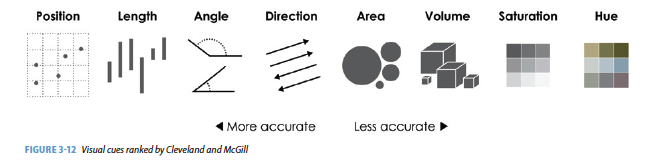

# Visualization {#viz}

Data visualization is integral to understanding both data and models.  Computational statistics and data science sometimes focus on models or resulting predictions from the models.  But there is no doubt that the structure and format of the data are the key to whether or not a model is appropriate or good.  A good data analyst will always spend a lot of time and effort on exploratory data analysis, much of which includes making as many visualizations of the data as possible.

```{r, include=FALSE, eval=TRUE, echo=FALSE, warning=FALSE, message=FALSE}
knitr::opts_chunk$set(message=FALSE, warning=FALSE, 
                      fig.height=3, fig.width=5,  
                      cache=TRUE, fig.align = "center")

library(tidyverse)
```


Depending on the introductory (or other) statistics classes you've had, your instructor may have focused more or less on visualizations in class.  They (I) may have even said something like *making visualizations are incredibly important to the entire data analysis process.*  But even if you buy the perspective, why is it that we don't see more good graphics in our analyses?   Andrew Gelman [@Gelman11] responds by stating, "Good statistical graphics are hard to do, much harder than running regressions and making tables."   **Our goal will be to create graphics and visualizations that convey statistical information.**

Nolan [@Nolan16] describes three important ways that graphics can be used to convey statistical information.  The "guiding principles" will be used as a way of evaluating others' figures as well as a metric for creating our own visualizations to help with statistical analysis.

1.  *Make the data stand out* 

The important idea here is to find anything unusual in the data.  Are there patterns?  Outliers?  What are the bounds of the variables?  How should the axes be scaled?  Are transformations warranted?   

2. *Facilitate comparison*

The second item allows us to consider the research questions at hand. What are the important variables?  How do we emphasize them?  Which variables should be plotted together?  Can they be super-imposed?  Does color, plotting character, size of plot character help to bring out the important relationships?  Be aware of over plotting and issues of color blindness. http://colorbrewer2.org/

3. *Add information*

Plots should also add context to the comparison.  Figure legends, axes scales, and reference markers (e.g., a line at $y=x$) go a long way toward helping the reader understand your message.  Captions should be self-contained (and not assume the user has also read your text) and descriptive; they should summarize the content of the figure and the conclusion related to the message you want to convey.


Randy Pruim asks the following question to decide whether or not a plot is good:  *Does my plot make the comparisons I am interested in...*

* easily? and
* accurately?

Consider adding alt text to allow screen readers to parse the image.  The DataViz Society/Nightingale by way of Amy Cesal has an article on writing good alt text for plots/graphs, <a href = "https://medium.com/nightingale/writing-alt-text-for-data-visualization-2a218ef43f81" target = "_blank">Writing Alt Text for Data Visualization</a>.


## Thoughts on Plotting {#thoughts}

### Advice

* Basic plotting
    - Avoid having other graph elements interfere with data
    - Use visually prominent symbols
    - Avoid over-plotting  (One way to avoid over plotting: Jitter the values)
    - Different values of data may obscure each other
    - Include all or nearly all of the data
    - Fill data region
* Eliminate superfluous material
    - Chart junk & stuff that adds no meaning, e.g. butterflies on top of barplots, background images
    - Extra tick marks and grid lines
    - Unnecessary text and arrows
    - Decimal places beyond the measurement error or the level of difference
* Facilitate Comparisons
    - Put juxtaposed plots on same scale
    - Make it easy to distinguish elements of  superposed plots (e.g. color)
    - Emphasizes the important difference
    - Comparison: volume, area, height  (be careful, volume can seem bigger than you mean it to)
* Choosing the Scale (n.b., some of the principles may go counter to one another, use your judgment.)
    - Keep scales on x and y axes the same for both plots to facilitate the comparison
    - Zoom in to focus on the region that contains the bulk of the data
    - Keep the scale the same throughout the plot (i.e. don't change it mid-axis)
    - Origin need not be on the scale
    - Choose a scale that improves resolution
    - Avoid jiggling the baseline
* How to make a plot information rich
    - Describe what you see in the caption
    - Add context with reference markers (lines and points) including text
    - Add legends and labels
    - Use color and plotting symbols to add more information
    - Plot the same thing more than once in different ways/scales
    - Reduce clutter
* Captions should
    - Be comprehensive
    - Self-contained
    - Describe what has been graphed
    - Draw attention to important features
    - Describe conclusions drawn from graph
* Good Plot Making Practice
    - Put major conclusions in graphical form
    - Provide reference information
    - Proof read for clarity and consistency
    - Graphing is an iterative process
    - Multiplicity is OK, i.e. two plots of the same variable may provide different messages
    - Make plots data rich


Creating a statistical graphic is an iterative process of discovery and fine tuning. We try to model the process of creating visualizations in the course by dedicating class time to an iterative creation of a plot. We begin either with a plot that screams for correction, and we transform it step-by-step, always thinking about the goal of a graph that is data rich and presents a clear vision of the important features of the data.


#### Fonts Matter

At RStudio::conf 2020, [The Glamour of Graphics](https://rstudio.com/resources/rstudioconf-2020/the-glamour-of-graphics/), Will Chase makes some very important points about how and why making good graphics matters. The talk might be summarized by the plot below: fonts matter.


```{r, out.width = "500px", echo=FALSE}
knitr::include_graphics("figs/fontsmatter.png")
``` 


## Deconstructing a graph {#deconstruct}

###  The Grammar of Graphics (`gg`) {#gg}

@Yau and @Wickham14  have come up with a *taxonomy* and a *grammar* for thinking about the parts of a figure just like we conceptualize the parts of a body or the parts of a sentence.

One great way of thinking of the new process:  it is not longer necessary to talk about the name of the graph (e.g., boxplot).  Instead we now think in glyphs (geoms), and so we can put whatever we want on the plot.  Note also that the transition leads you from a passive consumer (I need to make plot XXX because everyone else does, so I just plug in the data) into an active participant (what do I want my data to say?  and how can I put that information onto my graphic?)

The most important questions you can ask with respect to creating figures are:

1. What do we want R to do? (What is the goal?)
2. What does R need to know?

@Yau gives us nine visual cues, and @Wickham14 translates them into a language using `ggplot2`.  (The items below are from @MDSR, chapter 2.)


1. Visual Cues:  the aspects of the figure where we should focus.  
**Position** (numerical) where in relation to other things?  
**Length** (numerical) how big (in one dimension)?  
**Angle** (numerical) how wide? parallel to something else?  
**Direction** (numerical) at what slope?  In a time series, going up or down?  
**Shape** (categorical) belonging to what group?  
**Area** (numerical) how big (in two dimensions)?  Beware of improper scaling!  
**Volume** (numerical) how big (in three dimensions)?  Beware of improper scaling!  
**Shade** (either) to what extent?  how severely?  
**Color** (either) to what extent? how severely? Beware of red/green color blindness.  

2. Coordinate System: rectangular, polar, geographic, etc.

3. Scale: numeric (linear? logarithmic?), categorical (ordered?), time

4. Context: in comparison to what (think back to ideas from Tufte)


```{r out.width = '100%', fig.align='center', echo=FALSE}
knitr::include_graphics("figs/Yau_viz_cues.png")
```

#### Order Matters {-}

```{r out.width = '100%', fig.align='center', echo=FALSE}

```


#### Cues Together {-}

```{r out.width = '100%', fig.align='center', echo=FALSE}
knitr::include_graphics("figs/Yau_cuestogether.png")
```

##### What are the visual cues on the plot? {-}

```{r, echo=FALSE}
require(mosaic)
require(mosaicData)

SAT %>% subset(frac > 50) %>%
  ggplot(aes(x=state, y= math)) + 
  xlab("state") + theme(axis.text.x = element_text(angle = 45, hjust = 1))+
  ylab("average SAT score") + 
  geom_point() + 
  geom_linerange(aes(x=state, ymin=0, ymax=math))
```


* position?
* length?
* shape?
* area/volume?
* shade/color?
* coordinate System?  
* scale?

##### What are the visual cues on the plot? {-}

```{r, echo=FALSE}
SwimRecords %>%
  ggplot(aes(x=year, y=time, color = sex)) + 
  geom_point() + 
  geom_line() +
  ylab("World Record Time (seconds)") +
  ggtitle("100m Swimming World Records")
```

* position?
* length?
* shape?
* area/volume?
* shade/color?
* coordinate System?  
* scale?


##### What are the visual cues on the plot? {-}

```{r, echo=FALSE}
HELPrct %>% group_by(substance) %>%
  summarize(count = n()) %>%
  mutate(lab.ypos = cumsum(count) - 0.5*count) %>%
  ggplot(aes(x = "", y =count, fill = substance)) + 
  geom_bar(width = 1, stat = "identity", color = "white") +
  coord_polar("y", start = 0)+
  geom_text(aes(y = lab.ypos, label = count), color = "white") +
  scale_fill_brewer(palette = "Greens") +
  theme_void() +
  ggtitle("HELP clinical trial at detoxification unit")
```


* position?
* length?
* shape?
* area/volume?
* shade/color?
* coordinate System?  
* scale?


#### The grammar of graphics in `ggplot2`

**geom**: the geometric "shape" used to display data
 
  * bar, point, line, ribbon, text, etc.
 
**aesthetic**: an attribute controlling how geom is displayed with respect to variables

  * x position, y position, color, fill, shape, size, etc.

**scale**: adjust information in the aesthetic to map onto the plot

  * *particular* assignment of colors, shapes, sizes, etc.; making axes continuous or constrained to a particular range of values.
 
**guide**: helps user convert visual data back into raw data (legends, axes)

**stat**: a transformation applied to data before geom gets it

  * example: histograms work on binned data
 


### `ggplot2`


In `ggplot2`, an *aesthetic* refers to a mapping between a variable and the information it conveys on the plot.  Further information about plotting and visualizing information is given in chapter 2 (Data visualization) of @MDSR.  Much of the data in the presentation represents all births from 1978 in the US: the date, the day of the year, and the number of births.

<!---
%Things to talk about:
%layers 
%facets 
%tidy data 
%scale: the computer maps the data to the aesthetic (computer doing the work) 
%guide: the aesthetic gets mapped back to the data (the human interpreting the graph) 
%frame: the variables that define the space (e.g., x & y coordinates and faceting) 
--->

##### Goals {-}

What I will try to do

 * give a tour of `ggplot2`
 
 * explain how to think about plots the `ggplot2` way
 
 * prepare/encourage you to learn more later
 
What I can't do in one session

 * show every bell and whistle
 
 * make you an expert at using `ggplot2`
 
##### Getting help {-}

1.  One of the best ways to get started with ggplot is to google what you want to do with the word ggplot.  Then look through the images that come up.  More often than not, the associated code is there.  There are also ggplot galleries of images, one of them is here: https://plot.ly/ggplot2/

2. `ggplot2` cheat sheet: https://www.rstudio.com/wp-content/uploads/2015/03/ggplot2-cheatsheet.pdf

3. Look at the end of the presentation.  More help options there.


```{r fig.width = 7, fig.align='center', echo=FALSE}
knitr::include_graphics("figs/plotly.png")
```


```{r}
require(mosaic)
require(lubridate) # package for working with dates
data(Births78)     # restore fresh version of Births78
head(Births78, 3)
```


##### How can we make the plot? {-}


```{r, echo=FALSE}
ggplot(
  data=Births78, aes(x=date, y=births)) + 
  geom_point() +
  ggtitle("US Births in 1978")
```


Two Questions:

 1. What do we want R to do?  (What is the goal?)
 
 2. What does R need to know?

    * data source: `Births78`

    * aesthetics: 
 
        * `date -> x`
        * `births -> y`
        * points (!) 


 1. Goal: scatterplot = a plot with points
 
    * `ggplot() + geom_point()`
 
 2. What does R need to know?
 
    * data source: `data = Births78`

    * aesthetics: `aes(x = date, y = births)`


##### How can we make the plot? {-}

```{r, echo=FALSE}
Births78 <- 
  Births78 %>% mutate(wday = lubridate::wday(date, label=TRUE))
ggplot(data=Births78) +
  geom_point(aes(x=date, y=births, color=wday)) +
  ggtitle("US Births in 1978")
```

What has changed?  

 * new aesthetic: mapping color to day of week

##### Adding day of week to the data set {-}


The `wday()` function in the `lubridate` package computes  the day of the week from a date.

```{r}
Births78 <-  
  Births78 %>% 
  mutate(wday = lubridate::wday(date, label=TRUE))
```


```{r, fig.height=2.0}
ggplot(data=Births78) +
  geom_point(aes(x=date, y=births, color=wday))+
  ggtitle("US Births in 1978")
```


##### How can we make the plot? {-}

```{r, echo=FALSE}
ggplot(data=Births78) +
  geom_line(aes(x=date, y=births, color=wday)) +
  ggtitle("US Births in 1978")
```


Now we use lines instead of dots

```{r, eval=FALSE}
ggplot(data=Births78) +
  geom_line(aes(x=date, y=births, color=wday)) +
  ggtitle("US Births in 1978")
```


##### How can we make the plot? {-}

```{r, echo=FALSE}
ggplot(data=Births78, aes(x=date, y=births, color=wday)) + 
  geom_point() + 
  geom_line()+
  ggtitle("US Births in 1978")
```

Now we have two **layers**, one with points and one with
lines

```{r, eval=FALSE}
ggplot(data=Births78, 
       aes(x=date, y=births, color=wday)) + 
  geom_point() +  geom_line()+
  ggtitle("US Births in 1978")
```


 *  The layers are placed one on top of the other:  the points 
are *below* and the lines are *above*.   

 * `data` and `aes` specified in `ggplot()` affect all geoms
 
##### Alternative Syntax {-}


```{r}
Births78 %>% 
  ggplot(aes(x=date, y=births, color=wday)) + 
  geom_point() + 
  geom_line()+
  ggtitle("US Births in 1978")
```


##### What does adding the color argument do? {-}

```{r, eval=FALSE}
Births78 %>%
  ggplot(aes(x=date, y=births, color="navy")) + 
  geom_point()  +
  ggtitle("US Births in 1978")
```


```{r, echo=FALSE}
Births78 %>% 
  ggplot(aes(x=date, y=births, color="navy")) + 
  geom_point()  +
  ggtitle("US Births in 1978")
```

Because there is no variable, we have *mapped* the color aesthetic to a new variable with only one value ("navy").   So all the dots get set to the same color, but it's not navy.

##### Setting vs. Mapping {-}


If we want to *set* the color to be navy for all of the dots, we do it outside the aesthetic, without a dataset variable:

```{r}
Births78 %>%
  ggplot(aes(x=date, y=births)) +   # map x & y 
  geom_point(color = "navy")   +     # set color
  ggtitle("US Births in 1978")
```

* Note that `color = "navy"` is now outside of the aesthetics list.  That's how `ggplot2` distinguishes between mapping and setting.


##### How can we make the plot? {-}

```{r, echo=FALSE}
Births78 %>%
  ggplot(aes(x=date, y=births)) + 
  geom_line(aes(color=wday)) +        # map color here
  geom_point(color="navy")    +        # set color here
  ggtitle("US Births in 1978")
```


```{r, eval=FALSE}
Births78 %>%
  ggplot(aes(x=date, y=births)) + 
  geom_line(aes(color=wday)) +       # map color here
  geom_point(color="navy") +          # set color here
  ggtitle("US Births in 1978")
```

* `ggplot()` establishes the default data and aesthetics for the geoms, but each geom may change the defaults.

* good practice: put into `ggplot()` the things that affect all (or most) of the layers; rest in `geom_blah()`

##### Setting vs. Mapping (again) {-}

Information gets passed to the plot via:

a. `map` the **variable** information inside the aes (aesthetic) command

a. `set` the **non-variable** information outside the aes (aesthetic) command

##### Other geoms {-}

```{r, echo=TRUE, comment=NA}
apropos("^geom_")
```

help pages will tell you their aesthetics, default stats, etc.

```{r, eval=FALSE}
?geom_area             # for example
```


##### Let's try `geom_area` {-}

```{r, eval=TRUE}
Births78 %>%
  ggplot(aes(x=date, y=births, fill=wday)) + 
  geom_area()+
  ggtitle("US Births in 1978")
```

Using area does not produce a good plot

* over plotting is hiding much of the data
* extending y-axis to 0 may or may not be desirable.

##### Side note: what makes a plot good? {-}

Most (all?) graphics are intended to help us make comparisons

* How does something change over time?
* Do my treatments matter?  How much?
* Do men and women respond the same way?

**Key plot metric:** Does my plot make the comparisons I am interested in 

* easily, and 
* accurately?

##### Time for some different data {-}


`HELPrct`: Health Evaluation and Linkage to Primary care randomized clinical trial

```{r}
head(HELPrct)
```

Subjects admitted for treatment for addiction to one of three substances.

##### Who are the people in the study? {-}


```{r}
HELPrct %>% 
  ggplot(aes(x=substance)) + 
  geom_bar()+
  ggtitle("HELP clinical trial at detoxification unit")
```

* Hmm.  What's up with `y`?

    * `stat_bin()` is being applied to the data before the 
    `geom_bar()` gets to do its thing.  Binning creates the
    `y` values.

##### Who are the people in the study? {-}


```{r message=FALSE, warning=FALSE}
HELPrct %>% 
  ggplot(aes(x=substance, fill=sex)) + 
  geom_bar()+
  ggtitle("HELP clinical trial at detoxification unit")
```

##### Who are the people in the study? {-}

```{r message=FALSE, warning=FALSE}
library(scales)
HELPrct %>% 
  ggplot(aes(x=substance, fill=sex)) + 
  geom_bar() +
  scale_y_continuous(labels = percent)+
  ggtitle("HELP clinical trial at detoxification unit")
```


##### Who are the people in the study? {-}

```{r message=FALSE, warning=FALSE}
HELPrct %>% 
  ggplot(aes(x=substance, fill=sex)) + 
  geom_bar(position="fill") +
  scale_y_continuous("actually, percent")+
  ggtitle("HELP clinical trial at detoxification unit")
```


##### How old are people in the HELP study? {-}


```{r, fig.height=1.5, message=TRUE}
HELPrct %>% 
  ggplot(aes(x=age)) + 
  geom_histogram()+
  ggtitle("HELP clinical trial at detoxification unit")
```

Notice the messages

* `stat_bin`:  Histograms are not mapping the raw data but binned data.  
`stat_bin()` performs the data transformation.

* `binwidth`: a default `binwidth` has been selected, but we should really choose our own.

##### Setting the binwidth manually {-}


```{r}
HELPrct %>% 
  ggplot(aes(x=age)) + 
  geom_histogram(binwidth=2)+
  ggtitle("HELP clinical trial at detoxification unit")
```


##### How old are people in the HELP study? -- Other geoms {-}

```{r, fig.height=1.7}
HELPrct %>% 
  ggplot(aes(x=age)) + 
  geom_freqpoly(binwidth=2)+
  ggtitle("HELP clinical trial at detoxification unit")
```

```{r, fig.height=1.7}
HELPrct %>% 
  ggplot(aes(x=age)) + 
  geom_density()+
  ggtitle("HELP clinical trial at detoxification unit")
```

##### Selecting stat and geom manually {-}

Every geom comes with a default stat

* for simple cases, the stat is `stat_identity()` which does nothing
* we can mix and match geoms and stats however we like

```{r, fig.height=2.0}
HELPrct %>% 
  ggplot(aes(x=age)) + 
  geom_line(stat="density")+
  ggtitle("HELP clinical trial at detoxification unit")
```

##### Selecting stat and geom manually {-}

Every stat comes with a default `geom`, every geom with a default stat

* we can specify stats instead of `geom`, if we prefer
* we can mix and match geoms and stats however we like

```{r, fig.height=2.0}
HELPrct %>% 
  ggplot(aes(x=age)) + 
  stat_density( geom="line")+
  ggtitle("HELP clinical trial at detoxification unit")
```

##### More combinations {-}

```{r, fig.height=1.7}
HELPrct %>% 
  ggplot(aes(x=age)) + 
  geom_point(stat="bin", binwidth=3) + 
  geom_line(stat="bin", binwidth=3)  +
  ggtitle("HELP clinical trial at detoxification unit")
```

```{r, fig.height=1.7}
HELPrct %>% 
  ggplot(aes(x=age)) + 
  geom_area(stat="bin", binwidth=3) +
  ggtitle("HELP clinical trial at detoxification unit") 
```

```{r}
HELPrct %>% 
  ggplot(aes(x=age)) + 
  geom_point(stat="bin", binwidth=3, aes(size=..count..)) +
  geom_line(stat="bin", binwidth=3) +
  ggtitle("HELP clinical trial at detoxification unit")
```

##### How much do they drink? (i1) {-}

```{r, fig.height=1.5}
HELPrct %>% 
  ggplot(aes(x=i1)) + geom_histogram()+
  ggtitle("HELP clinical trial at detoxification unit")
```

```{r, fig.height=1.5}
HELPrct %>% 
  ggplot(aes(x=i1)) + geom_density()+
  ggtitle("HELP clinical trial at detoxification unit")
```

```{r, fig.height=1.5}
HELPrct %>% 
  ggplot(aes(x=i1)) + geom_area(stat="density")+
  ggtitle("HELP clinical trial at detoxification unit")
```


##### Covariates: Adding in more variables {-}


Using `color` and `linetype`:

```{r, fig.height=1.6}
HELPrct %>% 
  ggplot(aes(x=i1, color=substance, linetype=sex)) + 
  geom_line(stat="density")+
  ggtitle("HELP clinical trial at detoxification unit")
```

Using `color` and `facet`s

```{r, fig.height=1.6}
HELPrct %>% 
  ggplot(aes(x=i1, color=substance)) + 
  geom_line(stat="density") + facet_grid( . ~ sex )+
  ggtitle("HELP clinical trial at detoxification unit")
```

```{r, fig.height=1.6}
HELPrct %>% 
  ggplot(aes(x=i1, color=substance)) + 
  geom_line(stat="density") + facet_grid( sex ~ . )+
  ggtitle("HELP clinical trial at detoxification unit")
```


##### Boxplots {-}
Boxplots use `stat_quantile()`  which computes a five-number summary  (roughly the five quartiles of the data) and uses them to define a "box" and "whiskers".

The quantitative variable must be `y`, and there must be an additional `x` variable. 

```{r}
HELPrct %>% 
  ggplot(aes(x=substance, y=age, color=sex)) + 
  geom_boxplot()+
  ggtitle("HELP clinical trial at detoxification unit")
```

##### Horizontal boxplots {-}

Horizontal boxplots are obtained by flipping the coordinate system:
```{r}
HELPrct %>% 
  ggplot(aes(x=substance, y=age, color=sex)) + 
  geom_boxplot() +
  coord_flip()+
  ggtitle("HELP clinical trial at detoxification unit")
```

* `coord_flip()` may be used with other plots as well to reverse the roles
of `x` and `y` on the plot.


##### Axes scaling with boxplots {-}

We can scale the continuous axis
```{r}
HELPrct %>% 
  ggplot(aes(x=substance, y=age, color=sex)) + 
  geom_boxplot() +
  coord_trans(y="log")+
  ggtitle("HELP clinical trial at detoxification unit")
```


##### Give me some space {-}

We've triggered a new feature: `dodge` (for dodging things left/right). We can control how much if we set the dodge manually.

```{r}
HELPrct %>% 
  ggplot(aes(x=substance, y=age, color=sex)) + 
  geom_boxplot(position=position_dodge(width=1)) +
  ggtitle("HELP clinical trial at detoxification unit")
```


##### Issues with bigger data {-}

```{r}
require(NHANES)
dim(NHANES)
NHANES %>%  ggplot(aes(x=Height, y=Weight)) +
  geom_point() + facet_grid( Gender ~ PregnantNow ) +
  ggtitle("National Health and Nutrition Examination Survey")
```

* Although we can see a generally positive association (as we would expect), the over plotting may be hiding information.

##### Using alpha (opacity) {-}

One way to deal with over plotting is to set the opacity low.

```{r}
NHANES %>% 
  ggplot(aes(x=Height, y=Weight)) +
  geom_point(alpha=0.01) + facet_grid( Gender ~ PregnantNow ) +
  ggtitle("National Health and Nutrition Examination Survey")
```

##### geom_density2d {-}

Alternatively (or simultaneously) we might prefer a different `geom` altogether.

```{r}
NHANES %>% 
  ggplot(aes(x=Height, y=Weight)) +
  geom_density2d() + facet_grid( Gender ~ PregnantNow ) +
  ggtitle("National Health and Nutrition Examination Survey")
```


##### Multiple layers {-}

```{r}
ggplot( data=HELPrct, aes(x=sex, y=age)) +
  geom_boxplot(outlier.size=0) +
  geom_jitter(alpha=.6) +
  coord_flip()+
  ggtitle("HELP clinical trial at detoxification unit")
```

##### Multiple layers {-}

```{r}
ggplot( data=HELPrct, aes(x=sex, y=age)) +
  geom_boxplot(outlier.size=0) +
  geom_point(alpha=.6, position=position_jitter(width=.1, height=0)) +
  coord_flip()+
  ggtitle("HELP clinical trial at detoxification unit")
```


##### Things I haven't mentioned (much) {-}


 * coords (`coord_flip()` is good to know about)
 
 * themes (for customizing appearance)

 * position (`position_dodge()`, `position_jitterdodge()`, `position_stack()`, etc.)
 
 * transforming axes

```{r, fig.width=14}
require(ggthemes)
ggplot(Births78, aes(x=date, y=births)) + geom_point() + 
          theme_wsj()
```

 
```{r, fig.width=14}
ggplot(data=HELPrct, aes(x=substance, y=age, color=sex)) +
  geom_boxplot(coef = 10, position=position_dodge()) +
  geom_point(aes(color=sex, fill=sex), position=position_jitterdodge()) +
  ggtitle("HELP clinical trial at detoxification unit")
```


##### A little bit of everything {-}

```{r, fig.width=14}
ggplot( data=HELPrct, aes(x=substance, y=age, color=sex)) +
  geom_boxplot(coef = 10, position=position_dodge(width=1)) +
  geom_point(aes(fill=sex), alpha=.5, 
             position=position_jitterdodge(dodge.width=1)) + 
  facet_wrap(~homeless)+
  ggtitle("HELP clinical trial at detoxification unit")
```


#### Want to learn more? {-}

 * [docs.ggplot2.org/](http://docs.ggplot2.org/)
 
 * Winston Chang's: *R Graphics Cookbook*
 
```{r, out.width = "800px", echo=FALSE}
knitr::include_graphics("figs/cookbook.png")
``` 

#### What else can we do? {-}


`shiny`

* interactive graphics / modeling

* https://shiny.rstudio.com/

`plotly` 

> `Plotly` is an R package for creating interactive web-based graphs via plotly's JavaScript graphing library, `plotly.js`. The `plotly` R library contains the `ggplotly` function , which will convert `ggplot2` figures into a Plotly object. Furthermore, you have the option of manipulating the Plotly object with the `style` function.
 
 * https://plot.ly/ggplot2/getting-started/
 
Dynamic documents

 * combination of `RMarkdown`, `ggvis`, and `shiny`
 
 
