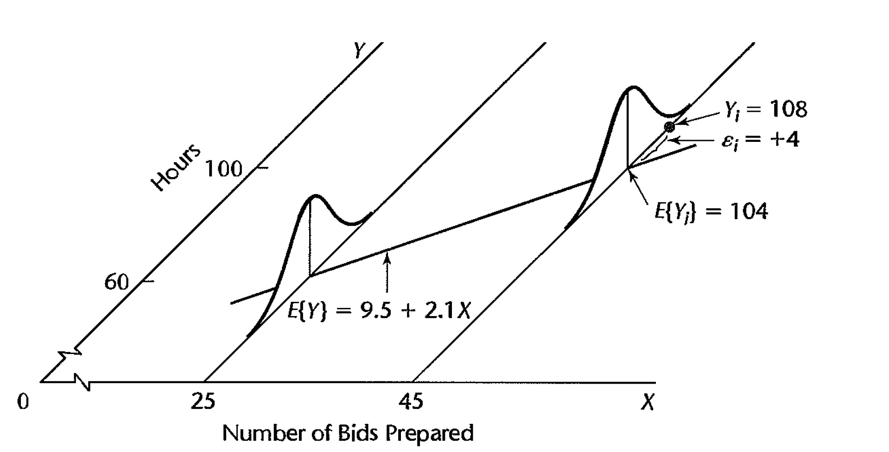

# Simple Linear Regression {#slr}


```{r, include=FALSE, eval=TRUE, echo=FALSE, warning=FALSE, message=FALSE}
knitr::opts_chunk$set(message=FALSE, warning=FALSE, 
                      fig.height=3, fig.width=5,  
                      cache=TRUE, fig.align = "center")

library(tidyverse)
library(broom)
library(ISLR)
library(ggthemes)
options(digits=3)
```


## A Linear Model

Consider the situation where we have two variables, which we denote by $x$ and $Y$; $x$ is the predictor variable, $Y$ is the response. We observe $n$ observations, as our sample, denoted by $(x_i,y_i)$.  We believe that the two variable are related, namely that $$Y=f(x)+\epsilon,$$ where $\epsilon$ is a random error which accounts for the fact that when we know the values of both $x$ and $f$, we still won't know exactly what $Y$ is.  

In the two variable case, we assume that $f(x)$ is a linear function of $x$.  That is, we assume the model $$Y_i=\beta_0+\beta_1 x_i+\epsilon_i.$$  Our attempts to estimate the function $f$ has now been reduced to trying to estimate two numbers, the intercept $\beta_0$ and the slope $\beta_1$: the *parameters*.  


Consider the following 4 models.  Note the differences between **statistics** vs. **parameters** and also between **individual observations** vs. **averages**.  Convince yourself that you know when to use each model.

\begin{eqnarray*}
E[Y_i|x_i] &=& \beta_0 + \beta_1 x_i \\
y_i &=& \beta_0 + \beta_1 x_i + \epsilon_i\\
&& \epsilon_i = y_i -  (\beta_0 + \beta_1 x_i)\\
\hat{y}_i &=& b_0 + b_1 x_i\\
y_i &=& b_0 + b_1 x_i + e_i\\
&& e_i = y_i - \hat{y}_i = y_i -  (b_0 + b_1 x_i)\\
\end{eqnarray*}


### Fitting the regression line: least squares

How do we fit a regression line?  Find $b_0$ and $b_1$ that minimize the sum of squared distance of the points to the line (called ordinary least squares):

As we discusses previously, to actually calculate $\beta_0$ and $\beta_1$ we would need to observe the entire population.  Instead, we estimate these quantities from the sample data that we have.  We are essentially trying to find the line that fits the data the best. Which can be thought of as the line that is closest to the points in some sense.  Given a particular line and a particular point, how should we think about how far the point is from that line?  The way to think about it is in terms of what we want to do with the model.  Recall that $x$ is our predictor variable, and $Y$ is the response.  In the linear regression context, the set up is usually that $x$ is something that will be known beforehand, and one of our goals will be to predict the response $Y$.  In that sense, the way we should think about a good fitting line is one where the **vertical distance from the points to the line is small**.


**Residual:** The vertical distance from a point to our line.  The $i^{th}$ residual is defined as follows: $$e_i=y_i-(b_0+b_1x_i)$$ where $b_0$ and $b_1$ are the intercept and slope of our line under consideration.  

#### Notes: {-} 
The vertical error measure is only reasonable in the predictor-response relationship. If we were interested in studying the relationship between height and shoe size, the vertical error idea doesn't really exist (because we don't think of the variables as explanatory and response - though certainly the model would approximate their linear relationship). A good fit might be based on the perpendicular distance from the point to the line.  The reason the  vertical error model isn't always ideal is because we don't always naturally consider one of the variables to be explanatory and the other to be the response.  It is true, however, that we can (and often do) model relationships between variables that don't have a natural predictor - response relationship.  That is, for all of the linear models we will cover, the error (variable) term will be measured in the vertical direction.   

Now, to find the "best" fitting line, we search for the line that has the smallest residuals in some sense.  In particular, the goal is to try to find the line that minimizes the following quantity: $$Q=\sum \epsilon_i^2 = \sum (y_i-(\beta_0+\beta_1x_i))^2.$$

**SSE:** Sum of squared errors (or residuals), a measure of how well the line fits.  SSE is then the value of $Q$ at our optimal values of $\beta_0$ and $\beta_1$ for a given dataset.  

Finding $b_0$ and $b_1$ that minimize Q then becomes a calculus problem.
$$\frac{dQ}{d\beta_0}=-2\sum (y_i-(\beta_0+\beta_1x_i)),\qquad \frac{dQ}{d\beta_1}=-2\sum
x_i(y_i-(\beta_0+\beta_1x_i))$$ Setting these equal to 0 and solving for
$\beta_0$ and $\beta_1$ yields our optimal values, which we denote as
$b_0$ and $b_1$  

**Least Squares Estimates:** $b_0$ and $b_1$ (as follows) minimize the sum of squared residuals, and are given by:
$$b_0=\bar{y}-b_1\bar{x}, \qquad b_1=\frac{\sum (x_i-\bar{x})(y_i-\bar{y})}{\sum
(x_i-\bar{x})^2}$$ (Sometimes $b_0$ and $b_1$ are referred to as $\hat{\beta}_0$ and $\hat{\beta}_1.)$  So now we can write $$SSE=\sum (y_i-(b_0+b_1x_i))^2$$ We can note what we already knew from the above discussion.  If we switch the roles of $x$ and $Y$, our best fitting line will be different.  If the relationship was actually symmetric, then switching the roles of $x$ and $Y$ should give a slope of $1/b_1$, which is not the case.  

A question you might ask is why we chose to minimize $\sum \epsilon_i^2$ as opposed to perhaps $\sum |\epsilon_i|$, where $|\cdot|$ denotes absolute value.  The original motivation was because the math is much easier in the first case, however, it can be shown that in ``nice" situations, the statistical properties are better as well.   

Consider the very good <a href = "http://www.rossmanchance.com/applets/2021/regshuffle/regshuffle.htm" target = "_blank">applet for visualizing the concept of minimizing sums of squares.</a>  Note that the applet also allows for the visualization of a line created from minimizing the sum of the absolute errors.


Keep in mind the following notation:  

\begin{eqnarray*}
E[Y_i] &=& \beta_0 + \beta_1 x_i \mbox{   true mean response}\\
\hat{y}_i &=& b_0 + b_1 x_i \mbox{   estimate of the mean response}\\
 &=& \hat{\beta}_0 + \hat{\beta}_1 x_i\\
e_i &=& y_i - \hat{y}_i\\
\epsilon_i &=& y_i - E[Y_i]\\
\end{eqnarray*}

### Variance: $\sigma^2$

If we only had one variable (e.g., credit limit), we would estimate the variability of the response variable as $$\mbox{sample variance} = \frac{SSTO}{n-1} = \frac{1}{(n-1)} \sum_{i=1}^n (y_i - \overline{y})^2,$$ where SSTO = sum of squares total.  

But here in the regression setting, we are interested in the variance of the error terms (around the line).  In particular, the variance of the observed $y_i$ around the line is given by $\sigma^2$.  We estimate $\sigma^2$ using the observed variability around the line - the residual. $$SSE = \sum_{i=1}^n (y_i - \hat{y}_i)^2 = \sum_{i=1}^n e_i^2,$$ where SSE is sum of squared errors (sometimes called sum of square residuals).  Note that we have estimated *two* parameters, so our degrees of freedom are $df = n-2$.  Our best estimate of $\sigma^2$ is Mean Squared Error (MSE): $$s^2 = MSE = \frac{SSE}{n-2} = \frac{1}{n-2} \sum_{i=1}^n (y_i - \hat{y}_i)^2.$$  MSE = mean squared error.


## Normal Errors Model

The least squares regression and previous modeling hold for any probability model.  However, inference will be easiest given a normal probability model.  Given the linear model on the *population*:
$$Y_i=\beta_0+\beta_1 x_i+\epsilon_i$$
$$\epsilon_i \stackrel{iid}{\sim} N(0, \sigma^2)$$

### Important Features of the Model with Normal Errors

1. $\epsilon_i$ is a *random& error term (that is, $\epsilon_i$ is a random variable).  
2. $Y_i$ is a random variable because of $\epsilon_i$.  
3. We assume $E[\epsilon_i]=0$, therefore $E[Y_i | x_i] = \beta_0 + \beta_1 x_i$.  (E is the expected value which can be thought of as the long run average or the population mean.)  That is, the relationship between the explanatory and response variables is **linear**.  
4. $\epsilon_i$ is the amount by which $Y_i$ values exceed or fall short of the regression line.  
5. $var\{Y_i | x_i\} = \sigma^2\{Y_i | x_i \} = \sigma^2\{\epsilon_i\} = \sigma^2 \rightarrow$ we have **constant variance** around the regression line.  
6. $\sigma\{Y_i, Y_j\} = \sigma\{\epsilon_i, \epsilon_j \} = 0 \rightarrow$ the **error terms are uncorrelated**.  
7. $\epsilon_i \sim N(0, \sigma^2)$, the error terms are **normally distributed**.  
8. $Y_i \sim N(\beta_0 + \beta_1 x_i, \sigma^2)$  


```{r fig.cap = "Figs 1.6 from @kutner.",  out.width="95%", fig.align='center', echo=FALSE, fig.alt = "An x-y plot showing a regression line with 3D normal curves at each of the predicted regression values on the line."}

```


### Technical Conditions

Though you could use the least squares regression criterion to fit a line through any observed data, the setting here has a series of conditions **which allows us to do inference on our model**.  These conditions are crucial to check whenever doing a regression, because if they are not satisfied, nothing you do with your data has any real meaning.  That is, your interpretations won't make sense, and your inference won't be valid.  Here are the conditions:  

1. **Condition of Linearity** The relationship is actually linear:$$Y_i=\beta_0+\beta_1 x_i+\epsilon_i$$ It doesn't make sense to fit a line to data if we don't believe that the relationship is linear.  The $\epsilon$ term is a random variable, thus, for two individuals measured with the same value of $x_i$, the $Y_i$ will, in general, be different.  As $Y_i$ is a
function of $\epsilon_i$, $Y_i$ is also a random variable.  

Furthermore, we are assuming that the mean of the $\epsilon_i$ are 0.  This tells us that for a fixed value of $x_i$, the average value of $Y_i$ is given as $\beta_0+\beta_1 x_i$. We write this as
$$E[Y_i | x_i] = \mu_{Y_i|x_i}=\beta_0+\beta_1 x_i$$ where $\mu$ represents the mean.  So the fitted values are the estimates of the mean of the $Y_i$ at the plugged-in value of $x_i$.  

2. **Condition of Independence** The individual observations are independent of each other.  We are assuming that our data is a random sample from the population of interest.  As a contrast to this condition, suppose we are interested in the number of pieces in a jigsaw puzzle and the time it takes to complete it.  If all our data come from one person (e.g., multiple puzzles), who happens to be very good at jigsaw puzzles.  Then our estimate of the line will be much lower than it should be, because this person will finish all the puzzles quickly, i.e. small values for $y_i$.  However, had our data been independent, then we have the chance of also getting someone who is very bad at jigsaw puzzles and things even out in some way.  

3. **Condition of Constant Variance**  The error terms, in addition to having a mean of 0, are assumed to have a variance $\sigma^2$ that does not depend on the value of $x_i$.  This is assumed because we are
looking at each point with equal importance.  Suppose that we knew that at a particular value of $x_i$, the variance of $\epsilon_i$ was 0. Then the observed value of $y_i$ is actually $\mu_y$, and
thus we should force our line to go through that point, since the true line goes through that point.  This is an extreme case, but in the case of non-constant variance, we should regard the values
observed with smaller variation with higher importance, as they will tend to be more accurate.  We denote the variance condition by $$Var(Y_i|x_i)=\sigma^2\{Y_i|x_i\}=\sigma^2.$$  

4. **Condition of a Normal Distribution**  Lastly, we assume that the distribution of the error terms is normal, a common distribution.  The reason for the normal condition is theoretic, as the techniques we will be using to say something about the $\beta_i$ based on the $\hat{\beta}_i$ and the data assumes the normal distribution, as its easy to work with.  


### Maximum Likelihood

We won't cover the details of maximum likelihood.  However, it is worth pointing out that maximum likelihood methods are used in many different areas of statistics and are quite powerful.  Additionally, in the simple linear regression case with normal errors, the maximum likelihood estimates turn out to be exactly the same as the least squares estimates.


## <i class="fas fa-lightbulb" target="_blank"></i> Reflection Questions

1. When is the condition of a linear relationship appropriate?  
2. How should we go about estimating the $\beta_i, i=0,1$?  
3. How close are our estimates to the actual population values $\beta_i, i=0,1$?  
4. Once we have the estimated function, how do we actually interpret what we have?  
5. What are the linear model conditions which are important for inference?  

## <i class="fas fa-balance-scale"></i> Ethics Considerations

1. Why does it matter if the technical conditions are violated when reporting the analysis / model?
2. Do the technical conditions matter for fitting the line?  Inference on the line?  Neither?  Both?
3. If a strong linear relationship between the predictor and response variables are found, does that mean that the predictor variables **causes** the response?

## R code: SLR

### Example: Credit Scores

Consider a dataset from ISLR on credit scores.  Because we don't know the sampling mechanism used to collect the data, we are unable to generalize the model results to a larger population.  However, we can look at the relationship between the variables and build a linear model. Notice that the `lm()` command is always of the form: `lm(response ~ explanatory)`.

The **broom** package has three important functions:

* `tidy()` reports the information which is based on each explanatory variable
* `glance()` reports the information which is based on the overall model
* `augment()` reports the information which is based on each observation


```{r}
library(tidyverse)
library(broom)
library(ISLR)
Credit %>%
  lm(Balance ~ Limit, data = .) %>%
  tidy()

Credit %>%
  lm(Balance ~ Limit, data = .) %>%
  glance()

Credit %>%
  lm(Balance ~ Limit, data = .) %>%
  augment()
```

```{r}
Credit %>%
  ggplot(aes(x = Limit, y = Balance)) + 
  geom_point() + 
  geom_smooth(method = lm, se = FALSE) +
  xlab("Credit limit (in $)") +
  ylab("Credit card balance (in $)")
```


We can assume that there is a *population* model underlying the relationship between `Limit` and **average** `Balance`.  For example, it is possible that the true (unknown) population model is:  $$ E(Balance) = -300 + 0.2 \cdot Limit.$$  Note that we consider `Balance` to be random and `Limit` to be fixed.  Also, note that in order to do inference, we should see the error terms normally distributed around the regression line with a constant variance for all values of x.  

Consider someone who has a \$5,000 `Limit` and had a credit card balance of \$1,000.  The *population error* term for that person will be: $$\epsilon_{5000 bal} = 1000 - [-300 + 0.2 \cdot 5000] =  \$700.$$

Consider someone who has a \$2,000 `Limit` and had a credit card balance of \$50.  The *population error* term for that person will be: $$\epsilon_{2000 bal} = 50 - [-300 + 0.2 \cdot 1000] =  -\$50.$$


