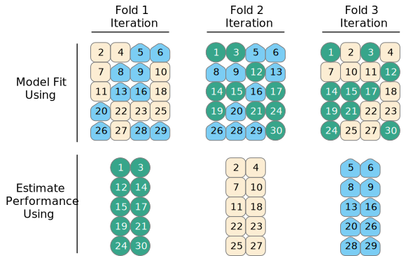

# Modeling as a Process^[Thanks to Mine Çentinkaya-Rundel for the majority of the content in this chapter.  Mine's course is at https://mine-cr.com/teaching/sta210/.] {#process}

```{r, include=FALSE, eval=TRUE, echo=FALSE, warning=FALSE, message=FALSE}
knitr::opts_chunk$set(message=FALSE, warning=FALSE, 
                      fig.height=3, fig.width=5,  
                      cache=TRUE, fig.align = "center")

library(tidyverse)
library(tidymodels)
library(gghighlight)
library(schrute)
library(broom)
library(kableExtra)
#library(boot)
library(knitr)
library(NHANES)
library(skimr)
library(patchwork)
options(digits=3)
```


## Comparing Models

So many models, so little time.  Understanding how to interpret a multiple linear regression model is only half of the modeling process.  In most real-life situations, there are many variables which can be used to predict or describe the response variable at hand.  But how to choose which combination or subset of variables is best?

Here, we'll walk through many of the big ideas surrounding the modeling building process.  In the next chapter we will consider the technical ideas behind statistical inference for modeling building.  But even when using formal inference, the ideas here should always inform the larger process and analysis conclusions.

[Leo Breiman](https://en.wikipedia.org/wiki/Leo_Breiman) was among the giants in machine learning who helped to bridge ideas in statistics and computer science.  Trained as a statistician, he spent his career at the University of California, Berkeley where he developed Classification and Regression Trees (CART), bagging, and Random Forests.  

Among his important insights was an idea that there are [two cultures](https://projecteuclid.org/journals/statistical-science/volume-16/issue-3/Statistical-Modeling--The-Two-Cultures-with-comments-and-a/10.1214/ss/1009213726.full) which can motivate (linear) modeling:

> Think of the data as being generated by a black box in which a vector of
input variables x (independent variables) go in one side, and on the other side the response variables y come out. Inside the black box, nature functions to associate the predictor variables with the response variables.

```{r fig.align='center', echo=FALSE}
knitr::include_graphics("figs/blackbox.png")
```

> 1. Data Modeling: The analysis in this culture starts with assuming a stochastic data model for the inside of the black box...The values of the parameters are estimated from the data and the model then used for information and/or prediction

> 2. Algorithmic Modeling: The analysis in this culture considers the inside of the box complex and unknown. [The] approach is to find a function f(x) — an algorithm that operates on x to predict the responses y.

Here in Chapter \@ref(process), the focus will be on algorithmic modeling and developing models which are optimally predictive of the response variable at hand.

**Spoiler:**

- In Chapter \@ref{sec:build}, the model building will use hypothesis testing and p-values.
- In Chapter \@ref{sec:shrink}, the model building will use mathematical optimization.

There isn't a right way to model.  In fact, good data analysis is **hard**.  You are building a tool box.  Make sure to notice that not every tool is the same, and you have more than just one hammer to use.  Sometimes the tools can work together to form even better models.

#### Worth a comment {-}

Notice that the R code has gotten more interesting now.  How fun!! The R code will help the process!  The R package **tidymodels** includes tools to facilitate, in particular, feature engineering and cross validation.


### Bias-variance trade-off {-}

**Excellent resource**

for explaining the bias-variance trade-off:  http://scott.fortmann-roe.com/docs/BiasVariance.html

* **Variance** refers to the amount by which $\hat{f}$ would change if we estimated it using a different training set.  Generally, the closer the model fits the data, the more variable it will be (it'll be different for each data set!).  A model with many many explanatory variables will often fit the data too closely.

* **Bias** refers to the error that is introduced by approximating the "truth" by a model which is too simple. For example, we often use linear models to describe complex relationships, but it is unlikely that any real life situation actually has a *true* linear model.  However, if the true relationship is close to linear, then the linear model will have a low bias.

Generally, the simpler the model, the lower the variance.  The more complicated the model, the lower the bias.  In this class, cross validation will be used to assess model fit.  [If time permits, Receiver Operating Characteristic (ROC) curves will also be covered.]


\begin{align}
\mbox{prediction error } = \mbox{ irreducible error } + \mbox{ bias } + \mbox{ variance}
\end{align}

* **irreducible error**  The irreducible error is the natural variability that comes with observations.  No matter how good the model is, we will never be able to predict perfectly.
* **bias**  The bias of the model represents the difference between the true model and a model which is too simple.  That is, the more complicated the model (e.g., the more variables), the closer the points are to the prediction.  As the model gets more complicated (e.g., as variables are added), the bias goes down.
* **variance**  The variance represents the variability of the model from sample to sample.  That is, a simple model (very few variables) would not change a lot from sample to sample.  The variance decreases as the model becomes more simple (e.g., variables are removed).


Note the bias-variance trade-off.  We want our prediction error to be small, so we choose a model that is medium with respect to both bias and variance.  We cannot control the irreducible error.

```{r fig.cap = "Test and training error as a function of model complexity.  Note that the error goes down monotonically only for the training data.  Be careful not to overfit!!  [@ESL]", out.width='100%', fig.align='center', echo=FALSE}
knitr::include_graphics("figs/varbias.png")
```


## Feature Engineering

For the example used to consider feature engineering, the data come from [data.world](https://data.world/anujjain7/the-office-imdb-ratings-dataset), by way of [TidyTuesday](https://github.com/rfordatascience/tidytuesday/blob/master/data/2020/2020-03-17/readme.md).  They now exist in the [**schrute** R package](https://bradlindblad.github.io/schrute/).

> Can the IMDB rating (`imdb_rating`) for The Office be predicted from the other variables in the dataset?  Which model is best?

Instead of jumping into the predictions immediately, let's look at the data itself.  What wrangling can we do to the data in order to take advantage of all the information in the variables?  We'd also like to make the model accurate and easy to communicate.

```{r echo = FALSE}
office_ratings <- read_csv("office_ratings.csv")
office_ratings
```

#### IMDB ratings {-}

```{r echo = FALSE}
ggplot(office_ratings, aes(x = imdb_rating)) +
  geom_histogram(binwidth = 0.25) +
  labs(
    title = "The Office ratings",
    x = "IMDB rating"
  )
```

#### IMDB ratings vs. number of votes {-}

```{r echo = FALSE}
office_ratings %>%
  mutate(season = as_factor(season)) %>%
  ggplot(aes(x = total_votes, y = imdb_rating, color = season)) +
  geom_jitter(alpha = 0.7) +
  labs(
    title = "The Office ratings",
    x = "Total votes",
    y = "IMDB rating",
    color = "Season"
  ) +
  theme(legend.position = c(0.9, 0.5)) +
  scale_color_viridis_d()
```

#### Outliers? {-}

```{r echo = FALSE}
ggplot(office_ratings, aes(x = total_votes, y = imdb_rating)) +
  geom_jitter() +
  gghighlight(total_votes > 4000, label_key = title) +
  labs(
    title = "The Office ratings",
    x = "Total votes",
    y = "IMDB rating"
  )
```

#### Aside... {-}

If you like the [Dinner Party](https://www.imdb.com/title/tt1031477/) episode, I highly recommend this ["oral history" of the episode](https://www.rollingstone.com/tv/tv-features/that-one-night-the-oral-history-of-the-greatest-office-episode-ever-629472/) published on Rolling Stone magazine.

#### Rating vs. air date {-}

```{r echo = FALSE}
office_ratings %>%
  mutate(season = as_factor(season)) %>%
  ggplot(aes(x = air_date, y = imdb_rating, 
             color = season, size = total_votes)) +
  geom_point() +
  labs(x = "Air date", y = "IMDB rating",
       title = "The Office Ratings") +
  scale_color_viridis_d()
```

#### IMDB ratings vs. seasons {-}

```{r echo = FALSE}
office_ratings %>%
  mutate(season = as_factor(season)) %>%
  ggplot(aes(x = season, y = imdb_rating, color = season)) +
  geom_boxplot() +
  geom_jitter() +
  guides(color = FALSE) +
  labs(
    title = "The Office ratings",
    x = "Season",
    y = "IMDB rating"
  ) +
  scale_color_viridis_d()
```

### Building a Model

If the idea is to build a model which can predict IMDB ratings, we need to have a way to see how we did (at the end).  Indeed, it is important for us to put some data in our pocket (it will be called the "test" data) which doesn't see any of the modeling process.  We'll use the test data at the end to assess whether or not our predictions are any good.

#### Train / test {-}

**Step 1:** Create an initial split:

```{r}
set.seed(123)
office_split <- initial_split(office_ratings) # prop = 3/4 by default
```

**Step 2:** Save training data

```{r}
office_train <- training(office_split)
dim(office_train)
```

**Step 3:** Save testing data

```{r}
office_test  <- testing(office_split)
dim(office_test)
```

#### Using the training data {-}

```{r}
office_train
```

### Feature engineering

-   We prefer simple models when possible, but **parsimony** does not mean sacrificing accuracy (or predictive performance) in the interest of simplicity.

-   Variables that go into the model and how they are represented are just as critical to success of the model.

-   **Feature engineering** allows us to get creative with our predictors in an effort to make them more useful for our model (to increase its predictive performance).

> **Feature engineering** is the process of transforming raw data into features (variables) that are better predictors (for the model at hand).

#### Feature engineering with dplyr {-}

We can use the **dplyr** (in **tidyverse**) and, for example, the `mutate()` function to create new variables to use in the models.

```{r echo = FALSE}
options(dplyr.print_max = 6, dplyr.print_min = 6)
```

```{r}
office_train %>%
  mutate(
    season = as_factor(season),
    month = lubridate::month(air_date),
    wday = lubridate::wday(air_date)
  )
```

> Can you identify any potential problems with this approach?

One of the problems is that with the `mutate()` approach the test and training data get formatted separately so there might be inconsistencies when the test data are predicted at the end.

```{r echo = FALSE}
options(dplyr.print_max = 10, dplyr.print_min = 10)
```

### Modeling workflow {-}

Ideally, the feature engineering happens as part of the workflow.  That is, part of the modeling process.  That way, when the training data is used to fit the model, feature engineering happens.  When the test data is used to come up with predictions, feature engineering also happens.

-   Create a **recipe** for feature engineering steps to be applied to the training data

-   Fit the model to the training data after these steps have been applied

-   Using the model estimates from the training data, predict outcomes for the test data

-   Evaluate the performance of the model on the test data

### Specifying a model

Instead of using the `lm()` command, we're going to use the **tidymodels** framework to specify a model.  In Math 158 we will *always* use "lm" as the engine, but if you take other applied statistics classes, you'll use different model specifications with the same feature engineering and modeling fitting steps.

```{r}
office_spec <- linear_reg() %>%
  set_engine("lm")

office_spec
```

### Building a recipe

The steps in building a recipe are done sequentially so that the format of each variable is as desired for the model.  As seen in Section (\@ref{sec:wflow}), the recipe steps can happen in sequence using the pipe (`%>%`) function.

However, when you work with a single pipeline, the recipe effects on the data aren't seen, which can be unsettling.  You can look at what will happen when you ultimately apply the recipe to your data by using the functions `prep()` and `bake()`.

**Note:**  Using `prep()` and `bake()` are shown here for demonstrative purposes.  They do not need to be a part of your pipeline.  I do find them assuring, however, so that I can see the effects of the recipe steps as the recipe is built.

#### Initiate a recipe {-}

```{r}
office_rec <- recipe(
  imdb_rating ~ .,    # formula
  data = office_train # data for cataloging names and types of variables
  )

office_rec
```

#### Step 1: Alter roles {-}

`title` isn't a predictor, but we might want to keep it around as an ID.

> `update_role()` alters an existing role in the recipe or assigns an initial role to variables that do not yet have a declared role.

```{r}
office_rec <- office_rec %>%
  update_role(title, new_role = "ID")

office_rec
```


```{r}
office_rec_trained <- prep(office_rec)

bake(office_rec_trained, office_train) %>%
  glimpse
```

#### Step 2: Add features {-}

New features for day of week and month.  Here, the `air_date` variable is being specified to keep separate information on both the day of week and the month information.

> `step_date()` creates a specification of a recipe step that will convert date data into one or more factor or numeric variables.

```{r}
office_rec <- office_rec %>%
  step_date(air_date, features = c("dow", "month"))

office_rec
```

```{r}
office_rec_trained <- prep(office_rec)

bake(office_rec_trained, office_train) %>%
  glimpse
```

#### Step 3: Add more features {-}

Identify holidays in `air_date`, then remove `air_date`.

> `step_holiday()` creates a specification of a recipe step that will convert date data into one or more binary indicator variables for common holidays.


```{r}
office_rec <- office_rec %>%
  step_holiday(
    air_date, 
    holidays = c("USThanksgivingDay", "USChristmasDay", "USNewYearsDay", "USIndependenceDay"), 
    keep_original_cols = FALSE
  )

office_rec
```

```{r}
office_rec_trained <- prep(office_rec)

bake(office_rec_trained, office_train) %>%
  glimpse
```

#### Step 4: Convert numbers to factors {-}

Convert `season` to factor.

> `step_num2factor()` will convert one or more numeric vectors to factors (ordered or unordered). This can be useful when categories are encoded as integers.

```{r}
office_rec <- office_rec %>%
  step_num2factor(season, levels = as.character(1:9))

office_rec
```

```{r}
office_rec_trained <- prep(office_rec)

bake(office_rec_trained, office_train) %>%
  glimpse
```

#### Step 5: Make dummy variables {-}

Convert all nominal (categorical) predictors to factors.

> `step_dummy()` creates a specification of a recipe step that will convert nominal data (e.g. character or factors) into one or more numeric binary model terms for the levels of the original data.

```{r}
office_rec <- office_rec %>%
  step_dummy(all_nominal_predictors())

office_rec
```

```{r}
office_rec_trained <- prep(office_rec)

bake(office_rec_trained, office_train) %>%
  glimpse
```

#### Step 6: Remove zero variance predictors {-}

Remove all predictors that contain only a single value.  "zero variance" means that there is no variability in the entire column, literally every value is the same.  Those variables won't ever help with prediction.

> `step_zv()` creates a specification of a recipe step that will remove variables that contain only a single value.

```{r}
office_rec <- office_rec %>%
  step_zv(all_predictors())

office_rec
```

```{r}
office_rec_trained <- prep(office_rec)

bake(office_rec_trained, office_train) %>%
  glimpse
```

#### Putting it altogether {-}

Turns out that all of the feature engineering steps can do using the pipe function (`%>%`) to concatenate the functions.


```{r}
office_rec <- recipe(imdb_rating ~ ., data = office_train) %>%
  # make title's role ID
  update_role(title, new_role = "ID") %>%
  # extract day of week and month of air_date
  step_date(air_date, features = c("dow", "month")) %>%
  # identify holidays and add indicators
  step_holiday(
    air_date, 
    holidays = c("USThanksgivingDay", "USChristmasDay", "USNewYearsDay", "USIndependenceDay"), 
    keep_original_cols = FALSE
  ) %>%
  # turn season into factor
  step_num2factor(season, levels = as.character(1:9)) %>%
  # make dummy variables
  step_dummy(all_nominal_predictors()) %>%
  # remove zero variance predictors
  step_zv(all_predictors())
```

```{r}
office_rec
```

**`step_` functions**

For more information: https://recipes.tidymodels.org/reference/index.html

```{r}
ls(pattern = '^step_', env = as.environment('package:recipes'))
```

### Building workflows


**Workflows** bring together models and recipes so that they can be easily applied to both the training and test data.


#### Specify model {-}

```{r}
office_spec <- linear_reg() %>%
  set_engine("lm")

office_spec
```

**The workflow:**  Notice that the two important parts to the workflows are the model specification and the feature engineering recipe information.

```{r}
office_wflow <- workflow() %>%
  add_model(office_spec) %>%
  add_recipe(office_rec)

office_wflow
```


#### Fit model to training data {-}

With the workflow in hand, the model can now be fit to the training data.  Although, wow... there are *so many predictors*!

```{r}
office_fit <- office_wflow %>%
  fit(data = office_train)

office_fit %>% tidy() %>% print(n = 21)
```


### Evaluate the model

#### Predictions for training data {-}

```{r}
office_train_pred <- predict(office_fit, office_train) %>%
  bind_cols(office_train %>% select(imdb_rating, title))

office_train_pred
```

### R-squared {-}

Percentage of variability in the IMDB ratings explained by the model.


```{r}
rsq(office_train_pred, truth = imdb_rating, estimate = .pred)
```


Are models with high or low $R^2$ more preferable?


#### RMSE {-}

An alternative model performance statistic: **root mean square error**.

$$RMSE = \sqrt{\frac{\sum_{i = 1}^n (y_i - \hat{y}_i)^2}{n}}$$
Note: RMSE here is computed as it would be for any type of statistics or machine learning model (i.e., how far are the typical observations from the predicted value).  The change in denominator means that the MSE with $n$ won't estimate $\sigma^2$, but it also means that the metric allows us to compare different *kinds* of models (e.g., a linear regression vs. neural network vs. random forest) on the same scale.  And yes, this MSE will decrease as the number of parameters increases which is why we use cross validation or F-tests to constrain the model.


* Are models with high or low RMSE are more preferable?
* Is this RMSE considered low or high?

```{r}
rmse(office_train_pred, truth = imdb_rating, estimate = .pred)
```

Depends...

```{r}
office_train %>%
  summarise(min = min(imdb_rating), 
            max = max(imdb_rating))
```

But, really...

*who cares about predictions on **training** data?*

### Predictions for testing data {-}

```{r}
office_test_pred <- predict(office_fit, office_test) %>%
  bind_cols(office_test %>% select(imdb_rating, title))

office_test_pred
```

#### Evaluate performance for testing data {-}

$R^2$ of model fit to **testing** data

```{r}
rsq(office_test_pred, truth = imdb_rating, estimate = .pred)
```

RMSE of model fit to **testing** data

```{r}
rmse(office_test_pred, truth = imdb_rating, estimate = .pred)
```


#### Training vs. testing {-}

```{r}
rmse_train <- rmse(office_train_pred, truth = imdb_rating, estimate = .pred) %>%
  pull(.estimate) %>%
  round(3)

rsq_train <- rsq(office_train_pred, truth = imdb_rating, estimate = .pred) %>%
  pull(.estimate) %>%
  round(3)

rmse_test <- rmse(office_test_pred, truth = imdb_rating, estimate = .pred) %>%
  pull(.estimate) %>%
  round(3)

rsq_test <- rsq(office_test_pred, truth = imdb_rating, estimate = .pred) %>%
  pull(.estimate) %>%
  round(3)
```

| metric    |          train |          test | comparison                    |
|:----------|---------------:|--------------:|:------------------------------|
| RMSE      | `r rmse_train` | `r rmse_test` | RMSE lower for training       |
| R-squared |  `r rsq_train` |  `r rsq_test` | R-squared higher for training |

#### Evaluating performance on training data {-}

-   The training set does not have the capacity to be a good arbiter of performance.

-   It is not an independent piece of information; predicting the training set can only reflect what the model already knows.

-   Suppose you give a class a test, then give them the answers, then provide the same test.
    The student scores on the second test do not accurately reflect what they know about the subject; these scores would probably be higher than their results on the first test.


## Cross Validation

Before we get into the details of cross validation, let's set up the scenario for when we need cross validation.  Recall that we use the test data to assess how the model does.  But we haven't yet thought about how to use the data to **build** a particular model.

For example, let's set up a scenario to compare two different models.  The first model doesn't use `air_date` at all but is otherwise similar to the model above.  The second model does also not use `air_date` as a variable and considers `season` as a numeric variable.

**Model 1:**
```{r}
office_rec1 <- recipe(imdb_rating ~ ., data = office_train) %>%
  update_role(title, new_role = "ID") %>%
  # delete the air_date variable
  step_rm(air_date) %>%
  step_num2factor(season, levels = as.character(1:9)) %>%
  step_dummy(all_nominal_predictors()) %>%
  step_zv(all_predictors())
```


```{r}
prep(office_rec1) %>%
bake(office_train) %>%
  glimpse()
```


**Model 2:**
```{r}
office_rec2 <- recipe(imdb_rating ~ ., data = office_train) %>%
  update_role(title, new_role = "id") %>%
  # delete the air_date variable
  step_rm(air_date) %>%
  step_dummy(all_nominal_predictors()) %>%
  step_zv(all_predictors())
```


```{r}
prep(office_rec2) %>%
bake(office_train) %>%
  glimpse()
```


#### Creating workflows {-}

Using each of the separate recipes, different workflows are set up:

**Model 1:**
```{r}
office_wflow1 <- workflow() %>%
  add_model(office_spec) %>%
  add_recipe(office_rec1)

office_wflow1
```

**Model 2:**
```{r}
office_wflow2 <- workflow() %>%
  add_model(office_spec) %>%
  add_recipe(office_rec2)

office_wflow2
```


#### Fit the models to the training data {-}


**WAIT**, not so fast!  

```{r echo = FALSE, eval = FALSE}
office_wflow1 %>%
  fit(data = office_train) %>%
  tidy()
```

```{r echo = FALSE, eval = FALSE}
office_wflow2 %>%
  fit(data = office_train) %>%
  tidy()
```


### Fit the models using cross validation

#### "Spending" the data {-}

-   We have already established that the idea of data spending where the test set was recommended for obtaining an unbiased estimate of performance.
-   However, we need to decide which model to choose *before using the test set*.
-   Typically we can't decide on *which* final model to take to the test set without making model assessments.
-   Remedy: Resampling to make model assessments on training data in a way that can generalize to new data.

#### Resampling for model assessment {-}

**Resampling is only conducted on the training set**.
The test set is not involved.
For each iteration of resampling, the data are partitioned into two subsamples:

-   The model is fit with the **analysis set**.
-   The model is evaluated with the **assessment set**.

```{r fig.cap = "Repeated samples are taken from the training data, and with each resample some of the observations are used to build a model and some observations are used to estimate the performance. Source: [@tidymodelingR]", out.width='100%', fig.align='center', echo=FALSE}
knitr::include_graphics("figs/resampling.svg")
```

Aside: the "re" in "resamples" is for repeated samples.  Not to be confused where repeated samples are taken in bootstrapping with replacement.  In cross validation, the repeated samples are taken **without** replacement.


#### Analysis and assessment sets {-}

-   Analysis set is analogous to training set.
-   Assessment set is analogous to test set.
-   The terms *analysis* and *assessment* avoids confusion with initial split of the data.
-   These data sets are mutually exclusive.

#### Cross validation {-}

More specifically, **v-fold cross validation** -- commonly used resampling technique:

-   Randomly split your **training** **data** into v partitions
-   Use 1 partition for assessment, and the remaining v-1 partitions for analysis
-   Repeat v times, updating which partition is used for assessment each time

Let's give an example where `v = 3`...

#### Cross validation, step 1 {-}

Consider the example below where the **training** **data** are randomly split into 3 partitions:

```{r fig.cap = "Splitting the data into a partition of v=3 groups. Source: [@tidymodelingR]", fig.alt = "Thirty observations are seen where three colors are used to demonstrate that the observations can be partitioned into three groups.", out.width='100%', fig.align='center', echo=FALSE}
knitr::include_graphics("figs/three-CV.svg")
```


```{r}
set.seed(345)
folds <- vfold_cv(office_train, v = 3)
folds
```

Note that the three repeated samples ("resamples") are taken without replacement from the original dataset.

#### Cross validation, steps 2 and 3 {-}

-   Use 1 partition for assessment, and the remaining v-1 partitions for analysis
-   Repeat v times, updating which partition is used for assessment each time

```{r fig.cap = "With the data split into three groups, we can see how 2/3 of the observations are used to fit the model and 1/3 of the observations are used to estimate the performance of the model. Source: [@tidymodelingR]", fig.alt = "Three iterations of model fitting are shown, each time using only 2/3 of the observations.  The remaining 1/3 of the observations are used to estimate the performance of the model.", out.width='100%', fig.align='center', echo=FALSE}

```

#### Fit resamples {-}

After the data have been split into v (here 3) resamples, they can each be fit to the two models of interest.

**Model 1:**
```{r}
set.seed(456)

office_fit_rs1 <- office_wflow1 %>%
  fit_resamples(folds)

office_fit_rs1
```


**Model 2:**
```{r}
set.seed(456)

office_fit_rs2 <- office_wflow2 %>%
  fit_resamples(folds)

office_fit_rs2
```

#### Cross validation, now what? {-}

-   We've fit a bunch of models
-   Now it's time to use them to collect metrics (e.g., R-squared, RMSE) on each model and use them to evaluate model fit and how it varies across folds

#### Collect CV metrics {-}

**Model 1:**
```{r}
collect_metrics(office_fit_rs1)
```

**Model 2:**
```{r}
collect_metrics(office_fit_rs1)
```


#### Deeper look into CV metrics {-}

**Model 1:**
```{r}
cv_metrics1 <- collect_metrics(office_fit_rs1, summarize = FALSE) 

cv_metrics1
```

**Model 2:**
```{r}
cv_metrics2 <- collect_metrics(office_fit_rs2, summarize = FALSE) 

cv_metrics2
```

#### Better tabulation of CV metrics {-}

**Model 1:**
```{r echo = FALSE}
cv_metrics1 %>%
  mutate(.estimate = round(.estimate, 3)) %>%
  pivot_wider(id_cols = id, names_from = .metric, values_from = .estimate) %>%
  kable(col.names = c("Fold", "RMSE", "R-squared"))
```

**Model 2:**
```{r echo = FALSE}
cv_metrics2 %>%
  mutate(.estimate = round(.estimate, 3)) %>%
  pivot_wider(id_cols = id, names_from = .metric, values_from = .estimate) %>%
  kable(col.names = c("Fold", "RMSE", "R-squared"))
```


#### How does RMSE compare to y? {-}

Recall that RMSE is calculated in the original units of the response variable.  

$$RMSE_{\mbox{training}} = \sqrt{\frac{\sum_{i = 1}^n (y_i - \hat{y}_i)^2}{n}}$$

The CV RMSE uses 2/3 of the observations to build the model ($\hat{y}_i$) and 1/3 of the observations to test against.  In the equation below "i" is in the 1/3. Note that $\hat{y}_{\tiny\mbox{2/3 of fold 1}, \normalsize i}$ indicates the $i^{th}$ row has been predicted using the model built on 2/3^{rds} of the observations.

$$RMSE_{\mbox{fold 1}} = \sqrt{\frac{\sum_{i \in \tiny \mbox{1/3 fold 1}} \normalsize (y_i - \hat{y}_{\tiny\mbox{2/3 of fold 1}, \normalsize i})^2}{n/3}}$$

In comparing which model is better, the CV RMSE provides information on how well the model did predicting each 1/3 hold out sample.  Indeed, the RMSE is the error (read: variability) that continues to exist even after the model is built.

We can compare the model RMSE to the original variability seen in the `imbd_rating` variable.

**Model 1:**
```{r}
cv_metrics1 %>%
  filter(.metric == "rmse") %>%
  summarise(
    min = min(.estimate),
    max = max(.estimate),
    mean = mean(.estimate),
    sd = sd(.estimate)
  )
```

**Model 2:**
```{r}
cv_metrics2 %>%
  filter(.metric == "rmse") %>%
  summarise(
    min = min(.estimate),
    max = max(.estimate),
    mean = mean(.estimate),
    sd = sd(.estimate)
  )
```


Training data IMDB score stats:

```{r}
office_ratings %>%
  summarise(
    min = min(imdb_rating),
    max = max(imdb_rating),
    mean = mean(imdb_rating),
    sd = sd(imdb_rating)
  )
```

The original variability (measured by standard deviation) of the ratings was 0.538.  After running Model 1, the remaining variability (measured by RMSE averaged over the folds) is 0.466; after running Model 2, the remaining variability (measured by RMSE averaged over the folds) is 0.52.  

**Conclusions:**

-  It seems as though the linear model does reduce the variability in the response variable (though not by much).
-  It seems as though the linear model which includes the `season` as a factor variable is a (slightly) better model than the one that uses `season` as numeric.

#### Cross validation jargon {-}

-   Referred to as v-fold or k-fold cross validation
-   Also commonly abbreviated as CV

#### Cross validation, redux {-}

-   To illustrate how CV works, we used `v = 3`:

  -   Analysis sets are 2/3 of the training set
  -   Each assessment set is a distinct 1/3
  -   The final resampling estimate of performance averages each of the 3 replicates

-   It was useful for illustrative purposes, but `v = 3` is a poor choice in practice

-   Values of `v` are most often 5 or 10; we generally prefer 10-fold cross-validation as a default

## Final model assessment

Now that Model 1 has been chosen as the better model, the test data is **finally** brought in to measure how well Model 1 will predict data in the wild (not that there are any additional wild episodes of The Office, but...).

**Model 1:**
```{r}
office_preds1 <- office_wflow1 %>%
  fit(data = office_train) %>%
  predict(office_test) %>%
  bind_cols(office_test %>% select(imdb_rating, title)) 

office_preds1 %>%
  rsq(truth = imdb_rating, estimate = .pred)
office_preds1 %>%
  rmse(truth = imdb_rating, estimate = .pred)
```

The $R^2$ on the test data is 0.562  (56.2% of the variability in the `imdb_rating` of the test data is explained by the model from the training data).  Additionally, the test RMSE is 0.415. As expected, the RMSE is lower for training than test; the $R^2$ is higher for training than test.
  
## <i class="fas fa-lightbulb" target="_blank"></i> Reflection Questions

1. What are the steps of the workflow / pipeline?  
2. What are the types of feature engineering that can be done with the `step_` functions? 
3. What is the different between model building and model assessment?
4. In the examples, was cross validation used for model building or model assessment?


## <i class="fas fa-balance-scale"></i> Ethics Considerations

1. Why is it important to use different parts of the dataset to do the two different tasks of model building and model assessment? 
2. How does cross validation help to keep the model from overfitting the data at hand? 


## R: Full pipeline with CV + assessment

Using the same example as above, the process has been synthesized into the essential aspects / code.

### The data

Break the data into test and training sets.

```{r}
set.seed(123)
office_split <- initial_split(office_ratings) # prop = 3/4 by default
office_train <- training(office_split)
office_test  <- testing(office_split)
```


### The model / enigne

Tell the computer to run linear regression using the `lm()` function.

```{r}
office_spec <- linear_reg() %>%
  set_engine("lm")
```

### The recipe(s)

Set the variables of interest (in the formula) and perform any necessary feature engineering.

```{r}
office_rec1 <- recipe(imdb_rating ~ ., data = office_train) %>%
  update_role(title, new_role = "id") %>%
  step_rm(air_date) %>%
  step_num2factor(season, levels = as.character(1:9)) %>%
  step_dummy(all_nominal_predictors()) %>%
  step_zv(all_predictors())

office_rec2 <- recipe(imdb_rating ~ ., data = office_train) %>%
  update_role(title, new_role = "id") %>%
  step_rm(air_date) %>%
  step_dummy(all_nominal_predictors()) %>%
  step_zv(all_predictors())
```


### The workflow(s)

```{r}
office_wflow1 <- workflow() %>%
  add_model(office_spec) %>%
  add_recipe(office_rec1)

office_wflow2 <- workflow() %>%
  add_model(office_spec) %>%
  add_recipe(office_rec2)
```


### Choice:  fit the model? cross validate to decide between models?

#### Fit the model {-}

```{r}
office_fit <- office_wflow %>%
  fit(data = office_train)
```

The fit object is the same as the output of `lm()` that you are used to working with:
```{r}
office_fit %>% tidy()

office_fit %>% glance()
```

#### Cross validate to choose between models {-}

If cross validating, the model needs to be fit separately on each one of the hold out folds of the CV model.  Here, `v=5` is used, different from above where `v=3` was used to simplify the explanation.  Typically, the number of folds is 5 or 10.

Note that the objects are now similar to what you've worked with previously (output of `lm()`), but they contain a separate fit (i.e., linear model) for each of the CV folds.

```{r}
set.seed(47)
folds <- vfold_cv(office_train, v = 5)

office_fit_rs1 <- office_wflow1 %>%
  fit_resamples(folds)

office_fit_rs2 <- office_wflow2 %>%
  fit_resamples(folds)
```

### Assess the fit

#### On the test data {-}

Note that we'd only assess the fit to the test data if we are done with the model building process and we've chosen the model we want to move forward with.

Again, $R^2$ and RMSE are both calculated in a general sense (i.e., RMSE uses $n$ in the denominator, not $n-p$, I agree, it is confusing!).

If the first few lines don't make sense, run the pieces.  That is, run `predict(office_fit, office_test)` and then run `office_test %>% select(imdb_rating, title)` and then think about what it would mean to **bind** those columns together.

```{r}
office_test_pred <- predict(office_fit, office_test) %>%
  bind_cols(office_test %>% select(imdb_rating, title))

rsq(office_test_pred, truth = imdb_rating, estimate = .pred)

rmse(office_test_pred, truth = imdb_rating, estimate = .pred)
```

#### On the CV folds {-}

Note the difference in the information.  If you want the values per fold, don't summarize.  If you want the overall information, do summarize.

```{r}
office_fit_rs1 %>% collect_metrics()
office_fit_rs2 %>% collect_metrics()

office_fit_rs1 %>% collect_metrics(summarize = FALSE)
office_fit_rs2 %>% collect_metrics(summarize = FALSE)
```

Note that the variables in Model 1 perform better using cross validation than the variables in Model 2, we choose Model 1 to report out:

```{r}
office_test_pred_1 <- office_wflow1 %>%
  fit(office_train) %>%
  predict(office_test) %>%
  bind_cols(office_test %>% select(imdb_rating, title))

rsq(office_test_pred_1, truth = imdb_rating, estimate = .pred)

rmse(office_test_pred_1, truth = imdb_rating, estimate = .pred)
```


