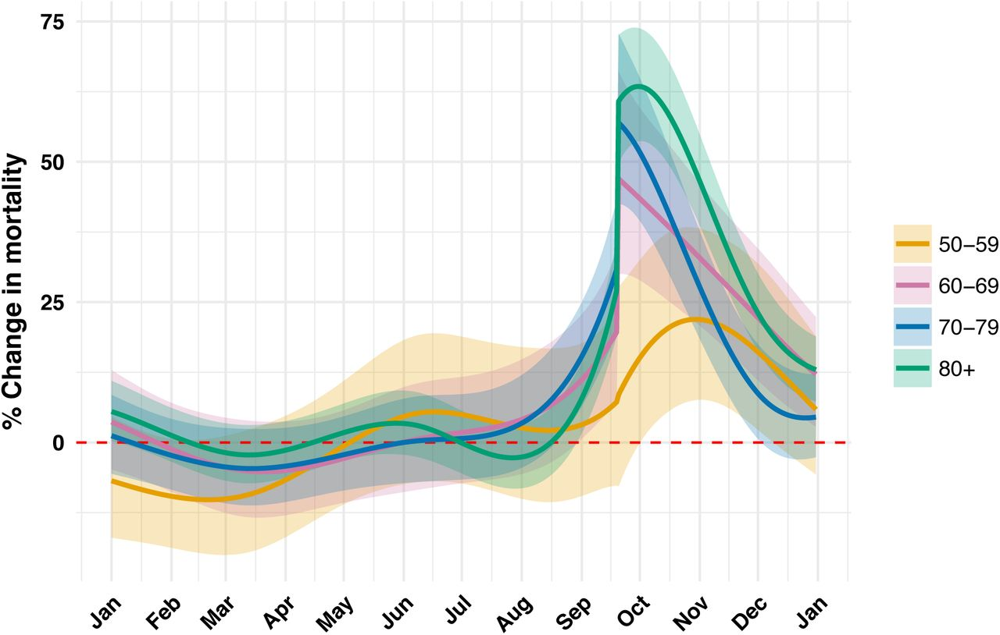
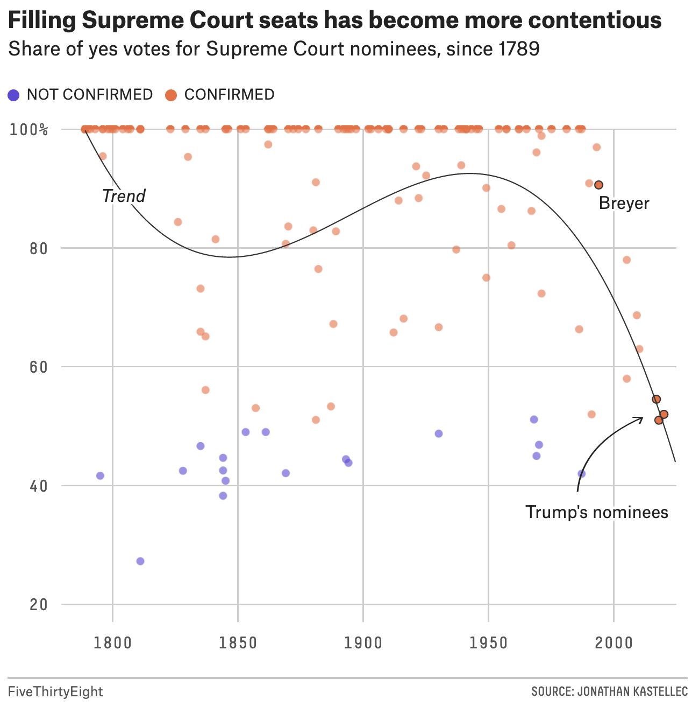
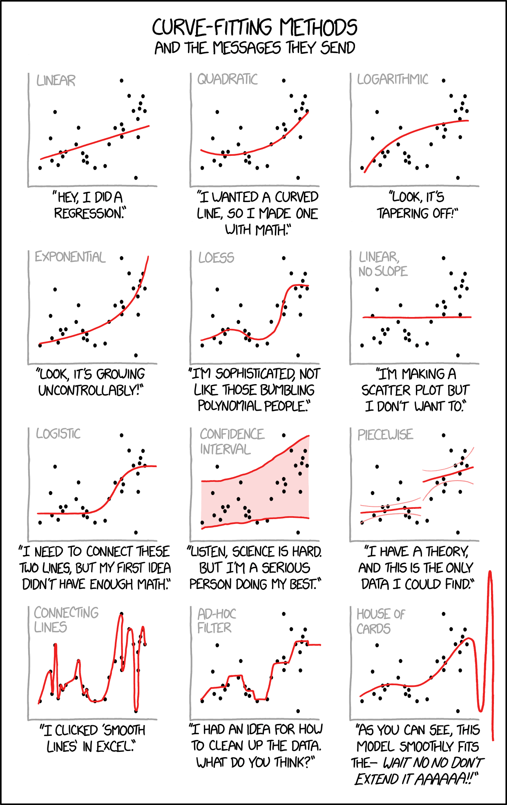
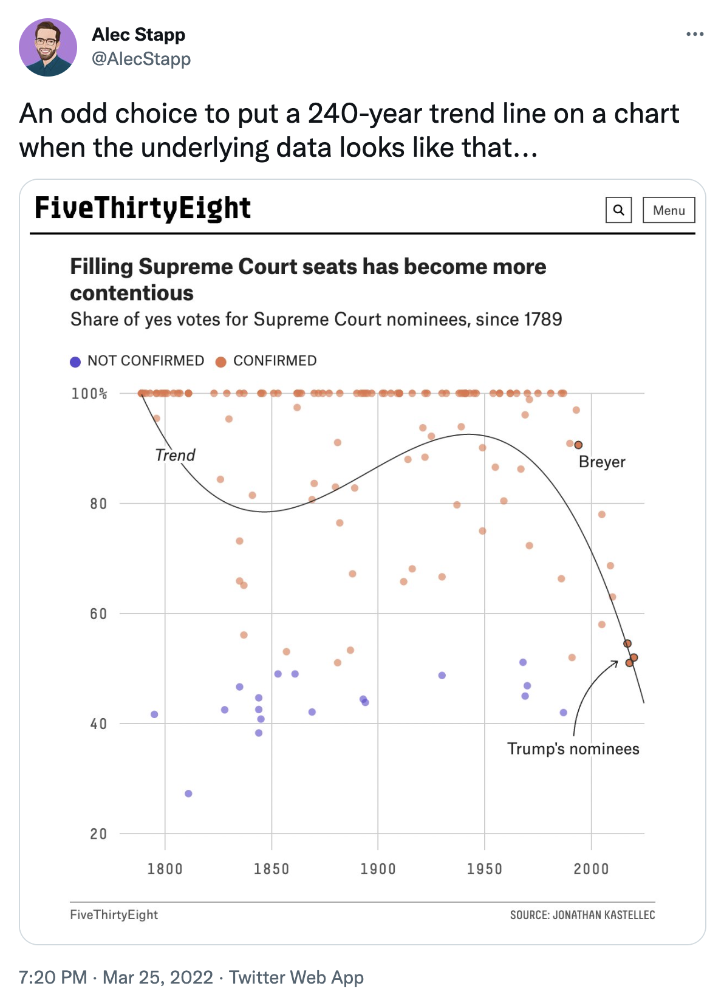
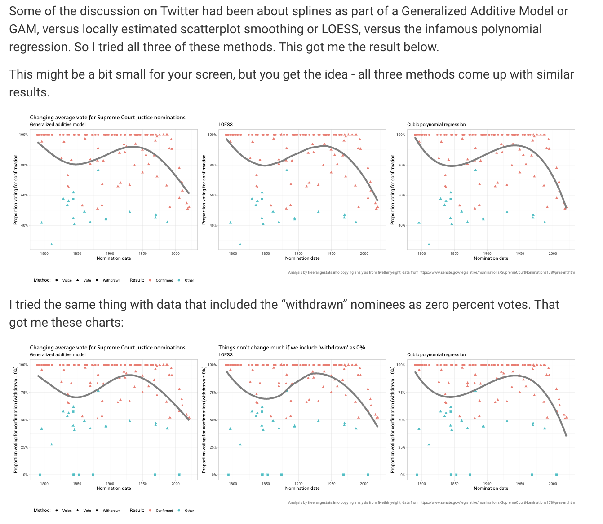

# Smoothing Methods {#smooth}

```{r, include=FALSE, eval=TRUE, echo=FALSE, warning=FALSE, message=FALSE}
knitr::opts_chunk$set(message=FALSE, warning=FALSE, 
                      fig.height=3, fig.width=5,  
                      cache=TRUE, fig.align = "center")

library(tidyverse)
library(tidymodels)
library(palmerpenguins)
library(caret)
library(lubridate)
library(broom)
```


```{r eval = FALSE, echo = FALSE}
look here: \url{https://www.encyclopediaofmath.org/index.php/Nonparametric_regression_using_kernel_and_spline_methods}

\starthere{3/26/2018}

\paragraph{Agenda}
\begin{enumerate}
  \itemsep0em
  \item step functions
  \item polynomial regression
\end{enumerate}
```


There are different names for the smoothing functions:  smoothers, loess, lowest (locally weighted scatterplot smoothing).  They are all slightly different, and we will investigate some of the nuanced differences.  Note, however, the goal is to fit a model on $X$ that predicts $E[Y | X]$ which is not necessarily linear in $X$.  So far in the course, every model fit has been *linear* in the parameters (of said differently, the expected response is a linear function of the explanatory variables, which are sometimes transformed).

$$E[Y | X] = \beta_0 + \beta_1 X_1 + \beta_2 X_2 + \cdots + \beta_{p-1} X_{p-1} = f(X)$$

With ridge regression and lasso we were able to improve the model by making it simpler, but it was still linear.  Linear models can only go so far, because not all relationships are linear!

We've talked about transformations, and relatedly, polynomial regression.  That is, by including powers of the original variable ($X$, $X^2$, $X^3$, etc.), the model can better fit the data.

## Step functions

> **Step functions** cut the range of a variable into K distinct regions in order to produce a qualitative variable. This has the effect of fitting a piecewise constant function.

A similar idea to to polynomial regression is to fit step functions to the data.  That is, to fit a flat line for different sets of values of a given explanatory variable.  Note that the flat lines don't have any requirement that they be monotonically increasing.  (Just like the polynomial fit allows for many different increasing or decreasing trends.)

Consider the following cutpoints which partition the range of $X$:  $c_1 < c_2 < \cdots < c_K$, and create $K+1$ new variables:

\begin{eqnarray*}
C_0(X) &=& I(X < c_1)\\
C_1(X) &=& I(c_1 \leq X < c_2)\\
C_2(X) &=& I(c_2 \leq X < c_3)\\
&\vdots&\\
C_{K-1}(X) &=& I(c_{K-1} \leq X < c_K)\\
C_K(X) &=& I(c_K \leq X)
\end{eqnarray*}

where $I(\cdot)$ is the indicator function which returns a 1 if the condition is true and 0 otherwise.  Note that $C_0(X) + C_1(X) + \cdots + C_K(X) =1$, so only $K$ predictors should be used in the model.  That is:

$$E[Y_i | X_i] = \beta_0 + \beta_1 C_1(X_i) + \beta_2 C_2(X_i )+ \cdots + \beta_K C_K(X_i) $$


Note that at most one of the $C_k$ are non-zero. $\beta_0$ can be interpreted as the mean value of $Y$ given that $X < c_1$.  In contrast, the mean value of$Y$  $c_j \leq X < c_{j+1}$ is $\beta_0 + \beta_j$.  Therefore, $\beta_j$ is interpreted as the difference in expected response for $X$ in $c_j \leq X < c_{j+1}$  as compared to $X < c_1$.


Any of the $K$ step functions can be used to create the step function as a model on $X$.  However, it should be noted that using $C_1, \ldots C_K$ is more intuitive than any other set of $K$ indicator functions.  Why is that?  Consider the following functions and related models:

\begin{eqnarray*} 
C_0(X) &=& 1 \mbox{ if } X < 4\\
C_1(X) &=& 1 \mbox{ if } 4 <= X < 10\\
C_2(X) &=& 1 \mbox{ if } 10 <= X < 50\\
C_3(X) &=& 1 \mbox{ if } 50 <= X
\end{eqnarray*}

Valid models can be built with any 3 of the above basis functions:
 
\begin{eqnarray*}
\mbox{model1:  } E[Y|X] &=& \beta_0 + \beta_1 C_1(X) + \beta_2 C_2(X) + \beta_3 C_3(X)\\
\mbox{model2: }  E[Y|X] &=& \beta_0^* + \beta_1^* C_0(X) + \beta_2^* C_1(X) + \beta_3^* C_2(X) \\
\end{eqnarray*}
n.b.  The $*$ indicates that the coefficients will differ across the two models.

Given the two different models (which lead to the exact same prediction models!), note the following:

\begin{eqnarray*}
\mbox{model1:  } E[Y| X=0] &=& \beta_0\\
\mbox{model2:  } E[Y | X=0] &=& \beta_0^* + \beta_1^*\\
\mbox{model2: }  E[Y | X=100] &=& \beta_0^*
\end{eqnarray*}
Which is to say, it is more **intuitive** to have the intercept value match with X=0.  But the intercept is given when the **basis functions** equal zero (not necessarily when the X value equals zero).


### Basis Functions

Polynomial and piece-wise-constant regression models are both special cases of a **basis function** approach to modeling.  The idea is that instead of regressing on a series of different $X$ values, you can regress on different functions of $X$.  We've seen this already in the form of transformations on $X$.  The basis function model is:

$$E[Y_i | X_i] = \beta_0 + \beta_1 bf_1(X_i) + \beta_2 bf_2(X_i) + \cdots + \beta_K bf_K(X_i).$$


*Remember that there are no assumptions made about the explanatory variables when running the OLS model.*  Which is to say that functions of $X$ cause no problem in the model as long as the variables are not collinear.  Note that with polynomial regression, the basis functions are: $bf_j(X_i) = X_i^j$.  When applying step functions to the model, the basis functions are $bf_j(X_i) = I(c_j \leq X_i < c_{j+1})$.  The basis function model above can be fit using standard OLS techniques.

One of the big advantages to using OLS with basis functions is that we get to bring along all of the inference tools we covered in the first part of the course.  That is, we have estimates for the standard errors of the coefficients as well as an ability to compute p-values associated with nested F-tests.  The 2*SE bounds on the estimated curves are from the appropriate errors given by the `predict()` function on the basis function model(s).

```{r echo = FALSE, eval = FALSE}
\starthere{3/26/2018}

\paragraph{Agenda}
\begin{enumerate}
  \itemsep0em
  \item regression splines
  \item knots
  \item R example
\end{enumerate}
```

## Regression splines

> **Regression splines** (also called smoothing splines) are more flexible than polynomials and step functions, and in fact are an extension of the two. They involve dividing the range of X into K distinct regions. Within each region, a polynomial function is fit to the data. However, these polynomials are constrained so that they join smoothly at the region boundaries, or knots. Provided that the interval is divided into enough regions, this can produce an extremely flexible fit.


By combining the ideas of polynomial fits and step functions, we can create a model which fits locally but is not required to be a horizontal line.  In particular, if cubic functions are fit to each region, the model ends up as something like:

\begin{eqnarray}
E[Y_i | X_i] =
\begin{cases}
\beta_{01} + \beta_{11} X_i + \beta_{21} X_i^2 + \beta_{31}X_i^3  \mbox{  if  } X_i < c\\
\beta_{02} + \beta_{12} X_i + \beta_{22} X_i^2 + \beta_{32}X_i^3  \mbox{  if  } X_i \geq c
\end{cases}
\end{eqnarray}


**Notes:**  

* Any polynomial can be fit (step functions are polynomials of degree 0!) 
* The fit is independent of any normality or independence assumptions.  However, those assumptions are important in order to perform inference. 
* If $f(X)$ isn't linear or polynomial in X, the model can be fit *locally*.  Note:  every function can be written as a sum of polynomials. 
* Keep in mind that splines computed from truncated polynomials can be numerically unstable because the explanatory variables may be highly correlated.


Note, however, that the cubic model in the equation above has no requirement of continuity at the value $c$.  The solution is to fit a piece-wise polynomial under the constraint that the fitted curve must be continuous.   Additionally, in order for the curves to seem smooth} the constraint that both the first and second derivatives are also continuous is added.  Generally, for a degree-$d$ spline:  fit degree-$d$ polynomials with continuity in derivatives up to degree $d-1$ at each knot.

One method for fitting continuous cubic models to a partitioned $X$ variable is to create the following function $h(X, \xi)$ at each knot $\xi$.

\begin{eqnarray*}
h(X, \xi) = (X - \xi)^3_+ =
\begin{cases}
(X-\xi)^3 & \mbox{  if  } X > \xi\\
0 & \mbox{  otherwise}
\end{cases}
\end{eqnarray*}
The following cubic spline with $K$ knots is then modeled as
\begin{eqnarray}
E[Y_i | X_i] = \beta_0 + \beta_1 X_i + \beta_2 X_i^2 + \beta_3 X_i^3 + \beta_4 h(X_i, \xi_1) + \beta_5 h(X_i, \xi_2) + \cdots + \beta_{K+3} h(X_i, \xi_K). 
\end{eqnarray}
Note that there are $K+3$ predictors and $K+4$ regression coefficients to model.  We are using up $K+4$ degrees of freedom.


A little bit of work can show that the spline equation will lead to continuity in the first two derivatives and discontinuity in the third derivative (with a continuous function).  Proof ideas:


* for the continuity, consider only one knot.  As $X$ approaches $\xi$ from the left, we follow the function without the $h$ part of the function.  As $X$ approaches $\xi$ from the right, we get arbitrarily close to the function without any $h$.

Consider what happens for points before the second knot.  That is, $X \leq \xi_2$:
\begin{eqnarray*}
(X - \xi_1)^3 &=& X^3 - 3X^2 \xi_1 + 3X \xi_1^2 - \xi_1^3\\
E[Y | \xi_1 < X \leq \xi_2] &=& (\beta_0 - \beta_4 \xi_1^3) + (\beta_1 + \beta_4 3 \xi_1^2)X + (\beta_2 - \beta_4 3 \xi_1)X^2 + (\beta_3 + \beta_4)X^3\\
E[Y | X \leq \xi_1] &=& \beta_0  + \beta_1X + \beta_2X^2 + \beta_3 X^3\\
lim_{X \rightarrow \xi_1^-} E[Y|X] &=& \beta_0  + \beta_1 \xi_1 + \beta_2\xi_1^2 + \beta_3 \xi_1^3\\
lim_{X \rightarrow \xi_1^+} E[Y|X] &=& \beta_0  - \beta_4 \xi_1^3 + \beta_1 \xi_1 + \beta_4 3 \xi_1^3 + \beta_2\xi_1^2 - \beta_4 3 \xi_1^3 + \beta_3 \xi_1^3 + \beta_4\xi_1^3\\
&=&  \beta_0  + \beta_1 \xi_1 + \beta_2\xi_1^2 + \beta_3 \xi_1^3\\
\end{eqnarray*}


* for the continuity in the derivatives, recall that the derivatives are with respect to $X$.  By taking the derivatives of $E[Y_i]$ and then the limit as $X \rightarrow \xi$, the continuity of the first few derivatives and discontinuity of later derivatives can be seen.


#### Knots {-}

Knots can be placed uniformly or at places where the function is expected to change rapidly.   Most often the number of knots is set and the software places them uniformly.  The number of knots is directly related to the degrees of freedom of the model, so setting the degrees of freedom also sets the number of knots.  Ideally, a method such as dross validation will be used to optimize the number of knots.

#### degrees of freedom {-}

Note that we can fit the model based on placing the knots or based on the number of knots (specified by degrees of freedom which places `df-1` internal knots). The number of knots will be `df-1`. 

```{r echo = FALSE, eval = FALSE}
\starthere{4/2/2018}

\paragraph{Agenda}
\begin{enumerate}
  \itemsep0em
  \item local regression
  \item weight functions
  \item R example
\end{enumerate}
```

## Local regression

> **Local regression** is similar to splines, but differs in an important way. The regions are allowed to overlap, and indeed they do so in a very smooth way.


Local regression (loess - locally weighted scatterplot smoothing) models fit flexible, non-linear models to a point $x_0$ using only training values that are close to $x_0$.  The distance of the training point from $x_0$ is considered to be a weight and is given by $K_{i0}$.   We fit weighted least squares regression using the weights from the $X$-direction.  The algorithm for local regression is given by (section 7.6, @ISL):

******  
**Local Regression at $X=x_0$ ($p=2$)**  

******  
1. Gather the fraction $s=k/n$ of training points whose $X_i$ are closest to $x_0$. 
2. Assign a weight $K_{i0} = K(X_i, x_0)$ to each point in the neighborhood, so that the furthest point from $x_0$ has weight zero and the closest point has the highest weight.  All but the $k$ closest points get zero weight. 
3. Fit a weighted least squares regression of the $Y_i$ on the $X_i$ using the $K_{i0}$ weights.  Find $b_0$ and $b_1$ that minimize: 
$$\sum_{i=1}^n K_{i0}(Y_i - b_0 - b_1 X_i)^2.$$
4. The fitted value at $x_0$ is given by $\hat{f}(x_0) = b_0 + b_1x_0$. 
5.  Repeat steps 1. - 4. for every point; the coefficients & SE are re-computed each time.

To create the smooth regression function, the points are connected by drawing a line (or surface) between each predicted value.  The fraction of points with non-zero weights is given by the *span*, $s=k/n$.  The span plays a role similar to other tuning parameters.  It can be made to produce a model similar to OLS (large span) or to produce a model which way over-fits the data (small span).  Cross validation can be used to find $s$.


Local Regression can theoretically be expanded to higher dimensions.  Weighted least squares (see section 11.1 in @kutner) is given by minimizing:

$$\sum_{i=1}^n w_i(Y_i - \beta_0 - \beta_1X_{i1} - \cdots - \beta_{p-1}X_{i,p-1})^2.$$

The normal equations are solved in the same way given coefficient estimates and standard errors as ($W$ is the diagonal matrix of weights):
\begin{eqnarray*}
(X^t W X) b_w &=& X^t W Y\\
b_w &=& (X^t W X)^{-1} X^t W Y\\
var(b_w) &=& \sigma^2 (X^t W X)^{-1} (X^t W W X) (X^t W X)^{-1}
\end{eqnarray*}


However, in high dimensional settings the *distance* to $x_0$ might be quite large, and there will be very few points in a high dimensional neighborhood of $x_0$.  The distance problem leads to most points have zero weight (i.e., large distance) from the other points.  And the regression estimates become quite variable and hard to estimate.

### Weight function for local regression

The standard weight function used in local regression is called the *tricubic weight function*.


* For $s < 1$, the neighborhood includes proportion $s$ of the points, and these have tricubic weighting

$$K_{i0}  = \Bigg(1 - \bigg(\frac{d(x_i, x_0)}{\max_{i \in S} d(x_i, x_0)} \bigg)^3 \Bigg)^3 I(d(x_i, x_0) < \max_{i \in S} d(x_i, x_0))$$
where $S$ defines the set of $x_i$ values which are the $k$ closest points to $x_0$.

* For $s > 1$, all points are used, with the "maximum distance" (as above) assumed to be $s^{(1/(p-1))}$ times the actual maximum distance for $p$ coefficients ($p-1$ explanatory variables). 
* Distance can be defined using any distance function, Euclidean being the default although not resistant to outliers. 
* Regression is done by least squares (default) although other regression techniques can be used (e.g., Tukey's biweight M-estimation regression...  we won't talk about that in class).
* The `loess()` function in R does the modeling / prediction.  In **ggplot2** the default method for `geom_smooth()` plot uses `loess`.

```{r eval = FALSE, echo = FALSE}
\starthere{4/4/2018}

\paragraph{Agenda}
\begin{enumerate}
  \itemsep0em
  \item Imputation
  \item Normalization
  \item inference, modeling thoughts
\end{enumerate}
```

### Imputation

Imputation is the process of replacing missing data with summary values (i.e., statistics) from the rest of the data.   The biggest reason to impute data is so that the complete dataset can be used for an analysis.   Notice that within the context of the models throughout the semester, it might make sense to smooth $Y$ on some of the explanatory variables (if $Y$ is missing for some observations), but it also might make sense to smooth $X_1$ on the other explanatory variables (if $X_1$ is missing and should be used in the linear model).  

Keep in mind that the algorithm for creating a smooth prediction at $x_0$ does not depend on $x_0$ being part of the model.  That is, the prediction is possible whether or not $x_0$ has a corresponding response value.

See the R code (posted on website) for an example on imputing data using a loess smoother.


### Normalization

Microarrays and other high-throughput analysis techniques require normalization in order to create apples to apples comparisons.  From Wikipedia, https://en.wikipedia.org/wiki/Microarray_analysis_techniques

> Comparing two different arrays, or two different samples hybridized to the same array generally involves making adjustments for systematic errors introduced by differences in procedures and dye intensity effects. Dye normalization for two color arrays is often achieved by local regression. LIMMA provides a set of tools for background correction and scaling, as well as an option to average on-slide duplicate spots.[8] A common method for evaluating how well normalized an array is, is to plot an MA plot of the data.


```{r fig.align='center', echo=FALSE, fig.cap = "The microarray shows differing amounts of expression across two conditions (here old and young yeast).  The expectation is that, on median, the dots (i.e., genes) should be yellow.   As can be seen from the image, points on the left side of the microarray are dimmer than the points on the right side.  The imbalance is an artifact of the technical limitations of the technique.  Image due to Laura Hoopes, Pomona College.", fig.alt = "Image is a grid of red, yellow, and green dots.  Each dot represents a gene, and the color or fluorescence estimates the amount of gene activity.", out.width="75%"}
knitr::include_graphics("figs/LH_microarray.jpg")
```

```{r fig.align='center', echo=FALSE, fig.cap = "[left] M = ratio of expression, A = product of expression (total amount of expression).  The different smooth curves refer to different locations on the microarray chip.  To normalize, we subtract the line from each corresponding dot which can be thought of as taking the colored lines and pulling them taut. [right] By centering each array's expression values to zero (either across the location on the chip 'print-tip group' or within an array itself), we can do an apples to apples comparison of the expression across different samples.", fig.alt = "The left image shows a scatter plot with total expression on the x-axis and relative expression on the y-axis.  Loess smoothed curves are superimposed to show technical artifacts.  The right image shows how the expression values are distributed after they have been standardized by subtracting the associated loess curve.", fig.show='hold', out.width="47%"}
knitr::include_graphics(c("figs/19MA.jpg", "figs/nolow_array_norm.jpg"))
```


### Prediction

After Hurricane Maria devastated Puerto Rico in September 2017, there was much discussion on how to count the resulting number of deaths.  Rolando Acosta and Rafael Irizzary use loess models to predict excess deaths in <a href = "https://www.biorxiv.org/content/10.1101/407874v2.full" target = "_blank">Post-Hurricane Vital Statistics Expose Fragility of Puerto Rico’s Health System.</a>


```{r fig.align='center', echo=FALSE, fig.cap = "Increase in death rate as a function of date.  Note the y-axis which is observed rate minus expected rate (found by using a trend line given by loess broken down by age group).", fig.alt = "Four loess curves which show a spike in mortality in September 2017 as compared to mortality both before and after the hurricane.", out.width="75%"}

```


## Last Thoughts...

### Why smooth?

#### Advantages of smoothing {-}

* Smoothing methods do not require a known functional relationship between $X$ and $Y$. 
   - Regression splines does provide a functional model 
   - loess does not provide a functional model 
* The relationships are easy to fit 
* and they retain many of the advantages of weighted least squares (including confidence estimates for the predicted values). 


#### Disadvantages of smoothing {-}

* Local regression can be computationally intensive, with methods giving unstable estimates in high dimensions due to sparsity of points. 
* Regression splines have arbitrary knots which may not fit the model well. 
* Although interpolation can be used (and is used in R!) to get predictions (with standard errors), there is no functional form for the relationship between $X$ and $Y$ with loess.  Inference on coefficients is meaningless. 

## Inference

Keep in mind that in order to have a p-value (which is a probability), there must be a probability model.   OLS assumes normal errors, and if basis functions or weighted OLS are applied using standard linear model techniques, then there should be some notion that there is an *iid* normal error structure.  Confidence intervals also require a probability model in order to apply the standard inferential interpretations.

In particular, the wind temperature observations are *not* independent.  There is a strong dependency between the temperature on any two consecutive days.  The data are much better described by an autoregressive model if the goal of inference.  (Autoregression is used, e.g., when the x-variable is time and the observations are correlated.  The y-variable could be stock price or temperature.  We haven't talked about these types of models in any formal way.)  If the goal is more descriptive (or simply predictive for reasons such as normalization or extrapolation), then SE values and CI bounds are not needed, and a smooth curve will probably be effective even if the technical conditions do not hold.


#### Don't Forget {-}
There is no substitute for thinking carefully about how you are modeling relationships.  Whether it be linear, non-linear, sparse, locally weighted, or optimized.   There will not be a model which is the *one* right model.  Instead, your expertise and practice will provide you with strategies to help come up with a model that describes your data well.


For more on kernel smoothers, see the appendix of @sheather and chapter 6 of @ESL.

## <i class="fas fa-lightbulb" target="_blank"></i> Reflection Questions

1. How are the different types of flexible models represented in linear model form?  (Step functions, polynomials, regression splines, local regression) 
2. How are inferential methods applied to the models above?  What are the necessary technical assumptions to make inferential claims? 
3. What is a basis function?  How is it used similarly / differently in step functions, polynomials, and regression splines? 
4. In regression splines, how does the number of knots play a role?  How do the different choice for the number of knots change the resulting model?  Why would you choose to fit a model that had more or fewer knots? 
5.  For local regression, how do the weights play a role?  What different choices could be made with respect to the weight functions? 
6.  For local regression, how does the span play a role?  How do the different choices for the span change the resulting model?  Why would you choose to fit a model that had more or fewer knots? 
7. If inference claims are not accessible, what else can smoothing techniques be used for? 


## <i class="fas fa-balance-scale"></i> Ethics Considerations

The information presented here comes from a March 2022 blog by Peter Ellis on <a href = "http://freerangestats.info/" target = "_blank">free range statistics</a> called <a href = "http://freerangestats.info/blog/2022/03/26/supreme-court-nominations" target = "_blank">Smoothing charts of Supreme Court Justice nomination results</a>.  But I'll back up a minute to provide some context.

###  538 politics blog {-}

538 did a story describing how it is <a href = "https://fivethirtyeight.com/features/its-harder-than-ever-to-confirm-a-supreme-court-justice/" target = "_blank">harder than ever to confirm a supreme court justice.</a>

```{r fig.align='center', echo=FALSE, fig.cap = "Image credit: https://fivethirtyeight.com/features/its-harder-than-ever-to-confirm-a-supreme-court-justice/", fig.alt = "A scatterplot of the number of Senate votes each supreme court justice has gotten, over time.  The vast majority of candidates have been confirmed.  However, we can see that in the past most candidates got 100% of the vote, in the last 30-40 years, the votes have been more mixed.  A loess smooth gives a sense of the average number of Senate votes over time."}

```

###  Modeling {-}

As we know from a semester together, there are many ways to model an x-y relationship.

```{r fig.align='center', echo=FALSE, fig.cap = "Image credit: https://xkcd.com/2048/", fig.alt = "The same set of 31 points is plotted on 12 different scatterpots.  On each scatterplot a different model fit is given in red.  Some of the models are linear, quadratic, exponential, loess, piecewise, and connect the dots."}

```

### Twitter {-}

People on twitter get worked up about things.  The gist of their complaints is that we shouldn't be modeling future votes based on historical trends.

```{r fig.align='center', echo=FALSE, fig.cap = "Image credit: https://twitter.com/AlecStapp/status/1507542987563323393", fig.alt = "@AlecStapp on Twitter complaining about a loess smooth to describe the trend of average number of Senate votes across time."}

```

Five Thirty Eight said that <a href = "https://twitter.com/FiveThirtyEight/status/1488874422337482755" target = "_blank">"Supreme Court confirmations are increasingly likely to resemble party-line votes."</a>  Is that a prediction or not?

```{r fig.align='center', echo=FALSE, fig.cap = "Image credit:https://twitter.com/FiveThirtyEight/status/1488874422337482755", fig.alt = "A tweet from Febuary 2, 2022 by 538 with the words: Supreme Court confirmations are increasingly likely to resemble party-line votes."}

```

### Averages

Twitter misses the point that 538 is not predicting anything.  Well, at least the model doesn't predict anything. Instead, they are using a loess smooth as an average over time.  It is a **descriptive** model which does not try to make any inferential claims.

Ellis gives a <a href = "http://freerangestats.info/blog/2022/03/26/supreme-court-nominations" target = "_blank">fantastic discussion</a> including trying different models and providing all of his R code.

```{r fig.align='center', echo=FALSE, fig.cap = "Image credit: http://freerangestats.info/blog/2022/03/26/supreme-court-nominations", fig.alt = "The Supreme Court data replotted and modeling using a variety of different smoothing methods.  All methods give very similar results."}

```


## R: Smoothing -- NOAA

First we scrape some weather data from NOAA.  The resulting data we will use is wind temperature at noon across the day of the year (for 2014) measured by a buoy off the coast of Santa Monica.

```{r}
buoy_url <- "http://www.ndbc.noaa.gov/view_text_file.php?filename=46025h2014.txt.gz&dir=data/historical/stdmet/"
buoy_data_orig <- read_table(buoy_url, skip=2, col_names=FALSE)
temp <- read_table(buoy_url, n_max=1, col_names=FALSE)
temp <- unlist(strsplit(unlist(temp), "\\s+"))
names(buoy_data_orig) <- temp

buoy_data <- buoy_data_orig %>% 
  mutate(WVHT = ifelse(WVHT==99, NA, WVHT)) %>%
  mutate(DPD = ifelse(DPD==99, NA, DPD)) %>%
  mutate(APD = ifelse(APD==99, NA, APD)) %>%
  mutate(MWD = ifelse(MWD==999, NA, MWD)) %>%
  mutate(PRES = ifelse(PRES==9999, NA, PRES)) %>%
  mutate(DEWP = ifelse(DEWP==99, NA, DEWP)) %>%
  select(-VIS, -TIDE) %>% filter(`#YY`==2014)  %>% filter(hh=="12") %>%
  mutate(yearday = yday(mdy(paste(MM,DD,`#YY`, sep="-"))))
```


### Polynomial Regression and Step Functions

#### Cubic Model {-}

```{r}
# cubic model
wind_cub <- lm(WTMP ~ poly(yearday,3, raw = TRUE), data=buoy_data)
wind_cub %>%
  tidy()

# cubic predictions
wind_cub %>% 
  augment(se_fit = TRUE) %>% 
  bind_cols(buoy_data) %>%
  rename(WTMP = WTMP...1) %>%
  mutate(upper = .fitted + 2*.se.fit,
         lower = .fitted - 2*.se.fit) %>%
  ggplot(aes(x = yearday, y = WTMP)) + 
  geom_point() + 
  geom_line(aes(y = .fitted), color = "blue") + 
  geom_line(aes(y = upper), lty = 3, color = "blue") + 
  geom_line(aes(y = lower), lty = 3, color = "blue") + 
  ggtitle("Cubic Fit")
```
  
  
#### Step Functions {-}


```{r}
# cutting the yearday variable
buoy_data %>%
  summarize(cut(yearday, 4)) %>% table()

lm(WTMP ~ cut(yearday, 4), data=buoy_data) %>%
  tidy()
```

```{r}
# step function model
wind_step <- lm(WTMP ~ cut(yearday, 4), data=buoy_data)
wind_step %>%
  tidy()

#cubic predictions
wind_step %>% 
  augment(se_fit = TRUE) %>% 
  bind_cols(buoy_data) %>%
  rename(WTMP = WTMP...1) %>%
  mutate(upper = .fitted + 2*.se.fit,
         lower = .fitted - 2*.se.fit) %>%
  ggplot(aes(x = yearday, y = WTMP)) + 
  geom_point() + 
  geom_line(aes(y = .fitted), color = "blue") + 
  geom_line(aes(y = upper), lty = 3, color = "blue") + 
  geom_line(aes(y = lower), lty = 3, color = "blue") + 
  ggtitle("Step Function Fit")
```
 
  
### Smooth Curves

#### Regression Spline {-}

Note that the function `bs()` calculates "B-Spline Basis for Polynomial Splines."  You can learn more by `?bs` in the **splines** package.  The `knots` argument gives "the internal breakpoints that define the spline."  The `degree` is the degree of the polynomial.  Here, there are three internal knots.

```{r}
require(splines)
year_knot1 <- bs(buoy_data$yearday, knots=c(92,183,274), degree=3)

wind_rs1 <- lm(WTMP ~ year_knot1, data=buoy_data)
wind_rs1 %>% tidy

# regression spline predictions
wind_rs1 %>% 
  augment(se_fit = TRUE) %>% 
  bind_cols(buoy_data) %>%
  rename(WTMP = WTMP...1) %>%
  mutate(upper = .fitted + 2*.se.fit,
         lower = .fitted - 2*.se.fit) %>%
  ggplot(aes(x = yearday, y = WTMP)) + 
  geom_point() + 
  geom_line(aes(y = .fitted), color = "blue") + 
  geom_line(aes(y = upper), lty = 3, color = "blue") + 
  geom_line(aes(y = lower), lty = 3, color = "blue") + 
  ggtitle("Regression Spline Fit")
```

#### degrees of freedom {-}

Note that we can fit the model based on placing the knots or based on the number of knots (specified by degrees of freedom which places `df-degree` internal knots).  Consider the following call to our model.  The number of knots will be `df-degree`.  (Here, 7 knots)

```{r}
year_knot2 <- bs(buoy_data$yearday, df=10, degree=3)
wind_rs2 <- lm(WTMP ~ year_knot2, data=buoy_data)

# note that the coefficients are very similar
wind_rs1 %>% tidy()
wind_rs2 %>% tidy()
```


#### Choosing df with CV {-}

Below is code for using CV to determine the optimal number of knots (as a function of df) as well as the polynomial degree.


```{r}
set.seed(4747)
wind_rec <- recipe(WTMP ~ yearday, data = buoy_data) %>%
  step_bs(yearday, deg_free = tune(), degree = tune())

wind_cv <- vfold_cv(buoy_data, v = 5)

wind_lm <- linear_reg() %>%
  set_engine("lm")

wind_df <- grid_regular(deg_free(range = c(5, 15)), 
                        degree(range = c(1,5)) , levels = 5)

wind_tuned <- wind_lm %>%
  tune_grid(wind_rec,
            resamples = wind_cv,
            grid = wind_df)

collect_metrics(wind_tuned)

collect_metrics(wind_tuned) %>%
  ggplot(aes(x = deg_free, y = mean, color = as.factor(degree))) + 
  geom_line() + 
  facet_grid(.metric ~ .) + 
  labs(color = "degree") + 
  ylab("") + 
  xlab("degrees of freedom (# coefficients)")
```

For fun, we've plotted two of the combinations of `df` and `degree`. If `degree` is 1, then the model is piece-wise linear (with 4 knots, so 5 regions).  If the `degree` is 2, the model is piece-wise quadratic. With `df` = 15 there are 15 non-intercept coefficients.  That means linear plus quadratic terms (=2) plus 13 knot terms (giving 14 different quadratic models across 14 different regions).  

```{r}
# df = 5, degree = 1
year_knot3 <- bs(buoy_data$yearday, df = 5, degree=1)

wind_rs3 <- lm(WTMP ~ year_knot3, data=buoy_data)
wind_rs3 %>% tidy

# regression spline predictions
wind_rs3 %>% 
  augment(se_fit = TRUE) %>% 
  bind_cols(buoy_data) %>%
  rename(WTMP = WTMP...1) %>%
  mutate(upper = .fitted + 2*.se.fit,
         lower = .fitted - 2*.se.fit) %>%
  ggplot(aes(x = yearday, y = WTMP)) + 
  geom_point() + 
  geom_line(aes(y = .fitted), color = "blue") + 
  geom_line(aes(y = upper), lty = 3, color = "blue") + 
  geom_line(aes(y = lower), lty = 3, color = "blue") + 
  ggtitle("Regression Spline Fit (df = 5, degree = 1)")

# df = 15, degree = 2
year_knot4 <- bs(buoy_data$yearday, df = 15, degree=2)

wind_rs4 <- lm(WTMP ~ year_knot4, data=buoy_data)
wind_rs4 %>% tidy

# regression spline predictions
wind_rs4 %>% 
  augment(se_fit = TRUE) %>% 
  bind_cols(buoy_data) %>%
  rename(WTMP = WTMP...1) %>%
  mutate(upper = .fitted + 2*.se.fit,
         lower = .fitted - 2*.se.fit) %>%
  ggplot(aes(x = yearday, y = WTMP)) + 
  geom_point() + 
  geom_line(aes(y = .fitted), color = "blue") + 
  geom_line(aes(y = upper), lty = 3, color = "blue") + 
  geom_line(aes(y = lower), lty = 3, color = "blue") + 
  ggtitle("Regression Spline Fit (df = 15, degree = 2)")

```


#### Local Regression (loess) {-}

```{r}
wind_lo <- loess(WTMP ~ yearday, span=.3, data=buoy_data)

# loess predictions
wind_lo %>% 
  augment(se_fit = TRUE) %>% 
  bind_cols(buoy_data) %>%
  rename(WTMP = WTMP...1, yearday = yearday...2) %>%
  mutate(upper = .fitted + 2*.se.fit,
         lower = .fitted - 2*.se.fit) %>%
  ggplot(aes(x = yearday, y = WTMP)) + 
  geom_point() + 
  geom_line(aes(y = .fitted), color = "blue") + 
  geom_line(aes(y = upper), lty = 3, color = "blue") + 
  geom_line(aes(y = lower), lty = 3, color = "blue") + 
  ggtitle("Loess Fit")
```


#### Choosing the span with CV (or not) {-}

Like with regression splines, cross validation can be used to set the span for loess.  Unfortunately, there is not an easy **tidymodels** way to cross validate to find the span (although the logic for doing so is the same).  

Instead, in the plots below, a loess model is fit for a series of different span values.  Notice, however, that for the NOAA observations, the span doesn't change the fit very much.  That is because the large dataset covers the changes in the response variable.  That is, the signal is quite strong.

One interesting aspect of `loess()` is that it does not support extrapolation, so we cannot predict for the smallest and largest points in the dataset if they are left out.  

```{r}
span_vals <- seq(0.05, 1, .1)
wind_full <- data.frame()

for(i in 1:length(span_vals)){
  
wind_rec_lo <- loess(WTMP ~ yearday, 
                     span = span_vals[i],
                     data = buoy_data)

wind_lo_output <- wind_lo %>% 
  augment(se_fit = TRUE) %>% 
  bind_cols(buoy_data) %>%
  rename(WTMP = WTMP...1, yearday = yearday...2) %>%
  mutate(upper = .fitted + 2*.se.fit,
         lower = .fitted - 2*.se.fit) %>%
  mutate(span = span_vals[i]) %>%
  select(WTMP, yearday, .fitted, upper, lower, span)

# each time we go through the loop and change the span
# the new predictions get concatenated onto the full dataset
wind_full <- wind_full %>% bind_rows(wind_lo_output)

}

wind_full %>%
  ggplot(aes(x = yearday, y = WTMP)) + 
  geom_point(alpha = .1) + 
  geom_line(aes(y = .fitted), color = "blue") + 
  geom_line(aes(y = upper), lty = 3, color = "blue") + 
  geom_line(aes(y = lower), lty = 3, color = "blue") + 
  facet_wrap(~span) + 
  ggtitle("Loess Fit (changing span)")
```


#### Imputing using Local Regression (loess) {-}

The following TechNote^[From http://research.stowers-institute.org/efg/R/Statistics/loess.htm] shows examples of loess (local polynomial regression fitting) smoothing for various "span" values. The online R documentation (`?loess`) says the default span value is 0.75, but doesn't give much guidance, nor visual examples, of how the span value affects smoothing.  In addition to simply smoothing a curve, the R `loess()` function can be used to impute missing data points. An example of data imputation with `loess()` is shown.

Let's take a sine curve, add some "noise" to it, and then see how the loess "span" parameter affects the look of the smoothed curve.


1. Create a sine curve and add some noise:

```{r}
set.seed(47)
period <- 120
x <- 1:120
y <- sin(2*pi*x/period) + runif(length(x),-1,1)

sine_unif_data <- data.frame(x = x, y = y)
```

2. Plot the points on this noisy sine curve:

```{r}
sine_unif_data %>%
  ggplot(aes(x = x, y = y)) + 
  geom_point() + 
  ggtitle("Sine Curve + Uniform Noise")
```

3. Apply loess smoothing using the default span value of 0.75.

```{r}
y_loess <- loess(y ~ x, span=0.2, data = sine_unif_data)
```


4. Compute loess smoothed values for all points along the curve using `augment().

```{r}
y_loess %>% augment()
```

5. Plot the loess smoothed curve along with the points that were already plotted:

```{r}
y_loess %>% augment() %>%
  mutate(truth = sin(2*pi*x/period)) %>%
  ggplot(aes(x = x, y = y)) + 
  geom_point() + 
  geom_line(aes(x = x, y = .fitted)) + 
  geom_line(aes(x = x, y = truth), color = "purple") +
  ggtitle("Sine Curve + Uniform Noise")
```

6. Repeat steps 1-5 above for various span values. 

```{r}
loess_unif <- data.frame()
spanlist <- c(0.10, 0.25, 0.50, 0.75, 1.00, 2.00)
for (i in 1:length(spanlist))
{
  loess_unif_pred <- loess(y ~ x, span = spanlist[i], 
                           data = sine_unif_data) %>%
    augment() %>%
    mutate(span = spanlist[i])
  
  loess_unif <- loess_unif %>% bind_rows(loess_unif_pred)
  
}
    loess_unif %>%
      mutate(truth = sin(2*pi*x/period)) %>%
      ggplot(aes(x = x, y = y)) + 
      geom_point() + 
      geom_line(aes(x = x, y = .fitted, color = as.factor(span))) + 
      geom_line(aes(x = x, y = truth), color = "black") +
      labs(color = "span") + 
      ggtitle("Sine Curve + Uniform Noise")
  
```

7. Compare "noise" from a uniform distribution from -1 to 1 (above) to Gaussian noise, with mean 0 and standard deviation 1.0 (below).

```{r}
set.seed(47)
period <- 120
x <- 1:120
y <- sin(2*pi*x/period) + rnorm(length(x), 0, 1)

sine_norm_data <- data.frame(x = x, y = y)
```


```{r}
loess_unif <- data.frame()
spanlist <- c(0.10, 0.25, 0.50, 0.75, 1.00, 2.00)
for (i in 1:length(spanlist))
{
  loess_unif_pred <- loess(y ~ x, span = spanlist[i], 
                           data = sine_norm_data) %>%
    augment() %>%
    mutate(span = spanlist[i])
  
  loess_unif <- loess_unif %>% bind_rows(loess_unif_pred)
  
}
    loess_unif %>%
      mutate(truth = sin(2*pi*x/period)) %>%
      ggplot(aes(x = x, y = y)) + 
      geom_point() + 
      geom_line(aes(x = x, y = .fitted, color = as.factor(span))) + 
      geom_line(aes(x = x, y = truth), color = "black") +
      labs(color = "span") + 
      ggtitle("Sine Curve + Normal Noise")
  
```


8. Let's use `loess()` to impute data points. Start by taking a sine curve with noise, like computed above, but leave out 15 of the 120 data points using R's "sample" function.  Note the gaps in the (true) sine function superimposed on the points.

```{r}
set.seed(47)
period <- 120
missing_pts <- sample(1:period, 15)
missing_pts

 # Create sine curve with noise
x <- 1:period
y <- sin(2*pi*x/period) + runif(length(x),-1,1) 
sine_miss_data <- data.frame(x = x, y = y) %>%
  slice(-missing_pts)


sine_miss_data %>%
  mutate(truth = sin(2*pi*x/period)) %>% 
  bind_rows(data.frame(x = missing_pts, y = NA)) %>%
  ggplot(aes(x = x, y = y)) + 
  geom_line(aes(y = truth, group = 1), color = "purple") + 
  geom_point() + 
  ggtitle("Missing data gone from model")
```

9. As before, use the `loess()` and `augment()` functions to get smoothed values at the defined points:

```{r}
y_miss_loess <- loess(y ~ x, span=0.75, data = sine_miss_data)

y_miss_pred <- y_miss_loess %>% 
  augment(newdata = data.frame(x = missing_pts))
```

10. Use the loess and predict functions to also impute the values at the missing points:

```{r}
sine_miss_data %>%
  mutate(truth = sin(2*pi*x/period)) %>% 
  bind_rows(data.frame(x = missing_pts, y = NA)) %>%
  ggplot(aes(x = x, y = y)) + 
  geom_line(aes(y = truth, group = 1), color = "purple") + 
  geom_point() +
  geom_point(data = y_miss_pred, aes(x = x, y = .fitted),
             color = "purple", size = 4) +
  ggtitle("Missing data imputed")
```

11. Compare the loess smoothed fit and imputed points for various span values.

```{r}
y_miss_loess_75 <- loess(y ~ x, span=0.75, data = sine_miss_data)
y_miss_pred_75 <- y_miss_loess_75 %>% 
  augment(newdata = data.frame(x = missing_pts))

y_miss_loess_50 <- loess(y ~ x, span=0.5, data = sine_miss_data)
y_miss_pred_50 <- y_miss_loess_50 %>% 
  augment(newdata = data.frame(x = missing_pts))

y_miss_loess_1 <- loess(y ~ x, span = 1, data = sine_miss_data)
y_miss_pred_1 <- y_miss_loess_1 %>% 
  augment(newdata = data.frame(x = missing_pts))

sine_miss_data %>%
  mutate(truth = sin(2*pi*x/period)) %>% 
  bind_rows(data.frame(x = missing_pts, y = NA)) %>%
  ggplot(aes(x = x, y = y)) + 
  geom_line(aes(y = truth, group = 1), color = "black") + 
  geom_point() +
  geom_point(data = y_miss_pred_75, aes(x = x, y = .fitted),
             color = "purple", size = 4) +
  geom_point(data = y_miss_pred_50, aes(x = x, y = .fitted),
             color = "green", size = 4) +
  geom_point(data = y_miss_pred_1, aes(x = x, y = .fitted),
             color = "red", size = 4) +
  geom_line(data = y_miss_loess_75 %>% augment(), 
            aes(x = x, y = .fitted),
             color = "purple", linetype = 2) +
  geom_line(data = y_miss_loess_50 %>% augment(), 
            aes(x = x, y = .fitted),
             color = "green", linetype = 2) +
  geom_line(data = y_miss_loess_1 %>% augment(), 
            aes(x = x, y = .fitted),
             color = "red", linetype = 2) +  
  labs(title = "Missing data imputed",
       subtitle = "purple: 0.75; green = 0.5; red = 1.0")
  
```
#### Discussion/Conclusion {-}

Given the sine data, span values as small as 0.10 do not provide much smoothing and can result in a "jerky" curve. Span values as large as 2.0 provide perhaps too much smoothing, at least in the cases shown above. Overall, the default value of 0.75 worked fairly well in "finding" the sine curve.


