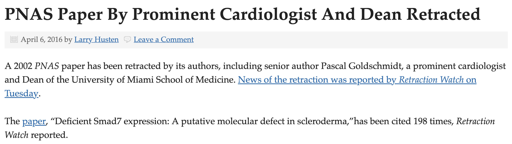
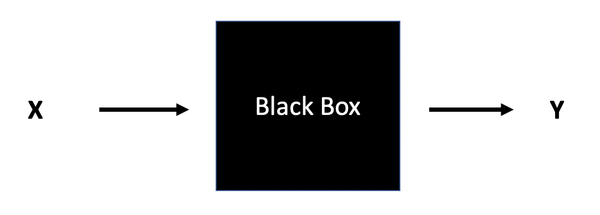
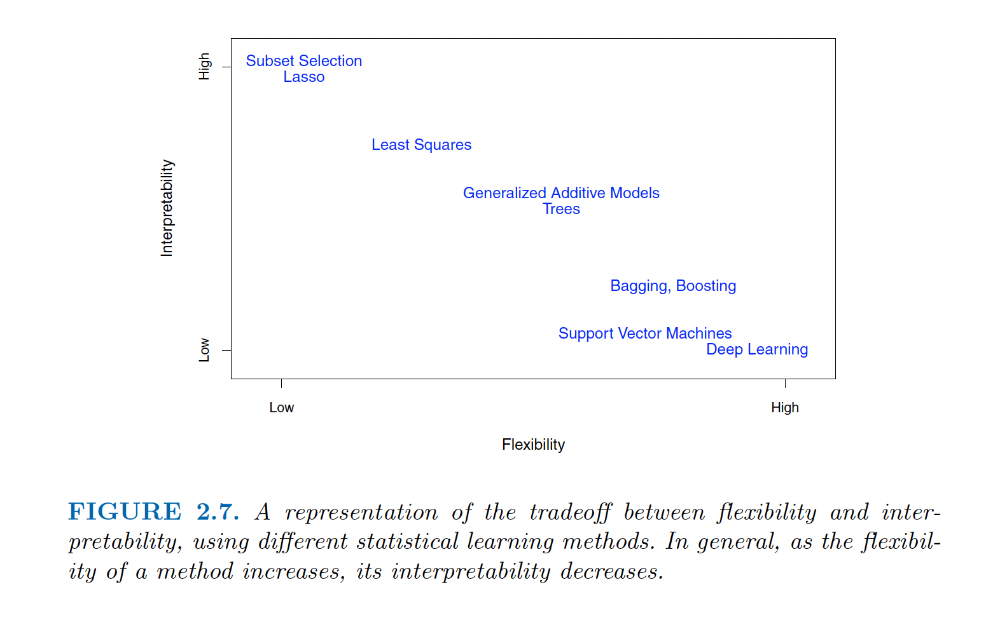
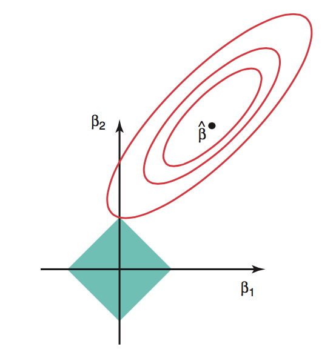
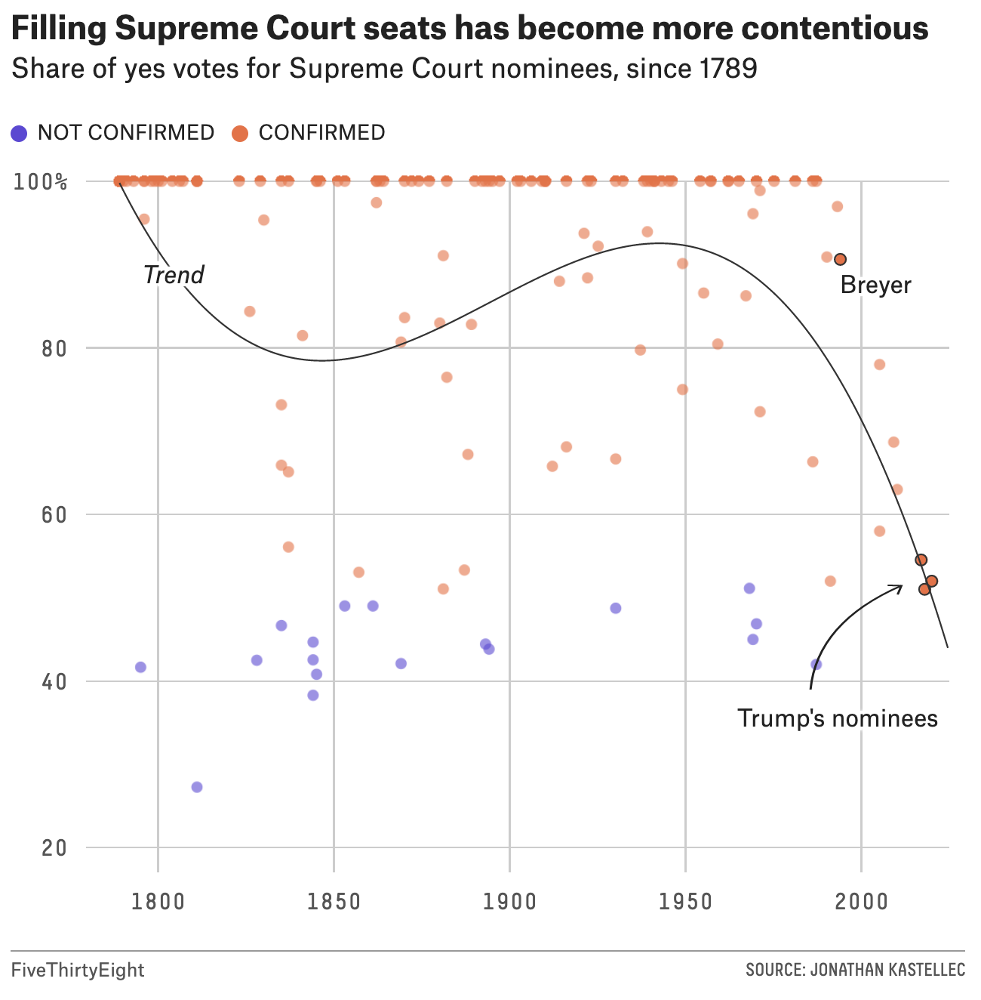

--- 
title: "Linear Models"
author: "Jo Hardin"
date: "2022-05-26"
knit: bookdown::render_book
site: bookdown::bookdown_site
output:
  bookdown::pdf_book:
    includes:
      in_header: preamble.tex
documentclass: book
bibliography: [book.bib, packages.bib]
biblio-style: apalike
link-citations: yes
github-repo: hardin47/website/Math158/
description: "Class notes for Math 158 at Pomona College: Linear Models.  The notes are based extensively on An Introduction to Statistical Learning by James, Witten, Hastie, and Tibshirani as well as  Applied Linear Statistical Models, 5th edition by Kutner, Nachtsheim, Neter, Li."
---


# Class Information {-}

Class notes for Math 158 at Pomona College: Computational Statistics.  The notes are based extensively on An Introduction to Statistical Learning [@ISL];  Applied Linear Statistical Models [@kutner].  The computing part of the class will be taken from R for Data Science [@r4ds] by Wickham and Grolemund as well as Tidy Modeling with R [@tidymodels] by Kuhn and Silge.


You are responsible for reading the relevant chapters in the texts.  The texts are very good & readable, so you should use them.   You should make sure you are coming to class and also reading the materials associated with the activities. 


<!--chapter:end:index.Rmd-->

# Introduction {#intro}
  
## Course Logistics

**What is Statistics?**
Generally, statistics is the academic discipline which uses data to make claims and predictions about larger populations of interest.  It is the science of collecting, wrangling, visualizing, and analyzing data as a representation of a larger whole.  It is worth noting that probability represents the majority of mathematical tools used in statistics, but probability as a discipline does not work with data.  Having taken a probability class may help you with some of the mathematics covered in the course, but it is not a substitute for understanding the basics of introductory statistics.

<div class="figure" style="text-align: center">

<p class="caption">(\#fig:unnamed-chunk-1)Probability vs. Statistics</p>
</div>

* *descriptive statistics* describe the sample at hand with no intent on making generalizations.
* *inferential statistics* use a sample to make claims about a population


**What is the content of Math 158?**
Math 158 is a course on statistical linear models.  

* The goal in Math 158 is to understand the modeling of *linear* statistical relationships between *explanatory / predictor (X)* variables and *response (Y)* variables.
* The models will grow in sophistication over the semester including multiple linear regression, interaction terms, ridge regression, Lasso, and smoothing.
* Throughout the semester, we will continue to talk about **good modeling practices**, ideas of which extend beyond linear models to any types of inference or prediction.
* We will think carefully about when inferential modeling makes sense and when predictive modeling makes sense.  And when **neither** type of analysis should be done!
* The math in the class will go quickly, but we will do very little calculus.  We will, however, learn some linear algebra.
* We will not necessarily use the linear models to determine causation (need an experimental design course to discuss issues of observational study vs. experiment).  E.g., (1) thermostat versus actual temperature, (2) ice cream sales versus boating accidents.


**Who should take Math 158?**
Linear Models are ubiquitous.  They are used in every science and social science to analyze relationships between variables.  Anyone planning to work in a field which uses statistical arguments to make claims based on data should have a fundamental knowledge of linear models.  Additionally, linear models is the most common required applied statistics course for someone who is applying to graduate school in statistics.     

**What are the prerequisites for Math 158?**
Linear Models requires a strong background in both statistics as well as algorithmic thinking.  The formal prerequisite is any introductory statistics course, but if you have had only AP Statistics, you may find yourself working very hard in the first few weeks of the class to catch up.   If you have taken a lot of mathematics, there are parts of the course that will come easily to you.  However, a mathematics degree is not a substitute for introductory statistics, and if you have not taken introductory statistics, the majority of the course work will not be intuitive for you. You must have taken a prior statistics course as a pre-requisite to Math 158; a computer science course is helpful.

Many of the derivations and much of the notation in the course come from linear algebra.  Having taken linear algebra will be enormously helpful in the class, but we will cover enough of the notation such that you do not need to have had linear algebra.

It is worth noting that the concepts from probability theory represent the majority of mathematical tools used in statistics / modeling, but probability as a discipline does not work with data.  Having taken a probability class may help you with some of the mathematics covered in the course, but it is not a substitute for understanding the basics of introductory statistics. 

**Is there overlap with other classes?**
Statistical Linear Models overlaps with Econometrics (Econ 167) and Applied Econometrics (107).  Econometrics focuses more of the probability theory and matrix algebra (mathematics) which lead to the derivation of the linear models.  Applied Econometrics focuses on the tools and the analysis.  Statistical Linear Models focuses on when to use which model, what assumptions are being made, and what conclusions are most appropriate given the results.  Additionally, the later topics in Linear Models are not typically covered in Econometrics.

**When should I take Math 158?**
While the prerequisite for Linear Models is introduction to statistics, the course moves very quickly and covers a tremendous amount of material.  It is not ideally suited for a first year student coming straight out of AP Statistics.  Instead, that student should focus on taking more mathematics, CS, interdisciplinary science, or other statistics courses.  Most students taking Linear Models are sophomores or juniors. 

**What is the workload for Math 158?**
There is one homework assignment per week, two in-class midterm exams, two take-home midterm exams, and a final end of the semester project.  Many students report working about 8-10 hours per week outside of class.   

**What software will we use? Will there be any real world applications?  Will there be any mathematics?  Will there be any CS?**
All of the work will be done in R (using RStudio as a front end, called an integrated development environment, IDE).  You will need to either download R and RStudio (both are free) onto your own computer or use them on Pomona's server.  All assignments will be posted to private repositories on GitHub.  The class is a mix of many real world applications and case studies, some higher level math, programming, and communication skills.  The final project requires your own analysis of a dataset of your choosing.


* You may use R on the Pomona server:  https://rstudio.campus.pomona.edu/  (All Pomona students will be able to log in immediately.  Non-Pomona students need to go to ITS at Pomona to get Pomona login information.)
* If you want to use R on your own machine, you may.  Please make sure all components are updated:
R is freely available at http://www.r-project.org/ and is already installed on college computers. Additionally, installing R Studio is required http://rstudio.org/.
* All assignments should be turned in using R Markdown compiled to pdf + pushed to GitHub


<div class="figure" style="text-align: center">

<p class="caption">(\#fig:unnamed-chunk-2)Taken from [Modern Drive: An introduction to statistical and data sciences via R](https://ismayc.github.io/moderndiver-book/), by Ismay and Kim</p>
</div>

<div class="figure" style="text-align: center">

<p class="caption">(\#fig:unnamed-chunk-3)[Jessica Ward](https://jkrward.github.io/), PhD student at Newcastle University</p>
</div>

## Statistics: a review

Linear Models are ubiquitous and incredibly powerful.  Indeed, there are often times when linear models are not appropriate (e.g., for violating the technical conditions) yet they end up giving almost identical solutions to models that are appropriate.  A solid understanding of the linear model framework, however, requires a strong foundation of the theory that goes into both inferential thinking as well as predictive modeling.  Here we review some of the ideas on inference from introductory statistics.

### Vocabulary
* A  **statistic** is a numerical measurement we get from the sample, a function of the data.
* A  **parameter** is a numerical measurement of the population.  We never know the true value of the parameter.
* An  **estimator** is a function of the unobserved data that tries to approximate the unknown parameter value.
* An  **estimate** is the value of the estimator for a given set of data.  [Estimate and statistic can be used interchangeably.]


### Simple Linear Regression

In the simplest case, which we will study first, we suppose we have two variables.  We call one the explanatory variable, the other the response variable.

**Explanatory / Predictor variable**: also known as the independent variable, is a numeric variable that is often known in advance of the other variable, and is thought to possibly influence its value.

**Response / outcome variable**: also known as the dependent variable, also numeric, is thought to be a function of the predictor variable.  n.b., we don't use the word "dependent" because we don't want to send a message that we've measured anything causal in the model.

The goal is to ascertain the relationship between the two.  What we observe is a sample from the population of interest, $(x_i,y_i), i=1,\dots,n$.  $x_i$ is the predictor, $y_i$ the response, and $n$ the sample size.

As we observe only a sample, and not the actual population itself, the best we can hope to do is to estimate the relationship between the two variables.  The resulting estimates give us an **idea** about what the relationship actually is in the population. However, they are random quantities, as they depend on the random sample.  As such, they are not exact.  The theory of hypothesis testing is then needed
to determine how much we can actually say about the population quantities, called *parameters*.

**Parameter**:  A quantity that describes the population. Examples are the population mean, population standard deviation, or if say the relationship between two variables was a polynomial, then the coefficients of the function are parameters.


### Hypothesis Testing
The set up:  the population is too big to observe.  What we'd like to know is the value of specific parameters, say for instance the mean of the population.  We can't however, calculate the parameters directly.
Instead, we observe a sample at random from a population.  Based on the sample, we estimate the parameters.  However, the estimated values are not exact.  We need a technique that uses the estimated model to say something about the population model.

**Null Hypothesis**: Denoted $H_0$, the null hypothesis is usually set up to be what is believed unless evidence is presented otherwise.  It is specific, specifying that the parameter is equal to a specific value.  
If $H_0$ is true, some theory tells us exactly how the estimate behaves.

**Alternative Hypothesis**: Denoted $H_a$, the alternative hypothesis is usually what we wish to show is true.  It is more general than $H_0$, usually of the form the parameter is somehow not equal to the value used in $H_0$, without specifying exactly what we think the value is. As a result, we don't know how the estimate behaves, as it depends on the value of the parameter.


#### What really is an Alternative Hypothesis? {-}

Consider the brief video from the movie Slacker, an early movie by Richard Linklater (director of Boyhood, School of Rock, Before Sunrise, etc.). You can view the video here from starting at 2:22 and ending at 4:30: https://www.youtube.com/watch?v=b-U_I1DCGEY

In the video, a rider in the back of a taxi (played by Linklater himself) muses about alternate realities that could have happened as he arrived in Austin on the bus. What if instead of taking a taxi, he had found a ride with a woman at the bus station? He could have take a different road into a different alternate reality, and in that reality his current reality would be an alternate reality. And so on.

What is the point?  Why did we see the video?  How does it relate the to the material from class?  What is the relationship to sampling distributions?

Since any procedure will have the potential to be wrong, we search for one that makes bad errors infrequently.  There are two types of errors that can be made.

**Type I error**: Rejecting $H_0$ when $H_0$ is actually true. Usually considered to be the worst error possible, and thus we find a procedure which makes the type I error with only a small probability. The probability is denoted by $\alpha$.

**Type II error**: Not rejecting $H_0$ when $H_a$ is actually true. Having a small type II error is a secondary concern (after controlling the type I error).  The probability of a type II error is denoted by $\beta$.  $1-\beta$
is known as the *power*.

In reality, the true reason why we choose a test with a small value of $\alpha$ is because it is the only value we know how to calculate. $\beta$ or power is not possible to calculate because $H_a$ doesn't tell us what the value of the parameter is.

The way a hypothesis test is carried out is via the p-value, which essentially tells us how unusual the observed data is in comparison to $H_0$.  If the estimates are not consistent from what would be expected if $H_0$ was true, the conclusion is that $H_0$ is false: an explanation as to why the data was so strange.  The definition of a p-value is a little tricky.

**p-value**: The probability, if $H_0$ were true, of observing data as or more contradictory to $H_0$ if we were to repeat the experiment again.

So if the p-value is .01, that means the data showed something that happens only about 1 time in 100 when $H_0$ is true. Considering that the particular set of data *was* observed, the reasonable conclusion is that $H_0$ must not be
true.  The rule is: reject $H_0$ if p-value $< \alpha$.  The resulting test will have a type I error probability of $\alpha$, which is the value we get to specify.  $\alpha$ is often set to be .05.


## Reflection Questions

1. What is the difference between a sample and a population? 
2. What are some of the experimental design issues that influence the conclusions?
3. What are type I error, type II error, and power?
4. What is a p-value (be careful, the **p-value is NOT the probability that $H_0$ is true**!!!)?
5. What should the regression line be doing?  
6. Is linear regression always an appropriate strategy?  
7. What properties does a good fitting line have? 
8. How should the line be appropriately interpreted?


## R: reproduciblity

 
### Reproducibility {#repro}

Reproducibility has long been considered an important topic for consideration in any research project.  However, recently there has been increased press and available examples for understanding the impact that non-reproducible science can have.  

@reprobook provide a full textbook on the structure of reproducible research as well as dozens of case studies to help hone skills and consider different aspects of the reproducible pipeline.  Below are a handful of examples to get us started.

#### Need for Reproducibility


<div class="figure" style="text-align: center">

<p class="caption">(\#fig:unnamed-chunk-4)slide taken from Kellie Ottoboni https://github.com/kellieotto/useR2016</p>
</div>

####  Example 1 {-}
Science retracts gay marriage paper without agreement of lead author LaCour


* In May 2015 Science retracted a study of how canvassers can sway people's opinions about gay marriage published just 5 months prior.
* Science Editor-in-Chief Marcia McNutt: 
    * Original survey data not made available for independent reproduction of results. 
    * Survey incentives misrepresented. 
    * Sponsorship statement false.
* Two Berkeley grad students who attempted to replicate the study quickly discovered that the data must have been faked.
* Methods we'll discuss can't prevent fraud, but they can make it easier to discover issues.
* Source: http://news.sciencemag.org/policy/2015/05/science-retracts-gay-marriage-paper-without-lead-author-s-consent

#### Example 2 {-}
Seizure study retracted after authors realize data got "terribly mixed"


* From the authors of Low Dose Lidocaine for Refractory Seizures in Preterm Neonates:

> The article has been retracted at the request of the authors. After carefully re-examining the data presented in the article, they identified that data of two different hospitals got terribly mixed. The published results cannot be reproduced in accordance with scientific and clinical correctness.

* Source: http://retractionwatch.com/2013/02/01/seizure-study-retracted-after-authors-realize-data-got-terribly-mixed/


#### Example 3 {-}
Bad spreadsheet merge kills depression paper, quick fix resurrects it


* The authors informed the journal that the merge of lab results and other survey data used in the paper resulted in an error regarding the identification codes. Results of the analyses were based on the incorrectly merged data set. Further analyses established the results reported in the manuscript and interpretation of the data are not correct.

> Original conclusion: Lower levels of CSF IL-6 were associated with current depression and with future depression ... 

> Revised conclusion: Higher levels of CSF IL-6 and IL-8 were associated with current depression ... 

* Source: http://retractionwatch.com/2014/07/01/bad-spreadsheet-merge-kills-depression-paper-quick-fix-resurrects-it/


#### Example 4 {-}

PNAS paper retracted due to problems with figure and reproducibility (April 2016):
http://cardiobrief.org/2016/04/06/pnas-paper-by-prominent-cardiologist-and-dean-retracted/





#### The reproducible data analysis process

* Scriptability $\rightarrow$ R
* Literate programming $\rightarrow$ R Markdown
* Version control $\rightarrow$ Git / GitHub

 
##### Scripting and literate programming {-}

Donald Knuth "Literate Programming" (1983) 

> Let us change our traditional attitude to the construction of programs: Instead of imagining that our main task is to instruct a computer- what to do, let us concentrate rather on explaining to human beings- what we want a computer to do.

* The ideas of literate programming have been around for many years!
* and tools for putting them to practice have also been around
* but they have never been as accessible as the current tools

##### Reproducibility checklist {-}

* Are the tables and figures reproducible from the code and data?
* Does the code actually do what you think it does?
* In addition to what was done, is it clear why it was done? (e.g., how were parameter settings chosen?)
* Can the code be used for other data?
* Can you extend the code to do other things?

##### Tools: R & R Studio {-}

See a great video (less than 2 min) on a reproducible workflow: https://www.youtube.com/watch?v=s3JldKoA0zw&feature=youtu.be

* You must use both R and RStudio software programs
* R does the programming
* R Studio brings everything together
* You may use Pomona's server: https://rstudio.pomona.edu/

<div class="figure" style="text-align: center">

<p class="caption">(\#fig:unnamed-chunk-9)Taken from [Modern Drive: An introduction to statistical and data sciences via R](https://ismayc.github.io/moderndiver-book/), by Ismay and Kim</p>
</div>

<div class="figure" style="text-align: center">

<p class="caption">(\#fig:unnamed-chunk-10)[Jessica Ward](https://jkrward.github.io/), PhD student at Newcastle University</p>
</div>

##### Tools: Git & GitHub {-}

* You must submit assignments via GitHub
* Follow Jenny Bryan's advice on how to get set-up: http://happygitwithr.com/
* Class specific instructions at https://m158-comp-stats.netlify.app/github.html


Admittedly, there is a steep learning curve with Git.  However, it is among the tools which you are most likely to use in your future endeavors, so spending a little time focusing on the concepts now may pay off big time in the future.  Beyond practicing and working through http://happygitwithr.com/, you may want to read a little bit about what Git is doing behind the scenes.  This reference: [Learn git concepts, not commands](https://dev.to/unseenwizzard/learn-git-concepts-not-commands-4gjc) is very good and accessible.

##### Tools: a GitHub merge conflict (demo) {-}

* On GitHub (on the web) edit the README document and Commit it with a message describing what you did.
* Then, in RStudio also edit the README document with a different change.
    * Commit changes
    * Try to push $\rightarrow$ you'll get an error!
    * Try pulling
    * Resolve the merge conflict and then commit and push
* As you work in teams you will run into merge conflicts, learning how to resolve them properly will be very important.

<div class="figure" style="text-align: center">

<p class="caption">(\#fig:unnamed-chunk-11)https://xkcd.com/1597/</p>
</div>

##### Steps for weekly homework {-}

1. You will get a link to the new assignment (clicking on the link will create a new private repo)  
2. Use R (within R Studio)  
    * New Project, version control, Git  
    * Clone the repo using SSH  
3. If it exists, rename the Rmd file to ma158-hw#-lname-fname.Rmd  
4.  Do the assignment  
    *  `commit` and  `push` after every problem  
5. All necessary files  *must* be in the same folder (e.g., data)  


<!--chapter:end:01-intro.Rmd-->


# Data Wrangling {#wrang}

As with data visualization, data wrangling is a fundamental part of being able to accurately, reproducibly, and efficiently work with data.  The approach taken in the following chapter is based on the philosophy of tidy data and takes many of its precepts from database theory.  If you have done much work in SQL, the functionality and approach of tidy data will feel very familiar.  The more adept you are at data wrangling, the more effective you will be at data analysis.


>Information is what we want, but data are what we've got. [@Kaplan15]

**Embrace all the ways to get help!**

1. cheat sheets: https://www.rstudio.com/resources/cheatsheets/
2. tidyverse vignettes: https://www.tidyverse.org/articles/2019/09/tidyr-1-0-0/
3. pivoting: https://tidyr.tidyverse.org/articles/pivot.html
4. google what you need and include `R tidy` or `tidyverse`

## Structure of Data {#datastruc}

For plotting, analyses, model building, etc., it's important that the data be structured in a very particular way.   Hadley Wickham provides a thorough discussion and advice for cleaning up the data in @Wickham14.

* *Tidy Data*: rows (cases/observational units) and columns (variables).  The key is that *every* row is a case and *every} column is a variable.  No exceptions.
* Creating tidy data is not trivial.  We work with objects (often data tables), functions, and arguments (often variables).


The Active Duty data are not tidy!  What are the cases?  How are the data not tidy?  What might the data look like in tidy form?  Suppose that the case was "an individual in the armed forces."  What variables would you use to capture the information in the following table?

https://docs.google.com/spreadsheets/d/1Ow6Cm4z-Z1Yybk3i352msulYCEDOUaOghmo9ALajyHo/edit#gid=1811988794


**Problem:** totals and different sheets

**Better for R:** longer format with columns - grade, gender, status, service, count (case is still the total pay grade)

**Case is individual (?)**:  grade, gender, status, service (no count because each row does the counting)

### Building Tidy Data

Within R (really within any type of computing language, Python, SQL, Java, etc.), we need to understand how to build data using the patterns of the language.  Some things to consider:


* `object_name = function_name(arguments)` is a way of using a function to create a new object.
* `object_name = data_table %>% function_name(arguments)` uses chaining syntax as an extension of the ideas of functions.  In chaining, the value on the left side of `%>%` becomes the *first argument* to the function on the right side.


``` 
object_name = data_table %>%
function_name(arguments) %>% 
function_name(arguments)
```
is extended chaining.  `%>%` is never at the front of the line, it is always connecting one idea with the continuation of that idea on the next line.
* In R, all functions take arguments in round parentheses (as opposed to subsetting observations or variables from data objects which happen with square parentheses).  Additionally, the spot to the left of `%>%` is always a data table.
* The pipe syntax should be read as *then*, `%>%`.

### Examples of Chaining

The pipe syntax (`%>%`) takes a data frame (or data table) and sends it to the argument of a function.  The mapping goes to the first available argument in the function.  For example:

`x %>% f(y)` is the same as `f(x, y)`

` y %>% f(x, ., z)` is the same as `f(x,y,z)`

#### Little Bunny Foo Foo

From Hadley Wickham, how to think about tidy data.

> Little bunny Foo Foo
> Went hopping through the forest
> Scooping up the field mice
> And bopping them on the head

The nursery rhyme could be created by a series of steps where the output from each step is saved as an object along the way.

```
foo_foo <- little_bunny()
foo_foo_1 <- hop(foo_foo, through = forest)
foo_foo_2 <- scoop(foo_foo_2, up = field_mice)
foo_foo_3 <- bop(foo_foo_2, on = head)
```

Another approach is to concatenate the functions so that there is only one output.  

```
bop(
   scoop(
      hop(foo_foo, through = forest),
      up = field_mice),
   on = head)
```

Or even worse, as one line:

```
bop(scoop(hop(foo_foo, through = forest), up = field_mice), on = head)))
```

Instead, the code can be written using the pipe in the **order** in which the function is evaluated:

```
foo_foo %>%
   hop(through = forest) %>%
       scoop(up = field_mice) %>%
           bop(on = head)
```

**babynames**  Each year, the US Social Security Administration publishes a list of the most popular names given to babies.  In 2014, http://www.ssa.gov/oact/babynames/#ht=2 shows Emma and Olivia leading for girls, Noah and Liam for boys.

The `babynames` data table in the `babynames` package comes from the Social Security Administration's listing of the names givens to babies in each year, and the number of babies of each sex given that name. (Only names with 5 or more babies are published by the SSA.)

### Data Verbs (on single data frames)

> Super important resource:  The RStudio **dplyr** cheat sheet: https://github.com/rstudio/cheatsheets/raw/master/data-transformation.pdf

**Data verbs take data tables as input and give data tables as output (that's how we can use the chaining syntax!).**  We will use the R package **dplyr** to do much of our data wrangling.  Below is a list of verbs which will be helpful in wrangling many different types of data.  See the Data Wrangling cheat sheet from RStudio for additional help.   https://www.rstudio.com/wp-content/uploads/2015/02/data-wrangling-cheatsheet.pdf

 * `sample_n()` take a random row(s)
 * `head()`  grab the first few rows
 * `tail()` grab the last few rows
 * `filter()`  removes unwanted *cases*
 *  `arrange()` reorders the cases
 *  `select()` removes unwanted *variables*   (and `rename()` )
 *  `distinct()` returns the unique values in a table
 * `mutate()` transforms the variable (and `transmute()` like mutate, returns only new variables)
 *  `group_by()` tells R that SUCCESSIVE functions keep in mind that there are groups of items.  So `group_by()` only makes sense with verbs later on (like `summarize()`).
 *  `summarize()`  collapses a data frame to a single row.  Some functions that are used within `summarize()` include:

     * `min(), max(), mean(), sum(), sd(), median()`, and `IQR()`
     * `n()`: number of observations in the current group
     * `n_distinct(x)`: count the number of unique values in `x`
     * `first_value(x), last_value(x)` and `nth_value(x, n)`: work similarly to `x[1], x[length(x)]`, and `x[n]` 


<!--
The following Shiny app ("Visualizing data manipulation operations") is for demonstrating how to work with dplyr/tidyr data manipulation.  It includes tabs for data selection, `filter` and `select`, `mutate`, `group_by` and `summarize`, `group_by` and `mutate`, and `join`.   http://rstudio.calvin.edu:3838/rpruim/dataOps/
-->

## R examples, basic verbs

  
### Datasets


`starwars` is from **dplyr** , although originally from SWAPI, the Star Wars API, http://swapi.co/.

`NHANES` From `?NHANES`:  NHANES is survey data collected by the US National Center for Health Statistics (NCHS) which has conducted a series of health and nutrition surveys since the early 1960's. Since 1999 approximately 5,000 individuals of all ages are interviewed in their homes every year and complete the health examination component of the survey. The health examination is conducted in a mobile examination center (MEC).

`babynames`  Each year, the US Social Security Administration publishes a list of the most popular names given to babies.  In 2018, http://www.ssa.gov/oact/babynames/#ht=2 shows Emma and Olivia leading for girls, Noah and Liam for boys. (Only names with 5 or more babies are published by the SSA.)

  
### Examples of Chaining


```r
library(babynames)
babynames %>% nrow()
```

```
## [1] 1924665
```

```r
babynames %>% names()
```

```
## [1] "year" "sex"  "name" "n"    "prop"
```

```r
babynames %>% glimpse()
```

```
## Rows: 1,924,665
## Columns: 5
## $ year <dbl> 1880, 1880, 1880, 1880, 1880, 1880, 1880, 1880, 1880, 1880, 1880,…
## $ sex  <chr> "F", "F", "F", "F", "F", "F", "F", "F", "F", "F", "F", "F", "F", …
## $ name <chr> "Mary", "Anna", "Emma", "Elizabeth", "Minnie", "Margaret", "Ida",…
## $ n    <int> 7065, 2604, 2003, 1939, 1746, 1578, 1472, 1414, 1320, 1288, 1258,…
## $ prop <dbl> 0.07238359, 0.02667896, 0.02052149, 0.01986579, 0.01788843, 0.016…
```

```r
babynames %>% head()
```

```
## # A tibble: 6 × 5
##    year sex   name          n   prop
##   <dbl> <chr> <chr>     <int>  <dbl>
## 1  1880 F     Mary       7065 0.0724
## 2  1880 F     Anna       2604 0.0267
## 3  1880 F     Emma       2003 0.0205
## 4  1880 F     Elizabeth  1939 0.0199
## 5  1880 F     Minnie     1746 0.0179
## 6  1880 F     Margaret   1578 0.0162
```

```r
babynames %>% tail()
```

```
## # A tibble: 6 × 5
##    year sex   name       n       prop
##   <dbl> <chr> <chr>  <int>      <dbl>
## 1  2017 M     Zyhier     5 0.00000255
## 2  2017 M     Zykai      5 0.00000255
## 3  2017 M     Zykeem     5 0.00000255
## 4  2017 M     Zylin      5 0.00000255
## 5  2017 M     Zylis      5 0.00000255
## 6  2017 M     Zyrie      5 0.00000255
```

```r
babynames %>% sample_n(size=5)
```

```
## # A tibble: 5 × 5
##    year sex   name         n      prop
##   <dbl> <chr> <chr>    <int>     <dbl>
## 1  1946 M     Owen       392 0.000238 
## 2  1953 M     Abelardo    34 0.0000170
## 3  1996 F     Nicki       50 0.0000261
## 4  1914 F     Sofia       38 0.0000477
## 5  1970 M     Lorenza     45 0.0000236
```

```r
babynames %>% mosaic::favstats(n ~ sex, data = .)
```

```
##   sex min Q1 median Q3   max     mean       sd       n missing
## 1   F   5  7     11 31 99686 151.4294 1180.557 1138293       0
## 2   M   5  7     12 33 94756 223.4940 1932.338  786372       0
```


### Data Verbs

Taken from the dplyr tutorial: http://dplyr.tidyverse.org/

#### Starwars

```r
library(dplyr)

starwars %>% dim()
```

```
## [1] 87 14
```

```r
starwars %>% names()
```

```
##  [1] "name"       "height"     "mass"       "hair_color" "skin_color"
##  [6] "eye_color"  "birth_year" "sex"        "gender"     "homeworld" 
## [11] "species"    "films"      "vehicles"   "starships"
```

```r
starwars %>% head()
```

```
## # A tibble: 6 × 14
##   name     height  mass hair_color  skin_color eye_color birth_year sex   gender
##   <chr>     <int> <dbl> <chr>       <chr>      <chr>          <dbl> <chr> <chr> 
## 1 Luke Sk…    172    77 blond       fair       blue            19   male  mascu…
## 2 C-3PO       167    75 <NA>        gold       yellow         112   none  mascu…
## 3 R2-D2        96    32 <NA>        white, bl… red             33   none  mascu…
## 4 Darth V…    202   136 none        white      yellow          41.9 male  mascu…
## 5 Leia Or…    150    49 brown       light      brown           19   fema… femin…
## 6 Owen La…    178   120 brown, grey light      blue            52   male  mascu…
## # … with 5 more variables: homeworld <chr>, species <chr>, films <list>,
## #   vehicles <list>, starships <list>
```

```r
starwars %>%
  mosaic::favstats(mass~gender, data = .)
```

```
##      gender min Q1 median   Q3  max      mean         sd  n missing
## 1  feminine  45 50     55 56.2   75  54.68889   8.591921  9       8
## 2 masculine  15 75     80 88.0 1358 106.14694 184.972677 49      17
```

```r
starwars %>% 
  dplyr::filter(species == "Droid")
```

```
## # A tibble: 6 × 14
##   name   height  mass hair_color skin_color  eye_color birth_year sex   gender  
##   <chr>   <int> <dbl> <chr>      <chr>       <chr>          <dbl> <chr> <chr>   
## 1 C-3PO     167    75 <NA>       gold        yellow           112 none  masculi…
## 2 R2-D2      96    32 <NA>       white, blue red               33 none  masculi…
## 3 R5-D4      97    32 <NA>       white, red  red               NA none  masculi…
## 4 IG-88     200   140 none       metal       red               15 none  masculi…
## 5 R4-P17     96    NA none       silver, red red, blue         NA none  feminine
## 6 BB8        NA    NA none       none        black             NA none  masculi…
## # … with 5 more variables: homeworld <chr>, species <chr>, films <list>,
## #   vehicles <list>, starships <list>
```

```r
starwars %>% 
  dplyr::filter(species != "Droid") %>%
  mosaic::favstats(mass~gender, data = .)
```

```
##      gender min Q1 median   Q3  max      mean         sd  n missing
## 1  feminine  45 50     55 56.2   75  54.68889   8.591921  9       7
## 2 masculine  15 77     80 88.0 1358 109.38222 192.397084 45      16
```

```r
starwars %>% 
  dplyr::select(name, ends_with("color"))
```

```
## # A tibble: 87 × 4
##    name               hair_color    skin_color  eye_color
##    <chr>              <chr>         <chr>       <chr>    
##  1 Luke Skywalker     blond         fair        blue     
##  2 C-3PO              <NA>          gold        yellow   
##  3 R2-D2              <NA>          white, blue red      
##  4 Darth Vader        none          white       yellow   
##  5 Leia Organa        brown         light       brown    
##  6 Owen Lars          brown, grey   light       blue     
##  7 Beru Whitesun lars brown         light       blue     
##  8 R5-D4              <NA>          white, red  red      
##  9 Biggs Darklighter  black         light       brown    
## 10 Obi-Wan Kenobi     auburn, white fair        blue-gray
## # … with 77 more rows
```

```r
starwars %>% 
  dplyr::mutate(name, bmi = mass / ((height / 100)  ^ 2)) %>%
  dplyr::select(name:mass, bmi)
```

```
## # A tibble: 87 × 4
##    name               height  mass   bmi
##    <chr>               <int> <dbl> <dbl>
##  1 Luke Skywalker        172    77  26.0
##  2 C-3PO                 167    75  26.9
##  3 R2-D2                  96    32  34.7
##  4 Darth Vader           202   136  33.3
##  5 Leia Organa           150    49  21.8
##  6 Owen Lars             178   120  37.9
##  7 Beru Whitesun lars    165    75  27.5
##  8 R5-D4                  97    32  34.0
##  9 Biggs Darklighter     183    84  25.1
## 10 Obi-Wan Kenobi        182    77  23.2
## # … with 77 more rows
```

```r
starwars %>% 
  dplyr::arrange(desc(mass))
```

```
## # A tibble: 87 × 14
##    name    height  mass hair_color  skin_color eye_color birth_year sex   gender
##    <chr>    <int> <dbl> <chr>       <chr>      <chr>          <dbl> <chr> <chr> 
##  1 Jabba …    175  1358 <NA>        green-tan… orange         600   herm… mascu…
##  2 Grievo…    216   159 none        brown, wh… green, y…       NA   male  mascu…
##  3 IG-88      200   140 none        metal      red             15   none  mascu…
##  4 Darth …    202   136 none        white      yellow          41.9 male  mascu…
##  5 Tarfful    234   136 brown       brown      blue            NA   male  mascu…
##  6 Owen L…    178   120 brown, grey light      blue            52   male  mascu…
##  7 Bossk      190   113 none        green      red             53   male  mascu…
##  8 Chewba…    228   112 brown       unknown    blue           200   male  mascu…
##  9 Jek To…    180   110 brown       fair       blue            NA   male  mascu…
## 10 Dexter…    198   102 none        brown      yellow          NA   male  mascu…
## # … with 77 more rows, and 5 more variables: homeworld <chr>, species <chr>,
## #   films <list>, vehicles <list>, starships <list>
```

```r
starwars %>%
  dplyr::group_by(species) %>%
  dplyr::summarize(
    num = n(),
    mass = mean(mass, na.rm = TRUE)
  ) %>%
  dplyr::filter(num > 1)
```

```
## # A tibble: 9 × 3
##   species    num  mass
##   <chr>    <int> <dbl>
## 1 Droid        6  69.8
## 2 Gungan       3  74  
## 3 Human       35  82.8
## 4 Kaminoan     2  88  
## 5 Mirialan     2  53.1
## 6 Twi'lek      2  55  
## 7 Wookiee      2 124  
## 8 Zabrak       2  80  
## 9 <NA>         4  48
```


#### NHANES

```r
require(NHANES)
names(NHANES)
```

```
##  [1] "ID"               "SurveyYr"         "Gender"           "Age"             
##  [5] "AgeDecade"        "AgeMonths"        "Race1"            "Race3"           
##  [9] "Education"        "MaritalStatus"    "HHIncome"         "HHIncomeMid"     
## [13] "Poverty"          "HomeRooms"        "HomeOwn"          "Work"            
## [17] "Weight"           "Length"           "HeadCirc"         "Height"          
## [21] "BMI"              "BMICatUnder20yrs" "BMI_WHO"          "Pulse"           
## [25] "BPSysAve"         "BPDiaAve"         "BPSys1"           "BPDia1"          
## [29] "BPSys2"           "BPDia2"           "BPSys3"           "BPDia3"          
## [33] "Testosterone"     "DirectChol"       "TotChol"          "UrineVol1"       
## [37] "UrineFlow1"       "UrineVol2"        "UrineFlow2"       "Diabetes"        
## [41] "DiabetesAge"      "HealthGen"        "DaysPhysHlthBad"  "DaysMentHlthBad" 
## [45] "LittleInterest"   "Depressed"        "nPregnancies"     "nBabies"         
## [49] "Age1stBaby"       "SleepHrsNight"    "SleepTrouble"     "PhysActive"      
## [53] "PhysActiveDays"   "TVHrsDay"         "CompHrsDay"       "TVHrsDayChild"   
## [57] "CompHrsDayChild"  "Alcohol12PlusYr"  "AlcoholDay"       "AlcoholYear"     
## [61] "SmokeNow"         "Smoke100"         "Smoke100n"        "SmokeAge"        
## [65] "Marijuana"        "AgeFirstMarij"    "RegularMarij"     "AgeRegMarij"     
## [69] "HardDrugs"        "SexEver"          "SexAge"           "SexNumPartnLife" 
## [73] "SexNumPartYear"   "SameSex"          "SexOrientation"   "PregnantNow"
```

```r
# find the sleep variables
NHANESsleep <- NHANES %>% select(Gender, Age, Weight, Race1, Race3, 
                                 Education, SleepTrouble, SleepHrsNight, 
                                 TVHrsDay, TVHrsDayChild, PhysActive)
names(NHANESsleep)
```

```
##  [1] "Gender"        "Age"           "Weight"        "Race1"        
##  [5] "Race3"         "Education"     "SleepTrouble"  "SleepHrsNight"
##  [9] "TVHrsDay"      "TVHrsDayChild" "PhysActive"
```

```r
dim(NHANESsleep)
```

```
## [1] 10000    11
```

```r
# subset for college students
NHANESsleep <- NHANESsleep %>% filter(Age %in% c(18:22)) %>% 
  mutate(Weightlb = Weight*2.2)

names(NHANESsleep)
```

```
##  [1] "Gender"        "Age"           "Weight"        "Race1"        
##  [5] "Race3"         "Education"     "SleepTrouble"  "SleepHrsNight"
##  [9] "TVHrsDay"      "TVHrsDayChild" "PhysActive"    "Weightlb"
```

```r
dim(NHANESsleep)
```

```
## [1] 655  12
```

```r
NHANESsleep %>% ggplot(aes(x=Age, y=SleepHrsNight, color=Gender)) + 
  geom_point(position=position_jitter(width=.25, height=0) ) + 
  facet_grid(SleepTrouble ~ TVHrsDay) 
```


  
### `summarize` and `group_by`

```r
# number of people (cases) in NHANES
NHANES %>% summarize(n())
```

```
## # A tibble: 1 × 1
##   `n()`
##   <int>
## 1 10000
```

```r
# total weight of all the people in NHANES (silly)
NHANES %>% mutate(Weightlb = Weight*2.2) %>% summarize(sum(Weightlb, na.rm=TRUE))
```

```
## # A tibble: 1 × 1
##   `sum(Weightlb, na.rm = TRUE)`
##                           <dbl>
## 1                      1549419.
```

```r
# mean weight of all the people in NHANES
NHANES %>% mutate(Weightlb = Weight*2.2) %>% summarize(mean(Weightlb, na.rm=TRUE))
```

```
## # A tibble: 1 × 1
##   `mean(Weightlb, na.rm = TRUE)`
##                            <dbl>
## 1                           156.
```

```r
# repeat the above but for groups

# males versus females
NHANES %>% group_by(Gender) %>% summarize(n())
```

```
## # A tibble: 2 × 2
##   Gender `n()`
##   <fct>  <int>
## 1 female  5020
## 2 male    4980
```

```r
NHANES %>% group_by(Gender) %>% mutate(Weightlb = Weight*2.2) %>% 
  summarize(mean(Weightlb, na.rm=TRUE))
```

```
## # A tibble: 2 × 2
##   Gender `mean(Weightlb, na.rm = TRUE)`
##   <fct>                           <dbl>
## 1 female                           146.
## 2 male                             167.
```

```r
# smokers and non-smokers
NHANES %>% group_by(SmokeNow) %>% summarize(n())
```

```
## # A tibble: 3 × 2
##   SmokeNow `n()`
##   <fct>    <int>
## 1 No        1745
## 2 Yes       1466
## 3 <NA>      6789
```

```r
NHANES %>% group_by(SmokeNow) %>% mutate(Weightlb = Weight*2.2) %>% 
  summarize(mean(Weightlb, na.rm=TRUE))
```

```
## # A tibble: 3 × 2
##   SmokeNow `mean(Weightlb, na.rm = TRUE)`
##   <fct>                             <dbl>
## 1 No                                 186.
## 2 Yes                                177.
## 3 <NA>                               144.
```

```r
# people with and without diabetes
NHANES %>% group_by(Diabetes) %>% summarize(n())
```

```
## # A tibble: 3 × 2
##   Diabetes `n()`
##   <fct>    <int>
## 1 No        9098
## 2 Yes        760
## 3 <NA>       142
```

```r
NHANES %>% group_by(Diabetes) %>% mutate(Weightlb = Weight*2.2) %>% 
  summarize(mean(Weightlb, na.rm=TRUE))
```

```
## # A tibble: 3 × 2
##   Diabetes `mean(Weightlb, na.rm = TRUE)`
##   <fct>                             <dbl>
## 1 No                                155. 
## 2 Yes                               202. 
## 3 <NA>                               21.6
```

```r
# break down the smokers versus non-smokers further, by sex
NHANES %>% group_by(SmokeNow, Gender) %>% summarize(n())
```

```
## # A tibble: 6 × 3
## # Groups:   SmokeNow [3]
##   SmokeNow Gender `n()`
##   <fct>    <fct>  <int>
## 1 No       female   764
## 2 No       male     981
## 3 Yes      female   638
## 4 Yes      male     828
## 5 <NA>     female  3618
## 6 <NA>     male    3171
```

```r
NHANES %>% group_by(SmokeNow, Gender) %>% mutate(Weightlb = Weight*2.2) %>% 
  summarize(mean(Weightlb, na.rm=TRUE))
```

```
## # A tibble: 6 × 3
## # Groups:   SmokeNow [3]
##   SmokeNow Gender `mean(Weightlb, na.rm = TRUE)`
##   <fct>    <fct>                           <dbl>
## 1 No       female                           167.
## 2 No       male                             201.
## 3 Yes      female                           167.
## 4 Yes      male                             185.
## 5 <NA>     female                           138.
## 6 <NA>     male                             151.
```

```r
# break down the people with diabetes further, by smoking
NHANES %>% group_by(Diabetes, SmokeNow) %>% summarize(n())
```

```
## # A tibble: 8 × 3
## # Groups:   Diabetes [3]
##   Diabetes SmokeNow `n()`
##   <fct>    <fct>    <int>
## 1 No       No        1476
## 2 No       Yes       1360
## 3 No       <NA>      6262
## 4 Yes      No         267
## 5 Yes      Yes        106
## 6 Yes      <NA>       387
## 7 <NA>     No           2
## 8 <NA>     <NA>       140
```

```r
NHANES %>% group_by(Diabetes, SmokeNow) %>% mutate(Weightlb = Weight*2.2) %>% 
  summarize(mean(Weightlb, na.rm=TRUE))
```

```
## # A tibble: 8 × 3
## # Groups:   Diabetes [3]
##   Diabetes SmokeNow `mean(Weightlb, na.rm = TRUE)`
##   <fct>    <fct>                             <dbl>
## 1 No       No                                183. 
## 2 No       Yes                               175. 
## 3 No       <NA>                              143. 
## 4 Yes      No                                204. 
## 5 Yes      Yes                               204. 
## 6 Yes      <NA>                              199. 
## 7 <NA>     No                                193. 
## 8 <NA>     <NA>                               19.1
```
  
### babynames


```r
babynames %>% group_by(sex) %>%
  summarize(total=sum(n))
```

```
## # A tibble: 2 × 2
##   sex       total
##   <chr>     <int>
## 1 F     172371079
## 2 M     175749438
```

```r
babynames %>% group_by(year, sex) %>%
  summarize(name_count = n_distinct(name)) %>% head()
```

```
## # A tibble: 6 × 3
## # Groups:   year [3]
##    year sex   name_count
##   <dbl> <chr>      <int>
## 1  1880 F            942
## 2  1880 M           1058
## 3  1881 F            938
## 4  1881 M            997
## 5  1882 F           1028
## 6  1882 M           1099
```

```r
babynames %>% group_by(year, sex) %>%
  summarize(name_count = n_distinct(name)) %>% tail()
```

```
## # A tibble: 6 × 3
## # Groups:   year [3]
##    year sex   name_count
##   <dbl> <chr>      <int>
## 1  2015 F          19074
## 2  2015 M          14024
## 3  2016 F          18817
## 4  2016 M          14162
## 5  2017 F          18309
## 6  2017 M          14160
```

```r
babysamp <- babynames %>% sample_n(size=50)
babysamp %>% select(year) %>% distinct() %>% table()
```

```
## .
## 1896 1915 1922 1924 1926 1927 1928 1933 1940 1942 1946 1953 1955 1963 1966 1975 
##    1    1    1    1    1    1    1    1    1    1    1    1    1    1    1    1 
## 1980 1981 1982 1984 1985 1989 1990 1991 1992 1994 1996 1997 1999 2000 2002 2004 
##    1    1    1    1    1    1    1    1    1    1    1    1    1    1    1    1 
## 2006 2007 2009 2010 2014 2015 2017 
##    1    1    1    1    1    1    1
```

```r
babysamp %>% distinct() %>% select(year) %>% table()
```

```
## .
## 1896 1915 1922 1924 1926 1927 1928 1933 1940 1942 1946 1953 1955 1963 1966 1975 
##    1    1    1    1    1    1    1    1    1    1    1    1    1    1    1    1 
## 1980 1981 1982 1984 1985 1989 1990 1991 1992 1994 1996 1997 1999 2000 2002 2004 
##    1    2    2    1    1    3    1    1    1    1    1    2    2    1    2    2 
## 2006 2007 2009 2010 2014 2015 2017 
##    1    1    3    1    2    1    1
```

```r
Frances <- babynames %>%
  filter(name== "Frances") %>%
  group_by(year, sex) %>%
  summarize(yrTot = sum(n))

Frances %>% ggplot(aes(x=year, y=yrTot)) +
  geom_point(aes(color=sex)) + 
  geom_vline(xintercept=2006) + scale_y_log10() +
  ylab("Yearly total on log10 scale")
```


  


## Higher Level Data Verbs {#highverb}

There are more complicated verbs which may be important for more sophisticated analyses.  See the RStudio **dplyr** cheat sheet,  https://www.rstudio.com/wp-content/uploads/2015/02/data-wrangling-cheatsheet.pdf}.


* `pivot_longer` makes many columns into 2 columns: `pivot_longer(data, cols,  names_to = , value_to = )`
* `pivot_wider` makes one column into multiple columns: `pivot_wider(data, names_from = , values_from = )`
* `left_join` returns all rows from the left table, and any rows with matching keys from the right table.
* `inner_join` returns only the rows in which the left table have matching keys in the right table (i.e., matching rows in both sets).
* `full_join` returns all rows from both tables, join records from the left which have matching keys in the right table.


Good practice:  always specify the `by` argument when joining data frames.


## R examples, higher level verbs

<!--
In class example on babynames via Nick  http://dtkaplan.github.io/CVC/Summer2015/Learn/BabyNames/WhatHappenedToJane.Rmd   http://dtkaplan.github.io/CVC/Summer2015/Learn/BabyNames/WhatHappenedToJane-answers.pdf
-->

**tidyr** 1.0.0 has just been released!  The new release means that you need to update **tidyr**.  You will know if you have the latest version if the following command works in the console (window below):

```
?tidyr::pivot_longer
```

If you are familiar with `spread` and `gather`, you should acquaint yourself with `pivot_longer()` and `pivot_wider()`.  The idea is to go from very wide dataframes to very long dataframes and vice versa.

### `pivot_longer()`

`pivot` the military pay grade to become longer? 


```r
library(googlesheets4)
gs4_deauth()

navy_gs = read_sheet("https://docs.google.com/spreadsheets/d/1Ow6Cm4z-Z1Yybk3i352msulYCEDOUaOghmo9ALajyHo/edit#gid=1877566408", 
                     col_types = "ccnnnnnnnnnnnnnnn")
```


```r
glimpse(navy_gs)
```

```
## Rows: 38
## Columns: 17
## $ ...1                 <chr> NA, NA, NA, NA, NA, NA, NA, NA, NA, NA, NA, NA, N…
## $ `Active Duty Family` <chr> NA, "Marital Status Report", NA, "Data Reflect Se…
## $ ...3                 <dbl> NA, NA, NA, NA, NA, NA, NA, NA, 31229, 53094, 131…
## $ ...4                 <dbl> NA, NA, NA, NA, NA, NA, NA, NA, 5717, 8388, 21019…
## $ ...5                 <dbl> NA, NA, NA, NA, NA, NA, NA, NA, 36946, 61482, 152…
## $ ...6                 <dbl> NA, NA, NA, NA, NA, NA, NA, NA, 563, 1457, 4264, …
## $ ...7                 <dbl> NA, NA, NA, NA, NA, NA, NA, NA, 122, 275, 1920, 4…
## $ ...8                 <dbl> NA, NA, NA, NA, NA, NA, NA, NA, 685, 1732, 6184, …
## $ ...9                 <dbl> NA, NA, NA, NA, NA, NA, NA, NA, 139, 438, 3579, 8…
## $ ...10                <dbl> NA, NA, NA, NA, NA, NA, NA, NA, 141, 579, 4902, 9…
## $ ...11                <dbl> NA, NA, NA, NA, NA, NA, NA, NA, 280, 1017, 8481, …
## $ ...12                <dbl> NA, NA, NA, NA, NA, NA, NA, NA, 5060, 12483, 5479…
## $ ...13                <dbl> NA, NA, NA, NA, NA, NA, NA, NA, 719, 1682, 6641, …
## $ ...14                <dbl> NA, NA, NA, NA, NA, NA, NA, NA, 5779, 14165, 6143…
## $ ...15                <dbl> NA, NA, NA, NA, NA, NA, NA, NA, 36991, 67472, 193…
## $ ...16                <dbl> NA, NA, NA, NA, NA, NA, NA, NA, 6699, 10924, 3448…
## $ ...17                <dbl> NA, NA, NA, NA, NA, NA, NA, NA, 43690, 78396, 228…
```

```r
names(navy_gs) = c("X","pay.grade", "male.sing.wo", "female.sing.wo",
                   "tot.sing.wo", "male.sing.w", "female.sing.w", 
                   "tot.sing.w", "male.joint.NA", "female.joint.NA",
                   "tot.joint.NA", "male.civ.NA", "female.civ.NA",
                   "tot.civ.NA", "male.tot.NA", "female.tot.NA", 
                   "tot.tot.NA")
navy = navy_gs[-c(1:8), -1]
dplyr::glimpse(navy)
```

```
## Rows: 30
## Columns: 16
## $ pay.grade       <chr> "E-1", "E-2", "E-3", "E-4", "E-5", "E-6", "E-7", "E-8"…
## $ male.sing.wo    <dbl> 31229, 53094, 131091, 112710, 57989, 19125, 5446, 1009…
## $ female.sing.wo  <dbl> 5717, 8388, 21019, 16381, 11021, 4654, 1913, 438, 202,…
## $ tot.sing.wo     <dbl> 36946, 61482, 152110, 129091, 69010, 23779, 7359, 1447…
## $ male.sing.w     <dbl> 563, 1457, 4264, 9491, 10937, 10369, 6530, 1786, 579, …
## $ female.sing.w   <dbl> 122, 275, 1920, 4662, 6576, 4962, 2585, 513, 144, 2175…
## $ tot.sing.w      <dbl> 685, 1732, 6184, 14153, 17513, 15331, 9115, 2299, 723,…
## $ male.joint.NA   <dbl> 139, 438, 3579, 8661, 12459, 8474, 5065, 1423, 458, 40…
## $ female.joint.NA <dbl> 141, 579, 4902, 9778, 11117, 6961, 3291, 651, 150, 375…
## $ tot.joint.NA    <dbl> 280, 1017, 8481, 18439, 23576, 15435, 8356, 2074, 608,…
## $ male.civ.NA     <dbl> 5060, 12483, 54795, 105556, 130944, 110322, 70001, 210…
## $ female.civ.NA   <dbl> 719, 1682, 6641, 9961, 8592, 5827, 3206, 820, 291, 377…
## $ tot.civ.NA      <dbl> 5779, 14165, 61436, 115517, 139536, 116149, 73207, 218…
## $ male.tot.NA     <dbl> 36991, 67472, 193729, 236418, 212329, 148290, 87042, 2…
## $ female.tot.NA   <dbl> 6699, 10924, 34482, 40782, 37306, 22404, 10995, 2422, …
## $ tot.tot.NA      <dbl> 43690, 78396, 228211, 277200, 249635, 170694, 98037, 2…
```

```r
# get rid of total columns & rows:

navyWR = navy %>% select(-contains("tot")) %>%
   filter(substr(pay.grade, 1, 5) != "TOTAL" & 
                   substr(pay.grade, 1, 5) != "GRAND" ) %>%
   pivot_longer(-pay.grade, 
                       values_to = "numPeople", 
                       names_to = "status") %>%
   separate(status, into = c("sex", "marital", "kids"))

navyWR %>% head()
```

```
## # A tibble: 6 × 5
##   pay.grade sex    marital kids  numPeople
##   <chr>     <chr>  <chr>   <chr>     <dbl>
## 1 E-1       male   sing    wo        31229
## 2 E-1       female sing    wo         5717
## 3 E-1       male   sing    w           563
## 4 E-1       female sing    w           122
## 5 E-1       male   joint   NA          139
## 6 E-1       female joint   NA          141
```

Does a graph tell us if we did it right?  what if we had done it wrong...?

```r
navyWR %>% ggplot(aes(x=pay.grade, y=numPeople, color=sex)) + 
  geom_point()  + 
  facet_grid(kids ~ marital) +
  theme_minimal() +
  scale_color_viridis_d() +
  theme(axis.text.x = element_text(angle = 45, vjust = 1, 
                                   hjust = 1, size = rel(.5)))
```


### `pivot_wider`


```r
library(babynames)
babynames %>% dplyr::select(-prop) %>%
   tidyr::pivot_wider(names_from = sex, values_from = n) 
```

```
## # A tibble: 1,756,284 × 4
##     year name          F     M
##    <dbl> <chr>     <int> <int>
##  1  1880 Mary       7065    27
##  2  1880 Anna       2604    12
##  3  1880 Emma       2003    10
##  4  1880 Elizabeth  1939     9
##  5  1880 Minnie     1746     9
##  6  1880 Margaret   1578    NA
##  7  1880 Ida        1472     8
##  8  1880 Alice      1414    NA
##  9  1880 Bertha     1320    NA
## 10  1880 Sarah      1288    NA
## # … with 1,756,274 more rows
```


```r
babynames %>% 
  select(-prop) %>% 
  pivot_wider(names_from = sex, values_from = n) %>%
  filter(!is.na(F) & !is.na(M)) %>%
  arrange(desc(year), desc(M))
```

```
## # A tibble: 168,381 × 4
##     year name         F     M
##    <dbl> <chr>    <int> <int>
##  1  2017 Liam        36 18728
##  2  2017 Noah       170 18326
##  3  2017 William     18 14904
##  4  2017 James       77 14232
##  5  2017 Logan     1103 13974
##  6  2017 Benjamin     8 13733
##  7  2017 Mason       58 13502
##  8  2017 Elijah      26 13268
##  9  2017 Oliver      15 13141
## 10  2017 Jacob       16 13106
## # … with 168,371 more rows
```


```r
babynames %>% 
  pivot_wider(names_from = sex, values_from = n) %>%
  filter(!is.na(F) & !is.na(M)) %>%
  arrange(desc(prop))
```

```
## # A tibble: 12 × 5
##     year name            prop     F     M
##    <dbl> <chr>          <dbl> <int> <int>
##  1  1986 Marquette 0.0000130     24    25
##  2  1996 Dariel    0.0000115     22    23
##  3  2014 Laramie   0.0000108     21    22
##  4  1939 Earnie    0.00000882    10    10
##  5  1939 Vertis    0.00000882    10    10
##  6  1921 Vernis    0.00000703     9     8
##  7  1939 Alvia     0.00000529     6     6
##  8  1939 Eudell    0.00000529     6     6
##  9  1939 Ladell    0.00000529     6     6
## 10  1939 Lory      0.00000529     6     6
## 11  1939 Maitland  0.00000529     6     6
## 12  1939 Delaney   0.00000441     5     5
```

### `join` (use `join` to **merge** two datasets)

#### First get the data (GapMinder)

Both of the following datasets come from GapMinder.  The first represents country, year, and female literacy rate.  The second represents country, year, and GDP (in fixed 2000 US$).


```r
gs4_deauth()
litF = read_sheet("https://docs.google.com/spreadsheets/d/1hDinTIRHQIaZg1RUn6Z_6mo12PtKwEPFIz_mJVF6P5I/pub?gid=0")

litF = litF %>% select(country=starts_with("Adult"), 
                              starts_with("1"), starts_with("2")) %>%
  pivot_longer(-country, 
                      names_to = "year", 
                      values_to = "litRateF") %>%
  filter(!is.na(litRateF))
```


```r
gs4_deauth()
GDP = read_sheet("https://docs.google.com/spreadsheets/d/1RctTQmKB0hzbm1E8rGcufYdMshRdhmYdeL29nXqmvsc/pub?gid=0")

GDP = GDP %>% select(country = starts_with("Income"), 
                            starts_with("1"), starts_with("2")) %>%
  pivot_longer(-country, 
                      names_to = "year", 
                      values_to = "gdp") %>%
  filter(!is.na(gdp))
```
  

```r
head(litF)
```

```
## # A tibble: 6 × 3
##   country     year  litRateF
##   <chr>       <chr>    <dbl>
## 1 Afghanistan 1979      4.99
## 2 Afghanistan 2011     13   
## 3 Albania     2001     98.3 
## 4 Albania     2008     94.7 
## 5 Albania     2011     95.7 
## 6 Algeria     1987     35.8
```

```r
head(GDP)
```

```
## # A tibble: 6 × 3
##   country year    gdp
##   <chr>   <chr> <dbl>
## 1 Albania 1980  1061.
## 2 Albania 1981  1100.
## 3 Albania 1982  1111.
## 4 Albania 1983  1101.
## 5 Albania 1984  1065.
## 6 Albania 1985  1060.
```

```r
# left
litGDPleft = left_join(litF, GDP, by=c("country", "year"))
dim(litGDPleft)
```

```
## [1] 571   4
```

```r
sum(is.na(litGDPleft$gdp))
```

```
## [1] 66
```

```r
head(litGDPleft)
```

```
## # A tibble: 6 × 4
##   country     year  litRateF   gdp
##   <chr>       <chr>    <dbl> <dbl>
## 1 Afghanistan 1979      4.99   NA 
## 2 Afghanistan 2011     13      NA 
## 3 Albania     2001     98.3  1282.
## 4 Albania     2008     94.7  1804.
## 5 Albania     2011     95.7  1966.
## 6 Algeria     1987     35.8  1902.
```

```r
# right
litGDPright = right_join(litF, GDP, by=c("country", "year"))
dim(litGDPright)
```

```
## [1] 7988    4
```

```r
sum(is.na(litGDPright$gdp))
```

```
## [1] 0
```

```r
head(litGDPright)
```

```
## # A tibble: 6 × 4
##   country year  litRateF   gdp
##   <chr>   <chr>    <dbl> <dbl>
## 1 Albania 2001      98.3 1282.
## 2 Albania 2008      94.7 1804.
## 3 Albania 2011      95.7 1966.
## 4 Algeria 1987      35.8 1902.
## 5 Algeria 2002      60.1 1872.
## 6 Algeria 2006      63.9 2125.
```

```r
# inner
litGDPinner = inner_join(litF, GDP, by=c("country", "year"))
dim(litGDPinner)
```

```
## [1] 505   4
```

```r
sum(is.na(litGDPinner$gdp))
```

```
## [1] 0
```

```r
head(litGDPinner)
```

```
## # A tibble: 6 × 4
##   country year  litRateF   gdp
##   <chr>   <chr>    <dbl> <dbl>
## 1 Albania 2001      98.3 1282.
## 2 Albania 2008      94.7 1804.
## 3 Albania 2011      95.7 1966.
## 4 Algeria 1987      35.8 1902.
## 5 Algeria 2002      60.1 1872.
## 6 Algeria 2006      63.9 2125.
```

```r
# full
litGDPfull = full_join(litF, GDP, by=c("country", "year"))
dim(litGDPfull)
```

```
## [1] 8054    4
```

```r
sum(is.na(litGDPfull$gdp))
```

```
## [1] 66
```

```r
head(litGDPfull)
```

```
## # A tibble: 6 × 4
##   country     year  litRateF   gdp
##   <chr>       <chr>    <dbl> <dbl>
## 1 Afghanistan 1979      4.99   NA 
## 2 Afghanistan 2011     13      NA 
## 3 Albania     2001     98.3  1282.
## 4 Albania     2008     94.7  1804.
## 5 Albania     2011     95.7  1966.
## 6 Algeria     1987     35.8  1902.
```


### **lubridate**

**lubridate** is a another R package meant for data wrangling [@lubridate].  In particular, **lubridate** makes it very easy to work with days, times, and dates.  The base idea is to start with dates in a `ymd` (year month day) format and transform the information into whatever you want.  The linked table is from the original paper and provides many of the basic **lubridate** commands:  http://blog.yhathq.com/static/pdf/R_date_cheat_sheet.pdf}.

Example from  https://cran.r-project.org/web/packages/lubridate/vignettes/lubridate.html

#### If anyone drove a time machine, they would crash

The length of months and years change so often that doing arithmetic with them can be unintuitive. Consider a simple operation, January 31st + one month. Should the answer be:


1. February 31st (which doesn't exist)
2. March 4th (31 days after January 31), or
3. February 28th (assuming its not a leap year)

A basic property of arithmetic is that a + b - b = a. Only solution 1 obeys the mathematical property, but it is an invalid date. Wickham wants to  make lubridate as consistent as possible by invoking the following rule: if adding or subtracting a month or a year creates an invalid date, lubridate will return an NA. 

If you thought solution 2 or 3 was more useful, no problem. You can still get those results with clever arithmetic, or by using the special `%m+%` and `%m-%` operators. `%m+%` and `%m-%` automatically roll dates back to the last day of the month, should that be necessary.

#### R examples, `lubridate()`

##### Some basics in lubridate {-}


```r
require(lubridate)
rightnow <- now()

day(rightnow)
```

```
## [1] 11
```

```r
week(rightnow)
```

```
## [1] 2
```

```r
month(rightnow, label=FALSE)
```

```
## [1] 1
```

```r
month(rightnow, label=TRUE)
```

```
## [1] Jan
## 12 Levels: Jan < Feb < Mar < Apr < May < Jun < Jul < Aug < Sep < ... < Dec
```

```r
year(rightnow)
```

```
## [1] 2022
```

```r
minute(rightnow)
```

```
## [1] 55
```

```r
hour(rightnow)
```

```
## [1] 15
```

```r
yday(rightnow)
```

```
## [1] 11
```

```r
mday(rightnow)
```

```
## [1] 11
```

```r
wday(rightnow, label=FALSE)
```

```
## [1] 3
```

```r
wday(rightnow, label=TRUE)
```

```
## [1] Tue
## Levels: Sun < Mon < Tue < Wed < Thu < Fri < Sat
```

##### But how do I create a date object? {-}


```r
jan31 <- ymd("2021-01-31")
jan31 + months(0:11)
```

```
##  [1] "2021-01-31" NA           "2021-03-31" NA           "2021-05-31"
##  [6] NA           "2021-07-31" "2021-08-31" NA           "2021-10-31"
## [11] NA           "2021-12-31"
```

```r
floor_date(jan31, "month") + months(0:11) + days(31)
```

```
##  [1] "2021-02-01" "2021-03-04" "2021-04-01" "2021-05-02" "2021-06-01"
##  [6] "2021-07-02" "2021-08-01" "2021-09-01" "2021-10-02" "2021-11-01"
## [11] "2021-12-02" "2022-01-01"
```

```r
jan31 + months(0:11) + days(31)
```

```
##  [1] "2021-03-03" NA           "2021-05-01" NA           "2021-07-01"
##  [6] NA           "2021-08-31" "2021-10-01" NA           "2021-12-01"
## [11] NA           "2022-01-31"
```

```r
jan31 %m+% months(0:11)
```

```
##  [1] "2021-01-31" "2021-02-28" "2021-03-31" "2021-04-30" "2021-05-31"
##  [6] "2021-06-30" "2021-07-31" "2021-08-31" "2021-09-30" "2021-10-31"
## [11] "2021-11-30" "2021-12-31"
```


##### NYC flights {-}

```r
library(nycflights13)
names(flights)
```

```
##  [1] "year"           "month"          "day"            "dep_time"      
##  [5] "sched_dep_time" "dep_delay"      "arr_time"       "sched_arr_time"
##  [9] "arr_delay"      "carrier"        "flight"         "tailnum"       
## [13] "origin"         "dest"           "air_time"       "distance"      
## [17] "hour"           "minute"         "time_hour"
```

```r
flightsWK <- flights %>% 
   mutate(ymdday = ymd(paste(year, month,day, sep="-"))) %>%
   mutate(weekdy = wday(ymdday, label=TRUE), 
          whichweek = week(ymdday))

head(flightsWK)
```

```
## # A tibble: 6 × 22
##    year month   day dep_time sched_dep_time dep_delay arr_time sched_arr_time
##   <int> <int> <int>    <int>          <int>     <dbl>    <int>          <int>
## 1  2013     1     1      517            515         2      830            819
## 2  2013     1     1      533            529         4      850            830
## 3  2013     1     1      542            540         2      923            850
## 4  2013     1     1      544            545        -1     1004           1022
## 5  2013     1     1      554            600        -6      812            837
## 6  2013     1     1      554            558        -4      740            728
## # … with 14 more variables: arr_delay <dbl>, carrier <chr>, flight <int>,
## #   tailnum <chr>, origin <chr>, dest <chr>, air_time <dbl>, distance <dbl>,
## #   hour <dbl>, minute <dbl>, time_hour <dttm>, ymdday <date>, weekdy <ord>,
## #   whichweek <dbl>
```

```r
flightsWK <- flights %>% 
   mutate(ymdday = ymd(paste(year,"-", month,"-",day))) %>%
   mutate(weekdy = wday(ymdday, label=TRUE), whichweek = week(ymdday))

flightsWK %>% select(year, month, day, ymdday, weekdy, whichweek, dep_time, 
                     arr_time, air_time) %>%  
   head()
```

```
## # A tibble: 6 × 9
##    year month   day ymdday     weekdy whichweek dep_time arr_time air_time
##   <int> <int> <int> <date>     <ord>      <dbl>    <int>    <int>    <dbl>
## 1  2013     1     1 2013-01-01 Tue            1      517      830      227
## 2  2013     1     1 2013-01-01 Tue            1      533      850      227
## 3  2013     1     1 2013-01-01 Tue            1      542      923      160
## 4  2013     1     1 2013-01-01 Tue            1      544     1004      183
## 5  2013     1     1 2013-01-01 Tue            1      554      812      116
## 6  2013     1     1 2013-01-01 Tue            1      554      740      150
```


<!--
## Scraping Data

Need to talk about this!  Scraping from HTML. 

* Example / instructions:  Beginner's Guide on Web Scraping in R (using rvest) with hands-on example
by Saurav Kaushik   https://www.analyticsvidhya.com/blog/2017/03/beginners-guide-on-web-scraping-in-r-using-rvest-with-hands-on-knowledge/
* Mine Dogucu at eCOTS18  https://www.causeweb.org/cause/ecots/ecots18/tech-talk/1
* La Quinta vs. Dennys (Colin Rundel & Mine Cetinkaya-Rundel )  https://github.com/rundel/Dennys_LaQuinta_Chance Webinar about the study:  https://www.rstudio.com/resources/webinars/data-science-case-study/  OR what if you look at Holiday Inn???)
-->


## **purrr** for functional programming

We will see the R package **purrr** in greater detail as we go, but for now, let's get a hint for how it works.  

We are going to focus on the `map` family of functions which will get us started.  Lots of other good **purrr** functions like `pluck()` and `accumulate()`.

Much of below is taken from a [tutorial](https://www.rebeccabarter.com/blog/2019-08-19_purrr/) by Rebecca Barter.


The `map` functions are *named* by the **output** the produce.  For example: 

* `map(.x, .f)` is the main mapping function and returns a list

* `map_df(.x, .f)` returns a data frame

* `map_dbl(.x, .f)` returns a numeric (double) vector

* `map_chr(.x, .f)` returns a character vector

* `map_lgl(.x, .f)` returns a logical vector

Note that the first argument is always the data object and the second object is always the function you want to iteratively apply to each element in the input object.

The **input** to a `map` function is always either a *vector* (like a column), a *list* (which can be non-rectangular), or a *dataframe* (like a rectangle).

A list is a way to hold things which might be very different in shape:


```r
a_list <- list(a_number = 5,
                      a_vector = c("a", "b", "c"),
                      a_dataframe = data.frame(a = 1:3, 
                                               b = c("q", "b", "z"), 
                                               c = c("bananas", "are", "so very great")))

print(a_list)
```

```
## $a_number
## [1] 5
## 
## $a_vector
## [1] "a" "b" "c"
## 
## $a_dataframe
##   a b             c
## 1 1 q       bananas
## 2 2 b           are
## 3 3 z so very great
```


Consider the following function:


```r
add_ten <- function(x) {
  return(x + 10)
  }
```

We can `map()` the `add_ten()` function across a vector.  Note that the output is a list (the default).


```r
library(tidyverse)
map(.x = c(2, 5, 10),
    .f = add_ten)
```

```
## [[1]]
## [1] 12
## 
## [[2]]
## [1] 15
## 
## [[3]]
## [1] 20
```

What if we use a different type of input?  The default behavior is to still return a list!


```r
data.frame(a = 2, b = 5, c = 10) %>%
  map(add_ten)
```

```
## $a
## [1] 12
## 
## $b
## [1] 15
## 
## $c
## [1] 20
```

What if we want a different type of output?  We use a different `map()` function, `map_df()`, for example.


```r
data.frame(a = 2, b = 5, c = 10) %>%
  map_df(add_ten)
```

```
## # A tibble: 1 × 3
##       a     b     c
##   <dbl> <dbl> <dbl>
## 1    12    15    20
```


Shorthand lets us get away from pre-defining the function (which will be useful).  Use the tilde `~` to indicate that you have a function: 


```r
data.frame(a = 2, b = 5, c = 10) %>%
  map_df(~{.x + 10})
```

```
## # A tibble: 1 × 3
##       a     b     c
##   <dbl> <dbl> <dbl>
## 1    12    15    20
```

Mostly, the tilde will be used for functions we already know:


```r
library(palmerpenguins)
library(broom)

penguins %>%
  split(.$species) %>%
  map(~ lm(body_mass_g ~ flipper_length_mm, data = .x)) %>%
  map_df(tidy)  # map(tidy)
```

```
## # A tibble: 6 × 5
##   term              estimate std.error statistic  p.value
##   <chr>                <dbl>     <dbl>     <dbl>    <dbl>
## 1 (Intercept)        -2536.     965.       -2.63 9.48e- 3
## 2 flipper_length_mm     32.8      5.08      6.47 1.34e- 9
## 3 (Intercept)        -3037.     997.       -3.05 3.33e- 3
## 4 flipper_length_mm     34.6      5.09      6.79 3.75e- 9
## 5 (Intercept)        -6787.    1093.       -6.21 7.65e- 9
## 6 flipper_length_mm     54.6      5.03     10.9  1.33e-19
```

```r
penguins %>%
  group_by(species) %>%
  group_map(~lm(body_mass_g ~ flipper_length_mm, data = .x)) %>%
  map(tidy)  # map_df(tidy)
```

```
## [[1]]
## # A tibble: 2 × 5
##   term              estimate std.error statistic       p.value
##   <chr>                <dbl>     <dbl>     <dbl>         <dbl>
## 1 (Intercept)        -2536.     965.       -2.63 0.00948      
## 2 flipper_length_mm     32.8      5.08      6.47 0.00000000134
## 
## [[2]]
## # A tibble: 2 × 5
##   term              estimate std.error statistic       p.value
##   <chr>                <dbl>     <dbl>     <dbl>         <dbl>
## 1 (Intercept)        -3037.     997.       -3.05 0.00333      
## 2 flipper_length_mm     34.6      5.09      6.79 0.00000000375
## 
## [[3]]
## # A tibble: 2 × 5
##   term              estimate std.error statistic  p.value
##   <chr>                <dbl>     <dbl>     <dbl>    <dbl>
## 1 (Intercept)        -6787.    1093.       -6.21 7.65e- 9
## 2 flipper_length_mm     54.6      5.03     10.9  1.33e-19
```

## `reprex()`

> Help me help you

In order to create a `repr`oducible `ex`ample ...

Step 1.  Copy code onto the clipboard

Step 2.  Type `reprex()` into the Console

Step 3.  Look at the Viewer to the right.  Copy the Viewer output into GitHub, Piazza, an email, stackexchange, etc.


Some places to learn more about `reprex` include

* A blog about it: https://teachdatascience.com/reprex/
* The `reprex` vignette: https://reprex.tidyverse.org/index.html
* `reprex` dos and donts: https://reprex.tidyverse.org/articles/reprex-dos-and-donts.html
* Jenny Bryan webinar on `reprex`: "Help me help you. Creating reproducible examples" https://resources.rstudio.com/webinars/help-me-help-you-creating-reproducible-examples-jenny-bryan
* Some advice: https://stackoverflow.com/help/minimal-reproducible-example 


####  `reprex` demo

```
reprex(
  jan31 + months(0:11) + days(31)
)
```
multiple lines of code:

```
reprex({
  jan31 <- ymd("2021-01-31")
  jan31 + months(0:11) + days(31)
})
```

```
reprex({
  library(lubridate)
  jan31 <- ymd("2021-01-31")
  jan31 + months(0:11) + days(31)
})
```


<!--chapter:end:01b-wrangling.Rmd-->

# Visualization {#viz}

Data visualization is integral to understanding both data and models.  Computational statistics and data science sometimes focus on models or resulting predictions from the models.  But there is no doubt that the structure and format of the data are the key to whether or not a model is appropriate or good.  A good data analyst will always spend a lot of time and effort on exploratory data analysis, much of which includes making as many visualizations of the data as possible.


Depending on the introductory (or other) statistics classes you've had, your instructor may have focused more or less on visualizations in class.  They (I) may have even said something like *making visualizations are incredibly important to the entire data analysis process.*  But even if you buy the perspective, why is it that we don't see more good graphics in our analyses?   Andrew Gelman [@Gelman11] responds by stating, "Good statistical graphics are hard to do, much harder than running regressions and making tables."   **Our goal will be to create graphics and visualizations that convey statistical information.**

Nolan [@Nolan16] describes three important ways that graphics can be used to convey statistical information.  The "guiding principles" will be used as a way of evaluating others' figures as well as a metric for creating our own visualizations to help with statistical analysis.

1.  *Make the data stand out* 

The important idea here is to find anything unusual in the data.  Are there patterns?  Outliers?  What are the bounds of the variables?  How should the axes be scaled?  Are transformations warranted?   

2. *Facilitate comparison*

The second item allows us to consider the research questions at hand. What are the important variables?  How do we emphasize them?  Which variables should be plotted together?  Can they be super-imposed?  Does color, plotting character, size of plot character help to bring out the important relationships?  Be aware of over plotting and issues of color blindness. http://colorbrewer2.org/

3. *Add information*

Plots should also add context to the comparison.  Figure legends, axes scales, and reference markers (e.g., a line at $y=x$) go a long way toward helping the reader understand your message.  Captions should be self-contained (and not assume the user has also read your text) and descriptive; they should summarize the content of the figure and the conclusion related to the message you want to convey.


Randy Pruim asks the following question to decide whether or not a plot is good:  *Does my plot make the comparisons I am interested in...*

* easily? and
* accurately?

Consider adding alt text to allow screen readers to parse the image.  The DataViz Society/Nightingale by way of Amy Cesal has an article on writing good alt text for plots/graphs, <a href = "https://medium.com/nightingale/writing-alt-text-for-data-visualization-2a218ef43f81" target = "_blank">Writing Alt Text for Data Visualization</a>.


## Thoughts on Plotting {#thoughts}

### Advice

* Basic plotting
    - Avoid having other graph elements interfere with data
    - Use visually prominent symbols
    - Avoid over-plotting  (One way to avoid over plotting: Jitter the values)
    - Different values of data may obscure each other
    - Include all or nearly all of the data
    - Fill data region
* Eliminate superfluous material
    - Chart junk & stuff that adds no meaning, e.g. butterflies on top of barplots, background images
    - Extra tick marks and grid lines
    - Unnecessary text and arrows
    - Decimal places beyond the measurement error or the level of difference
* Facilitate Comparisons
    - Put juxtaposed plots on same scale
    - Make it easy to distinguish elements of  superposed plots (e.g. color)
    - Emphasizes the important difference
    - Comparison: volume, area, height  (be careful, volume can seem bigger than you mean it to)
* Choosing the Scale (n.b., some of the principles may go counter to one another, use your judgment.)
    - Keep scales on x and y axes the same for both plots to facilitate the comparison
    - Zoom in to focus on the region that contains the bulk of the data
    - Keep the scale the same throughout the plot (i.e. don't change it mid-axis)
    - Origin need not be on the scale
    - Choose a scale that improves resolution
    - Avoid jiggling the baseline
* How to make a plot information rich
    - Describe what you see in the caption
    - Add context with reference markers (lines and points) including text
    - Add legends and labels
    - Use color and plotting symbols to add more information
    - Plot the same thing more than once in different ways/scales
    - Reduce clutter
* Captions should
    - Be comprehensive
    - Self-contained
    - Describe what has been graphed
    - Draw attention to important features
    - Describe conclusions drawn from graph
* Good Plot Making Practice
    - Put major conclusions in graphical form
    - Provide reference information
    - Proof read for clarity and consistency
    - Graphing is an iterative process
    - Multiplicity is OK, i.e. two plots of the same variable may provide different messages
    - Make plots data rich


Creating a statistical graphic is an iterative process of discovery and fine tuning. We try to model the process of creating visualizations in the course by dedicating class time to an iterative creation of a plot. We begin either with a plot that screams for correction, and we transform it step-by-step, always thinking about the goal of a graph that is data rich and presents a clear vision of the important features of the data.


#### Fonts Matter

At RStudio::conf 2020, [The Glamour of Graphics](https://rstudio.com/resources/rstudioconf-2020/the-glamour-of-graphics/), Will Chase makes some very important points about how and why making good graphics matters. The talk might be summarized by the plot below: fonts matter.


## Deconstructing a graph {#deconstruct}

###  The Grammar of Graphics (`gg`) {#gg}

@Yau and @Wickham14  have come up with a *taxonomy* and a *grammar* for thinking about the parts of a figure just like we conceptualize the parts of a body or the parts of a sentence.

One great way of thinking of the new process:  it is not longer necessary to talk about the name of the graph (e.g., boxplot).  Instead we now think in glyphs (geoms), and so we can put whatever we want on the plot.  Note also that the transition leads you from a passive consumer (I need to make plot XXX because everyone else does, so I just plug in the data) into an active participant (what do I want my data to say?  and how can I put that information onto my graphic?)

The most important questions you can ask with respect to creating figures are:

1. What do we want R to do? (What is the goal?)
2. What does R need to know?

@Yau gives us nine visual cues, and @Wickham14 translates them into a language using `ggplot2`.  (The items below are from @MDSR, chapter 2.)


1. Visual Cues:  the aspects of the figure where we should focus.  
**Position** (numerical) where in relation to other things?  
**Length** (numerical) how big (in one dimension)?  
**Angle** (numerical) how wide? parallel to something else?  
**Direction** (numerical) at what slope?  In a time series, going up or down?  
**Shape** (categorical) belonging to what group?  
**Area** (numerical) how big (in two dimensions)?  Beware of improper scaling!  
**Volume** (numerical) how big (in three dimensions)?  Beware of improper scaling!  
**Shade** (either) to what extent?  how severely?  
**Color** (either) to what extent? how severely? Beware of red/green color blindness.  

2. Coordinate System: rectangular, polar, geographic, etc.

3. Scale: numeric (linear? logarithmic?), categorical (ordered?), time

4. Context: in comparison to what (think back to ideas from Tufte)


#### Order Matters {-}


#### Cues Together {-}


##### What are the visual cues on the plot? {-}


* position?
* length?
* shape?
* area/volume?
* shade/color?
* coordinate System?  
* scale?

##### What are the visual cues on the plot? {-}


* position?
* length?
* shape?
* area/volume?
* shade/color?
* coordinate System?  
* scale?


##### What are the visual cues on the plot? {-}


* position?
* length?
* shape?
* area/volume?
* shade/color?
* coordinate System?  
* scale?


#### The grammar of graphics in `ggplot2`

**geom**: the geometric "shape" used to display data
 
  * bar, point, line, ribbon, text, etc.
 
**aesthetic**: an attribute controlling how geom is displayed with respect to variables

  * x position, y position, color, fill, shape, size, etc.

**scale**: adjust information in the aesthetic to map onto the plot

  * *particular* assignment of colors, shapes, sizes, etc.; making axes continuous or constrained to a particular range of values.
 
**guide**: helps user convert visual data back into raw data (legends, axes)

**stat**: a transformation applied to data before geom gets it

  * example: histograms work on binned data
 


### `ggplot2`


In `ggplot2`, an *aesthetic* refers to a mapping between a variable and the information it conveys on the plot.  Further information about plotting and visualizing information is given in chapter 2 (Data visualization) of @MDSR.  Much of the data in the presentation represents all births from 1978 in the US: the date, the day of the year, and the number of births.

<!---
%Things to talk about:
%layers 
%facets 
%tidy data 
%scale: the computer maps the data to the aesthetic (computer doing the work) 
%guide: the aesthetic gets mapped back to the data (the human interpreting the graph) 
%frame: the variables that define the space (e.g., x & y coordinates and faceting) 
--->

##### Goals {-}

What I will try to do

 * give a tour of `ggplot2`
 
 * explain how to think about plots the `ggplot2` way
 
 * prepare/encourage you to learn more later
 
What I can't do in one session

 * show every bell and whistle
 
 * make you an expert at using `ggplot2`
 
##### Getting help {-}

1.  One of the best ways to get started with ggplot is to google what you want to do with the word ggplot.  Then look through the images that come up.  More often than not, the associated code is there.  There are also ggplot galleries of images, one of them is here: https://plot.ly/ggplot2/

2. `ggplot2` cheat sheet: https://www.rstudio.com/wp-content/uploads/2015/03/ggplot2-cheatsheet.pdf

3. Look at the end of the presentation.  More help options there.


```r
require(mosaic)
require(lubridate) # package for working with dates
data(Births78)     # restore fresh version of Births78
head(Births78, 3)
```

```
##         date births wday year month day_of_year day_of_month day_of_week
## 1 1978-01-01   7701  Sun 1978     1           1            1           1
## 2 1978-01-02   7527  Mon 1978     1           2            2           2
## 3 1978-01-03   8825  Tue 1978     1           3            3           3
```


##### How can we make the plot? {-}


Two Questions:

 1. What do we want R to do?  (What is the goal?)
 
 2. What does R need to know?

    * data source: `Births78`

    * aesthetics: 
 
        * `date -> x`
        * `births -> y`
        * points (!) 


 1. Goal: scatterplot = a plot with points
 
    * `ggplot() + geom_point()`
 
 2. What does R need to know?
 
    * data source: `data = Births78`

    * aesthetics: `aes(x = date, y = births)`


##### How can we make the plot? {-}


What has changed?  

 * new aesthetic: mapping color to day of week

##### Adding day of week to the data set {-}


The `wday()` function in the `lubridate` package computes  the day of the week from a date.


```r
Births78 <-  
  Births78 %>% 
  mutate(wday = lubridate::wday(date, label=TRUE))
```


```r
ggplot(data=Births78) +
  geom_point(aes(x=date, y=births, color=wday))+
  ggtitle("US Births in 1978")
```


##### How can we make the plot? {-}


Now we use lines instead of dots


```r
ggplot(data=Births78) +
  geom_line(aes(x=date, y=births, color=wday)) +
  ggtitle("US Births in 1978")
```


##### How can we make the plot? {-}


Now we have two **layers**, one with points and one with
lines


```r
ggplot(data=Births78, 
       aes(x=date, y=births, color=wday)) + 
  geom_point() +  geom_line()+
  ggtitle("US Births in 1978")
```


 *  The layers are placed one on top of the other:  the points 
are *below* and the lines are *above*.   

 * `data` and `aes` specified in `ggplot()` affect all geoms
 
##### Alternative Syntax {-}


```r
Births78 %>% 
  ggplot(aes(x=date, y=births, color=wday)) + 
  geom_point() + 
  geom_line()+
  ggtitle("US Births in 1978")
```


##### What does adding the color argument do? {-}


```r
Births78 %>%
  ggplot(aes(x=date, y=births, color="navy")) + 
  geom_point()  +
  ggtitle("US Births in 1978")
```


Because there is no variable, we have *mapped* the color aesthetic to a new variable with only one value ("navy").   So all the dots get set to the same color, but it's not navy.

##### Setting vs. Mapping {-}


If we want to *set* the color to be navy for all of the dots, we do it outside the aesthetic, without a dataset variable:


```r
Births78 %>%
  ggplot(aes(x=date, y=births)) +   # map x & y 
  geom_point(color = "navy")   +     # set color
  ggtitle("US Births in 1978")
```


* Note that `color = "navy"` is now outside of the aesthetics list.  That's how `ggplot2` distinguishes between mapping and setting.


##### How can we make the plot? {-}


```r
Births78 %>%
  ggplot(aes(x=date, y=births)) + 
  geom_line(aes(color=wday)) +       # map color here
  geom_point(color="navy") +          # set color here
  ggtitle("US Births in 1978")
```

* `ggplot()` establishes the default data and aesthetics for the geoms, but each geom may change the defaults.

* good practice: put into `ggplot()` the things that affect all (or most) of the layers; rest in `geom_blah()`

##### Setting vs. Mapping (again) {-}

Information gets passed to the plot via:

a. `map` the **variable** information inside the aes (aesthetic) command

a. `set` the **non-variable** information outside the aes (aesthetic) command

##### Other geoms {-}


```r
apropos("^geom_")
```

```
 [1] "geom_abline"                  "geom_area"                   
 [3] "geom_ash"                     "geom_bar"                    
 [5] "geom_barh"                    "geom_bin_2d"                 
 [7] "geom_bin2d"                   "geom_blank"                  
 [9] "geom_boxplot"                 "geom_boxploth"               
[11] "geom_col"                     "geom_colh"                   
[13] "geom_contour"                 "geom_contour_filled"         
[15] "geom_count"                   "geom_crossbar"               
[17] "geom_crossbarh"               "geom_curve"                  
[19] "geom_density"                 "geom_density_2d"             
[21] "geom_density_2d_filled"       "geom_density_line"           
[23] "geom_density_ridges"          "geom_density_ridges_gradient"
[25] "geom_density_ridges2"         "geom_density2d"              
[27] "geom_density2d_filled"        "geom_dotplot"                
[29] "geom_errorbar"                "geom_errorbarh"              
[31] "geom_errorbarh"               "geom_freqpoly"               
[33] "geom_function"                "geom_hex"                    
[35] "geom_histogram"               "geom_histogramh"             
[37] "geom_hline"                   "geom_jitter"                 
[39] "geom_label"                   "geom_line"                   
[41] "geom_linerange"               "geom_linerangeh"             
[43] "geom_lm"                      "geom_map"                    
[45] "geom_path"                    "geom_point"                  
[47] "geom_pointrange"              "geom_pointrangeh"            
[49] "geom_polygon"                 "geom_qq"                     
[51] "geom_qq_line"                 "geom_quantile"               
[53] "geom_raster"                  "geom_rect"                   
[55] "geom_ribbon"                  "geom_ridgeline"              
[57] "geom_ridgeline_gradient"      "geom_rug"                    
[59] "geom_segment"                 "geom_sf"                     
[61] "geom_sf_label"                "geom_sf_text"                
[63] "geom_sina"                    "geom_smooth"                 
[65] "geom_spline"                  "geom_spoke"                  
[67] "geom_step"                    "geom_text"                   
[69] "geom_tile"                    "geom_violin"                 
[71] "geom_violinh"                 "geom_vline"                  
[73] "geom_vridgeline"             
```

help pages will tell you their aesthetics, default stats, etc.


```r
?geom_area             # for example
```


##### Let's try `geom_area` {-}


```r
Births78 %>%
  ggplot(aes(x=date, y=births, fill=wday)) + 
  geom_area()+
  ggtitle("US Births in 1978")
```


Using area does not produce a good plot

* over plotting is hiding much of the data
* extending y-axis to 0 may or may not be desirable.

##### Side note: what makes a plot good? {-}

Most (all?) graphics are intended to help us make comparisons

* How does something change over time?
* Do my treatments matter?  How much?
* Do men and women respond the same way?

**Key plot metric:** Does my plot make the comparisons I am interested in 

* easily, and 
* accurately?

##### Time for some different data {-}


`HELPrct`: Health Evaluation and Linkage to Primary care randomized clinical trial


```r
head(HELPrct)
```

```
##   age anysubstatus anysub cesd d1 daysanysub dayslink drugrisk e2b female
## 1  37            1    yes   49  3        177      225        0  NA      0
## 2  37            1    yes   30 22          2       NA        0  NA      0
## 3  26            1    yes   39  0          3      365       20  NA      0
## 4  39            1    yes   15  2        189      343        0   1      1
## 5  32            1    yes   39 12          2       57        0   1      0
## 6  47            1    yes    6  1         31      365        0  NA      1
##      sex g1b homeless i1 i2 id indtot linkstatus link       mcs      pcs pss_fr
## 1   male yes   housed 13 26  1     39          1  yes 25.111990 58.41369      0
## 2   male yes homeless 56 62  2     43         NA <NA> 26.670307 36.03694      1
## 3   male  no   housed  0  0  3     41          0   no  6.762923 74.80633     13
## 4 female  no   housed  5  5  4     28          0   no 43.967880 61.93168     11
## 5   male  no homeless 10 13  5     38          1  yes 21.675755 37.34558     10
## 6 female  no   housed  4  4  6     29          0   no 55.508991 46.47521      5
##   racegrp satreat sexrisk substance treat avg_drinks max_drinks
## 1   black      no       4   cocaine   yes         13         26
## 2   white      no       7   alcohol   yes         56         62
## 3   black      no       2    heroin    no          0          0
## 4   white     yes       4    heroin    no          5          5
## 5   black      no       6   cocaine    no         10         13
## 6   black      no       5   cocaine   yes          4          4
##   hospitalizations
## 1                3
## 2               22
## 3                0
## 4                2
## 5               12
## 6                1
```

Subjects admitted for treatment for addiction to one of three substances.

##### Who are the people in the study? {-}


```r
HELPrct %>% 
  ggplot(aes(x=substance)) + 
  geom_bar()+
  ggtitle("HELP clinical trial at detoxification unit")
```


* Hmm.  What's up with `y`?

    * `stat_bin()` is being applied to the data before the 
    `geom_bar()` gets to do its thing.  Binning creates the
    `y` values.

##### Who are the people in the study? {-}


```r
HELPrct %>% 
  ggplot(aes(x=substance, fill=sex)) + 
  geom_bar()+
  ggtitle("HELP clinical trial at detoxification unit")
```


##### Who are the people in the study? {-}


```r
library(scales)
HELPrct %>% 
  ggplot(aes(x=substance, fill=sex)) + 
  geom_bar() +
  scale_y_continuous(labels = percent)+
  ggtitle("HELP clinical trial at detoxification unit")
```


##### Who are the people in the study? {-}


```r
HELPrct %>% 
  ggplot(aes(x=substance, fill=sex)) + 
  geom_bar(position="fill") +
  scale_y_continuous("actually, percent")+
  ggtitle("HELP clinical trial at detoxification unit")
```


##### How old are people in the HELP study? {-}


```r
HELPrct %>% 
  ggplot(aes(x=age)) + 
  geom_histogram()+
  ggtitle("HELP clinical trial at detoxification unit")
```

```
## `stat_bin()` using `bins = 30`. Pick better value with `binwidth`.
```


Notice the messages

* `stat_bin`:  Histograms are not mapping the raw data but binned data.  
`stat_bin()` performs the data transformation.

* `binwidth`: a default `binwidth` has been selected, but we should really choose our own.

##### Setting the binwidth manually {-}


```r
HELPrct %>% 
  ggplot(aes(x=age)) + 
  geom_histogram(binwidth=2)+
  ggtitle("HELP clinical trial at detoxification unit")
```


##### How old are people in the HELP study? -- Other geoms {-}


```r
HELPrct %>% 
  ggplot(aes(x=age)) + 
  geom_freqpoly(binwidth=2)+
  ggtitle("HELP clinical trial at detoxification unit")
```


```r
HELPrct %>% 
  ggplot(aes(x=age)) + 
  geom_density()+
  ggtitle("HELP clinical trial at detoxification unit")
```


##### Selecting stat and geom manually {-}

Every geom comes with a default stat

* for simple cases, the stat is `stat_identity()` which does nothing
* we can mix and match geoms and stats however we like


```r
HELPrct %>% 
  ggplot(aes(x=age)) + 
  geom_line(stat="density")+
  ggtitle("HELP clinical trial at detoxification unit")
```


##### Selecting stat and geom manually {-}

Every stat comes with a default `geom`, every geom with a default stat

* we can specify stats instead of `geom`, if we prefer
* we can mix and match geoms and stats however we like


```r
HELPrct %>% 
  ggplot(aes(x=age)) + 
  stat_density( geom="line")+
  ggtitle("HELP clinical trial at detoxification unit")
```


##### More combinations {-}


```r
HELPrct %>% 
  ggplot(aes(x=age)) + 
  geom_point(stat="bin", binwidth=3) + 
  geom_line(stat="bin", binwidth=3)  +
  ggtitle("HELP clinical trial at detoxification unit")
```


```r
HELPrct %>% 
  ggplot(aes(x=age)) + 
  geom_area(stat="bin", binwidth=3) +
  ggtitle("HELP clinical trial at detoxification unit") 
```


```r
HELPrct %>% 
  ggplot(aes(x=age)) + 
  geom_point(stat="bin", binwidth=3, aes(size=..count..)) +
  geom_line(stat="bin", binwidth=3) +
  ggtitle("HELP clinical trial at detoxification unit")
```


##### How much do they drink? (i1) {-}


```r
HELPrct %>% 
  ggplot(aes(x=i1)) + geom_histogram()+
  ggtitle("HELP clinical trial at detoxification unit")
```


```r
HELPrct %>% 
  ggplot(aes(x=i1)) + geom_density()+
  ggtitle("HELP clinical trial at detoxification unit")
```


```r
HELPrct %>% 
  ggplot(aes(x=i1)) + geom_area(stat="density")+
  ggtitle("HELP clinical trial at detoxification unit")
```


##### Covariates: Adding in more variables {-}


Using `color` and `linetype`:


```r
HELPrct %>% 
  ggplot(aes(x=i1, color=substance, linetype=sex)) + 
  geom_line(stat="density")+
  ggtitle("HELP clinical trial at detoxification unit")
```


Using `color` and `facet`s


```r
HELPrct %>% 
  ggplot(aes(x=i1, color=substance)) + 
  geom_line(stat="density") + facet_grid( . ~ sex )+
  ggtitle("HELP clinical trial at detoxification unit")
```


```r
HELPrct %>% 
  ggplot(aes(x=i1, color=substance)) + 
  geom_line(stat="density") + facet_grid( sex ~ . )+
  ggtitle("HELP clinical trial at detoxification unit")
```


##### Boxplots {-}
Boxplots use `stat_quantile()`  which computes a five-number summary  (roughly the five quartiles of the data) and uses them to define a "box" and "whiskers".

The quantitative variable must be `y`, and there must be an additional `x` variable. 


```r
HELPrct %>% 
  ggplot(aes(x=substance, y=age, color=sex)) + 
  geom_boxplot()+
  ggtitle("HELP clinical trial at detoxification unit")
```


##### Horizontal boxplots {-}

Horizontal boxplots are obtained by flipping the coordinate system:

```r
HELPrct %>% 
  ggplot(aes(x=substance, y=age, color=sex)) + 
  geom_boxplot() +
  coord_flip()+
  ggtitle("HELP clinical trial at detoxification unit")
```


* `coord_flip()` may be used with other plots as well to reverse the roles
of `x` and `y` on the plot.


##### Axes scaling with boxplots {-}

We can scale the continuous axis

```r
HELPrct %>% 
  ggplot(aes(x=substance, y=age, color=sex)) + 
  geom_boxplot() +
  coord_trans(y="log")+
  ggtitle("HELP clinical trial at detoxification unit")
```


##### Give me some space {-}

We've triggered a new feature: `dodge` (for dodging things left/right). We can control how much if we set the dodge manually.


```r
HELPrct %>% 
  ggplot(aes(x=substance, y=age, color=sex)) + 
  geom_boxplot(position=position_dodge(width=1)) +
  ggtitle("HELP clinical trial at detoxification unit")
```


##### Issues with bigger data {-}


```r
require(NHANES)
dim(NHANES)
```

```
## [1] 10000    76
```

```r
NHANES %>%  ggplot(aes(x=Height, y=Weight)) +
  geom_point() + facet_grid( Gender ~ PregnantNow ) +
  ggtitle("National Health and Nutrition Examination Survey")
```


* Although we can see a generally positive association (as we would expect), the over plotting may be hiding information.

##### Using alpha (opacity) {-}

One way to deal with over plotting is to set the opacity low.


```r
NHANES %>% 
  ggplot(aes(x=Height, y=Weight)) +
  geom_point(alpha=0.01) + facet_grid( Gender ~ PregnantNow ) +
  ggtitle("National Health and Nutrition Examination Survey")
```


##### geom_density2d {-}

Alternatively (or simultaneously) we might prefer a different `geom` altogether.


```r
NHANES %>% 
  ggplot(aes(x=Height, y=Weight)) +
  geom_density2d() + facet_grid( Gender ~ PregnantNow ) +
  ggtitle("National Health and Nutrition Examination Survey")
```


##### Multiple layers {-}


```r
ggplot( data=HELPrct, aes(x=sex, y=age)) +
  geom_boxplot(outlier.size=0) +
  geom_jitter(alpha=.6) +
  coord_flip()+
  ggtitle("HELP clinical trial at detoxification unit")
```


##### Multiple layers {-}


```r
ggplot( data=HELPrct, aes(x=sex, y=age)) +
  geom_boxplot(outlier.size=0) +
  geom_point(alpha=.6, position=position_jitter(width=.1, height=0)) +
  coord_flip()+
  ggtitle("HELP clinical trial at detoxification unit")
```


##### Things I haven't mentioned (much) {-}


 * coords (`coord_flip()` is good to know about)
 
 * themes (for customizing appearance)

 * position (`position_dodge()`, `position_jitterdodge()`, `position_stack()`, etc.)
 
 * transforming axes


```r
require(ggthemes)
ggplot(Births78, aes(x=date, y=births)) + geom_point() + 
          theme_wsj()
```


 

```r
ggplot(data=HELPrct, aes(x=substance, y=age, color=sex)) +
  geom_boxplot(coef = 10, position=position_dodge()) +
  geom_point(aes(color=sex, fill=sex), position=position_jitterdodge()) +
  ggtitle("HELP clinical trial at detoxification unit")
```


##### A little bit of everything {-}


```r
ggplot( data=HELPrct, aes(x=substance, y=age, color=sex)) +
  geom_boxplot(coef = 10, position=position_dodge(width=1)) +
  geom_point(aes(fill=sex), alpha=.5, 
             position=position_jitterdodge(dodge.width=1)) + 
  facet_wrap(~homeless)+
  ggtitle("HELP clinical trial at detoxification unit")
```


#### Want to learn more? {-}

 * [docs.ggplot2.org/](http://docs.ggplot2.org/)
 
 * Winston Chang's: *R Graphics Cookbook*
 


#### What else can we do? {-}


`shiny`

* interactive graphics / modeling

* https://shiny.rstudio.com/

`plotly` 

> `Plotly` is an R package for creating interactive web-based graphs via plotly's JavaScript graphing library, `plotly.js`. The `plotly` R library contains the `ggplotly` function , which will convert `ggplot2` figures into a Plotly object. Furthermore, you have the option of manipulating the Plotly object with the `style` function.
 
 * https://plot.ly/ggplot2/getting-started/
 
Dynamic documents

 * combination of `RMarkdown`, `ggvis`, and `shiny`
 
 

<!--chapter:end:01c-viz.Rmd-->


# Simple Linear Regression {#slr}


## A Linear Model

Consider the situation where we have two variables, which we denote by $x$ and $Y$; $x$ is the predictor variable, $Y$ is the response. We observe $n$ observations, as our sample, denoted by $(x_i,y_i)$.  We believe that the two variable are related, namely that $$Y=f(x)+\epsilon,$$ where $\epsilon$ is a random error which accounts for the fact that when we know the values of both $x$ and $f$, we still won't know exactly what $Y$ is.  

In the two variable case, we assume that $f(x)$ is a linear function of $x$.  That is, we assume the model $$Y_i=\beta_0+\beta_1 x_i+\epsilon_i.$$  Our attempts to estimate the function $f$ has now been reduced to trying to estimate two numbers, the intercept $\beta_0$ and the slope $\beta_1$: the *parameters*.  


Consider the following 4 models.  Note the differences between **statistics** vs. **parameters** and also between **individual observations** vs. **averages**.  Convince yourself that you know when to use each model.

\begin{eqnarray*}
E[Y_i|x_i] &=& \beta_0 + \beta_1 x_i \\
y_i &=& \beta_0 + \beta_1 x_i + \epsilon_i\\
&& \epsilon_i = y_i -  (\beta_0 + \beta_1 x_i)\\
\hat{y}_i &=& b_0 + b_1 x_i\\
y_i &=& b_0 + b_1 x_i + e_i\\
&& e_i = y_i - \hat{y}_i = y_i -  (b_0 + b_1 x_i)\\
\end{eqnarray*}


### Fitting the regression line: least squares

How do we fit a regression line?  Find $b_0$ and $b_1$ that minimize the sum of squared distance of the points to the line (called ordinary least squares):

As we discusses previously, to actually calculate $\beta_0$ and $\beta_1$ we would need to observe the entire population.  Instead, we estimate these quantities from the sample data that we have.  We are essentially trying to find the line that fits the data the best. Which can be thought of as the line that is closest to the points in some sense.  Given a particular line and a particular point, how should we think about how far the point is from that line?  The way to think about it is in terms of what we want to do with the model.  Recall that $x$ is our predictor variable, and $Y$ is the response.  In the linear regression context, the set up is usually that $x$ is something that will be known beforehand, and one of our goals will be to predict the response $Y$.  In that sense, the way we should think about a good fitting line is one where the **vertical distance from the points to the line is small**.


**Residual:** The vertical distance from a point to our line.  The $i^{th}$ residual is defined as follows: $$e_i=y_i-(b_0+b_1x_i)$$ where $b_0$ and $b_1$ are the intercept and slope of our line under consideration.  

#### Notes: {-} 
The vertical error measure is only reasonable in the predictor-response relationship. If we were interested in studying the relationship between height and shoe size, the vertical error idea doesn't really exist (because we don't think of the variables as explanatory and response - though certainly the model would approximate their linear relationship). A good fit might be based on the perpendicular distance from the point to the line.  The reason the  vertical error model isn't always ideal is because we don't always naturally consider one of the variables to be explanatory and the other to be the response.  It is true, however, that we can (and often do) model relationships between variables that don't have a natural predictor - response relationship.  That is, for all of the linear models we will cover, the error (variable) term will be measured in the vertical direction.   

Now, to find the "best" fitting line, we search for the line that has the smallest residuals in some sense.  In particular, the goal is to try to find the line that minimizes the following quantity: $$Q=\sum e_i^2 = \sum (y_i-(b_0+b_1x_i))^2.$$

**SSE:** Sum of squared errors (or residuals), a measure of how well the line fits.  SSE is then the value of $Q$ at our optimal values of $b_0$ and $b_1$ for a given dataset.  

Finding $b_0$ and $b_1$ that minimize Q then becomes a calculus problem.
$$\frac{dQ}{db_0}=-2\sum (y_i-(b_0+b_1x_i)),\qquad \frac{dQ}{db_1}=-2\sum
x_i(y_i-(b_0+b_1x_i))$$ Setting these equal to 0 and solving for $b_0$ and $b_1$ yields our optimal values, which we denote as $b_0$ and $b_1$  

**Least Squares Estimates:** $b_0$ and $b_1$ (as follows) minimize the sum of squared residuals, and are given by:
$$b_0=\bar{y}-b_1\bar{x}, \qquad b_1=\frac{\sum (x_i-\bar{x})(y_i-\bar{y})}{\sum
(x_i-\bar{x})^2}$$ (Sometimes $b_0$ and $b_1$ are referred to as $\hat{\beta}_0$ and $\hat{\beta}_1.)$  So now we can write $$SSE=\sum (y_i-(b_0+b_1x_i))^2$$ We can note what we already knew from the above discussion.  If we switch the roles of $x$ and $Y$, our best fitting line will be different.  If the relationship was actually symmetric, then switching the roles of $x$ and $Y$ should give a slope of $1/b_1$, which is not the case.  

A question you might ask is why we chose to minimize $\sum e_i^2$ as opposed to perhaps $\sum |e_i|$, where $|\cdot|$ denotes absolute value.  The original motivation was because the math is much easier in the first case, however, it can be shown that in "nice" situations, the statistical properties are better as well.   

Consider the very good <a href = "http://www.rossmanchance.com/applets/2021/regshuffle/regshuffle.htm" target = "_blank">applet for visualizing the concept of minimizing sums of squares.</a>  Note that the applet also allows for the visualization of a line created from minimizing the sum of the absolute errors.


Keep in mind the following notation:  

\begin{eqnarray*}
E[Y_i] &=& \beta_0 + \beta_1 x_i \mbox{   true mean response}\\
\hat{y}_i &=& b_0 + b_1 x_i \mbox{   estimate of the mean response}\\
 &=& \hat{\beta}_0 + \hat{\beta}_1 x_i\\
e_i &=& y_i - \hat{y}_i\\
\epsilon_i &=& y_i - E[Y_i]\\
\end{eqnarray*}

### Variance: $\sigma^2$

If we only had one variable (e.g., credit card balance), we would estimate the variability of the response variable as $$\mbox{sample variance} = \frac{SSTO}{n-1} = \frac{1}{(n-1)} \sum_{i=1}^n (y_i - \overline{y})^2,$$ where SSTO = sum of squares total.  

But here in the regression setting, we are interested in the variance of the error terms (around the line).  In particular, the variance of the observed $y_i$ around the line is given by $\sigma^2$.  We estimate $\sigma^2$ using the observed variability around the line - the residual. $$SSE = \sum_{i=1}^n (y_i - \hat{y}_i)^2 = \sum_{i=1}^n e_i^2,$$ where SSE is sum of squared errors (sometimes called sum of square residuals).  Note that we have estimated *two* parameters, so our degrees of freedom are $df = n-2$.  Our best estimate of $\sigma^2$ is Mean Squared Error (MSE): $$s^2 = MSE = \frac{SSE}{n-2} = \frac{1}{n-2} \sum_{i=1}^n (y_i - \hat{y}_i)^2.$$  MSE = mean squared error.


## Normal Errors Model

The least squares regression and previous modeling hold for any probability model.  However, inference will be easiest given a normal probability model.  Given the linear model on the *population*:
$$Y_i=\beta_0+\beta_1 x_i+\epsilon_i$$
$$\epsilon_i \stackrel{iid}{\sim} N(0, \sigma^2)$$

### Important Features of the Model with Normal Errors

1. $\epsilon_i$ is a *random* error term (that is, $\epsilon_i$ is a random variable).  
2. $Y_i$ is a random variable because of $\epsilon_i$.  
3. We assume $E[\epsilon_i]=0$, therefore $E[Y_i | x_i] = \beta_0 + \beta_1 x_i$.  (E is the expected value which can be thought of as the long run average or the population mean.)  That is, the relationship between the explanatory and response variables is **linear**.  
4. $\epsilon_i$ is the amount by which $Y_i$ values exceed or fall short of the regression line.  
5. $var\{Y_i | x_i\}  = var\{\epsilon_i\} = \sigma^2 \rightarrow$ we have **constant variance** around the regression line.  
6. $SD\{Y_i, Y_j\} = SD\{\epsilon_i, \epsilon_j \} = 0 \rightarrow$ the **error terms are uncorrelated**.  
7. $\epsilon_i \sim N(0, \sigma^2)$, the error terms are **normally distributed**.  
8. $Y_i \sim N(\beta_0 + \beta_1 x_i, \sigma^2)$  


<div class="figure" style="text-align: center">

<p class="caption">(\#fig:unnamed-chunk-2)Figs 1.6 from @kutner.</p>
</div>


### Technical Conditions

Though you could use the least squares regression criterion to fit a line through any observed data, the setting here has a series of conditions **which allows us to do inference on our model**.  These conditions are crucial to check whenever doing a regression, because if they are not satisfied, nothing you do with your data has any real meaning.  That is, your interpretations won't make sense, and your inference won't be valid.  Here are the conditions:  

1. **Condition of Linearity** The relationship is actually linear:$$Y_i=\beta_0+\beta_1 x_i+\epsilon_i$$ It doesn't make sense to fit a line to data if we don't believe that the relationship is linear.  The $\epsilon$ term is a random variable, thus, for two individuals measured with the same value of $x_i$, the $Y_i$ will, in general, be different.  As $Y_i$ is a
function of $\epsilon_i$, $Y_i$ is also a random variable.  

Furthermore, we are assuming that the mean of the $\epsilon_i$ are 0.  This tells us that for a fixed value of $x_i$, the average value of $Y_i$ is given as $\beta_0+\beta_1 x_i$. We write this as
$$E[Y_i | x_i] = \mu_{Y_i|x_i}=\beta_0+\beta_1 x_i$$ where $\mu$ represents the mean.  So the fitted values are the estimates of the mean of the $Y_i$ at the plugged-in value of $x_i$.  

2. **Condition of Independence** The individual observations are independent of each other.  We are assuming that our data is a random sample from the population of interest.  As a contrast to this condition, suppose we are interested in the number of pieces in a jigsaw puzzle and the time it takes to complete it.  If all our data come from one person (e.g., multiple puzzles), who happens to be very good at jigsaw puzzles, then our estimate of the line will be much lower than it should be, because this person will finish all the puzzles quickly, i.e. small values for $y_i$.  However, had our data been independent, then we have the chance of also getting someone who is very bad at jigsaw puzzles and things even out to get an unbiased estimate of the line.  

3. **Condition of Constant Variance**  The error terms, in addition to having a mean of 0, are assumed to have a variance $\sigma^2$ that does not depend on the value of $x_i$.  This is assumed because we are
looking at each point with equal importance.  Suppose that we knew that at a particular value of $x_i$, the variance of $\epsilon_i$ was 0. Then the observed value of $y_i$ is actually $\mu_y$, and
thus we should force our line to go through that point, since the true line goes through that point.  This is an extreme case, but in the case of non-constant variance, we should regard the values
observed with smaller variation with higher importance, as they will tend to be more accurate.  We denote the variance condition by $$Var(Y_i|x_i)=\sigma^2.$$  

4. **Condition of a Normal Distribution**  Lastly, we assume that the distribution of the error terms is normal, a common distribution.  The reason for the normal condition is theoretic, as the techniques we will be using to say something about the $\beta_i$ based on the $b_i$ and the data assumes the normal distribution, as its easy to work with.  


### Maximum Likelihood

We won't cover the details of maximum likelihood.  However, it is worth pointing out that maximum likelihood methods are used in many different areas of statistics and are quite powerful.  Additionally, in the simple linear regression case with normal errors, the maximum likelihood estimates turn out to be exactly the same as the least squares estimates.


## <i class="fas fa-lightbulb" target="_blank"></i> Reflection Questions

1. When is the condition of a linear relationship appropriate?  
2. How should we go about estimating the $\beta_i, i=0,1$?  
3. How close are our estimates to the actual population values $\beta_i, i=0,1$?  
4. Once we have the estimated function, how do we actually interpret what we have?  
5. What are the linear model conditions which are important for inference?  

## <i class="fas fa-balance-scale"></i> Ethics Considerations

1. Why does it matter if the technical conditions are violated when reporting the analysis / model?
2. Do the technical conditions matter for fitting the line?  Inference on the line?  Neither?  Both?
3. If a strong linear relationship between the predictor and response variables are found, does that mean that the predictor variables **causes** the response?
4. Why is Simple Linear Regression called "simple"?  Is it because the model is easy?  (Spoiler: no.)

## R code: SLR

### Example: Credit Scores

Consider a dataset from ISLR on credit scores.  Because we don't know the sampling mechanism used to collect the data, we are unable to generalize the model results to a larger population.  However, we can look at the relationship between the variables and build a linear model. Notice that the `lm()` command is always of the form: `lm(response ~ explanatory)`.

The **broom** package has three important functions:

* `tidy()` reports the information which is based on each explanatory variable
* `glance()` reports the information which is based on the overall model
* `augment()` reports the information which is based on each observation


```r
library(tidyverse)
library(broom)
library(ISLR)
Credit %>%
  lm(Balance ~ Limit, data = .) %>%
  tidy()
```

```
## # A tibble: 2 × 5
##   term        estimate std.error statistic   p.value
##   <chr>          <dbl>     <dbl>     <dbl>     <dbl>
## 1 (Intercept) -293.     26.7         -11.0 1.18e- 24
## 2 Limit          0.172   0.00507      33.9 2.53e-119
```

```r
Credit %>%
  lm(Balance ~ Limit, data = .) %>%
  glance()
```

```
## # A tibble: 1 × 12
##   r.squared adj.r.squared sigma statistic   p.value    df logLik   AIC   BIC
##       <dbl>         <dbl> <dbl>     <dbl>     <dbl> <dbl>  <dbl> <dbl> <dbl>
## 1     0.743         0.742  234.     1148. 2.53e-119     1 -2748. 5502. 5514.
## # … with 3 more variables: deviance <dbl>, df.residual <int>, nobs <int>
```

```r
Credit %>%
  lm(Balance ~ Limit, data = .) %>%
  augment()
```

```
## # A tibble: 400 × 8
##    Balance Limit .fitted  .resid    .hat .sigma     .cooksd .std.resid
##      <int> <int>   <dbl>   <dbl>   <dbl>  <dbl>       <dbl>      <dbl>
##  1     333  3606    326.    6.87 0.00310   234. 0.00000135      0.0294
##  2     903  6645    848.   55.3  0.00422   234. 0.000119        0.237 
##  3     580  7075    922. -342.   0.00507   233. 0.00548        -1.47  
##  4     964  9504   1338. -374.   0.0132    233. 0.0174         -1.61  
##  5     331  4897    548. -217.   0.00251   234. 0.00109        -0.929 
##  6    1151  8047   1088.   62.6  0.00766   234. 0.000280        0.269 
##  7     203  3388    289.  -85.7  0.00335   234. 0.000227       -0.368 
##  8     872  7114    928.  -56.2  0.00516   234. 0.000151       -0.241 
##  9     279  3300    274.    5.39 0.00347   234. 0.000000929     0.0231
## 10    1350  6819    878.  472.   0.00454   233. 0.00937         2.03  
## # … with 390 more rows
```


```r
Credit %>%
  ggplot(aes(x = Limit, y = Balance)) + 
  geom_point() + 
  geom_smooth(method = lm, se = FALSE) +
  xlab("Credit limit (in $)") +
  ylab("Credit card balance (in $)")
```


We can assume that there is a *population* model underlying the relationship between `Limit` and **average** `Balance`.  For example, it is possible that the true (unknown) population model is:  $$ E(Balance) = -300 + 0.2 \cdot Limit.$$  Note that we consider `Balance` to be random and `Limit` to be fixed.  Also, note that in order to do inference, we should see the error terms normally distributed around the regression line with a constant variance for all values of x.  

Consider someone who has a \$5,000 `Limit` and had a credit card balance of \$1,000.  The *population error* term for that person will be: $$\epsilon_{5000 bal} = 1000 - [-300 + 0.2 \cdot 5000] =  \$700.$$

Consider someone who has a \$2,000 `Limit` and had a credit card balance of \$50.  The *population error* term for that person will be: $$\epsilon_{2000 bal} = 50 - [-300 + 0.2 \cdot 1000] =  -\$50.$$


<!--chapter:end:02-slr.Rmd-->


# Inference on SLR Parameters {#infslr}


The normal error regression model is not important for estimating a line.  A computer will happily minimize the sum of squares for any model you choose.  However, to do inference on linear parameters, you must have a normal error regression model.  From here on, unless otherwise stated, we will assume that the normal error regression model holds.$$Y_i = \beta_0 + \beta_1 x_i  + \epsilon_i$$ where $x_i$ is known, $\beta_0, \beta_1$ are parameters, and $\epsilon_i \sim N(0, \sigma^2)$ independently.  

**Sampling Distribution:** A sampling distribution is a distribution of a statistic measured on repeated random samples from a population.  Consider the <a href = "http://www.rossmanchance.com/applets/2021/regshuffle/regshuffle.htm" target="_blank">sampling applet</a> which provides a nice visual of a sampling distribution.

## Inference on $\beta_1$

recall:  $$b_1 = \frac{\sum(x_i - \overline{x})(y_i - \overline{y})}{\sum(x_i - \overline{x})^2}$$
We also know that,
\begin{eqnarray*}
E[b_1] &=& \beta_1\\
Var\{b_1\} &=& \frac{\sigma^2}{\sum(x_i - \overline{x})^2}\\
SE^2\{ b_1 \} &=& \frac{MSE}{\sum(x_i - \overline{x})^2}\\
\end{eqnarray*}
The variability of the *slope* becomes smaller for $x_i$ values that are more spread out.  This should make sense to you intuitively because if the $x_i$ values are spread out, slight deviations in their measurements (i.e., different random samples) won't change the slope of the line very much.  But if the $x_i$ exist only in a narrow range, it would be easy to get vastly different $b_1$ values depending on the particular random sample.  

### Distribution of $b_1$ {-}  
The distribution of $b_1$ (under the condition that $E[b_1] = \beta_1$ *and* the normal error regression model), should seem very familiar to you: $$T = \frac{b_1 - \beta_1}{s\{b_1\}} \sim t_{n-2}.$$
Recall that we use a t distribution on the standardized variable because we are not dividing by a constant.  Instead, we divide by the standard error which induces extra variability and thus a t distribution.  

Indeed, if $H_0: \beta_1=0$ is true, then
\begin{eqnarray*}
T = \frac{b_1 - 0}{s\{b_1\}} \sim t_{n-2}
\end{eqnarray*}
Note that the degrees of freedom are now $n-2$ because we are estimating two parameters ($\beta_0$ and $\beta_1$).  We reject the null hypothesis, if our $b_1$ leads us to a t-statistic that is larger than we would expect by random chance (i.e., our p-value is small).  

**p-value:**  The p-value is the probability of the observed data or more extreme if, in fact, the null hypothesis is true.

### CI for $\beta_1$ {-}
As with many other statistics for which we know the standard error, we can create intervals that give us some confidence in the statements (about the parameter) we are making.  In general, confidence intervals are of the form:

<center>
point estimate $\pm$ multiplier * SE(point estimate)</center>

An $(1-\alpha)100\%$ confidence interval for the slope parameter, $\beta_1$: is
\begin{eqnarray*}
b_1 &\pm& t^*_{\alpha/2,n-2} s\{b_1\}\\
b_1 &\pm& t^*_{\alpha/2, n-2} \sqrt{MSE/\sum(x_i - \overline{x})^2}\\
\end{eqnarray*}

Remember that $\beta_1$ is not random.  The randomness comes from the *data*, and so it is the endpoints of the CI that are random.  In interpreting a CI, we give an interval of plausible values for $\beta_1$ that would not have been rejected had we done a hypothesis test.  Alternatively, we think of the CI as a set of values for $\beta_1$ that we are fairly certain contains $\beta_1$.  If we were to repeat the process many times, $(1-\alpha)100\%$ of the time our interval captures the true parameter.  

Again, in regression we are finding linear relationships.  We cannot claim that the relationship between explanatory and response variables are causative.  Only with randomized studies will we be able to find causative mechanisms.  


### Parameter Interpretation {-}
A confidence interval gives us an estimate for the parameter(s) in our model, our goal is to understand the interpretation of these quantities.  

**Intercept $\beta_0$:**  The average value of $Y$ when $x$ is 0. Often, the intercept is not interpretable on its own.  For example, studying the relationship between height and weight, $\beta_0$ is the average weight of someone who is 0 inches tall.  Nonsense.  Very often $\beta_0$ is a placeholder, a number that needs to be specified but has no interpretation.  

**Slope $\beta_1$:** $\beta_1$ can be interpreted as the increase in the average of $Y$ when $x$ is incremented by a single unit. $$E[Y|x+1]-E[Y|x]=\beta_0+\beta_1(x+1)-(\beta_0+\beta_1x)=\beta_1$$


**Variance $\sigma^2$:**  The average squared deviation of an observation from the line.  


## Estimating a response

### Interpolation vs Extrapolation

One big problem with using the regression model is the condition of linearity and whether or not it actually holds.  As a result, if we are attempting to say something about $Y$ at a value of $x^*$ where we don't typically have any data, we can only reasonably do so as long as $x^*$ is contained in the range of data we do have.  This is called *interpolation*. *Extrapolation* on the other hand is trying to use your regression line outside of your range of data. The problem with extrapolation is that we have no evidence, nor any ability to check, whether the linear condition holds beyond the range of our data.  Consider the following example:  

We are interested in the amount of crop produced by a single plant as a function of the amount of compost added to the soil.  We take several plants, and apply small, but differing, amounts of compost to the plants.  What we see is as compost increases, the output of the plant increases as well, seemingly in a linear fashion.  Naivete might lead us to think that, using the regression line, we can use 100 kilograms of compost on a single plant and receive a huge amount of crop in return.  In truth, this will kill the plant.  We have no evidence that the relationship is linear for anything outside of the range of our data, and thus extrapolation is a mistake.  

With interpolation, we have data to support the linear relationship, and thus should be fine.  In trying to say something about what will happen at particular values of $x$, call them $x_h$, we need to think about exactly what we want to say.  If we know ahead of time what we want to say, we can design our experiment in smart ways, as we will see.

### Prediction Intervals vs Confidence Intervals
The linear regression line gives us our guess at the mean response for an individual at a particular value $x_h$.  

Our conditions give us $$E[Y|x]=\beta_0+\beta_1x$$

Plugging in our estimators, we get $$\hat{y_i}=b_0+b_1 x_i$$ as our fitted value. However, how accurate is this guess?  

A confidence interval gives you a range of plausible values for $E[Y|x]$. That is, the mean response at a fixed value of $x$.  A confidence interval differs from a prediction interval, which is intended to not only contain the mean response, but rather the value of the response for the next individual observed at value $x_h$.  As a result, the prediction interval will need to be larger than the confidence interval.

### Variability of point estimates
The following are the variances for $b_0$, $b_1$, the fitted value at $x_h$: $\hat{y}_{x_h}$, and a new value at $x_h$: $\hat{y}_{x_h(new)}$.  

$\sigma^2$ is the variance of the errors.  

\begin{eqnarray*}
\mbox{var}(b_0)&=&\sigma^2\left[\frac{1}{n}+\frac{\bar{x}^2}{\sum(x_i-\bar{x})^2}\right]\\
\mbox{var}(b_1)&=&\frac{\sigma^2}{\sum(x_i-\bar{x})^2}\\
\mbox{var}(\hat{y}_{x_h})&=&\sigma^2\left[\frac{1}{n}+\frac{(x_h-\bar{x})^2}{\sum(x_i-\bar{x})^2}\right]\\
\mbox{var}(\hat{y}_{x_h(new)})&=& \sigma^2 + \mbox(var)(\hat{y}_{x_h}) = \sigma^2\left[1+\frac{1}{n}+\frac{(x_h-\bar{x})^2}{\sum(x_i-\bar{x})^2}\right]
\end{eqnarray*}

These quantities are estimated by replacing $\sigma^2$ with our guess, which is $MSE$.  $b_0$ is a fitted value itself (when $x_h=0$), so the variability of $b_0$ is a special case of the 3rd formula.  The difference between the last two is one $\sigma^2$.  This should make sense, the variance of the next observation (point) is the variance of the mean (i.e., the predicted regression line) plus then the variance of the error on top of the mean.  

#### Standard Error:

The phrase "standard error" indicates the variability (square root of the variance) of a **statistic** under the situation where the variability is an estimate (that is, MSE is used instead of $\sigma^2$).  The SE of the quantities above are therefore given by:

\begin{eqnarray*}
\mbox{SE}(b_0)&=& \sqrt{MSE\left[\frac{1}{n}+\frac{\bar{x}^2}{\sum(x_i-\bar{x})^2}\right]}\\
\mbox{SE}(b_1)&=& \sqrt{\frac{MSE}{\sum(x_i-\bar{x})^2}}\\
\mbox{SE}(\hat{y}_{x_h})&=& \sqrt{MSE\left[\frac{1}{n}+\frac{(x_h-\bar{x})^2}{\sum(x_i-\bar{x})^2}\right]}\\
\mbox{SE}(\hat{y}_{x_h(new)})&=& \sqrt{MSE + \mbox(SE)(\hat{y}_{x_h})^2} = \sqrt{MSE\left[1+\frac{1}{n}+\frac{(x_h-\bar{x})^2}{\sum(x_i-\bar{x})^2}\right]}
\end{eqnarray*}


Confidence intervals are essentially our best guess plus or minus two standard errors.  To be exact, instead of 2, we use $qt(.975,n-p)$ where $p$ is the number of coefficients to be estimated (in SLR $p=2$).  The idea is that the smaller the standard errors, the narrower the confidence intervals will be, and the more information we will have.  

#### Notes: {-}
1. The prediction of a future (or mean) response is most accurate when $x_h = \overline{x}$.  Think about the behavior of the regression line away from $\overline{x}$.  The line is much more variable at the extremes.  
2. Confidence limits (i.e., % coverage) for $E[Y_h], \beta_0, \beta_1$ are not sensitive to departures from normality.  Especially for large sample sizes (because of the central limit theorem).
3. Coverage percentages for $\hat{y}_h$ are very sensitive to departures from normality.  There is no central limit theorem here because we are not estimating an average.  
4. Confidence limits apply only to one confidence interval (i.e., not the entire line).  We won't simultaneously be 95% confident for lots of different intervals.  We'll address this issue later.  


## ANOVA approach to regression

As mentioned previously, we can think of the variability in $Y$ as the total variability.  We could measure that variability without knowing anything about the explanatory variable(s).  But, knowledge of the explanatory variables helps us predict $Y$, that is, they remove some of the variability associated with the response.  Consider the following terms

\begin{eqnarray*}
SSTO &=& \sum (y_i - \overline{y})^2\\
SSE &=& \sum (y_i - \hat{y}_i)^2\\
SSR &=& \sum (\hat{y}_i - \overline{y})^2
\end{eqnarray*}

where SSTO is the sum of squares total; SSE is the sum of squared errors; and SSR is the sum of squares of the regression line.  Unsquared, the residuals have a nice relationship:

\begin{eqnarray*}
y_i - \overline{y} &=& \hat{y}_i - \overline{y} + y_i - \hat{y}_i\\
\mbox{total deviation} &=& \mbox{dev of reg around mean} + \mbox{dev around line}
\end{eqnarray*}
But when the residuals are each squared, it is not at all obvious that $$SSTO = SSR + SSE.$$  However, we can derive the relationship using algebra:
\begin{eqnarray*}
\sum(y_i - \overline{y})^2 &=& \sum [ (\hat{y}_i - \overline{y}) + (y_i - \hat{y}_i)]^2\\
&=& \sum(\hat{y}_i - \overline{y})^2 + \sum(y_i - \hat{y}_i)^2 + 2 \sum (\hat{y}_i - \overline{y})(y_i - \hat{y}_i)\\
&=& \sum(\hat{y}_i - \overline{y})^2 + \sum(y_i - \hat{y}_i)^2\\
\end{eqnarray*}
where the last term is zeroed out using equations (1.17) and (1.20) in ALSM (pgs 23-24).  


### Mean Squares

Sums of squares are increasing in number of data values.  To accommodate any number of observations, we use mean squares instead of sums of square

| MSR = SSR / 1    	| E[MSR] = $\sigma^2 + \beta_1^2 \sum(x_i - \overline{x})^2$ 	|
|------------------	|------------------------------------------------------------	|
| MSE = SSE/ (n-2) 	| E[MSE] = $\sigma^2$                                        	|


#### Notes:   {-}
1. MSE estimates $\sigma^2$ regardless of whether or not $\beta_1 = 0$.  
2. When $\beta_1=0$, MSR also estimates $\sigma^2$.  
3. A comparison of MSR and MSE would seem to indicate whether or not $\beta_1=0$.  
Note that we can think about MSR as the variability of the regression line around the line $\overline{y}$.  If $\beta_1=0$, then the regression line varies such that MSR is measuring the natural variability of the error terms ($\sigma^2$).  But if $\beta_1 \ne 0$, then the $b_1$ values still vary naturally PLUS there is a bit of a difference from the line $\beta_1$ to the line at $\mu_Y$.


### F test of $\beta_1 = 0$ versus $\beta_1 \ne 0$

\begin{eqnarray*}
H_0: \beta_1 = 0\\
H_a: \beta_1 \ne 0
\end{eqnarray*}
test statistic is $$F = \frac{MSR}{MSE} = \frac{\sum(\hat{y}_i - \overline{y})^2}{\sum(y_i - \hat{y}_i)^2 / (n-2)}.$$  Large values of $F$ support $H_a$, values of $F$ close to 1 support $H_0$.  **If $H_0$ is true, then** $$F \sim F_{1,n-2}.$$  Note that the F-test is always a one-sided test (meaning that we reject only for *BIG* values of $F$), though we are assessing a two-sided hypothesis.


```r
ames_inf %>%
  lm(price_ln ~ area, data = .) %>%
  anova() %>%
  tidy()
```

```
## # A tibble: 2 × 6
##   term         df sumsq   meansq statistic p.value
##   <chr>     <int> <dbl>    <dbl>     <dbl>   <dbl>
## 1 area          1  233. 233.         2901.       0
## 2 Residuals  2902  234.   0.0805       NA       NA
```


Notice that the `anova()` output  includes all of the information in the sums of squares to do the F-test and calculate $R^2$.  Also, with the `tidy()` function from **broom** the output is in a dataframe that is easy to work with.


### Equivalence of F and t-tests

$$F = \frac{SSR}{SSE/(n-2)} = \frac{b_1^2 \sum(x_i - \overline{x})^2}{MSE} = \frac{b_1^2}{MSE/\sum(x_i - \overline{x})^2} = \bigg(\frac{b_1}{s\{b_1\} }\bigg)^2 = (T)^2$$
We're going to continue to use this test as our models get more complicated.  The general strategy will always be:  

1. Fit full model: $SSE_{full} = \sum(y_i - b_0 - b_1 x_i)^2 = \sum(y_i - \hat{y}_i)^2$  
2. Fit reduced model (under $H_0$):  $SSE_{reduced} = \sum(y_i - b_0)^2 = \sum(y_i - \overline{y})^2 = SSTO$  
3. $F = \frac{SSE_{reduced} - SSE_{full}}{df_{reduced} - df_{full}}  \div \frac{SSE_{full}}{df_{full}} = \frac{MSR}{MSE}$


## Descriptive Measures of Linear Association

We discuss r (the correlation) and $R^2$ (the coefficient of determination) as descriptive measures of linear association because typically we are not interested in estimating a parameter.  Instead, $r$ and $R^2$ tell us how well our linear model fits the data.

### Correlation

Consider a scatterplot, there is variability in both directions:  $(x_i - \overline{x}) \ \& \ (y_i - \overline{y})$.  The data shown below represent crop types taken from [Our World in Data](https://ourworldindata.org/crop-yields) as part of [Tidy Tuesday](https://github.com/rfordatascience/tidytuesday/tree/master/data/2020/2020-09-01).  Each point in each plot is a different country.  The x and y variables represent the proportion of total yield in the last 50 years which is due to that crop type. 


<div class="figure" style="text-align: center">

<p class="caption">(\#fig:plots6ave)The % of total yield for different crops (across the last 50 years).  Each point represents a country.  Now lines at the average x and average y values have been superimposed onto the plots.</p>
</div>


For each red dot (on each plot), consider the distance the observation is from the $\overline{X}$ line and the $\overline{Y}$ line.  Is the observation (red dot) above both?  below both?  above one and below the other?  

How does the particular red dot (observation) contribute to the correlation?  In a positive way (to make $r$ bigger)?  In a negative way (to make $r$ smaller)?


**Positive Relationship:** As $x$ increases, if $Y$ also tends to increase, then the two variables are said to have a positive relationship (example: shoe size and height).  
**Negative Relationship:** As $x$ increases, if $Y$ tends to decrease, the two variables are said to have a negative relationship (example: outside temperature and heating oil used).  

So if the variables have a positive relationship, $r=\sqrt{R^2}$. If the variables have a negative relationship, then $r=-\sqrt{R^2}$.  
$r$ can be calculated directly as well, and is given by the following formula:

\begin{eqnarray*}
\mbox{sample covariance}&&\\
cov(x,y) &=& \frac{1}{n-1}\sum (x_i - \overline{x}) (y_i - \overline{y})\\
\mbox{sample correlation}&&\\
r(x,y) &=& \frac{cov(x,y)}{s_x s_y}\\
&=& \frac{\frac{1}{n-1} \sum (x_i - \overline{x}) (y_i - \overline{y})}{\sqrt{\frac{\sum(x_i - \overline{x})^2}{n-1} \frac{\sum(y_i - \overline{y})^2}{n-1}}}\\
&=& \frac{\sum[(x_i-\bar{x})(y_i-\bar{y})]}{\sqrt{\sum(x_i-\bar{x})^2\sum(y_i-\bar{y})^2}}
\end{eqnarray*}

The numerator of the correlation describes the relationship between $x$ and $y$.  If, when $x$ tends to be large (above its mean), if $y$ also tends to be large (above its mean), then we will have the product of two positive numbers, which is positive.  Likewise, if when $x$ is small, $y$ also tends to be small, we will have the product of two negative numbers, again positive.  So a positive relationship will result in a lot of positive numbers being summed in the numerator, and thus $r$ will be positive.  

When the relationship is negative, one will tend to be negative when the other is positive, thus the sum will involve a lot of negative terms causing $r$ to be negative.  The denominator is always positive.  

One more thing to note is that $r$ is not affected by the choice of what to label the predictor and what to label the response.  If the roles of $x$ and $y$ are switched, $r$ will remain unaffected.  Thus, $r$, unlike the value of our line, is symmetric.


* $-1 \leq r \leq 1$.
* $b_1 = r \frac{s_y}{s_x}$
* if $r=0, b_1=0$
* if $r=1, b_1 > 0$ but can be anything!
* $r < 0 \leftrightarrow b_1 < 0, r > 0 \leftrightarrow b_1 > 0$


### Coefficient of Determination

The coefficient of determination, given as $R^2$, has a nice interpretation, that of being the **proportion of variability in $y$ explained by the variable $x$**.  Recall, $SSE$, or sum of squared errors (or residuals) was a measure of the amount of variable remaining in the data after accounting for the information in $x$.  $SSTO$ or total sums of squares, measured the total amount of variability in the variable $y$.  The coefficient of determination is given as
$$R^2=1-\frac{SSE}{SSTO}$$
or, defining $SSR$ as the regression sum of squares (the amount of variation explained by the regression) $$R^2=\frac{SSR}{SSTO}.$$

**Limitations:**  
1. High $R^2$ does not necessarily produce good "predictions".  If there is a lot of variability around the line (i.e., within the data), you can have wide prediction intervals for your response.  
2. High $R^2$ does not necessarily mean the line is a good fit.  Quadratic (or other) relationships can sometimes lead to a high $R^2$.  Additionally, one outlier can have a huge effect on the value of $R^2$.  
3. $R^2 \approx 0$ does not mean that there is no relationship between $x$ and $y$.  Instead, $x$ and $y$ might have a perfect quadratic relationship.


## <i class="fas fa-lightbulb" target="_blank"></i> Reflection Questions

1. What are the different ways to use inference on the model parameters?  
2. What is the difference between a prediction and a confidence interval? When should each be used?  
3. How are the sums of squares broken up into meaningful pieces?  What are the differences between SSTO, SSE, and SSR?  
4. What is the interpretation of $R^2$?

## <i class="fas fa-balance-scale"></i> Ethics Considerations

1. If the technical conditions are violated, what does the CI tell us about the slope parameter?  What if it is only the normality condition?  
2. If the technical conditions are violated what does the PI tell us about the predicted values?  What if is is only the normality condition?  
3. What confounding variables might exist that link `Limit` and `Balance` as positively correlated but not causal?  
4. What population might the `ames` data be representative of?  What population might the `Credit` data be representative of? (Hint:  look at the data documentation by typing `?ames` or `?Credit`.)

## R: SLR Inference {#ames-inf}

### CIs

Also available through **broom** are CIs for the coefficients.  Consider the `ames` dataset available through the **openintro** package.

> Data set contains information from the Ames Assessor's Office used in computing assessed values for individual residential properties sold in Ames, IA from 2006 to 2010.

For reasons we will discuss in the coming chapters, we'll consider the $\ln$ of the price of the home, and we will also only consider homes which are less than 3000 square feet.


```r
library(openintro)
ames_inf <- ames %>%
  filter(area <= 3000) %>%
  mutate(price_ln = log(price))
```


```r
ames_inf %>%
  ggplot(aes(x = area, y = price_ln)) + 
  geom_point() + 
  geom_smooth(method = lm, se = FALSE)
```


```r
ames_inf %>%
  lm(price_ln ~ area, data = .) %>% 
  tidy(conf.int = TRUE, conf.level = 0.9)
```

```
## # A tibble: 2 × 7
##   term         estimate std.error statistic p.value  conf.low conf.high
##   <chr>           <dbl>     <dbl>     <dbl>   <dbl>     <dbl>     <dbl>
## 1 (Intercept) 11.1      0.0177        628.        0 11.1      11.1     
## 2 area         0.000614 0.0000114      53.9       0  0.000595  0.000632
```


R did the t-test automatically, but it could be done by hand using the provided SE (available in the column called `std.error`).

\begin{eqnarray*}
H_0:&& \beta_1 = 0\\
H_a:&& \beta_1 \ne 0\\
t &=& \frac{0.000613 - 0}{0.0000114} = 53.86\\
p-value &=& 2 P(t_{2902} \geq 53.86) = 2*(1-pt(53.86, 2902)) = \mbox{very small}\\
\end{eqnarray*}

Because the p-value is so small, reject the null hypothesis: to model a linear relationship between `area` and `price_ln`, the slope coefficient must be different from zero (greater than zero if we are doing a one-sided test).  Note that knowing we have a positive relationship does not tell us that `price_ln` is a *result* of `area`.  That is, there is no reason to believe a causative mechanism.

A 90% confidence interval for the slope coefficient, $\beta_1$ is (0.000595, 0.000632).  The true population slope to model `area` and `price_ln` is somewhere between (0.000595, 0.000632).  Note that even though the values seem small, they are *significantly* (not necessarily *substantially*) away from zero.  We should not be tempted to confuse small with zero, as the magnitude of the slope coefficient depends heavily on the units of measurement for our variables.

### Predictions

#### Predicting Ames

Fortunately, R allows for creating mean and prediction intervals.  We need to create a new data set that has the same variable name as our predictor, and the value we are interested in, we might call it `new_ames`. Then use `augment()`  to give either a confidence or prediction interval, as follows.  


```r
# store the linear model object so that we can use it later.
ames_lm <- lm(price_ln ~ area, data = ames_inf)

# create a new dataframe
new_ames <- data.frame(area = c(1000, 1500, 2000))

# get df from the model
ames_df <- ames_lm %>% glance() %>% select(df.residual) %>% pull()
ames_df
```

```
## [1] 2902
```

```r
# new data predictions
ames_pred <- ames_lm %>% 
  augment(newdata = new_ames, type.predict = "response", se_fit = TRUE)
ames_pred
```

```
## # A tibble: 3 × 3
##    area .fitted .se.fit
##   <dbl>   <dbl>   <dbl>
## 1  1000    11.7 0.00760
## 2  1500    12.0 0.00527
## 3  2000    12.3 0.00792
```


```r
# get the multiplier / critical value for creating intervals
crit_val <- qt(0.975, ames_df)
crit_val
```

```
## [1] 1.96
```

```r
# SE of the mean response
se_fit <- ames_pred %>% select(.se.fit) %>% pull()
se_fit
```

```
##       1       2       3 
## 0.00760 0.00527 0.00792
```

```r
# esimate of the overall variability, sigma
ames_sig <- ames_lm %>% glance() %>% select(sigma) %>% pull()
ames_sig
```

```
## [1] 0.284
```

```r
# calculate the SE of the predictions
se_pred <- sqrt(ames_sig^2 + se_fit^2)
se_pred
```

```
##     1     2     3 
## 0.284 0.284 0.284
```


```r
# calculating both confidence intervals for the mean responses and
# prediction intervals for the individual responses

ames_pred <- ames_pred %>%
  mutate(lower_PI = .fitted - crit_val * se_pred,
         upper_PI = .fitted + crit_val * se_pred,
         lower_CI = .fitted - crit_val * se_fit,
         upper_CI = .fitted + crit_val * se_fit)

ames_pred
```

```
## # A tibble: 3 × 7
##    area .fitted .se.fit lower_PI upper_PI lower_CI upper_CI
##   <dbl>   <dbl>   <dbl>    <dbl>    <dbl>    <dbl>    <dbl>
## 1  1000    11.7 0.00760     11.2     12.3     11.7     11.7
## 2  1500    12.0 0.00527     11.5     12.6     12.0     12.0
## 3  2000    12.3 0.00792     11.8     12.9     12.3     12.3
```

Or, to create intervals for the entire range of explanatory variables:


```r
ames_pred_all <- ames_lm %>% 
  augment(type.predict = "response", se_fit = TRUE) %>%
  mutate(.se.pred = sqrt(ames_sig^2 + .se.fit^2)) %>%
  mutate(lower_PI = .fitted - crit_val * .se.pred,
         upper_PI = .fitted + crit_val * .se.pred,
         lower_CI = .fitted - crit_val * .se.fit,
         upper_CI = .fitted + crit_val * .se.fit)

ames_pred_all %>%
  ggplot(aes(x = area, y = price_ln)) + 
  geom_point() +
  stat_smooth(method = lm, se = FALSE) +
  geom_ribbon(aes(ymin = lower_PI, ymax = upper_PI), 
              alpha = 0.2) + 
  geom_ribbon(aes(ymin = lower_CI, ymax = upper_CI), 
              alpha = 0.2, fill = "red")
```


Or, it turns out, there are **easier** ways for the computer to find confidence and prediction intervals:


```r
ames_lm %>% 
  augment(newdata = new_ames, interval = "confidence")
```

```
## # A tibble: 3 × 4
##    area .fitted .lower .upper
##   <dbl>   <dbl>  <dbl>  <dbl>
## 1  1000    11.7   11.7   11.7
## 2  1500    12.0   12.0   12.0
## 3  2000    12.3   12.3   12.3
```

```r
ames_lm %>% 
  augment(newdata = new_ames, interval = "prediction")  
```

```
## # A tibble: 3 × 4
##    area .fitted .lower .upper
##   <dbl>   <dbl>  <dbl>  <dbl>
## 1  1000    11.7   11.2   12.3
## 2  1500    12.0   11.5   12.6
## 3  2000    12.3   11.8   12.9
```

Also, graphs can be made, but we'll need to keep the output (and use the entire dataset instead of `new_ames`).


```r
ames_conf <- ames_lm %>% 
  augment(interval = "confidence")

ames_pred <- ames_lm %>% 
  augment(interval = "prediction")  

ames_pred %>%
  ggplot(aes(x = area, y = price_ln)) + 
  geom_point() +
  geom_smooth(method = lm, se = FALSE) +
  geom_ribbon(aes(ymin = .lower, ymax = .upper), 
              alpha = 0.2) + 
  geom_ribbon(ames_conf, mapping = aes(ymin = .lower, ymax = .upper), 
              alpha = 0.2, fill = "red")
```


#### Predicting Credit

In contrast to the `ames` data, note how the predictions (particulary the CI around the line) drastically changes when the sample size is small.


```r
library(ISLR)  # source of the Credit data
# store the linear model object so that we can use it later.
credit_lm <- lm(Balance ~ Limit, data = Credit)

# create a new dataframe
new_credit <- data.frame(Limit = c(1000, 3000, 7000))

# get df from the model
credit_df <- credit_lm %>% glance() %>% select(df.residual) %>% pull()
credit_df
```

```
## [1] 398
```

```r
# new data predictions
credit_pred <- credit_lm %>% 
  augment(newdata = new_credit, type.predict = "response", se_fit = TRUE)
credit_pred
```

```
## # A tibble: 3 × 3
##   Limit .fitted .se.fit
##   <dbl>   <dbl>   <dbl>
## 1  1000   -121.    22.2
## 2  3000    222.    14.6
## 3  7000    909.    16.4
```


```r
# get the multiplier / critical value for creating intervals
crit_val <- qt(0.975, credit_df)
crit_val
```

```
## [1] 1.97
```

```r
# SE of the mean response
se_fit <- credit_pred %>% select(.se.fit) %>% pull()
se_fit
```

```
##    1    2    3 
## 22.2 14.6 16.4
```

```r
# esimate of the overall variability, $\sigma$
credit_sig <- credit_lm %>% glance() %>% select(sigma) %>% pull()
credit_sig
```

```
## [1] 234
```

```r
# calculate the SE of the predictions
se_pred <- sqrt(credit_sig^2 + se_fit^2)
se_pred
```

```
##   1   2   3 
## 235 234 234
```


```r
# calculating both confidence intervals for the mean responses and
# prediction intervals for the individual responses

credit_pred <- credit_pred %>%
  mutate(lower_PI = .fitted - crit_val * se_pred,
         upper_PI = .fitted + crit_val * se_pred,
         lower_CI = .fitted - crit_val * se_fit,
         upper_CI = .fitted + crit_val * se_fit)

credit_pred
```

```
## # A tibble: 3 × 7
##   Limit .fitted .se.fit lower_PI upper_PI lower_CI upper_CI
##   <dbl>   <dbl>   <dbl>    <dbl>    <dbl>    <dbl>    <dbl>
## 1  1000   -121.    22.2    -582.     340.    -165.    -77.4
## 2  3000    222.    14.6    -238.     682.     193.    251. 
## 3  7000    909.    16.4     448.    1369.     876.    941.
```

Or, to create intervals for the entire range of explanatory variables:


```r
credit_pred_all <- credit_lm %>% 
  augment(type.predict = "response", se_fit = TRUE) %>%
  mutate(.se.pred = sqrt(credit_sig^2 + .se.fit^2)) %>%
  mutate(lower_PI = .fitted - crit_val * .se.pred,
         upper_PI = .fitted + crit_val * .se.pred,
         lower_CI = .fitted - crit_val * .se.fit,
         upper_CI = .fitted + crit_val * .se.fit)

credit_pred_all %>%
  ggplot(aes(x = Limit, y = Balance)) + 
  geom_point() +
  stat_smooth(method = lm, se = FALSE) +
  geom_ribbon(aes(ymin = lower_PI, ymax = upper_PI), 
              alpha = 0.2) + 
  geom_ribbon(aes(ymin = lower_CI, ymax = upper_CI), 
              alpha = 0.2, fill = "red")
```


### ANOVA output

Note that `tidy()` creates a dataframe which is slighlty easier to work with, but regardless of `tidy()` the `anova()` function provides the exact same output.


```r
ames_inf %>%
  lm(price_ln ~ area, data = .) %>%
  anova() 
```

```
## Analysis of Variance Table
## 
## Response: price_ln
##             Df Sum Sq Mean Sq F value Pr(>F)    
## area         1    233   233.4    2901 <2e-16 ***
## Residuals 2902    234     0.1                   
## ---
## Signif. codes:  0 '***' 0.001 '**' 0.01 '*' 0.05 '.' 0.1 ' ' 1
```

```r
ames_inf %>%
  lm(price_ln ~ area, data = .) %>%
  anova() %>%
  tidy()
```

```
## # A tibble: 2 × 6
##   term         df sumsq   meansq statistic p.value
##   <chr>     <int> <dbl>    <dbl>     <dbl>   <dbl>
## 1 area          1  233. 233.         2901.       0
## 2 Residuals  2902  234.   0.0805       NA       NA
```


```r
ames_inf %>%
  mutate(bedrooms = case_when(
    Bedroom.AbvGr <=1 ~ "1",
    Bedroom.AbvGr <=2 ~ "2",
    Bedroom.AbvGr <=3 ~ "3",
    TRUE ~ "4+"
  )) %>%
  ggplot(aes(x = area, y = price_ln, color = bedrooms)) + 
  geom_point() + 
  geom_smooth(method = lm, se = FALSE)
```


<!--chapter:end:02a-inf-slr.Rmd-->


# Diagnostic Measures I {#diag1}


## Model Conditions

* linear relationship  
* constant variance  
* independent errors  
* normal errors  
* no outliers  (that's part of the normality condition)

#### Notes: {-}
1. There are *no* required conditions about the explanatory / predictor variable.  
2. If the explanatory variable is binary, SLR becomes the two-sided t-test.  
Remember, $x_i$ are constants, so we don't think of them as having a distribution.  Also, we are allowed to construct whatever $x_i$ we want.  That said,  
3. A larger range of $x_i$ will produce less variable predictions.  
4. However, outliers in the x-direction can be very influential.


### Residuals

\begin{eqnarray*}
\mbox{residual: } e_i &=& Y_i -  \hat{Y}_i \ \ \ \mbox{we can measure}\\
\mbox{error term: } \epsilon_i &=& Y_i - E[Y_i] \ \ \ \mbox{we cannot measure}
\end{eqnarray*}


**mean:** $\overline{e} = 0$ (by definition!).  Therefore, the average of the residuals provides no information about whether $E[\epsilon]=0$.    
(note: $\sum e_i = \sum(Y_i - b_0 - b_1 x_i) = 0$ because $\frac{\delta Q}{\delta \beta_0} = 0$.)  
**variance:** $$s^2 = \frac{1}{(n-2)} \sum (Y_i - \hat{Y}_i)^2 = \frac{1}{(n-2)} \sum (e_i)^2 = \frac{1}{(n-2)} \sum (e_i - \overline{e})^2 = \frac{SSE}{(n-2)} = MSE$$
**non-independent:** because $\sum e_i=0$, the residuals are not independent.  It is the $\epsilon_i$, errors, we assume to be independent.  

#### semistudentized residuals {-}

$$e_i^* = \frac{e_i - \overline{e}}{\sqrt{MSE}} = \frac{e_i}{\sqrt{MSE}}$$  But MSE isn't quite the variance of $e_i$.  It is actually an *estimate* of the variance of $\epsilon_i$.  But good enough for right now.

## Diagnostic Plots of Residuals


[1] Plots of residuals vs. predictor variables / explanatory variables.  
[3] Plots of residuals vs. fitted values.  
[6] Box plot (histogram) of residuals.  

What do I do if the plots show that the conditions don't hold??  
1. Abandon regression model and use something more appropriate.  If you are interested in the coefficients: nonparametrics, time series, random forests.  If you are only interested in prediction, maybe it is okay that the conditions don't hold?  But maybe not (e.g., independence is key!).  Other prediction models include: random forests, support vector machines, neural networks, loess (smoothing).      
2. Transform the variables so that the model does hold.

#### Violating Linearity {-}
**You see:** a pattern to the scatterplot that isn't linear   
**You do:**   
- include a $x^2$ term or other function of $x$.  
- you can linearize a non-linear function, but the interpretation can get complicated.

#### Violating Constant Errors {-}
**You see:**  
- typically we see errors increase as $x$ increases (which is sometimes easier to see with the absolute value of the residuals).  
- not a hugely serious problem (we have less efficient estimates, and our variance estimates are not correct)  
**You do:**  
- direct approach is to use weighted least squares (we won't talk about this)  
- often transformations stabilize variance

#### Violating Independent Errors {-}
**You see:**  
- typically due to another variable (time, geographic location, etc.)  
- residual should be plotted against that variable.  
**You do:**  
- work with a model that accounts for a correlated error structure (e.g., time series)

#### Violating Normal Errors {-}
**You see:**  
- residual plots that are not symmetric  
- very general empirical rule: $68\% \pm \sqrt{MSE}$, $95\% \pm 2\sqrt{MSE}$  (only concerned if grossly different)  
- we won't cover normal probability plots (also called q-q plots)  
**You do:**  
- non-normality and non-constant variance are often related, and transformations will typically fix both.

#### Having Outliers {-}
**You see:**  
- typically easiest to see with standardized or studentized residuals  
- SLR is not resistant to outliers  
- we expect about 95% of studentized residuals to be within $\pm 2$.  
**You do:**  
- outliers can seriously deform the least squares estimate.  If there is a good reason to keep the value(s), we might consider a nonparametric method which places less weight on such a point.  


#### Why do we plot resid vs. fitted and not vs. observed? {-}

We know that $e_i$ and $\hat{Y}_i$ are uncorrelated (this can be shown using linear algebra, also note that $\sum e_i \hat{Y}_i = 0$).  So, if we go from the resid vs. fitted scatterplot to the resid vs. observed scatter plot, we shift each point in the x-direction (only) by an amount equal to the residual.  If the residual is negative, then the point will shift to the left.  If the residual is positive, then the point will shift to the right. We thus create a positively correlated relationship (between resid and observed).  The degree of the shift will depend on the relative magnitudes of the residuals and predicted values.

$\Rightarrow e_i \mbox{ and } Y_i$ are correlated and therefore **not** independent.  Consider the two examples below.  In both examples, the residual is correlated with the response variable.  However, it is easier to see the correlation when the residual is not also responsible for the relationship between the response variable and the explanatory variable.


<div class="figure" style="text-align: center">

<p class="caption">(\#fig:unnamed-chunk-3)With correlated data, it is hard to see the dependence between the response variable and the residuals.  However, a careful look at the third plot shows that there is a slightly stronger correlating between the response variable and the residuals than there is between the fitted values and the residuals.</p>
</div>

<div class="figure" style="text-align: center">

<p class="caption">(\#fig:unnamed-chunk-4)With uncorrelated data, it is much easier to see the dependence between the response variable and the residuals.</p>
</div>


## Transformations

**Important note!!**  The idea behind transformations is to make the model as appropriate as possible for the data at hand.  We want to find the correct **linear** model; we want our conditions to hold.  We are not trying to find the most *significant* model or big $R^2$.


<div class="figure" style="text-align: center">

<p class="caption">(\#fig:unnamed-chunk-5)Taken from Applied Linear Statistical Models, 5th ed. by Kutner et al. Figures 3.13 and 3.15.</p>
</div>


## Correcting Condition Violations
If we noticed a non-linear relationship, we could certainly think to fit a non-linear trend line. At the same time, we might consider fitting an exponential
relationship, or some other functional form.  What we do is still called linear regression, but we transform the data so that the we
are fitting a linear model between $f(y)$ and $g(x)$. This way, our techniques and theory still follow, least squares etc.  For
instance, we might think of fitting a linear relationship to the new variables $y^*=\sqrt{y}$ and $x$, or possibly $y$ and $x^*=x^2$. Occasionally, we might think of transforming both variables.  One general rule is as follows:

* If your initial fit shows a violation of the linear condition only, then it is best to transform $x$.  
* If your initial fit shows a violation of the linear condition as well as normality issues or heteroscedasticity, then a transform of $y$ should be considered. There will hopefully be a transformation which will correct both problems at once.  
* That is, changing $x$ changes the shape of the relationship.  Changing $Y$ changes the error structure (and also often the shape).  

Note:  Formal testing for violations of model conditions is usually not a good idea.  Why?  Multiple testing problems arise (extra type I errors); additional tests are typically very sensitive to their own technical conditions; and we lose power to detect the differences of interest.


### GDP Example

Consider the following data which was collected by The World Bank in 2020^[http://data.worldbank.org/].  The data include GDP and % Urban Population. A description of the variables as defined by The World Bank are provided below.^[Thank you to Laura Ziegler at Iowa State for providing the data.]

> GDP: "GDP per capita is gross domestic product divided by midyear population. GDP is the sum of gross value added by all resident producers in the economy plus any product taxes and minus any subsidies not included in the value of the products. It is calculated without making deductions for depreciation of fabricated assets or for depletion and degradation of natural resources. Data are in current U.S. dollars."

 
> Urban Population (% of total): "Urban population refers to people living in urban areas as defined by national statistical offices. It is calculated using World Bank population estimates and urban ratios from the United Nations World Urbanization Prospects."


<div class="figure" style="text-align: center">

<p class="caption">(\#fig:unnamed-chunk-7)It seems as though the original data don't meet the LINE conditions needed for inference in a linear model.</p>
</div>


Let's try to transform the variables to get a model which seems to conform to the LINE technical conditions.

<div class="figure" style="text-align: center">

<p class="caption">(\#fig:unnamed-chunk-8)ln(urban) vs gdp:  seems like taking the natural log of urban makes the relationship worse.</p>
</div>

Alas, it really seems like the `gdp` variable is more of the problem than the `urban` variable.  Let's transform `gdp` instead.

<div class="figure" style="text-align: center">

<p class="caption">(\#fig:unnamed-chunk-9)urban vs gdp^2:  squaring gdp also makes the relationship worse.</p>
</div>

The needed transformation should spread out the small `gdp` values and shrink the large `gdp` values.

<div class="figure" style="text-align: center">

<p class="caption">(\#fig:unnamed-chunk-10)urban vs sqrt(gdp):  the square root of gdp seems to help!</p>
</div>


The natural log is a stronger function than the square root (that is, it will shrink large values even more.).

<div class="figure" style="text-align: center">

<p class="caption">(\#fig:unnamed-chunk-11)urban vs ln(gdp):  the natural log of gdp creates a residual plot that seems to follow all of the LINE technical conditions.</p>
</div>


The Box-Cox transformations are a class of transformations.  Generally, $\ln, \exp$, square root, and polynomial transformations are sufficient to fit a linear model which satisfies the necessary technical conditions.  We won't spend time learning about Box-Cox, but you can read about them to learn more about transforming variables.


### Interpreting Regression Coefficients {-}

**Example 1:**  Transforming $x$:  $x' = \ln(x)$  $$E[Y] = \beta_0  + \beta_1 \ln(x)$$  We can interpret $\beta_1$ in the following way:  for every increase in 1 unit of $\ln(x)$, $E[Y]$ increases by $\beta_1$.  Which isn't a very meaningful statement.  Instead, consider $$E[Y| \ln(2x)] - E[Y|\ln(x)] = \beta_1 \ln(2).$$  Which can be interpreted as a doubling of $x$ gives an additive increase of E[Y] of $\beta_1 \ln(2)$ units.  

**Example 2:** Transforming $Y$: $Y' = \ln(Y)$  $$E[\ln(Y)] = \beta_0  + \beta_1 x$$  Note also that $$ E[\ln(Y)] = median(\ln(Y))$$ because the distribution of $\ln(Y)$ is symmetric around the regression line.

\begin{eqnarray*}
median(\ln(Y)) = \beta_0 + \beta_1 x\\
median(Y) = e^{\beta_0} e^{\beta_1 x}\\
\frac{median(Y| x+1)}{median(Y| x)} = e^{\beta_1}\\
\end{eqnarray*}
An increase in 1 unit of x is associated with a multiplicative change of $e^{\beta_1}$ in median($Y$).  Important to keep in mind that
\begin{eqnarray*}
E[\ln(Y)] \ne \ln(E[Y])\\
median(\ln(Y)) = \ln(median(Y))
\end{eqnarray*}

**Example 3:** Transforming $x$ and $Y$:  $x' = \ln(x)$ and  $Y' = \ln(Y)$  $$E[\ln(Y)] = \beta_0  + \beta_1 \ln(x)$$
\begin{eqnarray*}
\frac{median(Y|2x)}{median(Y|x)} &=& \frac{e^{\beta_0 + \beta_1 \ln(2x)}}{e^{\beta_0 + \beta_1 \ln(x)}}\\
&=& e^{\beta_1 (\ln(2x) - \ln(x))}\\
&=& e^{\beta_1 \ln(2)} = 2^{\beta_1}
\end{eqnarray*}
A doubling of $x$ is associated with a multiplicative change of $2^{\beta_1}$ in median of Y.


Note that the model regressing GDP on % urban used a log transformation on GDP (the response, or Y variable).  As such we know that:

\begin{eqnarray*}
\widehat{\ln(Y)} &=& \mbox{median}(\ln(Y)) = b_0 + b_1 \cdot x\\
\mbox{median}(Y) &=& \exp(b_0 + b_1 \cdot x)
\end{eqnarray*}

By using the coefficients which are output from the linear model regressing `ln_gdp` on `urban`, we can find a model which predicts the **median** `gdp` (not transformed!) as a function of `urban`.


```r
GDP %>%
  lm(ln_gdp ~ urban, data = .) %>%
  tidy()
```

```
## # A tibble: 2 × 5
##   term        estimate std.error statistic  p.value
##   <chr>          <dbl>     <dbl>     <dbl>    <dbl>
## 1 (Intercept)   6.11     0.202        30.3 1.18e-74
## 2 urban         0.0425   0.00308      13.8 2.29e-30
```

\begin{eqnarray*}
\mbox{median}(\verb;gdp;) &=& \exp(6.11 +  0.0425 \cdot \verb;urban;)
\end{eqnarray*}


```r
GDP %>%
  ggplot() + 
  geom_point(aes(x = urban, y = gdp)) + 
  geom_line(aes(x = urban, y = exp(6.11 + 0.0425*urban)), color = "blue")
```

<div class="figure" style="text-align: center">

<p class="caption">(\#fig:unnamed-chunk-13)The blue exponential line represents the median GDP at a particular value of % urban.</p>
</div>


## <i class="fas fa-lightbulb" target="_blank"></i> Reflection Questions

1. How do we know if the model conditions hold?
2. What do we do if the model conditions don't hold?
3. With a log transformation, how is the slope coefficient interpreted?
4. What happens if we want to add lots of explanatory variables to the model?
5. How would we add a quadratic term?

## <i class="fas fa-balance-scale"></i> Ethics Considerations

1. The GDP model has country as observational unit (192 countries).   A quick Google shows that the UN currently defines 193 countries  Leaving aside that we might be one short, do the technical conditions need apply if we have the entire population? Can we think of the country data in 2020 as representative of any other (unknown?) population?  
2. The `mammals` dataset was collected in 1976. Are there reasons why a 50 year old dataset might not represent an accurate model of the population today?


## R: SLR Inference

Consider the `mammals` dataset in the **MASS** package (be careful with the **MASS**, it will overwrite the **dplyr** functions `filter` and `select`) representing the average brain (g) and body (kg) weights for 62 species of land mammals^[Allison, T. and Cicchetti, D. V. (1976) Sleep in mammals: ecological and constitutional correlates. Science 194, 732–734.].

From a first glance at the linear model, it doesn't seem like there is really any linear relationship at all!  And certainly the residuals don't look like what we'd hoped for the LINE technical conditions.  


```r
library(MASS)  # be careful with MASS, it messes up filter and select
data(mammals)

mammals %>% 
  ggplot(aes(x = body, y = brain)) + 
  geom_point() + 
  geom_smooth(method = "lm", se = FALSE)
```


```r
mammals %>%
  lm(brain ~ body, data = .) %>%
  augment() %>%
  ggplot(aes(x = .fitted, y = .resid)) + 
  geom_point() + 
  geom_hline(yintercept = 0)
```


Let's try some log transformations (square root transformations might also make sense).  


```r
mammals <- mammals %>%
  mutate(ln_body = log(body),
         ln_brain = log(brain))

library(patchwork)  # to get the plots next to one another

p1 <- mammals %>% 
  ggplot(aes(x = ln_body, y = brain)) + 
  geom_point() + 
  geom_smooth(method = "lm", se = FALSE)

p2 <- mammals %>%
  lm(brain ~ ln_body, data = .) %>%
  augment() %>%
  ggplot(aes(x = .fitted, y = .resid)) + 
  geom_point() + 
  geom_hline(yintercept = 0)

p1 + p2
```

<div class="figure" style="text-align: center">

<p class="caption">(\#fig:unnamed-chunk-15)Taking the natural log of the body weight doesn't seem to create a model with a linear shape.</p>
</div>


```r
p3 <- mammals %>% 
  ggplot(aes(x = body, y = ln_brain)) + 
  geom_point() + 
  geom_smooth(method = "lm", se = FALSE)

p4 <- mammals %>%
  lm(ln_brain ~ body, data = .) %>%
  augment() %>%
  ggplot(aes(x = .fitted, y = .resid)) + 
  geom_point() + 
  geom_hline(yintercept = 0)

p3 + p4
```

<div class="figure" style="text-align: center">

<p class="caption">(\#fig:unnamed-chunk-16)Taking the natural log of the brain weight also doesn't seem to create a model with a linear shape.</p>
</div>


```r
p5 <- mammals %>% 
  ggplot(aes(x = ln_body, y = ln_brain)) + 
  geom_point() + 
  geom_smooth(method = "lm", se = FALSE)

p6 <- mammals %>%
  lm(ln_brain ~ ln_body, data = .) %>%
  augment() %>%
  ggplot(aes(x = .fitted, y = .resid)) + 
  geom_point() + 
  geom_hline(yintercept = 0)

p5 + p6
```

<div class="figure" style="text-align: center">

<p class="caption">(\#fig:unnamed-chunk-17)Taking the natural log of both the brain and the body weight does seem to create a model with a linear shape!</p>
</div>


<!--chapter:end:02b-diag1.Rmd-->


# Simultaneous Inference {#simult}


(sections 4.1, 4.2, 4.3 in ALSM)

Spring 2022:  We **will** cover joint estimation of $\beta_0$ and $\beta_1$, but we **will not** cover simultaneous estimation of a mean response or simultaneous prediction intervals for new observations.

## Joint Estimation of $\beta_0$ and $\beta_1$

Note that all the inference on $\beta_1$ can be performed on $\beta_0$ with only slight modifications to the formula for the SE.  Although $\beta_1$ is typically more related to the research question at hand, $\beta_0$ can also be informative in its own right.  Indeed, if we were interested in CI for either one, we would calculate the following:

$$b_0 \pm t_{(1-\alpha/2), n-2} \cdot s\{b_0\}$$
$$b_1 \pm t_{(1-\alpha/2), n-2} \cdot s\{b_1\}$$

Clearly if we had many parameters and many intervals, we wouldn't think that they would *all* cover the true parameters with probability $(1-\alpha)$.  To figure out the probability that they all cover their true parameter, let's define
\begin{eqnarray*}
A_1 &=& \mbox{first CI does not cover } \beta_0\\
P(A_1) &=& \alpha\\
A_2 &=& \mbox{second CI does not cover } \beta_1\\
P(A_2) &=& \alpha\\
\end{eqnarray*}

We want to bound the probability that all the intervals cover the true parameter.
\begin{eqnarray*}
P(\mbox{all CIs cover}) &=& 1- P(\mbox{at least one CI does not cover})\\
&=& 1 - P( A_1 \mbox{ or } A_2)\\
&&\\
P( A_1 \mbox{ or } A_2) &=& P(A_1) + P(A_2) - P(A_1 \mbox{ and } A_2)\\
&=& \alpha + \alpha - ???\\
& \leq& 2 \alpha \\
P(\mbox{at least one CI does not cover}) &\leq& 2 \alpha\\
P(\mbox{all CIs cover}) &\geq& 1- 2 \alpha\\
\end{eqnarray*}

Note that if we make two 95% CIs, the Bonferroni inequality tells us that both will cover their respective parameters in 90% of such repeated samples (i.e., with 90% confidence).

With $g$ CIs, letting the multiplier be at a level of significance given by $\alpha/g$ will create familywise confidence intervals with a level of significance of $\alpha$.

For $\beta_0$ and $\beta_1$, let $B = t_{(1-\alpha/4), n-2}$.  Then the intervals with $1-\alpha$ familywise confidence limits are:

$$b_0 \pm B \cdot s\{b_0\}$$
$$b_1 \pm B \cdot s\{b_1\}$$


* Note that interpretations depend heavily on the number of intervals (which is true about most multiple comparison adjustments).  
* Bonferroni is extremely conservative, and therefore it has low power.  
* Bonferroni easily extends to any number of comparisons.  
* Bonferroni can adjust for multiple comparisons even when comparing very different types of analyses (e.g., CI for slope parameter and for a predicted response).  

## Simultaneous Estimation of a Mean Response

As with the intervals for the parameters, creating intervals for multiple mean responses leads to problems of multiple comparisons.  Again, the goal is to adjust the intervals such that the probability of getting a dataset which will lead to intervals covering *all* mean responses is $1-\alpha$.

(Note that the reason for simultaneous inference is because the combination of natural sampling variability in $b_0$ and $b_1$ could lead to the mean responses being correct for $E[Y_h]$ over some range of $x$ values and incorrect for a different range of $x$ values.)

### Working-Hotelling Procedure {-}

The Working-Hotelling procedure gives a confidence band for the entire range of $x$ values.   The family confidence interval for the simultaneous intervals is $1-\alpha$.  Note that the multiplier is determined to bound the entire line over the complete range of $x$ values.

$$\hat{y}_h \pm W s \{ \hat{y}_h \}$$
where $W^2 = 2 F_{(1-\alpha; 2, n-2)}$.

### Bonferroni Procedure {-}

We could have also produced Bonferroni intervals, but those would have been determined using the number $g$ of intervals of interest (as opposed to Working-Hotelling which cover the entire range of $x$ values).

$$\hat{y}_h \pm B \cdot s \{ \hat{y}_h \}$$
where $B = t_{(1-\alpha/2g; n-2)}$.


## Simultaneous Prediction Intervals for New Observations

Just as with estimating the mean response, the interval for predicting new observations can be adjusted so that the total range of observations are contained in the appropriate intervals with probability $1-\alpha$.   For prediction intervals, it is necessary to specify the number $g$ intervals of interest.

### Scheffé Procedure{-}

The Scheffé  procedure gives a confidence band for a set of $x$ values, $g$ of them.   Using the Scheffé procedure, the family confidence interval for the simultaneous intervals is $1-\alpha$.

$$\hat{y}_h \pm S \cdot s \{ \mbox{pred} \}$$
where $S^2 = g F_{(1-\alpha; g, n-2)}$.

### Bonferroni Procedure {-}

We could have also produced Bonferroni intervals, but those would have been determined using the number $g$ of intervals of interest (as opposed to Working-Hotelling which cover the entire range of $x$ values).

$$\hat{y}_h \pm B s \{ \mbox{pred} \}$$
where $B = t_{(1-\alpha/2g; n-2)}$.


## More

Note that ALSM sections 4.6 (Inverse Predictions) and 4.7 (Choice of $x$ values) provide additional information into good model building.  The sections are worth reading on your own.


## <i class="fas fa-lightbulb" target="_blank"></i> Reflection Questions

1. Why do simultaneous CIs worry us (from an error perspective)?  
2. What is the difference between Bonferroni, Working-Hotelling, and Scheffé adjustments?  
3. When are Bonferroni intervals larger than the other two?  When are they smaller?  
4. Why do we say the Bonferroni procedure is more general than other multiple comparisons procedures?  
5. If $g$ is very large, why is the Working-Hotelling procedure preferred to the Bonferroni?  


## <i class="fas fa-balance-scale"></i> Ethics Considerations

1. Why are interval estimates often more valuable to report than p-values?    
2. What does it mean for one of the adjustments to be "conservative"?
3. If the sample is not representative of the population, how can an interval estimate be misleading?
4. What words can be used to distinguish mean confidence intervals from individual prediction intervals in order for better communication of results?

### R: Simultaneous inference

There are R packages that will do simultaneous inference automatically.  However, for the purposes of what we are covering, we'll focus only on changing the multiplier in order to control the type I error rate.

Consider the regression on the `ames` housing data.  We regression `ln_price` on `area` of the home (in sqft).  See the full analysis in section \@ref{ames-inf}.


```r
ames_lm <- ames_inf %>%
  lm(price_ln ~ area, data = .) 

ames_lm %>%
  tidy()
```

```
## # A tibble: 2 × 5
##   term         estimate std.error statistic p.value
##   <chr>           <dbl>     <dbl>     <dbl>   <dbl>
## 1 (Intercept) 11.1      0.0177        628.        0
## 2 area         0.000614 0.0000114      53.9       0
```

```r
ames_lm %>%
  glance()
```

```
## # A tibble: 1 × 12
##   r.squared adj.r.squared sigma statistic p.value    df logLik   AIC   BIC
##       <dbl>         <dbl> <dbl>     <dbl>   <dbl> <dbl>  <dbl> <dbl> <dbl>
## 1     0.500         0.500 0.284     2901.       0     1  -461.  928.  946.
## # … with 3 more variables: deviance <dbl>, df.residual <int>, nobs <int>
```

```r
ames_df <- ames_lm %>%
  glance() %>%
  select(df.residual) %>%
  pull()

ames_df
```

```
## [1] 2902
```

Let's say that we want CI for both the intercept and the slope parameters.  In that case, two intervals are created.  Bonferroni controls the type I error by dividing the alpha error by the number of intervals.  So the multiplier is a t value with the adjusted alpha level and degrees of freedom from the linear model (`n-2`). 


```r
num_int_param <- 2  # for beta0 and beta1

# Bonferroni:
crit_Bonf <- qt((1-.975)/num_int_param, ames_df)
crit_Bonf
```

```
## [1] -2.24
```

The intervals can then be created directly from the output of the `tidy()` function.


```r
ames_lm %>%
  tidy() %>%
  select(term, estimate, std.error) %>%
  mutate(lower.ci = estimate + crit_Bonf*std.error,
         upper.ci = estimate - crit_Bonf*std.error)
```

```
## # A tibble: 2 × 5
##   term         estimate std.error  lower.ci  upper.ci
##   <chr>           <dbl>     <dbl>     <dbl>     <dbl>
## 1 (Intercept) 11.1      0.0177    11.1      11.1     
## 2 area         0.000614 0.0000114  0.000588  0.000639
```


Similarly, the intervals for mean response (confidence interval) and individual response (prediction interval) use the appropriate standard errors and a new multiplier.  Below is the code for the Working-Hotelling multiplier and the Scheffe multiplier, both for 10 new observations.


```r
# Working-Hotelling
crit_WH <- sqrt(2*qf(.95, 2, ames_df))
crit_WH
```

```
## [1] 2.45
```

```r
# Scheffe
num_int_pred <- 10 # if 10 new observations for prediction
crit_Sch <- sqrt(num_int_pred*qf(0.95, num_int_pred, ames_df))
crit_Sch
```

```
## [1] 4.28
```


<!--chapter:end:02c-simul.Rmd-->

# Regression using Matrices {#la}


Everything we've done so far can be written in matrix form.  Though it might seem no more efficient to use matrices with simple linear regression, it will become clear that with multiple linear regression, matrices can be very powerful.  ALSM chapter 5 contains a lot of matrix theory; the main take away points from the chapter have to do with the matrix theory *applied to the regression setting*.  Please make sure that you read the chapters / examples having to do with the regression examples.


## Special Matrices

||  
|:--:|  
|**1** = $\begin{pmatrix} 1 \\ 1 \\  \vdots \\ 1 \end{pmatrix}$|  
|**I** = $\begin{pmatrix} 1  &  0  &  \cdots  &   0\\ 0  &  1  &  \cdots  &  0 \\ \vdots  &  \vdots  &  \ddots  &  \vdots \\ 0  &  0  &  \cdots  &  1 \end{pmatrix}$|  
|**J** = $\begin{pmatrix} 1  &  1  &  \cdots  &   1\\ 1  &  1  &  \cdots  &  1 \\ \vdots  &  \vdots  &  \ddots  &  \vdots \\ 1  &  1  &  \cdots  &  1 \end{pmatrix}$| 	  
|**0** = $\begin{pmatrix} 0  &  0  &  \cdots  &   0\\ 0  &  0  &  \cdots  &  0 \\ \vdots  &  \vdots  &  \ddots  &  \vdots \\ 0  &  0  &  \cdots  &  0 \end{pmatrix}$|  

## Regression Model

### Matrix Addition


\begin{eqnarray*}
Y_i &=& E[Y_i] + \epsilon_i\\
&&\\
\begin{pmatrix} Y_1\\ Y_2 \\ \vdots \\ Y_n \end{pmatrix} &=&
\begin{pmatrix} E[Y_1]\\ E[Y_2] \\ \vdots \\ E[Y_n] \end{pmatrix} +
\begin{pmatrix} \epsilon_1\\ \epsilon_2 \\ \vdots \\ \epsilon_n \end{pmatrix}\\
&&\\
\underline{Y} &=& E[\underline{Y}] + \underline{\epsilon}\\
\end{eqnarray*}
Similarly,
\begin{eqnarray*}
Y_i &=& \hat{Y}_i + e_i\\
&&\\
\begin{pmatrix} Y_1\\ Y_2 \\ \vdots \\ Y_n \end{pmatrix} &=&
\begin{pmatrix} \hat{Y}_1\\ \hat{Y}_2 \\ \vdots \\ \hat{Y}_n \end{pmatrix} +
\begin{pmatrix} e_1\\ e_2 \\ \vdots \\ e_n \end{pmatrix}\\
&&\\
\underline{Y} &=& \underline{\hat{Y}} + \underline{e}\\
\end{eqnarray*}

## Matrix Multiplication

### Example
Consider multiplying an $r \times c$ matrix with a $c \times s$ matrix.  The  *interior* dimensions must always be the same.  The resulting matrix will always be $r \times s$.  The element in the $i^{th}$ row and $j^{th}$ column is given by:
\begin{eqnarray*}
\sum_{k=1}^c a_{ik} b_{kj}\\
AB &=& \begin{pmatrix} a_{11} & a_{12} & a_{13} \\ a_{21} & a_{22} & a_{23} \end{pmatrix}
\begin{pmatrix} b_{11} & b_{12} \\ b_{21} & b_{22} \\ b_{31} & b_{32} \end{pmatrix}\\
&=& \begin{pmatrix} a_{11} b_{11} + a_{12} b_{21} + a_{13}b_{31} & a_{11} b_{12} + a_{12} b_{22} + a_{13}b_{32} \\ a_{21} b_{11} + a_{22} b_{21} + a_{23}b_{31} & a_{21} b_{12} + a_{22} b_{22} + a_{23}b_{32}
\end{pmatrix}\\
&&\\
AB &=& \begin{pmatrix} 3 & -1 & 0 \\ 0 & 1 & 1 \\ -2 & 0 & 1 \end{pmatrix}
\begin{pmatrix} 1 & 1\\ -1 & 2 \\ 0 & -1 \end{pmatrix}\\
&=& \begin{pmatrix} 4 & 1\\ -1 & 1 \\ -2 & -3 \end{pmatrix}
\end{eqnarray*}

#### and in the linear regression context... {-}
\begin{eqnarray*}
E[Y_i] &=& \beta_0 + \beta_1 X_i\\
&&\\
\begin{pmatrix} E[Y_1]\\ E[Y_2] \\ \vdots \\ E[Y_n] \end{pmatrix} &=&
\begin{pmatrix} 1 & X_1\\ 1 & X_2 \\ \vdots \\ 1 & X_n \end{pmatrix}
\begin{pmatrix} \beta_0 \\ \beta_1 \end{pmatrix}\\
&&\\
E[\underline{Y}] &=& X \underline{\beta}\\
\end{eqnarray*}


\begin{eqnarray*}
\underline{Y}^t \underline{Y} &=& \begin{pmatrix} Y_1 & Y_2 & \cdots & Y_n \end{pmatrix} \begin{pmatrix} Y_1 \\ Y_2 \\ \vdots \\ Y_n \end{pmatrix} = \sum_{i=1}^n Y_i^2\\
&&\\
X^t X &=& \begin{pmatrix} 1 & 1 & \cdots & 1\\ X_1 & X_2 & \cdots & X_n \end{pmatrix} \begin{pmatrix} 1 & X_1 \\ 1 & X_2 \\ \vdots & \vdots \\ 1 & X_n \end{pmatrix}= \begin{pmatrix} n & \sum_{i=1}^n X_i \\ \sum_{i=1}^n X_i & \sum_{i=1}^n X_i^2 \end{pmatrix}\\
&&\\
X^t \underline{Y} &=& \begin{pmatrix} 1 & 1 & \cdots & 1\\ X_1 & X_2 & \cdots & X_n \end{pmatrix} \begin{pmatrix} Y_1 \\ Y_2 \\ \vdots \\ Y_n \end{pmatrix} = \begin{pmatrix} \sum_{i=1}^n Y_i \\ \sum_{i=1}^n X_i Y_i \end{pmatrix}
\end{eqnarray*}


## Matrix Inverses in the Regression Context

### Matrix Inverses 
An $n \times n$ matrix $A$ is called *invertible* if there exists an $n \times n$ matrix $B$ such that
\begin{eqnarray*}
A B = B A = I_n
\end{eqnarray*}
\noindent
$B$ is called the *inverse* of $A$ and is typically denoted by $B = A^{-1}$.  (Note, inverses only exist for square matrices with non-zero determinants.)

### Example

$$A = \begin{pmatrix} a  &  b \\ c  &  d \end{pmatrix}$$

$$ A^{-1} = \begin{pmatrix} d / (ad - bc)  &  -b / (ad - bc) \\ -c / (ad - bc)  &  a / (ad - bc) \end{pmatrix}$$


where the determinant is given by $D = ad - bc$.
\begin{eqnarray*}
A^{-1} A &=& \begin{pmatrix} d / (ad - bc) & -b / (ad - bc) \\ -c / (ad - bc) & a / (ad - bc) \end{pmatrix} \begin{pmatrix} a & b \\ c & d \end{pmatrix}\\
&=& \begin{pmatrix} (ad - bc) / (ad - bc) & (bd - bd) / (ad - bc) \\ (-ac + ac) / (ad - bc) & (ad - bc) / (ad - bc) \end{pmatrix}\\
&=& I_2
\end{eqnarray*}

$$A = \begin{pmatrix} 3  &  2 \\ 1  &  6 \end{pmatrix}$$ 	

$$ A^{-1} = \begin{pmatrix} 6 / 16  &  -2 / 16 \\ -1 / 16  &  3 / 16 \end{pmatrix} $$

\begin{eqnarray*}
A^{-1} A &=& \begin{pmatrix} 6 / 16 & -2 / 16 \\ -1 / 16 & 3 / 16 \end{pmatrix}  \begin{pmatrix} 3 & 2 \\ 1 & 6 \end{pmatrix}\\
&=& \begin{pmatrix} (18-2)/16 & (12-12)/16 \\ (-3+3)/16 & (-2+18)/16 \end{pmatrix}\\
&=& I_2
\end{eqnarray*}


### Variance of Coefficients

#### What is a Variance Matrix? {-}

Consider two random variables, $U$ and $W$.  We'd typically have $n$ observations of each variable, resulting in data vectors $\underline{U}$ and $\underline{W}$.  The variance-covariance matrix describing the variability relationship between $U$ and $W$ is given by:
\begin{eqnarray*}
\mbox{var}\{\underline{U},\underline{W} \} &=& \begin{pmatrix} \sigma_U^2  & \sigma_{U,W} \\ \sigma_{W,U} & \sigma_W^2 \end{pmatrix}\\
\mbox{where } \sigma_U^2 &=& \mbox{ variance of } U  \mbox{ (a number)}\\
\sigma_W^2 &=& \mbox{ variance of } V  \mbox{ (a number)}\\
\sigma_{U,W} &=& \sigma_{W,U} = \mbox{ covariance of } U \mbox{ and } W  \mbox{ (a number)} \\
\end{eqnarray*}
In order to find the variance matrix for the regression coefficients, we use matrix notation.
\begin{eqnarray*}
\mbox{Recall:    }  X^t X &=&  \begin{pmatrix} n & \sum_{i=1}^n X_i \\ \sum_{i=1}^n X_i & \sum_{i=1}^n X_i^2 \end{pmatrix}\\
&&\\
\mbox{So,    } D &=& n \sum X_i^2 - (\sum X_i)^2 = n \sum(X_i - \overline{X})^2\\
&&\\
(X^t X)^{-1} &=&  \begin{pmatrix} \frac{\sum X_i^2}{n \sum(X_i - \overline{X})^2} & \frac{-\sum_{i=1}^n X_i}{n \sum(X_i - \overline{X})^2} \\ \frac{-\sum_{i=1}^n X_i}{n \sum(X_i - \overline{X})^2} & \frac{n}{n \sum(X_i - \overline{X})^2} \end{pmatrix}\\
&&\\
&=&  \begin{pmatrix} \frac{1}{n} + \frac{\overline{X}^2}{\sum(X_i - \overline{X})^2} & \frac{-\overline{X}}{\sum(X_i - \overline{X})^2} \\ \frac{-\overline{X}}{ \sum(X_i - \overline{X})^2} & \frac{1}{ \sum(X_i - \overline{X})^2} \end{pmatrix}\\
&&\\
\mbox{var}\{\underline{b}\} &=& \sigma^2  \cdot (X^t X)^{-1}\\
&=& \begin{pmatrix} \sigma^2_{b_0} & \sigma_{b_0, b_1} \\ \sigma_{b_1, b_0} & \sigma^2_{b_1} \end{pmatrix}\\
SE^2\{\underline{b}\} &=& MSE  \cdot (X^t X)^{-1}\\
\end{eqnarray*}


#### Estimating Coefficients {-}


Recall the equations that come from differentiating the sum of squared residuals with respect to both $\beta_0$ and $\beta_1$:

\begin{eqnarray*}
n b_0 + b_1 \sum X_i &=& \sum Y_i\\
b_0 \sum X_i + b_1 \sum X_i^2 &=& \sum X_i Y_i\\
&&\\
\begin{pmatrix} n & \sum X_i \\ \sum X_i & \sum X_i^2 \end{pmatrix} \begin{pmatrix} b_0 \\ b_1 \end{pmatrix} &=& \begin{pmatrix} \sum Y_i \\ \sum X_i Y_i \end{pmatrix}\\
&&\\
(X^t X) \underline{b} &=& X^t \underline{Y}\\
\underline{b} &=& (X^t X)^{-1} (X^t \underline{Y})\\
&&\\
\mbox{var}\{\underline{b} \} &=& (X^t X)^{-1} X^t \sigma^2 I X (X^t X)^{-1}\\
&=& \sigma^2 \cdot (X^t X)^{-1}\\
&&\\
\mbox{checking:}&&\\
(X^t X)^{-1} (X^t \underline{Y}) &=& \begin{pmatrix} \frac{1}{n} + \frac{\overline{X}^2}{\sum(X_i - \overline{X})^2} & \frac{-\overline{X}}{\sum(X_i - \overline{X})^2} \\ \frac{-\overline{X}}{ \sum(X_i - \overline{X})^2} & \frac{1}{ \sum(X_i - \overline{X})^2} \end{pmatrix} \begin{pmatrix} \sum_{i=1}^n Y_i \\ \sum_{i=1}^n X_i Y_i \end{pmatrix}\\
&&\\
&=& \begin{pmatrix} \frac{\sum Y_i}{n} + \frac{\sum Y_i \overline{X}^2}{\sum(X_i - \overline{X})^2} + \frac{-\sum X_i Y_i (\overline{X})}{\sum(X_i - \overline{X})^2} \\ \frac{-\sum Y_i (\overline{X})}{ \sum(X_i - \overline{X})^2} + \frac{\sum X_i Y_i}{ \sum(X_i - \overline{X})^2} \end{pmatrix}\\
&&\\
&=& \begin{pmatrix} \overline{Y} - b_1 \overline{X} \\ \frac{\sum Y_i (X_i - \overline{X})}{\sum(X_i - \overline{X})^2} \end{pmatrix} = \begin{pmatrix} b_0 \\ b_1 \end{pmatrix}
\end{eqnarray*}


## Fitted Values {#fitted}

\begin{eqnarray*}
\hat{Y}_i &=& b_0 + b_1 X_i\\
&&\\
\begin{pmatrix} \hat{Y}_1 \\ \hat{Y}_2 \\ \vdots \\ \hat{Y}_n \end{pmatrix} &=& \begin{pmatrix} 1 & X_1 \\ 1 & X_2 \\ \vdots & \vdots \\ 1 & X_n \end{pmatrix} \begin{pmatrix} b_0 \\ b_1 \end{pmatrix}\\
&&\\
\underline{\hat{Y}} &=& X \underline{b}\\
 &=& X (X^t X)^{-1} (X^t \underline{Y})\\
&=& H \underline{Y}\\
\mbox{"hat" matrix: } H &=& X (X^t X)^{-1} X^t
\end{eqnarray*}
We call $H$ the hat matrix because it takes $\underline{Y}$ and puts a hat on it. Note that the predicted values are simply a *linear combinations* of the response variable ($Y$) with *coefficients* of the explanatory variables ($X$).


## Residuals


\begin{eqnarray*}
e_i &=& Y_i - \hat{Y}_i\\
\begin{pmatrix} e_1 \\ e_2 \\ \vdots \\ e_n \end{pmatrix} &=& \begin{pmatrix} Y_1 \\ Y_2 \\ \vdots \\Y_n \end{pmatrix} - \begin{pmatrix} \hat{Y}_1 \\ \hat{Y}_2 \\ \vdots \\ \hat{Y}_n \end{pmatrix}\\
\underline{e} &=& \underline{Y} - \hat{\underline{Y}}\\
&=& \underline{Y} - X \underline{b}\\
&=& \underline{Y} - H \underline{Y}\\
&=& (I - H) \underline{Y}\\
&&\\
\mbox{var}\{ \underline{e} \} &=& \mbox{var}\{ (I-H) \underline{Y} \}\\
&=& (I - H) \mbox{var}\{ \underline{Y} \}\\
&=& (I - H) \cdot \sigma^2 \cdot (I - H)^t\\
&=& \sigma^2 \cdot (I - H) (I-H^t)\\
&=& \sigma^2 \cdot (I - H - H^t + HH^t)\\
&=&  \sigma^2 \cdot (I-H)\\
SE^2(\underline{e}) &=& MSE \cdot (I-H)
\end{eqnarray*}


## ANalysis Of VAriance

\begin{eqnarray*}
SSTO &=& \underline{Y}^t \underline{Y} - \bigg(\frac{1}{n} \bigg) \underline{Y}^t J \underline{Y}\\
&=& \sum Y_i ^2 - \frac{1}{n} \begin{pmatrix} Y_1 & Y_2 & \cdots & Y_n \end{pmatrix} \begin{pmatrix} 1 & 1 & \cdots &  1\\ 1 & 1 & \cdots & 1 \\ \vdots & \vdots & \ddots & \vdots \\ 1 & 1 & \cdots & 1   \end{pmatrix} \begin{pmatrix} Y_1 \\ Y_2 \\ \vdots \\ Y_n \end{pmatrix} \\
&=& \sum Y_i ^2 - \frac{1}{n} \begin{pmatrix} Y_1 & Y_2 & \cdots & Y_n \end{pmatrix}  \begin{pmatrix} \sum Y_i \\ \sum Y_i \\ \vdots \\ \sum Y_i \end{pmatrix} \\
&=& \sum Y_i ^2 - \frac{1}{n} \sum Y_i \sum Y_i\\
&=& \sum Y_i ^2 - n \overline{Y}^2\\
\mbox{note: } \sum(Y_i - \overline{Y})^2 &=& \sum (Y_i^2 - 2Y_i \overline{Y} + \overline{Y}^2)\\
&=& \sum Y_i^2 -2\overline{Y}\sum Y_i + n \overline{Y}^2\\
&=& \sum Y_i^2 - n \overline{Y}^2\\
&&\\
SSE &=& \underline{Y}^t \underline{Y} - \underline{b}^t X^t \underline{Y}\\
&&\\
SSR &=& \underline{b}^t X^t \underline{Y} - \bigg(\frac{1}{n} \bigg) \underline{Y}^t J \underline{Y}
\end{eqnarray*}


## Prediction of New Observations

| $\underline{X}_h = \begin{pmatrix} 1\\ X_h \end{pmatrix}$ 	| $\underline{X}_h^t = \begin{pmatrix} 1  &  X_h \end{pmatrix}$ 	|
|:---------------------------------------------------------:	|:-------------------------------------------------------------:	|

\begin{eqnarray*}
\hat{Y}_h &=& \underline{X}^t_h \underline{b}\\
\mbox{var}\{ \hat{Y}_h \} &=& \underline{X}_h^t \mbox{var}\{\underline{b} \} \underline{X}_h\\
&=& \sigma^2 \cdot \underline{X}_h^t (X^t X)^{-1} \underline{X}_h\\
SE^2\{\hat{Y}_h \} &=& MSE \cdot \underline{X}_h^t (X^t X)^{-1} \underline{X}_h\\
&&\\
&&\\
SE^2 \{\mbox{pred} \} = SE^2\{\hat{Y}_{h(new)} \} &=& MSE \cdot (1 + \underline{X}_h^t (X^t X)^{-1} \underline{X}_h)\\
\end{eqnarray*}

## <i class="fas fa-lightbulb" target="_blank"></i> Reflection Questions

1. How is the normal errors linear model written in matrix form?  
2. Why does the X matrix have an added column of ones?  
3. Using matrix notation, how are the normal equations used to solve for the least squares estimates of $\beta_0$ and $\beta_1$?  
4. What is a covariance term?  What does it mean for variables to be correlated (e.g., $b_0$ and $b_1$)?  
5. Why is the "hat" matrix ($H$) so named?

## <i class="fas fa-balance-scale"></i> Ethics Considerations

1. Why are the sampling distributions of $b_0$ and $b_1$ correlated?
2. In what ways does writing the linear model in matrix notation make the extension to more explanatory variables easier?  
3. Are there any fundamental differences to the SLR model written in matrix notation (as opposed to indexing the elements for each equation)?

## R: Matrices 

### Addition

Adding matrices gives you what you'd likely expect.


```r
matrix1 <- matrix(c(1:12),ncol=4, byrow=T)
matrix2 <- matrix(seq(2,24,by=2),ncol=4, byrow=T)

matrix1
```

```
##      [,1] [,2] [,3] [,4]
## [1,]    1    2    3    4
## [2,]    5    6    7    8
## [3,]    9   10   11   12
```

```r
matrix2
```

```
##      [,1] [,2] [,3] [,4]
## [1,]    2    4    6    8
## [2,]   10   12   14   16
## [3,]   18   20   22   24
```

```r
matrix1 + matrix2
```

```
##      [,1] [,2] [,3] [,4]
## [1,]    3    6    9   12
## [2,]   15   18   21   24
## [3,]   27   30   33   36
```


### Multiplication

The `*` produces element by element multiplication.


```r
matrix1 * matrix2
```

```
##      [,1] [,2] [,3] [,4]
## [1,]    2    8   18   32
## [2,]   50   72   98  128
## [3,]  162  200  242  288
```

The `%*%` does matrix multiplication.  Note the error here because you can't multiply a $3 \times 4$ by a $3 \times4$ matrix.


```r
matrix1 %*% matrix2
```

```
## Error in matrix1 %*% matrix2: non-conformable arguments
```

If either of the matrices are transposed, they will be conformable, and we will be able to multiply them.


```r
matrix1 %*% t(matrix2)
```

```
##      [,1] [,2] [,3]
## [1,]   60  140  220
## [2,]  140  348  556
## [3,]  220  556  892
```

```r
t(matrix1) %*% matrix2
```

```
##      [,1] [,2] [,3] [,4]
## [1,]  214  244  274  304
## [2,]  244  280  316  352
## [3,]  274  316  358  400
## [4,]  304  352  400  448
```

Note that the products are only symmetric because `matrix1` = $2 \cdot$ `matrix2`.


### Taking Inverses

The function for inverting matrices in R is `solve()`.  Remember that `solve()` can only works on square matrices with non-zero determinants.  


```r
matrix3 <- matrix(c(5,7,1,4,3,6,2,0,8), ncol=3, byrow=T)
matrix3
```

```
##      [,1] [,2] [,3]
## [1,]    5    7    1
## [2,]    4    3    6
## [3,]    2    0    8
```

```r
solve(matrix3)
```

```
##        [,1]   [,2] [,3]
## [1,] -0.923  2.154 -1.5
## [2,]  0.769 -1.462  1.0
## [3,]  0.231 -0.538  0.5
```


Multiplying a matrix by its inverse results in the identity matrix.


```r
matrix3 %*% solve(matrix3)
```

```
##          [,1]      [,2]     [,3]
## [1,] 1.00e+00 -2.22e-16 1.11e-16
## [2,] 4.44e-16  1.00e+00 0.00e+00
## [3,] 4.44e-16  0.00e+00 1.00e+00
```


### Concatenating 1s for the intercept

Let's say we have an explanatory variable called `xvar`


```r
set.seed(7447)
xvar <- rnorm(12, 47, 3)
xvar
```

```
##  [1] 47.3 43.1 47.1 48.0 49.7 45.2 47.7 47.1 47.9 48.9 43.4 44.1
```

```r
rep(1,12)  # repeats the number 1, 12 times
```

```
##  [1] 1 1 1 1 1 1 1 1 1 1 1 1
```

```r
Xmatrix <- cbind(int = rep(1,12), xvar)
Xmatrix
```

```
##       int xvar
##  [1,]   1 47.3
##  [2,]   1 43.1
##  [3,]   1 47.1
##  [4,]   1 48.0
##  [5,]   1 49.7
##  [6,]   1 45.2
##  [7,]   1 47.7
##  [8,]   1 47.1
##  [9,]   1 47.9
## [10,]   1 48.9
## [11,]   1 43.4
## [12,]   1 44.1
```


<!--chapter:end:03-la.Rmd-->

# Multiple Linear Regression {#mlr}


## Basic Model Set-Up

When looking at the volume of riders on a bike trail, we can use the data collected to understand the relationships at a deeper level.  The trail is in Massachusetts, so the expected relationship is positive:  the higher the temp the more riders we expect.   However, volume is also related to whether or not it is a weekend.  Indeed, we think about the volume of riders as a function of both the temperature and the day of the week. Thus there are two predictor variables in the model.


### Notation

Consider $n$ observations.  The response variable for the $i^{th}$ individual, denoted by $Y_i$ as before, is observed. The variation remaining in $Y_i$ that isn't explained by the predictors will also remain the same, denoted by $\epsilon_i$ and called the random error.  Since there is now more than one predictor, an additional subscript is added to $X$, denoting the value of the $k^{th}$ predictor variable for the $i^{th}$ individual by $X_{ik}$.  Thus the model is now: 
\begin{eqnarray*}
Y_i&=&\beta_0+\beta_1X_{i1}+\beta_2X_{i2}+ \cdots + \beta_{p-1}X_{i,p-1} + \epsilon_i\\
E[Y]&=&\beta_0+\beta_1X_{1}+\beta_2X_{2}+ \cdots + \beta_{p-1}X_{p-1}\\
Y_i&=&b_0+b_1X_{i1}+b_2X_{i2}+ \cdots + b_{p-1}X_{i,p-1} + e_i\\
\hat{Y}&=&b_0+b_1X_{1}+b_2X_{2}+ \cdots + b_{p-1}X_{p-1}\\
&&\\
E[\underline{Y}] &=& X \underline{\beta}\\
\underline{\hat{Y}} &=& X \underline{b}\\
\end{eqnarray*}
In the Rail Trails example, $X_{i1}$ might denote the volume of riders on the $i^{th}$ day, while $X_{i2}$ will denote an indicator variable on whether the day is a weekend or week day.


### Fitting the Model

To estimate the coefficients, use the same principle as before, that of least
squares.  That is, minimize
$$\sum_{i=1}^n(Y_i-(\beta_0+\beta_1X_{i1}+\beta_2X_{i2} + \cdots + \beta_{p-1}X_{i,p-1}))^2$$
We are interested in finding the least squares estimates of the parameters of the model $b_i$.  To do that, we have something that looks like
$$(\underline{Y}-\mathbf{X}\underline{\beta})^t(\underline{Y}-\mathbf{X}\underline{\beta})$$
that we are trying to minimize (it is the sum of the squared residuals).  Calculus gives: 
$$\mathbf{X}^t\underline{Y}-\mathbf{X}^t\mathbf{X}\mathbf{\beta}=0,$$
and solving for the unknown $\underline{\beta}$ gives:
$$\underline{b}=(\mathbf{X}^t\mathbf{X})^{-1}(\mathbf{X}^t\underline{Y}).$$
Where the transpose is a concession because multiplication and division work slightly differently in the matrix context.  The inverse, denoted by the power -1, provides a way to solve the equation.  
Thus,
$$\hat{\underline{Y}}=\mathbf{X}\underline{b}=\mathbf{X}(\mathbf{X}^t\mathbf{X})^{-1}\mathbf{X}^t\underline{Y}:=\mathbf{H}\underline{Y}$$
and
$$\mathbf{H}=\mathbf{X}(\mathbf{X}^t\mathbf{X})^{-1}\mathbf{X}^t$$
is once again the **hat matrix** (because multiplying H by
$\underline{Y}$ it puts a hat on it).  
The hat matrix will come up again when learning about leverage.

### Types of Multiple Regression

The multiple linear regression model is useful in a variety of situations.  A few are discussed here.  The above example was of the first type:  
**$p-1$ predictor variables**: We say $p-1$ instead of $p$ because
including the intercept there are $p$ parameters in need of
estimation.  
In the previous example, $p=3$, in order to estimate $\beta_0$,
$\beta_1$ and $\beta_2$.  There were two independent variables, high temperature and weekday status.  

**Qualitative Predictor Variables**:  When including a categorical variable in the model, it must be written as one (or more) binary variables.  For example, 

\begin{eqnarray*}X_2=\begin{aligned} &0& \quad &\mbox{if  weekend}&\\
&1&\quad &\mbox{if  weekday}&\end{aligned}\end{eqnarray*} 

In general, if the qualitative variable has $k$ levels, then  $k-1$ of "dummy'' (i.e., binary) variables must be included.  For instance, for the variables school year, (2013, 2014, 2015, 2016), there would 3 variables (coded as, for example: 1=2013, 0=not 2013). For a given observation, if the three dummy variables are all zero, then the model would know that the observation took place during the school year that was not coded for.  

**Transformed Variables**: As with simple linear regression, it is often a good idea to transform variables to ensure that model technical conditions hold.   

**Interaction Effects:**  A model that is "additive" means that the response is a function of all the predictors added together.  Some variables interact with each other.  An interaction model can be of the form
$$E[Y]=\beta_0+\beta_1X_{1}+\beta_2X_{2}+\beta_3X_{1}X_{2}$$
where the interaction is multiplicative. Often the idea of fitting an interaction comes from some sort of knowledge about the variables themselves.  
Assume that $E[Y]$ is the average volume of riders on days with $X_{1}$ high temp, and $X_{2}$ is whether or not it was a weekday.  The interaction model provides a way to break the model down for particular groups, the model provides a *different* linear model for weekdays and weekends.  

Weekday=0 
\begin{eqnarray*}
E[Y]&=&\beta_0+\beta_1X_{1}+\beta_2 0+\beta_3X_{1} 0\\
&=&\beta_0+\beta_1X_{1}\\
\end{eqnarray*}

Weekday=1
\begin{eqnarray*}
E[Y]&=&\beta_0+\beta_1X_{1}+\beta_2 1+\beta_3X_{1} 1\\
&=&(\beta_0 + \beta_2) +(\beta_1 + \beta_3) X_{1}\\
\end{eqnarray*}

The additive model (i.e., no interactions) states that the dummy variables only move the line up or down.  If the volume of ridership is different for the different days but does not depend on high temp, then only the additive component is included.  If the day of the week changes the relationship between high temp and volume, then the interaction term should be included.   
Variables **interact** if the effect of one predictor variable depends on the levels of the other predictor variables.  
Another way to think of interaction is whether the change in $E[Y]$ for a change in one of your variables (e.g., $X_1$) is mediated by another variable (e.g., $X_2$).

\begin{eqnarray*}
E[Y]=\beta_0+\beta_1X_{1}+\beta_2X_{2}+\beta_3X_{1}X_{2}\\
\frac{\partial E[Y]}{\partial X_1} = \beta_1 + \beta_3 X_2\\
\end{eqnarray*}


**Polynomial Regression:** The response variable might be a function of a polynomial of our predictor giving rise to a polynomial model:
$$Y_i=\beta_0+\beta_1X_i+\beta_2X_i^2+\epsilon_i$$
which represents $Y$ as a quadratic function of $X$.  


The term **linear model** therefore does not refer to the response surface, rather to the fact that the model is linear in the parameters.  Though we are fitting a hyper-plane to our data, when we think about what the surface looks like in terms of our original variables, it may be highly non-linear due to transformations and so
forth.  


#### Example: thermometers {-}

Consider a new dataset.  The data were collected by Michael Ernst at St. Cloud University in Minnesota (during the Polar Vortex in January of 2019).  

> In late fall and early winter, as the temperature dropped (as it tends to do in MN), Michael started to get suspicious that the thermometer wasn't entirely accurate.  So, he put another thermometer that he trusted outside near the new one and where he could read the temperature through the window.  He wrote down the temperature every once in a while throughout most of December and January.  

> There are two variables: Temp, which is the actual temperature (based on the trusted thermometer), and Reading, which is the reading on the suspect thermometer.  


```r
temperature %>%
  ggplot(aes(x = Temp, y = Reading)) + 
  geom_point() + 
  geom_smooth(method = "lm", se = FALSE)
```

<div class="figure" style="text-align: center">

<p class="caption">(\#fig:unnamed-chunk-8-1)The scatterplot looks linear... but the residual plot doesn't!</p>
</div>

```r
temperature %>%
  lm(Reading ~ Temp, data = .) %>%
  augment() %>%
  ggplot(aes(x = .fitted, y = .resid)) + 
  geom_point() + 
  geom_hline(yintercept = 0)
```

<div class="figure" style="text-align: center">

<p class="caption">(\#fig:unnamed-chunk-8-2)The scatterplot looks linear... but the residual plot doesn't!</p>
</div>


Hopefully, transforming the data will help.  From figure it seems like square root of `Reading` or log of `Temp` might help.  Let's try both, but first we'll have to shift them both (to get rid of the negative numbers) arbitrarily by 35 degrees.

<div class="figure" style="text-align: center">

<p class="caption">(\#fig:unnamed-chunk-9-1)The scatterplot looks linear... but the residual plot doesn't!</p>
</div><div class="figure" style="text-align: center">

<p class="caption">(\#fig:unnamed-chunk-9-2)The scatterplot looks linear... but the residual plot doesn't!</p>
</div>

Doesn't seem like transformations are going to work.  What if a square term is added?  Is it still a linear model?  (Yes!)  Are the residuals better?  (Yes!)


```r
lin_mod <- temperature %>%
  lm(Reading ~ Temp, data = .)

quad_mod_1 <- temperature %>%
  lm(Reading ~ temp_sq, data = .)

quad_mod_2 <- temperature %>%
  lm(Reading ~ Temp + temp_sq, data = .)

lin_mod %>% tidy()
```

```
## # A tibble: 2 × 5
##   term        estimate std.error statistic  p.value
##   <chr>          <dbl>     <dbl>     <dbl>    <dbl>
## 1 (Intercept)    -4.93   0.138       -35.7 8.50e-46
## 2 Temp            1.19   0.00867     137.  7.94e-85
```

```r
quad_mod_1 %>% tidy()
```

```
## # A tibble: 2 × 5
##   term        estimate std.error statistic    p.value
##   <chr>          <dbl>     <dbl>     <dbl>      <dbl>
## 1 (Intercept) -14.4      2.79        -5.16 0.00000229
## 2 temp_sq       0.0241   0.00727      3.32 0.00147
```

```r
quad_mod_2 %>% tidy()
```

```
## # A tibble: 3 × 5
##   term        estimate std.error statistic  p.value
##   <chr>          <dbl>     <dbl>     <dbl>    <dbl>
## 1 (Intercept) -4.12     0.144       -28.7  2.33e-39
## 2 Temp         1.21     0.00690     176.   5.36e-91
## 3 temp_sq     -0.00295  0.000374     -7.90 3.65e-11
```


The quadratic term alone (without the linear term) doesn't help the model fit because the model forces the linear coefficient to be zero.  By making the linear part zero, we force the vertex (of the parabola) to be at X=0 which doesn't make sense for the model fit.  Indeed, typically a quadratic term without a linear term is a good idea if (a) there is a curved relationship with constant errors and the vertex is not in the plot, and/or (b) you really believe that there is a reason why $Y$ should be a (linear) function of $X^2$. 


### Revisiting Other Important Definitions

Because solving for our regression coefficients $(\underline{b})$ involves the exact same matrix algebra, all of the other pieces involved with the linear regression model are given using the same matrix notation.
\begin{eqnarray*}
\underline{b} &=& (X^t X)^{-1} X^t \underline{Y}\\
\underline{e} &=& \underline{Y} - \hat{\underline{Y}}\\
&=& \underline{Y} - X \underline{b}\\
&=& (I - H) \underline{Y}\\
\underline{\hat{Y}} &=& X \underline{b}\\
 &=& X (X^t X)^{-1} (X^t \underline{Y})\\
&=& H \underline{Y}\\
s^2(\underline{e}) &=& MSE \cdot (I-H)\\
\sigma^2(\underline{e}) &=& \sigma^2 \cdot (I-H)\\
s^2(\underline{\epsilon}) &=& MSE \cdot I\\
\sigma^2(\underline{\epsilon}) &=& \sigma^2 I\\
\end{eqnarray*}

Equivalently, the components of the ANOVA table remain the same, with the slight change that now the degrees of freedom are generalized to account for the fact that we are estimating $p$ parameters.

\begin{eqnarray*}
SSR &=& \sum (\hat{Y}_i - \overline{Y})^2 = \underline{b}^t X^t \underline{Y} - \bigg(\frac{1}{n} \bigg) \underline{Y}^t J \underline{Y}\\
SSE &=& \sum (Y_i - \hat{Y}_i)^2 = \underline{Y}^t \underline{Y} - \underline{b}^t X^t \underline{Y}\\
SSTO &=& \sum (Y_i - \overline{Y})^2 = \underline{Y}^t \underline{Y} - \bigg(\frac{1}{n} \bigg) \underline{Y}^t J \underline{Y}\\
\end{eqnarray*}


| source     	|  SS 	|  df 	|        MS       	|
|------------	|:---:	|:---:	|:---------------:	|
| Regression 	| SSR 	| p-1 	| MSR = SSR/(p-1) 	|
| Error      	| SSE 	| n-p 	| MSE = SSE/(n-p) 	|


Note (with $p=3$, two explanatory variables):
\begin{eqnarray*}
E[MSE] &=& \sigma^2\\
E[MSR] &=& \sigma^2 + 0.5[\beta_1^2 \sum(X_{i1} - \overline{X}_1)^2 + \beta_2^2 \sum(X_{i2} - \overline{X}_2)^2 + 2 \beta_1 \beta_2 \sum(X_{i1} - \overline{X}_1)(X_{i2} - \overline{X}_2)]
\end{eqnarray*}


## Inference

### F-test

The F-test from simple linear regression, can now be generalized to a test addressing whether *all* the non-intercept coefficients are simultaneously zero.  The test asks whether the explanatory variables as a set add anything to the model in terms of predicting the response variable.

\begin{eqnarray*}
H_0:&& \beta_1 = \beta_2 = \cdots = \beta_{p-1} = 0\\
H_a:&& \mbox{ not all } \beta_k = 0 \mbox{ (some still might be zero)}
\end{eqnarray*}

As before, we measure the ratio of MSR to MSE to decide whether the regression and error components are measuring the same quantity (residual error).
\begin{eqnarray*}
F = \frac{MSR}{MSE} \sim F_{(p-1, n-p)}  \mbox{ if $H_0$ is true (!)}
\end{eqnarray*}
Remember that MSE always estimates $\sigma^2$, but MSR only estimates $\sigma^2$ if all the $\beta_k$ coefficients simultaneously equal zero.


### Coefficient of Multiple Determination

Recall that we measured the proportion of variability explained by the linear model using $R^2$.  The interpretation is the same now that we have $p-1$ predictors.  $$ R^2 = \frac{SSR}{SSTO} = 1 - \frac{SSE}{SSTO}$$  As before:
\begin{eqnarray*}
R^2 &=& 0 \mbox{ if } b_k = 0 \ \ \forall k=1, \ldots, p-1\\
R^2 &=& 1 \mbox{ if } \hat{Y}_i = Y_i \ \ \forall i
\end{eqnarray*}

But now we are in a situation where adding more variables *always* increases $R^2$.  That is, as we add more explanatory variables to our model, the $R^2$ value increases.

If $\beta_k=0 \ \ \forall k$, $E[MSR] = \sigma^2 \rightarrow E[SSR] = \sigma^2(p-1)$, and also $E[SSTO] = \sigma^2(n-1) \rightarrow R^2 \approx (p-1)/(n-1)$.

#### Adjusted $R^2$ {-}

To account for the problem of $R^2$ increasing with the number of variables, we compare the mean squares instead of the sums of squares.  Now, the value is no longer increasing in the number of variables because there is a trade-off between reducing the errors (SSE) and losing a degree of freedom. $$R^2_a = 1 - \frac{SSE/(n-p)}{SSTO/(n-1)} = 1 - \frac{(n-1)}{(n-p)} \frac{SSE}{SSTO}$$


### Inference about Regression Parameters

#### Coefficients {-}

We know that
\begin{eqnarray*}
var\{ \underline{b} \} &=& \sigma^2 (X^t X)^{-1}\\
SE^2\{ \underline{b} \} &=& MSE (X^t X)^{-1}\\
\end{eqnarray*}
We can use the estimate and the SE to create a test statistic that will have a t distribution when the null hypothesis is true (note that we are now estimating $p$ parameters, so our degrees of freedom is $n-p$).
\begin{eqnarray*}
\frac{b_k - \beta_k}{SE\{b_k\}} \sim t_{(n-p)}
\end{eqnarray*}
A $(1-\alpha)100\%$ CI for $\beta_k$ is given by$$b_k \pm t_{(1-\alpha/2, n-p)} s\{b_k\}$$
Note that the t-test is done separately for EACH $\beta$ coefficient.  Which is to say that we are estimating MSE with all the variables in the model.  The test then asks the effect of removing only the variable at hand.  Both testing and interpretation of the regression coefficients are done *keeping all other variables constant*.

#### Linear Combinations of Coefficients {-}

Periodically, the question of interest will be related to a linear combination of coefficients.  For example, we might be interested in testing whether the coefficient for `spring` is statistically different from the coefficient on `fall` [$H_0: \beta_1 = \beta_2$]. Let
\begin{eqnarray*}
\gamma &=& c_0 \beta_0 + c_1 \beta_1 + \ldots + c_p \beta_p\\
g &=& c_0 b_0 + c_1 b_1 + \ldots + c_p b_p\\
var(g) &=& c_0^2 var\{b_0\} + c_1^2 var\{b_1\} + \ldots + c_p^2 var\{b_p\} + 2c_0c_1 cov(b_0, b_1) + 2 c_0 c_2 cov(b_0, b_2) + \ldots + 2c_{p-1}c_p cov(b_{p-1}, b_p)\\
\end{eqnarray*}
With the estimate of the difference and the SE, a t-statistic (or create a CI) provides formal inference on coefficients.  Note below that the function `vcov()` estimates the variances and covariance of the coefficients.
\begin{eqnarray*}
\hat{var}(b_1 - b_2) &=& (1)^2 SE^2\{b_1\} + (-1)^2 SE^2\{ b_2\} + 2(1)(-1)\hat{cov}(b_1, b_2)\\
&=& 889 + 1862 -  2*604 = 1543\\
H_0: && \beta_1 = \beta_2\\
t-stat &=& \frac{(-50.1 - (-126.8)) - 0}{ \sqrt{1543}} = 1.952\\
p-value &=& 2 * P(t_{87} \geq 1.952) = 0.054
\end{eqnarray*}
The p-value is borderline, but certainly there is not strong evidence to say that fall and spring are significantly different in the model.  The `tidy()` output shows that  fall *is* significantly different from summer (the baseline) and spring may or may not be different (p-value < 0.1).  Note:  no days were measured in winter.


```r
RailTrail %>%
  lm(volume ~ spring + fall, data = .) %>%
  tidy()
```

```
## # A tibble: 3 × 5
##   term        estimate std.error statistic  p.value
##   <chr>          <dbl>     <dbl>     <dbl>    <dbl>
## 1 (Intercept)    422.       24.6     17.2  1.13e-29
## 2 spring         -50.2      29.8     -1.68 9.57e- 2
## 3 fall          -127.       43.2     -2.94 4.23e- 3
```


```r
RailTrail %>%
  lm(volume ~ spring + fall, data = .) %>%
  vcov()
```

```
##             (Intercept) spring fall
## (Intercept)         604   -604 -604
## spring             -604    889  604
## fall               -604    604 1862
```


#### Mean Response {-}
Again, using linear algebra as with simple linear regression:

\begin{eqnarray*}
var\{\hat{Y}_h\} &=& \sigma^2 X_h^t (X^t X)^{-1} X_h\\
s^2\{\hat{Y}_h\} &=& MSE X_h^t (X^t X)^{-1} X_h
\end{eqnarray*}
Which allows us to create a $(1-\alpha)100\%$ CI for $E[Y_h] = X_h^t \underline{\beta}$: $$\hat{Y}_h \pm t_{(1-\alpha/2, n-p)} s\{\hat{Y}_h\}$$
Where
\begin{eqnarray*}
X_h^t &=& (1 \ \ X_{h 1} \ \ X_{h  2} \ \ldots \ X_{h  p-1})\\
\hat{Y}_h &=& X_h^t \underline{b}
\end{eqnarray*}


#### Future / Predicted Response {-}
A new observation uses the same derivation as the mean response, but we add in the variability of observations around the line.
\begin{eqnarray*}
var\{ \mbox{pred} \} = var\{\hat{Y}_{h(new)}\} &=& \sigma^2 (1+ X_h^t (X^t X)^{-1} X_h)\\
SE^2\{ \mbox{pred} \} = SE^2\{\hat{Y}_{h(new)}\} &=& MSE (1+ X_h^t (X^t X)^{-1} X_h)\\
&=& MSE + SE^2\{\hat{Y}_h\}
\end{eqnarray*}
Which allows us to create a $(1-\alpha)100\%$ prediction interval for a response at $X_h$: $$\hat{Y}_h \pm t_{(1-\alpha/2, n-p)} s\{\hat{Y}_{h(new)}\}$$
Note that we can interpret this interval to say that $(1-\alpha)100\%$ of the response values from $X_h$ will fall in our interval.

#### Skipping {-}
In the text we will skip:  

* surface prediction  
* simultaneous confidence intervals  
* prediction of more than one value  
* or at more than one $X_h$  
* formal hypothesis tests for normality / error variance / constant variance / lack of fit (use residual plots instead)


### Criteria for Evaluating Models

The idea for a good model is to find a balance between having small residuals and having too many predictors.  That is, MSE should be small, but $p$ to be small as well.  Recall that $R^2_a$ does balance MSE and $p$, but in one specific way.  Other ideas are given below.  Later, models will be built using p-values for F-tests.  However, there are myriad criteria that optimize the given model (i.e., which variables are best to include).  Consider using the criteria to compare models with differing number of variables (same response, same model structure).   The following are defined as:

\begin{eqnarray*}
SSE_p &=& SSE \mbox{ from the model with $p$ parameters}\\
SSE_{full} &=& SSE \mbox{ from the  model with all possible parameters}
\end{eqnarray*}


| criteria    	| definition                        	| desired value                                       	|
|-------------	|-----------------------------------	|-----------------------------------------------------	|
| $p$         	| number of parameters              	| small                                               	|
| $SSE_p$     	| residual variability              	| small                                               	|
| $R^2_p$     	| \% variability explained by model 	| big                                                 	|
| $R^2_{adj,p}$ 	| adjusted $R^2$                    	| big                                                 	|
| $C_p$       	| trade off between SSE and $p$     	| close to $p$ / small                                	|
| $AIC_p$     	| Akaike's Information Criterion    	| small                                               	|
| $BIC_p$     	| Bayesian Information Criterion    	| small                                               	|
| F*          	| F test statistic                  	| big (for simpler models)  (see section \@ref(build) )	|
 
$C_p$:   $$C_p = \frac{SSE_p}{MSE_{full}} - (n-2p)$$   

$AIC_p$: $$AIC_p = n \ln(SSE_p) - n \ln(n) + 2p$$    

$SBC_p = BIC_p$: $$BIC_p = n \ln(SSE_p) - n \ln(n) + \ln(n) p$$  

Both $AIC_p$ and $BIC_p$ measure the likelihood of the data ($-2 \ln(likelihood)$) given a particular model with $p-1$ explanatory variables.  We choose the model with the smallest $AIC_p$ or $BIC_p$.  
Note that we can use *any* of the criteria to build a model by either adding one variable at a time; starting with a full model (all the variables) and subtracting one variable at a time; or some combination of adding and subtracting variables.

#### $C_p$, AIC, and BIC in R {-}


Ideally, the chosen model would minimize all three criteria.  All three are trade-offs between SSE (want small) and $p$ (want small).  
$C_p$ also measures the trade-off between bias and variance.
\begin{eqnarray*}
Bias(\hat{Y}_i) &=& E[\hat{Y}_i] - E[Y_i]\\
MSE(\hat{Y}_i) &=& [Bias(\hat{Y}_i)]^2 + Var(\hat{Y}_i)\\
\Gamma_p &=& \frac{1}{\sigma^2} [Bias(\hat{Y}_i)]^2 + Var(\hat{Y}_i)\\
\Gamma_p &=& p  \mbox{ if there is no bias in the model}
\end{eqnarray*}
But how do we estimate $\Gamma_p$?  If we know the population variance, $\sigma^2$, we can estimate $\Gamma_p$ using:
\begin{eqnarray*}
 C_p &=& p + \frac{(MSE_p - \sigma^2)(n-p)}{ \sigma^2}\\
 \end{eqnarray*}
 Estimating $\sigma^2$ using $MSE_{full}$ gives
\begin{eqnarray*}
 C_p &=& p + \frac{(MSE_p - MSE_{full})(n-p)}{ MSE_{full}} = \frac{SSE_p}{MSE_{full}} - (n-2p)\\
 \end{eqnarray*}

$C_p$ estimates the quantity "total MSE divided by $\sigma^2$".  It can be shown that: $\sum_{i=1}^n Var(\hat{Y}_i) = \sigma^2 p$.  We want $C_p$ to be small or $\approx p$.  See the comments on page 359 @kutner.  
Note that when calculating $C_P$ on the full model (with P parameters), we get
\begin{eqnarray*}
C_P &=& \frac{SSE_P}{MSE_P} - (n-2P)\\
&=& (n-P) - n + 2P\\
&=& P\\
\end{eqnarray*}

Estimating $\sigma^2$ using $MSE_{full}$ assumes that there are no biases in the full model with all of the predictors, an assumption that may or may not be valid, but can't be tested without additional information (at the very least you have to have all of the important predictors involved).

AIC and BIC are based on maximum likelihood estimates of the model parameters.  The idea of maximum likelihood is to find the parameters that produce the largest likelihood function given the available data.  The likelihood is a number between 0 and 1.  For a variety of reasons, unimportant here, it is common to take the log of the likelihood (an action which does not change where the function is maximized) and to multiply the likelihood by -2.  In linear regression, the parameter estimates found by least squares and by maximum likelihood are identical.  However, when using least squares versus maximum likelihood, there is a difference in estimating $\sigma^2$.  We have been using the *unbiased* estimate of $\sigma^2$ which is MSE = SSE / (n-p).  The maximum likelihood estimate of $\sigma^2$ is SSE/n.  The MLE has a slight negative bias, but is also has a smaller variance. Note that if we are estimating $p$ regression coefficients *and* $\sigma^2$, we are actually estimating $p+1$ parameters.  In short, the full AIC is given by the following.

$$
\begin{eqnarray}
E[AIC] &=& -2 \ln(L) + 2(p+1)\\\
&=& -2 \ln \bigg[ \prod_{i=1}^n \frac{1}{\sqrt{2\pi \sigma_i^2}} \exp( -(Y_i - E[Y_i])^2/ 2\sigma_i^2) \bigg] + 2(p+1) (\#eq:sigi)\\
&=& -2 \ln \bigg[ (2\pi)^{-(n/2)} \sigma^{-(2n/2)} \exp(-\sum_{i=1}^n (Y_i - E[Y_i])^2 / 2 \sigma^2) \bigg] + 2(p+1) (\#eq:sig)\\
AIC &=& -2 \ln \bigg[ (2\pi)^{-(n/2)} (SSE_p/n)^{-(n/2)} \exp(-SSE_p / (2 SSE_p/n)) \bigg] + 2(p+1) (\#eq:mse)\\
&=& 2 (n/2) \ln(2 \pi) - 2(-n/2) \ln(SSE_p/n) + n + 2(p+1) \nonumber \\
&=& n \ln(2 \pi) + n\ln(SSE_p/n) + n + 2(p+1) \nonumber \\
&=& n \ln(2 \pi) + n\ln(SSE_p)  - n\ln(n) + n + 2(p+1) \nonumber \\
&=& n\ln(SSE_p) - n\ln(n) + 2p + constant \nonumber
\end{eqnarray}
$$

To go from \@ref(eq:sigi) to \@ref(eq:sig) we assume that $\sigma^2 = \sigma_i^2$; that is, the variance is constant for all individuals.  To go from \@ref(eq:sig) to \@ref(eq:mse) we approximate $\sigma^2$ (and $E[Y_i]$) using the maximum likelihood estimates for $\sigma^2 = SSE / n$ and $\beta_k$.  
BIC (SBC) uses the posterior likelihood and a similar derivation.  BIC can be given as the following.
\begin{eqnarray*}
BIC &=& -2 \ln(L_{posterior}) + \ln(n) (p)\\
&=& n + n\ln(2\pi) + n \ln(SSE_p / n) + \ln(n)(p)\\
&=& n \ln(SSE_p) - n \ln(n) + \ln(n) p + constant
\end{eqnarray*}
Note that in both AIC and BIC we don't consider the constant term because models are compared on the same data ($n$ is the same).


#### AIC & BIC {-}

Estimators of prediction error and *relative* quality of models:


**Akaike's Information Criterion (AIC)**: $$AIC = n\log(SSE) - n \log(n) + 2(p)$$ <br>


**Schwarz's Bayesian Information Criterion (BIC)**: $$BIC = n\log(SSE) - n\log(n) + log(n)\times(p)$$

**Comparison of AIC and BIC**

$$
\begin{eqnarray*} 
&& AIC = \color{blue}{n\log(SSE)} - n \log(n) + 2(p) \\
&& BIC = \color{blue}{n\log(SSE)} - n\log(n) + \log(n)\times(p) 
\end{eqnarray*}
$$

First Term: Decreases as *p* increases


$$\begin{eqnarray*} 
&& AIC = n\log(SSE) - \color{blue}{n \log(n)} + 2(p) \\
&& BIC = n\log(SSE) - \color{blue}{n\log(n)} + \log(n)\times(p) 
\end{eqnarray*}$$

Second Term: Fixed for a given sample size *n*


$$\begin{eqnarray*} && AIC = n\log(SSE) - n\log(n) + \color{blue}{2(p)} \\
&& BIC = n\log(SSE) - n\log(n) + \color{blue}{\log(n)\times(p)} 
\end{eqnarray*}$$

Third Term: Increases as *p* increases

#### Using AIC & BIC {-}

$$\begin{eqnarray*} && AIC = n\log(SSE) - n \log(n) + \color{red}{2(p)} \\
&& BIC = n\log(SSE) - n\log(n) + \color{red}{\log(n)\times(p)} 
\end{eqnarray*}$$

-   Choose model with the smaller value of AIC or BIC

-   If $n \geq 8$, the **penalty** for BIC is larger than that of AIC, so BIC tends to favor *more parsimonious* models (i.e. models with fewer terms)


## <i class="fas fa-lightbulb" target="_blank"></i> Reflection Questions

1. How does the model change when there are multiple variables?  
2. What does interaction mean?  How do we model it?  How do we interpret it?  What is the R code?  
3. What are the considerations associated with a quadratic term?  
4. How do we test whether all the variables are significant?  
5. How do we test whether individual variables are significant?  
6. How do we assess a linear combination of coefficients?  
7. What is the difference between $R^2$ and $R^2_a$?  
8. How are prediction and mean confidence intervals created with multiple explanatory variables?   

## <i class="fas fa-balance-scale"></i> Ethics Considerations

1. What do we mean by "keeping all other variables constant" when interpreting a single coefficient in a multiple regression model?  Why is the interpretation important?  
2. Why is it important to include all variables of interest in the model?
3. Can including some variables change the relationships between other variables?

The big question up next: with all these options, how do we decide what to include and what not to include?


## R: MLR with Rail Trails

The variables used in the following analysis are `hightemp`, `volume`, `precip` and `weekday`.  A description of the data is given at:

```
library(mosiacData)
?RailTrail
```


1. It is *always* a good idea to graph your data and look at numerical summaries.  Sometimes you'll find out important artifacts or mistakes.


```r
RailTrail %>%
  ggplot(aes(x = hightemp, y = volume)) + 
  geom_point(alpha = 0.4) +
  xlab("high temp (F)") + 
  ylab("number of riders")
```


```r
RailTrail %>%
  skim_without_charts()
```


Table: (\#tab:unnamed-chunk-16)Data summary

|                         |           |
|:------------------------|:----------|
|Name                     |Piped data |
|Number of rows           |90         |
|Number of columns        |11         |
|_______________________  |           |
|Column type frequency:   |           |
|character                |1          |
|logical                  |1          |
|numeric                  |9          |
|________________________ |           |
|Group variables          |None       |


**Variable type: character**

|skim_variable | n_missing| complete_rate| min| max| empty| n_unique| whitespace|
|:-------------|---------:|-------------:|---:|---:|-----:|--------:|----------:|
|dayType       |         0|             1|   7|   7|     0|        2|          0|


**Variable type: logical**

|skim_variable | n_missing| complete_rate| mean|count            |
|:-------------|---------:|-------------:|----:|:----------------|
|weekday       |         0|             1| 0.69|TRU: 62, FAL: 28 |


**Variable type: numeric**

|skim_variable | n_missing| complete_rate|   mean|     sd|  p0|    p25|   p50|    p75|   p100|
|:-------------|---------:|-------------:|------:|------:|---:|------:|-----:|------:|------:|
|hightemp      |         0|             1|  68.83|  13.02|  41|  59.25|  69.5|  77.75|  97.00|
|lowtemp       |         0|             1|  46.03|  11.84|  19|  38.00|  44.5|  53.75|  72.00|
|avgtemp       |         0|             1|  57.43|  11.33|  33|  48.62|  55.2|  64.50|  84.00|
|spring        |         0|             1|   0.59|   0.49|   0|   0.00|   1.0|   1.00|   1.00|
|summer        |         0|             1|   0.28|   0.45|   0|   0.00|   0.0|   1.00|   1.00|
|fall          |         0|             1|   0.13|   0.34|   0|   0.00|   0.0|   0.00|   1.00|
|cloudcover    |         0|             1|   5.81|   3.23|   0|   3.65|   6.4|   8.47|  10.00|
|precip        |         0|             1|   0.09|   0.26|   0|   0.00|   0.0|   0.02|   1.49|
|volume        |         0|             1| 375.40| 127.46| 129| 291.50| 373.0| 451.25| 736.00|


2. We're interested in predicting the volume of riders from the high temperature (in F) in a given day.


```r
RailTrail %>%
  lm(volume ~ hightemp, data = .) %>%
  tidy()
```

```
## # A tibble: 2 × 5
##   term        estimate std.error statistic       p.value
##   <chr>          <dbl>     <dbl>     <dbl>         <dbl>
## 1 (Intercept)   -17.1     59.4      -0.288 0.774        
## 2 hightemp        5.70     0.848     6.72  0.00000000171
```


```r
RailTrail %>%
  ggplot(aes(x = hightemp, y = volume)) + 
  geom_point(alpha = 0.4) +
  geom_smooth(method = "lm", se = FALSE) +
  xlab("high temp (F)") + 
  ylab("number of riders")
```


3. What happens when `weekday` is included as a binary indicator variable?


```r
RailTrail %>%
  lm(volume ~ hightemp + weekday, data = .) %>%
  tidy()
```

```
## # A tibble: 3 × 5
##   term        estimate std.error statistic      p.value
##   <chr>          <dbl>     <dbl>     <dbl>        <dbl>
## 1 (Intercept)    42.8     64.3       0.665 0.508       
## 2 hightemp        5.35     0.846     6.32  0.0000000109
## 3 weekdayTRUE   -51.6     23.7      -2.18  0.0321
```


```r
RailTrail %>%
  ggplot(aes(x = hightemp, y = volume, color = weekday)) + 
  geom_point(alpha = 0.4) +
  moderndive::geom_parallel_slopes(se = FALSE) +
  xlab("high temp (F)") + 
  ylab("number of riders")
```


* Note that the F p-value is no longer equal to the p-value(s) associated with the t-test for any of the coefficients.  Also, the degrees of freedom are now (2, 87) because the model estimates 3 parameters.
* Write out the estimated regression model separately for weekdays and weekends, and sketch the lines onto the scatterplot.
* How are the new coefficients ($b_0, b_1, b_2$) interpreted?
* How did the coefficient on `hightemp` change?
* How does $R^2$ change? MSE change?
* Why does it say `weekdayTRUE` instead of `weekday`?

4. What if `hightemp` and `weekday` *interact*?


```r
RailTrail %>%
  lm(volume ~ hightemp * weekday, data = .) %>%
  tidy()
```

```
## # A tibble: 4 × 5
##   term                 estimate std.error statistic p.value
##   <chr>                   <dbl>     <dbl>     <dbl>   <dbl>
## 1 (Intercept)            135.      108.        1.25 0.215  
## 2 hightemp                 4.07      1.47      2.78 0.00676
## 3 weekdayTRUE           -186.      129.       -1.44 0.153  
## 4 hightemp:weekdayTRUE     1.91      1.80      1.06 0.292
```


* Note again that the F p-value is no longer equal to the t-stat p-value(s).  Now the degrees of freedom are (3, 86) because the model estimates 4 parameters.
* Write out the estimated regression model separately for weekdays and non-weekdays, and sketch the lines onto the scatterplot.
* How do you interpret your new coefficients ($b_0, b_1, b_2, b_3$)?
* What happened to the significance?  How did the coefficient on `weekday` change?
* How does $R^2$ change? MSE change?


```r
RailTrail %>%
  ggplot(aes(x = hightemp, y = volume, color = weekday)) + 
  geom_point(alpha = 0.4) +
  geom_smooth(method = "lm", se = FALSE) +
  xlab("high temp (F)") + 
  ylab("number of riders")
```


5. What happens to the model with an additional quantitative variable?


```r
RailTrail %>%
  lm(volume ~ hightemp + weekday + precip, data = .) %>%
  tidy()
```

```
## # A tibble: 4 × 5
##   term        estimate std.error statistic  p.value
##   <chr>          <dbl>     <dbl>     <dbl>    <dbl>
## 1 (Intercept)    19.3     60.3       0.320 7.50e- 1
## 2 hightemp        5.80     0.799     7.26  1.59e-10
## 3 weekdayTRUE   -43.1     22.2      -1.94  5.52e- 2
## 4 precip       -146.      38.9      -3.74  3.27e- 4
```

Note the p-values, parameter estimates, $R^2$, MSE, F-stat, df, and F-stat p-values.


## R: Model comparison with Restaurant tips^[Thanks to Mine Çentinkaya-Rundel for the majority of the content in this example.  Mine's course is at https://mine-cr.com/teaching/sta210/.] {#tips}

A student collected data from a restaurant where she was a waitress [@tips]. The student was interested in learning under what conditions a waitress can expect the largest tips—for example: At dinner time or late at night? From younger or older patrons? From patrons receiving free meals? From patrons drinking alcohol? From patrons tipping with cash or credit? And should tip amount be measured as total dollar amount or as a percentage? 

> Which variables help us predict the amount customers tip at a restaurant?  Which model is best?

Instead of jumping into the predictions immediately, let's look at the data itself.  What wrangling can we do to the data in order to make the model accurate and easy to communicate?


```
## # A tibble: 169 × 4
##      Tip Party Meal   Age   
##    <dbl> <dbl> <chr>  <chr> 
##  1  2.99     1 Dinner Yadult
##  2  2        1 Dinner Yadult
##  3  5        1 Dinner SenCit
##  4  4        3 Dinner Middle
##  5 10.3      2 Dinner SenCit
##  6  4.85     2 Dinner Middle
##  7  5        4 Dinner Yadult
##  8  4        3 Dinner Middle
##  9  5        2 Dinner Middle
## 10  1.58     1 Dinner SenCit
## # … with 159 more rows
```

### Variables

**Predictors / Explanatory**:


-   `Party`: Number of people in the party
-   `Meal`: Time of day (Lunch, Dinner, Late Night)
-   `Age`: Age category of person paying the bill (Yadult, Middle, SenCit)


**Outcome / Response**: `Tip`: Amount of tip

#### Response: `Tip` {-}


#### Explanatory {-}


#### Relevel categorical explanatory {-}


```r
tips <- tips %>%
  mutate(
    Meal = fct_relevel(Meal, "Lunch", "Dinner", "Late Night"),
    Age  = fct_relevel(Age, "Yadult", "Middle", "SenCit")
  )
```

#### Explanatory, again {-}


#### Response vs. predictors {-}


### Fit and summarize model


```r
tip_fit <- linear_reg() %>%
  set_engine("lm") %>%
  fit(Tip ~ Party + Age, data = tips)

tidy(tip_fit, conf.int = TRUE) %>%
  kable(digits = 3)
```


|term        | estimate| std.error| statistic| p.value| conf.low| conf.high|
|:-----------|--------:|---------:|---------:|-------:|--------:|---------:|
|(Intercept) |    -0.17|     0.366|    -0.465|   0.643|   -0.893|     0.553|
|Party       |     1.84|     0.124|    14.758|   0.000|    1.591|     2.083|
|AgeMiddle   |     1.01|     0.408|     2.475|   0.014|    0.204|     1.813|
|AgeSenCit   |     1.39|     0.485|     2.862|   0.005|    0.430|     2.345|


#### R-squared, $R^2$ {-}

**Recall**: $R^2$ is the proportion of the variation in the response variable explained by the regression model.

$$
R^2 = \frac{SSR}{SSTO} = 1 - \frac{SSE}{SSTO} = 1 - \frac{686.44}{1913.11} = 0.641
$$


```r
glance(tip_fit)
```

```
## # A tibble: 1 × 12
##   r.squared adj.r.squared sigma statistic  p.value    df logLik   AIC   BIC
##       <dbl>         <dbl> <dbl>     <dbl>    <dbl> <dbl>  <dbl> <dbl> <dbl>
## 1     0.641         0.635  2.04      98.3 1.56e-36     3  -358.  726.  742.
## # … with 3 more variables: deviance <dbl>, df.residual <int>, nobs <int>
```

### Model comparison

#### R-squared, $R^2$ {-}

-   $R^2$ will always increase as we add more variables to the model + If we add enough variables, we can always achieve $R^2=100\%$
-   If we only use $R^2$ to choose a best fit model, we will be prone to choose the model with the most predictor variables

#### Adjusted $R^2$ {-}

-   **Adjusted** $R^2$: measure that includes a penalty for unnecessary predictor variables
-   Similar to $R^2$, it is a measure of the amount of variation in the response that is explained by the regression model
-   Differs from $R^2$ by using the mean squares rather than sums of squares and therefore adjusting for the number of predictor variables


$$R^2 = \frac{SSR}{SSTO} = 1 - \frac{SSE}{SSTO}$$

$$R^2_{adj} = 1 - \frac{SSE/(n-p)}{SSTO/(n-1)}$$

-   Adjusted $R^2$ can be used as a quick assessment to compare the fit of multiple models; however, it should not be the only assessment!
-   Use $R^2$ when describing the relationship between the response and predictor variables


```r
tip_fit_1 <- linear_reg() %>%
  set_engine("lm") %>%
  fit(Tip ~ Party + Age +  Meal, data = tips)

glance(tip_fit_1) %>% 
  select(r.squared, adj.r.squared)
```

```
## # A tibble: 1 × 2
##   r.squared adj.r.squared
##       <dbl>         <dbl>
## 1     0.674         0.664
```


```r
tip_fit_2 <- linear_reg() %>%
  set_engine("lm") %>%
  fit(Tip ~ Party + Age + Meal + Day, data = tips)

glance(tip_fit_2) %>% 
  select(r.squared, adj.r.squared)
```

```
## # A tibble: 1 × 2
##   r.squared adj.r.squared
##       <dbl>         <dbl>
## 1     0.683         0.662
```


#### Comparing models with AIC and BIC {-}


```r
tip_fit_1 <- linear_reg() %>%
  set_engine("lm") %>%
  fit(Tip ~ Party + Age + Meal, data = tips)

glance(tip_fit_1) %>% 
  select(AIC, BIC)
```

```
## # A tibble: 1 × 2
##     AIC   BIC
##   <dbl> <dbl>
## 1  714.  736.
```


```r
tip_fit_2 <- linear_reg() %>%
  set_engine("lm") %>%
  fit(Tip ~ Party + Age + Meal + Day, data = tips)

glance(tip_fit_2) %>% 
  select(AIC, BIC)
```

```
## # A tibble: 1 × 2
##     AIC   BIC
##   <dbl> <dbl>
## 1  720.  757.
```


### Commonalities between criteria

-   $R^2_{adj}$, AIC, and BIC all apply a penalty for more predictors
-   The penalty for added model complexity attempts to strike a balance between underfitting (too few predictors in the model) and overfitting (too many predictors in the model)
-   Goal: **Parsimony**

#### Parsimony and Occam's razor {-}

-   The principle of **parsimony** is attributed to William of Occam (early 14th-century English nominalist philosopher), who insisted that, given a set of equally good explanations for a given phenomenon, *the correct explanation is the simplest explanation*^[[@Rbook]]

-   Called **Occam's razor** because he "shaved" his explanations down to the bare minimum  
-   Parsimony in modeling:  
  -   models should have as few parameters as possible 
  -   linear models should be preferred to non-linear models 
  -   experiments relying on few assumptions should be preferred to those relying on many 
  -   models should be pared down until they are *minimal adequate* 
  -   simple explanations should be preferred to complex explanations 
    

#### In pursuit of Occam's razor {-}

-   Occam's razor states that among competing hypotheses that predict equally well, the one with the fewest assumptions should be selected

-   Model selection follows this principle

-   We only want to add another variable to the model if the addition of that variable brings something valuable in terms of predictive power to the model

-   In other words, we prefer the simplest best model, i.e. **parsimonious** model

#### Alternate views {-}

> Sometimes a simple model will outperform a more complex model .
> . . Nevertheless, I believe that deliberately limiting the complexity of the model is not fruitful when the problem is evidently complex.
> Instead, if a simple model is found that outperforms some particular complex model, the appropriate response is to define a different complex model that captures whatever aspect of the problem led to the simple model performing well.
>
> <br>
>
> Radford Neal - Bayesian Learning for Neural Networks[Suggested blog post: [Occam](https://statmodeling.stat.columbia.edu/2012/06/26/occam-2/) by Andrew Gelman]


#### Other concerns with the approach {-}

-   All criteria we considered for model comparison require making predictions for our data and then uses the prediction error ($SSE$) somewhere in the formula
-   But we're making prediction for the data we used to build the model (estimate the coefficients), which can lead to **overfitting**
-   Instead we should
    -   split our data into testing and training sets
    -   "train" the model on the training data and pick a few models we're genuinely considering as potentially good models
    -   test those models on the testing set


<!--chapter:end:04-MLR.Rmd-->

# Modeling as a Process^[Thanks to Mine Çentinkaya-Rundel for the majority of the content in this chapter.  Mine's course is at https://mine-cr.com/teaching/sta210/.] {#process}


## Comparing Models

So many models, so little time.  Understanding how to interpret a multiple linear regression model is only half of the modeling process.  In most real-life situations, there are many variables which can be used to predict or describe the response variable at hand.  But how to choose which combination or subset of variables is best?

Here, we'll walk through many of the big ideas surrounding the modeling building process.  In the next chapter we will consider the technical ideas behind statistical inference for modeling building.  But even when using formal inference, the ideas here should always inform the larger process and analysis conclusions.

[Leo Breiman](https://en.wikipedia.org/wiki/Leo_Breiman) was among the giants in machine learning who helped to bridge ideas in statistics and computer science.  Trained as a statistician, he spent his career at the University of California, Berkeley where he developed Classification and Regression Trees (CART), bagging, and Random Forests.  

Among his important insights was an idea that there are [two cultures](https://projecteuclid.org/journals/statistical-science/volume-16/issue-3/Statistical-Modeling--The-Two-Cultures-with-comments-and-a/10.1214/ss/1009213726.full) which can motivate (linear) modeling:

> Think of the data as being generated by a black box in which a vector of
input variables x (independent variables) go in one side, and on the other side the response variables y come out. Inside the black box, nature functions to associate the predictor variables with the response variables.



> 1. Data Modeling: The analysis in this culture starts with assuming a stochastic data model for the inside of the black box...The values of the parameters are estimated from the data and the model then used for information and/or prediction

> 2. Algorithmic Modeling: The analysis in this culture considers the inside of the box complex and unknown. [The] approach is to find a function f(x) — an algorithm that operates on x to predict the responses y.

Here in Chapter \@ref(process), the focus will be on algorithmic modeling and developing models which are optimally predictive of the response variable at hand.

**Spoiler:**

- In Chapter \@ref(build), the model building will use hypothesis testing and p-values.
- In Chapter \@ref(shrink), the model building will use mathematical optimization.

There isn't a right way to model.  In fact, good data analysis is **hard**.  You are building a tool box.  Make sure to notice that not every tool is the same, and you have more than just one hammer to use.  Sometimes the tools can work together to form even better models.

#### Worth a comment {-}

Notice that the R code has gotten more interesting now.  How fun!! The R code will help the process!  The R package **tidymodels** includes tools to facilitate, in particular, feature engineering and cross validation.


### Bias-variance trade-off {-}

**Excellent resource**

for explaining the bias-variance trade-off:  http://scott.fortmann-roe.com/docs/BiasVariance.html

* **Variance** refers to the amount by which $\hat{f}$ would change if we estimated it using a different training set.  Generally, the closer the model fits the data, the more variable it will be (it'll be different for each data set!).  A model with many many explanatory variables will often fit the data too closely.

* **Bias** refers to the error that is introduced by approximating the "truth" by a model which is too simple. For example, we often use linear models to describe complex relationships, but it is unlikely that any real life situation actually has a *true* linear model.  However, if the true relationship is close to linear, then the linear model will have a low bias.

Generally, the simpler the model, the lower the variance.  The more complicated the model, the lower the bias.  In this class, cross validation will be used to assess model fit.  [If time permits, Receiver Operating Characteristic (ROC) curves will also be covered.]


\begin{align}
\mbox{prediction error } = \mbox{ irreducible error } + \mbox{ bias } + \mbox{ variance}
\end{align}

* **irreducible error**  The irreducible error is the natural variability that comes with observations.  No matter how good the model is, we will never be able to predict perfectly.
* **bias**  The bias of the model represents the difference between the true model and a model which is too simple.  That is, the more complicated the model (e.g., the more variables), the closer the points are to the prediction.  As the model gets more complicated (e.g., as variables are added), the bias goes down.
* **variance**  The variance represents the variability of the model from sample to sample.  That is, a simple model (very few variables) would not change a lot from sample to sample.  The variance decreases as the model becomes more simple (e.g., variables are removed).


Note the bias-variance trade-off.  We want our prediction error to be small, so we choose a model that is medium with respect to both bias and variance.  We cannot control the irreducible error.

<div class="figure" style="text-align: center">

<p class="caption">(\#fig:unnamed-chunk-3)Test and training error as a function of model complexity.  Note that the error goes down monotonically only for the training data.  Be careful not to overfit!!  [@ESL]</p>
</div>


## Feature Engineering

For the example used to consider feature engineering, the data come from [data.world](https://data.world/anujjain7/the-office-imdb-ratings-dataset), by way of [TidyTuesday](https://github.com/rfordatascience/tidytuesday/blob/master/data/2020/2020-03-17/readme.md).  They now exist in the [**schrute** R package](https://bradlindblad.github.io/schrute/).

> Can the IMDB rating (`imdb_rating`) for The Office be predicted from the other variables in the dataset?  Which model is best?

Instead of jumping into the predictions immediately, let's look at the data itself.  What wrangling can we do to the data in order to take advantage of all the information in the variables?  We'd also like to make the model accurate and easy to communicate.


```
## # A tibble: 188 × 6
##    season episode title             imdb_rating total_votes air_date  
##     <dbl>   <dbl> <chr>                   <dbl>       <dbl> <date>    
##  1      1       1 Pilot                     7.6        3706 2005-03-24
##  2      1       2 Diversity Day             8.3        3566 2005-03-29
##  3      1       3 Health Care               7.9        2983 2005-04-05
##  4      1       4 The Alliance              8.1        2886 2005-04-12
##  5      1       5 Basketball                8.4        3179 2005-04-19
##  6      1       6 Hot Girl                  7.8        2852 2005-04-26
##  7      2       1 The Dundies               8.7        3213 2005-09-20
##  8      2       2 Sexual Harassment         8.2        2736 2005-09-27
##  9      2       3 Office Olympics           8.4        2742 2005-10-04
## 10      2       4 The Fire                  8.4        2713 2005-10-11
## # … with 178 more rows
```

#### IMDB ratings {-}


#### IMDB ratings vs. number of votes {-}


#### Outliers? {-}


#### Aside... {-}

If you like the [Dinner Party](https://www.imdb.com/title/tt1031477/) episode, I highly recommend this ["oral history" of the episode](https://www.rollingstone.com/tv/tv-features/that-one-night-the-oral-history-of-the-greatest-office-episode-ever-629472/) published on Rolling Stone magazine.

#### Rating vs. air date {-}


#### IMDB ratings vs. seasons {-}


### Building a Model

If the idea is to build a model which can predict IMDB ratings, we need to have a way to see how we did (at the end).  Indeed, it is important for us to put some data in our pocket (it will be called the "test" data) which doesn't see any of the modeling process.  We'll use the test data at the end to assess whether or not our predictions are any good.

#### Train / test {-}

**Step 1:** Create an initial split:


```r
set.seed(123)
office_split <- initial_split(office_ratings) # prop = 3/4 by default
```

**Step 2:** Save training data


```r
office_train <- training(office_split)
dim(office_train)
```

```
## [1] 141   6
```

**Step 3:** Save testing data


```r
office_test  <- testing(office_split)
dim(office_test)
```

```
## [1] 47  6
```

#### Using the training data {-}


```r
office_train
```

```
## # A tibble: 141 × 6
##    season episode title               imdb_rating total_votes air_date  
##     <dbl>   <dbl> <chr>                     <dbl>       <dbl> <date>    
##  1      8      18 Last Day in Florida         7.8        1429 2012-03-08
##  2      9      14 Vandalism                   7.6        1402 2013-01-31
##  3      2       8 Performance Review          8.2        2416 2005-11-15
##  4      9       5 Here Comes Treble           7.1        1515 2012-10-25
##  5      3      22 Beach Games                 9.1        2783 2007-05-10
##  6      7       1 Nepotism                    8.4        1897 2010-09-23
##  7      3      15 Phyllis' Wedding            8.3        2283 2007-02-08
##  8      9      21 Livin' the Dream            8.9        2041 2013-05-02
##  9      9      18 Promos                      8          1445 2013-04-04
## 10      8      12 Pool Party                  8          1612 2012-01-19
## # … with 131 more rows
```

### Feature engineering

-   We prefer simple models when possible, but **parsimony** does not mean sacrificing accuracy (or predictive performance) in the interest of simplicity.

-   Variables that go into the model and how they are represented are just as critical to success of the model.

-   **Feature engineering** allows us to get creative with our predictors in an effort to make them more useful for our model (to increase its predictive performance).

> **Feature engineering** is the process of transforming raw data into features (variables) that are better predictors (for the model at hand).

#### Feature engineering with dplyr {-}

We can use the **dplyr** (in **tidyverse**) and, for example, the `mutate()` function to create new variables to use in the models.


```r
office_train %>%
  mutate(
    season = as_factor(season),
    month = lubridate::month(air_date),
    wday = lubridate::wday(air_date)
  )
```

```
## # A tibble: 141 × 8
##   season episode title            imdb_rating total_votes air_date   month  wday
##   <fct>    <dbl> <chr>                  <dbl>       <dbl> <date>     <dbl> <dbl>
## 1 8           18 Last Day in Flo…         7.8        1429 2012-03-08     3     5
## 2 9           14 Vandalism                7.6        1402 2013-01-31     1     5
## 3 2            8 Performance Rev…         8.2        2416 2005-11-15    11     3
## 4 9            5 Here Comes Treb…         7.1        1515 2012-10-25    10     5
## 5 3           22 Beach Games              9.1        2783 2007-05-10     5     5
## 6 7            1 Nepotism                 8.4        1897 2010-09-23     9     5
## # … with 135 more rows
```

> Can you identify any potential problems with this approach?

One of the problems is that with the `mutate()` approach the test and training data get formatted separately so there might be inconsistencies when the test data are predicted at the end.


### Modeling workflow {-}

Ideally, the feature engineering happens as part of the workflow.  That is, part of the modeling process.  That way, when the training data is used to fit the model, feature engineering happens.  When the test data is used to come up with predictions, feature engineering also happens.

-   Create a **recipe** for feature engineering steps to be applied to the training data

-   Fit the model to the training data after these steps have been applied

-   Using the model estimates from the training data, predict outcomes for the test data

-   Evaluate the performance of the model on the test data

### Specifying a model

Instead of using the `lm()` command, we're going to use the **tidymodels** framework to specify a model.  In Math 158 we will *always* use "lm" as the engine, but if you take other applied statistics classes, you'll use different model specifications with the same feature engineering and modeling fitting steps.


```r
office_spec <- linear_reg() %>%
  set_engine("lm")

office_spec
```

```
## Linear Regression Model Specification (regression)
## 
## Computational engine: lm
```

### Building a recipe

The steps in building a recipe are done sequentially so that the format of each variable is as desired for the model.  As seen in Section (\@ref{sec:wflow}), the recipe steps can happen in sequence using the pipe (`%>%`) function.

However, when you work with a single pipeline, the recipe effects on the data aren't seen, which can be unsettling.  You can look at what will happen when you ultimately apply the recipe to your data by using the functions `prep()` and `bake()`.

**Note:**  Using `prep()` and `bake()` are shown here for demonstrative purposes.  They do not need to be a part of your pipeline.  I do find them assuring, however, so that I can see the effects of the recipe steps as the recipe is built.

#### Initiate a recipe {-}


```r
office_rec <- recipe(
  imdb_rating ~ .,    # formula
  data = office_train # data for cataloging names and types of variables
  )

office_rec
```

```
## Data Recipe
## 
## Inputs:
## 
##       role #variables
##    outcome          1
##  predictor          5
```

#### Step 1: Alter roles {-}

`title` isn't a predictor, but we might want to keep it around as an ID.

> `update_role()` alters an existing role in the recipe or assigns an initial role to variables that do not yet have a declared role.


```r
office_rec <- office_rec %>%
  update_role(title, new_role = "ID")

office_rec
```

```
## Data Recipe
## 
## Inputs:
## 
##       role #variables
##         ID          1
##    outcome          1
##  predictor          4
```


```r
office_rec_trained <- prep(office_rec)

bake(office_rec_trained, office_train) %>%
  glimpse
```

```
## Rows: 141
## Columns: 6
## $ season      <dbl> 8, 9, 2, 9, 3, 7, 3, 9, 9, 8, 5, 5, 9, 6, 7, 6, 5, 2, 2, 9…
## $ episode     <dbl> 18, 14, 8, 5, 22, 1, 15, 21, 18, 12, 25, 26, 12, 1, 20, 8,…
## $ title       <fct> "Last Day in Florida", "Vandalism", "Performance Review", …
## $ total_votes <dbl> 1429, 1402, 2416, 1515, 2783, 1897, 2283, 2041, 1445, 1612…
## $ air_date    <date> 2012-03-08, 2013-01-31, 2005-11-15, 2012-10-25, 2007-05-1…
## $ imdb_rating <dbl> 7.8, 7.6, 8.2, 7.1, 9.1, 8.4, 8.3, 8.9, 8.0, 8.0, 8.7, 8.9…
```

#### Step 2: Add features {-}

New features for day of week and month.  Here, the `air_date` variable is being specified to keep separate information on both the day of week and the month information.

> `step_date()` creates a specification of a recipe step that will convert date data into one or more factor or numeric variables.


```r
office_rec <- office_rec %>%
  step_date(air_date, features = c("dow", "month"))

office_rec
```

```
## Data Recipe
## 
## Inputs:
## 
##       role #variables
##         ID          1
##    outcome          1
##  predictor          4
## 
## Operations:
## 
## Date features from air_date
```


```r
office_rec_trained <- prep(office_rec)

bake(office_rec_trained, office_train) %>%
  glimpse
```

```
## Rows: 141
## Columns: 8
## $ season         <dbl> 8, 9, 2, 9, 3, 7, 3, 9, 9, 8, 5, 5, 9, 6, 7, 6, 5, 2, 2…
## $ episode        <dbl> 18, 14, 8, 5, 22, 1, 15, 21, 18, 12, 25, 26, 12, 1, 20,…
## $ title          <fct> "Last Day in Florida", "Vandalism", "Performance Review…
## $ total_votes    <dbl> 1429, 1402, 2416, 1515, 2783, 1897, 2283, 2041, 1445, 1…
## $ air_date       <date> 2012-03-08, 2013-01-31, 2005-11-15, 2012-10-25, 2007-0…
## $ imdb_rating    <dbl> 7.8, 7.6, 8.2, 7.1, 9.1, 8.4, 8.3, 8.9, 8.0, 8.0, 8.7, …
## $ air_date_dow   <fct> Thu, Thu, Tue, Thu, Thu, Thu, Thu, Thu, Thu, Thu, Thu, …
## $ air_date_month <fct> Mar, Jan, Nov, Oct, May, Sep, Feb, May, Apr, Jan, May, …
```

#### Step 3: Add more features {-}

Identify holidays in `air_date`, then remove `air_date`.

> `step_holiday()` creates a specification of a recipe step that will convert date data into one or more binary indicator variables for common holidays.


```r
office_rec <- office_rec %>%
  step_holiday(
    air_date, 
    holidays = c("USThanksgivingDay", "USChristmasDay", "USNewYearsDay", "USIndependenceDay"), 
    keep_original_cols = FALSE
  )

office_rec
```

```
## Data Recipe
## 
## Inputs:
## 
##       role #variables
##         ID          1
##    outcome          1
##  predictor          4
## 
## Operations:
## 
## Date features from air_date
## Holiday features from air_date
```


```r
office_rec_trained <- prep(office_rec)

bake(office_rec_trained, office_train) %>%
  glimpse
```

```
## Rows: 141
## Columns: 11
## $ season                     <dbl> 8, 9, 2, 9, 3, 7, 3, 9, 9, 8, 5, 5, 9, 6, 7…
## $ episode                    <dbl> 18, 14, 8, 5, 22, 1, 15, 21, 18, 12, 25, 26…
## $ title                      <fct> "Last Day in Florida", "Vandalism", "Perfor…
## $ total_votes                <dbl> 1429, 1402, 2416, 1515, 2783, 1897, 2283, 2…
## $ imdb_rating                <dbl> 7.8, 7.6, 8.2, 7.1, 9.1, 8.4, 8.3, 8.9, 8.0…
## $ air_date_dow               <fct> Thu, Thu, Tue, Thu, Thu, Thu, Thu, Thu, Thu…
## $ air_date_month             <fct> Mar, Jan, Nov, Oct, May, Sep, Feb, May, Apr…
## $ air_date_USThanksgivingDay <dbl> 0, 0, 0, 0, 0, 0, 0, 0, 0, 0, 0, 0, 0, 0, 0…
## $ air_date_USChristmasDay    <dbl> 0, 0, 0, 0, 0, 0, 0, 0, 0, 0, 0, 0, 0, 0, 0…
## $ air_date_USNewYearsDay     <dbl> 0, 0, 0, 0, 0, 0, 0, 0, 0, 0, 0, 0, 0, 0, 0…
## $ air_date_USIndependenceDay <dbl> 0, 0, 0, 0, 0, 0, 0, 0, 0, 0, 0, 0, 0, 0, 0…
```

#### Step 4: Convert numbers to factors {-}

Convert `season` to factor.

> `step_num2factor()` will convert one or more numeric vectors to factors (ordered or unordered). This can be useful when categories are encoded as integers.


```r
office_rec <- office_rec %>%
  step_num2factor(season, levels = as.character(1:9))

office_rec
```

```
## Data Recipe
## 
## Inputs:
## 
##       role #variables
##         ID          1
##    outcome          1
##  predictor          4
## 
## Operations:
## 
## Date features from air_date
## Holiday features from air_date
## Factor variables from season
```


```r
office_rec_trained <- prep(office_rec)

bake(office_rec_trained, office_train) %>%
  glimpse
```

```
## Rows: 141
## Columns: 11
## $ season                     <fct> 8, 9, 2, 9, 3, 7, 3, 9, 9, 8, 5, 5, 9, 6, 7…
## $ episode                    <dbl> 18, 14, 8, 5, 22, 1, 15, 21, 18, 12, 25, 26…
## $ title                      <fct> "Last Day in Florida", "Vandalism", "Perfor…
## $ total_votes                <dbl> 1429, 1402, 2416, 1515, 2783, 1897, 2283, 2…
## $ imdb_rating                <dbl> 7.8, 7.6, 8.2, 7.1, 9.1, 8.4, 8.3, 8.9, 8.0…
## $ air_date_dow               <fct> Thu, Thu, Tue, Thu, Thu, Thu, Thu, Thu, Thu…
## $ air_date_month             <fct> Mar, Jan, Nov, Oct, May, Sep, Feb, May, Apr…
## $ air_date_USThanksgivingDay <dbl> 0, 0, 0, 0, 0, 0, 0, 0, 0, 0, 0, 0, 0, 0, 0…
## $ air_date_USChristmasDay    <dbl> 0, 0, 0, 0, 0, 0, 0, 0, 0, 0, 0, 0, 0, 0, 0…
## $ air_date_USNewYearsDay     <dbl> 0, 0, 0, 0, 0, 0, 0, 0, 0, 0, 0, 0, 0, 0, 0…
## $ air_date_USIndependenceDay <dbl> 0, 0, 0, 0, 0, 0, 0, 0, 0, 0, 0, 0, 0, 0, 0…
```

#### Step 5: Make dummy variables {-}

Convert all nominal (categorical) predictors to factors.

> `step_dummy()` creates a specification of a recipe step that will convert nominal data (e.g. character or factors) into one or more numeric binary model terms for the levels of the original data.


```r
office_rec <- office_rec %>%
  step_dummy(all_nominal_predictors())

office_rec
```

```
## Data Recipe
## 
## Inputs:
## 
##       role #variables
##         ID          1
##    outcome          1
##  predictor          4
## 
## Operations:
## 
## Date features from air_date
## Holiday features from air_date
## Factor variables from season
## Dummy variables from all_nominal_predictors()
```


```r
office_rec_trained <- prep(office_rec)

bake(office_rec_trained, office_train) %>%
  glimpse
```

```
## Rows: 141
## Columns: 33
## $ episode                    <dbl> 18, 14, 8, 5, 22, 1, 15, 21, 18, 12, 25, 26…
## $ title                      <fct> "Last Day in Florida", "Vandalism", "Perfor…
## $ total_votes                <dbl> 1429, 1402, 2416, 1515, 2783, 1897, 2283, 2…
## $ imdb_rating                <dbl> 7.8, 7.6, 8.2, 7.1, 9.1, 8.4, 8.3, 8.9, 8.0…
## $ air_date_USThanksgivingDay <dbl> 0, 0, 0, 0, 0, 0, 0, 0, 0, 0, 0, 0, 0, 0, 0…
## $ air_date_USChristmasDay    <dbl> 0, 0, 0, 0, 0, 0, 0, 0, 0, 0, 0, 0, 0, 0, 0…
## $ air_date_USNewYearsDay     <dbl> 0, 0, 0, 0, 0, 0, 0, 0, 0, 0, 0, 0, 0, 0, 0…
## $ air_date_USIndependenceDay <dbl> 0, 0, 0, 0, 0, 0, 0, 0, 0, 0, 0, 0, 0, 0, 0…
## $ season_X2                  <dbl> 0, 0, 1, 0, 0, 0, 0, 0, 0, 0, 0, 0, 0, 0, 0…
## $ season_X3                  <dbl> 0, 0, 0, 0, 1, 0, 1, 0, 0, 0, 0, 0, 0, 0, 0…
## $ season_X4                  <dbl> 0, 0, 0, 0, 0, 0, 0, 0, 0, 0, 0, 0, 0, 0, 0…
## $ season_X5                  <dbl> 0, 0, 0, 0, 0, 0, 0, 0, 0, 0, 1, 1, 0, 0, 0…
## $ season_X6                  <dbl> 0, 0, 0, 0, 0, 0, 0, 0, 0, 0, 0, 0, 0, 1, 0…
## $ season_X7                  <dbl> 0, 0, 0, 0, 0, 1, 0, 0, 0, 0, 0, 0, 0, 0, 1…
## $ season_X8                  <dbl> 1, 0, 0, 0, 0, 0, 0, 0, 0, 1, 0, 0, 0, 0, 0…
## $ season_X9                  <dbl> 0, 1, 0, 1, 0, 0, 0, 1, 1, 0, 0, 0, 1, 0, 0…
## $ air_date_dow_Mon           <dbl> 0, 0, 0, 0, 0, 0, 0, 0, 0, 0, 0, 0, 0, 0, 0…
## $ air_date_dow_Tue           <dbl> 0, 0, 1, 0, 0, 0, 0, 0, 0, 0, 0, 0, 0, 0, 0…
## $ air_date_dow_Wed           <dbl> 0, 0, 0, 0, 0, 0, 0, 0, 0, 0, 0, 0, 0, 0, 0…
## $ air_date_dow_Thu           <dbl> 1, 1, 0, 1, 1, 1, 1, 1, 1, 1, 1, 1, 1, 1, 1…
## $ air_date_dow_Fri           <dbl> 0, 0, 0, 0, 0, 0, 0, 0, 0, 0, 0, 0, 0, 0, 0…
## $ air_date_dow_Sat           <dbl> 0, 0, 0, 0, 0, 0, 0, 0, 0, 0, 0, 0, 0, 0, 0…
## $ air_date_month_Feb         <dbl> 0, 0, 0, 0, 0, 0, 1, 0, 0, 0, 0, 0, 0, 0, 0…
## $ air_date_month_Mar         <dbl> 1, 0, 0, 0, 0, 0, 0, 0, 0, 0, 0, 0, 0, 0, 0…
## $ air_date_month_Apr         <dbl> 0, 0, 0, 0, 0, 0, 0, 0, 1, 0, 0, 0, 0, 0, 1…
## $ air_date_month_May         <dbl> 0, 0, 0, 0, 1, 0, 0, 1, 0, 0, 1, 1, 0, 0, 0…
## $ air_date_month_Jun         <dbl> 0, 0, 0, 0, 0, 0, 0, 0, 0, 0, 0, 0, 0, 0, 0…
## $ air_date_month_Jul         <dbl> 0, 0, 0, 0, 0, 0, 0, 0, 0, 0, 0, 0, 0, 0, 0…
## $ air_date_month_Aug         <dbl> 0, 0, 0, 0, 0, 0, 0, 0, 0, 0, 0, 0, 0, 0, 0…
## $ air_date_month_Sep         <dbl> 0, 0, 0, 0, 0, 1, 0, 0, 0, 0, 0, 0, 0, 1, 0…
## $ air_date_month_Oct         <dbl> 0, 0, 0, 1, 0, 0, 0, 0, 0, 0, 0, 0, 0, 0, 0…
## $ air_date_month_Nov         <dbl> 0, 0, 1, 0, 0, 0, 0, 0, 0, 0, 0, 0, 0, 0, 0…
## $ air_date_month_Dec         <dbl> 0, 0, 0, 0, 0, 0, 0, 0, 0, 0, 0, 0, 0, 0, 0…
```

#### Step 6: Remove zero variance predictors {-}

Remove all predictors that contain only a single value.  "zero variance" means that there is no variability in the entire column, literally every value is the same.  Those variables won't ever help with prediction.

> `step_zv()` creates a specification of a recipe step that will remove variables that contain only a single value.


```r
office_rec <- office_rec %>%
  step_zv(all_predictors())

office_rec
```

```
## Data Recipe
## 
## Inputs:
## 
##       role #variables
##         ID          1
##    outcome          1
##  predictor          4
## 
## Operations:
## 
## Date features from air_date
## Holiday features from air_date
## Factor variables from season
## Dummy variables from all_nominal_predictors()
## Zero variance filter on all_predictors()
```


```r
office_rec_trained <- prep(office_rec)

bake(office_rec_trained, office_train) %>%
  glimpse
```

```
## Rows: 141
## Columns: 22
## $ episode            <dbl> 18, 14, 8, 5, 22, 1, 15, 21, 18, 12, 25, 26, 12, 1,…
## $ title              <fct> "Last Day in Florida", "Vandalism", "Performance Re…
## $ total_votes        <dbl> 1429, 1402, 2416, 1515, 2783, 1897, 2283, 2041, 144…
## $ imdb_rating        <dbl> 7.8, 7.6, 8.2, 7.1, 9.1, 8.4, 8.3, 8.9, 8.0, 8.0, 8…
## $ season_X2          <dbl> 0, 0, 1, 0, 0, 0, 0, 0, 0, 0, 0, 0, 0, 0, 0, 0, 0, …
## $ season_X3          <dbl> 0, 0, 0, 0, 1, 0, 1, 0, 0, 0, 0, 0, 0, 0, 0, 0, 0, …
## $ season_X4          <dbl> 0, 0, 0, 0, 0, 0, 0, 0, 0, 0, 0, 0, 0, 0, 0, 0, 0, …
## $ season_X5          <dbl> 0, 0, 0, 0, 0, 0, 0, 0, 0, 0, 1, 1, 0, 0, 0, 0, 1, …
## $ season_X6          <dbl> 0, 0, 0, 0, 0, 0, 0, 0, 0, 0, 0, 0, 0, 1, 0, 1, 0, …
## $ season_X7          <dbl> 0, 0, 0, 0, 0, 1, 0, 0, 0, 0, 0, 0, 0, 0, 1, 0, 0, …
## $ season_X8          <dbl> 1, 0, 0, 0, 0, 0, 0, 0, 0, 1, 0, 0, 0, 0, 0, 0, 0, …
## $ season_X9          <dbl> 0, 1, 0, 1, 0, 0, 0, 1, 1, 0, 0, 0, 1, 0, 0, 0, 0, …
## $ air_date_dow_Tue   <dbl> 0, 0, 1, 0, 0, 0, 0, 0, 0, 0, 0, 0, 0, 0, 0, 0, 0, …
## $ air_date_dow_Thu   <dbl> 1, 1, 0, 1, 1, 1, 1, 1, 1, 1, 1, 1, 1, 1, 1, 1, 1, …
## $ air_date_month_Feb <dbl> 0, 0, 0, 0, 0, 0, 1, 0, 0, 0, 0, 0, 0, 0, 0, 0, 0, …
## $ air_date_month_Mar <dbl> 1, 0, 0, 0, 0, 0, 0, 0, 0, 0, 0, 0, 0, 0, 0, 0, 0, …
## $ air_date_month_Apr <dbl> 0, 0, 0, 0, 0, 0, 0, 0, 1, 0, 0, 0, 0, 0, 1, 0, 0, …
## $ air_date_month_May <dbl> 0, 0, 0, 0, 1, 0, 0, 1, 0, 0, 1, 1, 0, 0, 0, 0, 0, …
## $ air_date_month_Sep <dbl> 0, 0, 0, 0, 0, 1, 0, 0, 0, 0, 0, 0, 0, 1, 0, 0, 0, …
## $ air_date_month_Oct <dbl> 0, 0, 0, 1, 0, 0, 0, 0, 0, 0, 0, 0, 0, 0, 0, 1, 0, …
## $ air_date_month_Nov <dbl> 0, 0, 1, 0, 0, 0, 0, 0, 0, 0, 0, 0, 0, 0, 0, 0, 1, …
## $ air_date_month_Dec <dbl> 0, 0, 0, 0, 0, 0, 0, 0, 0, 0, 0, 0, 0, 0, 0, 0, 0, …
```

#### Putting it altogether {-}

Turns out that all of the feature engineering steps can do using the pipe function (`%>%`) to concatenate the functions.


```r
office_rec <- recipe(imdb_rating ~ ., data = office_train) %>%
  # make title's role ID
  update_role(title, new_role = "ID") %>%
  # extract day of week and month of air_date
  step_date(air_date, features = c("dow", "month")) %>%
  # identify holidays and add indicators
  step_holiday(
    air_date, 
    holidays = c("USThanksgivingDay", "USChristmasDay", "USNewYearsDay", "USIndependenceDay"), 
    keep_original_cols = FALSE
  ) %>%
  # turn season into factor
  step_num2factor(season, levels = as.character(1:9)) %>%
  # make dummy variables
  step_dummy(all_nominal_predictors()) %>%
  # remove zero variance predictors
  step_zv(all_predictors())
```


```r
office_rec
```

```
## Data Recipe
## 
## Inputs:
## 
##       role #variables
##         ID          1
##    outcome          1
##  predictor          4
## 
## Operations:
## 
## Date features from air_date
## Holiday features from air_date
## Factor variables from season
## Dummy variables from all_nominal_predictors()
## Zero variance filter on all_predictors()
```

**`step_` functions**

For more information: https://recipes.tidymodels.org/reference/index.html


```r
ls(pattern = '^step_', env = as.environment('package:recipes'))
```

```
##  [1] "step_arrange"       "step_bagimpute"     "step_bin2factor"   
##  [4] "step_BoxCox"        "step_bs"            "step_center"       
##  [7] "step_classdist"     "step_corr"          "step_count"        
## [10] "step_cut"           "step_date"          "step_depth"        
## [13] "step_discretize"    "step_downsample"    "step_dummy"        
## [16] "step_factor2string" "step_filter"        "step_geodist"      
## [19] "step_holiday"       "step_hyperbolic"    "step_ica"          
## [22] "step_impute_bag"    "step_impute_knn"    "step_impute_linear"
## [25] "step_impute_lower"  "step_impute_mean"   "step_impute_median"
## [28] "step_impute_mode"   "step_impute_roll"   "step_indicate_na"  
## [31] "step_integer"       "step_interact"      "step_intercept"    
## [34] "step_inverse"       "step_invlogit"      "step_isomap"       
## [37] "step_knnimpute"     "step_kpca"          "step_kpca_poly"    
## [40] "step_kpca_rbf"      "step_lag"           "step_lincomb"      
## [43] "step_log"           "step_logit"         "step_lowerimpute"  
## [46] "step_meanimpute"    "step_medianimpute"  "step_modeimpute"   
## [49] "step_mutate"        "step_mutate_at"     "step_naomit"       
## [52] "step_nnmf"          "step_normalize"     "step_novel"        
## [55] "step_ns"            "step_num2factor"    "step_nzv"          
## [58] "step_ordinalscore"  "step_other"         "step_pca"          
## [61] "step_pls"           "step_poly"          "step_profile"      
## [64] "step_range"         "step_ratio"         "step_regex"        
## [67] "step_relevel"       "step_relu"          "step_rename"       
## [70] "step_rename_at"     "step_rm"            "step_rollimpute"   
## [73] "step_sample"        "step_scale"         "step_select"       
## [76] "step_shuffle"       "step_slice"         "step_spatialsign"  
## [79] "step_sqrt"          "step_string2factor" "step_unknown"      
## [82] "step_unorder"       "step_upsample"      "step_window"       
## [85] "step_YeoJohnson"    "step_zv"
```

### Building workflows


**Workflows** bring together models and recipes so that they can be easily applied to both the training and test data.


#### Specify model {-}


```r
office_spec <- linear_reg() %>%
  set_engine("lm")

office_spec
```

```
## Linear Regression Model Specification (regression)
## 
## Computational engine: lm
```

**The workflow:**  Notice that the two important parts to the workflows are the model specification and the feature engineering recipe information.


```r
office_wflow <- workflow() %>%
  add_model(office_spec) %>%
  add_recipe(office_rec)

office_wflow
```

```
## ══ Workflow ════════════════════════════════════════════════════════════════════
## Preprocessor: Recipe
## Model: linear_reg()
## 
## ── Preprocessor ────────────────────────────────────────────────────────────────
## 5 Recipe Steps
## 
## • step_date()
## • step_holiday()
## • step_num2factor()
## • step_dummy()
## • step_zv()
## 
## ── Model ───────────────────────────────────────────────────────────────────────
## Linear Regression Model Specification (regression)
## 
## Computational engine: lm
```


#### Fit model to training data {-}

With the workflow in hand, the model can now be fit to the training data.  Although, wow... there are *so many predictors*!


```r
office_fit <- office_wflow %>%
  fit(data = office_train)

office_fit %>% tidy() %>% print(n = 21)
```

```
## # A tibble: 21 × 5
##    term                estimate std.error statistic  p.value
##    <chr>                  <dbl>     <dbl>     <dbl>    <dbl>
##  1 (Intercept)         6.40     0.510        12.5   1.51e-23
##  2 episode            -0.00393  0.0171       -0.230 8.18e- 1
##  3 total_votes         0.000375 0.0000414     9.07  2.75e-15
##  4 season_X2           0.811    0.327         2.48  1.44e- 2
##  5 season_X3           1.04     0.343         3.04  2.91e- 3
##  6 season_X4           1.09     0.295         3.70  3.32e- 4
##  7 season_X5           1.08     0.348         3.11  2.34e- 3
##  8 season_X6           1.00     0.367         2.74  7.18e- 3
##  9 season_X7           1.02     0.352         2.89  4.52e- 3
## 10 season_X8           0.497    0.348         1.43  1.55e- 1
## 11 season_X9           0.621    0.345         1.80  7.41e- 2
## 12 air_date_dow_Tue    0.382    0.422         0.904 3.68e- 1
## 13 air_date_dow_Thu    0.284    0.389         0.731 4.66e- 1
## 14 air_date_month_Feb -0.0597   0.132        -0.452 6.52e- 1
## 15 air_date_month_Mar -0.0752   0.156        -0.481 6.31e- 1
## 16 air_date_month_Apr  0.0954   0.177         0.539 5.91e- 1
## 17 air_date_month_May  0.156    0.213         0.734 4.64e- 1
## 18 air_date_month_Sep -0.0776   0.223        -0.348 7.28e- 1
## 19 air_date_month_Oct -0.176    0.174        -1.01  3.13e- 1
## 20 air_date_month_Nov -0.156    0.149        -1.05  2.98e- 1
## 21 air_date_month_Dec  0.170    0.149         1.14  2.55e- 1
```


### Evaluate the model

#### Predictions for training data {-}


```r
office_train_pred <- predict(office_fit, office_train) %>%
  bind_cols(office_train %>% select(imdb_rating, title))

office_train_pred
```

```
## # A tibble: 141 × 3
##    .pred imdb_rating title              
##    <dbl>       <dbl> <chr>              
##  1  7.57         7.8 Last Day in Florida
##  2  7.77         7.6 Vandalism          
##  3  8.31         8.2 Performance Review 
##  4  7.67         7.1 Here Comes Treble  
##  5  8.84         9.1 Beach Games        
##  6  8.33         8.4 Nepotism           
##  7  8.46         8.3 Phyllis' Wedding   
##  8  8.14         8.9 Livin' the Dream   
##  9  7.87         8   Promos             
## 10  7.74         8   Pool Party         
## # … with 131 more rows
```

### R-squared {-}

Percentage of variability in the IMDB ratings explained by the model.


```r
rsq(office_train_pred, truth = imdb_rating, estimate = .pred)
```

```
## # A tibble: 1 × 3
##   .metric .estimator .estimate
##   <chr>   <chr>          <dbl>
## 1 rsq     standard       0.670
```


Are models with high or low $R^2$ more preferable?


#### RMSE {-}

An alternative model performance statistic: **root mean square error**.

$$RMSE = \sqrt{\frac{\sum_{i = 1}^n (y_i - \hat{y}_i)^2}{n}}$$
Note: RMSE here is computed as it would be for any type of statistics or machine learning model (i.e., how far are the typical observations from the predicted value).  The change in denominator means that the MSE with $n$ won't estimate $\sigma^2$, but it also means that the metric allows us to compare different *kinds* of models (e.g., a linear regression vs. neural network vs. random forest) on the same scale.  And yes, this MSE will decrease as the number of parameters increases which is why we use cross validation or F-tests to constrain the model.


* Are models with high or low RMSE are more preferable?
* Is this RMSE considered low or high?


```r
rmse(office_train_pred, truth = imdb_rating, estimate = .pred)
```

```
## # A tibble: 1 × 3
##   .metric .estimator .estimate
##   <chr>   <chr>          <dbl>
## 1 rmse    standard       0.302
```

Depends...


```r
office_train %>%
  summarise(min = min(imdb_rating), 
            max = max(imdb_rating))
```

```
## # A tibble: 1 × 2
##     min   max
##   <dbl> <dbl>
## 1   6.7   9.7
```

But, really...

*who cares about predictions on **training** data?*

### Predictions for testing data {-}


```r
office_test_pred <- predict(office_fit, office_test) %>%
  bind_cols(office_test %>% select(imdb_rating, title))

office_test_pred
```

```
## # A tibble: 47 × 3
##    .pred imdb_rating title              
##    <dbl>       <dbl> <chr>              
##  1  8.03         8.3 Diversity Day      
##  2  7.98         7.9 Health Care        
##  3  8.41         8.4 The Fire           
##  4  8.35         8.2 Halloween          
##  5  8.35         8.4 E-Mail Surveillance
##  6  8.68         9   The Injury         
##  7  8.32         7.9 The Carpet         
##  8  8.93         9.3 Casino Night       
##  9  8.80         8.9 Gay Witch Hunt     
## 10  8.37         8.2 Initiation         
## # … with 37 more rows
```

#### Evaluate performance for testing data {-}

$R^2$ of model fit to **testing** data


```r
rsq(office_test_pred, truth = imdb_rating, estimate = .pred)
```

```
## # A tibble: 1 × 3
##   .metric .estimator .estimate
##   <chr>   <chr>          <dbl>
## 1 rsq     standard       0.468
```

RMSE of model fit to **testing** data


```r
rmse(office_test_pred, truth = imdb_rating, estimate = .pred)
```

```
## # A tibble: 1 × 3
##   .metric .estimator .estimate
##   <chr>   <chr>          <dbl>
## 1 rmse    standard       0.411
```


#### Training vs. testing {-}


```r
rmse_train <- rmse(office_train_pred, truth = imdb_rating, estimate = .pred) %>%
  pull(.estimate) %>%
  round(3)

rsq_train <- rsq(office_train_pred, truth = imdb_rating, estimate = .pred) %>%
  pull(.estimate) %>%
  round(3)

rmse_test <- rmse(office_test_pred, truth = imdb_rating, estimate = .pred) %>%
  pull(.estimate) %>%
  round(3)

rsq_test <- rsq(office_test_pred, truth = imdb_rating, estimate = .pred) %>%
  pull(.estimate) %>%
  round(3)
```

| metric    |          train |          test | comparison                    |
|:----------|---------------:|--------------:|:------------------------------|
| RMSE      | 0.302 | 0.411 | RMSE lower for training       |
| R-squared |  0.67 |  0.468 | R-squared higher for training |

#### Evaluating performance on training data {-}

-   The training set does not have the capacity to be a good arbiter of performance.

-   It is not an independent piece of information; predicting the training set can only reflect what the model already knows.

-   Suppose you give a class a test, then give them the answers, then provide the same test.
    The student scores on the second test do not accurately reflect what they know about the subject; these scores would probably be higher than their results on the first test.


## Cross Validation

Before we get into the details of cross validation, let's set up the scenario for when we need cross validation.  Recall that we use the test data to assess how the model does.  But we haven't yet thought about how to use the data to **build** a particular model.

For example, let's set up a scenario to compare two different models.  The first model doesn't use `air_date` at all but is otherwise similar to the model above.  The second model does also not use `air_date` as a variable and considers `season` as a numeric variable.

**Model 1:**

```r
office_rec1 <- recipe(imdb_rating ~ ., data = office_train) %>%
  update_role(title, new_role = "ID") %>%
  # delete the air_date variable
  step_rm(air_date) %>%
  step_num2factor(season, levels = as.character(1:9)) %>%
  step_dummy(all_nominal_predictors()) %>%
  step_zv(all_predictors())
```


```r
prep(office_rec1) %>%
bake(office_train) %>%
  glimpse()
```

```
## Rows: 141
## Columns: 12
## $ episode     <dbl> 18, 14, 8, 5, 22, 1, 15, 21, 18, 12, 25, 26, 12, 1, 20, 8,…
## $ title       <fct> "Last Day in Florida", "Vandalism", "Performance Review", …
## $ total_votes <dbl> 1429, 1402, 2416, 1515, 2783, 1897, 2283, 2041, 1445, 1612…
## $ imdb_rating <dbl> 7.8, 7.6, 8.2, 7.1, 9.1, 8.4, 8.3, 8.9, 8.0, 8.0, 8.7, 8.9…
## $ season_X2   <dbl> 0, 0, 1, 0, 0, 0, 0, 0, 0, 0, 0, 0, 0, 0, 0, 0, 0, 1, 1, 0…
## $ season_X3   <dbl> 0, 0, 0, 0, 1, 0, 1, 0, 0, 0, 0, 0, 0, 0, 0, 0, 0, 0, 0, 0…
## $ season_X4   <dbl> 0, 0, 0, 0, 0, 0, 0, 0, 0, 0, 0, 0, 0, 0, 0, 0, 0, 0, 0, 0…
## $ season_X5   <dbl> 0, 0, 0, 0, 0, 0, 0, 0, 0, 0, 1, 1, 0, 0, 0, 0, 1, 0, 0, 0…
## $ season_X6   <dbl> 0, 0, 0, 0, 0, 0, 0, 0, 0, 0, 0, 0, 0, 1, 0, 1, 0, 0, 0, 0…
## $ season_X7   <dbl> 0, 0, 0, 0, 0, 1, 0, 0, 0, 0, 0, 0, 0, 0, 1, 0, 0, 0, 0, 0…
## $ season_X8   <dbl> 1, 0, 0, 0, 0, 0, 0, 0, 0, 1, 0, 0, 0, 0, 0, 0, 0, 0, 0, 0…
## $ season_X9   <dbl> 0, 1, 0, 1, 0, 0, 0, 1, 1, 0, 0, 0, 1, 0, 0, 0, 0, 0, 0, 1…
```


**Model 2:**

```r
office_rec2 <- recipe(imdb_rating ~ ., data = office_train) %>%
  update_role(title, new_role = "id") %>%
  # delete the air_date variable
  step_rm(air_date) %>%
  step_dummy(all_nominal_predictors()) %>%
  step_zv(all_predictors())
```


```r
prep(office_rec2) %>%
bake(office_train) %>%
  glimpse()
```

```
## Rows: 141
## Columns: 5
## $ season      <dbl> 8, 9, 2, 9, 3, 7, 3, 9, 9, 8, 5, 5, 9, 6, 7, 6, 5, 2, 2, 9…
## $ episode     <dbl> 18, 14, 8, 5, 22, 1, 15, 21, 18, 12, 25, 26, 12, 1, 20, 8,…
## $ title       <fct> "Last Day in Florida", "Vandalism", "Performance Review", …
## $ total_votes <dbl> 1429, 1402, 2416, 1515, 2783, 1897, 2283, 2041, 1445, 1612…
## $ imdb_rating <dbl> 7.8, 7.6, 8.2, 7.1, 9.1, 8.4, 8.3, 8.9, 8.0, 8.0, 8.7, 8.9…
```


#### Creating workflows {-}

Using each of the separate recipes, different workflows are set up:

**Model 1:**

```r
office_wflow1 <- workflow() %>%
  add_model(office_spec) %>%
  add_recipe(office_rec1)

office_wflow1
```

```
## ══ Workflow ════════════════════════════════════════════════════════════════════
## Preprocessor: Recipe
## Model: linear_reg()
## 
## ── Preprocessor ────────────────────────────────────────────────────────────────
## 4 Recipe Steps
## 
## • step_rm()
## • step_num2factor()
## • step_dummy()
## • step_zv()
## 
## ── Model ───────────────────────────────────────────────────────────────────────
## Linear Regression Model Specification (regression)
## 
## Computational engine: lm
```

**Model 2:**

```r
office_wflow2 <- workflow() %>%
  add_model(office_spec) %>%
  add_recipe(office_rec2)

office_wflow2
```

```
## ══ Workflow ════════════════════════════════════════════════════════════════════
## Preprocessor: Recipe
## Model: linear_reg()
## 
## ── Preprocessor ────────────────────────────────────────────────────────────────
## 3 Recipe Steps
## 
## • step_rm()
## • step_dummy()
## • step_zv()
## 
## ── Model ───────────────────────────────────────────────────────────────────────
## Linear Regression Model Specification (regression)
## 
## Computational engine: lm
```


#### Fit the models to the training data {-}


**WAIT**, not so fast!  


#### Implementing Cross Validation {-}


<div class="figure" style="text-align: center">

<p class="caption">(\#fig:unnamed-chunk-53)[@flach12]</p>
</div>

Cross validation is typically used in two ways.  

1. To assess a model's accuracy (*model assessment*).  
2. To build a model (*model selection*).

### Different ways to CV

Suppose that we build a classifier on a given data set.  We'd like to know how well the model classifies observations, but if we test on the samples at hand, the error rate will be much lower than the model's inherent accuracy rate.  Instead, we'd like to predict *new* observations that were not used to create the model.  There are various ways of creating *test* or *validation* sets of data:

* one training set, one test set  [two drawbacks:  estimate of error is highly  variable because it depends on which points go into the training set; and because the training data set is smaller than the full data set, the error rate is biased in such a way that it overestimates the actual error rate of the modeling technique.]

* leave one out cross validation (LOOCV)
1. remove one observation
2. build the model using the remaining n-1 points
3. predict class membership for the observation which was removed
4. repeat by removing each observation one at a time

* $V$-fold cross validation ($V$-fold CV)
    * like LOOCV except that the algorithm is run $V$ times on each group (of approximately equal size) from a partition of the data set.]
    * LOOCV is a special case of $V$-fold CV with $V=n$
    * advantage of $V$-fold is computational
    * $V$-fold often has a better bias-variance trade-off [bias is lower with LOOCV.  however, because LOOCV predicts $n$ observations from $n$ models which are basically the same, the variability will be higher (i.e., based on the $n$ data values).  with $V$-fold, prediction is on $n$ values from $V$ models which are much less correlated.  the effect is to average out the predicted values in such a way that there will be less variability from data set to data set.]


#### CV for **Model assessment** 10-fold {-}

1. assume variables are set
2. remove 10% of the data
3. build the model using the remaining 90%
4. predict response for the 10% of the observations which were removed
5. repeat by removing each decile one at a time
6. a good measure of the model's ability to predict is the error rate associated with the predictions on the data which have been independently predicted


#### CV for **Model selection** 10-fold {-}

1. set the variables
2. build the model using the variables set above:
    a. remove 10% of the data
    b. build the model using the remaining 90%
    c. predict response for the 10% of the observations which were removed
    d. repeat by removing each decile one at a time
3. measure the CV prediction error for the $k$ value at hand
4. repeat steps 1-3 and choose the variables for which the prediction error is lowest


#### CV for **Model assessment and selection** 10-fold {-}

To do both, one approach is to use test/training data *and* CV in order to both model assessment and selection.   Note that CV could be used in both steps, but the algorithm is slightly more complicated.

1. split the data into training and test observations
2. set $k$ in $k$-NN
3. build the model using the $k$ value set above on *only the training data*:
    a. remove 10% of the training data
    b. build the model using the remaining 90% of the training data
    c. predict class membership / continuous response for the 10% of the training observations which were removed
    d. repeat by removing each decile one at a time from the training data
4. measure the CV prediction error for the $k$ value at hand on the training data
5. repeat steps 2-4 and choose the $k$ for which the prediction error is lowest for the training data
6. using the $k$ value given in step 5, assess the prediction error on the test data


<div class="figure" style="text-align: center">

<p class="caption">(\#fig:unnamed-chunk-54)Nested cross-validation: two cross-validation loops are run one inside the other.  [@CVpaper]</p>
</div>


### Fit the models using cross validation

#### "Spending" the data {-}

-   We have already established that the idea of data spending where the test set was recommended for obtaining an unbiased estimate of performance.
-   However, we need to decide which model to choose *before using the test set*.
-   Typically we can't decide on *which* final model to take to the test set without making model assessments.
-   Remedy: Resampling to make model assessments on training data in a way that can generalize to new data.

#### Resampling for model assessment {-}

**Resampling is only conducted on the training set**.
The test set is not involved.
For each iteration of resampling, the data are partitioned into two subsamples:

-   The model is fit with the **analysis set**.
-   The model is evaluated with the **assessment set**.

<div class="figure" style="text-align: center">

<p class="caption">(\#fig:unnamed-chunk-56)Repeated samples are taken from the training data, and with each resample some of the observations are used to build a model and some observations are used to estimate the performance. Source: [@tidymodelingR]</p>
</div>

Aside: the "re" in "resamples" is for repeated samples.  Not to be confused where repeated samples are taken in bootstrapping with replacement.  In cross validation, the repeated samples are taken **without** replacement.


#### Analysis and assessment sets {-}

-   Analysis set is analogous to training set.
-   Assessment set is analogous to test set.
-   The terms *analysis* and *assessment* avoids confusion with initial split of the data.
-   These data sets are mutually exclusive.

#### Cross validation {-}

More specifically, **v-fold cross validation** -- commonly used resampling technique:

-   Randomly split your **training** **data** into v partitions
-   Use 1 partition for assessment, and the remaining v-1 partitions for analysis
-   Repeat v times, updating which partition is used for assessment each time

Let's give an example where `v = 3`...

#### Cross validation, step 1 {-}

Consider the example below where the **training** **data** are randomly split into 3 partitions:

<div class="figure" style="text-align: center">

<p class="caption">(\#fig:unnamed-chunk-57)Splitting the data into a partition of v=3 groups. Source: [@tidymodelingR]</p>
</div>


```r
set.seed(345)
folds <- vfold_cv(office_train, v = 3)
folds
```

```
## #  3-fold cross-validation 
## # A tibble: 3 × 2
##   splits          id   
##   <list>          <chr>
## 1 <split [94/47]> Fold1
## 2 <split [94/47]> Fold2
## 3 <split [94/47]> Fold3
```

Note that the three repeated samples ("resamples") are taken without replacement from the original dataset.

#### Cross validation, steps 2 and 3 {-}

-   Use 1 partition for assessment, and the remaining v-1 partitions for analysis
-   Repeat v times, updating which partition is used for assessment each time

<div class="figure" style="text-align: center">

<p class="caption">(\#fig:unnamed-chunk-59)With the data split into three groups, we can see how 2/3 of the observations are used to fit the model and 1/3 of the observations are used to estimate the performance of the model. Source: [@tidymodelingR]</p>
</div>

#### Fit resamples {-}

After the data have been split into v (here 3) resamples, they can each be fit to the two models of interest.

**Model 1:**

```r
set.seed(456)

office_fit_rs1 <- office_wflow1 %>%
  fit_resamples(folds)

office_fit_rs1
```

```
## # Resampling results
## # 3-fold cross-validation 
## # A tibble: 3 × 4
##   splits          id    .metrics         .notes          
##   <list>          <chr> <list>           <list>          
## 1 <split [94/47]> Fold1 <tibble [2 × 4]> <tibble [0 × 1]>
## 2 <split [94/47]> Fold2 <tibble [2 × 4]> <tibble [0 × 1]>
## 3 <split [94/47]> Fold3 <tibble [2 × 4]> <tibble [0 × 1]>
```


**Model 2:**

```r
set.seed(456)

office_fit_rs2 <- office_wflow2 %>%
  fit_resamples(folds)

office_fit_rs2
```

```
## # Resampling results
## # 3-fold cross-validation 
## # A tibble: 3 × 4
##   splits          id    .metrics         .notes          
##   <list>          <chr> <list>           <list>          
## 1 <split [94/47]> Fold1 <tibble [2 × 4]> <tibble [0 × 1]>
## 2 <split [94/47]> Fold2 <tibble [2 × 4]> <tibble [0 × 1]>
## 3 <split [94/47]> Fold3 <tibble [2 × 4]> <tibble [0 × 1]>
```

#### Cross validation, now what? {-}

-   We've fit a bunch of models
-   Now it's time to use them to collect metrics (e.g., R-squared, RMSE) on each model and use them to evaluate model fit and how it varies across folds

#### Collect CV metrics {-}

**Model 1:**

```r
collect_metrics(office_fit_rs1)
```

```
## # A tibble: 2 × 6
##   .metric .estimator  mean     n std_err .config             
##   <chr>   <chr>      <dbl> <int>   <dbl> <chr>               
## 1 rmse    standard   0.373     3  0.0324 Preprocessor1_Model1
## 2 rsq     standard   0.574     3  0.0614 Preprocessor1_Model1
```

**Model 2:**

```r
collect_metrics(office_fit_rs1)
```

```
## # A tibble: 2 × 6
##   .metric .estimator  mean     n std_err .config             
##   <chr>   <chr>      <dbl> <int>   <dbl> <chr>               
## 1 rmse    standard   0.373     3  0.0324 Preprocessor1_Model1
## 2 rsq     standard   0.574     3  0.0614 Preprocessor1_Model1
```


#### Deeper look into CV metrics {-}

**Model 1:**

```r
cv_metrics1 <- collect_metrics(office_fit_rs1, summarize = FALSE) 

cv_metrics1
```

```
## # A tibble: 6 × 5
##   id    .metric .estimator .estimate .config             
##   <chr> <chr>   <chr>          <dbl> <chr>               
## 1 Fold1 rmse    standard       0.320 Preprocessor1_Model1
## 2 Fold1 rsq     standard       0.687 Preprocessor1_Model1
## 3 Fold2 rmse    standard       0.368 Preprocessor1_Model1
## 4 Fold2 rsq     standard       0.476 Preprocessor1_Model1
## 5 Fold3 rmse    standard       0.432 Preprocessor1_Model1
## 6 Fold3 rsq     standard       0.558 Preprocessor1_Model1
```

**Model 2:**

```r
cv_metrics2 <- collect_metrics(office_fit_rs2, summarize = FALSE) 

cv_metrics2
```

```
## # A tibble: 6 × 5
##   id    .metric .estimator .estimate .config             
##   <chr> <chr>   <chr>          <dbl> <chr>               
## 1 Fold1 rmse    standard       0.388 Preprocessor1_Model1
## 2 Fold1 rsq     standard       0.529 Preprocessor1_Model1
## 3 Fold2 rmse    standard       0.421 Preprocessor1_Model1
## 4 Fold2 rsq     standard       0.266 Preprocessor1_Model1
## 5 Fold3 rmse    standard       0.411 Preprocessor1_Model1
## 6 Fold3 rsq     standard       0.518 Preprocessor1_Model1
```

#### Better tabulation of CV metrics {-}

**Model 1:**
<table>
 <thead>
  <tr>
   <th style="text-align:left;"> Fold </th>
   <th style="text-align:right;"> RMSE </th>
   <th style="text-align:right;"> R-squared </th>
  </tr>
 </thead>
<tbody>
  <tr>
   <td style="text-align:left;"> Fold1 </td>
   <td style="text-align:right;"> 0.320 </td>
   <td style="text-align:right;"> 0.687 </td>
  </tr>
  <tr>
   <td style="text-align:left;"> Fold2 </td>
   <td style="text-align:right;"> 0.368 </td>
   <td style="text-align:right;"> 0.476 </td>
  </tr>
  <tr>
   <td style="text-align:left;"> Fold3 </td>
   <td style="text-align:right;"> 0.432 </td>
   <td style="text-align:right;"> 0.558 </td>
  </tr>
</tbody>
</table>

**Model 2:**
<table>
 <thead>
  <tr>
   <th style="text-align:left;"> Fold </th>
   <th style="text-align:right;"> RMSE </th>
   <th style="text-align:right;"> R-squared </th>
  </tr>
 </thead>
<tbody>
  <tr>
   <td style="text-align:left;"> Fold1 </td>
   <td style="text-align:right;"> 0.388 </td>
   <td style="text-align:right;"> 0.529 </td>
  </tr>
  <tr>
   <td style="text-align:left;"> Fold2 </td>
   <td style="text-align:right;"> 0.421 </td>
   <td style="text-align:right;"> 0.266 </td>
  </tr>
  <tr>
   <td style="text-align:left;"> Fold3 </td>
   <td style="text-align:right;"> 0.411 </td>
   <td style="text-align:right;"> 0.518 </td>
  </tr>
</tbody>
</table>


#### How does RMSE compare to y? {-}

Recall that RMSE is calculated in the original units of the response variable.  

$$RMSE_{\mbox{training}} = \sqrt{\frac{\sum_{i = 1}^n (y_i - \hat{y}_i)^2}{n}}$$

The CV RMSE uses 2/3 of the observations to build the model ($\hat{y}_i$) and 1/3 of the observations to test against.  In the equation below "i" is in the 1/3. Note that $\hat{y}_{\tiny\mbox{2/3 of fold 1}, \normalsize i}$ indicates the $i^{th}$ row has been predicted using the model built on 2/3^{rds} of the observations.

$$RMSE_{\mbox{fold 1}} = \sqrt{\frac{\sum_{i \in \tiny \mbox{1/3 fold 1}} \normalsize (y_i - \hat{y}_{\tiny\mbox{2/3 of fold 1}, \normalsize i})^2}{n/3}}$$

In comparing which model is better, the CV RMSE provides information on how well the model did predicting each 1/3 hold out sample.  Indeed, the RMSE is the error (read: variability) that continues to exist even after the model is built.

We can compare the model RMSE to the original variability seen in the `imbd_rating` variable.

**Model 1:**

```r
cv_metrics1 %>%
  filter(.metric == "rmse") %>%
  summarise(
    min = min(.estimate),
    max = max(.estimate),
    mean = mean(.estimate),
    sd = sd(.estimate)
  )
```

```
## # A tibble: 1 × 4
##     min   max  mean     sd
##   <dbl> <dbl> <dbl>  <dbl>
## 1 0.320 0.432 0.373 0.0562
```

**Model 2:**

```r
cv_metrics2 %>%
  filter(.metric == "rmse") %>%
  summarise(
    min = min(.estimate),
    max = max(.estimate),
    mean = mean(.estimate),
    sd = sd(.estimate)
  )
```

```
## # A tibble: 1 × 4
##     min   max  mean     sd
##   <dbl> <dbl> <dbl>  <dbl>
## 1 0.388 0.421 0.407 0.0168
```


Training data IMDB score stats:


```r
office_ratings %>%
  summarise(
    min = min(imdb_rating),
    max = max(imdb_rating),
    mean = mean(imdb_rating),
    sd = sd(imdb_rating)
  )
```

```
## # A tibble: 1 × 4
##     min   max  mean    sd
##   <dbl> <dbl> <dbl> <dbl>
## 1   6.7   9.7  8.26 0.538
```

The original variability (measured by standard deviation) of the ratings was 0.538.  After running Model 1, the remaining variability (measured by RMSE averaged over the folds) is 0.466; after running Model 2, the remaining variability (measured by RMSE averaged over the folds) is 0.52.  

**Conclusions:**

-  It seems as though the linear model does reduce the variability in the response variable (though not by much).
-  It seems as though the linear model which includes the `season` as a factor variable is a (slightly) better model than the one that uses `season` as numeric.

#### Cross validation jargon {-}

-   Referred to as v-fold or k-fold cross validation
-   Also commonly abbreviated as CV

#### Cross validation, redux {-}

-   To illustrate how CV works, we used `v = 3`:

  -   Analysis sets are 2/3 of the training set
  -   Each assessment set is a distinct 1/3
  -   The final resampling estimate of performance averages each of the 3 replicates

-   It was useful for illustrative purposes, but `v = 3` is a poor choice in practice

-   Values of `v` are most often 5 or 10; we generally prefer 10-fold cross-validation as a default

## Final model assessment

Now that Model 1 has been chosen as the better model, the test data is **finally** brought in to measure how well Model 1 will predict data in the wild (not that there are any additional wild episodes of The Office, but...).

**Model 1:**

```r
office_preds1 <- office_wflow1 %>%
  fit(data = office_train) %>%
  predict(office_test) %>%
  bind_cols(office_test %>% select(imdb_rating, title)) 

office_preds1 %>%
  rsq(truth = imdb_rating, estimate = .pred)
```

```
## # A tibble: 1 × 3
##   .metric .estimator .estimate
##   <chr>   <chr>          <dbl>
## 1 rsq     standard       0.476
```

```r
office_preds1 %>%
  rmse(truth = imdb_rating, estimate = .pred)
```

```
## # A tibble: 1 × 3
##   .metric .estimator .estimate
##   <chr>   <chr>          <dbl>
## 1 rmse    standard       0.412
```

The $R^2$ on the test data is 0.562  (56.2% of the variability in the `imdb_rating` of the test data is explained by the model from the training data).  Additionally, the test RMSE is 0.415. As expected, the RMSE is lower for training than test; the $R^2$ is higher for training than test.
  
## <i class="fas fa-lightbulb" target="_blank"></i> Reflection Questions

1. What are the steps of the workflow / pipeline?  
2. What are the types of feature engineering that can be done with the `step_` functions? 
3. What is the different between model building and model assessment?
4. In the examples, was cross validation used for model building or model assessment?


## <i class="fas fa-balance-scale"></i> Ethics Considerations

1. Why is it important to use different parts of the dataset to do the two different tasks of model building and model assessment? 
2. How does cross validation help to keep the model from overfitting the data at hand? 

Additionally, consider the example given by Aaron Roth in a blog titled <a href = "http://aaronsadventures.blogspot.com/2019/01/discussion-of-unfairness-in-machine.html" target = "_bank">Algorithmic Unfairness Without Any Bias Baked In</a>.  I've written it up as a <a href = "https://m158-lin-mod.netlify.app/slides/2022-03-24-bias_in_variables.html" target = "_blank">full example</a>.

The take away is: 

> with two populations that have different feature distributions, learning a single classifier (that is prohibited from discriminating based on population) will fit the bigger of the two populations

* depending on the nature of the distribution difference, it can be either to the benefit or the detriment of the minority population

* no explicit human bias, either on the part of the algorithm designer or the data gathering process

* the problem is exacerbated if we artificially force the algorithm to be group blind

* well intentioned "fairness" regulations prohibiting decision makers form taking sensitive attributes into account can actually make things less fair and less accurate at the same time


## R: Full pipeline with CV + assessment

Using the same example as above, the process has been synthesized into the essential aspects / code.

### The data

Break the data into test and training sets.


```r
set.seed(123)
office_split <- initial_split(office_ratings) # prop = 3/4 by default
office_train <- training(office_split)
office_test  <- testing(office_split)
```


### The model / enigne

Tell the computer to run linear regression using the `lm()` function.


```r
office_spec <- linear_reg() %>%
  set_engine("lm")
```

### The recipe(s)

Set the variables of interest (in the formula) and perform any necessary feature engineering.


```r
office_rec1 <- recipe(imdb_rating ~ ., data = office_train) %>%
  update_role(title, new_role = "id") %>%
  step_rm(air_date) %>%
  step_num2factor(season, levels = as.character(1:9)) %>%
  step_dummy(all_nominal_predictors()) %>%
  step_zv(all_predictors())

office_rec2 <- recipe(imdb_rating ~ ., data = office_train) %>%
  update_role(title, new_role = "id") %>%
  step_rm(air_date) %>%
  step_dummy(all_nominal_predictors()) %>%
  step_zv(all_predictors())
```


### The workflow(s)


```r
office_wflow1 <- workflow() %>%
  add_model(office_spec) %>%
  add_recipe(office_rec1)

office_wflow2 <- workflow() %>%
  add_model(office_spec) %>%
  add_recipe(office_rec2)
```


### Choice:  fit the model? cross validate to decide between models?

#### Fit the model {-}


```r
office_fit <- office_wflow %>%
  fit(data = office_train)
```

The fit object is the same as the output of `lm()` that you are used to working with:

```r
office_fit %>% tidy()
```

```
## # A tibble: 21 × 5
##    term         estimate std.error statistic  p.value
##    <chr>           <dbl>     <dbl>     <dbl>    <dbl>
##  1 (Intercept)  6.40     0.510        12.5   1.51e-23
##  2 episode     -0.00393  0.0171       -0.230 8.18e- 1
##  3 total_votes  0.000375 0.0000414     9.07  2.75e-15
##  4 season_X2    0.811    0.327         2.48  1.44e- 2
##  5 season_X3    1.04     0.343         3.04  2.91e- 3
##  6 season_X4    1.09     0.295         3.70  3.32e- 4
##  7 season_X5    1.08     0.348         3.11  2.34e- 3
##  8 season_X6    1.00     0.367         2.74  7.18e- 3
##  9 season_X7    1.02     0.352         2.89  4.52e- 3
## 10 season_X8    0.497    0.348         1.43  1.55e- 1
## # … with 11 more rows
```

```r
office_fit %>% glance()
```

```
## # A tibble: 1 × 12
##   r.squared adj.r.squared sigma statistic  p.value    df logLik   AIC   BIC
##       <dbl>         <dbl> <dbl>     <dbl>    <dbl> <dbl>  <dbl> <dbl> <dbl>
## 1     0.670         0.615 0.327      12.2 2.10e-20    20  -31.2  106.  171.
## # … with 3 more variables: deviance <dbl>, df.residual <int>, nobs <int>
```

#### Cross validate to choose between models {-}

If cross validating, the model needs to be fit separately on each one of the hold out folds of the CV model.  Here, `v=5` is used, different from above where `v=3` was used to simplify the explanation.  Typically, the number of folds is 5 or 10.

Note that the objects are now similar to what you've worked with previously (output of `lm()`), but they contain a separate fit (i.e., linear model) for each of the CV folds.


```r
set.seed(47)
folds <- vfold_cv(office_train, v = 5)

office_fit_rs1 <- office_wflow1 %>%
  fit_resamples(folds)

office_fit_rs2 <- office_wflow2 %>%
  fit_resamples(folds)
```

### Assess the fit

#### On the test data {-}

Note that we'd only assess the fit to the test data if we are done with the model building process and we've chosen the model we want to move forward with.

Again, $R^2$ and RMSE are both calculated in a general sense (i.e., RMSE uses $n$ in the denominator, not $n-p$, I agree, it is confusing!).

If the first few lines don't make sense, run the pieces.  That is, run `predict(office_fit, office_test)` and then run `office_test %>% select(imdb_rating, title)` and then think about what it would mean to **bind** those columns together.


```r
office_test_pred <- predict(office_fit, office_test) %>%
  bind_cols(office_test %>% select(imdb_rating, title))

rsq(office_test_pred, truth = imdb_rating, estimate = .pred)
```

```
## # A tibble: 1 × 3
##   .metric .estimator .estimate
##   <chr>   <chr>          <dbl>
## 1 rsq     standard       0.468
```

```r
rmse(office_test_pred, truth = imdb_rating, estimate = .pred)
```

```
## # A tibble: 1 × 3
##   .metric .estimator .estimate
##   <chr>   <chr>          <dbl>
## 1 rmse    standard       0.411
```

#### On the CV folds {-}

Note the difference in the information.  If you want the values per fold, don't summarize.  If you want the overall information, do summarize.


```r
office_fit_rs1 %>% collect_metrics()
```

```
## # A tibble: 2 × 6
##   .metric .estimator  mean     n std_err .config             
##   <chr>   <chr>      <dbl> <int>   <dbl> <chr>               
## 1 rmse    standard   0.355     5  0.0133 Preprocessor1_Model1
## 2 rsq     standard   0.579     5  0.0338 Preprocessor1_Model1
```

```r
office_fit_rs2 %>% collect_metrics()
```

```
## # A tibble: 2 × 6
##   .metric .estimator  mean     n std_err .config             
##   <chr>   <chr>      <dbl> <int>   <dbl> <chr>               
## 1 rmse    standard   0.392     5  0.0284 Preprocessor1_Model1
## 2 rsq     standard   0.500     5  0.0563 Preprocessor1_Model1
```

```r
office_fit_rs1 %>% collect_metrics(summarize = FALSE)
```

```
## # A tibble: 10 × 5
##    id    .metric .estimator .estimate .config             
##    <chr> <chr>   <chr>          <dbl> <chr>               
##  1 Fold1 rmse    standard       0.316 Preprocessor1_Model1
##  2 Fold1 rsq     standard       0.545 Preprocessor1_Model1
##  3 Fold2 rmse    standard       0.337 Preprocessor1_Model1
##  4 Fold2 rsq     standard       0.608 Preprocessor1_Model1
##  5 Fold3 rmse    standard       0.382 Preprocessor1_Model1
##  6 Fold3 rsq     standard       0.672 Preprocessor1_Model1
##  7 Fold4 rmse    standard       0.356 Preprocessor1_Model1
##  8 Fold4 rsq     standard       0.598 Preprocessor1_Model1
##  9 Fold5 rmse    standard       0.386 Preprocessor1_Model1
## 10 Fold5 rsq     standard       0.470 Preprocessor1_Model1
```

```r
office_fit_rs2 %>% collect_metrics(summarize = FALSE)
```

```
## # A tibble: 10 × 5
##    id    .metric .estimator .estimate .config             
##    <chr> <chr>   <chr>          <dbl> <chr>               
##  1 Fold1 rmse    standard       0.307 Preprocessor1_Model1
##  2 Fold1 rsq     standard       0.607 Preprocessor1_Model1
##  3 Fold2 rmse    standard       0.357 Preprocessor1_Model1
##  4 Fold2 rsq     standard       0.572 Preprocessor1_Model1
##  5 Fold3 rmse    standard       0.458 Preprocessor1_Model1
##  6 Fold3 rsq     standard       0.471 Preprocessor1_Model1
##  7 Fold4 rmse    standard       0.387 Preprocessor1_Model1
##  8 Fold4 rsq     standard       0.555 Preprocessor1_Model1
##  9 Fold5 rmse    standard       0.450 Preprocessor1_Model1
## 10 Fold5 rsq     standard       0.293 Preprocessor1_Model1
```

Note that the variables in Model 1 perform better using cross validation than the variables in Model 2, we choose Model 1 to report out:


```r
office_test_pred_1 <- office_wflow1 %>%
  fit(office_train) %>%
  predict(office_test) %>%
  bind_cols(office_test %>% select(imdb_rating, title))

rsq(office_test_pred_1, truth = imdb_rating, estimate = .pred)
```

```
## # A tibble: 1 × 3
##   .metric .estimator .estimate
##   <chr>   <chr>          <dbl>
## 1 rsq     standard       0.476
```

```r
rmse(office_test_pred_1, truth = imdb_rating, estimate = .pred)
```

```
## # A tibble: 1 × 3
##   .metric .estimator .estimate
##   <chr>   <chr>          <dbl>
## 1 rmse    standard       0.412
```


<!--chapter:end:04a-process.Rmd-->

# Statistical Model Building {#build}


One of the main tools for statistical building multiple regression models is a nested F test.  Two models are *nested* if the parameters in the smaller model are a subset of the parameters in the larger model.  AND the two models must contain the exact same observations  (be careful of missing values for some variables and not for others!).

\begin{eqnarray*}
SSR &=& \sum (\hat{Y}_i - \overline{Y})^2 \\
SSE &=& \sum (Y_i - \hat{Y}_i)^2 \\
SSTO &=& \sum (Y_i - \overline{Y})^2 \\
SSTO &=& SSE + SSR
\end{eqnarray*}
Convince yourself that $SSE(X_1) > SSE(X_1, X_2)$ (where the variables in parentheses indicate which variables are included in the model). It is because the calculus in least squares says that more variables will produce smaller SSE (otherwise $b_2$ would be estimated to be zero). 

Let $$SSR(X_2 | X_1 ) = SSE(X_1) - SSE(X_1, X_2).$$  We call $SSR(X_2 | X_1 )$ the **extra sum of squares**.  It is the marginal reduction in the error sum of squares when one (or more) explanatory variable(s) is added to the model (given that the other explanatory variables are already in the model).  Because we know that SSTO does not change for any number of variables (make sure the sample size $n$ doesn't change due to missing observations!), we can write SSR in a variety of ways.
\begin{eqnarray*}
SSR(X_3| X_1, X_2) &=& SSE(X_1, X_2) - SSE(X_1, X_2, X_3)\\
&=& SSR(X_1, X_2, X_3) - SSR(X_1, X_2)\\
SSR(X_1, X_2 | X_3 ) &=& SSE(X_3) - SSE(X_1, X_2, X_3)\\
&=& SSR(X_1, X_2, X_3) - SSR(X_3)\\
\end{eqnarray*}
Consider two nested models:  
Model 1: $E[Y] = \beta_0 + \beta_1 X_1$ $$SSTO = SSR(X_1) + SSE(X_1)$$ 
Model 2: $E[Y] = \beta_0 + \beta_1 X_1 + \beta_2 X_2$  
\begin{eqnarray*}
SSTO &=& SSR(X_1, X_2) + SSE(X_1, X_2)\\
SSR(X_1, X_2) &=& SSR(X_1) + SSR(X_2 | X_1) \\
SSTO &=& SSR(X_1) + SSR(X_2 | X_1) + SSE(X_1, X_2)\\
\end{eqnarray*}
(a) $SSR(X_1)$ measures the contribution of $X_1$ alone.    
(b) $SSR(X_2 | X_1)$ measures the contribution of $X_2$ given $X_1$ is in the model.  
A typical ANOVA table for a model with three explanatory variables will look something like the table below.  Note the hierarchical structure to adding variables:

| Source                  	| SS                     	|   df  	| MS                                                      	|
|-------------------------	|------------------------	|:-----:	|---------------------------------------------------------	|
| Regression              	| $SSR(X_1, X_2, X_3)$   	|   3   	| $MSR (X_1, X_2, X_3) = \frac{SSR(X_1, X_2, X_3)}{3}$    	|
| \ \ \ $X_1$             	| $SSR(X_1)$             	|   1   	| $MSR(X_1) = \frac{SSR(X_1)}{1}$                         	|
| \ \ \ $X_2 | X_1$      	| $SSR(X_2 | X_1)$      	|   1   	| $MSR(X_2 | X_1) = \frac{SSR(X_2 | X_1)}{1}$           	|
| \ \ \ $X_3 | X_1, X_2$ 	| $SSR(X_3 | X_1, X_2)$ 	|   1   	| $MSR(X_3 | X_1, X_2) = \frac{SSR(X_3 | X_1, X_2)}{1}$ 	|
| Error                   	| $SSE(X_1, X_2, X_3)$   	| $n-4$ 	| $MSE(X_1, X_2, X_3) = \frac{SSE(X_1, X_2, X_3)}{n-p}$   	|


## Testing Sets of Coefficients {#nestF}

Previously, we have covered both t-tests for $H_0: \beta_k = 0$ and using the full model F-test to test whether all coefficients are non-significant.  In fact, we can also use full and reduced models to compare mean squares to test any nested models.  Recall:  
1. Fit full model and obtain SSE(full model)  
2. Fit reduced model under $H_0$ to get SSE(reduced)  
3. Use $F^* = \frac{SSE(reduced) - SSE(full)}{df_{reduced} - df_{full}} \div \frac{SSE(full)}{df_{full}}$  
Note 1: Our best estimate of $\sigma^2$ will come from the MSE on the full model.  MSE is an unbiased estimate of $\sigma^2$, so we will always use it as the denominator in the F test-statistic.  
Note 2: The previous F test we learned ($H_0: \beta_k = 0 \ \ \forall \ \  k \ne 0$) is the same as above because SSTO = SSE(reduced) for all $\beta_k=0$, SSR(reduced) = 0.  So, when testing if $\beta_k = 0 \ \ \forall \ \  k \ne 0$: SSE(reduced) - SSE(full) = SSR(full).


Consider testing the following hypotheses  
$H_0: \beta_2 = \beta_3 = 0$  
$H_a:$ not both zero  
Full model: $E[Y] = \beta_0 + \beta_1 X_1 + \beta_2 X_2 + \beta_3 X_3$  
Reduced model: $E[Y] = \beta_0 + \beta_1 X_1$  
\begin{eqnarray*}
SSE(full) &=& SSE(X_1, X_2, X_3)\\
SSE(reduced) &=& SSE(X_1)\\
F^* &=& \frac{SSE(X_1) - SSE(X_1, X_2, X_3)}{(n-2) - (n-4)} \div \frac{SSE(X_1, X_2, X_3)}{n-4}\\
&=& \frac{SSR(X_1, X_2, X_3) - SSR(X_1)}{(n-2) - (n-4)} \div \frac{SSE(X_1, X_2, X_3)}{n-4}\\
&=& \frac{SSR(X_2 | X_1) + SSR(X_3 | X_1, X_2)}{2} \div \frac{SSE(X_1, X_2, X_3)}{n-4}\\
&=& \frac{SSR(X_2, X_3 | X_1)}{2} \div \frac{SSE(X_1, X_2, X_3)}{n-4}\\
&=& \frac{MSR(X_2, X_3 | X_1)}{MSE(X_1, X_2, X_3)}
\end{eqnarray*}

### Examples

* In considering the output below, let's say that we'd like to test whether both smoking and mother's age are needed in the model.  The full model is: gained, smoke, mage in the model; the reduced model is the model with gained only.

\begin{eqnarray*}
F &=& \frac{(1485.09 - 1453.37) / (939 - 937)}{1453.37 / 937} = 10.22
\end{eqnarray*}


```r
oz_g_lm <- lm(weight ~ gained, data = births14)
oz_ghm_lm <- lm(weight ~ gained + habit + mage, data = births14)

anova(oz_g_lm)
```

```
## Analysis of Variance Table
## 
## Response: weight
##            Df Sum Sq Mean Sq F value  Pr(>F)    
## gained      1     34    33.9    21.4 4.2e-06 ***
## Residuals 939   1485     1.6                    
## ---
## Signif. codes:  0 '***' 0.001 '**' 0.01 '*' 0.05 '.' 0.1 ' ' 1
```

```r
anova(oz_ghm_lm)
```

```
## Analysis of Variance Table
## 
## Response: weight
##            Df Sum Sq Mean Sq F value  Pr(>F)    
## gained      1     34    33.9   21.83 3.4e-06 ***
## habit       1     25    25.3   16.31 5.8e-05 ***
## mage        1      6     6.4    4.14   0.042 *  
## Residuals 937   1453     1.6                    
## ---
## Signif. codes:  0 '***' 0.001 '**' 0.01 '*' 0.05 '.' 0.1 ' ' 1
```

```r
anova(oz_g_lm, oz_ghm_lm)
```

```
## Analysis of Variance Table
## 
## Model 1: weight ~ gained
## Model 2: weight ~ gained + habit + mage
##   Res.Df  RSS Df Sum of Sq    F  Pr(>F)    
## 1    939 1485                              
## 2    937 1453  2      31.7 10.2 4.1e-05 ***
## ---
## Signif. codes:  0 '***' 0.001 '**' 0.01 '*' 0.05 '.' 0.1 ' ' 1
```


Because our p-value is so low, we reject $H_0: \beta_2 = \beta_3 = 0$, and we claim that at least one of smoking `habit` or mother's age, `mage`, is needed in the model (possibly both).

* One reason to use a nested F-test (in lieu of a t-test), is for example, if you'd like to know whether `term` is an important variable in your model (see model 8 way below with the R code).  As noted below, `term` as a factor variable is responsible for 2 separate coefficients.  In order to test whether `term` is significant, you would fit the model with and without `term`, and your null hypothesis would be testing $H_0: \beta_2 = \beta_3 = 0$.

* Another reason to use a nested F-test is if you want to simultaneously determine if interaction is needed in your model.  You might have 4 explanatory variables, and so you'd have ${4\choose2} = 6$ pairwise interactions to consider.  You could test all interaction coefficients simultaneously by fitting a model with only additive effects (reduced) and a model with all the interaction effects (full).  By nesting them, you don't need to test each interaction coefficient one at a time.

* Let's say you want to test $H_0: \beta_1 = \beta_2$.  Note the form of your full and reduced models.

\begin{eqnarray*}
\mbox{full model}:&& E[Y] = \beta_0 + \beta_1 X_1 + \beta_2 X_2 + \beta_3 X_3\\
\mbox{reduced model}: && E[Y] = \beta_0 + \beta_c (X_1 + X_2) + \beta_3 X_3\\
\end{eqnarray*}

Because the reduced model is a specific form of the full model, the two models are nested.  We can reformat the data (i.e., add the first two variables), and run the linear model in R.  We can get SSE from the full model and from the reduced model and calculate the F statistic by hand.

* Let's say you want to test $H_0: \beta_3 = 47$.  Again, note the form of your full and reduced models.

\begin{eqnarray*}
\mbox{full model}:&& E[Y] = \beta_0 + \beta_1 X_1 + \beta_2 X_2 + \beta_3 X_3\\
\mbox{reduced model}: && E[Y] = \beta_0 + \beta_1 X_1 + \beta_2 X_2 + 47 * X_3\\
\end{eqnarray*}
We don't want to find a coefficient for $X_3$, so we subtract $47*X_3$ from each Y value:
\begin{eqnarray*}
\mbox{reduced model}: && E[Y - 47* X_3] = \beta_0 + \beta_1 X_1 + \beta_2 X_2\\
\end{eqnarray*}
Again, the reduced model is a specific form of the full model, the two models are nested.  Using the reformatted data, we run linear models on both the full and reduced models and calculate the F statistic by hand.


### Coefficient of Partial Determination

Just as $R^2$ measures the proportion of reduction in the variation of $Y$ achieved by the set of explanatory variables, a *coefficient of partial determination* measures the marginal contribution of one X variable (or a set of X variables) when there are already others in the model.

\begin{eqnarray*}
R^2_{Y 2|1} = \frac{SSE(X_1) - SSE(X_1, X_2)}{SSE(X_1)} = \frac{SSR(X_2|X_1)}{SSE(X_1)}
\end{eqnarray*}

The coefficient of partial determination measures the marginal contribution of one X variable when all others are already included in the model.

$R^2_{Y2|1}$ measures the proportionate reduction in "the variation in $Y$ remaining after $X_1$ is included in the model" that is gained by also including $X_2$ in the model.


## Multicollinearity

Consider the multiple regression model:
\begin{eqnarray*}
E[Y] &=& \beta_0 + \beta_1 X_1 + \beta_2 X_2\\
Y &=& \mbox{amount of money in pocket}\\
X_1 &=& \# \mbox{ of coins in pocket}\\
X_2 &=& \# \mbox{ of pennies, nickels, dimes in pocket}
\end{eqnarray*}
Using a completely non-random sample, I got the following data:


```r
amount <- c(1.37, 1.01, 1.5, 0.56, 0.61, 3.06, 5.42, 1.75, 5.4, 0.56,
               0.34, 2.33, 3.34)
num.coins <- c(9,10,3,5,10,37,28,9,11,4,6,17,15)
num.lowcoins <- c(4,8,0,4,9,34,9,3,2,2,5,12,11)
```


```r
lm(amount ~ num.coins) %>% tidy()
```

```
## # A tibble: 2 × 5
##   term        estimate std.error statistic p.value
##   <chr>          <dbl>     <dbl>     <dbl>   <dbl>
## 1 (Intercept)    0.732    0.668       1.10  0.297 
## 2 num.coins      0.108    0.0424      2.55  0.0269
```


```r
lm(amount ~ num.lowcoins) %>% tidy()
```

```
## # A tibble: 2 × 5
##   term         estimate std.error statistic p.value
##   <chr>           <dbl>     <dbl>     <dbl>   <dbl>
## 1 (Intercept)    1.73      0.680      2.54   0.0272
## 2 num.lowcoins   0.0462    0.0591     0.781  0.451
```


```r
lm(amount ~ num.coins + num.lowcoins) %>% tidy()
```

```
## # A tibble: 3 × 5
##   term         estimate std.error statistic  p.value
##   <chr>           <dbl>     <dbl>     <dbl>    <dbl>
## 1 (Intercept)     0.307    0.466      0.660 0.524   
## 2 num.coins       0.296    0.0578     5.13  0.000443
## 3 num.lowcoins   -0.246    0.0656    -3.75  0.00376
```

```r
lm(amount ~ num.coins + num.lowcoins) %>% anova()
```

```
## Analysis of Variance Table
## 
## Response: amount
##              Df Sum Sq Mean Sq F value Pr(>F)   
## num.coins     1  13.64   13.64    14.3 0.0036 **
## num.lowcoins  1  13.48   13.48    14.1 0.0038 **
## Residuals    10   9.57    0.96                  
## ---
## Signif. codes:  0 '***' 0.001 '**' 0.01 '*' 0.05 '.' 0.1 ' ' 1
```


A few things to notice from the output:

* all 3 of the variables are positively (pairwise correlated). 
* the effect of the number of low coins is positive on amount by itself, but negative on amount when the number of coins is in the model. 
* the number of low coins is not significant on its own, but it is significant when the number of coins is in the model. 
* $R^2_{Y1} = 63.363/(63.363 + 28.208 + 21.366) = 0.561$ 
* $R^2_{Y2|1} = 28.208 / (28.208 + 21.366) = 0.569$.  We see that when number of low coins is added to the model that already contains the number of coins, the SSE is reduced by 56.9%.  [ $SSR(X_1) = 63.363, SSR(X_2|X_1) = 28.208, SSE(X_1, X_2) = 21.366, SSE(X_1) = SSTO - SSR(X_1) = 28.208 + 21.366$ ] 


#### Effects of Multicollinearity {-}

In reality, there is always some degree of correlation between the explanatory variables (pg 283 @kutner).  for regression models, it is important to understand the entire context of the model, particularly for correlated variables.


1. Regardless of the degree of multicollinearity, our ability to obtain a good fit and make predictions (mean or individual) is not inhibited. 
2. If the variables are highly correlated, many different linear combinations of them will produce equally good fits.  That is, different samples from the same population may produce wildly different estimated coefficients.  For this reason, the variability associated with the coefficients can be quite high.  Additionally, the explanatory variables can be statistically not significant even though a definite relationship exists between the response and the set of predictors. 
3. We can no longer interpret the coefficient to mean "the change in response when this variable increases by one unit and the others are held constant" because it may be impossible to hold the other variables constant.  The regression coefficients do not reflect any inherent effect of the particular predictor variable on the response but rather a marginal or partial effect given whatever other correlated predictor variables are included in the model. 
4. Recall $SE^2(\underline{b}) = MSE\cdot (X^t X)^{-1}$.  If $X^t X$ has a determinant which is close to zero, taking its inverse is akin to dividing by zero.  That is to say, often the SE for the b coefficients can have large sampling variability.
5. We will investigate multicollinearity in more depth in Chapter 10 through the Variance Inflation Factor (VIF).

Note:  No section ALSM 7.5 or Chapter 8  [Although there is some good stuff in there!  Section 7.5 discusses when to standardize your variables -- an action that can sometimes be crucially important.]


## Model Selection


We need to come up with something clever to find the model we are going to use.  We need to figure out which variables are going to enter into the model, how they are going to appear in the model (transformations, polynomials, interaction terms, etc), and whether we need to also transform our response variable.  Why is this such a hard problem?  
Suppose we could first agree on a criterion for the "best model". Maybe we think the best model is that which has the lowest adjusted $R^2$.  
(Recall $R_a^2=1-\frac{n-1}{n-p}\frac{SSE}{SSTO}$).  Suppose we could also agree on a set of variables that could enter the model, and suppose there are $m$ of them.  How many models do we need to look through?  
The smallest model has no predictors in it, i.e. $$E[Y]=\beta_0+\epsilon$$
The largest model has all $m$ of them in there, i.e. $$E[Y]=\beta_0+\sum_{j=1}^m \beta_jX_j+\epsilon$$
and everything in between.  
We can think of this like a tree, we have two choices regarding the first variable, either include it or not, then for each of those, we have two choices for the second, and so forth.  There are $2^m$ possible models we have to look at. Suppose $m=20$, which isn't unusual.  With 20 variables, there are about 1.05 million different possible models. With 30 variables, there are about 1.07 billion models.  Are we going to search through them all?  We might if $m$ is particularly small.  $m=3$ gives 8 possible models, this is quite feasible.  Such a search is called *all subsets*. But otherwise, we need to do something clever.

******  
**Algorithm: Best subset selection (from ISLR)**  

******  
1.  Let $M_0$ denote the null model, which contains no predictors. The null model predicts the sample mean of the response variable for each observation.  
2. For $k = 1, 2, \ldots m$:  
    a. Fit all ${m\choose k}$ models that contain exactly $k$ predictors (explanatory variables).  
    b. Pick the best among the ${m\choose k}$ models, and call it $M_k$.  Here *best*^[note:  defining by CV is much more computationally complicated, SSE is equivalent to AIC, $C_p$ or BIC if $k$ if fixed] is defined as having the smallest SSE, or equivalently, largest $R^2$.  
3. Select a single best model from among $M_0, \ldots ,M_{m}$ using cross-validated prediction error, $C_p$, AIC, BIC, or adjusted $R^2$.  


### Forward Selection

We start with an empty model and add the best available variable at each iteration, checking for needed transformations. (We should also look at interactions which we might suspect.  However, looking at all possible interactions (if only 2-way interactions, we could also consider 3-way interactions etc.), things can get out of hand quickly.)  Generally for forward selection:  
1. We start with the response variable versus all variables and find the best predictor.  If there are too many, we might just look at the correlation matrix.  However, we may miss out of variables that are good predictors but aren't linearly related.  Therefore, if its possible, a scatter plot matrix would be best.    
2. We locate the best variable, and regress the response variable on it.   
3. If the variable seems to be useful, we keep it and move on to looking for a second.   
4. If not, we stop.  


******
**Algorithm: Forward stepwise subset selection (from ISLR)**  

******
1.  Let $M_0$ denote the null model, which contains no predictors. The null model predicts the sample mean of the response variable for each observation.   
2. For $k = 0, 1, \ldots m-1$:  
   a. Consider all $m - k$ models that augment the predictors in $M_k$ with one additional predictor.  
   b. Choose the best among these $m - k$ models, and call it $M_{k+1}$.  Here *best* is defined as having smallest SSE or highest $R^2$.    
3. Select a single best model from among $M_0, \ldots ,M_{m}$ using cross-validated prediction error, $C_p$, AIC, BIC, or adjusted $R^2$.

******
**Algorithm: Forward selection with F tests**  

******
1.  Let $M_0$ denote the null model, which contains no predictors. The null model predicts the sample mean of the response variable for each observation.  
2. Let $k = 0$:  
   a. Consider all $m - k$ models that augment the predictors in $M_k$ with one additional predictor.  
   b. Choose the best among these $m - k$ models, and call it $M_{k+1}$.  Here *best* is defined as having the smallest p-value for including the $(k+1)^{th}$ variable given the $k$ variables are already in the model.  
   c. If the p-value from step b. is less than $\alpha_e$, consider $M_{k+1}$ and augment $k$ by 1.  Go back to step a.  If the p-value from step b. is larger than $\alpha_e$, report model $M_k$ and stop the algorithm.  


#### It is doing exactly what we want, right???  {-}

Suppose that you have to take an exam that covers 100 different topics, and you do not know any of them.  The rules, however, state that you can bring two classmates as consultants.  Suppose also that you know which topics each of your classmates is familiar with.  If you could bring only one consultant, it is easy to figure out who you would bring: it would be the one who knows the most topics (the variable most associated with the answer).  Let's say this is Kelly who knows 85 topics.  

With two consultants you might choose Kelly first, and for the second option, it seems reasonable to choose the second most knowledgeable classmate (the second most highly associated variable), for example Jamie, who knows 75 topics.  The problem with this strategy is that it may be that the 75 subjects Jamie knows are already included in the 85 that Kelly knows, and therefore, Jamie does not provide any knowledge beyond that of Kelly.  

A better strategy is to select the second not by considering what he or she knows regarding the entire agenda, but by looking for the person who knows more about the topics than the first does not know (the variable that best explains the residual of the equation with the variables entered).  It may even happen that the best pair of consultants are not the most knowledgeable, as there may be two that complement each other perfectly in such a way that one knows 55 topics and the other knows the remaining 45, while the most knowledgeable does not complement anybody.^[Example taken from @analogies25.]


```
Consider people A, B, C, D who know the following topics:

A: {1, 2, 3, 4, 5, 6, 7}

B: {8, 9, 10}

C: {1, 2, 3, 4, 8, 10}

D: {5, 6, 7, 9, 11}


Forward, choose A  and then B (and you'd know topics 1-10).  
Backward (& best subsets), choose C and D (and you'd know topics 1-11).
```

#### Forward *Stepwise* Selection using F-tests {-}

This method follows in the same way as Forward Regression, but as each new variable enters the model, we check to see if any of the variables already in the model can now be removed.  This is done by specifying two values, $\alpha_e$ as the $\alpha$ level needed to **enter** the model, and $\alpha_l$ as the $\alpha$ level needed to **leave** the model.  We require that $\alpha_e<\alpha_l$, otherwise, our algorithm could cycle, we add a variable, then immediately decide to delete it, continuing ad infinitum.  This is bad.  

1. We start with the empty model, and add the best predictor, assuming the p-value associated with it is smaller than $\alpha_e$.  
2. Now, we find the best of the remaining variables, and add it if the p-value is smaller than $\alpha_e$.  If we add it, we also check to see if the first variable can be dropped, by calculating the p-value associated with it (which is different from the first time, because now there are two variables in the model).  If its p-value is greater than $\alpha_l$, we remove the variable.  
3. We continue with this process until there are no more variables that meet either requirements.  In many situations, this will help us from stopping at a less than desirable model.  

How do you choose the $\alpha$ values?  If you set $\alpha_e$ to be very small, you might walk away with no variables in your model, or at least not many.  If you set it to be large, you will wander around for a while, which is a good thing, because you will explore more models, but you may end up with variables in your model that aren't necessary.

### Backward Selection
1. Start with the full model including every term (and possibly every interaction, etc.).  
2. Remove the variable that is *least* significant (biggest p-value) in the model.  
3. Continue removing variables until all variables are significant at the chosen $\alpha$ level.  


******
**Algorithm: Backward stepwise selection (from ISLR)**  

******  
1.  Let $M_{full}$ denote the *full* model, which contains all $m$ predictors.  
2. For $k = m, m-1, \ldots, 1$:  
    a. Consider all k models that contain all but one of the predictors in $M_k$ (including a total of $k - 1$ predictors).  
    b. Choose the best among these $k$ models, and call it $M_{k-1}$.  Here *best* is defined as having the smallest SSE or highest $R^2$.  
3. Select a single best model from among $M_0, \ldots ,M_{m}$ using cross-validated prediction error, $C_p$, AIC, BIC, or adjusted $R^2$.  

******
**Algorithm: Backward selection with F tests**  

******
1.  Let $M_{full}$ denote the *full* model, which contains all $m$ predictors.  
2. Let $k = m$:  
    a. Consider all k models that contain all but one of the predictors in $M_k$ (including a total of $k - 1$ predictors).  
    b. Choose the best among these $k$ models, and call it $M_{k-1}$.  Here *best* is defined as removing the *largest* p-value for including the $(k)^{th}$ variable given the $k-1$ variables are already in the model.
    c. If the p-value from step b. is *larger* than $\alpha_r$, consider $M_{k}$ and decrease $k$ by 1.  Go back to step a.  If the p-value from step b. is smaller than $\alpha_r$, report model $M_k$ and stop the algorithm.  


Do any of the above methods represent a fool-proof strategy for fitting a model?  No, but they are a start.  Remember, it is important to always check the residuals and logical interpretation of the model.

## Other ways for comparing models

<div class="figure" style="text-align: center">

<p class="caption">(\#fig:unnamed-chunk-13)A strategy for data analysis using statistical models. Source: @sleuth</p>
</div>


### Analysis of Appropriateness of Model

#### Scatter Plot Matrix {-}
Plots all variables against all others.  Gives indications of need to consider transformations of predictors. Also shows predictors that are highly correlated with other predictors, thus possibly not needing to be included in the model. 

#### Correlation Matrix {-}
A numerical version of the scatterplot matrix, the correlation matrix computes the correlations between groups of variables.  We want predictor variables that are highly correlated with the response, but we need to be careful about predictor variables that are highly correlated with each other.  

#### Residual Plot {-} 
Plots fitted values against residuals. As before, we should see no trend and constant variance.  
Residuals should also be plotted against variables individually, including variables that were left out of the model, as well as possible interactions.  
If there are trends in the residual plots against the variables in the model, you might consider a transformation or adding a polynomial term.  If there are trends in the residual plots against variables left out of the model, you might consider adding those variables to the model.  If there are trends in the residual plot against interaction terms (like $X_1X_2$), then you might consider adding that interaction term to the model.


## Getting the Variables Right


In terms of selecting the variables to model a particular response, four things can happen:

* The regression model is correct!
* The regression model is underspecified.
* The regression model contains extraneous variables.
* The regression model is overspecified.

#### Underspecified {-}

A regression model is underspecified if it is missing one or more important predictor variables.  Being underspecified is the worst case scenario because the model ends up being biased and predictions are wrong for virtually every observation.    Additionally, the estimate of MSE tends to be big which yields larger confidence intervals for the estimates (less chance for significance).

Consider another SAT dataset.  We see that if we don't stratify by the fraction of students in the state who took the SAT (0-22%, 22-49%, 49-81%).  So much changes!  The slopes are negative in the large group and positive in the subgroups.  Additionally, the $R^2$ value goes from 0.193 to 0.806!!  The model without the fraction of students is underspecified and quite biased.  It doesn't matter how many observations we collect, the model will always be wrong.  **Underspecifying the model is the worst of the possible things that can happen.**


```r
library(mosaic)
library(mosaicData)

SAT <- SAT %>%
  mutate(SAT, frac_group = cut(frac, breaks=c(0, 22, 49, 81),
                            labels=c("low fraction", 
                                     "medium fraction", 
                                     "high fraction")))

SAT %>%
  ggplot(aes(x = salary, y = sat)) + 
  geom_point(aes(shape = frac_group, color = frac_group)) +
  geom_smooth(method = "lm", se = FALSE)
```


```r
SAT %>%
  ggplot(aes(x = salary, y = sat, group = frac_group, color = frac_group)) + 
  geom_point(aes(shape = frac_group)) +
  geom_smooth(method = "lm", se = FALSE, fullrange = TRUE)
```


#### Extraneous {-}

The third type of variable situation comes when extra variables are included in the model but the variables are neither related to the response nor are they correlated with the other explanatory variables.  Generally, extraneous variables are not so problematic because they produce models with unbiased coefficient estimators, unbiased predictions, and unbiased MSE.  The worst thing that happens is that the error degrees of freedom is lowered which makes confidence intervals wider and p-values bigger (lower power).  Also problematic is that the model becomes unnecessarily complicated and harder to interpret.

#### Overspecified {-}

When a model is overspecified, there are one or more redundant variables.  That is, the variables contain the same information as other variables (i.e., are correlated!).  As we've seen, correlated variables cause trouble because they inflate the variance of the coefficient estimates.  With correlated variables it is still possible to get unbiased prediction estimates, but the coefficients themselves are so variable that they cannot be interpreted (nor can inference be easily performed).


Generally:  the idea is to use a model building strategy with some criteria (F-tests, AIC, BIC, Adjusted $R^2$, $C_p$, LASSO, Ridge regression) to find the middle ground between an underspecified model and an overspecified model.


## A Model Building Strategy^[Taken from https://online.stat.psu.edu/stat501/lesson/10/10.7]

Model building is definitely an **art**.  Unsurprisingly, there are many approaches to model building, but here is one strategy, consisting of seven steps, that is commonly used when building a regression model.

### The first step {-}

Decide on the type of model that is needed in order to achieve the goals of the study. In general, there are five reasons one might want to build a regression model. They are:

*  For predictive reasons - that is, the model will be used to predict the response variable from a chosen set of predictors.
*  For theoretical reasons - that is, the researcher wants to estimate a model based on a known theoretical relationship between the response and predictors.
*  For control purposes - that is, the model will be used to control a response variable by manipulating the values of the predictor variables.
*  For inferential reasons - that is, the model will be used to explore the strength of the relationships between the response and the predictors.
*  For data summary reasons - that is, the model will be used merely as a way to summarize a large set of data by a single equation.


### The second step {-}

Decide which explanatory variables and response variable on which to collect the data. Collect the data.

### The third step {-}

Explore the data. That is:

* On a univariate basis, check for outliers, gross data errors, and missing values.
* Study bivariate relationships to reveal other outliers, to suggest possible transformations, and to identify possible multicollinearities.


I can't possibly over-emphasize the data exploration step. There's not a data analyst out there who hasn't made the mistake of skipping this step and later regretting it when a data point was found in error, thereby nullifying hours of work.

### The fourth step {-}

(The fourth step is very good modeling practice.  It gives you a sense of whether or not you've overfit the model in the building process.) Randomly divide the data into a training set and a validation set:

* The training set, with at least 15-20 error degrees of freedom, is used to estimate the model.
* The validation set is used for cross-validation of the fitted model.


### The fifth step {-}

Using the training set, identify several candidate models:

* Use best subsets regression.
* Use all subsets, stepwise, forward, or backward selection regression.  Using different alpha-to-remove and alpha-to-enter values can lead to a variety of models.

### The sixth step {-}

Select and evaluate a few "good" models:

* Select the models based on the criteria we learned, as well as the number and nature of the predictors.
* Evaluate the selected models for violation of the model conditions.
* If none of the models provide a satisfactory fit, try something else, such as collecting more data, identifying different predictors, or formulating a different type of model.

### The seventh and final step {-}

Select the final model:

* A small mean square prediction error (or larger cross-validation $R^2$) on the validation data is a good predictive model (for your population of interest).
* Consider residual plots, outliers, parsimony, relevance, and ease of measurement of predictors.

And, most of all, don't forget that there is not necessarily only one good model for a given set of data. There might be a few equally satisfactory models.

### Thoughts on Model Selection...

Question: Did females receive lower starting salaries than males?^[from @sleuth]

model:    
y: `log(salary)`  
x's: `seniority`, `age`, `experience`, `education`, `sex`

In @sleuth, they first find a good model using only `seniority`, `age`, `experience`, and `education` (including considerations of interactions/quadratics). Once they find a suitable model (Model 1), they then add the sex variable to this model to determine if it is significant. (H0: Model 1 vs HA: Model 1 + `sex`)  In other regression texts, the models considered would include the `sex` variable from the beginning, and work from there, but always keeping the `sex` variable in.  What are the pluses/minuses of these approaches?

**Response**  It seems possible, and even likely, that `sex` would be associated with some of these other variables, so depending on how the model selection that starts with sex included was done, it would be entirely possible to choose a model that includes sex but not one or more of the other variables, and in which sex is significant. If however, those other variables were included, sex might not explain a significant amount of variation beyond those others. Whereas the model selection that doesn't start with sex would be more likely to include those associated covariates to start with.    

One nice aspect of both methods is that they both end up with sex in the model; one **difficulty is when a model selection procedure ends up removing the variable of interest and people then claim that the variable of interest doesn't matter**.  However, it is often advantageous to avoid model selection as much as possible. Each model answers a different question, and so ideally it would be good to decide ahead of time what the question of interest is.  

In this case there are two questions of interest; are there differences at all (univariate model on `sex`), and are there differences after accounting for the covariates (multivariate model)? If the differences get smaller after adjusting for the covariates, then that leads to the very interesting question of why that is, and whether those differences are also part of the sex discrimination. Consider the explanation that the wage gap between men and women is due to men in higher-paying jobs, when really, that's part of the problem, that jobs that have more women in them pay less. :( The point, though, is that one model may not be sufficient for a particular situation, and looking for one "best" model can be misleading.


## <i class="fas fa-lightbulb" target="_blank"></i> Reflection Questions

### Decomposing sums of squares

1. How do SSE, SSR, and SSTO change when variables are added to the model?  
2. What does $SSR(X_2 | X_1)$ really mean?  How is it defined?  
3. How do we break up SSR in the ANOVA table?  Note: the order of variables maters!   
4. How do you tests sets of coefficients that aren't in the right order?  Or that equal a constant?  Or that equal each other?  
5. If you are doing a nested F-test without `anova()` output, how do you find the $F^*$ critical value?  (Hint: use `qf()` in R)

### Multicollinearity

1.  What does multicollinearity mean?  
2.  What are the effects of multicollinearity on various aspects of regression analyses?  
3.  What are the effects of correlated predictors on various aspects of regression analyses?  
4.  (More in ALSM chapter 10:   variance inflation factors, and how to use them to help detect multicollinearity)  
5.  How can multicollinearity problems be reduced in the analysis?  
6.  What are the big regression pitfalls? (including extrapolation, non-constant variance, autocorrelation (e.g., time series), overfitting, excluding important predictor variables, missing data, and power and sample size.)

### Building models

1.  What is  the impact of the four different kinds of models with respect to their "correctness": correctly specified, underspecified, overspecified, and correct but with extraneous predictors?  
2.  How do you conduct stepwise regression "by hand" (using either F tests or one of the other criteria)? 
3.  What are the limitations of stepwise regression?  
4.  How can you choose an optimal model based on the $R^2$ value, $R^2_{adj}$, MSE, AIC, BIC, or $C_p$ criterion?  
5. What are the seven steps of good model building strategy?


## <i class="fas fa-balance-scale"></i> Ethics Considerations

Consider the following example on <a href = "https://weallcount.com/2022/03/25/building-compassion-into-your-modelling-variables/" target = "_blank">Building Compassion into Your Modelling Variables</a> by Heather Krause at We All Count.

The example describes a hypothetical budget app whose goal is to help the user save money.  The explanatory variable is whether or not the app is used; the response variable is the amount of money saved. 

Heather suggests that there are three strategies to model the variables of interest and that each of the three strategies privilege different groups of people.  In all three strategies, we randomly assign the budgeting app to the individuals in the study in order to determine a causal mechanism between the budgeting app and the amount of money saved.

Of additional interest is the variable which describes the proportion of an individual's income which is disposable income (the amount left over after paying for food, shelter, heat, etc.).

The key to the blog is not to define the technical details of how to work with different types of variables (**confounder**, **moderator**, or **mediator**).  The point of the blog is to recognize that there **are** different ways to model covariates, and how you model them will change who the results privilege.

#### Strategy 1: fix disposable income proportion (confounder) {-}

In the first strategy you include the proportion of disposable income of the individuals in the model as a covariate.  Here, the interpretation of the budgeting app coefficient is given as "while all other variables are constant."  The model can be something as straightforward as a linear model,

But maybe that doesn't make sense because the whole point of the app is that it will **change** the proportion of disposable income, which in turn affects the amount of savings.

Using the example in the blog, if we:

> isolate the effect that the budgeting app is having regardless of what portion of their income is disposable. I run this model and it turns out that their app isn’t having much of an effect at all on whether or not people saved at least $175 extra dollars. Sorry guys, I say in the meeting.


#### Strategy 2: disposable income proportion interacting (moderator) {-}

If the amount of disposable income changes the impact of the budgeting app on the amount of money saved, we say that disposable income and the budgeting app **interact**.  That is, if you are reasonably flush, maybe the app can really help you save a lot of money.  If your finances are already very tight, you probably aren't spending a lot of money on non-essentials.  So the budgeting app may not help at all for those with low disposable income proportion.

> If you use this model, you are assuming that the success of the app depends entirely on whether or not you can adjust your disposable income, giving voice to people across the spectrum of that experience, both positive and negative. That’s really important if you care about helping people already budgeted to within an inch of their life.

> Sure your app might be a prettier, faster way to do that, but it might not be worth the 175 dollars to someone who is counting all of theirs.

#### Strategy 3: disposable income proportion as a mediator {-}

A mediator variable is one which is on the causal pathway from $X$ to $Y$.  The modeling strategy involves causal inference, possibly modeling with a directed acyclic graph (DAG).  Alternatively, first model whether $X$ predicts the mediator and whether the mediator predicts $Y$ [@baron-kenny]. Lots more <a href = "http://davidakenny.net/cm/mediate.htm" target = "_blank">information here</a>.

> This model shows how the app performs assuming you are in a position to adjust expenses, that is the expected mechanism of change. If you say “the app works” based on this model you are privileging those in a position to benefit from how it works. Which in this case is people who have the financial leeway to do so.

## R: ANOVA decompisition - tips

We return to the tips data which was used in Section \@ref(tips)^[Thanks to Mine Çentinkaya-Rundel for the majority of the content in this section  Mine's course is at https://mine-cr.com/teaching/sta210/.].

> Is this the best model to explain variation in tips?


**Note:**  when a single dataset is used to build and fit the model, we penalize the fitting (think $R^2_{adj}$).  When different data are used, i.e., with CV, there is no need to use a metric with penalization.


```r
tip_fit <- linear_reg() %>%
  set_engine("lm") %>%
  fit(Tip ~ Party + Age, data = tips)
```


### Analysis of variance (ANOVA)

-   **Main Idea:** Decompose the total variation on the outcome into:
    -   the variation that can be explained by the each of the variables in the model

    -   the variation that **can't** be explained by the model (left in the residuals)
-   If the variation that can be explained by the variables in the model is greater than the variation in the residuals, this signals that the model might be "valuable" (at least one of the $\beta$s not equal to 0)


```r
anova(tip_fit$fit) %>%
  tidy() %>%
  kable(digits = 2)
```

<table>
 <thead>
  <tr>
   <th style="text-align:left;"> term </th>
   <th style="text-align:right;"> df </th>
   <th style="text-align:right;"> sumsq </th>
   <th style="text-align:right;"> meansq </th>
   <th style="text-align:right;"> statistic </th>
   <th style="text-align:right;"> p.value </th>
  </tr>
 </thead>
<tbody>
  <tr>
   <td style="text-align:left;"> Party </td>
   <td style="text-align:right;"> 1 </td>
   <td style="text-align:right;"> 1189 </td>
   <td style="text-align:right;"> 1188.64 </td>
   <td style="text-align:right;"> 285.71 </td>
   <td style="text-align:right;"> 0.00 </td>
  </tr>
  <tr>
   <td style="text-align:left;"> Age </td>
   <td style="text-align:right;"> 2 </td>
   <td style="text-align:right;"> 38 </td>
   <td style="text-align:right;"> 19.01 </td>
   <td style="text-align:right;"> 4.57 </td>
   <td style="text-align:right;"> 0.01 </td>
  </tr>
  <tr>
   <td style="text-align:left;"> Residuals </td>
   <td style="text-align:right;"> 165 </td>
   <td style="text-align:right;"> 686 </td>
   <td style="text-align:right;"> 4.16 </td>
   <td style="text-align:right;"> NA </td>
   <td style="text-align:right;"> NA </td>
  </tr>
</tbody>
</table>

#### ANOVA output, with totals {-}

<table>
 <thead>
  <tr>
   <th style="text-align:left;"> term </th>
   <th style="text-align:right;"> df </th>
   <th style="text-align:right;"> sumsq </th>
   <th style="text-align:left;"> meansq </th>
   <th style="text-align:left;"> statistic </th>
   <th style="text-align:left;"> p.value </th>
  </tr>
 </thead>
<tbody>
  <tr>
   <td style="text-align:left;"> Party </td>
   <td style="text-align:right;"> 1 </td>
   <td style="text-align:right;"> 1189 </td>
   <td style="text-align:left;"> 1188.64 </td>
   <td style="text-align:left;"> 285.71 </td>
   <td style="text-align:left;"> 0 </td>
  </tr>
  <tr>
   <td style="text-align:left;"> Age </td>
   <td style="text-align:right;"> 2 </td>
   <td style="text-align:right;"> 38 </td>
   <td style="text-align:left;"> 19.01 </td>
   <td style="text-align:left;"> 4.57 </td>
   <td style="text-align:left;"> 0.01 </td>
  </tr>
  <tr>
   <td style="text-align:left;"> Residuals </td>
   <td style="text-align:right;"> 165 </td>
   <td style="text-align:right;"> 686 </td>
   <td style="text-align:left;"> 4.16 </td>
   <td style="text-align:left;">  </td>
   <td style="text-align:left;">  </td>
  </tr>
  <tr>
   <td style="text-align:left;"> Total </td>
   <td style="text-align:right;"> 168 </td>
   <td style="text-align:right;"> 1913 </td>
   <td style="text-align:left;">  </td>
   <td style="text-align:left;">  </td>
   <td style="text-align:left;">  </td>
  </tr>
</tbody>
</table>

#### Sum of squares {-}

<table>
 <thead>
  <tr>
   <th style="text-align:left;"> term </th>
   <th style="text-align:right;"> df </th>
   <th style="text-align:right;"> sumsq </th>
  </tr>
 </thead>
<tbody>
  <tr>
   <td style="text-align:left;"> Party </td>
   <td style="text-align:right;"> 1 </td>
   <td style="text-align:right;background-color: #D9E3E4 !important;"> 1189 </td>
  </tr>
  <tr>
   <td style="text-align:left;"> Age </td>
   <td style="text-align:right;"> 2 </td>
   <td style="text-align:right;background-color: #D9E3E4 !important;"> 38 </td>
  </tr>
  <tr>
   <td style="text-align:left;"> Residuals </td>
   <td style="text-align:right;"> 165 </td>
   <td style="text-align:right;background-color: #D9E3E4 !important;"> 686 </td>
  </tr>
  <tr>
   <td style="text-align:left;"> Total </td>
   <td style="text-align:right;"> 168 </td>
   <td style="text-align:right;background-color: #D9E3E4 !important;"> 1913 </td>
  </tr>
</tbody>
</table>


-   $SS_{Total}$: Total sum of squares, variability of outcome, $\sum_{i = 1}^n (y_i - \bar{y})^2$
-   $SS_{Error}$: Residual sum of squares, variability of residuals, $\sum_{i = 1}^n (y_i - \hat{y})^2$
-   $SS_{Model} = SS_{Total} - SS_{Error}$: Variability explained by the model

## R: nested F test - births

Every year, the US releases to the public a large data set containing information on births recorded in the country. This data set has been of interest to medical researchers who are studying the relation between habits and practices of expectant mothers and the birth of their children. This is a random sample of 1,000 cases from the [data set released in 2014](https://www.icpsr.umich.edu/web/ICPSR/studies/36461).  [Data description here](https://www.openintro.org/data/index.php?data=births14).


```r
library(openintro)
data(births14)
births14 <- births14 %>%
  select(-fage, -visits) %>%
  drop_na() %>%
  mutate(term = case_when(
    weeks <= 38 ~ "early",
    weeks <= 40 ~ "full",
    TRUE ~ "late"
  ))

names(births14)
```

```
##  [1] "mage"           "mature"         "weeks"          "premie"        
##  [5] "gained"         "weight"         "lowbirthweight" "sex"           
##  [9] "habit"          "marital"        "whitemom"       "term"
```

Notice that the variable names we'll use are `mage`, `weight`, `gained`, and `habit`.

1. Interested is in predicting a baby's `weight` from the pounds a mother `gained`.


```r
oz_g_lm <- lm(weight ~ gained, data=births14)

oz_g_lm %>% tidy()
```

```
## # A tibble: 2 × 5
##   term        estimate std.error statistic    p.value
##   <chr>          <dbl>     <dbl>     <dbl>      <dbl>
## 1 (Intercept)   6.83     0.0912      74.9  0         
## 2 gained        0.0124   0.00267      4.63 0.00000423
```

```r
oz_g_lm %>% anova()
```

```
## Analysis of Variance Table
## 
## Response: weight
##            Df Sum Sq Mean Sq F value  Pr(>F)    
## gained      1     34    33.9    21.4 4.2e-06 ***
## Residuals 939   1485     1.6                    
## ---
## Signif. codes:  0 '***' 0.001 '**' 0.01 '*' 0.05 '.' 0.1 ' ' 1
```


2. What if smoking `habit` is included as a variable?


```r
oz_gh_lm <- lm(weight ~ gained + habit, data=births14)

oz_gh_lm %>% tidy()
```

```
## # A tibble: 3 × 5
##   term        estimate std.error statistic    p.value
##   <chr>          <dbl>     <dbl>     <dbl>      <dbl>
## 1 (Intercept)   6.91     0.0924      74.8  0         
## 2 gained        0.0119   0.00266      4.49 0.00000813
## 3 habitsmoker  -0.507    0.126       -4.03 0.0000598
```

```r
oz_gh_lm %>% anova()
```

```
## Analysis of Variance Table
## 
## Response: weight
##            Df Sum Sq Mean Sq F value  Pr(>F)    
## gained      1     34    33.9    21.8 3.5e-06 ***
## habit       1     25    25.3    16.3 6.0e-05 ***
## Residuals 938   1460     1.6                    
## ---
## Signif. codes:  0 '***' 0.001 '**' 0.01 '*' 0.05 '.' 0.1 ' ' 1
```


3. What if smoking `habit` and weight `gained` *interact*?


```r
oz_gih_lm <- lm(weight ~ gained * habit, data=births14)

oz_gih_lm %>% tidy()
```

```
## # A tibble: 4 × 5
##   term               estimate std.error statistic   p.value
##   <chr>                 <dbl>     <dbl>     <dbl>     <dbl>
## 1 (Intercept)         6.89      0.0978     70.5   0        
## 2 gained              0.0124    0.00285     4.35  0.0000153
## 3 habitsmoker        -0.400     0.259      -1.55  0.123    
## 4 gained:habitsmoker -0.00368   0.00782    -0.471 0.638
```

```r
oz_gih_lm %>% anova()
```

```
## Analysis of Variance Table
## 
## Response: weight
##               Df Sum Sq Mean Sq F value  Pr(>F)    
## gained         1     34    33.9   21.74 3.6e-06 ***
## habit          1     25    25.3   16.24 6.0e-05 ***
## gained:habit   1      0     0.3    0.22    0.64    
## Residuals    937   1459     1.6                    
## ---
## Signif. codes:  0 '***' 0.001 '**' 0.01 '*' 0.05 '.' 0.1 ' ' 1
```

4. What happens to the model if another quantitative variable, the mother's age `mage`, is added?


```r
oz_ghm_lm <- lm(weight ~ gained + habit + mage, data=births14)

oz_ghm_lm %>% tidy()
```

```
## # A tibble: 4 × 5
##   term        estimate std.error statistic   p.value
##   <chr>          <dbl>     <dbl>     <dbl>     <dbl>
## 1 (Intercept)   6.49     0.225       28.8  2.94e-131
## 2 gained        0.0122   0.00265      4.59 5.11e-  6
## 3 habitsmoker  -0.494    0.126       -3.93 9.07e-  5
## 4 mage          0.0144   0.00707      2.03 4.22e-  2
```

```r
oz_ghm_lm %>% anova()
```

```
## Analysis of Variance Table
## 
## Response: weight
##            Df Sum Sq Mean Sq F value  Pr(>F)    
## gained      1     34    33.9   21.83 3.4e-06 ***
## habit       1     25    25.3   16.31 5.8e-05 ***
## mage        1      6     6.4    4.14   0.042 *  
## Residuals 937   1453     1.6                    
## ---
## Signif. codes:  0 '***' 0.001 '**' 0.01 '*' 0.05 '.' 0.1 ' ' 1
```

5. What happens to the model if another quantitative variable is added with the interaction?


```r
oz_gihm_lm <- lm(weight ~ gained * habit + mage, data=births14)

oz_gihm_lm %>% tidy()
```

```
## # A tibble: 5 × 5
##   term               estimate std.error statistic   p.value
##   <chr>                 <dbl>     <dbl>     <dbl>     <dbl>
## 1 (Intercept)         6.48      0.227      28.5   2.27e-129
## 2 gained              0.0126    0.00285     4.43  1.07e-  5
## 3 habitsmoker        -0.397     0.259      -1.54  1.25e-  1
## 4 mage                0.0143    0.00707     2.02  4.33e-  2
## 5 gained:habitsmoker -0.00335   0.00781    -0.430 6.68e-  1
```

```r
oz_gihm_lm %>% anova()
```

```
## Analysis of Variance Table
## 
## Response: weight
##               Df Sum Sq Mean Sq F value  Pr(>F)    
## gained         1     34    33.9   21.81 3.4e-06 ***
## habit          1     25    25.3   16.30 5.9e-05 ***
## mage           1      6     6.4    4.13   0.042 *  
## gained:habit   1      0     0.3    0.18   0.668    
## Residuals    936   1453     1.6                    
## ---
## Signif. codes:  0 '***' 0.001 '**' 0.01 '*' 0.05 '.' 0.1 ' ' 1
```

6. What is the F-test to see if `mage` should be added to the model with interaction?  (borderline, the p-value on `mage` is 0.0423 for $H_0: \beta_{mage}=0$)


```r
anova(oz_gih_lm, oz_gihm_lm)
```

```
## Analysis of Variance Table
## 
## Model 1: weight ~ gained * habit
## Model 2: weight ~ gained * habit + mage
##   Res.Df  RSS Df Sum of Sq    F Pr(>F)  
## 1    937 1459                           
## 2    936 1453  1      6.36 4.09  0.043 *
## ---
## Signif. codes:  0 '***' 0.001 '**' 0.01 '*' 0.05 '.' 0.1 ' ' 1
```


7. Can both the interaction and `mage` be dropped?  (Yes, the p-value is reasonably large indicating that there is no evidence that either of the coefficients is different from zero.  Now the test is $H_0: \beta_{gainxsmk} = \beta_{mage} = 0$.)


```r
anova(oz_gh_lm, oz_gihm_lm)
```

```
## Analysis of Variance Table
## 
## Model 1: weight ~ gained + habit
## Model 2: weight ~ gained * habit + mage
##   Res.Df  RSS Df Sum of Sq    F Pr(>F)
## 1    938 1460                         
## 2    936 1453  2       6.7 2.16   0.12
```


8. Calculate the coefficient of partial determination for `mage` given `gained` and `habit`.


```r
anova(oz_ghm_lm)
```

```
## Analysis of Variance Table
## 
## Response: weight
##            Df Sum Sq Mean Sq F value  Pr(>F)    
## gained      1     34    33.9   21.83 3.4e-06 ***
## habit       1     25    25.3   16.31 5.8e-05 ***
## mage        1      6     6.4    4.14   0.042 *  
## Residuals 937   1453     1.6                    
## ---
## Signif. codes:  0 '***' 0.001 '**' 0.01 '*' 0.05 '.' 0.1 ' ' 1
```

```r
6.42 / (6.42 + 1453.37)
```

```
## [1] 0.0044
```


The variability (in ounces of baby `weight`) remaining after modeling with `gained` and `habit` is reduced by a further 0.4% when additionally adding `mage`.

9. What happens if variables are entered into the model in a different order?

```r
lm(weight ~ marital + mage, data=births14) %>% tidy()
```

```
## # A tibble: 3 × 5
##   term               estimate std.error statistic   p.value
##   <chr>                 <dbl>     <dbl>     <dbl>     <dbl>
## 1 (Intercept)         7.08      0.245      28.9   4.87e-132
## 2 maritalnot married -0.199     0.0926     -2.15  3.22e-  2
## 3 mage                0.00725   0.00787     0.920 3.58e-  1
```

```r
lm(weight ~ mage + marital, data=births14) %>% tidy()
```

```
## # A tibble: 3 × 5
##   term               estimate std.error statistic   p.value
##   <chr>                 <dbl>     <dbl>     <dbl>     <dbl>
## 1 (Intercept)         7.08      0.245      28.9   4.87e-132
## 2 mage                0.00725   0.00787     0.920 3.58e-  1
## 3 maritalnot married -0.199     0.0926     -2.15  3.22e-  2
```

```r
lm(weight ~ marital + mage, data=births14) %>% anova()
```

```
## Analysis of Variance Table
## 
## Response: weight
##            Df Sum Sq Mean Sq F value Pr(>F)   
## marital     1     12   12.33    7.69 0.0057 **
## mage        1      1    1.36    0.85 0.3576   
## Residuals 938   1505    1.60                  
## ---
## Signif. codes:  0 '***' 0.001 '**' 0.01 '*' 0.05 '.' 0.1 ' ' 1
```

```r
lm(weight ~ mage + marital, data=births14) %>% anova()
```

```
## Analysis of Variance Table
## 
## Response: weight
##            Df Sum Sq Mean Sq F value Pr(>F)  
## mage        1      6    6.31    3.93  0.048 *
## marital     1      7    7.38    4.60  0.032 *
## Residuals 938   1505    1.60                 
## ---
## Signif. codes:  0 '***' 0.001 '**' 0.01 '*' 0.05 '.' 0.1 ' ' 1
```


10. On a different note...  the variable `term` has three levels ("early", "full", and "late").  Notice how the variable itself can be in the model or out of the model but that when it is in the model it uses **two** degrees of freedom because there are two coefficients to estimate.  When `term` interacts with `gained` there are an additional two coefficients to estimate (*both* of the interaction coefficients in the model).


```r
oz_gtm_lm <- lm(weight ~ gained + term + mage, data=births14)
oz_gitm_lm <- lm(weight ~ gained * term + mage, data=births14)

tidy(oz_gtm_lm)
```

```
## # A tibble: 5 × 5
##   term        estimate std.error statistic   p.value
##   <chr>          <dbl>     <dbl>     <dbl>     <dbl>
## 1 (Intercept)   5.72     0.213       26.9  2.32e-118
## 2 gained        0.0109   0.00246      4.44 9.93e-  6
## 3 termfull      1.02     0.0833      12.3  3.99e- 32
## 4 termlate      1.07     0.113        9.49 1.85e- 20
## 5 mage          0.0171   0.00654      2.61 9.08e-  3
```

```r
anova(oz_gtm_lm)
```

```
## Analysis of Variance Table
## 
## Response: weight
##            Df Sum Sq Mean Sq F value  Pr(>F)    
## gained      1     34    33.9   25.40 5.6e-07 ***
## term        2    228   114.2   85.67 < 2e-16 ***
## mage        1      9     9.1    6.84  0.0091 ** 
## Residuals 936   1248     1.3                    
## ---
## Signif. codes:  0 '***' 0.001 '**' 0.01 '*' 0.05 '.' 0.1 ' ' 1
```

```r
tidy(oz_gitm_lm)
```

```
## # A tibble: 7 × 5
##   term             estimate std.error statistic   p.value
##   <chr>               <dbl>     <dbl>     <dbl>     <dbl>
## 1 (Intercept)      5.77       0.236     24.5    1.26e-102
## 2 gained           0.00929    0.00430    2.16   3.11e-  2
## 3 termfull         0.911      0.187      4.88   1.28e-  6
## 4 termlate         1.09       0.247      4.42   1.08e-  5
## 5 mage             0.0171     0.00655    2.61   9.27e-  3
## 6 gained:termfull  0.00365    0.00559    0.652  5.14e-  1
## 7 gained:termlate -0.000469   0.00703   -0.0667 9.47e-  1
```

```r
anova(oz_gitm_lm)
```

```
## Analysis of Variance Table
## 
## Response: weight
##              Df Sum Sq Mean Sq F value  Pr(>F)    
## gained        1     34    33.9   25.37 5.7e-07 ***
## term          2    228   114.2   85.54 < 2e-16 ***
## mage          1      9     9.1    6.83  0.0091 ** 
## gained:term   2      1     0.4    0.30  0.7388    
## Residuals   934   1247     1.3                    
## ---
## Signif. codes:  0 '***' 0.001 '**' 0.01 '*' 0.05 '.' 0.1 ' ' 1
```


## R: model building - SAT scores

These notes belong at the end... I'm putting them here to highlight them before the full analysis.

* Notice that $C_p$ and F-tests use a "full" model MSE.  Typically, the MSE will only be an unbiased predictor of $\sigma^2$ in backwards variable selection.
* BIC usually results in fewer parameters in the model than AIC.
* Using different selection criteria may lead to different models (there is no one best model).
* The order in which variables are entered does not necessarily represent their importance.  As a variable entered early on can be dropped at a later stage because it is predicted well from the other explanatory variables that have been subsequently added to the model.


Consider the multiple regression model:
\begin{eqnarray*}
E[Y] &=& \beta_0 + \beta_1 X_1 + \beta_2 X_2 + \beta_3 X_3 + \beta_4 X_4 + \beta_5 X_5 + \beta_6 X_6\\
Y &=& \mbox{state ave SAT score}\\
X_1 &=& \% \mbox{ of eligible seniors who took the exam, } takers\\
X_2 &=& \mbox{median income of families of test takers, } income\\
X_3 &=& \mbox{ave number of years of formal eduction, } years\\
X_4 &=& \% \mbox{ of test takers who attend public school, } public\\
X_5 &=& \mbox{total state expenditure on public secondary schools (\$100 /student), } expend \\
X_6 &=& \mbox{median percentile rank of test takers within their secondary school class, } rank
\end{eqnarray*}


```r
sat_data <- read_csv("http://pages.pomona.edu/~jsh04747/courses/math158/sat.csv") %>%
  mutate(ltakers = log(takers))

sat_n <- nrow(sat_data)  # always be wary of missing rows, though!
```


### AIC and BIC in R {-}

1. The model with no variables

```r
lm(sat ~ 1, data = sat_data) %>% tidy()
```

```
## # A tibble: 1 × 5
##   term        estimate std.error statistic  p.value
##   <chr>          <dbl>     <dbl>     <dbl>    <dbl>
## 1 (Intercept)     948.      10.2      92.9 7.89e-56
```

```r
lm(sat ~ 1, data = sat_data) %>% glance() %>%
  mutate(mse = sigma^2, sse = mse*df.residual) %>%
  select(mse, sse, AIC, BIC, df.residual, nobs)
```

```
## # A tibble: 1 × 6
##     mse     sse   AIC   BIC df.residual  nobs
##   <dbl>   <dbl> <dbl> <dbl>       <int> <int>
## 1 5112. 245376.  560.  564.          48    49
```

2. The model on `ltakers`

```r
lm(sat ~ ltakers, data = sat_data) %>% tidy()
```

```
## # A tibble: 2 × 5
##   term        estimate std.error statistic  p.value
##   <chr>          <dbl>     <dbl>     <dbl>    <dbl>
## 1 (Intercept)   1112.      12.4       89.8 3.11e-54
## 2 ltakers        -59.2      4.17     -14.2 1.27e-18
```

```r
lm(sat ~ ltakers, data = sat_data) %>% glance() %>%
  mutate(mse = sigma^2, sse = mse*df.residual) %>%
  select(mse, sse, AIC, BIC, df.residual, nobs)
```

```
## # A tibble: 1 × 6
##     mse    sse   AIC   BIC df.residual  nobs
##   <dbl>  <dbl> <dbl> <dbl>       <int> <int>
## 1  987. 46369.  481.  487.          47    49
```


### Best possible subsets {-}

Note that the outcome is the best model with one variable, the best model with two variables, etc.  Therefore, the selection is based on SSE only.  It is your job as the analyst to differentiate between the models of different sizes.  You could use $R_{adj}^2$, AIC, BIC, etc.  Here is seems like the 4 variable model is a good contender for best model.


```r
best_lms<- leaps::regsubsets(sat ~ ltakers + income + years + public + expend + rank, 
        data=sat_data, nvmax = 6)
```


```r
best_lms %>% tidy()
```

```
## # A tibble: 6 × 11
##   `(Intercept)` ltakers income years public expend rank  r.squared adj.r.squared
##   <lgl>         <lgl>   <lgl>  <lgl> <lgl>  <lgl>  <lgl>     <dbl>         <dbl>
## 1 TRUE          TRUE    FALSE  FALSE FALSE  FALSE  FALSE     0.811         0.807
## 2 TRUE          TRUE    FALSE  FALSE FALSE  TRUE   FALSE     0.895         0.890
## 3 TRUE          TRUE    FALSE  TRUE  FALSE  TRUE   FALSE     0.900         0.893
## 4 TRUE          TRUE    FALSE  TRUE  FALSE  TRUE   TRUE      0.911         0.903
## 5 TRUE          TRUE    TRUE   TRUE  FALSE  TRUE   TRUE      0.913         0.903
## 6 TRUE          TRUE    TRUE   TRUE  TRUE   TRUE   TRUE      0.913         0.900
## # … with 2 more variables: BIC <dbl>, mallows_cp <dbl>
```


### Forward Variable Selection: F-tests {-}


```r
add1(lm(sat ~ 1, data = sat_data), sat ~ ltakers + income + years + 
       public + expend + rank, test = "F")
```

```
## Single term additions
## 
## Model:
## sat ~ 1
##         Df Sum of Sq    RSS AIC F value  Pr(>F)    
## <none>               245376 419                    
## ltakers  1    199007  46369 340  201.71 < 2e-16 ***
## income   1    102026 143350 395   33.45 5.7e-07 ***
## years    1     26338 219038 416    5.65   0.022 *  
## public   1      1232 244144 421    0.24   0.629    
## expend   1       386 244991 421    0.07   0.787    
## rank     1    190297  55079 348  162.38 < 2e-16 ***
## ---
## Signif. codes:  0 '***' 0.001 '**' 0.01 '*' 0.05 '.' 0.1 ' ' 1
```


```r
add1(lm(sat ~ ltakers, data = sat_data), sat ~ ltakers + income + years + 
       public + expend + rank, test = "F")
```

```
## Single term additions
## 
## Model:
## sat ~ ltakers
##        Df Sum of Sq   RSS AIC F value  Pr(>F)    
## <none>              46369 340                    
## income  1       785 45584 341    0.79  0.3781    
## years   1      6364 40006 335    7.32  0.0095 ** 
## public  1       449 45920 341    0.45  0.5058    
## expend  1     20523 25846 313   36.53 2.5e-07 ***
## rank    1       871 45498 341    0.88  0.3529    
## ---
## Signif. codes:  0 '***' 0.001 '**' 0.01 '*' 0.05 '.' 0.1 ' ' 1
```


```r
add1(lm(sat ~ ltakers + expend, data = sat_data), sat ~ ltakers + income + years + 
       public + expend + rank, test = "F")
```

```
## Single term additions
## 
## Model:
## sat ~ ltakers + expend
##        Df Sum of Sq   RSS AIC F value Pr(>F)
## <none>              25846 313               
## income  1        53 25792 315    0.09   0.76
## years   1      1248 24598 313    2.28   0.14
## public  1         1 25845 315    0.00   0.96
## rank    1      1054 24792 313    1.91   0.17
```


Note:  `Sum of Sq` refers to the SSR(new variable $|$ current model) (additional reduction in SSE).  `RSS` is the SSE for the model that contains the current variables and the new variable.

### Backward Variable Selection: F-tests {-}


```r
# all the variables
drop1(lm(sat ~ ltakers + income + years + public + expend + rank, 
         data=sat_data), test="F")
```

```
## Single term deletions
## 
## Model:
## sat ~ ltakers + income + years + public + expend + rank
##         Df Sum of Sq   RSS AIC F value  Pr(>F)    
## <none>               21397 312                    
## ltakers  1      2150 23547 315    4.22   0.046 *  
## income   1       340 21737 311    0.67   0.418    
## years    1      2532 23928 315    4.97   0.031 *  
## public   1        20 21417 310    0.04   0.844    
## expend   1     10964 32361 330   21.52 3.4e-05 ***
## rank     1      2679 24076 316    5.26   0.027 *  
## ---
## Signif. codes:  0 '***' 0.001 '**' 0.01 '*' 0.05 '.' 0.1 ' ' 1
```


```r
# less public
drop1(lm(sat ~ ltakers + income + years + expend + rank, 
         data=sat_data), test="F")
```

```
## Single term deletions
## 
## Model:
## sat ~ ltakers + income + years + expend + rank
##         Df Sum of Sq   RSS AIC F value Pr(>F)    
## <none>               21417 310                   
## ltakers  1      2552 23968 313    5.12  0.029 *  
## income   1       505 21922 309    1.01  0.319    
## years    1      3011 24428 314    6.05  0.018 *  
## expend   1     12465 33882 330   25.03  1e-05 ***
## rank     1      3162 24578 315    6.35  0.016 *  
## ---
## Signif. codes:  0 '***' 0.001 '**' 0.01 '*' 0.05 '.' 0.1 ' ' 1
```

If you `add1` here (to see if it makes sense to add either public or income back), neither is significant.


```r
# less income
drop1(lm(sat ~ ltakers + years + expend + rank, 
         data=sat_data), test="F")
```

```
## Single term deletions
## 
## Model:
## sat ~ ltakers + years + expend + rank
##         Df Sum of Sq   RSS AIC F value  Pr(>F)    
## <none>               21922 309                    
## ltakers  1      5094 27016 317   10.22  0.0026 ** 
## years    1      2870 24792 313    5.76  0.0207 *  
## expend   1     13620 35542 331   27.34 4.5e-06 ***
## rank     1      2676 24598 313    5.37  0.0252 *  
## ---
## Signif. codes:  0 '***' 0.001 '**' 0.01 '*' 0.05 '.' 0.1 ' ' 1
```


### Forward Stepwise: AIC {-}


```r
# lives in the base R stats package, but can be overwritten by other functions
stats::step(lm(sat ~ 1, data=sat_data), 
     sat ~ ltakers + income + years + public + expend + rank,
     direction = "forward")
```

```
## Start:  AIC=419
## sat ~ 1
## 
##           Df Sum of Sq    RSS AIC
## + ltakers  1    199007  46369 340
## + rank     1    190297  55079 348
## + income   1    102026 143350 395
## + years    1     26338 219038 416
## <none>                 245376 419
## + public   1      1232 244144 421
## + expend   1       386 244991 421
## 
## Step:  AIC=340
## sat ~ ltakers
## 
##          Df Sum of Sq   RSS AIC
## + expend  1     20523 25846 313
## + years   1      6364 40006 335
## <none>                46369 340
## + rank    1       871 45498 341
## + income  1       785 45584 341
## + public  1       449 45920 341
## 
## Step:  AIC=313
## sat ~ ltakers + expend
## 
##          Df Sum of Sq   RSS AIC
## + years   1      1248 24598 313
## + rank    1      1054 24792 313
## <none>                25846 313
## + income  1        53 25792 315
## + public  1         1 25845 315
## 
## Step:  AIC=313
## sat ~ ltakers + expend + years
## 
##          Df Sum of Sq   RSS AIC
## + rank    1      2676 21922 309
## <none>                24598 313
## + public  1       288 24310 314
## + income  1        19 24578 315
## 
## Step:  AIC=309
## sat ~ ltakers + expend + years + rank
## 
##          Df Sum of Sq   RSS AIC
## <none>                21922 309
## + income  1       505 21417 310
## + public  1       185 21737 311
```

```
## 
## Call:
## lm(formula = sat ~ ltakers + expend + years + rank, data = sat_data)
## 
## Coefficients:
## (Intercept)      ltakers       expend        years         rank  
##       399.1        -38.1          4.0         13.1          4.4
```


### Backward Stepwise: BIC {-}


```r
# lives in the base R stats package, but can be overwritten by other functions
stats::step(lm(sat ~ (ltakers + income + years + public + expend + rank), 
        data=sat_data),
     direction = "backward", k=log(sat_n))
```

```
## Start:  AIC=325
## sat ~ (ltakers + income + years + public + expend + rank)
## 
##           Df Sum of Sq   RSS AIC
## - public   1        20 21417 321
## - income   1       340 21737 322
## <none>                 21397 325
## - ltakers  1      2150 23547 326
## - years    1      2532 23928 327
## - rank     1      2679 24076 327
## - expend   1     10964 32361 342
## 
## Step:  AIC=321
## sat ~ ltakers + income + years + expend + rank
## 
##           Df Sum of Sq   RSS AIC
## - income   1       505 21922 319
## <none>                 21417 321
## - ltakers  1      2552 23968 323
## - years    1      3011 24428 324
## - rank     1      3162 24578 324
## - expend   1     12465 33882 340
## 
## Step:  AIC=319
## sat ~ ltakers + years + expend + rank
## 
##           Df Sum of Sq   RSS AIC
## <none>                 21922 319
## - rank     1      2676 24598 320
## - years    1      2870 24792 321
## - ltakers  1      5094 27016 325
## - expend   1     13620 35542 338
```

```
## 
## Call:
## lm(formula = sat ~ ltakers + years + expend + rank, data = sat_data)
## 
## Coefficients:
## (Intercept)      ltakers        years       expend         rank  
##       399.1        -38.1         13.1          4.0          4.4
```
To get an idea of how complicated your models can get, try this:

```
step(lm(sat ~ (ltakers + income + years + public + expend + rank)^2),
            direction = "backward")
```


<!--chapter:end:04b-build.Rmd-->

# Diagnostic Measures II {#diag2}


#### Main idea {-}


<div class="figure" style="text-align: center">

<p class="caption">(\#fig:unnamed-chunk-3)The point (a) has very little influence on the model, despite having a large residual.  The point (b) has very little influence in the model because it is consistent with the model given by the other points.  The point (c) has a high residual and high leverage which will impact both the prediction and the coefficients in the model.</p>
</div>


The main idea for this section is to understand how individual observations (or subsets of observations) impact the model.  We will talk about values that are outlying in the x-direction or outlying in y-direction.  Depending on the combination of outlyingness, the point may or may not impact the model.  We already have the pieces (e.g., the hat matrix) to evaluate the influence of the point on the model.

High residuals (if big enough) can impact the model.  High leverage (if big enough) can impact the model.  But a big residual with big leverage will definitely impact the coefficients and therefore the predictions in a linear model.


Consider the hat matrix (see Section \@ref(fitted)):
\begin{eqnarray*}
H &=& X(X^t X)^{-1} X^t\\
\underline{\hat{Y}} &=& H\underline{Y}, \underline{e} = (I-H)\underline{Y}\\
sd^2(\underline{e}) &=& \sigma^2 \cdot (I-H), se^2(\underline{e}) = MSE \cdot (I-H) \\
\end{eqnarray*}


## Outliers in the Y direction

Points that are outlying in terms of their $Y$-values are often easy to spot via residual plots, as the model will not predict these values very well and a large residual will be seen.  However, sometimes the observation will have enough influence in the model, however, that the residual will be small even if the point is ``outlying in the y-direction."


### (Internally) Studentized Residuals

Recall that we previously defined semi-studentized residuals as the residual divided by MSE (our best estimate of $\sigma^2$).  But then we also pointed out that the variance of the residuals isn't really $\sigma^2$ and isn't constant (because of the requirement that the residuals sum to zero).
\begin{eqnarray*}
e_i &=& Y_i - \hat{Y}_i\\
e_i^* &=& \frac{Y_i - \hat{Y}_i}{\sqrt{MSE}} \ \ \ \ \mbox{semi-studentized residuals}
\end{eqnarray*}
The hat matrix is a measure of where the observations fall in the subspace spanned by the explanatory variables.  The hat matrix also provides the information about the predictions (which in turn determine the residuals).  It turns out that the variance of the residuals can be calculated using the hat matrix:
\begin{eqnarray*}
sd^2(\underline{e}) &=& \sigma^2 (I-H)\\
sd^2(e_i) &=& \sigma^2 (1-h_{ii})\\
se^2\{\underline{e}\} &=& MSE (I-H)\\
se^2(e_i) &=& MSE (1-h_{ii})\\
se(e_i) &=& \sqrt{MSE(1-h_{ii})}\\
r_i &=& \frac{e_i}{se(e_i)}  \ \ \ \mbox{internally studentized residuals}
\end{eqnarray*}
Note that studentized residuals will have constant variance (unlike the standard residuals).  Why?  It is due to the theory connecting the hat-matrix terms to the variability of the residuals.  If $h_{ii}$ is large (the $i^{th}$ point has a lot of leverage), then $se(e_i)$ will be smaller than the corresponding value for points with low leverage.

### Deleted Residuals (externally studentized residuals)
If the observation is far outlying, it may influence the regression line to such an extent that the point no longer looks outlying.  One solution to this problem is to fit the model without the outlying value and then measure how far the $i^{th}$ response is from the model created without the $i^{th}$ observation.  
Let $\hat{Y}_{i(i)}$ represent the predicted value for the $i^{th}$ observation created using the remaining $n-1$ observations.  [Note:  here we think of $Y_i$ to be fixed, and $Y_{i(i)}$ to be varying.]
\begin{eqnarray*}
d_i &=& Y_i - \hat{Y}_{i(i)} \ \ \ \ \mbox{ deleted residuals}\\
&=& \frac{e_i}{(1-h_{ii})} \mbox{,  where  } e_i = Y_i - \hat{Y}_i \ \ \ \ \mbox{ not obvious, see text}\\
se^2(d_i) &=& MSE_{(i)} \cdot (1 + X_i^t (X_{(i)}^t X_{(i)})^{-1} X_i) \ \ \ \mbox{recall:  } se^2(\hat{Y}_{h(new)}) = MSE \cdot (1+ X_h^t (X^t X)^{-1} X_h)\\
&=& \frac{MSE_{(i)}}{(1-h_{ii})} \ \ \ \ \mbox{ not obvious, see text}\\
&&\\
t_i &=& \frac{d_i}{se(d_i)} = \frac{e_i}{\sqrt{MSE_{(i)}(1-h_{ii})}} \sim t_{n-1-p}  \ \ \mbox{ studentized deleted residuals}\\
\end{eqnarray*}

  1. Now we can legitimately look for deviations outside of the $\pm t_{1 - (\alpha/2n), n-p-1}$ bounds.  We use a Bonferroni correction for the level of significance because we are doing $n$ simultaneous tests.  
  2. Note that the SE is calculated from the exact formula we used for prediction intervals.  That is, we are predicting the $i^{th}$ observation from the other $(n-1)$ observations.  
  3. As above, we can write $t_i$ as a function of $e_i$ and $h_{ii}$.  The alternative notation makes it clear that large deleted residuals come about from a combination of moderate / large residuals and moderate / large leverage.

#### Test for Outliers {-}

We identify as outlying $Y$ observations those cases whose studentized deleted residuals are large in absolute value. In addition, we can conduct a formal test by means of the Bonferroni test procedure of whether the case with the largest absolute studentized deleted residual is an outlier. Since we do not know in advance which case will have the largest absolute value $|t_i|$, we consider the family of tests to include $n$ tests, one
for each case.

If the regression model is appropriate, so that no case is outlying because of a change in the model, then each studentized deleted residual will follow the $t-$distribution with $n-p-1$ degrees of freedom. The appropriate Bonferroni critical value therefore is $t_{(1 - \alpha/2n; n - p - 1)}$. Note that the test is two-sided since we are not concerned with the direction of the residuals but only with their absolute values.


## Outliers in the X direction

Values that are outlying with respect to their $X$-values are called **leverage points**, and are not necessarily obvious in multiple linear regression.  The reason for the name leverage point is that by moving a single point far enough away, we can make the fitted line do whatever we want, regardless of the sample size.  Thus, such points have a lot of leverage, and we need to handle these points with care.  
The diagonal elements of the so-called hat matrix give indications as to leverage points, values that are outlying here are leverage points and should be worried about.  

### Leverage

\noindent
Recall the hat matrix.  Note that if there is only one explanatory variable,
\begin{eqnarray*}
h_i = \frac{(X_i - \overline{X})^2}{\sum_{j=1}^n (X_j - \overline{X})^2} + \frac{1}{n}\\
\end{eqnarray*}
In higher dimensions, $H=X(X^tX)^{-1}X^t$, where $X_{n \times p}$ is the matrix of explanatory variables.  Also, we can show that $h_{ii}$ has the following properties: $$0 \leq h_{ii} \leq 1 \ \ \ \sum_{i=1}^n h_{ii} =p \ \ \ \overline{h} = \frac{\sum_{i=1}^n h_{ii}}{n} = \frac{p}{n}$$
The diagonal elements of the hat matrix, $h_{ii}$, are called *leverage* points.  

**Leverage gives a (multivariate) sense of how far the $i^{th}$ observation is from the bulk of the data.**  There is *no response variable* in the calculation of leverage.  Additionally, $h_{ii}$ provide information about how much the $i^{th}$ observation impacts the fit of $\hat{Y}_i$.  

  1. Recall that $\hat{\underline{Y}} = H \underline{Y}$.  That is, the predicted values are a linear combination of the observed response.  $h_{ii}$ is the weight of observation $Y_i$ in determining $\hat{Y}_i$.  The larger $h_{ii}$ is, the more important $Y_i$ is in determining $\hat{Y}_i$.  The hat matrix is a function of $X$ only, so $h_{ii}$ measures the role of the X values in determining how important $Y_i$ is in affecting the fitted value $\hat{Y}_i$.   
  2. The larger $h_{ii}$ is, the smaller the variance of the residual $e_i$.  That is, the larger $h_{ii}$, the closer $\hat{Y}_i$ will be to $Y_i$.  If $h_{ii} = 1$, then $sd^2(e_i) = 0$ which means the fitted value is forced to equal the observed value.


## Outliers that are Influential

We consider points to be **influential if they impact the inference**.  That is, they change either the predicted values or the model.  Note that an influential observation can arise from a large residual, large leverage, or both.

#### DFFITS (difference in fits) {-}

**DFFITS is a measure of the influence the case $i$ has on the fitted value $\hat{Y}_i$**.  [Note: $\hat{Y}_i$ is considered to be varying and $\hat{Y}_{i(i)}$ to be fixed.]  That is DFFITS is measuring how $\hat{Y}_i$ varies (in units of standard deviation) from the fit calculated without $i$ in the model.
\begin{eqnarray*}
(DFFITS)_i &=& \frac{\hat{Y}_i - \hat{Y}_{i(i)}}{\sqrt{MSE_{(i)} h_{ii}}}\\
&=& t_i \bigg(\frac{h_{ii}}{1-h_{ii}}\bigg)^{1/2}
\end{eqnarray*}
To understand the derivation, recall the following about the variability of $\underline{\hat{Y}}$.
\begin{eqnarray*}
\underline{\hat{Y}} &=& H \underline{Y}\\
sd^2(\underline{\hat{Y}}) &=& H sd^2(Y) H = \sigma^2 H\\
sd^2(\hat{Y}_i) &=& \sigma^2 \cdot h_{ii}\\
se^2(\hat{Y}_i) &=& MSE \cdot h_{ii}
\end{eqnarray*}


#### Cook's Distance {-}
Another measure combines the idea of outliers of both types to see the influence a particular point is having on your regression.  **Cook's Distance measures the change in the regression by removing each individual point.**  If things change quite a bit by the omission of a single point, then that point was having a lot of influence on your model.  Define $\hat{Y}_{j(i)}$ to be the fitted value for the $j^{th}$ observation when the $i^{th}$ observation is deleted from the data set.  Cook's Distance measures how much $i$ changes *all* the predictions.
\begin{eqnarray*}
D_i &=&\frac{\sum_{j=1}^{n}(\hat{Y}_j-\hat{Y}_{j(i)})^2}{p MSE}\\
&=& \frac{(\hat{\underline{Y}} - \hat{\underline{Y}}_{(i)})^t (\hat{\underline{Y}} - \hat{\underline{Y}}_{(i)})}{p MSE}\\
&=& \frac{e_i^2}{p MSE} \bigg[ \frac{h_{ii}}{(1-h_{ii})^2} \bigg]
\end{eqnarray*}
Cook's Distance shows the effect of the $i^{th}$ case on *all* the fitted values.  Note that the $i^{th}$ case can be influenced by  

  1. big $e_i$ and moderate $h_{ii}$  
  2. moderate $e_i$ and big $h_{ii}$  
  3. big $e_i$ and big $h_{ii}$  

The exact way to think about these numbers being large is complicated, but if we see a point that is much larger than others, we should examine that point and try to understand it better.  Noting that the above measures the squared deviations, a useful comparison is to look at the 10% of 20% cutoff of the $F(p, n-p)$ distribution:
\begin{eqnarray*}
\mbox{if } &&D_i < F_{0.1, p, n-p} \mbox{ or } F_{0.2, p, n-p} \rightarrow \mbox{ no influence}\\
\mbox{if } &&D_i > F_{0.5, p, n-p} \rightarrow \mbox{ big influence}\\
\end{eqnarray*}

#### DFBETAS (difference in betas) {-}
**DFBETAS are a measure of the influence of case $i$ on the $k^{th}$ $b_k$ coefficient.**
\begin{eqnarray*}
(DFBETAS)_{k(i)} &=& \frac{b_k - b_{k(i)}}{\sqrt{MSE_{(i)} c_{kk}}}\\
\mbox{where } c_{kk} &=& (X^t X )^{-1}_{kk}\\
\mbox{note } sd^2(b_k) &=& \sigma^2 c_{kk}
\end{eqnarray*}
A large absolute value of $(DFBETAS)_{k(i)}$ is indicative of a large impact of the $i^{th}$ case on the $k^{th}$ regression coefficient.

## Variance Inflation Factor (VIF)

Recall that we should always be aware of possible multicollinearity which can cause the following problems:  

  1. Adding or deleting a predictor variable changes the regression coefficients (both in terms of magnitude as well as significance).  
  2. The extra sum of squares associated with an explanatory variable varies, depending upon which other predictor variables are already included in the model.  
  3. The estimated standard deviation of the regression coefficients become large when the predictor variables in the regression model are highly correlated with each other.  
  4. The estimated regression coefficients individually may not be statistically significant [t-test in multiple regression model] even though a definite relation exists between the response variable and the set of predictor variables.
  
#### Informal Diagnostics {-}

* For important predictors: wide confidence intervals, non-significant results for individual coefficients [t-tests in multiple regression], coefficient with the opposite sign than would be expected   
* Large changes in the estimated regression coefficients when a predictor variable is added or deleted  
* Large coefficients of simple correlation between pairs of predictor variables  

#### Formal Diagnostics {-}
Variance Inflation Factor gives a quantitative sense of the multicollinearity within the explanatory variables.  $$VIF_k = (1-R_k^2)^{-1}$$  $R_k^2$ is the coefficient of multiple determination when $X_k$ is regressed on the other $p-2$ explanatory variables.

* $VIF_k = 1$ if $R_k^2 = 0$  (i.e., if $X_k$ is not linearly related to the other $p-2$ variables)  
* if $R_k^2 \ne 0 \rightarrow VIF_k > 1$  
* if $R_k^2 = 1 \rightarrow VIF_k$ is unbounded

It is also interesting to note that the standard error of the estimated coefficients can be calculated using VIF.
\begin{eqnarray*}
se^2(b_k) = \frac{MSE}{(n-1) se^2(X_k)} (VIF_k)
\end{eqnarray*}
That is, the standard error is a function of MSE (the total variability around the model), $se^2(X_k)$ (the variability of the $k^{th}$ variable, and the VIF for the $k^{th}$ variable.  Notice that if the $k^{th}$ variable is in the model and another variable is added which is *correlated* to the $k^{th}$ variable, the SE for the $k^{th}$ coefficient will go up.


## A Strategy for Dealing with Problematic Data Points^[Taken from https://online.stat.psu.edu/stat501/lesson/11/11.7]


1. First, check for obvious data errors:

   * If the error is just a data entry or data collection error, correct it.
   * If the data point is not representative of the intended study population, delete it.
   * If the data point is a procedural error and invalidates the measurement, delete it.


2. Consider the possibility that you might have just misformulated your regression model:

   * Did you leave out any important predictors?
   * Should you consider adding some interaction terms?
   * Is there any non-linearity that needs to be modeled?

3. If non linearity is an issue, one possibility is to just reduce the scope of your model. If you do reduce the scope of your model, you should be sure to report it, so that readers do not misuse your model.

4. Decide whether or not deleting data points is warranted:

  * Do not delete data points just because they do not fit your preconceived regression model. 
  * You must have a good, objective reason for deleting data points. 
  * If you delete any data after you've collected it, justify and describe it in your reports. 
  * If you are not sure what to do about a data point, analyze the data twice - once with and once without the data point - and report the results of both analyses.

5. First, foremost, and finally - it's okay to use your common sense and knowledge about the situation.


Note: Added value plots are often a good idea, and you should read through section 10.1.  But there won't be any homework or exam questions on section 10.1


**Notes on diagnostic table handout:**

* The first four statistics are measures of how **influential** the value is.  Leverage measures the distance of the explanatory variables from the average.  Cook's distances, and the derivatives, are a measure of how much the predicted values change when the point is removed from the model. 
* The residual statistics are measures of how well the regression line fits the value.  A residual is the distance from the point to the line.  We standardize the residual in different ways.  The studentized residuals contain the more accurate measure of standard error. 
* The VIF measures the degree of collinearity between the explanatory variables.  Collinear variables indicates that we should be cautious interpreting any coefficients. $\mbox{mean}(VIF) > > 1$ is meant to indicate that the average VIF is considerably larger than 1. 
* Any value containing a "$(i)$" indicates that the $i^{th}$ point was removed before calculating the value.  For example, $MSE_{(i)}$ is the $MSE$ for the full model containing all the data **except** the $i^{th}$ point. 
* Most of the functions are in R under a general heading of `influence.measures`.  The `vif` function is in the **car** package.


| Statistic                      	|                                          Formula                                          	| Extreme?                                   	| R                     	|
|--------------------------------	|:-----------------------------------------------------------------------------------------:	|--------------------------------------------	|-----------------------	|
|                                	|                                                                                           	|                                            	|                       	|
| Leverage                       	| $h_i = \frac{(X_i - \overline{X})^2}{\sum_{j=1}^{n}(X_j - \overline{X})^2} + \frac{1}{n}$ 	| $> \frac{2p}{n}$ or .2-.5 = mod leverage   	| `.hat`      	|
|                                	|        $h_{ii}$ = ${\mathbf X}_i^t ({\mathbf X}^t {\mathbf X})^{-1} {\mathbf X}_i$       	| $>.5$ high leverage                        	|                       	|
|                                	|                                                                                           	|                                            	|                       	|
|                                	|                                                                                           	|                                            	|                       	|
| DFFITS                         	|                $\frac{\hat{Y}_i - \hat{Y}_{i(i)}}{\sqrt{MSE_{(i)} h_{ii}}}$               	| $>1$ for med-sized data sets,              	| `dffits()`         	|
|                                	|                                                                                           	| $>2\sqrt{\frac{p}{n}}$ for large data sets 	|                       	|
|                                	|                                                                                           	|                                            	|                       	|
|                                	|                                                                                           	|                                            	|                       	|
| Cook's Distance                	|            $D_i = \frac{\sum_{j=1}^n (\hat{Y}_{j} - \hat{Y}_{j(i)})^2}{p MSE}$            	| $\ge 1$                                    	| `.cooksd` 	|
|                                	|                                                                                           	|                                            	|                       	|
|                                	|                                                                                           	|                                            	|                       	|
| DFBETAS                        	|                      $\frac{b_k - b_{k(i)}}{\sqrt{MSE_{(i)} c_{kk}}}$                     	| $>1$ for med-sized data sets,              	| `dfbetas()`        	|
|                                	|                      $c_{kk} = ({\mathbf X}^t {\mathbf X})^{-1}_{kk}$                     	| $>2 / \sqrt{n}$ for large data sets        	|                       	|
|                                	|                                                                                           	|                                            	|                       	|
|                                	|                                                                                           	|                                            	|                       	|
| Resid                          	|                                 $e_i = (Y_i - \hat{Y}_i)$                                 	|                                            	| `.resid`          	|
|                                	|                                                                                           	|                                            	|                       	|
|                                	|                                                                                           	|                                            	|                       	|
| Semi-studentized Resid         	|                                  $\frac{e_i}{\sqrt{MSE}}$                                 	| outside (-2,2)                             	| `.std.resid`      	|
|                                	|                                                                                           	|                                            	|                       	|
|                                	|                                                                                           	|                                            	|                       	|
| (Internally) Studentized Resid 	|                          $\frac{e_i}{\sqrt{MSE}\sqrt{1-h_{ii}}}$                          	| outside (-2,2)                             	|                       	|
|                                	|                                                                                           	|                                            	|                       	|
|                                	|                                                                                           	|                                            	|                       	|
| Deleted Studentized Resid      	|                       $\frac{e_i}{\sqrt{MSE_{(i)}}\sqrt{1-h_{ii}}}$                       	| outside (-2,2)                             	| `rstudent()`       	|
|                                	|                                                                                           	|                                            	|                       	|
|                                	|                                                                                           	|                                            	|                       	|
| VIF                            	|                                     $(1 - R_k^2)^{-1}$                                    	| $\max(VIF) > 10$                           	| `vif()`            	|
|                                	|                        $R_k^2$ from $X_k$ regressed on $(p-2)$ vars                       	| $\mbox{mean}(VIF) > > 1$                   	| package **car**    	|
|                                	|                                                                                           	|                                            	|                       	|
|                                	|                                                                                           	|                                            	|                       	|


## <i class="fas fa-lightbulb" target="_blank"></i> Reflection Questions

1.  What is an influential data point? 
2.  How are outlying Y values detected by way of studentized residuals or studentized deleted residuals? 
3.  What is leverage, and how can outlying X values be detected using leverage? 
4.  How can potentially influential data points be detected by way of DFFITS and Cook's distance measure?


## <i class="fas fa-balance-scale"></i> Ethics Considerations

With all of the modeling tets (e.g., nested F-tests) and now potential tests to discover outliers, it seems that the p-hacking might be getting out of control!  

p-values were first introduced by R.A. Fisher in 1929:

> .. An observation is judged significant, if it would rarely have been produced, in the absence of a real cause of the kind we are seeking. It is a common practice to judge a result significant, if it is of such a magnitude that it would have been produced by chance not more frequently than once in twenty trials. This is an arbitrary, but convenient, level of significance for the practical investigator, but it does not mean that he allows himself to be deceived once in every twenty experiments. The test of significance only tells him what to ignore, namely all experiments in which significant results are not obtained. He should only claim that a phenomenon is experimentally demonstrable when he knows how to design an experiment so that it will rarely fail to give a significant result. Consequently, isolated significant results which he does not know how to reproduce are left in suspense pending further investigation.

In 2014, George Cobb reflected on the following debate [@ASApval]:

> Q: Why do so many colleges and grad schools teach p = 0.05?  
> A: Because that's still what the scientific community and journal editors use.

> Q: Why do so many people still use p = 0.05?  
> A: Because that's what they were taught in college or grad school.

Which led to a series of reflections and statements about hypothesis tests and p-values.  Indeed, the journal *Basic and Applied Social Psychology* banned all null hypothesis significance testing procedures (NHSTP) from articles in the journal [@basp].

> With the banning of the NHSTP (null hypothesis significance testing procedures) from BASP, what are the implications for authors?   
> **Question 3.** Are any inferential statistical procedures required?   
> **Answer to Question 3.** No, because the state of the art remains uncertain. However, BASP will require strong descriptive statistics, including effect sizes. We also encourage the presentation of frequency or distributional data when this is feasible. Finally, we encourage the use of larger sample sizes than is typical in much psychology research, because as the sample size increases, descriptive statistics become increasingly stable and sampling error is less of a problem. However, we will stop short of requiring particular sample sizes, because it is possible to imagine circumstances where more typical sample sizes might be justifiable.

The American Statistics Association, in contrast, wrote a statement on both the positive and negative aspects of p-values [@ASApval].  Test yourself using the following TRUE/FALSE questions.  The answers are given in the footnote to each questions.

1. TRUE or FALSE: P-values can indicate how incompatible the data are with a specified statistical model.^[TRUE]
2. TRUE or FALSE: P-values do not measure the probability that the studied hypothesis is true, or the probability that the data were produced by random chance alone.^[TRUE]
3. TRUE or FALSE: Scientific conclusions and business or policy decisions should not be based only on whether a p- value passes a specific threshold.^[TRUE]
4. TRUE or FALSE: Proper inference requires full reporting and transparency.^[TRUE] 
5. TRUE or FALSE: A p-value, or statistical significance, does not measure the size of an effect or the importance of a result.^[TRUE] 
6. TRUE or FALSE: By itself, a p-value does not provide a good measure of evidence regarding a model or hypothesis.^[TRUE]


## R: Leverage Points + Residuals

Recall that the **broom** package has three important functions:

* `tidy()` reports the information which is based on each explanatory variable
* `glance()` reports the information which is based on the overall model
* `augment()` reports the information which is based on each observation

Leverage (`.hat`), DFFITS (`dffits()`), DFBETAS(`dfbetas()`), Cook's distance (`.cooksd`), residuals (`.resid`), semi-studentized residuals (`.std.resid`), and deleted studentized residuals (`rstudent()`) are all measured **per observation**.

VIF (`vif`) is measured **per variable**.

Consider the births data one last time.  Every year, the US releases to the public a large data set containing information on births recorded in the country. This data set has been of interest to medical researchers who are studying the relation between habits and practices of expectant mothers and the birth of their children. This is a random sample of 1,000 cases from the [data set released in 2014](https://www.icpsr.umich.edu/web/ICPSR/studies/36461).  [Data description here](https://www.openintro.org/data/index.php?data=births14).


```r
oz_lm <- births14 %>%
  lm(weight ~ weeks + sex + term + gained + premie + 
       mage + whitemom + habit, data = .)
```


#### Per observation measures: {-}
Most of the leverage and residual metrics are available directly from `augment()`.  Some of the values come directly from the `lm()` (which would then need to be connected, via `bind_cols()`, to the other output, for example to create a residual plot).


```r
oz_lm %>% augment() %>%
  select(.resid, .hat, .cooksd, .std.resid) %>%
  bind_cols(rstudent = oz_lm %>% rstudent())  %>%
  bind_cols(dffits = oz_lm %>% dffits()) %>%
  bind_cols(oz_lm %>% dfbetas())
```

```
## # A tibble: 941 × 16
##     .resid    .hat   .cooksd .std.resid rstudent  dffits `(Intercept)`    weeks
##      <dbl>   <dbl>     <dbl>      <dbl>    <dbl>   <dbl>         <dbl>    <dbl>
##  1 -0.321  0.00775 0.0000792    -0.318   -0.318  -0.0281     -0.00600   0.00690
##  2  1.38   0.00916 0.00174       1.37     1.37    0.132       0.0245   -0.0290 
##  3  0.882  0.0115  0.000891      0.876    0.876   0.0944      0.0195   -0.0182 
##  4 -1.00   0.0110  0.00110      -0.995   -0.995  -0.105      -0.000473 -0.0127 
##  5  0.502  0.0159  0.000403      0.500    0.500   0.0635     -0.0312    0.0300 
##  6 -0.774  0.00490 0.000290     -0.767   -0.767  -0.0538     -0.00937   0.00917
##  7  0.0901 0.0162  0.0000133     0.0898   0.0897  0.0115     -0.00562   0.00534
##  8 -1.56   0.00955 0.00232      -1.55    -1.55   -0.152       0.0288   -0.0252 
##  9  1.58   0.00434 0.00107       1.56     1.56    0.103       0.0169   -0.0205 
## 10  1.75   0.00776 0.00234       1.73     1.73    0.153       0.0265   -0.0177 
## # … with 931 more rows, and 8 more variables: sexmale <dbl>, termfull <dbl>,
## #   termlate <dbl>, gained <dbl>, premiepremie <dbl>, mage <dbl>,
## #   whitemomwhite <dbl>, habitsmoker <dbl>
```

#### Per variable measures: {-}

Variance Inflation Factor is measured per variable.  Note that because the tidy output is per **coefficient** and `vif()` is per **variable** the columns won't line up in a tidy way that we'd prefer.


```r
oz_lm %>% car::vif()
```

```
##          GVIF Df GVIF^(1/(2*Df))
## weeks    4.75  1            2.18
## sex      1.01  1            1.00
## term     2.95  2            1.31
## gained   1.01  1            1.01
## premie   2.59  1            1.61
## mage     1.01  1            1.01
## whitemom 1.01  1            1.01
## habit    1.02  1            1.01
```


# Standardized Multiple Regression
**(we are skipping standardized multiple regression)**

Historically, standardized multiple regression model is generally used for two reasons:


1. To control round-off errors in coefficient estimate calculations (usually most problematic with multicollinearity).  
2. To directly compare the estimated regression coefficients in common units. 
3. More recently, standardizing coefficients has become important for methods like Ridge Regression and LASSO (see Section \@ref(shrink)) so that the constrained optimization techniques do not differentially affect the coefficient estimates.


Consider the following example:
$$ \hat{Y} = 200 + 20,000 X_1 + 0.2 X_2$$
At first glance, it seems like $X_1$ is the much more important factor.  But it's all about units!  Suppose the units are:
\begin{eqnarray*}
Y & &\mbox{in dollars}\\
X_1 && \mbox{in thousand dollars}\\
X_2 & &\mbox{in cents}
\end{eqnarray*}
The effect of the mean response of a $1,000 increase in $X_1$ (that is, a one-unit increase) when $X_2$ is held constant is an increase of  $20,000.  This is exactly the same as the effect of a $1,000 increase in $X_2$ (i.e., a 100,000-unit-increase) when $X_1$ is held constant.


Consider the following transformations:
\begin{eqnarray*}
Y_i^* &=&  \bigg( \frac{Y_i - \overline{Y}}{s_Y} \bigg)\\
X_{ik}^* &=&  \bigg( \frac{X_{ik} - \overline{X}_k}{s_k} \bigg) \ \ \ \ \ k=1, \ldots, p-1\\
\mbox{and }&& \\
s_Y &=& \sqrt{\frac{\sum_i (Y_i - \overline{Y})^2}{n-1}}\\
s_k &=& \sqrt{\frac{\sum_i (X_{ik} - \overline{X}_k)^2}{n-1}}  \ \ \ \ \ k=1, \ldots, p-1\\
\end{eqnarray*}

Using the standardized variables, we get the *standardized regression model*:
\begin{eqnarray*}
Y_i^* &=& \beta_i^*X_{i1} ^*+ \cdots + \beta_{p-1}^*X_{i,p-1}^* + \epsilon_i^*\\
\end{eqnarray*}
There is a direct algebraic connection between the standardized parameters $\beta_1^*, \ldots, \beta_{p-1}^*$ and the original parameters form the ordinary multiple regression model $\beta_1, \ldots, \beta_{p-1}$

\begin{eqnarray*}
\beta_k &=& \bigg(\frac{s_Y}{s_k} \bigg) \beta_k^* \ \ \ \ \ k=1, \ldots, p-1\\
\beta_0 &=&  \overline{Y} - \beta_1\overline{X}_1 - \cdots - \beta_{p-1}\overline{X}_{p-1}
\end{eqnarray*}

#### Proof of relationship between standardized and unstandardized coefficients {-}

\begin{eqnarray*}
Y_i &=& b_0 + b_1 X_{i1} + b_2 X_{i2} + e_i \\
Y_i - \overline{Y} &=& b_0 + b_1 X_{i1} + b_2 X_{i2} + e_i- \overline{Y} \\
 &=& \overline{Y} - b_1 \overline{X}_1 - b_2 \overline{X}_2 + b_1 X_{i1} + b_2 X_{i2} + e_i- \overline{Y} \\
 &=& b_1 (X_{i1} - \overline{X}) + b_2 (X_{i2} - \overline{X}_2) + e_i\\
 &=& b_1 s_1 (X_{i1} - \overline{X}) / s_1+ b_2 s_2 (X_{i2} - \overline{X}_2)/s_2 + e_i\\
 &=& b_1 s_1 X^*_{i1}+ b_2 s_2 X^*_{i2}  + e_i\\
 (Y_i - \overline{Y} )/s_y  &=& b_1 (s_1/s_y) X^*_{i1}+ b_2 (s_2 /s_y) X^*_{i2}  + e_i\\
Y_i^* &=& b_1^* X_{i1}^* + b_2^* X_{i2}^* + e_i\\
\end{eqnarray*}

#### Why is there no intercept in the standardized model? {-}

Note that there is no intercept in the standardized regression model.  That is because the variables are all centered at zero, so when putting the average $X$ values in (zero) the maximum likelihood estimates predict the average $Y$ value (zero).  Recall that to solve for coefficients, we take the derivative of the sum of squares and set it equal to zero.  That process forces the OLS model to go though the point determined by the average of all the variables (explanatory and response).

\begin{eqnarray*}
\frac{\partial \sum_i (Y_i^* - b_0^* - b_1^*X_i^*)^2}{\partial b_0^*} &=& 0\\
\sum_i (Y_i^* - b_0^* - b_1^*X_i^*) &=& 0\\
\overline{Y}^* &=& b_0^* + b_1^* \overline{X}^*\\
\end{eqnarray*}

Because the standardized coefficients are all centered at zero, the average of all of them will be zero (by definition).  Which means that if the model goes through the average points, it goes through the origin, and $b_0^* = \beta_0^* = 0$.


<!--chapter:end:04c-diag2.Rmd-->

# Shrinkage Methods {#shrink}


Recall the two methods we've used so far to find sets of variable (and their coefficients):  

1. Choose models using domain knowledge and then applying **computational** methods (i.e., cross validation) to decide which model is superior.  Apply least squares (i.e., calculus) to find the coefficients.  
2. Adding variables systematically using **statistical** criteria (F-tests, adjusted $R^2$, $C_p$, BIC, AIC).  Apply least squares (i.e., calculus) to find the coefficients.
 
We move to a new model building algorithm that uses all $p-1$ explanatory variables and constrains the coefficient estimates, or equivalently, shrinks the coefficient estimates toward zero.   It turns out that shrinking the coefficients toward zero can substantially reduce the variance of the estimates (albeit adding a bit of bias).

3. That is, use **mathematical** optimization to shrink (set) some of the coefficients to zero (while simultaneously solving for the other non-zero coefficients).

The main reason to use shrinkage techniques is when the model has a lot of predictor variables ($p$ big) or when the model has a lot of predictor variables in comparison to the number of observations ($n \approx p$ or $n < p$) --- because that is when we get huge (infinite!) variability associated with the coefficients!


## Model Complexity / Flexibility


The words **complexity** and **flexibility** can be thought of as synonyms. They both refer to how (not) simple a model is.  However, their use is slightly different.  A polynomial with 20 degrees is very flexible, but might not be described as complex (because it isn't too hard to write down).  A piecewise cubic model with dozens of pieces might not be overly flexible but would be complicated to write down.  Or maybe both of the examples just given would be thought of as complex and flexible.


In the models we've been discussing, flexibility refers to the number of curves in a "linear" model.  The more curve-y (think: polynomial with degree of many dozens), the more the model will (over-)fit the observations.

There are many other models, and you can see the flexibility scale of models from this class and of models not covered in this class.  In non-linear models, flexibility refers to whether the model is fitting high level functions of the data.  Sometimes that means over-fitting.  But sometimes a lot of flexibility can capture true but complicated relationships among the variables.  Note that flexibility is often at the expense of interpretability.

Note that for Lasso and Ridge Regression, the models are less flexible because they constrain the coefficient estimates.  The constraints increase the bias and decrease the variability.  

  * increases in bias: the constrained coefficients won't fit the observations as well as OLS.  That is, the trend is different from what the data are presenting.  
  * decrease in variability:  the constrained coefficients attenuate to zero which means that a different dataset will also have coefficients close to zero.  By forcing the coefficients to be small and closer to one another across different datasets, the predictions will then me more similar (and less variable).


<div class="figure" style="text-align: center">

<p class="caption">(\#fig:unnamed-chunk-4)Image credit: Figure 2.7 of ISLR</p>
</div>


## On Inverting Matrices

**$X_{n \times p}$:**  The data matrix is $n \times p$.  We think of the data as being $n$ points in $p$ dimensions.  It is important to realize that not only are the points indexed in $p$ dimensions, but the points also take up the entire p-dimensional space.  [As an aside:  Whether a set of points takes up an entire space does not depend on how the points are indexed.  For example, think about a (2-dimensional) piece of paper floating in the sky with many many points on it.  You might index the coordinates of points on the paper using three dimensions, however, the paper / points  themselves actually live in a 2-dimensional subspace.]  To reiterate:  in an **ideal** world, the $n$ points live in $p$ space and cannot be considered to live in a smaller dimension than $p$.  Sometimes, the $n$ points are indexed to live in $p$ space, but actually take up a lower dimensional subspace (e.g., if two of the variable columns are perfectly correlated).

*However*, there are times when an $n \times p$ matrix lives in a space which is smaller than $p$.  For example, 

1. If two of the $p$ columns are exact linear combinations of one another, then the points will actually live in $p-1$ space. 
2. If the number of points is less than $p$  ($n < p$) then the points will only live in $n$ space.  For example, there is no way for two points take up three dimensions!

**$X^t X$:**  The matrix $X^tX$ is a linear transformation of the original $X$ matrix.  That is, if $X$ lives in $p$ space, it can't be linearly transformed into a higher dimension.  We could transform $X$ into a higher dimension by using functions or some kind of kernel mapping, but we can't do it via linear transformations.  That is to say, if $X$ has a rank which is lower than $p$, any linear combination will also, necessarily, transform the data into a space which is lower than $p$.

**$(X^tX)^{-1}$:**  The inverse of the matrix also represents a mapping.   Recall that if $AX = Y$ then $X= A^{-1}Y$.  But if we are mapping into a smaller space (smaller than $p$) then we can't invert back to a larger space (i.e., back to $p$).  And because $(X^tX)^{-1}$ is a $p \times p$ matrix, we are trying to invert back to a $p$ dimensional space.  Recall the Big Theorem in Linear Algebra that says if a $p \times p$ matrix has rank lower than $p$, it isn't invertible (also that it will have determinant zero, will have some eigenvalues that are zero, etc.)

**So...**  The point is that if $X$ doesn't have full rank (that is, if it has dimension less than $p$), there will be problems with computing $(X^tX)^{-1}$.  And the matrix $(X^tX)^{-1}$ is vitally important in computing both the least squares coefficients and their standard errors.

## Ridge Regression 

An excellent discussion of Ridge Regression is given by @rr_theory.

Recall that the OLS (ordinary least squares) technique minimizes the distance between the observed and predicted values of the response.  That is, we found the $b_0, b_1, \ldots b_{p-1}$ that minimize:
$$SSE = \sum_{i=1}^n \bigg( Y_i - b_0 - \sum_{j=1}^{p-1} b_j X_{ij} \bigg)^2.$$

Using the OLS algorithm for modeling, the values of $b_i$ give the exact same model as the model built using the standardized variables which produce $b_i^*$.  However, as you will see, it is important to **standardize all variables before running ridge regression**.

For ease of computation, we will assume from here on that the variables have all been standardized as described above (in a previous section).  [Note:  ISL describes standardizing by only dividing by the standard deviation and not centering.  The two different methods will not produce different models (with respect to significance, etc.), but they will produce different intercept coefficients.  Indeed, scale is the important aspect to consider when working with shrinkage models.]

The ridge regression coefficients are calculated in a similar way to OLS, but the optimization equation seeks to minimize:

$$\sum_{i=1}^n \bigg( Y_i - b_0 - \sum_{j=1}^{p-1} b_j X_{ij} \bigg)^2 + \lambda \sum_{j=1}^{p-1} b_j^2 = SSE + \lambda \sum_{j=1}^{p-1} b_j^2$$
where $\lambda \geq 0$ is a *tuning parameter*, to be determined separately.  The ridge regression optimization provides a trade-off between two different criteria: variance and bias.  As with OLS, ridge regression seeks to find coefficients that fit the data well (minimize SSE!).   Additionally, ridge regression shrinks the coefficients to zero by adding a penalty so that smaller values of $b_j$ are preferred - the shrinkage makes the estimates less variable.  It can be proved that there is always a $\lambda \ne 0$ which gives smaller E[MSE] than OLS.    Note:  the shrinkage does not apply to the intercept!

Note:  the Gauss-Markov theorem says that OLS solutions are the best (i.e., smallest variance) linear unbiased estimates (BLUE).  But if we add a bit of bias, we can do better.  There is an existence theorem [@rr_wins] that says:
$$ \exists \ \  \lambda \mbox{ such that } E[MSE_{RR}] < E[MSE_{OLS}].$$
Excellent description of the theory is given by @rr_theory.

### The Ridge Regression Solution

\begin{eqnarray*}
\mbox{OLS: } \underline{b} &=& (X^t X)^{-1} X^t \underline{Y}\\
\mbox{ridge regression: } \underline{b} &=& (X^t X + \lambda \mathtt{I})^{-1} X^t \underline{Y}\\
\end{eqnarray*}


**Notes:**  

* The tuning parameter $\lambda$ balances the effect of the two different criteria in the optimization equation.  When $\lambda=0$, ridge regression is reduced to OLS.  As $\lambda \rightarrow \infty$, the coefficient estimates will shrink to zero.  
* We have assumed that the variables have been centered to have mean zero before ridge regression is performed.  Therefore, the estimated intercept will be $$b_0 = \overline{Y} = \frac{1}{n} \sum_i Y_i \ \ \ \ \ \ (= 0 \mbox{ if $Y$ is also centered}) $$  
* Note that the ridge regression optimization above is a constrained optimization equation, solved by Lagrange multipliers.  That is, we minimize $SSE = \sum_{i=1}^n \bigg( Y_i - b_0 - \sum_{j=1}^{p-1} b_j X_{ij} \bigg)^2$ subject to $\sum_{j=1}^{p-1} b_j^2 \leq s$ for some value of $s$.  Note that $s$ is inversely related to $\lambda$.


### Ridge Regression visually

Ridge regression is typically applied to situations with many many variables.  In particular, ridge regression will help us avoid situations of multicollinearity.  It doesn't make sense to apply it to a situation with only one or two variables.  However, we will demonstrate the process visually with $p=3$ dimensions because it is difficult to visualize in higher dimensions.

The ridge regression coefficient estimates solve the following optimization problem:

$$ \min_\beta \Bigg\{ \sum_{i=1}^n \Bigg( Y_i - b_0 - \sum_{j=1}^{p-1} b_j X_{ij} \Bigg)^2 \Bigg\} \mbox{  subject to  } \sum_{j=1}^{p-1} b_j^2 \leq s$$

<div class="figure" style="text-align: center">

<p class="caption">(\#fig:unnamed-chunk-6)The red contours represent pairs of $\beta$ coefficients that produce constant values for SSE on the data.  The blue circle represents the possible values of $\beta$ given the constraint (that the squared magnitude is less than some cutoff). Image credit: ISLR</p>
</div>

### Why Ridge Regression?

Recall that the main benefit to ridge regression is when $p$ is large (particularly in relation to $n$).  Remember that this (and multicollinearity) leads to instability of $(X^tX)^{-1}$.  Which leads to huge variability in the coefficient estimates.  A small change in the model or the observations can create wildly different estimates.   So the expected value of the MSE can be quite inflated due to the variability of the model.   Ridge regression adds a small amount of bias to the model, but it lowers the variance substantially and creates lower (on average) MSE values.

Additionally, ridge regression has computational advantages over the subset selection models (where all subsets requires searching through $2^{p-1}$ models).

#### Why is ridge regression better than least squares? {-}

The advantage is apparent in the bias-variance trade-off. As $\lambda$ increases, the flexibility of the ridge regression fit decreases. This leads to decrease variance, with a smaller increase in bias. Regular OLS regression is fixed with high variance, but no bias. However, the lowest test MSE tends to occur at a balance between variance and bias. Thus, by properly tuning $\lambda$ and acquiring less variance at the cost of a small amount of bias, we can find a lower potential MSE.


> Ridge regression works best in situations for least squares estimates have high variance. Ridge regression is also much more computationally efficient that any subset method, since it is possible to simultaneously solve for all values of $\lambda$.


### Inference on Ridge Regression Coefficients

Note that just like the OLS coefficients, the RR coefficients are a linear combination of the $Y$ values based on the $X$ matrix and (now) $\lambda$.  It is not hard, therefore, to find the variance of the coefficient vector at a particular value of $\lambda$.  Additionally, the same theory that gives normality (and the resulting t-statistics) drives normality for the ridge regression coefficients.

$$var(b^{RR}) = \sigma^2 W X^t X W \mbox{ where } W = (X^t X + \lambda \mathtt{I})^{-1}$$

However, all the distributional properties above give theoretical results for a fixed value of $\lambda$.  We now discuss estimating $\lambda$, but as soon as we estimate $\lambda$, it becomes dependent on the data and thus a random variable.  That is, the SE of $b^{RR}$ is a function of not only the variability associated with the data estimating the coefficients but also the variability of the data estimating $\lambda$.  

An additional problem is that the RR coefficients are known to be biased, and the bias is not easy to estimate.  Without a sense of where the variable is centered, the SE isn't particularly meaningful.  For these reasons, functions like `lm.ridge()` in R do not include tests / p-values but do approximate the SE of the coefficients (as an estimate).


## How do you choose $\lambda$?

Note that $\lambda$ is a function of the data, and therefore a random variable to estimate (just like estimating the coefficients).  However, we can use diagnostic measures to give a sense of $\lambda$ values which will give a good variance-bias trade-off.

1. Split data into test and training, and plot test MSE as a function of $\lambda$.  
2. Actually cross validate the data (remove test samples in groups of, say 1/10, to see which $\lambda$ gives the best predictions on "new" data) and find $\lambda$ which gives the smallest MSE for the cross validated data.

******  
**Cross Validating to Find $\lambda$**  

******  
1.  Set $\lambda$  (e.g., try $\lambda$ between $10^{-2}$ and $10^{5}$: `lambda.grid = 10^seq(5,-2, length =100)`)  
    a. Remove 1/10 of the observations (partition the data into 10 groups).
    b. Find the RR / Lasso model using the remaining 90% of the observations and the given value of $\lambda$. 
    c. Predict the response value for the removed points given the 90% training values.
    d. Repeat (a) - (c) until every point has been predicted as a test value.
2. Using the CV predictions, find $MSE_\lambda$ for the $\lambda$ at hand.
3. Repeat steps 1 and 2 across the grid of $\lambda$ values.
4. Choose the $\lambda$ value that minimizes the CV $MSE_\lambda$.


## Lasso

Ridge regression had at least one disadvantage; it includes all $p$ predictors in the final model. The penalty term will set many of them close to zero, but never exactly to zero. This isn't generally a problem for prediction accuracy, but it can make the model more difficult to interpret the results. Lasso overcomes this disadvantage and is capable of forcing some of the coefficients to zero granted that $\lambda$ is big enough. Since $\lambda = 0$ results in regular OLS regression, as $\lambda$ approaches $\infty$ the coefficients shrink towards zero.


### Lasso Coefficients

The lasso (least absolute shrinkage and selection operator) coefficients are calculated from a similar constraint to that of ridge regression, but the calculus is much harder now.  The L-1 norm is the only norm that gives sparsity and is convex (so that the optimization problem can be solved).  The lasso optimization equation seeks to minimize:

$$\sum_{i=1}^n \bigg( Y_i - b_0 - \sum_{j=1}^{p-1} b_j X_{ij} \bigg)^2 + \lambda \sum_{j=1}^{p-1} |b_j| = SSE + \lambda \sum_{j=1}^{p-1} |b_j|$$
where $\lambda \geq 0$ is a *tuning parameter*, to be determined separately.  As with ridge regression lasso optimization provides a trade-off between bias and variance.  Lasso seeks to find coefficients that fit the data well (minimize SSE!).   Additionally, lasso shrinks the coefficients to zero by adding a penalty so that smaller values of $b_j$ are preferred.    Note:  the shrinkage does not apply to the intercept!  The minimization quantities for ridge regression and lasso are extremely similar:  ridge regression constrains the sum of the squared coefficients; lasso constrains the sum of the absolute coefficients.  [As with ridge regression, we use standardized variables in modeling.]

### Lasso visually

As with ridge regression Lasso is also typically applied to situations with many many variables (also to avoid multicollinearity).  It doesn't make sense to apply it to a situation with only one or two variables.  However, we will demonstrate the process visually with p=3 dimensions because it is difficult to visualize in higher dimensions.  Notice here that there is a very good chance for the red contours to hit the turquoise diamond at a corner (producing some coefficients to be estimated as zero).  The corner effect becomes more extreme in higher dimensions.

The lasso coefficient estimates solve the following optimization problem:

$$ \min_\beta \Bigg\{ \sum_{i=1}^n \Bigg( Y_i - b_0 - \sum_{j=1}^{p-1} b_j X_{ij} \Bigg)^2 \Bigg\} \mbox{  subject to  } \sum_{j=1}^{p-1} |b_j| \leq s$$

<div class="figure" style="text-align: center">

<p class="caption">(\#fig:unnamed-chunk-9)The red contours represent pairs of $\beta$ coefficients that produce constant values for SSE on the data.  The blue diamond represents the possible values of $\beta$ given the constraint (that the absolute magnitude is less than some cutoff). Image credit: ISLR</p>
</div>

The key to lasso (in contrast to ridge regression) is that it does variable selection by shrinking the coefficients all the way to zero.  We say that the lasso yields *sparse* models - that is, only a subset of the original variables will be retained in the final model.

### How do you choose $\lambda$?

Note that $\lambda$ is a function of the data, and therefore a random variable to estimate (just like estimating the coefficients).  However, we can use diagnostic measures to give a sense of $\lambda$ values which will give a good variance-bias trade-off.

1. Split data into test and training, and plot test MSE as a function of $\lambda$.  
2. Actually cross validate the data (remove test samples in groups of, say 1/10, to see which $\lambda$ gives the best predictions on "new" data) and find $\lambda$ which gives the smallest MSE for the cross validated data.  


## Ridge Regression vs. Lasso

Quote from *An Introduction to Statistical Learning*, V2, page 246.

> These two examples illustrate that neither ridge regression nor the lasso will universally dominate the other. In general, one might expect the lasso to perform better in a setting where a relatively small number of predictors have substantial coefficients, and the remaining predictors have coefficients that are very small or that equal zero. Ridge regression will perform better when the response is a function of many predictors, all with coefficients of roughly equal size. However, the number of predictors that is related to the response is never known a priori for real data sets. A technique such as cross-validation can be used in order to determine which approach is better on a particular data set.

> As with ridge regression, when the least squares estimates have excessively high variance, the lasso solution can yield a reduction in variance at the expense of a small increase in bias, and consequently can generate more accurate predictions. Unlike ridge regression, the lasso performs variable selection, and hence results in models that are easier to interpret.

<div class="figure" style="text-align: center">

<p class="caption">(\#fig:unnamed-chunk-11-1)From ISLR, pgs 245-246.  The data in Figure 6.8 were generated in such a way that all 45 predictors were related to the response.  That is, none of the true coefficients beta1,... , beta45 equaled zero. The lasso implicitly assumes that a number of the coefficients truly equal zero. Consequently, it is not surprising that ridge regression outperforms the lasso in terms of prediction error in this setting. Figure 6.9 illustrates a similar situation, except that now the response is a function of only 2 out of 45 predictors. Now the lasso tends to outperform ridge regression in terms of bias, variance, and MSE.</p>
</div><div class="figure" style="text-align: center">

<p class="caption">(\#fig:unnamed-chunk-11-2)From ISLR, pgs 245-246.  The data in Figure 6.8 were generated in such a way that all 45 predictors were related to the response.  That is, none of the true coefficients beta1,... , beta45 equaled zero. The lasso implicitly assumes that a number of the coefficients truly equal zero. Consequently, it is not surprising that ridge regression outperforms the lasso in terms of prediction error in this setting. Figure 6.9 illustrates a similar situation, except that now the response is a function of only 2 out of 45 predictors. Now the lasso tends to outperform ridge regression in terms of bias, variance, and MSE.</p>
</div>


@subforlasso comment on the theoretical literature as well as perform extensive simulations to compare best subsets, forward stepwise, and the Lasso.  Their summary is:

> * neither best subset nor the lasso uniformly dominate the other, with best subset generally performing better in very high signal-to-noise (SNR) ratio regimes, and the lasso better in low SNR regimes;

> * for a large proportion of the settings considered, best subset and forward stepwise perform similarly, but in certain cases in the high SNR regime, best subset performs better;

> * forward stepwise and best subsets tend to yield sparser models (when tuned on a validation set), especially in the high SNR regime;

> * the relaxed lasso (actually, a simplified version of the original relaxed estimator defined in Meinshausen (Comput. Statist. Data Anal. 52 (2007) 374–393)) is the overall winner, performing just about as well as the lasso in low SNR scenarios, and nearly as well as best subset in high SNR scenarios.


## Elastic Net

It is also possible to combine ridge regression and lasso through what is called *elastic net regularization*.  (The R package **glmnet** allows for the combined elastic net model.) The main idea is that the optimization contains both L-1 and L-2 penalties.  The model may produce more stable estimates of the coefficients but requires and additional tuning parameter to estimate.  That is, find the coefficients that minimize:

$$\sum_{i=1}^n \bigg( Y_i - b_0 - \sum_{j=1}^{p-1} b_j X_{ij} \bigg)^2 + \lambda \bigg[(1-\alpha)(\frac{1}{2})\sum_{j=1}^{p-1} b_j^2  + \alpha \sum_{j=1}^{p-1} |b_j| \bigg].$$


## <i class="fas fa-lightbulb" target="_blank"></i> Reflection Questions

1. How do ridge regression coefficient estimates differ from OLS estimates?  How are they similar?  
2. How do Lasso coefficient estimates differ from OLS estimates?  How are they similar?  
3. What is the difference between ridge regression and Lasso?  
4. What are some of the ways to find a good $\lambda$ for ridge regression?  
5. Why does the 1-norm regularization yield "sparse" solutions?  (What does "sparse" mean?)  
6. Give two different situations when ridge regression or Lasso are particularly appropriate.


## <i class="fas fa-balance-scale"></i> Ethics Considerations


## R: Ridge Regression


#### The Data {-}
The following dataset is from [TidyTuesday](https://github.com/rfordatascience/tidytuesday).  Again, we explore the information from [The Office](https://www.imdb.com/title/tt0386676/).  The analysis here is taken from [Julia Silge's blog](https://juliasilge.com/blog/lasso-the-office/).  She does a bit of data wrangling that I'm going to hide.  Look through her blog, or see the [source code](https://github.com/hardin47/website/tree/gh-pages/Math158) for this bookdown file.


The dataset we will be working with has `imdb_rating` as the response variable.  The predictor (explanatory) variables are: `season`, `episode` and 28 columns representing the number of lines of a particular character.

```r
office
```

```
## # A tibble: 136 × 32
##    season episode episode_name       andy angela darryl dwight   jim kelly kevin
##     <dbl>   <dbl> <chr>             <int>  <int>  <int>  <int> <int> <int> <int>
##  1      1       1 pilot                 0      1      0     29    36     0     1
##  2      1       2 diversity day         0      4      0     17    25     2     8
##  3      1       3 health care           0      5      0     62    42     0     6
##  4      1       5 basketball            0      3     15     25    21     0     1
##  5      1       6 hot girl              0      3      0     28    55     0     5
##  6      2       1 dundies               0      1      1     32    32     7     1
##  7      2       2 sexual harassment     0      2      9     11    16     0     6
##  8      2       3 office olympics       0      6      0     55    55     0     9
##  9      2       4 fire                  0     17      0     65    51     4     5
## 10      2       5 halloween             0     13      0     33    30     3     2
## # … with 126 more rows, and 22 more variables: michael <int>, oscar <int>,
## #   pam <int>, phyllis <int>, ryan <int>, toby <int>, erin <int>, jan <int>,
## #   ken_kwapis <dbl>, greg_daniels <dbl>, b_j_novak <dbl>,
## #   paul_lieberstein <dbl>, mindy_kaling <dbl>, paul_feig <dbl>,
## #   gene_stupnitsky <dbl>, lee_eisenberg <dbl>, jennifer_celotta <dbl>,
## #   randall_einhorn <dbl>, brent_forrester <dbl>, jeffrey_blitz <dbl>,
## #   justin_spitzer <dbl>, imdb_rating <dbl>
```

```r
set.seed(47)
office_split <- initial_split(office, strata = season)
office_train <- training(office_split)
office_test <- testing(office_split)
```


The full linear model:


```r
office_lm <- office_train %>%
  select(-episode_name) %>%
  lm(imdb_rating ~ ., data = .)

office_lm %>% tidy()
```

```
## # A tibble: 31 × 5
##    term         estimate std.error statistic  p.value
##    <chr>           <dbl>     <dbl>     <dbl>    <dbl>
##  1 (Intercept)  7.19       0.315     22.8    3.83e-34
##  2 season      -0.00222    0.0366    -0.0607 9.52e- 1
##  3 episode      0.0145     0.00730    1.98   5.15e- 2
##  4 andy         0.00215    0.00424    0.507  6.14e- 1
##  5 angela       0.00307    0.00865    0.354  7.24e- 1
##  6 darryl       0.000932   0.00783    0.119  9.06e- 1
##  7 dwight      -0.00172    0.00380   -0.452  6.53e- 1
##  8 jim          0.00541    0.00375    1.44   1.54e- 1
##  9 kelly       -0.0129     0.0101    -1.28   2.05e- 1
## 10 kevin        0.00279    0.0114     0.244  8.08e- 1
## # … with 21 more rows
```

#### What if $n$ is really small? {-}


No good!  The coefficients cannot be estimated!  (Here, 5 points were randomly selected, remember $p = 31$.)  The model breaks down because $(X^t X)^{-1}$ is not invertible.  Notice that only 5 coefficients are estimated and no SEs are estimated.


```r
set.seed(47)
office_train %>%
  select(-episode_name) %>%
  slice_sample(n = 5) %>%
  lm(imdb_rating ~ ., data = .) %>% 
  tidy()
```

```
## # A tibble: 31 × 5
##    term        estimate std.error statistic p.value
##    <chr>          <dbl>     <dbl>     <dbl>   <dbl>
##  1 (Intercept)   7.30         NaN       NaN     NaN
##  2 season        0.228        NaN       NaN     NaN
##  3 episode       0.0264       NaN       NaN     NaN
##  4 andy         -0.0197       NaN       NaN     NaN
##  5 angela        0.0499       NaN       NaN     NaN
##  6 darryl       NA             NA        NA      NA
##  7 dwight       NA             NA        NA      NA
##  8 jim          NA             NA        NA      NA
##  9 kelly        NA             NA        NA      NA
## 10 kevin        NA             NA        NA      NA
## # … with 21 more rows
```


#### Ridge Regression model building {-}


The vignette for **glmnet** is at https://cran.r-project.org/web/packages/glmnet/vignettes/glmnet_beta.pdf and is very useful.  **glmnet** will be used as the engine in the **tidymodels** process.

By using a generalized `linear_reg()` function, `mixture = 0` specifies ridge regression and `mixture = 1` specifies Lasso regularization. The `mixture` parameter can be any number between zero and one (and then represents a model referred to as Elastic Net regularization).  `penalty` will be a tuning parameter that is set later. 

##### Recipe {-}

First, a recipe needs to be specified.  Note that the `episode_name` is not a predictor variable, and all the variables need to be normalized (particularly important to scale the variables).


```r
office_rec <- recipe(imdb_rating ~ ., data = office_train) %>%
  update_role(episode_name, new_role = "ID") %>%
  step_zv(all_numeric(), -all_outcomes()) %>%
  step_normalize(all_numeric(), -all_outcomes())
```

##### Specify the engine + fit {-}

If we set the penalty to be 47, the ridge regression has a straightforward (linear algebra) solution.  The coefficients are given for the ridge regression model (and are substantially smaller than the linear regression coefficients, as expected).  

**Side note** relevant to the code but not to the main ideas of the ridge regression.

The constraint part can be specified in two different ways. (Can also be specified as $\sum_{j=1}^{p-1}b_j^2 \leq c$ for some $c$, but we won't use that construction here.) 

1. Set `penalty = P` in: $$\min(SSE + P)$$

2. Set $\lambda$ in: $$\min(SSE + \lambda\sum_{j=1}^{p-1}b_{j}^2)$$

If `P=0` then $\lambda$ will also be zero (and the estimates will be the same as those from OLS).  Additionally, `P` and $\lambda$ will be monotonically related.  That is, a large `penalty` corresponds to a large value of $\lambda.$  That said, they are not functions of one another.


```r
ridge_spec <- linear_reg(mixture = 0, penalty = 47) %>%
  set_mode("regression") %>%
  set_engine("glmnet")

ridge_wf <- workflow() %>%
  add_recipe(office_rec)

ridge_fit <- ridge_wf %>%
  add_model(ridge_spec) %>%
  fit(data = office_train)
```

It turns out that **glmnet** fits the model for *all* values of `penalty` at once, so we can see the coefficients for any other value of `penalty` of interest.  Notice that the coefficients are smaller for larger values of the `penalty`.


```r
ridge_fit %>% tidy()
```

```
## # A tibble: 31 × 3
##    term         estimate penalty
##    <chr>           <dbl>   <dbl>
##  1 (Intercept)  8.36          47
##  2 season      -0.00110       47
##  3 episode      0.00107       47
##  4 andy        -0.000546      47
##  5 angela       0.00106       47
##  6 darryl       0.000434      47
##  7 dwight       0.000952      47
##  8 jim          0.00150       47
##  9 kelly        0.000112      47
## 10 kevin        0.000600      47
## # … with 21 more rows
```

```r
ridge_fit %>% tidy(penalty = 0)
```

```
## # A tibble: 31 × 3
##    term        estimate penalty
##    <chr>          <dbl>   <dbl>
##  1 (Intercept)   8.36         0
##  2 season       -0.0114       0
##  3 episode       0.107        0
##  4 andy          0.0351       0
##  5 angela        0.0235       0
##  6 darryl        0.0103       0
##  7 dwight       -0.0200       0
##  8 jim           0.0895       0
##  9 kelly        -0.0700       0
## 10 kevin         0.0129       0
## # … with 21 more rows
```

We can visualize how the magnitude of the coefficients are regularized toward zero as the `penalty` goes up.  (We won't get into the relationship between $\lambda$ and `penalty`, they both penalize the magnitude of the coefficients, `penalty` can be specified *per* variable.)


```r
ridge_fit %>%
  extract_fit_engine() %>%
  plot(xvar = "lambda")
```


Prediction is done like other linear models.  So if `predict()` is used with no other parameters, it will use `penalty = 47` as specified above:


```r
predict(ridge_fit, new_data = office_train)
```

```
## # A tibble: 100 × 1
##    .pred
##    <dbl>
##  1  8.36
##  2  8.36
##  3  8.36
##  4  8.36
##  5  8.36
##  6  8.36
##  7  8.36
##  8  8.36
##  9  8.36
## 10  8.36
## # … with 90 more rows
```

#### Normalizing + Tuning + Whole Process

To tune the lambda parameter, we need to start over with the model/engine specification so that the `penalty` is not fixed.  


```r
ridge_spec_tune <- linear_reg(mixture = 0, penalty = tune()) %>%
  set_mode("regression") %>%
  set_engine("glmnet")
```

Next, a new `workflow()` which includes the new model/engine specification. Notice that we don't need to set `measure = 0` here because it was only the `penalty` term which we designated to `tune()`.


```r
set.seed(1234)
office_fold <- vfold_cv(office_train, strata = season)
  
ridge_grid <- grid_regular(penalty(range = c(-5, 5)), levels = 50)

ridge_wf <- workflow() %>%
  add_recipe(office_rec)

ridge_fit <- ridge_wf %>%
  add_model(ridge_spec_tune) %>%
  fit(data = office_train)

# this is the line that tunes the model using cross validation
set.seed(2020)
ridge_cv <- tune_grid(
  ridge_wf %>% add_model(ridge_spec_tune),
  resamples = office_fold,
  grid = ridge_grid
)
```


```r
collect_metrics(ridge_cv) %>%
  filter(.metric == "rmse") %>%
  arrange(mean)
```

```
## # A tibble: 50 × 7
##    penalty .metric .estimator  mean     n std_err .config              
##      <dbl> <chr>   <chr>      <dbl> <int>   <dbl> <chr>                
##  1   0.791 rmse    standard   0.465    10  0.0369 Preprocessor1_Model25
##  2   0.494 rmse    standard   0.466    10  0.0385 Preprocessor1_Model24
##  3   1.26  rmse    standard   0.467    10  0.0357 Preprocessor1_Model26
##  4   0.309 rmse    standard   0.470    10  0.0406 Preprocessor1_Model23
##  5   2.02  rmse    standard   0.472    10  0.0349 Preprocessor1_Model27
##  6   0.193 rmse    standard   0.476    10  0.0427 Preprocessor1_Model22
##  7   3.24  rmse    standard   0.477    10  0.0344 Preprocessor1_Model28
##  8   5.18  rmse    standard   0.483    10  0.0341 Preprocessor1_Model29
##  9   0.121 rmse    standard   0.484    10  0.0447 Preprocessor1_Model21
## 10   8.29  rmse    standard   0.488    10  0.0339 Preprocessor1_Model30
## # … with 40 more rows
```

Interestingly, as the penalty grows, the coefficients all get close to zero.  So the prediction will be the same for all observations (prediction will be $\overline{Y}$).  When the predictions are all the same, the computation for $R^2$ is NA.


```r
ridge_cv %>%
  collect_metrics() %>%
  ggplot(aes(x = penalty, y = mean, color = .metric)) + 
  geom_errorbar(aes(
    ymin = mean - std_err,
    ymax = mean + std_err),
    alpha = 0.5) + 
  geom_line(size = 1.5) + 
  scale_x_log10() 
```


The best model can be chosen using `select_best()`.


```r
best_rr <- select_best(ridge_cv, metric = "rmse")
best_rr
```

```
## # A tibble: 1 × 2
##   penalty .config              
##     <dbl> <chr>                
## 1   0.791 Preprocessor1_Model25
```


#### The Final Ridge Model {-}

Using the $\lambda$ value for the minimum MSE in the cross validation, we output the coefficients / model associated with the best $\lambda$ for the ridge regression model.  **Ridge regression does not do variable selection.**


```r
finalize_workflow(ridge_wf %>% add_model(ridge_spec_tune), best_rr) %>%
  fit(data = office_test) %>% tidy()
```

```
## # A tibble: 31 × 3
##    term        estimate penalty
##    <chr>          <dbl>   <dbl>
##  1 (Intercept)  8.42      0.791
##  2 season      -0.0327    0.791
##  3 episode      0.0383    0.791
##  4 andy         0.00211   0.791
##  5 angela       0.0233    0.791
##  6 darryl       0.0264    0.791
##  7 dwight       0.0523    0.791
##  8 jim          0.0407    0.791
##  9 kelly       -0.0347    0.791
## 10 kevin        0.0371    0.791
## # … with 21 more rows
```

## R: Lasso Regularization

In this section, we'll re-run the cross validation to find a value of $\lambda$ which minimizes the cross validated MSE.  To tune the lambda parameter, we need to start over with the model/engine specification so that the `penalty` is not fixed.  Note that with Lasso, `mixture = 1`.


```r
lasso_spec_tune <- linear_reg(mixture = 1, penalty = tune()) %>%
  set_mode("regression") %>%
  set_engine("glmnet")
```

Next, a new `workflow()` which includes the new model/engine specification. Notice that we don't need to set `measure = 0` here because it was only the `penalty` term which we designated to `tune()`.


```r
lasso_grid <- grid_regular(penalty(range = c(-5, 5)), levels = 50)

lasso_wf <- workflow() %>%
  add_recipe(office_rec)

lasso_fit <- lasso_wf %>%
  add_model(lasso_spec_tune) %>%
  fit(data = office_train)

# this is the line that tunes the model using cross validation
set.seed(2020)
lasso_cv <- tune_grid(
  lasso_wf %>% add_model(lasso_spec_tune),
  resamples = office_fold,
  grid = lasso_grid
)
```


```r
collect_metrics(lasso_cv) %>%
  filter(.metric == "rmse") %>%
  arrange(desc(.metric))
```

```
## # A tibble: 50 × 7
##      penalty .metric .estimator  mean     n std_err .config              
##        <dbl> <chr>   <chr>      <dbl> <int>   <dbl> <chr>                
##  1 0.00001   rmse    standard   0.531    10  0.0497 Preprocessor1_Model01
##  2 0.0000160 rmse    standard   0.531    10  0.0497 Preprocessor1_Model02
##  3 0.0000256 rmse    standard   0.531    10  0.0497 Preprocessor1_Model03
##  4 0.0000409 rmse    standard   0.531    10  0.0497 Preprocessor1_Model04
##  5 0.0000655 rmse    standard   0.531    10  0.0497 Preprocessor1_Model05
##  6 0.000105  rmse    standard   0.531    10  0.0497 Preprocessor1_Model06
##  7 0.000168  rmse    standard   0.531    10  0.0497 Preprocessor1_Model07
##  8 0.000268  rmse    standard   0.530    10  0.0497 Preprocessor1_Model08
##  9 0.000429  rmse    standard   0.529    10  0.0497 Preprocessor1_Model09
## 10 0.000687  rmse    standard   0.528    10  0.0496 Preprocessor1_Model10
## # … with 40 more rows
```

Interestingly, as the penalty grows, the coefficients all get close to zero.  So the prediction will be the same for all observations (prediction will be $\overline{Y}$).  When the predictions are all the same, the computation for $R^2$ is NA.


```r
lasso_cv %>%
  collect_metrics() %>%
  ggplot(aes(x = penalty, y = mean, color = .metric)) + 
  geom_errorbar(aes(
    ymin = mean - std_err,
    ymax = mean + std_err),
    alpha = 0.5) + 
  geom_line(size = 1.5) + 
  scale_x_log10() +
  ylab("RMSE")
```


The best model can be chosen using `select_best()`.


```r
best_lasso <- select_best(lasso_cv, metric = "rmse")
best_lasso
```

```
## # A tibble: 1 × 2
##   penalty .config              
##     <dbl> <chr>                
## 1  0.0295 Preprocessor1_Model18
```


#### The Final Lasso Model {-}

Using the $\lambda$ value for the minimum MSE in the cross validation, we output the coefficients / model associated with the best $\lambda$ for the ridge regression model.  **Lasso regularization DOES do variable selection.**  Note the large number of coefficients that are set to zero.


```r
finalize_workflow(lasso_wf %>% add_model(lasso_spec_tune), best_lasso) %>%
  fit(data = office_test) %>% tidy()
```

```
## # A tibble: 31 × 3
##    term        estimate penalty
##    <chr>          <dbl>   <dbl>
##  1 (Intercept)  8.42     0.0295
##  2 season      -0.112    0.0295
##  3 episode      0.115    0.0295
##  4 andy         0        0.0295
##  5 angela       0.00412  0.0295
##  6 darryl       0.0195   0.0295
##  7 dwight       0.0665   0.0295
##  8 jim          0.0902   0.0295
##  9 kelly       -0.0518   0.0295
## 10 kevin        0.125    0.0295
## # … with 21 more rows
```


<!--chapter:end:05-shrink.Rmd-->

# Smoothing Methods {#smooth}


There are different names for the smoothing functions:  smoothers, loess, lowess (locally weighted scatterplot smoothing).  They are all slightly different, and we will investigate some of the nuanced differences.  Note, however, the goal is to fit a model on $X$ that predicts $E[Y | X]$ which is not necessarily linear in $X$.  So far in the course, every model fit has been *linear* in the parameters (of said differently, the expected response is a linear function of the explanatory variables, which are sometimes transformed).

$$E[Y | X] = \beta_0 + \beta_1 X_1 + \beta_2 X_2 + \cdots + \beta_{p-1} X_{p-1} = f(X)$$

With ridge regression and lasso we were able to improve the model by making it simpler, but it was still linear.  Linear models can only go so far, because not all relationships are linear!

We've talked about transformations, and relatedly, polynomial regression.  That is, by including powers of the original variable ($X$, $X^2$, $X^3$, etc.), the model can better fit the data.

## Step functions

> **Step functions** cut the range of a variable into K distinct regions in order to produce a qualitative variable. This has the effect of fitting a piecewise constant function.

A similar idea to to polynomial regression is to fit step functions to the data.  That is, to fit a flat line for different sets of values of a given explanatory variable.  Note that the flat lines don't have any requirement that they be monotonically increasing.  (Just like the polynomial fit allows for many different increasing or decreasing trends.)

Consider the following cutpoints which partition the range of $X$:  $c_1 < c_2 < \cdots < c_K$, and create $K+1$ new variables:

\begin{eqnarray*}
C_0(X) &=& I(X < c_1)\\
C_1(X) &=& I(c_1 \leq X < c_2)\\
C_2(X) &=& I(c_2 \leq X < c_3)\\
&\vdots&\\
C_{K-1}(X) &=& I(c_{K-1} \leq X < c_K)\\
C_K(X) &=& I(c_K \leq X)
\end{eqnarray*}

where $I(\cdot)$ is the indicator function which returns a 1 if the condition is true and 0 otherwise.  Note that $C_0(X) + C_1(X) + \cdots + C_K(X) =1$, so only $K$ predictors should be used in the model.  That is:

$$E[Y_i | X_i] = \beta_0 + \beta_1 C_1(X_i) + \beta_2 C_2(X_i )+ \cdots + \beta_K C_K(X_i) $$


Note that at most one of the $C_k$ are non-zero. $\beta_0$ can be interpreted as the mean value of $Y$ given that $X < c_1$.  In contrast, the mean value of$Y$  $c_j \leq X < c_{j+1}$ is $\beta_0 + \beta_j$.  Therefore, $\beta_j$ is interpreted as the difference in expected response for $X$ in $c_j \leq X < c_{j+1}$  as compared to $X < c_1$.


Any of the $K$ step functions can be used to create the step function as a model on $X$.  However, it should be noted that using $C_1, \ldots C_K$ is more intuitive than any other set of $K$ indicator functions.  Why is that?  Consider the following functions and related models:

\begin{eqnarray*} 
C_0(X) &=& 1 \mbox{ if } X < 4\\
C_1(X) &=& 1 \mbox{ if } 4 <= X < 10\\
C_2(X) &=& 1 \mbox{ if } 10 <= X < 50\\
C_3(X) &=& 1 \mbox{ if } 50 <= X
\end{eqnarray*}

Valid models can be built with any 3 of the above basis functions:
 
\begin{eqnarray*}
\mbox{model1:  } E[Y|X] &=& \beta_0 + \beta_1 C_1(X) + \beta_2 C_2(X) + \beta_3 C_3(X)\\
\mbox{model2: }  E[Y|X] &=& \beta_0^* + \beta_1^* C_0(X) + \beta_2^* C_1(X) + \beta_3^* C_2(X) \\
\end{eqnarray*}
n.b.  The $*$ indicates that the coefficients will differ across the two models.

Given the two different models (which lead to the exact same prediction models!), note the following:

\begin{eqnarray*}
\mbox{model1:  } E[Y| X=0] &=& \beta_0\\
\mbox{model2:  } E[Y | X=0] &=& \beta_0^* + \beta_1^*\\
\mbox{model2: }  E[Y | X=100] &=& \beta_0^*
\end{eqnarray*}
Which is to say, it is more **intuitive** to have the intercept value match with X=0.  But the intercept is given when the **basis functions** equal zero (not necessarily when the X value equals zero).


### Basis Functions

Polynomial and piece-wise-constant regression models are both special cases of a **basis function** approach to modeling.  The idea is that instead of regressing on a series of different $X$ values, you can regress on different functions of $X$.  We've seen this already in the form of transformations on $X$.  The basis function model is:

$$E[Y_i | X_i] = \beta_0 + \beta_1 bf_1(X_i) + \beta_2 bf_2(X_i) + \cdots + \beta_K bf_K(X_i).$$


*Remember that there are no assumptions made about the explanatory variables when running the OLS model.*  Which is to say that functions of $X$ cause no problem in the model as long as the variables are not collinear.  Note that with polynomial regression, the basis functions are: $bf_j(X_i) = X_i^j$.  When applying step functions to the model, the basis functions are $bf_j(X_i) = I(c_j \leq X_i < c_{j+1})$.  The basis function model above can be fit using standard OLS techniques.

One of the big advantages to using OLS with basis functions is that we get to bring along all of the inference tools we covered in the first part of the course.  That is, we have estimates for the standard errors of the coefficients as well as an ability to compute p-values associated with nested F-tests.  The 2*SE bounds on the estimated curves are from the appropriate errors given by the `predict()` function on the basis function model(s).


## Regression splines

> **Regression splines** (also called smoothing splines) are more flexible than polynomials and step functions, and in fact are an extension of the two. They involve dividing the range of X into K distinct regions. Within each region, a polynomial function is fit to the data. However, these polynomials are constrained so that they join smoothly at the region boundaries, or knots. Provided that the interval is divided into enough regions, this can produce an extremely flexible fit.


By combining the ideas of polynomial fits and step functions, we can create a model which fits locally but is not required to be a horizontal line.  In particular, if cubic functions are fit to each region, the model ends up as something like:

\begin{eqnarray}
E[Y_i | X_i] =
\begin{cases}
\beta_{01} + \beta_{11} X_i + \beta_{21} X_i^2 + \beta_{31}X_i^3  \mbox{  if  } X_i < c\\
\beta_{02} + \beta_{12} X_i + \beta_{22} X_i^2 + \beta_{32}X_i^3  \mbox{  if  } X_i \geq c
\end{cases}
\end{eqnarray}


**Notes:**  

* Any polynomial can be fit (step functions are polynomials of degree 0!) 
* The fit is independent of any normality or independence assumptions.  However, those assumptions are important in order to perform inference. 
* If $f(X)$ isn't linear or polynomial in X, the model can be fit *locally*.  Note:  every function can be written as a sum of polynomials. 
* Keep in mind that splines computed from truncated polynomials can be numerically unstable because the explanatory variables may be highly correlated.


Note, however, that the cubic model in the equation above has no requirement of continuity at the value $c$.  The solution is to fit a piece-wise polynomial under the constraint that the fitted curve must be continuous.   Additionally, in order for the curves to seem smooth} the constraint that both the first and second derivatives are also continuous is added.  Generally, for a degree-$d$ spline:  fit degree-$d$ polynomials with continuity in derivatives up to degree $d-1$ at each knot.

One method for fitting continuous cubic models to a partitioned $X$ variable is to create the following function $h(X, \xi)$ at each knot $\xi$.

\begin{eqnarray*}
h(X, \xi) = (X - \xi)^3_+ =
\begin{cases}
(X-\xi)^3 & \mbox{  if  } X > \xi\\
0 & \mbox{  otherwise}
\end{cases}
\end{eqnarray*}
The following cubic spline with $K$ knots is then modeled as
\begin{eqnarray}
E[Y_i | X_i] = \beta_0 + \beta_1 X_i + \beta_2 X_i^2 + \beta_3 X_i^3 + \beta_4 h(X_i, \xi_1) + \beta_5 h(X_i, \xi_2) + \cdots + \beta_{K+3} h(X_i, \xi_K). 
\end{eqnarray}
Note that there are $K+3$ predictors and $K+4$ regression coefficients to model.  We are using up $K+4$ degrees of freedom.


A little bit of work can show that the spline equation will lead to continuity in the first two derivatives and discontinuity in the third derivative (with a continuous function).  Proof ideas:


* for the continuity, consider only one knot.  As $X$ approaches $\xi$ from the left, we follow the function without the $h$ part of the function.  As $X$ approaches $\xi$ from the right, we get arbitrarily close to the function without any $h$.

Consider what happens for points before the second knot.  That is, $X \leq \xi_2$:
\begin{eqnarray*}
(X - \xi_1)^3 &=& X^3 - 3X^2 \xi_1 + 3X \xi_1^2 - \xi_1^3\\
E[Y | \xi_1 < X \leq \xi_2] &=& (\beta_0 - \beta_4 \xi_1^3) + (\beta_1 + \beta_4 3 \xi_1^2)X + (\beta_2 - \beta_4 3 \xi_1)X^2 + (\beta_3 + \beta_4)X^3\\
E[Y | X \leq \xi_1] &=& \beta_0  + \beta_1X + \beta_2X^2 + \beta_3 X^3\\
lim_{X \rightarrow \xi_1^-} E[Y|X] &=& \beta_0  + \beta_1 \xi_1 + \beta_2\xi_1^2 + \beta_3 \xi_1^3\\
lim_{X \rightarrow \xi_1^+} E[Y|X] &=& \beta_0  - \beta_4 \xi_1^3 + \beta_1 \xi_1 + \beta_4 3 \xi_1^3 + \beta_2\xi_1^2 - \beta_4 3 \xi_1^3 + \beta_3 \xi_1^3 + \beta_4\xi_1^3\\
&=&  \beta_0  + \beta_1 \xi_1 + \beta_2\xi_1^2 + \beta_3 \xi_1^3\\
\end{eqnarray*}


* for the continuity in the derivatives, recall that the derivatives are with respect to $X$.  By taking the derivatives of $E[Y_i]$ and then the limit as $X \rightarrow \xi$, the continuity of the first few derivatives and discontinuity of later derivatives can be seen.


#### Knots {-}

Knots can be placed uniformly or at places where the function is expected to change rapidly.   Most often the number of knots is set and the software places them uniformly.  The number of knots is directly related to the degrees of freedom of the model, so setting the degrees of freedom also sets the number of knots.  Ideally, a method such as cross validation will be used to optimize the number of knots.

#### degrees of freedom {-}

Note that we can fit the model based on placing the knots or based on the number of knots (specified by degrees of freedom which places `df-degree` internal knots).  Consider the following call to our model.  The number of knots will be `df-degree`, here, 7 knots.  In the `bs()` function, `df+1` is the number of coefficients in the model.


## Local regression

> **Local regression** is similar to splines, but differs in an important way. The regions are allowed to overlap, and indeed they do so in a very smooth way.


Local regression (loess - locally weighted scatterplot smoothing) models fit flexible, non-linear models to a point $x_0$ using only training values that are close to $x_0$.  The distance of the training point from $x_0$ is considered to be a weight and is given by $K_{i0}$.   We fit weighted least squares regression using the weights from the $X$-direction.  The algorithm for local regression is given by (section 7.6, @ISL):

******  
**Local Regression at $X=x_0$ ($p=2$)**  

******  
1. Gather the fraction $s=k/n$ of training points whose $X_i$ are closest to $x_0$. $s$ is called the span.
2. Assign a weight $K_{i0} = K(X_i, x_0)$ to each point in the neighborhood, so that the furthest point from $x_0$ has weight zero and the closest point has the highest weight.  All but the $k$ closest points get zero weight. 
3. Fit a weighted least squares regression of the $Y_i$ on the $X_i$ using the $K_{i0}$ weights.  Find $b_0$ and $b_1$ that minimize: 
$$\sum_{i=1}^n K_{i0}(Y_i - b_0 - b_1 X_i)^2.$$
4. The fitted value at $x_0$ is given by $\hat{f}(x_0) = b_0 + b_1x_0$. 
5.  Repeat steps 1. - 4. for every point; the coefficients & SE are re-computed each time.

To create the smooth regression function, the points are connected by drawing a line (or surface) between each predicted value.  The fraction of points with non-zero weights is given by the *span*, $s=k/n$.  The span plays a role similar to other tuning parameters.  It can be made to produce a model similar to OLS (large span) or to produce a model which way over-fits the data (small span).  Cross validation can be used to find $s$.


<div class="figure" style="text-align: center">

<p class="caption">(\#fig:unnamed-chunk-5)Figure 7.9 from @ISL shows weighted local regression.</p>
</div>

Local Regression can theoretically be expanded to higher dimensions.  Weighted least squares (see section 11.1 in @kutner) is given by minimizing:

$$\sum_{i=1}^n w_i(Y_i - b_0 - b_1X_{i1} - \cdots - b_{p-1}X_{i,p-1})^2.$$

The normal equations are solved in the same way given coefficient estimates and standard errors as ($W$ is the diagonal matrix of weights):
\begin{eqnarray*}
(X^t W X) b_w &=& X^t W Y\\
b_w &=& (X^t W X)^{-1} X^t W Y\\
var(b_w) &=& \sigma^2 (X^t W X)^{-1} (X^t W W X) (X^t W X)^{-1}
\end{eqnarray*}


However, in high dimensional settings the *distance* to $x_0$ might be quite large, and there will be very few points in a high dimensional neighborhood of $x_0$.  The distance problem leads to most points having zero weight (i.e., large distance) from the other points.  And the regression estimates become quite variable and hard to estimate.

### Weight function for local regression

The standard weight function used in local regression is called the *tricubic weight function*.


* For $s < 1$, the neighborhood includes the proportion $s$ of the points, and these have tricubic weighting

$$K_{i0}  = \Bigg(1 - \bigg(\frac{d(x_i, x_0)}{\max_{i \in S} d(x_i, x_0)} \bigg)^3 \Bigg)^3 I\bigg[d(x_i, x_0) < \max_{i \in S} d(x_i, x_0)\bigg]$$
where $S$ defines the set of $x_i$ values which are the $k$ closest points to $x_0$.

* For $s > 1$, all points are used, with the "maximum distance" (as above) assumed to be $s^{(1/(p-1))}$ times the actual maximum distance for $p$ coefficients ($p-1$ explanatory variables).  $s > 1$ means that the weights ($K_{i0}$) increase for larger and larger $s$.
* Distance can be defined using any distance function, Euclidean being the default although not resistant to outliers. 
* Regression is done by least squares (default) although other regression techniques can be used (e.g., Tukey's biweight M-estimation regression...  we won't talk about that in class).
* The `loess()` function in R does the modeling / prediction.  In **ggplot2** the default method for `geom_smooth()` plot uses `loess`.


### Imputation

Imputation is the process of replacing missing data with summary values (i.e., statistics) from the rest of the data.   The biggest reason to impute data is so that the complete dataset can be used for an analysis.   Notice that within the context of the models throughout the semester, it might make sense to smooth $Y$ on some of the explanatory variables (if $Y$ is missing for some observations), but it also might make sense to smooth $X_1$ on the other explanatory variables (if $X_1$ is missing and should be used in the linear model).  

Keep in mind that the algorithm for creating a smooth prediction at $x_0$ does not depend on $x_0$ being part of the model.  That is, the prediction is possible whether or not $x_0$ has a corresponding response value.


### Normalization

Microarrays and other high-throughput analysis techniques require normalization in order to create apples to apples comparisons.  From Wikipedia, https://en.wikipedia.org/wiki/Microarray_analysis_techniques

> Comparing two different arrays, or two different samples hybridized to the same array generally involves making adjustments for systematic errors introduced by differences in procedures and dye intensity effects. Dye normalization for two color arrays is often achieved by local regression. LIMMA provides a set of tools for background correction and scaling, as well as an option to average on-slide duplicate spots.[8] A common method for evaluating how well normalized an array is, is to plot an MA plot of the data.


<div class="figure" style="text-align: center">

<p class="caption">(\#fig:unnamed-chunk-7)The microarray shows differing amounts of expression across two conditions (here old and young yeast).  The expectation is that, on median, the dots (i.e., genes) should be yellow.   As can be seen from the image, points on the left side of the microarray are dimmer than the points on the right side.  The imbalance is an artifact of the technical limitations of the technique.  Image due to Laura Hoopes, Pomona College.</p>
</div>

<div class="figure" style="text-align: center">

<p class="caption">(\#fig:unnamed-chunk-8)[left] M = ratio of expression, A = product of expression (total amount of expression).  The different smooth curves refer to different locations on the microarray chip.  To normalize, we subtract the line from each corresponding dot which can be thought of as taking the colored lines and pulling them taut. [right] By centering each array's expression values to zero (either across the location on the chip 'print-tip group' or within an array itself), we can do an apples to apples comparison of the expression across different samples.</p>
</div>


### Prediction

After Hurricane Maria devastated Puerto Rico in September 2017, there was much discussion on how to count the resulting number of deaths.  Rolando Acosta and Rafael Irizzary use loess models to predict excess deaths in <a href = "https://www.biorxiv.org/content/10.1101/407874v2.full" target = "_blank">Post-Hurricane Vital Statistics Expose Fragility of Puerto Rico’s Health System.</a>


<div class="figure" style="text-align: center">

<p class="caption">(\#fig:unnamed-chunk-9)Increase in death rate as a function of date.  Note the y-axis which is observed rate minus expected rate (found by using a trend line given by loess broken down by age group).</p>
</div>


## Last Thoughts...

### Why smooth?

#### Advantages of smoothing {-}

* Smoothing methods do not require a known functional relationship between $X$ and $Y$. 
   - Regression splines do provide a functional model 
   - loess does not provide a functional model 
* The relationships are easy to fit 
* and they retain many of the advantages of weighted least squares (including confidence estimates for the predicted values). 


#### Disadvantages of smoothing {-}

* Local regression can be computationally intensive, with methods giving unstable estimates in high dimensions (and at the outer range of X) due to sparsity of points. 
* Regression splines have arbitrary knots which may not fit the model well. 
* Although interpolation can be used to get predictions (with standard errors), there is no functional form for the relationship between $X$ and $Y$ with loess.  Inference on coefficients is meaningless. 

## Inference

Keep in mind that in order to have a p-value (which is a probability), there must be a probability model.   OLS assumes normal errors, and if basis functions or weighted OLS are applied using standard linear model techniques, then there should be some notion that there is an *iid* normal error structure.  Confidence intervals also require a probability model in order to apply the standard inferential interpretations.

In particular, the wind temperature observations are *not* independent.  There is a strong dependency between the temperature on any two consecutive days.  The data are much better described by an autoregressive model if the goal is inference.  (Autoregression is used, e.g., when the x-variable is time and the observations are correlated.  The y-variable could be stock price or temperature.  We haven't talked about these types of models in any formal way.)  If the goal is more descriptive (or simply predictive for reasons such as normalization or extrapolation), then SE values and CI bounds are not needed, and a smooth curve will probably be effective even if the technical conditions do not hold.


#### Don't Forget {-}
There is no substitute for thinking carefully about how you are modeling relationships.  Whether it be linear, non-linear, sparse, locally weighted, or optimized.   There will almost never be a single model which is the *one* right model.  Instead, your expertise and practice will provide you with strategies to help come up with a model that describes your data well.


For more on kernel smoothers, see the appendix of @sheather and chapter 6 of @ESL.

## <i class="fas fa-lightbulb" target="_blank"></i> Reflection Questions

1. How are the different types of flexible models represented in linear model form?  (Step functions, polynomials, regression splines, local regression) 
2. How are inferential methods applied to the models above?  What are the necessary technical assumptions to make inferential claims? 
3. What is a basis function?  How is it used similarly / differently in step functions, polynomials, and regression splines? 
4. In regression splines, how does the number of knots play a role?  How do the different choice for the number of knots change the resulting model?  Why would you choose to fit a model that had more or fewer knots? 
5.  For local regression, how do the weights play a role?  What different choices could be made with respect to the weight functions? 
6.  For local regression, how does the span play a role?  How do the different choices for the span change the resulting model?  Why would you choose to fit a model that had more or fewer knots? 
7. If inference claims are not accessible, what else can smoothing techniques be used for? 


## <i class="fas fa-balance-scale"></i> Ethics Considerations

The information presented here comes from a March 2022 blog by Peter Ellis on <a href = "http://freerangestats.info/" target = "_blank">free range statistics</a> called <a href = "http://freerangestats.info/blog/2022/03/26/supreme-court-nominations" target = "_blank">Smoothing charts of Supreme Court Justice nomination results</a>.  But I'll back up a minute to provide some context.

###  538 politics blog {-}

538 did a story describing how it is <a href = "https://fivethirtyeight.com/features/its-harder-than-ever-to-confirm-a-supreme-court-justice/" target = "_blank">harder than ever to confirm a supreme court justice.</a>

<div class="figure" style="text-align: center">

<p class="caption">(\#fig:unnamed-chunk-10)Image credit: https://fivethirtyeight.com/features/its-harder-than-ever-to-confirm-a-supreme-court-justice/</p>
</div>

###  Modeling {-}

As we know from a semester together, there are many ways to model an x-y relationship.

<div class="figure" style="text-align: center">

<p class="caption">(\#fig:unnamed-chunk-11)Image credit: https://xkcd.com/2048/</p>
</div>

### Twitter {-}

People on twitter get worked up about things.  The gist of their complaints is that we shouldn't be modeling future votes based on historical trends.

<div class="figure" style="text-align: center">

<p class="caption">(\#fig:unnamed-chunk-12)Image credit: https://twitter.com/AlecStapp/status/1507542987563323393</p>
</div>

Five Thirty Eight said that <a href = "https://twitter.com/FiveThirtyEight/status/1488874422337482755" target = "_blank">"Supreme Court confirmations are increasingly likely to resemble party-line votes."</a>  Is that a prediction or not?

<div class="figure" style="text-align: center">

<p class="caption">(\#fig:unnamed-chunk-13)Image credit:https://twitter.com/FiveThirtyEight/status/1488874422337482755</p>
</div>

### Averages

Twitter misses the point that 538 is not predicting anything.  Well, at least the model doesn't predict anything. Instead, they are using a loess smooth as an average over time.  It is a **descriptive** model which does not try to make any inferential claims.

Ellis gives a <a href = "http://freerangestats.info/blog/2022/03/26/supreme-court-nominations" target = "_blank">fantastic discussion</a> including trying different models and providing all of his R code.

<div class="figure" style="text-align: center">

<p class="caption">(\#fig:unnamed-chunk-14)Image credit: http://freerangestats.info/blog/2022/03/26/supreme-court-nominations</p>
</div>


## R: Smoothing -- NOAA

First we scrape some weather data from NOAA.  The resulting data we will use is wind temperature at noon across the day of the year (for 2014) measured by a buoy off the coast of Santa Monica.


```r
buoy_url <- "http://www.ndbc.noaa.gov/view_text_file.php?filename=46025h2014.txt.gz&dir=data/historical/stdmet/"
buoy_data_orig <- read_table(buoy_url, skip=2, col_names=FALSE)
temp <- read_table(buoy_url, n_max=1, col_names=FALSE)
temp <- unlist(strsplit(unlist(temp), "\\s+"))
names(buoy_data_orig) <- temp

buoy_data <- buoy_data_orig %>% 
  mutate(WVHT = ifelse(WVHT==99, NA, WVHT)) %>%
  mutate(DPD = ifelse(DPD==99, NA, DPD)) %>%
  mutate(APD = ifelse(APD==99, NA, APD)) %>%
  mutate(MWD = ifelse(MWD==999, NA, MWD)) %>%
  mutate(PRES = ifelse(PRES==9999, NA, PRES)) %>%
  mutate(DEWP = ifelse(DEWP==99, NA, DEWP)) %>%
  select(-VIS, -TIDE) %>% filter(`#YY`==2014)  %>% filter(hh=="12") %>%
  mutate(yearday = yday(mdy(paste(MM,DD,`#YY`, sep="-"))))
```


### Polynomial Regression and Step Functions

#### Cubic Model {-}


```r
# cubic model
wind_cub <- lm(WTMP ~ poly(yearday,3, raw = TRUE), data=buoy_data)
wind_cub %>%
  tidy()
```

```
## # A tibble: 4 × 5
##   term                             estimate    std.error statistic   p.value
##   <chr>                               <dbl>        <dbl>     <dbl>     <dbl>
## 1 (Intercept)                   16.2        0.196             82.3 6.55e-229
## 2 poly(yearday, 3, raw = TRUE)1 -0.0544     0.00470          -11.6 2.16e- 26
## 3 poly(yearday, 3, raw = TRUE)2  0.000655   0.0000299         21.9 3.17e- 67
## 4 poly(yearday, 3, raw = TRUE)3 -0.00000140 0.0000000539     -26.0 2.14e- 83
```

```r
# cubic predictions
wind_cub %>% 
  augment(se_fit = TRUE) %>% 
  bind_cols(buoy_data) %>%
  rename(WTMP = WTMP...1) %>%
  mutate(upper = .fitted + 2*.se.fit,
         lower = .fitted - 2*.se.fit) %>%
  ggplot(aes(x = yearday, y = WTMP)) + 
  geom_point() + 
  geom_line(aes(y = .fitted), color = "blue") + 
  geom_line(aes(y = upper), lty = 3, color = "blue") + 
  geom_line(aes(y = lower), lty = 3, color = "blue") + 
  ggtitle("Cubic Fit")
```


  
  
#### Step Functions {-}


```r
# cutting the yearday variable
buoy_data %>%
  summarize(cut(yearday, 4)) %>% table()
```

```
## .
## (0.636,92]   (92,183]  (183,274]  (274,365] 
##         90         86         83         90
```

```r
lm(WTMP ~ cut(yearday, 4), data=buoy_data) %>%
  tidy()
```

```
## # A tibble: 4 × 5
##   term                     estimate std.error statistic   p.value
##   <chr>                       <dbl>     <dbl>     <dbl>     <dbl>
## 1 (Intercept)                 15.4      0.153    101.   1.29e-258
## 2 cut(yearday, 4)(92,183]      1.79     0.218      8.18 5.32e- 15
## 3 cut(yearday, 4)(183,274]     5.83     0.220     26.5  4.86e- 85
## 4 cut(yearday, 4)(274,365]     3.95     0.216     18.3  1.12e- 52
```


```r
# step function model
wind_step <- lm(WTMP ~ cut(yearday, 4), data=buoy_data)
wind_step %>%
  tidy()
```

```
## # A tibble: 4 × 5
##   term                     estimate std.error statistic   p.value
##   <chr>                       <dbl>     <dbl>     <dbl>     <dbl>
## 1 (Intercept)                 15.4      0.153    101.   1.29e-258
## 2 cut(yearday, 4)(92,183]      1.79     0.218      8.18 5.32e- 15
## 3 cut(yearday, 4)(183,274]     5.83     0.220     26.5  4.86e- 85
## 4 cut(yearday, 4)(274,365]     3.95     0.216     18.3  1.12e- 52
```

```r
#cubic predictions
wind_step %>% 
  augment(se_fit = TRUE) %>% 
  bind_cols(buoy_data) %>%
  rename(WTMP = WTMP...1) %>%
  mutate(upper = .fitted + 2*.se.fit,
         lower = .fitted - 2*.se.fit) %>%
  ggplot(aes(x = yearday, y = WTMP)) + 
  geom_point() + 
  geom_line(aes(y = .fitted), color = "blue") + 
  geom_line(aes(y = upper), lty = 3, color = "blue") + 
  geom_line(aes(y = lower), lty = 3, color = "blue") + 
  ggtitle("Step Function Fit")
```


 
  


### Regression Spline

Note that the function `bs()` calculates "B-Spline Basis for Polynomial Splines."  You can learn more by `?bs` in the **splines** package.  The `knots` argument gives "the internal breakpoints that define the spline."  The `degree` is the degree of the polynomial.  Here, there are three internal knots.


```r
require(splines)
year_knot1 <- bs(buoy_data$yearday, knots=c(92,183,274), degree=3)

wind_rs1 <- lm(WTMP ~ year_knot1, data=buoy_data)
wind_rs1 %>% tidy
```

```
## # A tibble: 7 × 5
##   term        estimate std.error statistic   p.value
##   <chr>          <dbl>     <dbl>     <dbl>     <dbl>
## 1 (Intercept)    14.9      0.261     56.9  1.70e-176
## 2 year_knot11     1.98     0.488      4.06 6.21e-  5
## 3 year_knot12    -2.47     0.321     -7.68 1.69e- 13
## 4 year_knot13     6.44     0.391     16.5  2.59e- 45
## 5 year_knot14     7.91     0.359     22.0  1.37e- 67
## 6 year_knot15     3.64     0.406      8.97 2.05e- 17
## 7 year_knot16     1.82     0.363      5.02 8.37e-  7
```

```r
# regression spline predictions
wind_rs1 %>% 
  augment(se_fit = TRUE) %>% 
  bind_cols(buoy_data) %>%
  rename(WTMP = WTMP...1) %>%
  mutate(upper = .fitted + 2*.se.fit,
         lower = .fitted - 2*.se.fit) %>%
  ggplot(aes(x = yearday, y = WTMP)) + 
  geom_point() + 
  geom_line(aes(y = .fitted), color = "blue") + 
  geom_line(aes(y = upper), lty = 3, color = "blue") + 
  geom_line(aes(y = lower), lty = 3, color = "blue") + 
  ggtitle("Regression Spline Fit")
```


#### degrees of freedom {-}

Note that we can fit the model based on placing the knots or based on the number of knots (specified by degrees of freedom which places `df-degree` internal knots).  Consider the following call to our model.  The number of knots will be `df-degree`, here, 7 knots.  In the `bs()` function, `df+1` is the number of coefficients in the model.  The `knots` argument supersedes the `df` argument in the function.


```r
year_knot2 <- bs(buoy_data$yearday, df=10, degree=3)
wind_rs2 <- lm(WTMP ~ year_knot2, data=buoy_data)

# note that the coefficients are very similar
wind_rs1 %>% tidy()
```

```
## # A tibble: 7 × 5
##   term        estimate std.error statistic   p.value
##   <chr>          <dbl>     <dbl>     <dbl>     <dbl>
## 1 (Intercept)    14.9      0.261     56.9  1.70e-176
## 2 year_knot11     1.98     0.488      4.06 6.21e-  5
## 3 year_knot12    -2.47     0.321     -7.68 1.69e- 13
## 4 year_knot13     6.44     0.391     16.5  2.59e- 45
## 5 year_knot14     7.91     0.359     22.0  1.37e- 67
## 6 year_knot15     3.64     0.406      8.97 2.05e- 17
## 7 year_knot16     1.82     0.363      5.02 8.37e-  7
```

```r
wind_rs2 %>% tidy()
```

```
## # A tibble: 11 × 5
##    term         estimate std.error statistic   p.value
##    <chr>           <dbl>     <dbl>     <dbl>     <dbl>
##  1 (Intercept)    15.6       0.348    44.9   1.66e-144
##  2 year_knot21    -0.692     0.642    -1.08  2.82e-  1
##  3 year_knot22     0.445     0.413     1.08  2.81e-  1
##  4 year_knot23    -0.865     0.502    -1.72  8.59e-  2
##  5 year_knot24     0.207     0.412     0.501 6.17e-  1
##  6 year_knot25     6.04      0.444    13.6   6.14e- 34
##  7 year_knot26     5.21      0.439    11.9   2.22e- 27
##  8 year_knot27     7.12      0.450    15.8   1.38e- 42
##  9 year_knot28     2.98      0.496     6.01  4.73e-  9
## 10 year_knot29     2.48      0.521     4.77  2.81e-  6
## 11 year_knot210    0.914     0.489     1.87  6.26e-  2
```


#### Choosing df with CV {-}

Below is code for using CV to determine the optimal number of knots (as a function of df) as well as the polynomial degree.


```r
set.seed(4747)
wind_rec <- recipe(WTMP ~ yearday, data = buoy_data) %>%
  step_bs(yearday, deg_free = tune(), degree = tune())

wind_cv <- vfold_cv(buoy_data, v = 5)

wind_lm <- linear_reg() %>%
  set_engine("lm")

wind_df <- grid_regular(deg_free(range = c(5, 15)), 
                        degree(range = c(1,5)) , levels = 5)

wind_tuned <- wind_lm %>%
  tune_grid(wind_rec,
            resamples = wind_cv,
            grid = wind_df)

collect_metrics(wind_tuned)
```

```
## # A tibble: 50 × 8
##    deg_free degree .metric .estimator  mean     n std_err .config              
##       <int>  <dbl> <chr>   <chr>      <dbl> <int>   <dbl> <chr>                
##  1        5      1 rmse    standard   0.874     5 0.0337  Preprocessor01_Model1
##  2        5      1 rsq     standard   0.887     5 0.00967 Preprocessor01_Model1
##  3        7      1 rmse    standard   0.771     5 0.0227  Preprocessor02_Model1
##  4        7      1 rsq     standard   0.913     5 0.00666 Preprocessor02_Model1
##  5       10      1 rmse    standard   0.711     5 0.0244  Preprocessor03_Model1
##  6       10      1 rsq     standard   0.925     5 0.00643 Preprocessor03_Model1
##  7       12      1 rmse    standard   0.722     5 0.0286  Preprocessor04_Model1
##  8       12      1 rsq     standard   0.922     5 0.00766 Preprocessor04_Model1
##  9       15      1 rmse    standard   0.683     5 0.0441  Preprocessor05_Model1
## 10       15      1 rsq     standard   0.930     5 0.00965 Preprocessor05_Model1
## # … with 40 more rows
```

```r
collect_metrics(wind_tuned) %>%
  ggplot(aes(x = deg_free, y = mean, color = as.factor(degree))) + 
  geom_line() + 
  facet_grid(.metric ~ .) + 
  labs(color = "degree") + 
  ylab("") + 
  xlab("degrees of freedom (# coefficients)")
```


For fun, we've plotted two of the combinations of `df` and `degree`. If `degree` is 1, then the model is piece-wise linear (with 4 knots, so 5 regions).  If the `degree` is 2, the model is piece-wise quadratic. With `df` = 15 there are 15 non-intercept coefficients.  That means linear plus quadratic terms (=2) plus 13 knot terms (giving 14 different quadratic models across 14 different regions).  


```r
# df = 5, degree = 1
year_knot3 <- bs(buoy_data$yearday, df = 5, degree=1)

wind_rs3 <- lm(WTMP ~ year_knot3, data=buoy_data)
wind_rs3 %>% tidy
```

```
## # A tibble: 6 × 5
##   term        estimate std.error statistic   p.value
##   <chr>          <dbl>     <dbl>     <dbl>     <dbl>
## 1 (Intercept)   15.6       0.198     79.0  4.28e-222
## 2 year_knot31   -0.685     0.286     -2.40 1.71e-  2
## 3 year_knot32    1.81      0.230      7.87 4.62e- 14
## 4 year_knot33    6.37      0.250     25.5  2.95e- 81
## 5 year_knot34    5.54      0.243     22.8  1.03e- 70
## 6 year_knot35    0.959     0.279      3.44 6.61e-  4
```

```r
# regression spline predictions
wind_rs3 %>% 
  augment(se_fit = TRUE) %>% 
  bind_cols(buoy_data) %>%
  rename(WTMP = WTMP...1) %>%
  mutate(upper = .fitted + 2*.se.fit,
         lower = .fitted - 2*.se.fit) %>%
  ggplot(aes(x = yearday, y = WTMP)) + 
  geom_point() + 
  geom_line(aes(y = .fitted), color = "blue") + 
  geom_line(aes(y = upper), lty = 3, color = "blue") + 
  geom_line(aes(y = lower), lty = 3, color = "blue") + 
  ggtitle("Regression Spline Fit (df = 5, degree = 1)")
```


```r
# df = 15, degree = 2
year_knot4 <- bs(buoy_data$yearday, df = 15, degree=2)

wind_rs4 <- lm(WTMP ~ year_knot4, data=buoy_data)
wind_rs4 %>% tidy
```

```
## # A tibble: 16 × 5
##    term         estimate std.error statistic   p.value
##    <chr>           <dbl>     <dbl>     <dbl>     <dbl>
##  1 (Intercept)    15.3       0.328    46.7   3.84e-148
##  2 year_knot41     0.308     0.551     0.559 5.77e-  1
##  3 year_knot42    -0.191     0.362    -0.529 5.97e-  1
##  4 year_knot43     0.314     0.416     0.756 4.50e-  1
##  5 year_knot44     0.364     0.403     0.904 3.67e-  1
##  6 year_knot45    -1.08      0.399    -2.70  7.34e-  3
##  7 year_knot46     3.01      0.397     7.59  3.15e- 13
##  8 year_knot47     3.87      0.398     9.72  8.20e- 20
##  9 year_knot48     6.25      0.400    15.6   1.43e- 41
## 10 year_knot49     4.94      0.412    12.0   8.52e- 28
## 11 year_knot410    7.58      0.395    19.2   9.34e- 56
## 12 year_knot411    5.51      0.399    13.8   1.23e- 34
## 13 year_knot412    5.86      0.401    14.6   9.66e- 38
## 14 year_knot413    2.89      0.411     7.03  1.14e- 11
## 15 year_knot414    2.86      0.451     6.35  7.26e- 10
## 16 year_knot415    1.03      0.463     2.22  2.71e-  2
```

```r
# regression spline predictions
wind_rs4 %>% 
  augment(se_fit = TRUE) %>% 
  bind_cols(buoy_data) %>%
  rename(WTMP = WTMP...1) %>%
  mutate(upper = .fitted + 2*.se.fit,
         lower = .fitted - 2*.se.fit) %>%
  ggplot(aes(x = yearday, y = WTMP)) + 
  geom_point() + 
  geom_line(aes(y = .fitted), color = "blue") + 
  geom_line(aes(y = upper), lty = 3, color = "blue") + 
  geom_line(aes(y = lower), lty = 3, color = "blue") + 
  ggtitle("Regression Spline Fit (df = 15, degree = 2)")
```


### Local Regression (loess)


```r
wind_lo <- loess(WTMP ~ yearday, span=.3, data=buoy_data)

# loess predictions
wind_lo %>% 
  augment(se_fit = TRUE) %>% 
  bind_cols(buoy_data) %>%
  rename(WTMP = WTMP...1, yearday = yearday...2) %>%
  mutate(upper = .fitted + 2*.se.fit,
         lower = .fitted - 2*.se.fit) %>%
  ggplot(aes(x = yearday, y = WTMP)) + 
  geom_point() + 
  geom_line(aes(y = .fitted), color = "blue") + 
  geom_line(aes(y = upper), lty = 3, color = "blue") + 
  geom_line(aes(y = lower), lty = 3, color = "blue") + 
  ggtitle("Loess Fit")
```


#### Choosing the span with CV (or not) {-}

Like with regression splines, cross validation can be used to set the span for loess.  Unfortunately, there is not an easy **tidymodels** way to cross validate to find the span (although the logic for doing so is the same).  

Instead, in the plots below, a loess model is fit for a series of different span values.  Notice, however, that for the NOAA observations, the span doesn't change the fit very much.  That is because the large dataset covers the changes in the response variable.  That is, the signal is quite strong.

One interesting aspect of `loess()` is that it does not support extrapolation, so we cannot predict for the smallest and largest points in the dataset if they are left out.  


```r
span_vals <- seq(0.05, 1, .1)
wind_full <- data.frame()

for(i in 1:length(span_vals)){
  
wind_lo <- loess(WTMP ~ yearday, 
                     span = span_vals[i],
                     data = buoy_data)

wind_lo_output <- wind_lo %>% 
  augment(se_fit = TRUE) %>% 
  bind_cols(buoy_data) %>%
  rename(WTMP = WTMP...1, yearday = yearday...2) %>%
  mutate(upper = .fitted + 2*.se.fit,
         lower = .fitted - 2*.se.fit) %>%
  mutate(span = span_vals[i]) %>%
  dplyr::select(WTMP, yearday, .fitted, upper, lower, span)

# each time we go through the loop and change the span
# the new predictions get concatenated onto the full dataset
wind_full <- wind_full %>% bind_rows(wind_lo_output)

}

wind_full %>%
  ggplot(aes(x = yearday, y = WTMP)) + 
  geom_point(alpha = .1) + 
  geom_line(aes(y = .fitted), color = "blue") + 
  geom_line(aes(y = upper), lty = 3, color = "blue") + 
  geom_line(aes(y = lower), lty = 3, color = "blue") + 
  facet_wrap(~span) + 
  ggtitle("Loess Fit (changing span)")
```


#### Imputing using Local Regression (loess) {-}

The following TechNote^[From http://research.stowers-institute.org/efg/R/Statistics/loess.htm] shows examples of loess (local polynomial regression fitting) smoothing for various "span" values. The online R documentation (`?loess`) says the default span value is 0.75, but doesn't give much guidance, nor visual examples, of how the span value affects smoothing.  In addition to simply smoothing a curve, the R `loess()` function can be used to impute missing data points. An example of data imputation with `loess()` is shown.

Let's take a sine curve, add some "noise" to it, and then see how the loess "span" parameter affects the look of the smoothed curve.


1. Create a sine curve and add some noise:


```r
set.seed(47)
period <- 120
x <- 1:120
y <- sin(2*pi*x/period) + runif(length(x),-1,1)

sine_unif_data <- data.frame(x = x, y = y)
```

2. Plot the points on this noisy sine curve:


```r
sine_unif_data %>%
  ggplot(aes(x = x, y = y)) + 
  geom_point() + 
  ggtitle("Sine Curve + Uniform Noise")
```


3. Apply loess smoothing using the default span value of 0.75.


```r
y_loess <- loess(y ~ x, span=0.2, data = sine_unif_data)
```


4. Compute loess smoothed values for all points along the curve using `augment().


```r
y_loess %>% augment()
```

```
## # A tibble: 120 × 4
##         y     x .fitted  .resid
##     <dbl> <int>   <dbl>   <dbl>
##  1  1.01      1   0.558  0.448 
##  2 -0.148     2   0.550 -0.697 
##  3  0.679     3   0.543  0.136 
##  4  0.853     4   0.540  0.312 
##  5  0.406     5   0.542 -0.136 
##  6  0.692     6   0.547  0.144 
##  7  0.136     7   0.554 -0.417 
##  8  0.345     8   0.560 -0.215 
##  9  0.541     9   0.571 -0.0303
## 10  1.35     10   0.589  0.761 
## # … with 110 more rows
```

5. Plot the loess smoothed curve along with the points that were already plotted:


```r
y_loess %>% augment() %>%
  mutate(truth = sin(2*pi*x/period)) %>%
  ggplot(aes(x = x, y = y)) + 
  geom_point() + 
  geom_line(aes(x = x, y = .fitted)) + 
  geom_line(aes(x = x, y = truth), color = "purple") +
  ggtitle("Sine Curve + Uniform Noise")
```


6. Repeat steps 1-5 above for various span values. 


```r
loess_unif <- data.frame()
spanlist <- c(0.10, 0.25, 0.50, 0.75, 1.00, 2.00)
for (i in 1:length(spanlist))
{
  loess_unif_pred <- loess(y ~ x, span = spanlist[i], 
                           data = sine_unif_data) %>%
    augment() %>%
    mutate(span = spanlist[i])
  
  loess_unif <- loess_unif %>% bind_rows(loess_unif_pred)
  
}
    loess_unif %>%
      mutate(truth = sin(2*pi*x/period)) %>%
      ggplot(aes(x = x, y = y)) + 
      geom_point() + 
      geom_line(aes(x = x, y = .fitted, color = as.factor(span))) + 
      geom_line(aes(x = x, y = truth), color = "black") +
      labs(color = "span") + 
      ggtitle("Sine Curve + Uniform Noise")
```


7. Compare "noise" from a uniform distribution from -1 to 1 (above) to Gaussian noise, with mean 0 and standard deviation 1.0 (below).


```r
set.seed(47)
period <- 120
x <- 1:120
y <- sin(2*pi*x/period) + rnorm(length(x), 0, 1)

sine_norm_data <- data.frame(x = x, y = y)
```


```r
loess_unif <- data.frame()
spanlist <- c(0.10, 0.25, 0.50, 0.75, 1.00, 2.00)
for (i in 1:length(spanlist))
{
  loess_unif_pred <- loess(y ~ x, span = spanlist[i], 
                           data = sine_norm_data) %>%
    augment() %>%
    mutate(span = spanlist[i])
  
  loess_unif <- loess_unif %>% bind_rows(loess_unif_pred)
  
}
    loess_unif %>%
      mutate(truth = sin(2*pi*x/period)) %>%
      ggplot(aes(x = x, y = y)) + 
      geom_point() + 
      geom_line(aes(x = x, y = .fitted, color = as.factor(span))) + 
      geom_line(aes(x = x, y = truth), color = "black") +
      labs(color = "span") + 
      ggtitle("Sine Curve + Normal Noise")
```


8. Let's use `loess()` to impute data points. Start by taking a sine curve with noise, like computed above, but leave out 15 of the 120 data points using R's "sample" function.  Note the gaps in the (true) sine function superimposed on the points.


```r
set.seed(47)
period <- 120
missing_pts <- sample(1:period, 15)
missing_pts
```

```
##  [1]  27  57 114  15  84   1  26  13  23  70   9  54   6  12 104
```

```r
 # Create sine curve with noise
x <- 1:period
y <- sin(2*pi*x/period) + runif(length(x),-1,1) 
sine_miss_data <- data.frame(x = x, y = y) %>%
  slice(-missing_pts)


sine_miss_data %>%
  mutate(truth = sin(2*pi*x/period)) %>% 
  bind_rows(data.frame(x = missing_pts, y = NA)) %>%
  ggplot(aes(x = x, y = y)) + 
  geom_line(aes(y = truth, group = 1), color = "purple") + 
  geom_point() + 
  ggtitle("Missing data gone from model")
```


9. As before, use the `loess()` and `augment()` functions to get smoothed values at the defined points:


```r
y_miss_loess <- loess(y ~ x, span=0.75, data = sine_miss_data)

y_miss_pred <- y_miss_loess %>% 
  augment(newdata = data.frame(x = missing_pts))
```

10. Use the loess and predict functions to also impute the values at the missing points:


```r
sine_miss_data %>%
  mutate(truth = sin(2*pi*x/period)) %>% 
  bind_rows(data.frame(x = missing_pts, y = NA)) %>%
  ggplot(aes(x = x, y = y)) + 
  geom_line(aes(y = truth, group = 1), color = "purple") + 
  geom_point() +
  geom_point(data = y_miss_pred, aes(x = x, y = .fitted),
             color = "purple", size = 4) +
  ggtitle("Missing data imputed")
```


11. Compare the loess smoothed fit and imputed points for various span values.


```r
y_miss_loess_75 <- loess(y ~ x, span=0.75, data = sine_miss_data)
y_miss_pred_75 <- y_miss_loess_75 %>% 
  augment(newdata = data.frame(x = missing_pts))

y_miss_loess_50 <- loess(y ~ x, span=0.5, data = sine_miss_data)
y_miss_pred_50 <- y_miss_loess_50 %>% 
  augment(newdata = data.frame(x = missing_pts))

y_miss_loess_1 <- loess(y ~ x, span = 1, data = sine_miss_data)
y_miss_pred_1 <- y_miss_loess_1 %>% 
  augment(newdata = data.frame(x = missing_pts))

sine_miss_data %>%
  mutate(truth = sin(2*pi*x/period)) %>% 
  bind_rows(data.frame(x = missing_pts, y = NA)) %>%
  ggplot(aes(x = x, y = y)) + 
  geom_line(aes(y = truth, group = 1), color = "black") + 
  geom_point() +
  geom_point(data = y_miss_pred_75, aes(x = x, y = .fitted),
             color = "purple", size = 4) +
  geom_point(data = y_miss_pred_50, aes(x = x, y = .fitted),
             color = "green", size = 4) +
  geom_point(data = y_miss_pred_1, aes(x = x, y = .fitted),
             color = "red", size = 4) +
  geom_line(data = y_miss_loess_75 %>% augment(), 
            aes(x = x, y = .fitted),
             color = "purple", linetype = 2) +
  geom_line(data = y_miss_loess_50 %>% augment(), 
            aes(x = x, y = .fitted),
             color = "green", linetype = 2) +
  geom_line(data = y_miss_loess_1 %>% augment(), 
            aes(x = x, y = .fitted),
             color = "red", linetype = 2) +  
  labs(title = "Missing data imputed",
       subtitle = "purple: 0.75; green = 0.5; red = 1.0")
```


#### Discussion/Conclusion {-}

Given the sine data, span values as small as 0.10 do not provide much smoothing and can result in a "jerky" curve. Span values as large as 2.0 provide perhaps too much smoothing, at least in the cases shown above. Overall, the default value of 0.75 worked fairly well in "finding" the sine curve.


<!--chapter:end:05b-smooth.Rmd-->


# ANOVA {#anova}


<!--chapter:end:06-ANOVA.Rmd-->


# References {-}


<!--chapter:end:12-references.Rmd-->

