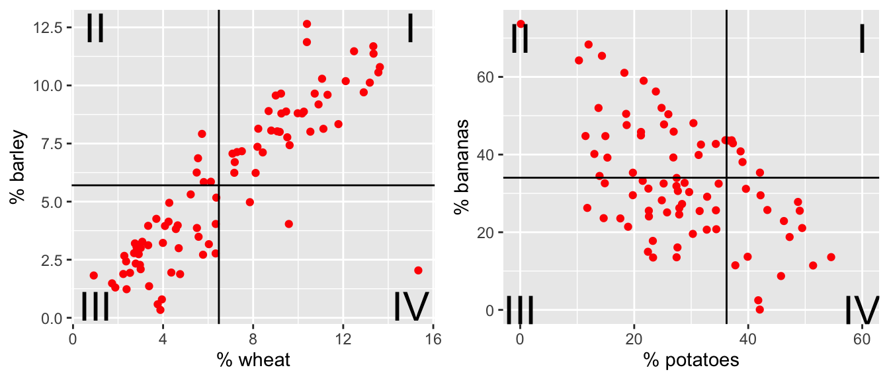
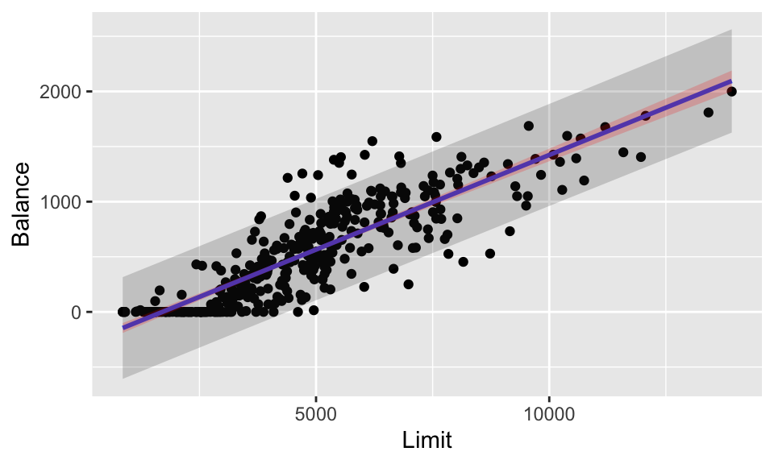

# Inference on SLR Parameters {#infslr}


The normal error regression model is not important for estimating a line.  A computer will happily minimize the sum of squares for any model you choose.  However, to do inference on linear parameters, you must have a normal error regression model.  From here on, unless otherwise stated, we will assume that the normal error regression model holds.$$Y_i = \beta_0 + \beta_1 x_i  + \epsilon_i$$ where $x_i$ is known, $\beta_0, \beta_1$ are parameters, and $\epsilon_i \sim N(0, \sigma^2)$ independently.  

**Sampling Distribution:** A sampling distribution is a distribution of a statistic measured on repeated random samples from a population.  Consider the <a href = "http://www.rossmanchance.com/applets/2021/regshuffle/regshuffle.htm" target="_blank">sampling applet</a> which provides a nice visual of a sampling distribution.

## Inference on $\beta_1$

recall:  $$b_1 = \frac{\sum(x_i - \overline{x})(y_i - \overline{y})}{\sum(x_i - \overline{x})^2}$$
We also know that,
\begin{eqnarray*}
E[b_1] &=& \beta_1\\
Var\{b_1\} &=& \frac{\sigma^2}{\sum(x_i - \overline{x})^2}\\
SE^2\{ b_1 \} &=& \frac{MSE}{\sum(x_i - \overline{x})^2}\\
\end{eqnarray*}
The variability of the *slope* becomes smaller for $x_i$ values that are more spread out.  This should make sense to you intuitively because if the $x_i$ values are spread out, slight deviations in their measurements (i.e., different random samples) won't change the slope of the line very much.  But if the $x_i$ exist only in a narrow range, it would be easy to get vastly different $b_1$ values depending on the particular random sample.  

### Distribution of $b_1$ {-}  
The distribution of $b_1$ (under the condition that $E[b_1] = \beta_1$ *and* the normal error regression model), should seem very familiar to you: $$T = \frac{b_1 - \beta_1}{s\{b_1\}} \sim t_{n-2}.$$
Recall that we use a t distribution on the standardized variable because we are not dividing by a constant.  Instead, we divide by the standard error which induces extra variability and thus a t distribution.  

Indeed, if $H_0: \beta_1=0$ is true, then
\begin{eqnarray*}
T = \frac{b_1 - 0}{s\{b_1\}} \sim t_{n-2}
\end{eqnarray*}
Note that the degrees of freedom are now $n-2$ because we are estimating two parameters ($\beta_0$ and $\beta_1$).  We reject the null hypothesis, if our $b_1$ leads us to a t-statistic that is larger than we would expect by random chance (i.e., our p-value is small).  

**p-value:**  The p-value is the probability of the observed data or more extreme if, in fact, the null hypothesis is true.

### CI for $\beta_1$ {-}
As with many other statistics for which we know the standard error, we can create intervals that give us some confidence in the statements (about the parameter) we are making.  In general, confidence intervals are of the form:

<center>
point estimate $\pm$ multiplier * SE(point estimate)</center>

An $(1-\alpha)100\%$ confidence interval for the slope parameter, $\beta_1$: is
\begin{eqnarray*}
b_1 &\pm& t^*_{\alpha/2,n-2} s\{b_1\}\\
b_1 &\pm& t^*_{\alpha/2, n-2} \sqrt{MSE/\sum(x_i - \overline{x})^2}\\
\end{eqnarray*}

Remember that $\beta_1$ is not random.  The randomness comes from the *data*, and so it is the endpoints of the CI that are random.  In interpreting a CI, we give an interval of plausible values for $\beta_1$ that would not have been rejected had we done a hypothesis test.  Alternatively, we think of the CI as a set of values for $\beta_1$ that we are fairly certain contains $\beta_1$.  If we were to repeat the process many times, $(1-\alpha)100\%$ of the time our interval captures the true parameter.  

Again, in regression we are finding linear relationships.  We cannot claim that the relationship between explanatory and response variables are causative.  Only with randomized studies will we be able to find causative mechanisms.  


### Parameter Interpretation {-}
A confidence interval gives us an estimate for the parameter(s) in our model, our goal is to understand the interpretation of these quantities.  

**Intercept $\beta_0$:**  The average value of $Y$ when $x$ is 0. Often, the intercept is not interpretable on its own.  For example, studying the relationship between height and weight, $\beta_0$ is the average weight of someone who is 0 inches tall.  Nonsense.  Very often $\beta_0$ is a placeholder, a number that needs to be specified but has no interpretation.  

**Slope $\beta_1$:** $\beta_1$ can be interpreted as the increase in the average of $Y$ when $x$ is incremented by a single unit. $$E[Y|x+1]-E[Y|x]=\beta_0+\beta_1(x+1)-(\beta_0+\beta_1x)=\beta_1$$


**Variance $\sigma^2$:**  The average squared deviation of an observation from the line.  


## Estimating a response

### Interpolation vs Extrapolation

One big problem with using the regression model is the condition of linearity and whether or not it actually holds.  As a result, if we are attempting to say something about $Y$ at a value of $x^*$ where we don't typically have any data, we can only reasonably do so as long as $x^*$ is contained in the range of data we do have.  This is called *interpolation*. *Extrapolation* on the other hand is trying to use your regression line outside of your range of data. The problem with extrapolation is that we have no evidence, nor any ability to check, whether the linear condition holds beyond the range of our data.  Consider the following example:  

We are interested in the amount of crop produced by a single plant as a function of the amount of compost added to the soil.  We take several plants, and apply small, but differing, amounts of compost to the plants.  What we see is as compost increases, the output of the plant increases as well, seemingly in a linear fashion.  Naivete might lead us to think that, using the regression line, we can use 100 kilograms of compost on a single plant and receive a huge amount of crop in return.  In truth, this will kill the plant.  We have no evidence that the relationship is linear for anything outside of the range of our data, and thus extrapolation is a mistake.  

With interpolation, we have data to support the linear relationship, and thus should be fine.  In trying to say something about what will happen at particular values of $x$, call them $x_h$, we need to think about exactly what we want to say.  If we know ahead of time what we want to say, we can design our experiment in smart ways, as we will see.

### Prediction Intervals vs Confidence Intervals
The linear regression line gives us our guess at the mean response for an individual at a particular value $x_h$.  

Our conditions give us $$E[Y|x]=\beta_0+\beta_1x$$

Plugging in our estimators, we get $$\hat{y_i}=b_0+b_1 x_i$$ as our fitted value. However, how accurate is this guess?  

A confidence interval gives you a range of plausible values for $E[Y|x]$. That is, the mean response at a fixed value of $x$.  A confidence interval differs from a prediction interval, which is intended to not only contain the mean response, but rather the value of the response for the next individual observed at value $x_h$.  As a result, the prediction interval will need to be larger than the confidence interval.

### Variability of point estimates
The following are the variances for $b_0$, $b_1$, the fitted value at $x_h$: $\hat{y}_{x_h}$, and a new value at $x_h$: $\hat{y}_{x_h(new)}$.  

$\sigma^2$ is the variance of the errors.  

\begin{eqnarray*}
\mbox{var}(b_0)&=&\sigma^2\left[\frac{1}{n}+\frac{\bar{x}^2}{\sum(x_i-\bar{x})^2}\right]\\
\mbox{var}(b_1)&=&\frac{\sigma^2}{\sum(x_i-\bar{x})^2}\\
\mbox{var}(\hat{y}_{x_h})&=&\sigma^2\left[\frac{1}{n}+\frac{(x_h-\bar{x})^2}{\sum(x_i-\bar{x})^2}\right]\\
\mbox{var}(\hat{y}_{x_h(new)})&=& \sigma^2 + \mbox(var)(\hat{y}_{x_h}) = \sigma^2\left[1+\frac{1}{n}+\frac{(x_h-\bar{x})^2}{\sum(x_i-\bar{x})^2}\right]
\end{eqnarray*}

These quantities are estimated by replacing $\sigma^2$ with our guess, which is $MSE$.  $b_0$ is a fitted value itself (when $x_h=0$), so the variability of $b_0$ is a special case of the 3rd formula.  The difference between the last two is one $\sigma^2$.  This should make sense, the variance of the next observation (point) is the variance of the mean (i.e., the predicted regression line) plus then the variance of the error on top of the mean.  

#### Standard Error:

The phrase "standard error" indicates the variability (square root of the variance) of a **statistic** under the situation where the variability is an estimate (that is, MSE is used instead of $\sigma^2$).  The SE of the quantities above are therefore given by:

\begin{eqnarray*}
\mbox{SE}(b_0)&=& \sqrt{MSE\left[\frac{1}{n}+\frac{\bar{x}^2}{\sum(x_i-\bar{x})^2}\right]}\\
\mbox{SE}(b_1)&=& \sqrt{\frac{MSE}{\sum(x_i-\bar{x})^2}}\\
\mbox{SE}(\hat{y}_{x_h})&=& \sqrt{MSE\left[\frac{1}{n}+\frac{(x_h-\bar{x})^2}{\sum(x_i-\bar{x})^2}\right]}\\
\mbox{SE}(\hat{y}_{x_h(new)})&=& \sqrt{MSE + \mbox(SE)(\hat{y}_{x_h})^2} = \sqrt{MSE\left[1+\frac{1}{n}+\frac{(x_h-\bar{x})^2}{\sum(x_i-\bar{x})^2}\right]}
\end{eqnarray*}


Confidence intervals are essentially our best guess plus or minus two standard errors.  To be exact, instead of 2, we use $qt(.975,n-p)$ where $p$ is the number of coefficients to be estimated (in SLR $p=2$).  The idea is that the smaller the standard errors, the narrower the confidence intervals will be, and the more information we will have.  

#### Notes: {-}
1. The prediction of a future (or mean) response is most accurate when $x_h = \overline{x}$.  Think about the behavior of the regression line away from $\overline{x}$.  The line is much more variable at the extremes.  
2. Confidence limits (i.e., % coverage) for $E[Y_h], \beta_0, \beta_1$ are not sensitive to departures from normality.  Especially for large sample sizes (because of the central limit theorem).
3. Coverage percentages for $\hat{y}_h$ are very sensitive to departures from normality.  There is no central limit theorem here because we are not estimating an average.  
4. Confidence limits apply only to one confidence interval (i.e., not the entire line).  We won't simultaneously be 95% confident for lots of different intervals.  We'll address this issue later.  


## ANOVA approach to regression

As mentioned previously, we can think of the variability in $Y$ as the total variability.  We could measure that variability without knowing anything about the explanatory variable(s).  But, knowledge of the explanatory variables helps us predict $Y$, that is, they remove some of the variability associated with the response.  Consider the following terms

\begin{eqnarray*}
SSTO &=& \sum (y_i - \overline{y})^2\\
SSE &=& \sum (y_i - \hat{y}_i)^2\\
SSR &=& \sum (\hat{y}_i - \overline{y})^2
\end{eqnarray*}

where SSTO is the sum of squares total; SSE is the sum of squared errors; and SSR is the sum of squares of the regression line.  Unsquared, the residuals have a nice relationship:

\begin{eqnarray*}
y_i - \overline{y} &=& \hat{y}_i - \overline{y} + y_i - \hat{y}_i\\
\mbox{total deviation} &=& \mbox{dev of reg around mean} + \mbox{dev around line}
\end{eqnarray*}
But when the residuals are each squared, it is not at all obvious that $$SSTO = SSR + SSE.$$  However, we can derive the relationship using algebra:
\begin{eqnarray*}
\sum(y_i - \overline{y})^2 &=& \sum [ (\hat{y}_i - \overline{y}) + (y_i - \hat{y}_i)]^2\\
&=& \sum(\hat{y}_i - \overline{y})^2 + \sum(y_i - \hat{y}_i)^2 + 2 \sum (\hat{y}_i - \overline{y})(y_i - \hat{y}_i)\\
&=& \sum(\hat{y}_i - \overline{y})^2 + \sum(y_i - \hat{y}_i)^2\\
\end{eqnarray*}
where the last term is zeroed out using equations (1.17) and (1.20) in ALSM (pgs 23-24).  


### Mean Squares

Sums of squares are increasing in number of data values.  To accommodate any number of observations, we use mean squares instead of sums of square

| MSR = SSR / 1    	| E[MSR] = $\sigma^2 + \beta_1^2 \sum(x_i - \overline{x})^2$ 	|
|------------------	|------------------------------------------------------------	|
| MSE = SSE/ (n-2) 	| E[MSE] = $\sigma^2$                                        	|


#### Notes:   {-}
1. MSE estimates $\sigma^2$ regardless of whether or not $\beta_1 = 0$.  
2. When $\beta_1=0$, MSR also estimates $\sigma^2$.  
3. A comparison of MSR and MSE would seem to indicate whether or not $\beta_1=0$.  
Note that we can think about MSR as the variability of the regression line around the line $\overline{y}$.  If $\beta_1=0$, then the regression line varies such that MSR is measuring the natural variability of the error terms ($\sigma^2$).  But if $\beta_1 \ne 0$, then the $b_1$ values still vary naturally PLUS there is a bit of a difference from the line $\beta_1$ to the line at $\mu_Y$.


### F test of $\beta_1 = 0$ versus $\beta_1 \ne 0$

\begin{eqnarray*}
H_0: \beta_1 = 0\\
H_a: \beta_1 \ne 0
\end{eqnarray*}
test statistic is $$F = \frac{MSR}{MSE} = \frac{\sum(\hat{y}_i - \overline{y})^2}{\sum(y_i - \hat{y}_i)^2 / (n-2)}.$$  Large values of $F$ support $H_a$, values of $F$ close to 1 support $H_0$.  **If $H_0$ is true, then** $$F \sim F_{1,n-2}.$$  Note that the F-test is always a one-sided test (meaning that we reject only for *BIG* values of $F$), though we are assessing a two-sided hypothesis.


```r
ames_inf %>%
  lm(price_ln ~ area, data = .) %>%
  anova() %>%
  tidy()
```

```
## # A tibble: 2 × 6
##   term         df sumsq   meansq statistic p.value
##   <chr>     <int> <dbl>    <dbl>     <dbl>   <dbl>
## 1 area          1  233. 233.         2901.       0
## 2 Residuals  2902  234.   0.0805       NA       NA
```


Notice that the `anova()` output  includes all of the information in the sums of squares to do the F-test and calculate $R^2$.  Also, with the `tidy()` function from **broom** the output is in a dataframe that is easy to work with.


### Equivalence of F and t-tests

$$F = \frac{SSR}{SSE/(n-2)} = \frac{b_1^2 \sum(x_i - \overline{x})^2}{MSE} = \frac{b_1^2}{MSE/\sum(x_i - \overline{x})^2} = \bigg(\frac{b_1}{s\{b_1\} }\bigg)^2 = (T)^2$$
We're going to continue to use this test as our models get more complicated.  The general strategy will always be:  

1. Fit full model: $SSE_{full} = \sum(y_i - b_0 - b_1 x_i)^2 = \sum(y_i - \hat{y}_i)^2$  
2. Fit reduced model (under $H_0$):  $SSE_{reduced} = \sum(y_i - b_0)^2 = \sum(y_i - \overline{y})^2 = SSTO$  
3. $F = \frac{SSE_{reduced} - SSE_{full}}{df_{reduced} - df_{full}}  \div \frac{SSE_{full}}{df_{full}} = \frac{MSR}{MSE}$


## Descriptive Measures of Linear Association

We discuss r (the correlation) and $R^2$ (the coefficient of determination) as descriptive measures of linear association because typically we are not interested in estimating a parameter.  Instead, $r$ and $R^2$ tell us how well our linear model fits the data.

### Correlation

Consider a scatterplot, there is variability in both directions:  $(x_i - \overline{x}) \ \& \ (y_i - \overline{y})$.  The data shown below represent crop types taken from [Our World in Data](https://ourworldindata.org/crop-yields) as part of [Tidy Tuesday](https://github.com/rfordatascience/tidytuesday/tree/master/data/2020/2020-09-01).  Each point in each plot is a different country.  The x and y variables represent the proportion of total yield in the last 50 years which is due to that crop type. 


<div class="figure" style="text-align: center">

<p class="caption">(\#fig:plots6ave)The % of total yield for different crops (across the last 50 years).  Each point represents a country.  Now lines at the average x and average y values have been superimposed onto the plots.</p>
</div>


For each red dot (on each plot), consider the distance the observation is from the $\overline{X}$ line and the $\overline{Y}$ line.  Is the observation (red dot) above both?  below both?  above one and below the other?  

How does the particular red dot (observation) contribute to the correlation?  In a positive way (to make $r$ bigger)?  In a negative way (to make $r$ smaller)?


**Positive Relationship:** As $x$ increases, if $Y$ also tends to increase, then the two variables are said to have a positive relationship (example: shoe size and height).  
**Negative Relationship:** As $x$ increases, if $Y$ tends to decrease, the two variables are said to have a negative relationship (example: outside temperature and heating oil used).  

So if the variables have a positive relationship, $r=\sqrt{R^2}$. If the variables have a negative relationship, then $r=-\sqrt{R^2}$.  
$r$ can be calculated directly as well, and is given by the following formula:

\begin{eqnarray*}
\mbox{sample covariance}&&\\
cov(x,y) &=& \frac{1}{n-1}\sum (x_i - \overline{x}) (y_i - \overline{y})\\
\mbox{sample correlation}&&\\
r(x,y) &=& \frac{cov(x,y)}{s_x s_y}\\
&=& \frac{\frac{1}{n-1} \sum (x_i - \overline{x}) (y_i - \overline{y})}{\sqrt{\frac{\sum(x_i - \overline{x})^2}{n-1} \frac{\sum(y_i - \overline{y})^2}{n-1}}}\\
&=& \frac{\sum[(x_i-\bar{x})(y_i-\bar{y})]}{\sqrt{\sum(x_i-\bar{x})^2\sum(y_i-\bar{y})^2}}
\end{eqnarray*}

The numerator of the correlation describes the relationship between $x$ and $y$.  If, when $x$ tends to be large (above its mean), if $y$ also tends to be large (above its mean), then we will have the product of two positive numbers, which is positive.  Likewise, if when $x$ is small, $y$ also tends to be small, we will have the product of two negative numbers, again positive.  So a positive relationship will result in a lot of positive numbers being summed in the numerator, and thus $r$ will be positive.  

When the relationship is negative, one will tend to be negative when the other is positive, thus the sum will involve a lot of negative terms causing $r$ to be negative.  The denominator is always positive.  

One more thing to note is that $r$ is not affected by the choice of what to label the predictor and what to label the response.  If the roles of $x$ and $y$ are switched, $r$ will remain unaffected.  Thus, $r$, unlike the value of our line, is symmetric.


* $-1 \leq r \leq 1$.
* $b_1 = r \frac{s_y}{s_x}$
* if $r=0, b_1=0$
* if $r=1, b_1 > 0$ but can be anything!
* $r < 0 \leftrightarrow b_1 < 0, r > 0 \leftrightarrow b_1 > 0$


### Coefficient of Determination

The coefficient of determination, given as $R^2$, has a nice interpretation, that of being the **proportion of variability in $y$ explained by the variable $x$**.  Recall, $SSE$, or sum of squared errors (or residuals) was a measure of the amount of variable remaining in the data after accounting for the information in $x$.  $SSTO$ or total sums of squares, measured the total amount of variability in the variable $y$.  The coefficient of determination is given as
$$R^2=1-\frac{SSE}{SSTO}$$
or, defining $SSR$ as the regression sum of squares (the amount of variation explained by the regression) $$R^2=\frac{SSR}{SSTO}.$$

**Limitations:**  
1. High $R^2$ does not necessarily produce good "predictions".  If there is a lot of variability around the line (i.e., within the data), you can have wide prediction intervals for your response.  
2. High $R^2$ does not necessarily mean the line is a good fit.  Quadratic (or other) relationships can sometimes lead to a high $R^2$.  Additionally, one outlier can have a huge effect on the value of $R^2$.  
3. $R^2 \approx 0$ does not mean that there is no relationship between $x$ and $y$.  Instead, $x$ and $y$ might have a perfect quadratic relationship.


## <i class="fas fa-lightbulb" target="_blank"></i> Reflection Questions

1. What are the different ways to use inference on the model parameters?  
2. What is the difference between a prediction and a confidence interval? When should each be used?  
3. How are the sums of squares broken up into meaningful pieces?  What are the differences between SSTO, SSE, and SSR?  
4. What is the interpretation of $R^2$?

## <i class="fas fa-balance-scale"></i> Ethics Considerations

1. If the technical conditions are violated, what does the CI tell us about the slope parameter?  What if it is only the normality condition?  
2. If the technical conditions are violated what does the PI tell us about the predicted values?  What if is is only the normality condition?  
3. What confounding variables might exist that link `Limit` and `Balance` as positively correlated but not causal?  
4. What population might the `ames` data be representative of?  What population might the `Credit` data be representative of? (Hint:  look at the data documentation by typing `?ames` or `?Credit`.)

## R: SLR Inference {#ames-inf}

### CIs

Also available through **broom** are CIs for the coefficients.  Consider the `ames` dataset available through the **openintro** package.

> Data set contains information from the Ames Assessor's Office used in computing assessed values for individual residential properties sold in Ames, IA from 2006 to 2010.

For reasons we will discuss in the coming chapters, we'll consider the $\ln$ of the price of the home, and we will also only consider homes which are less than 3000 square feet.


```r
library(openintro)
ames_inf <- ames %>%
  filter(area <= 3000) %>%
  mutate(price_ln = log(price))
```


```r
ames_inf %>%
  ggplot(aes(x = area, y = price_ln)) + 
  geom_point() + 
  geom_smooth(method = lm, se = FALSE)
```


```r
ames_inf %>%
  lm(price_ln ~ area, data = .) %>% 
  tidy(conf.int = TRUE, conf.level = 0.9)
```

```
## # A tibble: 2 × 7
##   term         estimate std.error statistic p.value  conf.low conf.high
##   <chr>           <dbl>     <dbl>     <dbl>   <dbl>     <dbl>     <dbl>
## 1 (Intercept) 11.1      0.0177        628.        0 11.1      11.1     
## 2 area         0.000614 0.0000114      53.9       0  0.000595  0.000632
```


R did the t-test automatically, but it could be done by hand using the provided SE (available in the column called `std.error`).

\begin{eqnarray*}
H_0:&& \beta_1 = 0\\
H_a:&& \beta_1 \ne 0\\
t &=& \frac{0.000613 - 0}{0.0000114} = 53.86\\
p-value &=& 2 P(t_{2902} \geq 53.86) = 2*(1-pt(53.86, 2902)) = \mbox{very small}\\
\end{eqnarray*}

Because the p-value is so small, reject the null hypothesis: to model a linear relationship between `area` and `price_ln`, the slope coefficient must be different from zero (greater than zero if we are doing a one-sided test).  Note that knowing we have a positive relationship does not tell us that `price_ln` is a *result* of `area`.  That is, there is no reason to believe a causative mechanism.

A 90% confidence interval for the slope coefficient, $\beta_1$ is (0.000595, 0.000632).  The true population slope to model `area` and `price_ln` is somewhere between (0.000595, 0.000632).  Note that even though the values seem small, they are *significantly* (not necessarily *substantially*) away from zero.  We should not be tempted to confuse small with zero, as the magnitude of the slope coefficient depends heavily on the units of measurement for our variables.

### Predictions

#### Predicting Ames

Fortunately, R allows for creating mean and prediction intervals.  We need to create a new data set that has the same variable name as our predictor, and the value we are interested in, we might call it `new_ames`. Then use `augment()`  to give either a confidence or prediction interval, as follows.  


```r
# store the linear model object so that we can use it later.
ames_lm <- lm(price_ln ~ area, data = ames_inf)

# create a new dataframe
new_ames <- data.frame(area = c(1000, 1500, 2000))

# get df from the model
ames_df <- ames_lm %>% glance() %>% select(df.residual) %>% pull()
ames_df
```

```
## [1] 2902
```

```r
# new data predictions
ames_pred <- ames_lm %>% 
  augment(newdata = new_ames, type.predict = "response", se_fit = TRUE)
ames_pred
```

```
## # A tibble: 3 × 3
##    area .fitted .se.fit
##   <dbl>   <dbl>   <dbl>
## 1  1000    11.7 0.00760
## 2  1500    12.0 0.00527
## 3  2000    12.3 0.00792
```


```r
# get the multiplier / critical value for creating intervals
crit_val <- qt(0.975, ames_df)
crit_val
```

```
## [1] 1.96
```

```r
# SE of the mean response
se_fit <- ames_pred %>% select(.se.fit) %>% pull()
se_fit
```

```
##       1       2       3 
## 0.00760 0.00527 0.00792
```

```r
# esimate of the overall variability, sigma
ames_sig <- ames_lm %>% glance() %>% select(sigma) %>% pull()
ames_sig
```

```
## [1] 0.284
```

```r
# calculate the SE of the predictions
se_pred <- sqrt(ames_sig^2 + se_fit^2)
se_pred
```

```
##     1     2     3 
## 0.284 0.284 0.284
```


```r
# calculating both confidence intervals for the mean responses and
# prediction intervals for the individual responses

ames_pred <- ames_pred %>%
  mutate(lower_PI = .fitted - crit_val * se_pred,
         upper_PI = .fitted + crit_val * se_pred,
         lower_CI = .fitted - crit_val * se_fit,
         upper_CI = .fitted + crit_val * se_fit)

ames_pred
```

```
## # A tibble: 3 × 7
##    area .fitted .se.fit lower_PI upper_PI lower_CI upper_CI
##   <dbl>   <dbl>   <dbl>    <dbl>    <dbl>    <dbl>    <dbl>
## 1  1000    11.7 0.00760     11.2     12.3     11.7     11.7
## 2  1500    12.0 0.00527     11.5     12.6     12.0     12.0
## 3  2000    12.3 0.00792     11.8     12.9     12.3     12.3
```

Or, to create intervals for the entire range of explanatory variables:


```r
ames_pred_all <- ames_lm %>% 
  augment(type.predict = "response", se_fit = TRUE) %>%
  mutate(.se.pred = sqrt(ames_sig^2 + .se.fit^2)) %>%
  mutate(lower_PI = .fitted - crit_val * .se.pred,
         upper_PI = .fitted + crit_val * .se.pred,
         lower_CI = .fitted - crit_val * .se.fit,
         upper_CI = .fitted + crit_val * .se.fit)

ames_pred_all %>%
  ggplot(aes(x = area, y = price_ln)) + 
  geom_point() +
  stat_smooth(method = lm, se = FALSE) +
  geom_ribbon(aes(ymin = lower_PI, ymax = upper_PI), 
              alpha = 0.2) + 
  geom_ribbon(aes(ymin = lower_CI, ymax = upper_CI), 
              alpha = 0.2, fill = "red")
```


Or, it turns out, there are **easier** ways for the computer to find confidence and prediction intervals:


```r
ames_lm %>% 
  augment(newdata = new_ames, interval = "confidence")
```

```
## # A tibble: 3 × 4
##    area .fitted .lower .upper
##   <dbl>   <dbl>  <dbl>  <dbl>
## 1  1000    11.7   11.7   11.7
## 2  1500    12.0   12.0   12.0
## 3  2000    12.3   12.3   12.3
```

```r
ames_lm %>% 
  augment(newdata = new_ames, interval = "prediction")  
```

```
## # A tibble: 3 × 4
##    area .fitted .lower .upper
##   <dbl>   <dbl>  <dbl>  <dbl>
## 1  1000    11.7   11.2   12.3
## 2  1500    12.0   11.5   12.6
## 3  2000    12.3   11.8   12.9
```

Also, graphs can be made, but we'll need to keep the output (and use the entire dataset instead of `new_ames`).


```r
ames_conf <- ames_lm %>% 
  augment(interval = "confidence")

ames_pred <- ames_lm %>% 
  augment(interval = "prediction")  

ames_pred %>%
  ggplot(aes(x = area, y = price_ln)) + 
  geom_point() +
  geom_smooth(method = lm, se = FALSE) +
  geom_ribbon(aes(ymin = .lower, ymax = .upper), 
              alpha = 0.2) + 
  geom_ribbon(ames_conf, mapping = aes(ymin = .lower, ymax = .upper), 
              alpha = 0.2, fill = "red")
```


#### Predicting Credit

In contrast to the `ames` data, note how the predictions (particulary the CI around the line) drastically changes when the sample size is small.


```r
library(ISLR)  # source of the Credit data
# store the linear model object so that we can use it later.
credit_lm <- lm(Balance ~ Limit, data = Credit)

# create a new dataframe
new_credit <- data.frame(Limit = c(1000, 3000, 7000))

# get df from the model
credit_df <- credit_lm %>% glance() %>% select(df.residual) %>% pull()
credit_df
```

```
## [1] 398
```

```r
# new data predictions
credit_pred <- credit_lm %>% 
  augment(newdata = new_credit, type.predict = "response", se_fit = TRUE)
credit_pred
```

```
## # A tibble: 3 × 3
##   Limit .fitted .se.fit
##   <dbl>   <dbl>   <dbl>
## 1  1000   -121.    22.2
## 2  3000    222.    14.6
## 3  7000    909.    16.4
```


```r
# get the multiplier / critical value for creating intervals
crit_val <- qt(0.975, credit_df)
crit_val
```

```
## [1] 1.97
```

```r
# SE of the mean response
se_fit <- credit_pred %>% select(.se.fit) %>% pull()
se_fit
```

```
##    1    2    3 
## 22.2 14.6 16.4
```

```r
# esimate of the overall variability, $\sigma$
credit_sig <- credit_lm %>% glance() %>% select(sigma) %>% pull()
credit_sig
```

```
## [1] 234
```

```r
# calculate the SE of the predictions
se_pred <- sqrt(credit_sig^2 + se_fit^2)
se_pred
```

```
##   1   2   3 
## 235 234 234
```


```r
# calculating both confidence intervals for the mean responses and
# prediction intervals for the individual responses

credit_pred <- credit_pred %>%
  mutate(lower_PI = .fitted - crit_val * se_pred,
         upper_PI = .fitted + crit_val * se_pred,
         lower_CI = .fitted - crit_val * se_fit,
         upper_CI = .fitted + crit_val * se_fit)

credit_pred
```

```
## # A tibble: 3 × 7
##   Limit .fitted .se.fit lower_PI upper_PI lower_CI upper_CI
##   <dbl>   <dbl>   <dbl>    <dbl>    <dbl>    <dbl>    <dbl>
## 1  1000   -121.    22.2    -582.     340.    -165.    -77.4
## 2  3000    222.    14.6    -238.     682.     193.    251. 
## 3  7000    909.    16.4     448.    1369.     876.    941.
```

Or, to create intervals for the entire range of explanatory variables:


```r
credit_pred_all <- credit_lm %>% 
  augment(type.predict = "response", se_fit = TRUE) %>%
  mutate(.se.pred = sqrt(credit_sig^2 + .se.fit^2)) %>%
  mutate(lower_PI = .fitted - crit_val * .se.pred,
         upper_PI = .fitted + crit_val * .se.pred,
         lower_CI = .fitted - crit_val * .se.fit,
         upper_CI = .fitted + crit_val * .se.fit)

credit_pred_all %>%
  ggplot(aes(x = Limit, y = Balance)) + 
  geom_point() +
  stat_smooth(method = lm, se = FALSE) +
  geom_ribbon(aes(ymin = lower_PI, ymax = upper_PI), 
              alpha = 0.2) + 
  geom_ribbon(aes(ymin = lower_CI, ymax = upper_CI), 
              alpha = 0.2, fill = "red")
```




### ANOVA output

Note that `tidy()` creates a dataframe which is slighlty easier to work with, but regardless of `tidy()` the `anova()` function provides the exact same output.


```r
ames_inf %>%
  lm(price_ln ~ area, data = .) %>%
  anova() 
```

```
## Analysis of Variance Table
## 
## Response: price_ln
##             Df Sum Sq Mean Sq F value Pr(>F)    
## area         1    233   233.4    2901 <2e-16 ***
## Residuals 2902    234     0.1                   
## ---
## Signif. codes:  0 '***' 0.001 '**' 0.01 '*' 0.05 '.' 0.1 ' ' 1
```

```r
ames_inf %>%
  lm(price_ln ~ area, data = .) %>%
  anova() %>%
  tidy()
```

```
## # A tibble: 2 × 6
##   term         df sumsq   meansq statistic p.value
##   <chr>     <int> <dbl>    <dbl>     <dbl>   <dbl>
## 1 area          1  233. 233.         2901.       0
## 2 Residuals  2902  234.   0.0805       NA       NA
```


```r
ames_inf %>%
  mutate(bedrooms = case_when(
    Bedroom.AbvGr <=1 ~ "1",
    Bedroom.AbvGr <=2 ~ "2",
    Bedroom.AbvGr <=3 ~ "3",
    TRUE ~ "4+"
  )) %>%
  ggplot(aes(x = area, y = price_ln, color = bedrooms)) + 
  geom_point() + 
  geom_smooth(method = lm, se = FALSE)
```


