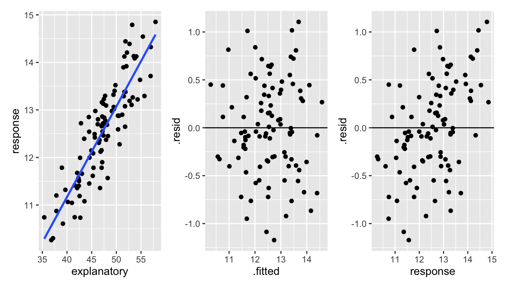
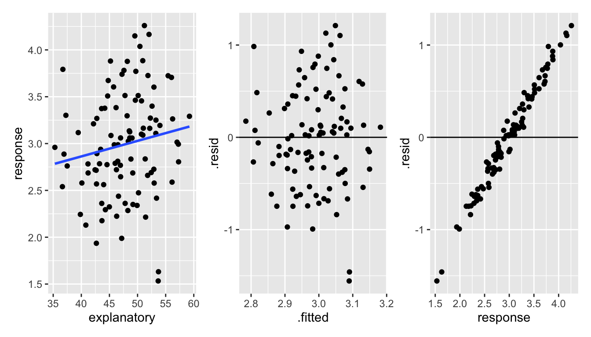
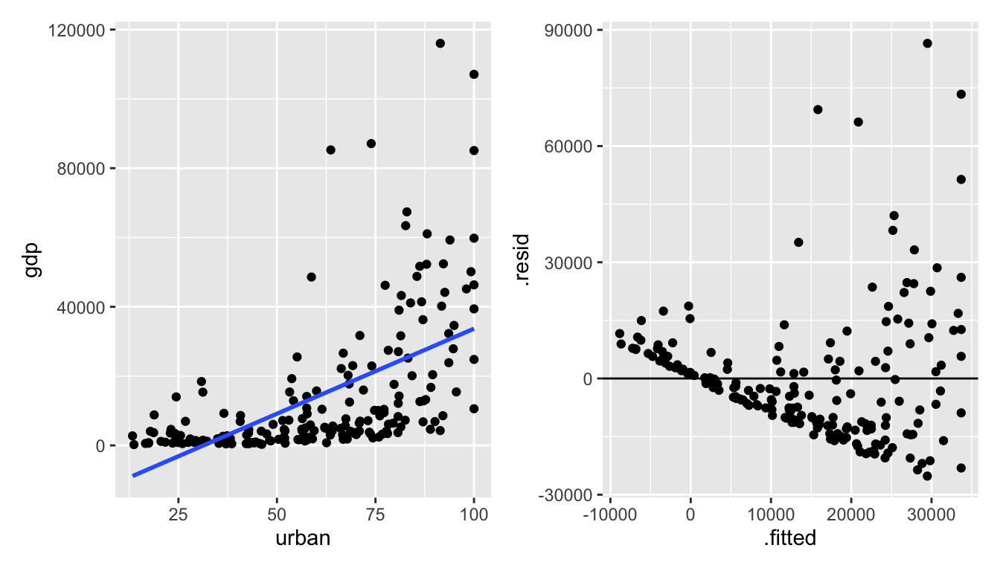
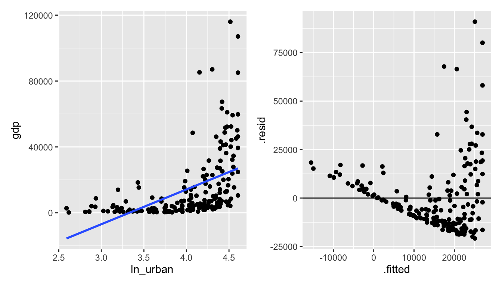
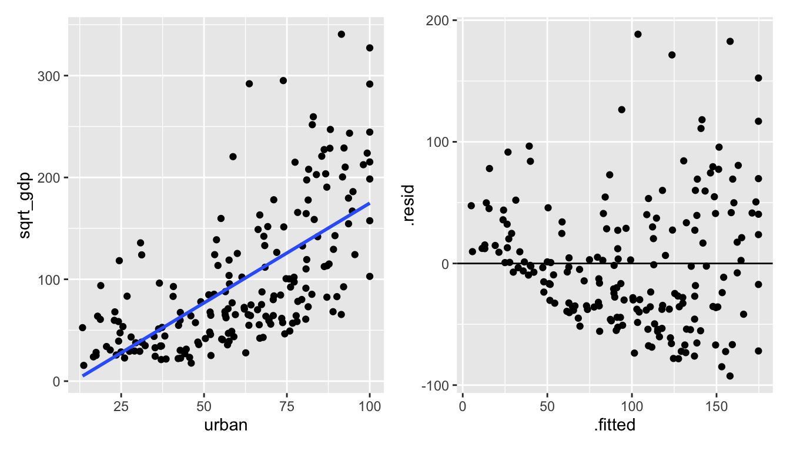
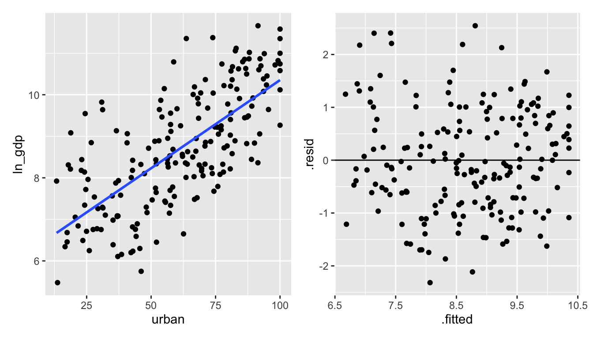
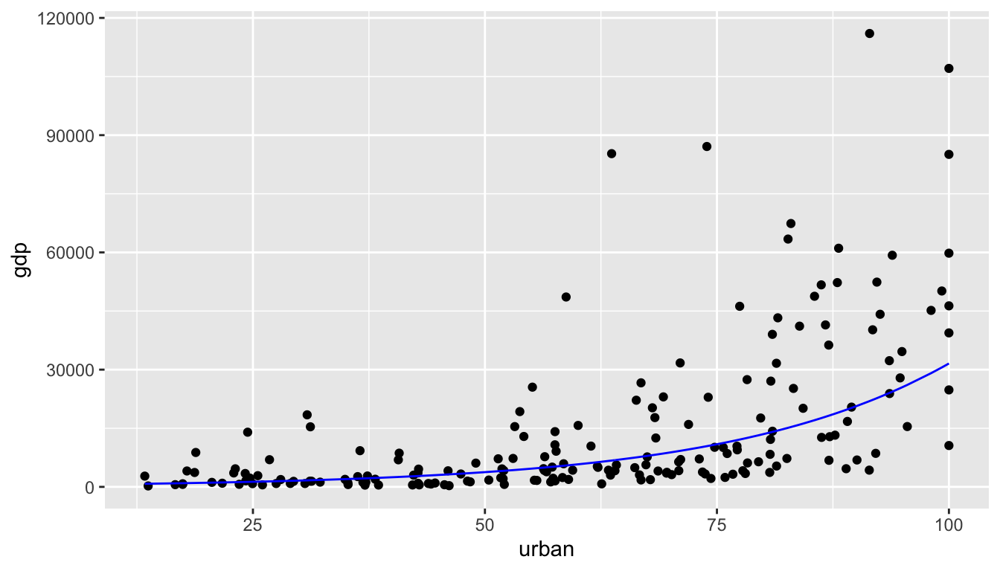
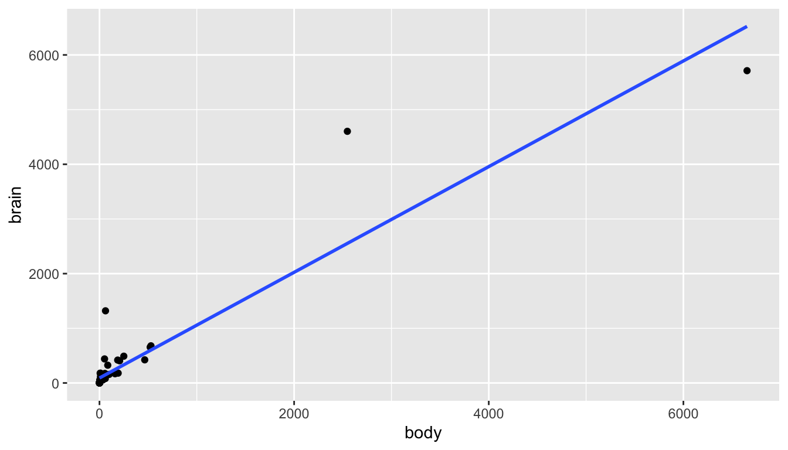
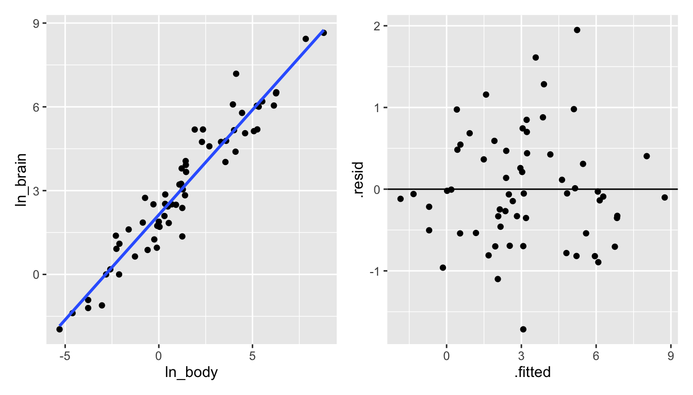

# Diagnostic Measures I {#diag1}


## Model Conditions

* linear relationship  
* constant variance  
* independent errors  
* normal errors  
* no outliers  (that's part of the normality condition)

#### Notes: {-}
1. There are *no* required conditions about the explanatory / predictor variable.  
2. If the explanatory variable is binary, SLR becomes the two-sided t-test.  
Remember, $x_i$ are constants, so we don't think of them as having a distribution.  Also, we are allowed to construct whatever $x_i$ we want.  That said,  
3. A larger range of $x_i$ will produce less variable predictions.  
4. However, outliers in the x-direction can be very influential.


### Residuals

\begin{eqnarray*}
\mbox{residual: } e_i &=& y_i -  \hat{y}_i \ \ \ \mbox{we can measure}\\
\mbox{error term: } \epsilon_i &=& y_i - E[Y_i] \ \ \ \mbox{we cannot measure}
\end{eqnarray*}


**mean:** $\overline{e} = 0$ (by definition!).  Therefore, the average of the residuals provides no information about whether $E[\epsilon]=0$.    
(note: $\sum e_i = \sum(y_i - b_0 - b_1 x_i) = 0$ because $\frac{\delta Q}{\delta \beta_0} = 0$.)  
**variance:** $$s^2 = \frac{1}{(n-2)} \sum (y_i - \hat{y}_i)^2 = \frac{1}{(n-2)} \sum (e_i)^2 = \frac{1}{(n-2)} \sum (e_i - \overline{e})^2 = \frac{SSE}{(n-2)} = MSE$$
**non-independent:** because $\sum e_i=0$, the residuals are not independent.  It is the $\epsilon_i$, errors, we assume to be independent.  

#### semistudentized residuals {-}

$$e_i^* = \frac{e_i - \overline{e}}{\sqrt{MSE}} = \frac{e_i}{\sqrt{MSE}}$$  But MSE isn't quite the variance of $e_i$.  It is actually an *estimate* of the variance of $\epsilon_i$.  But good enough for right now.

## Diagnostic Plots of Residuals


[1] Plots of residuals vs. predictor variables / explanatory variables.  
[3] Plots of residuals vs. fitted values.  
[6] Box plot (histogram) of residuals.  

What do I do if the plots show that the conditions don't hold??  
1. Abandon regression model and use something more appropriate.  If you are interested in the coefficients: nonparametrics, time series, random forests.  If you are only interested in prediction, maybe it is okay that the conditions don't hold?  But maybe not (e.g., independence is key!).  Other prediction models include: random forests, support vector machines, neural networks, loess (smoothing).      
2. Transform the variables so that the model does hold.

#### Violating Linearity {-}
**You see:** a pattern to the scatterplot that isn't linear   
**You do:**   
- include a $x^2$ term or other function of $x$.  
- you can linearize a non-linear function, but the interpretation can get complicated.

#### Violating Constant Errors {-}
**You see:**  
- typically we see errors increase as $x$ increases (which is sometimes easier to see with the absolute value of the residuals).  
- not a hugely serious problem (we have less efficient estimates, and our variance estimates are not correct)  
**You do:**  
- direct approach is to use weighted least squares (we won't talk about this)  
- often transformations stabilize variance

#### Violating Independent Errors {-}
**You see:**  
- typically due to another variable (time, geographic location, etc.)  
- residual should be plotted against that variable.  
**You do:**  
- work with a model that accounts for a correlated error structure (e.g., time series)

#### Violating Normal Errors {-}
**You see:**  
- residual plots that are not symmetric  
- very general empirical rule: $68\% \pm \sqrt{MSE}$, $95\% \pm 2\sqrt{MSE}$  (only concerned if grossly different)  
- we won't cover normal probability plots (also called q-q plots)  
**You do:**  
- non-normality and non-constant variance are often related, and transformations will typically fix both.

#### Having Outliers {-}
**You see:**  
- typically easiest to see with standardized or studentized residuals  
- SLR is not resistant to outliers  
- we expect about 95% of studentized residuals to be within $\pm 2$.  
**You do:**  
- outliers can seriously deform the least squares estimate.  If there is a good reason to keep the value(s), we might consider a nonparametric method which places less weight on such a point.  


#### Why do we plot resid vs. fitted and not vs. observed? {-}

We know that $e_i$ and $\hat{y}_i$ are uncorrelated (this can be shown using linear algebra, also note that $\sum e_i \hat{y}_i = 0$).  So, if we go from the resid vs. fitted scatterplot to the resid vs. observed scatter plot, we shift each point in the x-direction (only) by an amount equal to the residual.  If the residual is negative, then the point will shift to the left.  If the residual is positive, then the point will shift to the right. We thus create a positively correlated relationship (between resid and observed).  The degree of the shift will depend on the relative magnitudes of the residuals and predicted values.

$\Rightarrow e_i \mbox{ and } y_i$ are correlated and therefore **not** independent.  Consider the two examples below.  In both examples, the residual is correlated with the response variable.  However, it is easier to see the correlation when the residual is not also responsible for the relationship between the response variable and the explanatory variable.


<div class="figure" style="text-align: center">

<p class="caption">(\#fig:unnamed-chunk-3)With correlated data, it is hard to see the dependence between the response variable and the residuals.  However, a careful look at the third plot shows that there is a slightly stronger correlating between the response variable and the residuals than there is between the fitted values and the residuals.</p>
</div>

<div class="figure" style="text-align: center">

<p class="caption">(\#fig:unnamed-chunk-4)With uncorrelated data, it is much easier to see the dependence between the response variable and the residuals.</p>
</div>


## Transformations

**Important note!!**  The idea behind transformations is to make the model as appropriate as possible for the data at hand.  We want to find the correct **linear** model; we want our conditions to hold.  We are not trying to find the most *significant* model or big $R^2$.


<div class="figure" style="text-align: center">

<p class="caption">(\#fig:unnamed-chunk-5)Taken from Applied Linear Statistical Models, 5th ed. by Kutner et al. Figures 3.13 and 3.15.</p>
</div>


## Correcting Condition Violations
If we noticed a non-linear relationship, we could certainly think to fit a non-linear trend line. At the same time, we might consider fitting an exponential
relationship, or some other functional form.  What we do is still called linear regression, but we transform the data so that the we
are fitting a linear model between $f(y)$ and $g(x)$. This way, our techniques and theory still follow, least squares etc.  For
instance, we might think of fitting a linear relationship to the new variables $y^*=\sqrt{y}$ and $x$, or possibly $y$ and $x^*=x^2$. Occasionally, we might think of transforming both variables.  One general rule is as follows:

* If your initial fit shows a violation of the linear condition only, then it is best to transform $x$.  
* If your initial fit shows a violation of the linear condition as well as normality issues or heteroscedasticity, then a transform of $y$ should be considered. There will hopefully be a transformation which will correct both problems at once.  
* That is, changing $x$ changes the shape of the relationship.  Changing $Y$ changes the error structure (and also often the shape).  

Note:  Formal testing for violations of model conditions is usually not a good idea.  Why?  Multiple testing problems arise (extra type I errors); additional tests are typically very sensitive to their own technical conditions; and we lose power to detect the differences of interest.


### GDP Example

Consider the following data which was collected by The World Bank in 2020^[http://data.worldbank.org/].  The data include GDP and % Urban Population. A description of the variables as defined by The World Bank are provided below.^[Thank you to Laura Ziegler at Iowa State for providing the data.]

> GDP: "GDP per capita is gross domestic product divided by midyear population. GDP is the sum of gross value added by all resident producers in the economy plus any product taxes and minus any subsidies not included in the value of the products. It is calculated without making deductions for depreciation of fabricated assets or for depletion and degradation of natural resources. Data are in current U.S. dollars."

 
> Urban Population (% of total): "Urban population refers to people living in urban areas as defined by national statistical offices. It is calculated using World Bank population estimates and urban ratios from the United Nations World Urbanization Prospects."


<div class="figure" style="text-align: center">

<p class="caption">(\#fig:unnamed-chunk-7)It seems as though the original data don't meet the LINE conditions needed for inference in a linear model.</p>
</div>


Let's try to transform the variables to get a model which seems to conform to the LINE technical conditions.

<div class="figure" style="text-align: center">

<p class="caption">(\#fig:unnamed-chunk-8)ln(urban) vs gdp:  seems like taking the natural log of urban makes the relationship worse.</p>
</div>

Alas, it really seems like the `gdp` variable is more of the problem than the `urban` variable.  Let's transform `gdp` instead.

<div class="figure" style="text-align: center">

<p class="caption">(\#fig:unnamed-chunk-9)urban vs gdp^2:  squaring gdp also makes the relationship worse.</p>
</div>

The needed transformation should spread out the small `gdp` values and shrink the large `gdp` values.

<div class="figure" style="text-align: center">

<p class="caption">(\#fig:unnamed-chunk-10)urban vs sqrt(gdp):  the square root of gdp seems to help!</p>
</div>


The natural log is a stronger function than the square root (that is, it will shrink large values even more.).

<div class="figure" style="text-align: center">

<p class="caption">(\#fig:unnamed-chunk-11)urban vs ln(gdp):  the natural log of gdp creates a residual plot that seems to follow all of the LINE technical conditions.</p>
</div>


The Box-Cox transformations are a class of transformations.  Generally, $\ln, \exp$, square root, and polynomial transformations are sufficient to fit a linear model which satisfies the necessary technical conditions.  We won't spend time learning about Box-Cox, but you can read about them to learn more about transforming variables.


### Interpreting Regression Coefficients {-}

**Example 1:**  Transforming $x$:  $x' = \ln(x)$  $$E[Y] = \beta_0  + \beta_1 \ln(x)$$  We can interpret $\beta_1$ in the following way:  for every increase in 1 unit of $\ln(x)$, $E[Y]$ increases by $\beta_1$.  Which isn't a very meaningful statement.  Instead, consider $$E[Y| \ln(2x)] - E[Y|\ln(x)] = \beta_1 \ln(2).$$  Which can be interpreted as a doubling of $x$ gives an additive increase of E[Y] of $\beta_1 \ln(2)$ units.  

**Example 2:** Transforming $Y$: $Y' = \ln(Y)$  $$E[\ln(Y)] = \beta_0  + \beta_1 x$$  Note also that $$ E[\ln(Y)] = median(\ln(Y))$$ because the distribution of $\ln(Y)$ is symmetric around the regression line.

\begin{eqnarray*}
median(\ln(Y)) = \beta_0 + \beta_1 x\\
median(Y) = e^{\beta_0} e^{\beta_1 x}\\
\frac{median(Y| x+1)}{median(Y| x)} = e^{\beta_1}\\
\end{eqnarray*}
An increase in 1 unit of x is associated with a multiplicative change of $e^{\beta_1}$ in median($Y$).  Important to keep in mind that
\begin{eqnarray*}
E[\ln(Y)] \ne \ln(E[Y])\\
median(\ln(Y)) = \ln(median(Y))
\end{eqnarray*}

**Example 3:** Transforming $x$ and $Y$:  $x' = \ln(x)$ and  $Y' = \ln(Y)$  $$E[\ln(Y)] = \beta_0  + \beta_1 \ln(x)$$
\begin{eqnarray*}
\frac{median(Y|2x)}{median(Y|x)} &=& \frac{e^{\beta_0 + \beta_1 \ln(2x)}}{e^{\beta_0 + \beta_1 \ln(x)}}\\
&=& e^{\beta_1 (\ln(2x) - \ln(x))}\\
&=& e^{\beta_1 \ln(2)} = 2^{\beta_1}
\end{eqnarray*}
A doubling of $x$ is associated with a multiplicative change of $2^{\beta_1}$ in median of Y.


Note that the model regressing GDP on % urban used a log transformation on GDP (the response, or Y variable).  As such we know that:

\begin{eqnarray*}
\hat{\ln(Y)} &=& \mbox{median}(\ln(Y)) = b_0 + b_1 \cdot x\\
\mbox{median}(Y) &=& \exp(b_0 + b_1 \cdot x)
\end{eqnarray*}

By using the coefficients which are output from the linear model regressing `ln_gdp` on `urban`, we can find a model which predicts the **median** `gdp` (not transformed!) as a function of `urban`.


```r
GDP %>%
  lm(ln_gdp ~ urban, data = .) %>%
  tidy()
```

```
## # A tibble: 2 × 5
##   term        estimate std.error statistic  p.value
##   <chr>          <dbl>     <dbl>     <dbl>    <dbl>
## 1 (Intercept)   6.11     0.202        30.3 1.18e-74
## 2 urban         0.0425   0.00308      13.8 2.29e-30
```

\begin{eqnarray*}
\mbox{median}(\verb;ln_gdp;) &=& \exp(6.11 +  0.0425 \cdot \verb;urban;)
\end{eqnarray*}


```r
GDP %>%
  ggplot() + 
  geom_point(aes(x = urban, y = gdp)) + 
  geom_line(aes(x = urban, y = exp(6.11 + 0.0425*urban)), color = "red")
```

<div class="figure" style="text-align: center">

<p class="caption">(\#fig:unnamed-chunk-13)The red exponential line represents the median GDP at a particular value of % urban.</p>
</div>


## <i class="fas fa-lightbulb" target="_blank"></i> Reflection Questions

### Residuals
1. How do we know if the model conditions hold?
2. What do we do if the model conditions don't hold?
3. With a log transformation, how is the slope coefficient interpreted?
4. What happens if we want to add lots of explanatory variables to the model?
5. How would we add a quadratic term?

## <i class="fas fa-balance-scale"></i> Ethics Considerations

1. The GDP model has country as observational unit (192 countries).   A quick Google shows that the UN currently defines 193 countries  Leaving aside that we might be one short, do the technical conditions need apply if we have the entire population? Can we think of the country data in 2020 as representative of any other (unknown?) population?  
2. The `mammals` dataset was collected in 1976. Are there reasons why a 50 year old dataset might not represent an accurate model of the population today?


## R: SLR Inference

Consider the `mammals` dataset in the **MASS** package (be careful with the **MASS**, it will overwrite the **dplyr** functions `filter` and `select`) representing the average brain (g) and body (kg) weights for 62 species of land mammals^[Allison, T. and Cicchetti, D. V. (1976) Sleep in mammals: ecological and constitutional correlates. Science 194, 732–734.].

From a first glance at the linear model, it doesn't seem like there is really any linear relationship at all!  And certainly the residuals don't look like what we'd hoped for the LINE technical conditions.  


```r
library(MASS)  # be careful with MASS, it messes up filter and select
data(mammals)

mammals %>% 
  ggplot(aes(x = body, y = brain)) + 
  geom_point() + 
  geom_smooth(method = "lm", se = FALSE)
```



```r
mammals %>%
  lm(brain ~ body, data = .) %>%
  augment() %>%
  ggplot(aes(x = .fitted, y = .resid)) + 
  geom_point() + 
  geom_hline(yintercept = 0)
```


Let's try some log transformations (square root transformations might also make sense).  


```r
mammals <- mammals %>%
  mutate(ln_body = log(body),
         ln_brain = log(brain))

library(patchwork)  # to get the plots next to one another

p1 <- mammals %>% 
  ggplot(aes(x = ln_body, y = brain)) + 
  geom_point() + 
  geom_smooth(method = "lm", se = FALSE)

p2 <- mammals %>%
  lm(brain ~ ln_body, data = .) %>%
  augment() %>%
  ggplot(aes(x = .fitted, y = .resid)) + 
  geom_point() + 
  geom_hline(yintercept = 0)

p1 + p2
```

<div class="figure" style="text-align: center">

<p class="caption">(\#fig:unnamed-chunk-15)Taking the natural log of the body weight doesn't seem to create a model with a linear shape.</p>
</div>


```r
p3 <- mammals %>% 
  ggplot(aes(x = body, y = ln_brain)) + 
  geom_point() + 
  geom_smooth(method = "lm", se = FALSE)

p4 <- mammals %>%
  lm(ln_brain ~ body, data = .) %>%
  augment() %>%
  ggplot(aes(x = .fitted, y = .resid)) + 
  geom_point() + 
  geom_hline(yintercept = 0)

p3 + p4
```

<div class="figure" style="text-align: center">

<p class="caption">(\#fig:unnamed-chunk-16)Taking the natural log of the brain weight also doesn't seem to create a model with a linear shape.</p>
</div>


```r
p5 <- mammals %>% 
  ggplot(aes(x = ln_body, y = ln_brain)) + 
  geom_point() + 
  geom_smooth(method = "lm", se = FALSE)

p6 <- mammals %>%
  lm(ln_brain ~ ln_body, data = .) %>%
  augment() %>%
  ggplot(aes(x = .fitted, y = .resid)) + 
  geom_point() + 
  geom_hline(yintercept = 0)

p5 + p6
```

<div class="figure" style="text-align: center">

<p class="caption">(\#fig:unnamed-chunk-17)Taking the natural log of both the brain and the body weight does seem to create a model with a linear shape!</p>
</div>


# Simultaneous Inference (sections 4.1, 4.2, 4.3 in ALSM)

## Joint Estimation of $\beta_0$ and $\beta_1$


Note that all the inference on $\beta_1$ can be performed on $\beta_0$ with only slight modifications to the formula for the SE.  Although $\beta_1$ is typically more related to the research question at hand, $\beta_0$ can also be informative in its own right.  Indeed, if we were interested in CI for either one, we would calculate the following:

$$b_0 \pm t_{(1-\alpha/2), n-2} \cdot s\{b_0\}$$
$$b_1 \pm t_{(1-\alpha/2), n-2} \cdot s\{b_1\}$$

Clearly if we had many parameters and many intervals, we wouldn't think that they would *all* cover the true parameters with probability $(1-\alpha)$.  To figure out the probability that they all cover their true parameter, let's define
\begin{eqnarray*}
A_1 &=& \mbox{first CI does not cover } \beta_0\\
P(A_1) &=& \alpha\\
A_2 &=& \mbox{second CI does not cover } \beta_1\\
P(A_2) &=& \alpha\\
\end{eqnarray*}

We want to bound the probability that all the intervals cover the true parameter.
\begin{eqnarray*}
P(\mbox{all CIs cover}) &=& 1- P(\mbox{at least one CI does not cover})\\
&=& 1 - P( A_1 \mbox{ or } A_2)\\
&&\\
P( A_1 \mbox{ or } A_2) &=& P(A_1) + P(A_2) - P(A_1 \mbox{ and } A_2)\\
&=& \alpha + \alpha - ???\\
& \leq& 2 \alpha \\
P(\mbox{at least one CI does not cover}) &\leq& 2 \alpha\\
P(\mbox{all CIs cover}) &\geq& 1- 2 \alpha\\
\end{eqnarray*}

Note that if we make two 95% CIs, the Bonferroni inequality tells us that both will cover their respective parameters in 90% of such repeated samples (i.e., with 90% confidence).

With $g$ CIs, letting the multiplier be at a level of significance given by $\alpha/g$ will create familywise confidence intervals with a level of significance of $\alpha$.

For $\beta_0$ and $\beta_1$, let $B = t_{(1-\alpha/4), n-2}$.  Then the intervals with $1-\alpha$ familywise confidence limits are:

$$b_0 \pm B \cdot s\{b_0\}$$
$$b_1 \pm B \cdot s\{b_1\}$$


* Note that interpretations depend heavily on the number of intervals (which is true about most multiple comparison adjustments).  
* Bonferroni is extremely conservative, and therefore it has low power.  
* Bonferroni easily extends to any number of comparisons.  
* Bonferroni can adjust for multiple comparisons even when comparing very different types of analyses (e.g., CI for slope parameter and for a predicted response).  

## Simultaneous Estimation of a Mean Response

As with the intervals for the parameters, creating intervals for multiple mean responses leads to problems of multiple comparisons.  Again, the goal is to adjust the intervals such that the probability of getting a dataset which will lead to intervals covering {\em all} mean responses is $1-\alpha$.

(Note that the reason for simultaneous inference is because the combination of natural sampling variability in $b_0$ and $b_1$ could lead to the mean responses being correct for $E[Y_h]$ over some range of $x$ values and incorrect for a different range of $x$ values.)

### Working-Hotelling Procedure {-}

The Working-Hotelling procedure gives a confidence band for the entire range of $x$ values.   The family confidence interval for the simultaneous intervals is $1-\alpha$.  Note that the multiplier is determined to bound the entire line over the complete range of $x$ values.

$$\hat{y}_h \pm W s \{ \hat{y}_h \}$$
where $W^2 = 2 F_{(1-\alpha; 2, n-2)}$.

### Bonferroni Procedure {-}

We could have also produced Bonferroni intervals, but those would have been determined using the number $g$ of intervals of interest (as opposed to Working-Hotelling which cover the entire range of $x$ values).

$$\hat{y}_h \pm B \cdot s \{ \hat{y}_h \}$$
where $B = t_{(1-\alpha/2g; n-2)}$.


## Simultaneous Prediction Intervals for New Observations

Just as with estimating the mean response, the interval for predicting new observations can be adjusted so that the total range of observations are contained in the appropriate intervals with probability $1-\alpha$.   For prediction intervals, it is necessary to specify the number $g$ intervals of interest.

### Scheffé Procedure{-}

The Scheffé  procedure gives a confidence band for a set of $x$ values, $g$ of them.   Using the Scheffé procedure, the family confidence interval for the simultaneous intervals is $1-\alpha$.

$$\hat{y}_h \pm S \cdot s \{ \mbox{pred} \}$$
where $S^2 = g F_{(1-\alpha; g, n-2)}$.

### Bonferroni Procedure {-}

We could have also produced Bonferroni intervals, but those would have been determined using the number $g$ of intervals of interest (as opposed to Working-Hotelling which cover the entire range of $x$ values).

$$\hat{y}_h \pm B s \{ \mbox{pred} \}$$
where $B = t_{(1-\alpha/2g; n-2)}$.


## More

Note that sections 4.6 (Inverse Predictions) and 4.7 (Choice of $x$ values) provide additional information into good model building.  The sections are worth reading on your own.


## <i class="fas fa-lightbulb" target="_blank"></i> Reflection Questions

1. Why do simultaneous CIs worry us (from an error perspective)?  
2. What is the difference between Bonferroni, Working-Hotelling, and Scheffé adjustments?  
3. When are Bonferroni intervals larger than the other two?  When are they smaller?  
4. Why do we say the Bonferroni procedure is more general than other multiple comparisons procedures?  
5. What does it mean for one of the adjustments to be "conservative"?
6. If $g$ is very large, why is the Working-Hotelling procedure preferred to the Bonferroni?  


## <i class="fas fa-balance-scale"></i> Ethics Considerations


### R: Simultaneous inference


