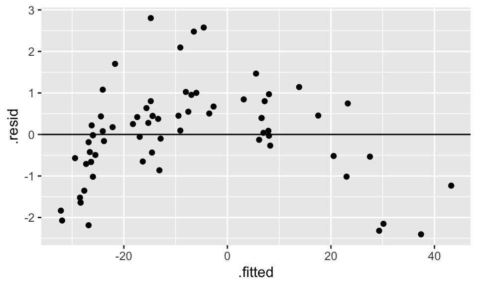
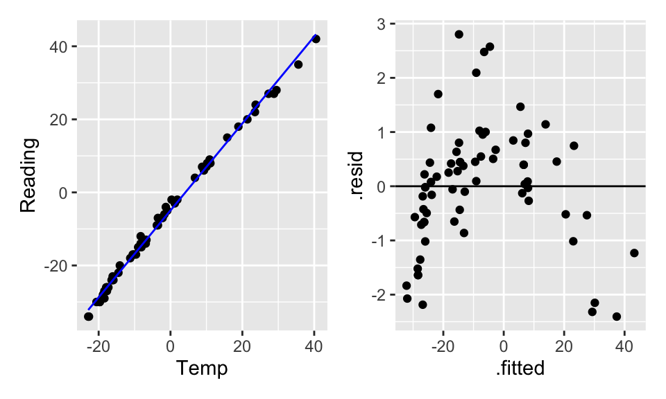

# Multiple Linear Regression {#mlr}


## Basic Model Set-Up

When looking at the volume of riders on a bike trail, we can use the data collected to understand the relationships at a deeper level.  The trail is in Massachusetts, so the expected relationship is positive:  the higher the temp the more riders we expect.   However, volume is also related to whether or not it is a weekend.  Indeed, we think about the volume of riders as a function of both the temperature and the day of the week. Thus there are two predictor variables in the model.


### Notation

Consider $n$ observations.  The response variable for the $i^{th}$ individual, denoted by $Y_i$ as before, is observed. The variation remaining in $Y_i$ that isn't explained by the predictors will also remain the same, denoted by $\epsilon_i$ and called the random error.  Since there is now more than one predictor, an additional subscript is added to $X$, denoting the value of the $k^{th}$ predictor variable for the $i^{th}$ individual by $X_{ik}$.  Thus the model is now: 
\begin{eqnarray*}
Y_i&=&\beta_0+\beta_1X_{i1}+\beta_2X_{i2}+ \cdots + \beta_{p-1}X_{i,p-1} + \epsilon_i\\
E[Y]&=&\beta_0+\beta_1X_{1}+\beta_2X_{2}+ \cdots + \beta_{p-1}X_{p-1}\\
Y_i&=&b_0+b_1X_{i1}+b_2X_{i2}+ \cdots + b_{p-1}X_{i,p-1} + e_i\\
\hat{Y}&=&b_0+b_1X_{1}+b_2X_{2}+ \cdots + b_{p-1}X_{p-1}\\
&&\\
E[\underline{Y}] &=& X \underline{\beta}\\
\underline{\hat{Y}} &=& X \underline{b}\\
\end{eqnarray*}
In the Rail Trails example, $X_{i1}$ might denote the volume of riders on the $i^{th}$ day, while $X_{i2}$ will denote an indicator variable on whether the day is a weekend or week day.


### Fitting the Model

To estimate the coefficients, use the same principle as before, that of least
squares.  That is, minimize
$$\sum_{i=1}^n(Y_i-(\beta_0+\beta_1X_{i1}+\beta_2X_{i2} + \cdots + \beta_{p-1}X_{i,p-1}))^2$$
We are interested in finding the least squares estimates of the parameters of the model $b_i$.  To do that, we have something that looks like
$$(\underline{Y}-\mathbf{X}\underline{\beta})^t(\underline{Y}-\mathbf{X}\underline{\beta})$$
that we are trying to minimize (it is the sum of the squared residuals).  Calculus gives: 
$$\mathbf{X}^t\underline{Y}-\mathbf{X}^t\mathbf{X}\mathbf{\beta}=0,$$
and solving for the unknown $\underline{\beta}$ gives:
$$\underline{b}=(\mathbf{X}^t\mathbf{X})^{-1}(\mathbf{X}^t\underline{Y}).$$
Where the transpose is a concession because multiplication and division work slightly differently in the matrix context.  The inverse, denoted by the power -1, provides a way to solve the equation.  
Thus,
$$\hat{\underline{Y}}=\mathbf{X}\underline{b}=\mathbf{X}(\mathbf{X}^t\mathbf{X})^{-1}\mathbf{X}^t\underline{Y}:=\mathbf{H}\underline{Y}$$
and
$$\mathbf{H}=\mathbf{X}(\mathbf{X}^t\mathbf{X})^{-1}\mathbf{X}^t$$
is once again the **hat matrix** (because multiplying H by
$\underline{Y}$ it puts a hat on it).  
The hat matrix will come up again when learning about leverage.

### Types of Multiple Regression

The multiple linear regression model is useful in a variety of situations.  A few are discussed here.  The above example was of the first type:  
**$p-1$ predictor variables**: We say $p-1$ instead of $p$ because
including the intercept there are $p$ parameters in need of
estimation.  
In the previous example, $p=3$, in order to estimate $\beta_0$,
$\beta_1$ and $\beta_2$.  There were two independent variables, high temperature and weekday status.  

**Qualitative Predictor Variables**:  When including a categorical variable in the model, it must be written as one (or more) binary varables.  For example, 

\begin{eqnarray*}X_2=\begin{aligned} &0& \quad &\mbox{if \quad weekend}&\\
&1&\quad &\mbox{if \quad weekday}&\end{aligned}\end{eqnarray*} 

In general, if the qualitative variable has $k$ levels, then  $k-1$ of "dummy'' (i.e., binary) variables must be included.  For instance, for the variables school year, (2013, 2014, 2015, 2016), there would 3 variables (coded as, for example: 1=2013, 0=not 2013). For a given observation, if the three dummy variables are all zero, then the model would know that the observation took place during the school year that was not coded for.  

**Transformed Variables**: As with simple linear regression, it is often a good idea to transform variables to ensure that model technical conditions hold.   

**Interaction Effects:**  A model that is "additive" means that the response is a function of all the predictors added together.  Some variables interact with each other.  An interaction model can be of the form
$$E[Y]=\beta_0+\beta_1X_{1}+\beta_2X_{2}+\beta_3X_{1}X_{2}$$
where the interaction is multiplicative. Often the idea of fitting an interaction comes from some sort of knowledge about the variables themselves.  
Assume that $E[Y]$ is the average volume of riders on days with $X_{1}$ high temp, and $X_{2}$ is whether or not it was a weekday.  The interaction model provides a way to break the model down for particular groups, the model provides a *different* linear model for weekdays and weekends.  

Weekday=0 
\begin{eqnarray*}
E[Y]&=&\beta_0+\beta_1X_{1}+\beta_2 0+\beta_3X_{1} 0\\
&=&\beta_0+\beta_1X_{1}\\
\end{eqnarray*}

Weekday=1
\begin{eqnarray*}
E[Y]&=&\beta_0+\beta_1X_{1}+\beta_2 1+\beta_3X_{1} 1\\
&=&(\beta_0 + \beta_2) +(\beta_1 + \beta_3) X_{1}\\
\end{eqnarray*}

The additive model (i.e., no interactions) states that the dummy variables only move the line up or down.  If the volume of ridership is different for the different days but does not depend on high temp, then only the additive component is included.  If the day of the week changes the relationship between high temp and volume, then the interaction term should be included.   
Variables **interact** if the effect of one predictor variable depends on the levels of the other predictor variables.  
Another way to think of interaction is whether the change in $E[Y]$ for a change in one of your variables (e.g., $X_1$) is mediated by another variable (e.g., $X_2$).

\begin{eqnarray*}
E[Y]=\beta_0+\beta_1X_{1}+\beta_2X_{2}+\beta_3X_{1}X_{2}\\
\frac{\partial E[Y]}{\partial X_1} = \beta_1 + \beta_3 X_2\\
\end{eqnarray*}
{\em MLR model Clicker Questions 38-40}

**Polynomial Regression:** The response variable might be a function of a polynomial of our predictor giving rise to a polynomial model:
$$Y_i=\beta_0+\beta_1X_i+\beta_2X_i^2+\epsilon_i$$
which represents $Y$ as a quadratic function of $X$.  


The term **linear model** therefore does not refer to the response surface, rather to the fact that the model is linear in the parameters.  Though we are fitting a hyper-plane to our data, when we think about what the surface looks like in terms of our original variables, it may be highly non-linear due to transformations and so
forth.  


#### Example: thermometers

Consider a new dataset.  The data were collected by Michael Ernst at St. Cloud University in Minnesota (during the Polar Vortex in January of 2019).  

> In late fall and early winter, as the temperature dropped (as it tends to do in MN), Michael started to get suspicious that the thermometer wasn't entirely accurate.  So, he put another thermometer that he trusted outside near the new one and where he could read the temperature through the window.  He wrote down the temperature every once in a while throughout most of December and January.  

> There are two variables: Temp, which is the actual temperature (based on the trusted thermometer), and Reading, which is the reading on the suspect thermometer.  


```r
temperature %>%
  ggplot(aes(x = Temp, y = Reading)) + 
  geom_point() + 
  geom_smooth(method = "lm", se = FALSE)
```

<div class="figure" style="text-align: center">

<p class="caption">(\#fig:unnamed-chunk-8-1)The scatterplot looks linear... but the residual plot doesn't!</p>
</div>

```r
temperature %>%
  lm(Reading ~ Temp, data = .) %>%
  augment() %>%
  ggplot(aes(x = .fitted, y = .resid)) + 
  geom_point() + 
  geom_hline(yintercept = 0)
```

<div class="figure" style="text-align: center">

<p class="caption">(\#fig:unnamed-chunk-8-2)The scatterplot looks linear... but the residual plot doesn't!</p>
</div>


Hopefully, transforming the data will help.  From figure it seems like square root of `Reading` or log of `Temp` might help.  Let's try both, but first we'll have to shift them both (to get rid of the negative numbers) arbitrarily by 35 degrees.

<div class="figure" style="text-align: center">

<p class="caption">(\#fig:unnamed-chunk-9-1)The scatterplot looks linear... but the residual plot doesn't!</p>
</div><div class="figure" style="text-align: center">

<p class="caption">(\#fig:unnamed-chunk-9-2)The scatterplot looks linear... but the residual plot doesn't!</p>
</div>

Doesn't seem like transformations are going to work.  What if a square term is added?  Is it still a linear model?  (Yes!)  Are the residuals better?  (Yes!)


```r
lin_mod <- temperature %>%
  lm(Reading ~ Temp, data = .)

quad_mod_1 <- temperature %>%
  lm(Reading ~ temp_sq, data = .)

quad_mod_2 <- temperature %>%
  lm(Reading ~ Temp + temp_sq, data = .)

lin_mod %>% tidy()
```

```
## # A tibble: 2 × 5
##   term        estimate std.error statistic  p.value
##   <chr>          <dbl>     <dbl>     <dbl>    <dbl>
## 1 (Intercept)    -4.93   0.138       -35.7 8.50e-46
## 2 Temp            1.19   0.00867     137.  7.94e-85
```

```r
quad_mod_1 %>% tidy()
```

```
## # A tibble: 2 × 5
##   term        estimate std.error statistic    p.value
##   <chr>          <dbl>     <dbl>     <dbl>      <dbl>
## 1 (Intercept) -14.4      2.79        -5.16 0.00000229
## 2 temp_sq       0.0241   0.00727      3.32 0.00147
```

```r
quad_mod_2 %>% tidy()
```

```
## # A tibble: 3 × 5
##   term        estimate std.error statistic  p.value
##   <chr>          <dbl>     <dbl>     <dbl>    <dbl>
## 1 (Intercept) -4.12     0.144       -28.7  2.33e-39
## 2 Temp         1.21     0.00690     176.   5.36e-91
## 3 temp_sq     -0.00295  0.000374     -7.90 3.65e-11
```




The quadratic term alone (without the linear term) doesn't help the model fit because the model forces the linear coefficient to be zero.  By making the linear part zero, we force the vertex (of the parabola) to be at X=0 which doesn't make sense for the model fit.  Indeed, typically a quadratic term without a linear term is a good idea if (a) there is a curved relationship with constant errors and the vertex is not in the plot, and/or (b) you really believe that there is a reason why $Y$ should be a (linear) function of $X^2$. 


### Revisiting Other Important Definitions

Because solving for our regression coefficients $(\underline{b})$ involves the exact same matrix algebra, all of the other pieces involved with the linear regression model are given using the same matrix notation.
\begin{eqnarray*}
\underline{b} &=& (X^t X)^{-1} X^t \underline{Y}\\
\underline{e} &=& \underline{Y} - \hat{\underline{Y}}\\
&=& \underline{Y} - X \underline{b}\\
&=& (I - H) \underline{Y}\\
\underline{\hat{Y}} &=& X \underline{b}\\
 &=& X (X^t X)^{-1} (X^t \underline{Y})\\
&=& H \underline{Y}\\
s^2(\underline{e}) &=& MSE \cdot (I-H)\\
\sigma^2(\underline{e}) &=& \sigma^2 \cdot (I-H)\\
s^2(\underline{\epsilon}) &=& MSE \cdot I\\
\sigma^2(\underline{\epsilon}) &=& \sigma^2 I\\
\end{eqnarray*}

Equivalently, the components of the ANOVA table remain the same, with the slight change that now the degrees of freedom are generalized to account for the fact that we are estimating $p$ parameters.

\begin{eqnarray*}
SSR &=& \sum (\hat{Y}_i - \overline{Y})^2 = \underline{b}^t X^t \underline{Y} - \bigg(\frac{1}{n} \bigg) \underline{Y}^t J \underline{Y}\\
SSE &=& \sum (Y_i - \hat{Y}_i)^2 = \underline{Y}^t \underline{Y} - \underline{b}^t X^t \underline{Y}\\
SSTO &=& \sum (Y_i - \overline{Y})^2 = \underline{Y}^t \underline{Y} - \bigg(\frac{1}{n} \bigg) \underline{Y}^t J \underline{Y}\\
\end{eqnarray*}


| source     	|  SS 	|  df 	|        MS       	|
|------------	|:---:	|:---:	|:---------------:	|
| Regression 	| SSR 	| p-1 	| MSR = SSR/(p-1) 	|
| Error      	| SSE 	| n-p 	| MSE = SSE/(n-p) 	|


Note (with $p=3$, two explanatory variables):
\begin{eqnarray*}
E[MSE] &=& \sigma^2\\
E[MSR] &=& \sigma^2 + 0.5[\beta_1^2 \sum(X_{1i} - \overline{X}_1)^2 + \beta_2^2 \sum(X_{2i} - \overline{X}_2)^2 + 2 \beta_1 \beta_2 \sum(X_{1i} - \overline{X}_1)(X_{2i} - \overline{X}_2)]
\end{eqnarray*}


## Inference

### F-test

The F-test from simple linear regression, can now be generalized to a test addressing whether *all* the non-intercept coefficients are simultaneously zero.  The test asks whether the explanatory variables as a set add anything to the model in terms of predicting the response variable.

\begin{eqnarray*}
H_0:&& \beta_1 = \beta_2 = \cdots = \beta_{p-1} = 0\\
H_a:&& \mbox{ not all } \beta_k = 0 \mbox{ (some still might be zero)}
\end{eqnarray*}

As before, we measure the ratio of MSR to MSE to decide whether the regression and error components are measuring the same quantity (residual error).
\begin{eqnarray*}
F^* = \frac{MSR}{MSE} \sim F_{(p-1, n-p)}  \mbox{ if $H_0$ is true (!)}
\end{eqnarray*}
Remember that MSE always estimates $\sigma^2$, but MSR only estimates $\sigma^2$ if all the $\beta_k$ coefficients simultaneously equal zero.


### Coefficient of Multiple Determination

Recall that we measured the proportion of variability explained by the linear model using $R^2$.  The interpretation is the same now that we have $p-1$ predictors.  $$ R^2 = \frac{SSR}{SSTO} = 1 - \frac{SSE}{SSTO}$$  As before:
\begin{eqnarray*}
R^2 &=& 0 \mbox{ if } b_k = 0 \ \ \forall k=1, \ldots, p-1\\
R^2 &=& 1 \mbox{ if } \hat{Y}_i = Y_i \ \ \forall i
\end{eqnarray*}
But now we are in a situation where adding more variables *always* increases $R^2$.  That is, as we add more explanatory variables to our model, the $R^2$ value increases.\\

If $\beta_k=0 \forall k$, $E[MSR] = \sigma^2 \rightarrow E[SSR] = \sigma^2(p-1)$, and also $E[SSTO] = \sigma^2(n-1) \rightarrow R^2 \approx (p-1)/(n-1)$.

#### Adjusted $R^2$ {-}

To account for the problem of $R^2$ increasing with the number of variables, we compare the mean squares instead of the sums of squares.  Now, the value is no longer increasing in the number of variables because there is a trade-off between reducing the errors (SSE) and losing a degree of freedom. $$R^2_a = 1 - \frac{SSE/(n-p)}{SSTO/(n-1)} = 1 - \frac{(n-1)}{(n-p)} \frac{SSE}{SSTO}$$


### Inference about Regression Parameters

#### Coefficients {-}

We know that
\begin{eqnarray*}
\sigma^2\{ \underline{b} \} &=& \sigma^2 (X^t X)^{-1}\\
s^2\{ \underline{b} \} &=& MSE (X^t X)^{-1}\\
\end{eqnarray*}
We can use the estimate and the SE to create a test statistic that will have a t distribution when the null hypothesis is true (note that we are now estimating $p$ parameters, so our degrees of freedom is $n-p$).
\begin{eqnarray*}
\frac{b_k - \beta_k}{s\{b_k\}} \sim t_{(n-p)}
\end{eqnarray*}
A $(1-\alpha)100\%$ CI for $\beta_k$ is given by$$b_k \pm t_{(1-\alpha/2, n-p)} s\{b_k\}$$
Note that the t-test is done separately for EACH $\beta$ coefficient.  Which is to say that we are estimating MSE with all the variables in the model.  The test then asks the effect of removing only the variable at hand.  Both testing and interpretation of the regression coefficients are done *keeping all other variables constant*.

#### Linear Combinations of Coefficients {-}

Periodically, the question of interest will be related to a linear combination of coefficients.  For example, we might be interested in testing whether the coefficient for `spring` is statistically different from the coefficient on `fall` [$H_0: \beta_1 = \beta_2$]. Let
\begin{eqnarray*}
\gamma &=& c_0 \beta_0 + c_1 \beta_1 + \ldots + c_p \beta_p\\
g &=& c_0 b_0 + c_1 b_1 + \ldots + c_p b_p\\
var(g) &=& c_0^2 \sigma^2\{b_0\} + c_1^2 \sigma^2\{b_1\} + \ldots + c_p^2 \sigma^2\{b_p\} + 2c_0c_1 cov(b_0, b_1) + 2 c_0 c_2 cov(b_0, b_2) + \ldots + 2c_{p-1}c_p cov(b_{p-1}, b_p)\\
\end{eqnarray*}
With the estimate of the difference and the SE, a t-statistic (or create a CI) provides formal inference on coefficients.  Note below that the function `vcov()` estimates the variances and covariance of the coefficients.
\begin{eqnarray*}
\hat{var}(b_1 - b_2) &=& (1)^2 s^2\{b_1\} + (-1)^2 s^2\{ b_2\} + 2(1)(-1)\hat{cov}(b_1, b_2)\\
&=& 889 + 1862 -  2*604 = 1543\\
H_0: && \beta_1 = \beta_2\\
t-stat &=& \frac{(-50.1 - (-126.8)) - 0}{ \sqrt{1543}} = 1.952\\
p-value &=& 2 * P(t_{87} \geq 1.952) = 0.054
\end{eqnarray*}
The p-value is borderline, but certainly there is not strong evidence to say that fall and spring are significantly different in the model.  Note that fall and spring *are* significantly different from summer (the baseline).  Note:  no days were measured in winter.


```r
RailTrail %>%
  lm(volume ~ spring + fall, data = .) %>%
  tidy()
```

```
## # A tibble: 3 × 5
##   term        estimate std.error statistic  p.value
##   <chr>          <dbl>     <dbl>     <dbl>    <dbl>
## 1 (Intercept)    422.       24.6     17.2  1.13e-29
## 2 spring         -50.2      29.8     -1.68 9.57e- 2
## 3 fall          -127.       43.2     -2.94 4.23e- 3
```


```r
RailTrail %>%
  lm(volume ~ spring + fall, data = .) %>%
  vcov()
```

```
##             (Intercept) spring fall
## (Intercept)         604   -604 -604
## spring             -604    889  604
## fall               -604    604 1862
```


#### Mean Response {-}
Again, using linear algebra as with simple linear regression:

\begin{eqnarray*}
\sigma^2\{\hat{Y}_h\} &=& \sigma^2 X_h^t (X^t X)^{-1} X_h\\
s^2\{\hat{Y}_h\} &=& MSE X_h^t (X^t X)^{-1} X_h
\end{eqnarray*}
Which allows us to create a $(1-\alpha)100\%$ CI for $E[Y_h] = X_h^t \underline{\beta}$: $$\hat{Y}_h \pm t_{(1-\alpha/2, n-p)} s\{\hat{Y}_h\}$$
Where
\begin{eqnarray*}
X_h^t &=& (1 \ \ X_{h 1} \ \ X_{h  2} \ \ldots \ X_{h  p-1})\\
\hat{Y}_h &=& X_h^t \underline{b}
\end{eqnarray*}


#### Future / Predicted Response {-}
A new observation uses the same derivation as the mean response, but we add in the variability of observations around the line.
\begin{eqnarray*}
\sigma^2\{ \mbox{pred} \} = \sigma^2\{\hat{Y}_{h(new)}\} &=& \sigma^2 (1+ X_h^t (X^t X)^{-1} X_h)\\
s^2\{ \mbox{pred} \} = s^2\{\hat{Y}_{h(new)}\} &=& MSE (1+ X_h^t (X^t X)^{-1} X_h)\\
&=& MSE + s^2\{\hat{Y}_h\}
\end{eqnarray*}
Which allows us to create a $(1-\alpha)100\%$ prediction interval for a response at $X_h$: $$\hat{Y}_h \pm t_{(1-\alpha/2, n-p)} s\{\hat{Y}_{h(new)}\}$$
Note that we can interpret this interval to say that $(1-\alpha)100\%$ of the response values from $X_h$ will fall in our interval.

#### Skipping {-}
In the text we will skip:  
* surface prediction  
* simultaneous confidence intervals  
* prediction of more than one value  
* or at more than one $X_h$  
* tests for normality / error variance / constant variance / lack of fit (we will use residual plots instead)


\subsection{Criteria for Evaluating Models}
The idea for a good model is to find a balance between having small residuals and having too many predictors.  That is, MSE should be small, but $p$ to be small as well.  Recall that $R^2_a$ does balance MSE and $p$, but in one specific way.  Other ideas are given below.  Later, models will be built using p-values for F-tests.  However, there are myriad criteria that optimize the given model (i.e., which variables are best to include).  Consider using the criteria to compare models with differing number of variables (same response, same model structure).   The following are defined as:

\begin{eqnarray*}
SSE_p &=& SSE \mbox{ from the model with $p$ parameters}\\
SSE_{full} &=& SSE \mbox{ from the  model with all possible parameters}
\end{eqnarray*}


| criteria    	| definition                        	| desired value                                       	|
|-------------	|-----------------------------------	|-----------------------------------------------------	|
| $p$         	| number of parameters              	| small                                               	|
| $SSE_p$     	| residual variability              	| small                                               	|
| $R^2_p$     	| \% variability explained by model 	| big                                                 	|
| $R^2_{a,p}$ 	| adjusted $R^2$                    	| big                                                 	|
| $C_p$       	| trade off between SSE and $p$     	| close to $p$ / small                                	|
| $AIC_p$     	| Akaike's Information Criterion    	| small                                               	|
| $SBC_p$     	| Bayesian Information Criterion    	| small                                               	|
| F*          	| F test statistic                  	| big (for simpler models)  (see section \ref{nestF}) 	|
 
$C_p$:   $$C_p = \frac{SSE_p}{MSE_{full}} - (n-2p)$$    
$AIC_p$: $$AIC_p = n \ln(SSE_p) - n \ln(n) + 2p$$    
$SBC_p = BIC_p$: $$SBC_p = n \ln(SSE_p) - n \ln(n) + \ln(n) p$$    
Both $AIC_p$ and $SBC_p$ measure the likelihood of the data ($-2 \ln(likelihood)$) given a particular model with $p-1$ explanatory variables.  We choose the model with the smallest $AIC_p$ or $SBC_p$.  
Note that we can use *any* of the criteria to build a model by either adding one variable at a time; starting with a full model (all the variables) and subtracting one variable at a time; or some combination of adding and subtracting variables.

#### $C_p$, AIC, and SBC in R {-}


Ideally, the chosen model would minimize all three criteria.  All three are trade-offs between SSE (want small) and $p$ (want small).  
$C_p$ also measures the trade-off between bias and variance.
\begin{eqnarray*}
Bias(\hat{Y}_i) &=& E[\hat{Y}_i] - E[Y_i]\\
MSE(\hat{Y}_i) &=& [Bias(\hat{Y}_i)]^2 + Var(\hat{Y}_i)\\
\Gamma_p &=& \frac{1}{\sigma^2} [Bias(\hat{Y}_i)]^2 + Var(\hat{Y}_i)\\
\Gamma_p &=& p  \mbox{ if there is no bias in the model}
\end{eqnarray*}
But how do we estimate $\Gamma_p$?  If we know the population variance, $\sigma^2$, we can estimate $\Gamma_p$ using:
\begin{eqnarray*}
 C_p &=& p + \frac{(MSE_p - \sigma^2)(n-p)}{ \sigma^2}\\
 \end{eqnarray*}
 Estimating $\sigma^2$ using $MSE_{full}$ gives
\begin{eqnarray*}
 C_p &=& p + \frac{MSE_p - MSE_{full})(n-p)}{ MSE_{full}} = \frac{SSE_p}{MSE_{full}} - (n-2p)\\
 \end{eqnarray*}

$C_p$ estimates the quantity "total MSE divided by $\sigma^2$".  It can be shown that $\sum_{i=1}^n Var(\hat{Y}_i) = \sigma^2 p$.  We want $C_p$ to be small or $\approx p$.  See the comments on page 359 of Kutner et al.  
Note that when calculating $C_P$ on the full model (with P parameters), we get
\begin{eqnarray*}
C_P &=& \frac{SSE_P}{MSE_P} - (n-2P)\\
&=& (n-P) - n + 2P\\
&=& P\\
\end{eqnarray*}

Estimating $\sigma^2$ using $MSE_{full}$ assumes that there are no biases in the full model with all of the predictors, an assumption that may or may not be valid, but can't be tested without additional information (at the very least you have to have all of the important predictors involved).

AIC and SBC are based on maximum likelihood estimates of the model parameters.  The idea of maximum likelihood is to find the parameters that produce the largest likelihood function given the available data.  The likelihood is a number between 0 and 1.  For a variety of reasons, unimportant here, it is common to take the log of the likelihood (an action which does not change where the function is maximized) and to multiply the likelihood by -2.  In linear regression, the parameter estimates found by least squares and by maximum likelihood are identical.  However, when using least squares versus maximum likelihood, there is a difference in estimating $\sigma^2$.  We have been using the *unbiased* estimate of $\sigma^2$ which is MSE = SSE / (n-p).  The maximum likelihood estimate of $\sigma^2$ is SSE/n.  The MLE has a slight negative bias, but is also has a smaller variance. Note that if we are estimating $p$ regression coefficients *and* $\sigma^2$, we are actually estimating $p+1$ parameters.  In short, the full AIC is given by the following.
\begin{eqnarray}
E[AIC] &=& -2 \ln(L) + 2(p+1)\\\
&=& -2 \ln \bigg[ \prod_{i=1}^n \frac{1}{\sqrt{2\pi \sigma_i^2}} \exp( -(Y_i - E[Y_i])^2/ 2\sigma_i^2) \bigg] + 2(p+1) \label{sigi}\\
&=& -2 \ln \bigg[ (2\pi)^{-(n/2)} \sigma^{-(2n/2)} \exp(-\sum_{i=1}^n (Y_i - E[Y_i])^2 / 2 \sigma^2) \bigg] + 2(p+1) \label{sig}\\
AIC &=& -2 \ln \bigg[ (2\pi)^{-(n/2)} (SSE_p/n)^{-(n/2)} \exp(-SSE_p / (2 SSE_p/n)) \bigg] + 2(p+1) \label{mse}\\
&=& 2 (n/2) \ln(2 \pi) - 2(-n/2) \ln(SSE_p/n) + n + 2(p+1) \nonumber \\
&=& n \ln(2 \pi) + n\ln(SSE_p/n) + n + 2(p+1) \nonumber \\
&=& n \ln(2 \pi) + n\ln(SSE_p)  - n\ln(n) + n + 2(p+1) \nonumber \\
&=& n\ln(SSE_p) - n\ln(n) + 2p + constant \nonumber
\end{eqnarray}
To go from ~\eqref{sigi} to ~\eqref{sig} we assume that $\sigma^2 = \sigma_i^2$; that is, the variance is constant for all individuals.  To go from ~\eqref{sig} to ~\eqref{mse} we approximate $\sigma^2$ (and $E[Y_i]$) using the maximum likelihood estimates for $\sigma^2 = SSE / n$ and $\beta_k$.  
SBC (BIC) uses the posterior likelihood and a similar derivation.  SBC can be given as the following.
\begin{eqnarray*}
SBC &=& -2 \ln(L_{posterior}) + \ln(n) (p+1)\\
&=& n + n\ln(2\pi) + n \ln(SSE_p / n) + \ln(n)(p+1)\\
&=& n \ln(SSE_p) - n \ln(n) + \ln(n) p + constant
\end{eqnarray*}
Note that in both AIC and SBC we don't consider the constant term because models are compared on the same data ($n$ is the same).


## <i class="fas fa-lightbulb" target="_blank"></i> Reflection Questions

1. How does the model change when there are multiple variables?  
2. What does interaction mean?  How do we model it?  How do we interpret it?  What is the R code?  
3. What are the considerations associated with a quadratic term?  
4. How do we test whether all the variables are significant?  
5. How do we test whether individual variables are significant?  
6. How do we assess a linear combination of coefficients?  
7. What is the difference between $R^2$ and $R^2_a$?  
8. How are prediction and mean confidence intervals created with multiple explanatory variables?   

## <i class="fas fa-balance-scale"></i> Ethics Considerations


The big question up next: with all these options, how do we decide what to include and what not to include?


## R: MLR with Rail Trails}

The variables used in the following analysis are `hightemp`, `volume`, `precip` and `weekday`.  A description of the data is given at:

```
library(mosiacData)
?RailTrail
```


1. It is *always* a good idea to graph your data and look at numerical summaries.  Sometimes you'll find out important artifacts or mistakes.


```r
RailTrail %>%
  ggplot(aes(x = hightemp, y = volume)) + 
  geom_point(alpha = 0.4) +
  xlab("high temp (F)") + 
  ylab("number of riders")
```


```r
RailTrail %>%
  skim_without_charts()
```


Table: (\#tab:unnamed-chunk-16)Data summary

|                         |           |
|:------------------------|:----------|
|Name                     |Piped data |
|Number of rows           |90         |
|Number of columns        |11         |
|_______________________  |           |
|Column type frequency:   |           |
|character                |1          |
|logical                  |1          |
|numeric                  |9          |
|________________________ |           |
|Group variables          |None       |


**Variable type: character**

|skim_variable | n_missing| complete_rate| min| max| empty| n_unique| whitespace|
|:-------------|---------:|-------------:|---:|---:|-----:|--------:|----------:|
|dayType       |         0|             1|   7|   7|     0|        2|          0|


**Variable type: logical**

|skim_variable | n_missing| complete_rate| mean|count            |
|:-------------|---------:|-------------:|----:|:----------------|
|weekday       |         0|             1| 0.69|TRU: 62, FAL: 28 |


**Variable type: numeric**

|skim_variable | n_missing| complete_rate|   mean|     sd|  p0|    p25|   p50|    p75|   p100|
|:-------------|---------:|-------------:|------:|------:|---:|------:|-----:|------:|------:|
|hightemp      |         0|             1|  68.83|  13.02|  41|  59.25|  69.5|  77.75|  97.00|
|lowtemp       |         0|             1|  46.03|  11.84|  19|  38.00|  44.5|  53.75|  72.00|
|avgtemp       |         0|             1|  57.43|  11.33|  33|  48.62|  55.2|  64.50|  84.00|
|spring        |         0|             1|   0.59|   0.49|   0|   0.00|   1.0|   1.00|   1.00|
|summer        |         0|             1|   0.28|   0.45|   0|   0.00|   0.0|   1.00|   1.00|
|fall          |         0|             1|   0.13|   0.34|   0|   0.00|   0.0|   0.00|   1.00|
|cloudcover    |         0|             1|   5.81|   3.23|   0|   3.65|   6.4|   8.47|  10.00|
|precip        |         0|             1|   0.09|   0.26|   0|   0.00|   0.0|   0.02|   1.49|
|volume        |         0|             1| 375.40| 127.46| 129| 291.50| 373.0| 451.25| 736.00|


2. We're interested in predicting the volume of riders from the high temperature (in F) in a given day.


```r
RailTrail %>%
  lm(volume ~ hightemp, data = .) %>%
  tidy()
```

```
## # A tibble: 2 × 5
##   term        estimate std.error statistic       p.value
##   <chr>          <dbl>     <dbl>     <dbl>         <dbl>
## 1 (Intercept)   -17.1     59.4      -0.288 0.774        
## 2 hightemp        5.70     0.848     6.72  0.00000000171
```


```r
RailTrail %>%
  ggplot(aes(x = hightemp, y = volume)) + 
  geom_point(alpha = 0.4) +
  geom_smooth(method = "lm", se = FALSE) +
  xlab("high temp (F)") + 
  ylab("number of riders")
```


3. What happens when `weekday` is included as a binary indicator variable?


```r
RailTrail %>%
  lm(volume ~ hightemp + weekday, data = .) %>%
  tidy()
```

```
## # A tibble: 3 × 5
##   term        estimate std.error statistic      p.value
##   <chr>          <dbl>     <dbl>     <dbl>        <dbl>
## 1 (Intercept)    42.8     64.3       0.665 0.508       
## 2 hightemp        5.35     0.846     6.32  0.0000000109
## 3 weekdayTRUE   -51.6     23.7      -2.18  0.0321
```


```r
RailTrail %>%
  ggplot(aes(x = hightemp, y = volume, color = weekday)) + 
  geom_point(alpha = 0.4) +
  moderndive::geom_parallel_slopes(se = FALSE) +
  xlab("high temp (F)") + 
  ylab("number of riders")
```


* Note that the F p-value is no longer equal to the p-value(s) associated with the t-test for any of the coefficients.  Also, the degrees of freedom are now (2, 87) because the model estimates 3 parameters.
* Write out the estimated regression model separately for weekdays and weekends, and sketch the lines onto the scatterplot.
* How are the new coefficients ($b_0, b_1, b_2$) interpreted?
* How did the coefficient on `hightemp` change?
* How does $R^2$ change? MSE change?
* Why does it say `weekdayTRUE` instead of `weekday`?

4. What if `hightemp` and `weekday` *interact*?


```r
RailTrail %>%
  lm(volume ~ hightemp * weekday, data = .) %>%
  tidy()
```

```
## # A tibble: 4 × 5
##   term                 estimate std.error statistic p.value
##   <chr>                   <dbl>     <dbl>     <dbl>   <dbl>
## 1 (Intercept)            135.      108.        1.25 0.215  
## 2 hightemp                 4.07      1.47      2.78 0.00676
## 3 weekdayTRUE           -186.      129.       -1.44 0.153  
## 4 hightemp:weekdayTRUE     1.91      1.80      1.06 0.292
```


* Note again that the F p-value is no longer equal to the t-stat p-value(s).  Now the degrees of freedom are (3, 86) because the model estimates 4 parameters.
* Write out the estimated regression model separately for weekdays and non-weekdays, and sketch the lines onto the scatterplot.
* How do you interpret your new coefficients ($b_0, b_1, b_2, b_3$)?
* What happened to the significance?  How did the coefficient on `weekday` change?
* How does $R^2$ change? MSE change?


```r
RailTrail %>%
  ggplot(aes(x = hightemp, y = volume, color = weekday)) + 
  geom_point(alpha = 0.4) +
  geom_smooth(method = "lm", se = FALSE) +
  xlab("high temp (F)") + 
  ylab("number of riders")
```


5. What happens to the model with an additional quantitative variable?


```r
RailTrail %>%
  lm(volume ~ hightemp + weekday + precip, data = .) %>%
  tidy()
```

```
## # A tibble: 4 × 5
##   term        estimate std.error statistic  p.value
##   <chr>          <dbl>     <dbl>     <dbl>    <dbl>
## 1 (Intercept)    19.3     60.3       0.320 7.50e- 1
## 2 hightemp        5.80     0.799     7.26  1.59e-10
## 3 weekdayTRUE   -43.1     22.2      -1.94  5.52e- 2
## 4 precip       -146.      38.9      -3.74  3.27e- 4
```

Note the p-values, parameter estimates, $R^2$, MSE, F-stat, df, and F-stat p-values.


