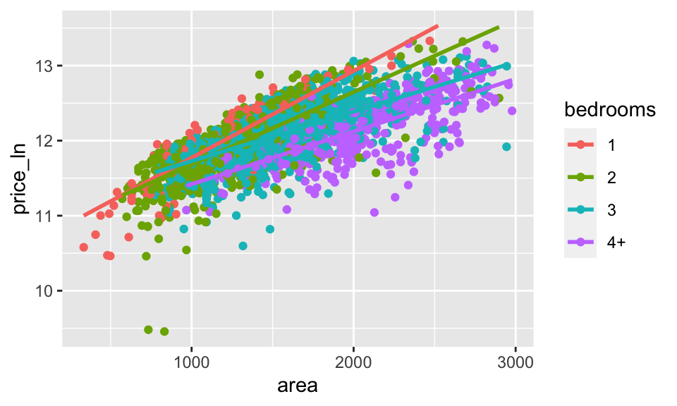
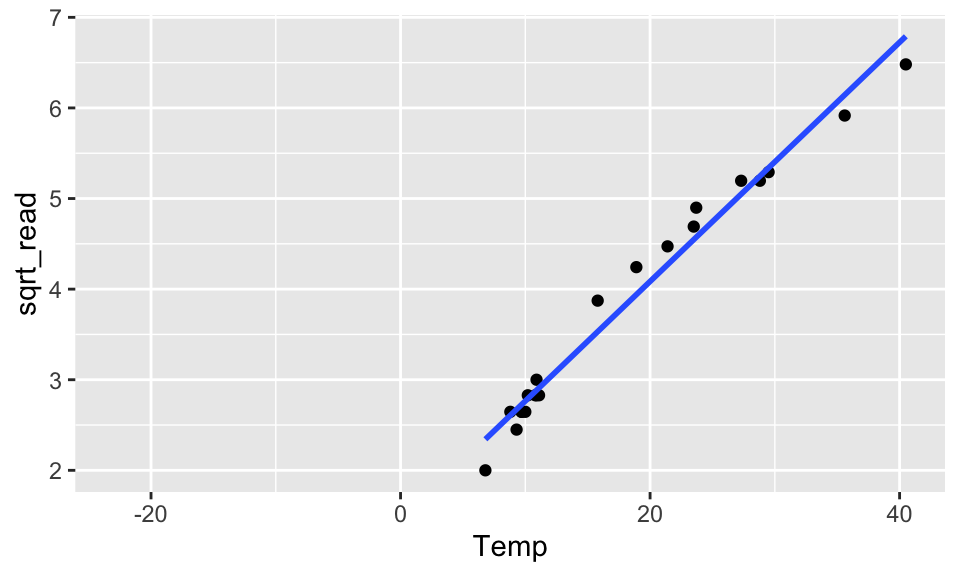

# Multiple Linear Regression {#mlr}


When we get there, use the function `bestregsubsets()`.


```r
library(openintro)
ames_inf <- ames %>%
  filter(area <= 3000) %>%
  mutate(price_ln = log(price))
```


```r
ames_inf %>%
  mutate(bedrooms = case_when(
    Bedroom.AbvGr <=1 ~ "1",
    Bedroom.AbvGr <=2 ~ "2",
    Bedroom.AbvGr <=3 ~ "3",
    TRUE ~ "4+"
  )) %>%
  ggplot(aes(x = area, y = price_ln, color = bedrooms)) + 
  geom_point() + 
  geom_smooth(method = lm, se = FALSE)
```




Consider a new dataset.  The data were collected by Michael Ernst at St. Cloud University in Minnesota (during the Polar Vortex in January of 2019).  

> In late fall and early winter, as the temperature dropped (as it tends to do in MN), Michael started to get suspicious that the thermometer wasn't entirely accurate.  So, he put another thermometer that he trusted outside near the new one and where he could read the temperature through the window.  He wrote down the temperature every once in a while throughout most of December and January.  

> There are two variables: Temp, which is the actual temperature (based on the trusted thermometer), and Reading, which is the reading on the suspect thermometer.  


```r
temperature <- readr::read_csv("Temperature.csv")
```


```r
temperature %>%
  ggplot(aes(x = Temp, y = Reading)) + 
  geom_point() + 
  geom_smooth(method = "lm", se = FALSE)
```

<div class="figure" style="text-align: center">

<p class="caption">(\#fig:unnamed-chunk-5-1)The scatterplot looks linear... but the residual plot doesn't!</p>
</div>

```r
temperature %>%
  lm(Reading ~ Temp, data = .) %>%
  augment() %>%
  ggplot(aes(x = .fitted, y = .resid)) + 
  geom_point() + 
  geom_hline(yintercept = 0)
```

<div class="figure" style="text-align: center">

<p class="caption">(\#fig:unnamed-chunk-5-2)The scatterplot looks linear... but the residual plot doesn't!</p>
</div>


Hopefully, transforming the data will help.  From figure it seems like square root of `Reading` or log of `Temp` might help.  Let's try both.


```r
temperature <- temperature %>%
  mutate(sqrt_read = sqrt(Reading),
         ln_temp = log(Temp))
    
temperature %>%
  ggplot(aes(x = Temp, y = sqrt_read)) + 
  geom_point() + 
  geom_smooth(method = "lm", se = FALSE)
```

<div class="figure" style="text-align: center">

<p class="caption">(\#fig:unnamed-chunk-6-1)The scatterplot looks linear... but the residual plot doesn't!</p>
</div>

```r
temperature %>%
  lm(sqrt_read ~ Temp, data = .) %>%
  augment() %>%
  ggplot(aes(x = .fitted, y = .resid)) + 
  geom_point() + 
  geom_hline(yintercept = 0)
```

<div class="figure" style="text-align: center">

<p class="caption">(\#fig:unnamed-chunk-6-2)The scatterplot looks linear... but the residual plot doesn't!</p>
</div>

```r
temperature %>%
  ggplot(aes(x = ln_temp, y = Reading)) + 
  geom_point() + 
  geom_smooth(method = "lm", se = FALSE)
```

<div class="figure" style="text-align: center">

<p class="caption">(\#fig:unnamed-chunk-6-3)The scatterplot looks linear... but the residual plot doesn't!</p>
</div>

```r
temperature %>%
  lm(Reading ~ ln_temp, data = .) %>%
  augment() %>%
  ggplot(aes(x = .fitted, y = .resid)) + 
  geom_point() + 
  geom_hline(yintercept = 0)
```

<div class="figure" style="text-align: center">

<p class="caption">(\#fig:unnamed-chunk-6-4)The scatterplot looks linear... but the residual plot doesn't!</p>
</div>

Doesn't seem like transformations are going to work.  What if a square term is added?  Is it still a linear model?  (Yes!)  Are the residuals better?  (Yes!)

