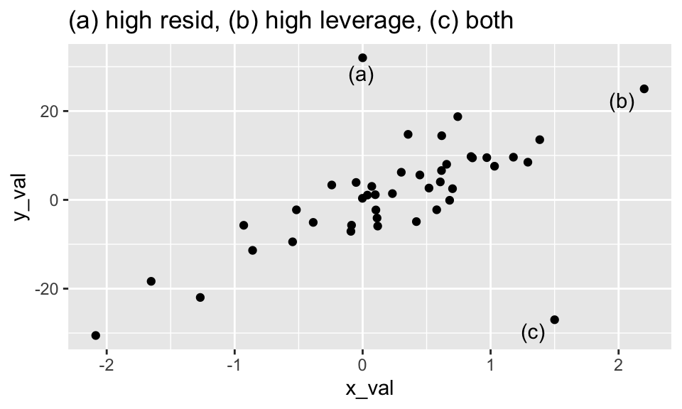

# Diagnostic Measures II {#diag2}


#### Main idea {-}


<div class="figure" style="text-align: center">

<p class="caption">(\#fig:unnamed-chunk-3)The point (a) has very little influence on the model, despite having a large residual.  The point (b) has very little influence in the model because it is consistent with the model given by the other points.  The point (c) has a high residual and high leverage which will impact both the prediction and the coefficients in the model.</p>
</div>


The main idea for this section is to understand how individual observations (or subsets of observations) impact the model.  We will talk about values that are outlying in the x-direction or outlying in y-direction.  Depending on the combination of outlyingness, the point may or may not impact the model.  We already have the pieces (e.g., the hat matrix) to evaluate the influence of the point on the model.

High residuals (if big enough) can impact the model.  High leverage (if big enough) can impact the model.  But a big residual with big leverage will definitely impact the coefficients and therefore the predictions in a linear model.


Consider the hat matrix (see Section \@ref(fitted)):
\begin{eqnarray*}
H &=& X(X^t X)^{-1} X^t\\
\hat{Y} &=& HY, \underline{e} = (I-H)\underline{Y}\\
\sigma^2\{\underline{e}\} &=& \sigma^2 (I-H), s^2\{\underline{e}\} = MSE(I-H) \\
\end{eqnarray*}


## Outliers in the Y direction

Points that are outlying in terms of their $Y$-values are often easy to spot via residual plots, as the model will not predict these values very well and a large residual will be seen.  However, sometimes the observation will have enough influence in the model, however, that the residual will be small even if the point is ``outlying in the y-direction."


### (Internally) Studentized Residuals

Recall that we previously defined semi-studentized residuals as the residual divided by MSE (our best estimate of $\sigma^2$).  But then we also pointed out that the variance of the residuals isn't really $\sigma^2$ and isn't constant (because of the requirement that the residuals sum to zero).
\begin{eqnarray*}
e_i &=& Y_i - \hat{Y}_i\\
e_i^* &=& \frac{Y_i - \hat{Y}_i}{\sqrt{MSE}} \ \ \ \ \mbox{semi-studentized residuals}
\end{eqnarray*}
The hat matrix is a measure of where the observations fall in the subspace spanned by the explanatory variables.  The hat matrix also provides the information about the predictions (which in turn determine the residuals).  It turns out that the variance of the residuals can be calculated using the hat matrix:
\begin{eqnarray*}
\sigma^2\{\underline{e}\} &=& \sigma^2 (I-H)\\
\sigma^2\{e_i\} &=& \sigma^2 (1-h_{ii})\\
s^2\{\underline{e}\} &=& MSE (I-H)\\
s^2\{e_i\} &=& MSE (1-h_{ii})\\
s\{ e_i \} &=& \sqrt{MSE(1-h_{ii})}\\
r_i &=& \frac{e_i}{s\{e_i\}}  \ \ \ \mbox{internally studentized residuals}
\end{eqnarray*}
Note that studentized residuals will have constant variance (unlike the standard residuals).

### Deleted Residuals (externally studentized residuals)
If the observation is far outlying, it may influence the regression line to such an extent that the point no longer looks outlying.  One solution to this problem is to fit the model without the outlying value and then measure how far the $i^{th}$ response is from the model created without the $i^{th}$ observation.  
Let $\hat{Y}_{i(i)}$ represent the predicted value for the $i^{th}$ observation created using the remaining $n-1$ observations.  [Note:  here we think of $Y_i$ to be fixed, and $Y_{i(i)}$ to be varying.]
\begin{eqnarray*}
d_i &=& Y_i - \hat{Y}_{i(i)} \ \ \ \ \mbox{ deleted residuals}\\
&=& \frac{e_i}{(1-h_{ii})} \mbox{,  where  } e_i = Y_i - \hat{Y}_i \ \ \ \ \mbox{ not obvious, see text}\\
s^2\{d_i\} &=& MSE_{(i)} (1 + X_i^t (X_{(i)}^t X_{(i)})^{-1} X_i) \ \ \ \mbox{recall:} s^2\{\hat{Y}_{h(new)} \} = MSE (1+ X_h^t (X^t X)^{-1} X_h)\\
&=& \frac{MSE_{(i)}}{(1-h_{ii})} \ \ \ \ \mbox{ not obvious, see text}\\
&&\\
t_i &=& \frac{d_i}{s\{d_i\}} = \frac{e_i}{\sqrt{MSE_{(i)}(1-h_{ii})}} \sim t_{n-1-p}  \ \ \mbox{ studentized deleted residuals}\\
\end{eqnarray*}

  1. Now we can legitimately look for deviations outside of the $\pm t_{1 - (\alpha/2n), n-p-1}$ bounds.  We use a Bonferroni correction for the level of significance because we are doing $n$ simultaneous tests.  
  2. Note that the SE is calculated from the exact formula we used for prediction intervals.  That is, we are predicting the $i^{th}$ observation from the other $(n-1)$ observations.  
  3. As above, we can write $t_i$ as a function of $e_i$ and $h_{ii}$.  The alternative notation makes it clear that large deleted residuals come about from a combination of moderate / large residuals and moderate / large leverage.

#### Test for Outliers {-}

We identify as outlying $Y$ observations those cases whose studentized deleted residuals are large in absolute value. In addition, we can conduct a formal test by means of the Bonferroni test procedure of whether the case with the largest absolute studentized deleted residual is an outlier. Since we do not know in advance which case will have the largest absolute value $|t_i|$, we consider the family of tests to include $n$ tests, one
for each case.

If the regression model is appropriate, so that no case is outlying because of a change in the model, then each studentized deleted residual will follow the $t-$distribution with $n-p-1$ degrees of freedom. The appropriate Bonferroni critical value therefore is $t(l - \alpha/2n; n - p - 1)$. Note that the test is two-sided since we are not concerned with the direction of the residuals but only with their absolute values.


## Outliers in the X direction

Values that are outlying with respect to their $X$-values are called **leverage points**, and are not necessarily obvious in multiple linear regression.  The reason for the name leverage point is that by moving a single point far enough away, we can make the fitted line do whatever we want, regardless of the sample size.  Thus, such points have a lot of leverage, and we need to handle these points with care.  
The diagonal elements of the so-called hat matrix give indications as to leverage points, values that are outlying here are leverage points and should be worried about.  

### Leverage

\noindent
Recall the hat matrix.  Note that if there is only one explanatory variable,
\begin{eqnarray*}
h_i = \frac{(X_i - \overline{X})^2}{\sum_{j=1}^n (X_j - \overline{X})^2} + \frac{1}{n}\\
\end{eqnarray*}
In higher dimensions, $H=X(X^tX)^{-1}X^t$, where $X_{n \times p}$ is the matrix of explanatory variables.  Also, we can show that $h_{ii}$ has the following properties: $$0 \leq h_{ii} \leq 1 \ \ \ \sum_{i=1}^n h_{ii} =p \ \ \ \overline{h} = \frac{\sum_{i=1}^n h_{ii}}{n} = \frac{p}{n}$$
The diagonal elements of the hat matrix, $h_{ii}$, are called *leverage* points.  

**Leverage gives a (multivariate) sense of how far the $i^{th}$ observation is from the bulk of the data.**  There is *no response variable* in the calculation of leverage.  Additionally, $h_{ii}$ provide information about how much the $i^{th}$ observation impacts the fit of $\hat{Y}_i$.  

  1. Recall that $\hat{\underline{Y}} = H \underline{Y}$.  That is, the predicted values are a linear combination of the observed response.  $h_{ii}$ is the weight of observation $Y_i$ in determining $\hat{Y}_i$.  The larger $h_{ii}$ is, the more important $Y_i$ is in determining $\hat{Y}_i$.  The hat matrix is a function of $X$ only, so $h_{ii}$ measures the role of the X values in determining how important $Y_i$ is in affecting the fitted value $\hat{Y}_i$.   
  2. The larger $h_{ii}$ is, the smaller the variance of the residual $e_i$.  That is, the larger $h_{ii}$, the closer $\hat{Y}_i$ will be to $Y_i$.  If $h_{ii} = 1$, then $\sigma^2{e_i} = 0$ which means the fitted value is forced to equal the observed value.


## Outliers that are Influential

We consider points to be **influential if they impact the inference**.  That is, they change either the predicted values or the model.  Note that an influential observation can arise from a large residual, large leverage, or both.

#### DFFITS (difference in fits) {-}

**DFFITS is a measure of the influence the case $i$ has on the fitted value $\hat{Y}_i$**.  [Note: $\hat{Y}_i$ is considered to be varying and $\hat{Y}_{i(i)}$ to be fixed.]  That is DFFITS is measuring how $\hat{Y}_i$ varies (in units of standard deviation) from the fit calculated without $i$ in the model.
\begin{eqnarray*}
(DFFITS)_i &=& \frac{\hat{Y}_i - \hat{Y}_{i(i)}}{\sqrt{MSE_{(i)} h_{ii}}}\\
&=& t_i \bigg(\frac{h_{ii}}{1-h_{ii}}\bigg)^{1/2}
\end{eqnarray*}
To understand the derivation, recall the following about the variability of $\underline{\hat{Y}}$.
\begin{eqnarray*}
\underline{\hat{Y}} &=& H \underline{Y}\\
\sigma^2\{\underline{\hat{Y}}\} &=& H \sigma^2 \{Y\} H = \sigma^2 H\\
\sigma^2\{\hat{Y}_i\} &=& \sigma^2 \cdot h_{ii}\\
s^2\{\hat{Y}_i\} &=& MSE \cdot h_{ii}
\end{eqnarray*}


#### Cook's Distance {-}
Another measure combines the idea of outliers of both types to see the influence a particular point is having on your regression.  **Cook's Distance measures the change in the regression by removing each individual point.**  If things change quite a bit by the omission of a single point, then that point was having a lot of influence on your model.  Define $\hat{Y}_{j(i)}$ to be the fitted value for the $j^{th}$ observation when the $i^{th}$ observation is deleted from the data set.  Cook's Distance measures how much $i$ changes *all* the predictions.
\begin{eqnarray*}
D_i &=&\frac{\sum_{j=1}^{n}(\hat{Y}_j-\hat{Y}_{j(i)})^2}{p MSE}\\
&=& \frac{(\hat{\underline{Y}} - \hat{\underline{Y}}_{(i)})^t (\hat{\underline{Y}} - \hat{\underline{Y}}_{(i)})}{p MSE}\\
&=& \frac{e_i^2}{p MSE} \bigg[ \frac{h_{ii}}{(1-h_{ii})^2} \bigg]
\end{eqnarray*}
Cook's Distance shows the effect of the $i^{th}$ case on *all* the fitted values.  Note that the $i^{th}$ case can be influenced by  

  1. big $e_i$ and moderate $h_{ii}$  
  2. moderate $e_i$ and big $h_{ii}$  
  3. big $e_i$ and big $h_{ii}$  

The exact way to think about these numbers being large is complicated, but if we see a point that is much larger than others, we should examine that point and try to understand it better.  Noting that the above measure squared deviations, a useful comparison is to look at the 10% of 20% cutoff of the $F(p, n-p)$ distribution:
\begin{eqnarray*}
\mbox{if } &&D_i < F_{0.1, p, n-p} \mbox{ or } F_{0.2, p, n-p} \rightarrow \mbox{ no influence}\\
\mbox{if } &&D_i > F_{0.5, p, n-p} \rightarrow \mbox{ big influence}\\
\end{eqnarray*}

#### DFBETAS (difference in betas) {-}
**DFBETAS are a measure of the influence of case $i$ on the $k^{th}$ $b_k$ coefficient.**
\begin{eqnarray*}
(DFBETAS)_{k(i)} &=& \frac{b_k - b_{k(i)}}{\sqrt{MSE_{(i)} c_{kk}}}\\
\mbox{where } c_{kk} &=& (X^t X )^{-1}_{kk}\\
\mbox{note } \sigma^2\{ b_k \} &=& \sigma^2 c_{kk}
\end{eqnarray*}
A large absolute value of $(DFBETAS)_{k(i)}$ is indicative of a large impact of the $i^{th}$ case on the $k^{th}$ regression coefficient.

## Variance Inflation Factor (VIF)

Recall that we should always be aware of possible multicollinearity which can cause the following problems:  

  1. Adding or deleting a predictor variable changes the regression coefficients (both in terms of magnitude as well as significance).  
  2. The extra sum of squares associated with an explanatory variable varies, depending upon which other predictor variables are already included in the model.  
  3. The estimated standard deviation of the regression coefficients become large when the predictor variables in the regression model are highly correlated with each other.  
  4. The estimated regression coefficients individually may not be statistically significant [t-test in multiple regression model] even though a definite relation exists between the response variable and the set of predictor variables.
  
#### Informal Diagnostics {-}

* For important predictors: wide confidence intervals, non-significant results for individual coefficients [t-tests in multiple regression], coefficient with the opposite sign than would be expected   
* Large changes in the estimated regression coefficients when a predictor variable is added or deleted  
* Large coefficients of simple correlation between pairs of predictor variables  

#### Formal Diagnostics {-}
Variance Inflation Factor gives a quantitative sense of the multicollinearity within the explanatory variables.  $$VIF_k = (1-R_k^2)^{-1}$$  $R_k^2$ is the coefficient of multiple determination when $X_k$ is regressed on the other $p-2$ explanatory variables.

* $VIF_k = 1$ if $R_k^2 = 0$  (i.e., if $X_k$ is not linearly related to the other $p-2$ variables)  
* if $R_k^2 \ne 0 \rightarrow VIF_k > 1$  
* if $R_k^2 = 1 \rightarrow VIF_k$ is unbounded

It is also interesting to note that the standard error of the estimated coefficients can be calculated using VIF.
\begin{eqnarray*}
s^2\{b_k\} = \frac{MSE}{(n-1) s^2\{X_k\}} (VIF_k)
\end{eqnarray*}
That is, the standard error is a function of MSE (the total variability around the model), $s^2\{X_k\}$ (the variability of the $k^{th}$ variable, and the VIF for the $k^{th}$ variable.  Notice that if the $k^{th}$ variable is in the model and another variable is added which is *correlated* to the $k^{th}$ variable, the SE for the $k^{th}$ coefficient will go up.


### A Strategy for Dealing with Problematic Data Points^[
Taken from https://online.stat.psu.edu/stat501/lesson/11/11.7]


1. First, check for obvious data errors:

   * If the error is just a data entry or data collection error, correct it.
   * If the data point is not representative of the intended study population, delete it.
   * If the data point is a procedural error and invalidates the measurement, delete it.


2. Consider the possibility that you might have just misformulated your regression model:

   * Did you leave out any important predictors?
   * Should you consider adding some interaction terms?
   * Is there any non-linearity that needs to be modeled?

3. If non linearity is an issue, one possibility is to just reduce the scope of your model. If you do reduce the scope of your model, you should be sure to report it, so that readers do not misuse your model.

4. Decide whether or not deleting data points is warranted:

  * Do not delete data points just because they do not fit your preconceived regression model. 
  * You must have a good, objective reason for deleting data points. 
  * If you delete any data after you've collected it, justify and describe it in your reports. 
  * If you are not sure what to do about a data point, analyze the data twice - once with and once without the data point - and report the results of both analyses.

5. First, foremost, and finally - it's okay to use your common sense and knowledge about the situation.


Note: Added value plots are often a good idea, and you should read through section 10.1.  But there won't be any homework or exam questions on section 10.1


**Notes on diagnostic table handout:**

* The first four statistics are measures of how **influential** the value is.  Leverage measures the distance of the explanatory variables from the average.  Cook's distances, and the derivatives, are a measure of how much the predicted values change when the point is removed from the model. 
* The residual statistics are measures of how well the regression line fits the value.  A residual is the distance from the point to the line.  We standardize the residual in different ways.  The studentized residuals contain the more accurate measure of standard error. 
* The VIF measures the degree of collinearity between the explanatory variables.  Collinear variables indicates that we should be cautious interpreting any coefficients. $\mbox{mean}(VIF) > > 1$ is meant to indicate that the average VIF is considerably larger than 1. 
* Any value containing a "$(i)$" indicates that the $i^{th}$ point was removed before calculating the value.  For example, $MSE_{(i)}$ is the $MSE$ for the full model containing all the data **except** the $i^{th}$ point. 
* Most of the functions are in R under a general heading of `influence.measures`.  The `vif` function is in the **car** package.


| Statistic                      	|                                          Formula                                          	| Extreme?                                   	| R                     	|
|--------------------------------	|:-----------------------------------------------------------------------------------------:	|--------------------------------------------	|-----------------------	|
|                                	|                                                                                           	|                                            	|                       	|
| Leverage                       	| $h_i = \frac{(X_i - \overline{X})^2}{\sum_{j=1}^{n}(X_j - \overline{X})^2} + \frac{1}{n}$ 	| $> \frac{2p}{n}$ or .2-.5 = mod leverage   	| `.hat`      	|
|                                	|        $h_{ii}$ = ${\mathbf X}_i^t ({\mathbf X}^t {\mathbf X})^{-1} {\mathbf X}_i$       	| $>.5$ high leverage                        	|                       	|
|                                	|                                                                                           	|                                            	|                       	|
|                                	|                                                                                           	|                                            	|                       	|
| DFFITS                         	|                $\frac{\hat{Y}_i - \hat{Y}_{i(i)}}{\sqrt{MSE_{(i)} h_{ii}}}$               	| $>1$ for med-sized data sets,              	| `dffits()`         	|
|                                	|                                                                                           	| $>2\sqrt{\frac{p}{n}}$ for large data sets 	|                       	|
|                                	|                                                                                           	|                                            	|                       	|
|                                	|                                                                                           	|                                            	|                       	|
| Cook's Distance                	|            $D_i = \frac{\sum_{j=1}^n (\hat{Y}_{j} - \hat{Y}_{j(i)})^2}{p MSE}$            	| $\ge 1$                                    	| `.cooksd` 	|
|                                	|                                                                                           	|                                            	|                       	|
|                                	|                                                                                           	|                                            	|                       	|
| DFBETAS                        	|                      $\frac{b_k - b_{k(i)}}{\sqrt{MSE_{(i)} c_{kk}}}$                     	| $>1$ for med-sized data sets,              	| `dfbetas()`        	|
|                                	|                      $c_{kk} = ({\mathbf X}^t {\mathbf X})^{-1}_{kk}$                     	| $>2 / \sqrt{n}$ for large data sets        	|                       	|
|                                	|                                                                                           	|                                            	|                       	|
|                                	|                                                                                           	|                                            	|                       	|
| Resid                          	|                                 $e_i = (Y_i - \hat{Y}_i)$                                 	|                                            	| `.resid`          	|
|                                	|                                                                                           	|                                            	|                       	|
|                                	|                                                                                           	|                                            	|                       	|
| Semi-studentized Resid         	|                                  $\frac{e_i}{\sqrt{MSE}}$                                 	| outside (-2,2)                             	| `.std.resid`      	|
|                                	|                                                                                           	|                                            	|                       	|
|                                	|                                                                                           	|                                            	|                       	|
| (Internally) Studentized Resid 	|                          $\frac{e_i}{\sqrt{MSE}\sqrt{1-h_{ii}}}$                          	| outside (-2,2)                             	|                       	|
|                                	|                                                                                           	|                                            	|                       	|
|                                	|                                                                                           	|                                            	|                       	|
| Deleted Studentized Resid      	|                       $\frac{e_i}{\sqrt{MSE_{(i)}}\sqrt{1-h_{ii}}}$                       	| outside (-2,2)                             	| `rstudent()`       	|
|                                	|                                                                                           	|                                            	|                       	|
|                                	|                                                                                           	|                                            	|                       	|
| VIF                            	|                                     $(1 - R_k^2)^{-1}$                                    	| $\max(VIF) > 10$                           	| `vif()`            	|
|                                	|                        $R_k^2$ from $X_k$ regressed on $(p-2)$ vars                       	| $\mbox{mean}(VIF) > > 1$                   	| package **car**    	|
|                                	|                                                                                           	|                                            	|                       	|
|                                	|                                                                                           	|                                            	|                       	|


## <i class="fas fa-lightbulb" target="_blank"></i> Reflection Questions

1.  What is an influential data point? 
2.  How are outlying Y values detected by way of studentized residuals or studentized deleted residuals? 
3.  What is leverage, and how can outlying X values be detected using leverage? 
4.  How can potentially influential data points be detected by way of DFFITS and Cook's distance measure?


## <i class="fas fa-balance-scale"></i> Ethics Considerations

With all of the modeling tets (e.g., nested F-tests) and now potential tests to discover outliers, it seems that the p-hacking might be getting out of control!  

p-values were first introduced by R.A. Fisher in 1929:

> .. An observation is judged significant, if it would rarely have been produced, in the absence of a real cause of the kind we are seeking. It is a common practice to judge a result significant, if it is of such a magnitude that it would have been produced by chance not more frequently than once in twenty trials. This is an arbitrary, but convenient, level of significance for the practical investigator, but it does not mean that he allows himself to be deceived once in every twenty experiments. The test of significance only tells him what to ignore, namely all experiments in which significant results are not obtained. He should only claim that a phenomenon is experimentally demonstrable when he knows how to design an experiment so that it will rarely fail to give a significant result. Consequently, isolated significant results which he does not know how to reproduce are left in suspense pending further investigation.

In 2014, George Cobb reflected on the following debate [@ASApval]:

> Q: Why do so many colleges and grad schools teach p = 0.05?
> A: Because that's still what the scientific community and journal editors use.

> Q: Why do so many people still use p = 0.05?
> A: Because that's what they were taught in college or grad school.

Which led to a series of reflections and statements about hypothesis tests and p-values.  Indeed, the journal *Basic and Applied Social Psychology* banned all null hypothesis significance testing procedures (NHSTP) from articles in the journal [@basp].

> With the banning of the NHSTP (null hypothesis significance testing procedures) from BASP, what are the implications for authors? 
> Question 3. Are any inferential statistical procedures required? 
> Answer to Question 3. No, because the state of the art remains uncertain. However, BASP will require strong descriptive statistics, including effect sizes. We also encourage the presentation of frequency or distributional data when this is feasible. Finally, we encourage the use of larger sample sizes than is typical in much psychology research, because as the sample size increases, descriptive statistics become increasingly stable and sampling error is less of a problem. However, we will stop short of requiring particular sample sizes, because it is possible to imagine circumstances where more typical sample sizes might be justifiable.

The American Statistics Association, in contrast, wrote a statement on both the positive and negative aspects of p-values [@ASApval].  Test yourself using the following TRUE/FALSE questions.  The answers are given in the footnote to each questions.

1. TRUE or FALSE: P-values can indicate how incompatible the data are with a specified statistical model.^[TRUE]
2. TRUE or FALSE: P-values do not measure the probability that the studied hypothesis is true, or the probability that the data were produced by random chance alone.^[TRUE]
3. TRUE or FALSE: Scientific conclusions and business or policy decisions should not be based only on whether a p- value passes a specific threshold.^[TRUE]
4. TRUE or FALSE: Proper inference requires full reporting and transparency.^[TRUE] 
5. TRUE or FALSE: A p-value, or statistical significance, does not measure the size of an effect or the importance of a result.^[TRUE] 
6. TRUE or FALSE: By itself, a p-value does not provide a good measure of evidence regarding a model or hypothesis.^[TRUE]


## R: Leverage Points + Residuals

Recall that the **broom** package has three important functions:

* `tidy()` reports the information which is based on each explanatory variable
* `glance()` reports the information which is based on the overall model
* `augment()` reports the information which is based on each observation

Leverage (`.hat`), DFFITS (`dffits()`), DFBETAS(`dfbetas()`), Cook's distance (`.cooksd`), residuals (`.resid`), semi-studentized residuals (`.std.resid`), and deleted studentized residuals (`rstudent()`) are all measured **per observation**.

VIF (`vif`) is measured **per variable**.

Consider the births data one last time.  Every year, the US releases to the public a large data set containing information on births recorded in the country. This data set has been of interest to medical researchers who are studying the relation between habits and practices of expectant mothers and the birth of their children. This is a random sample of 1,000 cases from the [data set released in 2014](https://www.icpsr.umich.edu/web/ICPSR/studies/36461).  [Data description here](https://www.openintro.org/data/index.php?data=births14).


```r
oz_lm <- births14 %>%
  lm(weight ~ weeks + sex + term + gained + premie + 
       mage + whitemom + habit, data = .)
```


#### Per observation measures: {-}
Most of the leverage and residual metrics are available directly from `augment()`.  Some of the values come directly from the `lm()` (which would then need to be connected, via `bind_cols()`, to the other output, for example to create a residual plot).


```r
oz_lm %>% augment() %>%
  select(.resid, .hat, .cooksd, .std.resid) %>%
  bind_cols(rstudent = oz_lm %>% rstudent())  %>%
  bind_cols(dffits = oz_lm %>% dffits()) %>%
  bind_cols(oz_lm %>% dfbetas())
```

```
## # A tibble: 941 × 16
##     .resid    .hat   .cooksd .std.resid rstudent  dffits `(Intercept)`    weeks
##      <dbl>   <dbl>     <dbl>      <dbl>    <dbl>   <dbl>         <dbl>    <dbl>
##  1 -0.321  0.00775 0.0000792    -0.318   -0.318  -0.0281     -0.00600   0.00690
##  2  1.38   0.00916 0.00174       1.37     1.37    0.132       0.0245   -0.0290 
##  3  0.882  0.0115  0.000891      0.876    0.876   0.0944      0.0195   -0.0182 
##  4 -1.00   0.0110  0.00110      -0.995   -0.995  -0.105      -0.000473 -0.0127 
##  5  0.502  0.0159  0.000403      0.500    0.500   0.0635     -0.0312    0.0300 
##  6 -0.774  0.00490 0.000290     -0.767   -0.767  -0.0538     -0.00937   0.00917
##  7  0.0901 0.0162  0.0000133     0.0898   0.0897  0.0115     -0.00562   0.00534
##  8 -1.56   0.00955 0.00232      -1.55    -1.55   -0.152       0.0288   -0.0252 
##  9  1.58   0.00434 0.00107       1.56     1.56    0.103       0.0169   -0.0205 
## 10  1.75   0.00776 0.00234       1.73     1.73    0.153       0.0265   -0.0177 
## # … with 931 more rows, and 8 more variables: sexmale <dbl>, termfull <dbl>,
## #   termlate <dbl>, gained <dbl>, premiepremie <dbl>, mage <dbl>,
## #   whitemomwhite <dbl>, habitsmoker <dbl>
```

#### Per variable measures: {-}

Variance Inflation Factor is measured per variable.  Note that because the tidy output is per **coefficient** and `vif()` is per **variable** the columns won't line up in a tidy way that we'd prefer.


```r
oz_lm %>% car::vif()
```

```
##          GVIF Df GVIF^(1/(2*Df))
## weeks    4.75  1            2.18
## sex      1.01  1            1.00
## term     2.95  2            1.31
## gained   1.01  1            1.01
## premie   2.59  1            1.61
## mage     1.01  1            1.01
## whitemom 1.01  1            1.01
## habit    1.02  1            1.01
```


# Standardized Multiple Regression
**(we are skipping standardized multiple regression)**

Historically, standardized multiple regression model is generally used for two reasons:


1. To control round-off errors in coefficient estimate calculations (usually most problematic with multicollinearity).  
2. To directly compare the estimated regression coefficients in common units. 
3. More recently, standardizing coefficients has become important for methods like Ridge Regression and LASSO (see Section \@ref(shrink)) so that the constrained optimization techniques do not differentially affect the coefficient estimates.


Consider the following example:
$$ \hat{Y} = 200 + 20,000 X_1 + 0.2 X_2$$
At first glance, it seems like $X_1$ is the much more important factor.  But it's all about units!  Suppose the units are:
\begin{eqnarray*}
Y & &\mbox{in dollars}\\
X_1 && \mbox{in thousand dollars}\\
X_2 & &\mbox{in cents}
\end{eqnarray*}
The effect of the mean response of a $1,000 increase in $X_1$ (that is, a one-unit increase) when $X_2$ is held constant is an increase of  $20,000.  This is exactly the same as the effect of a $1,000 increase in $X_2$ (i.e., a 100,000-unit-increase) when $X_1$ is held constant.


Consider the following transformations:
\begin{eqnarray*}
Y_i^* &=&  \bigg( \frac{Y_i - \overline{Y}}{s_Y} \bigg)\\
X_{ik}^* &=&  \bigg( \frac{X_{ik} - \overline{X}_k}{s_k} \bigg) \ \ \ \ \ k=1, \ldots, p-1\\
\mbox{and }&& \\
s_Y &=& \sqrt{\frac{\sum_i (Y_i - \overline{Y})^2}{n-1}}\\
s_k &=& \sqrt{\frac{\sum_i (X_{ik} - \overline{X}_k)^2}{n-1}}  \ \ \ \ \ k=1, \ldots, p-1\\
\end{eqnarray*}

Using the standardized variables, we get the *standardized regression model*:
\begin{eqnarray*}
Y_i^* &=& \beta_i^*X_{i1} ^*+ \cdots + \beta_{p-1}^*X_{i,p-1}^* + \epsilon_i^*\\
\end{eqnarray*}
There is a direct algebraic connection between the standardized parameters $\beta_1^*, \ldots, \beta_{p-1}^*$ and the original parameters form the ordinary multiple regression model $\beta_1, \ldots, \beta_{p-1}$

\begin{eqnarray*}
\beta_k &=& \bigg(\frac{s_Y}{s_k} \bigg) \beta_k^* \ \ \ \ \ k=1, \ldots, p-1\\
\beta_0 &=&  \overline{Y} - \beta_1\overline{X}_1 - \cdots - \beta_{p-1}\overline{X}_{p-1}
\end{eqnarray*}

#### Proof of relationship between standardized and unstandardized coefficients {-}

\begin{eqnarray*}
Y_i &=& b_0 + b_1 X_{i1} + b_2 X_{i2} + e_i \\
Y_i - \overline{Y} &=& b_0 + b_1 X_{i1} + b_2 X_{i2} + e_i- \overline{Y} \\
 &=& \overline{Y} - b_1 \overline{X}_1 - b_2 \overline{X}_2 + b_1 X_{i1} + b_2 X_{i2} + e_i- \overline{Y} \\
 &=& b_1 (X_{i1} - \overline{X}) + b_2 (X_{i2} - \overline{X}_2) + e_i\\
 &=& b_1 s_1 (X_{i1} - \overline{X}) / s_1+ b_2 s_2 (X_{i2} - \overline{X}_2)/s_2 + e_i\\
 &=& b_1 s_1 X^*_{i1}+ b_2 s_2 X^*_{i2}  + e_i\\
 (Y_i - \overline{Y} )/s_y  &=& b_1 (s_1/s_y) X^*_{i1}+ b_2 (s_2 /s_y) X^*_{i2}  + e_i\\
Y_i^* &=& b_1^* X_{i1}^* + b_2^* X_{i2}^* + e_i\\
\end{eqnarray*}

#### Why is there no intercept in the standardized model? {-}

Note that there is no intercept in the standardized regression model.  That is because the variables are all centered at zero, so when putting the average $X$ values in (zero) the maximum likelihood estimates predict the average $Y$ value (zero).  Recall that to solve for coefficients, we take the derivative of the sum of squares and set it equal to zero.  That process forces the OLS model to go though the point determined by the average of all the variables (explanatory and response).

\begin{eqnarray*}
\frac{\partial \sum_i (Y_i^* - b_0^* - b_1^*X_i^*)^2}{\partial b_0^*} &=& 0\\
\sum_i (Y_i^* - b_0^* - b_1^*X_i^*) &=& 0\\
\overline{Y}^* &=& b_0^* + b_1^* \overline{X}^*\\
\end{eqnarray*}

Because the standardized coefficients are all centered at zero, the average of all of them will be zero (by definition).  Which means that if the model goes through the average points, it goes through the origin, and $b_0^* = \beta_0^* = 0$.


