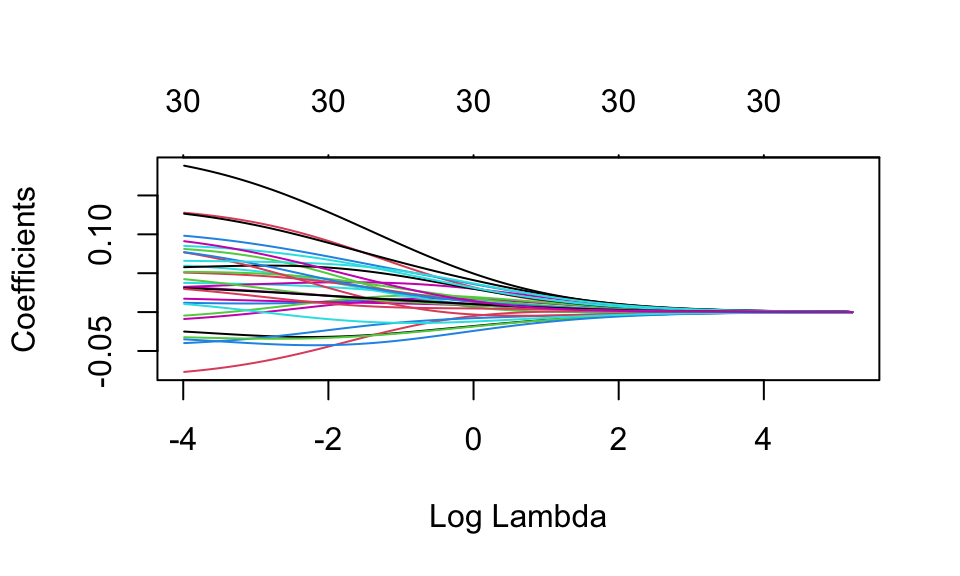
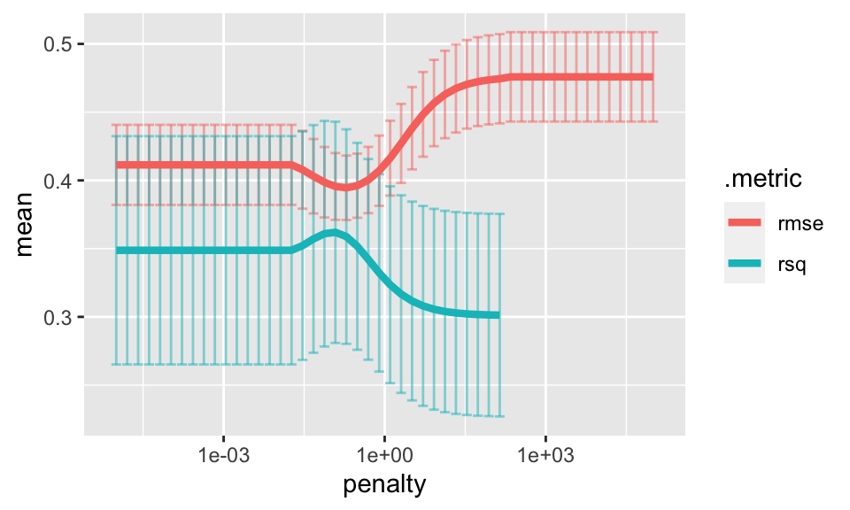
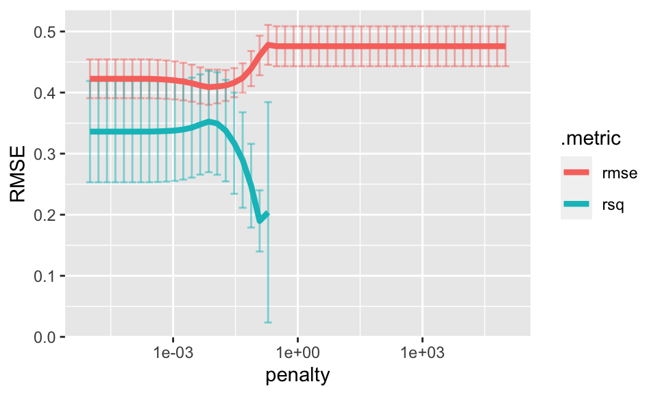

# Shrinkage Methods {#shrink}


Recall the two methods we've used so far to find sets of variable (and their coefficients):  

1. Choose models using domain knowledge and then applying **computational** methods (i.e., cross validation) to decide which model is superior.  Apply least squares (i.e., calculus) to find the coefficients.  
2. Adding variables systematically using **statistical** criteria (F-tests, adjusted $R^2$, $C_p$, BIC, AIC).  Apply least squares (i.e., calculus) to find the coefficients.
 
We move to a new model building algorithm that uses all $p-1$ explanatory variables and constrains the coefficient estimates, or equivalently, shrinks the coefficient estimates toward zero.   It turns out that shrinking the coefficients toward zero can substantially reduce the variance of the estimates (albeit adding a bit of bias).

3. That is, use **mathematical** optimization to shrink (set) some of the coefficients to zero (while simultaneously solving for the other non-zero coefficients).

The main reason to use shrinkage techniques is when the model has a lot of predictor variables ($p$ big) or when the model has a lot of predictor variables in comparison to the number of observations ($n \approx p$ or $n < p$) --- because that is when we get huge (infinite!) variability associated with the coefficients!


## On Inverting Matrices

**$X_{n \times p}$:**  The data matrix is $n \times p$.  We think of the data as being $n$ points in $p$ dimensions.  It is important to realize that not only are the points indexed in $p$ dimensions, but the points also take up the entire p-dimensional space.  [As an aside:  Whether a set of points takes up an entire space does not depend on how the points are indexed.  For example, think about a (2-dimensional) piece of paper floating in the sky with many many points on it.  You might index the coordinates of points on the paper using three dimensions, however, the paper / points  themselves actually live in a 2-dimensional subspace.]  To reiterate:  in an **ideal** world, the $n$ points live in $p$ space and cannot be considered to live in a smaller dimension than $p$.  Sometimes, the $n$ points are indexed to live in $p$ space, but actually take up a lower dimensional subspace (e.g., if two of the variable columns are perfectly correlated).

*However*, there are times when an $n \times p$ matrix lives in a space which is smaller than $p$.  For example, 

1. If two of the $p$ columns are exact linear combinations of one another, then the points will actually live in $p-1$ space. 
2. If the number of points is less than $p$  ($n < p$) then the points will only live in $n$ space.  For example, there is no way for two points take up three dimensions!

**$X^t X$:**  The matrix $X^tX$ is a linear transformation of the original $X$ matrix.  That is, if $X$ lives in $p$ space, it can't be linearly transformed into a higher dimension.  We could transform $X$ into a higher dimension by using functions or some kind of kernel mapping, but we can't do it via linear transformations.  That is to say, if $X$ has a rank which is lower than $p$, any linear combination will also, necessarily, transform the data into a space which is lower than $p$.

**$(X^tX)^{-1}$:**  The inverse of the matrix also represents a mapping.   Recall that if $AX = Y$ then $X= A^{-1}Y$.  But if we are mapping into a smaller space (smaller than $p$) then we can't invert back to a larger space (i.e., back to $p$).  And because $(X^tX)^{-1}$ is a $p \times p$ matrix, we are trying to invert back to a $p$ dimensional space.  Recall the Big Theorem in Linear Algebra that says if a $p \times p$ matrix has rank lower than $p$, it isn't invertible (also that it will have determinant zero, will have some eigenvalues that are zero, etc.)

**So...**  The point is that if $X$ doesn't have full rank (that is, if it has dimension less than $p$), there will be problems with computing $(X^tX)^{-1}$.  And the matrix $(X^tX)^{-1}$ is vitally important in computing both the least squares coefficients and their standard errors.

## Ridge Regression

An excellent discussion of Ridge Regression is given by @rr_theory.

Recall that the OLS (ordinary least squares) technique minimizes the distance between the observed and predicted values of the response.  That is, we found the $b_0, b_1, \ldots b_{p-1}$ that minimize:
$$SSE = \sum_{i=1}^n \bigg( Y_i - b_0 - \sum_{j=1}^{p-1} b_j X_{ij} \bigg)^2.$$

Using the OLS algorithm for modeling, the values of $b_i$ give the exact same model as the model built using the standardized variables which produce $b_i^*$.  However, as you will see, it is important to **standardize all variables before running ridge regression**.

For ease of computation, we will assume from here on that the variables have all been standardized as described above (in a previous section).  [Note:  ISL describes standardizing by only dividing by the standard deviation and not centering.  The two different methods will not produce different models (with respect to significance, etc.), but they will produce different intercept coefficients.  Indeed, scale is the important aspect to consider when working with shrinkage models.]

The ridge regression coefficients are calculated in a similar way to OLS, but the optimization equation seeks to minimize:

$$\sum_{i=1}^n \bigg( Y_i - b_0 - \sum_{j=1}^{p-1} b_j X_{ij} \bigg)^2 + \lambda \sum_{j=1}^{p-1} b_j^2 = SSE + \lambda \sum_{j=1}^{p-1} b_j^2$$
where $\lambda \geq 0$ is a *tuning parameter*, to be determined separately.  The ridge regression optimization provides a trade-off between two different criteria: variance and bias.  As with OLS, ridge regression seeks to find coefficients that fit the data well (minimize SSE!).   Additionally, ridge regression shrinks the coefficients to zero by adding a penalty so that smaller values of $b_j$ are preferred - the shrinkage makes the estimates less variable.  It can be proved that there is always a $\lambda \ne 0$ which gives smaller E[MSE] than OLS.    Note:  the shrinkage does not apply to the intercept!

Note:  the Gauss-Markov theorem says that OLS solutions are the best (i.e., smallest variance) linear unbiased estimates (BLUE).  But if we add a bit of bias, we can do better.  There is an existence theorem [@rr_wins] that says:
$$ \exists \ \  \lambda \mbox{ such that } E[MSE_{RR}] < E[MSE_{OLS}].$$
Excellent description of the theory is given by @rr_theory.

### The Ridge Regression Solution

\begin{eqnarray*}
\mbox{OLS: } \underline{b} &=& (X^t X)^{-1} X^t \underline{Y}\\
\mbox{ridge regression: } \underline{b} &=& (X^t X + \lambda \mathtt{I})^{-1} X^t \underline{Y}\\
\end{eqnarray*}


**Notes:**  

* The tuning parameter $\lambda$ balances the effect of the two different criteria in the optimization equation.  When $\lambda=0$, ridge regression is reduced to OLS.  As $\lambda \rightarrow \infty$, the coefficient estimates will shrink to zero.  
* We have assumed that the variables have been centered to have mean zero before ridge regression is performed.  Therefore, the estimated intercept will be $$b_0 = \overline{Y} = \frac{1}{n} \sum_i Y_i \ \ \ \ \ \ (= 0 \mbox{ if $Y$ is also centered}) $$  
* Note that the ridge regression optimization above is a constrained optimization equation, solved by Lagrange multipliers.  That is, we minimize $SSE = \sum_{i=1}^n \bigg( Y_i - b_0 - \sum_{j=1}^{p-1} b_j X_{ij} \bigg)^2$ subject to $\sum_{j=1}^{p-1} b_j^2 \leq s$ for some value of $s$.  Note that $s$ is inversely related to $\lambda$.


### Ridge Regression visually

Ridge regression is typically applied to situations with many many variables.  In particular, ridge regression will help us avoid situations of multicollinearity.  It doesn't make sense to apply it to a situation with only one or two variables.  However, we will demonstrate the process visually with $p=3$ dimensions because it is difficult to visualize in higher dimensions.

The ridge regression coefficient estimates solve the following optimization problem:

$$ \min_\beta \Bigg\{ \sum_{i=1}^n \Bigg( Y_i - b_0 - \sum_{j=1}^{p-1} b_j X_{ij} \Bigg)^2 \Bigg\} \mbox{  subject to  } \sum_{j=1}^{p-1} b_j^2 \leq s$$

<div class="figure" style="text-align: center">

<p class="caption">(\#fig:unnamed-chunk-5)The red contours represent pairs of $eta$ coefficients that produce constant values for SSE on the data.  The blue circle represents the possible values of $eta$ given the constraint (that the squared magnitude is less than some cutoff). Image credit: ISLR</p>
</div>

### Why Ridge Regression?

Recall that the main benefit to ridge regression is when $p$ is large (particularly in relation to $n$).  Remember that this (and multicollinearity) leads to instability of $(X^tX)^{-1}$.  Which leads to huge variability in the coefficient estimates.  A small change in the model or the observations can create wildly different estimates.   So the expected value of the MSE can be quite inflated due to the variability of the model.   Ridge regression adds a small amount of bias to the model, but it lowers the variance substantially and creates lower (on average) MSE values.

Additionally, ridge regression has computational advantages over the subset selection models (where all subsets requires searching through $2^{p-1}$ models).

#### Why is ridge regression better than least squares? {-}

The advantage is apparent in the bias-variance trade-off. As $\lambda$ increases, the flexibility of the ridge regression fit decreases. This leads to decrease variance, with a smaller increase in bias. Regular OLS regression is fixed with high variance, but no bias. However, the lowest test MSE tends to occur at a balance between variance and bias. Thus, by properly tuning $\lambda$ and acquiring less variance at the cost of a small amount of bias, we can find a lower potential MSE.


> Ridge regression works best in situations for least squares estimates have high variance. Ridge regression is also much more computationally efficient that any subset method, since it is possible to simultaneously solve for all values of $\lambda$.


### Inference on Ridge Regression Coefficients

Note that just like the OLS coefficients, the RR coefficients are a linear combination of the $Y$ values based on the $X$ matrix and (now) $\lambda$.  It is not hard, therefore, to find the variance of the coefficient vector at a particular value of $\lambda$.  Additionally, the same theory that gives normality (and the resulting t-statistics) drives normality for the ridge regression coefficients.

$$var(b^{RR}) = \sigma^2 W X^t X W \mbox{ where } W = (X^t X + \lambda \mathtt{I})^{-1}$$

However, all the distributional properties above give theoretical results for a fixed value of $\lambda$.  We now discuss estimating $\lambda$, but as soon as we estimate $\lambda$, it becomes dependent on the data and thus a random variable.  That is, the SE of $b^{RR}$ is a function of not only the variability associated with the data estimating the coefficients but also the variability of the data estimating $\lambda$.  

An additional problem is that the RR coefficients are known to be biased, and the bias is not easy to estimate.  Without a sense of where the variable is centered, the SE isn't particularly meaningful.  For these reasons, functions like `lm.ridge()` in R do not include tests / p-values but do approximate the SE of the coefficients (as an estimate).


## How do you choose $\lambda$?

Note that $\lambda$ is a function of the data, and therefore a random variable to estimate (just like estimating the coefficients).  However, we can use diagnostic measures to give a sense of $\lambda$ values which will give a good variance-bias trade-off.

1. Split data into test and training, and plot test MSE as a function of $\lambda$.  
2. Actually cross validate the data (remove test samples in groups of, say 1/10, to see which $\lambda$ gives the best predictions on "new" data) and find $\lambda$ which gives the smallest MSE for the cross validated data.

******  
**Cross Validating to Find $\lambda$**  

******  
1.  Set $\lambda$  (e.g., try $\lambda$ between $10^{-2}$ and $10^{5}$: `lambda.grid = 10^seq(5,-2, length =100)`)  
    a. Remove 1/10 of the observations (partition the data into 10 groups).
    b. Find the RR / Lasso model using the remaining 90% of the observations and the given value of $\lambda$. 
    c. Predict the response value for the removed points given the 90% training values.
    d. Repeat (a) - (c) until every point has been predicted as a test value.
2. Using the CV predictions, find $MSE_\lambda$ for the $\lambda$ at hand.
3. Repeat steps 1 and 2 across the grid of $\lambda$ values.
4. Choose the $\lambda$ value that minimizes the CV $MSE_\lambda$.


## Lasso

Ridge regression had at least one disadvantage; it includes all $p$ predictors in the final model. The penalty term will set many of them close to zero, but never exactly to zero. This isn't generally a problem for prediction accuracy, but it can make the model more difficult to interpret the results. Lasso overcomes this disadvantage and is capable of forcing some of the coefficients to zero granted that $\lambda$ is big enough. Since $\lambda = 0$ results in regular OLS regression, as $\lambda$ approaches $\infty$ the coefficients shrink towards zero.


### Lasso Coefficients

The lasso (least absolute shrinkage and selection operator) coefficients are calculated from a similar constraint to that of ridge regression, but the calculus is much harder now.  The L-1 norm is the only norm that gives sparsity and is convex (so that the optimization problem can be solved).  The lasso optimization equation seeks to minimize:

$$\sum_{i=1}^n \bigg( Y_i - b_0 - \sum_{j=1}^{p-1} b_j X_{ij} \bigg)^2 + \lambda \sum_{j=1}^{p-1} |b_j| = SSE + \lambda \sum_{j=1}^{p-1} |b_j|$$
where $\lambda \geq 0$ is a *tuning parameter*, to be determined separately.  As with ridge regression lasso optimization provides a trade-off between bias and variance.  Lasso seeks to find coefficients that fit the data well (minimize SSE!).   Additionally, lasso shrinks the coefficients to zero by adding a penalty so that smaller values of $b_j$ are preferred.    Note:  the shrinkage does not apply to the intercept!  The minimization quantities for ridge regression and lasso are extremely similar:  ridge regression constrains the sum of the squared coefficients; lasso constrains the sum of the absolute coefficients.  [As with ridge regression, we use standardized variables in modeling.]

### Lasso visually

As with ridge regression Lasso is also typically applied to situations with many many variables (also to avoid multicollinearity).  It doesn't make sense to apply it to a situation with only one or two variables.  However, we will demonstrate the process visually with p=3 dimensions because it is difficult to visualize in higher dimensions.  Notice here that there is a very good chance for the red contours to hit the turquoise square at a corner (producing some coefficients to be estimated as zero).  The corner effect becomes more extreme in higher dimensions.

The lasso coefficient estimates solve the following optimization problem:

$$ \min_\beta \Bigg\{ \sum_{i=1}^n \Bigg( Y_i - b_0 - \sum_{j=1}^{p-1} b_j X_{ij} \Bigg)^2 \Bigg\} \mbox{  subject to  } \sum_{j=1}^{p-1} |b_j| \leq s$$

<div class="figure" style="text-align: center">

<p class="caption">(\#fig:unnamed-chunk-8)The red contours represent pairs of $eta$ coefficients that produce constant values for SSE on the data.  The blue square represents the possible values of $eta$ given the constraint (that the absolute magnitude is less than some cutoff). Image credit: ISLR</p>
</div>

The key to lasso (in contrast to ridge regression) is that it does variable selection by shrinking the coefficients all the way to zero.  We say that the lasso yields *sparse* models - that is, only a subset of the original variables will be retained in the final model.

### How do you choose $\lambda$?

Note that $\lambda$ is a function of the data, and therefore a random variable to estimate (just like estimating the coefficients).  However, we can use diagnostic measures to give a sense of $\lambda$ values which will give a good variance-bias trade-off.

1. Split data into test and training, and plot test MSE as a function of $\lambda$.  
2. Actually cross validate the data (remove test samples in groups of, say 1/10, to see which $\lambda$ gives the best predictions on "new" data) and find $\lambda$ which gives the smallest MSE for the cross validated data.  


## Ridge Regression vs. Lasso

Quote from *An Introduction to Statistical Learning*, V2, page 246.

> These two examples illustrate that neither ridge regression nor the lasso will universally dominate the other. In general, one might expect the lasso to perform better in a setting where a relatively small number of predictors have substantial coefficients, and the remaining predictors have coefficients that are very small or that equal zero. Ridge regression will perform better when the response is a function of many predictors, all with coefficients of roughly equal size. However, the number of predictors that is related to the response is never known a priori for real data sets. A technique such as cross-validation can be used in order to determine which approach is better on a particular data set.

> As with ridge regression, when the least squares estimates have excessively high variance, the lasso solution can yield a reduction in variance at the expense of a small increase in bias, and consequently can generate more accurate predictions. Unlike ridge regression, the lasso performs variable selection, and hence results in models that are easier to interpret.

<div class="figure" style="text-align: center">

<p class="caption">(\#fig:unnamed-chunk-10-1)From ISLR, pgs 245-246.  The data in Figure 6.8 were generated in such a way that all 45 predictors were related to the response.  That is, none of the true coefficients beta1,... , beta45 equaled zero. The lasso implicitly assumes that a number of the coefficients truly equal zero. Consequently, it is not surprising that ridge regression outperforms the lasso in terms of prediction error in this setting. Figure 6.9 illustrates a similar situation, except that now the response is a function of only 2 out of 45 predictors. Now the lasso tends to outperform ridge regression in terms of bias, variance, and MSE.</p>
</div><div class="figure" style="text-align: center">

<p class="caption">(\#fig:unnamed-chunk-10-2)From ISLR, pgs 245-246.  The data in Figure 6.8 were generated in such a way that all 45 predictors were related to the response.  That is, none of the true coefficients beta1,... , beta45 equaled zero. The lasso implicitly assumes that a number of the coefficients truly equal zero. Consequently, it is not surprising that ridge regression outperforms the lasso in terms of prediction error in this setting. Figure 6.9 illustrates a similar situation, except that now the response is a function of only 2 out of 45 predictors. Now the lasso tends to outperform ridge regression in terms of bias, variance, and MSE.</p>
</div>


## Elastic Net

It is also possible to combine ridge regression and lasso through what is called *elastic net regularization*.  (The R package **glmnet** allows for the combined elastic net model.) The main idea is that the optimization contains both L-1 and L-2 penalties.  The model may produce more stable estimates of the coefficients but requires and additional tuning parameter to estimate.  That is, find the coefficients that minimize:

$$\sum_{i=1}^n \bigg( Y_i - b_0 - \sum_{j=1}^{p-1} b_j X_{ij} \bigg)^2 + \lambda \bigg[(1-\alpha)(\frac{1}{2})\sum_{j=1}^{p-1} b_j^2  + \alpha \sum_{j=1}^{p-1} |b_j| \bigg].$$


## <i class="fas fa-lightbulb" target="_blank"></i> Reflection Questions

1. How do ridge regression coefficient estimates differ from OLS estimates?  How are they similar?  
2. How do Lasso coefficient estimates differ from OLS estimates?  How are they similar?  
3. What is the difference between ridge regression and Lasso?  
4. What are some of the ways to find a good $\lambda$ for ridge regression?  
5. Why does the 1-norm regularization yield "sparse" solutions?  (What does "sparse" mean?)  
6. Give two different situations when ridge regression or Lasso are particularly appropriate.


## <i class="fas fa-balance-scale"></i> Ethics Considerations


## R: Ridge Regression


#### The Data {-}
The following dataset is from [TidyTuesday](https://github.com/rfordatascience/tidytuesday).  Again, we explore the information from [The Office](https://www.imdb.com/title/tt0386676/).  The analysis here is taken from [Julia Silge's blog](https://juliasilge.com/blog/lasso-the-office/).  She does a bit of data wrangling that I'm going to hide.  Look through her blog, or see the [source code](https://github.com/hardin47/website/tree/gh-pages/Math158) for this bookdown file.


The dataset we will be working with has `imdb_rating` as the response variable.  The predictor (explanatory) variables are: `season`, `episode` and 28 columns representing the number of lines of a particular character.

```r
office
```

```
## # A tibble: 136 × 32
##    season episode episode_name       andy angela darryl dwight   jim kelly kevin
##     <dbl>   <dbl> <chr>             <int>  <int>  <int>  <int> <int> <int> <int>
##  1      1       1 pilot                 0      1      0     29    36     0     1
##  2      1       2 diversity day         0      4      0     17    25     2     8
##  3      1       3 health care           0      5      0     62    42     0     6
##  4      1       5 basketball            0      3     15     25    21     0     1
##  5      1       6 hot girl              0      3      0     28    55     0     5
##  6      2       1 dundies               0      1      1     32    32     7     1
##  7      2       2 sexual harassment     0      2      9     11    16     0     6
##  8      2       3 office olympics       0      6      0     55    55     0     9
##  9      2       4 fire                  0     17      0     65    51     4     5
## 10      2       5 halloween             0     13      0     33    30     3     2
## # … with 126 more rows, and 22 more variables: michael <int>, oscar <int>,
## #   pam <int>, phyllis <int>, ryan <int>, toby <int>, erin <int>, jan <int>,
## #   ken_kwapis <dbl>, greg_daniels <dbl>, b_j_novak <dbl>,
## #   paul_lieberstein <dbl>, mindy_kaling <dbl>, paul_feig <dbl>,
## #   gene_stupnitsky <dbl>, lee_eisenberg <dbl>, jennifer_celotta <dbl>,
## #   randall_einhorn <dbl>, brent_forrester <dbl>, jeffrey_blitz <dbl>,
## #   justin_spitzer <dbl>, imdb_rating <dbl>
```

```r
set.seed(47)
office_split <- initial_split(office, strata = season)
office_train <- training(office_split)
office_test <- testing(office_split)
```


The full linear model:


```r
office_lm <- office_train %>%
  select(-episode_name) %>%
  lm(imdb_rating ~ ., data = .)

office_lm %>% tidy()
```

```
## # A tibble: 31 × 5
##    term         estimate std.error statistic  p.value
##    <chr>           <dbl>     <dbl>     <dbl>    <dbl>
##  1 (Intercept)  7.18       0.243      29.6   2.66e-41
##  2 season      -0.00779    0.0323     -0.241 8.10e- 1
##  3 episode      0.0181     0.00574     3.14  2.44e- 3
##  4 andy         0.00474    0.00302     1.57  1.21e- 1
##  5 angela       0.00147    0.00524     0.280 7.81e- 1
##  6 darryl       0.00538    0.00705     0.763 4.48e- 1
##  7 dwight      -0.000885   0.00301    -0.294 7.70e- 1
##  8 jim          0.00775    0.00296     2.61  1.10e- 2
##  9 kelly       -0.0175     0.00961    -1.82  7.35e- 2
## 10 kevin       -0.00170    0.00815    -0.209 8.35e- 1
## # … with 21 more rows
```

#### What if $n$ is really small? {-}


No good!  The coefficients cannot be estimated!  (Here, 5 points were randomly selected, remember $p = 31$.)  The model breaks down because $(X^t X)^{-1}$ is not invertible.  Notice that only 5 coefficients are estimated and no SEs are estimated.


```r
set.seed(47)
office_train %>%
  select(-episode_name) %>%
  slice_sample(n = 5) %>%
  lm(imdb_rating ~ ., data = .) %>% 
  tidy()
```

```
## # A tibble: 31 × 5
##    term        estimate std.error statistic p.value
##    <chr>          <dbl>     <dbl>     <dbl>   <dbl>
##  1 (Intercept)  7.64          NaN       NaN     NaN
##  2 season      -0.116         NaN       NaN     NaN
##  3 episode      0.0479        NaN       NaN     NaN
##  4 andy        -0.00932       NaN       NaN     NaN
##  5 angela       0.0323        NaN       NaN     NaN
##  6 darryl      NA              NA        NA      NA
##  7 dwight      NA              NA        NA      NA
##  8 jim         NA              NA        NA      NA
##  9 kelly       NA              NA        NA      NA
## 10 kevin       NA              NA        NA      NA
## # … with 21 more rows
```


#### Ridge Regression model building {-}


The vignette for **glmnet** is at https://cran.r-project.org/web/packages/glmnet/vignettes/glmnet_beta.pdf and is very useful.  **glmnet** will be used as the engine in the **tidymodels** process.

By using a generalized `linear_reg()` function, `mixture = 0` specifies ridge regression and `mixture = 1` specifies Lasso regularization. The `mixture` parameter can be any number between zero and one (and then represents a model referred to as Elastic Net regularization).  `penalty` will be a tuning parameter that is set later. 

##### Recipe {-}

First, a recipe needs to be specified.  Note that the `episode_name` is not a predictor variable, and all the variables need to be normalized (particularly important to scale the variables).


```r
office_rec <- recipe(imdb_rating ~ ., data = office_train) %>%
  update_role(episode_name, new_role = "ID") %>%
  step_zv(all_numeric(), -all_outcomes()) %>%
  step_normalize(all_numeric(), -all_outcomes())
```

##### Specify the engine + fit {-}

If we set the penalty to be 47, the ridge regression has a straightforward (linear algebra) solution.  The coefficients are given for the ridge regression model (and are substantially smaller than the linear regression coefficients, as expected).  

**Side note** relevant to the code but not to the main ideas of the ridge regression.

The constraint part can be specified in two different ways. (Can also be specified as $\sum_{j=1}^{p-1}b_j^2 \leq c$ for some $c$, but we won't use that construction here.) 

1. Set `penalty = P` in: $$\min(SSE + P)$$

2. Set $\lambda$ in: $$\min(SSE + \lambda\sum_{j=1}^{p-1}b_{j}^2)$$

If `P=0` then $\lambda$ will also be zero (and the estimates will be the same as those from OLS).  Additionally, `P` and $\lambda$ will be monotonically related.  That is, a large `penalty` corresponds to a large value of $\lambda.$  That said, they are not functions of one another.


```r
ridge_spec <- linear_reg(mixture = 0, penalty = 47) %>%
  set_mode("regression") %>%
  set_engine("glmnet")

ridge_wf <- workflow() %>%
  add_recipe(office_rec)

ridge_fit <- ridge_wf %>%
  add_model(ridge_spec) %>%
  fit(data = office_train)
```

It turns out that **glmnet** fits the model for *all* values of `penalty` at once, so we can see the coefficients for any other value of `penalty` of interest.  Notice that the coefficients are smaller for larger values of the `penalty`.


```r
ridge_fit %>% tidy()
```

```
## # A tibble: 31 × 3
##    term         estimate penalty
##    <chr>           <dbl>   <dbl>
##  1 (Intercept)  8.37          47
##  2 season      -0.000837      47
##  3 episode      0.000915      47
##  4 andy        -0.000123      47
##  5 angela       0.00108       47
##  6 darryl       0.000389      47
##  7 dwight       0.00113       47
##  8 jim          0.00189       47
##  9 kelly        0.000277      47
## 10 kevin        0.00110       47
## # … with 21 more rows
```

```r
ridge_fit %>% tidy(penalty = 0)
```

```
## # A tibble: 31 × 3
##    term        estimate penalty
##    <chr>          <dbl>   <dbl>
##  1 (Intercept)  8.37          0
##  2 season      -0.0250        0
##  3 episode      0.128         0
##  4 andy         0.0811        0
##  5 angela       0.0120        0
##  6 darryl       0.0375        0
##  7 dwight      -0.00887       0
##  8 jim          0.127         0
##  9 kelly       -0.0769        0
## 10 kevin       -0.00452       0
## # … with 21 more rows
```

We can visualize how the magnitude of the coefficients are regularized toward zero as the `penalty` goes up.  (We won't get into the relationship between $\lambda$ and `penalty`, they both penalize the magnitude of the coefficients, `penalty` can be specified *per* variable.)


```r
ridge_fit %>%
  extract_fit_engine() %>%
  plot(xvar = "lambda")
```



Prediction is done like other linear models.  So if `predict()` is used with no other parameters, it will use `penalty = 47` as specified above:


```r
predict(ridge_fit, new_data = office_train)
```

```
## # A tibble: 100 × 1
##    .pred
##    <dbl>
##  1  8.37
##  2  8.36
##  3  8.37
##  4  8.37
##  5  8.36
##  6  8.37
##  7  8.37
##  8  8.37
##  9  8.37
## 10  8.37
## # … with 90 more rows
```

#### Normalizing + Tuning + Whole Process

To tune the lambda parameter, we need to start over with the model/engine specification so that the `penalty` is not fixed.  


```r
ridge_spec_tune <- linear_reg(mixture = 0, penalty = tune()) %>%
  set_mode("regression") %>%
  set_engine("glmnet")
```

Next, a new `workflow()` which includes the new model/engine specification. Notice that we don't need to set `measure = 0` here because it was only the `penalty` term which we designated to `tune()`.


```r
set.seed(1234)
office_fold <- vfold_cv(office_train, strata = season)
  
ridge_grid <- grid_regular(penalty(range = c(-5, 5)), levels = 50)

ridge_wf <- workflow() %>%
  add_recipe(office_rec)

ridge_fit <- ridge_wf %>%
  add_model(ridge_spec_tune) %>%
  fit(data = office_train)

# this is the line that tunes the model using cross validation
set.seed(2020)
ridge_cv <- tune_grid(
  ridge_wf %>% add_model(ridge_spec_tune),
  resamples = office_fold,
  grid = ridge_grid
)
```


```r
collect_metrics(ridge_cv) %>%
  filter(.metric == "rmse") %>%
  arrange(mean)
```

```
## # A tibble: 50 × 7
##      penalty .metric .estimator  mean     n std_err .config              
##        <dbl> <chr>   <chr>      <dbl> <int>   <dbl> <chr>                
##  1 0.193     rmse    standard   0.395    10  0.0236 Preprocessor1_Model22
##  2 0.121     rmse    standard   0.396    10  0.0245 Preprocessor1_Model21
##  3 0.309     rmse    standard   0.396    10  0.0235 Preprocessor1_Model23
##  4 0.0754    rmse    standard   0.399    10  0.0258 Preprocessor1_Model20
##  5 0.494     rmse    standard   0.400    10  0.0243 Preprocessor1_Model24
##  6 0.0471    rmse    standard   0.403    10  0.0273 Preprocessor1_Model19
##  7 0.791     rmse    standard   0.407    10  0.0258 Preprocessor1_Model25
##  8 0.0295    rmse    standard   0.408    10  0.0286 Preprocessor1_Model18
##  9 0.00001   rmse    standard   0.411    10  0.0294 Preprocessor1_Model01
## 10 0.0000160 rmse    standard   0.411    10  0.0294 Preprocessor1_Model02
## # … with 40 more rows
```

Interestingly, as the penalty grows, the coefficients all get close to zero.  So the prediction will be the same for all observations (prediction will be $\overline{Y}$).  When the predictions are all the same, the computation for $R^2$ is NA.


```r
ridge_cv %>%
  collect_metrics() %>%
  ggplot(aes(x = penalty, y = mean, color = .metric)) + 
  geom_errorbar(aes(
    ymin = mean - std_err,
    ymax = mean + std_err),
    alpha = 0.5) + 
  geom_line(size = 1.5) + 
  scale_x_log10() 
```




The best model can be chosen using `select_best()`.


```r
best_rr <- select_best(ridge_cv, metric = "rmse")
best_rr
```

```
## # A tibble: 1 × 2
##   penalty .config              
##     <dbl> <chr>                
## 1   0.193 Preprocessor1_Model22
```


#### The Final Ridge Model {-}

Using the $\lambda$ value for the minimum MSE in the cross validation, we output the coefficients / model associated with the best $\lambda$ for the ridge regression model.  **Ridge regression does not do variable selection.**


```r
finalize_workflow(ridge_wf %>% add_model(ridge_spec_tune), best_rr) %>%
  fit(data = office_test) %>% tidy()
```

```
## # A tibble: 31 × 3
##    term        estimate penalty
##    <chr>          <dbl>   <dbl>
##  1 (Intercept)   8.38     0.193
##  2 season       -0.0344   0.193
##  3 episode       0.0892   0.193
##  4 andy         -0.0426   0.193
##  5 angela        0.0787   0.193
##  6 darryl        0.0220   0.193
##  7 dwight        0.0141   0.193
##  8 jim           0.0274   0.193
##  9 kelly        -0.0730   0.193
## 10 kevin         0.0389   0.193
## # … with 21 more rows
```

## R: Lasso Regularization

In this section, we'll re-run the cross validation to find a value of $\lambda$ which minimizes the cross validated MSE.  To tune the lambda parameter, we need to start over with the model/engine specification so that the `penalty` is not fixed.  Note that with Lasso, `mixture = 1`.


```r
lasso_spec_tune <- linear_reg(mixture = 1, penalty = tune()) %>%
  set_mode("regression") %>%
  set_engine("glmnet")
```

Next, a new `workflow()` which includes the new model/engine specification. Notice that we don't need to set `measure = 0` here because it was only the `penalty` term which we designated to `tune()`.


```r
lasso_grid <- grid_regular(penalty(range = c(-5, 5)), levels = 50)

lasso_wf <- workflow() %>%
  add_recipe(office_rec)

lasso_fit <- lasso_wf %>%
  add_model(lasso_spec_tune) %>%
  fit(data = office_train)

# this is the line that tunes the model using cross validation
set.seed(2020)
lasso_cv <- tune_grid(
  lasso_wf %>% add_model(lasso_spec_tune),
  resamples = office_fold,
  grid = lasso_grid
)
```


```r
collect_metrics(lasso_cv) %>%
  filter(.metric == "rmse") %>%
  arrange(desc(.metric))
```

```
## # A tibble: 50 × 7
##      penalty .metric .estimator  mean     n std_err .config              
##        <dbl> <chr>   <chr>      <dbl> <int>   <dbl> <chr>                
##  1 0.00001   rmse    standard   0.423    10  0.0318 Preprocessor1_Model01
##  2 0.0000160 rmse    standard   0.423    10  0.0318 Preprocessor1_Model02
##  3 0.0000256 rmse    standard   0.423    10  0.0318 Preprocessor1_Model03
##  4 0.0000409 rmse    standard   0.423    10  0.0318 Preprocessor1_Model04
##  5 0.0000655 rmse    standard   0.423    10  0.0318 Preprocessor1_Model05
##  6 0.000105  rmse    standard   0.423    10  0.0318 Preprocessor1_Model06
##  7 0.000168  rmse    standard   0.423    10  0.0318 Preprocessor1_Model07
##  8 0.000268  rmse    standard   0.423    10  0.0318 Preprocessor1_Model08
##  9 0.000429  rmse    standard   0.422    10  0.0316 Preprocessor1_Model09
## 10 0.000687  rmse    standard   0.421    10  0.0314 Preprocessor1_Model10
## # … with 40 more rows
```

Interestingly, as the penalty grows, the coefficients all get close to zero.  So the prediction will be the same for all observations (prediction will be $\overline{Y}$).  When the predictions are all the same, the computation for $R^2$ is NA.


```r
lasso_cv %>%
  collect_metrics() %>%
  ggplot(aes(x = penalty, y = mean, color = .metric)) + 
  geom_errorbar(aes(
    ymin = mean - std_err,
    ymax = mean + std_err),
    alpha = 0.5) + 
  geom_line(size = 1.5) + 
  scale_x_log10() +
  ylab("RMSE")
```




The best model can be chosen using `select_best()`.


```r
best_lasso <- select_best(lasso_cv, metric = "rmse")
best_lasso
```

```
## # A tibble: 1 × 2
##   penalty .config              
##     <dbl> <chr>                
## 1 0.00720 Preprocessor1_Model15
```


#### The Final Lasso Model {-}

Using the $\lambda$ value for the minimum MSE in the cross validation, we output the coefficients / model associated with the best $\lambda$ for the ridge regression model.  **Lasso regularization DOES do variable selection.**  Note the large number of coefficients that are set to zero.


```r
finalize_workflow(lasso_wf %>% add_model(lasso_spec_tune), best_lasso) %>%
  fit(data = office_test) %>% tidy()
```

```
## # A tibble: 31 × 3
##    term        estimate penalty
##    <chr>          <dbl>   <dbl>
##  1 (Intercept)  8.38    0.00720
##  2 season       0       0.00720
##  3 episode      0.157   0.00720
##  4 andy        -0.0739  0.00720
##  5 angela       0.231   0.00720
##  6 darryl       0.0663  0.00720
##  7 dwight      -0.0721  0.00720
##  8 jim         -0.00866 0.00720
##  9 kelly       -0.167   0.00720
## 10 kevin        0       0.00720
## # … with 21 more rows
```


