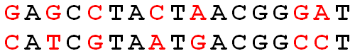
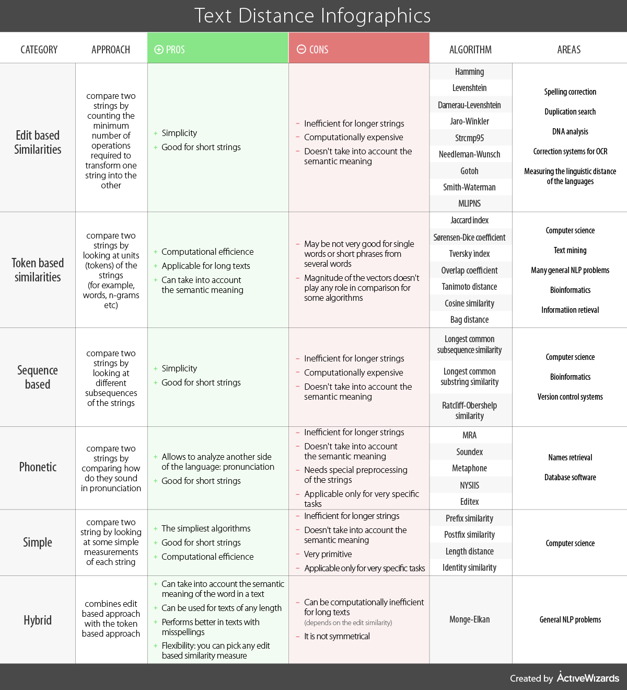
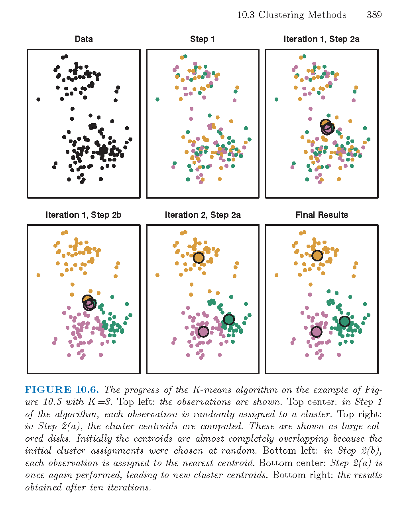

# Unsupervised Methods {#unsup}


The classification models we've discussed are all supervised learning techniques.  The word *supervised* refers to the fact that we know the response variable of all of the training observations.  Next up, we'll discuss clustering which is an *unsupervised* technique -- none of the observations have a given response variable.  For example, we might want to cluster a few hundred melanoma patients based on their genetic data.  We are looking for patterns in who groups together, but we don't have a preconceived idea of which patients belong to which group.

There are also semi-supervised techniques applied to data which have some observations that are labeled and some that are not.  We will not discuss semi-supervised methods in this class.


**Clustering** creates groups of observations via unsupervised methods.  We will cover hierarchical clustering, k-means, and k-medoids.  We cluster for two main reasons:

* Summary: to describe the data and the observations' similarities to each other.
* Discovery: to find new ways in which groups of observations are similar.

**Classification -- SUPERVISED!** creates predictions (and prediction models) for unknown future observations via supervised methods.  With classification the group membership (i.e., response variable) is *known* for all the training data.  We covered k-NN, CART, bagging, Random Forests, and SVMs.

## Latent Dirichlet Allocation

LDA views each document as a mixture of a small (predefined) number of topics that describe a set of documents.  Each word (typically very common and extremely rare words are removed before modeling) represents a an occurrence generated by one of the document's topics (where the document is modeled as a mixture of topics).    Through LDA, the model learns both the composition of each topic and the topic mixture of each document.

From Wikipedia:

> In natural language processing, latent Dirichlet allocation (LDA) is a generative statistical model that allows sets of observations to be explained by unobserved groups that explain why some parts of the data are similar. For example, if observations are words collected into documents, it posits that each document is a mixture of a small number of topics and that each word's creation is attributable to one of the document's topics.

Here is an algorithm for finding words that represent $K$ topics (where $K$ is chosen in advance).  [Explained in more detail at http://blog.echen.me/2011/08/22/introduction-to-latent-dirichlet-allocation/.]


1. For each document in the training data, randomly assign each word to one of the $K$ topics.
2. Each of the $K$ topics now has a set of words associated with it (albeit, that set of words is meaningless). To improve on the set of words associated with each topic.  For each word $w$ in document $d$:
    a. For each topic $t$, compute two things: 
        * p(topic $t$ $|$ document $d$) = the proportion of words in document $d$ that are currently assigned to topic $t$
        * p(word $w$ $|$ topic $t$) = the proportion of assignments to topic $t$ over all documents that come from this word $w$. 
    b. Reassign $w$ to a new topic, where we choose topic $t$ with probability = p(topic $t$ $|$ document $d$) * p(word $w$ $|$ topic $t$) (according to our generative model, this is essentially the probability that topic $t$ generated word $w$, so it makes sense that we resample the current word's topic with this probability).
    c. In other words, in this step, we're assuming that all topic assignments except for the current word in question are correct, and then updating the assignment of the current word using our model of how documents are generated.
2.  After repeating the previous steps a large number of times, the list of words in each topic will reach a steady state. The resulting assignments estimate the topic mixtures of each document (by counting the proportion of words assigned to each topic within that document) and the words associated to each topic (by counting the proportion of words assigned to each topic overall).


https://ziqixiong.shinyapps.io/TopicModeling/


## Dissimilarities

Many, though not all, clustering algorithms are based on distances between the objects being clustered.  Mathematical properties of a distance function are the following.  Consider two vectors ${\bf x}$ and ${\bf y}$ (${\bf x}, {\bf y} \in \mathbb{R}^p$), and the distance between them: $d({\bf x}, {\bf y})$.

1. $d({\bf x}, {\bf y}) \geq 0$
2. $d({\bf x}, {\bf y}) = d({\bf y}, {\bf x})$
3. $d({\bf x}, {\bf y}) = 0$ iff ${\bf x} = {\bf y}$
4. $d({\bf x}, {\bf y}) \leq d({\bf x}, {\bf z}) + d({\bf z}, {\bf y})$  for all other vectors ${\bf z}$.

**Triangle Inequality**

The key to proving the triangle inequality for most of the distances relies on the Cauchy-Schwarz inequality.
\begin{align}
{\bf x} \cdot {\bf y} &= || {\bf x} ||  ||{\bf y}|| \cos(\theta) \\
|{\bf x} \cdot {\bf y}| &\leq || {\bf x} ||  ||{\bf y}|| 
\end{align}


#### Euclidean Distance {-}

$$d_E({\bf x}, {\bf y}) = \sqrt{\sum_{i=1}^p (x_i - y_i)^2}$$

Distance properties all check out.

4.  Cauchy-Schwarz:
\begin{align}
\sum_{i=1}^p(x_i - y_i)^2 = \sum_{i=1}^p ( (x_i - z_i) + (z_i - y_i))^2 &\leq \Bigg( \sqrt{\sum_{i=1}^p(x_i - z_i)^2} + \sqrt{\sum_{i=1}^p(z_i - y_i)^2} \Bigg)^2\\
\sqrt{\sum_{i=1}^p(x_i - y_i)^2} &\leq \sqrt{\sum_{i=1}^p(x_i - z_i)^2} + \sqrt{\sum_{i=1}^p(z_i - y_i)^2}\\
d_E({\bf x}, {\bf y}) &\leq d_E({\bf x}, {\bf z}) + d_E({\bf z}, {\bf y})
\end{align}


**Shortcomings:**

* $d_E$ is not scale invariant.
* $d_E$ measures magnitude differences, not pattern differences.
* $d_E$ is sensitive to outliers.

**Strengths:**

* Directly measures what is commonly considered to be "distance."

#### Pearson Correlation Distance {-}
\begin{align}
d_P({\bf x}, {\bf y}) &= 1 - r_P ({\bf x}, {\bf y})\\
 \mbox{ or } &= 1 - |r_P ({\bf x}, {\bf y})|\\
 \mbox{ or }   &= 1 - (r_P ({\bf x}, {\bf y}))^2\\
  \end{align}

 Notice that Euclidean distance and Pearson correlation distance are similar if the original observations are scaled.  Assume that the sample mean for ${\bf x}$ (that is, $\frac{1}{p} \sum x_i = \overline{x} = 0$) is zero and the sample standard deviation is 1.

 \begin{align}
 r_P ({\bf x}, {\bf y}) &=  \frac{\sum x_i y_i - p \ \overline{x} \ \overline{y}}{(p-1)s_x s_y}\\
 &=  \frac{1}{(p-1)} \sum x_i y_i\\
 & \ \ & \\
 d_E({\bf x}, {\bf y}) &= \sqrt{\sum(x_i - y_i)^2}\\
 &=  \sqrt{ \sum x_i^2 + \sum y_i^2 - 2 \sum x_i y_i}\\
 d_E^2 &= 2[(p-1) - \sum x_i y_i]\\
 &= 2(p-1)*[1 - r_P({\bf x}, {\bf y})]
 \end{align}


##### Distance properties don't hold for Pearson correlation {-}


3.   ${\bf y}=a{\bf x}$
 \begin{align}
d_P({\bf x}, {\bf y}) &= 1 - r_P ({\bf x}, {\bf y})\\
&= 1 - r_P ({\bf x}, a{\bf x})\\
&= 1 - 1 = 0
\end{align}

4.
 ${\bf x}=(1,1,0)$, ${\bf y} = (2,1,0)$, ${\bf z} = (1,-1,0)$ 
 $r_P({\bf x}, {\bf y}) = 0.87$, $r_P({\bf x}, {\bf z}) = 0$, $r_P({\bf y}, {\bf z}) = 0.5$

 $d_P({\bf x}, {\bf y}) + d_P({\bf y}, {\bf z})  <  d_P({\bf z}, {\bf x})$
 $\rightarrow\leftarrow$

**Regular Pearson distance**


```r
x1 <- c(1,2,3)
x2 <- c(1, 4, 10)
x3 <- c(9, 2, 2)

# d(1,2)
1 - cor(x1, x2)
```

```
## [1] 0.01801949
```

```r
# d(1,3)
1 - cor(x1, x3)
```

```
## [1] 1.866025
```

```r
# d(2,3)
1 - cor(x2, x3)
```

```
## [1] 1.755929
```

```r
# d(1,3) > d(1,2) + d(2,3)
1 - cor(x1, x2) + 1 - cor(x2, x3)
```

```
## [1] 1.773948
```


**Absolute Pearson distance**

Using absolute distance doesn't fix things.


```r
# d(1,2)
1 - abs(cor(x1, x2))
```

```
## [1] 0.01801949
```

```r
# d(1,3)
1 - abs(cor(x1, x3))
```

```
## [1] 0.1339746
```

```r
# d(2,3)
1 - abs(cor(x2, x3))
```

```
## [1] 0.2440711
```

```r
# d(2,3) > d(1,2) + d(1,3)
1 - abs(cor(x1, x2)) + 1 - abs(cor(x1, x3))
```

```
## [1] 0.1519941
```


**Shortcomings:**

* $d_P$ does not satisfy the triangle inequality.
* $d_P$ is sensitive to outliers.

**Strengths:**

* Can measure the distance between variables on different scales  (although will still be sensitive to extreme values).


#### Spearman Correlation Distance {-}
Spearman correlation distance uses the Spearman correlation instead of the Pearson correlation.  The Spearman correlation is simply the Pearson correlation applied to the ranks of the observations.  The ranking allows the Spearman distance to be resistant to outlying observations.

\begin{align}
d_S({\bf x}, {\bf y}) &= 1 - r_S ({\bf x}, {\bf y})\\
 \mbox{ or } &= 1 - |r_S ({\bf x}, {\bf y})|\\
 \mbox{ or }   &= 1 - (r_S ({\bf x}, {\bf y}))^2\\
  \end{align}

**Shortcomings:**

* $d_S$ also does not satisfy the triangle inequality.
* $d_S$ loses information about the shape of the relationship.

**Strengths:**

* Is resistant to outlying values

#### Cosine Distance {-}

\begin{align}
d_C({\bf x}, {\bf y}) &=  \frac{{\bf x} \cdot {\bf y}}{|| {\bf x} ||  ||{\bf y}||}\\
&= \frac{\sum_{i=1}^p x_i y_i}{\sqrt{\sum_{i=1}^p x_i^2 \sum_{i=1}^p y_i^2}}\\
&= 1 - r_P ({\bf x}, {\bf y})  \ \ \ \ \mbox{if } \overline{\bf x} = \overline{\bf y} = 0
\end{align}

Said differently, 

\begin{align}
d_P({\bf x}, {\bf y}) = d_C({\bf x} -  \overline{\bf x}, {\bf y} -  \overline{\bf y})
\end{align}

#### Haversine Distance {-}

Haversine distance is the great-circle distance (i.e., the distance between two points on a sphere) which is used to measure distance between two locations on the Earth.  Let $R$ be the radius of the Earth, and (lat1,long1) and (lat2, long2) be the two locations between which to calculate a distance.

$$d_{HV} = 2 R \arcsin \sqrt{\sin^2 \bigg( \frac{lat2-lat1}{2} \bigg) + \cos(lat1) \cos(lat2) \sin^2 \bigg(\frac{long2 - long1}{2} \bigg)} $$


**Shortcomings:**

* Earth is not a perfect sphere
* Depending on how the distance is used, typically getting from one point to the next is not done by the shortest distance

**Strengths:**

* Allows calculations, for example, between two cities.

#### Hamming Distance {-}

Hamming distance is the number of coordinates across two vectors whose values differ.  If the vectors are binary, the Hamming distance is equivalent to the $L_1$ norm of the difference.  (Hamming distance does satisfy the properties of a distance metric.)   Some methods, equivalently, calculate the proportion of coordinates that differ.

\begin{align}
d_H({\bf x}, {\bf y}) = \sum_{i=1}^p I(x_i \ne y_i)
\end{align}


<div class="figure" style="text-align: center">

<p class="caption">(\#fig:unnamed-chunk-7)The Hamming distance across the two DNA strands is 7.</p>
</div>


**Shortcomings:**

* Can't measure degree of difference between categorical variables.

**Strengths:**

* It is a distance metric.
Gives a more direct "distance" between categorical variables.


<div class="figure" style="text-align: center">

<p class="caption">(\#fig:unnamed-chunk-8)The function `dist` in `R` calculates the distances given above.</p>
</div>

#### Distance on strings {-}

Consider the following infographic which compares different methods for computing distances between strings.

<div class="figure" style="text-align: center">

<p class="caption">(\#fig:unnamed-chunk-9)Comparison of string distance metrics from https://www.kdnuggets.com/2019/01/comparison-text-distance-metrics.html.</p>
</div>

## Hierarchical Clustering {#hier}

**Hierarchical Clustering** is a set of nested clusters that are organized as a tree.  Note that objects that belong to a child cluster also belong to the parent cluster.


**Example:**  Consider the following images / data (from Laura Hoopes, personal communication; *Molecular characterisation of soft tissue tumours: a gene expression study* by Nielsen et al., The Lancet 2002).  The first represents a microarray sample from aging yeast.  The second is a set of 41 samples of soft-tissue tumors (columns) and a subset of 5520 genes (rows) used to characterize their molecular signatures.


Note: the ordering of the variables (or samples) does not affect the clustering of the samples (or variables).  That is:  we can clustering the variables / samples either sequentially or in parallel to see trends in both relationships simultaneously.  Clustering both the observations and the variables is called *biclustering*.


******
**Algorithm**:  Agglomerative Hierarchical Clustering Algorithm

******
1. Begin with $n$ observations and a measure (such as Euclidean distance) of all the ${n \choose 2} = n(n-1)/2$ pairwise dissimilarities. Treat each observation as its own cluster.
2. For $i = n, n - 1, \ldots , 2$:

(a) Examine all pairwise inter-cluster dissimilarities among the $i$ clusters and identify the pair of clusters that are least dissimilar (that is, most similar). Fuse these two clusters. The dissimilarity between these two clusters indicates the height in the dendrogram at which the fusion should be placed.
(b) Compute the new pairwise inter-cluster dissimilarities among the $i - 1$ remaining clusters.

******

**Agglomerative** methods start with each object (e.g., gene) in its own group.  Groups are merged until all objects are together in one group.

**Divisive** methods start with all objects in one group and break up the groups sequentially until all objects are individuals.

**Single Linkage** algorithm defines the distance between groups as that of the closest pair of individuals.

**Complete Linkage** algorithm defines the distance between groups as that of the farthest pair of individuals.

**Average Linkage** algorithm defines the distance between groups as the average of the distances between all pairs of individuals across the groups.

Toy Example of **Single Linkage Agglomerative Hierarchical Clustering**


|  	| A 	|  B	| C 	|  D	| E |
|----	|-----	|-----	|-----	|----	|----	|
| A 	| 0 	|  	|  	|  	|  |
| B 	| 0.2 	| 0 	|  	|  	|  |
| C 	| 0.6 	| 0.5 	| 0  	|  	|  |
| D 	| 1 	| 0.9 	| 0.4 	| 0 	|  |
| E 	| 0.9 	| 0.8 	| 0.5 	| 0.3 	|  0 |


Link A and B!
\begin{align}
d_{(AB)C} &= \min(d_{AC}, d_{BC}) = 0.5\\
d_{(AB)D} &= \min(d_{AD}, d_{BD}) = 0.9\\
d_{(AB)E} &= \min(d_{AE}, d_{BE}) = 0.8\\
\end{align}

|  	| AB 	| C 	|  D	| E 	|
|----	|-----	|-----	|-----	|----	|
| AB 	| 0 	|  	|  	|  	|
| C 	| 0.5 	| 0 	|  	|  	|
| D 	| 0.9 	| 0.4 	| 0 	|  	|
| E 	| 0.8 	| 0.5 	| 0.3 	| 0 	|

Link D and E!
\begin{align}
d_{(AB)C} &=  0.5\\
d_{(AB)(DE)} &= \min(d_{AD}, d_{BD}, d_{AE}, d_{BE}) = 0.8\\
d_{(DE)C} &= \min(d_{CD}, d_{CE}) = 0.4\\
\end{align}


|  	| AB 	| C 	|  DE	|  
|----	|-----	|-----	|-----	|
| AB 	| 0 	|  	|  	|
| C 	| 0.5 	| 0 	|  	|
| DE 	| 0.8 	| 0.4 	| 0 	|

Link C with (DE)!
\begin{align}
d_{(AB)(CDE)} = d_{BC} = 0.5
\end{align}


### R hierarchical Example

Again, using the `penguins` dataset, hierarchical clustering will be run.  We can look at the dendrogram, in particular its alignment to the categorical variables like `species` and `island`.

Notice that we are only using the numerical variables.  And the numerical variables have been scaled (subtract the mean and divide by the standard deviation).

Full example has been adapted from https://cran.r-project.org/web/packages/dendextend/vignettes/Cluster_Analysis.html.


```r
library(tidyverse)
library(tidymodels)
library(palmerpenguins)
data(penguins)

penguins_h <- penguins %>%
  drop_na(bill_length_mm, bill_depth_mm, flipper_length_mm, body_mass_g) %>%
  select(bill_length_mm, bill_depth_mm, flipper_length_mm, body_mass_g) %>%
  mutate(across(bill_length_mm:body_mass_g, scale))

set.seed(47)
penguin_hclust <- penguins_h %>%
  dist() %>%
  hclust(method = "complete")

penguin_hclust
```

```
## 
## Call:
## hclust(d = ., method = "complete")
## 
## Cluster method   : complete 
## Distance         : euclidean 
## Number of objects: 342
```

```r
penguin_dend <- as.dendrogram(penguin_hclust)
```

#### Plotting {-}

The basic dendrogram:


```r
plot(penguin_hclust)
```


Zooming in on a cluster:


```r
plot(penguin_dend[[1]])
```


Adding color to branches and nodes


```r
library(colorspace) # get nice colors
species_col <- rev(rainbow_hcl(3))[as.numeric(penguins$species)]
```


```r
library(dendextend)
# order the branches as closely as possible to the original order
penguin_dend <- rotate(penguin_dend, 1:342)
```


```r
# color branches based on the clusters
penguin_dend <- color_branches(penguin_dend, k = 3)

# Manually match the labels, as much as possible, to the real classification of the flowers:
labels_colors(penguin_dend) <-
   rainbow_hcl(3)[sort_levels_values(
      as.numeric(penguins$species)[order.dendrogram(penguin_dend)]
   )]

# We shall add the flower type to the labels:
labels(penguin_dend) <- paste(as.character(penguins$species)[order.dendrogram(penguin_dend)],
                           "(",labels(penguin_dend),")", 
                           sep = "")
# We hang the dendrogram a bit:
penguin_dend <- hang.dendrogram(penguin_dend,hang_height=0.1)

# reduce the size of the labels:
penguin_dend <- assign_values_to_leaves_nodePar(penguin_dend, 0.5, "lab.cex")
penguin_dend <- set(penguin_dend, "labels_cex", 0.5)
# And plot:
par(mar = c(3,3,3,7))
plot(penguin_dend, 
     main = "Clustered penguin data set
     (the labels give the true penguin species)", 
     horiz =  TRUE,  nodePar = list(cex = .007))
penguin_species <- rev(levels(penguins$species))
legend("topleft", legend = penguin_species, fill = rainbow_hcl(3))
```


## Partitioning Clustering {#part}

**Partition Clustering** is a division of the set of data objects into $K$ non-overlapping subsets (clusters) with each observation falling into exactly one cluster.


In contrast to hierarchical clustering where results were given for any (and all!) number of clusters, partitioning methods typically start with a given $k$ value and a set of distances.   The goal is to partition the observations into $k$ groups such that an objective function is optimized.  The number of possible partitions is roughly to $n^k / k!$  (note: $100^{5} / 5! = 83$ million).  [The exact number can be computed using Sterling numbers.]   So instead of looking through all of the partitions, we step through a recursive algorithm.

### $k$-means Clustering

A fun applet!! 

https://www.naftaliharris.com/blog/visualizing-k-means-clustering/

<!--
http://www.math.le.ac.uk/people/ag153/homepage/KmeansKmedoids/Kmeans_Kmedoids.html#L2

See also the guide to the applet which give lots of great advice.

% good datasets and also some interesting reflections on using k-means in R
% https://www.datacamp.com/community/tutorials/k-means-clustering-r?utm_campaign=News&utm_medium=Community&utm_source=DataCamp.com
-->

$k$-means clustering is an unsupervised partitioning algorithm designed to find a partition of the observations such that the following objective function is minimized (find the smallest within cluster sum of squares):

$$\text{arg}\,\min\limits_{C_1, \ldots, C_k} \Bigg\{ \sum_{k=1}^K 2 \sum_{i \in C_k} \sum_{j=1}^p (x_{ij} - \overline{x}_{kj})^2 \Bigg\}$$


As described in the algorithm below, reallocating observations can only improve the minimization criteria with the algorithm stopping when no changes of the observations will lower the objective function.  The algorithm leads to a *local optimum*, with no confirmation that the global minimum has occurred.  Often the $k$- means algorithm is run multiple times with different random starts, and the partition leading to the lowest objective criteria is chosen.

Note that the following algorithm is simply one $k$-means algorithm.  Other algorithms could include a different way to set the starting values, a different decision on when to recalculate the centers, what to do with ties, etc.


<div class="figure" style="text-align: center">

<p class="caption">(\#fig:unnamed-chunk-18)From *An Introduction to Statistical Learning* by James, Witten, Hastie, and Tibshirani.</p>
</div>

******
**Algorithm**:   $k$-Means Clustering

******
1. Randomly assign a number, from 1 to $k$, to each of the observations.  These serve as initial cluster assignments for the observations.
2. Iterate until the cluster assignments stop changing:
    (a) For each of the $k$ clusters, compute the cluster centroid. The $k^{th}$ cluster centroid is the vector of the $p$ feature means for the observations in the $k^{th}$ cluster.
    (b) Assign each observation to the cluster whose centroid is closest (where closest is defined using Euclidean distance).
3.  Ties?  Do something consistent:  for example, leave in the current cluster.

******


Why does the $k$-means algorithm converge / (local) minimize the objective function?


1. If a point is closer to a different center, moving it will lower the objective function.
2. Averages minimize squared differences, so taking the new average will result in a lower objective function.
3. If a point is equidistant from two clusters, the point won't move.
4. The algorithm must converge in finite number of steps because there are finitely many points.

#### Scaling matters {-}

Note that if the variables are on very different scales, whichever variable is larger in magnitude will dominate the distances (and therefore the clustering).  Unless you *explicitly* want that to happen (which would be odd), you should scale the variables (subtract the mean and divide by the standard deviation) so that the distance is calculated on Z-scores instead of on the raw data.

In the example below, the $k=2$ k-means algorithm is not able to see the cigar-shaped structure (on the raw data) because the distances are dominated by the x1 variable (which does not differentiate the clusters).  


```r
set.seed(47)
norm_clust <- data.frame(
  x1 = rnorm(1000, 0, 15),
  x2 = c(rnorm(500, 5, 1), rnorm(500, 0, 1)))

norm_clust %>%
  kmeans(centers = 2) %>%
  augment(norm_clust) %>%
  ggplot() + 
  geom_point(aes(x = x1, y = x2, color = .cluster)) +
  ggtitle("k-means (k=2) on raw data")
```


```r
norm_clust %>%
  mutate(across(everything(), scale)) %>%
  kmeans(centers = 2) %>%
  augment(norm_clust) %>%
  ggplot() + 
  geom_point(aes(x = x1, y = x2, color = .cluster)) +
  ggtitle("k-means (k=2) on normalized / scaled data")
```


**strengths**

* No hierarchical structure / points can move from one cluster to another.
* Can run for a range of values of $k$.

**shortcomings**

* $k$ has to be predefined to run the algorithm.
* $k$-means is based on Euclidean distance (*only*).

### R k-means Example

Again, using the `penguins` dataset, $k$-means clustering will be run.  We try multiple different values of $k$ to come up with a partition of the penguins.  We can look at the clusterings on scatterplots of the numerical variables.  We can also check to see if the clustering aligns with the categorical variables like `species` and `island`.

Notice that we are only using the numerical variables.  And the numerical variables have been scaled (subtract the mean and divide by the standard deviation).

Full example has been adapted from https://www.tidymodels.org/learn/statistics/k-means/.


```r
library(tidyverse)
library(tidymodels)
library(palmerpenguins)
data(penguins)

penguins_km <- penguins %>%
  drop_na(bill_length_mm, bill_depth_mm, flipper_length_mm, body_mass_g) %>%
  select(bill_length_mm, bill_depth_mm, flipper_length_mm, body_mass_g) %>%
  mutate(across(bill_length_mm:body_mass_g, scale))

set.seed(47)
penguin_kclust <- penguins_km %>%
  kmeans(centers = 3)

penguin_kclust
```

```
## K-means clustering with 3 clusters of sizes 132, 123, 87
## 
## Cluster means:
##   bill_length_mm bill_depth_mm flipper_length_mm body_mass_g
## 1     -1.0465260     0.4858415        -0.8899121  -0.7694891
## 2      0.6562677    -1.0983711         1.1571696   1.0901639
## 3      0.6600059     0.8157307        -0.2857869  -0.3737654
## 
## Clustering vector:
##   [1] 1 1 1 1 1 1 1 1 3 1 1 1 1 1 1 1 3 1 3 1 1 1 1 1 1 1 1 1 1 1 1 1 1 1 1 1 1
##  [38] 1 1 1 1 1 3 1 1 1 1 1 3 1 1 1 3 1 1 1 1 1 1 1 3 1 1 1 1 1 1 1 3 1 1 1 3 1
##  [75] 3 1 1 1 3 1 3 1 1 1 1 1 1 1 1 1 3 1 1 1 3 1 1 1 3 1 3 1 1 1 1 1 1 1 3 1 3
## [112] 1 3 1 3 1 1 1 1 1 1 1 3 1 1 1 1 1 3 1 3 1 1 1 1 1 1 1 1 1 1 1 1 1 1 1 1 1
## [149] 1 1 3 2 2 2 2 2 2 2 2 2 2 2 2 2 2 2 2 2 2 2 2 2 2 2 2 2 2 2 2 2 2 2 2 2 2
## [186] 2 2 2 2 2 2 2 2 2 2 2 2 2 2 2 2 2 2 2 2 2 2 2 2 2 2 2 2 2 2 2 2 2 2 2 2 2
## [223] 2 2 2 2 2 2 2 2 2 2 2 2 2 2 2 2 2 2 2 2 2 2 2 2 2 2 2 2 2 2 2 2 2 2 2 2 2
## [260] 2 2 2 2 2 2 2 2 2 2 2 2 2 2 2 3 3 3 3 3 3 3 3 3 3 3 3 3 3 3 3 3 3 3 3 1 3
## [297] 1 3 3 3 3 3 3 3 1 3 1 3 3 3 3 3 3 3 3 3 3 3 3 3 3 3 3 3 3 3 3 3 1 3 3 3 3
## [334] 3 3 3 3 3 3 3 3 3
## 
## Within cluster sum of squares by cluster:
## [1] 122.1477 143.1502 112.9852
##  (between_SS / total_SS =  72.3 %)
## 
## Available components:
## 
## [1] "cluster"      "centers"      "totss"        "withinss"     "tot.withinss"
## [6] "betweenss"    "size"         "iter"         "ifault"
```

The function `augment` works at the observation level:


```r
penguin_kclust %>% augment(penguins_km)
```

```
## # A tibble: 342 × 5
##    bill_length_mm[,1] bill_depth_mm[,… flipper_length_… body_mass_g[,1] .cluster
##                 <dbl>            <dbl>            <dbl>           <dbl> <fct>   
##  1             -0.883           0.784            -1.42          -0.563  1       
##  2             -0.810           0.126            -1.06          -0.501  1       
##  3             -0.663           0.430            -0.421         -1.19   1       
##  4             -1.32            1.09             -0.563         -0.937  1       
##  5             -0.847           1.75             -0.776         -0.688  1       
##  6             -0.920           0.329            -1.42          -0.719  1       
##  7             -0.865           1.24             -0.421          0.590  1       
##  8             -1.80            0.480            -0.563         -0.906  1       
##  9             -0.352           1.54             -0.776          0.0602 3       
## 10             -1.12           -0.0259           -1.06          -1.12   1       
## # … with 332 more rows
```

The function `tidy()` works at the per-cluster level:


```r
penguin_kclust %>% tidy()
```

```
## # A tibble: 3 × 7
##   bill_length_mm bill_depth_mm flipper_length_mm body_mass_g  size withinss
##            <dbl>         <dbl>             <dbl>       <dbl> <int>    <dbl>
## 1         -1.05          0.486            -0.890      -0.769   132     122.
## 2          0.656        -1.10              1.16        1.09    123     143.
## 3          0.660         0.816            -0.286      -0.374    87     113.
## # … with 1 more variable: cluster <fct>
```

The function `glance()` works at the per-model level:


```r
penguin_kclust %>% glance()
```

```
## # A tibble: 1 × 4
##   totss tot.withinss betweenss  iter
##   <dbl>        <dbl>     <dbl> <int>
## 1  1364         378.      986.     2
```


####  Trying various values of k {-}


```r
kmax <- 9
penguin_kclusts <- 
  tibble(k = 1:kmax) %>%
  mutate(
    penguin_kclust = map(k, ~kmeans(penguins_km, .x)),
    tidied = map(penguin_kclust, tidy),
    glanced = map(penguin_kclust, glance),
    augmented = map(penguin_kclust, augment, penguins_km)
  )

penguin_kclusts
```

```
## # A tibble: 9 × 5
##       k penguin_kclust tidied           glanced          augmented         
##   <int> <list>         <list>           <list>           <list>            
## 1     1 <kmeans>       <tibble [1 × 7]> <tibble [1 × 4]> <tibble [342 × 5]>
## 2     2 <kmeans>       <tibble [2 × 7]> <tibble [1 × 4]> <tibble [342 × 5]>
## 3     3 <kmeans>       <tibble [3 × 7]> <tibble [1 × 4]> <tibble [342 × 5]>
## 4     4 <kmeans>       <tibble [4 × 7]> <tibble [1 × 4]> <tibble [342 × 5]>
## 5     5 <kmeans>       <tibble [5 × 7]> <tibble [1 × 4]> <tibble [342 × 5]>
## 6     6 <kmeans>       <tibble [6 × 7]> <tibble [1 × 4]> <tibble [342 × 5]>
## 7     7 <kmeans>       <tibble [7 × 7]> <tibble [1 × 4]> <tibble [342 × 5]>
## 8     8 <kmeans>       <tibble [8 × 7]> <tibble [1 × 4]> <tibble [342 × 5]>
## 9     9 <kmeans>       <tibble [9 × 7]> <tibble [1 × 4]> <tibble [342 × 5]>
```


For each of the values of $k$ the `augment`ed, `tidy`ed, and `glance`d information can be calculated.  Note that you might want to find how the total within sum of squares decreases as a function of $k$.  (Will the within sum of squares always decrease as a function of $k?$  Does it here?  Why not?)  It seems as though $k=3$ or $k=4$ is probably sufficient (larger values of $k$ do not reduce the sums of squares substantially).


```r
clusters <- 
  penguin_kclusts %>%
  unnest(cols = c(tidied))

assignments <- 
  penguin_kclusts %>% 
  unnest(cols = c(augmented))

clusterings <- 
  penguin_kclusts %>%
  unnest(cols = c(glanced))
```


```r
clusterings %>%
  ggplot(aes(x = k, y = tot.withinss)) + 
  geom_line() + 
  geom_point() + ylab("") +
  ggtitle("Total Within Sum of Squares")
```


Adding back the rest of the penguin information (`species`, `sex`, `island`, etc.) in order to determine if the unsupervised clusters align with any of the non-numeric information given in the dataframe.


```r
assignments <- penguins %>%
  drop_na(bill_length_mm, bill_depth_mm, flipper_length_mm, body_mass_g) %>%
  select(species, island, sex, year) %>%
  slice(rep(1:n(), times = kmax)) %>%
  cbind(assignments)
```

From the two variables `flipper_length_mm` and `bill_lengh_mm` it seems that two clusters is probably sufficient.  However, it would probably make sense to look at the cluster colorings across all four of the variables and in higher dimensional space (e.g., 3-D projections).


```r
assignments %>%
 ggplot(aes(x = flipper_length_mm, y = bill_length_mm)) +
  geom_point(aes(color = .cluster), alpha = 0.8) + 
  facet_wrap(~ k)
```


Based on `species`, the clustering ($k=2$) seems to separate out Gentoo, but it can't really differentiate Adelie and Chinstrap.  If we let $k=4$, we get an almost perfect partition of the three species.


```r
assignments %>%
  group_by(k) %>%
  select(.cluster, species) %>%
  table() %>%
  as.data.frame() %>%
    ggplot() +
    geom_tile(aes(x = .cluster, y = species, fill = Freq)) + 
  facet_wrap( ~ k) + ylab("") + 
  scale_fill_gradient(low = "white", high = "red") + 
  ggtitle("Species vs cluster prediction across different values of k")
```


For island, it seems like the clustering isn't able (really, at all!) to distinguish the penguins from the three islands.


```r
assignments %>%
  group_by(k) %>%
  select(.cluster, island) %>%
  table() %>%
  as.data.frame() %>%
    ggplot() +
    geom_tile(aes(x = .cluster, y = island, fill = Freq)) + 
  facet_wrap( ~ k) + ylab("") +
  scale_fill_gradient(low = "white", high = "red") +
  ggtitle("Island vs cluster prediction across different values of k")
```


### Partitioning Around Medoids

As an alternative to $k$-means, Kaufman and Rousseeuw developed Partitioning around Medoids (*Finding Groups in Data: an introduction to cluster analysis*, 1990).    The particular strength of PAM is that it allows for *any* dissimilarity metric.  That is, a dissimilarity based on correlations is no problem, but the algorithm gets more complicated because the "center" is no longer defined in Euclidean terms.

The two main steps are to Build (akin to assigning points to clusters) and to Swap (akin to redefining cluster centers).  The objective function the algorithm tries to minimize is the average dissimilarity of objects to the closest representative object.  (The PAM algorithm is a good (not necessarily global optimum) solution to minimizing the objective function.)  
$$\text{arg}\,\min\limits_{C_1, \ldots, C_k} \Bigg\{ \sum_{k=1}^K \sum_{i \in C_k}D_i \Bigg\} = \text{arg}\,\min\limits_{C_1, \ldots, C_k} \Bigg\{ \sum_{k=1}^K \sum_{i \in C_k}d(x_i, m_k) \Bigg\}$$
Where $D_i$ represents this distance from observation $i$ to the closest medoid, $m_k$.


**strengths**

* No hierarchical structure / points can move from one cluster to another.
* Can run for a range of values of $k$.
* It can use any distance measure

**shortcomings**

* $k$ has to be predefined to run the algorithm.

******
**Algorithm**:   Partitioning Around Medoids (From *The Elements of Statistical Learning* (2001), by Hastie, Tibshirani, and Friedman, pg 469.)

******
1.  Randomly assign a number, from 1 to $K$, to each of the observations.  These serve as initial cluster assignments for the observations.

2. Iterate until the cluster assignments stop changing:

(a) (Repeat for $k \in \{1, 2, ...K\}$) For a given cluster, $C_k$, find the observation in the cluster minimizing total distance to other points in that cluster:
$$i^*_k = \text{arg}\,\min\limits_{i \in C_k} \sum_{i' \in C_k} d(x_i, x_{i'})$$
Then $m_k = x_{i^*_k}, k=1, 2, \ldots, K$ are the current estimates of the cluster centers.
(b) Given a current set of cluster centers $\{m_1, m_2, \ldots, m_K\}$, minimize the total error by assigning each observation to the closest (current) cluster center:
$$C_i = \text{arg}\,\min\limits_{1 \leq k \leq K} d(x_i, m_k)$$

******


## Evaluation Metrics

* Silhouette Width

Consider observation $i \in$ cluster $Clus1$.  Let
\begin{align}
d(i, Clus2) &= \mbox{average dissimilarity of } i \mbox{ to all objects in cluster } Clus2\\
a(i) &=  \mbox{average dissimilarity of } i \mbox{ to all objects in } Clus1.\\
b(i) &= \min_{Clus2 \ne Clus1} d(i,Clus2) = \mbox{distance to the next closest neighbor cluster}\\
\mbox{ silhouette width} &= s(i) = \frac{b(i) - a(i)}{\max \{ a(i), b(i) \}}\\
& &\\
\mbox{average}_{i \in Clus1} s(i) &= \mbox{average silhouette width for cluster $Clus1$}
\end{align}
Note that if $a(i) < b(i)$ then $i$ is well classified with a maximum $s(i) = 1$.   If $a(i) > b(i)$ then $i$ is *not* well classified with a maximum $s(i) = -1$.

* Diameter of cluster $Clus1$  (within cluster measure)
\begin{align}
\mbox{diameter} = \max_{i,j \in Clus1} d(i,j)
\end{align}

* Separation of cluster $Clus1$ (between cluster measure)
\begin{align}
\mbox{separation} = \min_{i \in Clus1, j \notin Clus1} d(i,j)
\end{align}

* $L^*$:  a cluster with diameter $<$ separation; $L$: a cluster with $\max_{j \in Clus1} d(i,j) < \min_{k \notin Clus1} d(i,k)$.

#### PAM example {-}

##### Building the clusters {-}


|  	| A 	|  B	| C 	|  D	| E |
|----	|-----	|-----	|-----	|----	|----	|
| A 	| 0 	|  	|  	|  	|  |
| B 	| 0.2 	| 0 	|  	|  	|  |
| C 	| 0.6 	| 0.5 	| 0  	|  	|  |
| D 	| 1 	| 0.9 	| 0.4 	| 0 	|  |
| E 	| 0.9 	| 0.8 	| 5 	| 0.3 	|  0 |

* Start by considering the random allocation (AC) and (BDE)

* As a second step, calculate the within cluster sums of distances:

A: 0.6

C: 0.6


B: 0.9 + 0.8 = 1.7

D: 0.9 + 0.3 = 1.2

E: 0.8 + 0.3 = 1.1

For cluster 1, it doesn't matter if we choose A or C (let's choose C).  For cluster 2, we should choose E (it is the most "central" as measured by its closer distance to both B and D).

* Reallocate points:

Cluster1: C **and** all the points that are closer to C than E.  A and B are both closer to C than to E.  Cluster1 will be (A,B,C).

Cluster2: E **and** all the points that are closer to E than C.  Only D is closer to E than C.  Cluster2 will be (D,E)

* Redefine cluster centers:

A: 0.2 + 0.6 = 0.8

B: 0.2 + 0.5 = 0.7

C: 0.6 + 0.5 = 1.1


D: 0.3

E: 0.3

Cluster1 now has a medoid of B.  Cluster2 (we choose randomly) has a medoid of D.

* Reallocate points:  

Cluster1: B **and** A  (A,B)

Cluster2: D **and** C, E  (D, C, E)

* The medoids are now A or B (randomly choose) and D.  The iteration process has converged.


#### Evaluating the clusters {-}

|  	| A 	|  B	| C 	|  D	| 
|----	|-----	|-----	|-----	|----	|
| A 	| 0 	|  	|  	|  	|  
| B 	| 0.2 	| 0 	|  	|  	|  
| C 	| 0.6 	| 0.5 	| 0  	|  	|  
| D 	| 1 	| 0.9 	| 0.4 	| 0 	|


(Note: this is the same matrix as before, but with only 4 observations.) 

Consider the data with (AB)(CD) as the clusters, we can calculate the previous metrics:

* **Silhouette Width**
\begin{align}
s(i=A) = \frac{b(A) - a(A)}{\max \{a(A), b(A)\}} = \frac{0.8 - 0.2}{0.8} = 0.75\\
s(i=B) = \frac{b(B) - a(B)}{\max \{a(B), b(B)\}} = \frac{0.7 - 0.2}{0.7} = 0.71\\
s(i=C) = \frac{b(C) - a(C)}{\max \{a(C), b(C)\}} = \frac{0.55 - 0.4}{0.55} = .27\\
s(i=D) = \frac{b(D) - a(D)}{\max \{a(D), b(D)\}} = \frac{0.95 - 0.4}{0.95} = .57\\
\mbox{Ave SW} = 0.575\\
\end{align}
* **Diameter**
\begin{align}
\mbox{diameter}(AB) = 0.2\\
\mbox{diameter}(CD) = 0.4\\
\end{align}
* **Separation**
\begin{align}
\mbox{separation}(AB) = \mbox{separation}(CD) = 0.5\\
\end{align}

#### Rand Index / Adjusted Rand Index {-} 
is based on a confusion matrix comparing either a known truth (labels) or comparing two different clusterings (e.g., comparing $k$-means and hierarchical clustering).  Let the two different clusterings be called partition1 and partition2.
* **a** is the number of pairs of observations put together in both partition1 and partition2
* **b** is the number of pairs of observations together in partition1 and apart in partition2
* **c** is the number of pairs of observations together in partition2 and apart in partition1
* **d** is the number of pairs of observations apart in both partitions

$$\mbox{Rand index} = \frac{a+d}{a+b+c+d}$$

The cool thing about the Rand index is that the partitions don't have to even have the same number of clusters.  They can be absolutely any two clusterings (one might be known labels, for example).  Details on the Adjusted Rand index are given at http://faculty.washington.edu/kayee/pca/supp.pdf  (basic idea is to center and scale the Rand index so that the values are more meaningful).


<!--
% http://statweb.stanford.edu/~tibs/stat315a/LECTURES/em.pdf
-->


## EM algorithm

The EM algorithm is an incredibly useful tool for solving complicated maximization procedures, particularly with respect to maximizing likelihoods (typically for parameter estimation).  We will describe the procedure here in the context of estimating the parameters of a two-component mixture model.

Consider the Old Faithful geyser Yellowstone National Park, Wyoming, USA with the following histogram of data on waiting times between each eruption:


\begin{align}
Y_1 &\sim N(\mu_1, \sigma_1^2)\\
Y_2 &\sim N(\mu_2, \sigma_2^2)\\
Y &= (1-\Delta) Y_1 + \Delta Y_2\\
P(\Delta=1) &= \pi\\
\end{align}
In the simple two component case, we can see that the representation above indicates that first we generate a $\Delta \in \{0,1\}$, and then, depending on the result, we generate either $Y_1$ or $Y_2$.  The likelihood associated with the above setting is:

\begin{align}
g_Y(y) = (1-\pi) \phi_{\theta_1}(y) + \pi \phi_{\theta_2}(y)
\end{align}
where $\phi_\theta$ represents the normal distribution with a vector $\theta=(\mu, \sigma)$ of parameters.  Typically, in statistical theory, to find $\theta$, we would take the derivative of the log-likelihood to find the values which maximize.  Here, however, the likelihood is too complicated to solve for $\theta$ in closed form.

\begin{align}
l(\theta; {\bf y}) = \sum_{i=1}^N \log [(1-\pi) \phi_{\theta_1}(y) + \pi \phi_{\theta_2}(y)].
\end{align}

If we know which point comes from which distribution, however, the maximization is straightforward in that we can use the points in group one to estimate the parameters from the first distribution, and the points in group two to estimate the parameters in the second distribution.  The process of assigning points and estimating parameters can be thought of as two steps:


1. *Expectation:* an assignment (soft here, because the points are weighted) of each observation to a group.
2. *Maximization:* update the parameter estimates.

******
**Algorithm**:   EM Algorithm for two-component Gaussian mixture.  From *The Elements of Statistical Learning* (2001), by Hastie, Tibshirani, and Friedman, pg 238.

******
1. Take initial guesses for the parameters $\hat{\mu}_1, \hat{\sigma}_1^2, \hat{\mu}_2, \hat{\sigma}_2^2, \hat{\pi}$.
2.  *Expectation Step:*  compute the responsibilities:
$$ \hat{\gamma}_i = \frac{\hat{\pi} \phi_{\hat{\theta}_2} (y_i)}{(1-\hat{\pi}) \phi_{\hat{\theta}_1} (y_i) + \hat{\pi} \phi_{\hat{\theta}_2} (y_i)}, i=1, 2, \ldots, N.$$
3.  *Maximization Step:*  compute the weighted means and variances:
\begin{align}
\hat{\mu}_1 = \frac{\sum_{i=1}^N (1-\hat{\gamma_i})y_i}{\sum_{i=1}^N (1-\hat{\gamma_i})} && \hat{\sigma}_1^2 = \frac{\sum_{i=1}^N (1-\hat{\gamma_i})(y_i - \hat{\mu}_1)^2}{\sum_{i=1}^N (1-\hat{\gamma_i})}\\
\hat{\mu}_2 = \frac{\sum_{i=1}^N \hat{\gamma_i}y_i}{\sum_{i=1}^N \hat{\gamma_i}} && \hat{\sigma}_2^2 = \frac{\sum_{i=1}^N \hat{\gamma_i}(y_i - \hat{\mu}_2)^2}{\sum_{i=1}^N \hat{\gamma_i}}
\end{align}
and the mixing probability $\hat{\pi} = \sum_{i=1}^N \hat{\gamma}_i / N$.
4. Iterate Steps 2. and 3. until convergence.

******


The algorithm shows that for a particular allocation of the points, we can maximize the given likelihood to estimate the parameter values (done in the Maximization Step).  However, it is not obvious from the algorithm that the first allocation step leads to a maximization (local or global) of the likelihood.  The proof of the EM algorithm converging to a local maximum likelihood (it does not necessarily converge to a global max) uses information on the marginal prior and posterior likelihoods of the parameter values and Jensen's inequality to show that the likelihood does not decrease through the iterative steps.


Note that in the previous $k$-means algorithm we iterated between two steps of assigning points to clusters and estimating the cluster centers (we thought of the space as scaled so that the Euclidean distance was appropriate in all dimensions).  Two differences in the algorithms we covered are:

1. $k$-means uses hard thresholding and EM uses soft thresholding
2. $k$-means uses a fixed standard deviation of 1, EM allows the data/algorithm to find the standard deviation

Indeed, although the EM-algorithm above is slightly different than the previous $k$-means algorithm, the two methods typically converge to the same result and are both considered to be different implementations of a $k$-means algorithm.  

See the following applet for a visual representation of how the EM-algorithm converges: http://www.socr.ucla.edu/applets.dir/mixtureem.html.


