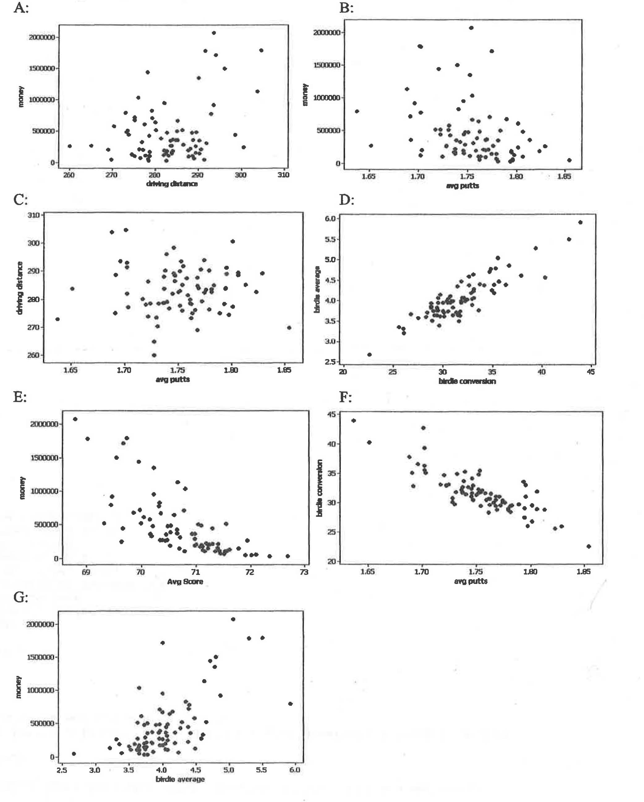
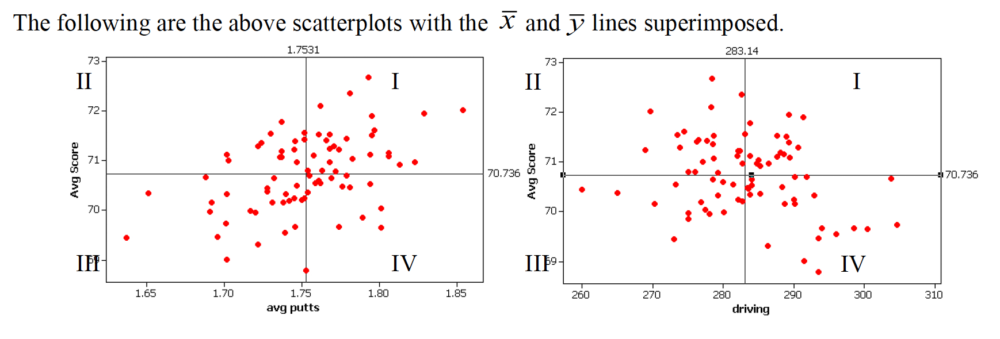

# Correlation & Regression

```{r global_options, include=FALSE}
knitr::opts_chunk$set(message=FALSE, warning=FALSE, fig.height=3.5,
                      fig.width=5, 
                      fig.align = "center", cache=TRUE)
library(tidyverse)
library(infer)
library(mosaic)
```

## 4/16/20 Agenda {#Apr16}
1. Definition of correlation (r)
2. Interpretation of correlation (r)  
3. (Probably not: Inference on $\rho$)


The last topic of the semester will focus on modeling and inference using two quantitative variables.  That is, both the explanatory and the response variables are measured on a numeric scale.   

To get started, consider a handful of variables taken on the top 80 PGA golfers in 2004.  The example comes from Investigation 5.7 in @iscam  

```{r fig.cap = "Investigation 5.7, `Drive for show, putt for dough`, @iscam", out.width="80%", fig.width = 9, fig.align='center', echo=FALSE}

```

Rank the seven scatterplots from strongest negative to strongest positive.  Some questions to ask yourself:

* What would the correlation be if there was a perfect positive relationship?
* What would the correlation be if there was a perfect negative relationship?
* What would the correlation be if there was no relationship?

## Correlation {#cor}

Correlation measures the association between two numerical variables.  [Note, that when describing how two categorical (or one numerical & one categorical) variables vary together, they are said to be *associated* instead of *correlated*.]  

> The *correlation coefficient* measures the strength and direction of the linear association between two numerical variables.

### Estimating Correlation

The value of the correlation is defined as:

\begin{eqnarray*}
r &=& \frac{ \sum_i (x_i  - \overline{x})(y_i - \overline{y})}{\sqrt{\sum_i(x_i - \overline{x})^2} \sqrt{ \sum_i(y_i - \overline{y})^2}}\\
r &=& \frac{1}{n-1} \sum_{i=1}^n \bigg(\frac{x_i - \overline{x}}{s_x} \bigg) \bigg(\frac{y_i - \overline{y}}{s_y} \bigg)
\end{eqnarray*}

```{r fig.cap = "Scatterplots with average X and Y values superimposed.  Investigation 5.7, `Drive for show, putt for dough`, @iscam", out.width="80%", fig.width = 9, fig.align='center', echo=FALSE}

```


For each red dot (on each plot), consider the distance the observation is from the $\overline{X}$ line and the $\overline{Y}$ line.  Is the observation (red dot) above both?  below both?  above one and below the other?  

How does the particular red dot (observation) contribute to the correlation?  In a positive way (to make $r$ bigger)?  In a negative way (to make $r$ smaller)?

Some ideas worth thinking about:

* quadratic plots can have zero correlation yet a perfect functional relationship
* $-1 \leq r \leq 1$
* correlation does not imply causation (ice cream & boating accidents!)
* for inference with $\rho$ as well as $\beta_1$, the data should come from a bivariate normal distribution.  That is, histograms of $X$ and $Y$ should both be normal, and the scatterplot should be a cloud.
* correlation will go down when only a narrow range of X values is represented (see denominator of r).
* measurement error biases the estimate of a correlation coefficient toward zero.


### Coefficient of Determination -- $R^2$

The coefficient of determination ($R^2$) is the square of the correlation (given above).  However, it also has an additional interpretation that will be useful for us.  It can measure how much of the original variability in Y is given by the regression line.  Both SSE and least-squares will be defined below when we fit a line to the scatter plot of observations.

SSE is "sum of squared errors" (think about how $s^2$ is defined).  So, $SSE(\overline{y})$ is the amount the response variable varies on its own.  $SSE(\mbox{least-squares})$ is the amount the response variable varies around the line.

\begin{eqnarray*}
R^2 &=& \frac{SSE(\overline{y}) - SSE(\mbox{least-squares})}{SSE(\overline{y})} \\
 &=& \frac{Var(y_i) - Var(e_i)}{Var(y_i)} \\
 &=& 1 - \frac{Var(e_i)}{Var(y_i)}\\
\end{eqnarray*}

[The value $e_i$ is discussed in detail below, but it is the distance from the observed response variable to the prediction on the line:  $$e_i = y_i - \hat{y}_i.]$$

$R^2$ can be used even in models with many explanatory variables.  As such, the way to think about $R^2$ is in terms of how much of the variability in the response variable was removed (when we learned the values of the explanatory variables).  $R^2$ **is the proportion reduction in the variability of the response variable which is explained by the explanatory variable.**

### Inference for correlation


Note:  we won't actually cover inference for correlation in class, but the notes on inference for correlation are included so that you can see that the process is very similar to all of the other statistics seen in the course to this point.

Parameter: $\rho$  
Statistic: $r$  
SE$_r: \sqrt{\frac{1-r^2}{n-2}}$   
**BUT**, $r$ is only normally distributed when $\rho$ = 0!  Otherwise, the distribution of $r$ from sample to sample is skewed (think about the scenario when $\rho = 0.9$).


#### Hypothesis Testing

\begin{eqnarray*}
H_0:&& \rho = 0\\
H_A:&& \rho \ne 0\\
t^* &=& \frac{r}{SE_r} = \frac{r}{\sqrt{(1-r^2)/(n-2)}}\\
t^* &\sim& t_{n-2}  \mbox{ when } H_0 \mbox{ is true}
\end{eqnarray*}

#### Confidence Interval


If $\rho \ne 0$, then the SE might be okay, but the sampling distribution of $r$ will not be normal (and thus will not be a $t$ when we use the SE).


Let:

\begin{eqnarray*}
z &=& 0.5 \ln \bigg( \frac{1+r}{1-r} \bigg)\\
\xi &=& 0.5 \ln \bigg( \frac{1+\rho}{1-\rho} \bigg)\\
var(z) &=& \sqrt{\frac{1}{n-3}}\\
95\% \mbox{ CI for } \xi : &&\\
z &\pm& 1.96 \cdot \sqrt{\frac{1}{n-3}}\\
\mbox{we're 95% confident that } && \\
&&z - 1.96 \cdot  \sqrt{\frac{1}{n-3}} \leq \xi \leq z + 1.96 \cdot \sqrt{\frac{1}{n-3}}\\
&& a \leq \xi \leq b\\
&& a \leq 0.5 \ln \bigg(\frac{1+\rho}{1-\rho} \bigg) \leq b\\
&& \frac{e^{2a} - 1}{e^{2a} + 1} \leq \rho \leq \frac{e^{2b} - 1}{e^{2b} + 1}
\end{eqnarray*}


See the Cat Jumping^[@iscam, Inv 5.6 & 5.13] example below in section \@ref(ex:cat).


**HT:**  
\begin{eqnarray*}
H_0:&& \rho = 0\\
H_a:&& \rho \ne 0\\
t^* &=& \frac{r}{\sqrt{(1-r^2)/(n-2)}} = \frac{-0.496}{\sqrt{(1-0.496^2) / (18-2)}}= -2.2849\\
p-value &=& 2 \cdot P(t_{18-2} \leq -2.2849) = 2\cdot(pt(-2.2849,16)) = 0.036 \mbox{  (borderline significant)}
\end{eqnarray*}

**CI:**  
\begin{eqnarray*}
95\% && \mbox{CI for } \xi : \\
z &\pm& 1.96 \cdot \sqrt{\frac{1}{n-3}}\\
&&\mbox{we're } 95\% \mbox{ confident that}\\
&& 0.5 \ln\bigg(\frac{1+r}{1-r}\bigg) - 1.96 \cdot  \sqrt{\frac{1}{n-3}} \leq \xi \leq 0.5 \ln\bigg(\frac{1+r}{1-r}\bigg) + 1.96 \cdot \sqrt{\frac{1}{n-3}}\\
&& 0.5 \ln\bigg(\frac{1 - 0.496}{1+0.496}\bigg) - 1.96 \cdot  \sqrt{\frac{1}{18-3}} \leq \xi \leq 0.5 \ln\bigg(\frac{1-0.496}{1+0.496}\bigg) + 1.96 \cdot \sqrt{\frac{1}{18-3}}\\
&& -1.05 \leq \xi \leq -0.04\\
&& \frac{e^{2\cdot -1.05} - 1}{e^{2\cdot -1.05} + 1} \leq \rho \leq \frac{e^{2\cdot -0.04} - 1}{e^{2\cdot -0.04} + 1}\\
&& (-0.781, -0.04)
\end{eqnarray*}


## 4/21/20 Agenda {#Apr21}
1. Least Squares estimation of the line
2. Distribution of the least squares line from sample to sample

## 4/23/20 Agenda {#Apr23}
1. Inferential technical conditions
2. Residual Plots
3. Transformations
4. Prediction Intervals

## Simple Linear Regression

*Regression* is a method that predicts the value of one numerical variable from that of another.  That is, as an extension to describing the degree of linearity of the relationship (correlation), the goal is now to create the best linear model -- often for prediction.  Note that many of the characteristics explored with correlation are applicable for regression.  However, correlation treats $X$ and $Y$ as interchangeable, whereas regression treats $X$ as fixed and known and $Y$ as random and unknown.  As we have previously, we call $X$ the explanatory variable, and $Y$ the response variable.  Again, we do not assume that there is any causal mechanism between $X$ and $Y$ even if they have a strong linear (or otherwise) relationship.


#### Population Model {-}

Notice the Greek letters representing parameters:

\begin{eqnarray*}
E[y|x] &=& \beta_0 + \beta_1 x \\
y_i &=& \beta_0 + \beta_1 x_i + \epsilon_i\\
\epsilon_i &=& y_i -  (\beta_0 + \beta_1 x_i)\\
\end{eqnarray*}

#### Predicted Values {-}

The predicted values of Y from a regression line estimate the *mean value* of $Y$ for all individuals that have a given value of $X$.  Notice the Roman letters (English letters) representing statistics:

\begin{eqnarray*}
\hat{y} &=& b_0 + b_1 x\\
\hat{y}_i &=& b_0 + b_1 x_i\\
y_i &=& b_0 + b_1 x_i + e_i\\
e_i &=& y_i - \hat{y}_i = y_i -  (b_0 + b_1 x_i)\\
\end{eqnarray*}

Notice, that we are predicting the **mean** value of the response variable at a given value of the explanatory variable!  

###  Least Squares estimation of the regression line {#ls}


To find the values of the regression statistics, the sum of squared errors is minimized.

**SSE:** Sum of squared errors (or residuals) is a measure of how closely the line fits to the points.  SSE is the value of the squared deviations calculated at the "best" possible values of $\beta_0$ and $\beta_1$ for a given dataset.

\begin{eqnarray*}
SSE = \sum_i (y_i - \hat{y}_i)^2 = \sum_i (y_i - (b_0 + b_1 x_i) )^2
\end{eqnarray*}
is minimized by the values:
\begin{eqnarray*}
b_0 = \overline{y} - b_1 \overline{x} & \ \ \ \ \ \ \ & b_1 = r \frac{s_y}{s_x}
\end{eqnarray*}

To find the "best" fitting line, we searched for the line that has the smallest residuals (SSE) in some sense.  In particular, the goal is to try to find the line that minimizes the following quantity: $$Q=\sum e_i^2 = \sum (y_i-(b_0+b_1x_i))^2.$$


Finding $b_0$ and $b_1$ that minimize Q is a calculus problem.
$$\frac{dQ}{db_0}=-2\sum (y_i-(b_0+b_1x_i)),\qquad \frac{dQ}{db_1}=-2\sum
x_i(y_i-(b_0+b_1x_i))$$ 
Setting both derivatives equal to 0 and solving for $b_0$ and $b_1$ yields the optimal values, denoted as $b_0$ and $b_1$

One aspect of the optimization problem that is worth pointing out has to do with the role of the two variables of interest $X$ and $Y$.   If we switch the roles of $X$ and $Y$, the best fitting line will be different.  If the relationship was invariant to which variable we choose as a response, then switching the roles of $X$ and $Y$ should give a slope of $1/b_1$, which is not the case.  [Note that the role of $X$ and $Y$ **is** invariant when calculating the correlation but not when calculating the least squares regression line.]

#### Residuals {-}

Residuals measure the scatter of points above and below the least squares regression line.  We use the residuals in many of the calculations and interpretations of the model.  Indeed, the goal of the linear regression is to find a model that has small residuals.  That is, ideally, the known variable $X$ will tell us all there is to know about the unknown variable $Y$.

\begin{eqnarray*}
e_i &=& (y_i - \hat{y}_i)\\
MSE&=& \frac{\sum_i (y_i - \hat{y}_i)^2}{n-2} = \frac{\sum_i (e_i)^2}{n-2} = s^2\\
SSE &=& \sum_i (y_i - \hat{y}_i)^2 = \sum_i (e_i)^2\\
R^2 &=& 1 - \frac{Var(e_i)}{Var(y_i)}
\end{eqnarray*}


### Inference on the slope, $\beta_1$ {#infbeta1}

#### SE of the slope {-}

\begin{eqnarray*}
SE(b_1) &=& \sqrt{\frac{MSE}{\sum_i (x_i - \overline{x})^2}} = \sqrt{\frac{MSE}{(n-1)s_x^2}} = = \sqrt{\frac{\frac{\sum_i (y_i - \hat{y}_i)^2}{n-2}}{(n-1)s_x^2}}\\
\end{eqnarray*}

Just like any other statistic, the value of $b_1$ can be calculated for every sample.  The manner in which $b_1$ varies from sample to sample becomes the sampling distribution of the sample slope.  The SE of the slope will be the standard deviation associated with the sampling distribution of the slope.  The resulting inference theory is very similar to that which we saw with the mean.  The CLT describes $b_1$ to have a normal distribution, and estimating the $SE(b_1)$ induces extra variability which leads to a t-score test statistic with a t-distribution with df = $n-2$.

\begin{eqnarray*}
\mbox{t-score} = \frac{b_1 - \beta_1}{SE(b_1)} \sim t_{n-2}
\end{eqnarray*}

#### CI for the slope {-}

\begin{eqnarray*}
b_1- t^*_{\alpha/2, n-2} SE(b_1) \leq \beta_1 \leq b_1 + t^*_{\alpha/2, n-2} SE(b_1)
\end{eqnarray*}


See the Housing Prices^[@iscam, Inv 5.14] example below in section \@ref(ex:houses).

\begin{eqnarray*}
t_{\alpha/2,n-2} &=& qt(.975, 18-2) = 2.1199\\
SE(b_1) &=& 26.4\\
b_1 &=& 202\\
b_1 &\pm& t_{\alpha/2, n-2} SE(b_1): 202 \pm 2.1199 \cdot 26.4\\
&& (146.03, 257.97)\\
\end{eqnarray*}

That is, we are 95\% confident that the true average change in price associated with an additional square foot of house is between \$146.03 and \$257.97.


#### HT for the slope {-}

As mentioned previously,
\begin{eqnarray*}
\mbox{t-score} = \frac{b_1 - \beta_1}{SE(b_1)} \sim t_{n-2}
\end{eqnarray*}

Typically, interested is in testing whether or not the slope is zero.  The null hypothesis of $H_0: \beta_1 = 0$ addresses whether there is a non-zero linear relationship between $X$ and $Y$:

\begin{eqnarray*}
H_0:&& \mbox{ the slope of the regression line is zero}, \beta_1=0\\
H_A:&& \mbox{ the slope of the regression line is not zero}, \beta_1 \ne 0\\
\end{eqnarray*}

As with previous tests, the alternative can be one- or two-sided (depending on the research question).


Again, back to the housing data... (consider a two sided test)
\begin{eqnarray*}
t^* &=& 7.67\\
p-value &=& 2 \cdot P(t_{16} \geq 7.67) = 2 \cdot (1-pt(7.67, 16)) \approx 0
\end{eqnarray*}


#### Regression Technical Conditions {-}

* **L:** At each value of X, there is a population of possible Y-values whose mean lies on the "true" regression line (**linearity**)
* **I:** At each value of X, the Y-measurements represent a random sample from the population of possible Y-values (**independence**)  [Consider this example of lack of independence.  The researcher is trying to determine whether the number of pieces in a puzzle is linearly associated with the time to complete the puzzle.  At first we choose 2 people and let them do 10 puzzles each.  Then we let 20 independent people do the puzzles.  The first experiment will create a slope which is particular to the two people sampled (it may or may not be close to the parameter).  The second one will create a slope close to the 20 people sampled.  Note that the effective variability of the first model is based on n=2, but we *think* it is based on n=20 (if we don't notice the lack of independence).  The second slope is based on n=20, and so it will have the correct associated variability.]
* **N:** At each value of X, the distribution of possible Y-values is normal (**normality**)
* **E:** The variance of Y-values is the same at all values of X (**equal variance**)

#### Residual Plots {-}


Within a residual plot, you should be looking for the same types of things you want in a scatter plot:  
* a roughly symmetric cloud of points above and below the horizontal line at zero, with a higher density of points close to the line than far from the line,  
* little noticeable curvature as we move from left to right along the X-axis, and  
* approximately equal variance of points above and below the line at all values of X.  


## 4/28/20 Agenda {#Apr28}
1. Multiple Linear Regression

## 4/30/20 Agenda {#Apr30}
1. Choosing model
2. Residual Plots
3. Prediction Intervals (harder to plot!)


## Multiple Linear Regression {#MLR}

### Model selection {#MLRmod}

### Checking model assumptions


## R code for regression: 


### Example: Cat Jumping^[@iscam, Inv 5.6 & 5.13] (Correlation & SLR) {#ex:cat}


Consider the cat data given in Investigations 5.6 and 5.13.  The idea is to understand cat jumping velocity as a function of body characteristics. Note that the correlation $r=-0.496$  between bodymass and velocity.


```{r}
cats <- read_table2("http://www.rossmanchance.com/iscam2/data/CatJumping.txt")

ggplot(cats, aes(x=bodymass, y = velocity)) +
  geom_point() +
  geom_smooth(method = "lm", se=FALSE)
```


####  Correlation {-}
```{r}
cats %>%
  select(bodymass, velocity) %>%
  cor()
```


#### Simple Linear Regression {-}

```{r}
summary(lm(velocity ~ bodymass, data = cats))
```


An alternative way to work with the output is in specific pieces (instead of the entire summary output).

```{r}
library(broom)

lm(velocity ~ bodymass, data = cats) %>% tidy(conf.int = TRUE)
```


#### Residual Plot {-}

And to work with the residuals, use `augment()`.

```{r}
lm(velocity ~ bodymass, data = cats) %>% augment()

lm(velocity ~ bodymass, data = cats) %>% augment() %>%
  ggplot(aes(x = .fitted, y = .resid)) + 
  geom_point() +
  geom_hline(yintercept = 0)
```


### Example: Housing Prices^[@iscam, Inv 5.14]  (SLR & MLR & Prediction) {#ex:houses}

```{r message=FALSE, warning=FALSE}
library(GGally)
house = read.table("http://www.rossmanchance.com/iscam2/data/housing.txt", 
                   header=TRUE, sep="\t")
names(house)
```

#### Descriptive Statistics {-}

A good first step is to investigate how all the variables relate to one another.  The `ggpairs` function come from the R package `GGally`.

```{r} 
ggpairs(house, columns = c(1,2,4,5))
```

#### Simple Linear Regression {-}

```{r}
mod.sqft <- lm(price~sqft, data = house)
mod.sqft %>% tidy()

mod.bed <- lm(price ~ bedrooms, data=house)
mod.bed %>% tidy()
```

The p-values for both explanatory variables (sqft and bedrooms) are significant.  Sqft seems more significant, and indeed, the first model has a higher $R^2$ - that is, a higher proportion of the variability in price is explained by sqft (42.07%) than by number of bedrooms (8.08%).  

```{r}
mod.sqft %>% glance()
mod.bed %>% glance()
```


However, it is important for us to ask whether either of the relationships actually fit the technical conditions of the linear regression model.  We can see from the pairs plots that the relationships look **L**inear, we'll assume the variables were collected **I**ndependently, but the **N**ormality and the **E**quality of the error structure we can check using residual plots.

```{r}
mod.sqft %>% augment () %>%
  ggplot(aes(x = .fitted, y = .resid))+ 
  geom_point() + 
  geom_hline(yintercept=0) +
  ggtitle("Residual plot for price as a function of sqft")

mod.bed %>% augment () %>%
  ggplot(aes(x = .fitted, y = .resid))+ 
  geom_point() + 
  geom_hline(yintercept=0) +
  ggtitle("Residual plot for price as a function of bedrooms")
```

For both of the plots, it seems like the residuals have higher variability for positive residuals.  Additionally, it seems that the variability of the residuals increases for larger fitted observations. 

A natural log transformation should fix both of these problems.

```{r}
mod.lnsqft <- lm(log(price)~sqft, data = house)
mod.lnbed <- lm(log(price) ~ bedrooms, data=house)


mod.lnsqft %>% augment () %>%
  ggplot(aes(x = .fitted, y = .resid))+ 
  geom_point() + 
  geom_hline(yintercept=0) +
  ggtitle("Residual plot for ln(price) as a function of sqft")

mod.lnbed %>% augment () %>%
  ggplot(aes(x = .fitted, y = .resid))+ 
  geom_point() + 
  geom_hline(yintercept=0) +
  ggtitle("Residual plot for ln(price) as a function of bedrooms")
```


Though no residual plot will ever look perfect, these residual plots seem to fit the technical conditions of the model better than the untransformed data.


#### Multiple Linear Regression {-}

Because the price variable had a large skew (and the `ln()` transformation helped the residuals), the following models will all use `ln(price)` as the response variable.   What happens when we try to predict `price` (actually `ln(price)`, here) using BOTH `sqft` and `bedrooms`?

Note:  the natural log funciton in R is `log()`.

```{r}
lm(log(price) ~ sqft + bedrooms, data=house) %>% tidy()
lm(log(price) ~ sqft + bedrooms, data=house) %>% glance()
```

```{r}
lm(log(price) ~ sqft + baths, data=house) %>% tidy()
lm(log(price) ~ sqft + baths, data=house) %>% glance()
```

```{r}
lm(log(price) ~ sqft + bedrooms + baths, data=house) %>% tidy()
lm(log(price) ~ sqft + bedrooms + baths, data=house) %>% glance()
```


**Sqft & bedrooms**

Although the $R^2$ value went up (44.84% of variability in log price is explained by sqft and bedrooms), the p-value on bedrooms isn't significant.  The p-value here can be interpreted as a hypothesis test on the slope coefficient given the other variables in the model.

0.353 = P(a slope of -.06827 or more extreme *if sqft is in the model* and there is no relationship between bedrooms and price)

Our output says that once we have sqft in the model, we don't actually need to know anything about the number of bedrooms (even though bedrooms was a significant predictor on its own).

**Sqft & bathrooms**

Seems like we *really* don't need bathrooms!  The information about `sqft` is sufficient for predicting the price, and information about bathrooms doesn't help much at all.

**Final model**

The final model will be run on log(price) using only sqft. Note that the coefficients and the $R^2$ values change slightly (from the original analysis) because the response variable is logged.

```{r}
summary(mod.lnsqft)
```


#### Prediction {-}

As with the prediction intervals we had when we had a single sample, we can now create intervals for either an average (a confidence interval) of an individual (a prediction interval).  

##### Confidence interval: {-}

```{r}
predict(mod.lnsqft, newdata=data.frame(sqft=2000), interval="confidence")
```

I am 95% confident that the true average log price for a 2000 sqft home is between 12.79 ln\$ and 12.99 ln\$.  (The predicted value is in natural-log-dollars ... which is hard to interpret , but back-transforming can be a little tricky and beyond the scope of this semester).

##### Prediction interval: {-}

```{r}
predict(mod.lnsqft, newdata=data.frame(sqft=2000), interval="prediction")
```

I am 95% of homes with 2000 sqft are between 11.99 ln\$ and 13.79 ln\$.  Now back-transforming is easy (because there are no averages), so 95% of homes with 2000 sqft are between $161,126 and $977,301 (which are just $e^{11.98994}$ and $e^{13.79255}$).

##### Plotting confidence bounds: {-}


A **confidence** interval around the line gives bounds on the parameter represented by the line.  So we are 95% confident that the true population line lies within the bounds.  Note that the interval is wider at the endpoints (because the variability is higher at the ends).

```{r}
houseConf <- mod.lnsqft %>% augment() %>%
  cbind(predict(mod.lnsqft, interval="confidence") )  # cbind binds the columns together

houseConf %>% head()

ggplot(houseConf, aes(x=sqft)) + 
  geom_point(aes(y=log.price.)) + 
  geom_line(aes(y=.fitted)) +
  geom_ribbon(aes(ymin=lwr, ymax=upr), fill="blue", alpha=0.2)
```

A **prediction** interval around the line bounds the individual points.  That is, 95% of the observations are captured inside the interval.  As with the confidence interval, the prediction interval is also wider at the ends, but it is harder to see in prediction intervals than confidence intervals

```{r}
housePred <- mod.lnsqft %>% augment() %>%
  cbind(predict(mod.lnsqft, interval="prediction") )  # cbind binds the columns together

housePred %>% head()

ggplot(housePred, aes(x=sqft)) + 
  geom_point(aes(y=log.price.)) + 
  geom_line(aes(y=.fitted)) +
  geom_ribbon(aes(ymin=lwr, ymax=upr), fill="blue", alpha=0.2)
```


##### Predicting with more than one explanatory variable: {-}

The predict function still works to give estimates of the average value and the predicted individual values, but the plot is now much harder to draw because with three explanatory variables, we would need a 4-d plot to visualize the model and the predictions.

```{r}
sqftbedbathlm = lm(log(price)~sqft + bedrooms + baths, data=house)

predict(sqftbedbathlm, 
        newdata=data.frame(sqft=2000, bedrooms=3, baths=2), 
        interval="confidence", level=.95)

predict(sqftbedbathlm, 
        newdata=data.frame(sqft=2000, bedrooms=3, baths=2), 
        interval="prediction", level=.95)
```

Again, it is hard to back-transform the prediction for the **average** (we end up thinking about it as a median), but we can back-transform the interval of individual prices.  95% of homes with 2000sqft, 3 bedrooms, and 2 baths cost between $164,312 and $1,011,356.


